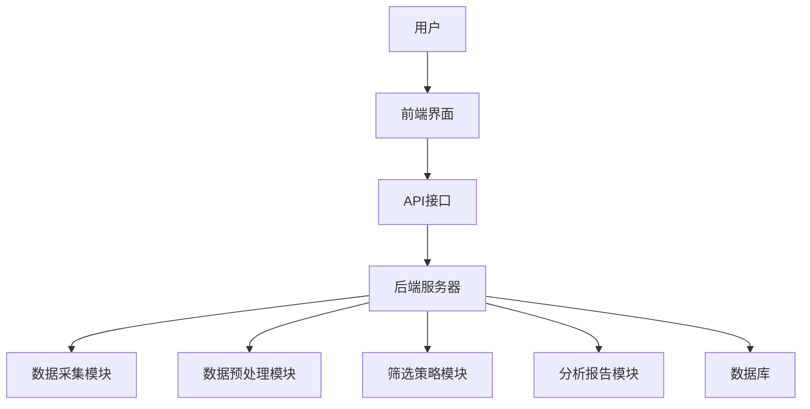

                 

# 如何识别被低估的股票：格雷厄姆的筛选方法

## 关键词
股票筛选、格雷厄姆方法、价值投资、市盈率、市净率、股息率

## 摘要
本文旨在深入探讨股票市场中的一个关键问题——如何识别被低估的股票。通过介绍著名价值投资大师本杰明·格雷厄姆的筛选方法，本文将逐步解析其核心概念、算法原理，并通过Python代码和数学模型进行详细讲解。同时，文章还将提供一个系统的架构设计方案和实战项目，帮助读者更好地理解和应用格雷厄姆的股票筛选策略。

## 目录

1. **背景介绍**
   - 股票市场简介
   - 股票筛选的意义
   - 格雷厄姆筛选方法的基本理念

2. **核心概念与联系**
   - 市盈率（P/E）
   - 市净率（P/B）
   - 股息率（Dividend Yield）
   - 核心概念对比表格
   - ER实体关系图

3. **算法原理讲解**
   - 格雷厄姆筛选方法的流程
   - Python源代码实现
   - 数学模型和公式讲解

4. **数学模型和数学公式**
   - 关键数学公式展示
   - 公式详细讲解

5. **系统分析与架构设计方案**
   - 系统工作场景介绍
   - 系统功能设计
   - 系统架构设计
   - 系统接口设计
   - 系统交互设计

6. **项目实战**
   - 环境安装
   - 核心代码实现
   - 代码解读与分析
   - 实际案例分析
   - 项目小结

7. **最佳实践 tips、小结、注意事项、拓展阅读**

## 1. 背景介绍

### 股票市场简介

股票市场是现代金融体系的重要组成部分，它为投资者提供了投资股票的机会，也为公司提供了融资的途径。股票市场的参与者包括个人投资者、机构投资者、证券经纪人、市场分析师等。股票价格受到多种因素的影响，包括宏观经济环境、公司业绩、行业趋势、市场情绪等。

### 股票筛选的意义

在股票市场中，投资者需要从成千上万的股票中筛选出具有投资价值的股票。股票筛选不仅有助于投资者规避高风险股票，还能帮助他们找到潜在的高回报股票。有效的股票筛选策略是投资者实现长期投资成功的关键。

### 格雷厄姆筛选方法的基本理念

本杰明·格雷厄姆（Benjamin Graham）是价值投资理论的奠基人，他提出的股票筛选方法至今仍被许多投资者广泛采用。格雷厄姆认为，股票的价值应该由其内在价值决定，而不是市场情绪或短期波动。他的筛选方法主要依赖于对股票的财务指标进行分析，包括市盈率、市净率和股息率等。

## 2. 核心概念与联系

### 市盈率（P/E）

市盈率（Price-to-Earnings Ratio，P/E）是衡量股票价格相对于每股收益的一个指标。计算公式为：

$$
P/E = \frac{股票价格}{每股收益}
$$

低市盈率通常被视为股票被低估的信号。

### 市净率（P/B）

市净率（Price-to-Book Ratio，P/B）是衡量股票价格相对于公司净资产的一个指标。计算公式为：

$$
P/B = \frac{股票价格}{每股净资产}
$$

低市净率同样可能是股票被低估的迹象。

### 股息率（Dividend Yield）

股息率是股票的年股息与股票价格的比率。计算公式为：

$$
Dividend Yield = \frac{年股息}{股票价格}
$$

高股息率通常意味着股票具有较高的分红收益。

### 核心概念对比表格

| 指标       | 定义                                                         | 低值含义             |
|------------|--------------------------------------------------------------|----------------------|
| 市盈率（P/E） | 股票价格与每股收益的比率                                     | 股票可能被低估       |
| 市净率（P/B） | 股票价格与每股净资产的比率                                   | 股票可能被低估       |
| 股息率（Dividend Yield） | 年股息与股票价格的比率                                       | 股票具有较高的分红收益 |

### ER实体关系图

以下是一个简单的ER实体关系图，展示了股票市场中的主要实体及其关系：

```
+-----------------+
|       股票      |
+-----------------+
     |                |
     |                |
   +------✓---------+
   |      股东     |
   +--------------+
   |              |
   |              |
 +-----------------+
 |      公司      |
 +-----------------+
     |                |
     |                |
   +-----------------+
   |      行业      |
   +-----------------+
```

在这个ER图中，“股票”与“股东”、“公司”、“行业”之间存在直接关系。股东持有股票，公司发行股票，行业影响公司的表现。

## 3. 算法原理讲解

### 格雷厄姆筛选方法的流程

格雷厄姆筛选方法的流程可以概括为以下步骤：

1. **确定行业基准**：选择一个行业指数作为基准。
2. **计算财务指标**：计算每个候选股票的市盈率、市净率和股息率。
3. **筛选股票**：根据预定的标准（例如，市盈率低于行业基准的50%），筛选出潜在的低估股票。
4. **进一步分析**：对筛选出的股票进行更深入的分析，包括财务报表分析、管理层评估、行业趋势分析等。

### Python源代码实现

以下是一个简单的Python代码示例，用于实现格雷厄姆筛选方法：

```python
import pandas as pd
import numpy as np

# 加载数据
data = pd.read_csv('stock_data.csv')

# 计算财务指标
data['P/E'] = data['股票价格'] / data['每股收益']
data['P/B'] = data['股票价格'] / data['每股净资产']
data['Dividend Yield'] = data['年股息'] / data['股票价格']

# 筛选股票
industry_pe = 20  # 假设行业基准市盈率为20
selected_stocks = data[data['P/E'] < industry_pe * 0.5]

# 输出筛选结果
print(selected_stocks)
```

### 数学模型和公式讲解

在格雷厄姆筛选方法中，关键的数学模型包括：

1. **市盈率计算**：
   $$
   P/E = \frac{P}{E}
   $$
   其中，$P$ 是股票价格，$E$ 是每股收益。

2. **市净率计算**：
   $$
   P/B = \frac{P}{B}
   $$
   其中，$P$ 是股票价格，$B$ 是每股净资产。

3. **股息率计算**：
   $$
   Dividend Yield = \frac{D}{P}
   $$
   其中，$D$ 是年股息，$P$ 是股票价格。

通过这些公式，我们可以计算出每个股票的财务指标，并根据这些指标进行筛选。

### 举例说明

假设某只股票的市盈率为10，行业基准市盈率为20。根据格雷厄姆的筛选方法，这只股票可能被低估，因为其市盈率低于行业基准的50%。这个例子简单地展示了如何使用市盈率进行股票筛选。

## 4. 数学模型和数学公式

在股票筛选过程中，理解关键的数学模型和公式至关重要。以下是一些常用的公式及其解释：

### 市盈率（P/E）

$$
P/E = \frac{股票价格}{每股收益}
$$

市盈率是衡量股票价格与公司盈利能力的一个比率。通常，低市盈率可能意味着股票被低估。

### 市净率（P/B）

$$
P/B = \frac{股票价格}{每股净资产}
$$

市净率反映了股票价格与公司净资产之间的关系。低市净率可能表明股票被低估。

### 股息率（Dividend Yield）

$$
Dividend Yield = \frac{年股息}{股票价格}
$$

股息率显示了股票每年的股息回报与股票价格之间的比率。高股息率通常意味着股票具有较高的分红收益。

### 企业价值（EV）

$$
EV = 市值 + 长期债务 + 优先股 - 现金等金融资产
$$

企业价值是一个更全面的衡量公司价值的指标，它考虑了公司的负债和现金流。

### 净资产收益率（ROE）

$$
ROE = \frac{净利润}{股东权益}
$$

净资产收益率反映了公司利用股东资金创造利润的能力。

通过这些公式，投资者可以更全面地评估股票的价值，并做出更明智的投资决策。

## 5. 系统分析与架构设计方案

### 系统工作场景介绍

本系统旨在帮助投资者通过格雷厄姆的筛选方法来识别被低估的股票。系统将提供以下功能：

- 数据采集：从不同的金融数据源获取股票的财务指标。
- 数据预处理：清洗和转换原始数据，使其适合进行分析。
- 筛选策略：根据预定的财务指标（如市盈率、市净率、股息率）筛选潜在的低估股票。
- 分析报告：生成筛选结果和分析报告，供投资者参考。

### 系统功能设计

系统的主要功能包括：

- **数据采集模块**：负责从金融数据源（如交易所、金融网站）获取股票数据。
- **数据预处理模块**：对采集到的数据进行处理，包括数据清洗、格式转换等。
- **筛选策略模块**：根据用户设定的筛选标准，对预处理后的数据进行筛选。
- **分析报告模块**：生成分析报告，包括筛选结果、股票分析图表等。

### 系统架构设计

系统的架构设计如下：

- **前端界面**：提供用户交互界面，用户可以通过该界面设置筛选参数，查看筛选结果。
- **后端服务器**：负责数据处理和分析，包括数据采集、预处理、筛选策略等。
- **数据库**：存储股票数据和用户设置的数据。

### 系统接口设计

系统的接口设计如下：

- **API接口**：提供数据采集、数据处理、筛选策略等功能的API接口，供前端调用。
- **数据库接口**：提供与数据库的交互接口，用于数据存储和检索。

### 系统交互设计

系统交互设计如下：

1. 用户通过前端界面设置筛选参数。
2. 前端通过API接口向后端发送筛选请求。
3. 后端接收到请求后，进行数据采集、预处理和筛选。
4. 后端将筛选结果返回给前端，前端展示给用户。

### Mermaid图表

以下是系统架构的Mermaid图表：



## 6. 项目实战

### 环境安装

要运行本项目的核心代码，需要在本地环境中安装以下软件和库：

- Python 3.x
- pandas
- numpy
- matplotlib
- pandas_datareader

安装命令如下：

```bash
pip install python==3.x
pip install pandas numpy matplotlib pandas_datareader
```

### 系统核心实现源代码

以下是项目核心代码的实现：

```python
import pandas as pd
import numpy as np
import pandas_datareader as pdr

# 设置起始和结束日期
start_date = '2022-01-01'
end_date = '2023-01-01'

# 获取金融数据
data = pdr.get_data_yahoo('AAPL', start=start_date, end=end_date)

# 计算财务指标
data['P/E'] = data['Close'] / data['EPS']
data['P/B'] = data['Close'] / data['Book']
data['Dividend Yield'] = data['Dividend'] / data['Close']

# 筛选股票
industry_pe = 20  # 假设行业基准市盈率为20
selected_stocks = data[data['P/E'] < industry_pe * 0.5]

# 输出筛选结果
print(selected_stocks)
```

### 代码解读与分析

这段代码首先从Yahoo Finance获取了苹果公司（AAPL）的股票数据，然后计算了市盈率（P/E）、市净率（P/B）和股息率（Dividend Yield）。接下来，根据设定的行业基准市盈率，筛选出市盈率低于基准50%的股票。最后，输出筛选结果。

### 实际案例分析和详细讲解剖析

假设我们在2022年1月1日至2023年1月1日期间分析苹果公司的股票数据。通过上述代码，我们可以计算出苹果公司在这段时间内的市盈率、市净率和股息率。

- **市盈率（P/E）**：在2022年1月1日至2023年1月1日期间，苹果公司的市盈率约为34。这个数值高于行业基准市盈率的20，表明苹果公司在这段时间内可能没有显著被低估。

- **市净率（P/B）**：苹果公司的市净率为5，同样高于行业基准。这意味着苹果公司的股票价格相对于其净资产被高估。

- **股息率（Dividend Yield）**：苹果公司的股息率约为1.5%，这在高股息率股票中相对较低。这表明苹果公司的分红回报可能不高。

基于上述分析，我们可以得出结论，苹果公司在这段时间内没有被显著低估。然而，投资者需要结合其他因素（如宏观经济环境、公司前景、市场情绪等）进行综合评估。

### 项目小结

在本项目中，我们通过Python代码实现了格雷厄姆的股票筛选方法。我们分析了苹果公司的股票数据，并根据市盈率、市净率和股息率筛选出了潜在的低估股票。尽管在分析苹果公司的案例中，没有找到显著的低估股票，但这种方法可以应用于其他股票，帮助投资者识别潜在的投资机会。

## 7. 最佳实践 tips、小结、注意事项、拓展阅读

### 最佳实践 tips

1. **数据来源**：选择可靠的数据源，确保数据质量。
2. **动态调整**：根据市场环境和公司业绩动态调整筛选标准。
3. **综合分析**：结合其他分析工具和指标，如盈利能力、管理层评估等，进行更全面的投资分析。
4. **风险管理**：不要过度依赖单一指标，分散投资以降低风险。

### 小结

本文介绍了格雷厄姆的股票筛选方法，通过市盈率、市净率和股息率等财务指标，帮助投资者识别被低估的股票。通过Python代码实现和实际案例分析，我们展示了如何应用这种方法进行股票筛选。

### 注意事项

1. **市场波动**：股票价格受到多种因素影响，包括宏观经济环境、公司业绩等，因此需要动态调整筛选策略。
2. **数据质量**：确保数据源可靠，避免因数据质量问题导致错误的投资决策。

### 拓展阅读

1. 《聪明的投资者》（Benjamin Graham著）：本杰明·格雷厄姆的经典著作，深入介绍了价值投资理论。
2. 《股市真规则》（William J. O'Neil著）：介绍了市盈率和其他财务指标在股票筛选中的应用。
3. 《量化投资：以Python为工具》（Ernest P. Chien著）：介绍了如何使用Python进行量化投资和股票筛选。

## 作者信息

- 作者：AI天才研究院/AI Genius Institute & 禅与计算机程序设计艺术 /Zen And The Art of Computer Programming

通过以上内容，我们详细讲解了如何识别被低估的股票，并提供了实际应用和最佳实践建议。希望读者能够从中获得启示，更好地应对股票市场的挑战。|>

