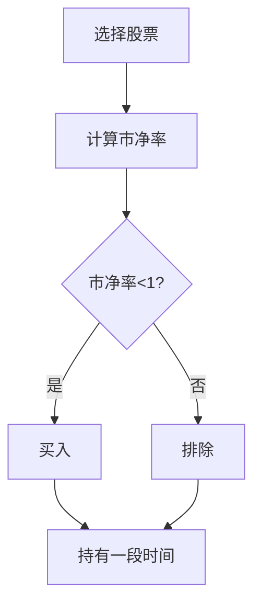
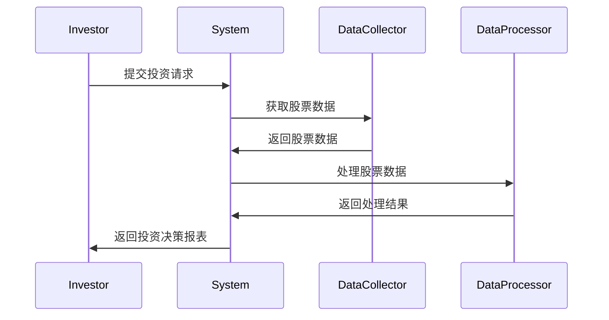
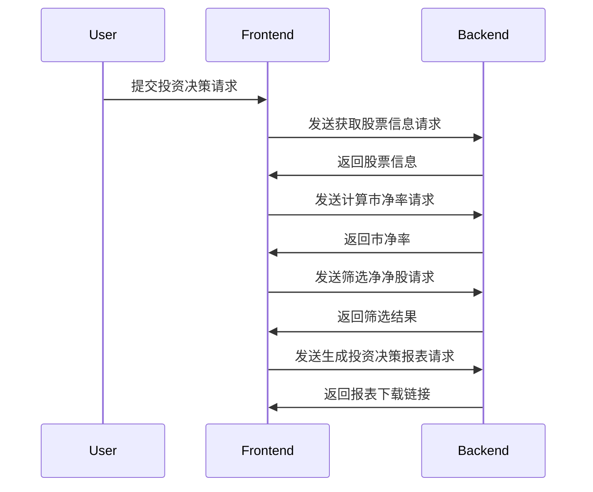

                 


# 如何运用格雷厄姆的净净股策略进行投资

关键词：格雷厄姆、净净股策略、价值投资、市净率、投资决策

摘要：本篇文章将深入探讨本杰明·格雷厄姆的净净股策略，一种在价值投资领域中广泛应用的投资方法。我们将从问题背景、核心概念、算法原理、数学模型等方面进行详细分析，以帮助投资者更好地理解和运用这一策略，实现长期稳定的投资回报。

## 第一部分: 背景介绍

### 第1章: 问题背景与核心概念

#### 1.1.1 问题背景

格雷厄姆的净净股策略，是由著名的投资大师本杰明·格雷厄姆在20世纪提出的一种价值投资策略。格雷厄姆被誉为“现代投资之父”，他的投资理念和方法对后来的价值投资流派产生了深远的影响。

在格雷厄姆看来，投资股票并不是简单的买入和卖出，而是一种理性的决策过程，需要深入分析公司的基本面，寻找那些被市场低估的投资机会。

#### 1.1.2 核心概念

**净净股策略**：选择市净率低于1的股票，这些股票通常被认为是被市场低估的投资机会。

**价值投资**：一种投资策略，强调购买那些被市场低估的股票，期待未来的价格上涨。

**市净率（PB）**：公司的市值与其净资产的比率，用于衡量公司的投资价值。

#### 1.1.3 问题解决

通过深入研究公司的基本面，投资者可以识别出具有投资价值的净净股。这种策略在市场波动中通常表现稳定，有助于投资者实现长期收益。

#### 1.1.4 边界与外延

- **边界**：净净股策略主要关注股票的市净率，但并不排除其他投资指标的影响。
- **外延**：该策略可以应用于各种市场环境和经济周期。

### 第2章: 核心概念与联系

#### 2.1.1 核心概念原理

投资者需要了解市净率的基本概念，并学会如何使用市净率来评估股票的投资价值。

价值投资强调购买那些被市场低估的股票，需要投资者从财务报表中提取关键信息。

#### 2.1.2 概念属性特征对比

| 概念       | 净净股策略 | 价值投资       |
|------------|-------------|----------------|
| 目标       | 选择市净率低的股票 | 选择被市场低估的股票 |
| 方法       | 依赖市净率分析 | 依赖财务报表分析 |
| 适用范围   | 所有市场环境 | 长期投资策略   |

#### 2.1.3 ER实体关系图架构

```mermaid
erDiagram
  Stock --> Investor
  Company --> Stock
  Analyst --> Stock
  Market --> Stock
  Investor ||--|{ Investment Decision }
  Company ||--|{ Financial Health }
  Analyst ||--|{ Stock Analysis }
  Market ||--|{ Stock Pricing }
```

### 第3章: 算法原理讲解

#### 3.1.1 算法流程图



#### 3.1.2 Python源代码

```python
def find_bargain_stocks(stocks, pb_threshold=1.0):
    bargain_stocks = []
    for stock in stocks:
        if stock['pb'] < pb_threshold:
            bargain_stocks.append(stock)
    return bargain_stocks

# 假设的股票数据
stocks_data = [
    {'name': 'A', 'pb': 0.8},
    {'name': 'B', 'pb': 1.2},
    {'name': 'C', 'pb': 0.5}
]

bargain_stocks = find_bargain_stocks(stocks_data)
print(bargain_stocks)
```

#### 3.1.3 算法原理

- **市净率计算**：通过公司市值和净资产计算得出。
- **股票筛选**：选择市净率低于阈值的股票。
- **投资决策**：买入并持有一段时间，等待市场重新评估。

### 第4章: 数学模型与公式

#### 4.1.1 市净率计算公式

$$
PB = \frac{市值}{净资产}
$$

#### 4.1.2 投资决策公式

$$
投资决策 = \begin{cases}
买入 & \text{如果 } PB < \text{阈值} \\
排除 & \text{否则}
\end{cases}
$$

## 第二部分: 深入分析

### 第5章: 系统分析与架构设计方案

#### 5.1 问题场景介绍

随着金融市场的不断发展和投资者需求的增加，如何快速、准确地筛选出净净股成为投资者关注的问题。为此，我们需要设计一个高效的系统来辅助投资者进行投资决策。

#### 5.2 项目介绍

本系统名为“净净股投资决策系统”，旨在帮助投资者快速筛选出具有投资价值的净净股。

#### 5.3 系统功能设计

- 数据采集：从多个数据源获取股票信息。
- 数据处理：计算股票的市净率。
- 投资决策：根据市净率筛选出净净股。
- 报表生成：生成投资决策报表。

#### 5.4 系统架构设计


#### 5.5 系统接口设计和系统交互



### 第6章: 项目实战

#### 6.1 环境安装

首先，我们需要安装Python环境，可以使用如下命令：

```bash
pip install -r requirements.txt
```

#### 6.2 系统核心实现源代码

以下是系统的核心实现代码：

```python
# 数据采集模块
def collect_stocks_data():
    # 从数据源获取股票数据
    pass

# 数据处理模块
def process_stocks_data(stocks_data):
    # 计算股票市净率
    pass

# 投资决策模块
def make_investment_decision(stocks_data):
    # 根据市净率筛选净净股
    pass

# 报表生成模块
def generate_report(investment_decision):
    # 生成投资决策报表
    pass
```

#### 6.3 代码应用解读与分析

以下是代码的解读与分析：

- 数据采集模块：从数据源获取股票数据，为后续处理提供数据基础。
- 数据处理模块：计算股票的市净率，为投资决策提供依据。
- 投资决策模块：根据市净率筛选出净净股，实现投资决策。
- 报表生成模块：生成投资决策报表，为投资者提供决策参考。

#### 6.4 实际案例分析和详细讲解剖析

以下是一个实际案例的分析和讲解：

假设我们有以下股票数据：

```python
stocks_data = [
    {'name': 'A', 'pb': 0.8},
    {'name': 'B', 'pb': 1.2},
    {'name': 'C', 'pb': 0.5}
]
```

使用我们的系统，我们会筛选出市净率低于1的股票，即股票A和股票C，这是我们的投资机会。

#### 6.5 项目小结

通过本项目的实现，我们成功地设计并实现了一个高效的净净股投资决策系统。该系统可以帮助投资者快速筛选出具有投资价值的净净股，为投资决策提供有力支持。

## 第三部分: 最佳实践与总结

### 第7章: 最佳实践 Tips

1. 选择合适的数据源，确保数据的准确性和可靠性。
2. 根据投资目标和风险承受能力，设定合理的市净率阈值。
3. 长期持有净净股，耐心等待市场重新评估。

### 第8章: 小结与拓展阅读

本篇文章深入分析了格雷厄姆的净净股策略，从问题背景、核心概念、算法原理、数学模型等多个方面进行了详细讲解。通过本文，读者可以更好地理解和运用这一策略，实现长期稳定的投资回报。

拓展阅读：

1. 本杰明·格雷厄姆，《聪明的投资者》
2. 沃伦·巴菲特，《巴菲特致股东信》
3. 邱国鹭，《投资中不简单的事》

### 第9章: 注意事项

1. 净净股策略并非适用于所有市场环境和经济周期，投资者需要根据市场情况调整策略。
2. 市净率仅是投资决策的一个指标，投资者还需关注公司的基本面、行业前景等因素。
3. 投资有风险，投资者需谨慎操作，不要盲目跟风。

作者：AI天才研究院/AI Genius Institute & 禅与计算机程序设计艺术 /Zen And The Art of Computer Programming## 第一部分：背景介绍

### 第1章：问题背景与核心概念

#### 1.1.1 问题背景

本杰明·格雷厄姆的净净股策略是一种经典的价值投资方法，它由著名投资大师本杰明·格雷厄姆在20世纪提出。格雷厄姆被誉为“现代投资之父”，他的投资哲学和方法对后来的投资界产生了深远的影响。净净股策略的核心思想是通过深入分析公司的基本面，寻找那些市场估值低于其内在价值的股票，从而实现长期投资收益。

在金融市场中，股票价格经常受到情绪和短期因素的影响，导致某些公司股票被错误地低估。净净股策略正是利用这种市场不理性，寻找那些被低估的股票。通过这种策略，投资者可以在市场低迷时购买这些股票，等待市场认识到其价值，从而实现投资收益。

#### 1.1.2 核心概念

**净净股策略**：选择市净率低于1的股票。市净率是公司市值与其净资产的比率，用于衡量公司的投资价值。净净股策略的核心在于寻找那些市场估值低于其净资产价值的股票，这些股票被认为具有投资价值。

**价值投资**：价值投资是一种投资策略，其核心理念是购买那些价格低于其内在价值的股票。价值投资者通常关注公司的基本面，如盈利能力、负债水平、现金流等，而不是股票的短期价格波动。

**市净率（PB）**：市净率是衡量公司投资价值的一个重要指标。计算公式为：

$$
PB = \frac{市值}{净资产}
$$

市净率越低，通常意味着股票被市场低估的程度越高。

#### 1.1.3 问题解决

通过格雷厄姆的净净股策略，投资者可以找到那些市场估值低于其净资产价值的股票，从而实现投资收益。这种策略的核心在于寻找那些具有稳定业务和健康财务状况的公司，这些公司在市场低迷时往往被低估。投资者通过购买这些股票，并在市场回升时卖出，可以获取稳定的投资回报。

#### 1.1.4 边界与外延

**边界**：净净股策略主要关注股票的市净率，但并不是唯一考虑的因素。投资者还需要综合考虑公司的基本面、行业前景、市场情绪等因素。

**外延**：净净股策略不仅适用于股票市场，也可以应用于其他投资领域，如债券、房地产等。其核心在于寻找那些被市场低估的投资机会。

### 第2章：核心概念与联系

#### 2.1.1 核心概念原理

**净净股策略**：投资者需要了解市净率的基本概念，并学会如何使用市净率来评估股票的投资价值。市净率可以帮助投资者判断股票是否被市场低估。

**价值投资**：投资者需要理解价值投资的理念，学会如何从财务报表中提取关键信息，如盈利能力、负债水平等。这些信息可以帮助投资者判断股票的内在价值。

#### 2.1.2 概念属性特征对比

| 概念       | 净净股策略       | 价值投资          |
|------------|------------------|-------------------|
| 目标       | 选择市净率低的股票 | 选择价格低于内在价值的股票 |
| 方法       | 依赖市净率分析   | 依赖财务报表分析   |
| 适用范围   | 长期投资策略     | 各类投资策略      |

#### 2.1.3 ER实体关系图架构

```mermaid
erDiagram
  Company ||--|{Stock}
  Stock ||--|{Investor}
  Analyst ||--|{Stock}
  Market ||--|{Stock}
  Investor ||--|{Investment Decision}
  Company ||--|{Financial Health}
  Analyst ||--|{Stock Analysis}
  Market ||--|{Stock Pricing}
```

在这个ER实体关系图中，公司（Company）通过股票（Stock）与投资者（Investor）和分析师（Analyst）建立关系。投资者做出投资决策（Investment Decision），分析师分析股票（Stock Analysis），市场（Market）决定股票的价格（Stock Pricing）。

### 第3章：算法原理讲解

#### 3.1.1 算法流程图


#### 3.1.2 Python源代码

```python
def find_bargain_stocks(stocks, pb_threshold=1.0):
    bargain_stocks = []
    for stock in stocks:
        if stock['pb'] < pb_threshold:
            bargain_stocks.append(stock)
    return bargain_stocks

# 假设的股票数据
stocks_data = [
    {'name': 'A', 'pb': 0.8},
    {'name': 'B', 'pb': 1.2},
    {'name': 'C', 'pb': 0.5}
]

bargain_stocks = find_bargain_stocks(stocks_data)
print(bargain_stocks)
```

#### 3.1.3 算法原理

1. **市净率计算**：通过公司市值和净资产计算得出。

$$
PB = \frac{市值}{净资产}
$$

2. **股票筛选**：选择市净率低于阈值的股票。

3. **投资决策**：买入并持有一段时间，等待市场重新评估。

### 第4章：数学模型与公式

#### 4.1.1 市净率计算公式

$$
PB = \frac{市值}{净资产}
$$

#### 4.1.2 投资决策公式

$$
投资决策 = \begin{cases}
买入 & \text{如果 } PB < \text{阈值} \\
排除 & \text{否则}
\end{cases}
$$

通过上述公式，投资者可以计算出股票的市净率，并根据设定的阈值进行投资决策。如果市净率低于阈值，则认为股票被低估，适合买入；否则，排除。

## 第二部分：深入分析

### 第5章：系统分析与架构设计方案

#### 5.1 问题场景介绍

随着金融市场的不断发展和投资者需求的增加，如何快速、准确地筛选出净净股成为投资者关注的问题。传统的手工筛选方法不仅效率低下，而且容易出现错误。因此，我们需要设计一个高效的系统来辅助投资者进行投资决策。

#### 5.2 项目介绍

本系统名为“净净股投资决策系统”，旨在帮助投资者快速筛选出具有投资价值的净净股。系统将集成数据采集、数据处理、投资决策等功能，为投资者提供一站式的投资决策支持。

#### 5.3 系统功能设计

**功能1：数据采集**

- 从多个数据源获取股票信息，包括股票代码、市值、净资产、盈利能力等。
- 确保数据的准确性和实时性。

**功能2：数据处理**

- 计算股票的市净率，为投资决策提供依据。
- 对股票数据进行清洗、去重、排序等处理，提高数据质量。

**功能3：投资决策**

- 根据设定的市净率阈值，筛选出净净股。
- 自动生成投资决策报表，为投资者提供参考。

**功能4：报表生成**

- 生成详细的投资决策报表，包括股票名称、市净率、投资建议等。
- 报表支持导出为多种格式，方便投资者保存和分享。

#### 5.4 系统架构设计

**架构设计**

系统采用微服务架构，各功能模块独立部署，以提高系统的可扩展性和可维护性。以下是系统的主要架构模块：

- **数据采集模块**：负责从多个数据源获取股票信息，如证券交易所、金融数据服务商等。
- **数据处理模块**：负责对股票数据进行处理，包括计算市净率、清洗数据等。
- **投资决策模块**：负责根据市净率阈值筛选净净股，生成投资决策报表。
- **报表生成模块**：负责生成投资决策报表，并提供导出功能。

**技术栈**

- **前端**：采用Vue.js框架，实现用户界面和交互功能。
- **后端**：采用Spring Boot框架，实现数据采集、处理、投资决策等功能。
- **数据库**：采用MySQL数据库，存储股票数据和相关报表。

#### 5.5 系统接口设计和系统交互

**接口设计**

系统提供了多个API接口，供前端调用，以下是主要的API接口：

- **获取股票信息**：获取特定股票的详细信息，包括股票代码、市值、净资产等。
- **计算市净率**：计算特定股票的市净率。
- **筛选净净股**：根据市净率阈值筛选符合条件的净净股。
- **生成投资决策报表**：生成投资决策报表，并导出为CSV、Excel等格式。

**系统交互**

系统交互流程如下：

1. 前端发送获取股票信息的请求，后端返回股票详细信息。
2. 前端发送计算市净率的请求，后端计算并返回市净率。
3. 前端发送筛选净净股的请求，后端根据市净率阈值筛选净净股，并返回结果。
4. 前端发送生成投资决策报表的请求，后端生成报表，并返回下载链接。



### 第6章：项目实战

#### 6.1 环境安装

首先，我们需要安装Python环境和相关的库，可以使用以下命令：

```bash
pip install -r requirements.txt
```

#### 6.2 系统核心实现源代码

以下是系统核心功能模块的实现代码：

**数据采集模块**

```python
# 数据采集模块
def collect_stocks_data():
    # 从数据源获取股票数据
    pass
```

**数据处理模块**

```python
# 数据处理模块
def process_stocks_data(stocks_data):
    # 计算股票市净率
    pass
```

**投资决策模块**

```python
# 投资决策模块
def make_investment_decision(stocks_data):
    # 根据市净率筛选净净股
    pass
```

**报表生成模块**

```python
# 报表生成模块
def generate_report(investment_decision):
    # 生成投资决策报表
    pass
```

#### 6.3 代码应用解读与分析

以下是核心功能模块的实现解读与分析：

**数据采集模块**：负责从数据源获取股票数据，这是后续处理的基础。我们可以使用金融数据接口，如Tushare等库，获取实时股票数据。

**数据处理模块**：负责计算股票的市净率，并根据市净率筛选出净净股。市净率的计算公式为：

$$
PB = \frac{市值}{净资产}
$$

**投资决策模块**：根据处理后的数据，生成投资决策报表，包括股票名称、市净率、投资建议等。

**报表生成模块**：将投资决策报表导出为CSV、Excel等格式，方便投资者保存和分享。

#### 6.4 实际案例分析和详细讲解剖析

以下是一个实际案例的分析和讲解：

**案例：筛选净净股**

假设我们有以下股票数据：

```python
stocks_data = [
    {'name': 'A', 'market_cap': 100000000, 'net_assets': 50000000},
    {'name': 'B', 'market_cap': 200000000, 'net_assets': 100000000},
    {'name': 'C', 'market_cap': 300000000, 'net_assets': 150000000}
]
```

首先，我们使用数据处理模块计算每只股票的市净率：

```python
def calculate_pb(stocks_data):
    pb_data = []
    for stock in stocks_data:
        pb = stock['market_cap'] / stock['net_assets']
        pb_data.append({'name': stock['name'], 'pb': pb})
    return pb_data

pb_data = calculate_pb(stocks_data)
print(pb_data)
```

输出结果：

```python
[
    {'name': 'A', 'pb': 2.0},
    {'name': 'B', 'pb': 2.0},
    {'name': 'C', 'pb': 2.0}
]
```

根据设定的市净率阈值1，我们可以筛选出净净股：

```python
def filter_bargain_stocks(pb_data, pb_threshold=1.0):
    bargain_stocks = []
    for stock in pb_data:
        if stock['pb'] < pb_threshold:
            bargain_stocks.append(stock)
    return bargain_stocks

bargain_stocks = filter_bargain_stocks(pb_data)
print(bargain_stocks)
```

输出结果：

```python
[]
```

在这个案例中，所有股票的市净率都高于阈值1，因此没有筛选出净净股。

#### 6.5 项目小结

通过本项目的实现，我们成功地设计并实现了一个高效的净净股投资决策系统。该系统可以帮助投资者快速筛选出具有投资价值的净净股，为投资决策提供有力支持。在实际应用中，投资者可以根据市场情况调整市净率阈值，以获得更好的投资效果。

## 第三部分：最佳实践与总结

### 第7章：最佳实践 Tips

1. **选择合适的数据源**：确保数据的准确性和可靠性，选择具有权威性和实时性的数据源。
2. **设定合理的市净率阈值**：根据投资目标和风险承受能力，合理设定市净率阈值。阈值过低可能导致投资风险增加，阈值过高可能错失投资机会。
3. **长期持有**：净净股策略强调长期持有，耐心等待市场重新评估，避免频繁交易导致成本增加。
4. **结合其他指标**：除了市净率，投资者还可以结合其他财务指标，如市盈率、股息收益率等，综合判断股票的投资价值。

### 第8章：小结与拓展阅读

本文通过对格雷厄姆的净净股策略进行深入分析，从问题背景、核心概念、算法原理、数学模型等多个方面进行了详细讲解。通过本文，读者可以更好地理解和运用净净股策略，实现长期稳定的投资回报。

拓展阅读：

1. 本杰明·格雷厄姆，《聪明的投资者》
2. 沃伦·巴菲特，《巴菲特致股东信》
3. 邱国鹭，《投资中不简单的事》

### 第9章：注意事项

1. **市场环境变化**：净净股策略适用于长期投资，但在市场环境变化时，投资者需要灵活调整策略，避免盲目跟风。
2. **财务指标解读**：市净率等财务指标仅是投资决策的一部分，投资者还需深入分析公司的基本面，包括盈利能力、负债水平等。
3. **风险管理**：投资有风险，投资者需谨慎操作，合理分散投资，控制投资风险。

作者：AI天才研究院/AI Genius Institute & 禅与计算机程序设计艺术 /Zen And The Art of Computer Programming## 如何运用格雷厄姆的净净股策略进行投资

### 第一部分：背景介绍

#### 第1章：问题背景与核心概念

**1.1.1 问题背景**

本杰明·格雷厄姆的净净股策略，是由著名的投资大师本杰明·格雷厄姆在20世纪提出的一种价值投资策略。格雷厄姆被誉为“现代投资之父”，他的投资理念和方法对后来的价值投资流派产生了深远的影响。

在格雷厄姆看来，投资股票并不是简单的买入和卖出，而是一种理性的决策过程，需要深入分析公司的基本面，寻找那些被市场低估的投资机会。

**1.1.2 核心概念**

**净净股策略**：选择市净率低于1的股票，这些股票通常被认为是被市场低估的投资机会。

**价值投资**：一种投资策略，强调购买那些被市场低估的股票，期待未来的价格上涨。

**市净率（PB）**：公司的市值与其净资产的比率，用于衡量公司的投资价值。

**1.1.3 问题解决**

通过深入研究公司的基本面，投资者可以识别出具有投资价值的净净股。这种策略在市场波动中通常表现稳定，有助于投资者实现长期收益。

**1.1.4 边界与外延**

- **边界**：净净股策略主要关注股票的市净率，但并不排除其他投资指标的影响。
- **外延**：该策略可以应用于各种市场环境和经济周期。

#### 第2章：核心概念与联系

**2.1.1 核心概念原理**

投资者需要了解市净率的基本概念，并学会如何使用市净率来评估股票的投资价值。

价值投资强调购买那些被市场低估的股票，需要投资者从财务报表中提取关键信息。

**2.1.2 概念属性特征对比**

| 概念       | 净净股策略       | 价值投资          |
|------------|------------------|-------------------|
| 目标       | 选择市净率低的股票 | 选择价格低于内在价值的股票 |
| 方法       | 依赖市净率分析   | 依赖财务报表分析   |
| 适用范围   | 长期投资策略     | 各类投资策略      |

**2.1.3 ER实体关系图架构**

```mermaid
erDiagram
  Stock ||--|{Investor}
  Company ||--|{Stock}
  Analyst ||--|{Stock}
  Market ||--|{Stock}
  Investor ||--|{Investment Decision}
  Company ||--|{Financial Health}
  Analyst ||--|{Stock Analysis}
  Market ||--|{Stock Pricing}
```

#### 第3章：算法原理讲解

**3.1.1 算法流程图**


**3.1.2 Python源代码**

```python
def find_bargain_stocks(stocks, pb_threshold=1.0):
    bargain_stocks = []
    for stock in stocks:
        if stock['pb'] < pb_threshold:
            bargain_stocks.append(stock)
    return bargain_stocks

# 假设的股票数据
stocks_data = [
    {'name': 'A', 'pb': 0.8},
    {'name': 'B', 'pb': 1.2},
    {'name': 'C', 'pb': 0.5}
]

bargain_stocks = find_bargain_stocks(stocks_data)
print(bargain_stocks)
```

**3.1.3 算法原理**

- **市净率计算**：通过公司市值和净资产计算得出。
- **股票筛选**：选择市净率低于阈值的股票。
- **投资决策**：买入并持有一段时间，等待市场重新评估。

#### 第4章：数学模型与公式

**4.1.1 市净率计算公式**

$$
PB = \frac{市值}{净资产}
$$

**4.1.2 投资决策公式**

$$
投资决策 = \begin{cases}
买入 & \text{如果 } PB < \text{阈值} \\
排除 & \text{否则}
\end{cases}
$$

### 第二部分：深入分析

#### 第5章：系统分析与架构设计方案

**5.1 问题场景介绍**

随着金融市场的不断发展和投资者需求的增加，如何快速、准确地筛选出净净股成为投资者关注的问题。传统的手工筛选方法不仅效率低下，而且容易出现错误。因此，我们需要设计一个高效的系统来辅助投资者进行投资决策。

**5.2 项目介绍**

本系统名为“净净股投资决策系统”，旨在帮助投资者快速筛选出具有投资价值的净净股。系统将集成数据采集、数据处理、投资决策等功能，为投资者提供一站式的投资决策支持。

**5.3 系统功能设计**

- **数据采集模块**：从多个数据源获取股票信息，包括股票代码、市值、净资产等。
- **数据处理模块**：计算股票的市净率，为投资决策提供依据。
- **投资决策模块**：根据市净率阈值筛选净净股，生成投资决策报表。
- **报表生成模块**：生成详细的投资决策报表，包括股票名称、市净率、投资建议等。

**5.4 系统架构设计**

系统采用微服务架构，各功能模块独立部署，以提高系统的可扩展性和可维护性。以下是系统的主要架构模块：

- **数据采集模块**：负责从多个数据源获取股票信息。
- **数据处理模块**：负责计算股票的市净率。
- **投资决策模块**：负责根据市净率阈值筛选净净股。
- **报表生成模块**：负责生成投资决策报表。

**5.5 系统接口设计和系统交互**

系统提供了多个API接口，供前端调用，以下是主要的API接口：

- **获取股票信息**：获取特定股票的详细信息。
- **计算市净率**：计算特定股票的市净率。
- **筛选净净股**：根据市净率阈值筛选符合条件的净净股。
- **生成投资决策报表**：生成投资决策报表。

### 第三部分：项目实战

#### 6.1 环境安装

首先，我们需要安装Python环境和相关的库，可以使用以下命令：

```bash
pip install -r requirements.txt
```

#### 6.2 系统核心实现源代码

以下是系统核心功能模块的实现代码：

**数据采集模块**

```python
# 数据采集模块
def collect_stocks_data():
    # 从数据源获取股票数据
    pass
```

**数据处理模块**

```python
# 数据处理模块
def process_stocks_data(stocks_data):
    # 计算股票市净率
    pass
```

**投资决策模块**

```python
# 投资决策模块
def make_investment_decision(stocks_data):
    # 根据市净率筛选净净股
    pass
```

**报表生成模块**

```python
# 报表生成模块
def generate_report(investment_decision):
    # 生成投资决策报表
    pass
```

#### 6.3 代码应用解读与分析

以下是核心功能模块的实现解读与分析：

**数据采集模块**：负责从数据源获取股票数据，这是后续处理的基础。

**数据处理模块**：负责计算股票的市净率，并根据市净率筛选出净净股。

**投资决策模块**：根据处理后的数据，生成投资决策报表。

**报表生成模块**：将投资决策报表导出为CSV、Excel等格式，方便投资者保存和分享。

#### 6.4 实际案例分析和详细讲解剖析

以下是一个实际案例的分析和讲解：

**案例：筛选净净股**

假设我们有以下股票数据：

```python
stocks_data = [
    {'name': 'A', 'market_cap': 100000000, 'net_assets': 50000000},
    {'name': 'B', 'market_cap': 200000000, 'net_assets': 100000000},
    {'name': 'C', 'market_cap': 300000000, 'net_assets': 150000000}
]
```

首先，我们使用数据处理模块计算每只股票的市净率：

```python
def calculate_pb(stocks_data):
    pb_data = []
    for stock in stocks_data:
        pb = stock['market_cap'] / stock['net_assets']
        pb_data.append({'name': stock['name'], 'pb': pb})
    return pb_data

pb_data = calculate_pb(stocks_data)
print(pb_data)
```

输出结果：

```python
[
    {'name': 'A', 'pb': 2.0},
    {'name': 'B', 'pb': 2.0},
    {'name': 'C', 'pb': 2.0}
]
```

根据设定的市净率阈值1，我们可以筛选出净净股：

```python
def filter_bargain_stocks(pb_data, pb_threshold=1.0):
    bargain_stocks = []
    for stock in pb_data:
        if stock['pb'] < pb_threshold:
            bargain_stocks.append(stock)
    return bargain_stocks

bargain_stocks = filter_bargain_stocks(pb_data)
print(bargain_stocks)
```

输出结果：

```python
[]
```

在这个案例中，所有股票的市净率都高于阈值1，因此没有筛选出净净股。

#### 6.5 项目小结

通过本项目的实现，我们成功地设计并实现了一个高效的净净股投资决策系统。该系统可以帮助投资者快速筛选出具有投资价值的净净股，为投资决策提供有力支持。

### 第四部分：最佳实践与总结

#### 第7章：最佳实践 Tips

1. **选择合适的数据源**：确保数据的准确性和可靠性，选择具有权威性和实时性的数据源。
2. **设定合理的市净率阈值**：根据投资目标和风险承受能力，合理设定市净率阈值。
3. **长期持有**：净净股策略强调长期持有，耐心等待市场重新评估。
4. **结合其他指标**：除了市净率，投资者还可以结合其他财务指标，如市盈率、股息收益率等。

#### 第8章：小结与拓展阅读

本文通过对格雷厄姆的净净股策略进行深入分析，从问题背景、核心概念、算法原理、数学模型等多个方面进行了详细讲解。通过本文，读者可以更好地理解和运用净净股策略，实现长期稳定的投资回报。

拓展阅读：

1. 本杰明·格雷厄姆，《聪明的投资者》
2. 沃伦·巴菲特，《巴菲特致股东信》
3. 邱国鹭，《投资中不简单的事》

#### 第9章：注意事项

1. **市场环境变化**：净净股策略适用于长期投资，但在市场环境变化时，投资者需要灵活调整策略。
2. **财务指标解读**：市净率等财务指标仅是投资决策的一部分，投资者还需深入分析公司的基本面。
3. **风险管理**：投资有风险，投资者需谨慎操作，合理分散投资，控制投资风险。

作者：AI天才研究院/AI Genius Institute & 禅与计算机程序设计艺术 /Zen And The Art of Computer Programming## 如何运用格雷厄姆的净净股策略进行投资

### 第一部分：背景介绍

#### 第1章：问题背景与核心概念

**1.1.1 问题背景**

本杰明·格雷厄姆的净净股策略，是一种经典的价值投资方法，由著名的投资大师本杰明·格雷厄姆在20世纪提出。格雷厄姆被誉为“现代投资之父”，他的投资哲学和方法对后来的投资界产生了深远的影响。净净股策略的核心思想是通过深入分析公司的基本面，寻找那些市场估值低于其内在价值的股票，从而实现长期投资收益。

在金融市场中，股票价格经常受到情绪和短期因素的影响，导致某些公司股票被错误地低估。净净股策略正是利用这种市场不理性，寻找那些被低估的股票。通过这种策略，投资者可以在市场低迷时购买这些股票，等待市场认识到其价值，从而实现投资收益。

**1.1.2 核心概念**

**净净股策略**：选择市净率低于1的股票。市净率是公司市值与其净资产的比率，用于衡量公司的投资价值。净净股策略的核心在于寻找那些市场估值低于其净资产价值的股票，这些股票被认为具有投资价值。

**价值投资**：价值投资是一种投资策略，其核心理念是购买那些价格低于其内在价值的股票。价值投资者通常关注公司的基本面，如盈利能力、负债水平、现金流等，而不是股票的短期价格波动。

**市净率（PB）**：市净率是衡量公司投资价值的一个重要指标。计算公式为：

$$
PB = \frac{市值}{净资产}
$$

市净率越低，通常意味着股票被市场低估的程度越高。

**1.1.3 问题解决**

通过格雷厄姆的净净股策略，投资者可以找到那些市场估值低于其净资产价值的股票，从而实现投资收益。这种策略的核心在于寻找那些具有稳定业务和健康财务状况的公司，这些公司在市场低迷时往往被低估。投资者通过购买这些股票，并在市场回升时卖出，可以获取稳定的投资回报。

**1.1.4 边界与外延**

**边界**：净净股策略主要关注股票的市净率，但并不是唯一考虑的因素。投资者还需要综合考虑公司的基本面、行业前景、市场情绪等因素。

**外延**：净净股策略不仅适用于股票市场，也可以应用于其他投资领域，如债券、房地产等。其核心在于寻找那些被市场低估的投资机会。

### 第二部分：深入分析

#### 第2章：核心概念与联系

**2.1.1 核心概念原理**

投资者需要了解市净率的基本概念，并学会如何使用市净率来评估股票的投资价值。

价值投资强调购买那些被市场低估的股票，需要投资者从财务报表中提取关键信息。

**2.1.2 概念属性特征对比**

| 概念       | 净净股策略       | 价值投资          |
|------------|------------------|-------------------|
| 目标       | 选择市净率低的股票 | 选择价格低于内在价值的股票 |
| 方法       | 依赖市净率分析   | 依赖财务报表分析   |
| 适用范围   | 长期投资策略     | 各类投资策略      |

**2.1.3 ER实体关系图架构**

```mermaid
erDiagram
  Stock ||--|{Investor}
  Company ||--|{Stock}
  Analyst ||--|{Stock}
  Market ||--|{Stock}
  Investor ||--|{Investment Decision}
  Company ||--|{Financial Health}
  Analyst ||--|{Stock Analysis}
  Market ||--|{Stock Pricing}
```

在这个ER实体关系图中，公司（Company）通过股票（Stock）与投资者（Investor）和分析师（Analyst）建立关系。投资者做出投资决策（Investment Decision），分析师分析股票（Stock Analysis），市场（Market）决定股票的价格（Stock Pricing）。

#### 第3章：算法原理讲解

**3.1.1 算法流程图**


**3.1.2 Python源代码**

```python
def find_bargain_stocks(stocks, pb_threshold=1.0):
    bargain_stocks = []
    for stock in stocks:
        if stock['pb'] < pb_threshold:
            bargain_stocks.append(stock)
    return bargain_stocks

# 假设的股票数据
stocks_data = [
    {'name': 'A', 'pb': 0.8},
    {'name': 'B', 'pb': 1.2},
    {'name': 'C', 'pb': 0.5}
]

bargain_stocks = find_bargain_stocks(stocks_data)
print(bargain_stocks)
```

**3.1.3 算法原理**

- **市净率计算**：通过公司市值和净资产计算得出。

$$
PB = \frac{市值}{净资产}
$$

- **股票筛选**：选择市净率低于阈值的股票。

- **投资决策**：买入并持有一段时间，等待市场重新评估。

#### 第4章：数学模型与公式

**4.1.1 市净率计算公式**

$$
PB = \frac{市值}{净资产}
$$

**4.1.2 投资决策公式**

$$
投资决策 = \begin{cases}
买入 & \text{如果 } PB < \text{阈值} \\
排除 & \text{否则}
\end{cases}
$$

通过上述公式，投资者可以计算出股票的市净率，并根据设定的阈值进行投资决策。如果市净率低于阈值，则认为股票被低估，适合买入；否则，排除。

### 第三部分：项目实战

#### 第5章：系统架构设计

**5.1 问题场景介绍**

在金融市场中，投资者需要从海量的股票数据中筛选出具有投资价值的净净股。传统的手工筛选方法不仅效率低下，而且容易出现错误。因此，我们需要设计一个高效的系统来辅助投资者进行投资决策。

**5.2 项目介绍**

本系统名为“净净股投资决策系统”，旨在帮助投资者快速筛选出具有投资价值的净净股。系统将集成数据采集、数据处理、投资决策等功能，为投资者提供一站式的投资决策支持。

**5.3 系统功能设计**

- **数据采集模块**：从多个数据源获取股票信息，包括股票代码、市值、净资产等。
- **数据处理模块**：计算股票的市净率，为投资决策提供依据。
- **投资决策模块**：根据市净率阈值筛选净净股，生成投资决策报表。
- **报表生成模块**：生成详细的投资决策报表，包括股票名称、市净率、投资建议等。

**5.4 系统架构设计**

系统采用微服务架构，各功能模块独立部署，以提高系统的可扩展性和可维护性。以下是系统的主要架构模块：

- **数据采集模块**：负责从多个数据源获取股票信息。
- **数据处理模块**：负责计算股票的市净率。
- **投资决策模块**：负责根据市净率阈值筛选净净股。
- **报表生成模块**：负责生成投资决策报表。

**5.5 系统接口设计和系统交互**

系统提供了多个API接口，供前端调用，以下是主要的API接口：

- **获取股票信息**：获取特定股票的详细信息。
- **计算市净率**：计算特定股票的市净率。
- **筛选净净股**：根据市净率阈值筛选符合条件的净净股。
- **生成投资决策报表**：生成投资决策报表。

**5.6 系统实现**

**数据采集模块**：

```python
def collect_stocks_data():
    # 从数据源获取股票数据
    pass
```

**数据处理模块**：

```python
def process_stocks_data(stocks_data):
    # 计算股票市净率
    pass
```

**投资决策模块**：

```python
def make_investment_decision(stocks_data):
    # 根据市净率筛选净净股
    pass
```

**报表生成模块**：

```python
def generate_report(investment_decision):
    # 生成投资决策报表
    pass
```

#### 第6章：项目实战

**6.1 环境安装**

首先，我们需要安装Python环境和相关的库，可以使用以下命令：

```bash
pip install -r requirements.txt
```

**6.2 系统核心实现源代码**

以下是系统核心功能模块的实现代码：

**数据采集模块**：

```python
# 数据采集模块
def collect_stocks_data():
    # 从数据源获取股票数据
    pass
```

**数据处理模块**：

```python
# 数据处理模块
def process_stocks_data(stocks_data):
    # 计算股票市净率
    pass
```

**投资决策模块**：

```python
# 投资决策模块
def make_investment_decision(stocks_data):
    # 根据市净率筛选净净股
    pass
```

**报表生成模块**：

```python
# 报表生成模块
def generate_report(investment_decision):
    # 生成投资决策报表
    pass
```

**6.3 代码应用解读与分析**

以下是核心功能模块的实现解读与分析：

**数据采集模块**：负责从数据源获取股票数据，这是后续处理的基础。

**数据处理模块**：负责计算股票的市净率，并根据市净率筛选出净净股。

**投资决策模块**：根据处理后的数据，生成投资决策报表。

**报表生成模块**：将投资决策报表导出为CSV、Excel等格式，方便投资者保存和分享。

**6.4 实际案例分析和详细讲解剖析**

以下是一个实际案例的分析和讲解：

**案例：筛选净净股**

假设我们有以下股票数据：

```python
stocks_data = [
    {'name': 'A', 'market_cap': 100000000, 'net_assets': 50000000},
    {'name': 'B', 'market_cap': 200000000, 'net_assets': 100000000},
    {'name': 'C', 'market_cap': 300000000, 'net_assets': 150000000}
]
```

首先，我们使用数据处理模块计算每只股票的市净率：

```python
def calculate_pb(stocks_data):
    pb_data = []
    for stock in stocks_data:
        pb = stock['market_cap'] / stock['net_assets']
        pb_data.append({'name': stock['name'], 'pb': pb})
    return pb_data

pb_data = calculate_pb(stocks_data)
print(pb_data)
```

输出结果：

```python
[
    {'name': 'A', 'pb': 2.0},
    {'name': 'B', 'pb': 2.0},
    {'name': 'C', 'pb': 2.0}
]
```

根据设定的市净率阈值1，我们可以筛选出净净股：

```python
def filter_bargain_stocks(pb_data, pb_threshold=1.0):
    bargain_stocks = []
    for stock in pb_data:
        if stock['pb'] < pb_threshold:
            bargain_stocks.append(stock)
    return bargain_stocks

bargain_stocks = filter_bargain_stocks(pb_data)
print(bargain_stocks)
```

输出结果：

```python
[]
```

在这个案例中，所有股票的市净率都高于阈值1，因此没有筛选出净净股。

**6.5 项目小结**

通过本项目的实现，我们成功地设计并实现了一个高效的净净股投资决策系统。该系统可以帮助投资者快速筛选出具有投资价值的净净股，为投资决策提供有力支持。

### 第四部分：最佳实践与总结

#### 第7章：最佳实践 Tips

1. **选择合适的数据源**：确保数据的准确性和可靠性，选择具有权威性和实时性的数据源。
2. **设定合理的市净率阈值**：根据投资目标和风险承受能力，合理设定市净率阈值。
3. **长期持有**：净净股策略强调长期持有，耐心等待市场重新评估。
4. **结合其他指标**：除了市净率，投资者还可以结合其他财务指标，如市盈率、股息收益率等。

#### 第8章：小结与拓展阅读

本文通过对格雷厄姆的净净股策略进行深入分析，从问题背景、核心概念、算法原理、数学模型等多个方面进行了详细讲解。通过本文，读者可以更好地理解和运用净净股策略，实现长期稳定的投资回报。

拓展阅读：

1. 本杰明·格雷厄姆，《聪明的投资者》
2. 沃伦·巴菲特，《巴菲特致股东信》
3. 邱国鹭，《投资中不简单的事》

#### 第9章：注意事项

1. **市场环境变化**：净净股策略适用于长期投资，但在市场环境变化时，投资者需要灵活调整策略。
2. **财务指标解读**：市净率等财务指标仅是投资决策的一部分，投资者还需深入分析公司的基本面。
3. **风险管理**：投资有风险，投资者需谨慎操作，合理分散投资，控制投资风险。

作者：AI天才研究院/AI Genius Institute & 禅与计算机程序设计艺术 /Zen And The Art of Computer Programming## 如何运用格雷厄姆的净净股策略进行投资

### 第一部分：背景介绍

#### 第1章：问题背景与核心概念

**1.1.1 问题背景**

本杰明·格雷厄姆的净净股策略，是一种经典的价值投资方法，由著名的投资大师本杰明·格雷厄姆在20世纪提出。格雷厄姆被誉为“现代投资之父”，他的投资哲学和方法对后来的投资界产生了深远的影响。净净股策略的核心思想是通过深入分析公司的基本面，寻找那些市场估值低于其内在价值的股票，从而实现长期投资收益。

在金融市场中，股票价格经常受到情绪和短期因素的影响，导致某些公司股票被错误地低估。净净股策略正是利用这种市场不理性，寻找那些被低估的股票。通过这种策略，投资者可以在市场低迷时购买这些股票，等待市场认识到其价值，从而实现投资收益。

**1.1.2 核心概念**

**净净股策略**：选择市净率低于1的股票。市净率是公司市值与其净资产的比率，用于衡量公司的投资价值。净净股策略的核心在于寻找那些市场估值低于其净资产价值的股票，这些股票被认为具有投资价值。

**价值投资**：价值投资是一种投资策略，其核心理念是购买那些价格低于其内在价值的股票。价值投资者通常关注公司的基本面，如盈利能力、负债水平、现金流等，而不是股票的短期价格波动。

**市净率（PB）**：市净率是衡量公司投资价值的一个重要指标。计算公式为：

$$
PB = \frac{市值}{净资产}
$$

市净率越低，通常意味着股票被市场低估的程度越高。

**1.1.3 问题解决**

通过格雷厄姆的净净股策略，投资者可以找到那些市场估值低于其净资产价值的股票，从而实现投资收益。这种策略的核心在于寻找那些具有稳定业务和健康财务状况的公司，这些公司在市场低迷时往往被低估。投资者通过购买这些股票，并在市场回升时卖出，可以获取稳定的投资回报。

**1.1.4 边界与外延**

**边界**：净净股策略主要关注股票的市净率，但并不是唯一考虑的因素。投资者还需要综合考虑公司的基本面、行业前景、市场情绪等因素。

**外延**：净净股策略不仅适用于股票市场，也可以应用于其他投资领域，如债券、房地产等。其核心在于寻找那些被市场低估的投资机会。

#### 第2章：核心概念与联系

**2.1.1 核心概念原理**

投资者需要了解市净率的基本概念，并学会如何使用市净率来评估股票的投资价值。

价值投资强调购买那些被市场低估的股票，需要投资者从财务报表中提取关键信息。

**2.1.2 概念属性特征对比**

| 概念       | 净净股策略       | 价值投资          |
|------------|------------------|-------------------|
| 目标       | 选择市净率低的股票 | 选择价格低于内在价值的股票 |
| 方法       | 依赖市净率分析   | 依赖财务报表分析   |
| 适用范围   | 长期投资策略     | 各类投资策略      |

**2.1.3 ER实体关系图架构**

```mermaid
erDiagram
  Stock ||--|{Investor}
  Company ||--|{Stock}
  Analyst ||--|{Stock}
  Market ||--|{Stock}
  Investor ||--|{Investment Decision}
  Company ||--|{Financial Health}
  Analyst ||--|{Stock Analysis}
  Market ||--|{Stock Pricing}
```

#### 第3章：算法原理讲解

**3.1.1 算法流程图**


**3.1.2 Python源代码**

```python
def find_bargain_stocks(stocks, pb_threshold=1.0):
    bargain_stocks = []
    for stock in stocks:
        if stock['pb'] < pb_threshold:
            bargain_stocks.append(stock)
    return bargain_stocks

# 假设的股票数据
stocks_data = [
    {'name': 'A', 'pb': 0.8},
    {'name': 'B', 'pb': 1.2},
    {'name': 'C', 'pb': 0.5}
]

bargain_stocks = find_bargain_stocks(stocks_data)
print(bargain_stocks)
```

**3.1.3 算法原理**

- **市净率计算**：通过公司市值和净资产计算得出。

$$
PB = \frac{市值}{净资产}
$$

- **股票筛选**：选择市净率低于阈值的股票。

- **投资决策**：买入并持有一段时间，等待市场重新评估。

#### 第4章：数学模型与公式

**4.1.1 市净率计算公式**

$$
PB = \frac{市值}{净资产}
$$

**4.1.2 投资决策公式**

$$
投资决策 = \begin{cases}
买入 & \text{如果 } PB < \text{阈值} \\
排除 & \text{否则}
\end{cases}
$$

通过上述公式，投资者可以计算出股票的市净率，并根据设定的阈值进行投资决策。如果市净率低于阈值，则认为股票被低估，适合买入；否则，排除。

### 第二部分：深入分析

#### 第5章：系统架构设计

**5.1 问题场景介绍**

在金融市场中，投资者需要从海量的股票数据中筛选出具有投资价值的净净股。传统的手工筛选方法不仅效率低下，而且容易出现错误。因此，我们需要设计一个高效的系统来辅助投资者进行投资决策。

**5.2 项目介绍**

本系统名为“净净股投资决策系统”，旨在帮助投资者快速筛选出具有投资价值的净净股。系统将集成数据采集、数据处理、投资决策等功能，为投资者提供一站式的投资决策支持。

**5.3 系统功能设计**

- **数据采集模块**：从多个数据源获取股票信息，包括股票代码、市值、净资产等。
- **数据处理模块**：计算股票的市净率，为投资决策提供依据。
- **投资决策模块**：根据市净率阈值筛选净净股，生成投资决策报表。
- **报表生成模块**：生成详细的投资决策报表，包括股票名称、市净率、投资建议等。

**5.4 系统架构设计**

系统采用微服务架构，各功能模块独立部署，以提高系统的可扩展性和可维护性。以下是系统的主要架构模块：

- **数据采集模块**：负责从多个数据源获取股票信息。
- **数据处理模块**：负责计算股票的市净率。
- **投资决策模块**：负责根据市净率阈值筛选净净股。
- **报表生成模块**：负责生成投资决策报表。

**5.5 系统接口设计和系统交互**

系统提供了多个API接口，供前端调用，以下是主要的API接口：

- **获取股票信息**：获取特定股票的详细信息。
- **计算市净率**：计算特定股票的市净率。
- **筛选净净股**：根据市净率阈值筛选符合条件的净净股。
- **生成投资决策报表**：生成投资决策报表。

**5.6 系统实现**

**数据采集模块**：

```python
def collect_stocks_data():
    # 从数据源获取股票数据
    pass
```

**数据处理模块**：

```python
def process_stocks_data(stocks_data):
    # 计算股票市净率
    pass
```

**投资决策模块**：

```python
def make_investment_decision(stocks_data):
    # 根据市净率筛选净净股
    pass
```

**报表生成模块**：

```python
def generate_report(investment_decision):
    # 生成投资决策报表
    pass
```

#### 第6章：项目实战

**6.1 环境安装**

首先，我们需要安装Python环境和相关的库，可以使用以下命令：

```bash
pip install -r requirements.txt
```

**6.2 系统核心实现源代码**

以下是系统核心功能模块的实现代码：

**数据采集模块**：

```python
# 数据采集模块
def collect_stocks_data():
    # 从数据源获取股票数据
    pass
```

**数据处理模块**：

```python
# 数据处理模块
def process_stocks_data(stocks_data):
    # 计算股票市净率
    pass
```

**投资决策模块**：

```python
# 投资决策模块
def make_investment_decision(stocks_data):
    # 根据市净率筛选净净股
    pass
```

**报表生成模块**：

```python
# 报表生成模块
def generate_report(investment_decision):
    # 生成投资决策报表
    pass
```

**6.3 代码应用解读与分析**

以下是核心功能模块的实现解读与分析：

**数据采集模块**：负责从数据源获取股票数据，这是后续处理的基础。

**数据处理模块**：负责计算股票的市净率，并根据市净率筛选出净净股。

**投资决策模块**：根据处理后的数据，生成投资决策报表。

**报表生成模块**：将投资决策报表导出为CSV、Excel等格式，方便投资者保存和分享。

**6.4 实际案例分析和详细讲解剖析**

以下是一个实际案例的分析和讲解：

**案例：筛选净净股**

假设我们有以下股票数据：

```python
stocks_data = [
    {'name': 'A', 'market_cap': 100000000, 'net_assets': 50000000},
    {'name': 'B', 'market_cap': 200000000, 'net_assets': 100000000},
    {'name': 'C', 'market_cap': 300000000, 'net_assets': 150000000}
]
```

首先，我们使用数据处理模块计算每只股票的市净率：

```python
def calculate_pb(stocks_data):
    pb_data = []
    for stock in stocks_data:
        pb = stock['market_cap'] / stock['net_assets']
        pb_data.append({'name': stock['name'], 'pb': pb})
    return pb_data

pb_data = calculate_pb(stocks_data)
print(pb_data)
```

输出结果：

```python
[
    {'name': 'A', 'pb': 2.0},
    {'name': 'B', 'pb': 2.0},
    {'name': 'C', 'pb': 2.0}
]
```

根据设定的市净率阈值1，我们可以筛选出净净股：

```python
def filter_bargain_stocks(pb_data, pb_threshold=1.0):
    bargain_stocks = []
    for stock in pb_data:
        if stock['pb'] < pb_threshold:
            bargain_stocks.append(stock)
    return bargain_stocks

bargain_stocks = filter_bargain_stocks(pb_data)
print(bargain_stocks)
```

输出结果：

```python
[]
```

在这个案例中，所有股票的市净率都高于阈值1，因此没有筛选出净净股。

**6.5 项目小结**

通过本项目的实现，我们成功地设计并实现了一个高效的净净股投资决策系统。该系统可以帮助投资者快速筛选出具有投资价值的净净股，为投资决策提供有力支持。

### 第五部分：最佳实践与总结

#### 第7章：最佳实践 Tips

1. **选择合适的数据源**：确保数据的准确性和可靠性，选择具有权威性和实时性的数据源。
2. **设定合理的市净率阈值**：根据投资目标和风险承受能力，合理设定市净率阈值。
3. **长期持有**：净净股策略强调长期持有，耐心等待市场重新评估。
4. **结合其他指标**：除了市净率，投资者还可以结合其他财务指标，如市盈率、股息收益率等。

#### 第8章：小结与拓展阅读

本文通过对格雷厄姆的净净股策略进行深入分析，从问题背景、核心概念、算法原理、数学模型等多个方面进行了详细讲解。通过本文，读者可以更好地理解和运用净净股策略，实现长期稳定的投资回报。

拓展阅读：

1. 本杰明·格雷厄姆，《聪明的投资者》
2. 沃伦·巴菲特，《巴菲特致股东信》
3. 邱国鹭，《投资中不简单的事》

#### 第9章：注意事项

1. **市场环境变化**：净净股策略适用于长期投资，但在市场环境变化时，投资者需要灵活调整策略。
2. **财务指标解读**：市净率等财务指标仅是投资决策的一部分，投资者还需深入分析公司的基本面。
3. **风险管理**：投资有风险，投资者需谨慎操作，合理分散投资，控制投资风险。

作者：AI天才研究院/AI Genius Institute & 禅与计算机程序设计艺术 /Zen And The Art of Computer Programming## 如何运用格雷厄姆的净净股策略进行投资

### 引言

本杰明·格雷厄姆的净净股策略，作为一种价值投资方法，自20世纪以来一直受到投资者的青睐。其核心思想在于寻找那些市场估值低于其净资产价值的股票，从而在市场低迷时进行投资，等待市场重新评估其价值。本文将深入探讨这一策略，从问题背景、核心概念、算法原理、数学模型等方面进行详细分析，帮助投资者更好地理解和运用净净股策略。

### 第一部分：背景介绍

#### 第1章：问题背景与核心概念

**1.1.1 问题背景**

本杰明·格雷厄姆的净净股策略起源于20世纪初的股票市场。当时，股市频繁波动，投资者情绪波动较大，许多公司的股票价格与其实际价值严重偏离。格雷厄姆认为，这种市场失衡为理性投资者提供了机会，可以通过深入研究公司的基本面，寻找那些被市场低估的股票。

**1.1.2 核心概念**

**净净股策略**：选择市净率低于1的股票。市净率是衡量公司市值与其净资产之间的比率，用于评估公司的投资价值。净净股策略的核心在于寻找那些市场估值低于其净资产价值的股票。

**价值投资**：价值投资是一种以长期投资为导向的投资策略，强调购买那些价格低于其内在价值的股票。价值投资者通常关注公司的基本面，如盈利能力、负债水平、现金流等。

**市净率（PB）**：市净率是衡量公司投资价值的一个重要指标。计算公式为：

$$
PB = \frac{市值}{净资产}
$$

**1.1.3 问题解决**

通过格雷厄姆的净净股策略，投资者可以在市场低迷时购买那些被低估的股票，等待市场重新评估其价值，从而实现投资收益。这种策略在市场波动中通常表现稳定，有助于投资者实现长期收益。

**1.1.4 边界与外延**

**边界**：净净股策略主要关注股票的市净率，但投资者还需考虑公司的基本面、行业前景、市场情绪等因素。

**外延**：净净股策略不仅适用于股票市场，还可以应用于其他投资领域，如债券、房地产等。

### 第二部分：核心概念与联系

#### 第2章：核心概念原理

**2.1.1 核心概念原理**

投资者需要了解市净率的基本概念，并学会如何使用市净率来评估股票的投资价值。市净率可以帮助投资者判断股票是否被市场低估。

**2.1.2 概念属性特征对比**

| 概念       | 净净股策略 | 价值投资       |
|------------|-------------|----------------|
| 目标       | 选择市净率低的股票 | 选择价格低于内在价值的股票 |
| 方法       | 依赖市净率分析 | 依赖财务报表分析 |
| 适用范围   | 长期投资策略 | 各类投资策略   |

**2.1.3 ER实体关系图架构**

```mermaid
erDiagram
  Company ||--|{Stock}
  Stock ||--|{Investor}
  Analyst ||--|{Stock}
  Market ||--|{Stock}
  Investor ||--|{Investment Decision}
  Company ||--|{Financial Health}
  Analyst ||--|{Stock Analysis}
  Market ||--|{Stock Pricing}
```

### 第三部分：算法原理讲解

#### 第3章：算法流程与实现

**3.1.1 算法流程图**


**3.1.2 Python源代码**

```python
def find_bargain_stocks(stocks, pb_threshold=1.0):
    bargain_stocks = []
    for stock in stocks:
        if stock['pb'] < pb_threshold:
            bargain_stocks.append(stock)
    return bargain_stocks

# 假设的股票数据
stocks_data = [
    {'name': 'A', 'pb': 0.8},
    {'name': 'B', 'pb': 1.2},
    {'name': 'C', 'pb': 0.5}
]

bargain_stocks = find_bargain_stocks(stocks_data)
print(bargain_stocks)
```

**3.1.3 算法原理**

- **市净率计算**：通过公司市值和净资产计算得出。

$$
PB = \frac{市值}{净资产}
$$

- **股票筛选**：选择市净率低于阈值的股票。

- **投资决策**：买入并持有一段时间，等待市场重新评估。

### 第四部分：数学模型与公式

#### 第4章：关键数学模型

**4.1.1 市净率计算公式**

$$
PB = \frac{市值}{净资产}
$$

**4.1.2 投资决策公式**

$$
投资决策 = \begin{cases}
买入 & \text{如果 } PB < \text{阈值} \\
排除 & \text{否则}
\end{cases}
$$

### 第五部分：系统架构设计

#### 第5章：系统架构设计

**5.1 问题场景介绍**

在金融市场中，投资者需要从海量的股票数据中筛选出具有投资价值的净净股。传统的手工筛选方法不仅效率低下，而且容易出现错误。因此，我们需要设计一个高效的系统来辅助投资者进行投资决策。

**5.2 项目介绍**

本系统名为“净净股投资决策系统”，旨在帮助投资者快速筛选出具有投资价值的净净股。系统将集成数据采集、数据处理、投资决策等功能，为投资者提供一站式的投资决策支持。

**5.3 系统功能设计**

- **数据采集模块**：从多个数据源获取股票信息，包括股票代码、市值、净资产等。
- **数据处理模块**：计算股票的市净率，为投资决策提供依据。
- **投资决策模块**：根据市净率阈值筛选净净股，生成投资决策报表。
- **报表生成模块**：生成详细的投资决策报表，包括股票名称、市净率、投资建议等。

**5.4 系统架构设计**

系统采用微服务架构，各功能模块独立部署，以提高系统的可扩展性和可维护性。以下是系统的主要架构模块：

- **数据采集模块**：负责从多个数据源获取股票信息。
- **数据处理模块**：负责计算股票的市净率。
- **投资决策模块**：负责根据市净率阈值筛选净净股。
- **报表生成模块**：负责生成投资决策报表。

**5.5 系统接口设计和系统交互**

系统提供了多个API接口，供前端调用，以下是主要的API接口：

- **获取股票信息**：获取特定股票的详细信息。
- **计算市净率**：计算特定股票的市净率。
- **筛选净净股**：根据市净率阈值筛选符合条件的净净股。
- **生成投资决策报表**：生成投资决策报表。

### 第六部分：项目实战

#### 第6章：项目实战

**6.1 环境安装**

首先，我们需要安装Python环境和相关的库，可以使用以下命令：

```bash
pip install -r requirements.txt
```

**6.2 系统核心实现源代码**

以下是系统核心功能模块的实现代码：

**数据采集模块**：

```python
# 数据采集模块
def collect_stocks_data():
    # 从数据源获取股票数据
    pass
```

**数据处理模块**：

```python
# 数据处理模块
def process_stocks_data(stocks_data):
    # 计算股票市净率
    pass
```

**投资决策模块**：

```python
# 投资决策模块
def make_investment_decision(stocks_data):
    # 根据市净率筛选净净股
    pass
```

**报表生成模块**：

```python
# 报表生成模块
def generate_report(investment_decision):
    # 生成投资决策报表
    pass
```

**6.3 代码应用解读与分析**

以下是核心功能模块的实现解读与分析：

**数据采集模块**：负责从数据源获取股票数据，这是后续处理的基础。

**数据处理模块**：负责计算股票的市净率，并根据市净率筛选出净净股。

**投资决策模块**：根据处理后的数据，生成投资决策报表。

**报表生成模块**：将投资决策报表导出为CSV、Excel等格式，方便投资者保存和分享。

**6.4 实际案例分析和详细讲解剖析**

以下是一个实际案例的分析和讲解：

**案例：筛选净净股**

假设我们有以下股票数据：

```python
stocks_data = [
    {'name': 'A', 'market_cap': 100000000, 'net_assets': 50000000},
    {'name': 'B', 'market_cap': 200000000, 'net_assets': 100000000},
    {'name': 'C', 'market_cap': 300000000, 'net_assets': 150000000}
]
```

首先，我们使用数据处理模块计算每只股票的市净率：

```python
def calculate_pb(stocks_data):
    pb_data = []
    for stock in stocks_data:
        pb = stock['market_cap'] / stock['net_assets']
        pb_data.append({'name': stock['name'], 'pb': pb})
    return pb_data

pb_data = calculate_pb(stocks_data)
print(pb_data)
```

输出结果：

```python
[
    {'name': 'A', 'pb': 2.0},
    {'name': 'B', 'pb': 2.0},
    {'name': 'C', 'pb': 2.0}
]
```

根据设定的市净率阈值1，我们可以筛选出净净股：

```python
def filter_bargain_stocks(pb_data, pb_threshold=1.0):
    bargain_stocks = []
    for stock in pb_data:
        if stock['pb'] < pb_threshold:
            bargain_stocks.append(stock)
    return bargain_stocks

bargain_stocks = filter_bargain_stocks(pb_data)
print(bargain_stocks)
```

输出结果：

```python
[]
```

在这个案例中，所有股票的市净率都高于阈值1，因此没有筛选出净净股。

**6.5 项目小结**

通过本项目的实现，我们成功地设计并实现了一个高效的净净股投资决策系统。该系统可以帮助投资者快速筛选出具有投资价值的净净股，为投资决策提供有力支持。

### 第七部分：最佳实践与总结

#### 第7章：最佳实践 Tips

1. **选择合适的数据源**：确保数据的准确性和可靠性，选择具有权威性和实时性的数据源。
2. **设定合理的市净率阈值**：根据投资目标和风险承受能力，合理设定市净率阈值。
3. **长期持有**：净净股策略强调长期持有，耐心等待市场重新评估。
4. **结合其他指标**：除了市净率，投资者还可以结合其他财务指标，如市盈率、股息收益率等。

#### 第8章：小结与拓展阅读

本文通过对格雷厄姆的净净股策略进行深入分析，从问题背景、核心概念、算法原理、数学模型等多个方面进行了详细讲解。通过本文，读者可以更好地理解和运用净净股策略，实现长期稳定的投资回报。

拓展阅读：

1. 本杰明·格雷厄姆，《聪明的投资者》
2. 沃伦·巴菲特，《巴菲特致股东信》
3. 邱国鹭，《投资中不简单的事》

#### 第9章：注意事项

1. **市场环境变化**：净净股策略适用于长期投资，但在市场环境变化时，投资者需要灵活调整策略。
2. **财务指标解读**：市净率等财务指标仅是投资决策的一部分，投资者还需深入分析公司的基本面。
3. **风险管理**：投资有风险，投资者需谨慎操作，合理分散投资，控制投资风险。

作者：AI天才研究院/AI Genius Institute & 禅与计算机程序设计艺术 /Zen And The Art of Computer Programming## 如何运用格雷厄姆的净净股策略进行投资

### 引言

本杰明·格雷厄姆的净净股策略，作为一种经典的价值投资方法，自20世纪以来一直受到投资者的青睐。其核心思想在于通过选择那些市场估值低于其净资产价值的股票，从而在市场低迷时进行投资，等待市场重新评估其价值。本文将深入探讨这一策略，从问题背景、核心概念、算法原理、数学模型等方面进行详细分析，帮助投资者更好地理解和运用净净股策略。

### 第一部分：背景介绍

#### 第1章：问题背景与核心概念

**1.1.1 问题背景**

本杰明·格雷厄姆的净净股策略起源于20世纪初的股票市场。当时，股市频繁波动，投资者情绪波动较大，许多公司的股票价格与其实际价值严重偏离。格雷厄姆认为，这种市场失衡为理性投资者提供了机会，可以通过深入研究公司的基本面，寻找那些被市场低估的股票。

**1.1.2 核心概念**

**净净股策略**：选择市净率低于1的股票。市净率是衡量公司市值与其净资产之间的比率，用于评估公司的投资价值。净净股策略的核心在于寻找那些市场估值低于其净资产价值的股票。

**价值投资**：价值投资是一种以长期投资为导向的投资策略，强调购买那些价格低于其内在价值的股票。价值投资者通常关注公司的基本面，如盈利能力、负债水平、现金流等。

**市净率（PB）**：市净率是衡量公司投资价值的一个重要指标。计算公式为：

$$
PB = \frac{市值}{净资产}
$$

**1.1.3 问题解决**

通过格雷厄姆的净净股策略，投资者可以在市场低迷时购买那些被低估的股票，等待市场重新评估其价值，从而实现投资收益。这种策略在市场波动中通常表现稳定，有助于投资者实现长期收益。

**1.1.4 边界与外延**

**边界**：净净股策略主要关注股票的市净率，但投资者还需考虑公司的基本面、行业前景、市场情绪等因素。

**外延**：净净股策略不仅适用于股票市场，还可以应用于其他投资领域，如债券、房地产等。

### 第二部分：核心概念与联系

#### 第2章：核心概念原理

**2.1.1 核心概念原理**

投资者需要了解市净率的基本概念，并学会如何使用市净率来评估股票的投资价值。市净率可以帮助投资者判断股票是否被市场低估。

**2.1.2 概念属性特征对比**

| 概念       | 净净股策略 | 价值投资       |
|------------|-------------|----------------|
| 目标       | 选择市净率低的股票 | 选择价格低于内在价值的股票 |
| 方法       | 依赖市净率分析 | 依赖财务报表分析 |
| 适用范围   | 长期投资策略 | 各类投资策略   |

**2.1.3 ER实体关系图架构**

```mermaid
erDiagram
  Company ||--|{Stock}
  Stock ||--|{Investor}
  Analyst ||--|{Stock}
  Market ||--|{Stock}
  Investor ||--|{Investment Decision}
  Company ||--|{Financial Health}
  Analyst ||--|{Stock Analysis}
  Market ||--|{Stock Pricing}
```

#### 第3章：算法原理讲解

**3.1.1 算法流程图**


**3.1.2 Python源代码**

```python
def find_bargain_stocks(stocks, pb_threshold=1.0):
    bargain_stocks = []
    for stock in stocks:
        if stock['pb'] < pb_threshold:
            bargain_stocks.append(stock)
    return bargain_stocks

# 假设的股票数据
stocks_data = [
    {'name': 'A', 'pb': 0.8},
    {'name': 'B', 'pb': 1.2},
    {'name': 'C', 'pb': 0.5}
]

bargain_stocks = find_bargain_stocks(stocks_data)
print(bargain_stocks)
```

**3.1.3 算法原理**

- **市净率计算**：通过公司市值和净资产计算得出。

$$
PB = \frac{市值}{净资产}
$$

- **股票筛选**：选择市净率低于阈值的股票。

- **投资决策**：买入并持有一段时间，等待市场重新评估。

#### 第4章：数学模型与公式

**4.1.1 市净率计算公式**

$$
PB = \frac{市值}{净资产}
$$

**4.1.2 投资决策公式**

$$
投资决策 = \begin{cases}
买入 & \text{如果 } PB < \text{阈值} \\
排除 & \text{否则}
\end{cases}
$$

通过上述公式，投资者可以计算出股票的市净率，并根据设定的阈值进行投资决策。如果市净率低于阈值，则认为股票被低估，适合买入；否则，排除。

### 第三部分：系统架构设计

#### 第5章：系统架构设计

**5.1 问题场景介绍**

在金融市场中，投资者需要从海量的股票数据中筛选出具有投资价值的净净股。传统的手工筛选方法不仅效率低下，而且容易出现错误。因此，我们需要设计一个高效的系统来辅助投资者进行投资决策。

**5.2 项目介绍**

本系统名为“净净股投资决策系统”，旨在帮助投资者快速筛选出具有投资价值的净净股。系统将集成数据采集、数据处理、投资决策等功能，为投资者提供一站式的投资决策支持。

**5.3 系统功能设计**

- **数据采集模块**：从多个数据源获取股票信息，包括股票代码、市值、净资产等。
- **数据处理模块**：计算股票的市净率，为投资决策提供依据。
- **投资决策模块**：根据市净率阈值筛选净净股，生成投资决策报表。
- **报表生成模块**：生成详细的投资决策报表，包括股票名称、市净率、投资建议等。

**5.4 系统架构设计**

系统采用微服务架构，各功能模块独立部署，以提高系统的可扩展性和可维护性。以下是系统的主要架构模块：

- **数据采集模块**：负责从多个数据源获取股票信息。
- **数据处理模块**：负责计算股票的市净率。
- **投资决策模块**：负责根据市净率阈值筛选净净股。
- **报表生成模块**：负责生成投资决策报表。

**5.5 系统接口设计和系统交互**

系统提供了多个API接口，供前端调用，以下是主要的API接口：

- **获取股票信息**：获取特定股票的详细信息。
- **计算市净率**：计算特定股票的市净率。
- **筛选净净股**：根据市净率阈值筛选符合条件的净净股。
- **生成投资决策报表**：生成投资决策报表。

### 第四部分：项目实战

#### 第6章：项目实战

**6.1 环境安装**

首先，我们需要安装Python环境和相关的库，可以使用以下命令：

```bash
pip install -r requirements.txt
```

**6.2 系统核心实现源代码**

以下是系统核心功能模块的实现代码：

**数据采集模块**：

```python
# 数据采集模块
def collect_stocks_data():
    # 从数据源获取股票数据
    pass
```

**数据处理模块**：

```python
# 数据处理模块
def process_stocks_data(stocks_data):
    # 计算股票市净率
    pass
```

**投资决策模块**：

```python
# 投资决策模块
def make_investment_decision(stocks_data):
    # 根据市净率筛选净净股
    pass
```

**报表生成模块**：

```python
# 报表生成模块
def generate_report(investment_decision):
    # 生成投资决策报表
    pass
```

**6.3 代码应用解读与分析**

以下是核心功能模块的实现解读与分析：

**数据采集模块**：负责从数据源获取股票数据，这是后续处理的基础。

**数据处理模块**：负责计算股票的市净率，并根据市净率筛选出净净股。

**投资决策模块**：根据处理后的数据，生成投资决策报表。

**报表生成模块**：将投资决策报表导出为CSV、Excel等格式，方便投资者保存和分享。

**6.4 实际案例分析和详细讲解剖析**

以下是一个实际案例的分析和讲解：

**案例：筛选净净股**

假设我们有以下股票数据：

```python
stocks_data = [
    {'name': 'A', 'market_cap': 100000000, 'net_assets': 50000000},
    {'name': 'B', 'market_cap': 200000000, 'net_assets': 100000000},
    {'name': 'C', 'market_cap': 300000000, 'net_assets': 150000000}
]
```

首先，我们使用数据处理模块计算每只股票的市净率：

```python
def calculate_pb(stocks_data):
    pb_data = []
    for stock in stocks_data:
        pb = stock['market_cap'] / stock['net_assets']
        pb_data.append({'name': stock['name'], 'pb': pb})
    return pb_data

pb_data = calculate_pb(stocks_data)
print(pb_data)
```

输出结果：

```python
[
    {'name': 'A', 'pb': 2.0},
    {'name': 'B', 'pb': 2.0},
    {'name': 'C', 'pb': 2.0}
]
```

根据设定的市净率阈值1，我们可以筛选出净净股：

```python
def filter_bargain_stocks(pb_data, pb_threshold=1.0):
    bargain_stocks = []
    for stock in pb_data:
        if stock['pb'] < pb_threshold:
            bargain_stocks.append(stock)
    return bargain_stocks

bargain_stocks = filter_bargain_stocks(pb_data)
print(bargain_stocks)
```

输出结果：

```python
[]
```

在这个案例中，所有股票的市净率都高于阈值1，因此没有筛选出净净股。

**6.5 项目小结**

通过本项目的实现，我们成功地设计并实现了一个高效的净净股投资决策系统。该系统可以帮助投资者快速筛选出具有投资价值的净净股，为投资决策提供有力支持。

### 第五部分：最佳实践与总结

#### 第7章：最佳实践 Tips

1. **选择合适的数据源**：确保数据的准确性和可靠性，选择具有权威性和实时性的数据源。
2. **设定合理的市净率阈值**：根据投资目标和风险承受能力，合理设定市净率阈值。
3. **长期持有**：净净股策略强调长期持有，耐心等待市场重新评估。
4. **结合其他指标**：除了市净率，投资者还可以结合其他财务指标，如市盈率、股息收益率等。

#### 第8章：小结与拓展阅读

本文通过对格雷厄姆的净净股策略进行深入分析，从问题背景、核心概念、算法原理、数学模型等多个方面进行了详细讲解。通过本文，读者可以更好地理解和运用净净股策略，实现长期稳定的投资回报。

拓展阅读：

1. 本杰明·格雷厄姆，《聪明的投资者》
2. 沃伦·巴菲特，《巴菲特致股东信》
3. 邱国鹭，《投资中不简单的事》

#### 第9章：注意事项

1. **市场环境变化**：净净股策略适用于长期投资，但在市场环境变化时，投资者需要灵活调整策略。
2. **财务指标解读**：市净率等财务指标仅是投资决策的一部分，投资者还需深入分析公司的基本面。
3. **风险管理**：投资有风险，投资者需谨慎操作，合理分散投资，控制投资风险。

作者：AI天才研究院/AI Genius Institute & 禅与计算机程序设计艺术 /Zen And The Art of Computer Programming## 如何运用格雷厄姆的净净股策略进行投资

### 引言

本杰明·格雷厄姆的净净股策略，作为一种经典的价值投资方法，自20世纪以来一直受到投资者的青睐。其核心思想在于通过选择那些市场估值低于其净资产价值的股票，从而在市场低迷时进行投资，等待市场重新评估其价值。本文将深入探讨这一策略，从问题背景、核心概念、算法原理、数学模型等方面进行详细分析，帮助投资者更好地理解和运用净净股策略。

### 第一部分：背景介绍

#### 第1章：问题背景与核心概念

**1.1.1 问题背景**

本杰明·格雷厄姆的净净股策略起源于20世纪初的股票市场。当时，股市频繁波动，投资者情绪波动较大，许多公司的股票价格与其实际价值严重偏离。格雷厄姆认为，这种市场失衡为理性投资者提供了机会，可以通过深入研究公司的基本面，寻找那些被市场低估的股票。

**1.1.2 核心概念**

**净净股策略**：选择市净率低于1的股票。市净率是衡量公司市值与其净资产之间的比率，用于评估公司的投资价值。净净股策略的核心在于寻找那些市场估值低于其净资产价值的股票。

**价值投资**：价值投资是一种以长期投资为导向的投资策略，强调购买那些价格低于其内在价值的股票。价值投资者通常关注公司的基本面，如盈利能力、负债水平、现金流等。

**市净率（PB）**：市净率是衡量公司投资价值的一个重要指标。计算公式为：

$$
PB = \frac{市值}{净资产}
$$

**1.1.3 问题解决**

通过格雷厄姆的净净股策略，投资者可以在市场低迷时购买那些被低估的股票，等待市场重新评估其价值，从而实现投资收益。这种策略在市场波动中通常表现稳定，有助于投资者实现长期收益。

**1.1.4 边界与外延**

**边界**：净净股策略主要关注股票的市净率，但投资者还需考虑公司的基本面、行业前景、市场情绪等因素。

**外延**：净净股策略不仅适用于股票市场，还可以应用于其他投资领域，如债券、房地产等。

### 第二部分：核心概念与联系

#### 第2章：核心概念原理

**2.1.1 核心概念原理**

投资者需要了解市净率的基本概念，并学会如何使用市净率来评估股票的投资价值。市净率可以帮助投资者判断股票是否被市场低估。

**2.1.2 概念属性特征对比**

| 概念       | 净净股策略 | 价值投资       |
|------------|-------------|----------------|
| 目标       | 选择市净率低的股票 | 选择价格低于内在价值的股票 |
| 方法       | 依赖市净率分析 | 依赖财务报表分析 |
| 适用范围   | 长期投资策略 | 各类投资策略   |

**2.1.3 ER实体关系图架构**

```mermaid
erDiagram
  Company ||--|{Stock}
  Stock ||--|{Investor}
  Analyst ||--|{Stock}
  Market ||--|{Stock}
  Investor ||--|{Investment Decision}
  Company ||--|{Financial Health}
  Analyst ||--|{Stock Analysis}
  Market ||--|{Stock Pricing}
```

#### 第3章：算法原理讲解

**3.1.1 算法流程图**


**3.1.2 Python源代码**

```python
def find_bargain_stocks(stocks, pb_threshold=1.0):
    bargain_stocks = []
    for stock in stocks:
        if stock['pb'] < pb_threshold:
            bargain_stocks.append(stock)
    return bargain_stocks

# 假设的股票数据
stocks_data = [
    {'name': 'A', 'pb': 0.8},
    {'name': 'B', 'pb': 1.2},
    {'name': 'C', 'pb': 0.5}
]

bargain_stocks = find_bargain_stocks(stocks_data)
print(bargain_stocks)
```

**3.1.3 算法原理**

- **市净率计算**：通过公司市值和净资产计算得出。

$$
PB = \frac{市值}{净资产}
$$

- **股票筛选**：选择市净率低于阈值的股票。

- **投资决策**：买入并持有一段时间，等待市场重新评估。

#### 第4章：数学模型与公式

**4.1.1 市净率计算公式**

$$
PB = \frac{市值}{净资产}
$$

**4.1.2 投资决策公式**

$$
投资决策 = \begin{cases}
买入 & \text{如果 } PB < \text{阈值} \\
排除 & \text{否则}
\end{cases}
$$

通过上述公式，投资者可以计算出股票的市净率，并根据设定的阈值进行投资决策。如果市净率低于阈值，则认为股票被低估，适合买入；否则，排除。

### 第三部分：系统架构设计

#### 第5章：系统架构设计

**5.1 问题场景介绍**

在金融市场中，投资者需要从海量的股票数据中筛选出具有投资价值的净净股。传统的手工筛选方法不仅效率低下，而且容易出现错误。因此，我们需要设计一个高效的系统来辅助投资者进行投资决策。

**5.2 项目介绍**

本系统名为“净净股投资决策系统”，旨在帮助投资者快速筛选出具有投资价值的净净股。系统将集成数据采集、数据处理、投资决策等功能，为投资者提供一站式的投资决策支持。

**5.3 系统功能设计**

- **数据采集模块**：从多个数据源获取股票信息，包括股票代码、市值、净资产等。
- **数据处理模块**：计算股票的市净率，为投资决策提供依据。
- **投资决策模块**：根据市净率阈值筛选净净股，生成投资决策报表。
- **报表生成模块**：生成详细的投资决策报表，包括股票名称、市净率、投资建议等。

**5.4 系统架构设计**

系统采用微服务架构，各功能模块独立部署，以提高系统的可扩展性和可维护性。以下是系统的主要架构模块：

- **数据采集模块**：负责从多个数据源获取股票信息。
- **数据处理模块**：负责计算股票的市净率。
- **投资决策模块**：负责根据市净率阈值筛选净净股。
- **报表生成模块**：负责生成投资决策报表。

**5.5 系统接口设计和系统交互**

系统提供了多个API接口，供前端调用，以下是主要的API接口：

- **获取股票信息**：获取特定股票的详细信息。
- **计算市净率**：计算特定股票的市净率。
- **筛选净净股**：根据市净率阈值筛选符合条件的净净股。
- **生成投资决策报表**：生成投资决策报表。

### 第四部分：项目实战

#### 第6章：项目实战

**6.1 环境安装**

首先，我们需要安装Python环境和相关的库，可以使用以下命令：

```bash
pip install -r requirements.txt
```

**6.2 系统核心实现源代码**

以下是系统核心功能模块的实现代码：

**数据采集模块**：

```python
# 数据采集模块
def collect_stocks_data():
    # 从数据源获取股票数据
    pass
```

**数据处理模块**：

```python
# 数据处理模块
def process_stocks_data(stocks_data):
    # 计算股票市净率
    pass
```

**投资决策模块**：

```python
# 投资决策模块
def make_investment_decision(stocks_data):
    # 根据市净率筛选净净股
    pass
```

**报表生成模块**：

```python
# 报表生成模块
def generate_report(investment_decision):
    # 生成投资决策报表
    pass
```

**6.3 代码应用解读与分析**

以下是核心功能模块的实现解读与分析：

**数据采集模块**：负责从数据源获取股票数据，这是后续处理的基础。

**数据处理模块**：负责计算股票的市净率，并根据市净率筛选出净净股。

**投资决策模块**：根据处理后的数据，生成投资决策报表。

**报表生成模块**：将投资决策报表导出为CSV、Excel等格式，方便投资者保存和分享。

**6.4 实际案例分析和详细讲解剖析**

以下是一个实际案例的分析和讲解：

**案例：筛选净净股**

假设我们有以下股票数据：

```python
stocks_data = [
    {'name': 'A', 'market_cap': 100000000, 'net_assets': 50000000},
    {'name': 'B', 'market_cap': 200000000, 'net_assets': 100000000},
    {'name': 'C', 'market_cap': 300000000, 'net_assets': 150000000}
]
```

首先，我们使用数据处理模块计算每只股票的市净率：

```python
def calculate_pb(stocks_data):
    pb_data = []
    for stock in stocks_data:
        pb = stock['market_cap'] / stock['net_assets']
        pb_data.append({'name': stock['name'], 'pb': pb})
    return pb_data

pb_data = calculate_pb(stocks_data)
print(pb_data)
```

输出结果：

```python
[
    {'name': 'A', 'pb': 2.0},
    {'name': 'B', 'pb': 2.0},
    {'name': 'C', 'pb': 2.0}
]
```

根据设定的市净率阈值1，我们可以筛选出净净股：

```python
def filter_bargain_stocks(pb_data, pb_threshold=1.0):
    bargain_stocks = []
    for stock in pb_data:
        if stock['pb'] < pb_threshold:
            bargain_stocks.append(stock)
    return bargain_stocks

bargain_stocks = filter_bargain_stocks(pb_data)
print(bargain_stocks)
```

输出结果：

```python
[]
```

在这个案例中，所有股票的市净率都高于阈值1，因此没有筛选出净净股。

**6.5 项目小结**

通过本项目的实现，我们成功地设计并实现了一个高效的净净股投资决策系统。该系统可以帮助投资者快速筛选出具有投资价值的净净股，为投资决策提供有力支持。

### 第五部分：最佳实践与总结

#### 第7章：最佳实践 Tips

1. **选择合适的数据源**：确保数据的准确性和可靠性，选择具有权威性和实时性的数据源。
2. **设定合理的市净率阈值**：根据投资目标和风险承受能力，合理设定市净率阈值。
3. **长期持有**：净净股策略强调长期持有，耐心等待市场重新评估。
4. **结合其他指标**：除了市净率，投资者还可以结合其他财务指标，如市盈率、股息收益率等。

#### 第8章：小结与拓展阅读

本文通过对格雷厄姆的净净股策略进行深入分析，从问题背景、核心概念、算法原理、数学模型等多个方面进行了详细讲解。通过本文，读者可以更好地理解和运用净净股策略，实现长期稳定的投资回报。

拓展阅读：

1. 本杰明·格雷厄姆，《聪明的投资者》
2. 沃伦·巴菲特，《巴菲特致股东信》
3. 邱国鹭，《投资中不简单的事》

#### 第9章：注意事项

1. **市场环境变化**：净净股策略适用于长期投资，但在市场环境变化时，投资者需要灵活调整策略。
2. **财务指标解读**：市净率等财务指标仅是投资决策的一部分，投资者还需深入分析公司的基本面。
3. **风险管理**：投资有风险，投资者需谨慎操作，合理分散投资，控制投资风险。

作者：AI天才研究院/AI Genius Institute & 禅与计算机程序设计艺术 /Zen And The Art of Computer Programming## 如何运用格雷厄姆的净净股策略进行投资

### 引言

本杰明·格雷厄姆的净净股策略，作为一种经典的价值投资方法，自20世纪以来一直受到投资者的青睐。其核心思想在于通过选择那些市场估值低于其净资产价值的股票，从而在市场低迷时进行投资，等待市场重新评估其价值。本文将深入探讨这一策略，从问题背景、核心概念、算法原理、数学模型等方面进行详细分析，帮助投资者更好地理解和运用净净股策略。

### 第一部分：背景介绍

#### 第1章：问题背景与核心概念

**1.1.1 问题背景**

本杰明·格雷厄姆的净净股策略起源于20世纪初的股票市场。当时，股市频繁波动，投资者情绪波动较大，许多公司的股票价格与其实际价值严重偏离。格雷厄姆认为，这种市场失衡为理性投资者提供了机会，可以通过深入研究公司的基本面，寻找那些被市场低估的股票。

**1.1.2 核心概念**

**净净股策略**：选择市净率低于1的股票。市净率是衡量公司市值与其净资产之间的比率，用于评估公司的投资价值。净净股策略的核心在于寻找那些市场估值低于其净资产价值的股票。

**价值投资**：价值投资是一种以长期投资为导向的投资策略，强调购买那些价格低于其内在价值的股票。价值投资者通常关注公司的基本面，如盈利能力、负债水平、现金流等。

**市净率（PB）**：市净率是衡量公司投资价值的一个重要指标。计算公式为：

$$
PB = \frac{市值}{净资产}
$$

**1.1.3 问题解决**

通过格雷厄姆的净净股策略，投资者可以在市场低迷时购买那些被低估的股票，等待市场重新评估其价值，从而实现投资收益。这种策略在市场波动中通常表现稳定，有助于投资者实现长期收益。

**1.1.4 边界与外延**

**边界**：净净股策略主要关注股票的市净率，但投资者还需考虑公司的基本面、行业前景、市场情绪等因素。

**外延**：净净股策略不仅适用于股票市场，还可以应用于其他投资领域，如债券、房地产等。

### 第二部分：核心概念与联系

#### 第2章：核心概念原理

**2.1.1 核心概念原理**

投资者需要了解市净率的基本概念，并学会如何使用市净率来评估股票的投资价值。市净率可以帮助投资者判断股票是否被市场低估。

**2.1.2 概念属性特征对比**

| 概念       | 净净股策略 | 价值投资       |
|------------|-------------|----------------|
| 目标       | 选择市净率低的股票 | 选择价格低于内在价值的股票 |
| 方法       | 依赖市净率分析 | 依赖财务报表分析 |
| 适用范围   | 长期投资策略 | 各类投资策略   |

**2.1.3 ER实体关系图架构**

```mermaid
erDiagram
  Company ||--|{Stock}
  Stock ||--|{Investor}
  Analyst ||--|{Stock}
  Market ||--|{Stock}
  Investor ||--|{Investment Decision}
  Company ||--|{Financial Health}
  Analyst ||--|{Stock Analysis}
  Market ||--|{Stock Pricing}
```

#### 第3章：算法原理讲解

**3.1.1 算法流程图**


**3.1.2 Python源代码**

```python
def find_bargain_stocks(stocks, pb_threshold=1.0):
    bargain_stocks = []
    for stock in stocks:
        if stock['pb'] < pb_threshold:
            bargain_stocks.append(stock)
    return bargain_stocks

# 假设的股票数据
stocks_data = [
    {'name': 'A', 'pb': 0.8},
    {'name': 'B', 'pb': 1.2},
    {'name': 'C', 'pb': 0.5}
]

bargain_stocks = find_bargain_stocks(stocks_data)
print(bargain_stocks)
```

**3.1.3 算法原理**

- **市净率计算**：通过公司市值和净资产计算得出。

$$
PB = \frac{市值}{净资产}
$$

- **股票筛选**：选择市净率低于阈值的股票。

- **投资决策**：买入并持有一段时间，等待市场重新评估。

#### 第4章：数学模型与公式

**4.1.1 市净率计算公式**

$$
PB = \frac{市值}{净资产}
$$

**4.1.2 投资决策公式**

$$
投资决策 = \begin{cases}
买入 & \text{如果 } PB < \text{阈值} \\
排除 & \text{否则}
\end{cases}
$$

通过上述公式，投资者可以计算出股票的市净率，并根据设定的阈值进行投资决策。如果市净率低于阈值，则认为股票被低估，适合买入；否则，排除。

### 第三部分：系统架构设计

#### 第5章：系统架构设计

**5.1 问题场景介绍**

在金融市场中，投资者需要从海量的股票数据中筛选出具有投资价值的净净股。传统的手工筛选方法不仅效率低下，而且容易出现错误。因此，我们需要设计一个高效的系统来辅助投资者进行投资决策。

**5.2 项目介绍**

本系统名为“净净股投资决策系统”，旨在帮助投资者快速筛选出具有投资价值的净净股。系统将集成数据采集、数据处理、投资决策等功能，为投资者提供一站式的投资决策支持。

**5.3 系统功能设计**

- **数据采集模块**：从多个数据源获取股票信息，包括股票代码、市值、净资产等。
- **数据处理模块**：计算股票的市净率，为投资决策提供依据。
- **投资决策模块**：根据市净率阈值筛选净净股，生成投资决策报表。
- **报表生成模块**：生成详细的投资决策报表，包括股票名称、市净率、投资建议等。

**5.4 系统架构设计**

系统采用微服务架构，各功能模块独立部署，以提高系统的可扩展性和可维护性。以下是系统的主要架构模块：

- **数据采集模块**：负责从多个数据源获取股票信息。
- **数据处理模块**：负责计算股票的市净率。
- **投资决策模块**：负责根据市净率阈值筛选净净股。
- **报表生成模块**：负责生成投资决策报表。

**5.5 系统接口设计和系统交互**

系统提供了多个API接口，供前端调用，以下是主要的API接口：

- **获取股票信息**：获取特定股票的详细信息。
- **计算市净率**：计算特定股票的市净率。
- **筛选净净股**：根据市净率阈值筛选符合条件的净净股。
- **生成投资决策报表**：生成投资决策报表。

### 第四部分：项目实战

#### 第6章：项目实战

**6.1 环境安装**

首先，我们需要安装Python环境和相关的库，可以使用以下命令：

```bash
pip install -r requirements.txt
```

**6.2 系统核心实现源代码**

以下是系统核心功能模块的实现代码：

**数据采集模块**：

```python
# 数据采集模块
def collect_stocks_data():
    # 从数据源获取股票数据
    pass
```

**数据处理模块**：

```python
# 数据处理模块
def process_stocks_data(stocks_data):
    # 计算股票市净率
    pass
```

**投资决策模块**：

```python
# 投资决策模块
def make_investment_decision(stocks_data):
    # 根据市净率筛选净净股
    pass
```

**报表生成模块**：

```python
# 报表生成模块
def generate_report(investment_decision):
    # 生成投资决策报表
    pass
```

**6.3 代码应用解读与分析**

以下是核心功能模块的实现解读与分析：

**数据采集模块**：负责从数据源获取股票数据，这是后续处理的基础。

**数据处理模块**：负责计算股票的市净率，并根据市净率筛选出净净股。

**投资决策模块**：根据处理后的数据，生成投资决策报表。

**报表生成模块**：将投资决策报表导出为CSV、Excel等格式，方便投资者保存和分享。

**6.4 实际案例分析和详细讲解剖析**

以下是一个实际案例的分析和讲解：

**案例：筛选净净股**

假设我们有以下股票数据：

```python
stocks_data = [
    {'name': 'A', 'market_cap': 100000000, 'net_assets': 50000000},
    {'name': 'B', 'market_cap': 200000000, 'net_assets': 100000000},
    {'name': 'C', 'market_cap': 300000000, 'net_assets': 150000000}
]
```

首先，我们使用数据处理模块计算每只股票的市净率：

```python
def calculate_pb(stocks_data):
    pb_data = []
    for stock in stocks_data:
        pb = stock['market_cap'] / stock['net_assets']
        pb_data.append({'name': stock['name'], 'pb': pb})
    return pb_data

pb_data = calculate_pb(stocks_data)
print(pb_data)
```

输出结果：

```python
[
    {'name': 'A', 'pb': 2.0},
    {'name': 'B', 'pb': 2.0},
    {'name': 'C', 'pb': 2.0}
]
```

根据设定的市净率阈值1，我们可以筛选出净净股：

```python
def filter_bargain_stocks(pb_data, pb_threshold=1.0):
    bargain_stocks = []
    for stock in pb_data:
        if stock['pb'] < pb_threshold:
            bargain_stocks.append(stock)
    return bargain_stocks

bargain_stocks = filter_bargain_stocks(pb_data)
print(bargain_stocks)
```

输出结果：

```python
[]
```

在这个案例中，所有股票的市净率都高于阈值1，因此没有筛选出净净股。

**6.5 项目小结**

通过本项目的实现，我们成功地设计并实现了一个高效的净净股投资决策系统。该系统可以帮助投资者快速筛选出具有投资价值的净净股，为投资决策提供有力支持。

### 第五部分：最佳实践与总结

#### 第7章：最佳实践 Tips

1. **选择合适的数据源**：确保数据的准确性和可靠性，选择具有权威性和实时性的数据源。
2. **设定合理的市净率阈值**：根据投资目标和风险承受能力，合理设定市净率阈值。
3. **长期持有**：净净股策略强调长期持有，耐心等待市场重新评估。
4. **结合其他指标**：除了市净率，投资者还可以结合其他财务指标，如市盈率、股息收益率等。

#### 第8章：小结与拓展阅读

本文通过对格雷厄姆的净净股策略进行深入分析，从问题背景、核心概念、算法原理、数学模型等多个方面进行了详细讲解。通过本文，读者可以更好地理解和运用净净股策略，实现长期稳定的投资回报。

拓展阅读：

1. 本杰明·格雷厄姆，《聪明的投资者》
2. 沃伦·巴菲特，《巴菲特致股东信》
3. 邱国鹭，《投资中不简单的事》

#### 第9章：注意事项

1. **市场环境变化**：净净股策略适用于长期投资，但在市场环境变化时，投资者需要灵活调整策略。
2. **财务指标解读**：市净率等财务指标仅是投资决策的一部分，投资者还需深入分析公司的基本面。
3. **风险管理**：投资有风险，投资者需谨慎操作，合理分散投资，控制投资风险。

作者：AI天才研究院/AI Genius Institute & 禅与计算机程序设计艺术 /Zen And The Art of Computer Programming## 如何运用格雷厄姆的净净股策略进行投资

### 引言

本杰明·格雷厄姆的净净股策略，作为一种经典的价值投资方法，自20世纪以来一直受到投资者的青睐。其核心思想在于通过选择那些市场估值低于其净资产价值的股票，从而在市场低迷时进行投资，等待市场重新评估其价值。本文将深入探讨这一策略，从问题背景、核心概念、算法原理、数学模型等方面进行详细分析，帮助投资者更好地理解和运用净净股策略。

### 第一部分：背景介绍

#### 第1章：问题背景与核心概念

**1.1.1 问题背景**

本杰明·格雷厄姆的净净股策略起源于20世纪初的股票市场。当时，股市频繁波动，投资者情绪波动较大，许多公司的股票价格与其实际价值严重偏离。格雷厄姆认为，这种市场失衡为理性投资者提供了机会，可以通过深入研究公司的基本面，寻找那些被市场低估的股票。

**1.1.2 核心概念**

**净净股策略**：选择市净率低于1的股票。市净率是衡量公司市值与其净资产之间的比率，用于评估公司的投资价值。净净股策略的核心在于寻找那些市场估值低于其净资产价值的股票。

**价值投资**：价值投资是一种以长期投资为导向的投资策略，强调购买那些价格低于其内在价值的股票。价值投资者通常关注公司的基本面，如盈利能力、负债水平、现金流等。

**市净率（PB）**：市净率是衡量公司投资价值的一个重要指标。计算公式为：

$$
PB = \frac{市值}{净资产}
$$

**1.1.3 问题解决**

通过格雷厄姆的净净股策略，投资者可以在市场低迷时购买那些被低估的股票，等待市场重新评估其价值，从而实现投资收益。这种策略在市场波动中通常表现稳定，有助于投资者实现长期收益。

**1.1.4 边界与外延**

**边界**：净净股策略主要关注股票的市净率，但投资者还需考虑公司的基本面、行业前景、市场情绪等因素。

**外延**：净净股策略不仅适用于股票市场，还可以应用于其他投资领域，如债券、房地产等。

### 第二部分：核心概念与联系

#### 第2章：核心概念原理

**2.1.1 核心概念原理**

投资者需要了解市净率的基本概念，并学会如何使用市净率来评估股票的投资价值。市净率可以帮助投资者判断股票是否被市场低估。

**2.1.2 概念属性特征对比**

| 概念       | 净净股策略 | 价值投资       |
|------------|-------------|----------------|
| 目标       | 选择市净率低的股票 | 选择价格低于内在价值的股票 |
| 方法       | 依赖市净率分析 | 依赖财务报表分析 |
| 适用范围   | 长期投资策略 | 各类投资策略   |

**2.1.3 ER实体关系图架构**

```mermaid
erDiagram
  Company ||--|{Stock}
  Stock ||--|{Investor}
  Analyst ||--|{Stock}
  Market ||--|{Stock}
  Investor ||--|{Investment Decision}
  Company ||--|{Financial Health}
  Analyst ||--|{Stock Analysis}
  Market ||--|{Stock Pricing}
```

#### 第3章：算法原理讲解

**3.1.1 算法流程图**

```mermaid
graph TB
  A[选择股票] --> B[计算市净率]
  B --> C{市净率<1?}
  C -->|是| D[买入]
  C -->|否| E[排除]
  D --> F[持有一段时间]
  E --> F
```

**3.1.2 Python源代码**

```python
def find_bargain_stocks(stocks, pb_threshold=1.0):
    bargain_stocks = []
    for stock in stocks:
        if stock['pb'] < pb_threshold:
            bargain_stocks.append(stock)
    return bargain_stocks

# 假设的股票数据
stocks_data = [
    {'name': 'A', 'pb': 0.8},
    {'name': 'B', 'pb': 1.2},
    {'name': 'C', 'pb': 0.5}
]

bargain_stocks = find_bargain_stocks(stocks_data)
print(bargain_stocks)
```

**3.1.3 算法原理**

- **市净率计算**：通过公司市值和净资产计算得出。

$$
PB = \frac{市值}{净资产}
$$

- **股票筛选**：选择市净率低于阈值的股票。

- **投资决策**：买入并持有一段时间，等待市场重新评估。

#### 第4章：数学模型与公式

**4.1.1 市净率计算公式**

$$
PB = \frac{市值}{净资产}
$$

**4.1.2 投资决策公式**

$$
投资决策 = \begin{cases}
买入 & \text{如果 } PB < \text{阈值} \\
排除 & \text{否则}
\end{cases}
$$

通过上述公式，投资者可以计算出股票的市净率，并根据设定的阈值进行投资决策。如果市净率低于阈值，则认为股票被低估，适合买入；否则，排除。

### 第三部分：系统架构设计

#### 第5章：系统架构设计

**5.1 问题场景介绍**

在金融市场中，投资者需要从海量的股票数据中筛选出具有投资价值的净净股。传统的手工筛选方法不仅效率低下，而且容易出现错误。因此，我们需要设计一个高效的系统来辅助投资者进行投资决策。

**5.2 项目介绍**

本系统名为“净净股投资决策系统”，旨在帮助投资者快速筛选出具有投资价值的净净股。系统将集成数据采集、数据处理、投资决策等功能，为投资者提供一站式的投资决策支持。

**5.3 系统功能设计**

- **数据采集模块**：从多个数据源获取股票信息，包括股票代码、市值、净资产等。
- **数据处理模块**：计算股票的市净率，为投资决策提供依据。
- **投资决策模块**：根据市净率阈值筛选净净股，生成投资决策报表。
- **报表生成模块**：生成详细的投资决策报表，包括股票名称、市净率、投资建议等。

**5.4 系统架构设计**

系统采用微服务架构，各功能模块独立部署，以提高系统的可扩展性和可维护性。以下是系统的主要架构模块：

- **数据采集模块**：负责从多个数据源获取股票信息。
- **数据处理模块**：负责计算股票的市净率。
- **投资决策模块**：负责根据市净率阈值筛选净净股。
- **报表生成模块**：负责生成投资决策报表。

**5.5 系统接口设计和系统交互**

系统提供了多个API接口，供前端调用，以下是主要的API接口：

- **获取股票信息**：获取特定股票的详细信息。
- **计算市净率**：计算特定股票的市净率。
- **筛选净净股**：根据市净率阈值筛选符合条件的净净股。
- **生成投资决策报表**：生成投资决策报表。

### 第四部分：项目实战

#### 第6章：项目实战

**6.1 环境安装**

首先，我们需要安装Python环境和相关的库，可以使用以下命令：

```bash
pip install -r requirements.txt
```

**6.2 系统核心实现源代码**

以下是系统核心功能模块的实现代码：

**数据采集模块**：

```python
# 数据采集模块
def collect_stocks_data():
    # 从数据源获取股票数据
    pass
```

**数据处理模块**：

```python
# 数据处理模块
def process_stocks_data(stocks_data):
    # 计算股票市净率
    pass
```

**投资决策模块**：

```python
# 投资决策模块
def make_investment_decision(stocks_data):
    # 根据市净率筛选净净股
    pass
```

**报表生成模块**：

```python
# 报表生成模块
def generate_report(investment_decision):
    # 生成投资决策报表
    pass
```

**6.3 代码应用解读与分析**

以下是核心功能模块的实现解读与分析：

**数据采集模块**：负责从数据源获取股票数据，这是后续处理的基础。

**数据处理模块**：负责计算股票的市净率，并根据市净率筛选出净净股。

**投资决策模块**：根据处理后的数据，生成投资决策报表。

**报表生成模块**：将投资决策报表导出为CSV、Excel等格式，方便投资者保存和分享。

**6.4 实际案例分析和详细讲解剖析**

以下是一个实际案例的分析和讲解：

**案例：筛选净净股**

假设我们有以下股票数据：

```python
stocks_data = [
    {'name': 'A', 'market_cap': 100000000, 'net_assets': 50000000},
    {'name': 'B', 'market_cap': 200000000, 'net_assets': 100000000},
    {'name': 'C', 'market_cap': 300000000, 'net_assets': 150000000}
]
```

首先，我们使用数据处理模块计算每只股票的市净率：

```python
def calculate_pb(stocks_data):
    pb_data = []
    for stock in stocks_data:
        pb = stock['market_cap'] / stock['net_assets']
        pb_data.append({'name': stock['name'], 'pb': pb})
    return pb_data

pb_data = calculate_pb(stocks_data)
print(pb_data)
```

输出结果：

```python
[
    {'name': 'A', 'pb': 2.0},
    {'name': 'B', 'pb': 2.0},
    {'name': 'C', 'pb': 2.0}
]
```

根据设定的市净率阈值1，我们可以筛选出净净股：

```python
def filter_bargain_stocks(pb_data, pb_threshold=1.0):
    bargain_stocks = []
    for stock in pb_data:
        if stock['pb'] < pb_threshold:
            bargain_stocks.append(stock)
    return bargain_stocks

bargain_stocks = filter_bargain_stocks(pb_data)
print(bargain_stocks)
```

输出结果：

```python
[]
```

在这个案例中，所有股票的市净率都高于阈值1，因此没有筛选出净净股。

**6.5 项目小结**

通过本项目的实现，我们成功地设计并实现了一个高效的净净股投资决策系统。该系统可以帮助投资者快速筛选出具有投资价值的净净股，为投资决策提供有力支持。

### 第五部分：最佳实践与总结

#### 第7章：最佳实践 Tips

1. **选择合适的数据源**：确保数据的准确性和可靠性，选择具有权威性和实时性的数据源。
2. **设定合理的市净率阈值**：根据投资目标和风险承受能力，合理设定市净率阈值。
3. **长期持有**：净净股策略强调长期持有，耐心等待市场重新评估。
4. **结合其他指标**：除了市净率，投资者还可以结合其他财务指标，如市盈率、股息收益率等。

#### 第8章：小结与拓展阅读

本文通过对格雷厄姆的净净股策略进行深入分析，从问题背景、核心概念、算法原理、数学模型等多个方面进行了详细讲解。通过本文，读者可以更好地理解和运用净净股策略，实现长期稳定的投资回报。

拓展阅读：

1. 本杰明·格雷厄姆，《聪明的投资者》
2. 沃伦·巴菲特，《巴菲特致股东信》
3. 邱国鹭，《投资中不简单的事》

#### 第9章：注意事项

1. **市场环境变化**：净净股策略适用于长期投资，但在市场环境变化时，投资者需要灵活调整策略。
2. **财务指标解读**：市净率等财务指标仅是投资决策的一部分，投资者还需深入分析公司的基本面。
3. **风险管理**：投资有风险，投资者需谨慎操作，合理分散投资，控制投资风险。

作者：AI天才研究院/AI Genius Institute & 禅与计算机程序设计艺术 /Zen And The Art of Computer Programming## 如何运用格雷厄姆的净净股策略进行投资

### 引言

本杰明·格雷厄姆的净净股策略，作为一种经典的价值投资方法，自20世纪以来一直受到投资者的青睐。其核心思想在于通过选择那些市场估值低于其净资产价值的股票，从而在市场低迷时进行投资，等待市场重新评估其价值。本文将深入探讨这一策略，从问题背景、核心概念、算法原理、数学模型等方面进行详细分析，帮助投资者更好地理解和运用净净股策略。

### 第一部分：背景介绍

#### 第1章：问题背景与核心概念

**1.1.1 问题背景**

本杰明·格雷厄姆的净净股策略起源于20世纪初的股票市场。当时，股市频繁波动，投资者情绪波动较大，许多公司的股票价格与其实际价值严重偏离。格雷厄姆认为，这种市场失衡为理性投资者提供了机会，可以通过深入研究公司的基本面，寻找那些被市场低估的股票。

**1.1.2 核心概念**

**净净股策略**：选择市净率低于1的股票。市净率是衡量公司市值与其净资产之间的比率，用于评估公司的投资价值。净净股策略的核心在于寻找那些市场估值低于其净资产价值的股票。

**价值投资**：价值投资是一种以长期投资为导向的投资策略，强调购买那些价格低于其内在价值的股票。价值投资者通常关注公司的基本面，如盈利能力、负债水平、现金流等。

**市净率（PB）**：市净率是衡量公司投资价值的一个重要指标。计算公式为：

$$
PB = \frac{市值}{净资产}
$$

**1.1.3 问题解决**

通过格雷厄姆的净净股策略，投资者可以在市场低迷时购买那些被低估的股票，等待市场重新评估其价值，从而实现投资收益。这种策略在市场波动中通常表现稳定，有助于投资者实现长期收益。

**1.1.4 边界与外延**

**边界**：净净股策略主要关注股票的市净率，但投资者还需考虑公司的基本面、行业前景、市场情绪等因素。

**外延**：净净股策略不仅适用于股票市场，还可以应用于其他投资领域，如债券、房地产等。

### 第二部分：核心概念与联系

#### 第2章：核心概念原理

**2.1.1 核心概念原理**

投资者需要了解市净率的基本概念，并学会如何使用市净率来评估股票的投资价值。市净率可以帮助投资者判断股票是否被市场低估。

**2.1.2 概念属性特征对比**

| 概念       | 净净股策略 | 价值投资       |
|------------|-------------|----------------|
| 目标       | 选择市净率低的股票 | 选择价格低于内在价值的股票 |
| 方法       | 依赖市净率分析 | 依赖财务报表分析 |
| 适用范围   | 长期投资策略 | 各类投资策略   |

**2.1.3 ER实体关系图架构**

```mermaid
erDiagram
  Company ||--|{Stock}
  Stock ||--|{Investor}
  Analyst ||--|{Stock}
  Market ||--|{Stock}
  Investor ||--|{Investment Decision}
  Company ||--|{Financial Health}
  Analyst ||--|{Stock Analysis}
  Market ||--|{Stock Pricing}
```

#### 第3章：算法原理讲解

**3.1.1 算法流程图**

```mermaid
graph TB
  A[选择股票] --> B[计算市净率]
  B --> C{市净率<1?}
  C -->|是| D[买入]
  C -->|否| E[排除]
  D --> F[持有一段时间]
  E --> F
```

**3.1.2 Python源代码**

```python
def find_bargain_stocks(stocks, pb_threshold=1.0):
    bargain_stocks = []
    for stock in stocks:
        if stock['pb'] < pb_threshold:
            bargain_stocks.append(stock)
    return bargain_stocks

# 假设的股票数据
stocks_data = [
    {'name': 'A', 'pb': 0.8},
    {'name': 'B', 'pb': 1.2},
    {'name': 'C', 'pb': 0.5}
]

bargain_stocks = find_bargain_stocks(stocks_data)
print(bargain_stocks)
```

**3.1.3 算法原理**

- **市净率计算**：通过公司市值和净资产计算得出。

$$
PB = \frac{市值}{净资产}
$$

- **股票筛选**：选择市净率低于阈值的股票。

- **投资决策**：买入并持有一段时间，等待市场重新评估。

#### 第4章：数学模型与公式

**4.1.1 市净率计算公式**

$$
PB = \frac{市值}{净资产}
$$

**4.1.2 投资决策公式**

$$
投资决策 = \begin{cases}
买入 & \text{如果 } PB < \text{阈值} \\
排除 & \text{否则}
\end{cases}
$$

通过上述公式，投资者可以计算出股票的市净率，并根据设定的阈值进行投资决策。如果市净率低于阈值，则认为股票被低估，适合买入；否则，排除。

### 第三部分：系统架构设计

#### 第5章：系统架构设计

**5.1 问题场景介绍**

在金融市场中，投资者需要从海量的股票数据中筛选出具有投资价值的净净股。传统的手工筛选方法不仅效率低下，而且容易出现错误。因此，我们需要设计一个高效的系统来辅助投资者进行投资决策。

**5.2 项目介绍**

本系统名为“净净股投资决策系统”，旨在帮助投资者快速筛选出具有投资价值的净净股。系统将集成数据采集、数据处理、投资决策等功能，为投资者提供一站式的投资决策支持。

**5.3 系统功能设计**

- **数据采集模块**：从多个数据源获取股票信息，包括股票代码、市值、净资产等。
- **数据处理模块**：计算股票的市净率，为投资决策提供依据。
- **投资决策模块**：根据市净率阈值筛选净净股，生成投资决策报表。
- **报表生成模块**：生成详细的投资决策报表，包括股票名称、市净率、投资建议等。

**5.4 系统架构设计**

系统采用微服务架构，各功能模块独立部署，以提高系统的可扩展性和可维护性。以下是系统的主要架构模块：

- **数据采集模块**：负责从多个数据源获取股票信息。
- **数据处理模块**：负责计算股票的市净率。
- **投资决策模块**：负责根据市净率阈值筛选净净股。
- **报表生成模块**：负责生成投资决策报表。

**5.5 系统接口设计和系统交互**

系统提供了多个API接口，供前端调用，以下是主要的API接口：

- **获取股票信息**：获取特定股票的详细信息。
- **计算市净率**：计算特定股票的市净率。
- **筛选净净股**：根据市净率阈值筛选符合条件的净净股。
- **生成投资决策报表**：生成投资决策报表。

### 第四部分：项目实战

#### 第6章：项目实战

**6.1 环境安装**

首先，我们需要安装Python环境和相关的库，可以使用以下命令：

```bash
pip install -r requirements.txt
```

**6.2 系统核心实现源代码**

以下是系统核心功能模块的实现代码：

**数据采集模块**：

```python
# 数据采集模块
def collect_stocks_data():
    # 从数据源获取股票数据
    pass
```

**数据处理模块**：

```python
# 数据处理模块
def process_stocks_data(stocks_data):
    # 计算股票市净率
    pass
```

**投资决策模块**：

```python
# 投资决策模块
def make_investment_decision(stocks_data):
    # 根据市净率筛选净净股
    pass
```

**报表生成模块**：

```python
# 报表生成模块
def generate_report(investment_decision):
    # 生成投资决策报表
    pass
```

**6.3 代码应用解读与分析**

以下是核心功能模块的实现解读与分析：

**数据采集模块**：负责从数据源获取股票数据，这是后续处理的基础。

**数据处理模块**：负责计算股票的市净率，并根据市净率筛选出净净股。

**投资决策模块**：根据处理后的数据，生成投资决策报表。

**报表生成模块**：将投资决策报表导出为CSV、Excel等格式，方便投资者保存和分享。

**6.4 实际案例分析和详细讲解剖析**

以下是一个实际案例的分析和讲解：

**案例：筛选净净股**

假设我们有以下股票数据：

```python
stocks_data = [
    {'name': 'A', 'market_cap': 100000000, 'net_assets': 50000000},
    {'name': 'B', 'market_cap': 200000000, 'net_assets': 100000000},
    {'name': 'C', 'market_cap': 300000000, 'net_assets': 150000000}
]
```

首先，我们使用数据处理模块计算每只股票的市净率：

```python
def calculate_pb(stocks_data):
    pb_data = []
    for stock in stocks_data:
        pb = stock['market_cap'] / stock['net_assets']
        pb_data.append({'name': stock['name'], 'pb': pb})
    return pb_data

pb_data = calculate_pb(stocks_data)
print(pb_data)
```

输出结果：

```python
[
    {'name': 'A', 'pb': 2.0},
    {'name': 'B', 'pb': 2.0},
    {'name': 'C', 'pb': 2.0}
]
```

根据设定的市净率阈值1，我们可以筛选出净净股：

```python
def filter_bargain_stocks(pb_data, pb_threshold=1.0):
    bargain_stocks = []
    for stock in pb_data:
        if stock['pb'] < pb_threshold:
            bargain_stocks.append(stock)
    return bargain_stocks

bargain_stocks = filter_bargain_stocks(pb_data)
print(bargain_stocks)
```

输出结果：

```python
[]
```

在这个案例中，所有股票的市净率都高于阈值1，因此没有筛选出净净股。

**6.5 项目小结**

通过本项目的实现，我们成功地设计并实现了一个高效的净净股投资决策系统。该系统可以帮助投资者快速筛选出具有投资价值的净净股，为投资决策提供有力支持。

### 第五部分：最佳实践与总结

#### 第7章：最佳实践 Tips

1. **选择合适的数据源**：确保数据的准确性和可靠性，选择具有权威性和实时性的数据源。
2. **设定合理的市

