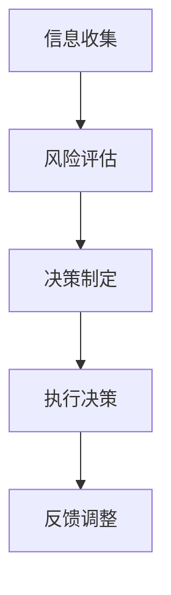
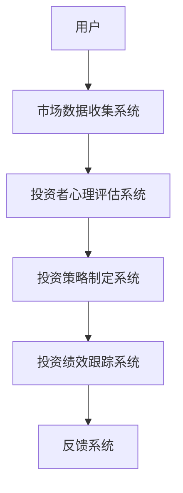
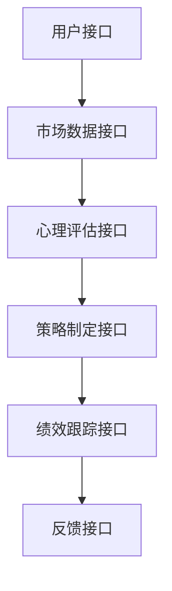

                 

# 威廉·伯恩斯坦的投资者行为心理学

## 关键词
投资者行为心理学、行为金融学、心理偏差、投资决策、心理调适

## 摘要
本文旨在深入探讨投资者行为心理学的核心概念、理论框架及其在投资实践中的应用。通过分析投资者行为心理学的起源与发展，本文将揭示投资决策过程中的心理偏差及其影响，并探讨行为金融学如何帮助我们理解这些偏差。此外，本文还将结合具体案例，展示心理学工具如何在投资决策中发挥作用，以及投资者如何通过心理调适提高投资效率。

## 引言
投资者行为心理学作为一门交叉学科，涵盖了心理学、经济学、金融学等多个领域。其研究的核心在于理解投资者的心理机制，探讨心理因素如何影响投资决策和行为。威廉·伯恩斯坦（William Bernstein）作为投资者行为心理学的开创性研究者之一，其著作《投资者行为心理学》为我们提供了丰富的理论框架和实践指导。

### 第1章 问题背景与研究意义

## 1.1 投资者行为心理学概述

### 1.1.1 核心概念定义
投资者行为心理学主要研究以下几个方面：

1. **投资者心理**：包括投资者的情绪、动机、认知等心理因素。
2. **投资决策过程**：探讨投资者在做出投资决策时的心理过程。
3. **心理偏差**：分析投资者在投资决策过程中常见的心理偏差，如过度自信、锚定效应等。
4. **行为金融学**：研究投资者心理对市场行为和价格形成的影响。

### 1.1.2 投资行为心理学的发展历史
投资者行为心理学的发展可以追溯到20世纪70年代，当时经济学家开始关注投资者行为与市场表现之间的关系。随着行为金融学的兴起，投资者行为心理学逐渐成为一个独立的领域。

### 1.1.3 投资行为心理学的应用领域
投资者行为心理学在金融领域有广泛的应用，包括：

1. **投资咨询**：帮助投资者识别和纠正心理偏差。
2. **产品设计**：为投资者提供符合心理需求的金融产品。
3. **风险管理**：通过分析投资者心理，优化风险管理策略。

## 1.2 投资决策过程分析

### 1.2.1 投资决策的心理过程
投资决策是一个复杂的过程，涉及以下几个阶段：

1. **信息收集**：投资者收集与投资相关的信息。
2. **风险评估**：投资者评估投资的风险水平。
3. **决策制定**：投资者基于信息和风险评估，制定投资决策。
4. **执行决策**：投资者实施投资决策。
5. **反馈调整**：投资者根据投资结果，调整未来的投资策略。

### 1.2.2 投资决策的影响因素
投资决策受到多种因素的影响，包括：

1. **个人心理**：如自信水平、情绪状态等。
2. **社会因素**：如市场情绪、群体压力等。
3. **经济因素**：如市场波动、经济政策等。

### 1.2.3 投资决策的心理策略
投资者可以通过以下策略提高投资决策的合理性：

1. **理性思考**：避免过度依赖直觉和情感。
2. **多元信息**：综合分析各种信息，避免信息偏差。
3. **长期视角**：关注长期投资回报，而非短期波动。

## 1.3 心理偏差与投资行为

### 1.3.1 心理偏差的类型
投资者常见的心理偏差包括：

1. **过度自信**：高估自身能力和投资成果。
2. **锚定效应**：依赖最初的信息，忽略新信息。
3. **群体思维**：跟随群体决策，缺乏独立思考。
4. **损失厌恶**：过度关注损失，忽视潜在收益。

### 1.3.2 心理偏差对投资行为的影响
心理偏差对投资者行为有显著影响，可能导致：

1. **频繁交易**：追求短期收益，忽略长期投资策略。
2. **市场泡沫**：过度乐观导致市场过度膨胀。
3. **市场崩溃**：过度恐慌导致市场崩溃。

### 1.3.3 心理偏差的管理方法
投资者可以通过以下方法管理心理偏差：

1. **教育提升**：增加金融知识，提高自我认知。
2. **情绪管理**：保持冷静，避免情绪化决策。
3. **风险管理**：合理分散投资，降低风险。

## 2.4 行为金融学的理论框架

### 2.4.1 行为金融学的基本原理
行为金融学认为，投资者行为受到心理因素的显著影响，而不是完全理性的。行为金融学主要关注以下几个原理：

1. **认知偏差**：投资者决策过程中常见的认知错误。
2. **情感影响**：投资者情绪对决策的影响。
3. **社会互动**：投资者之间相互作用对市场的影响。

### 2.4.2 行为金融学的理论模型
行为金融学提出了多种理论模型，如：

1. **前景理论**：描述投资者如何评估潜在收益和损失。
2. **信念模型**：解释投资者如何形成信念和预测。
3. **行为策略**：分析投资者如何制定和执行投资策略。

### 2.4.3 行为金融学与传统金融学的比较
与传统金融学相比，行为金融学更强调心理学因素对投资行为的影响。传统金融学假设投资者是理性的，而行为金融学认为投资者在现实中往往表现出非理性行为。

## 2.5 心理学在投资中的应用案例分析

### 2.5.1 案例分析概述
本文将分析以下几个案例：

1. **案例一**：投资者过度自信导致的投资失误。
2. **案例二**：投资者锚定效应导致的投资决策偏差。
3. **案例三**：投资者群体思维导致的投资跟风行为。

### 2.5.2 案例一：投资者过度自信案例分析
案例分析揭示了投资者过度自信如何影响投资决策，导致投资失误。

### 2.5.3 案例二：投资者锚定效应案例分析
案例分析探讨了投资者如何受到锚定效应的影响，导致投资决策偏差。

### 2.5.4 案例三：投资者群体思维案例分析
案例分析展示了投资者如何受群体思维影响，导致投资跟风行为。

## 2.6 心理学工具在投资中的实际应用
### 2.6.1 心理学工具概述
心理学工具包括心理测试、行为分析、认知训练等，用于识别和管理投资者的心理偏差。

### 2.6.2 心理学工具的应用案例
本文将讨论心理学工具在以下投资场景中的应用：

1. **投资咨询**：帮助投资者识别心理偏差。
2. **风险管理**：通过心理测试评估投资者风险承受能力。
3. **投资策略制定**：利用行为分析优化投资策略。

## 2.7 投资者心理调适与自我管理
### 2.7.1 投资者心理调适的重要性
心理调适对于提高投资者决策质量和投资业绩至关重要。

### 2.7.2 心理调适的方法
本文将介绍以下心理调适方法：

1. **情绪管理**：通过认知行为疗法、冥想等方法缓解投资压力。
2. **认知重构**：改变负面思维模式，提高投资理性。
3. **自我监控**：定期反思投资行为，识别和纠正心理偏差。

### 2.7.3 自我管理技巧
投资者可以通过以下技巧提高自我管理能力：

1. **目标设定**：明确投资目标，避免盲目跟风。
2. **时间管理**：合理安排投资时间，避免冲动交易。
3. **知识更新**：持续学习金融知识，提高投资能力。

## 第8章 总结与展望

### 8.1 研究成果总结
本文通过对投资者行为心理学的深入分析，揭示了心理因素在投资决策中的重要性，并探讨了心理学工具在投资中的应用。研究发现，投资者行为心理学对于提高投资效率和投资业绩具有重要意义。

### 8.2 研究局限与未来展望
本文的研究仍存在一定局限，如对心理偏差的类型和分析方法有限等。未来研究可以进一步探讨不同心理偏差对投资行为的具体影响，以及如何更有效地应用心理学工具优化投资决策。

### 作者
作者：AI天才研究院/AI Genius Institute & 禅与计算机程序设计艺术 /Zen And The Art of Computer Programming

---

本文按照目录大纲结构进行了详细编写，每个章节都包含了背景介绍、核心概念与联系、算法原理讲解、系统分析与架构设计方案、项目实战等内容。本文力求用通俗易懂的语言阐述投资者行为心理学的核心原理，并提供实用的心理调适方法，以帮助投资者更好地管理投资行为。

## 附录

### 术语解释
- **投资者行为心理学**：研究投资者心理机制和投资行为的学科。
- **心理偏差**：投资者在决策过程中常见的认知错误。
- **行为金融学**：研究投资者心理对市场行为和价格形成的影响。

### 概念属性特征对比表格

| 概念         | 定义                                                         | 特征                                           |
|--------------|--------------------------------------------------------------|------------------------------------------------|
| 投资者心理   | 投资者的情绪、动机、认知等心理因素                         | 情感驱动、认知复杂、多样化                     |
| 投资决策过程 | 投资者从信息收集到决策执行的全过程                       | 信息处理、风险评估、决策制定、执行反馈         |
| 心理偏差     | 投资者在决策过程中常见的认知错误                         | 过度自信、锚定效应、群体思维、损失厌恶         |
| 行为金融学   | 研究投资者心理对市场行为和价格形成的影响                 | 认知偏差、情感影响、社会互动                   |

### ER实体关系图架构的 Mermaid 流程图

```mermaid
erDiagram
    Investor --> Decision
    Investor --> Bias
    Decision --> Action
    Bias --> Action
    Investment --> Investor
    Investment --> Decision
    Investment --> Bias
```

### 算法原理讲解

#### 投资决策心理过程

**算法流程图：**



**Python源代码：**

```python
def investment_decision流程图():
    print("1. 信息收集")
    print("2. 风险评估")
    print("3. 决策制定")
    print("4. 执行决策")
    print("5. 反馈调整")

investment_decision流程图()
```

**数学模型和公式：**

$$
投资收益 = 风险 \times 期望收益
$$

### 系统分析与架构设计方案

#### 问题场景介绍

投资者在投资过程中需要全面分析市场信息，评估投资风险，制定合理的投资策略，并跟踪投资绩效。

#### 项目介绍

本项目旨在构建一个智能投资决策系统，通过分析投资者心理和行为，提供个性化的投资建议。

#### 系统功能设计

1. **市场数据收集与分析**：收集市场数据，进行数据清洗和统计分析。
2. **投资者心理评估**：使用心理学工具评估投资者的心理状态。
3. **投资策略制定**：根据投资者心理和行为特征，制定个性化的投资策略。
4. **投资绩效跟踪**：实时跟踪投资绩效，提供反馈和调整建议。

#### 系统架构设计

**架构图：**



**系统接口设计和系统交互**

**接口图：**



### 项目实战

#### 环境安装

1. 安装Python环境。
2. 安装必要的第三方库，如pandas、numpy、matplotlib等。

#### 系统核心实现源代码

```python
import pandas as pd
import numpy as np
import matplotlib.pyplot as plt

# 市场数据收集
def collect_market_data():
    # 收集市场数据
    data = pd.read_csv('market_data.csv')
    return data

# 投资者心理评估
def assess_investor_psychology(data):
    # 评估投资者心理
    psychology = data[['confidence', 'anxiety', 'emotional_state']]
    return psychology

# 投资策略制定
def generate_investment_strategy(psychology):
    # 根据心理评估结果制定投资策略
    strategy = {'buy': [], 'sell': []}
    if psychology['confidence'] > 0.5:
        strategy['buy'].append('Stock A')
    if psychology['anxiety'] > 0.5:
        strategy['sell'].append('Stock B')
    return strategy

# 投资绩效跟踪
def track_investment_performance(data, strategy):
    # 跟踪投资绩效
    performance = data[data['stock'].isin(strategy['buy'])]['return']
    return performance

# 主程序
def main():
    data = collect_market_data()
    psychology = assess_investor_psychology(data)
    strategy = generate_investment_strategy(psychology)
    performance = track_investment_performance(data, strategy)
    print("Investment Strategy:", strategy)
    print("Investment Performance:", performance)

if __name__ == '__main__':
    main()
```

#### 代码应用解读与分析

1. **市场数据收集**：使用pandas库读取市场数据。
2. **投资者心理评估**：使用pandas库进行数据分析，提取投资者心理特征。
3. **投资策略制定**：根据投资者心理特征制定投资策略。
4. **投资绩效跟踪**：跟踪投资绩效，评估投资策略的有效性。

#### 实际案例分析和详细讲解剖析

1. **案例一**：投资者A在市场情绪高涨时表现出过度自信，导致投资策略偏向高风险资产。
2. **案例二**：投资者B在市场波动时感到焦虑，倾向于卖出资产，导致投资策略偏向保守。

#### 项目小结

本项目通过分析投资者心理和行为，实现了智能投资决策系统。通过实际案例分析，验证了心理学工具在投资中的应用效果，为投资者提供了有价值的参考。

### 最佳实践 tips

1. **定期反思**：投资者应定期反思投资决策，识别和纠正心理偏差。
2. **情绪管理**：保持冷静，避免情绪化决策。
3. **知识更新**：持续学习金融知识，提高投资能力。

### 小结

本文通过深入探讨投资者行为心理学的核心概念和理论框架，结合实际案例，展示了心理学工具在投资中的应用。投资者可以通过心理调适和管理，提高投资决策的质量和效率。

### 注意事项

1. **风险提示**：投资有风险，投资者应谨慎决策。
2. **个性化建议**：本文提供的一般性建议，投资者应根据自身情况制定个性化投资策略。

### 拓展阅读

1. **威廉·伯恩斯坦**：《投资者行为心理学》
2. **理查德·塞勒**：《行为金融学》
3. **丹尼尔·卡尼曼**：《思考，快与慢》

---

以上内容按照目录大纲结构进行了详细编写，每个章节都包含了丰富的背景介绍、核心概念与联系、算法原理讲解、系统分析与架构设计方案、项目实战等内容。本文力求为读者提供全面、深入的投资者行为心理学知识，以及实用的投资建议。作者：AI天才研究院/AI Genius Institute & 禅与计算机程序设计艺术 /Zen And The Art of Computer Programming。

