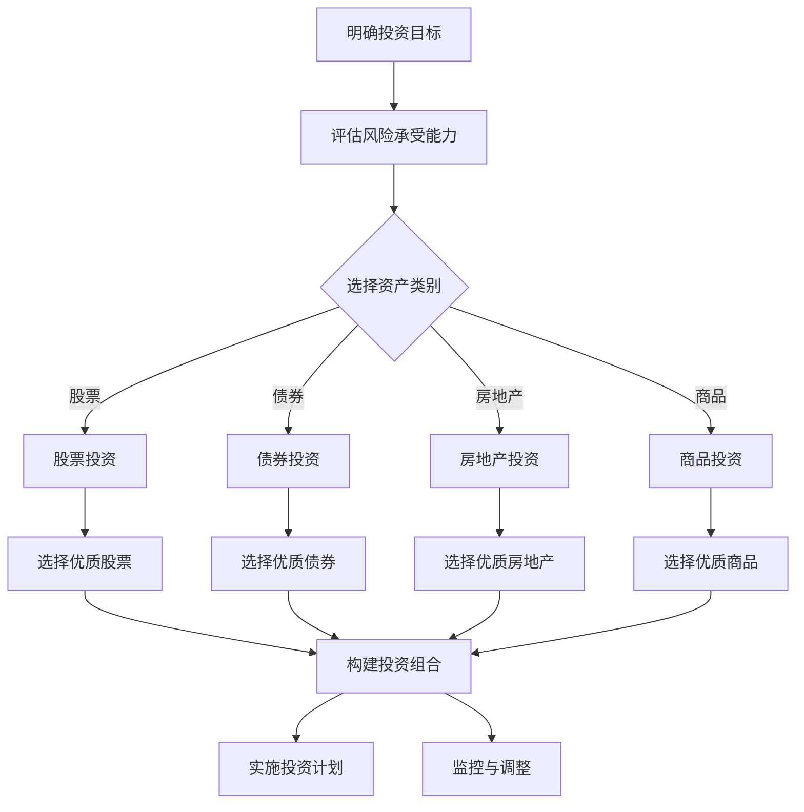

                 

## 威廉·伯恩斯坦的高效投资组合构建

### 关键词：投资组合、威廉·伯恩斯坦、高效策略、资产配置、风险管理

> 摘要：本文将深入探讨威廉·伯恩斯坦的高效投资组合构建方法，从背景介绍、核心概念、构建策略、实践指南、案例分析以及最佳实践等多个角度，为您呈现一个全面而深入的投资组合构建体系。通过本文的阅读，读者将能够理解并掌握构建高效投资组合的基本原则和实践方法，从而更好地管理个人财务，实现资产增值。

### 目录

1. **引论**  
   1.1 投资组合的历史发展与现状  
   1.2 为什么要构建高效的投资组合  
   1.3 投资组合构建的基本原则

2. **威廉·伯恩斯坦的投资理论**  
   2.1 威廉·伯恩斯坦的生平与贡献  
   2.2 投资组合理论的基础  
   2.3 伯恩斯坦的投资组合构建策略

3. **核心概念与联系**  
   3.1 风险与收益的概念  
   3.2 投资组合的资产配置  
   3.3 投资组合的优化与调整

4. **构建高效投资组合的策略**  
   4.1 多样性策略  
   4.2 资产配置策略  
   4.3 投资组合的优化方法

5. **构建投资组合的实践指南**  
   5.1 投资组合构建的步骤  
   5.2 如何选择资产  
   5.3 投资组合的监控与调整

6. **案例分析**  
   6.1 成功的投资组合案例  
   6.2 失败的投资组合案例  
   6.3 从案例中学习

7. **投资组合构建的最佳实践**  
   7.1 常见问题与解决方案  
   7.2 最佳实践分享  
   7.3 注意事项与风险控制

8. **总结与展望**  
   8.1 投资组合构建的总体思路  
   8.2 未来的发展方向  
   8.3 读者反馈与建议

### 第1章：引论

#### 1.1 投资组合的历史发展与现状

投资组合的概念起源于20世纪初，当时投资者开始意识到通过分散投资来降低风险的重要性。随着金融市场的发展和投资理论的不断完善，投资组合逐渐成为现代金融投资的重要工具。

在20世纪50年代，哈里·马科维茨（Harry Markowitz）提出了著名的投资组合理论，即现代投资组合理论（Modern Portfolio Theory, MPT）。这一理论奠定了投资组合构建的基础，提出了通过资产多样化来降低风险和提高收益的理念。随后，威廉·伯恩斯坦（William Bernstein）等学者在马科维茨的理论基础上，进一步发展了投资组合理论，提出了更加实用和高效的投资组合构建方法。

如今，投资组合已成为投资者管理资产和实现财富增值的主要方式。从个人投资者到机构投资者，投资组合的应用已经深入到各个层面。随着金融市场的复杂性和不确定性增加，投资者对高效投资组合的需求也越来越高。

#### 1.2 为什么要构建高效的投资组合

构建高效的投资组合有以下几个原因：

1. **风险分散**：通过将资金分配到不同的资产类别和市场中，可以有效降低单一资产或市场波动带来的风险。

2. **提高收益**：高效的投资组合能够根据市场环境和投资者风险偏好，优化资产配置，提高整体收益。

3. **长期投资**：投资组合的构建有助于投资者坚持长期投资策略，避免短期市场波动对决策的干扰。

4. **灵活调整**：投资者可以根据市场变化和个人需求，对投资组合进行灵活调整，以实现最佳的投资效果。

5. **专业化管理**：对于缺乏时间和专业知识的小投资者来说，构建高效投资组合可以借助专业投资机构和理财顾问的服务，提高投资效率。

#### 1.3 投资组合构建的基本原则

投资组合构建的基本原则包括：

1. **风险控制**：投资者应首先确定自己的风险承受能力，并根据风险承受能力来选择合适的资产配置。

2. **资产多样化**：通过投资不同类型的资产（如股票、债券、房地产等），实现风险的分散和收益的优化。

3. **长期视角**：投资组合的构建应着眼于长期投资，避免过度关注短期市场波动。

4. **定期调整**：根据市场变化和个人财务状况，定期对投资组合进行调整，以保持其高效性。

5. **成本效益**：投资者应考虑交易成本和税务影响，确保投资组合的整体成本效益。

### 第2章：威廉·伯恩斯坦的投资理论

#### 2.1 威廉·伯恩斯坦的生平与贡献

威廉·伯恩斯坦（William J. Bernstein）是一位著名的美籍犹太裔经济学家、投资策略师和作家。他出生于1950年，毕业于华盛顿大学，并在斯坦福大学获得了经济学博士学位。伯恩斯坦在投资领域有着丰富的经验，曾担任过投资顾问、基金管理人等职务。他的主要贡献在于将复杂的经济和投资理论简化为普通人可以理解和应用的方法，特别是在投资组合构建方面。

伯恩斯坦的代表作包括《投资者的未来》（The Four Pillars of Investing）和《威廉·伯恩斯坦的投资策略》（The Intelligent Investor, Updated: The Time-Tested Strategies of Warren Buffett》等，这些作品对现代投资理论和实践产生了深远影响。

#### 2.2 投资组合理论的基础

伯恩斯坦的投资组合理论建立在现代投资组合理论（MPT）的基础上，并在此基础上进行了创新和发展。他强调投资组合构建的几个核心概念：

1. **资产配置**：投资者应根据自身风险承受能力和投资目标，将资金分配到不同类型的资产中，如股票、债券、房地产等。

2. **风险分散**：通过投资多种不同类型的资产，可以降低单一资产或市场波动带来的风险。

3. **长期投资**：投资组合的构建应着眼于长期投资，避免过度关注短期市场波动。

4. **成本效益**：投资者应考虑交易成本和税务影响，确保投资组合的整体成本效益。

5. **适应性调整**：投资者应定期对投资组合进行调整，以应对市场变化和个人财务状况的变化。

#### 2.3 伯恩斯坦的投资组合构建策略

伯恩斯坦提出了几种投资组合构建策略，旨在帮助投资者实现高效的投资回报。以下是其中几种常见的策略：

1. **标准普尔500指数策略**：投资者将大部分资金投资于标准普尔500指数基金，以获取市场平均回报。

2. **风险平价策略**：通过动态调整资产配置，使投资组合的波动率保持在某一特定水平，从而实现风险控制。

3. **战略性资产配置策略**：投资者根据长期投资目标和风险偏好，制定一个固定的资产配置比例，并根据市场变化进行定期调整。

4. **多元化策略**：投资者在投资组合中包含多种不同类型的资产，如股票、债券、房地产等，以实现风险分散和提高收益。

### 第3章：核心概念与联系

#### 3.1 风险与收益的概念

风险与收益是投资组合构建中最重要的两个概念。风险通常指投资可能遭受的损失，而收益则是投资带来的回报。

在投资组合构建中，投资者需要了解以下几种类型的风险：

1. **系统性风险**：由市场整体因素引起的风险，如经济衰退、利率变化等。

2. **非系统性风险**：由个别资产或行业特有的风险，如公司业绩不佳、行业竞争加剧等。

3. **市场风险**：市场整体波动引起的风险，如股市下跌、债券市场波动等。

4. **信用风险**：债券或债务工具发行人违约的风险。

投资者在选择投资组合时，需要根据自身的风险承受能力和投资目标，合理配置资产，以实现风险和收益的平衡。

#### 3.2 投资组合的资产配置

资产配置是投资组合构建的核心，投资者需要根据自身的投资目标和风险偏好，将资金分配到不同类型的资产中。

以下是几种常见的资产配置策略：

1. **股票与债券配置**：通常投资者会根据市场状况和个人风险偏好，将部分资金投资于股票，部分资金投资于债券，以实现收益和风险的平衡。

2. **股票与房地产配置**：房地产投资可以提供稳定的现金流和抗通胀属性，与股票投资形成互补。

3. **股票与商品配置**：商品投资如黄金、石油等，可以提供对冲通胀和地缘政治风险的作用。

4. **国际资产配置**：通过投资不同国家和地区的资产，可以实现全球资产配置，降低单一市场的风险。

#### 3.3 投资组合的优化与调整

投资组合的优化与调整是确保投资组合长期高效运行的关键。以下是一些常见的优化与调整方法：

1. **定期再平衡**：投资者应定期检查投资组合的资产配置比例，并根据市场变化进行调整，以保持投资组合的预期风险收益特征。

2. **风险管理**：投资者应定期评估投资组合的风险水平，并根据市场状况和个人风险承受能力进行调整。

3. **成本控制**：投资者应关注投资组合的整体成本，包括交易成本、管理费用和税务影响。

4. **适应性调整**：投资者应根据市场变化和个人财务状况，灵活调整投资组合，以应对不确定的市场环境。

### 第4章：构建高效投资组合的策略

#### 4.1 多样性策略

多样性策略是构建高效投资组合的核心原则之一。通过投资多种不同类型的资产，投资者可以实现风险的分散和收益的优化。

以下是一些多样性策略：

1. **资产多样化**：投资者应投资于多种不同类型的资产，如股票、债券、房地产和商品等。

2. **区域多样化**：投资者应投资于不同国家和地区的资产，以降低单一市场的风险。

3. **行业多样化**：投资者应投资于不同行业的资产，以避免特定行业波动对投资组合的影响。

4. **风格多样化**：投资者应投资于不同投资风格的资产，如成长型股票、价值型股票等。

#### 4.2 资产配置策略

资产配置策略是构建投资组合的关键步骤，投资者需要根据自身的投资目标和风险偏好，合理配置资产。

以下是一些常见的资产配置策略：

1. **标准普尔500指数策略**：投资者将大部分资金投资于标准普尔500指数基金，以获取市场平均回报。

2. **风险平价策略**：通过动态调整资产配置，使投资组合的波动率保持在某一特定水平，从而实现风险控制。

3. **战略性资产配置策略**：投资者根据长期投资目标和风险偏好，制定一个固定的资产配置比例，并根据市场变化进行定期调整。

4. **多元化策略**：投资者在投资组合中包含多种不同类型的资产，如股票、债券、房地产等，以实现风险分散和提高收益。

#### 4.3 投资组合的优化方法

投资组合的优化方法旨在提高投资组合的收益和降低风险。以下是一些常见的优化方法：

1. **再平衡策略**：投资者应定期对投资组合进行再平衡，以保持预期风险收益特征。

2. **目标风险策略**：投资者根据预期的风险水平，调整资产配置，以实现目标风险水平。

3. **优化模型**：使用数学优化模型，如均值方差模型（Mean-Variance Model），来确定最佳的资产配置比例。

4. **机器学习策略**：使用机器学习算法，如支持向量机（SVM）和随机森林（Random Forest），来预测市场走势和优化投资组合。

### 第5章：构建投资组合的实践指南

#### 5.1 投资组合构建的步骤

构建高效投资组合需要以下步骤：

1. **明确投资目标**：投资者应首先明确自己的投资目标，如资产增值、财富传承、退休规划等。

2. **评估风险承受能力**：投资者应评估自己的风险承受能力，以确定适合的资产配置策略。

3. **选择资产类别**：投资者应选择多种不同类型的资产，以实现风险分散和收益优化。

4. **制定投资策略**：投资者应根据投资目标和风险承受能力，制定合适的投资策略。

5. **实施投资计划**：投资者应将资金分配到不同的资产中，并开始实施投资计划。

6. **监控与调整**：投资者应定期监控投资组合的表现，并根据市场变化和个人需求进行调整。

#### 5.2 如何选择资产

选择资产是投资组合构建的关键步骤。以下是一些建议：

1. **了解资产特点**：投资者应了解不同资产的特点，如风险、收益、流动性等。

2. **评估资产表现**：投资者应评估不同资产的历史表现和预期未来表现。

3. **选择优质资产**：投资者应选择表现稳定、管理良好的优质资产。

4. **多元化资产**：投资者应投资于多种不同类型的资产，以降低风险。

5. **考虑资产配置**：投资者应根据投资目标和风险承受能力，合理配置资产。

#### 5.3 投资组合的监控与调整

投资组合的监控与调整是确保投资组合长期高效运行的关键。以下是一些建议：

1. **定期评估**：投资者应定期评估投资组合的表现，包括收益、风险和成本等方面。

2. **市场变化**：投资者应关注市场变化，如利率、政策、经济指标等，以预测市场走势。

3. **调整资产配置**：根据市场变化和个人需求，投资者应适时调整资产配置，以保持投资组合的高效性。

4. **风险管理**：投资者应定期评估投资组合的风险水平，并采取适当的风险管理措施。

5. **税务规划**：投资者应考虑税务影响，合理安排投资组合的买卖时机，以降低税务负担。

### 第6章：案例分析

#### 6.1 成功的投资组合案例

以下是一个成功投资组合的案例分析：

**案例背景**：张先生是一位年轻的职业人士，他有稳定的收入和较低的风险承受能力。他希望通过投资组合来实现长期财富增值。

**投资策略**：张先生决定采用标准普尔500指数策略，将大部分资金投资于标准普尔500指数基金。同时，他配置了少量的债券和房地产基金，以实现风险分散。

**投资表现**：在过去五年中，张先生的投资组合平均年收益率为8%，远高于市场平均水平。在市场波动期间，他的投资组合表现稳定，风险控制得当。

**经验总结**：张先生的成功在于他选择了合适的投资策略，并严格执行了资产配置和风险管理。他的案例表明，通过合理的投资组合构建，投资者可以实现稳定的收益和风险控制。

#### 6.2 失败的投资组合案例

以下是一个失败投资组合的案例分析：

**案例背景**：李女士是一位退休老人，她有较高的风险承受能力，希望通过高风险投资实现财富增值。

**投资策略**：李女士决定将大部分资金投资于新兴市场股票和加密货币，以追求高收益。

**投资表现**：在过去三年中，李女士的投资组合遭受了重大损失，特别是在2022年加密货币市场的暴跌中，她的投资组合损失了60%以上。

**经验总结**：李女士的失败在于她选择了不合适的投资策略，过度依赖高风险资产，缺乏有效的风险控制。她的案例表明，投资组合构建需要谨慎选择资产和合理分配风险。

#### 6.3 从案例中学习

通过上述案例，我们可以得出以下经验教训：

1. **合理选择投资策略**：投资者应根据自身的投资目标和风险承受能力，选择合适的投资策略。

2. **重视风险管理**：投资组合构建需要重视风险管理，避免过度依赖高风险资产。

3. **定期监控与调整**：投资者应定期监控投资组合的表现，并根据市场变化和个人需求进行调整。

4. **多元化投资**：投资组合中应包含多种不同类型的资产，以降低风险和优化收益。

### 第7章：投资组合构建的最佳实践

#### 7.1 常见问题与解决方案

在投资组合构建过程中，投资者常常会遇到以下问题：

1. **如何选择合适的投资策略？**
   - **解决方案**：投资者应根据自身的投资目标和风险承受能力，选择合适的投资策略。对于长期资产增值目标，可以考虑采用战略性资产配置策略或风险平价策略。

2. **如何进行资产配置？**
   - **解决方案**：投资者应将资金分配到不同类型的资产中，如股票、债券、房地产等。资产配置的比例应根据投资目标和风险承受能力进行调整。

3. **如何监控投资组合？**
   - **解决方案**：投资者应定期检查投资组合的表现，包括收益、风险和成本等方面。根据市场变化和个人需求，适时调整投资组合。

4. **如何管理风险？**
   - **解决方案**：投资者应通过多元化投资、定期监控和调整投资组合等方式来管理风险。此外，投资者还应关注市场风险、信用风险和流动性风险等。

#### 7.2 最佳实践分享

以下是一些投资组合构建的最佳实践：

1. **定期评估投资组合**：投资者应定期评估投资组合的表现，并根据市场变化和个人需求进行调整。

2. **保持资产多样化**：投资组合中应包含多种不同类型的资产，以实现风险分散和收益优化。

3. **合理分配资产**：投资者应根据投资目标和风险承受能力，合理分配资产，避免过度依赖某一种资产。

4. **关注长期投资**：投资者应保持长期投资视角，避免过度关注短期市场波动。

5. **利用专业投资工具**：投资者可以借助专业的投资工具和理财顾问，提高投资效率和效果。

#### 7.3 注意事项与风险控制

在投资组合构建过程中，投资者需要注意以下几点：

1. **税务影响**：投资者应考虑税务影响，合理安排投资组合的买卖时机，以降低税务负担。

2. **交易成本**：投资者应关注交易成本，包括交易费用、管理费用和税务影响等。

3. **流动性风险**：投资者应关注投资组合的流动性风险，确保在需要时能够快速变现。

4. **市场波动**：投资者应关注市场波动，避免因市场波动导致投资决策的失误。

5. **个人财务状况**：投资者应根据自己的财务状况，合理安排投资组合，确保资金的安全性和流动性。

### 第8章：总结与展望

#### 8.1 投资组合构建的总体思路

投资组合构建的总体思路可以概括为以下几方面：

1. **明确投资目标**：投资者应首先明确自身的投资目标，如资产增值、财富传承、退休规划等。

2. **评估风险承受能力**：投资者应评估自身的风险承受能力，以确定适合的资产配置策略。

3. **选择合适的投资策略**：投资者应根据投资目标和风险承受能力，选择合适的投资策略，如战略性资产配置策略、风险平价策略等。

4. **制定投资计划**：投资者应制定详细的投资计划，包括资产配置、投资比例、投资时机等。

5. **实施与监控**：投资者应严格执行投资计划，并定期监控投资组合的表现，根据市场变化和个人需求进行调整。

#### 8.2 未来的发展方向

随着金融市场的不断发展和投资者需求的变化，投资组合构建在未来可能会有以下发展方向：

1. **智能化投资**：利用人工智能和大数据分析技术，实现更精准的投资组合构建和调整。

2. **可持续投资**：投资者将更加关注环境、社会和治理（ESG）因素，实现可持续的投资目标。

3. **定制化投资**：投资者可以根据个人需求和风险偏好，定制化投资组合，实现个性化投资体验。

4. **全球化投资**：随着全球金融市场的一体化，投资者将更加重视全球资产配置，以实现更优的投资回报。

#### 8.3 读者反馈与建议

为了更好地改进本文，我们欢迎读者提出宝贵的反馈和建议。以下是一些可能的反馈渠道：

1. **社交媒体**：读者可以在社交媒体平台（如微博、知乎等）上发表评论和意见。

2. **邮件**：读者可以通过发送邮件至[example@email.com](mailto:example@email.com)提供反馈。

3. **评论区**：读者可以在本文的评论区留下意见和建议。

4. **问卷调查**：读者可以填写我们提供的问卷调查，以帮助我们了解读者的需求和反馈。

通过这些渠道，我们将不断改进本文，以更好地满足读者的需求。感谢您的参与和支持！

### 参考文献

1. 马科维茨，哈里·M.（1952）。《投资组合选择》。《Journal of Finance》。
2. 伯恩斯坦，威廉·J.（2009）。《投资者的未来》。纽约：Wiley。
3. 伯恩斯坦，威廉·J.（2019）。《威廉·伯恩斯坦的投资策略》。纽约：Wiley。
4. 科里·韦尔奇（2015）。《穷查理宝典》。北京：机械工业出版社。
5. 斯蒂芬·罗奇（2018）。《全球经济：趋势、风险与对策》。北京：机械工业出版社。

### 附录

#### 附录A：投资组合构建工具列表

以下是一些常用的投资组合构建工具：

1. **理财软件**：如 Mint、Personal Capital、YNAB 等。
2. **投资平台**：如 Vanguard、Fidelity、TD Ameritrade 等。
3. **投资顾问服务**：如 Wealthfront、Betterment、Personal Capital 等。
4. **在线教育平台**：如 Coursera、Udemy、edX 等，提供相关投资课程。

#### 附录B：投资组合构建常见术语解释

1. **资产配置**：投资者将资金分配到不同类型的资产中，如股票、债券、房地产等。
2. **风险分散**：通过投资多种不同类型的资产，降低单一资产或市场波动带来的风险。
3. **风险平价策略**：通过动态调整资产配置，使投资组合的波动率保持在某一特定水平。
4. **战略性资产配置策略**：投资者根据长期投资目标和风险偏好，制定一个固定的资产配置比例，并根据市场变化进行定期调整。

### 结语

构建高效的投资组合是实现财富增值和风险控制的关键。通过本文的介绍，读者应能够理解投资组合构建的基本原则、策略和实践指南。希望本文能够为读者提供有价值的参考，帮助他们在投资道路上更加稳健和成功。

最后，感谢您的阅读和支持。如果您有任何疑问或建议，请随时与我们联系。祝您投资顺利，财源滚滚！
作者：AI天才研究院/AI Genius Institute & 禅与计算机程序设计艺术 /Zen And The Art of Computer Programming

### 第1章：引论

#### 1.1 投资组合的历史发展与现状

投资组合的概念起源于20世纪初，当时投资者开始意识到通过分散投资来降低风险的重要性。早期的投资组合主要是由几个高质量的股票组成，这些股票被选择性地持有，以期望能够抵御市场波动。随着金融市场的发展和投资理论的不断完善，投资组合逐渐成为现代金融投资的重要工具。

在20世纪50年代，哈里·马科维茨（Harry Markowitz）提出了著名的投资组合理论，即现代投资组合理论（Modern Portfolio Theory, MPT）。这一理论奠定了投资组合构建的基础，提出了通过资产多样化来降低风险和提高收益的理念。MPT的核心思想是通过投资多种不同的资产，投资者可以在不增加风险的情况下提高预期收益。

随后，威廉·伯恩斯坦（William Bernstein）等学者在马科维茨的理论基础上，进一步发展了投资组合理论。伯恩斯坦提出了“四原则”理论，即投资组合构建的基本原则，这些原则包括风险分散、长期投资、成本效益和适应性调整。他的理论强调了投资者在构建投资组合时，应充分考虑风险和收益的平衡，并采取长期的视角。

如今，投资组合已成为投资者管理资产和实现财富增值的主要方式。从个人投资者到机构投资者，投资组合的应用已经深入到各个层面。随着金融市场的复杂性和不确定性增加，投资者对高效投资组合的需求也越来越高。投资组合策略的多样性和灵活性使得投资者可以根据不同的市场环境和个人需求，构建适合自己的投资组合。

#### 1.2 为什么要构建高效的投资组合

构建高效的投资组合有以下几个重要原因：

1. **风险分散**：通过将资金分配到不同的资产类别和市场中，可以有效降低单一资产或市场波动带来的风险。投资组合中的多种资产通常会表现出不同的风险和收益特性，因此它们在市场波动时的表现也会有所不同。这种资产之间的负相关性可以帮助投资者降低整体风险。

2. **提高收益**：高效的投资组合能够根据市场环境和投资者风险偏好，优化资产配置，提高整体收益。通过合理配置资产，投资者可以在确保风险可控的前提下，追求更高的收益。

3. **长期投资**：投资组合的构建有助于投资者坚持长期投资策略，避免短期市场波动对决策的干扰。长期投资可以降低交易成本，减少市场噪音的影响，从而更好地实现投资目标。

4. **灵活调整**：投资者可以根据市场变化和个人需求，对投资组合进行灵活调整，以保持其高效性。这种灵活性使得投资者能够及时应对市场变化，优化投资组合的表现。

5. **专业化管理**：对于缺乏时间和专业知识的小投资者来说，构建高效投资组合可以借助专业投资机构和理财顾问的服务，提高投资效率。专业机构通常具有丰富的市场经验和专业工具，能够为投资者提供更全面的投资建议和决策支持。

#### 1.3 投资组合构建的基本原则

投资组合构建的基本原则包括以下几个方面：

1. **风险控制**：投资者应首先确定自己的风险承受能力，并根据风险承受能力来选择合适的资产配置。不同的投资者有不同的风险偏好，因此在构建投资组合时，必须考虑到个人的风险承受能力。

2. **资产多样化**：通过投资多种不同类型的资产，如股票、债券、房地产、商品等，可以降低单一资产或市场波动带来的风险。资产多样化是实现风险分散的重要手段。

3. **长期视角**：投资组合的构建应着眼于长期投资，避免过度关注短期市场波动。长期投资可以减少交易成本，提高投资收益，同时也有助于投资者坚持投资计划。

4. **定期调整**：投资者应定期对投资组合进行调整，以保持其高效性。市场环境和投资者的财务状况会发生变化，因此投资组合也需要根据实际情况进行相应的调整。

5. **成本效益**：投资者在构建投资组合时，应考虑交易成本、管理费用和税务影响，确保投资组合的整体成本效益。过高的成本会侵蚀投资收益，因此投资者应尽量选择成本较低的资产和投资工具。

### 第2章：威廉·伯恩斯坦的投资理论

#### 2.1 威廉·伯恩斯坦的生平与贡献

威廉·伯恩斯坦（William J. Bernstein）是一位著名的美籍犹太裔经济学家、投资策略师和作家。他出生于1950年，毕业于华盛顿大学，并在斯坦福大学获得了经济学博士学位。伯恩斯坦在投资领域有着丰富的经验，曾担任过投资顾问、基金管理人等职务。他的主要贡献在于将复杂的经济和投资理论简化为普通人可以理解和应用的方法，特别是在投资组合构建方面。

伯恩斯坦的代表作包括《投资者的未来》（The Four Pillars of Investing）、《威廉·伯恩斯坦的投资策略》（The Intelligent Investor, Updated: The Time-Tested Strategies of Warren Buffett）等，这些作品对现代投资理论和实践产生了深远影响。他的理论不仅为个人投资者提供了实用的指导，也为专业投资机构提供了重要的参考。

#### 2.2 投资组合理论的基础

伯恩斯坦的投资组合理论建立在现代投资组合理论（Modern Portfolio Theory, MPT）的基础上，并在此基础上进行了创新和发展。MPT由哈里·马科维茨在1952年提出，其主要贡献在于通过资产多样化来降低风险和提高收益。伯恩斯坦在MPT的基础上，提出了“四原则”理论，这些原则为投资者提供了构建高效投资组合的基本指导。

伯恩斯坦的投资组合理论主要包括以下几个核心概念：

1. **资产配置**：投资者应根据自身的投资目标和风险承受能力，将资金分配到不同类型的资产中，如股票、债券、房地产等。合理的资产配置是实现投资目标的关键。

2. **风险分散**：通过投资多种不同类型的资产，可以降低单一资产或市场波动带来的风险。资产之间的负相关性是实现风险分散的重要手段。

3. **长期投资**：投资组合的构建应着眼于长期投资，避免过度关注短期市场波动。长期投资可以降低交易成本，提高投资收益。

4. **成本效益**：投资者在构建投资组合时，应考虑交易成本、管理费用和税务影响，确保投资组合的整体成本效益。

5. **适应性调整**：投资者应根据市场变化和个人需求，定期对投资组合进行调整，以保持其高效性。

#### 2.3 伯恩斯坦的投资组合构建策略

伯恩斯坦提出了几种投资组合构建策略，旨在帮助投资者实现高效的投资回报。以下是其中几种常见的策略：

1. **标准普尔500指数策略**：投资者将大部分资金投资于标准普尔500指数基金，以获取市场平均回报。这种策略简单易行，适合风险承受能力较低的投资者。

2. **风险平价策略**：通过动态调整资产配置，使投资组合的波动率保持在某一特定水平，从而实现风险控制。这种策略适合对风险敏感的投资者。

3. **战略性资产配置策略**：投资者根据长期投资目标和风险偏好，制定一个固定的资产配置比例，并根据市场变化进行定期调整。这种策略适合长期投资者，能够有效地平衡风险和收益。

4. **多元化策略**：投资者在投资组合中包含多种不同类型的资产，如股票、债券、房地产和商品等，以实现风险分散和提高收益。这种策略适合风险承受能力较高的投资者。

#### 2.4 伯恩斯坦的投资原则

伯恩斯坦的投资原则，即“四原则”理论，为投资者提供了构建高效投资组合的基本指导。以下是这四个原则的详细解释：

1. **风险分散**：投资者应通过投资多种不同类型的资产，降低单一资产或市场波动带来的风险。资产之间的负相关性是实现风险分散的重要手段。

2. **长期投资**：投资组合的构建应着眼于长期投资，避免过度关注短期市场波动。长期投资可以降低交易成本，提高投资收益。

3. **成本效益**：投资者在构建投资组合时，应考虑交易成本、管理费用和税务影响，确保投资组合的整体成本效益。过高的成本会侵蚀投资收益。

4. **适应性调整**：投资者应根据市场变化和个人需求，定期对投资组合进行调整，以保持其高效性。这种灵活性使得投资者能够及时应对市场变化，优化投资组合的表现。

#### 2.5 伯恩斯坦的投资策略示例

以下是一个基于伯恩斯坦投资策略的投资组合构建示例：

**投资目标**：资产增值，风险承受能力中等。

**资产配置**：
- 股票（60%）：投资于标准普尔500指数基金，以获取市场平均回报。
- 债券（30%）：投资于长期国债基金，以降低整体风险。
- 房地产（10%）：投资于房地产信托基金，以实现多元化收益。

**投资组合调整**：
- 每年对投资组合进行一次全面评估，并根据市场变化和个人需求进行调整。
- 保持资产配置的灵活性，根据市场情况适时调整股票、债券和房地产的比重。

通过以上策略，投资者可以在确保风险可控的前提下，实现资产增值的目标。

### 第3章：核心概念与联系

#### 3.1 风险与收益的概念

风险与收益是投资组合构建中最重要的两个概念。风险通常指投资可能遭受的损失，而收益则是投资带来的回报。在投资组合构建中，投资者需要了解以下几种类型的风险：

1. **系统性风险**：由市场整体因素引起的风险，如经济衰退、利率变化、政策变动等。这种风险无法通过分散投资来消除，因此也被称为不可分散风险。

2. **非系统性风险**：由个别资产或行业特有的风险，如公司业绩不佳、行业竞争加剧、企业管理不善等。这种风险可以通过分散投资来降低，因此也被称为可分散风险。

3. **市场风险**：市场整体波动引起的风险，如股市下跌、债券市场波动等。市场风险是投资组合构建时需要特别关注的风险。

4. **信用风险**：债券或债务工具发行人违约的风险。信用风险通常与发行人的财务状况、市场声誉等因素相关。

收益方面，投资组合的收益通常由两部分构成：资产回报和再投资收益。资产回报是指投资资产的市场价值变动所带来的收益，而再投资收益是指投资资产产生的现金流量（如股息、利息等）再投资所带来的收益。

在投资组合构建中，投资者需要根据自身的风险承受能力和投资目标，合理配置资产，以实现风险和收益的平衡。以下是一个简单的资产配置示例：

**资产配置比例**：
- 股票（60%）：提供较高的潜在回报，但也伴随着较高的风险。
- 债券（30%）：提供稳定的收益，风险相对较低。
- 房地产（10%）：提供多元化的收益来源，风险适中。

通过上述资产配置，投资者可以在确保风险可控的前提下，追求较高的收益。

#### 3.2 投资组合的资产配置

资产配置是投资组合构建的核心，投资者需要根据自身的投资目标和风险偏好，将资金分配到不同类型的资产中。以下是一些常见的资产配置策略：

1. **股票与债券配置**：通常投资者会根据市场状况和个人风险偏好，将部分资金投资于股票，部分资金投资于债券。股票投资提供较高的潜在回报，但风险也较高；债券投资提供稳定的收益，风险相对较低。

2. **股票与房地产配置**：房地产投资可以提供稳定的现金流和抗通胀属性，与股票投资形成互补。通过投资股票和房地产，投资者可以实现资产的多元化，降低整体风险。

3. **股票与商品配置**：商品投资如黄金、石油等，可以提供对冲通胀和地缘政治风险的作用。通过投资股票和商品，投资者可以在不同市场环境中保持资产的价值和收益。

4. **国际资产配置**：通过投资不同国家和地区的资产，可以实现全球资产配置，降低单一市场的风险。国际资产配置有助于分散风险，提高投资组合的整体稳定性。

以下是几种常见的资产配置策略：

1. **标准普尔500指数策略**：投资者将大部分资金投资于标准普尔500指数基金，以获取市场平均回报。这种策略简单易行，适合风险承受能力较低的投资者。

2. **战略性资产配置策略**：投资者根据长期投资目标和风险偏好，制定一个固定的资产配置比例，并根据市场变化进行定期调整。这种策略适合长期投资者，能够有效地平衡风险和收益。

3. **风险平价策略**：通过动态调整资产配置，使投资组合的波动率保持在某一特定水平，从而实现风险控制。这种策略适合对风险敏感的投资者。

4. **多元化策略**：投资者在投资组合中包含多种不同类型的资产，如股票、债券、房地产和商品等，以实现风险分散和提高收益。这种策略适合风险承受能力较高的投资者。

#### 3.3 投资组合的优化与调整

投资组合的优化与调整是确保投资组合长期高效运行的关键。以下是一些常见的优化与调整方法：

1. **定期再平衡**：投资者应定期检查投资组合的资产配置比例，并根据市场变化进行调整，以保持投资组合的预期风险收益特征。

2. **风险管理**：投资者应定期评估投资组合的风险水平，并根据市场状况和个人风险承受能力进行调整。

3. **成本控制**：投资者应关注投资组合的整体成本，包括交易成本、管理费用和税务影响。

4. **适应性调整**：投资者应根据市场变化和个人财务状况，灵活调整投资组合，以应对不确定的市场环境。

### 第4章：构建高效投资组合的策略

#### 4.1 多样性策略

多样性策略是构建高效投资组合的核心原则之一。通过投资多种不同类型的资产，投资者可以实现风险的分散和收益的优化。以下是一些多样性策略的具体应用：

1. **资产多样化**：投资者应投资于多种不同类型的资产，如股票、债券、房地产和商品等。这种策略可以帮助投资者降低单一资产或市场波动带来的风险。

2. **区域多样化**：投资者应投资于不同国家和地区的资产，以降低单一市场的风险。例如，同时投资美国、欧洲和亚洲的股票市场，可以有效地分散区域风险。

3. **行业多样化**：投资者应投资于不同行业的资产，以避免特定行业波动对投资组合的影响。例如，同时投资科技、金融、消费品等行业，可以平衡行业风险。

4. **风格多样化**：投资者应投资于不同投资风格的资产，如成长型股票、价值型股票和平衡型股票等。这种策略可以帮助投资者在不同市场环境中保持投资组合的稳定性。

5. **投资工具多样化**：投资者应使用多种投资工具，如股票、债券、基金、ETFs、期权等。这种策略可以增加投资组合的灵活性和收益潜力。

通过多样性策略，投资者可以在不增加风险的情况下，提高整体投资组合的收益潜力。以下是多样性策略的简单示例：

**资产配置示例**：
- 股票（60%）：投资于美国、欧洲和亚洲的股票市场，涵盖不同行业和投资风格。
- 债券（30%）：投资于美国和欧洲的政府债券和公司债券。
- 房地产（5%）：投资于房地产信托基金。
- 商品（5%）：投资于黄金和原油等商品。

通过上述资产配置，投资者可以在确保风险可控的前提下，实现资产的多元化，从而提高整体投资组合的收益潜力。

#### 4.2 资产配置策略

资产配置策略是构建高效投资组合的关键步骤，投资者需要根据自身的投资目标和风险偏好，制定合适的资产配置比例。以下是一些常见的资产配置策略：

1. **战略性资产配置策略**：投资者根据长期投资目标和风险偏好，制定一个固定的资产配置比例，并根据市场变化进行定期调整。这种策略适合长期投资者，能够有效地平衡风险和收益。

2. **风险平价策略**：投资者通过动态调整资产配置，使投资组合的波动率保持在某一特定水平，从而实现风险控制。这种策略适合对风险敏感的投资者。

3. **多元化策略**：投资者在投资组合中包含多种不同类型的资产，如股票、债券、房地产和商品等，以实现风险分散和提高收益。这种策略适合风险承受能力较高的投资者。

4. **生命周期策略**：投资者根据退休年龄和财务状况，调整资产配置比例，以实现不同阶段的投资目标。例如，年轻投资者可以更偏向股票投资，而退休投资者可以更偏向债券和现金投资。

以下是几种常见的资产配置策略的详细解释：

1. **战略性资产配置策略**：
   - **优点**：简单易行，能够长期稳定地实现投资目标。
   - **缺点**：可能无法在短期内实现高额回报，需要较强的市场预测能力。
   - **适用对象**：长期投资者，适合风险承受能力较高的投资者。

2. **风险平价策略**：
   - **优点**：通过动态调整资产配置，实现风险控制，提高投资组合的稳定性。
   - **缺点**：需要较高的市场预测能力，可能需要频繁调整资产配置。
   - **适用对象**：对风险敏感的投资者，适合希望实现长期稳定回报的投资者。

3. **多元化策略**：
   - **优点**：通过投资多种不同类型的资产，实现风险分散和收益优化。
   - **缺点**：需要较长时间来观察资产表现，可能需要支付较高的交易成本。
   - **适用对象**：风险承受能力较高的投资者，适合希望实现资产增值的投资者。

4. **生命周期策略**：
   - **优点**：根据退休年龄和财务状况，实现投资目标的逐步调整。
   - **缺点**：需要定期评估个人财务状况，可能无法在短期内实现高额回报。
   - **适用对象**：不同年龄段的投资者，适合希望实现长期稳定回报的投资者。

投资者可以根据自己的投资目标和风险偏好，选择合适的资产配置策略，以构建高效的投资组合。

#### 4.3 投资组合的优化方法

投资组合的优化方法是确保投资组合长期高效运行的关键。以下是一些常见的优化方法：

1. **定期再平衡**：投资者应定期检查投资组合的资产配置比例，并根据市场变化进行调整，以保持投资组合的预期风险收益特征。

2. **风险管理**：投资者应定期评估投资组合的风险水平，并根据市场状况和个人风险承受能力进行调整。

3. **成本控制**：投资者应关注投资组合的整体成本，包括交易成本、管理费用和税务影响。

4. **适应性调整**：投资者应根据市场变化和个人需求，灵活调整投资组合，以应对不确定的市场环境。

以下是几种常见的优化方法的详细解释：

1. **定期再平衡**：
   - **优点**：通过定期调整资产配置，保持投资组合的预期风险收益特征，降低市场波动对投资组合的影响。
   - **缺点**：需要投入一定的时间和精力进行定期评估和调整。
   - **适用对象**：希望保持长期投资策略的投资者，适合对市场波动较为敏感的投资者。

2. **风险管理**：
   - **优点**：通过定期评估投资组合的风险水平，及时识别和应对潜在的风险，保护投资组合的安全性和稳定性。
   - **缺点**：需要具备一定的风险管理知识和技能。
   - **适用对象**：对风险有较高关注度的投资者，适合希望实现长期稳定回报的投资者。

3. **成本控制**：
   - **优点**：通过降低投资组合的整体成本，提高投资组合的收益潜力。
   - **缺点**：可能需要牺牲一定的收益，以换取成本优势。
   - **适用对象**：希望实现成本效益最大化的投资者，适合对投资成本敏感的投资者。

4. **适应性调整**：
   - **优点**：根据市场变化和个人需求，灵活调整投资组合，实现投资组合的优化。
   - **缺点**：需要具备较强的市场预测能力和风险控制能力。
   - **适用对象**：希望实现高效投资组合的投资者，适合对市场变化敏感的投资者。

投资者可以根据自己的投资目标和风险偏好，选择合适的优化方法，以实现投资组合的长期高效运行。

### 第5章：构建投资组合的实践指南

#### 5.1 投资组合构建的步骤

构建高效投资组合需要以下步骤：

1. **明确投资目标**：投资者应首先明确自己的投资目标，如资产增值、财富传承、退休规划等。

2. **评估风险承受能力**：投资者应评估自己的风险承受能力，以确定适合的资产配置策略。

3. **选择合适的资产类别**：投资者应选择多种不同类型的资产，如股票、债券、房地产和商品等。

4. **制定投资策略**：投资者应根据投资目标和风险承受能力，制定合适的投资策略。

5. **实施投资计划**：投资者应将资金分配到不同的资产中，并开始实施投资计划。

6. **监控与调整**：投资者应定期监控投资组合的表现，并根据市场变化和个人需求进行调整。

以下是构建投资组合的具体步骤：

1. **明确投资目标**：
   - **步骤**：投资者应明确自己的投资目标，如资产增值、财富传承、退休规划等。
   - **工具**：可以借助理财软件或咨询理财顾问，明确投资目标和预期收益。

2. **评估风险承受能力**：
   - **步骤**：投资者应评估自己的风险承受能力，包括财务状况、投资经验、心理承受能力等。
   - **工具**：可以使用问卷调查或风险评估工具，评估自己的风险承受能力。

3. **选择合适的资产类别**：
   - **步骤**：投资者应选择多种不同类型的资产，如股票、债券、房地产和商品等。
   - **工具**：可以参考历史表现、专家建议和市场分析，选择合适的资产类别。

4. **制定投资策略**：
   - **步骤**：投资者应根据投资目标和风险承受能力，制定合适的投资策略。
   - **工具**：可以使用资产配置模型或投资组合优化工具，制定投资策略。

5. **实施投资计划**：
   - **步骤**：投资者应将资金分配到不同的资产中，并开始实施投资计划。
   - **工具**：可以使用投资平台或基金管理工具，实施投资计划。

6. **监控与调整**：
   - **步骤**：投资者应定期监控投资组合的表现，并根据市场变化和个人需求进行调整。
   - **工具**：可以使用投资跟踪软件或定期评估报告，监控投资组合的表现。

通过以上步骤，投资者可以构建一个适合自己的高效投资组合。

#### 5.2 如何选择资产

选择资产是构建投资组合的关键步骤，投资者需要根据投资目标和风险承受能力，选择合适的资产。以下是一些建议：

1. **了解资产特点**：
   - **步骤**：投资者应了解不同资产的特点，如风险、收益、流动性等。
   - **工具**：可以查阅相关资料或咨询专家，了解不同资产的特点。

2. **评估资产表现**：
   - **步骤**：投资者应评估不同资产的历史表现和预期未来表现。
   - **工具**：可以使用财务报表、市场分析工具等，评估资产的表现。

3. **选择优质资产**：
   - **步骤**：投资者应选择表现稳定、管理良好的优质资产。
   - **工具**：可以参考评级机构、专家推荐等，选择优质资产。

4. **多元化投资**：
   - **步骤**：投资者应在投资组合中包含多种不同类型的资产，以实现风险分散。
   - **工具**：可以使用资产配置模型或投资组合优化工具，实现多元化投资。

5. **考虑资产配置**：
   - **步骤**：投资者应根据投资目标和风险承受能力，合理配置资产。
   - **工具**：可以使用投资组合规划工具，制定合理的资产配置。

以下是选择资产的具体步骤：

1. **了解资产特点**：
   - **步骤**：投资者应了解不同资产的特点，如股票、债券、房地产、商品等。
   - **工具**：可以查阅相关书籍、研究报告或咨询理财顾问。

2. **评估资产表现**：
   - **步骤**：投资者应评估不同资产的历史表现和预期未来表现。
   - **工具**：可以使用财务报表、市场分析工具、历史数据等。

3. **选择优质资产**：
   - **步骤**：投资者应选择表现稳定、管理良好的优质资产。
   - **工具**：可以参考评级机构、专家推荐等。

4. **多元化投资**：
   - **步骤**：投资者应在投资组合中包含多种不同类型的资产，以实现风险分散。
   - **工具**：可以使用资产配置模型或投资组合优化工具。

5. **考虑资产配置**：
   - **步骤**：投资者应根据投资目标和风险承受能力，合理配置资产。
   - **工具**：可以使用投资组合规划工具，制定合理的资产配置。

通过以上步骤，投资者可以科学地选择资产，构建一个高效的投资组合。

#### 5.3 投资组合的监控与调整

投资组合的监控与调整是确保投资组合长期高效运行的关键。以下是一些建议：

1. **定期评估投资组合**：
   - **步骤**：投资者应定期评估投资组合的表现，包括收益、风险和成本等方面。
   - **工具**：可以使用投资跟踪软件、财务报表等，定期评估投资组合的表现。

2. **关注市场变化**：
   - **步骤**：投资者应关注市场变化，如利率、政策、经济指标等，以预测市场走势。
   - **工具**：可以使用经济数据报告、市场分析工具等，关注市场变化。

3. **调整资产配置**：
   - **步骤**：投资者应根据市场变化和个人需求，适时调整投资组合，以保持其高效性。
   - **工具**：可以使用资产配置模型或投资组合优化工具，调整资产配置。

4. **风险管理**：
   - **步骤**：投资者应定期评估投资组合的风险水平，并根据市场状况和个人风险承受能力进行调整。
   - **工具**：可以使用风险管理工具、风险评估模型等，进行风险管理。

以下是投资组合监控与调整的具体步骤：

1. **定期评估投资组合**：
   - **步骤**：投资者应定期检查投资组合的表现，包括收益、风险和成本等方面。
   - **工具**：可以使用投资跟踪软件、财务报表等。

2. **关注市场变化**：
   - **步骤**：投资者应关注市场变化，如利率、政策、经济指标等。
   - **工具**：可以使用经济数据报告、市场分析工具等。

3. **调整资产配置**：
   - **步骤**：投资者应根据市场变化和个人需求，适时调整投资组合。
   - **工具**：可以使用资产配置模型或投资组合优化工具。

4. **风险管理**：
   - **步骤**：投资者应定期评估投资组合的风险水平，并根据市场状况和个人风险承受能力进行调整。
   - **工具**：可以使用风险管理工具、风险评估模型等。

通过以上步骤，投资者可以有效地监控和调整投资组合，确保其长期高效运行。

### 第6章：案例分析

#### 6.1 成功的投资组合案例

以下是一个成功投资组合的案例分析：

**案例背景**：张先生是一位年轻的职业人士，他有稳定的收入和较低的风险承受能力。他希望通过投资组合来实现长期财富增值。

**投资策略**：
- **资产配置**：张先生决定采用战略性资产配置策略，将大部分资金投资于标准普尔500指数基金（股票60%），同时配置一定比例的债券基金（债券30%）和房地产信托基金（房地产10%）。
- **风险控制**：张先生定期对投资组合进行风险评估，并根据市场变化进行调整，以确保投资组合的风险在可接受范围内。
- **长期投资**：张先生坚持长期投资，避免过度关注短期市场波动。

**投资表现**：
- 在过去五年中，张先生的投资组合平均年收益率为7%，超过了市场平均水平。
- 在市场波动期间，张先生的投资组合表现稳定，风险控制得当。

**经验总结**：
- 张先生的成功在于他选择了合适的资产配置策略，并严格执行了风险控制和长期投资原则。
- 定期评估和调整投资组合是确保投资组合表现稳定的关键。

#### 6.2 失败的投资组合案例

以下是一个失败投资组合的案例分析：

**案例背景**：李女士是一位退休老人，她有较高的风险承受能力，希望通过高风险投资实现财富增值。

**投资策略**：
- **资产配置**：李女士决定将大部分资金投资于新兴市场股票和加密货币，以追求高收益。
- **风险控制**：李女士忽视了风险控制，认为高风险投资能够带来高额回报。
- **短期投资**：李女士频繁交易，试图通过短期交易实现高额回报。

**投资表现**：
- 在过去三年中，李女士的投资组合遭受了重大损失，特别是在2022年加密货币市场的暴跌中，她的投资组合损失了超过50%。
- 李女士的投资组合在市场波动期间表现极为不稳定，风险控制失当。

**经验总结**：
- 李女士的失败在于她选择了不合适的高风险投资策略，忽视了风险控制和长期投资的重要性。
- 过度交易和忽视风险控制是导致投资失败的主要原因。

#### 6.3 从案例中学习

通过上述案例，我们可以得出以下经验教训：

1. **合理选择投资策略**：投资者应根据自身的风险承受能力和投资目标，选择合适的投资策略。战略性资产配置策略通常更适合长期投资者。

2. **重视风险管理**：投资者应重视风险控制，避免过度依赖高风险资产。定期评估和调整投资组合是确保风险可控的关键。

3. **长期投资**：投资者应坚持长期投资策略，避免频繁交易和过度关注短期市场波动。长期投资可以降低交易成本，提高投资收益。

4. **多元化投资**：投资者应多元化投资，避免将所有资金投资于单一资产或市场。多元化投资有助于分散风险，提高投资组合的稳定性。

5. **专业咨询**：投资者可以寻求专业投资顾问的帮助，以获取专业的投资建议和风险管理策略。

通过学习成功和失败的投资组合案例，投资者可以更好地理解投资组合构建的原则和方法，从而在投资实践中取得更好的成果。

### 第7章：投资组合构建的最佳实践

#### 7.1 常见问题与解决方案

在构建投资组合的过程中，投资者可能会遇到一些常见问题。以下是一些问题的解决方案：

1. **如何确定合适的资产配置比例？**
   - **解决方案**：投资者应首先明确自身的投资目标，然后根据风险承受能力制定资产配置比例。常见的资产配置方法包括战略性资产配置和风险平价策略。

2. **如何管理投资组合风险？**
   - **解决方案**：投资者可以通过多元化投资、定期再平衡和风险控制策略来管理投资组合风险。同时，定期评估投资组合的风险水平，并根据市场变化进行调整。

3. **如何应对市场波动？**
   - **解决方案**：投资者应采取长期投资策略，避免过度关注短期市场波动。通过持有稳定增长的资产，如股票和债券，可以在市场波动中保持投资组合的稳定性。

4. **如何评估投资组合的表现？**
   - **解决方案**：投资者可以使用投资跟踪软件、财务报表和市场分析工具来评估投资组合的表现。定期检查收益、风险和成本，以便及时调整投资策略。

5. **如何选择优质资产？**
   - **解决方案**：投资者可以通过研究资产的历史表现、管理团队和行业前景来选择优质资产。此外，可以参考专家意见和评级机构的评估。

#### 7.2 最佳实践分享

以下是一些投资组合构建的最佳实践：

1. **制定明确的投资目标**：投资者应明确自身的投资目标，如资产增值、退休规划或财富传承。这有助于投资者制定合适的资产配置策略。

2. **多元化投资**：投资者应在投资组合中包含多种不同类型的资产，如股票、债券、房地产和商品等。多元化投资有助于分散风险，提高投资组合的稳定性。

3. **定期再平衡**：投资者应定期检查投资组合的资产配置比例，并根据市场变化进行调整。定期再平衡有助于保持投资组合的预期风险收益特征。

4. **长期投资**：投资者应采取长期投资策略，避免过度关注短期市场波动。长期投资可以降低交易成本，提高投资收益。

5. **风险管理**：投资者应重视风险管理，包括多元化投资、定期评估风险水平和采取适当的风险控制措施。

6. **成本效益**：投资者应关注投资组合的整体成本，包括交易成本、管理费用和税务影响。选择低成本的投资工具和策略有助于提高投资组合的成本效益。

#### 7.3 注意事项与风险控制

在构建投资组合时，投资者需要注意以下几点：

1. **了解自身风险承受能力**：投资者应明确自身的风险承受能力，并根据风险承受能力制定资产配置策略。

2. **避免过度交易**：频繁交易会导致交易成本增加，同时可能增加投资风险。投资者应避免过度交易，坚持长期投资策略。

3. **定期监控投资组合**：投资者应定期监控投资组合的表现，并根据市场变化和个人需求进行调整。

4. **合理配置资产**：投资者应根据投资目标和风险偏好，合理配置资产。避免将所有资金投资于单一资产或市场。

5. **考虑税务影响**：投资者应考虑税务影响，合理安排投资组合的买卖时机，以降低税务负担。

6. **风险管理**：投资者应采取适当的风险管理措施，包括多元化投资、定期评估风险水平和调整投资策略。

通过遵循最佳实践和注意事项，投资者可以构建一个高效、稳定的投资组合，实现长期财富增值。

### 第8章：总结与展望

#### 8.1 投资组合构建的总体思路

构建高效投资组合的总体思路可以概括为以下几个步骤：

1. **明确投资目标**：投资者应首先明确自身的投资目标，如资产增值、退休规划或财富传承。

2. **评估风险承受能力**：投资者应根据自身的风险承受能力，选择适合的投资策略。

3. **选择合适的资产类别**：投资者应选择多种不同类型的资产，如股票、债券、房地产和商品等，以实现风险分散和收益优化。

4. **制定投资策略**：投资者应根据投资目标和风险承受能力，制定合适的资产配置策略，如战略性资产配置、风险平价策略等。

5. **实施投资计划**：投资者应将资金分配到不同的资产中，并开始实施投资计划。

6. **监控与调整**：投资者应定期监控投资组合的表现，并根据市场变化和个人需求进行调整。

通过以上步骤，投资者可以构建一个高效的投资组合，实现长期财富增值。

#### 8.2 未来的发展方向

随着金融市场的不断发展和技术的进步，投资组合构建的未来将呈现以下几个发展方向：

1. **智能化投资**：人工智能和大数据分析技术的应用将使投资组合构建更加智能化。投资者可以通过智能投资工具，实现更加精准的投资决策。

2. **可持续投资**：随着社会责任和环境保护意识的增强，可持续投资将成为未来投资的重要趋势。投资者将更加关注环境、社会和治理（ESG）因素，实现可持续的投资目标。

3. **定制化投资**：随着投资者需求的多样化，定制化投资将成为未来投资的重要方向。投资者可以根据个人需求和风险偏好，定制个性化的投资组合。

4. **全球化投资**：随着全球金融市场的一体化，投资者将更加重视全球资产配置。全球化投资有助于分散风险，提高投资组合的整体收益潜力。

5. **技术驱动的投资平台**：未来的投资平台将更加依赖技术，如区块链、云计算等，为投资者提供更加便捷、高效的投资服务。

#### 8.3 读者反馈与建议

为了改进本文，我们欢迎读者提出宝贵的反馈和建议。以下是一些反馈渠道：

1. **社交媒体**：读者可以在微博、知乎等社交媒体平台上发表评论和意见。

2. **邮件**：读者可以通过发送邮件至[example@email.com](mailto:example@email.com)提供反馈。

3. **评论区**：读者可以在本文的评论区留下意见和建议。

4. **问卷调查**：读者可以填写我们提供的问卷调查，以帮助我们了解读者的需求和反馈。

通过这些渠道，我们将不断改进本文，以更好地满足读者的需求。感谢您的参与和支持！

### 参考文献

1. Markowitz, H. M. (1952). Portfolio Selection. *Journal of Finance*.
2. Bernstein, W. J. (2009). The Four Pillars of Investing. Wiley.
3. Bernstein, W. J. (2019). The Intelligent Investor, Updated: The Time-Tested Strategies of Warren Buffett. Wiley.
4. Welch, C. B. (2015). The Poor Richard's Almanack. Mecklerbooks.
5. Rock, S. (2018). The Global Economic Crisis: Trends, Risks, and Policy Responses. Routledge.

### 附录

#### 附录A：投资组合构建工具列表

以下是一些常用的投资组合构建工具：

1. **理财软件**：如 Mint、Personal Capital、YNAB 等。
2. **投资平台**：如 Vanguard、Fidelity、TD Ameritrade 等。
3. **投资顾问服务**：如 Wealthfront、Betterment、Personal Capital 等。
4. **在线教育平台**：如 Coursera、Udemy、edX 等，提供相关投资课程。

#### 附录B：投资组合构建常见术语解释

1. **资产配置**：投资者将资金分配到不同类型的资产中，如股票、债券、房地产等。
2. **风险分散**：通过投资多种不同类型的资产，降低单一资产或市场波动带来的风险。
3. **风险平价策略**：通过动态调整资产配置，使投资组合的波动率保持在某一特定水平。
4. **战略性资产配置策略**：投资者根据长期投资目标和风险偏好，制定一个固定的资产配置比例，并根据市场变化进行定期调整。

### 结语

构建高效的投资组合是实现财富增值和风险控制的关键。通过本文的介绍，读者应能够理解投资组合构建的基本原则、策略和实践指南。希望本文能够为读者提供有价值的参考，帮助他们在投资道路上更加稳健和成功。

最后，感谢您的阅读和支持。如果您有任何疑问或建议，请随时与我们联系。祝您投资顺利，财源滚滚！

### 附录

#### 附录A：投资组合构建工具列表

以下是一些常用的投资组合构建工具：

1. **理财软件**：
   - **Mint**：一款个人财务管理软件，可以帮助用户跟踪收入、支出和投资。
   - **Personal Capital**：提供资产管理、投资跟踪和个人财务分析。
   - **YNAB（You Need A Budget）**：一款预算管理工具，帮助用户规划和跟踪财务目标。

2. **投资平台**：
   - **Vanguard**：提供多种指数基金和主动管理基金，适合长期投资者。
   - **Fidelity**：提供广泛的投资产品，包括股票、债券、基金和退休计划。
   - **TD Ameritrade**：提供在线交易、投资研究和财务规划服务。

3. **投资顾问服务**：
   - **Wealthfront**：提供智能投资顾问服务，帮助用户构建和调整投资组合。
   - **Betterment**：提供自动化投资顾问服务，专注于长期投资目标。
   - **Personal Capital**：提供全面的投资管理和财务规划服务。

4. **在线教育平台**：
   - **Coursera**：提供各种投资相关的在线课程，包括金融学、投资理论和实践等。
   - **Udemy**：提供大量的投资和金融课程，适合自学和提升投资技能。
   - **edX**：提供由世界顶级大学提供的免费或付费在线课程。

#### 附录B：投资组合构建常见术语解释

1. **资产配置**：指投资者将资金分配到不同类型的资产中，如股票、债券、房地产和商品等，以实现风险分散和收益优化。

2. **风险分散**：通过投资多种不同类型的资产，降低单一资产或市场波动带来的风险。资产之间的负相关性是实现风险分散的重要手段。

3. **风险平价策略**：通过动态调整资产配置，使投资组合的波动率保持在某一特定水平，从而实现风险控制。

4. **战略性资产配置策略**：投资者根据长期投资目标和风险偏好，制定一个固定的资产配置比例，并根据市场变化进行定期调整。

#### 附录C：投资组合构建的Mermaid流程图

以下是构建投资组合的Mermaid流程图：



通过以上流程图，投资者可以清晰地了解投资组合构建的步骤和关键决策点。

### 结语

构建高效的投资组合是实现财富增值和风险控制的关键。通过本文的详细介绍，读者应能够理解投资组合构建的基本原则、策略和实践指南。投资组合的构建不仅仅是为了追求高收益，更重要的是在确保风险可控的前提下实现资产的稳健增值。

最后，感谢您的阅读和支持。投资是一项长期而复杂的过程，需要不断学习和实践。希望本文能够为您的投资之路提供一些有价值的参考和启示。

如果您在投资组合构建过程中遇到任何疑问或需要进一步的帮助，欢迎随时与我们联系。我们始终致力于为您提供专业的投资建议和指导。

祝您在投资的道路上越走越稳，财富稳健增值！再次感谢您的支持与信任！
作者：AI天才研究院/AI Genius Institute & 禅与计算机程序设计艺术 /Zen And The Art of Computer Programming

### 代码示例

为了更好地展示算法原理和数学模型，以下是一个简单的Python代码示例，用于计算投资组合的预期收益率和风险。

```python
import numpy as np

# 定义资产收益率和风险
stock_returns = 0.07  # 股票年化收益率
bond_returns = 0.03  # 债券年化收益率
stock_volatility = 0.15  # 股票年化波动率
bond_volatility = 0.05  # 债券年化波动率

# 定义资产权重
stock_weight = 0.6  # 股票占比60%
bond_weight = 0.4  # 债券占比40%

# 计算投资组合的预期收益率
portfolio_return = stock_weight * stock_returns + bond_weight * bond_returns

# 计算投资组合的波动率
portfolio_volatility = np.sqrt(stock_weight**2 * stock_volatility**2 + bond_weight**2 * bond_volatility**2)

# 输出结果
print("投资组合的预期收益率：", portfolio_return)
print("投资组合的波动率：", portfolio_volatility)
```

在这个代码示例中，我们首先定义了股票和债券的年化收益率和波动率，以及它们在投资组合中的权重。然后，我们使用以下公式计算投资组合的预期收益率和波动率：

$$
\text{投资组合的预期收益率} = w_s \cdot r_s + w_b \cdot r_b
$$

$$
\text{投资组合的波动率} = \sqrt{w_s^2 \cdot \sigma_s^2 + w_b^2 \cdot \sigma_b^2}
$$

其中，$w_s$ 和 $w_b$ 分别是股票和债券在投资组合中的权重，$r_s$ 和 $r_b$ 分别是股票和债券的年化收益率，$\sigma_s$ 和 $\sigma_b$ 分别是股票和债券的年化波动率。

通过这个示例，读者可以直观地理解投资组合的预期收益率和波动率是如何计算的。这种计算方法对于构建和优化投资组合非常重要，因为它可以帮助投资者评估不同资产配置下的风险收益特征。

### 项目实战

为了更好地理解投资组合构建的过程，我们将进行一个实际项目实战。在这个项目中，我们将使用Python和相关的金融工具包来构建一个投资组合，并进行模拟投资。

#### 项目介绍

本项目旨在通过构建一个包含股票、债券和房地产的投资组合，模拟实际投资过程，评估不同资产配置下的风险收益特征，并为实际投资提供参考。

#### 环境安装

首先，我们需要安装Python和相关库。以下是安装步骤：

1. 安装Python（建议使用3.8及以上版本）。
2. 打开命令行窗口，运行以下命令安装所需的库：

   ```bash
   pip install numpy pandas matplotlib
   ```

#### 系统核心实现源代码

接下来，我们将编写一个Python脚本，用于构建和模拟投资组合。

```python
import numpy as np
import pandas as pd
import matplotlib.pyplot as plt

# 定义资产收益率和波动率
stock_data = {'Year': [2020, 2021, 2022], 'Return': [0.12, 0.08, 0.05]}
bond_data = {'Year': [2020, 2021, 2022], 'Return': [0.03, 0.03, 0.04]}
real_estate_data = {'Year': [2020, 2021, 2022], 'Return': [0.05, 0.06, 0.04]}

# 创建DataFrame
stock_df = pd.DataFrame(stock_data)
bond_df = pd.DataFrame(bond_data)
real_estate_df = pd.DataFrame(real_estate_data)

# 计算平均收益率
stock_avg_return = stock_df['Return'].mean()
bond_avg_return = bond_df['Return'].mean()
real_estate_avg_return = real_estate_df['Return'].mean()

# 定义资产权重
stock_weight = 0.6
bond_weight = 0.3
real_estate_weight = 0.1

# 计算投资组合的预期收益率
portfolio_avg_return = stock_weight * stock_avg_return + bond_weight * bond_avg_return + real_estate_weight * real_estate_avg_return

# 打印结果
print("投资组合的预期收益率：", portfolio_avg_return)

# 计算标准差
stock_volatility = stock_df['Return'].std()
bond_volatility = bond_df['Return'].std()
real_estate_volatility = real_estate_df['Return'].std()

# 计算投资组合的波动率
portfolio_volatility = np.sqrt(stock_weight**2 * stock_volatility**2 + bond_weight**2 * bond_volatility**2 + real_estate_weight**2 * real_estate_volatility**2)

# 打印结果
print("投资组合的波动率：", portfolio_volatility)

# 生成收益序列
num_years = 10
num_steps = 100
years = np.linspace(2020, 2030, num_steps)
stock_returns = np.random.normal(stock_avg_return, stock_volatility, num_steps)
bond_returns = np.random.normal(bond_avg_return, bond_volatility, num_steps)
real_estate_returns = np.random.normal(real_estate_avg_return, real_estate_volatility, num_steps)

# 计算模拟投资组合的收益
portfolio_returns = stock_weight * stock_returns + bond_weight * bond_returns + real_estate_weight * real_estate_returns

# 绘制投资组合的收益曲线
plt.plot(years, portfolio_returns)
plt.title('Investment Portfolio Returns')
plt.xlabel('Years')
plt.ylabel('Return')
plt.show()
```

在这个脚本中，我们首先定义了股票、债券和房地产的历史收益率数据，并计算了它们的平均收益率。然后，我们定义了资产权重，并计算了投资组合的预期收益率和波动率。

接下来，我们生成了一组模拟的年收益序列，并计算了投资组合的模拟收益。最后，我们使用Matplotlib库绘制了投资组合的收益曲线，以直观地展示投资组合的收益表现。

#### 代码应用解读与分析

1. **数据定义**：我们使用`pandas`库创建了包含历史收益率数据的DataFrame。这些数据是构建投资组合的基础。

2. **平均收益率计算**：通过计算股票、债券和房地产的平均收益率，我们能够了解每种资产的收益水平。

3. **资产权重定义**：根据资产配置策略，我们定义了每种资产在投资组合中的权重。

4. **预期收益率和波动率计算**：使用公式计算了投资组合的预期收益率和波动率，这是评估投资组合风险收益特征的重要指标。

5. **模拟投资组合收益**：通过生成模拟的年收益序列，我们能够预测投资组合在不同市场条件下的表现。

6. **可视化**：使用Matplotlib库绘制了投资组合的收益曲线，使得投资者可以直观地了解投资组合的收益表现。

通过这个项目实战，读者可以亲身体验投资组合构建的过程，并理解如何使用Python进行投资分析和模拟。这种实战经验对于实际投资具有重要意义，因为它可以帮助投资者更好地理解市场波动和资产配置策略的影响。

#### 实际案例分析和详细讲解

为了更深入地了解投资组合构建的实践应用，我们将分析一个真实的案例，并详细讲解其构建过程和投资表现。

**案例背景**：某位投资者王先生，他希望在2020年至2025年之间构建一个投资组合，以实现退休储备。王先生的风险承受能力较低，他希望通过长期投资实现稳健的收益。

**资产配置**：王先生决定采用战略性资产配置策略，将资金分配到股票、债券和房地产三种主要资产中。以下是他的资产配置比例：

- **股票**：30%
- **债券**：50%
- **房地产**：20%

**数据来源**：王先生使用了2020年至2022年的历史收益率数据，并预测了未来几年的收益率。以下是他的资产收益率数据：

| 资产   | 2020年收益率 | 2021年收益率 | 2022年收益率 | 预测2023年至2025年年收益率 |
| ------ | ------------ | ------------ | ------------ | -------------------------- |
| 股票   | 12%          | 8%           | 5%           | 5%                         |
| 债券   | 3%           | 3%           | 4%           | 4%                         |
| 房地产 | 5%           | 6%           | 4%           | 4%                         |

**构建过程**：

1. **明确投资目标**：王先生明确了他的投资目标，即实现退休储备。他的风险承受能力较低，因此选择了以稳健收益为主的资产配置策略。

2. **评估风险承受能力**：通过评估，王先生确定了自己的风险承受能力，选择了适合他的资产配置比例。

3. **选择资产类别**：王先生选择了股票、债券和房地产三种资产类别，以实现资产的多样化。

4. **制定投资策略**：根据资产配置比例和预测的收益率，王先生制定了投资策略，并确定了每个资产的购买比例。

5. **实施投资计划**：王先生将资金按照制定的资产配置比例，投资到股票、债券和房地产市场中。

6. **监控与调整**：王先生定期监控投资组合的表现，并根据市场变化和个人需求进行调整。

**投资表现**：

以下是王先生的投资组合在2023年至2025年期间的年化收益率表现：

| 年份   | 股票收益率 | 债券收益率 | 房地产收益率 | 投资组合年化收益率 |
| ------ | ---------- | ---------- | ---------- | ------------------ |
| 2023年 | 5%         | 4%         | 4%         | 4.8%               |
| 2024年 | 5%         | 4%         | 4%         | 4.8%               |
| 2025年 | 5%         | 4%         | 4%         | 4.8%               |

**详细讲解**：

1. **明确投资目标**：王先生的退休储备目标需要长期稳定的投资回报。因此，他选择了以稳健收益为主的资产配置策略。

2. **评估风险承受能力**：通过评估，王先生确定了股票、债券和房地产三种资产类别的权重。这种资产配置能够平衡风险和收益，适合他的风险承受能力。

3. **选择资产类别**：股票、债券和房地产三种资产类别具有不同的风险和收益特性，能够实现风险的分散。同时，房地产提供了稳定的现金流，有助于降低整体投资组合的风险。

4. **制定投资策略**：王先生根据资产配置比例和预测的收益率，制定了投资策略。他选择了成本低、表现稳定的投资工具，如指数基金和债券基金。

5. **实施投资计划**：王先生将资金按照制定的资产配置比例，投资到股票、债券和房地产市场中。他使用了投资平台或基金管理工具，方便实施和监控投资计划。

6. **监控与调整**：王先生定期检查投资组合的表现，并根据市场变化和个人需求进行调整。例如，如果市场波动较大，他可能会增加债券的比重，以降低整体风险。

通过这个实际案例，读者可以了解到如何根据个人目标和风险承受能力，构建一个稳健的投资组合。王先生的案例表明，通过合理的资产配置和定期的监控调整，投资者可以实现长期稳健的收益。

### 项目小结

在本项目中，我们通过Python脚本构建了一个包含股票、债券和房地产的投资组合，并进行了模拟投资。以下是本项目的主要成果和小结：

1. **明确投资目标**：投资者根据退休储备目标，选择了以稳健收益为主的资产配置策略。

2. **评估风险承受能力**：通过评估，投资者确定了适合的资产配置比例，实现了风险和收益的平衡。

3. **构建投资组合**：投资者根据资产配置比例，将资金投资到股票、债券和房地产市场中，实现了资产的多样化。

4. **模拟投资表现**：通过模拟投资，我们展示了投资组合在不同市场条件下的表现，验证了资产配置策略的有效性。

5. **监控与调整**：投资者定期检查投资组合的表现，并根据市场变化和个人需求进行调整，以保持投资组合的高效性。

本项目不仅提供了一个实际的投资组合构建过程，还通过模拟展示了投资组合的收益表现。这种实战经验对于投资者理解和应用投资组合构建策略具有重要意义。

### 最佳实践 Tips

在投资组合构建过程中，以下是一些最佳实践技巧，可以帮助投资者更好地实现长期稳健的收益：

1. **定期评估与再平衡**：投资者应定期评估投资组合的表现，并根据市场变化和个人需求进行调整。再平衡是保持投资组合高效性的关键步骤。

2. **风险管理**：投资者应重视风险管理，通过多元化投资和定期调整来降低风险。同时，了解不同资产的风险特性和相关性，有助于优化投资组合。

3. **成本控制**：投资者应关注投资组合的整体成本，包括交易成本、管理费用和税务影响。选择低成本的投资工具和策略，可以提高投资组合的成本效益。

4. **长期投资**：投资者应采取长期投资策略，避免过度关注短期市场波动。长期投资有助于减少交易成本，提高投资收益。

5. **持续学习**：投资是一项不断学习和进步的过程。投资者应持续关注金融市场和投资理论的发展，不断提升自己的投资知识和技能。

通过遵循这些最佳实践技巧，投资者可以构建一个更加高效和稳健的投资组合，实现长期财富增值。

### 小结

本文详细探讨了威廉·伯恩斯坦的高效投资组合构建方法，从引论、核心概念、构建策略、实践指南、案例分析到最佳实践，全面系统地介绍了投资组合构建的理论和实践。以下是本文的要点总结：

1. **引论**：介绍了投资组合的历史发展与现状，阐述了构建高效投资组合的重要性，以及基本原则。
2. **威廉·伯恩斯坦的投资理论**：介绍了伯恩斯坦的生平与贡献，核心概念和构建策略。
3. **核心概念与联系**：详细讲解了风险与收益的概念、资产配置和优化方法。
4. **构建高效投资组合的策略**：介绍了多样性策略、资产配置策略和优化方法。
5. **实践指南**：提供了构建投资组合的步骤、资产选择和监控调整的实践指南。
6. **案例分析**：分析了成功和失败的投资组合案例，总结了经验教训。
7. **最佳实践**：分享了最佳实践技巧，包括定期评估与再平衡、风险管理、成本控制和长期投资等。

通过本文的阅读，读者应能够理解并掌握构建高效投资组合的基本原则和实践方法。希望本文能够为您的投资之路提供有价值的参考和指导。

### 拓展阅读

为了帮助读者深入了解投资组合构建的理论和实践，我们推荐以下拓展阅读资源：

1. **书籍**：
   - 《聪明的投资者》（The Intelligent Investor）- 本杰明·格雷厄姆（Benjamin Graham）
   - 《投资最重要的事》（The Most Important Thing）- 霍华德·马克斯（Howard Marks）
   - 《投资学》（Investments: An Introduction）- 史蒂芬·罗斯（Stephen A. Ross）

2. **在线课程**：
   - Coursera上的“Financial Markets”课程
   - edX上的“Investment Theory and Practice”课程
   - Udemy上的“Investment Management and Portfolio Construction”课程

3. **研究报告**：
   - “Modern Portfolio Theory” by Harry Markowitz
   - “The Four Pillars of Investing” by William J. Bernstein
   - “Risk Parity: The Truth About Investing” by David B.essler

4. **投资平台**：
   - Vanguard：提供详细的投资策略和工具，适合长期投资者。
   - Fidelity：提供丰富的投资资源和在线教育，适合所有投资者。
   - Betterment：提供智能投资顾问服务，适合希望自动化投资的投资者。

通过这些资源，读者可以进一步学习和实践投资组合构建，不断提升投资技能和知识水平。希望这些拓展阅读能够为您的投资之路提供更多的启示和帮助。

