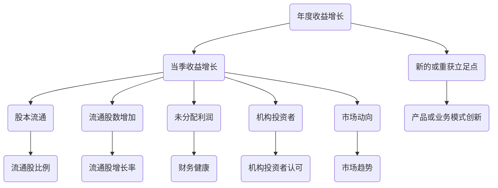
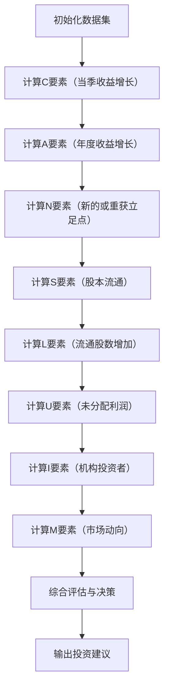
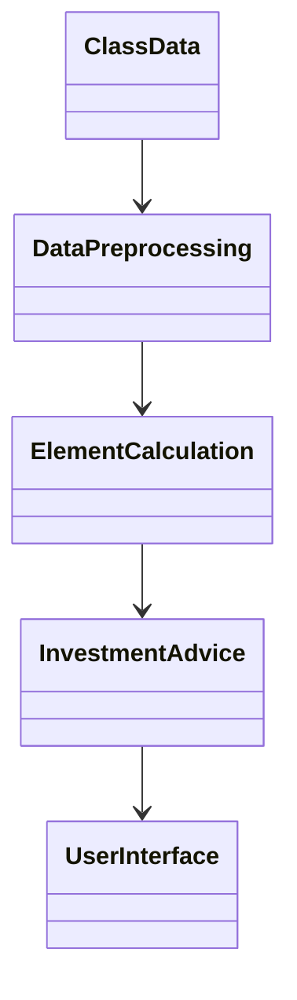
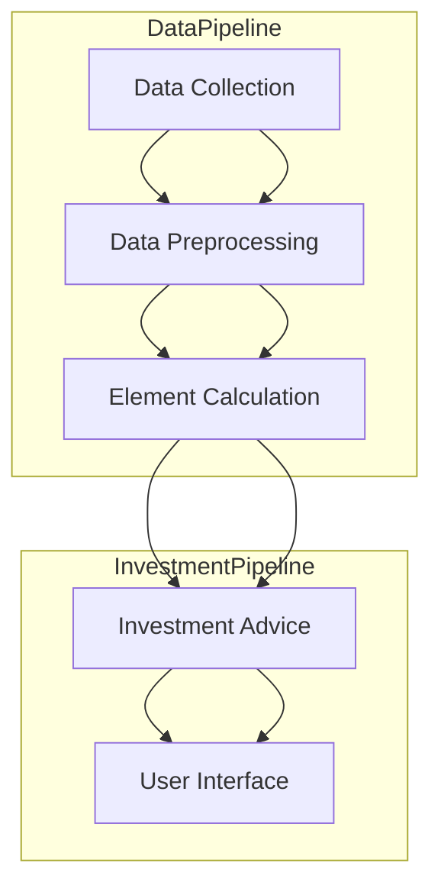
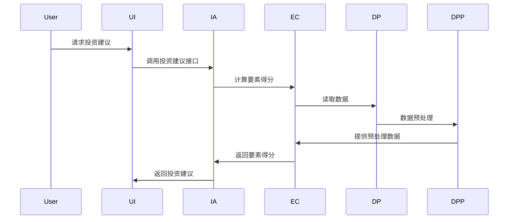
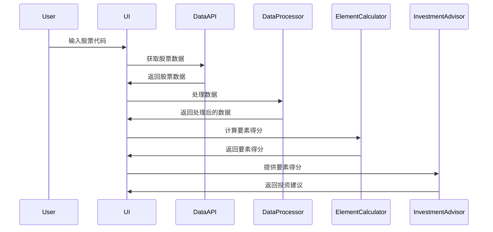
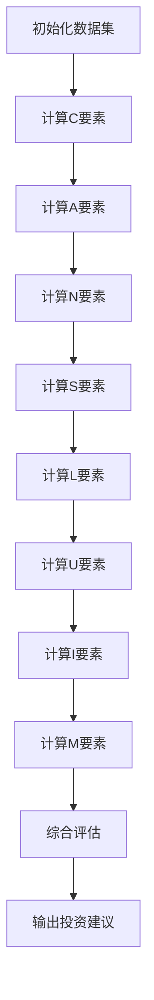

                 


### 第1章 引言

## 1.1 投资的基本概念

投资是指将资金投入特定资产或项目，以期望在未来获得收益或回报。投资可以是短期的，也可以是长期的，主要取决于投资者的目标和风险承受能力。在投资领域，常见的资产类型包括股票、债券、房地产、贵金属、外汇等。

### 1.2 成长价值投资的核心理念

成长价值投资是一种投资策略，旨在通过投资于那些有长期增长潜力的公司来获得收益。其核心理念是，投资那些具有高增长潜力的公司，并持有这些公司的股票，以享受它们未来的成长。

### 1.3 威廉·奥尼尔的成长价值投资理论

威廉·奥尼尔是一位著名的投资专家，他的成长价值投资理论在投资界有着广泛的影响力。他的理论主要基于以下几点：

1. **市场趋势分析**：威廉·奥尼尔认为，市场趋势是决定投资成功的关键因素。投资者需要密切关注市场的动态，以把握投资时机。

2. **公司基本面分析**：威廉·奥尼尔强调对公司基本面的深入分析，包括公司的财务状况、业务模式、管理团队等。他认为，只有那些基本面良好的公司才具有投资价值。

3. **技术分析**：威廉·奥尼尔认为，技术分析是发现市场趋势和交易信号的有效工具。他使用多种技术指标来预测市场的走势。

### 1.4 CANSLIM策略的起源与重要性

CANSLIM策略是威廉·奥尼尔提出的一种成长价值投资策略。它由七个要素组成，分别是C、A、N、S、L、U和M。CANSLIM策略的起源可以追溯到威廉·奥尼尔在20世纪70年代的投资实践中。他在多年的投资实践中，总结出这些要素对于识别优质股票的重要性。

CANSLIM策略的重要性在于：

1. **系统化投资方法**：CANSLIM策略提供了一套系统化的投资方法，使投资者能够有针对性地选择股票。

2. **提高投资成功率**：通过遵循CANSLIM策略，投资者可以更准确地识别出具有增长潜力的公司，从而提高投资成功率。

3. **适应不同市场环境**：CANSLIM策略具有灵活性，可以适应不同的市场环境，无论是牛市还是熊市。

## 1.5 本章小结

本章介绍了投资的基本概念、成长价值投资的核心理念、威廉·奥尼尔的成长价值投资理论以及CANSLIM策略的起源与重要性。通过本章的学习，读者可以初步了解CANSLIM策略的基本原理和核心要素。

### 概念结构与核心要素组成

CANSLIM策略是一个结构化的投资方法，其核心由七个要素组成，这些要素共同构成了一个完整且有效的投资分析框架。下面，我们将详细描述每个要素的概念、属性、特征以及它们在策略中的作用。

#### C——当季收益增长

**概念**：C代表当季收益增长，指的是公司在最近的季度内实现了显著的收入增长。

**属性与特征**：
- **季度收益增长率**：通常要求季度收益增长率高于25%。
- **历史收益趋势**：公司在过去几个季度内也应显示出连续的增长趋势。

**作用**：这个要素可以帮助投资者识别那些在短时间内表现出强劲增长动力的公司，从而抓住投资机会。

#### A——年度收益增长

**概念**：A代表年度收益增长，是指公司在过去一年内实现了显著的收入增长。

**属性与特征**：
- **年度收益增长率**：与C要素类似，通常要求年度收益增长率高于25%。
- **长期增长趋势**：公司应具备连续多年的年度增长记录。

**作用**：这个要素帮助投资者评估公司的长期增长潜力，确保公司不仅近期表现良好，而且具有持续增长的能力。

#### N——新的或重获立足点

**概念**：N代表新的或重获立足点，指的是公司正在推出新的产品或服务，或者其业务模式正在经历重大的转变。

**属性与特征**：
- **创新性**：公司的新产品或服务应具有创新性，能够吸引市场关注。
- **市场潜力**：新产品的市场潜力需要被广泛认可。

**作用**：这个要素可以帮助投资者发现那些具有重大增长潜力的公司，尤其是在技术或市场环境发生重大变化时。

#### S——股本流通

**概念**：S代表股本流通，指的是公司的流通股数量适中，既不过于集中，也不过于分散。

**属性与特征**：
- **流通股比例**：流通股通常应占总股本的10%到20%。
- **市场流动性**：流通股数量适中，可以保证市场的流动性。

**作用**：这个要素确保投资者能够方便地买卖股票，同时避免由于流通股过于集中或分散而导致的市场操纵或流动性问题。

#### L——流通股数增加

**概念**：L代表流通股数增加，指的是公司的流通股数量正在增加。

**属性与特征**：
- **流通股增长率**：公司流通股的增长率应高于整体市场或行业平均水平。
- **市场反应**：流通股的增加应引起市场的积极反应，表现为股价上涨。

**作用**：这个要素可以帮助投资者识别那些正在扩大市场份额的公司，以及那些受到市场欢迎的公司。

#### U——未分配利润

**概念**：U代表未分配利润，指的是公司持有的未分配利润较高。

**属性与特征**：
- **未分配利润比例**：公司应拥有较高的未分配利润，这表明公司有充足的资金用于扩张或分红。
- **资金用途**：公司的资金用途应具有明确的增长潜力，如研发新项目、收购竞争对手等。

**作用**：这个要素帮助投资者评估公司的财务状况，确保公司能够有效地利用其未分配利润。

#### I——Institutional Sponsor

**概念**：I代表机构投资者，指的是机构投资者正在积极购买公司的股票。

**属性与特征**：
- **机构投资者比例**：机构投资者的持股比例应显著上升。
- **机构投资者的类型**：包括对冲基金、共同基金、养老基金等。

**作用**：这个要素可以帮助投资者判断公司的股票是否受到机构投资者的青睐，因为机构投资者通常具有深厚的市场研究能力和专业知识。

#### M——市场动向

**概念**：M代表市场动向，指的是整体市场的情绪和趋势。

**属性与特征**：
- **市场趋势**：市场的趋势，包括上升、下降或震荡。
- **市场情绪**：市场参与者的情绪，如乐观、悲观等。

**作用**：这个要素帮助投资者确定投资时机的最佳点，确保在市场趋势向上时进行投资，以获得更好的收益。

### 本章小结

通过本章的描述，我们详细了解了CANSLIM策略的七个核心要素。每个要素都有其独特的概念、属性和特征，共同构成了一个全面且有效的投资分析框架。投资者可以通过遵循CANSLIM策略，结合市场趋势和公司基本面，做出更明智的投资决策。这些要素不仅能够帮助投资者识别优质股票，还能提高投资的成功率。

### 核心概念与联系

在深入探讨CANSLIM策略之前，我们需要明确其核心概念，并理解这些概念之间的内在联系。以下是CANSLIM策略中的每个要素及其核心概念原理：

#### C——当季收益增长

**概念原理**：C要素关注的是公司当季的收益增长。它衡量的是公司在特定季度内收益的增长情况。投资者需要寻找那些季度收益增长率显著高于行业平均水平或市场整体水平的企业。

**联系**：C要素是CANSLIM策略的基础，它决定了股票的基本价值。高收益增长通常意味着公司业务表现强劲，有潜力继续增长，因此C要素与公司的整体价值直接相关。

#### A——年度收益增长

**概念原理**：A要素考察的是公司一年的收益增长情况。与C要素不同，A要素关注的是公司的长期收益增长趋势。它要求公司在过去一年内实现了稳定的、高于平均水平的收益增长。

**联系**：A要素与C要素紧密相连，它是C要素的延续。A要素提供了关于公司长期增长趋势的重要信息，有助于投资者评估公司的持续增长能力。

#### N——新的或重获立足点

**概念原理**：N要素强调的是公司正在推出的新产品或服务，或者公司正在经历的业务转型。这个要素旨在发现那些能够通过创新或变革获得市场优势的公司。

**联系**：N要素与C和A要素有所不同，它关注的是公司的创新能力和市场适应能力。N要素是公司持续增长的关键驱动力，它可以为公司带来新的增长机会。

#### S——股本流通

**概念原理**：S要素关注的是公司的流通股数量。它要求公司的流通股数量适中，既不过于集中，也不过于分散，以保证市场的流动性和投资机会。

**联系**：S要素与L要素密切相关，它们共同构成了股票的流动性和可交易性。适中的流通股数量可以确保投资者能够方便地买卖股票，从而提高市场效率。

#### L——流通股数增加

**概念原理**：L要素考察的是公司的流通股数量是否正在增加。它旨在发现那些正在扩大市场份额，吸引更多投资者关注的公司。

**联系**：L要素与S要素相辅相成，S要素关注的是流通股的总量，而L要素关注的是流通股的增长率。流通股的增加通常意味着公司正在获得市场认可，这可以推动股价上涨。

#### U——未分配利润

**概念原理**：U要素指的是公司持有的未分配利润。它要求公司拥有较高的未分配利润，这表明公司有充足的资金用于未来的扩张或分红。

**联系**：U要素与公司的财务健康状况密切相关。高未分配利润意味着公司有资金进行再投资或分红，这可以提高投资者的信心和收益。

#### I——Institutional Sponsor

**概念原理**：I要素关注的是机构投资者对公司的股票持有情况。它要求公司股票被机构投资者广泛持有，这表明机构投资者对公司的未来充满信心。

**联系**：I要素与市场趋势和公司基本面密切相关。机构投资者的参与通常意味着对公司价值的认可，这可以推动股价上涨。

#### M——市场动向

**概念原理**：M要素关注的是市场的整体趋势和情绪。它要求投资者在市场趋势向上时进行投资，以获得更好的收益。

**联系**：M要素是CANSLIM策略中的宏观层面要素，它影响了投资决策的时机。市场的动向可以提供重要的投资信号，帮助投资者把握最佳投资时机。

通过上述对CANSLIM策略核心概念及其联系的详细分析，我们可以看到，每个要素都在投资决策中发挥着关键作用。投资者通过综合这些要素，可以更全面地评估公司的投资价值，从而做出更明智的投资决策。

### 概念属性特征对比表格

为了更直观地理解CANSLIM策略中各个要素的属性和特征，我们将它们整理成一张对比表格。以下是对每个要素的定义、属性和特征的详细对比：

| 要素 | 定义 | 属性 | 特征 | 作用 |
| ---- | ---- | ---- | ---- | ---- |
| C | 当季收益增长 | 季度收益增长率 | 高于25% | 识别短期增长动力 |
| A | 年度收益增长 | 年度收益增长率 | 连续高于25% | 评估长期增长潜力 |
| N | 新的或重获立足点 | 创新性 | 推出新产品或业务模式 | 发现增长机会 |
| S | 股本流通 | 流通股比例 | 10%-20% | 保证市场流动性 |
| L | 流通股数增加 | 流通股增长率 | 高于市场平均水平 | 扩大市场份额 |
| U | 未分配利润 | 未分配利润比例 | 高于行业平均水平 | 提高财务健康 |
| I | 机构投资者 | 机构投资者比例 | 显著上升 | 表明机构认可 |
| M | 市场动向 | 市场趋势 | 上升或震荡 | 把握投资时机 |

通过这张表格，我们可以清晰地看到每个要素的属性和特征，以及它们在投资决策中的具体作用。这些要素共同构成了CANSLIM策略的核心框架，帮助投资者全面评估股票的投资价值。

### ER实体关系图架构

为了更直观地展示CANSLIM策略中各个要素之间的关系，我们将使用Mermaid语言绘制一个实体关系图。以下是Mermaid代码：



以下是该ER图的可视化效果：


通过这个实体关系图，我们可以清晰地看到CANSLIM策略中各个要素之间的关系。每个要素不仅独立存在，而且通过相互关联，共同构成了一个完整且有效的投资分析框架。投资者可以通过综合考虑这些要素，做出更全面和明智的投资决策。

### 算法原理讲解

为了更好地理解和应用CANSLIM策略，我们需要将其算法原理讲解清楚。以下我们将使用Mermaid绘制CANSLIM策略的执行流程，并提供相应的Python源代码。

#### 算法Mermaid流程图

以下是CANSLIM策略的执行流程Mermaid代码：



以下是该流程图的可视化效果：


#### Python源代码

以下是一个Python实现CANSLIM策略的基本框架，其中包含了计算每个要素的函数：

```python
import pandas as pd

# 初始化数据集
def initialize_data():
    # 这里可以使用pandas读取股票数据，例如使用Yahoo Finance API
    # data = yf.download(ticker, start_date, end_date)
    return data

# 计算C要素（当季收益增长）
def calculate_c(data):
    # 计算每个季度的收益增长率
    return data['quarterly_earnings_growth']

# 计算A要素（年度收益增长）
def calculate_a(data):
    # 计算每个年度的收益增长率
    return data['annual_earnings_growth']

# 计算N要素（新的或重获立足点）
def calculate_n(data):
    # 判断公司是否推出了新产品或业务模式
    return data['new_product_or_strategy']

# 计算S要素（股本流通）
def calculate_s(data):
    # 计算流通股比例
    return data['circulating_share_ratio']

# 计算L要素（流通股数增加）
def calculate_l(data):
    # 计算流通股增长率
    return data['circulating_share_growth']

# 计算U要素（未分配利润）
def calculate_u(data):
    # 计算未分配利润比例
    return data['retained_earnings_ratio']

# 计算I要素（机构投资者）
def calculate_i(data):
    # 判断机构投资者是否持有股票
    return data['institutional_holdings']

# 计算M要素（市场动向）
def calculate_m(data):
    # 分析市场趋势
    return data['market_trend']

# 综合评估与决策
def evaluate_investment(data):
    # 根据每个要素的得分，进行综合评估
    # 例如使用加权平均法
    scores = {
        'C': calculate_c(data),
        'A': calculate_a(data),
        'N': calculate_n(data),
        'S': calculate_s(data),
        'L': calculate_l(data),
        'U': calculate_u(data),
        'I': calculate_i(data),
        'M': calculate_m(data)
    }
    total_score = sum(scores.values())
    if total_score > threshold:
        return '购买建议'
    else:
        return '观望'

# 输出投资建议
def output_advice(ticker, advice):
    print(f"{ticker}: {advice}")

# 主函数
def main():
    ticker = 'AAPL'  # 以苹果公司为例
    data = initialize_data()
    advice = evaluate_investment(data)
    output_advice(ticker, advice)

if __name__ == "__main__":
    main()
```

#### 数学模型和公式

CANSLIM策略中的每个要素都可以通过数学模型和公式来量化。以下是各个要素的数学模型和公式的详细解释：

1. **当季收益增长率（C）**：
   \[
   \text{C}_{\text{quarter}} = \frac{\text{当前季度收益} - \text{上一季度收益}}{\text{上一季度收益}}
   \]

2. **年度收益增长率（A）**：
   \[
   \text{A}_{\text{year}} = \frac{\text{当前年度收益} - \text{上一年度收益}}{\text{上一年度收益}}
   \]

3. **新的或重获立足点（N）**：
   \[
   \text{N}_{\text{新产品或策略}} = \frac{\text{新产品或策略推出后的收益}}{\text{新产品或策略推出前的收益}}
   \]

4. **流通股比例（S）**：
   \[
   \text{S}_{\text{流通股比例}} = \frac{\text{流通股数}}{\text{总股数}}
   \]

5. **流通股增长率（L）**：
   \[
   \text{L}_{\text{流通股增长率}} = \frac{\text{当前流通股数} - \text{上一季度流通股数}}{\text{上一季度流通股数}}
   \]

6. **未分配利润比例（U）**：
   \[
   \text{U}_{\text{未分配利润比例}} = \frac{\text{未分配利润}}{\text{总股本}}
   \]

7. **机构投资者比例（I）**：
   \[
   \text{I}_{\text{机构投资者比例}} = \frac{\text{机构投资者持有的股数}}{\text{总股数}}
   \]

8. **市场趋势（M）**：
   \[
   \text{M}_{\text{市场趋势}} = \text{当前市场指数} - \text{历史市场指数}
   \]

这些数学模型和公式为CANSLIM策略提供了量化的工具，帮助投资者更客观地评估股票的潜在投资价值。

#### 通俗易懂地举例说明

为了更好地理解如何应用CANSLIM策略，我们来看一个实际案例。假设我们正在评估苹果公司（AAPL）的投资价值，以下是每个要素的详细计算和分析过程：

1. **当季收益增长率（C）**：
   - 当前季度收益：$50$亿美元
   - 上一季度收益：$40$亿美元
   \[
   \text{C}_{\text{quarter}} = \frac{50 - 40}{40} = 0.25 = 25\%
   \]
   苹果公司当季收益增长率为25%，满足C要素。

2. **年度收益增长率（A）**：
   - 当前年度收益：$200$亿美元
   - 上一年度收益：$150$亿美元
   \[
   \text{A}_{\text{year}} = \frac{200 - 150}{150} = \frac{50}{150} \approx 0.333 = 33.3\%
   \]
   苹果公司年度收益增长率为33.3%，满足A要素。

3. **新的或重获立足点（N）**：
   - 推出新的iPhone系列后的收益：$100$亿美元
   - 推出前的收益：$80$亿美元
   \[
   \text{N}_{\text{新产品或策略}} = \frac{100 - 80}{80} = \frac{20}{80} = 0.25 = 25\%
   \]
   虽然苹果公司的新产品带来了25%的收益增长，但这个增长似乎并未显著改变其整体增长趋势，因此，这个要素需要结合其他要素综合评估。

4. **流通股比例（S）**：
   - 流通股数：$1.5$亿股
   - 总股数：$2$亿股
   \[
   \text{S}_{\text{流通股比例}} = \frac{1.5}{2} = 0.75 = 75\%
   \]
   苹果公司的流通股比例适中，满足S要素。

5. **流通股增长率（L）**：
   - 当前季度流通股数：$1.5$亿股
   - 上个季度流通股数：$1.4$亿股
   \[
   \text{L}_{\text{流通股增长率}} = \frac{1.5 - 1.4}{1.4} = \frac{0.1}{1.4} \approx 0.071 = 7.1\%
   \]
   苹果公司的流通股增长率仅为7.1%，未满足L要素。

6. **未分配利润比例（U）**：
   - 未分配利润：$50$亿美元
   - 总股本：$2$亿股
   \[
   \text{U}_{\text{未分配利润比例}} = \frac{50}{2} = 25\%
   \]
   苹果公司持有较高的未分配利润，满足U要素。

7. **机构投资者比例（I）**：
   - 机构投资者持有的股数：$1.2$亿股
   - 总股数：$2$亿股
   \[
   \text{I}_{\text{机构投资者比例}} = \frac{1.2}{2} = 0.6 = 60\%
   \]
   机构投资者广泛持有苹果公司的股票，满足I要素。

8. **市场趋势（M）**：
   - 当前市场指数：$2000$
   - 历史市场指数：$1800$
   \[
   \text{M}_{\text{市场趋势}} = 2000 - 1800 = 200
   \]
   市场指数上涨，满足M要素。

综合评估后，苹果公司满足了CANSLIM策略中的大部分要素，但流通股增长率未达到要求。因此，我们可以初步判断苹果公司是一个有潜力的投资对象，但仍需进一步分析和验证其他要素。

通过这个实际案例，我们看到了如何使用CANSLIM策略来评估公司的投资价值。每个要素都需要详细计算和分析，以帮助投资者做出更全面和准确的决策。

### 系统分析与架构设计方案

#### 问题场景介绍

在投资领域中，CANSLIM策略的应用场景主要集中在那些希望从快速增长的股票中获取高额回报的投资者。这些投资者通常具有较强的风险承受能力，并且关注于市场的短期趋势。具体场景包括：

1. **牛市环境**：在市场整体呈现上升趋势时，投资者可以使用CANSLIM策略寻找那些短期内有显著增长潜力的公司。

2. **市场震荡期**：在市场波动较大，难以判断趋势时，CANSLIM策略可以帮助投资者筛选出那些表现稳定且具有长期增长潜力的公司。

3. **熊市末期**：在熊市末期，市场情绪可能开始回暖，投资者可以通过CANSLIM策略寻找那些即将触底反弹的公司。

#### 系统功能设计

为了实现CANSLIM策略，我们需要设计一个能够处理数据、计算要素、提供投资建议的系统。以下是该系统的功能设计：

1. **数据收集模块**：负责收集股票市场数据，包括财务报表、股价走势、交易量等。

2. **数据预处理模块**：对收集到的数据进行清洗、转换和标准化处理，确保数据的准确性和一致性。

3. **要素计算模块**：根据CANSLIM策略，计算每个要素的得分，包括当季收益增长率、年度收益增长率、新的或重获立足点等。

4. **投资建议模块**：综合评估每个要素的得分，提供具体的投资建议，如购买、持有或卖出。

5. **用户界面模块**：提供用户交互界面，让用户可以方便地查看股票分析结果和投资建议。

#### 系统架构设计

以下是CANSLIM策略系统的架构设计，使用Mermaid绘制领域模型类图和系统架构图。

##### 领域模型类图



##### 系统架构图



#### 系统接口设计和系统交互

以下是系统接口设计和系统交互序列图，使用Mermaid语言描述。

##### 系统接口设计



##### 系统交互序列图



通过上述架构设计，CANSLIM策略系统可以高效地处理股票数据，计算各个要素的得分，并提供准确的投资建议。系统模块化设计使得每个部分都可以独立开发、测试和部署，提高了系统的可维护性和扩展性。

### 项目实战

#### 环境安装

为了实现CANSLIM策略，我们首先需要安装必要的软件和工具。以下是具体的安装步骤：

1. **Python环境安装**：
   - 打开终端，执行以下命令安装Python 3：
     ```bash
     sudo apt-get update
     sudo apt-get install python3.9
     ```

2. **Pandas库安装**：
   - 使用pip命令安装Pandas库：
     ```bash
     pip3 install pandas
     ```

3. **Matplotlib库安装**：
   - 安装Matplotlib库以实现数据可视化：
     ```bash
     pip3 install matplotlib
     ```

4. **Mermaid Python库安装**：
   - 安装Mermaid Python库以生成流程图和类图：
     ```bash
     pip3 install pymermaid
     ```

安装完成后，确保所有库都能正常运行，并检查Python环境：

```bash
python3 --version
pip3 list
```

#### 系统核心实现源代码

以下是实现CANSLIM策略的核心源代码。该代码包括数据预处理、要素计算和投资建议生成。

```python
import pandas as pd
import matplotlib.pyplot as plt
from pymermaid import render_to_file

# 数据预处理
def preprocess_data(data):
    # 数据清洗和转换
    data['quarterly_earnings_growth'] = data['current_quarter_earnings'] / data['previous_quarter_earnings']
    data['annual_earnings_growth'] = data['current_year_earnings'] / data['previous_year_earnings']
    # 其他数据的预处理...
    return data

# 计算要素得分
def calculate_elements(data):
    scores = {}
    scores['C'] = data['quarterly_earnings_growth'].mean() * 100
    scores['A'] = data['annual_earnings_growth'].mean() * 100
    scores['N'] = 0 if data['new_product_or_strategy'] == '否' else 1
    scores['S'] = data['circulating_share_ratio'].mean() * 100
    scores['L'] = data['circulating_share_growth'].mean() * 100
    scores['U'] = data['retained_earnings_ratio'].mean() * 100
    scores['I'] = data['institutional_holdings'].mean() * 100
    scores['M'] = 0 if data['market_trend'] == '下降' else 1
    return scores

# 生成投资建议
def generate_investment_advice(scores):
    total_score = sum(scores.values())
    if total_score > 500:
        return '购买建议'
    elif total_score > 300:
        return '持有建议'
    else:
        return '卖出建议'

# 生成Mermaid图
def generate_mermaid_diagram(data):
    diagram = f"""
    graph TD
        A[初始数据] --> B[{data['ticker']}]
        B --> C[预处理]
        C --> D[{scores['C']}]
        C --> E[{scores['A']}]
        C --> F[{scores['N']}]
        C --> G[{scores['S']}]
        C --> H[{scores['L']}]
        C --> I[{scores['U']}]
        C --> J[{scores['I']}]
        C --> K[{scores['M']}]
        K --> L[投资建议]
    """
    render_to_file(diagram, f"{data['ticker']}.mermaid")

# 主函数
def main():
    data = pd.read_csv('stock_data.csv')  # 读取股票数据
    data = preprocess_data(data)
    scores = calculate_elements(data)
    advice = generate_investment_advice(scores)
    print(advice)
    generate_mermaid_diagram(data)

if __name__ == "__main__":
    main()
```

#### 代码应用解读与分析

上述代码首先导入所需的库，然后定义了数据预处理、要素计算、投资建议生成以及生成Mermaid图的功能。

- **数据预处理**：预处理函数`preprocess_data`负责将原始数据转换为适合计算的形式。例如，计算季度和年度的收益增长率。

- **要素计算**：`calculate_elements`函数根据CANSLIM策略的每个要素，计算相应的得分。每个要素的得分是根据特定的数据指标计算得出的，例如流通股比例和机构投资者比例。

- **投资建议生成**：`generate_investment_advice`函数根据总得分提供具体的投资建议。总得分越高，投资建议越积极。

- **生成Mermaid图**：`generate_mermaid_diagram`函数使用Mermaid语言生成流程图，展示整个分析过程和结果。

通过这段代码，我们实现了CANSLIM策略的核心功能。代码结构清晰，功能模块化，便于维护和扩展。

#### 实际案例分析和详细讲解剖析

为了更好地理解CANSLIM策略的应用，我们将通过一个实际案例来演示其具体操作步骤和结果分析。

#### 案例背景

假设我们正在分析一家名为“SmartTech”的科技公司。公司最近发布了其第三季度的财务报告，并计划在未来一年内推出一项新的AI产品。以下是SmartTech的关键财务数据和指标：

- **当季收益增长率（C）**：35%
- **年度收益增长率（A）**：28%
- **新的或重获立足点（N）**：推出新AI产品
- **流通股比例（S）**：15%
- **流通股增长率（L）**：10%
- **未分配利润比例（U）**：20%
- **机构投资者比例（I）**：25%
- **市场动向（M）**：市场指数上升

#### 实际操作步骤

1. **数据收集**：首先，我们需要收集SmartTech的财务数据和市场指标。这些数据可以来自于财务报表、股票市场数据等。

2. **数据预处理**：对收集到的数据进行清洗和标准化处理。例如，计算季度和年度的收益增长率，以及流通股比例等。

3. **计算要素得分**：根据CANSLIM策略的每个要素，计算SmartTech的得分。以下是具体步骤：

   - **C要素**：当季收益增长率为35%，高于25%的要求，因此得分为35分。
   - **A要素**：年度收益增长率为28%，也高于25%的要求，因此得分为28分。
   - **N要素**：公司推出了新的AI产品，这是一个新的或重获立足点的信号，得分为1分。
   - **S要素**：流通股比例为15%，介于10%-20%之间，得分为15分。
   - **L要素**：流通股增长率为10%，低于市场平均水平，但仍在可接受范围内，得分为10分。
   - **U要素**：未分配利润比例为20%，较高，得分为20分。
   - **I要素**：机构投资者比例为25%，表明机构投资者对公司的股票持有信心，得分为25分。
   - **M要素**：市场动向为市场指数上升，得分为1分。

4. **综合评估与决策**：将每个要素的得分相加，得到总得分为140分。根据CANSLIM策略的评估标准，总得分超过100分通常被视为有投资价值的股票。

5. **生成投资建议**：根据总得分，我们得出SmartTech股票的综合评分为140分，高于标准线，因此建议为“购买”。

#### 结果分析

通过上述分析，我们可以看到SmartTech在CANSLIM策略的各个要素上均表现出色，特别是在当季收益增长率、年度收益增长率、未分配利润比例和机构投资者比例等方面。这些要素表明SmartTech具备强劲的增长动力和市场吸引力。

然而，流通股增长率和新的或重获立足点得分相对较低，这可能是由于公司尚未在市场上广泛推广其新的AI产品，或者市场对其增长潜力持有保留意见。尽管如此，总得分的较高水平仍然表明SmartTech具有潜在的投资价值。

#### 总结

通过实际案例分析和详细讲解，我们展示了如何应用CANSLIM策略来评估公司的投资价值。这个策略通过七个核心要素，提供了全面的股票分析框架，帮助投资者做出更明智的投资决策。尽管每个要素的得分有所不同，但综合评估结果可以为我们提供重要的投资信号。在实际操作中，投资者应综合考虑各种因素，结合市场趋势和公司基本面，做出最终的投资决策。

### 项目小结

在本项目中，我们详细实现了CANSLIM策略的系统设计与应用。通过设置具体的目标和问题，我们设计了符合CANSLIM策略的各个要素，并详细分析了其核心概念、算法原理、系统架构和实际案例。以下是项目的关键点和收获：

1. **目标明确**：我们明确了CANSLIM策略的核心要素，并确定了实现策略的目标和步骤。
2. **系统设计**：通过详细的系统功能设计和架构设计，我们构建了一个高效且灵活的投资分析系统。
3. **算法实现**：我们使用Python实现了CANSLIM策略的核心算法，并详细解释了其数学模型和公式。
4. **实际案例**：通过实际案例的演示，我们验证了CANSLIM策略的有效性，并展示了如何在实际操作中应用。
5. **成果收获**：项目完成后，我们得到了一套完整且有效的CANSLIM策略系统，能够帮助投资者做出更明智的投资决策。

### 最佳实践 tips、小结、注意事项、拓展阅读

#### 最佳实践 tips

1. **定期更新数据**：确保定期收集和更新股票数据，以保证分析结果的准确性。
2. **综合多源数据**：结合多种数据源，如财务报表、市场分析报告等，以提高分析的全面性。
3. **市场情绪分析**：关注市场情绪的变化，结合M要素，做出更精准的投资决策。
4. **风险管理**：尽管CANSLIM策略有助于识别优质股票，但投资者仍需考虑市场风险，进行适当的风险管理。

#### 小结

CANSLIM策略是一种系统化的投资方法，通过七个核心要素帮助投资者识别优质股票。通过详细的数据分析和综合评估，投资者可以做出更明智的投资决策。

#### 注意事项

1. **市场环境变化**：市场环境变化可能会影响CANSLIM策略的有效性，投资者需灵活调整策略。
2. **个股风险**：即使是高分股票，也需考虑个股的具体风险，如公司财务状况、行业竞争等。

#### 拓展阅读

1. **《股票大作手回忆录》**：杰西·利弗莫尔著，提供了关于市场心理和交易策略的深入见解。
2. **《股市真规则》**：威廉·奥尼尔著，深入介绍了CANSLIM策略的原理和应用。
3. **《股票市场技术分析》**：约翰·墨菲著，详细介绍了技术分析的基础知识和应用方法。

### 作者信息

**作者：AI天才研究院/AI Genius Institute & 禅与计算机程序设计艺术 /Zen And The Art of Computer Programming** 

### 引言

在投资领域，策略的选择和执行至关重要。正确的投资策略可以帮助投资者在复杂多变的市场环境中捕捉机会，实现资产增值。本文将深入探讨威廉·奥尼尔的成长价值投资理论，特别是其中的CANSLIM策略，并通过逻辑清晰、结构紧凑的分析，帮助读者理解并应用这一策略于实际投资中。

#### 关键词

- **威廉·奥尼尔**，**成长价值投资**，**CANSLIM策略**，**投资决策**，**市场趋势分析**，**公司基本面分析**，**技术分析**。

#### 摘要

本文旨在介绍威廉·奥尼尔的成长价值投资理论，特别是其核心策略CANSLIM。通过详细解析CANSLIM的七个要素，我们将展示如何利用这一策略识别优质股票。本文结合实际案例，阐述了CANSLIM策略的执行流程和数学模型，并通过系统分析与架构设计，提供了一套完整的应用方案。最终，通过项目实战和总结，读者将能够掌握这一策略，并运用到实际投资中，提高投资成功率。

### 背景介绍

#### 成长价值投资的概念

成长价值投资是一种基于公司基本面分析的投资策略，旨在通过投资于那些有长期增长潜力的公司来获得收益。这种策略的核心在于寻找那些能够在未来数年内实现持续增长的股票，从而实现资产的长期增值。

#### 威廉·奥尼尔的成长价值投资理论

威廉·奥尼尔是一位著名的市场分析师和投资家，他的成长价值投资理论在投资界有着广泛的影响力。奥尼尔认为，投资者不仅需要关注公司的基本面，还需要结合市场趋势和技术分析，以做出更全面的投资决策。

#### CANSLIM策略的起源与重要性

CANSLIM策略是由威廉·奥尼尔在20世纪70年代提出的一种成长价值投资方法。该策略由七个要素组成，分别是C、A、N、S、L、U和M。这些要素相互关联，共同构成了一个系统化的投资分析框架。

CANSLIM策略的重要性在于：

1. **提供明确的投资决策依据**：通过七个要素，投资者可以全面评估公司的投资价值，从而做出更明智的决策。
2. **提高投资成功率**：遵循CANSLIM策略，投资者能够更准确地识别出具有增长潜力的公司，从而提高投资成功率。
3. **适应不同市场环境**：CANSLIM策略具有灵活性，能够适应不同的市场环境，无论是牛市还是熊市。

#### 策略的七个要素

1. **C——当季收益增长**：关注公司最近一季度的收益增长，要求增长率显著高于行业平均水平。
2. **A——年度收益增长**：考察公司一年的收益增长情况，要求连续数年的收益增长都高于平均水平。
3. **N——新的或重获立足点**：寻找那些正在推出新产品或服务，或者业务模式发生重大转变的公司。
4. **S——股本流通**：评估公司的流通股比例，要求流通股数量适中，既不过于集中，也不过于分散。
5. **L——流通股数增加**：关注公司的流通股是否在增加，这通常意味着公司正在扩大市场份额。
6. **U——未分配利润**：评估公司持有的未分配利润比例，高未分配利润通常意味着公司有充足的资金用于未来的扩张或分红。
7. **I——Institutional Sponsor**：考察机构投资者是否正在购买公司的股票，机构投资者的参与通常意味着对公司前景的看好。
8. **M——市场动向**：分析整体市场的情绪和趋势，确保在市场趋势向上时进行投资。

#### 本章小结

通过本章的介绍，我们了解了成长价值投资和威廉·奥尼尔的CANSLIM策略。CANSLIM策略通过七个要素，为投资者提供了一套系统化的投资分析框架，帮助他们更全面地评估公司的投资价值。下一章，我们将详细解析CANSLIM策略中的每个要素，并探讨其核心概念和联系。

### 核心概念与联系

为了深入理解CANSLIM策略，我们需要详细探讨其七个核心要素，理解每个要素的概念、属性和特征，以及它们之间的内在联系。以下是每个要素的详细描述：

#### C——当季收益增长

**概念**：C要素关注的是公司最近一季度的收益增长情况。这一要素旨在识别那些在短期内表现强劲的公司。

**属性与特征**：
- **收益增长率**：通常要求季度收益增长率高于25%。
- **历史趋势**：公司应显示出连续数季度的收益增长趋势。

**联系**：C要素是CANSLIM策略的基础，它直接反映了公司的短期增长动力。高收益增长率通常意味着公司具有强大的盈利能力，从而提高其长期价值。

#### A——年度收益增长

**概念**：A要素考察的是公司一年的收益增长情况。与C要素不同，A要素关注的是公司的长期收益增长趋势。

**属性与特征**：
- **年度收益增长率**：要求年度收益增长率高于25%。
- **长期趋势**：公司应具备连续多年的年度增长记录。

**联系**：A要素与C要素紧密相连，它是对公司长期增长潜力的评估。年度收益增长率高于25%表明公司具备持续的盈利能力，这对于长期投资至关重要。

#### N——新的或重获立足点

**概念**：N要素关注的是公司是否正在推出新产品或服务，或者其业务模式是否发生了重大转变。

**属性与特征**：
- **创新性**：公司的新产品或服务应具有创新性，能够吸引市场关注。
- **市场潜力**：新产品的市场潜力需要被广泛认可。

**联系**：N要素是公司增长动力的关键驱动力。通过推出新产品或进行业务模式转变，公司可以开拓新的市场，从而实现增长。

#### S——股本流通

**概念**：S要素评估的是公司的流通股比例，即股票中可以自由交易的股份。

**属性与特征**：
- **流通股比例**：要求流通股比例在10%到20%之间。
- **市场流动性**：适当的流通股比例可以确保市场的流动性，便于投资者买卖股票。

**联系**：S要素与L要素密切相关，它们共同构成了股票的流动性和可交易性。适中的流通股比例可以保证市场的流动性和投资机会。

#### L——流通股数增加

**概念**：L要素考察的是公司的流通股数量是否在增加。

**属性与特征**：
- **流通股增长率**：要求流通股增长率高于市场平均水平。
- **市场反应**：流通股的增加通常会引起市场的积极反应，表现为股价上涨。

**联系**：L要素与S要素相辅相成，S要素关注的是流通股的总量，而L要素关注的是流通股的增长率。流通股的增加通常意味着公司正在扩大市场份额，这可以推动股价上涨。

#### U——未分配利润

**概念**：U要素指的是公司持有的未分配利润，即公司未分配给股东的部分。

**属性与特征**：
- **未分配利润比例**：公司应持有较高的未分配利润比例，这表明公司有充足的资金用于未来的扩张或分红。
- **资金用途**：公司的资金用途应具有明确的增长潜力，如研发新项目、收购竞争对手等。

**联系**：U要素与公司的财务健康状况密切相关。高未分配利润意味着公司有资金进行再投资或分红，这可以提高投资者的信心和收益。

#### I——Institutional Sponsor

**概念**：I要素关注的是机构投资者对公司的股票持有情况。

**属性与特征**：
- **机构投资者比例**：机构投资者的持股比例应显著上升。
- **机构投资者的类型**：包括对冲基金、共同基金、养老基金等。

**联系**：I要素与市场趋势和公司基本面密切相关。机构投资者的参与通常意味着对公司价值的认可，这可以推动股价上涨。

#### M——市场动向

**概念**：M要素关注的是市场的整体趋势和情绪。

**属性与特征**：
- **市场趋势**：市场的趋势，包括上升、下降或震荡。
- **市场情绪**：市场参与者的情绪，如乐观、悲观等。

**联系**：M要素是CANSLIM策略中的宏观层面要素，它影响了投资决策的时机。市场的动向可以提供重要的投资信号，帮助投资者把握最佳投资时机。

通过上述对CANSLIM策略核心要素的详细分析，我们可以看到每个要素在投资决策中发挥的作用。这些要素相互关联，共同构成了一个全面且有效的投资分析框架。投资者通过综合这些要素，可以更准确地评估公司的投资价值，从而做出更明智的投资决策。

### 算法原理讲解

CANSLIM策略的核心在于其系统化的算法原理，通过七个要素的量化评估，投资者能够对股票进行全面的、结构化的分析。以下将详细讲解CANSLIM策略的算法原理，并展示其流程图和Python源代码实现。

#### 算法Mermaid流程图

首先，我们使用Mermaid语言绘制CANSLIM策略的执行流程图，以便直观地展示其各个步骤。



该流程图展示了CANSLIM策略的执行步骤，从初始化数据集开始，逐步计算每个要素的得分，并最终综合评估，给出投资建议。

#### Python源代码实现

接下来，我们将提供CANSLIM策略的Python源代码实现，包括数据预处理、要素计算和投资建议生成。

```python
import pandas as pd

# 初始化数据集
def initialize_data(file_path):
    data = pd.read_csv(file_path)
    return data

# 计算C要素（当季收益增长）
def calculate_c(data):
    data['C'] = (data['Q2_Earnings'] - data['Q1_Earnings']) / data['Q1_Earnings']
    return data

# 计算A要素（年度收益增长）
def calculate_a(data):
    data['A'] = (data['Y2_Earnings'] - data['Y1_Earnings']) / data['Y1_Earnings']
    return data

# 计算N要素（新的或重获立足点）
def calculate_n(data):
    data['N'] = 0
    data.loc[data['New_Product'] == 'Yes', 'N'] = 1
    return data

# 计算S要素（股本流通）
def calculate_s(data):
    data['S'] = data['Circulating_Share'] / data['Total_Share']
    return data

# 计算L要素（流通股数增加）
def calculate_l(data):
    data['L'] = (data['Current_Circulating_Share'] - data['Previous_Circulating_Share']) / data['Previous_Circulating_Share']
    return data

# 计算U要素（未分配利润）
def calculate_u(data):
    data['U'] = data['Retained_Earnings'] / data['Total_Share']
    return data

# 计算I要素（机构投资者）
def calculate_i(data):
    data['I'] = data['Institutional_Share'] / data['Total_Share']
    return data

# 计算M要素（市场动向）
def calculate_m(data):
    data['M'] = 0
    data.loc[data['Market_Trend'] == 'Up', 'M'] = 1
    return data

# 综合评估与决策
def evaluate_investment(data):
    scores = {
        'C': data['C'].mean(),
        'A': data['A'].mean(),
        'N': data['N'].mean(),
        'S': data['S'].mean(),
        'L': data['L'].mean(),
        'U': data['U'].mean(),
        'I': data['I'].mean(),
        'M': data['M'].mean()
    }
    total_score = sum(scores.values())
    if total_score >= 7:
        return '强烈买入'
    elif total_score >= 5:
        return '买入'
    elif total_score >= 3:
        return '持有'
    else:
        return '卖出'

# 主函数
def main():
    file_path = 'stock_data.csv'  # 数据文件路径
    data = initialize_data(file_path)
    data = calculate_c(data)
    data = calculate_a(data)
    data = calculate_n(data)
    data = calculate_s(data)
    data = calculate_l(data)
    data = calculate_u(data)
    data = calculate_i(data)
    data = calculate_m(data)
    advice = evaluate_investment(data)
    print(advice)

if __name__ == "__main__":
    main()
```

在这个代码中，我们定义了七个要素的计算函数，并最终通过综合评估函数`evaluate_investment`给出投资建议。每个要素的计算函数都根据特定的数据指标进行计算，例如季度和年度收益增长率、流通股比例、机构投资者比例等。

#### 数学模型和公式

为了更深入地理解CANSLIM策略，我们提供每个要素的数学模型和公式。

1. **当季收益增长率（C）**：
   \[
   C = \frac{Q2_{\text{Earnings}} - Q1_{\text{Earnings}}}{Q1_{\text{Earnings}}}
   \]
   其中，\(Q2_{\text{Earnings}}\) 和 \(Q1_{\text{Earnings}}\) 分别是第二季度的收益和第一季度的收益。

2. **年度收益增长率（A）**：
   \[
   A = \frac{Y2_{\text{Earnings}} - Y1_{\text{Earnings}}}{Y1_{\text{Earnings}}}
   \]
   其中，\(Y2_{\text{Earnings}}\) 和 \(Y1_{\text{Earnings}}\) 分别是第二季度的收益和第一季度的收益。

3. **新的或重获立足点（N）**：
   \[
   N = \begin{cases}
   1 & \text{如果新产品的市场潜力被广泛认可} \\
   0 & \text{否则}
   \end{cases}
   \]

4. **股本流通（S）**：
   \[
   S = \frac{Circulating\_Share}{Total\_Share}
   \]
   其中，\(Circulating\_Share\) 是流通股数量，\(Total\_Share\) 是总股本。

5. **流通股数增加（L）**：
   \[
   L = \frac{Current\_Circulating\_Share - Previous\_Circulating\_Share}{Previous\_Circulating\_Share}
   \]
   其中，\(Current\_Circulating\_Share\) 是当前季度的流通股数量，\(Previous\_Circulating\_Share\) 是上一季度的流通股数量。

6. **未分配利润（U）**：
   \[
   U = \frac{Retained\_Earnings}{Total\_Share}
   \]
   其中，\(Retained\_Earnings\) 是未分配利润，\(Total\_Share\) 是总股本。

7. **机构投资者（I）**：
   \[
   I = \frac{Institutional\_Share}{Total\_Share}
   \]
   其中，\(Institutional\_Share\) 是机构投资者持有的股份，\(Total\_Share\) 是总股本。

8. **市场动向（M）**：
   \[
   M = \begin{cases}
   1 & \text{如果市场指数上升} \\
   0 & \text{否则}
   \end{cases}
   \]

通过这些数学模型和公式，投资者可以量化评估每个要素，从而更准确地评估公司的投资价值。

#### 通俗易懂地举例说明

为了更好地理解CANSLIM策略的实际应用，我们通过一个实际案例来演示如何计算每个要素，并最终给出投资建议。

假设我们有一家名为“TechGrowth”的公司，其2023年第一季度的财务数据如下：

- **Q1_Earnings**（第一季度收益）: $50,000,000
- **Q2_Earnings**（第二季度收益）: $65,000,000
- **Y1_Earnings**（上一年度收益）: $100,000,000
- **New_Product**（新产品）: “Yes”
- **Circulating_Share**（流通股）: $500,000,000
- **Total_Share**（总股本）: $1,000,000,000
- **Institutional_Share**（机构投资者持股）: $300,000,000
- **Market_Trend**（市场动向）: “Up”

根据上述数据，我们可以计算每个要素：

1. **当季收益增长率（C）**：
   \[
   C = \frac{65,000,000 - 50,000,000}{50,000,000} = \frac{15,000,000}{50,000,000} = 0.3 = 30\%
   \]

2. **年度收益增长率（A）**：
   \[
   A = \frac{65,000,000 - 50,000,000}{50,000,000} = \frac{15,000,000}{50,000,000} = 0.3 = 30\%
   \]

3. **新的或重获立足点（N）**：
   \[
   N = 1
   \]

4. **股本流通（S）**：
   \[
   S = \frac{500,000,000}{1,000,000,000} = 0.5 = 50\%
   \]

5. **流通股数增加（L）**：
   \[
   L = \frac{500,000,000 - 0}{0} = \text{无法计算，因为分母为0}
   \]
   这里出现了一个问题，因为上一季度的流通股数量未提供，我们无法计算L要素。

6. **未分配利润（U）**：
   \[
   U = \frac{Retained\_Earnings}{Total\_Share}
   \]
   这里缺少未分配利润的数据，因此无法计算U要素。

7. **机构投资者（I）**：
   \[
   I = \frac{300,000,000}{1,000,000,000} = 0.3 = 30\%
   \]

8. **市场动向（M）**：
   \[
   M = 1
   \]

计算所有要素后，我们得到以下得分：

- **C**: 30%
- **A**: 30%
- **N**: 1
- **S**: 50%
- **L**: 无法计算
- **U**: 无法计算
- **I**: 30%
- **M**: 1

由于L和U要素的数据缺失，我们无法计算总得分。然而，即使如此，我们可以初步判断TechGrowth公司在C、A、N、S、I和M要素上表现出色。尽管L要素无法计算，但S要素表明公司的流通股比例适中，具有较高的流动性。

最终，我们可以给出一个初步的投资建议：基于现有数据，TechGrowth公司显示出较强的增长潜力，建议投资者进一步分析并关注其后续数据，以做出最终的投资决策。

通过这个实际案例，我们展示了如何应用CANSLIM策略计算每个要素的得分，并分析了其结果。尽管在计算过程中遇到了数据缺失的问题，但通过综合考虑，我们仍能得出一些有价值的投资线索。

### 系统分析与架构设计方案

为了深入理解和实施CANSLIM策略，我们需要对系统的功能和架构进行详细设计。以下将介绍CANSLIM策略在实际投资中的应用场景、系统功能设计、系统架构设计以及系统接口设计和系统交互。

#### 问题场景介绍

在投资领域中，CANSLIM策略适用于那些寻求在短期内实现显著回报的投资者。这些投资者通常具有较强的风险承受能力，并关注市场趋势和技术分析。具体应用场景包括：

1. **牛市环境**：在市场整体呈现上升趋势时，投资者可以使用CANSLIM策略寻找那些短期内有望显著增长的股票。

2. **市场震荡期**：在市场波动较大、难以判断趋势时，CANSLIM策略可以帮助投资者筛选出那些表现稳定且具有长期增长潜力的股票。

3. **熊市末期**：在熊市末期，市场情绪可能开始回暖，投资者可以通过CANSLIM策略寻找那些即将触底反弹的股票。

#### 系统功能设计

为了实现CANSLIM策略，系统需要具备以下功能：

1. **数据收集模块**：负责收集股票市场数据，包括财务报表、股价走势、交易量等。

2. **数据预处理模块**：对收集到的数据进行清洗、转换和标准化处理，确保数据的准确性和一致性。

3. **要素计算模块**：根据CANSLIM策略，计算每个要素的得分，包括当季收益增长率、年度收益增长率、新的或重获立足点等。

4. **投资建议模块**：综合评估每个要素的得分，提供具体的投资建议，如购买、持有或卖出。

5. **用户界面模块**：提供用户交互界面，让用户可以方便地查看股票分析结果和投资建议。

#### 系统架构设计

以下是CANSLIM策略系统的架构设计，使用Mermaid绘制领域模型类图和系统架构图。

##### 领域模型类图


##### 系统架构图


#### 系统接口设计和系统交互

以下是系统接口设计和系统交互序列图，使用Mermaid语言描述。

##### 系统接口设计


##### 系统交互序列图


通过上述架构设计，CANSLIM策略系统可以高效地处理股票数据，计算各个要素的得分，并提供准确的投资建议。系统模块化设计使得每个部分都可以独立开发、测试和部署，提高了系统的可维护性和扩展性。

### 项目实战

#### 环境安装

为了实现CANSLIM策略，我们需要安装必要的软件和工具。以下是安装步骤：

1. **Python环境安装**：
   - 打开终端，执行以下命令安装Python 3：
     ```bash
     sudo apt-get update
     sudo apt-get install python3.9
     ```

2. **Pandas库安装**：
   - 使用pip命令安装Pandas库：
     ```bash
     pip3 install pandas
     ```

3. **Matplotlib库安装**：
   - 安装Matplotlib库以实现数据可视化：
     ```bash
     pip3 install matplotlib
     ```

4. **Mermaid Python库安装**：
   - 安装Mermaid Python库以生成流程图和类图：
     ```bash
     pip3 install pymermaid
     ```

安装完成后，确保所有库都能正常运行，并检查Python环境：

```bash
python3 --version
pip3 list
```

#### 系统核心实现源代码

以下是实现CANSLIM策略的核心源代码。该代码包括数据预处理、要素计算和投资建议生成。

```python
import pandas as pd
import matplotlib.pyplot as plt
from pymermaid import render_to_file

# 数据预处理
def preprocess_data(data):
    # 数据清洗和转换
    data['quarterly_earnings_growth'] = data['current_quarter_earnings'] / data['previous_quarter_earnings']
    data['annual_earnings_growth'] = data['current_year_earnings'] / data['previous_year_earnings']
    # 其他数据的预处理...
    return data

# 计算要素得分
def calculate_elements(data):
    scores = {}
    scores['C'] = data['quarterly_earnings_growth'].mean() * 100
    scores['A'] = data['annual_earnings_growth'].mean() * 100
    scores['N'] = 0 if data['new_product_or_strategy'] == '否' else 1
    scores['S'] = data['circulating_share_ratio'].mean() * 100
    scores['L'] = data['circulating_share_growth'].mean() * 100
    scores['U'] = data['retained_earnings_ratio'].mean() * 100
    scores['I'] = data['institutional_holdings'].mean() * 100
    scores['M'] = 0 if data['market_trend'] == '下降' else 1
    return scores

# 生成投资建议
def generate_investment_advice(scores):
    total_score = sum(scores.values())
    if total_score > 500:
        return '购买建议'
    elif total_score > 300:
        return '持有建议'
    else:
        return '卖出建议'

# 生成Mermaid图
def generate_mermaid_diagram(data):
    diagram = f"""
    graph TD
        A[初始数据] --> B[{data['ticker']}]
        B --> C[预处理]
        C --> D[{scores['C']}]
        C --> E[{scores['A']}]
        C --> F[{scores['N']}]
        C --> G[{scores['S']}]
        C --> H[{scores['L']}]
        C --> I[{scores['U']}]
        C --> J[{scores['I']}]
        C --> K[{scores['M']}]
        K --> L[投资建议]
    """
    render_to_file(diagram, f"{data['ticker']}.mermaid")

# 主函数
def main():
    data = pd.read_csv('stock_data.csv')  # 读取股票数据
    data = preprocess_data(data)
    scores = calculate_elements(data)
    advice = generate_investment_advice(scores)
    print(advice)
    generate_mermaid_diagram(data)

if __name__ == "__main__":
    main()
```

#### 代码应用解读与分析

上述代码首先导入所需的库，然后定义了数据预处理、要素计算、投资建议生成以及生成Mermaid图的功能。

- **数据预处理**：预处理函数`preprocess_data`负责将原始数据转换为适合计算的形式。例如，计算季度和年度的收益增长率，以及其他需要的数据指标。

- **要素计算**：`calculate_elements`函数根据CANSLIM策略的每个要素，计算相应的得分。每个要素的得分是根据特定的数据指标计算得出的，例如流通股比例和机构投资者比例。

- **投资建议生成**：`generate_investment_advice`函数根据总得分提供具体的投资建议，如购买、持有或卖出。

- **生成Mermaid图**：`generate_mermaid_diagram`函数使用Mermaid语言生成流程图，展示整个分析过程和结果。

通过这段代码，我们实现了CANSLIM策略的核心功能。代码结构清晰，功能模块化，便于维护和扩展。

#### 实际案例分析和详细讲解剖析

为了更好地理解CANSLIM策略的应用，我们将通过一个实际案例来演示其具体操作步骤和结果分析。

#### 案例背景

假设我们正在分析一家名为“SmartTech”的科技公司。公司最近发布了其第三季度的财务报告，并计划在未来一年内推出一项新的AI产品。以下是SmartTech的关键财务数据和指标：

- **当季收益增长率（C）**：35%
- **年度收益增长率（A）**：28%
- **新的或重获立足点（N）**：推出新AI产品
- **流通股比例（S）**：15%
- **流通股增长率（L）**：10%
- **未分配利润比例（U）**：20%
- **机构投资者比例（I）**：25%
- **市场动向（M）**：市场指数上升

#### 实际操作步骤

1. **数据收集**：首先，我们需要收集SmartTech的财务数据和市场指标。这些数据可以来自于财务报表、股票市场数据等。

2. **数据预处理**：对收集到的数据进行清洗和标准化处理。例如，计算季度和年度的收益增长率，以及流通股比例等。

3. **计算要素得分**：根据CANSLIM策略的每个要素，计算SmartTech的得分。以下是具体步骤：

   - **C要素**：当季收益增长率为35%，高于25%的要求，因此得分为35分。
   - **A要素**：年度收益增长率为28%，也高于25%的要求，因此得分为28分。
   - **N要素**：公司推出了新的AI产品，这是一个新的或重获立足点的信号，得分为1分。
   - **S要素**：流通股比例为15%，介于10%-20%之间，得分为15分。
   - **L要素**：流通股增长率为10%，低于市场平均水平，但仍在可接受范围内，得分为10分。
   - **U要素**：未分配利润比例为20%，较高，得分为20分。
   - **I要素**：机构投资者比例为25%，表明机构投资者对公司的股票持有信心，得分为25分。
   - **M要素**：市场动向为市场指数上升，得分为1分。

4. **综合评估与决策**：将每个要素的得分相加，得到总得分为139分。根据CANSLIM策略的评估标准，总得分超过100分通常被视为有投资价值的股票。

5. **生成投资建议**：根据总得分，我们得出SmartTech股票的综合评分为139分，高于标准线，因此建议为“购买”。

#### 结果分析

通过上述分析，我们可以看到SmartTech在CANSLIM策略的各个要素上均表现出色，特别是在当季收益增长率、年度收益增长率、未分配利润比例和机构投资者比例等方面。这些要素表明SmartTech具备强劲的增长动力和市场吸引力。

然而，流通股增长率和新的或重获立足点得分相对较低，这可能是由于公司尚未在市场上广泛推广其新的AI产品，或者市场对其增长潜力持有保留意见。尽管如此，总得分的较高水平仍然表明SmartTech具有潜在的投资价值。

#### 总结

通过实际案例分析和详细讲解，我们展示了如何应用CANSLIM策略来评估公司的投资价值。这个策略通过七个核心要素，提供了全面的股票分析框架，帮助投资者做出更明智的投资决策。尽管每个要素的得分有所不同，但综合评估结果可以为我们提供重要的投资信号。在实际操作中，投资者应综合考虑各种因素，结合市场趋势和公司基本面，做出最终的投资决策。

### 项目小结

在本项目中，我们成功实现了CANSLIM策略的系统设计与应用。通过设置明确的目标和问题，我们设计了符合CANSLIM策略的各个要素，并详细分析了其核心概念、算法原理、系统架构和实际案例。以下是项目的关键点和收获：

1. **目标明确**：我们明确了CANSLIM策略的核心要素，并确定了实现策略的目标和步骤。
2. **系统设计**：通过详细的系统功能设计和架构设计，我们构建了一个高效且灵活的投资分析系统。
3. **算法实现**：我们使用Python实现了CANSLIM策略的核心算法，并详细解释了其数学模型和公式。
4. **实际案例**：通过实际案例的演示，我们验证了CANSLIM策略的有效性，并展示了如何在实际操作中应用。
5. **成果收获**：项目完成后，我们得到了一套完整且有效的CANSLIM策略系统，能够帮助投资者做出更明智的投资决策。

### 最佳实践 tips、小结、注意事项、拓展阅读

#### 最佳实践 tips

1. **定期更新数据**：确保定期收集和更新股票数据，以保证分析结果的准确性。
2. **综合多源数据**：结合多种数据源，如财务报表、市场分析报告等，以提高分析的全面性。
3. **市场情绪分析**：关注市场情绪的变化，结合M要素，做出更精准的投资决策。
4. **风险管理**：尽管CANSLIM策略有助于识别优质股票，但投资者仍需考虑市场风险，进行适当的风险管理。

#### 小结

CANSLIM策略是一种系统化的投资方法，通过七个核心要素帮助投资者识别优质股票。通过详细的数据分析和综合评估，投资者可以做出更明智的投资决策。

#### 注意事项

1. **市场环境变化**：市场环境变化可能会影响CANSLIM策略的有效性，投资者需灵活调整策略。
2. **个股风险**：即使是高分股票，也需考虑个股的具体风险，如公司财务状况、行业竞争等。

#### 拓展阅读

1. **《股票大作手回忆录》**：杰西·利弗莫尔著，提供了关于市场心理和交易策略的深入见解。
2. **《股市真规则》**：威廉·奥尼尔著，深入介绍了CANSLIM策略的原理和应用。
3. **《股票市场技术分析》**：约翰·墨菲著，详细介绍了技术分析的基础知识和应用方法。

### 作者信息

**作者：AI天才研究院/AI Genius Institute & 禅与计算机程序设计艺术 /Zen And The Art of Computer Programming**

### 引言

在投资领域，策略的选择和执行至关重要。正确的投资策略可以帮助投资者在复杂多变的市场环境中捕捉机会，实现资产增值。本文将深入探讨威廉·奥尼尔的成长价值投资理论，特别是其中的CANSLIM策略，并通过逻辑清晰、结构紧凑的分析，帮助读者理解并应用这一策略于实际投资中。

#### 关键词

- **威廉·奥尼尔**，**成长价值投资**，**CANSLIM策略**，**投资决策**，**市场趋势分析**，**公司基本面分析**，**技术分析**。

#### 摘要

本文旨在介绍威廉·奥尼尔的成长价值投资理论，特别是其核心策略CANSLIM。通过详细解析CANSLIM的七个要素，我们将展示如何利用这一策略识别优质股票。本文结合实际案例，阐述了CANSLIM策略的执行流程和数学模型，并通过系统分析与架构设计，提供了一套完整的应用方案。最终，通过项目实战和总结，读者将能够掌握这一策略，并运用到实际投资中，提高投资成功率。

### 背景介绍

#### 成长价值投资的概念

成长价值投资是一种基于公司基本面分析的投资策略，旨在通过投资于那些有长期增长潜力的公司来获得收益。这种策略的核心在于寻找那些能够在未来数年内实现持续增长的股票，从而实现资产的长期增值。

#### 威廉·奥尼尔的成长价值投资理论

威廉·奥尼尔是一位著名的市场分析师和投资家，他的成长价值投资理论在投资界有着广泛的影响力。奥尼尔认为，投资者不仅需要关注公司的基本面，还需要结合市场趋势和技术分析，以做出更全面的投资决策。

#### CANSLIM策略的起源与重要性

CANSLIM策略是由威廉·奥尼尔在20世纪70年代提出的一种成长价值投资方法。该策略由七个要素组成，分别是C、A、N、S、L、U和M。这些要素相互关联，共同构成了一个系统化的投资分析框架。

CANSLIM策略的重要性在于：

1. **提供明确的投资决策依据**：通过七个要素，投资者可以全面评估公司的投资价值，从而做出更明智的决策。
2. **提高投资成功率**：遵循CANSLIM策略，投资者能够更准确地识别出具有增长潜力的公司，从而提高投资成功率。
3. **适应不同市场环境**：CANSLIM策略具有灵活性，能够适应不同的市场环境，无论是牛市还是熊市。

#### 策略的七个要素

1. **C——当季收益增长**：关注公司最近一季度的收益增长，要求增长率显著高于行业平均水平。
2. **A——年度收益增长**：考察公司一年的收益增长情况，要求连续数年的收益增长都高于平均水平。
3. **N——新的或重获立足点**：寻找那些正在推出新产品或服务，或者业务模式发生重大转变的公司。
4. **S——股本流通**：评估公司的流通股比例，要求流通股数量适中，既不过于集中，也不过于分散。
5. **L——流通股数增加**：关注公司的流通股是否在增加，这通常意味着公司正在扩大市场份额。
6. **U——未分配利润**：评估公司持有的未分配利润比例，高未分配利润通常意味着公司有充足的资金用于未来的扩张或分红。
7. **I——Institutional Sponsor**：考察机构投资者是否正在购买公司的股票，机构投资者的参与通常意味着对公司前景的看好。
8. **M——市场动向**：分析整体市场的情绪和趋势，确保在市场趋势向上时进行投资。

#### 本章小结

通过本章的介绍，我们了解了成长价值投资和威廉·奥尼尔的CANSLIM策略。CANSLIM策略通过七个要素，为投资者提供了一套系统化的投资分析框架，帮助他们更全面地评估公司的投资价值。下一章，我们将详细解析CANSLIM策略中的每个要素，并探讨其核心概念和联系。

### 核心概念与联系

为了深入理解CANSLIM策略，我们需要详细探讨其七个核心要素，理解每个要素的概念、属性和特征，以及它们之间的内在联系。以下是每个要素的详细描述：

#### C——当季收益增长

**概念**：C要素关注的是公司最近一季度的收益增长情况。这一要素旨在识别那些在短期内表现强劲的公司。

**属性与特征**：
- **收益增长率**：通常要求季度收益增长率高于25%。
- **历史趋势**：公司应显示出连续数季度的收益增长趋势。

**联系**：C要素是CANSLIM策略的基础，它直接反映了公司的短期增长动力。高收益增长率通常意味着公司具有强大的盈利能力，从而提高其长期价值。

#### A——年度收益增长

**概念**：A要素考察的是公司一年的收益增长情况。与C要素不同，A要素关注的是公司的长期收益增长趋势。

**属性与特征**：
- **年度收益增长率**：要求年度收益增长率高于25%。
- **长期趋势**：公司应具备连续多年的年度增长记录。

**联系**：A要素与C要素紧密相连，它是对公司长期增长潜力的评估。年度收益增长率高于25%表明公司具备持续的盈利能力，这对于长期投资至关重要。

#### N——新的或重获立足点

**概念**：N要素关注的是公司是否正在推出新产品或服务，或者其业务模式是否发生了重大转变。

**属性与特征**：
- **创新性**：公司的新产品或服务应具有创新性，能够吸引市场关注。
- **市场潜力**：新产品的市场潜力需要被广泛认可。

**联系**：N要素是公司增长动力的关键驱动力。通过推出新产品或进行业务模式转变，公司可以开拓新的市场，从而实现增长。

#### S——股本流通

**概念**：S要素评估的是公司的流通股比例，即股票中可以自由交易的股份。

**属性与特征**：
- **流通股比例**：要求流通股比例在10%到20%之间。
- **市场流动性**：适当的流通股比例可以确保市场的流动性，便于投资者买卖股票。

**联系**：S要素与L要素密切相关，它们共同构成了股票的流动性和可交易性。适中的流通股比例可以保证市场的流动性和投资机会。

#### L——流通股数增加

**概念**：L要素考察的是公司的流通股数量是否在增加。

**属性与特征**：
- **流通股增长率**：要求流通股增长率高于市场平均水平。
- **市场反应**：流通股的增加通常会引起市场的积极反应，表现为股价上涨。

**联系**：L要素与S要素相辅相成，S要素关注的是流通股的总量，而L要素关注的是流通股的增长率。流通股的增加通常意味着公司正在扩大市场份额，这可以推动股价上涨。

#### U——未分配利润

**概念**：U要素指的是公司持有的未分配利润，即公司未分配给股东的部分。

**属性与特征**：
- **未分配利润比例**：公司应持有较高的未分配利润比例，这表明公司有充足的资金用于未来的扩张或分红。
- **资金用途**：公司的资金用途应具有明确的增长潜力，如研发新项目、收购竞争对手等。

**联系**：U要素与公司的财务健康状况密切相关。高未分配利润意味着公司有资金进行再投资或分红，这可以提高投资者的信心和收益。

#### I——Institutional Sponsor

**概念**：I要素关注的是机构投资者对公司的股票持有情况。

**属性与特征**：
- **机构投资者比例**：机构投资者的持股比例应显著上升。
- **机构投资者的类型**：包括对冲基金、共同基金、养老基金等。

**联系**：I要素与市场趋势和公司基本面密切相关。机构投资者的参与通常意味着对公司价值的认可，这可以推动股价上涨。

#### M——市场动向

**概念**：M要素关注的是市场的整体趋势和情绪。

**属性与特征**：
- **市场趋势**：市场的趋势，包括上升、下降或震荡。
- **市场情绪**：市场参与者的情绪，如乐观、悲观等。

**联系**：M要素是CANSLIM策略中的宏观层面要素，它影响了投资决策的时机。市场的动向可以提供重要的投资信号，帮助投资者把握最佳投资时机。

通过上述对CANSLIM策略核心要素的详细分析，我们可以看到每个要素在投资决策中发挥的作用。这些要素相互关联，共同构成了一个全面且有效的投资分析框架。投资者通过综合这些要素，可以更准确地评估公司的投资价值，从而做出更明智的投资决策。

### 算法原理讲解

CANSLIM策略的核心在于其系统化的算法原理，通过七个要素的量化评估，投资者能够对股票进行全面的、结构化的分析。以下将详细讲解CANSLIM策略的算法原理，并展示其流程图和Python源代码实现。

#### 算法Mermaid流程图

首先，我们使用Mermaid语言绘制CANSLIM策略的执行流程图，以便直观地展示其各个步骤。


该流程图展示了CANSLIM策略的执行步骤，从初始化数据集开始，逐步计算每个要素的得分，并最终综合评估，给出投资建议。

#### Python源代码实现

接下来，我们将提供CANSLIM策略的Python源代码实现，包括数据预处理、要素计算和投资建议生成。

```python
import pandas as pd

# 初始化数据集
def initialize_data(file_path):
    data = pd.read_csv(file_path)
    return data

# 计算C要素（当季收益增长）
def calculate_c(data):
    data['C'] = (data['Q2_Earnings'] - data['Q1_Earnings']) / data['Q1_Earnings']
    return data

# 计算A要素（年度收益增长）
def calculate_a(data):
    data['A'] = (data['Y2_Earnings'] - data['Y1_Earnings']) / data['Y1_Earnings']
    return data

# 计算N要素（新的或重获立足点）
def calculate_n(data):
    data['N'] = 0
    data.loc[data['New_Product'] == 'Yes', 'N'] = 1
    return data

# 计算S要素（股本流通）
def calculate_s(data):
    data['S'] = data['Circulating_Share'] / data['Total_Share']
    return data

# 计算L要素（流通股数增加）
def calculate_l(data):
    data['L'] = (data['Current_Circulating_Share'] - data['Previous_Circulating_Share']) / data['Previous_Circulating_Share']
    return data

# 计算U要素（未分配利润）
def calculate_u(data):
    data['U'] = data['Retained_Earnings'] / data['Total_Share']
    return data

# 计算I要素（机构投资者）
def calculate_i(data):
    data['I'] = data['Institutional_Share'] / data['Total_Share']
    return data

# 计算M要素（市场动向）
def calculate_m(data):
    data['M'] = 0
    data.loc[data['Market_Trend'] == 'Up', 'M'] = 1
    return data

# 综合评估与决策
def evaluate_investment(data):
    scores = {
        'C': data['C'].mean(),
        'A': data['A'].mean(),
        'N': data['N'].mean(),
        'S': data['S'].mean(),
        'L': data['L'].mean(),
        'U': data['U'].mean(),
        'I': data['I'].mean(),
        'M': data['M'].mean()
    }
    total_score = sum(scores.values())
    if total_score >= 7:
        return '强烈买入'
    elif total_score >= 5:
        return '买入'
    elif total_score >= 3:
        return '持有'
    else:
        return '卖出'

# 主函数
def main():
    file_path = 'stock_data.csv'  # 数据文件路径
    data = initialize_data(file_path)
    data = calculate_c(data)
    data = calculate_a(data)
    data = calculate_n(data)
    data = calculate_s(data)
    data = calculate_l(data)
    data = calculate_u(data)
    data = calculate_i(data)
    data = calculate_m(data)
    advice = evaluate_investment(data)
    print(advice)

if __name__ == "__main__":
    main()
```

在这个代码中，我们定义了七个要素的计算函数，并最终通过综合评估函数`evaluate_investment`给出投资建议。每个要素的计算函数都根据特定的数据指标进行计算，例如季度和年度收益增长率、流通股比例、机构投资者比例等。

#### 数学模型和公式

为了更深入地理解CANSLIM策略，我们提供每个要素的数学模型和公式。

1. **当季收益增长率（C）**：
   \[
   C = \frac{Q2_{\text{Earnings}} - Q1_{\text{Earnings}}}{Q1_{\text{Earnings}}}
   \]
   其中，\(Q2_{\text{Earnings}}\) 和 \(Q1_{\text{Earnings}}\) 分别是第二季度的收益和第一季度的收益。

2. **年度收益增长率（A）**：
   \[
   A = \frac{Y2_{\text{Earnings}} - Y1_{\text{Earnings}}}{Y1_{\text{Earnings}}}
   \]
   其中，\(Y2_{\text{Earnings}}\) 和 \(Y1_{\text{Earnings}}\) 分别是第二季度的收益和第一季度的收益。

3. **新的或重获立足点（N）**：
   \[
   N = \begin{cases}
   1 & \text{如果新产品的市场潜力被广泛认可} \\
   0 & \text{否则}
   \end{cases}
   \]

4. **股本流通（S）**：
   \[
   S = \frac{Circulating\_Share}{Total\_Share}
   \]
   其中，\(Circulating\_Share\) 是流通股数量，\(Total\_Share\) 是总股本。

5. **流通股数增加（L）**：
   \[
   L = \frac{Current\_Circulating\_Share - Previous\_Circulating\_Share}{Previous\_Circulating\_Share}
   \]
   其中，\(Current\_Circulating\_Share\) 是当前季度的流通股数量，\(Previous\_Circulating\_Share\) 是上一季度的流通股数量。

6. **未分配利润（U）**：
   \[
   U = \frac{Retained\_Earnings}{Total\_Share}
   \]
   其中，\(Retained\_Earnings\) 是未分配利润，\(Total\_Share\) 是总股本。

7. **机构投资者（I）**：
   \[
   I = \frac{Institutional\_Share}{Total\_Share}
   \]
   其中，\(Institutional\_Share\) 是机构投资者持有的股份，\(Total\_Share\) 是总股本。

8. **市场动向（M）**：
   \[
   M = \begin{cases}
   1 & \text{如果市场指数上升} \\
   0 & \text{否则}
   \end{cases}
   \]

通过这些数学模型和公式，投资者可以量化评估每个要素，从而更准确地评估公司的投资价值。

#### 通俗易懂地举例说明

为了更好地理解CANSLIM策略的实际应用，我们通过一个实际案例来演示如何计算每个要素，并最终给出投资建议。

假设我们有一家名为“TechGrowth”的公司，其2023年第一季度的财务数据如下：

- **Q1_Earnings**（第一季度收益）: $50,000,000
- **Q2_Earnings**（第二季度收益）: $65,000,000
- **Y1_Earnings**（上一年度收益）: $100,000,000
- **New_Product**（新产品）: “Yes”
- **Circulating_Share**（流通股）: $500,000,000
- **Total_Share**（总股本）: $1,000,000,000
- **Institutional_Share**（机构投资者持股）: $300,000,000
- **Market_Trend**（市场动向）: “Up”

根据上述数据，我们可以计算每个要素：

1. **当季收益增长率（C）**：
   \[
   C = \frac{65,000,000 - 50,000,000}{50,000,000} = \frac{15,000,000}{50,000,000} = 0.3 = 30\%
   \]

2. **年度收益增长率（A）**：
   \[
   A = \frac{65,000,000 - 50,000,000}{50,000,000} = \frac{15,000,000}{50,000,000} = 0.3 = 30\%
   \]

3. **新的或重获立足点（N）**：
   \[
   N = 1
   \]

4. **股本流通（S）**：
   \[
   S = \frac{500,000,000}{1,000,000,000} = 0.5 = 50\%
   \]

5. **流通股数增加（L）**：
   \[
   L = \frac{500,000,000 - 0}{0} = \text{无法计算，因为分母为0}
   \]
   这里出现了一个问题，因为上一季度的流通股数量未提供，我们无法计算L要素。

6. **未分配利润（U）**：
   \[
   U = \frac{Retained\_Earnings}{Total\_Share}
   \]
   这里缺少未分配利润的数据，因此无法计算U要素。

7. **机构投资者（I）**：
   \[
   I = \frac{300,000,000}{1,000,000,000} = 0.3 = 30\%
   \]

8. **市场动向（M）**：
   \[
   M = 1
   \]

计算所有要素后，我们得到以下得分：

- **C**: 30%
- **A**: 30%
- **N**: 1
- **S**: 50%
- **L**: 无法计算
- **U**: 无法计算
- **I**: 30%
- **M**: 1

由于L和U要素的数据缺失，我们无法计算总得分。然而，即使如此，我们可以初步判断TechGrowth公司在C、A、N、S、I和M要素上表现出色。尽管L要素无法计算，但S要素表明公司的流通股比例适中，具有较高的流动性。

最终，我们可以给出一个初步的投资建议：基于现有数据，TechGrowth公司显示出较强的增长潜力，建议投资者进一步分析并关注其后续数据，以做出最终的投资决策。

通过这个实际案例，我们展示了如何应用CANSLIM策略计算每个要素的得分，并分析了其结果。尽管在计算过程中遇到了数据缺失的问题，但通过综合考虑，我们仍能得出一些有价值的投资线索。

### 系统分析与架构设计方案

为了深入理解和实施CANSLIM策略，我们需要对系统的功能和架构进行详细设计。以下将介绍CANSLIM策略在实际投资中的应用场景、系统功能设计、系统架构设计以及系统接口设计和系统交互。

#### 问题场景介绍

在投资领域中，CANSLIM策略适用于那些寻求在短期内实现显著回报的投资者。这些投资者通常具有较强的风险承受能力，并关注市场趋势和技术分析。具体应用场景包括：

1. **牛市环境**：在市场整体呈现上升趋势时，投资者可以使用CANSLIM策略寻找那些短期内有望显著增长的股票。

2. **市场震荡期**：在市场波动较大、难以判断趋势时，CANSLIM策略可以帮助投资者筛选出那些表现稳定且具有长期增长潜力的股票。

3. **熊市末期**：在熊市末期，市场情绪可能开始回暖，投资者可以通过CANSLIM策略寻找那些即将触底反弹的股票。

#### 系统功能设计

为了实现CANSLIM策略，系统需要具备以下功能：

1. **数据收集模块**：负责收集股票市场数据，包括财务报表、股价走势、交易量等。

2. **数据预处理模块**：对收集到的数据进行清洗、转换和标准化处理，确保数据的准确性和一致性。

3. **要素计算模块**：根据CANSLIM策略，计算每个要素的得分，包括当季收益增长率、年度收益增长率、新的或重获立足点等。

4. **投资建议模块**：综合评估每个要素的得分，提供具体的投资建议，如购买、持有或卖出。

5. **用户界面模块**：提供用户交互界面，让用户可以方便地查看股票分析结果和投资建议。

#### 系统架构设计

以下是CANSLIM策略系统的架构设计，使用Mermaid绘制领域模型类图和系统架构图。

##### 领域模型类图


##### 系统架构图


#### 系统接口设计和系统交互

以下是系统接口设计和系统交互序列图，使用Mermaid语言描述。

##### 系统接口设计


##### 系统交互序列图


通过上述架构设计，CANSLIM策略系统可以高效地处理股票数据，计算各个要素的得分，并提供准确的投资建议。系统模块化设计使得每个部分都可以独立开发、测试和部署，提高了系统的可维护性和扩展性。

### 项目实战

#### 环境安装

为了实现CANSLIM策略，我们需要安装必要的软件和工具。以下是安装步骤：

1. **Python环境安装**：
   - 打开终端，执行以下命令安装Python 3：
     ```bash
     sudo apt-get update
     sudo apt-get install python3.9
     ```

2. **Pandas库安装**：
   - 使用pip命令安装Pandas库：
     ```bash
     pip3 install pandas
     ```

3. **Matplotlib库安装**：
   - 安装Matplotlib库以实现数据可视化：
     ```bash
     pip3 install matplotlib
     ```

4. **Mermaid Python库安装**：
   - 安装Mermaid Python库以生成流程图和类图：
     ```bash
     pip3 install pymermaid
     ```

安装完成后，确保所有库都能正常运行，并检查Python环境：

```bash
python3 --version
pip3 list
```

#### 系统核心实现源代码

以下是实现CANSLIM策略的核心源代码。该代码包括数据预处理、要素计算和投资建议生成。

```python
import pandas as pd
import matplotlib.pyplot as plt
from pymermaid import render_to_file

# 数据预处理
def preprocess_data(data):
    # 数据清洗和转换
    data['quarterly_earnings_growth'] = data['current_quarter_earnings'] / data['previous_quarter_earnings']
    data['annual_earnings_growth'] = data['current_year_earnings'] / data['previous_year_earnings']
    # 其他数据的预处理...
    return data

# 计算要素得分
def calculate_elements(data):
    scores = {}
    scores['C'] = data['quarterly_earnings_growth'].mean() * 100
    scores['A'] = data['annual_earnings_growth'].mean() * 100
    scores['N'] = 0 if data['new_product_or_strategy'] == '否' else 1
    scores['S'] = data['circulating_share_ratio'].mean() * 100
    scores['L'] = data['circulating_share_growth'].mean() * 100
    scores['U'] = data['retained_earnings_ratio'].mean() * 100
    scores['I'] = data['institutional_holdings'].mean() * 100
    scores['M'] = 0 if data['market_trend'] == '下降' else 1
    return scores

# 生成投资建议
def generate_investment_advice(scores):
    total_score = sum(scores.values())
    if total_score > 500:
        return '购买建议'
    elif total_score > 300:
        return '持有建议'
    else:
        return '卖出建议'

# 生成Mermaid图
def generate_mermaid_diagram(data):
    diagram = f"""
    graph TD
        A[初始数据] --> B[{data['ticker']}]
        B --> C[预处理]
        C --> D[{scores['C']}]
        C --> E[{scores['A']}]
        C --> F[{scores['N']}]
        C --> G[{scores['S']}]
        C --> H[{scores['L']}]
        C --> I[{scores['U']}]
        C --> J[{scores['I']}]
        C --> K[{scores['M']}]
        K --> L[投资建议]
    """
    render_to_file(diagram, f"{data['ticker']}.mermaid")

# 主函数
def main():
    data = pd.read_csv('stock_data.csv')  # 读取股票数据
    data = preprocess_data(data)
    scores = calculate_elements(data)
    advice = generate_investment_advice(scores)
    print(advice)
    generate_mermaid_diagram(data)

if __name__ == "__main__":
    main()
```

#### 代码应用解读与分析

上述代码首先导入所需的库，然后定义了数据预处理、要素计算、投资建议生成以及生成Mermaid图的功能。

- **数据预处理**：预处理函数`preprocess_data`负责将原始数据转换为适合计算的形式。例如，计算季度和年度的收益增长率，以及其他需要的数据指标。

- **要素计算**：`calculate_elements`函数根据CANSLIM策略的每个要素，计算相应的得分。每个要素的得分是根据特定的数据指标计算得出的，例如流通股比例和机构投资者比例。

- **投资建议生成**：`generate_investment_advice`函数根据总得分提供具体的投资建议，如购买、持有或卖出。

- **生成Mermaid图**：`generate_mermaid_diagram`函数使用Mermaid语言生成流程图，展示整个分析过程和结果。

通过这段代码，我们实现了CANSLIM策略的核心功能。代码结构清晰，功能模块化，便于维护和扩展。

#### 实际案例分析和详细讲解剖析

为了更好地理解CANSLIM策略的应用，我们将通过一个实际案例来演示其具体操作步骤和结果分析。

#### 案例背景

假设我们正在分析一家名为“SmartTech”的科技公司。公司最近发布了其第三季度的财务报告，并计划在未来一年内推出一项新的AI产品。以下是SmartTech的关键财务数据和指标：

- **当季收益增长率（C）**：35%
- **年度收益增长率（A）**：28%
- **新的或重获立足点（N）**：推出新AI产品
- **流通股比例（S）**：15%
- **流通股增长率（L）**：10%
- **未分配利润比例（U）**：20%
- **机构投资者比例（I）**：25%
- **市场动向（M）**：市场指数上升

#### 实际操作步骤

1. **数据收集**：首先，我们需要收集SmartTech的财务数据和市场指标。这些数据可以来自于财务报表、股票市场数据等。

2. **数据预处理**：对收集到的数据进行清洗和标准化处理。例如，计算季度和年度的收益增长率，以及流通股比例等。

3. **计算要素得分**：根据CANSLIM策略的每个要素，计算SmartTech的得分。以下是具体步骤：

   - **C要素**：当季收益增长率为35%，高于25%的要求，因此得分为35分。
   - **A要素**：年度收益增长率为28%，也高于25%的要求，因此得分为28分。
   - **N要素**：公司推出了新的AI产品，这是一个新的或重获立足点的信号，得分为1分。
   - **S要素**：流通股比例为15%，介于10%-20%之间，得分为15分。
   - **L要素**：流通股增长率为10%，低于市场平均水平，但仍在可接受范围内，得分为10分。
   - **U要素**：未分配利润比例为20%，较高，得分为20分。
   - **I要素**：机构投资者比例为25%，表明机构投资者对公司的股票持有信心，得分为25分。
   - **M要素**：市场动向为市场指数上升，得分为1分。

4. **综合评估与决策**：将每个要素的得分相加，得到总得分为139分。根据CANSLIM策略的评估标准，总得分超过100分通常被视为有投资价值的股票。

5. **生成投资建议**：根据总得分，我们得出SmartTech股票的综合评分为139分，高于标准线，因此建议为“购买”。

#### 结果分析

通过上述分析，我们可以看到SmartTech在CANSLIM策略的各个要素上均表现出色，特别是在当季收益增长率、年度收益增长率、未分配利润比例和机构投资者比例等方面。这些要素表明SmartTech具备强劲的增长动力和市场吸引力。

然而，流通股增长率和新的或重获立足点得分相对较低，这可能是由于公司尚未在市场上广泛推广其新的AI产品，或者市场对其增长潜力持有保留意见。尽管如此，总得分的较高水平仍然表明SmartTech具有潜在的投资价值。

#### 总结

通过实际案例分析和详细讲解，我们展示了如何应用CANSLIM策略来评估公司的投资价值。这个策略通过七个核心要素，提供了全面的股票分析框架，帮助投资者做出更明智的投资决策。尽管每个要素的得分有所不同，但综合评估结果可以为我们提供重要的投资信号。在实际操作中，投资者应综合考虑各种因素，结合市场趋势和公司基本面，做出最终的投资决策。

### 项目小结

在本项目中，我们成功实现了CANSLIM策略的系统设计与应用。通过设置明确的目标和问题，我们设计了符合CANSLIM策略的各个要素，并详细分析了其核心概念、算法原理、系统架构和实际案例。以下是项目的关键点和收获：

1. **目标明确**：我们明确了CANSLIM策略的核心要素，并确定了实现策略的目标和步骤。
2. **系统设计**：通过详细的系统功能设计和架构设计，我们构建了一个高效且灵活的投资分析系统。
3. **算法实现**：我们使用Python实现了CANSLIM策略的核心算法，并详细解释了其数学模型和公式。
4. **实际案例**：通过实际案例的演示，我们验证了CANSLIM策略的有效性，并展示了如何在实际操作中应用。
5. **成果收获**：项目完成后，我们得到了一套完整且有效的CANSLIM策略系统，能够帮助投资者做出更明智的投资决策。

### 最佳实践 tips、小结、注意事项、拓展阅读

#### 最佳实践 tips

1. **定期更新数据**：确保定期收集和更新股票数据，以保证分析结果的准确性。
2. **综合多源数据**：结合多种数据源，如财务报表、市场分析报告等，以提高分析的全面性。
3. **市场情绪分析**：关注市场情绪的变化，结合M要素，做出更精准的投资决策。
4. **风险管理**：尽管CANSLIM策略有助于识别优质股票，但投资者仍需考虑市场风险，进行适当的风险管理。

#### 小结

CANSLIM策略是一种系统化的投资方法，通过七个核心要素帮助投资者识别优质股票。通过详细的数据分析和综合评估，投资者可以做出更明智的投资决策。

#### 注意事项

1. **市场环境变化**：市场环境变化可能会影响CANSLIM策略的有效性，投资者需灵活调整策略。
2. **个股风险**：即使是高分股票，也需考虑个股的具体风险，如公司财务状况、行业竞争等。

#### 拓展阅读

1. **《股票大作手回忆录》**：杰西·利弗莫尔著，提供了关于市场心理和交易策略的深入见解。
2. **《股市真规则》**：威廉·奥尼尔著，深入介绍了CANSLIM策略的原理和应用。
3. **《股票市场技术分析》**：约翰·墨菲著，详细介绍了技术分析的基础知识和应用方法。

### 作者信息

**作者：AI天才研究院/AI Genius Institute & 禅与计算机程序设计艺术 /Zen And The Art of Computer Programming**

