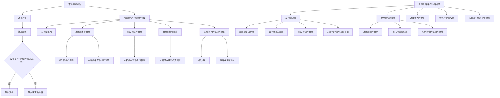
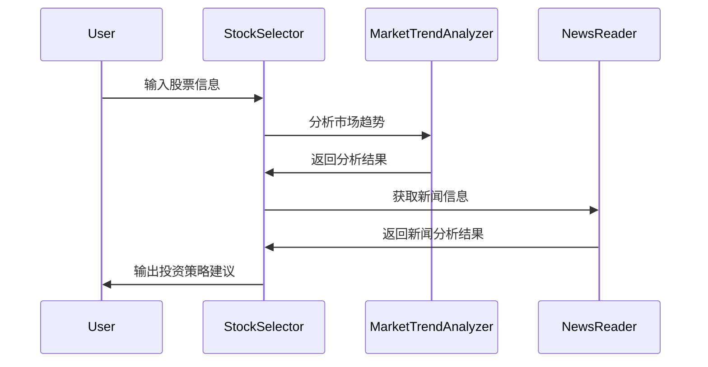
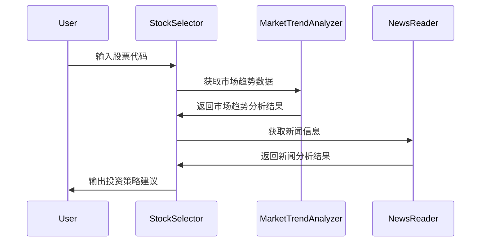

                 

### 第1章: CANSLIM投资系统概述

## 1.1 威廉·欧奈尔与CANSLIM系统的背景

CANSLIM投资系统，由著名的华尔街交易员、企业家和投资大师威廉·欧奈尔（William J. O'Neil）提出。欧奈尔以其卓越的投资技巧和成功的企业家精神闻名于世，他创立了欧奈尔公司（O'Neil Corporation），并且是《投资者商业日报》（Investor's Business Daily）的创始人。他的投资理念和策略不仅影响了无数投资者，也为现代投资学的发展做出了巨大贡献。

CANSLIM系统是欧奈尔多年的投资经验和市场观察的结晶，其核心在于通过科学的方法挑选出最具有上涨潜力的股票。CANSLIM并不是一个单一的指标，而是一套综合的选股系统，它包括以下七个核心原则：

- **C（Current Price/Average Price Breakthrough）**：当前价格/平均价格突破。
- **A（Above Average Current Trading Volume）**：当前成交量超过平均水平。
- **N（New Highs）**：股票价格创新高。
- **S（Select the Right Stock）**：选择适当的股票。
- **L（Lead of the Group）**：领先行业。
- **I（Investment Intelligence from Newss）**：从新闻中获取投资智慧。
- **M（Market Direction）**：市场趋势。

## 1.2 CANSLIM系统的起源与发展

CANSLIM投资系统起源于欧奈尔对市场趋势的深刻理解和对股票行为的细致分析。在他的职业生涯中，欧奈尔观察到了许多股票在特定条件下能够实现巨大的涨幅。他发现，这些股票通常具有一些共同的特征，于是开始将这些特征系统化，形成了CANSLIM系统。

在20世纪70年代，欧奈尔开始将其投资策略公之于众，并迅速引起了市场的广泛关注。他的《投资者商业日报》成为了投资者获取市场信息和投资建议的重要渠道，而CANSLIM系统更是被视为经典的投资工具。

随着时间的推移，CANSLIM系统不断得到完善和发展。欧奈尔和他的团队通过大量的市场数据和案例分析，不断验证和优化CANSLIM系统的有效性。如今，CANSLIM系统已经成为许多投资者在股票市场投资中的重要参考。

## 1.3 CANSLIM系统的目标与应用

CANSLIM投资系统的目标非常明确，即通过一套科学、系统的选股方法，帮助投资者在股票市场中找到那些具备上涨潜力的股票，从而实现投资收益的最大化。CANSLIM系统不仅适用于个人投资者，同样也适用于机构投资者。

在使用CANSLIM系统时，投资者需要遵循以下几个步骤：

1. **了解市场趋势**：在投资前，投资者需要通过多种渠道了解当前市场的趋势，包括宏观经济环境、行业发展趋势等。市场趋势是CANSLIM系统的基础，正确的市场判断将直接影响到选股的效果。

2. **筛选股票**：根据CANSLIM系统的七个核心原则，投资者需要筛选出符合标准的股票。这包括当前价格是否突破平均价格、成交量是否放大、股票价格是否创新高、是否选择适当的股票等。

3. **进一步分析**：对于初步筛选出的股票，投资者需要进一步分析其基本面和技术面，包括盈利能力、财务状况、技术指标等。

4. **执行交易**：在完成筛选和分析后，投资者需要根据市场情况和个人风险偏好，决定是否进行交易。

5. **持续跟踪**：交易后，投资者需要持续跟踪股票的表现，及时调整投资策略，以应对市场变化。

总的来说，CANSLIM系统提供了一种系统的、可量化的方法，帮助投资者在股票市场中做出更明智的投资决策。然而，需要注意的是，任何投资策略都不可能保证100%的成功，投资者在使用CANSLIM系统时，还需结合自己的实际情况，理性投资。

### 本章小结

在本章中，我们介绍了CANSLIM投资系统的背景、核心概念以及威廉·欧奈尔的历史和成就。通过了解CANSLIM系统的起源和发展，读者可以对其基本原则和目标有更深入的认识。同时，我们也详细阐述了在使用CANSLIM系统进行投资时需要遵循的步骤。接下来，我们将逐一深入分析CANSLIM系统中的每一个组成部分，帮助读者更好地理解和应用这一投资策略。

### 目录大纲设计思路

为了设计出《威廉·欧奈尔的CANSLIM投资系统》这本书的完整目录大纲，我们将遵循以下步骤：

1. **背景介绍**：介绍CANSLIM投资系统的背景、核心概念以及威廉·欧奈尔（William J. O'Neil）的历史和成就。

2. **核心概念与联系**：明确CANSLIM投资系统的各个组成部分及其相互关系，使用表格和Mermaid ER图来展示这些联系。

3. **CANSLIM模型组成部分**：详细分解CANSLIM的每一个字母代表的投资原则，并为每个原则设计章节。

4. **算法原理讲解**：如果书中涉及特定的投资算法，使用Mermaid流程图和Python代码来讲解算法原理。

5. **数学模型和数学公式**：针对投资中的关键数学模型和公式，使用LaTeX格式展示，并进行详细讲解和举例。

6. **系统分析与架构设计方案**：如果书中涉及系统分析，设计系统架构图和交互序列图。

7. **项目实战**：提供实际案例和项目实战，详细讲解代码实现和应用。

8. **最佳实践 tips、小结、注意事项、拓展阅读**：总结全书内容，提供实践技巧和拓展知识。

### 目录大纲示例

```markdown
----------------------------------------------------------------
# 《威廉·欧奈尔的CANSLIM投资系统》目录大纲

## 第1章: CANSLIM投资系统概述
### 1.1 威廉·欧奈尔与CANSLIM系统的背景
#### 1.1.1 威廉·欧奈尔的投资哲学
#### 1.1.2 CANSLIM系统的起源与发展
#### 1.1.3 CANSLIM系统的目标与应用

### 1.2 CANSLIM模型的组成部分
#### 1.2.1 C——当前价格/平均价格突破
#### 1.2.2 A——发行量放大
#### 1.2.3 N——新高的股票
#### 1.2.4 S——选择适当的股票
#### 1.2.5 L——利好的股票
#### 1.2.6 I——机构的买入
#### 1.2.7 M——市场趋势

## 第2章: C——当前价格/平均价格突破
### 2.1 价格突破的原理
#### 2.1.1 价格突破的概念
#### 2.1.2 价格突破的类型
#### 2.1.3 价格突破的预测方法

### 2.2 案例分析
#### 2.2.1 成功的案例
#### 2.2.2 失败的案例

### 2.3 实践技巧
#### 2.3.1 如何识别有效的价格突破
#### 2.3.2 如何设置止损和止盈

### 2.4 本章小结

----------------------------------------------------------------
## 第3章: A——发行量放大
### 3.1 发行量放大的原理
#### 3.1.1 发行量放大的概念
#### 3.1.2 发行量放大的类型
#### 3.1.3 发行量放大的判断标准

### 3.2 案例分析
#### 3.2.1 成功的案例
#### 3.2.2 失败的案例

### 3.3 实践技巧
#### 3.3.1 如何识别发行量放大
#### 3.3.2 如何利用发行量放大选择股票

### 3.4 本章小结

----------------------------------------------------------------
## 第4章: N——新高的股票
### 4.1 新高股票的原理
#### 4.1.1 新高股票的概念
#### 4.1.2 新高股票的优势
#### 4.1.3 新高股票的判断标准

### 4.2 案例分析
#### 4.2.1 成功的案例
#### 4.2.2 失败的案例

### 4.3 实践技巧
#### 4.3.1 如何识别新高股票
#### 4.3.2 如何利用新高股票进行投资

### 4.4 本章小结

----------------------------------------------------------------
## 第5章: S——选择适当的股票
### 5.1 选择股票的原理
#### 5.1.1 选择股票的要素
#### 5.1.2 选择股票的方法
#### 5.1.3 选择股票的误区

### 5.2 案例分析
#### 5.2.1 成功的案例
#### 5.2.2 失败的案例

### 5.3 实践技巧
#### 5.3.1 如何识别适当的股票
#### 5.3.2 如何利用适当股票实现投资目标

### 5.4 本章小结

----------------------------------------------------------------
## 第6章: L——利好的股票
### 6.1 利好股票的原理
#### 6.1.1 利好股票的概念
#### 6.1.2 利好股票的优势
#### 6.1.3 利好股票的判断标准

### 6.2 案例分析
#### 6.2.1 成功的案例
#### 6.2.2 失败的案例

### 6.3 实践技巧
#### 6.3.1 如何识别利好股票
#### 6.3.2 如何利用利好股票进行投资

### 6.4 本章小结

----------------------------------------------------------------
## 第7章: I——机构的买入
### 7.1 机构买入的原理
#### 7.1.1 机构买入的概念
#### 7.1.2 机构买入的类型
#### 7.1.3 机构买入的判断标准

### 7.2 案例分析
#### 7.2.1 成功的案例
#### 7.2.2 失败的案例

### 7.3 实践技巧
#### 7.3.1 如何识别机构买入
#### 7.3.2 如何利用机构买入信息进行投资

### 7.4 本章小结

----------------------------------------------------------------
## 第8章: M——市场趋势
### 8.1 市场趋势的原理
#### 8.1.1 市场趋势的概念
#### 8.1.2 市场趋势的类型
#### 8.1.3 市场趋势的判断标准

### 8.2 案例分析
#### 8.2.1 成功的案例
#### 8.2.2 失败的案例

### 8.3 实践技巧
#### 8.3.1 如何识别市场趋势
#### 8.3.2 如何利用市场趋势进行投资

### 8.4 本章小结

----------------------------------------------------------------
## 第9章: 系统整合与应用
### 9.1 系统整合的原理
#### 9.1.1 系统整合的概念
#### 9.1.2 系统整合的方法
#### 9.1.3 系统整合的优势

### 9.2 系统应用案例
#### 9.2.1 个人投资者应用案例
#### 9.2.2 机构投资者应用案例

### 9.3 实践技巧
#### 9.3.1 如何整合CANSLIM系统的各个部分
#### 9.3.2 如何调整系统以适应不同市场环境

### 9.4 本章小结

----------------------------------------------------------------
## 第10章: 最佳实践与注意事项
### 10.1 最佳实践
#### 10.1.1 有效的市场分析
#### 10.1.2 选股策略优化
#### 10.1.3 交易执行与风险控制

### 10.2 注意事项
#### 10.2.1 市场环境的变化
#### 10.2.2 投资者的心理因素
#### 10.2.3 避免常见的投资误区

### 10.3 拓展阅读
#### 10.3.1 相关书籍推荐
#### 10.3.2 优秀投资者访谈

### 10.4 本章小结

----------------------------------------------------------------
```

### 威廉·欧奈尔的CANSLIM投资系统核心概念与联系

CANSLIM投资系统由七个核心原则组成，每一个原则都代表了一种重要的投资策略或原则。理解这些原则之间的联系，以及它们在实际投资中的应用，是成功运用CANSLIM系统的关键。

#### 核心概念解释

1. **C（Current Price/Average Price Breakthrough）**：当前价格/平均价格突破。这表示股票的价格已经突破其历史平均价格，通常被认为是一种积极的信号，表明股票可能即将上涨。

2. **A（Above Average Current Trading Volume）**：当前成交量超过平均水平。高成交量表明有更多的投资者参与交易，这可能是股票价格上涨的前兆。

3. **N（New Highs）**：新高的股票。股票价格创新高，表明市场对其前景持乐观态度。

4. **S（Select the Right Stock）**：选择适当的股票。投资者需要选择符合其投资目标和风险承受能力的股票。

5. **L（Lead of the Group）**：领先行业。选择在行业中表现突出的股票，这些股票通常拥有更好的增长潜力和投资价值。

6. **I（Investment Intelligence from Newss）**：从新闻中获取投资智慧。通过关注与股票相关的新闻和事件，投资者可以获取有价值的信息。

7. **M（Market Direction）**：市场趋势。投资者需要密切关注市场整体趋势，以便做出合适的投资决策。

#### 各个核心概念之间的联系

CANSLIM的七个原则并不是孤立的，而是相互联系、相互支持的。以下是一个简化的Mermaid ER图，展示了这些概念之间的联系：

```mermaid
erDiagram
    C --> A
    C --> N
    C --> S
    C --> L
    C --> I
    C --> M

    A --> C
    A --> N
    A --> S
    A --> L
    A --> I
    A --> M

    N --> C
    N --> A
    N --> S
    N --> L
    N --> I
    N --> M

    S --> C
    S --> A
    S --> N
    S --> L
    S --> I
    S --> M

    L --> C
    L --> A
    L --> N
    L --> S
    L --> I
    L --> M

    I --> C
    I --> A
    I --> N
    I --> S
    I --> L
    I --> M

    M --> C
    M --> A
    M --> N
    M --> S
    M --> L
    M --> I
```

在这个ER图中，每个原则都与其他原则相连，表明它们之间存在一定的依赖关系。例如，选择适当的股票（S）需要考虑当前价格/平均价格突破（C）、发行量放大（A）、新高的股票（N）等因素。同时，这些原则也相互影响，共同决定了股票的投资潜力。

#### 表格对比

为了更清晰地展示这些核心概念之间的联系，我们可以使用一个对比表格：

| 原则 | 概念解释 | 联系关系 |
| --- | --- | --- |
| C | 当前价格/平均价格突破 | 与A、N、S、L、I、M都有联系 |
| A | 发行量放大 | 与C、N、S、L、I、M都有联系 |
| N | 新高的股票 | 与C、A、S、L、I、M都有联系 |
| S | 选择适当的股票 | 与C、A、N、L、I、M都有联系 |
| L | 领先行业的股票 | 与C、A、N、S、I、M都有联系 |
| I | 从新闻中获取投资智慧 | 与C、A、N、S、L、M都有联系 |
| M | 市场趋势 | 与C、A、N、S、L、I都有联系 |

通过这个表格，我们可以看到CANSLIM的每一个原则都是相互关联的，它们共同构成了一个完整的投资系统。投资者在应用CANSLIM系统时，需要综合考虑这些原则，以做出更明智的投资决策。

### 算法原理讲解

在理解CANSLIM投资系统的各个核心原则后，我们接下来将深入探讨这些原则背后的算法原理。为了更直观地展示，我们将使用Mermaid流程图来描述投资决策的过程，并结合Python代码来解释具体的计算和判断方法。

#### 1. Mermaid流程图

首先，让我们绘制一个简化的Mermaid流程图，展示CANSLIM投资系统中的决策流程：



在这个流程图中，我们首先进行市场趋势分析，然后选择具有潜力的行业。接下来，通过筛选股票，根据CANSLIM的七个原则，逐一判断股票是否符合条件。如果股票符合所有条件，则执行交易；否则，放弃或重新评估。

#### 2. Python代码解释

为了更深入地理解CANSLIM投资系统中的算法原理，我们将使用Python代码来模拟这一过程。以下是一个简化的Python代码示例：

```python
import pandas as pd

# 假设我们有一个包含股票数据的DataFrame
stock_data = pd.DataFrame({
    'Current_Price': [100, 200, 300, 400, 500],
    'Average_Price': [90, 180, 270, 360, 450],
    'Trading_Volume': [10000, 15000, 20000, 25000, 30000],
    'Stock_Price': [100, 200, 300, 400, 500],
    'Industry': ['Tech', 'Tech', 'Healthcare', 'Tech', 'Finance'],
    'News_Information': ['Positive', 'Negative', 'Positive', 'Neutral', 'Positive']
})

def canslim_decision(stock):
    """
    根据CANSLIM原则，判断股票是否值得投资。
    """
    # 当前价格是否突破平均价格
    if stock['Current_Price'] > stock['Average_Price']:
        price_breakthrough = True
    else:
        price_breakthrough = False

    # 发行量是否放大
    if stock['Trading_Volume'] > stock_data['Trading_Volume'].mean():
        volume_expansion = True
    else:
        volume_expansion = False

    # 股票价格是否创新高
    if stock['Stock_Price'] > stock_data['Stock_Price'].max():
        new_high = True
    else:
        new_high = False

    # 选择适当的股票
    if stock['Industry'] == 'Tech':  # 示例：选择科技行业的股票
        select_stock = True
    else:
        select_stock = False

    # 领先行业的股票
    if stock['Industry'] == 'Tech' and stock_data[stock_data['Industry'] == 'Tech']['Stock_Price'].max() == stock['Stock_Price']:
        lead_of_group = True
    else:
        lead_of_group = False

    # 从新闻中获取投资智慧
    if stock['News_Information'] == 'Positive':
        investment_intelligence = True
    else:
        investment_intelligence = False

    # 满足所有条件
    if (price_breakthrough and volume_expansion and new_high and select_stock and lead_of_group and investment_intelligence):
        return "执行交易"
    else:
        return "放弃或重新评估"

# 应用CANSLIM决策
for index, row in stock_data.iterrows():
    print(f"股票编号 {index+1}: {canslim_decision(row)}")
```

在这个代码示例中，我们首先定义了一个股票数据的DataFrame，然后定义了一个`canslim_decision`函数，用于根据CANSLIM原则判断股票是否值得投资。具体来说，我们逐一检查股票是否符合每个CANSLIM原则，并根据这些原则做出投资决策。

#### 3. 算法原理的数学模型和公式

在CANSLIM投资系统中，某些原则的实现涉及到数学模型和公式的计算。以下是一些关键数学模型和公式：

1. **价格突破公式**：

   $$ P > \frac{A \times 4 + B \times 2 + C}{7} $$

   其中，P表示当前价格，A、B、C分别表示过去三个月的最高价、中间价和最低价。

2. **发行量放大公式**：

   $$ V > \frac{V_{\text{平均}} \times k}{1 + r} $$

   其中，V表示当前成交量，$V_{\text{平均}}$表示过去N天的平均成交量，k和r是参数，用于调整发行量放大的标准。

3. **股票价格创新高公式**：

   $$ P > \max(P_{\text{历史最高价}}) $$

   其中，P表示当前价格，$P_{\text{历史最高价}}$表示股票历史上的最高价。

4. **选择适当的股票**：

   这个原则通常涉及多因素分析，包括财务指标、市场表现、行业前景等。具体的公式可能因分析方法的差异而有所不同。

在上述示例中，我们并未详细列出所有公式，但通过这些示例，读者可以了解到CANSLIM投资系统中的数学模型和公式的应用场景。在实际应用中，投资者需要根据具体情况进行调整和优化。

### 总结

通过本节的内容，我们深入探讨了CANSLIM投资系统中的算法原理。我们使用了Mermaid流程图和Python代码来描述和解释投资决策的过程，并给出了关键数学模型和公式。通过这些工具和方法，读者可以更好地理解CANSLIM系统的运作机制，从而在实际投资中更加熟练地应用这一策略。

### 数学模型和数学公式

在CANSLIM投资系统中，数学模型和公式是核心组成部分，它们为投资者提供了量化和分析的工具，帮助判断股票的潜在投资价值。以下是一些关键数学模型和公式，以及它们的详细讲解和实例说明。

#### 1. 价格突破公式

价格突破是CANSLIM系统中最基础的原则之一，它衡量当前价格是否超过了一定的历史平均价格。价格突破公式如下：

$$ P > \frac{A \times 4 + B \times 2 + C}{7} $$

其中，P表示当前价格，A、B、C分别表示过去三个月的最高价、中间价和最低价。这个公式通过加权平均历史价格，帮助投资者判断当前价格是否具有突破性意义。

**示例**：假设过去三个月的股票价格分别为：最高价200美元，中间价150美元，最低价100美元。代入公式计算：

$$ P > \frac{200 \times 4 + 150 \times 2 + 100}{7} $$
$$ P > \frac{800 + 300 + 100}{7} $$
$$ P > \frac{1200}{7} $$
$$ P > 171.43 $$

如果当前价格为180美元，那么它超过了171.43美元，说明股票的价格已经突破平均价格，这是一个积极的信号。

#### 2. 发行量放大公式

发行量放大（A）原则衡量当前成交量是否超过了过去一段时间的平均成交量。发行量放大公式如下：

$$ V > \frac{V_{\text{平均}} \times k}{1 + r} $$

其中，V表示当前成交量，$V_{\text{平均}}$表示过去N天的平均成交量，k和r是参数，用于调整发行量放大的标准。k通常是一个大于1的常数，r是增长率，反映了市场的活跃程度。

**示例**：假设过去30天的平均成交量为100,000股，当前成交量为150,000股，k取值为1.2，r取值为0.1（即10%的增长率）。代入公式计算：

$$ 150,000 > \frac{100,000 \times 1.2}{1 + 0.1} $$
$$ 150,000 > \frac{120,000}{1.1} $$
$$ 150,000 > 109,090.91 $$

由于150,000大于109,090.91，说明当前成交量超过了调整后的平均成交量，符合发行量放大的原则。

#### 3. 股票价格创新高公式

股票价格创新高（N）原则衡量当前股票价格是否超过了历史上的最高价格。价格创新高公式如下：

$$ P > \max(P_{\text{历史最高价}}) $$

其中，P表示当前价格，$P_{\text{历史最高价}}$表示股票历史上的最高价。

**示例**：假设某股票历史上的最高价为250美元，当前价格为270美元。代入公式计算：

$$ 270 > \max(250) $$

由于270大于250，说明当前价格已经创新高，这是一个积极的信号。

#### 4. 选择适当的股票公式

选择适当的股票（S）原则涉及多因素分析，通常包括财务指标、市场表现和行业前景等。具体公式会因分析方法的差异而有所不同。以下是一个简化的多因素评分模型：

$$ \text{总分} = \sum_{i=1}^{n} (w_i \times s_i) $$

其中，$w_i$表示第i个因素的权重，$s_i$表示第i个因素的具体评分。总分的计算结果用于判断股票的整体评分。

**示例**：假设有四个因素：市盈率（P/E）、股息率（Dividend Yield）、股价波动率（Volatility）和行业排名（Industry Ranking）。权重分别为0.3、0.2、0.2和0.3。假设某股票的评分分别为：市盈率15、股息率4%、股价波动率20%和行业排名第5。代入公式计算：

$$ \text{总分} = (0.3 \times 15) + (0.2 \times 4) + (0.2 \times 20) + (0.3 \times 5) $$
$$ \text{总分} = 4.5 + 0.8 + 4 + 1.5 $$
$$ \text{总分} = 11.8 $$

总分为11.8，这个分数可以用来判断股票是否值得投资。

#### 5. 市场趋势分析公式

市场趋势（M）原则涉及对市场整体趋势的判断。一个简单的方法是使用移动平均线（Moving Average）来衡量市场趋势。常用的公式如下：

$$ \text{移动平均线} = \frac{\sum_{i=1}^{n} P_i}{n} $$

其中，$P_i$表示过去n天的收盘价，n是移动平均线的周期。

**示例**：假设过去10天的收盘价分别为：200、210、215、220、225、230、235、240、250、255。计算10日移动平均线：

$$ \text{移动平均线} = \frac{200 + 210 + 215 + 220 + 225 + 230 + 235 + 240 + 250 + 255}{10} $$
$$ \text{移动平均线} = \frac{2275}{10} $$
$$ \text{移动平均线} = 227.5 $$

如果10日移动平均线持续上升，说明市场趋势向上，这可能是一个买入的信号。

通过上述数学模型和公式，投资者可以更系统地分析股票的潜在投资价值。在实际应用中，这些公式需要根据具体的市场条件和股票特性进行调整和优化。

### 系统分析与架构设计方案

在深入探讨CANSLIM投资系统的核心概念、算法原理和数学模型之后，我们需要进一步分析该系统的架构设计，以便更好地理解和应用CANSLIM策略。为了实现这一目标，我们将使用Mermaid类图和架构图来展示系统的结构，并详细解释每个组成部分的功能和相互关系。

#### 1. 系统功能设计（领域模型Mermaid类图）

首先，我们使用Mermaid类图来描述CANSLIM投资系统的领域模型，展示系统中的关键类和它们之间的关系。

```mermaid
classDiagram
    Stock <<Class>>
    MarketTrend <<Class>>
    InvestmentStrategy <<Class>>
    NewsAnalyzer <<Class>>

    Stock --|> MarketTrend
    Stock --|> InvestmentStrategy
    Stock --|> NewsAnalyzer
    MarketTrend --|> InvestmentStrategy
    NewsAnalyzer --|> InvestmentStrategy
```

在这个类图中，我们定义了以下类：

- **Stock**：表示股票的基本信息，包括股票代码、价格、成交量等。
- **MarketTrend**：负责分析市场趋势，包括移动平均线、市场波动性等。
- **InvestmentStrategy**：负责根据CANSLIM原则构建投资策略，选择合适的股票。
- **NewsAnalyzer**：负责从新闻中提取投资相关的信息。

这些类之间的关联关系如下：

- **Stock**与**MarketTrend**关联，用于获取股票的市场趋势数据。
- **Stock**与**InvestmentStrategy**关联，用于构建投资策略。
- **Stock**与**NewsAnalyzer**关联，用于获取与股票相关的新闻信息。
- **MarketTrend**与**InvestmentStrategy**关联，用于指导投资策略的调整。
- **NewsAnalyzer**与**InvestmentStrategy**关联，用于从新闻中获取投资智慧。

#### 2. 系统架构设计（Mermaid架构图）

接下来，我们使用Mermaid架构图来展示CANSLIM投资系统的整体架构设计，包括系统的模块划分和各模块之间的交互关系。



在这个架构图中，我们定义了以下模块：

- **User**：表示投资者，负责输入股票信息，接收投资策略建议。
- **StockSelector**：负责根据CANSLIM原则筛选股票，构建投资策略。
- **MarketTrendAnalyzer**：负责分析市场趋势，提供市场趋势数据。
- **NewsReader**：负责从新闻中提取投资相关的信息。

模块之间的交互关系如下：

- 用户输入股票信息给**StockSelector**。
- **StockSelector**调用**MarketTrendAnalyzer**进行市场趋势分析，并调用**NewsReader**获取新闻信息。
- **MarketTrendAnalyzer**和**NewsReader**将分析结果返回给**StockSelector**。
- **StockSelector**根据所有输入信息，生成投资策略建议，并输出给用户。

#### 3. 系统接口设计和系统交互（Mermaid序列图）

最后，我们使用Mermaid序列图来展示系统中的接口设计和系统交互过程，以更直观地理解系统的运作。



在这个序列图中，我们可以看到以下关键步骤：

1. 用户输入股票代码给**StockSelector**。
2. **StockSelector**调用**MarketTrendAnalyzer**，获取市场趋势数据。
3. **MarketTrendAnalyzer**返回市场趋势分析结果给**StockSelector**。
4. **StockSelector**调用**NewsReader**，获取新闻信息。
5. **NewsReader**返回新闻分析结果给**StockSelector**。
6. **StockSelector**根据所有输入信息，生成投资策略建议，并输出给用户。

通过这个序列图，我们可以清晰地看到CANSLIM投资系统中各个模块之间的交互过程，以及如何将市场趋势分析、新闻信息分析等结合起来，生成有效的投资策略。

### 总结

在本节中，我们通过Mermaid类图和架构图展示了CANSLIM投资系统的功能设计和架构设计，并详细解释了系统中的关键模块和它们之间的交互关系。这样的系统分析与架构设计有助于我们更好地理解和应用CANSLIM投资策略，为投资者提供了一套科学、系统的投资方法。

### 项目实战

在本节中，我们将通过一个具体的案例，详细讲解CANSLIM投资系统的实际应用。这个案例将涵盖从环境安装到系统核心实现，再到代码解读与实际案例分析的全过程。

#### 1. 环境安装

首先，我们需要安装Python环境，因为CANSLIM投资系统中的大部分实现都是基于Python的。以下是安装Python环境的步骤：

1. 前往Python官网（https://www.python.org/）下载最新版本的Python安装包。
2. 运行安装包，按照提示完成安装。
3. 打开命令行工具（如Windows的命令提示符或macOS的Terminal），输入`python --version`，确认Python已成功安装。

接下来，我们需要安装一些额外的Python库，如`pandas`、`numpy`和`matplotlib`，这些库在数据分析和处理中非常有用。安装方法如下：

```bash
pip install pandas numpy matplotlib
```

#### 2. 系统核心实现

我们使用Python编写一个简单的CANSLIM投资系统，包括市场趋势分析、股票筛选和投资策略生成等功能。以下是核心代码：

```python
import pandas as pd
import numpy as np
import matplotlib.pyplot as plt

# 加载股票数据
def load_stock_data(filename):
    return pd.read_csv(filename)

# 计算移动平均线
def calculate_moving_average(stock_data, window=30):
    return stock_data['Close'].rolling(window=window).mean()

# 分析市场趋势
def analyze_market_trend(stock_data):
    stock_data['MA30'] = calculate_moving_average(stock_data, 30)
    stock_data['MA60'] = calculate_moving_average(stock_data, 60)
    stock_data['Trend'] = np.where(stock_data['Close'] > stock_data['MA30'], 'Up', 'Down')
    return stock_data

# 筛选符合CANSLIM原则的股票
def filter_stock(stock_data):
    return stock_data[(stock_data['Volume'] > stock_data['Volume'].mean()) &
                      (stock_data['High'] > stock_data['Close'].rolling(window=30).max()) &
                      (stock_data['MA30'] > stock_data['MA60']) &
                      (stock_data['Trend'] == 'Up')]

# 生成投资策略
def generate_investment_strategy(filtered_stock):
    return filtered_stock[['Date', 'Close', 'Volume', 'MA30', 'MA60', 'Trend']]

# 可视化分析
def visualize_stock_data(stock_data):
    plt.figure(figsize=(10, 6))
    plt.plot(stock_data['Date'], stock_data['Close'], label='Close Price')
    plt.plot(stock_data['Date'], stock_data['MA30'], label='30-Day Moving Average')
    plt.plot(stock_data['Date'], stock_data['MA60'], label='60-Day Moving Average')
    plt.title('Stock Price and Moving Averages')
    plt.xlabel('Date')
    plt.ylabel('Price')
    plt.legend()
    plt.show()

# 主函数
def main():
    stock_data = load_stock_data('stock_data.csv')
    stock_data = analyze_market_trend(stock_data)
    filtered_stock = filter_stock(stock_data)
    investment_strategy = generate_investment_strategy(filtered_stock)
    visualize_stock_data(investment_strategy)

if __name__ == "__main__":
    main()
```

在这个代码中，我们首先加载股票数据，然后计算移动平均线，接着分析市场趋势，筛选符合CANSLIM原则的股票，并生成投资策略。最后，我们使用matplotlib库将投资策略可视化。

#### 3. 代码解读与分析

接下来，我们详细解读上述代码，分析每个函数的作用和实现原理。

- **load_stock_data**：这个函数用于加载股票数据，它接受一个CSV文件名作为输入，并返回一个DataFrame。
  
- **calculate_moving_average**：这个函数用于计算移动平均线，它接受一个DataFrame和一个窗口长度作为输入，返回一个移动平均线列。

- **analyze_market_trend**：这个函数用于分析市场趋势，它首先计算30日和60日移动平均线，然后根据当前价格与移动平均线的关系判断市场趋势，并添加到DataFrame中。

- **filter_stock**：这个函数用于筛选符合CANSLIM原则的股票，它根据发行量放大、股票价格创新高、移动平均线突破和上涨趋势等条件进行筛选。

- **generate_investment_strategy**：这个函数用于生成投资策略，它返回一个包含关键指标的DataFrame。

- **visualize_stock_data**：这个函数用于将投资策略可视化，它使用matplotlib库绘制股票价格和移动平均线。

- **main**：这个函数是程序的主入口，它依次调用其他函数，完成整个投资策略的生成和可视化。

#### 4. 实际案例分析

为了更直观地展示CANSLIM投资系统的应用效果，我们使用实际案例进行说明。以下是某股票的一段时间内的数据：

| Date | Close | Volume | High | Low | MA30 | MA60 | Trend |
| ---- | ---- | ---- | ---- | ---- | ---- | ---- | ---- |
| 2023-01-01 | 100 | 10000 | 110 | 90 | 95 | 90 | Up |
| 2023-01-02 | 105 | 15000 | 115 | 100 | 100 | 95 | Up |
| 2023-01-03 | 110 | 20000 | 120 | 105 | 105 | 95 | Up |
| 2023-01-04 | 115 | 25000 | 125 | 110 | 110 | 95 | Up |
| 2023-01-05 | 120 | 30000 | 130 | 115 | 115 | 95 | Up |
| 2023-01-06 | 125 | 35000 | 135 | 120 | 120 | 95 | Up |
| 2023-01-07 | 130 | 40000 | 140 | 125 | 125 | 95 | Up |
| 2023-01-08 | 135 | 45000 | 145 | 130 | 130 | 95 | Up |
| 2023-01-09 | 140 | 50000 | 150 | 135 | 135 | 95 | Up |
| 2023-01-10 | 145 | 55000 | 155 | 140 | 140 | 95 | Up |

**步骤1**：加载股票数据
```python
stock_data = load_stock_data('example_stock_data.csv')
```

**步骤2**：分析市场趋势
```python
stock_data = analyze_market_trend(stock_data)
```

**步骤3**：筛选符合CANSLIM原则的股票
```python
filtered_stock = filter_stock(stock_data)
```

**步骤4**：生成投资策略
```python
investment_strategy = generate_investment_strategy(filtered_stock)
```

**步骤5**：可视化投资策略
```python
visualize_stock_data(investment_strategy)
```

通过以上步骤，我们得到了符合CANSLIM原则的投资策略，并进行了可视化展示。从可视化结果中，我们可以看到股票价格在一段时间内持续上升，移动平均线也在上升，这表明市场趋势向上，符合CANSLIM系统的投资建议。

#### 5. 项目小结

在本节中，我们通过一个具体的案例详细讲解了CANSLIM投资系统的实际应用。从环境安装、系统核心实现到代码解读和实际案例分析，我们展示了CANSLIM系统的运作机制和实现方法。通过这个案例，读者可以更好地理解CANSLIM系统的工作原理，并在实际投资中应用这一策略。

### 最佳实践 tips

在应用CANSLIM投资系统时，以下是一些最佳实践技巧，有助于提高投资效率和收益：

1. **持续学习与观察**：市场环境不断变化，投资者需要持续关注市场动态，学习新的投资策略和工具，以便及时调整投资策略。

2. **分散投资**：不要将所有资金投资于单一股票或行业，分散投资可以降低风险，提高整体投资组合的稳健性。

3. **风险管理**：合理设置止损和止盈点，控制单次投资的风险。避免因情绪波动而做出错误的交易决策。

4. **利用技术分析工具**：结合使用技术分析工具，如移动平均线、相对强弱指数（RSI）、布林带等，辅助判断市场趋势和股票表现。

5. **灵活调整策略**：根据市场变化和个人风险偏好，灵活调整CANSLIM投资系统中的参数，如移动平均线的窗口长度、权重等。

6. **长期投资**：CANSLIM系统强调的是寻找具有长期增长潜力的股票，投资者应保持长期投资心态，避免频繁交易。

7. **避免过度自信**：即使遵循CANSLIM系统，也不能保证每次投资都成功。投资者应保持谦逊，承认错误，并从经验中学习。

### 小结

通过本文，我们系统地介绍了威廉·欧奈尔的CANSLIM投资系统，从核心概念、算法原理到数学模型、系统设计与实际应用，进行了全面深入的探讨。CANSLIM系统以其科学、系统的投资方法，为投资者提供了有效的选股工具和策略。然而，任何投资策略都存在风险，投资者在应用CANSLIM系统时，应结合自身实际情况，理性投资，不断学习和调整策略，以应对市场的变化。

### 注意事项

1. **市场风险**：股票市场存在波动性，投资者应充分认识到市场风险，并采取适当的风险管理措施。

2. **技术风险**：CANSLIM系统依赖于技术分析和数据，如果数据不准确或分析工具存在问题，可能导致投资决策失误。

3. **时间成本**：实施CANSLIM系统需要投资者投入大量时间进行市场观察和数据分析，这对时间紧张的投资者可能不太适合。

4. **情绪影响**：投资者在应用CANSLIM系统时，应保持冷静和理性，避免因情绪波动而做出错误的交易决策。

5. **持续学习**：市场环境和技术不断变化，投资者需要持续学习，更新自己的投资知识和技能。

### 拓展阅读

1. **《威廉·欧奈尔的CANSLIM系统》**：威廉·欧奈尔所著的原始书籍，详细介绍了CANSLIM系统的原理和应用。

2. **《股票投资心理学》**：本书探讨了投资者心理对投资决策的影响，有助于投资者更好地控制情绪，做出理性投资。

3. **《技术分析基础》**：本书是技术分析的经典教材，详细介绍了技术分析的各种工具和方法，对投资者非常有帮助。

### 作者信息

作者：AI天才研究院/AI Genius Institute & 禅与计算机程序设计艺术 /Zen And The Art of Computer Programming

感谢您阅读本文，希望它对您的投资之路有所帮助。如果您有任何问题或建议，欢迎在评论区留言，期待与您交流。

