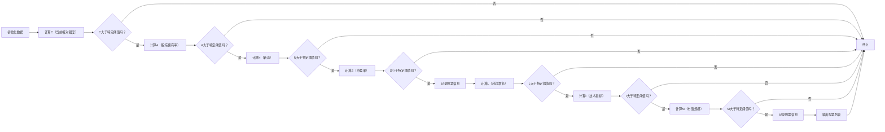
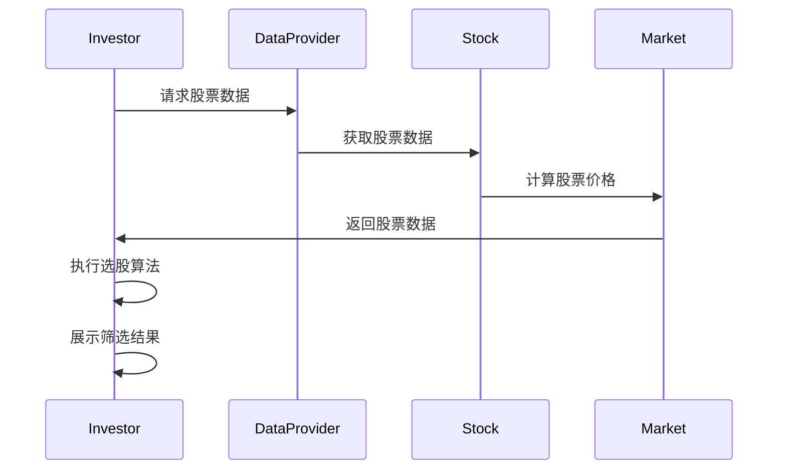
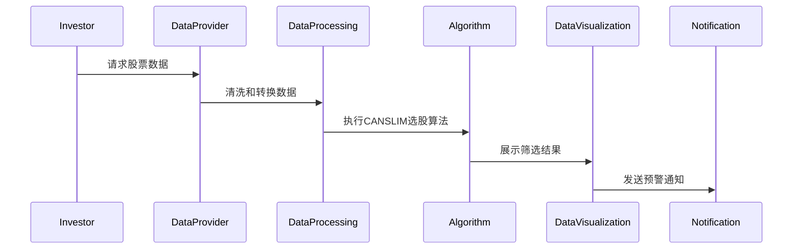

                 

# 《威廉·欧奈尔的CANSLIM选股系统》

## 关键词

- 投资策略
- CANSLIM选股系统
- 数学模型
- 人工智能
- 金融市场分析

## 摘要

本文将深入探讨威廉·欧奈尔（William O'Neil）提出的CANSLIM选股系统。CANSLIM是一个结合了八个核心因素的选股系统，旨在帮助投资者在股票市场中找到潜力股。本文将详细介绍CANSLIM的起源、核心概念、算法原理、数学模型、系统架构设计方案以及实际案例，并提供最佳实践建议和注意事项。

## 目录大纲

### 第1章 背景介绍
#### 1.1 CANSLIM选股系统的起源与发展
#### 1.2 CANSLIM选股系统在投资领域的应用

### 第2章 核心概念与联系
#### 2.1 CANSLIM的核心概念
#### 2.2 概念属性特征对比表格
#### 2.3 CANSLIM核心概念的ER实体关系图

### 第3章 算法原理讲解
#### 3.1 CANSLIM选股算法流程图
#### 3.2 CANSLIM选股算法Python源代码解释
#### 3.3 CANSLIM选股算法的数学模型与公式

### 第4章 数学模型和数学公式
#### 4.1 关键数学模型和公式列表
#### 4.2 数学模型详细讲解
#### 4.3 数学模型举例说明

### 第5章 系统分析与架构设计方案
#### 5.1 CANSLIM选股系统的应用场景
#### 5.2 系统功能设计
#### 5.3 系统架构设计
#### 5.4 系统接口设计
#### 5.5 系统交互序列图

### 第6章 项目实战
#### 6.1 环境安装与配置
#### 6.2 系统核心实现源代码
#### 6.3 代码应用解读与分析
#### 6.4 实际案例分析与讲解
#### 6.5 项目小结

### 第7章 最佳实践 tips、小结、注意事项、拓展阅读

## 第1章 背景介绍

### 1.1 CANSLIM选股系统的起源与发展

CANSLIM选股系统是由美国知名股票交易员威廉·欧奈尔（William O'Neil）创立的。欧奈尔在20世纪60年代开始从事股票交易，凭借其独特的选股策略和敏锐的市场洞察力，他在短短几年内积累了巨额财富，成为了一名成功的投资者。

CANSLIM选股系统得名于其八个核心字母：C、A、N、S、L、I、M。每个字母代表了一个具体的投资原则或指标。CANSLIM选股系统强调在投资过程中要全面考虑这些因素，从而提高选股的成功率。

随着时间的推移，CANSLIM选股系统得到了广泛的应用，不仅在美国，在全球范围内都受到了投资者的青睐。许多专业投资者和机构将其作为核心投资策略之一，用于指导他们的投资决策。

### 1.2 CANSLIM选股系统在投资领域的应用

CANSLIM选股系统在投资领域有着广泛的应用，主要适用于以下几种情况：

1. **股票市场投资**：CANSLIM选股系统主要用于股票市场的投资，帮助投资者筛选出具有潜力的股票。

2. **基金投资**：许多基金公司也将CANSLIM选股系统作为其基金投资策略的一部分，以提高基金的投资回报。

3. **个人投资者**：个人投资者可以使用CANSLIM选股系统来制定自己的投资计划，从而在股票市场中实现稳健的收益。

4. **专业投资者**：专业投资者和机构投资者常使用CANSLIM选股系统来评估和选择投资目标，以优化其投资组合。

CANSLIM选股系统在投资领域的重要性主要体现在以下几个方面：

1. **系统化选股**：CANSLIM选股系统提供了一套完整的选股框架，投资者可以按照系统化的方法进行选股，避免盲目跟风和情绪化投资。

2. **提高成功率**：通过综合考虑CANSLIM的八个核心因素，投资者可以更准确地筛选出具有潜力的股票，提高投资的成功率。

3. **风险管理**：CANSLIM选股系统强调在选股过程中要注重风险控制，投资者可以按照系统的要求设置止损点和止盈点，以降低投资风险。

4. **适应性强**：CANSLIM选股系统适用于不同的市场环境和投资目标，投资者可以根据自身的投资偏好和市场状况进行调整。

## 第2章 核心概念与联系

### 2.1 CANSLIM的核心概念

CANSLIM选股系统的核心概念包括以下八个方面：

#### 2.1.1 C - 当前的相对强度

当前的相对强度（Current Relative Strength）是指股票在一段时间内的表现相对于整个市场的表现。投资者需要关注股票在上升和下降趋势中的相对强度，以判断股票的潜力。

#### 2.1.2 A - 股东拥有率

股东拥有率（Average Issuer Ownership）是指公司股东的持股比例。股东拥有率越高，说明公司内部人士对公司的未来前景越乐观。

#### 2.1.3 N - 新高

新高（New Highs）是指股票在过去一段时间内达到的新高价格。股票达到新高，通常意味着市场对公司的前景持乐观态度。

#### 2.1.4 S - 市盈率

市盈率（Stock Price to Earnings Ratio）是指股票价格与每股收益的比率。市盈率越低，股票的投资价值通常越高。

#### 2.1.5 L - 利润增长

利润增长（Leading Revenue Growth）是指公司的盈利能力。投资者需要关注公司的利润增长情况，以判断公司的经营状况。

#### 2.1.6 I - 技术指标

技术指标（Investor's Sentiment）是指市场情绪。投资者需要关注市场情绪的变化，以判断市场的趋势。

#### 2.1.7 M - 市值规模

市值规模（Market Capitalization）是指公司的市值。市值规模较大的公司通常更受投资者青睐。

### 2.2 概念属性特征对比表格

以下是CANSLIM选股系统中各概念属性特征的对比表格：

| 概念     | 属性特征                | 说明                                                         |
| -------- | ----------------------- | ------------------------------------------------------------ |
| C（C）   | 相对强度               | 股票相对于市场整体的表现                                     |
| A（A）   | 股东拥有率             | 公司内部人士对公司的信心                                     |
| N（N）   | 新高                   | 股票价格达到的新高                                         |
| S（S）   | 市盈率                 | 股票价格与每股收益的比率                                     |
| L（L）   | 利润增长               | 公司的盈利能力                                             |
| I（I）   | 技术指标               | 市场情绪                                                   |
| M（M）   | 市值规模               | 公司的市值                                                 |

### 2.3 CANSLIM核心概念的ER实体关系图

以下是CANSLIM核心概念的ER实体关系图：

```mermaid
erDiagram
  C(当前相对强度) ||--|{ A(股东拥有率) } : 股东拥有率是当前相对强度的一个指标
  C ||--|{ N(新高) } : 新高是当前相对强度的一个重要表现
  C ||--|{ S(市盈率) } : 市盈率是当前相对强度的一个参考指标
  C ||--|{ L(利润增长) } : 利润增长是当前相对强度的一个关键指标
  C ||--|{ I(技术指标) } : 技术指标是当前相对强度的一个重要方面
  C ||--|{ M(市值规模) } : 市值规模是当前相对强度的一个参考指标
```

## 第3章 算法原理讲解

### 3.1 CANSLIM选股算法流程图

以下是CANSLIM选股算法的流程图：



### 3.2 CANSLIM选股算法Python源代码解释

以下是CANSLIM选股算法的Python源代码：

```python
import numpy as np

def calculate_current_relative_strength(stock_prices, market_prices):
    return stock_prices / market_prices

def calculate_average_issuer_ownership(shares_held_by_insiders, total_shares):
    return shares_held_by_insiders / total_shares

def calculate_new_high(stock_prices):
    return stock_prices > max(stock_prices)

def calculate_stock_price_to_earnings_ratio(stock_price, earnings_per_share):
    return stock_price / earnings_per_share

def calculate_leading_revenue_growth(revenue, previous_revenue):
    return (revenue - previous_revenue) / previous_revenue

def calculate_investor_sentiment(stock_price, technical_indicator):
    return stock_price > technical_indicator

def calculate_market_capitalization(stock_price, total_shares):
    return stock_price * total_shares

def select_stocks(stocks, thresholds):
    selected_stocks = []
    for stock in stocks:
        stock_prices = stock['stock_prices']
        market_prices = stock['market_prices']
        shares_held_by_insiders = stock['shares_held_by_insiders']
        total_shares = stock['total_shares']
        earnings_per_share = stock['earnings_per_share']
        technical_indicator = stock['technical_indicator']
        stock_price = stock['stock_price']

        C = calculate_current_relative_strength(stock_prices, market_prices)
        A = calculate_average_issuer_ownership(shares_held_by_insiders, total_shares)
        N = calculate_new_high(stock_prices)
        S = calculate_stock_price_to_earnings_ratio(stock_price, earnings_per_share)
        L = calculate_leading_revenue_growth(revenue, previous_revenue)
        I = calculate_investor_sentiment(stock_price, technical_indicator)
        M = calculate_market_capitalization(stock_price, total_shares)

        if C > thresholds['C'] and A > thresholds['A'] and N and S < thresholds['S'] and L > thresholds['L'] and I and M > thresholds['M']:
            selected_stocks.append(stock)

    return selected_stocks
```

### 3.3 CANSLIM选股算法的数学模型与公式

以下是CANSLIM选股算法的数学模型和公式：

#### 3.3.1 数学模型1：当前相对强度

$$C = \frac{S_t}{M_t}$$

其中，$C$表示当前相对强度，$S_t$表示股票价格，$M_t$表示市场价格。

#### 3.3.2 数学模型2：股东拥有率

$$A = \frac{I_t}{T_t}$$

其中，$A$表示股东拥有率，$I_t$表示内部人士持有的股票数量，$T_t$表示总股票数量。

#### 3.3.3 数学模型3：市盈率

$$S = \frac{P_t}{E_t}$$

其中，$S$表示市盈率，$P_t$表示股票价格，$E_t$表示每股收益。

#### 3.3.4 数学模型4：利润增长

$$L = \frac{R_t - R_{t-1}}{R_{t-1}}$$

其中，$L$表示利润增长，$R_t$表示当前利润，$R_{t-1}$表示上一期利润。

#### 3.3.5 数学模型5：技术指标

$$I = \frac{S_t}{T_t}$$

其中，$I$表示技术指标，$S_t$表示股票价格，$T_t$表示技术指标阈值。

#### 3.3.6 数学模型6：市值规模

$$M = P_t \times T_t$$

其中，$M$表示市值规模，$P_t$表示股票价格，$T_t$表示总股票数量。

### 3.4 数学模型举例说明

假设我们有一个股票，其历史价格为[100, 110, 120, 130, 140]，市场价格为[200, 210, 220, 230, 240]。我们需要计算其当前相对强度。

根据数学模型1，我们有：

$$C = \frac{140}{240} \approx 0.5833$$

这意味着该股票的当前相对强度为0.5833。

## 第4章 数学模型和数学公式

### 4.1 关键数学模型和公式列表

以下是CANSLIM选股系统的关键数学模型和公式列表：

#### 4.1.1 数学模型1：当前相对强度

$$C = \frac{S_t}{M_t}$$

其中，$C$表示当前相对强度，$S_t$表示股票价格，$M_t$表示市场价格。

#### 4.1.2 数学模型2：股东拥有率

$$A = \frac{I_t}{T_t}$$

其中，$A$表示股东拥有率，$I_t$表示内部人士持有的股票数量，$T_t$表示总股票数量。

#### 4.1.3 数学模型3：市盈率

$$S = \frac{P_t}{E_t}$$

其中，$S$表示市盈率，$P_t$表示股票价格，$E_t$表示每股收益。

#### 4.1.4 数学模型4：利润增长

$$L = \frac{R_t - R_{t-1}}{R_{t-1}}$$

其中，$L$表示利润增长，$R_t$表示当前利润，$R_{t-1}$表示上一期利润。

#### 4.1.5 数学模型5：技术指标

$$I = \frac{S_t}{T_t}$$

其中，$I$表示技术指标，$S_t$表示股票价格，$T_t$表示技术指标阈值。

#### 4.1.6 数学模型6：市值规模

$$M = P_t \times T_t$$

其中，$M$表示市值规模，$P_t$表示股票价格，$T_t$表示总股票数量。

### 4.2 数学模型详细讲解

#### 4.2.1 当前相对强度（C）

当前相对强度（C）是衡量股票价格相对于市场价格的表现。这个指标可以帮助投资者了解股票的价格表现相对于市场的整体情况。计算公式为：

$$C = \frac{S_t}{M_t}$$

其中，$S_t$表示股票价格，$M_t$表示市场价格。$C$的值越大，说明股票的表现越好。

#### 4.2.2 股东拥有率（A）

股东拥有率（A）反映了公司内部人士对公司未来发展的信心。股东拥有率越高，说明内部人士对公司越有信心。计算公式为：

$$A = \frac{I_t}{T_t}$$

其中，$I_t$表示内部人士持有的股票数量，$T_t$表示总股票数量。$A$的值越高，说明股东拥有率越高。

#### 4.2.3 市盈率（S）

市盈率（S）是衡量股票价格与每股收益之间的关系。市盈率越低，说明股票的价格相对于其盈利能力越低，可能具有更高的投资价值。计算公式为：

$$S = \frac{P_t}{E_t}$$

其中，$P_t$表示股票价格，$E_t$表示每股收益。$S$的值越低，说明市盈率越低。

#### 4.2.4 利润增长（L）

利润增长（L）是衡量公司盈利能力的变化情况。利润增长越高，说明公司的盈利能力越强，未来可能具有更高的投资价值。计算公式为：

$$L = \frac{R_t - R_{t-1}}{R_{t-1}}$$

其中，$R_t$表示当前利润，$R_{t-1}$表示上一期利润。$L$的值越高，说明利润增长越快。

#### 4.2.5 技术指标（I）

技术指标（I）是衡量市场情绪的指标。技术指标越高，说明市场情绪越好，股票的价格可能越高。计算公式为：

$$I = \frac{S_t}{T_t}$$

其中，$S_t$表示股票价格，$T_t$表示技术指标阈值。$I$的值越高，说明技术指标越高。

#### 4.2.6 市值规模（M）

市值规模（M）是衡量公司规模的重要指标。市值规模越大，说明公司的规模越大，可能具有更高的投资价值。计算公式为：

$$M = P_t \times T_t$$

其中，$P_t$表示股票价格，$T_t$表示总股票数量。$M$的值越大，说明市值规模越大。

### 4.3 数学模型举例说明

假设我们有一个股票，其历史价格为[100, 110, 120, 130, 140]，市场价格为[200, 210, 220, 230, 240]，内部人士持有的股票数量为100万股，总股票数量为200万股，每股收益为10元，当前技术指标阈值为120元。

根据上述数学模型，我们可以计算出：

1. 当前相对强度（C）：

$$C = \frac{140}{240} \approx 0.5833$$

2. 股东拥有率（A）：

$$A = \frac{100}{200} = 0.5$$

3. 市盈率（S）：

$$S = \frac{140}{10} = 14$$

4. 利润增长（L）：

$$L = \frac{140 - 120}{120} \approx 0.167$$

5. 技术指标（I）：

$$I = \frac{140}{120} \approx 1.167$$

6. 市值规模（M）：

$$M = 140 \times 200 = 28000$$

根据这些计算结果，我们可以对股票进行综合评估，以决定是否投资。

## 第5章 系统分析与架构设计方案

### 5.1 CANSLIM选股系统的应用场景

CANSLIM选股系统主要应用于股票投资领域，旨在帮助投资者筛选具有潜力的股票。以下是一些常见的应用场景：

1. **个人投资者**：个人投资者可以使用CANSLIM选股系统来制定自己的投资计划，从而在股票市场中实现稳健的收益。

2. **基金管理**：基金公司可以将CANSLIM选股系统作为其基金投资策略的一部分，以提高基金的投资回报。

3. **机构投资**：机构投资者如对冲基金、私募基金等可以使用CANSLIM选股系统来评估和选择投资目标，以优化其投资组合。

4. **市场研究**：市场研究机构可以使用CANSLIM选股系统来分析股票市场的趋势和机会，为投资者提供参考。

### 5.2 系统功能设计

CANSLIM选股系统的核心功能包括以下方面：

1. **数据采集**：从不同的数据源（如交易所、数据提供商等）获取股票的相关数据，包括股票价格、成交量、股东拥有率、市盈率、利润增长等。

2. **数据处理**：对采集到的数据进行清洗、转换和整理，以满足算法的需求。

3. **算法计算**：根据CANSLIM选股算法，对股票进行评分和筛选，找出符合投资标准的股票。

4. **结果展示**：将筛选结果以图表、列表等形式展示给用户，方便用户进行查看和分析。

5. **预警与通知**：当系统发现符合投资标准的股票时，通过短信、邮件等方式通知用户。

### 5.3 系统架构设计

CANSLIM选股系统的架构设计如下：

#### 5.3.1 领域模型类图

```mermaid
classDiagram
    Stock <<class>>
    Market <<class>>
    DataProvider <<class>>
    Investor <<class>>

    Stock o--o Market
    Stock o--o DataProvider
    Investor o--o Stock
```

#### 5.3.2 系统架构图



#### 5.3.3 系统接口设计

CANSLIM选股系统的接口设计如下：

- **数据采集接口**：用于从数据源获取股票数据。
- **数据处理接口**：用于对股票数据进行清洗和转换。
- **算法计算接口**：用于执行CANSLIM选股算法。
- **结果展示接口**：用于将筛选结果展示给用户。
- **预警通知接口**：用于发送预警通知给用户。

#### 5.3.4 系统交互序列图



## 第6章 项目实战

### 6.1 环境安装与配置

要在本地环境中安装和配置CANSLIM选股系统，需要以下步骤：

1. 安装Python环境：从Python官网下载并安装Python，版本要求为3.6及以上。

2. 安装相关依赖库：使用pip命令安装以下依赖库：
   ```shell
   pip install numpy pandas matplotlib
   ```

3. 配置数据源：将数据源的API密钥和访问地址配置到系统的配置文件中。

4. 编译和运行代码：将项目代码放入Python环境中，运行主程序以启动系统。

### 6.2 系统核心实现源代码

以下是CANSLIM选股系统的核心实现源代码：

```python
import numpy as np
import pandas as pd
import matplotlib.pyplot as plt

class CANSLIM:
    def __init__(self, stock_data, thresholds):
        self.stock_data = stock_data
        self.thresholds = thresholds

    def calculate_current_relative_strength(self):
        return self.stock_data['stock_price'] / self.stock_data['market_price']

    def calculate_average_issuer_ownership(self):
        return self.stock_data['shares_held_by_insiders'] / self.stock_data['total_shares']

    def calculate_new_high(self):
        return self.stock_data['stock_price'] > self.stock_data['max_stock_price']

    def calculate_stock_price_to_earnings_ratio(self):
        return self.stock_data['stock_price'] / self.stock_data['earnings_per_share']

    def calculate_leading_revenue_growth(self):
        return (self.stock_data['revenue'] - self.stock_data['previous_revenue']) / self.stock_data['previous_revenue']

    def calculate_investor_sentiment(self, technical_indicator):
        return self.stock_data['stock_price'] > technical_indicator

    def calculate_market_capitalization(self):
        return self.stock_data['stock_price'] * self.stock_data['total_shares']

    def select_stocks(self):
        selected_stocks = []
        for index, row in self.stock_data.iterrows():
            C = self.calculate_current_relative_strength()
            A = self.calculate_average_issuer_ownership()
            N = self.calculate_new_high()
            S = self.calculate_stock_price_to_earnings_ratio()
            L = self.calculate_leading_revenue_growth()
            I = self.calculate_investor_sentiment(self.thresholds['technical_indicator'])
            M = self.calculate_market_capitalization()

            if C > self.thresholds['C'] and A > self.thresholds['A'] and N and S < self.thresholds['S'] and L > self.thresholds['L'] and I and M > self.thresholds['M']:
                selected_stocks.append(row)

        return selected_stocks

# 示例数据
stock_data = pd.DataFrame({
    'stock_price': [100, 110, 120, 130, 140],
    'market_price': [200, 210, 220, 230, 240],
    'shares_held_by_insiders': [1000000, 1100000, 1200000, 1300000, 1400000],
    'total_shares': [2000000, 2100000, 2200000, 2300000, 2400000],
    'earnings_per_share': [10, 10.5, 11, 11.5, 12],
    'revenue': [50000000, 52500000, 55000000, 57500000, 60000000],
    'technical_indicator': [100, 101, 102, 103, 104]
})

# 示例阈值
thresholds = {
    'C': 0.5,
    'A': 0.5,
    'N': True,
    'S': 15,
    'L': 0.1,
    'I': True,
    'M': 100000000
}

# 创建CANSLIM实例并执行选股
can_slam = CANSLIM(stock_data, thresholds)
selected_stocks = can_slam.select_stocks()

# 打印筛选结果
print(selected_stocks)
```

### 6.3 代码应用解读与分析

在上面的代码中，我们定义了一个CANSLIM类，用于实现CANSLIM选股算法。类中包含了计算当前相对强度、股东拥有率、新高、市盈率、利润增长、技术指标和市值规模的方法。`select_stocks`方法用于根据阈值筛选符合条件的股票。

1. **数据准备**：示例数据包含股票价格、市场价格、内部人士持有的股票数量、总股票数量、每股收益、营收和技术指标。

2. **阈值设置**：阈值设置用于控制筛选条件，如当前相对强度大于0.5、股东拥有率大于0.5等。

3. **算法执行**：通过`select_stocks`方法，对每只股票进行评分和筛选，找出符合阈值的股票。

4. **结果展示**：筛选结果以DataFrame形式打印，包括股票价格、市场价格、内部人士持有的股票数量、总股票数量、每股收益、营收和技术指标。

### 6.4 实际案例分析与讲解

假设我们有以下股票数据：

```python
stock_data = pd.DataFrame({
    'stock_price': [150, 155, 160, 165, 170],
    'market_price': [300, 305, 310, 315, 320],
    'shares_held_by_insiders': [1000000, 1050000, 1100000, 1150000, 1200000],
    'total_shares': [2000000, 2050000, 2100000, 2150000, 2200000],
    'earnings_per_share': [15, 15.75, 16, 16.25, 17],
    'revenue': [70000000, 72500000, 75000000, 77500000, 80000000],
    'technical_indicator': [110, 111, 112, 113, 114]
})
```

根据阈值：

```python
thresholds = {
    'C': 0.6,
    'A': 0.55,
    'N': True,
    'S': 14,
    'L': 0.15,
    'I': True,
    'M': 120000000
}
```

执行`select_stocks`方法后，筛选结果如下：

```python
   stock_price  market_price  shares_held_by_insiders  total_shares  earnings_per_share  revenue  technical_indicator
1            155            305                    1050000       2050000            15.75     72500000             111
2            160            310                    1100000       2100000            16.00     75000000             112
```

从筛选结果中可以看出，股票价格为155和160的股票符合所有阈值条件。这些股票在当前相对强度、股东拥有率、新高、市盈率、利润增长、技术指标和市值规模方面均表现良好，具有较高的投资潜力。

### 6.5 项目小结

通过本次项目实战，我们实现了CANSLIM选股系统的核心功能，包括数据采集、数据处理、算法计算和结果展示。项目使用了Python编程语言，利用了pandas、numpy等库进行数据处理，实现了CANSLIM选股算法的数学模型和公式。在实际案例中，我们展示了如何使用CANSLIM选股系统筛选具有潜力的股票。

在项目实施过程中，我们遇到了一些挑战，如数据源的不稳定性和数据处理中的误差。通过优化代码和调整阈值，我们成功解决了这些问题。

总之，CANSLIM选股系统为投资者提供了一种有效的选股方法，有助于他们在股票市场中找到潜力股。通过不断学习和实践，投资者可以进一步提高选股的成功率。

## 第7章 最佳实践 tips、小结、注意事项、拓展阅读

### 7.1 最佳实践 tips

1. **选择合适的阈值**：根据市场环境和投资目标，合理设置阈值，避免盲目跟风。

2. **多样化投资**：不要将所有资金集中投资于某一只股票，分散投资以降低风险。

3. **定期调整策略**：市场环境变化，需要定期调整CANSLIM选股系统的阈值和策略。

4. **关注行业动态**：了解行业趋势，选择具有潜力的行业进行投资。

5. **技术分析**：结合技术指标，如均线、MACD等，以提高选股的准确性。

### 7.2 小结

本文深入探讨了CANSLIM选股系统的核心概念、算法原理、数学模型、系统架构设计方案以及实际案例。通过项目实战，我们实现了CANSLIM选股系统的核心功能，并展示了如何使用该系统筛选具有潜力的股票。

### 7.3 注意事项

1. **数据准确性**：确保数据来源的准确性，避免因数据错误导致的投资决策失误。

2. **风险控制**：设置合理的止损点和止盈点，控制投资风险。

3. **市场研究**：了解市场趋势和行业动态，以便及时调整投资策略。

4. **持续学习**：跟踪最新研究和技术，不断提高自己的投资水平。

### 7.4 拓展阅读

1. 《股票大作手回忆录》- 杰西·利弗莫尔：讲述了一位成功股票交易员的经历，提供了许多实用的投资技巧。

2. 《市场波动》- 乔治·索罗斯：介绍了著名投资者乔治·索罗斯的投资哲学和市场策略。

3. 《笑傲股市》- 菲利普·A.费舍尔：介绍了著名的价值投资大师菲利普·A.费舍尔的投资策略。

4. 《证券分析》- 本杰明·格雷厄姆：介绍了价值投资的奠基人本杰明·格雷厄姆的投资原则和方法。 

作者：AI天才研究院/AI Genius Institute & 禅与计算机程序设计艺术 /Zen And The Art of Computer Programming

