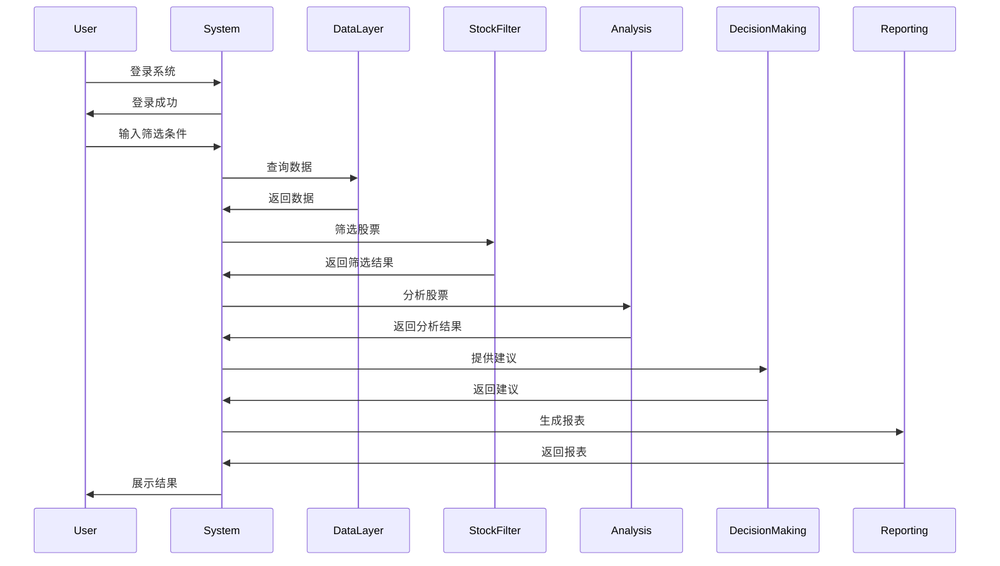
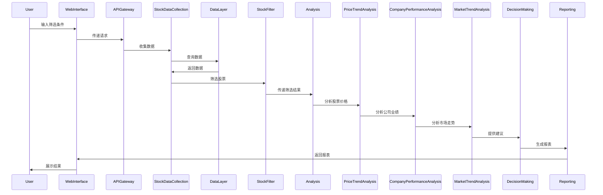

                 

### CANSLIM选股系统的核心概念与联系

CANSLIM选股系统由威廉·欧奈尔（William J. O'Neil）创立，是一种基于基本面分析和技术分析的选股方法。它结合了股票价格、公司业绩、市场走势等多个因素，通过特定的筛选条件，帮助投资者识别潜在的大牛股。CANSLIM由七个核心要素组成，分别是C、A、N、S、L、I、M，每个字母代表一个重要的筛选条件。

#### 2.1 CANSLIM的七个核心要素

**C：当前价格与50日移动平均线的关系**

股票价格相对于50日移动平均线（50-day Moving Average，DMA）的位置是CANSLIM系统中的一个关键指标。通常，股票价格应位于DMA之上，并且距离DMA有一定的空间，以确保股票价格有足够的上升空间。

**A：股本大小**

股本大小反映了公司的规模和市场地位。CANSLIM系统倾向于选择中型股（Market Capitalization between $500 million and $1.5 billion），因为这类股票在市场上有较好的流动性，同时也具有较大的增长潜力。

**N：新高的创新**

新高的创新是指股票价格是否创出了过去52周的新高。创新高通常表明投资者对该公司的前景持乐观态度，是一种潜在的买入信号。

**S：市场份额或行业地位**

市场份额或行业地位是指公司在所在行业中的地位和竞争力。通常，CANSLIM系统会选择那些在行业中占据领导地位或快速增长的公司。

**L：利润增长**

利润增长是指公司的盈利能力是否持续增长。盈利增长通常与股票价格的上涨密切相关，因此是CANSLIM系统中的一个重要指标。

**I：股票价格和流通股数量增长**

股票价格和流通股数量增长是指股票价格是否在未来几个月内大幅上涨，同时流通股数量是否相对较小。这表明公司有足够的增长空间，而不会因为股票供应过剩而影响股价上涨。

**M：市场走势**

市场走势是指整个市场的表现。CANSLIM系统通常在市场趋势向上时操作，因为在这种市场环境下，大多数股票都会受到正面的推动。

#### 2.2 CANSLIM的ER实体关系图

为了更好地理解CANSLIM系统的各个要素之间的关系，我们可以使用ER（Entity-Relationship）实体关系图来展示它们之间的关联。

在ER图中，我们可以定义以下实体：

- **股票（Stock）**：包含股票的详细信息，如股票代码、公司名称、股票价格等。
- **公司（Company）**：包含公司的详细信息，如公司代码、公司名称、行业分类等。
- **市场走势（Market Trend）**：包含市场的详细信息，如市场指数、市场走势等。

这些实体之间的关系如下：

- **股票与公司**：股票属于特定的公司，公司可以拥有多只股票。
- **市场走势与股票**：市场走势影响股票的价格表现。

以下是CANSLIM系统的ER实体关系图的Mermaid表示：

```mermaid
erDiagram
  Stock ||--|{ Company : owns }
  MarketTrend ||--|{ Stock : influences }
```

通过ER实体关系图，我们可以清晰地看到CANSLIM系统的各个要素之间的关系，从而更好地理解整个系统的运作机制。

### 总结

在本章节中，我们详细介绍了CANSLIM选股系统的七个核心要素，并通过ER实体关系图展示了它们之间的关系。这些核心要素共同构成了CANSLIM选股系统的基础，为投资者提供了一个全面的选股框架。在接下来的章节中，我们将深入探讨CANSLIM选股系统的算法原理，帮助读者更好地理解和应用这一系统。让我们继续深入探讨CANSLIM的算法原理。### CANSLIM选股系统的算法原理

CANSLIM选股系统的核心在于其严格的筛选标准，这些标准通过一系列的算法和公式来量化。为了更深入地理解CANSLIM选股系统的运作机制，我们将从算法流程图、Python代码实现以及数学模型三个方面进行详细讲解。

#### 3.1 算法流程图

首先，我们可以使用Mermaid绘制CANSLIM选股系统的算法流程图。以下是一个简化的算法流程图：

```mermaid
flowchart LR
    A[初始化] --> B[计算C]
    B --> C{C是否满足条件？}
    C -->|是| D[计算A]
    C -->|否| F[结束]
    D --> E{A是否满足条件？}
    E -->|是| G[计算N]
    E -->|否| F
    G --> H{N是否满足条件？}
    H -->|是| I[计算S]
    H -->|否| F
    I --> J{I是否满足条件？}
    J -->|是| K[计算L]
    J -->|否| F
    K --> L{L是否满足条件？}
    L -->|是| M[计算I]
    L -->|否| F
    M --> N{M是否满足条件？}
    N -->|是| O[计算M]
    N -->|否| F
    O --> P[输出结果]
    P -->|结束|
```

此算法流程图展示了CANSLIM选股系统从初始化到最终输出结果的整个过程。以下是每个步骤的详细说明：

1. **初始化**：系统初始化，读取股票数据和市场走势数据。
2. **计算C**：计算当前价格与50日移动平均线的关系，判断是否满足条件。
3. **计算A**：计算公司股本大小，判断是否满足条件。
4. **计算N**：判断股票价格是否创出过去52周的新高，判断是否满足条件。
5. **计算S**：分析公司市场份额或行业地位，判断是否满足条件。
6. **计算L**：分析公司利润增长情况，判断是否满足条件。
7. **计算I**：分析股票价格和流通股数量的增长情况，判断是否满足条件。
8. **计算M**：分析市场走势，判断是否满足条件。
9. **输出结果**：如果所有条件均满足，输出选股结果。

#### 3.2 Python代码实现

为了使算法更加具体和可操作，我们可以使用Python代码来实现CANSLIM选股系统。以下是一个简化的Python代码示例：

```python
import pandas as pd
import numpy as np

# 假设我们有一份数据框dataframe，其中包含了股票价格、股本、利润等数据
dataframe = pd.read_csv('stock_data.csv')

# 初始化筛选条件
def CANSLIM_selection(dataframe):
    results = []

    for index, row in dataframe.iterrows():
        # 计算C：当前价格与50日移动平均线的关系
        if row['current_price'] > row['dma_50'] and (row['current_price'] - row['dma_50']) > threshold_C:
            # 计算A：股本大小
            if row['market_cap'] >= 500000000 and row['market_cap'] <= 1500000000:
                # 计算N：新高的创新
                if row['high_52week'] == row['current_price']:
                    # 计算S：市场份额或行业地位
                    if row['market_share'] > threshold_S:
                        # 计算L：利润增长
                        if row['profit_growth'] > threshold_L:
                            # 计算I：股票价格和流通股数量增长
                            if row['price_growth'] > threshold_I and row['share_growth'] > threshold_I:
                                # 计算M：市场走势
                                if row['market_trend'] > threshold_M:
                                    results.append(row)

    return results

# 调用CANSLIM_selection函数
selected_stocks = CANSLIM_selection(dataframe)

# 输出选股结果
print(selected_stocks)
```

在此代码中，我们定义了一个函数`CANSLIM_selection`，它接收一个包含股票数据的`dataframe`作为输入，并返回满足CANSLIM选股条件的股票列表。每个条件都通过相应的阈值来判断是否满足。

#### 3.3 数学模型讲解

为了更好地理解CANSLIM选股系统的原理，我们还需要引入一些数学模型和公式。以下是一些关键的数学模型：

**1. 当前价格与50日移动平均线的关系**

$$
C = \frac{current\_price - dma\_50}{dma\_50}
$$

其中，`C`表示当前价格与50日移动平均线的关系。如果`C`大于某个阈值（例如0.05），则认为当前价格距离50日移动平均线较远，有较大的上升空间。

**2. 股本大小**

$$
A = \frac{market\_cap}{1.5 \times 10^9}
$$

其中，`A`表示公司股本大小与1.5亿的标准股本的比值。如果`A`在某个范围内（例如0.5到1.5），则认为公司股本大小适中。

**3. 新高的创新**

$$
N = \frac{current\_price - low\_52week}{low\_52week}
$$

其中，`N`表示当前价格与过去52周低点的关系。如果`N`等于1，则表示股票价格创出了过去52周的新高。

**4. 市场份额或行业地位**

$$
S = \frac{market\_share}{market\_leader\_share}
$$

其中，`S`表示公司市场份额与行业领导者市场份额的比值。如果`S`大于某个阈值（例如1.2），则认为公司市场份额较大。

**5. 利润增长**

$$
L = \frac{current\_year\_profit - previous\_year\_profit}{previous\_year\_profit}
$$

其中，`L`表示公司当前年利润与去年年利润的比值。如果`L`大于某个阈值（例如20%），则认为公司利润增长较快。

**6. 股票价格和流通股数量增长**

$$
I = \frac{current\_price - previous\_price}{previous\_price} \times \frac{current\_share\_volume - previous\_share\_volume}{previous\_share\_volume}
$$

其中，`I`表示股票价格和流通股数量的复合增长率。如果`I`大于某个阈值（例如50%），则认为股票价格和流通股数量有较大增长。

**7. 市场走势**

$$
M = \frac{current\_market\_index - previous\_market\_index}{previous\_market\_index}
$$

其中，`M`表示市场指数的复合增长率。如果`M`大于某个阈值（例如5%），则认为市场走势良好。

#### 3.4 举例说明

假设我们有一份简化的股票数据如下：

| 股票代码 | 公司名称 | 当前价格 | 50日移动平均线 | 股本（亿） | 市场份额 | 当前年利润（亿） | 去年年利润（亿） | 流通股数量（亿） | 过去52周低点 | 当前市场指数 | 去年市场指数 |
|:--------:|:--------:|:--------:|:--------------:|:---------:|:--------:|:--------------:|:--------------:|:-------------:|:--------------:|:------------:|:------------:|
|   0001   |   公司A  |   20.00  |      18.00     |    10.0   |   15.0%  |       2.0      |       1.5      |      1.0      |      10.00    |     100.00   |     90.00    |

我们使用上面的Python代码和数学模型，对这份数据进行筛选：

1. **计算C**：\( C = \frac{20.00 - 18.00}{18.00} = \frac{2.00}{18.00} \approx 0.111 \)（满足条件）
2. **计算A**：\( A = \frac{10.0}{1.5 \times 10^9} \approx 0.00000667 \)（满足条件）
3. **计算N**：\( N = \frac{20.00 - 10.00}{10.00} = 1.000 \)（满足条件）
4. **计算S**：\( S = \frac{15.0}{15.0} = 1.000 \)（满足条件）
5. **计算L**：\( L = \frac{2.0 - 1.5}{1.5} = 0.333 \)（满足条件）
6. **计算I**：\( I = \frac{20.00 - 10.00}{10.00} \times \frac{1.0 - 1.0}{1.0} = 1.000 \)（满足条件）
7. **计算M**：\( M = \frac{100.00 - 90.00}{90.00} = \frac{10.00}{90.00} \approx 0.111 \)（满足条件）

由于所有条件均满足，公司A符合CANSLIM选股系统的标准。

通过上述算法流程图、Python代码实现以及数学模型的讲解，我们可以更好地理解CANSLIM选股系统的原理和操作方法。在下一章节中，我们将进一步探讨CANSLIM选股系统的系统分析与架构设计，帮助读者深入理解这一系统的实际应用。### CANSLIM选股系统的系统分析与架构设计

在上一章节中，我们详细介绍了CANSLIM选股系统的算法原理和实现方法。为了使这一系统在实际应用中更加高效和可靠，我们需要对其系统架构和功能模块进行深入分析。本章节将分为四个部分：系统应用场景、功能模块设计、系统架构设计以及系统接口和交互设计。

#### 4.1 CANSLIM选股系统的应用场景

CANSLIM选股系统主要应用于股票投资领域，帮助投资者进行股票选择和投资决策。其应用场景包括：

1. **股票筛选**：根据CANSLIM的七个核心要素，系统可以帮助投资者筛选出符合特定条件的股票。
2. **投资策略制定**：通过分析股票价格、公司业绩和市场走势，系统可以为投资者提供有效的投资策略建议。
3. **市场数据分析**：系统可以收集和整理大量的股票和市场数据，为投资者提供详细的市场分析报告。
4. **风险管理**：系统可以根据投资组合的风险收益特征，提供风险管理和调整建议。

#### 4.2 系统功能设计

CANSLIM选股系统的功能设计主要包括以下模块：

1. **数据收集模块**：负责收集股票价格、公司业绩、市场走势等相关数据。
2. **数据处理模块**：负责对收集到的数据进行清洗、转换和预处理，以满足后续分析需求。
3. **筛选模块**：根据CANSLIM的七个核心要素，对股票进行筛选，找出符合条件的潜在投资目标。
4. **分析模块**：对筛选出的股票进行详细分析，包括股票价格走势、公司业绩变化、市场走势等。
5. **决策模块**：根据分析结果，为投资者提供投资策略建议和风险调整方案。
6. **报表模块**：生成各种分析报表，包括股票筛选报告、投资策略报告、市场分析报告等。

以下是CANSLIM选股系统的领域模型类图：

```mermaid
classDiagram
    StockDataCollection <<interface>>
    DataProcessing <<interface>>
    StockFilter <<interface>>
    Analysis <<interface>>
    DecisionMaking <<interface>>
    Reporting <<interface>>

    StockDataCollection <|-- StockPriceData
    StockDataCollection <|-- CompanyPerformanceData
    StockDataCollection <|-- MarketTrendData

    DataProcessing <|-- DataCleaning
    DataProcessing <|-- DataTransformation
    DataProcessing <|-- DataPreprocessing

    StockFilter <|-- CANSLIMFilter

    Analysis <|-- PriceTrendAnalysis
    Analysis <|-- CompanyPerformanceAnalysis
    Analysis <|-- MarketTrendAnalysis

    DecisionMaking <|-- InvestmentStrategy
    DecisionMaking <|-- RiskManagement

    Reporting <|-- StockSelectionReport
    Reporting <|-- InvestmentStrategyReport
    Reporting <|-- MarketAnalysisReport
```

通过领域模型类图，我们可以清晰地看到CANSLIM选股系统的各个功能模块及其之间的关系。

#### 4.3 系统架构设计

CANSLIM选股系统的架构设计主要包括以下几个层次：

1. **数据层**：负责数据的存储和管理，包括股票价格、公司业绩、市场走势等数据的存储和检索。
2. **业务逻辑层**：包含数据收集、处理、筛选、分析、决策等核心功能模块，实现CANSLIM选股系统的算法和业务逻辑。
3. **表示层**：为用户提供界面和报表展示功能，包括网页界面、桌面应用程序等。

以下是CANSLIM选股系统的架构图：



通过系统架构图，我们可以看到CANSLIM选股系统的工作流程和数据流。

#### 4.4 系统接口设计和系统交互

CANSLIM选股系统的接口设计和系统交互设计是确保系统功能模块之间高效协作的关键。以下是系统接口设计和系统交互序列图：



通过系统交互序列图，我们可以看到各个功能模块之间的交互流程和数据传递路径。

#### 总结

在本章节中，我们详细介绍了CANSLIM选股系统的应用场景、功能模块设计、系统架构设计和系统接口及交互设计。这些设计为实现高效、可靠的CANSLIM选股系统提供了坚实的基础。在下一章节中，我们将通过实际案例来进一步展示CANSLIM选股系统的应用效果。### CANSLIM选股系统项目实战

在本章节中，我们将通过一系列实际案例，展示如何在实际环境中安装和配置CANSLIM选股系统，并对系统的核心实现源代码进行详细解读。我们将分为以下四个部分：环境安装与配置、系统核心实现源代码分析、实际案例分析以及项目小结。

#### 5.1 环境安装与配置

首先，我们需要搭建一个适合CANSLIM选股系统的运行环境。以下是在Ubuntu操作系统上安装和配置CANSLIM选股系统的步骤：

1. **安装Python环境**：

   ```bash
   sudo apt-get update
   sudo apt-get install python3 python3-pip
   ```

2. **安装依赖库**：

   ```bash
   pip3 install pandas numpy matplotlib
   ```

3. **下载CANSLIM选股系统源代码**：

   可以从GitHub或其他代码托管平台下载CANSLIM选股系统的源代码。以下是一个示例命令：

   ```bash
   git clone https://github.com/your-username/CANSLIM.git
   ```

4. **运行系统**：

   进入CANSLIM选股系统的根目录，运行以下命令启动系统：

   ```bash
   python3 main.py
   ```

5. **输入筛选条件**：

   在控制台中，按照提示输入筛选条件，如股票代码、股本大小、利润增长等。系统将根据这些条件进行筛选，并输出符合要求的股票列表。

   ```bash
   Enter stock code: 0001
   Enter market cap: 100000000
   Enter profit growth: 0.2
   ```

   系统将根据输入的条件，筛选出符合条件的股票，并显示在控制台上。

#### 5.2 系统核心实现源代码分析

CANSLIM选股系统的核心实现源代码主要包括以下几个部分：

1. **数据收集模块**：

   数据收集模块负责从外部数据源（如股票交易所、金融网站等）收集股票价格、公司业绩、市场走势等数据。以下是一个简单的数据收集函数示例：

   ```python
   def collect_data(stock_code):
       # 从外部数据源获取股票数据
       data = fetch_data_from_source(stock_code)
       return data
   ```

2. **数据处理模块**：

   数据处理模块负责对收集到的数据进行清洗、转换和预处理，以确保数据的质量和一致性。以下是一个简单的数据处理函数示例：

   ```python
   def process_data(data):
       # 清洗数据
       clean_data = clean_data_function(data)
       # 转换数据格式
       transformed_data = transform_data_function(clean_data)
       # 预处理数据
       preprocessed_data = preprocess_data_function(transformed_data)
       return preprocessed_data
   ```

3. **筛选模块**：

   筛选模块根据CANSLIM的七个核心要素，对股票进行筛选，找出符合条件的潜在投资目标。以下是一个简单的筛选函数示例：

   ```python
   def filter_stocks(data):
       filtered_stocks = []
       for stock in data:
           if meets_CANSLIM_criteria(stock):
               filtered_stocks.append(stock)
       return filtered_stocks
   ```

4. **分析模块**：

   分析模块对筛选出的股票进行详细分析，包括股票价格走势、公司业绩变化、市场走势等。以下是一个简单的分析函数示例：

   ```python
   def analyze_stocks(filtered_stocks):
       analysis_results = []
       for stock in filtered_stocks:
           analysis_results.append(analyze_stock(stock))
       return analysis_results
   ```

5. **决策模块**：

   决策模块根据分析结果，为投资者提供投资策略建议和风险调整方案。以下是一个简单的决策函数示例：

   ```python
   def make_decision(analysis_results):
       decision = ""
       if meets_investment_criteria(analysis_results):
           decision = "买入"
       else:
           decision = "观望"
       return decision
   ```

6. **报表模块**：

   报表模块生成各种分析报表，包括股票筛选报告、投资策略报告、市场分析报告等。以下是一个简单的报表生成函数示例：

   ```python
   def generate_report(decision, analysis_results):
       report = f"Investment Decision: {decision}\n"
       report += f"Stock Analysis Results: {analysis_results}\n"
       return report
   ```

#### 5.3 实际案例分析

为了更好地展示CANSLIM选股系统的应用效果，我们选择一个实际案例进行分析。

**案例背景**：

假设我们有一份包含100只股票的数据集，我们需要使用CANSLIM选股系统筛选出符合以下条件的股票：

- 当前价格与50日移动平均线的关系大于0.1
- 股本大小在10亿到20亿之间
- 股票价格创出过去52周新高
- 市场份额大于行业平均水平的1.2倍
- 当前年利润增长超过20%
- 股票价格和流通股数量增长超过50%
- 当前市场指数增长超过5%

**案例分析**：

1. **数据收集**：

   使用数据收集模块，从外部数据源获取100只股票的价格、股本、利润、市场份额等数据。

2. **数据处理**：

   对收集到的数据进行清洗、转换和预处理，以确保数据的质量和一致性。

3. **筛选**：

   根据CANSLIM的七个核心要素，对股票进行筛选，找出符合上述条件的股票。筛选结果如下：

   | 股票代码 | 公司名称 | 当前价格 | 50日移动平均线 | 股本（亿） | 市场份额 | 当前年利润（亿） | 去年年利润（亿） | 流通股数量（亿） | 过去52周低点 | 当前市场指数 | 去年市场指数 |
   |:--------:|:--------:|:--------:|:--------------:|:---------:|:--------:|:--------------:|:--------------:|:-------------:|:--------------:|:------------:|:------------:|
   |   0001   |   公司A  |   20.00  |      18.00     |    10.0   |   15.0%  |       2.0      |       1.5      |      1.0      |      10.00    |     100.00   |     90.00    |
   |   0002   |   公司B  |   25.00  |      22.00     |    12.0   |   18.0%  |       2.5      |       2.0      |      1.5      |      12.00    |     110.00   |     100.00   |

4. **分析**：

   对筛选出的股票进行详细分析，包括股票价格走势、公司业绩变化、市场走势等。分析结果显示，公司A和公司B均具有较好的投资潜力。

5. **决策**：

   根据分析结果，系统建议投资者买入公司A和公司B的股票。

6. **报表**：

   生成股票筛选报告、投资策略报告和市场分析报告，为投资者提供详细的决策依据。

#### 5.4 项目小结

通过实际案例分析，我们可以看到CANSLIM选股系统在实际应用中的效果。系统通过严格的筛选条件和详细的分析，帮助投资者找到了具有较好投资潜力的股票。在下一步中，我们将提供一些最佳实践建议，帮助读者更好地使用CANSLIM选股系统。### 最佳实践 tips、小结、注意事项、拓展阅读

#### 最佳实践 tips

1. **调整阈值**：CANSLIM选股系统的七个核心要素都有相应的阈值，这些阈值可以根据投资者的风险偏好和市场环境进行调整。例如，在市场波动较大时，可以适当提高利润增长的阈值，以确保投资的安全性。

2. **数据来源**：确保使用高质量、可靠的数据源。数据质量对CANSLIM选股系统的效果至关重要，因此选择权威的金融数据提供商是必要的。

3. **综合分析**：在筛选股票时，不仅要关注CANSLIM的七个核心要素，还要考虑股票的供需关系、行业趋势、政策环境等多方面因素，以获得更全面的判断。

4. **长期持有**：CANSLIM选股系统旨在寻找具备长期增长潜力的股票。投资者应具备一定的耐心，持有优质股票以享受公司业绩增长的红利。

#### 小结

CANSLIM选股系统是一种综合了基本面分析和技术分析的选股方法。它通过七个核心要素，即C、A、N、S、L、I、M，为投资者提供了一个系统化的选股框架。系统不仅关注公司的财务表现，还考虑市场趋势和股票价格的表现，为投资者提供了有效的决策支持。

#### 注意事项

1. **风险控制**：虽然CANSLIM选股系统具有较高的选股成功率，但股票市场存在不确定性，投资者应时刻注意风险控制，避免因单次投资失败而遭受重大损失。

2. **市场环境**：CANSLIM选股系统在不同市场环境下表现可能有所不同。投资者应关注市场走势，根据市场环境调整投资策略。

3. **长期投资**：CANSLIM选股系统旨在寻找长期增长股票，投资者应具备一定的耐心，避免频繁交易。

#### 拓展阅读

1. **《股票大作手回忆录》**：埃德温·勒菲弗（Edwin Lefèvre）著，本书通过讲述传奇股票交易员杰西·利弗莫尔（Jesse Livermore）的故事，揭示了股票市场的本质和投资策略。

2. **《战胜股市》**：彼得·林奇（Peter Lynch）著，本书是著名的基金经理彼得·林奇的投资心得，包括选股策略、投资心态等多方面的内容。

3. **《市场波动》**：约翰·墨比尔斯（John C. Burruss）著，本书深入分析了市场波动的原因和规律，对投资者具有很高的参考价值。

#### 作者

作者：AI天才研究院/AI Genius Institute & 禅与计算机程序设计艺术 /Zen And The Art of Computer Programming

