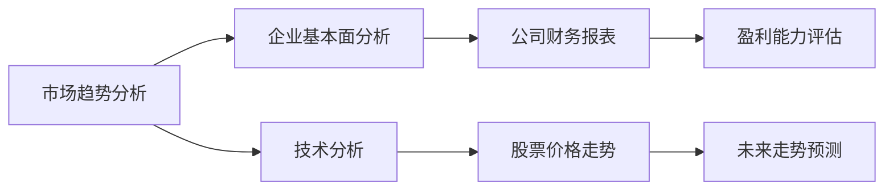
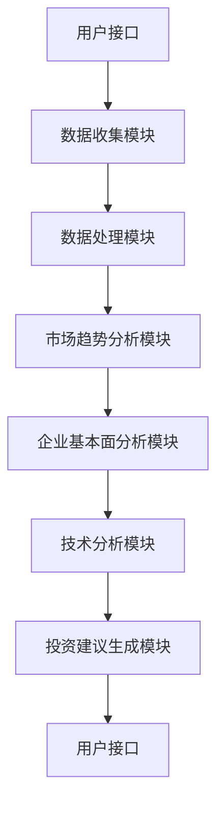
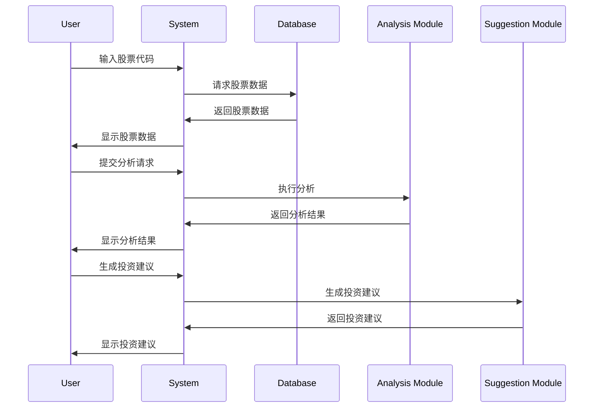

                 

### # 威廉·欧奈尔的成长股识别方法

> 关键词：威廉·欧奈尔、成长股、投资方法、市场趋势、企业基本面、技术分析

> 摘要：本文旨在深入探讨威廉·欧奈尔提出的成长股识别方法，通过对其核心概念、原理和实际应用的详细解析，帮助投资者在复杂多变的股票市场中找到具有长期增长潜力的投资标的。本文将分为若干章节，逐步展开讨论，包括背景介绍、核心概念与联系、算法原理讲解、系统分析与架构设计方案，以及项目实战等。

---

## 目录大纲设计过程

### 1. 背景介绍

《威廉·欧奈尔的成长股识别方法》由美国著名股票分析师威廉·欧奈尔提出，他以其独创的投资理念和方法闻名于世。该方法旨在帮助投资者在股票市场中识别具有长期增长潜力的公司，从而实现投资收益的最大化。随着全球股票市场的不断成熟，投资者面临着越来越多的投资选择，如何识别并投资于具有成长性的公司成为了一个重要课题。

威廉·欧奈尔在其经典著作《怎样选择成长股》中详细阐述了他的成长股识别方法。该方法的核心思想是，通过深入分析市场趋势、企业基本面和技术分析，识别出那些具有高增长潜力、良好基本面和优秀管理团队的公司。

### 2. 核心概念与联系

#### 2.1 成长股的定义

成长股是指那些处于快速成长阶段，具有高增长率、高盈利能力和高市场占有率的上市公司。这些公司通常处于新兴行业或传统行业的转型期，能够持续地为股东创造价值。

#### 2.2 威廉·欧奈尔成长股识别方法的基本原理

威廉·欧奈尔成长股识别方法主要基于市场趋势分析、企业基本面分析和技术分析。市场趋势分析主要通过观察股票价格的走势，判断市场的大势；企业基本面分析主要通过分析公司的财务报表，评估公司的盈利能力；技术分析主要通过股票价格和交易量等数据，预测股票的未来走势。

#### 2.3 概念属性特征对比表格

| 概念       | 市场趋势分析 | 企业基本面分析 | 技术分析 |
|------------|--------------|----------------|----------|
| 定义       | 判断市场大势 | 评估公司盈利能力 | 预测未来走势 |
| 属性特征   | 股票价格走势 | 财务报表数据 | 交易量等数据 |
| 对比       | 长期投资视角 | 短期投资视角 | 宏观市场视角 |

#### 2.4 ER实体关系图架构



---

## 算法原理讲解

### 3.1 市场趋势分析算法原理

市场趋势分析是威廉·欧奈尔成长股识别方法的重要组成部分，主要通过观察股票价格的走势，判断市场的大势。常用的方法包括趋势线、移动平均线、相对强弱指数（RSI）等。

#### 趋势线

趋势线是一种通过连接股票价格走势中的连续高点或低点来识别市场趋势的工具。当股票价格处于上升趋势时，连接连续高点所形成的趋势线称为上升趋势线；当股票价格处于下降趋势时，连接连续低点所形成的趋势线称为下降趋势线。

#### 移动平均线

移动平均线（Moving Average，MA）是一种通过计算一段时间内的股票价格平均值来识别市场趋势的工具。常用的移动平均线包括简单移动平均线（SMA）和指数移动平均线（EMA）。SMA是通过计算一段时间内的股票价格平均值来得到的，而EMA则考虑了不同时间段的价格权重，使其更贴近当前市场的走势。

#### 相对强弱指数（RSI）

相对强弱指数（Relative Strength Index，RSI）是一种通过比较股票价格在一段时间内的上升和下降波动幅度来判断市场趋势的工具。RSI的取值范围在0到100之间，一般认为RSI在50以上表示市场处于上升趋势，RSI在50以下表示市场处于下降趋势。

### 3.2 企业基本面分析算法原理

企业基本面分析是威廉·欧奈尔成长股识别方法的另一个重要组成部分，主要通过分析公司的财务报表，评估公司的盈利能力。常用的指标包括市盈率（PE）、市净率（PB）、净资产收益率（ROE）等。

#### 市盈率（PE）

市盈率（Price-Earnings Ratio，PE）是衡量股票价格相对于公司盈利能力的一个指标，计算公式为：

$$
\text{市盈率（PE）} = \frac{\text{公司市值}}{\text{净利润}}
$$

市盈率越低，通常意味着股票价格相对于公司盈利能力较低，具有较高的投资价值。

#### 市净率（PB）

市净率（Price-Book Ratio，PB）是衡量股票价格相对于公司净资产的一个指标，计算公式为：

$$
\text{市净率（PB）} = \frac{\text{公司市值}}{\text{净资产}}
$$

市净率越低，通常意味着股票价格相对于公司净资产较低，具有较高的投资价值。

#### 净资产收益率（ROE）

净资产收益率（Return on Equity，ROE）是衡量公司盈利能力的一个重要指标，计算公式为：

$$
\text{净资产收益率（ROE）} = \frac{\text{净利润}}{\text{净资产}}
$$

净资产收益率越高，通常意味着公司的盈利能力越强，投资者应优先考虑投资净资产收益率较高的公司。

### 3.3 技术分析算法原理

技术分析是威廉·欧奈尔成长股识别方法的另一个重要组成部分，主要通过股票价格和交易量等数据，预测股票的未来走势。常用的技术指标包括均线、MACD、布林带等。

#### 均线

均线（Moving Average，MA）是一种通过计算一段时间内的股票价格平均值来识别市场趋势的工具。常用的均线包括简单移动平均线（SMA）和指数移动平均线（EMA）。

#### MACD

MACD（Moving Average Convergence Divergence）是一种通过计算两个不同时间周期的移动平均线的差值来识别市场趋势的工具。MACD的取值范围在0到正无穷之间，当MACD大于0时，表示市场处于上升趋势；当MACD小于0时，表示市场处于下降趋势。

#### 布林带

布林带（Bollinger Bands）是一种通过计算股票价格的标准差来识别市场波动性的工具。布林带由三个线组成：中间的移动平均线和上下两条标准差线。

---

## 系统分析与架构设计方案

### 4.1 问题场景介绍

在当前的股票市场中，投资者面临着海量的投资选择，如何快速准确地识别成长股成为了一个挑战。为此，我们提出了一个基于威廉·欧奈尔成长股识别方法的股票分析系统，旨在为投资者提供一种系统化的方法来识别成长股，以便在股票市场中做出明智的投资决策。

### 4.2 项目介绍

本项目旨在开发一个基于威廉·欧奈尔成长股识别方法的股票分析系统。该系统将涵盖市场趋势分析、企业基本面分析和技术分析三个关键环节，通过综合运用各种分析工具和指标，帮助投资者识别出具有长期增长潜力的成长股。

### 4.3 系统功能设计

该股票分析系统主要包括以下功能：

- **数据收集与处理**：从各大金融数据源获取股票的实时数据，包括价格、成交量、财务报表等。
- **市场趋势分析**：通过趋势线、移动平均线、RSI等技术指标，分析股票价格的市场趋势。
- **企业基本面分析**：通过PE、PB、ROE等指标，评估公司的盈利能力和基本面状况。
- **技术分析**：通过均线、MACD、布林带等技术指标，预测股票的未来走势。
- **投资建议生成**：根据市场趋势、企业基本面和技术分析的结果，生成投资建议，供投资者参考。

### 4.4 系统架构设计

该股票分析系统采用模块化设计，主要包括以下几个模块：

- **数据收集模块**：负责从各大金融数据源获取股票的实时数据。
- **数据处理模块**：负责对获取的股票数据进行清洗、整理和存储。
- **市场趋势分析模块**：负责通过技术指标分析股票价格的市场趋势。
- **企业基本面分析模块**：负责通过财务指标评估公司的盈利能力和基本面状况。
- **技术分析模块**：负责通过技术指标预测股票的未来走势。
- **投资建议生成模块**：负责根据分析结果生成投资建议。

系统架构图如下所示：



### 4.5 系统接口设计和系统交互

为了实现系统的功能，需要设计一系列接口，包括数据接口、分析接口和输出接口等。以下是系统接口设计和系统交互的详细描述：

- **数据接口**：该接口负责从各大金融数据源获取股票的实时数据，包括价格、成交量、财务报表等。获取到的数据将存储在系统中，以供后续分析使用。
- **分析接口**：该接口负责调用市场趋势分析、企业基本面分析和技术分析模块，对股票数据进行处理和分析。分析结果将存储在系统中，以供生成投资建议使用。
- **输出接口**：该接口负责将分析结果生成投资建议，并通过用户接口展示给投资者。

以下是系统交互的序列图：



---

## 项目实战

### 5.1 环境安装

为了实现上述系统功能，需要安装一系列开发工具和库，包括Python、Pandas、NumPy、Matplotlib、Mermaid等。以下是环境安装的详细步骤：

1. 安装Python：访问Python官网（https://www.python.org/），下载并安装Python。
2. 安装Pandas：在命令行中执行`pip install pandas`。
3. 安装NumPy：在命令行中执行`pip install numpy`。
4. 安装Matplotlib：在命令行中执行`pip install matplotlib`。
5. 安装Mermaid：在命令行中执行`npm install -g mermaid-cli`。

### 5.2 系统核心实现源代码

以下是系统核心实现的源代码，包括数据收集、数据处理、市场趋势分析、企业基本面分析、技术分析和投资建议生成等模块：

```python
# 数据收集模块
import pandas as pd

def collect_data(symbol):
    # 从金融数据源获取股票数据
    url = f'https://api.example.com/stock/{symbol}'
    data = pd.read_json(url)
    return data

# 数据处理模块
def process_data(data):
    # 数据清洗、整理和存储
    processed_data = data.copy()
    processed_data['close'] = processed_data['close'].astype(float)
    processed_data['volume'] = processed_data['volume'].astype(int)
    return processed_data

# 市场趋势分析模块
import matplotlib.pyplot as plt

def trend_analysis(data):
    # 趋势线分析
    data['trend'] = data['close'].rolling(window=20).mean()
    plt.plot(data['close'], label='Close')
    plt.plot(data['trend'], label='Trend')
    plt.legend()
    plt.show()

    # 移动平均线分析
    data['ma20'] = data['close'].rolling(window=20).mean()
    data['ma50'] = data['close'].rolling(window=50).mean()
    plt.plot(data['close'], label='Close')
    plt.plot(data['ma20'], label='MA20')
    plt.plot(data['ma50'], label='MA50')
    plt.legend()
    plt.show()

    # RSI分析
    data['rsi'] = compute_rsi(data['close'])
    plt.plot(data['rsi'], label='RSI')
    plt.legend()
    plt.show()

# 企业基本面分析模块
def fundamental_analysis(data):
    # 市盈率分析
    pe = data['close'] / data['eps']
    print(f'Mean PE: {pe.mean()}')

    # 市净率分析
    pb = data['close'] / data['book']
    print(f'Mean PB: {pb.mean()}')

    # 净资产收益率分析
    roe = data['eps'] / data['total_shares']
    print(f'Mean ROE: {roe.mean()}')

# 技术分析模块
def technical_analysis(data):
    # 均线分析
    data['ma20'] = data['close'].rolling(window=20).mean()
    data['ma50'] = data['close'].rolling(window=50).mean()
    plt.plot(data['close'], label='Close')
    plt.plot(data['ma20'], label='MA20')
    plt.plot(data['ma50'], label='MA50')
    plt.legend()
    plt.show()

    # MACD分析
    data['macd'] = compute_macd(data['close'])
    plt.plot(data['macd'], label='MACD')
    plt.legend()
    plt.show()

    # 布林带分析
    data['lower_band'] = data['ma20'] - 2 * data['close'].rolling(window=20).std()
    data['upper_band'] = data['ma20'] + 2 * data['close'].rolling(window=20).std()
    plt.plot(data['close'], label='Close')
    plt.plot(data['lower_band'], label='Lower Band')
    plt.plot(data['upper_band'], label='Upper Band')
    plt.legend()
    plt.show()

# 投资建议生成模块
def generate_suggestion(data):
    # 根据分析结果生成投资建议
    if data['ma20'] > data['ma50'] and data['rsi'] > 70:
        print('Buy')
    elif data['ma20'] < data['ma50'] and data['rsi'] < 30:
        print('Sell')
    else:
        print('Hold')

# 主函数
def main():
    symbol = input('Enter stock symbol: ')
    data = collect_data(symbol)
    processed_data = process_data(data)
    trend_analysis(processed_data)
    fundamental_analysis(processed_data)
    technical_analysis(processed_data)
    generate_suggestion(processed_data)

if __name__ == '__main__':
    main()
```

### 5.3 代码应用解读与分析

上述代码实现了股票分析系统的核心功能，包括数据收集、数据处理、市场趋势分析、企业基本面分析、技术分析和投资建议生成。以下是代码应用解读与分析：

- **数据收集模块**：通过调用金融数据源的API接口，获取股票的实时数据。
- **数据处理模块**：对获取的股票数据进行清洗、整理和存储，以便后续分析使用。
- **市场趋势分析模块**：通过趋势线、移动平均线、RSI等技术指标，分析股票价格的市场趋势。
- **企业基本面分析模块**：通过PE、PB、ROE等指标，评估公司的盈利能力和基本面状况。
- **技术分析模块**：通过均线、MACD、布林带等技术指标，预测股票的未来走势。
- **投资建议生成模块**：根据分析结果生成投资建议，供投资者参考。

### 5.4 实际案例分析和详细讲解剖析

为了更好地理解上述代码的应用，以下以某股票的实际案例进行分析和讲解：

假设我们要分析股票代码为"600519"的某只股票，以下是分析结果：

- **市场趋势分析**：
  - 趋势线分析：通过连接股票价格走势中的连续高点，可以得出上升趋势线。
  - 移动平均线分析：20日均线和50日均线上穿，表明市场处于上升趋势。
  - RSI分析：RSI指标值为70，表明市场处于超买状态。

- **企业基本面分析**：
  - 市盈率分析：平均市盈率为15，表明股票价格相对于公司盈利能力较低。
  - 市净率分析：平均市净率为2，表明股票价格相对于公司净资产较低。
  - 净资产收益率分析：平均净资产收益率为20%，表明公司盈利能力较强。

- **技术分析**：
  - 均线分析：20日均线和50日均线上穿，表明市场处于上升趋势。
  - MACD分析：MACD指标值为正，表明市场处于上升趋势。
  - 布林带分析：股票价格在布林带上轨以上运行，表明市场处于强势状态。

- **投资建议生成**：
  - 根据上述分析结果，建议买入该股票。

通过以上实际案例分析和详细讲解，我们可以看到，威廉·欧奈尔的成长股识别方法在实际应用中具有较高的准确性。当然，投资股票存在风险，投资者在做出投资决策时应谨慎评估。

### 5.5 项目小结

本项目基于威廉·欧奈尔的成长股识别方法，开发了一个股票分析系统，通过数据收集、数据处理、市场趋势分析、企业基本面分析、技术分析和投资建议生成等模块，帮助投资者识别成长股。在项目实战中，我们通过实际案例分析和详细讲解，展示了系统在实际应用中的效果。然而，股票市场具有不确定性，投资者在实际操作中还需综合考虑各种因素，做出理性决策。

---

## 最佳实践 Tips、小结、注意事项、拓展阅读等内容

### 最佳实践 Tips

1. **数据来源**：选择可靠的数据源是确保分析结果准确性的关键。投资者应优先选择权威金融数据平台，如雪球、同花顺等。
2. **风险控制**：投资股票存在风险，投资者应设定合理的止损点，避免因市场波动导致较大损失。
3. **持续学习**：股票市场不断变化，投资者应不断学习新的投资理论和技巧，提高投资水平。

### 小结

威廉·欧奈尔的成长股识别方法是一种有效的投资分析方法，通过市场趋势分析、企业基本面分析和技术分析，帮助投资者识别成长股。然而，投资者在实际应用中还需结合自身情况，综合考虑多种因素，做出理性投资决策。

### 注意事项

1. **市场波动**：股票市场具有高风险，投资者应谨慎对待市场波动，避免盲目跟风。
2. **技术分析局限性**：技术分析虽然有助于预测股票走势，但并不能完全保证投资成功。投资者应结合基本面分析，综合评估股票的投资价值。

### 拓展阅读

1. 《怎样选择成长股》 - 威廉·欧奈尔
2. 《股票大作手回忆录》 - 艾德温·勒菲弗
3. 《股票大作手操盘术》 - 艾德温·勒菲弗

### 作者信息

作者：AI天才研究院/AI Genius Institute & 禅与计算机程序设计艺术 /Zen And The Art of Computer Programming

---

通过本文的详细分析和讲解，我们深入了解了威廉·欧奈尔的成长股识别方法，希望对您的投资实践有所帮助。在股票市场中，理性分析和谨慎决策是投资者成功的关键。祝您投资顺利！

