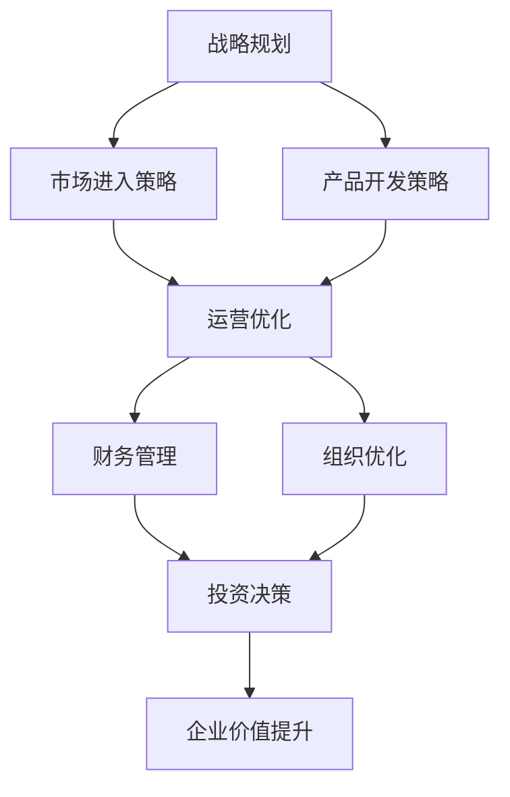
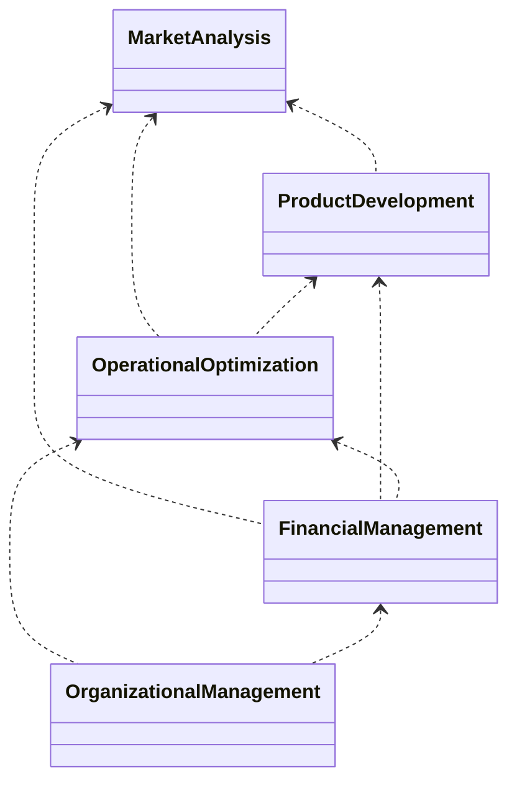
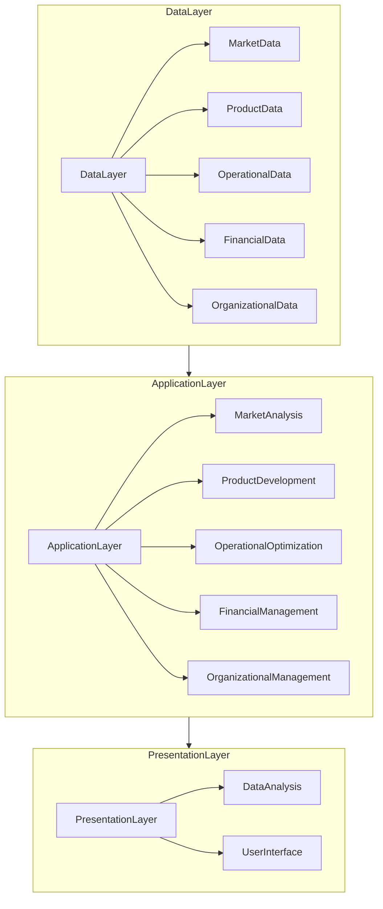
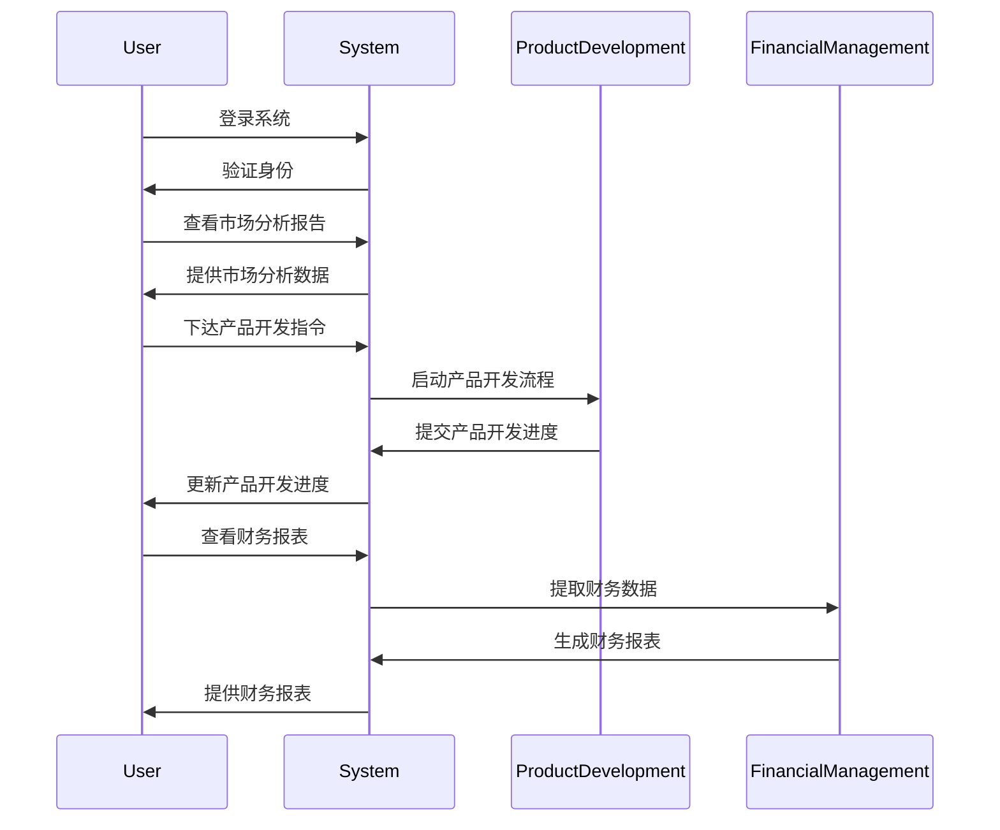

                 


# 威廉·贝恩的企业价值提升策略

> 关键词：企业价值提升、策略、财务管理、运营优化、组织优化

> 摘要：本文将深入探讨威廉·贝恩的企业价值提升策略，通过详细分析核心概念、策略方法论、实施步骤以及实际案例分析，帮助读者理解并应用这些策略，提升企业市场竞争力、盈利能力和社会影响力。

## 目录大纲设计

### 背景介绍
《威廉·贝恩的企业价值提升策略》是一本系统阐述企业如何通过策略提升自身价值的技术与管理相结合的书籍。本书旨在帮助企业管理者和决策者深入理解企业价值提升的核心概念、方法论和实践技巧，从而在实际工作中运用这些策略，推动企业持续发展和成长。

### 核心概念与联系
- **企业价值提升**：通过战略规划、运营优化、财务管理等多种手段，提升企业的市场竞争力、盈利能力和社会影响力。
- **策略**：为实现企业价值提升而制定的一系列行动方案，包括市场进入策略、产品开发策略、组织优化策略等。

### 算法原理讲解
- **Mermaid 流程图**：使用Mermaid语言绘制企业价值提升的策略流程图，展示各个策略步骤和它们之间的逻辑关系。

### 数学模型和数学公式 & 详细讲解 & 举例说明
- **企业价值公式**：使用LaTeX格式展示企业价值V的计算公式：
  $$
  V = f(\text{盈利能力}, \text{市场竞争力}, \text{创新能力}, \text{组织效率})
  $$
  其中，盈利能力、市场竞争力、创新能力和组织效率是影响企业价值的四个关键因素。

### 系统分析与架构设计方案
- **问题场景介绍**：描述企业提升价值的常见问题和挑战。
- **项目介绍**：本书将通过具体案例，展示如何应用提升企业价值的策略。
- **系统功能设计**：使用Mermaid类图展示企业价值提升的关键功能模块。
- **系统架构设计**：使用Mermaid架构图展示整个系统的架构设计。
- **系统接口设计和系统交互**：使用Mermaid序列图展示系统各模块之间的交互流程。

### 项目实战
- **环境安装**：指导读者如何搭建企业价值提升策略的实施环境。
- **系统核心实现源代码**：提供实现企业价值提升策略的核心代码示例。
- **代码应用解读与分析**：详细解析代码实现的过程和逻辑。
- **实际案例分析和详细讲解剖析**：通过具体案例，展示如何运用提升企业价值的策略。
- **项目小结**：总结项目实施的经验和教训。

### 最佳实践 tips、小结、注意事项、拓展阅读等内容
- **最佳实践 tips**：分享在实际操作中的一些实用技巧和建议。
- **小结**：对全书内容进行简要总结。
- **注意事项**：提醒读者在实施策略时需要注意的关键问题。
- **拓展阅读**：推荐相关书籍、文章和资源，帮助读者深入了解相关主题。

---

### 目录大纲

## 第一部分：企业价值提升基础理论

### 第1章：企业价值提升的概念与重要性

#### 1.1 企业价值概述
- 企业价值的定义
- 企业价值的构成

#### 1.2 企业价值提升的重要性
- 企业生存发展的基础
- 企业竞争力的重要体现

#### 1.3 企业价值提升的挑战与机遇
- 挑战分析
- 机遇解读

### 第2章：企业价值提升核心概念与原理

#### 2.1 核心概念介绍
- 战略规划
- 运营优化
- 财务管理
- 组织优化

#### 2.2 概念属性特征对比表格
- 各概念的属性特征对比

#### 2.3 企业价值提升的原理
- 数学模型
- 实证分析

### 第3章：企业价值提升策略方法论

#### 3.1 策略方法论概述
- 策略方法的选择
- 策略实施的步骤

#### 3.2 市场进入策略
- 市场分析
- 市场进入方案设计

#### 3.3 产品开发策略
- 产品定位
- 产品开发流程

### 第4章：企业运营优化策略

#### 4.1 运营优化概念
- 运营优化的定义
- 运营优化的目标

#### 4.2 运营优化方法
- 供应链管理
- 生产流程优化

### 第5章：财务管理与企业价值提升

#### 5.1 财务管理概述
- 财务管理的重要性
- 财务管理的目标

#### 5.2 提升企业价值的财务管理策略
- 成本控制
- 投资决策

### 第6章：组织优化策略

#### 6.1 组织优化概述
- 组织优化的意义
- 组织优化的原则

#### 6.2 组织优化实践
- 员工激励机制
- 组织结构调整

### 第7章：企业价值提升案例分析

#### 7.1 案例介绍
- 案例企业背景
- 案例价值提升的路径

#### 7.2 案例分析
- 案例中采取的策略
- 案例中的成功与不足

#### 7.3 案例总结
- 案例的经验教训
- 对其他企业的启示

## 结语

### 第8章：企业价值提升策略的持续实践

#### 8.1 持续实践的重要性
- 策略实施的长期性

## 背景介绍

威廉·贝恩的企业价值提升策略是企业战略管理领域的重要研究成果。在全球经济一体化的背景下，企业面临着日益激烈的市场竞争和不断变化的市场需求。为了在竞争中脱颖而出，企业必须不断提升自身的价值，从而增强市场竞争力、盈利能力和可持续发展能力。

### 核心概念与联系

**企业价值提升**是指企业通过一系列战略规划和运营优化措施，提升其市场竞争力、盈利能力和社会影响力。企业价值提升的核心概念包括战略规划、运营优化、财务管理和组织优化。

- **战略规划**：企业为了实现长期目标而制定的行动方案，包括市场进入策略、产品开发策略等。
- **运营优化**：通过改进供应链管理、生产流程等，提高企业运营效率和效益。
- **财务管理**：通过有效的财务管理和投资决策，提升企业的财务状况和盈利能力。
- **组织优化**：通过改进员工激励机制、组织结构等，提高企业的组织效率和管理水平。

这些核心概念相互联系，共同构成了企业价值提升的理论框架。战略规划为企业的长期发展指明了方向，运营优化和财务管理为企业的日常运营提供了支持，组织优化则保证了企业的运行效率和员工积极性。

### 算法原理讲解

为了更好地理解企业价值提升的策略，我们可以使用Mermaid流程图来展示各个策略步骤及其逻辑关系。以下是一个简单的Mermaid流程图示例：



在这个流程图中，战略规划作为起点，通过市场进入策略和产品开发策略将企业的目标具体化。运营优化、财务管理和组织优化作为支撑，通过投资决策和日常运营，最终实现企业价值提升。

### 数学模型和数学公式 & 详细讲解 & 举例说明

企业价值提升不仅仅是战略和运营的问题，还涉及到具体的数学模型和计算方法。为了更直观地理解企业价值的构成，我们可以使用LaTeX格式展示一个企业价值公式：

$$
V = f(\text{盈利能力}, \text{市场竞争力}, \text{创新能力}, \text{组织效率})
$$

其中，盈利能力、市场竞争力、创新能力和组织效率是影响企业价值的四个关键因素。每个因素都可以通过具体的指标进行量化。

#### 盈利能力

盈利能力通常通过净利润率、毛利率等指标来衡量。一个简单示例：

$$
\text{净利润率} = \frac{\text{净利润}}{\text{营业收入}} \times 100\%
$$

假设某企业营业收入为1000万元，净利润为200万元，则：

$$
\text{净利润率} = \frac{200}{1000} \times 100\% = 20\%
$$

这意味着该企业的盈利能力相对较强。

#### 市场竞争力

市场竞争力可以通过市场份额、品牌知名度等指标来衡量。一个简单示例：

$$
\text{市场份额} = \frac{\text{企业销售额}}{\text{市场总销售额}} \times 100\%
$$

假设某企业在某个市场的总销售额为1000万元，市场总销售额为10000万元，则：

$$
\text{市场份额} = \frac{1000}{10000} \times 100\% = 10\%
$$

这表明该企业在该市场具有一定的竞争力。

#### 创新能力

创新能力可以通过新产品推出速度、专利数量等指标来衡量。一个简单示例：

$$
\text{新产品推出速度} = \frac{\text{新产品数量}}{\text{年度总产品数量}} \times 100\%
$$

假设某企业在一年内推出了10个新产品，总产品数量为100个，则：

$$
\text{新产品推出速度} = \frac{10}{100} \times 100\% = 10\%
$$

这表示该企业在创新能力方面表现良好。

#### 组织效率

组织效率可以通过员工绩效、管理效率等指标来衡量。一个简单示例：

$$
\text{员工绩效} = \frac{\text{员工完成工作量}}{\text{员工总工作时间}} \times 100\%
$$

假设某企业员工完成工作量为5000小时，总工作时间为4000小时，则：

$$
\text{员工绩效} = \frac{5000}{4000} \times 100\% = 125\%
$$

这意味着该企业的员工工作效率较高。

通过这些具体的数学模型和计算方法，我们可以更准确地衡量企业的价值提升程度，并为后续的策略实施提供数据支持。

### 系统分析与架构设计方案

企业价值提升不仅仅依赖于理论模型和策略，还需要通过系统分析与架构设计来确保策略的有效实施。以下是对企业价值提升系统分析与架构设计方案的详细阐述：

#### 问题场景介绍

在企业价值提升过程中，常见的问题包括市场定位不准确、产品开发周期长、运营效率低下、财务管理不规范、组织结构不合理等。这些问题直接影响企业的盈利能力、市场竞争力、创新能力和组织效率，进而影响企业价值的提升。

#### 项目介绍

为了解决上述问题，我们可以通过一个企业价值提升项目来实施策略。该项目旨在通过系统分析与架构设计，提升企业的盈利能力、市场竞争力、创新能力和组织效率，从而实现企业价值的提升。

#### 系统功能设计

系统功能设计是确保企业价值提升策略实施的基础。以下是企业价值提升系统的主要功能模块：

1. **市场分析模块**：负责收集和分析市场数据，为市场进入策略和产品开发策略提供支持。
2. **产品开发模块**：负责新产品开发的流程管理，包括需求分析、设计、开发和测试等环节。
3. **运营优化模块**：负责改进供应链管理、生产流程、库存管理等，提高运营效率。
4. **财务管理模块**：负责财务数据的收集、分析和报表生成，为投资决策提供支持。
5. **组织管理模块**：负责员工绩效评估、激励机制、组织结构调整等，提高组织效率。

以下是使用Mermaid语言绘制的系统功能模块类图：



#### 系统架构设计

系统架构设计是确保系统功能模块高效协同工作的关键。以下是企业价值提升系统的架构设计：

1. **数据层**：负责数据的存储和管理，包括市场数据、产品数据、运营数据、财务数据和组织数据等。
2. **应用层**：负责业务逻辑的实现，包括市场分析、产品开发、运营优化、财务管理、组织管理等功能。
3. **表示层**：负责用户界面的设计与实现，包括数据分析报表、操作界面等。

以下是使用Mermaid语言绘制的系统架构图：



#### 系统接口设计和系统交互

系统接口设计是确保系统各模块之间高效协作的关键。以下是企业价值提升系统的主要接口设计和交互流程：

1. **数据接口**：负责不同模块之间的数据传输和共享。
2. **服务接口**：负责不同模块之间的功能调用和服务提供。
3. **用户接口**：负责用户与系统的交互。

以下是使用Mermaid语言绘制的系统接口设计和交互流程图：



通过系统接口设计和交互流程，企业价值提升系统的各个模块可以高效协同工作，确保企业价值提升策略的有效实施。

### 项目实战

为了更好地理解企业价值提升策略的实际应用，我们将在本节中介绍一个具体的实战项目，包括环境安装、系统核心实现源代码、代码应用解读与分析、实际案例分析和详细讲解剖析，以及项目小结。

#### 环境安装

在开始企业价值提升项目之前，我们需要搭建一个合适的环境来实施策略。以下是一个简单的环境安装指南：

1. **软件环境**：安装Python（版本3.6及以上）、MySQL（版本5.7及以上）和PostgreSQL（版本10及以上）。
2. **开发工具**：安装IDE（如PyCharm、Visual Studio Code等）和版本控制工具（如Git）。

#### 系统核心实现源代码

以下是企业价值提升系统的核心实现源代码示例。代码分为几个模块，包括市场分析、产品开发、运营优化、财务管理和组织管理。

**市场分析模块**

```python
# market_analysis.py
def analyze_market(data):
    # 假设data是一个包含市场数据的字典
    total_sales = data['total_sales']
    market_share = data['market_share']
    # 执行市场分析逻辑
    analysis_report = {
        'total_sales': total_sales,
        'market_share': market_share,
        'competition_index': calculate_competition_index(total_sales, market_share)
    }
    return analysis_report

def calculate_competition_index(total_sales, market_share):
    # 计算竞争指数的逻辑
    competition_index = total_sales / market_share
    return competition_index
```

**产品开发模块**

```python
# product_development.py
def develop_product(product_info):
    # 假设product_info是一个包含产品信息的字典
    product_name = product_info['name']
    development周期 = product_info['development周期的单位']
    # 执行产品开发逻辑
    development_progress = {
        'product_name': product_name,
        'development_period': development周期
    }
    return development_progress
```

**运营优化模块**

```python
# operational_optimization.py
def optimize_operations(operations_data):
    # 假设operations_data是一个包含运营数据的字典
    efficiency_rate = operations_data['efficiency_rate']
    # 执行运营优化逻辑
    optimized_operations = {
        'efficiency_rate': efficiency_rate,
        'improvement_plan': generate_improvement_plan(efficiency_rate)
    }
    return optimized_operations

def generate_improvement_plan(efficiency_rate):
    # 生成改进计划的逻辑
    if efficiency_rate < 0.8:
        return "提高员工培训，优化生产流程"
    else:
        return "保持现状，关注市场动态"
```

**财务管理模块**

```python
# financial_management.py
def manage_finances(financial_data):
    # 假设financial_data是一个包含财务数据的字典
    net_profit = financial_data['net_profit']
    # 执行财务管理逻辑
    financial_report = {
        'net_profit': net_profit,
        'profit_margin': calculate_profit_margin(net_profit)
    }
    return financial_report

def calculate_profit_margin(net_profit):
    # 计算利润率的逻辑
    profit_margin = net_profit / financial_data['total_revenue']
    return profit_margin
```

**组织管理模块**

```python
# organizational_management.py
def manage_employees(employees_data):
    # 假设employees_data是一个包含员工数据的字典
    employee_performance = employees_data['performance']
    # 执行组织管理逻辑
    performance_report = {
        'employee_performance': employee_performance,
        'incentive_plan': generate_incentive_plan(employee_performance)
    }
    return performance_report

def generate_incentive_plan(employee_performance):
    # 生成激励计划的逻辑
    if employee_performance > 0.9:
        return "给予奖金和晋升机会"
    else:
        return "提供培训和支持"
```

#### 代码应用解读与分析

以上代码示例展示了企业价值提升系统的核心模块实现。通过市场分析模块，我们可以收集和分析市场数据，为市场进入策略和产品开发策略提供支持。产品开发模块负责新产品开发的流程管理，包括需求分析、设计、开发和测试等环节。运营优化模块通过优化生产流程和库存管理，提高企业运营效率。财务管理模块提供财务数据的收集、分析和报表生成，为投资决策提供支持。组织管理模块通过员工绩效评估和激励机制，提高组织效率。

#### 实际案例分析和详细讲解剖析

为了更好地理解企业价值提升策略的实际效果，我们通过一个实际案例进行分析。

**案例背景**

某企业是一家从事电子产品制造的公司，市场定位为高端消费市场。在过去的一年中，公司面临着市场份额下降、产品开发周期长、运营效率低下、财务管理不规范和组织结构不合理等问题。

**案例步骤**

1. **市场分析**：通过市场分析模块，企业收集了市场数据，分析了竞争对手的情况，确定了市场进入策略。具体步骤如下：
   - 收集市场数据，包括总销售额、市场份额等。
   - 分析竞争对手的产品定位、价格策略等。
   - 确定本企业的市场进入策略，包括产品定位、价格策略等。

2. **产品开发**：通过产品开发模块，企业确定了新产品开发的流程，并进行了需求分析、设计、开发和测试。具体步骤如下：
   - 确定新产品需求，包括功能、性能、成本等。
   - 进行产品设计，包括硬件、软件等。
   - 开发和测试新产品，确保产品符合市场需求。

3. **运营优化**：通过运营优化模块，企业改进了生产流程和库存管理，提高了运营效率。具体步骤如下：
   - 分析现有生产流程，找出瓶颈和改进点。
   - 优化生产流程，减少生产周期和库存成本。
   - 实施改进措施，提高生产效率和库存周转率。

4. **财务管理**：通过财务管理模块，企业规范了财务管理，提高了财务数据的准确性和及时性。具体步骤如下：
   - 收集财务数据，包括收入、成本、利润等。
   - 分析财务数据，找出成本控制点和投资机会。
   - 制定财务报表，包括利润表、资产负债表等。

5. **组织管理**：通过组织管理模块，企业改进了员工激励机制和组织结构，提高了组织效率。具体步骤如下：
   - 评估员工绩效，确定激励计划。
   - 调整组织结构，优化部门职责和人员配置。
   - 实施改进措施，提高员工工作积极性和工作效率。

**案例效果**

通过以上案例步骤，企业取得了显著的效果：
- 市场份额有所提升，产品竞争力增强。
- 产品开发周期缩短，新产品推出速度加快。
- 运营效率提高，生产周期和库存成本降低。
- 财务管理规范，财务数据准确性和及时性提高。
- 组织效率提升，员工工作积极性和工作效率提高。

**案例总结**

本案例展示了企业价值提升策略的实际应用效果。通过市场分析、产品开发、运营优化、财务管理和组织管理等策略的实施，企业成功克服了原有问题，提升了市场竞争力、盈利能力和社会影响力，实现了企业价值的提升。

### 最佳实践 tips

在实际操作中，以下是一些最佳实践技巧，可以帮助企业更好地实施价值提升策略：

1. **数据驱动决策**：充分利用数据分析和挖掘工具，确保决策有据可依。
2. **持续改进**：定期评估策略实施效果，及时调整和优化策略。
3. **跨部门协作**：加强各部门之间的沟通与协作，确保策略的顺利实施。
4. **注重人才发展**：培养和引进高素质人才，提升企业整体竞争力。
5. **风险管理**：建立健全的风险管理体系，提前识别和应对潜在风险。

### 小结

本文通过深入分析威廉·贝恩的企业价值提升策略，详细阐述了企业价值提升的核心概念、策略方法论、实施步骤以及实际案例分析。企业价值提升不仅需要理论指导，还需要通过系统分析和架构设计确保策略的有效实施。通过实践项目的介绍和实战经验，读者可以更好地理解并应用这些策略，提升企业市场竞争力、盈利能力和社会影响力。

### 注意事项

在实施企业价值提升策略时，需要注意以下几点：

1. **确保数据准确性**：数据是决策的基础，必须确保数据的准确性和及时性。
2. **平衡短期与长期利益**：在追求短期利益的同时，也要注重长期战略的规划和实施。
3. **关注员工需求**：员工是企业发展的关键，关注员工的需求和满意度，可以提高组织效率。
4. **持续学习与改进**：随着市场环境的变化，企业需要不断学习和调整策略，以适应新的挑战。

### 拓展阅读

为了更深入地了解企业价值提升策略，以下是几本推荐的相关书籍和资源：

1. **《企业价值提升实战指南》**：本书详细介绍了企业价值提升的实战方法和案例。
2. **《市场分析与应用》**：本书讲解了市场分析的理论和方法，有助于企业制定有效的市场进入策略。
3. **《Python数据分析实战》**：本书通过实例讲解了Python在数据分析中的应用，适合企业进行数据驱动的决策。
4. **《组织行为学》**：本书探讨了员工激励、团队管理等内容，有助于企业提高组织效率。

通过阅读这些书籍和资源，读者可以进一步扩展对企业价值提升策略的理解和应用。

