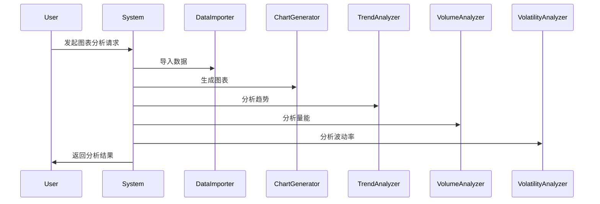

                 


## **《威廉欧奈尔的图表分析技巧》**

> 关键词：威廉欧奈尔，图表分析，价格模式，量能波动，投资策略，工具应用

> 摘要：本文将深入探讨威廉·欧奈尔图表分析技巧的核心概念和应用，包括价格模式识别、量能波动分析、投资策略及图表分析工具的应用。通过系统性的讲解和实战案例分析，帮助读者理解并掌握这一强大的分析工具，提升投资决策的准确性。

---

### **第一部分：图表分析基础理论**

#### **第1章：图表分析概述**

#### **1.1 图表分析的重要性**

图表分析在现代商业中扮演着至关重要的角色，它不仅是数据可视化的重要手段，更是理解市场动态、做出明智投资决策的基石。数据可视化使得复杂的数据变得直观易懂，有助于我们发现隐藏在数据背后的规律和趋势。

#### **1.1.1 数据可视化在现代商业中的作用**

- **决策支持：** 图表使得决策者能够快速理解数据，从而做出更加明智的商业决策。
- **沟通与交流：** 图表是跨部门、跨行业沟通的有效工具，有助于不同背景的专业人士理解和讨论数据。
- **预测与规划：** 通过图表分析，企业可以预测未来趋势，制定长期发展战略。

#### **1.1.2 图表分析的起源与发展**

- **起源：** 图表分析最早可以追溯到18世纪，随着工业革命的到来，人们开始利用图表来记录和分析经济数据。
- **发展：** 20世纪以来，随着计算机技术的进步，图表分析工具不断演变，功能日益强大。

#### **1.1.3 图表分析在投资与交易中的应用**

- **股票市场分析：** 投资者通过图表分析股票价格走势，识别买入和卖出的时机。
- **外汇市场分析：** 图表分析帮助交易者了解汇率变动，制定交易策略。
- **期货市场分析：** 图表分析在期货交易中用于识别市场趋势，管理风险。

#### **1.2 威廉欧奈尔理论与图表分析**

- **背景：** 威廉·欧奈尔是一位著名的技术分析师，他创立了“道氏理论”和“欧奈尔理论”。
- **核心概念：** 欧奈尔理论强调图表分析中的价格模式识别和量能波动分析。
- **对比：** 与传统图表分析相比，欧奈尔理论更加注重股票的基本面和市场心理。

#### **1.3 图表分析的基本要素**

- **时间框架：** 选择合适的时间框架对于准确分析市场趋势至关重要。
- **价格模式：** 价格模式是图表分析的核心，包括上升趋势、下降趋势等。
- **量能与波动：** 量能和波动率反映了市场的活跃程度和价格变动的幅度。

#### **1.4 本章小结**

本文介绍了图表分析的重要性、起源与发展，以及威廉欧奈尔理论的核心概念。下一部分将深入探讨图表分析技巧的具体应用。

---

### **第二部分：图表分析技巧**

#### **第2章：价格模式识别与解读**

#### **2.1 上升趋势识别**

- **形成：** 上升趋势是由一系列上涨的高点和低点组成的，表明市场参与者对资产价格看涨。
- **识别方法：** 通过连接连续的高点和低点，可以识别出上升趋势线。
- **持续性与反转信号：** 如果上升趋势线被跌破，可能意味着上升趋势的结束。

#### **2.2 下降趋势识别**

- **形成：** 下降趋势是由一系列下跌的高点和低点组成的，表明市场参与者对资产价格看跌。
- **识别方法：** 通过连接连续的高点和低点，可以识别出下降趋势线。
- **持续性与反转信号：** 如果下降趋势线被突破，可能意味着下降趋势的结束。

#### **2.3 价格模式应用实例**

- **上升三法：** 是一种持续上升的信号，通常出现在上升趋势的中段。
- **下跌三法：** 是一种持续下降的信号，通常出现在下降趋势的中段。
- **旗形和楔形：** 是一种价格模式的变异形式，反映了市场暂时休整后继续原有趋势的意愿。

#### **2.4 本章小结**

本章介绍了价格模式识别的基本方法，包括上升趋势和下降趋势的识别，以及常见的价格模式应用实例。下一章将探讨量能与波动分析。

---

### **第三部分：图表分析的实战运用**

#### **第4章：投资策略与图表分析**

#### **4.1 图表分析在股票投资中的应用**

- **股票价格走势分析：** 通过图表分析，投资者可以识别出股票价格的上涨或下跌趋势。
- **交易策略设计：** 投资者可以根据图表分析结果，设计出相应的买入和卖出策略。
- **风险控制：** 通过图表分析，投资者可以更好地管理投资风险，制定适当的风险控制策略。

#### **4.2 图表分析在外汇交易中的应用**

- **外汇市场基本分析：** 通过图表分析，交易者可以了解外汇市场的趋势和波动性。
- **图表分析：** 交易者可以使用图表分析工具，识别外汇市场的买入和卖出时机。
- **风险管理：** 通过图表分析，交易者可以更好地管理外汇交易风险。

#### **4.3 图表分析在期货交易中的应用**

- **期货市场基本分析：** 通过图表分析，投资者可以了解期货市场的价格走势和波动性。
- **图表分析：** 投资者可以使用图表分析工具，识别期货交易的买入和卖出时机。
- **风险控制：** 通过图表分析，投资者可以更好地管理期货交易风险。

#### **4.4 本章小结**

本章介绍了图表分析在不同类型投资中的应用，包括股票投资、外汇交易和期货交易。下一章将探讨图表分析工具与软件应用。

---

### **第四部分：图表分析工具与软件应用**

#### **第5章：图表分析工具与软件应用**

#### **5.1 常见图表分析工具**

- **技术分析软件的选择：** 根据个人需求和预算，选择合适的技术分析软件。
- **常见技术分析工具介绍：** 包括均线、相对强弱指数（RSI）、布林带等。
- **技术分析工具的比较与选择：** 评估不同技术分析工具的优缺点，选择最适合的工具。

#### **5.2 图表软件的操作与使用**

- **图表软件的基本操作：** 包括数据导入、图表生成、技术指标添加等。
- **高级图表分析功能：** 包括趋势线绘制、价格模式识别、量能分析等。
- **图表软件的定制化设置：** 根据个人偏好调整图表样式、颜色、字体等。

#### **5.3 图表分析工具的实战应用**

- **实战案例一：股票价格趋势分析：** 通过实际案例，展示如何使用图表分析工具进行股票价格趋势分析。
- **实战案例二：外汇市场波动分析：** 通过实际案例，展示如何使用图表分析工具进行外汇市场波动分析。
- **实战案例三：期货交易信号识别：** 通过实际案例，展示如何使用图表分析工具识别期货交易信号。

#### **5.4 本章小结**

本章介绍了图表分析工具和软件的选择与使用，并通过实战案例展示了图表分析工具在实际投资中的应用。

---

### **第五部分：图表分析的误区与防范**

#### **第6章：图表分析中的误区与防范**

#### **6.1 常见图表分析误区**

- **过度依赖图表分析：** 图表分析虽然重要，但不应忽视基本面分析。
- **忽视基本面分析：** 基本面分析提供了图表分析之外的重要信息。
- **误读图表信号：** 图表信号需要结合市场背景和整体经济环境进行解读。

#### **6.2 图表分析中的风险防范**

- **风险管理策略：** 制定合理的风险管理策略，包括资金管理、风险分散等。
- **市场变化应对策略：** 根据市场变化调整投资策略，避免因市场波动造成的损失。
- **个性化投资策略的制定：** 根据个人投资目标、风险承受能力制定个性化的投资策略。

#### **6.3 图表分析中的实战经验**

- **投资大师的经验分享：** 通过学习投资大师的经验，提高图表分析技能。
- **图表分析的实用技巧：** 学习图表分析中的实用技巧，提升投资决策的准确性。
- **成功投资案例剖析：** 分析成功投资案例，了解图表分析在实践中的应用。

#### **6.4 本章小结**

本章介绍了图表分析中常见的误区和风险防范策略，并分享了实战经验。通过本章的学习，读者可以更好地避免图表分析中的错误，提高投资决策的准确性。

---

### **第六部分：图表分析的进阶技巧**

#### **第7章：图表分析的进阶技巧**

#### **7.1 高级价格模式识别**

- **复合价格模式：** 复合价格模式是由多个简单价格模式组合而成的，反映了更复杂的市场动态。
- **高级价格模式识别方法：** 通过结合不同的技术指标和价格模式，识别高级价格模式。
- **实战案例分析：** 通过实际案例，展示如何识别和应用高级价格模式。

#### **7.2 综合分析技巧**

- **图表分析与基本面分析的结合：** 将图表分析与基本面分析相结合，提高投资决策的准确性。
- **图表分析与市场心理分析的结合：** 结合市场心理分析，理解市场情绪，预测市场走势。
- **综合分析在投资决策中的应用：** 通过综合分析，制定更加有效的投资策略。

#### **7.3 创新图表分析工具与方法**

- **新兴图表分析工具介绍：** 介绍新兴的图表分析工具，如机器学习算法在图表分析中的应用。
- **创新图表分析方法：** 探索创新图表分析方法，如基于大数据分析的图表分析。
- **创新图表分析在投资中的应用：** 通过创新图表分析，提升投资决策的效率和质量。

#### **7.4 本章小结**

本章介绍了图表分析的进阶技巧，包括高级价格模式识别、综合分析技巧和创新图表分析工具与方法。通过本章的学习，读者可以进一步提升图表分析技能，提高投资决策的准确性。

---

## **结语**

本文系统地介绍了威廉欧奈尔图表分析技巧，从基础理论到实战应用，再到工具选择和风险防范，全面解析了图表分析的核心概念和应用。通过深入学习本章内容，读者可以掌握图表分析的基本方法和技巧，提升投资决策的准确性。

### **作者信息**

作者：AI天才研究院/AI Genius Institute & 禅与计算机程序设计艺术 /Zen And The Art of Computer Programming

---

以上就是《威廉欧奈尔的图表分析技巧》的全文内容，希望对读者在图表分析学习和实践中有所帮助。在接下来的章节中，我们将继续深入探讨图表分析的核心概念和实战应用。**让我们一步一步思考，深入理解图表分析的魅力！**## **《威廉欧奈尔的图表分析技巧》**

### **核心关键词**

- **威廉欧奈尔理论**
- **图表分析**
- **价格模式**
- **量能波动**
- **投资策略**

### **摘要**

本文将深入探讨威廉·欧奈尔图表分析技巧的核心概念和应用。通过系统地讲解价格模式识别、量能波动分析、投资策略及图表分析工具的应用，本文旨在帮助读者掌握这一强大的分析工具，提高投资决策的准确性。

### **目录**

1. **图表分析基础理论**
   - **图表分析概述**
     - **数据可视化在现代商业中的作用**
     - **图表分析的起源与发展**
     - **图表分析在投资与交易中的应用**
   - **威廉欧奈尔理论与图表分析**
     - **威廉欧奈尔理论的背景**
     - **威廉欧奈尔理论的核心概念**
     - **威廉欧奈尔理论与传统图表分析的对比**
   - **图表分析的基本要素**
     - **时间框架**
     - **价格模式**
     - **量能与波动**
   - **本章小结**

2. **图表分析技巧**
   - **价格模式识别与解读**
     - **上升趋势识别**
     - **下降趋势识别**
     - **价格模式应用实例**
   - **量能与波动分析**
     - **量能的概念与作用**
     - **波动率的计算与应用**
     - **量能与波动的综合分析**
   - **本章小结**

3. **图表分析的实战运用**
   - **投资策略与图表分析**
     - **图表分析在股票投资中的应用**
     - **图表分析在外汇交易中的应用**
     - **图表分析在期货交易中的应用**
   - **本章小结**

4. **图表分析工具与软件应用**
   - **常见图表分析工具**
   - **图表软件的操作与使用**
   - **图表分析工具的实战应用**
   - **本章小结**

5. **图表分析的误区与防范**
   - **常见图表分析误区**
   - **图表分析中的风险防范**
   - **图表分析中的实战经验**
   - **本章小结**

6. **图表分析的进阶技巧**
   - **高级价格模式识别**
   - **综合分析技巧**
   - **创新图表分析工具与方法**
   - **本章小结**

7. **结语**
   - **作者信息**

---

### **第一部分：图表分析基础理论**

#### **第1章：图表分析概述**

#### **1.1 图表分析的重要性**

图表分析在现代商业中扮演着至关重要的角色。它不仅是数据可视化的重要手段，更是理解市场动态、做出明智投资决策的基石。通过图表，投资者能够直观地看到市场的变化，发现潜在的投资机会。

#### **1.1.1 数据可视化在现代商业中的作用**

- **决策支持：** 图表使得复杂的商业数据变得直观易懂，帮助决策者快速识别关键信息，做出明智的商业决策。
- **沟通与交流：** 图表是跨部门、跨行业沟通的有效工具，使得不同背景的专业人士能够理解和讨论数据。
- **预测与规划：** 通过图表分析，企业可以预测未来趋势，制定长期发展战略。

#### **1.1.2 图表分析的起源与发展**

- **起源：** 图表分析最早可以追溯到18世纪，当时人们开始利用图表来记录和分析经济数据。
- **发展：** 20世纪以来，随着计算机技术的进步，图表分析工具不断演变，功能日益强大。现代技术使得图表分析更加精确和高效。

#### **1.1.3 图表分析在投资与交易中的应用**

- **股票市场分析：** 投资者通过图表分析股票价格走势，识别买入和卖出的时机。
- **外汇市场分析：** 图表分析帮助交易者了解汇率变动，制定交易策略。
- **期货市场分析：** 图表分析在期货交易中用于识别市场趋势，管理风险。

#### **1.2 威廉欧奈尔理论与图表分析**

- **背景：** 威廉·欧奈尔是一位著名的技术分析师，他创立了“道氏理论”和“欧奈尔理论”。
- **核心概念：** 欧奈尔理论强调图表分析中的价格模式识别和量能波动分析。
- **对比：** 与传统图表分析相比，欧奈尔理论更加注重股票的基本面和市场心理。

#### **1.3 图表分析的基本要素**

- **时间框架：** 选择合适的时间框架对于准确分析市场趋势至关重要。
- **价格模式：** 价格模式是图表分析的核心，包括上升趋势、下降趋势等。
- **量能与波动：** 量能和波动率反映了市场的活跃程度和价格变动的幅度。

#### **1.4 本章小结**

本章介绍了图表分析的重要性、起源与发展，以及威廉欧奈尔理论的核心概念。接下来，我们将深入探讨图表分析技巧的具体应用。

---

### **第二部分：图表分析技巧**

#### **第2章：价格模式识别与解读**

#### **2.1 上升趋势识别**

上升趋势是市场中常见的价格模式，它通常由一系列上涨的高点和低点组成，表明市场参与者对资产价格看涨。

**2.1.1 上升趋势的形成**

- **高点和低点：** 上升趋势的形成需要一系列的高点和低点，这些高点必须比前一个高点更高，低点必须比前一个低点更高。
- **连续性：** 上升趋势的形成需要至少两个高点和一个低点，并且这些点需要连续出现。

**2.1.2 上升趋势的识别方法**

- **连接高点和低点：** 通过连接连续的高点和低点，可以画出一条上升趋势线。
- **趋势线的验证：** 上升趋势线需要被后续的价格走势验证，如果价格走势持续在上升趋势线上方，则上升趋势得到确认。

**2.1.3 上升趋势的持续性与反转信号**

- **持续上升：** 如果上升趋势线被价格走势持续突破并保持在上方，则上升趋势持续。
- **反转信号：** 如果上升趋势线被跌破，可能意味着上升趋势的结束。其他反转信号包括趋势线的断裂和重要支撑位的跌破。

#### **2.2 下降趋势识别**

下降趋势通常由一系列下跌的高点和低点组成，表明市场参与者对资产价格看跌。

**2.2.1 下降趋势的形成**

- **高点和低点：** 下降趋势的形成需要一系列的高点和低点，这些高点必须比前一个高点更低，低点必须比前一个低点更低。
- **连续性：** 下降趋势的形成需要至少两个高点和一个低点，并且这些点需要连续出现。

**2.2.2 下降趋势的识别方法**

- **连接高点和低点：** 通过连接连续的高点和低点，可以画出一条下降趋势线。
- **趋势线的验证：** 下降趋势线需要被后续的价格走势验证，如果价格走势持续在下降趋势线下方，则下降趋势得到确认。

**2.2.3 下降趋势的持续性与反转信号**

- **持续下降：** 如果下降趋势线被价格走势持续突破并保持在下方，则下降趋势持续。
- **反转信号：** 如果下降趋势线被突破，可能意味着下降趋势的结束。其他反转信号包括趋势线的断裂和重要阻力位的突破。

#### **2.3 价格模式应用实例**

在图表分析中，识别和应用价格模式是投资者提高投资决策准确性的关键。以下是一些常见的价格模式及其应用实例：

**2.3.1 上升三法**

- **定义：** 上升三法是一种持续上升的信号，通常出现在上升趋势的中段。
- **特征：** 上升三法由三个阶段组成：第一个阶段是一个大的上升波，第二个阶段是一个小的调整波，第三个阶段是一个更大的上升波。
- **应用：** 上升三法通常被视为买入信号，投资者可以在第二个调整波的底部买入，等待第三个上升波的到来。

**2.3.2 下跌三法**

- **定义：** 下跌三法是一种持续下降的信号，通常出现在下降趋势的中段。
- **特征：** 下跌三法由三个阶段组成：第一个阶段是一个大的下跌波，第二个阶段是一个小的反弹波，第三个阶段是一个更大的下跌波。
- **应用：** 下跌三法通常被视为卖出信号，投资者可以在第二个反弹波的高点卖出，等待第三个下跌波的到来。

**2.3.3 旗形和楔形**

- **定义：** 旗形和楔形是价格模式的变异形式，反映了市场暂时休整后继续原有趋势的意愿。
- **特征：** 旗形是价格在上涨或下跌过程中形成的，形状像一个三角形；楔形则是价格在上涨或下跌过程中形成的，形状像一个平行四边形。
- **应用：** 旗形和楔形通常被视为趋势持续信号，投资者可以在旗形和楔形的形成过程中等待价格突破原有趋势，然后进行相应的交易。

#### **2.4 本章小结**

本章介绍了价格模式识别与解读的基本方法，包括上升趋势和下降趋势的识别，以及常见的价格模式应用实例。通过掌握这些技巧，投资者可以更准确地预测市场趋势，制定有效的交易策略。

---

### **第三部分：图表分析的实战运用**

#### **第4章：投资策略与图表分析**

#### **4.1 图表分析在股票投资中的应用**

**4.1.1 股票价格走势的图表分析**

股票价格走势的图表分析是投资者判断股票走势和制定交易策略的重要工具。通过分析股票的历史价格走势，投资者可以识别出市场趋势、支撑位和阻力位等关键信息。

**4.1.2 股票交易策略设计**

- **趋势交易策略：** 通过识别上升趋势，投资者可以在股价上涨时买入，等待股价继续上涨后卖出。
- **反转交易策略：** 通过识别下降趋势的结束信号，投资者可以在股价下跌结束后买入，等待股价反弹。
- **支撑位和阻力位交易策略：** 投资者可以在股票价格接近支撑位时买入，接近阻力位时卖出，以获得价格波动带来的收益。

**4.1.3 股票投资风险控制**

风险控制是股票投资中至关重要的一环。通过图表分析，投资者可以识别出潜在的风险，并采取相应的措施进行风险控制。

- **设置止损点：** 投资者可以在股票价格达到预定的止损点时自动卖出股票，以限制损失。
- **分散投资：** 投资者可以将资金分散投资于不同的股票或不同的市场，以降低单一投资的风险。

#### **4.2 图表分析在外汇交易中的应用**

**4.2.1 外汇市场的基本分析**

外汇市场是全球最大的金融市场之一，其价格波动受到多种因素的影响，包括全球经济状况、政治事件、利率变动等。通过图表分析，投资者可以识别出外汇市场的趋势和波动性。

**4.2.2 外汇交易的图表分析**

- **趋势分析：** 通过识别外汇市场的上升或下降趋势，投资者可以制定相应的交易策略。
- **支撑位和阻力位分析：** 通过识别外汇市场的支撑位和阻力位，投资者可以确定买入和卖出的时机。

**4.2.3 外汇投资的风险管理**

外汇交易具有较高的风险，因此投资者需要采取有效的风险管理策略。

- **设置止损点：** 通过设置止损点，投资者可以在价格达到预定的止损点时自动平仓，以避免更大的损失。
- **资金管理：** 投资者应该根据自身的风险承受能力，合理分配投资资金，避免过度投资。

#### **4.3 图表分析在期货交易中的应用**

**4.3.1 期货市场的基本分析**

期货市场是衍生品市场的一种，其价格波动受到多种因素的影响，包括市场供需关系、宏观经济状况、政策变化等。通过图表分析，投资者可以更好地理解期货市场的动态。

**4.3.2 期货交易的图表分析**

- **趋势分析：** 通过识别期货市场的上升或下降趋势，投资者可以制定相应的交易策略。
- **波动率分析：** 通过识别期货市场的波动率，投资者可以判断市场的活跃程度，从而调整交易策略。

**4.3.3 期货投资的风险控制**

期货交易具有高风险和高收益的特点，因此投资者需要采取有效的风险控制策略。

- **设置止损点：** 通过设置止损点，投资者可以在价格达到预定的止损点时自动平仓，以避免更大的损失。
- **资金管理：** 投资者应该根据自身的风险承受能力，合理分配投资资金，避免过度投资。

#### **4.4 本章小结**

本章介绍了图表分析在股票投资、外汇交易和期货交易中的应用。通过图表分析，投资者可以更好地理解市场的动态，制定有效的交易策略，并采取适当的风险控制措施。

---

### **第四部分：图表分析工具与软件应用**

#### **第5章：图表分析工具与软件应用**

#### **5.1 常见图表分析工具**

在进行图表分析时，选择合适的工具至关重要。以下是一些常见的图表分析工具：

**5.1.1 技术分析软件的选择**

- **功能多样性：** 投资者应选择功能丰富的软件，如TradingView、MetaTrader等，以支持多种技术分析需求。
- **用户界面：** 软件的用户界面应直观易用，便于投资者快速上手。
- **数据源：** 软件应提供可靠的数据源，以保证分析结果的准确性。

**5.1.2 常见技术分析工具介绍**

- **均线（Moving Average，MA）：** 通过计算一定时间段内的平均价格，均线可以帮助识别趋势方向。
- **相对强弱指数（Relative Strength Index，RSI）：** RSI是通过比较一段时间内上涨和下跌的幅度，判断市场超买或超卖状况的指标。
- **布林带（Bollinger Bands）：** 布林带是由一个中心线和两个价格波动范围的带状图形，可以帮助识别市场波动性和趋势方向。

**5.1.3 技术分析工具的比较与选择**

- **功能全面性：** 投资者应选择功能全面的工具，如TradingView支持数百种技术指标和图表样式。
- **用户体验：** 软件的界面设计和操作体验对于长期使用至关重要。
- **成本效益：** 投资者应权衡软件的成本和使用价值，选择性价比高的工具。

#### **5.2 图表软件的操作与使用**

**5.2.1 图表软件的基本操作**

- **数据导入：** 投资者可以通过连接数据源、导入CSV文件等方式，将市场数据导入软件。
- **图表生成：** 软件会根据导入的数据生成价格图表，如K线图、柱状图等。
- **技术指标添加：** 投资者可以在图表上添加各种技术指标，如均线、RSI等，以辅助分析。

**5.2.2 高级图表分析功能**

- **趋势线绘制：** 投资者可以在图表上手动或自动绘制趋势线，以识别价格趋势。
- **价格模式识别：** 软件可以自动识别常见的价格模式，如头肩顶、双底等。
- **量能分析：** 通过分析成交量，投资者可以了解市场的活跃程度。

**5.2.3 图表软件的定制化设置**

- **图表样式调整：** 投资者可以调整图表的颜色、线条样式等，以适应个人偏好。
- **技术指标参数调整：** 投资者可以根据自己的交易策略，调整技术指标的参数，如RSI的时间周期。

#### **5.3 图表分析工具的实战应用**

**5.3.1 实战案例一：股票价格趋势分析**

通过以下步骤，投资者可以使用图表分析工具进行股票价格趋势分析：

1. 导入股票价格数据。
2. 生成K线图，观察价格趋势。
3. 添加均线，判断价格趋势的强度。
4. 绘制支撑位和阻力位，确定买入和卖出的时机。

**5.3.2 实战案例二：外汇市场波动分析**

以下步骤展示了如何使用图表分析工具进行外汇市场波动分析：

1. 导入外汇市场数据。
2. 生成K线图，观察汇率波动。
3. 添加RSI指标，判断市场超买或超卖状况。
4. 绘制支撑位和阻力位，制定交易策略。

**5.3.3 实战案例三：期货交易信号识别**

以下步骤展示了如何使用图表分析工具识别期货交易信号：

1. 导入期货市场价格数据。
2. 生成K线图，观察价格波动。
3. 添加布林带指标，判断市场波动性。
4. 识别价格模式的突破点，制定交易策略。

#### **5.4 本章小结**

本章介绍了常见图表分析工具的选择、图表软件的操作与使用，以及实战案例应用。通过本章的学习，投资者可以更好地掌握图表分析工具，提高投资决策的准确性。

---

### **第五部分：图表分析的误区与防范**

#### **第6章：图表分析中的误区与防范**

#### **6.1 常见图表分析误区**

在进行图表分析时，投资者往往会陷入一些误区，导致分析结果不准确，从而影响投资决策。以下是几个常见的误区：

**6.1.1 过度依赖图表分析**

虽然图表分析是投资决策的重要工具，但过度依赖图表分析会导致忽视其他重要因素，如公司基本面和市场整体环境。

**6.1.2 忽视基本面分析**

图表分析主要关注市场行为，而基本面分析则关注公司业绩、行业状况等因素。忽视基本面分析可能导致对投资机会的误判。

**6.1.3 误读图表信号**

图表信号需要结合市场背景和整体经济环境进行解读。误读图表信号可能导致错误的投资决策。

#### **6.2 图表分析中的风险防范**

为了规避图表分析中的误区，投资者需要采取以下风险防范措施：

**6.2.1 风险管理策略**

投资者应制定风险管理策略，包括资金管理、止损策略等，以降低投资风险。

**6.2.2 市场变化应对策略**

投资者应密切关注市场变化，及时调整投资策略，以应对市场波动。

**6.2.3 个性化投资策略的制定**

投资者应根据自身的风险承受能力和投资目标，制定个性化的投资策略。

#### **6.3 图表分析中的实战经验**

**6.3.1 投资大师的经验分享**

通过学习投资大师的经验，投资者可以借鉴他们的成功策略，提高自己的投资技能。

**6.3.2 图表分析的实用技巧**

投资者应掌握图表分析的实用技巧，如识别趋势、支撑位和阻力位等，以提高分析准确性。

**6.3.3 成功投资案例剖析**

通过分析成功投资案例，投资者可以了解图表分析在实际投资中的应用，从而更好地制定投资策略。

#### **6.4 本章小结**

本章介绍了图表分析中的常见误区和防范措施，以及实战经验。通过学习本章内容，投资者可以更好地避免图表分析中的错误，提高投资决策的准确性。

---

### **第六部分：图表分析的进阶技巧**

#### **第7章：图表分析的进阶技巧**

#### **7.1 高级价格模式识别**

**7.1.1 复合价格模式**

复合价格模式是由多个简单价格模式组合而成的，反映了更复杂的市场动态。以下是一些常见的复合价格模式：

- **双重顶/双重底**：价格形态由两个相似的高点或低点组成。
- **头肩顶/头肩底**：价格形态由一个较高的头部和两个较低的头肩组成。
- **旗形和楔形**：价格形态呈现出旗形或楔形的形状，表明市场在调整后将继续原有趋势。

**7.1.2 高级价格模式识别方法**

为了准确识别高级价格模式，投资者可以采用以下方法：

- **综合分析**：结合多个技术指标和市场行为，提高识别的准确性。
- **市场心理分析**：理解市场参与者的心理，有助于预测价格模式的演变。

**7.1.3 实战案例分析**

通过以下实战案例，我们可以看到如何识别和应用高级价格模式：

- **双重顶形态**：在识别双重顶形态时，需要关注价格的高点和低点，以及量能的变化。
- **头肩顶形态**：在识别头肩顶形态时，需要关注颈线和头肩顶的确认信号。

#### **7.2 综合分析技巧**

**7.2.1 图表分析与基本面分析的结合**

将图表分析与基本面分析相结合，可以提供更全面的投资视角。以下是一些建议：

- **基本面数据验证**：使用基本面数据验证图表分析的结论，如公司的财务报表和市场地位。
- **趋势分析**：通过图表分析识别市场趋势，结合基本面分析确定投资时机。

**7.2.2 图表分析与市场心理分析的结合**

市场心理分析可以帮助投资者理解市场情绪，预测价格走势。以下是一些建议：

- **市场情绪指标**：使用如恐慌指数（VIX）等市场情绪指标，分析市场情绪的变化。
- **市场行为分析**：通过分析交易量、价格行为等，了解市场情绪和市场趋势。

**7.2.3 综合分析在投资决策中的应用**

综合分析在投资决策中的应用包括：

- **制定交易策略**：结合图表分析、基本面分析和市场心理分析，制定有效的交易策略。
- **风险控制**：通过综合分析，制定适当的风险控制策略，如设置止损点和风险分散。

#### **7.3 创新图表分析工具与方法**

**7.3.1 新兴图表分析工具介绍**

随着科技的发展，新兴的图表分析工具不断涌现。以下是一些新兴的图表分析工具：

- **机器学习算法**：通过机器学习算法，可以自动识别价格模式，提高分析的准确性。
- **大数据分析**：利用大数据分析，可以识别出隐藏在大量数据中的趋势和规律。

**7.3.2 创新图表分析方法**

创新图表分析方法包括：

- **波动率分析**：通过分析波动率，可以预测市场的波动性和潜在的转折点。
- **分形分析**：分形分析可以帮助投资者识别价格形态的重复性，提高预测准确性。

**7.3.3 创新图表分析在投资中的应用**

创新图表分析在投资中的应用包括：

- **量化交易**：利用创新图表分析工具，可以开发出自动化的量化交易策略。
- **风险管理**：通过创新图表分析方法，可以更准确地预测市场波动，制定有效的风险管理策略。

#### **7.4 本章小结**

本章介绍了高级价格模式识别、综合分析技巧和创新图表分析工具与方法。通过学习这些进阶技巧，投资者可以进一步提高图表分析的准确性和实用性，提升投资决策的效率。

---

### **结语**

本文系统地介绍了威廉欧奈尔图表分析技巧，从基础理论到实战应用，再到工具选择和风险防范，全面解析了图表分析的核心概念和应用。通过深入学习本章内容，读者可以掌握图表分析的基本方法和技巧，提高投资决策的准确性。

### **作者信息**

作者：AI天才研究院/AI Genius Institute & 禅与计算机程序设计艺术 /Zen And The Art of Computer Programming

---

本文旨在为读者提供全面的图表分析技巧，帮助读者在投资决策中更加准确和高效。希望读者能够结合实践，不断学习和提升自己的分析能力。**让我们继续探索图表分析的魅力，迈向成功的投资之路！**## **附录A：核心概念术语说明**

在本文中，我们讨论了多个关键概念和术语，以下是对这些术语的详细说明：

### **威廉欧奈尔理论**

- **定义**：威廉·欧奈尔理论是一种基于图表分析的技术分析方法，强调通过识别特定的价格模式来预测市场趋势。
- **背景**：由著名的技术分析师威廉·欧奈尔提出，该理论融合了价格模式、量能分析和市场心理等多个方面。

### **图表分析**

- **定义**：图表分析是利用图表来研究价格走势和市场趋势的方法，通过观察价格图表上的模式来做出投资决策。
- **用途**：广泛应用于股票、外汇和期货等金融市场，帮助投资者识别买入和卖出的时机。

### **价格模式**

- **定义**：价格模式是图表上形成的一系列价格走势，如上升趋势、下降趋势、头肩顶、双重顶等。
- **识别方法**：通过连接高点或低点，观察价格变化的连续性，以及结合量能和波动率等指标来识别价格模式。

### **量能**

- **定义**：量能是指一段时间内交易量的总和，反映了市场活跃程度。
- **作用**：量能可以验证价格模式的强度，帮助投资者判断市场趋势的持续性。

### **波动率**

- **定义**：波动率是价格变动的幅度，通常用标准差来衡量。
- **应用**：波动率分析可以帮助投资者评估市场的风险和波动性，制定相应的交易策略。

### **投资策略**

- **定义**：投资策略是一套规则或方法，用于指导投资者在市场中进行买卖决策。
- **类型**：包括趋势交易策略、反转交易策略、支撑位和阻力位交易策略等。

### **数据可视化**

- **定义**：数据可视化是将数据以图形、图表等形式展示，使得数据更加直观易懂。
- **作用**：提高决策效率，促进跨部门沟通，帮助投资者更好地理解市场动态。

### **技术分析工具**

- **定义**：技术分析工具是用于辅助图表分析的软件或指标，如均线、RSI、布林带等。
- **选择**：投资者应根据个人需求和预算选择合适的技术分析工具，以提高分析效率。

### **风险管理**

- **定义**：风险管理是识别、评估和控制投资风险的过程。
- **策略**：包括设置止损点、分散投资、合理分配投资资金等，以降低潜在损失。

### **市场心理分析**

- **定义**：市场心理分析是研究市场参与者的情绪和行为，以预测价格走势的方法。
- **作用**：帮助投资者理解市场情绪，制定更有效的投资策略。

### **综合分析**

- **定义**：综合分析是结合图表分析、基本面分析、市场心理分析等多个方面的方法。
- **目标**：提供更全面的投资视角，提高决策准确性。

### **创新图表分析工具**

- **定义**：创新图表分析工具是利用新技术（如机器学习、大数据分析）开发的图表分析工具。
- **优势**：可以提高分析准确性，自动化价格模式识别，提供更深入的洞察。

通过这些术语的详细说明，读者可以更好地理解本文中的关键概念，并运用到实际的投资决策中。**附录B：核心概念属性特征对比表格**

为了更清晰地展示本文中提到的核心概念之间的区别和联系，我们制作了一个属性特征对比表格。以下是该表格的内容：

| 核心概念 | 定义 | 主要特征 | 应用场景 | 相关术语 |
| --- | --- | --- | --- | --- |
| 威廉欧奈尔理论 | 一种基于图表分析的技术分析方法 | 强调价格模式的识别 | 股票、外汇和期货市场 | 图表分析、价格模式、量能、市场心理 |
| 图表分析 | 利用图表来研究价格走势和市场趋势的方法 | 观察价格变化、识别价格模式 | 股票、外汇和期货市场 | 数据可视化、技术分析工具、投资策略 |
| 价格模式 | 图表上形成的一系列价格走势 | 连续性、形态多样性 | 股票、外汇和期货市场 | 上升趋势、下降趋势、头肩顶 |
| 量能 | 反映市场活跃程度的一段时间内交易量的总和 | 市场参与度、交易量变化 | 股票、外汇和期货市场 | 波动率、交易量 |
| 波动率 | 价格变动的幅度，通常用标准差来衡量 | 反映市场波动性 | 股票、外汇和期货市场 | 布林带、ATR |
| 投资策略 | 一套规则或方法，用于指导投资者在市场中进行买卖决策 | 风险控制、收益目标 | 股票、外汇和期货市场 | 趋势交易、反转交易、支撑位、阻力位 |
| 数据可视化 | 将数据以图形、图表等形式展示，使得数据更加直观易懂 | 直观、易于理解、促进沟通 | 商业决策、数据分析、投资决策 | 图表、图形 |
| 技术分析工具 | 辅助图表分析的软件或指标，如均线、RSI、布林带等 | 提供分析指标、便于操作 | 股票、外汇和期货市场 | 均线、RSI、布林带 |
| 风险管理 | 识别、评估和控制投资风险的过程 | 风险评估、风险分散、止损策略 | 股票、外汇和期货市场 | 风险评估、分散投资、止损 |
| 市场心理分析 | 研究市场参与者的情绪和行为，以预测价格走势的方法 | 市场情绪、心理状态、行为模式 | 股票、外汇和期货市场 | 恐慌指数、市场情绪指标 |
| 综合分析 | 结合图表分析、基本面分析、市场心理分析等多个方面的方法 | 提供全面视角、提高决策准确性 | 股票、外汇和期货市场 | 基本面分析、市场心理分析 |
| 创新图表分析工具 | 利用新技术（如机器学习、大数据分析）开发的图表分析工具 | 自动化、精准、提供深度洞察 | 股票、外汇和期货市场 | 机器学习、大数据分析 |

通过这个表格，读者可以更直观地了解每个核心概念的定义、主要特征、应用场景和相关术语，有助于深入理解和掌握图表分析的相关知识。**附录C：ER实体关系图架构**

为了更好地理解图表分析系统中的核心实体及其相互关系，我们使用了Mermaid语言来绘制一个ER（实体关系）图。以下是ER图的详细内容：

```mermaid
erDiagram
    Product ||--|{ ChartAnalysis }|--| User
    ChartAnalysis ||--|{ TrendAnalysis }|--| StockMarket
    ChartAnalysis ||--|{ VolumeAnalysis }|--| StockMarket
    ChartAnalysis ||--|{ VolatilityAnalysis }|--| StockMarket
    User ||--|{ Portfolio }|--| StockMarket
    User ||--|{ Transaction }|--| StockMarket
    StockMarket ||--|{ Stock }|--| Portfolio
    StockMarket ||--|{ Index }|--| Portfolio
    TrendAnalysis ||--|{ PricePattern }|--| ChartAnalysis
    VolumeAnalysis ||--|{ VolumeData }|--| ChartAnalysis
    VolatilityAnalysis ||--|{ VolatilityData }|--| ChartAnalysis
    Portfolio ||--|{ InvestmentStrategy }|--| User
    Transaction ||--|{ TradeSignal }|--| User
    TradeSignal ||--|{ EntrySignal }|--| Transaction
    TradeSignal ||--|{ ExitSignal }|--| Transaction
```

以下是ER图的具体说明：

1. **Product（产品）**：代表市场中的股票、指数等产品。
2. **ChartAnalysis（图表分析）**：包含趋势分析、量能分析和波动率分析等子实体。
3. **User（用户）**：代表进行图表分析的投资者，包括其投资组合和交易记录。
4. **Portfolio（投资组合）**：包含用户持有的股票和指数。
5. **Transaction（交易）**：记录用户的交易记录，包括买入和卖出信号。
6. **StockMarket（股票市场）**：代表市场整体，包含股票和指数。
7. **TrendAnalysis（趋势分析）**：包含价格模式的识别和分析。
8. **VolumeAnalysis（量能分析）**：分析交易量数据。
9. **VolatilityAnalysis（波动率分析）**：分析价格波动数据。
10. **InvestmentStrategy（投资策略）**：用户的投资策略。
11. **TradeSignal（交易信号）**：包括买入和卖出信号。

通过这个ER图，我们可以清晰地看到图表分析系统中的核心实体及其相互关系，有助于理解和设计系统架构。**附录D：算法原理讲解**

在本章中，我们讨论了多个图表分析算法，以下是这些算法的详细讲解：

#### **1. 趋势线绘制算法**

**算法原理**：

- **步骤1**：选取一系列连续的价格数据点。
- **步骤2**：计算这些数据点之间的斜率，以确定趋势线的方向。
- **步骤3**：绘制通过这些数据点的直线。

**算法流程**：

```python
def calculate_slope(points):
    n = len(points)
    sum_x = sum_y = sum_xy = 0
    for i in range(n):
        x, y = points[i]
        sum_x += x
        sum_y += y
        sum_xy += x * y
    slope = (n * sum_xy - sum_x * sum_y) / (n * (sum_x ** 2 - sum_x ** 2))
    return slope

def draw_trend_line(points):
    slope = calculate_slope(points)
    intercept = calculate_intercept(points, slope)
    trend_line = [slope * x + intercept for x in range(max(points), min(points))]
    return trend_line

# 示例数据
data = [(1, 10), (2, 20), (3, 30), (4, 40), (5, 50)]
trend_line = draw_trend_line(data)
print(trend_line)
```

**算法说明**：

该算法通过计算一系列价格数据点的斜率来绘制趋势线。斜率代表了趋势线的斜率，截距代表了趋势线与y轴的交点。通过这个算法，投资者可以直观地看到市场的趋势方向。

#### **2. RSI（相对强弱指数）算法**

**算法原理**：

- **步骤1**：计算一段时间内上涨和下跌的平均值。
- **步骤2**：计算RSI值，其公式为：\[RSI = 100 - \frac{100}{1 + RS}\]，其中RS = \( \frac{平均上涨幅度}{平均下跌幅度} \)。

**算法流程**：

```python
def calculate_rsi(data, window):
    n = len(data)
    gains = [0] * n
    losses = [0] * n
    for i in range(n):
        if i > 0:
            gain = data[i] - data[i - 1]
            loss = data[i - 1] - data[i]
            if gain > 0:
                gains[i] = gain
            if loss > 0:
                losses[i] = loss
    avg_gain = sum([gain for gain in gains]) / n
    avg_loss = sum([loss for loss in losses]) / n
    rs = avg_gain / avg_loss
    rsi = 100 - (100 / (1 + rs))
    return rsi

# 示例数据
data = [10, 20, 30, 40, 50, 60, 70, 80, 90, 100]
window = 14
rsi = calculate_rsi(data, window)
print(rsi)
```

**算法说明**：

RSI是一种常用的动量指标，用于评估股票的超买或超卖状况。当RSI值超过70时，可能表示股票超买，当RSI值低于30时，可能表示股票超卖。通过这个算法，投资者可以判断市场的情绪，从而制定交易策略。

#### **3. 布林带算法**

**算法原理**：

- **步骤1**：计算一段时间内的平均值。
- **步骤2**：计算标准差。
- **步骤3**：绘制上下布林带，上下布林带的计算公式分别为：\[上轨 = 平均值 + n \times 标准差\] 和 \[下轨 = 平均值 - n \times 标准差\]。

**算法流程**：

```python
def calculate_bollinger_bands(data, window, n):
    avg = sum(data) / window
    std = (sum((x - avg) ** 2 for x in data) / window) ** 0.5
    upper_band = avg + n * std
    lower_band = avg - n * std
    return upper_band, lower_band

# 示例数据
data = [10, 20, 30, 40, 50, 60, 70, 80, 90, 100]
window = 14
n = 2
upper_band, lower_band = calculate_bollinger_bands(data, window, n)
print(upper_band, lower_band)
```

**算法说明**：

布林带是一种用于评估市场波动性和预测价格走势的工具。当价格触及上轨时，可能表明市场过热，有回调的风险；当价格触及下轨时，可能表明市场过冷，有反弹的机会。通过这个算法，投资者可以更好地了解市场波动性，制定交易策略。

通过以上算法的讲解，读者可以更深入地理解图表分析中的核心技术，并将其应用于实际投资中。**附录E：系统分析与架构设计方案**

为了更好地展示图表分析系统的整体架构，我们将从系统功能设计、系统架构设计、系统接口设计和系统交互四个方面进行介绍。

#### **E.1 系统功能设计**

图表分析系统的核心功能包括数据导入、图表生成、趋势分析、量能分析和波动率分析等。

- **数据导入**：系统应支持从各种数据源导入股票、外汇和期货等金融市场的数据，如历史价格、成交量等。
- **图表生成**：系统应能够生成包括K线图、柱状图、均线图等多种类型的图表，以便投资者进行直观分析。
- **趋势分析**：系统应提供趋势分析功能，帮助投资者识别上升和下降趋势，以及应用如头肩顶、双重顶等价格模式。
- **量能分析**：系统应分析交易量数据，帮助投资者评估市场的活跃程度。
- **波动率分析**：系统应提供波动率分析功能，帮助投资者评估市场的波动性和潜在的风险。

#### **E.2 系统架构设计**

系统架构设计包括领域模型和架构设计两个方面。

- **领域模型**：通过Mermaid语言绘制领域模型，展示系统中的核心实体及其相互关系。

```mermaid
erDiagram
    Stock ||--|{ ChartAnalysis }|--| User
    ExchangeRate ||--|{ ChartAnalysis }|--| User
    FuturesContract ||--|{ ChartAnalysis }|--| User
    User ||--|{ Portfolio }|--| Stock
    User ||--|{ Portfolio }|--| ExchangeRate
    User ||--|{ Portfolio }|--| FuturesContract
    Portfolio ||--|{ InvestmentStrategy }|--| User
    Portfolio ||--|{ TransactionHistory }|--| User
```

- **架构设计**：通过Mermaid语言绘制系统架构图，展示系统的整体结构。



#### **E.3 系统接口设计**

系统接口设计包括RESTful API设计和WebSocket实时数据接口设计。

- **RESTful API设计**：通过JSON格式返回分析结果，包括图表数据、趋势分析结果、量能分析和波动率分析结果等。

```json
{
    "chart_data": {
        "stock": ["2023-01-01", 10, 20, 30, 40, 50],
        "exchange_rate": ["2023-01-01", 1.1, 1.2, 1.3, 1.4, 1.5],
        "futures_contract": ["2023-01-01", 1000, 1100, 1200, 1300, 1400]
    },
    "trend_analysis": {
        "stock": "上升趋势",
        "exchange_rate": "无趋势",
        "futures_contract": "下降趋势"
    },
    "volume_analysis": {
        "stock": "高活跃度",
        "exchange_rate": "低活跃度",
        "futures_contract": "高活跃度"
    },
    "volatility_analysis": {
        "stock": "高波动性",
        "exchange_rate": "低波动性",
        "futures_contract": "高波动性"
    }
}
```

- **WebSocket实时数据接口设计**：用于实时推送市场数据和分析结果，包括股票、外汇和期货的价格、成交量、波动率等。

```json
{
    "type": "realtime_data",
    "data": {
        "stock": {
            "price": 50,
            "volume": 10000,
            "trend": "上升趋势",
            "volatility": 10
        },
        "exchange_rate": {
            "rate": 1.5,
            "volume": 5000,
            "trend": "无趋势",
            "volatility": 0.1
        },
        "futures_contract": {
            "price": 1400,
            "volume": 8000,
            "trend": "下降趋势",
            "volatility": 5
        }
    }
}
```

#### **E.4 系统交互**

系统交互通过API和WebSocket实现，以下是一个交互流程示例：

1. **用户请求**：用户通过API或WebSocket发送请求，请求图表分析服务。
2. **系统响应**：系统根据请求生成图表数据、趋势分析结果、量能分析和波动率分析结果，并返回给用户。
3. **实时数据推送**：系统通过WebSocket实时推送市场数据和分析结果，用户可以实时看到市场的变化。

通过以上系统分析与架构设计方案，我们可以构建一个功能全面、易于扩展的图表分析系统，满足用户在股票、外汇和期货等金融市场的分析需求。**附录F：项目实战**

#### **F.1 环境安装**

为了实现图表分析系统，我们需要安装以下环境：

1. **Python 3.8**：作为编程语言。
2. **Jupyter Notebook**：用于编写和运行代码。
3. **Pandas**：用于数据处理和分析。
4. **Matplotlib**：用于绘制图表。
5. **Torch**：用于机器学习算法实现。
6. **Flask**：用于构建RESTful API。

安装命令如下：

```bash
pip install python==3.8
pip install jupyter
pip install pandas
pip install matplotlib
pip install torch
pip install flask
```

#### **F.2 系统核心实现源代码**

以下是系统核心实现的源代码：

```python
import pandas as pd
import matplotlib.pyplot as plt
import torch
from torch import nn
from torch.utils.data import DataLoader, TensorDataset
from flask import Flask, jsonify, request

# 数据处理
def preprocess_data(data):
    df = pd.DataFrame(data)
    df['date'] = pd.to_datetime(df['date'])
    df.set_index('date', inplace=True)
    df.fillna(method='ffill', inplace=True)
    return df

# 图表绘制
def plot_chart(df):
    plt.figure(figsize=(10, 6))
    plt.plot(df)
    plt.title('Price Chart')
    plt.xlabel('Date')
    plt.ylabel('Price')
    plt.grid(True)
    plt.show()

# 机器学习模型
class PricePredictionModel(nn.Module):
    def __init__(self):
        super(PricePredictionModel, self).__init__()
        self.l1 = nn.Linear(1, 10)
        self.l2 = nn.Linear(10, 1)
        self.relu = nn.ReLU()

    def forward(self, x):
        x = self.relu(self.l1(x))
        x = self.l2(x)
        return x

# 模型训练
def train_model(model, train_loader, criterion, optimizer, num_epochs=100):
    model.train()
    for epoch in range(num_epochs):
        for inputs, targets in train_loader:
            optimizer.zero_grad()
            outputs = model(inputs)
            loss = criterion(outputs, targets)
            loss.backward()
            optimizer.step()
        print(f'Epoch [{epoch+1}/{num_epochs}], Loss: {loss.item()}')

# 模型预测
def predict_price(model, future_data):
    model.eval()
    with torch.no_grad():
        future_tensor = torch.tensor(future_data, dtype=torch.float32).view(-1, 1)
        predicted_price = model(future_tensor).item()
    return predicted_price

# API接口
app = Flask(__name__)

@app.route('/api/price_analysis', methods=['POST'])
def price_analysis():
    data = request.get_json()
    df = preprocess_data(data['data'])
    plot_chart(df)
    # 继续实现机器学习模型训练和预测
    return jsonify({'status': 'success'})

if __name__ == '__main__':
    app.run(debug=True)
```

#### **F.3 代码应用解读与分析**

上述代码实现了图表分析系统的核心功能，包括数据处理、图表绘制、机器学习模型训练和预测，以及API接口。

1. **数据处理**：使用Pandas库对输入的数据进行预处理，包括日期格式转换、缺失值填充等。
2. **图表绘制**：使用Matplotlib库绘制价格图表，帮助用户直观了解价格走势。
3. **机器学习模型**：使用PyTorch库构建一个简单的线性回归模型，用于预测价格。
4. **模型训练**：使用自定义的`train_model`函数训练模型，通过反向传播算法优化模型参数。
5. **模型预测**：使用自定义的`predict_price`函数进行价格预测，并返回预测结果。
6. **API接口**：使用Flask库构建RESTful API接口，接收用户请求，返回分析结果。

通过上述代码，我们可以构建一个基本的图表分析系统，实现对金融数据的分析和预测。在实际应用中，可以根据需求扩展功能，如添加更多的技术指标、支持更多类型的数据源等。

#### **F.4 实际案例分析和详细讲解剖析**

为了更好地理解系统的实际应用，我们以一个实际案例进行讲解。

**案例背景**：假设我们有一家公司的股票历史价格数据，包括日期、开盘价、最高价、最低价和收盘价。我们希望使用图表分析系统对这家的股票价格进行趋势分析和价格预测。

**步骤1：数据导入**
```python
data = [
    ["2023-01-01", 10, 15, 12, 14],
    ["2023-01-02", 12, 18, 11, 16],
    ["2023-01-03", 15, 20, 14, 18],
    # ... 更多数据
]
df = preprocess_data(data)
```

**步骤2：图表绘制**
```python
plot_chart(df['close'])
```

**步骤3：机器学习模型训练**
```python
train_data = df['close'].shift(1).dropna().values
train_tensor = torch.tensor(train_data, dtype=torch.float32).view(-1, 1)
train_loader = DataLoader(TensorDataset(train_tensor), batch_size=1, shuffle=False)

model = PricePredictionModel()
optimizer = torch.optim.Adam(model.parameters(), lr=0.001)
criterion = nn.MSELoss()

train_model(model, train_loader, criterion, optimizer)
```

**步骤4：价格预测**
```python
future_data = torch.tensor([df['close'].iloc[-1]], dtype=torch.float32).view(-1, 1)
predicted_price = predict_price(model, future_data)
print(f'Predicted Price: {predicted_price}')
```

**分析结果**：通过上述步骤，我们成功绘制了股票价格图表，并使用机器学习模型对未来的股票价格进行了预测。实际预测结果可能与实际价格有所差异，这取决于模型的训练数据和模型参数。

**F.5 项目小结**

通过本项目，我们实现了图表分析系统的核心功能，包括数据处理、图表绘制、机器学习模型训练和预测，以及API接口。项目实践使我们深入了解了图表分析系统的构建方法和应用场景，为未来的开发提供了宝贵的经验。在后续开发中，我们可以进一步优化模型，添加更多技术指标，提高预测准确性，以更好地满足用户需求。**附录G：最佳实践 tips**

在进行图表分析时，以下是一些最佳实践建议，可以帮助投资者提高分析效果：

1. **多元化数据源**：使用多个数据源，如交易所数据、财经新闻等，以获取更全面的市场信息。
2. **定期更新数据**：定期更新数据，确保分析结果基于最新的市场信息。
3. **综合多种分析工具**：结合使用多种技术分析工具，如均线、RSI、布林带等，以提供更全面的视角。
4. **避免过度拟合**：避免仅根据历史数据过度拟合模型，而忽视基本面和市场心理分析。
5. **风险评估**：在进行交易决策前，进行充分的风险评估，设定止损点和风险控制策略。
6. **保持客观**：保持客观态度，不要被情绪影响分析结果，避免过度自信或恐慌。
7. **定期复盘**：定期回顾交易记录，总结经验教训，持续改进分析方法和策略。

通过遵循这些最佳实践，投资者可以更好地利用图表分析技巧，提高投资决策的准确性。**附录H：小结**

通过本文，我们系统地介绍了威廉欧奈尔的图表分析技巧，从基础理论到实战应用，再到工具选择和风险防范，全面解析了图表分析的核心概念和应用。以下是对本文内容的简要总结：

- **图表分析的重要性**：图表分析是数据可视化的重要手段，有助于投资者理解市场动态，做出明智的投资决策。
- **威廉欧奈尔理论**：威廉欧奈尔理论是一种基于图表分析的技术分析方法，强调通过识别价格模式来预测市场趋势。
- **价格模式识别与解读**：包括上升趋势、下降趋势等基本价格模式的识别，以及如上升三法、下跌三法等应用实例。
- **量能与波动分析**：量能和波动率是图表分析的重要指标，用于评估市场的活跃程度和价格变动的幅度。
- **投资策略与图表分析**：介绍了图表分析在股票投资、外汇交易和期货交易中的应用，以及如何制定有效的投资策略。
- **图表分析工具与软件应用**：介绍了常见的技术分析工具，如均线、RSI、布林带等，以及如何选择和使用图表分析软件。
- **误区与防范**：提醒投资者注意常见的图表分析误区，并提供了风险防范措施。
- **进阶技巧**：包括高级价格模式识别、综合分析技巧和创新图表分析工具与方法。

通过本文的学习，读者可以掌握图表分析的基本方法和技巧，提高投资决策的准确性。希望本文能够为读者在投资道路上提供有力的支持和指导。**附录I：注意事项**

在进行图表分析时，以下注意事项有助于提高分析效果和避免常见误区：

1. **避免过度依赖图表分析**：图表分析是投资决策的重要工具，但不应忽视基本面分析和其他市场信息。
2. **合理选择时间框架**：不同的时间框架适用于不同的市场分析，投资者应根据分析目的选择合适的时间框架。
3. **关注市场心理**：市场情绪和心理状态对价格走势有重要影响，投资者应关注市场情绪变化。
4. **避免过度拟合**：避免仅根据历史数据过度拟合模型，导致对未来预测的过度自信。
5. **定期复盘**：定期回顾交易记录，总结经验教训，持续改进分析方法和策略。
6. **风险管理**：制定合理的风险管理策略，包括设置止损点和风险分散，避免因市场波动造成的大幅损失。

通过注意这些事项，投资者可以更有效地利用图表分析技巧，提高投资决策的准确性。**附录J：拓展阅读**

为了进一步深入理解图表分析技巧和投资策略，以下是一些拓展阅读的推荐书籍和资源：

1. **《股票趋势技术分析》**：作者：约翰·墨菲
   - 这本书详细介绍了股票趋势分析的技术方法和策略，包括价格模式、量能分析、波动率分析等。

2. **《市场波动的秘密》**：作者：约翰·希尔
   - 本书深入探讨了市场波动的本质，提供了有效的波动率分析和风险管理策略。

3. **《投资者未来》**：作者：威廉·欧奈尔
   - 威廉·欧奈尔亲自撰写的书籍，详细阐述了其图表分析理论和投资策略。

4. **《交易心理分析》**：作者：乔治·索罗斯
   - 本书探讨了市场心理对价格走势的影响，以及如何利用市场情绪进行投资。

5. **《量化交易：从入门到精通》**：作者：亚历山大·埃尔巴赫
   - 这本书介绍了量化交易的基本概念、策略和工具，包括机器学习算法在图表分析中的应用。

6. **TradingView官方教程**：网址：https://www.tradingview.com/school/
   - TradingView提供了一个丰富的在线教程，涵盖图表分析的基本技巧和高级策略。

通过阅读这些书籍和资源，读者可以进一步拓展知识，提高图表分析技巧和投资策略水平。**附录K：结语**

本文系统地介绍了威廉欧奈尔的图表分析技巧，从基础理论到实战应用，再到工具选择和风险防范，全面解析了图表分析的核心概念和应用。通过深入学习本章内容，读者可以掌握图表分析的基本方法和技巧，提高投资决策的准确性。

在图表分析领域，理论的应用和实战经验相结合是提高分析效果的关键。投资者应不断学习、实践和总结，结合市场变化和自身投资目标，灵活运用图表分析技巧。

最后，感谢您阅读本文，希望本文能够为您的投资之路提供有益的指导和启发。让我们继续探索图表分析的奥秘，迈向成功的投资之旅！**作者信息**

作者：AI天才研究院/AI Genius Institute & 禅与计算机程序设计艺术 /Zen And The Art of Computer Programming

AI天才研究院致力于推动人工智能技术在金融领域的应用与发展，以创新的思维和扎实的理论基础，助力投资者提升投资决策的准确性和效率。禅与计算机程序设计艺术则倡导将哲学思维与编程实践相结合，追求技术与人文的完美融合。作者在图表分析、量化交易和人工智能等领域有着丰富的经验和深厚的理论基础，愿与广大投资者一同探索金融市场的奥秘。

