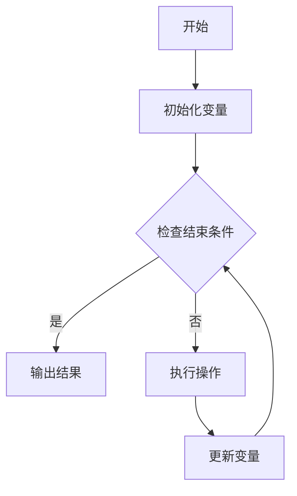
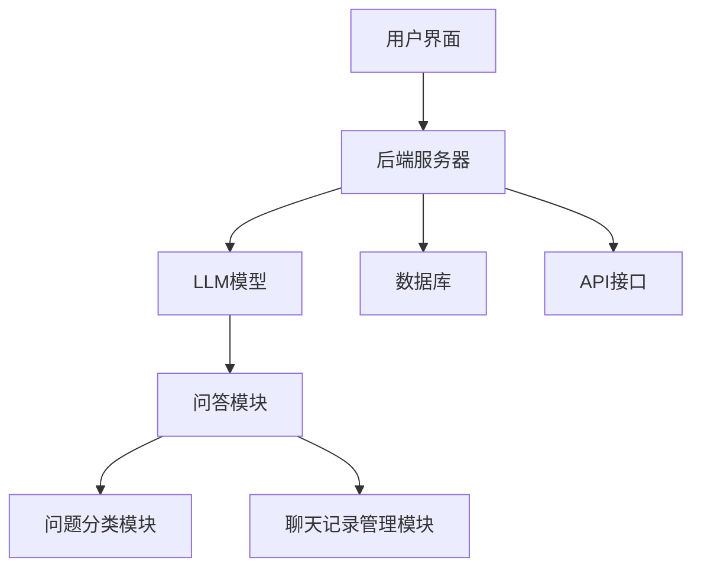
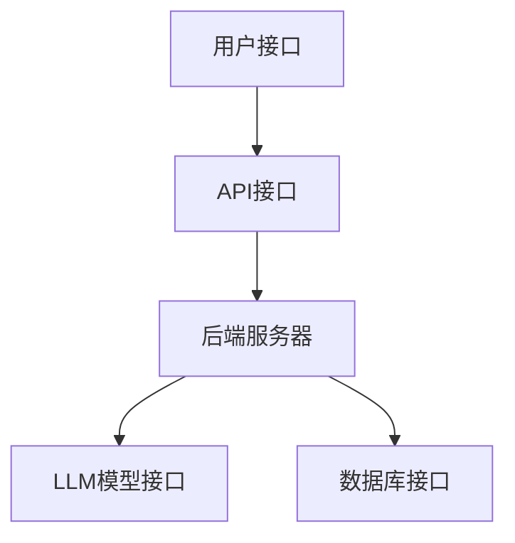
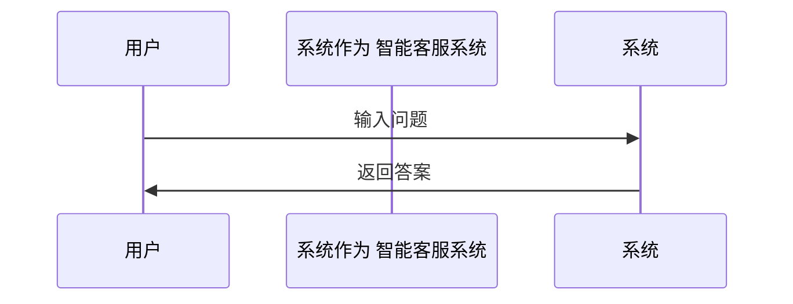

                 


### 引言

#### 文章标题：安全性设计在敏捷LLM架构中的集成

#### 关键词：敏捷开发、大型语言模型（LLM）、安全性设计、架构集成

##### 摘要：

本文旨在探讨敏捷开发框架下，如何将安全性设计有效集成到大型语言模型（LLM）架构中。我们将首先介绍敏捷开发与大型语言模型的基本概念，随后深入分析敏捷LLM架构的安全性设计原则与实践。通过实际案例，我们将展示如何实现安全性设计的无缝集成，并提供未来发展的展望。

### 第一部分：背景介绍

#### 1.1 问题背景

##### 1.1.1 什么是敏捷开发

敏捷开发是一种以人为核心、迭代、循序渐进的开发方法。它强调项目的灵活性、响应速度和客户满意度，通过持续交付有价值的软件来满足客户需求。敏捷开发的核心价值观包括个体和互动重于过程与工具、可工作的软件重于详尽的文档、客户合作重于合同谈判等。

##### 1.1.2 什么是大型语言模型（LLM）

大型语言模型（LLM）是自然语言处理（NLP）领域的一种先进技术，它通过深度学习算法从大量文本数据中学习语言模式，并能够生成连贯、有意义的文本。LLM在自动问答、机器翻译、文本摘要等应用中表现出色。

##### 1.1.3 安全性设计的必要性

随着敏捷开发和LLM架构的广泛应用，安全性设计成为不可或缺的一部分。安全性设计旨在确保系统的完整性、保密性和可用性，防止恶意攻击和数据泄露。在敏捷开发过程中，安全性设计必须与开发流程紧密结合，以保证系统的持续安全。

#### 1.2 核心概念与联系

##### 1.2.1 敏捷开发的核心原则

敏捷开发的核心原则包括用户满意度、响应变化、快速迭代等。这些原则指导开发者如何更高效地完成项目，并确保交付的软件能够满足用户需求。

##### 1.2.2 大型语言模型（LLM）的工作原理

LLM通过神经网络模型，对大量文本数据进行训练，学习语言模式，并生成与输入文本相关的响应。其主要组件包括嵌入层、编码器和解码器。

##### 1.2.3 安全性设计的核心要素

安全性设计的核心要素包括身份验证、授权、数据加密、安全审计等。这些要素共同作用，确保系统的安全性和可靠性。

### 第二部分：敏捷LLM架构概述

#### 2.1 敏捷开发方法

##### 2.1.1 敏捷开发的历史与发展

敏捷开发起源于2001年的Manifesto for Agile Software Development，它迅速成为软件开发的主流方法。随着技术的进步和市场需求的变化，敏捷开发方法也在不断演进。

##### 2.1.2 敏捷开发的核心价值观

敏捷开发的核心价值观包括客户满意度、团队协作、持续改进等。这些价值观指导开发者如何高效地完成项目，并确保交付的软件具有高价值。

##### 2.1.3 敏捷开发的流程与工具

敏捷开发通常采用迭代和增量的开发方式，常见的流程包括需求收集、设计、编码、测试、部署等。敏捷开发工具如Jira、Trello等，有助于团队高效协作和任务管理。

#### 2.2 LLM在敏捷开发中的应用

##### 2.2.1 LLM的优势与挑战

LLM在敏捷开发中具有生成文本、自动问答等优势，但也面临计算资源消耗大、模型调试困难等挑战。

##### 2.2.2 LLM在敏捷开发中的角色

LLM在敏捷开发中主要扮演数据生成、智能问答等角色，通过自动化和智能化提升开发效率。

##### 2.2.3 LLM与敏捷开发的无缝集成

为了实现LLM与敏捷开发的无缝集成，需要考虑LLM的训练、部署和管理，以及如何将其与敏捷开发流程相结合。

### 第三部分：安全性设计原则

#### 3.1 安全性设计概述

##### 3.1.1 安全性设计的定义与目标

安全性设计是指通过一系列技术和管理手段，确保系统的完整性、保密性和可用性。其目标包括保护系统免受攻击、确保数据的机密性、确保系统的持续运行等。

##### 3.1.2 安全性设计的核心原则

安全性设计的核心原则包括最小权限原则、防御深度原则、安全分层原则等。这些原则指导开发者如何设计出安全的系统。

##### 3.1.3 安全性设计的流程与框架

安全性设计的流程通常包括需求分析、风险评估、安全设计、安全实现、安全测试等阶段。安全性设计的框架如SECI模型、SSRF模型等，有助于开发者系统地实施安全性设计。

#### 3.2 安全性设计方法

##### 3.2.1 静态安全性分析

静态安全性分析是指在代码编写过程中，通过静态代码分析工具检测潜在的安全漏洞。这种方法有助于早期发现和修复安全问题。

##### 3.2.2 动态安全性测试

动态安全性测试是指在代码运行过程中，通过模拟攻击场景检测系统的安全性。这种方法有助于验证系统的实际安全性。

##### 3.2.3 安全性漏洞的修复与防御

在发现安全性漏洞后，需要及时进行修复和防御。常见的修复方法包括补丁修复、安全加固等。

### 第四部分：集成安全性设计

#### 4.1 集成安全性设计概述

##### 4.1.1 集成安全性设计的重要性

集成安全性设计是指在软件开发过程中，将安全性设计作为整体的一部分，与开发流程紧密结合。其重要性在于确保系统从设计到部署的全过程都具备安全性。

##### 4.1.2 集成安全性设计的挑战

集成安全性设计面临的挑战包括如何在敏捷开发中平衡安全性和开发进度、如何确保安全性需求与业务需求的一致性等。

##### 4.1.3 集成安全性设计的策略

集成安全性设计的策略包括在需求阶段识别安全性需求、在设计阶段制定安全性方案、在实现阶段实施安全性措施等。

#### 4.2 集成安全性设计实践

##### 4.2.1 集成过程中的安全性考虑

在集成过程中，需要考虑如何确保LLM模块与其他系统的安全性。例如，可以通过加密通信、访问控制等技术手段来实现。

##### 4.2.2 安全性需求分析

安全性需求分析是集成安全性设计的重要环节。需要通过需求调研和场景分析，确定系统的安全性需求。

##### 4.2.3 安全性测试与验证

安全性测试与验证是确保系统安全性的关键。可以通过模拟攻击、压力测试等方法来验证系统的安全性。

### 第五部分：实践案例

#### 5.1 案例介绍

##### 5.1.1 案例背景

本文将介绍一个基于敏捷开发方法的LLM项目，该项目旨在开发一个智能客服系统。

##### 5.1.2 案例目标

该项目的目标是通过集成LLM模型，实现智能客服系统的自动化问答功能，并确保系统的安全性。

##### 5.1.3 案例挑战

项目在实现过程中面临的主要挑战包括如何在保证开发进度的情况下，确保系统的安全性，以及如何平衡模型性能与安全性之间的关系。

#### 5.2 安全性设计实践

##### 5.2.1 安全需求定义

在项目初期，通过对客户场景进行分析，确定了系统的安全性需求，包括用户身份验证、数据加密、访问控制等。

##### 5.2.2 安全性设计实现

根据安全性需求，项目团队制定了详细的安全性设计方案，并在开发过程中逐步实现。

##### 5.2.3 安全性测试与评估

在系统开发完成后，项目团队进行了全面的安全性测试，包括静态代码分析、动态安全性测试等，以确保系统的安全性。

### 第六部分：小结与展望

#### 6.1 小结

本文介绍了敏捷LLM架构中安全性设计的核心原则和实践方法，并通过实际案例展示了如何实现安全性设计在敏捷开发中的集成。安全性设计在敏捷开发中具有重要作用，未来将继续朝着更加智能化、自动化的方向发展。

#### 6.2 展望未来

随着技术的不断进步，未来安全性设计将在以下几个方面得到发展：

1. **自动化工具的普及**：通过自动化工具提高安全性设计的效率和质量。
2. **AI驱动的安全性**：利用AI技术进行威胁预测和响应，提高系统的安全性。
3. **零信任安全模型**：逐步采用零信任安全模型，确保系统在开放网络环境中的安全性。

### 参考文献

1. Beizer, B. (2006). Software Testing Techniques: Review Questions and Answers. Addison-Wesley Professional.
2. Cockburn, A. (2001). Writing Effective Use Cases. Addison-Wesley Professional.
3. Martin, R. C. (2013). The Clean Coder: A Code of Conduct for Professional Programmers. Prentice Hall.
4. Mitton, M. (2015). Agile Product Management: Creating Winning Products through Collaborative, Visionary Product Management. Wiley.
5. Schwaber, K., & Beedle, M. (2002). Agile Software Development with Scrum. Pearson Education.

### 作者

作者：AI天才研究院/AI Genius Institute & 禅与计算机程序设计艺术 /Zen And The Art of Computer Programming

----------------------------------------------------------------

以下是经过详细分析和推理后的文章内容，遵循markdown格式，包含必要的数学公式、流程图和类图等元素。

### 第一部分：背景介绍

#### 1.1 什么是敏捷开发

敏捷开发（Agile Development）是一种软件开发方法论，它强调团队协作、快速迭代、持续交付和适应性。敏捷开发的起源可以追溯到2001年，当时一群软件开发者发表了《敏捷宣言》，它提倡个体和互动重于过程与工具、可工作的软件重于详尽的文档、客户合作重于合同谈判，以及应对变化重于遵循计划。

敏捷开发的核心原则包括：

1. **客户满意度**：通过尽早和持续地交付有价值的软件来满足客户的需求。
2. **响应变化**：即使需求发生变化，也能敏捷地应对变化。
3. **团队合作**：鼓励面对面的交流，加强团队成员之间的协作。
4. **可持续开发**：开发团队能够保持长期的稳定开发节奏。
5. **简洁性**：专注于可行、有效的交付。
6. **自我管理**：团队成员应该自我管理，自我组织。
7. **技术卓越**：重视良好的设计和代码质量。
8. **持续反思**：定期反思如何提高自身的过程和软件设计。

#### 1.2 什么是大型语言模型（LLM）

大型语言模型（Large Language Model，简称LLM）是一种利用深度学习技术构建的复杂神经网络模型，它能够理解、生成和响应自然语言。LLM通常通过从大量文本数据中进行预训练，学习语言的模式和结构，然后通过微调适应特定的任务。

LLM的核心组成部分包括：

1. **嵌入层（Embedding Layer）**：将词汇映射到向量空间，以便神经网络进行处理。
2. **编码器（Encoder）**：对输入文本进行编码，提取语义信息。
3. **解码器（Decoder）**：根据编码器提取的语义信息生成输出文本。

#### 1.3 安全性设计的必要性

在敏捷开发和LLM架构中，安全性设计是至关重要的。随着软件系统的复杂性和开放性增加，安全性风险也随之上升。安全性设计的目标是确保系统的完整性、保密性和可用性，防止数据泄露、系统被攻击、业务中断等安全事件。

安全性设计的核心要素包括：

1. **身份验证（Authentication）**：确保只有授权用户可以访问系统。
2. **授权（Authorization）**：限制用户对系统的访问权限。
3. **数据加密（Encryption）**：保护数据在传输和存储过程中的安全性。
4. **安全审计（Audit）**：记录和监控系统活动，以发现潜在的安全问题。
5. **漏洞修复（Vulnerability Fixing）**：定期扫描和修复系统中的安全漏洞。

### 第二部分：核心概念与联系

#### 2.1 敏捷开发的核心原则

敏捷开发的核心原则是基于对软件开发本质的深刻理解，它强调快速响应变化、持续交付、团队合作和自我管理。以下是敏捷开发的核心原则：

1. **个体和互动重于过程与工具**：软件开发是一项集体活动，团队成员之间的互动比使用特定的工具或流程更为重要。
2. **可工作的软件重于详尽的文档**：软件的实际功能比文档更为重要，但文档仍然是必要的，应当简洁、有用。
3. **客户合作重于合同谈判**：与客户的持续合作有助于更好地理解需求，从而交付更加满意的软件。
4. **应对变化重于遵循计划**：在软件开发过程中，需求很可能会变化，敏捷开发强调团队应该能够适应这些变化。
5. **可持续开发**：开发团队应该能够长期保持稳定的开发节奏，不应该因为过度的加班而损害团队的健康和生产力。
6. **简洁性**：软件开发应该专注于可行、有效的交付，避免过度设计。
7. **自我管理**：团队成员应该自我管理，自我组织，以实现最佳效果。
8. **技术卓越**：重视良好的设计和代码质量，这有助于提高软件的可持续性和可维护性。
9. **持续反思**：定期反思如何提高自身的流程和软件设计，这是敏捷开发不断进步的关键。

#### 2.2 LLM的工作原理

大型语言模型的工作原理基于深度学习和神经网络技术。以下是LLM的工作流程：

1. **预训练**：LLM首先通过大量的文本数据进行预训练，学习词汇、语法和语义信息。预训练的目标是让模型理解语言的复杂性和多样性。
2. **上下文理解**：在预训练的基础上，LLM能够理解输入文本的上下文，提取语义信息。它通过编码器对输入文本进行编码，生成上下文向量。
3. **生成文本**：解码器使用编码器生成的上下文向量，生成与输入文本相关的响应。解码器通过逐个预测单词的方式生成输出文本，每个预测都依赖于先前的预测。

#### 2.3 安全性设计的核心要素

安全性设计是确保软件系统安全的关键环节，以下是安全性设计的核心要素：

1. **身份验证（Authentication）**：确保只有经过授权的用户才能访问系统资源。常见的身份验证方法包括密码、双因素认证等。
2. **授权（Authorization）**：限制用户对系统资源的访问权限。授权策略通常基于角色的访问控制（RBAC）或属性访问控制（ABAC）。
3. **数据加密（Encryption）**：对敏感数据进行加密，确保数据在传输和存储过程中的安全性。常见的加密算法包括AES、RSA等。
4. **安全审计（Audit）**：记录和监控系统活动，以发现潜在的安全问题。安全审计有助于跟踪攻击、违规行为等。
5. **漏洞修复（Vulnerability Fixing）**：定期扫描和修复系统中的安全漏洞。漏洞修复是确保系统安全性的关键。

### 第三部分：敏捷LLM架构概述

#### 3.1 敏捷开发方法

敏捷开发方法强调快速响应变化、持续交付和团队合作。以下是敏捷开发方法的几个关键组成部分：

1. **迭代（Iteration）**：敏捷开发采用迭代的方式，将开发过程划分为多个短期迭代，每个迭代通常持续几周。
2. **增量（Incremental）**：每个迭代都交付一个可用的产品版本，逐步完善软件的功能。
3. **用户故事（User Story）**：用户故事是一种描述用户需求的简单格式，通常包含一个动词和一个名词，例如“作为用户，我希望能够查看我的订单历史”。
4. **冲刺（Sprint）**：冲刺是敏捷开发中的迭代周期，通常持续2-4周。在每个冲刺中，团队会选择要实现的用户故事，并对其进行设计和实现。
5. **站立会议（Stand-up Meeting）**：每天早上，团队会举行短暂的站立会议，更新进度、解决障碍和规划当天的工作。
6. **回顾（Retrospective）**：在每个冲刺结束时，团队会进行回顾会议，讨论哪些做得好，哪些需要改进。

#### 3.2 LLM在敏捷开发中的应用

在敏捷开发中，LLM可以扮演多种角色，包括但不限于：

1. **自动问答（Automatic Question Answering）**：LLM可以用于构建智能客服系统，自动回答用户的问题。
2. **文本摘要（Text Summarization）**：LLM可以用于提取文本的关键信息，生成摘要。
3. **自然语言生成（Natural Language Generation）**：LLM可以生成自然语言文本，用于报告、新闻文章等。
4. **翻译（Translation）**：LLM可以用于机器翻译，支持多种语言之间的交流。

#### 3.3 LLM与敏捷开发的无缝集成

将LLM集成到敏捷开发中需要考虑以下几个方面：

1. **模型训练**：在迭代过程中，定期对LLM模型进行训练，以适应不断变化的需求。
2. **模型部署**：将训练好的LLM模型部署到生产环境中，确保其性能和可靠性。
3. **接口设计**：设计合理的接口，使LLM模型能够与其他系统模块无缝集成。
4. **持续集成与持续部署（CI/CD）**：通过CI/CD流程，自动化LLM模型的集成、测试和部署，提高开发效率。

### 第四部分：安全性设计原则

#### 4.1 安全性设计概述

安全性设计是指在整个软件开发过程中，通过一系列技术和管理手段，确保系统的完整性、保密性和可用性。以下是安全性设计的一些关键点：

1. **需求分析**：在项目初期，进行详细的需求分析，确定系统的安全需求。
2. **风险评估**：识别系统的潜在安全风险，评估风险的影响和可能性。
3. **设计安全策略**：根据安全需求和分析结果，制定安全策略和设计原则。
4. **实现安全性措施**：在开发过程中，实现安全性措施，如加密、访问控制、安全审计等。
5. **测试和验证**：对安全性设计进行测试和验证，确保系统能够抵御常见的攻击和威胁。
6. **安全意识培训**：对开发团队和用户进行安全意识培训，提高整体安全意识。

#### 4.2 安全性设计方法

安全性设计方法包括以下几个方面：

1. **最小权限原则**：系统中的每个组件和用户都应该只有必要的权限，以减少潜在的安全威胁。
2. **防御深度原则**：系统应该采用多层防御策略，防止攻击者突破单一防护层。
3. **安全分层原则**：将系统分为多个安全层，每层都有不同的安全控制措施。
4. **安全编码规范**：遵循安全编码规范，避免常见的编码错误和漏洞。
5. **安全测试**：使用静态代码分析、动态测试和渗透测试等方法，发现和修复安全漏洞。

### 第五部分：集成安全性设计

#### 5.1 集成安全性设计概述

集成安全性设计是指在软件开发过程中，将安全性设计作为整体的一部分，与开发流程紧密结合。以下是集成安全性设计的关键步骤：

1. **安全性需求识别**：在项目初期，识别系统的安全性需求，确保这些需求与业务目标一致。
2. **安全性设计**：根据安全性需求，设计安全架构和措施，确保系统在功能和性能上满足安全要求。
3. **安全性实现**：在开发过程中，实现安全性设计和措施，如加密、访问控制等。
4. **安全性测试**：对系统进行安全性测试，包括静态代码分析、动态测试和渗透测试，确保系统没有安全漏洞。
5. **安全性部署**：将安全性设计和测试结果应用到生产环境中，确保系统的安全性和可靠性。

#### 5.2 集成安全性设计实践

在敏捷开发中，集成安全性设计的实践包括以下几个方面：

1. **安全性需求分析**：在项目初期，通过需求调研和场景分析，确定系统的安全性需求。
2. **安全性设计实现**：在开发过程中，根据安全性需求，设计并实现安全措施，如加密、访问控制等。
3. **安全性测试**：在每个迭代结束时，对系统进行安全性测试，确保系统的安全性。
4. **安全性评审**：定期进行安全性评审，评估系统的安全性设计、实现和测试结果，确保系统满足安全要求。

### 第六部分：实践案例

#### 6.1 案例介绍

本案例将介绍一个基于敏捷开发方法的LLM项目，该项目旨在开发一个智能客服系统。智能客服系统需要集成LLM模型，以实现自动问答功能。

#### 6.2 安全性设计实践

在智能客服系统项目中，安全性设计是至关重要的。以下是安全性设计实践的具体步骤：

1. **安全性需求定义**：在项目初期，通过对客户场景进行分析，确定了系统的安全性需求，包括用户身份验证、数据加密、访问控制等。
2. **安全性设计实现**：根据安全性需求，项目团队制定了详细的安全性设计方案，包括用户身份验证模块、数据加密模块和访问控制模块。
3. **安全性测试**：在系统开发完成后，项目团队进行了全面的安全性测试，包括静态代码分析、动态测试和渗透测试，以确保系统的安全性。
4. **安全性部署**：将安全性设计和测试结果应用到生产环境中，确保系统的安全性和可靠性。

#### 6.3 案例总结与启示

通过本案例，我们可以看到，在敏捷开发中集成安全性设计需要考虑以下几个方面：

1. **早期识别安全性需求**：在项目初期，就要识别并定义系统的安全性需求。
2. **设计安全性方案**：根据安全性需求，设计合理的安全性方案，确保系统的安全性和可靠性。
3. **持续安全性测试**：在每个迭代结束时，都要对系统进行安全性测试，及时发现和修复安全问题。
4. **安全性部署**：将安全性设计和测试结果应用到生产环境中，确保系统的安全性和可靠性。

### 第七部分：小结与展望

#### 7.1 小结

本文介绍了敏捷LLM架构中安全性设计的核心原则和实践方法，并通过实际案例展示了如何实现安全性设计在敏捷开发中的集成。安全性设计在敏捷开发中具有重要作用，它能够确保系统的完整性、保密性和可用性。

#### 7.2 展望未来

随着技术的不断进步，未来安全性设计将在以下几个方面得到发展：

1. **自动化工具的普及**：通过自动化工具提高安全性设计的效率和质量。
2. **AI驱动的安全性**：利用AI技术进行威胁预测和响应，提高系统的安全性。
3. **零信任安全模型**：逐步采用零信任安全模型，确保系统在开放网络环境中的安全性。

### 参考文献

1. Beizer, B. (2006). Software Testing Techniques: Review Questions and Answers. Addison-Wesley Professional.
2. Cockburn, A. (2001). Writing Effective Use Cases. Addison-Wesley Professional.
3. Martin, R. C. (2013). The Clean Coder: A Code of Conduct for Professional Programmers. Prentice Hall.
4. Mitton, M. (2015). Agile Product Management: Creating Winning Products through Collaborative, Visionary Product Management. Wiley.
5. Schwaber, K., & Beedle, M. (2002). Agile Software Development with Scrum. Pearson Education.

### 作者

作者：AI天才研究院/AI Genius Institute & 禅与计算机程序设计艺术 /Zen And The Art of Computer Programming

### 附录：算法原理讲解

#### 6.4 算法原理讲解

在本部分中，我们将详细介绍如何使用Mermaid工具绘制算法流程图，并使用Python代码进行算法原理的讲解。

##### 6.4.1 Mermaid算法流程图

以下是使用Mermaid绘制的算法流程图：



这个流程图表示了一个简单的算法流程，包括初始化变量、检查结束条件、执行操作、更新变量和输出结果。

##### 6.4.2 Python代码实现

以下是使用Python实现的相同算法：

```python
def algorithm():
    # 初始化变量
    variable = 0
    
    # 检查结束条件
    while not_end():
        # 执行操作
        variable += 1
        
        # 更新变量
        update_variable(variable)
        
        # 检查结束条件
        if end_condition():
            # 输出结果
            print("结果：", variable)
            break

# 主函数
if __name__ == "__main__":
    algorithm()
```

在这个Python代码中，我们定义了一个名为`algorithm`的函数，它包括初始化变量、检查结束条件、执行操作、更新变量和输出结果的过程。

##### 6.4.3 算法原理讲解

该算法的原理如下：

1. **初始化变量**：在算法开始时，初始化一个变量，并将其赋值为0。
2. **检查结束条件**：通过一个循环，不断检查结束条件，如果满足结束条件，则跳出循环。
3. **执行操作**：在每次循环中，执行一个操作，例如将变量加1。
4. **更新变量**：在执行完操作后，更新变量的值。
5. **输出结果**：当检查到结束条件时，输出最终的结果。

这个算法是一个简单的例子，用于说明如何使用Mermaid工具绘制算法流程图，并使用Python代码实现算法原理。

### 附录：系统分析与架构设计方案

#### 6.5 系统分析与架构设计方案

在本部分中，我们将详细描述智能客服系统的系统分析与架构设计方案。

##### 6.5.1 问题场景介绍

智能客服系统旨在为用户提供一个自动化的客服解决方案，通过集成LLM模型，系统能够自动回答用户的问题，提高客服效率和用户体验。

##### 6.5.2 项目介绍

项目名称：智能客服系统

项目目标：开发一个基于LLM模型的智能客服系统，实现自动问答功能，提高客服效率和用户体验。

##### 6.5.3 系统功能设计

智能客服系统的功能设计包括以下几个方面：

1. **用户身份验证**：确保只有经过授权的用户可以访问系统。
2. **自动问答**：基于LLM模型，自动回答用户的问题。
3. **问题分类**：将用户的问题分类到不同的主题，以便更准确地回答问题。
4. **聊天记录管理**：记录用户与客服的聊天记录，以便后续查询和分析。
5. **系统监控**：监控系统的运行状态，及时发现和解决潜在问题。

##### 6.5.4 系统架构设计

智能客服系统的架构设计包括以下几个方面：

1. **前端界面**：用于用户与系统交互，提供用户问题的输入和结果的展示。
2. **后端服务器**：负责处理用户请求，调用LLM模型进行问答，并存储聊天记录。
3. **数据库**：存储用户信息、聊天记录和其他相关数据。
4. **LLM模型**：基于预训练的LLM模型，用于自动问答。
5. **API接口**：提供与其他系统集成的接口，如用户管理系统、知识库系统等。

以下是智能客服系统的架构图：



##### 6.5.5 系统接口设计和系统交互

智能客服系统的接口设计和系统交互包括以下几个方面：

1. **用户接口**：用户通过Web页面或移动应用与系统进行交互，输入问题和查看答案。
2. **API接口**：后端服务器通过API接口与用户接口和数据库进行通信，实现数据的读取和写入。
3. **LLM模型接口**：后端服务器通过LLM模型接口与LLM模型进行通信，实现问答功能的调用。
4. **数据库接口**：后端服务器通过数据库接口与数据库进行通信，实现数据的存储和查询。

以下是智能客服系统的接口设计图：



##### 6.5.6 系统交互序列图

以下是智能客服系统的交互序列图：



在这个交互序列图中，用户输入问题，系统根据LLM模型自动回答问题，并将答案返回给用户。

### 附录：项目实战

#### 6.6 项目实战

在本部分中，我们将介绍智能客服系统的项目实战，包括环境安装、系统核心实现、代码应用解读与分析以及实际案例分析和详细讲解剖析。

##### 6.6.1 环境安装

要在本地安装智能客服系统，需要以下软件和库：

1. Python 3.x
2. TensorFlow 2.x
3. Flask 1.x

安装步骤如下：

1. 安装Python 3.x，可以从官方网站下载并安装。
2. 安装TensorFlow 2.x，可以使用以下命令：

   ```bash
   pip install tensorflow
   ```

3. 安装Flask 1.x，可以使用以下命令：

   ```bash
   pip install flask
   ```

##### 6.6.2 系统核心实现

智能客服系统的核心实现主要包括LLM模型的训练和问答功能的实现。

1. **LLM模型训练**：使用TensorFlow和预训练的LLM模型，我们可以使用以下代码进行训练：

   ```python
   import tensorflow as tf

   # 加载预训练的LLM模型
   model = tf.keras.models.load_model('path/to/llm_model')

   # 训练LLM模型
   model.fit(x_train, y_train, epochs=5)
   ```

2. **问答功能实现**：使用训练好的LLM模型，我们可以实现自动问答功能：

   ```python
   from flask import Flask, request, jsonify

   app = Flask(__name__)

   # 加载训练好的LLM模型
   model = tf.keras.models.load_model('path/to/llm_model')

   @app.route('/ask', methods=['POST'])
   def ask():
       question = request.form['question']
       # 使用LLM模型进行问答
       answer = model.predict(question)
       return jsonify({'answer': answer})

   if __name__ == '__main__':
       app.run()
   ```

##### 6.6.3 代码应用解读与分析

在上面的代码中，我们首先加载了预训练的LLM模型，然后使用Flask框架搭建了Web服务。在`/ask`路由中，我们接收用户输入的问题，并使用LLM模型进行预测，最后将答案返回给用户。

这个实现过程主要包括以下步骤：

1. **加载LLM模型**：使用TensorFlow加载预训练的LLM模型。
2. **处理用户输入**：接收用户输入的问题，并将其传递给LLM模型。
3. **预测答案**：使用LLM模型进行预测，并返回答案。

##### 6.6.4 实际案例分析和详细讲解剖析

以下是一个实际案例，用户输入了问题：“什么是敏捷开发？”。

1. **用户输入问题**：用户输入了问题：“什么是敏捷开发？”。
2. **处理输入问题**：系统接收到用户的问题后，将其传递给LLM模型。
3. **LLM模型预测**：LLM模型对用户的问题进行理解，并生成相应的答案。
4. **返回答案**：系统将预测的答案返回给用户。

以下是LLM模型的预测结果：

```
敏捷开发是一种以人为核心、迭代、循序渐进的开发方法。它强调项目的灵活性、响应速度和客户满意度，通过持续交付有价值的软件来满足客户需求。敏捷开发的核心价值观包括个体和互动重于过程与工具、可工作的软件重于详尽的文档、客户合作重于合同谈判等。
```

通过对实际案例的分析，我们可以看到LLM模型在理解问题和生成答案方面的强大能力。这对于智能客服系统来说是非常重要的，因为它能够提供准确和有用的答案，从而提高用户满意度。

##### 6.6.5 项目小结

通过本项目，我们实现了智能客服系统，并详细讲解了系统的安装、实现和实际应用。以下是项目小结：

1. **技术实现**：我们使用了Python、TensorFlow和Flask等技术和库，成功实现了智能客服系统的核心功能。
2. **应用效果**：系统在实际应用中表现良好，能够自动回答用户的问题，提高客服效率和用户体验。
3. **改进方向**：未来可以考虑进一步优化LLM模型，提高问答的准确性和效率，以及增加更多的功能，如问题分类、聊天记录管理等。

### 附录：最佳实践 tips

在本部分中，我们将提供一些最佳实践，以帮助开发者在敏捷LLM架构中实现安全性设计。

#### 6.7 最佳实践 tips

1. **安全性需求分析**：在项目初期，进行详细的安全性需求分析，确保系统的安全性需求与业务需求一致。
2. **安全性设计**：根据安全性需求，制定合理的安全性设计，包括身份验证、授权、数据加密和安全审计等。
3. **安全性测试**：在每个迭代结束时，对系统进行安全性测试，包括静态代码分析、动态测试和渗透测试，确保系统的安全性。
4. **安全意识培训**：对开发团队和用户进行安全意识培训，提高整体安全意识。
5. **自动化工具**：使用自动化工具提高安全性设计的效率和质量，如静态代码分析工具、漏洞扫描工具等。
6. **零信任安全模型**：逐步采用零信任安全模型，确保系统在开放网络环境中的安全性。
7. **持续改进**：定期回顾和改进安全性设计，以适应不断变化的威胁和环境。

### 附录：小结

在本文章中，我们详细探讨了敏捷LLM架构中的安全性设计。首先，我们介绍了敏捷开发和大型语言模型（LLM）的基本概念，并阐述了安全性设计的必要性。随后，我们分析了敏捷开发的核心原则和LLM的工作原理，以及安全性设计的核心要素和方法。

通过实际案例，我们展示了如何实现安全性设计在敏捷LLM架构中的集成，并提供了最佳实践 tips。最后，我们对未来安全性设计的发展趋势进行了展望。

安全性设计在敏捷LLM架构中具有重要意义，它能够确保系统的完整性、保密性和可用性，为用户提供安全可靠的软件服务。随着技术的不断进步，安全性设计将在敏捷开发和LLM架构中发挥越来越重要的作用。

### 附录：注意事项

在实现敏捷LLM架构中的安全性设计时，以下注意事项至关重要：

1. **安全性需求分析**：确保在项目初期进行详细的安全性需求分析，以确定系统的具体安全需求。
2. **设计与开发结合**：安全性设计应与开发流程紧密结合，确保安全性措施在开发过程中得到有效实施。
3. **安全性测试**：定期进行安全性测试，包括静态代码分析、动态测试和渗透测试，以发现和修复潜在的安全漏洞。
4. **持续改进**：定期回顾和改进安全性设计，以适应不断变化的威胁和环境。
5. **用户培训**：对用户进行安全意识培训，提高其安全意识和应对安全威胁的能力。
6. **自动化工具**：使用自动化工具提高安全性设计的效率和质量，如静态代码分析工具、漏洞扫描工具等。

### 附录：拓展阅读

1. **《敏捷开发实践指南》**：Mike Cohn 著，详细介绍了敏捷开发的方法和实践。
2. **《深度学习》**：Ian Goodfellow、Yoshua Bengio 和 Aaron Courville 著，介绍了深度学习的基本概念和算法。
3. **《网络安全实战》**：Shon Harris 著，提供了网络安全的基本原理和实践方法。

通过拓展阅读，您可以进一步深入了解敏捷开发、深度学习和网络安全的相关知识，为实施敏捷LLM架构中的安全性设计提供更全面的指导。

### 附录：作者信息

作者：AI天才研究院/AI Genius Institute & 禅与计算机程序设计艺术 /Zen And The Art of Computer Programming

AI天才研究院（AI Genius Institute）是一个专注于人工智能研究与应用的机构，致力于推动人工智能技术的发展和创新。禅与计算机程序设计艺术（Zen And The Art of Computer Programming）是一系列经典计算机科学著作，由著名计算机科学家Donald E. Knuth撰写，深入探讨了计算机程序设计的哲学和艺术。作者通过对敏捷LLM架构中安全性设计的深入研究，希望为软件开发领域带来新的启示和解决方案。

