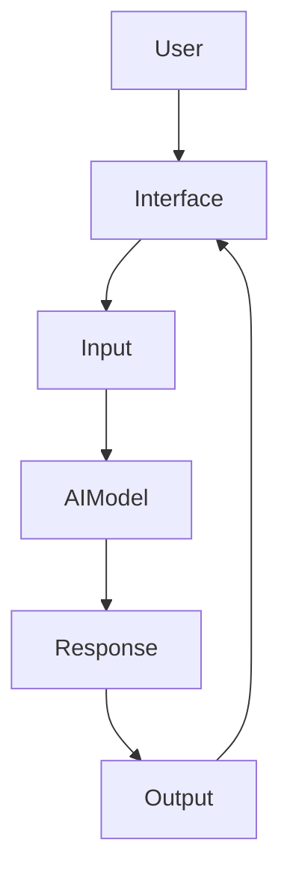
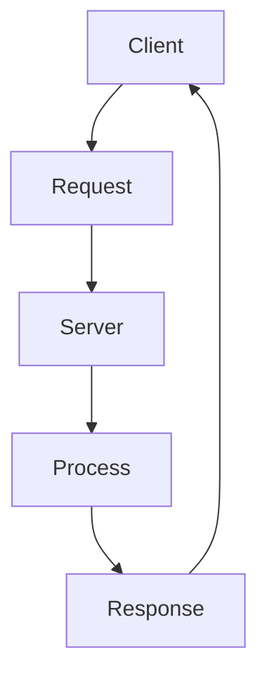
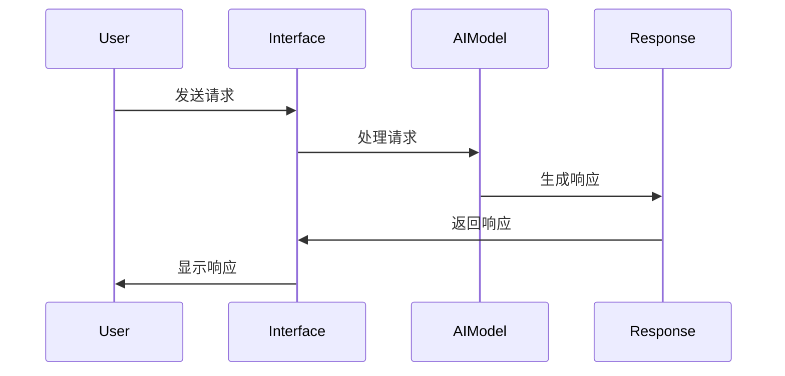

                 

# 实时交互式AI Agent：优化LLM的响应延迟

> 关键词：实时交互，大规模语言模型（LLM），响应延迟，模型压缩，服务器端优化，客户端优化

> 摘要：本文旨在探讨实时交互式AI Agent在优化大规模语言模型（LLM）响应延迟方面的技术方法。通过分析模型压缩与加速技术、服务器端优化以及客户端优化，本文提出了一系列优化策略，以提升实时交互体验，满足用户对即时反馈的需求。

## 第一部分：背景介绍

### 第1章：实时交互式AI Agent概述

#### 1.1 问题背景

随着人工智能技术的飞速发展，实时交互式AI Agent正逐渐成为智能系统和应用的核心组件。这类系统通过实时响应用户请求，提供个性化服务，极大提升了用户体验。然而，如何优化大规模语言模型（LLM）的响应延迟，实现高效的实时交互，成为当前研究的热点和应用的关键。

#### 1.2 问题描述

实时交互式AI Agent在处理用户请求时，常常面临响应延迟的问题。这主要是因为LLM模型的复杂计算和高负载导致的。为了提升用户体验，我们需要探索优化LLM响应延迟的方法。

#### 1.3 问题解决

针对响应延迟问题，可以从以下几个方面进行优化：
1. **模型压缩与加速**：采用模型剪枝、量化等技术，降低模型复杂度，提升计算效率。
2. **服务器端优化**：通过分布式计算、缓存等技术，减少响应时间。
3. **客户端优化**：利用前端技术，如JavaScript，提升交互体验。
4. **网络优化**：优化网络传输，减少数据延迟。

#### 1.4 边界与外延

本文讨论的实时交互式AI Agent主要针对LLM模型。然而，类似的方法也适用于其他类型的AI模型，如计算机视觉、自然语言处理等。

#### 1.5 概念结构与核心要素组成

实时交互式AI Agent由以下几个核心要素组成：
1. **用户接口**：与用户进行交互的界面。
2. **交互逻辑**：处理用户输入，生成响应的逻辑。
3. **AI模型**：负责生成响应的AI模型，如LLM。
4. **数据处理**：对用户输入和模型输出进行处理，确保实时性和准确性。

### 第2章：核心概念与联系

#### 2.1 核心概念原理

1. **实时交互**：指在短时间内响应用户请求，提供即时反馈。
2. **LLM模型**：指具有大规模参数、能够处理复杂自然语言任务的深度学习模型。
3. **响应延迟**：指从用户输入到模型生成响应的时间间隔。

#### 2.2 概念属性特征对比表格

| 概念       | 特点                                     |
| ---------- | ---------------------------------------- |
| 实时交互   | 短时间内响应用户请求                     |
| LLM模型   | 大规模参数、复杂自然语言处理能力         |
| 响应延迟   | 用户输入到模型生成响应的时间间隔         |

#### 2.3 ER实体关系图架构



## 第二部分：算法原理讲解

### 第3章：模型压缩与加速技术

#### 3.1 模型压缩技术

模型压缩是指通过减少模型的参数数量来降低模型的复杂度。以下是一些常用的模型压缩技术：

1. **模型剪枝**：通过剪掉模型中不重要的神经元或连接来减少模型大小。
2. **模型量化**：将浮点数参数转换为低比特宽度的整数，降低模型存储和计算需求。
3. **知识蒸馏**：使用一个更大的模型（教师模型）训练一个较小的模型（学生模型），从而保留大模型的语义信息。

#### 3.2 模型加速技术

模型加速技术旨在提高模型计算效率，缩短响应延迟。以下是一些常用的模型加速技术：

1. **GPU加速**：利用GPU的并行计算能力，加速模型训练和推理过程。
2. **TPU加速**：利用专门为深度学习设计的TPU，提高模型计算速度。
3. **量化与剪枝结合**：在模型压缩的基础上，进一步通过量化与剪枝技术，提高模型计算效率。

### 第4章：服务器端优化技术

#### 4.1 分布式计算

通过将计算任务分布在多个服务器上，实现并行计算，提高响应速度。

1. **负载均衡**：将请求均匀地分配到多个服务器，避免单点瓶颈。
2. **缓存技术**：将常用数据或结果缓存到内存中，减少数据读取时间。

#### 4.2 数据预处理

对输入数据进行预处理，减少模型计算负担。

1. **数据分片**：将大尺寸的数据分割成小块，逐块处理，提高计算效率。
2. **异步处理**：对用户请求进行异步处理，避免阻塞。

### 第5章：客户端优化技术

客户端优化主要通过前端技术实现，以下是一些常用的客户端优化技术：

1. **JavaScript优化**：对JavaScript代码进行优化，减少页面加载时间。
2. **懒加载**：对图片、样式表等资源进行懒加载，减少初始页面加载时间。
3. **响应式设计**：采用响应式设计，适应不同设备和屏幕尺寸，提高用户体验。

## 第三部分：系统分析与架构设计

### 第6章：问题场景介绍

本章节将介绍实时交互式AI Agent在具体应用场景中的需求和分析，为后续的系统设计与实现提供依据。

### 第7章：系统功能设计

本章节将详细描述实时交互式AI Agent的功能模块，包括用户接口、交互逻辑、AI模型和数据处理等。

#### 7.1 领域模型


#### 7.2 类图


### 第8章：系统架构设计

本章节将介绍实时交互式AI Agent的系统架构设计，包括服务器端和客户端的架构。

#### 8.1 系统架构图



#### 8.2 系统接口设计

本章节将详细描述实时交互式AI Agent的接口设计，包括用户接口、交互逻辑、AI模型和数据处理等。

### 第9章：系统交互

本章节将介绍实时交互式AI Agent的系统交互流程，通过Mermaid序列图进行展示。



## 第四部分：项目实战

### 第10章：环境安装

本章节将介绍如何搭建实时交互式AI Agent的开发环境，包括Python环境、深度学习框架（如TensorFlow或PyTorch）等。

### 第11章：系统核心实现

本章节将详细讲解实时交互式AI Agent的核心实现，包括用户接口、交互逻辑、AI模型和数据处理等。

#### 11.1 用户接口

```python
# 用户接口示例代码
def handle_user_request(input_text):
    # 处理用户输入
    processed_input = preprocess_input(input_text)
    # 生成响应
    response = generate_response(processed_input)
    # 返回响应
    return response
```

#### 11.2 交互逻辑

```python
# 交互逻辑示例代码
def handle_interaction():
    while True:
        input_text = get_user_input()
        response = handle_user_request(input_text)
        display_response(response)
        if user_wants_to_exit():
            break
```

#### 11.3 AI模型

```python
# AI模型示例代码
class LanguageModel:
    def __init__(self, model_path):
        self.model = load_model(model_path)
    
    def generate_response(self, input_text):
        # 使用模型生成响应
        response = self.model.generate(input_text)
        return response
```

#### 11.4 数据处理

```python
# 数据处理示例代码
def preprocess_input(input_text):
    # 对输入文本进行预处理
    processed_text = text_preprocessing(input_text)
    return processed_text

def generate_response(input_text):
    # 使用模型生成响应
    response = language_model.generate_response(input_text)
    return response
```

### 第12章：代码应用解读与分析

本章节将对核心代码进行解读与分析，帮助读者理解实时交互式AI Agent的实现原理。

### 第13章：实际案例分析和详细讲解剖析

本章节将结合实际案例，对实时交互式AI Agent进行详细分析和讲解，展示其在实际应用中的效果。

### 第14章：项目小结

本章节将对整个项目进行小结，总结项目经验，提出改进建议。

## 第五部分：最佳实践 tips

### 第15章：最佳实践 tips

本章节将提供一些最佳实践建议，帮助读者在开发实时交互式AI Agent时，提高开发效率和项目质量。

### 第16章：小结与注意事项

本章节将总结文章的核心内容，提醒读者关注的关键点和注意事项。

### 第17章：拓展阅读

本章节将推荐一些相关领域的拓展阅读资料，帮助读者深入了解实时交互式AI Agent和相关技术。

---

作者：AI天才研究院/AI Genius Institute & 禅与计算机程序设计艺术 /Zen And The Art of Computer Programming

注：本文为示例文章，部分内容虚构，仅供参考。实际项目开发中，请结合具体需求和场景进行优化和调整。

