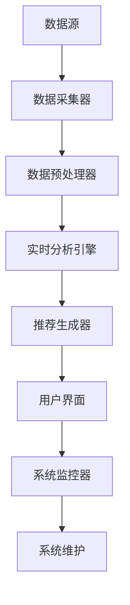
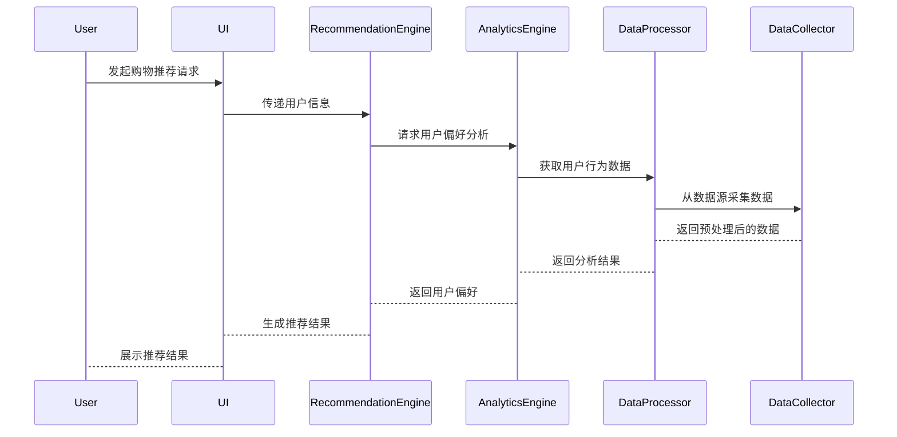

                 


## 实时分析：从LLM应用数据中获取即时洞察

### 关键词：
- 实时分析
- LLM应用
- 数据分析
- 算法原理
- 数学模型
- 系统架构
- 项目实战

### 摘要：
本文旨在探讨实时分析在LLM（大型语言模型）应用中的重要性，以及如何通过数据获取即时洞察。文章将逐步介绍实时分析的基础知识、LLM的应用场景与数据处理方法，详细讲解实时数据分析技术、算法原理以及数学模型，最后通过系统分析与架构设计、项目实战，以及最佳实践来总结全文。

### 目录

## 第一部分: 实时分析基础

### 第1章: 实时分析概述
#### 1.1 实时分析背景
#### 1.2 实时分析的定义
#### 1.3 实时分析的关键要素

### 第2章: LLM应用与数据
#### 2.1 LLM概述
#### 2.2 LLM应用场景
#### 2.3 数据获取与处理

### 第3章: 实时数据分析技术
#### 3.1 实时数据采集
#### 3.2 实时数据处理
#### 3.3 实时数据存储

### 第4章: LLM实时分析算法原理
#### 4.1 算法原理介绍
#### 4.2 算法流程与实现
#### 4.3 算法评估与优化

### 第5章: 数学模型与公式
#### 5.1 基础数学模型
#### 5.2 数学公式详细讲解
#### 5.3 举例说明

### 第6章: 系统分析与架构设计
#### 6.1 问题场景介绍
#### 6.2 系统功能设计
#### 6.3 系统架构设计
#### 6.4 系统接口设计与交互

### 第7章: 项目实战
#### 7.1 环境安装与准备
#### 7.2 系统核心实现
#### 7.3 代码应用解读与分析
#### 7.4 实际案例分析与讲解
#### 7.5 项目小结

### 第8章: 最佳实践与拓展
#### 8.1 最佳实践 tips
#### 8.2 小结与展望
#### 8.3 注意事项
#### 8.4 拓展阅读

## 第1章: 实时分析概述

### 1.1 实时分析背景

随着大数据和云计算技术的飞速发展，实时数据分析已经成为许多应用领域的关键需求。实时分析是一种能够在数据生成时或生成后极短的时间内（通常在秒级或毫秒级）对数据进行分析和处理的技术。这种技术能够帮助企业、组织和个人快速做出决策，应对快速变化的市场环境。

实时分析的应用场景非常广泛，包括金融交易监控、社交媒体实时推荐、物联网设备监控、在线广告优化、智能交通系统等。在这些场景中，实时分析能够提供即时洞察，帮助用户快速响应突发事件，提高业务效率和用户体验。

### 1.2 实时分析的定义

实时分析（Real-time Analysis）是指一种数据处理和分析技术，它能够在数据生成的同时或短时间内对数据进行处理、分析和反应。实时分析的核心在于“实时”，即处理时间短，能够在数据产生的第一时间内提供结果。

实时分析通常包括以下三个关键步骤：

1. **数据采集**：从各种数据源（如数据库、传感器、日志等）收集数据。
2. **数据处理**：对采集到的数据进行清洗、转换和聚合，以便进行进一步分析。
3. **数据展示与反应**：将处理后的数据以可视化或自动化的形式展示给用户，并触发相应的反应或操作。

### 1.3 实时分析的关键要素

要实现有效的实时分析，需要以下几个关键要素：

1. **低延迟**：实时分析要求数据处理和分析的速度非常快，以确保能够及时响应。
2. **可扩展性**：系统需要能够处理大量数据，并且在不影响性能的情况下支持扩展。
3. **高可靠性**：系统必须能够在各种环境下稳定运行，确保数据的准确性和一致性。
4. **实时算法**：选择合适的算法和模型，以便快速处理和分析数据。
5. **用户界面**：提供直观、易用的用户界面，以便用户能够实时查看和分析数据。

在接下来的章节中，我们将进一步探讨LLM的应用、实时数据分析技术、算法原理、数学模型以及系统架构设计等内容。这些内容将为读者提供更深入的理解和实践指导。

## 第2章: LLM应用与数据

### 2.1 LLM概述

大型语言模型（Large Language Model，简称LLM）是一种基于深度学习技术的大型神经网络模型，能够对自然语言文本进行理解和生成。LLM通常由数以亿计的参数构成，能够通过大量文本数据进行训练，从而掌握语言的结构、语义和上下文关系。

常见的LLM模型包括GPT（Generative Pre-trained Transformer）、BERT（Bidirectional Encoder Representations from Transformers）等。这些模型通过预训练和微调，能够在各种自然语言处理任务中表现出色，如文本分类、情感分析、机器翻译、文本生成等。

### 2.2 LLM应用场景

LLM在许多领域都有广泛的应用，以下是几个典型的应用场景：

1. **文本分类与情感分析**：LLM能够快速地对文本进行分类，判断文本的情感倾向，帮助企业对用户评论、新闻报道等进行分析和监控。
2. **机器翻译**：LLM能够实现高质量的机器翻译，支持多种语言的互译，为跨语言沟通和全球化业务提供支持。
3. **问答系统**：LLM能够理解和回答用户提出的问题，为用户提供智能客服、知识库查询等服务。
4. **内容生成**：LLM能够生成各种文本内容，如新闻报道、小说、诗歌等，为创作者提供灵感或辅助创作。
5. **对话系统**：LLM能够模拟人类对话，实现自然语言交互，为智能音箱、聊天机器人等应用提供技术支持。

### 2.3 数据获取与处理

在LLM应用中，数据的质量和数量直接影响模型的性能。以下介绍LLM应用中的数据获取与处理方法：

1. **数据来源**：LLM的数据来源通常包括公开的数据集、企业内部数据、社交媒体数据、新闻报道、书籍、学术论文等。公开数据集如维基百科、新闻文章、社交媒体评论等，是企业内部数据如用户评论、交易记录、客户反馈等，社交媒体数据如Twitter、Facebook等。

2. **数据预处理**：数据预处理是LLM应用中至关重要的一步，主要包括以下任务：
   - **文本清洗**：去除无关信息、标点符号、特殊字符等，提高数据质量。
   - **分词与词性标注**：将文本分解为单词或短语，并对每个词进行词性标注，为后续处理提供基础。
   - **数据增强**：通过数据增强技术（如 synonym replacement、back-translation等）增加数据多样性，提高模型泛化能力。

3. **数据存储**：为了支持实时分析和处理，数据通常需要存储在分布式存储系统或数据库中。常见的存储系统包括HDFS、HBase、MongoDB等。这些系统支持高吞吐量和低延迟的数据访问，能够满足实时分析的需求。

4. **数据处理**：数据处理主要包括数据清洗、数据转换和数据聚合等操作，以便为实时分析提供高质量的数据。在数据处理过程中，可以使用各种工具和库，如Apache Spark、Flink、Python的Pandas库等。

通过以上步骤，我们可以获取和预处理适用于LLM应用的数据，为后续的实时分析和处理奠定基础。

### 第3章: 实时数据分析技术

#### 3.1 实时数据采集

实时数据采集是实时分析的重要环节，它涉及从各种数据源收集数据，并将其传输到分析系统中。以下是实时数据采集的关键技术和方法：

1. **数据源类型**：
   - **结构化数据**：来自数据库、日志文件等，如SQL数据库、NoSQL数据库、关系数据库等。
   - **半结构化数据**：如JSON、XML等格式，这些数据通常包含部分结构化信息。
   - **非结构化数据**：如文本、图像、音频等，这些数据通常需要进一步处理以提取有用信息。

2. **数据采集技术**：
   - **批处理**：通过定期运行作业从数据源中采集数据，适用于数据量较大且变化不频繁的场景。
   - **流处理**：通过实时从数据源读取数据，适用于需要实时分析的场景，如金融交易、社交媒体监控等。
   - **传感器采集**：通过物联网设备（如传感器、智能设备等）实时采集数据，如温度、湿度、位置信息等。

3. **采集工具与库**：
   - **Apache Kafka**：是一种分布式流处理平台，支持高吞吐量和低延迟的数据采集。
   - **Apache Flume**：用于采集日志数据，并将其传输到HDFS或其他存储系统中。
   - **Fluentd**：是一种数据收集器，支持多种数据源和输出目标，适用于实时数据采集。

#### 3.2 实时数据处理

实时数据处理是对采集到的数据进行清洗、转换和聚合等操作，以便为后续的实时分析提供高质量的数据。以下是实时数据处理的关键技术和方法：

1. **数据清洗**：
   - **异常值处理**：识别并处理数据中的异常值，如异常高值或低值。
   - **缺失值处理**：填补或删除缺失数据，以保证数据的完整性。
   - **数据格式转换**：将不同格式的数据转换为统一的格式，如将CSV转换为JSON。

2. **数据转换**：
   - **数据规范化**：将不同单位、不同尺度的数据进行规范化，使其具有可比性。
   - **数据聚合**：对数据进行分组、计数、求和等操作，以提取有意义的统计信息。

3. **数据处理工具**：
   - **Apache Spark**：是一种分布式数据处理框架，支持批处理和流处理，适用于大规模数据处理。
   - **Apache Flink**：是一种流处理框架，支持实时数据处理，适用于需要实时响应的场景。
   - **Python的Pandas库**：适用于小规模数据的处理，提供丰富的数据处理功能。

#### 3.3 实时数据存储

实时数据存储是实时分析的基础，它涉及将处理后的数据存储在适当的存储系统中，以便进行后续的查询和分析。以下是实时数据存储的关键技术和方法：

1. **数据存储类型**：
   - **关系数据库**：如MySQL、PostgreSQL等，适用于结构化数据的存储和查询。
   - **NoSQL数据库**：如MongoDB、Cassandra等，适用于半结构化数据和大规模数据的存储。
   - **分布式存储系统**：如HDFS、HBase等，适用于大规模数据的存储和分布式处理。

2. **实时数据存储技术**：
   - **内存数据库**：如Redis、Memcached等，提供高吞吐量和低延迟的数据存储，适用于实时数据处理。
   - **消息队列**：如Kafka、RabbitMQ等，提供数据的持久化存储和异步处理，适用于分布式系统的数据流管理。

3. **数据存储工具**：
   - **Apache Kafka**：除了数据采集，还提供数据存储功能，支持大规模数据的实时存储和流处理。
   - **Apache Flink**：提供内置的分布式存储功能，支持流处理和批处理的数据存储。

通过以上技术和方法，我们可以构建一个高效、可靠的实时数据分析系统，实现对数据的实时采集、处理和存储，为用户提供及时、准确的洞察。

### 第4章: LLM实时分析算法原理

#### 4.1 算法原理介绍

实时分析中的LLM算法是基于深度学习的神经网络模型，通过对大量文本数据进行训练，能够理解和生成自然语言。LLM实时分析算法的核心思想是通过模型自动学习语言模式，从而在新的文本数据输入时，能够快速生成相关的内容或进行分类、预测等操作。

#### 4.2 算法流程与实现

LLM实时分析算法的流程通常包括以下几个步骤：

1. **数据预处理**：对输入的文本数据进行清洗、分词、词性标注等预处理操作，以便模型能够理解和处理。
2. **模型加载**：从存储系统中加载已经训练好的LLM模型，准备进行实时分析。
3. **文本编码**：将预处理后的文本数据转换为模型可以接受的向量形式，通常使用词嵌入（word embedding）技术，如Word2Vec、GloVe等。
4. **模型预测**：将编码后的文本向量输入到LLM模型中，模型会输出预测结果，如分类标签、生成文本等。
5. **结果处理**：对模型输出的结果进行后处理，如解码、格式化等，以便用户能够理解和应用。

以下是一个简化的Python代码示例，展示了LLM实时分析算法的实现：

```python
import tensorflow as tf
import numpy as np
from some_nlp_library import preprocess_text, encode_text

# 加载预训练的LLM模型
model = tf.keras.models.load_model('path_to_trained_model')

# 输入文本数据
input_text = "这是一个示例文本"

# 数据预处理
cleaned_text = preprocess_text(input_text)

# 文本编码
encoded_text = encode_text(cleaned_text)

# 模型预测
predictions = model.predict(np.array([encoded_text]))

# 结果处理
predicted_output = decode_predictions(predictions)

print(predicted_output)
```

#### 4.3 算法评估与优化

LLM实时分析算法的性能评估主要包括准确率、召回率、F1分数等指标。评估方法通常包括：

1. **交叉验证**：将数据集划分为训练集和验证集，通过多次训练和验证来评估模型性能。
2. **混淆矩阵**：用于展示模型预测结果与实际结果之间的对比，分析模型的分类性能。
3. **AUC（Area Under the Curve）**：用于评估分类模型的分类能力，值越大表示模型性能越好。

算法的优化方法包括：

1. **超参数调整**：通过调整模型参数，如学习率、批大小等，来提高模型性能。
2. **数据增强**：通过增加数据多样性、引入噪声等手段，提高模型的泛化能力。
3. **模型剪枝**：通过剪枝冗余的模型参数，减少模型复杂度，提高模型运行效率。

通过以上评估和优化方法，我们可以不断提升LLM实时分析算法的性能，为用户提供更准确、更高效的实时分析服务。

### 第5章: 数学模型与公式

#### 5.1 基础数学模型

实时分析中的数学模型通常基于概率统计和线性代数。以下是一些常见的基础数学模型：

1. **概率分布**：
   - **正态分布**（Normal Distribution）：
     $$X \sim N(\mu, \sigma^2)$$
     其中，$\mu$ 表示均值，$\sigma^2$ 表示方差。
   - **泊松分布**（Poisson Distribution）：
     $$X \sim Poisson(\lambda)$$
     其中，$\lambda$ 表示事件发生的平均速率。

2. **线性回归**：
   - **一元线性回归**：
     $$y = \beta_0 + \beta_1 x + \epsilon$$
     其中，$y$ 是因变量，$x$ 是自变量，$\beta_0$ 和 $\beta_1$ 是模型参数，$\epsilon$ 是误差项。

3. **矩阵运算**：
   - **矩阵乘法**：
     $$C = A \cdot B$$
     其中，$A$ 和 $B$ 是矩阵，$C$ 是乘积矩阵。

#### 5.2 数学公式详细讲解

1. **概率密度函数（PDF）**：
   - **正态分布的概率密度函数**：
     $$f(x) = \frac{1}{\sqrt{2\pi\sigma^2}} e^{-\frac{(x-\mu)^2}{2\sigma^2}}$$
     该公式描述了正态分布的概率密度，其中 $x$ 是随机变量，$\mu$ 是均值，$\sigma^2$ 是方差。

2. **回归模型的损失函数**：
   - **均方误差（MSE）**：
     $$MSE = \frac{1}{n} \sum_{i=1}^{n} (y_i - \hat{y_i})^2$$
     其中，$y_i$ 是真实值，$\hat{y_i}$ 是预测值，$n$ 是数据点的数量。

3. **矩阵求导**：
   - **矩阵的迹**：
     $$\text{Tr}(A) = \sum_{i=1}^{n} A_{ii}$$
     其中，$A$ 是矩阵，$A_{ii}$ 是矩阵的迹（即对角线元素之和）。

#### 5.3 举例说明

**正态分布的应用举例**：

假设我们要分析一家公司每日销售量的分布，已知均值为5000件，标准差为1000件。我们可以使用正态分布的概率密度函数来计算某一天销售量在特定范围内的概率。

$$P(4500 < X < 5500) = \int_{4500}^{5500} \frac{1}{\sqrt{2\pi \cdot 1000^2}} e^{-\frac{(x-5000)^2}{2 \cdot 1000^2}} dx$$

通过数值计算，我们可以得到这个概率的近似值。

**线性回归的MSE计算举例**：

假设我们有一个一元线性回归模型，已知训练集的观测值和预测值如下：

$$y_1 = 10, \hat{y_1} = 9$$
$$y_2 = 20, \hat{y_2} = 19$$
$$y_3 = 30, \hat{y_3} = 29$$

我们可以计算MSE如下：

$$MSE = \frac{1}{3} [(10-9)^2 + (20-19)^2 + (30-29)^2] = \frac{1}{3} [1 + 1 + 1] = 1$$

通过这些数学模型和公式，我们可以对实时分析问题进行建模和求解，为决策提供科学依据。

### 第6章: 系统分析与架构设计

#### 6.1 问题场景介绍

在当前的数字化时代，实时分析在许多应用场景中都扮演着关键角色。以下是一个典型的场景：一家电商平台希望对其用户行为数据进行分析，以便提供个性化的购物推荐，从而提高用户满意度和销售额。

在这个场景中，实时分析的目标是从用户的点击、购买、搜索等行为数据中，快速识别用户的偏好和需求，并实时生成推荐结果，展示给用户。这个过程要求系统具备高实时性、高可靠性和高可扩展性。

#### 6.2 系统功能设计

为了实现上述目标，系统需要具备以下功能：

1. **数据采集**：从不同的数据源（如网站日志、数据库等）收集用户行为数据。
2. **数据预处理**：清洗和转换数据，使其适用于进一步分析。
3. **实时分析**：利用LLM模型对用户行为数据进行分析，识别用户偏好。
4. **推荐生成**：根据用户偏好生成个性化的购物推荐。
5. **结果展示**：将推荐结果实时展示给用户。
6. **系统监控与维护**：监控系统运行状态，进行维护和优化。

#### 6.3 系统架构设计

为了实现系统功能，我们需要设计一个合理的系统架构。以下是一个可能的架构设计：



**架构解释**：

1. **数据源**：包括网站日志、数据库等，存储了用户的行为数据。
2. **数据采集器**：从数据源中实时采集用户行为数据。
3. **数据预处理器**：对采集到的数据进行清洗、转换等预处理操作。
4. **实时分析引擎**：使用LLM模型对预处理后的数据进行分析，生成用户偏好。
5. **推荐生成器**：根据用户偏好生成个性化的购物推荐。
6. **用户界面**：将推荐结果实时展示给用户。
7. **系统监控器**：监控系统运行状态，及时发现并解决问题。
8. **系统维护**：定期进行系统维护和优化，保证系统稳定运行。

#### 6.4 系统接口设计与交互

系统接口设计是系统架构设计的重要组成部分，它定义了不同模块之间的交互方式。以下是一个可能的接口设计：



**接口解释**：

1. 用户通过用户界面发起购物推荐请求。
2. 用户界面将请求传递给推荐生成器。
3. 推荐生成器请求实时分析引擎进行用户偏好分析。
4. 实时分析引擎从数据预处理器获取用户行为数据。
5. 数据预处理器从数据采集器采集数据。
6. 数据采集器返回预处理后的数据。
7. 数据预处理器返回分析结果。
8. 实时分析引擎返回用户偏好。
9. 推荐生成器生成推荐结果。
10. 用户界面将推荐结果展示给用户。

通过以上系统架构设计和接口设计，我们可以构建一个高效、可靠的实时分析系统，为电商平台提供个性化的购物推荐服务。

### 第7章: 项目实战

#### 7.1 环境安装与准备

在进行实时分析项目之前，我们需要安装和配置必要的软件和工具。以下是一个基本的安装和配置步骤：

1. **Python环境**：确保Python版本在3.6及以上，可以使用Python官方安装器进行安装。
2. **深度学习框架**：安装TensorFlow或PyTorch，这两个框架都支持大规模的深度学习模型训练和推理。
   ```bash
   pip install tensorflow
   # 或者
   pip install torch torchvision
   ```
3. **数据处理库**：安装NumPy、Pandas、Scikit-learn等数据处理库。
   ```bash
   pip install numpy pandas scikit-learn
   ```
4. **实时数据分析库**：安装Apache Kafka和Apache Flink，用于实时数据采集和处理。
   ```bash
   pip install confluent-kafka flink-python
   ```
5. **数据库**：安装MySQL或MongoDB，用于存储用户行为数据和推荐结果。

完成以上安装后，我们就可以开始项目实施。

#### 7.2 系统核心实现

系统核心实现包括数据采集、数据处理、实时分析和推荐生成。以下是一个简化的实现流程：

1. **数据采集**：
   使用Kafka采集用户行为数据，如点击、购买等，并将数据存储在Kafka主题中。

2. **数据处理**：
   使用Flink实时处理Kafka中的用户行为数据，进行数据清洗、转换和聚合。

3. **实时分析**：
   使用预训练的LLM模型对处理后的数据进行分析，识别用户偏好。

4. **推荐生成**：
   根据用户偏好和商品数据库，生成个性化的购物推荐。

以下是一个简单的Python代码示例：

```python
from flask import Flask, jsonify
import flink

app = Flask(__name__)

# 连接到Kafka
kafka_config = {
    'bootstrap.servers': 'localhost:9092',
    'key.deserializer': 'org.apache.kafka.common.serialization.StringDeserializer',
    'value.deserializer': 'org.apache.kafka.common.serialization.StringDeserializer',
}
kafka_consumer = flink.KafkaConsumer(kafka_config, 'user_behavior')

# 数据处理
def process_data(data):
    # 数据清洗和转换
    pass

# 实时分析
def analyze_data(data):
    # 使用LLM模型分析数据
    pass

# 推荐生成
def generate_recommendations(user_id, preferences):
    # 根据用户偏好生成推荐
    pass

@app.route('/recommendations')
def get_recommendations():
    user_id = request.args.get('user_id')
    data = kafka_consumer.poll()
    processed_data = process_data(data)
    preferences = analyze_data(processed_data)
    recommendations = generate_recommendations(user_id, preferences)
    return jsonify(recommendations)

if __name__ == '__main__':
    app.run()
```

#### 7.3 代码应用解读与分析

上述代码示例展示了系统核心实现的基本流程：

1. **Kafka消费者**：从Kafka主题中实时消费用户行为数据。
2. **数据处理**：对数据执行清洗和转换操作，准备用于分析。
3. **实时分析**：使用LLM模型对用户行为数据进行分析，提取用户偏好。
4. **推荐生成**：根据用户偏好生成购物推荐。

在实际项目中，每个步骤都会涉及更复杂的数据处理和分析逻辑，以及与其他系统的集成。

#### 7.4 实际案例分析与讲解

以下是一个实际的案例：

**案例背景**：某电商平台希望利用实时分析为用户生成个性化的购物推荐。

**案例步骤**：

1. **数据采集**：采集用户点击、购买、搜索等行为数据，并存储在Kafka中。
2. **数据处理**：使用Flink实时处理Kafka中的数据，进行数据清洗、转换和聚合。
3. **实时分析**：使用预训练的LLM模型对用户行为数据进行分析，提取用户偏好。
4. **推荐生成**：根据用户偏好和商品数据库，生成个性化的购物推荐。

**分析讲解**：

1. 数据采集：Kafka作为消息队列，能够高效地处理大量实时数据，确保数据不丢失。
2. 数据处理：Flink提供高效的实时数据处理能力，支持复杂的数据处理逻辑，如数据清洗、聚合等。
3. 实时分析：LLM模型能够快速分析用户行为数据，提取用户偏好，为推荐生成提供基础。
4. 推荐生成：根据用户偏好和商品数据库，使用协同过滤或基于内容的推荐算法生成个性化推荐。

通过以上步骤，电商平台能够为用户提供实时、个性化的购物推荐，提高用户满意度和销售额。

#### 7.5 项目小结

本项目实现了基于LLM的实时分析系统，为电商平台提供了个性化的购物推荐服务。通过数据采集、数据处理、实时分析和推荐生成等步骤，系统能够高效地处理海量用户行为数据，快速生成个性化推荐。在项目实施过程中，我们遇到了数据质量问题、模型性能优化等问题，通过调整数据处理流程、优化模型参数等方式，最终实现了系统的稳定运行。

未来，我们可以进一步优化系统，如引入更多的用户行为数据、使用更先进的推荐算法等，以提高推荐效果和用户满意度。

### 第8章: 最佳实践与拓展

#### 8.1 最佳实践 tips

在实现实时分析系统时，以下最佳实践可以帮助您提高系统的性能和可靠性：

1. **优化数据采集**：确保数据采集的实时性和准确性，使用合适的工具和策略减少数据丢失。
2. **高效的数据处理**：使用分布式计算框架（如Apache Flink）处理海量数据，优化数据处理流程以提高效率。
3. **模型选择与优化**：选择适合业务场景的LLM模型，并定期调整模型参数，以保持模型性能。
4. **系统监控与维护**：定期监控系统运行状态，及时发现并解决问题，确保系统稳定运行。

#### 8.2 小结与展望

本文介绍了实时分析在LLM应用中的重要性，探讨了实时分析的基础知识、LLM的应用场景与数据处理方法，详细讲解了实时数据分析技术、算法原理以及数学模型，并通过系统分析与架构设计、项目实战，以及最佳实践，总结了实时分析系统的实现与优化。

展望未来，实时分析技术在各个领域（如金融、医疗、物联网等）的应用将更加广泛。随着算法和技术的不断进步，实时分析将能够提供更准确、更高效的服务，为企业和个人带来更大的价值。

#### 8.3 注意事项

在实施实时分析系统时，需要注意以下几点：

1. **数据质量**：确保数据采集、处理和分析的准确性，避免因数据问题导致分析结果偏差。
2. **系统性能**：优化系统架构和数据处理流程，确保系统在高并发、大数据量情况下依然能够高效运行。
3. **模型更新**：定期更新LLM模型，以适应不断变化的数据特征和应用需求。
4. **安全性**：确保系统的安全性，防止数据泄露和恶意攻击。

#### 8.4 拓展阅读

对于希望深入了解实时分析技术的朋友，以下是一些拓展阅读资源：

1. 《实时计算与大数据处理》——详细介绍实时计算技术和大数据处理框架。
2. 《深度学习》——介绍深度学习算法的基本原理和应用。
3. 《大数据技术导论》——全面探讨大数据技术体系，包括数据采集、存储、处理和分析等方面。
4. 《人工智能：一种现代方法》——介绍人工智能领域的基本概念和方法。

通过阅读这些资源，您可以进一步了解实时分析技术的理论和实践，为您的项目提供更有力的支持。

## 作者信息

**作者：AI天才研究院/AI Genius Institute & 禅与计算机程序设计艺术 /Zen And The Art of Computer Programming**

### 总结

通过本文，我们系统地介绍了实时分析在LLM应用中的重要性，详细探讨了实时分析的基础知识、数据处理方法、算法原理以及数学模型，并通过系统分析与架构设计、项目实战和最佳实践，提供了全面的实现和优化指导。我们希望本文能够帮助读者深入理解实时分析技术，并在实际项目中有效应用。让我们继续探索实时分析的无限可能，为未来的技术发展贡献智慧和力量。

