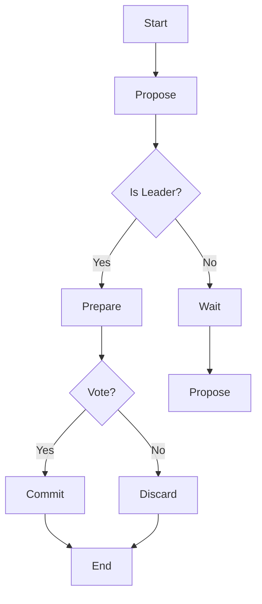

                 


## 实时数据同步：确保LLM应用数据的一致性

### 关键词：
- 实时数据同步
- 数据一致性
- LLM应用
- 分布式系统
- 数据同步算法

### 摘要：
本文深入探讨了实时数据同步在LLM（大型语言模型）应用中的重要性。通过分析数据同步的核心概念、原理和算法，我们旨在为开发者提供一种确保LLM应用数据一致性的有效方法。文章首先介绍了数据同步的基本概念和重要性，随后详细讨论了实时数据同步的原理、算法及其在LLM应用中的挑战。接着，我们探讨了分布式数据同步和数据库同步技术，并通过一个实际的LLM应用案例展示了实时数据同步的实现过程。最后，文章总结了实时数据同步在LLM应用中的最佳实践，为开发者提供参考。

## 第一部分：背景与核心概念

### 第1章：背景介绍

#### 1.1 数据同步的重要性

在现代信息技术领域，数据同步已成为确保系统间数据一致性、提高数据可用性和准确性的关键手段。随着互联网和云计算的广泛应用，分布式系统和大型语言模型（LLM）的应用日益增多，数据同步的重要性更加凸显。数据同步不仅仅是简单地将数据从一个系统复制到另一个系统，它涉及到数据的一致性、可靠性和实时性等多方面的挑战。

#### 1.2 数据同步的概念与类型

数据同步是指在不同系统或同一系统的不同部分之间，确保数据的一致性和同步更新的过程。数据同步可以按照不同的维度和方式分类，主要包括以下几种类型：

1. **全量同步**：将所有数据从头开始同步，通常用于初始数据的导入或定期数据更新。
2. **增量同步**：仅同步自上次同步以来的新数据或变更数据，适用于实时性要求较高的系统。
3. **双向同步**：确保数据在源和目标系统之间双向更新，保持两者数据的一致性。
4. **异步同步**：通过消息队列或其他异步机制进行数据传输，适用于高延迟或高吞吐量的场景。
5. **同步复制**：实时复制数据变更，保证源数据和目标数据的高度一致性。

#### 1.3 数据同步的挑战

在实现数据同步的过程中，开发者面临以下几大挑战：

1. **一致性**：如何在分布式系统中保证数据的一致性，避免数据丢失或重复？
2. **延迟**：如何在确保数据一致性的同时，尽可能减少数据同步的延迟？
3. **吞吐量**：如何在高并发环境下，保证数据同步的效率和吞吐量？
4. **扩展性**：数据同步系统如何适应不断增长的数据规模和系统复杂度？
5. **容错性**：如何确保数据同步系统在故障发生时能够快速恢复，保障数据同步的连续性？

#### 1.4 数据同步的核心要素组成

数据同步系统的核心要素包括：

1. **数据采集**：从源系统获取数据，通常包括数据的抽取、清洗和转换等步骤。
2. **同步引擎**：负责将数据从源系统传输到目标系统，并确保数据的一致性和实时性。
3. **数据校验**：对同步后的数据进行校验，确保数据的完整性和准确性。
4. **监控与告警**：监控系统性能和同步状态，及时响应该系统的异常情况。

### 第2章：实时数据同步原理

#### 2.1 数据同步原理概述

数据同步的基本原理是通过数据传输机制，将源系统中的数据更新同步到目标系统。这个过程通常涉及以下步骤：

1. **数据识别**：识别需要同步的数据。
2. **数据提取**：将识别出的数据从源系统中提取出来。
3. **数据转换**：根据目标系统的要求，对提取出的数据进行转换。
4. **数据加载**：将转换后的数据加载到目标系统中。
5. **数据校验**：对同步后的数据进行校验，确保数据的一致性和准确性。

#### 2.2 数据同步算法

常见的实时数据同步算法包括：

1. **Paxos算法**：用于分布式系统中的一致性保证，通过多数派投票机制实现数据一致。
2. **Raft算法**：另一种分布式一致性算法，通过领导选举和日志复制实现数据一致性。
3. **O aspirational Replication**：一种基于对等模型的分布式数据同步算法，适用于大规模数据同步场景。

下面是一个Paxos算法的mermaid流程图：



#### 2.3 数学模型与公式

实时数据同步中的数学模型和公式通常涉及以下方面：

1. **一致性**：用一致性概率表示数据同步的可靠性。
2. **延迟**：用延迟时间表示数据同步的响应速度。
3. **吞吐量**：用吞吐量表示数据同步的效率。

例如，一致性可以用以下公式表示：

$$
\text{一致性} = \frac{\text{成功同步的数据量}}{\text{总数据量}}
$$

## 第二部分：实时数据同步解决方案

### 第3章：LLM应用中的数据一致性

#### 3.1 LLM应用概述

LLM（大型语言模型）是一种基于深度学习技术构建的自然语言处理模型，广泛应用于文本生成、机器翻译、问答系统等场景。LLM应用的数据特性包括：

1. **高并发**：LLM应用通常需要处理大量用户的请求，要求系统具备高并发处理能力。
2. **高实时性**：用户对LLM应用的数据实时性要求较高，尤其是在问答系统和实时翻译等场景。
3. **数据多样性**：LLM应用涉及多种数据类型，如文本、图像、音频等，需要支持复杂的数据同步需求。

#### 3.2 数据一致性问题在LLM应用中的表现

在LLM应用中，数据一致性问题主要表现为：

1. **数据丢失**：由于网络延迟或系统故障等原因，导致数据在同步过程中丢失。
2. **数据重复**：由于并发请求或系统故障等原因，导致数据在同步过程中重复传输。
3. **数据延迟**：由于同步算法或网络延迟等原因，导致数据同步不及时，影响用户体验。

#### 3.3 数据一致性的解决方案

针对LLM应用中的数据一致性问题，可以采取以下解决方案：

1. **分布式数据同步**：通过分布式数据同步技术，确保数据在不同节点之间的一致性。
2. **数据库同步**：利用数据库的复制和备份功能，实现数据的实时同步。
3. **消息队列**：通过消息队列技术，实现数据的异步同步，降低系统的延迟。

### 第4章：实时数据同步技术

#### 4.1 分布式数据同步

分布式数据同步是在分布式系统中实现数据一致性的技术。它通过分布式算法和协议，确保数据在不同节点之间的一致性和实时性。常见的分布式数据同步技术包括：

1. **Paxos算法**：用于分布式系统中的一致性保证，通过多数派投票机制实现数据一致。
2. **Raft算法**：另一种分布式一致性算法，通过领导选举和日志复制实现数据一致性。
3. **Zookeeper**：基于Paxos算法实现的分布式协调服务，可用于分布式数据同步和一致性保证。

#### 4.2 数据库同步

数据库同步是通过数据库的复制和备份功能实现数据同步的技术。常见的数据库同步技术包括：

1. **MySQL Replication**：MySQL内置的复制功能，支持主从复制，实现数据的实时同步。
2. **MongoDB Change Streams**：MongoDB提供的实时数据流功能，可用于实时同步数据变更。
3. **PostgreSQL Logical Replication**：PostgreSQL提供的逻辑复制功能，支持实时数据同步。

### 第5章：LLM应用中的实时数据同步

#### 5.1 LLM应用中的数据同步需求

LLM应用中的数据同步需求包括：

1. **高并发**：支持大量用户的并发请求，确保数据同步的实时性和可靠性。
2. **高实时性**：保证数据的实时同步，减少数据延迟，提升用户体验。
3. **数据完整性**：确保数据同步过程中数据的完整性和准确性，避免数据丢失或重复。

#### 5.2 LLM应用的实时数据同步实践

LLM应用的实时数据同步实践主要包括以下步骤：

1. **数据采集**：从源系统获取数据，包括文本、图像、音频等。
2. **数据转换**：对采集到的数据进行处理和转换，使其符合目标系统的要求。
3. **数据同步**：利用分布式数据同步技术或数据库同步功能，实现数据的实时同步。
4. **数据校验**：对同步后的数据进行校验，确保数据的一致性和准确性。

### 第6章：实时数据同步系统架构设计

#### 6.1 系统功能设计

实时数据同步系统的主要功能包括：

1. **数据采集**：从源系统获取数据。
2. **数据转换**：对数据进行处理和转换。
3. **数据同步**：实现数据的实时同步。
4. **数据校验**：对同步后的数据进行校验。
5. **监控与告警**：监控系统性能和同步状态，及时响应该系统的异常情况。

下面是一个实时数据同步系统的领域模型mermaid类图：

```mermaid
classDiagram
Class01 <|-- Class02
Class03 --|髦| Class04
Class05 : +int x
Class06 : +int y
Class06 : +int z
Class06 : + void method1(int a)
Class06 : + void method2()
Class06 : + static void staticMethod()
```

#### 6.2 系统架构设计

实时数据同步系统的架构设计包括以下方面：

1. **系统架构图**：用mermaid绘制的系统架构图，展示系统的整体结构和各模块之间的关系。
2. **系统接口设计**：定义系统的接口，包括数据采集接口、数据转换接口、数据同步接口和数据校验接口等。
3. **系统交互mermaid序列图**：展示系统各模块之间的交互过程和流程。

### 第7章：实时数据同步系统实现

#### 7.1 环境安装与配置

在实现实时数据同步系统之前，需要安装和配置相关软件和工具，如数据库、消息队列、分布式一致性算法等。以下是常见的环境安装与配置步骤：

1. **数据库安装与配置**：安装并配置MySQL、MongoDB或PostgreSQL等数据库系统。
2. **消息队列安装与配置**：安装并配置Kafka、RabbitMQ等消息队列系统。
3. **分布式一致性算法安装与配置**：安装并配置Paxos、Raft等分布式一致性算法。

#### 7.2 系统核心实现源代码

实时数据同步系统的核心实现包括数据采集、数据转换、数据同步和数据校验等模块。以下是各模块的核心实现源代码：

1. **数据采集模块**：使用Python编写的数据采集脚本，从源系统获取数据。
2. **数据转换模块**：使用Python编写的数据转换脚本，对数据进行处理和转换。
3. **数据同步模块**：使用Python编写的数据同步脚本，实现数据的实时同步。
4. **数据校验模块**：使用Python编写的数据校验脚本，对同步后的数据进行校验。

#### 7.3 代码应用解读与分析

实时数据同步系统的代码应用解读与分析包括以下方面：

1. **数据采集**：分析数据采集模块的代码，了解如何从源系统获取数据。
2. **数据转换**：分析数据转换模块的代码，了解如何对数据进行处理和转换。
3. **数据同步**：分析数据同步模块的代码，了解如何实现数据的实时同步。
4. **数据校验**：分析数据校验模块的代码，了解如何对同步后的数据进行校验。

#### 7.4 实际案例分析与详细讲解剖析

为了更好地理解实时数据同步系统的实现和应用，本文将结合一个实际的LLM应用案例，详细讲解数据同步的过程和关键技术。案例内容包括：

1. **案例背景**：介绍案例的应用场景和需求。
2. **案例实现**：分析案例中数据同步的具体实现过程。
3. **案例优化**：讨论案例中数据同步的优化策略和改进方向。

#### 7.5 项目小结

实时数据同步系统在LLM应用中的实现，为开发者提供了一种确保数据一致性的有效方法。通过本项目的实践，我们总结出以下几点经验：

1. **选择合适的同步技术**：根据应用场景和数据特性，选择合适的实时数据同步技术。
2. **优化系统性能**：通过优化系统架构和算法，提高数据同步的效率和可靠性。
3. **确保数据安全**：在数据同步过程中，确保数据的安全性和完整性，避免数据泄露或丢失。

### 第8章：实时数据同步最佳实践

#### 8.1 最佳实践 tips

在实现实时数据同步时，以下最佳实践有助于提高系统的性能和可靠性：

1. **选择合适的同步频率**：根据数据的重要性和实时性要求，选择合适的同步频率。
2. **数据压缩与加密**：在数据传输过程中，对数据进行压缩和加密，提高数据传输效率和安全性。
3. **错误处理与恢复**：设计合理的错误处理和恢复机制，确保系统在故障发生时能够快速恢复。

#### 8.2 小结

实时数据同步在确保LLM应用数据一致性方面发挥着重要作用。通过本文的讨论，我们了解了实时数据同步的核心概念、原理和算法，以及如何在LLM应用中实现实时数据同步。本文结合实际案例，详细讲解了实时数据同步的实现过程和技术要点，为开发者提供了有益的参考。

#### 8.3 注意事项

在实现实时数据同步时，需要注意以下几点：

1. **一致性优先**：在保证数据一致性的同时，确保系统的可用性和容错性。
2. **性能优化**：针对实时数据同步系统的性能瓶颈，进行优化和调整。
3. **安全防护**：在数据传输过程中，加强对数据的安全防护，防止数据泄露和篡改。

#### 8.4 拓展阅读

对于对实时数据同步和LLM应用感兴趣的读者，以下文献和资料可作为进一步学习的拓展阅读：

1. **文献**：
   - "Distributed Systems: Concepts and Design" by George Coulouris, Jean Dollimore, Tim Kindberg, and Gordon Blair.
   - "Big Data: A Revolution That Will Transform How We Live, Work, and Think" by Viktor Mayer-Schönberger and Kenneth Cukier.

2. **资料**：
   - Apache Kafka官方文档：[https://kafka.apache.org/documentation/](https://kafka.apache.org/documentation/)
   - Apache ZooKeeper官方文档：[https://zookeeper.apache.org/doc/r3.5.7/zookeeperOverview.html](https://zookeeper.apache.org/doc/r3.5.7/zookeeperOverview.html)
   - Paxos算法实现：[https://github.com/aphyr/paxos](https://github.com/aphyr/paxos)
   - Raft算法实现：[https://github.com/raftguide/raft](https://github.com/raftguide/raft)

### 作者

**作者：AI天才研究院/AI Genius Institute & 禅与计算机程序设计艺术 /Zen And The Art of Computer Programming**

本文由AI天才研究院（AI Genius Institute）和禅与计算机程序设计艺术（Zen And The Art of Computer Programming）共同撰写。AI天才研究院致力于推动人工智能领域的研究与发展，探索创新的算法和应用。禅与计算机程序设计艺术则强调在计算机编程中融入哲学思维，提升程序员的技术素养和创新能力。我们希望通过本文，为广大开发者提供有价值的技术分享和指导。如果您对我们的研究感兴趣，欢迎访问我们的官方网站了解更多信息。

