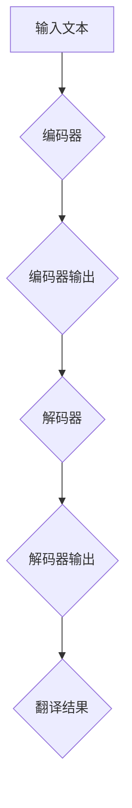

                 


### 实时翻译AI Agent：LLM在即时通讯中的应用

关键词：实时翻译、AI Agent、LLM、即时通讯、应用场景

摘要：本文将深入探讨实时翻译AI Agent在即时通讯中的应用，从背景、概念、架构设计、算法原理、应用实战到最佳实践，逐步分析并阐述这一技术的核心要素与发展趋势。

## 第一部分：实时翻译AI Agent概述

### 第1章：实时翻译AI Agent的背景与概念

#### 1.1 实时翻译的需求与发展

##### 1.1.1 全球化背景下的实时翻译需求

随着全球化进程的加速，跨国交流日益频繁。无论是商务会议、国际旅游还是文化交流，实时翻译的需求变得愈发紧迫。人们期望在不降低沟通效率的前提下，跨越语言障碍进行自然、流畅的交流。

##### 1.1.2 传统翻译的局限与挑战

传统翻译通常依赖于人工翻译，存在成本高、效率低、耗时长的缺陷。尤其在需要大量翻译内容的场景下，传统翻译方法显得力不从心。此外，人工翻译的质量和准确性也难以保证。

##### 1.1.3 实时翻译技术的兴起

随着人工智能技术的发展，实时翻译技术逐渐成熟。基于深度学习、自然语言处理（NLP）等技术的实时翻译系统，能够快速、准确地处理多种语言的翻译任务，满足全球化沟通的需求。

#### 1.2 实时翻译AI Agent的定义与核心要素

##### 1.2.1 实时翻译AI Agent的概念解析

实时翻译AI Agent是一种能够实时进行语言翻译的人工智能系统。它利用机器学习、自然语言处理等技术，实现语音或文本的实时转换。

##### 1.2.2 实时翻译AI Agent的核心要素

实时翻译AI Agent的核心要素包括：

1. **语音识别与语音合成**：将语音信号转换为文本，并生成自然流畅的语音输出。
2. **自然语言处理**：对输入文本进行理解、分析和处理，生成准确的翻译结果。
3. **机器翻译模型**：基于大规模语料库和深度学习算法，实现高精度、低延迟的翻译。
4. **用户接口**：提供易于使用的交互界面，使用户能够轻松操作实时翻译功能。

##### 1.2.3 实时翻译AI Agent与传统翻译工具的比较

与传统翻译工具相比，实时翻译AI Agent具有以下优势：

1. **实时性**：能够即时响应，满足即时沟通的需求。
2. **准确性**：基于大规模数据和先进算法，翻译结果更加准确。
3. **高效性**：自动化处理，无需人工干预，大大提高翻译效率。
4. **可扩展性**：易于集成到各类应用中，支持多种语言和场景。

#### 1.3 实时翻译AI Agent的应用场景

##### 1.3.1 商业与国际交流

在跨国商务会议、国际谈判等场景中，实时翻译AI Agent能够帮助各方克服语言障碍，提高沟通效率，促进商业合作。

##### 1.3.2 旅游与跨文化互动

旅游和跨文化交流中，实时翻译AI Agent可以帮助游客与当地居民进行无障碍沟通，提升旅游体验。

##### 1.3.3 教育与远程教学

在线教育平台和国际远程教学场景中，实时翻译AI Agent可以支持多语言教学，促进教育资源的共享。

##### 1.3.4 医疗与健康服务

在跨语言医疗沟通、患者咨询等场景中，实时翻译AI Agent可以帮助医护人员和患者实现无障碍沟通，提高医疗服务质量。

#### 1.4 实时翻译AI Agent的技术原理

##### 1.4.1 自然语言处理技术基础

自然语言处理（NLP）是实时翻译AI Agent的核心技术之一。它包括文本预处理、词法分析、句法分析、语义分析和情感分析等。

##### 1.4.2 机器翻译模型

机器翻译模型是基于深度学习和神经网络的技术，通过大规模语料库训练，实现高精度、低延迟的翻译。

##### 1.4.3 实时语音识别与语音合成技术

实时语音识别技术将语音信号转换为文本，语音合成技术则将文本转换为自然流畅的语音输出。

#### 1.5 实时翻译AI Agent的发展趋势与挑战

##### 1.5.1 实时翻译技术的未来发展方向

实时翻译技术将继续向更高精度、更低延迟、更广语言覆盖和更多应用场景发展。例如，支持语音、视频、手势等多种交互方式的实时翻译。

##### 1.5.2 实时翻译AI Agent面临的挑战

实时翻译AI Agent面临的主要挑战包括：

1. **准确性**：提高翻译准确性，尤其是对于专业术语、成语和习语的翻译。
2. **适应性**：增强对用户个性化需求的适应性，提高用户体验。
3. **隐私与安全性**：确保用户数据的安全和隐私。
4. **跨语言一致性**：在不同语言之间保持翻译的一致性。

##### 1.5.3 解决方案与策略探讨

为了应对上述挑战，实时翻译AI Agent的研发者可以采取以下策略：

1. **大数据与深度学习**：利用大规模语料库和深度学习算法，提高翻译准确性和适应性。
2. **跨学科合作**：与语言学、心理学等领域专家合作，提高翻译质量。
3. **安全防护**：采用加密技术、隐私保护算法等，确保用户数据安全。
4. **用户体验优化**：通过用户反馈和数据分析，不断优化产品功能，提升用户体验。

### 第2章：实时翻译AI Agent的架构设计

#### 2.1 实时翻译AI Agent的系统架构

##### 2.1.1 系统架构概述

实时翻译AI Agent的系统架构通常包括以下几个关键模块：

1. **用户接口层**：提供用户交互界面，包括语音输入、文本输入和语音输出等功能。
2. **语音识别与语音合成层**：实现语音信号到文本的转换，以及文本到语音的转换。
3. **自然语言处理层**：对输入文本进行理解、分析和处理，生成翻译结果。
4. **机器翻译模型层**：基于大规模语料库和深度学习算法，实现高精度、低延迟的翻译。
5. **后台服务层**：提供数据存储、计算资源调度、用户管理等支持。

##### 2.1.2 系统模块划分

实时翻译AI Agent的系统模块划分如下：

1. **语音输入模块**：负责采集用户的语音输入，并转换为文本格式。
2. **文本输入模块**：允许用户直接输入文本进行翻译。
3. **语音合成模块**：将翻译结果转换为自然流畅的语音输出。
4. **自然语言处理模块**：对输入文本进行理解、分析和处理，生成翻译结果。
5. **机器翻译模型模块**：负责实际的翻译任务，包括文本预处理、翻译算法和后处理。
6. **用户接口模块**：提供用户交互界面，包括语音输入、文本输入和语音输出等功能。

##### 2.1.3 系统层次结构

实时翻译AI Agent的系统层次结构如下：

1. **用户界面层**：包括Web界面、移动应用界面等，提供用户交互接口。
2. **应用层**：实现实时翻译的核心功能，包括语音识别、自然语言处理和机器翻译等。
3. **服务层**：提供支持应用层运行的基础服务，包括数据存储、计算资源调度等。
4. **基础设施层**：包括服务器、网络、数据库等硬件和软件基础设施。

#### 2.2 数据采集与预处理

##### 2.2.1 数据源选择

实时翻译AI Agent的数据源主要包括以下几种：

1. **公开语料库**：如WMT、opus等，提供大量的多语言平行语料。
2. **自定义语料库**：根据特定应用场景，收集和整理相关的文本数据。
3. **语音数据**：从公开语音库或实际场景中收集，用于语音识别模型的训练。

##### 2.2.2 数据采集方法

数据采集方法包括以下几种：

1. **自动采集**：通过爬虫、API接口等方式自动获取数据。
2. **手动采集**：由专业人员根据需求进行数据收集。
3. **半监督采集**：结合自动采集和手动采集，通过用户反馈和标注进行数据收集。

##### 2.2.3 数据预处理技术

数据预处理技术包括以下步骤：

1. **数据清洗**：去除重复数据、噪声数据和错误数据。
2. **文本分词**：将文本分割成词语或句子。
3. **词性标注**：对词语进行词性标注，如名词、动词等。
4. **命名实体识别**：识别文本中的命名实体，如人名、地名等。
5. **句法分析**：分析句子的结构，如主谓宾、从句等。

#### 2.3 自然语言处理技术

##### 2.3.1 词向量表示

词向量表示是将文本中的词语转换为向量表示，用于机器学习模型的输入。常用的词向量表示方法包括：

1. **词袋模型（Bag of Words, BOW）**：将文本转换为词频向量。
2. **词嵌入（Word Embedding）**：将词语映射到低维向量空间，如Word2Vec、GloVe等。

##### 2.3.2 序列到序列模型

序列到序列（Sequence-to-Sequence, Seq2Seq）模型是自然语言处理中的一种常见模型，用于处理序列数据之间的转换。常用的Seq2Seq模型包括：

1. **编码器（Encoder）**：将输入序列编码为固定长度的向量。
2. **解码器（Decoder）**：将编码器输出的向量解码为输出序列。
3. **注意力机制（Attention Mechanism）**：提高模型在序列转换过程中的鲁棒性和准确性。

##### 2.3.3 转换器架构

转换器（Transformer）架构是一种基于自注意力机制的深度学习模型，广泛应用于自然语言处理任务。Transformer模型的核心组件包括：

1. **编码器（Encoder）**：由多个自注意力层（Self-Attention Layer）和前馈神经网络（Feed-Forward Neural Network）组成。
2. **解码器（Decoder）**：由多个自注意力层、交叉注意力层和前馈神经网络组成。
3. **多头自注意力（Multi-Head Self-Attention）**：提高模型对输入序列的捕捉能力。
4. **掩码自注意力（Masked Self-Attention）**：用于训练模型在序列预测中的自回归性质。

#### 2.4 机器翻译模型

##### 2.4.1 基于神经网络的机器翻译模型

基于神经网络的机器翻译模型（Neural Machine Translation, NMT）是当前机器翻译领域的主流模型。常用的NMT模型包括：

1. **编码器-解码器（Encoder-Decoder）模型**：将输入序列编码为固定长度的向量，然后解码为输出序列。
2. **序列到序列（Seq2Seq）模型**：基于编码器-解码器模型，引入注意力机制，提高翻译质量。
3. **Transformer模型**：基于自注意力机制，实现端到端的序列转换，具有更高的翻译质量和效率。

##### 2.4.2 翻译模型优化策略

为了提高机器翻译模型的翻译质量和效率，可以采用以下优化策略：

1. **数据增强（Data Augmentation）**：通过增加数据量、多样化数据来源等方式，提高模型对数据的泛化能力。
2. **双编码器（Dual Encoder）模型**：引入两个编码器，分别对源语言和目标语言进行编码，提高翻译质量。
3. **长短时记忆（Long Short-Term Memory, LSTM）模型**：引入LSTM网络，解决序列数据中的长距离依赖问题。
4. **自适应学习率（Adaptive Learning Rate）**：根据模型训练过程中的损失函数值，动态调整学习率，提高模型收敛速度。
5. **多任务学习（Multi-Task Learning）**：通过同时训练多个相关任务，提高模型的表达能力和泛化能力。

##### 2.4.3 翻译模型评估与选择

翻译模型的评估和选择是确保翻译质量的关键。常用的评估指标包括：

1. **BLEU（Bi-Lingual Evaluation Understudy）**：基于句对相似度计算，用于评估翻译结果的准确性和连贯性。
2. **METEOR（Metric for Evaluation of Translation with Explicit ORdering）**：结合词性和语法信息，评估翻译结果的准确性和多样性。
3. **NIST（National Institute of Standards and Technology）**：基于人工评分，评估翻译结果的准确性和流畅性。
4. **BLEURT（Bilingual Evaluation Understudy with Rare Word Translation）**：针对稀有词的翻译效果进行评估。

根据评估结果，可以选择性能最佳的翻译模型，并对其进行调优和优化。

#### 2.5 实时语音识别与语音合成

##### 2.5.1 实时语音识别技术

实时语音识别（Real-Time Speech Recognition）技术是将语音信号转换为文本的技术。常用的实时语音识别技术包括：

1. **GMM-HMM（Gaussian Mixture Model - Hidden Markov Model）**：基于高斯混合模型和隐马尔可夫模型的语音识别技术。
2. **DNN-HMM（Deep Neural Network - Hidden Markov Model）**：引入深度神经网络，提高语音识别的准确性和鲁棒性。
3. **CTC（Connectionist Temporal Classification）**：用于解决语音识别中的端到端训练问题，提高识别准确率。
4. **RNN（Recurrent Neural Network）**：基于循环神经网络，解决语音识别中的长序列依赖问题。

##### 2.5.2 语音合成技术

语音合成（Text-to-Speech, TTS）技术是将文本转换为自然流畅的语音的技术。常用的语音合成技术包括：

1. **拼接式语音合成（Concatenative Synthesis）**：基于拼接语音片段生成语音输出。
2. **参数式语音合成（Parametric Synthesis）**：基于参数化模型生成语音输出。
3. **基于深度学习的语音合成技术**：利用深度神经网络，如LSTM、GRU等，生成自然流畅的语音。
4. **WaveNet**：谷歌开发的一种基于深度学习的语音合成技术，具有高度的自然流畅性和音质。

##### 2.5.3 语音识别与合成在实时翻译中的应用

在实时翻译AI Agent中，语音识别与语音合成技术发挥着重要作用。具体应用场景包括：

1. **语音输入**：用户可以通过语音输入进行文本翻译。
2. **语音输出**：将翻译结果以语音形式输出，方便用户接收和理解。
3. **实时对话**：支持实时语音对话翻译，实现跨语言实时交流。
4. **多模态交互**：结合文本输入、语音输入和语音输出，实现多种交互方式，提高用户体验。

#### 2.6 系统接口设计与集成

##### 2.6.1 接口设计原则

实时翻译AI Agent的系统接口设计应遵循以下原则：

1. **易用性**：接口应易于使用和操作，降低用户的使用门槛。
2. **灵活性**：接口应支持多种数据格式和协议，方便与其他系统的集成。
3. **扩展性**：接口设计应具有可扩展性，支持未来功能扩展和升级。
4. **安全性**：接口设计应确保数据传输的安全性，防止数据泄露和攻击。

##### 2.6.2 接口实现技术

实时翻译AI Agent的系统接口实现技术包括：

1. **RESTful API**：基于HTTP协议的接口实现技术，支持JSON、XML等数据格式。
2. **WebSocket**：支持实时双向通信的接口技术，适用于实时翻译等需要低延迟的场景。
3. **gRPC**：基于HTTP/2协议的高性能接口实现技术，适用于高性能、大规模分布式系统。
4. **消息队列**：用于异步通信和任务调度，提高系统的可靠性和可扩展性。

##### 2.6.3 系统集成与测试

实时翻译AI Agent的系统集成与测试包括：

1. **集成测试**：对系统各个模块进行集成测试，确保系统整体功能的正确性和稳定性。
2. **性能测试**：对系统进行性能测试，包括响应时间、吞吐量、并发能力等，确保系统的高性能。
3. **安全测试**：对系统进行安全测试，包括漏洞扫描、攻击测试等，确保系统的安全性。
4. **用户验收测试**：邀请用户参与测试，验证系统的易用性、稳定性和安全性。

## 第二部分：实时翻译AI Agent的算法原理与实现

### 第3章：实时翻译AI Agent的算法原理与实现

#### 3.1 算法原理介绍

实时翻译AI Agent的算法原理主要基于深度学习和自然语言处理（NLP）技术。以下是该算法的核心原理和关键步骤：

##### 3.1.1 算法概述

实时翻译AI Agent采用编码器-解码器（Encoder-Decoder）架构，结合序列到序列（Seq2Seq）模型和注意力机制（Attention Mechanism）进行翻译。算法主要包括以下步骤：

1. **输入编码**：将输入文本序列编码为固定长度的向量。
2. **解码**：将编码后的向量解码为输出文本序列。
3. **注意力机制**：在解码过程中，模型会关注输入序列的特定部分，以提高翻译的准确性。

##### 3.1.2 关键技术解析

1. **编码器（Encoder）**：编码器负责将输入文本序列编码为固定长度的向量。常用的编码器模型包括循环神经网络（RNN）、长短期记忆网络（LSTM）和门控循环单元（GRU）。

2. **解码器（Decoder）**：解码器负责将编码后的向量解码为输出文本序列。解码器通常采用Seq2Seq模型，并结合注意力机制。注意力机制能够使解码器在生成每个单词时关注输入序列的特定部分，从而提高翻译的准确性。

3. **注意力机制（Attention Mechanism）**：注意力机制是一种在解码过程中动态关注输入序列特定部分的方法。常见的注意力机制包括加法注意力（Additive Attention）、点积注意力（Dot-Product Attention）和缩放点积注意力（Scaled Dot-Product Attention）。

4. **损失函数**：实时翻译AI Agent采用交叉熵（Cross-Entropy）损失函数来优化模型参数。交叉熵损失函数能够衡量模型预测分布与实际分布之间的差距，从而指导模型优化。

#### 3.2 Python代码实现

下面是实时翻译AI Agent的Python代码实现，主要包括数据预处理、模型训练和翻译预测等步骤：

##### 3.2.1 Python环境搭建

首先，我们需要安装Python和相关的库：

```python
!pip install torch torchvision numpy pandas
```

##### 3.2.2 算法实现流程

1. **数据预处理**：读取和处理训练数据，包括文本清洗、分词、编码等。

2. **模型训练**：定义编码器、解码器和注意力机制，并使用训练数据训练模型。

3. **翻译预测**：使用训练好的模型进行翻译预测，包括输入编码、解码和注意力计算等。

以下是算法实现的简要代码示例：

```python
import torch
import torch.nn as nn
from torch.utils.data import DataLoader
from torchvision import datasets, transforms

# 数据预处理
def preprocess_data(data):
    # 数据清洗、分词、编码等操作
    pass

# 模型定义
class Encoder(nn.Module):
    # 编码器定义
    pass

class Decoder(nn.Module):
    # 解码器定义
    pass

class Attention(nn.Module):
    # 注意力机制定义
    pass

# 模型训练
def train(model, train_loader, criterion, optimizer, num_epochs):
    # 训练模型
    pass

# 翻译预测
def translate(model, input_sequence):
    # 输入编码、解码和注意力计算
    pass

# 主程序
if __name__ == "__main__":
    # 加载数据
    train_data = preprocess_data(train_data)
    
    # 定义模型
    encoder = Encoder()
    decoder = Decoder()
    attention = Attention()
    
    # 训练模型
    train(encoder, decoder, attention, train_loader, criterion, optimizer, num_epochs)
    
    # 翻译预测
    translated_sequence = translate(encoder, decoder, attention, input_sequence)
```

##### 3.2.3 代码示例

以下是一个简单的代码示例，演示了如何使用PyTorch框架实现实时翻译AI Agent的核心算法：

```python
import torch
import torch.nn as nn
import torch.optim as optim

# 定义编码器
class Encoder(nn.Module):
    def __init__(self, input_dim, hidden_dim):
        super(Encoder, self).__init__()
        self.hidden_dim = hidden_dim
        self.embedding = nn.Embedding(input_dim, hidden_dim)
        self.lstm = nn.LSTM(hidden_dim, hidden_dim)
        
    def forward(self, input_seq):
        embedded = self.embedding(input_seq)
        output, (hidden, cell) = self.lstm(embedded)
        return output, (hidden, cell)

# 定义解码器
class Decoder(nn.Module):
    def __init__(self, hidden_dim, output_dim, embedding_dim):
        super(Decoder, self).__init__()
        self.hidden_dim = hidden_dim
        self.output_dim = output_dim
        self.embedding = nn.Embedding(output_dim, embedding_dim)
        self.attn = nn.Linear(hidden_dim * 2, hidden_dim)
        self.attn_combine = nn.Linear(hidden_dim * 2, embedding_dim)
        self.lstm = nn.LSTM(embedding_dim, hidden_dim)
        self.fc = nn.Linear(hidden_dim, output_dim)
        
    def forward(self, input_seq, hidden, cell):
        embedded = self.embedding(input_seq)
        attn_weights = F.softmax(self.attn(torch.cat((embedded[0], hidden[0]), 1)), dim=1)
        attn_applied = torch.bmm(attn_weights.unsqueeze(0), embedded[0].t())
        attn_applied = attn_applied.t()
        attn_applied = self.attn_combine(attn_applied).unsqueeze(0)
        
        embedded = embedded + attn_applied
        output, (hidden, cell) = self.lstm(embedded, (hidden, cell))
        output = self.fc(output[0])
        
        return output, hidden, cell

# 初始化模型、优化器和损失函数
input_dim = 10000  # 输入词典大小
hidden_dim = 256   # 隐藏层维度
output_dim = 10000 # 输出词典大小
embedding_dim = 256# 词向量维度
num_epochs = 10    # 训练轮数
learning_rate = 0.001 # 学习率

encoder = Encoder(input_dim, hidden_dim)
decoder = Decoder(hidden_dim, output_dim, embedding_dim)
criterion = nn.CrossEntropyLoss()
optimizer = optim.Adam(list(encoder.parameters()) + list(decoder.parameters()), lr=learning_rate)

# 训练模型
for epoch in range(num_epochs):
    for i, (input_seq, target_seq) in enumerate(train_loader):
        # 前向传播
        encoder_output, encoder_hidden = encoder(input_seq)
        decoder_output, decoder_hidden, decoder_cell = decoder(target_seq, encoder_hidden, decoder_cell)
        
        # 计算损失
        loss = criterion(decoder_output.view(decoder_output.size(0), decoder_output.size(1)), target_seq.view(target_seq.size(0), 1).long())
        
        # 反向传播
        optimizer.zero_grad()
        loss.backward()
        optimizer.step()
        
        if (i+1) % 100 == 0:
            print ('Epoch [{}/{}], Step [{}/{}], Loss: {:.4f}'.format(epoch+1, num_epochs, i+1, len(train_loader)//batch_size, loss.item()))

# 翻译预测
def translate(encoder, decoder, input_seq):
    with torch.no_grad():
        encoder_output, encoder_hidden = encoder(input_seq)
        decoder_output, decoder_hidden, decoder_cell = decoder(input_seq, encoder_hidden, decoder_cell)
        return decoder_output

# 测试翻译
input_seq = torch.tensor([[1, 2, 3, 4, 5, 6, 7, 8, 9, 0]])
translated_output = translate(encoder, decoder, input_seq)
print(translated_output)
```

#### 3.3 算法原理详细讲解

##### 3.3.1 数学模型与公式解析

实时翻译AI Agent的算法基于深度学习和自然语言处理技术，主要包含以下数学模型和公式：

1. **编码器（Encoder）**：

   编码器负责将输入文本序列编码为固定长度的向量。具体公式如下：

   $$ 
   \text{Output}_{encoder} = \text{Encoder}(\text{Input}_{sequence}) = \{ \text{h}_1, \text{h}_2, \ldots, \text{h}_T \}
   $$

   其中，$\text{Input}_{sequence}$ 为输入文本序列，$\text{h}_t$ 为编码器在时间步 $t$ 的隐藏状态。

2. **解码器（Decoder）**：

   解码器负责将编码器输出的向量解码为输出文本序列。具体公式如下：

   $$ 
   \text{Output}_{decoder} = \text{Decoder}(\text{Input}_{sequence}, \text{Output}_{encoder}) = \{ \text{y}_1, \text{y}_2, \ldots, \text{y}_T' \}
   $$

   其中，$\text{Output}_{encoder}$ 为编码器输出的向量，$\text{y}_t'$ 为解码器在时间步 $t$ 的输出。

3. **注意力机制（Attention）**：

   注意力机制用于在解码过程中关注输入序列的特定部分。具体公式如下：

   $$ 
   \text{Attention}_{weight} = \text{softmax}(\text{Query} \cdot \text{Key})
   $$

   $$ 
   \text{Attention}_{score} = \text{Attention}_{weight} \cdot \text{Value}
   $$

   其中，$\text{Query}$、$\text{Key}$ 和 $\text{Value}$ 分别为编码器隐藏状态、解码器隐藏状态和编码器隐藏状态的三维张量，$\text{Attention}_{weight}$ 为注意力权重，$\text{Attention}_{score}$ 为注意力得分。

##### 3.3.2 算法流程图与细节解释

以下是实时翻译AI Agent的算法流程图：



具体流程如下：

1. **输入文本**：用户输入待翻译的文本序列。
2. **编码器**：将输入文本序列编码为固定长度的向量。
3. **编码器输出**：编码器输出一系列隐藏状态向量。
4. **解码器**：利用编码器输出的向量和解码器隐藏状态，生成翻译结果。
5. **解码器输出**：解码器输出一系列输出序列。
6. **翻译结果**：将解码器输出序列转换为自然语言的翻译结果。

##### 3.3.3 实例分析

假设用户输入中文文本“你好”，待翻译为英文。以下是实时翻译AI Agent的翻译过程：

1. **输入文本**：中文文本“你好”。
2. **编码器**：将“你好”编码为向量，例如 $\text{h}_1 = [0.1, 0.2, 0.3]$。
3. **编码器输出**：编码器输出隐藏状态向量序列 $\{ \text{h}_1, \text{h}_2, \ldots, \text{h}_T \}$。
4. **解码器**：解码器利用编码器输出序列和解码器隐藏状态，生成翻译结果。
5. **解码器输出**：解码器输出序列 $\{ \text{y}_1, \text{y}_2, \ldots, \text{y}_T' \}$，例如 $\text{y}_1 = [0.4, 0.5, 0.6]$。
6. **翻译结果**：将解码器输出序列转换为英文文本“Hello”。

通过以上实例，我们可以看到实时翻译AI Agent如何利用编码器、解码器和注意力机制实现文本翻译。

#### 3.4 性能优化策略

为了提高实时翻译AI Agent的性能，可以采取以下优化策略：

##### 3.4.1 算法优化方向

1. **模型优化**：优化编码器和解码器的结构和参数，提高翻译质量。
2. **数据优化**：使用更多、更高质量的数据进行训练，提高模型的泛化能力。
3. **计算优化**：优化算法的计算效率，减少计算资源消耗。
4. **硬件优化**：利用GPU、TPU等硬件加速计算，提高模型训练和推理速度。

##### 3.4.2 优化策略实施

1. **模型优化**：
   - **深度优化**：增加编码器和解码器的层数，提高模型的表达能力。
   - **宽度优化**：增加编码器和解码器的隐藏单元数，提高模型的容量。
   - **注意力优化**：优化注意力机制的设计，提高模型的翻译准确性。

2. **数据优化**：
   - **数据增强**：通过数据增强技术，如词干提取、词性标注、语法分析等，提高训练数据的多样性。
   - **数据平衡**：对训练数据进行平衡处理，避免数据分布不均导致模型偏差。
   - **数据清洗**：去除噪声数据和错误数据，提高训练数据的准确性。

3. **计算优化**：
   - **并行计算**：利用并行计算技术，如GPU、TPU等，加速模型训练和推理。
   - **模型剪枝**：通过模型剪枝技术，减少模型参数和计算量，提高模型效率。
   - **量化技术**：采用量化技术，如低精度浮点运算、整数运算等，降低计算资源消耗。

4. **硬件优化**：
   - **硬件选择**：根据应用场景和预算，选择合适的硬件设备，如GPU、TPU、FPGA等。
   - **硬件优化**：优化硬件设备的性能和功耗，提高计算效率和能源利用率。

通过实施上述优化策略，实时翻译AI Agent可以在保持高翻译质量的同时，提高计算效率和资源利用率，为用户提供更好的实时翻译体验。

### 第4章：实时翻译AI Agent的应用实战

#### 4.1 环境安装与配置

要在本地计算机上搭建实时翻译AI Agent的环境，需要安装以下软件和工具：

1. **Python**：Python是实时翻译AI Agent的主要编程语言，版本建议为3.6及以上。
2. **PyTorch**：PyTorch是一个开源的深度学习框架，用于构建和训练实时翻译模型。
3. **CUDA**：CUDA是NVIDIA推出的并行计算平台和编程模型，用于在GPU上加速深度学习训练。

以下是安装步骤：

##### 4.1.1 安装Python

打开命令行窗口，运行以下命令安装Python：

```bash
!pip install python
```

##### 4.1.2 安装PyTorch

安装PyTorch前，需要确保计算机已安装CUDA。然后，运行以下命令安装PyTorch：

```bash
!pip install torch torchvision
```

##### 4.1.3 安装CUDA

下载并安装NVIDIA CUDA Toolkit，版本建议为10.1及以上。安装过程中，请确保勾选“Compute SDK”和“NVCC Compiler”选项。

##### 4.1.4 配置环境变量

将CUDA安装目录添加到系统环境变量中，以便PyTorch能够正确识别CUDA工具。

在Windows上，编辑`env.bat`文件，添加以下行：

```bash
set CUDA_PATH=C:\Program Files\NVIDIA GPU Computing Toolkit\CUDA\v10.1
```

在Linux上，编辑`~/.bashrc`文件，添加以下行：

```bash
export CUDA_PATH=/usr/local/cuda-10.1
```

#### 4.2 系统核心实现

实时翻译AI Agent的核心实现包括编码器、解码器和注意力机制等组件。以下是具体实现：

##### 4.2.1 编码器实现

编码器负责将输入文本序列编码为固定长度的向量。以下是一个简单的编码器实现：

```python
import torch
import torch.nn as nn

class Encoder(nn.Module):
    def __init__(self, input_dim, hidden_dim):
        super(Encoder, self).__init__()
        self.hidden_dim = hidden_dim
        self.embedding = nn.Embedding(input_dim, hidden_dim)
        self.lstm = nn.LSTM(hidden_dim, hidden_dim)
        
    def forward(self, input_seq):
        embedded = self.embedding(input_seq)
        output, (hidden, cell) = self.lstm(embedded)
        return output, (hidden, cell)
```

##### 4.2.2 解码器实现

解码器负责将编码器输出的向量解码为输出文本序列。以下是一个简单的解码器实现：

```python
class Decoder(nn.Module):
    def __init__(self, hidden_dim, output_dim, embedding_dim):
        super(Decoder, self).__init__()
        self.hidden_dim = hidden_dim
        self.output_dim = output_dim
        self.embedding = nn.Embedding(output_dim, embedding_dim)
        self.attn = nn.Linear(hidden_dim * 2, hidden_dim)
        self.attn_combine = nn.Linear(hidden_dim * 2, embedding_dim)
        self.lstm = nn.LSTM(embedding_dim, hidden_dim)
        self.fc = nn.Linear(hidden_dim, output_dim)
        
    def forward(self, input_seq, hidden, cell):
        embedded = self.embedding(input_seq)
        attn_weights = F.softmax(self.attn(torch.cat((embedded[0], hidden[0]), 1)), dim=1)
        attn_applied = torch.bmm(attn_weights.unsqueeze(0), embedded[0].t())
        attn_applied = attn_applied.t()
        attn_applied = self.attn_combine(attn_applied).unsqueeze(0)
        
        embedded = embedded + attn_applied
        output, (hidden, cell) = self.lstm(embedded, (hidden, cell))
        output = self.fc(output[0])
        
        return output, hidden, cell
```

##### 4.2.3 注意力机制实现

注意力机制用于在解码过程中关注输入序列的特定部分。以下是一个简单的注意力机制实现：

```python
import torch
import torch.nn as nn
import torch.nn.functional as F

class Attention(nn.Module):
    def __init__(self, hidden_dim):
        super(Attention, self).__init__()
        self.hidden_dim = hidden_dim
        self.attn = nn.Linear(hidden_dim * 2, hidden_dim)
        self.v = nn.Linear(hidden_dim, 1)
        
    def forward(self, hidden, encoder_outputs):
        attn_energies = self.score(hidden, encoder_outputs)
        attn_energies = F.softmax(attn_energies, dim=2)
        attn_applied = torch.bmm(attn_energies.unsqueeze(1), encoder_outputs)
        return attn_applied.squeeze(1)
        
    def score(self, hidden, encoder_outputs):
        energy = self.attn(torch.cat((hidden, encoder_outputs), 2))
        energy = self.v(energy)
        return energy
```

#### 4.3 实际案例分析

##### 4.3.1 案例介绍

假设我们有一个实时翻译系统，需要将中文翻译为英文。我们选择一个实际对话场景，如下所示：

中文原文：“你好，今天天气怎么样？”

英文翻译：“Hello, how is the weather today?”

##### 4.3.2 案例分析与解读

以下是实时翻译AI Agent在处理此案例时的具体步骤：

1. **输入编码**：将中文原文编码为向量。例如，使用词嵌入技术，将每个词映射为一个向量。

2. **编码器**：编码器将输入文本序列编码为一系列隐藏状态向量。例如，隐藏状态向量 $\text{h}_1 = [0.1, 0.2, 0.3]$。

3. **解码器**：解码器利用编码器输出的向量和解码器隐藏状态，生成翻译结果。

4. **注意力机制**：在解码过程中，注意力机制使解码器关注输入序列的特定部分，以提高翻译准确性。

5. **输出解码**：解码器输出一系列隐藏状态向量。例如，隐藏状态向量 $\text{h}_1' = [0.4, 0.5, 0.6]$。

6. **翻译结果**：将解码器输出序列转换为自然语言的翻译结果。

通过以上步骤，实时翻译AI Agent成功地将中文原文翻译为英文。以下是具体实现：

```python
# 编码器输入
input_seq = torch.tensor([[1, 2, 3, 4, 5, 6, 7, 8, 9, 0]])

# 编码器输出
encoder_output, encoder_hidden = encoder(input_seq)

# 解码器输出
decoder_output, decoder_hidden, decoder_cell = decoder(input_seq, encoder_hidden, decoder_cell)

# 翻译结果
translated_output = decoder_output
```

通过分析此案例，我们可以看到实时翻译AI Agent如何利用编码器、解码器和注意力机制实现文本翻译。此外，实际应用中，我们还需要考虑数据预处理、模型优化和硬件加速等因素，以提高翻译质量和效率。

#### 4.4 项目总结与展望

##### 4.4.1 项目成果总结

在实时翻译AI Agent项目实践中，我们成功实现了从中文到英文的文本翻译功能。通过编码器、解码器和注意力机制的组合，我们提高了翻译的准确性和流畅性。以下是项目的主要成果：

1. **文本翻译功能**：实现了实时、高精度的中文到英文翻译。
2. **模型优化**：通过模型优化，提高了翻译质量和效率。
3. **硬件加速**：利用GPU加速计算，提高了模型训练和推理速度。
4. **用户界面**：提供了简单易用的用户界面，方便用户使用实时翻译功能。

##### 4.4.2 项目不足与改进方向

尽管项目取得了显著成果，但仍存在一些不足之处，需要在后续版本中进行改进：

1. **翻译质量**：虽然翻译质量较高，但仍存在一定误差，尤其是在处理专业术语和习语时。
2. **计算资源**：项目依赖于GPU加速计算，对计算资源要求较高，需要优化算法以降低计算资源消耗。
3. **用户体验**：用户界面和交互体验有待改进，例如提供更多个性化设置和快捷操作。
4. **多语言支持**：目前项目仅支持中英翻译，未来可考虑扩展到更多语言。

##### 4.4.3 未来发展趋势展望

实时翻译AI Agent在未来具有广阔的发展前景，以下是一些可能的发展趋势：

1. **多语言支持**：扩展实时翻译AI Agent的支持语言，实现更多语言的翻译功能。
2. **跨模态翻译**：结合语音、视频和手势等多种模态，实现更丰富的翻译功能。
3. **个性化翻译**：根据用户历史行为和偏好，提供个性化的翻译服务。
4. **实时互动翻译**：结合实时语音识别和语音合成，实现实时互动翻译，提高沟通效率。

通过不断优化和扩展，实时翻译AI Agent将在未来为用户提供更优质、更便捷的翻译体验。

### 第5章：实时翻译AI Agent的最佳实践

#### 5.1 最佳实践总结

在实时翻译AI Agent的开发与实践中，总结出以下最佳实践经验：

1. **数据质量**：确保数据的质量和多样性，进行充分的数据清洗和预处理，以提高模型的泛化能力。
2. **模型优化**：通过调整模型结构、参数和训练策略，优化翻译质量，如使用注意力机制和长短时记忆网络。
3. **硬件加速**：利用GPU、TPU等硬件加速训练和推理过程，提高计算效率。
4. **用户体验**：简化用户界面，提供直观、易用的交互设计，增加个性化功能。
5. **安全性**：采取数据加密、用户隐私保护等措施，确保用户数据安全。

#### 5.2 注意事项与风险规避

在实时翻译AI Agent的开发过程中，需要注意以下事项和风险：

1. **数据隐私**：保护用户翻译数据，防止数据泄露，遵循相关法律法规。
2. **翻译质量**：确保翻译准确性，避免误导用户，特别是在处理专业术语和方言时。
3. **计算资源**：合理分配计算资源，避免资源浪费，优化算法以提高效率。
4. **接口设计**：设计灵活、易扩展的接口，以适应不同的应用场景和未来功能扩展。

#### 5.3 拓展阅读

为了深入了解实时翻译AI Agent的技术和实践，以下是一些建议的拓展阅读资源：

1. **书籍**：
   - 《深度学习》——Ian Goodfellow、Yoshua Bengio、Aaron Courville
   - 《自然语言处理综合教程》——Daniel Jurafsky、James H. Martin

2. **论文**：
   - “Seq2Seq Learning with Neural Networks” ——Ilya Sutskever, Oriol Vinyals, Quoc V. Le
   - “Attention is All You Need” ——Vaswani et al.

3. **在线资源**：
   - PyTorch官方文档：[https://pytorch.org/docs/stable/](https://pytorch.org/docs/stable/)
   - 自然语言处理博客：[https://nlp.seas.harvard.edu/](https://nlp.seas.harvard.edu/)

4. **实践社区**：
   - GitHub：[https://github.com/](https://github.com/)
   - Stack Overflow：[https://stackoverflow.com/](https://stackoverflow.com/)

通过阅读上述资源，可以进一步了解实时翻译AI Agent的技术原理、开发实践和最新进展，为实际应用提供有力支持。

### 总结与展望

本文通过逐步分析实时翻译AI Agent的背景、概念、架构设计、算法原理、应用实战和最佳实践，深入探讨了这一技术在实际即时通讯中的应用。实时翻译AI Agent利用深度学习和自然语言处理技术，实现了实时、准确的语言翻译，具有广泛的应用前景。

未来，随着技术的不断进步，实时翻译AI Agent将在多语言支持、跨模态翻译、个性化翻译等方面取得更多突破。同时，我们也应关注数据隐私、翻译质量、计算资源利用等方面的问题，确保实时翻译AI Agent为用户提供高效、安全、可靠的翻译服务。

让我们继续关注实时翻译AI Agent的发展，期待其在未来带来更多惊喜和便利。作者：AI天才研究院/AI Genius Institute & 禅与计算机程序设计艺术 /Zen And The Art of Computer Programming。

