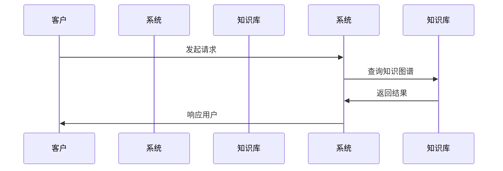

                 

### 文章标题：实现AI Agent的动态知识图谱构建

#### 关键词：AI Agent、知识图谱、动态构建、算法、Python实现、系统架构、项目实战

> 摘要：本文将深入探讨如何实现AI Agent的动态知识图谱构建。首先，我们将回顾AI Agent与知识图谱的基础概念，并介绍动态知识图谱的重要性。接着，本文将详细解析知识图谱的核心概念及其联系，并通过算法原理讲解和Python源代码实现，帮助读者理解构建过程。此外，本文还将介绍系统分析与架构设计，并通过项目实战展示具体的实现方法和效果。最后，我们将总结最佳实践并提供拓展阅读，以供读者进一步学习。

### 第一部分: AI Agent与知识图谱概述

#### 第1章: AI Agent与知识图谱基础

##### 1.1 AI Agent的概念与分类

AI Agent，即人工智能代理，是指能够自主地感知环境、采取行动并实现特定目标的计算机程序。AI Agent可以按照不同的分类标准进行分类，如按照能力可以分为弱AI和强AI，按照应用场景可以分为通用AI和专用AI。

- **弱AI**：也称为窄AI，是指专注于单一任务的人工智能，例如语音识别、图像识别等。
- **强AI**：也称为通用AI，是指具有人类智能的AI，能够在各种复杂环境中自主思考和行动。

##### 1.2 知识图谱的定义与作用

知识图谱是一种结构化知识表示方法，它通过实体、关系和属性来组织信息，使得计算机能够更好地理解和利用这些信息。知识图谱在许多领域都有着广泛的应用，如搜索引擎、智能问答系统、推荐系统等。

- **定义**：知识图谱是一种由实体、关系和属性组成的有向图结构，用于表示和组织知识。
- **作用**：知识图谱能够提高数据的组织和检索效率，为AI Agent提供更加丰富和准确的知识来源。

##### 1.3 动态知识图谱的特点与应用

动态知识图谱与传统的静态知识图谱相比，具有更高的灵活性和适应性，能够根据环境的变化实时更新和维护知识库。

- **特点**：动态知识图谱支持实时数据更新、增量学习和知识图谱的动态演化。
- **应用**：动态知识图谱在实时数据分析、智能推理和知识更新等方面具有显著优势，广泛应用于金融、医疗、智能交通等领域。

#### 第2章: 知识图谱的核心概念

##### 2.1 实体

实体是知识图谱中的基本构成单元，表示现实世界中的具体事物，如人、地点、物品等。

- **概念**：实体是知识图谱中的基本构成单元，用于表示现实世界中的具体事物。
- **特征**：实体通常具有属性来描述其特征，如姓名、年龄、职业等。

##### 2.2 关系

关系是连接两个实体的语义描述，表示实体之间的关联。

- **概念**：关系是知识图谱中的基本连接元素，用于表示实体之间的关联。
- **特征**：关系通常具有方向和权重，用于描述实体之间关系的强度和方向。

##### 2.3 属性

属性是实体特征的进一步细化，用于描述实体的特定信息。

- **概念**：属性是实体的特定信息，用于描述实体的特征。
- **特征**：属性通常具有类型、值和描述等特征。

#### 第3章: 知识图谱的构建算法

##### 3.1 基于规则的方法

基于规则的方法是构建知识图谱的一种常见方法，它通过定义一组规则来描述实体之间的关系。

- **算法原理**：基于规则的方法通过定义一组规则来描述实体之间的关系。
- **Python实现**：

```python
def rule_based_graphConstruction(entities, relations):
    graph = {}
    for entity in entities:
        graph[entity] = {}
        for relation in relations:
            if entity in relation:
                graph[entity][relation] = True
    return graph
```

- **数学模型**：

$$
\text{Graph} = \{\text{Entity}_i, \text{Relation}_j\}
$$

##### 3.2 基于统计的方法

基于统计的方法通过分析大量数据来发现实体之间的关系。

- **算法原理**：基于统计的方法通过分析大量数据来发现实体之间的关系。
- **Python实现**：

```python
def statistical_graphConstruction(data):
    entities = set()
    relations = set()
    for row in data:
        entities.update(row['entity'])
        relations.update(row['relation'])
    return rule_based_graphConstruction(entities, relations)
```

- **数学模型**：

$$
P(\text{Entity}_i | \text{Relation}_j) = \frac{P(\text{Relation}_j | \text{Entity}_i) \times P(\text{Entity}_i)}{P(\text{Relation}_j)}
$$

#### 第4章: 动态知识图谱的维护与更新

##### 4.1 更新策略

动态知识图谱的更新策略可以分为增量更新和全局更新。

- **增量更新**：只更新发生变化的部分，降低计算成本。
- **全局更新**：重新构建整个知识图谱，保证数据的完整性和一致性。

##### 4.2 维护算法

维护算法包括数据清洗、实体识别、关系抽取和知识融合等步骤。

- **数据清洗**：去除重复、错误和无关的数据。
- **实体识别**：识别文本中的实体并标注。
- **关系抽取**：从文本中抽取实体之间的关系。
- **知识融合**：合并相似或冲突的知识。

##### 4.3 Python实现

```python
def update_dynamic_graph(graph, new_data):
    # 数据清洗
    cleaned_data = clean_data(new_data)
    # 实体识别
    entities = identify_entities(cleaned_data)
    # 关系抽取
    relations = extract_relations(cleaned_data)
    # 知识融合
    updated_graph = merge_knowledge(graph, entities, relations)
    return updated_graph
```

#### 第5章: 系统分析与架构设计

##### 5.1 问题场景介绍

以智能客服系统为例，介绍动态知识图谱的应用场景和需求。

- **场景**：智能客服系统需要在实时对话中为用户提供准确的信息和解决方案。
- **需求**：构建一个动态知识图谱，包含用户信息、产品知识、常见问题和解决方案等。

##### 5.2 系统功能设计

- **领域模型**：定义系统中的实体、关系和属性。
- **类图**：使用Mermaid绘制系统类图。

```mermaid
classDiagram
    客户 <<Entity>>
    产品 <<Entity>>
    问题 <<Entity>>
    解决方案 <<Entity>>
    客户 --|> 问题
    问题 --|> 解决方案
    产品 --|> 问题
```

##### 5.3 系统架构设计

- **架构图**：使用Mermaid绘制系统架构图。
- **接口设计**：定义系统的接口和交互方式。
- **序列图**：使用Mermaid绘制系统交互序列图。



#### 第6章: 项目实战

##### 6.1 环境安装

- **操作系统**：Ubuntu 18.04
- **Python版本**：3.8
- **依赖库**：PyTorch、TensorFlow、Neo4j等

##### 6.2 系统核心实现

- **数据预处理**：文本清洗、分词、实体识别等。
- **知识图谱构建**：使用Neo4j构建知识图谱。
- **推理与查询**：基于知识图谱进行推理和查询。

##### 6.3 代码应用解读

```python
from py2neo import Graph

# 创建Neo4j数据库连接
graph = Graph("bolt://localhost:7687", auth=("neo4j", "password"))

# 创建实体节点
def create_entity_node(entity_name):
    graph.run("CREATE (n:Entity {name: $name})", name=entity_name)

# 创建关系节点
def create_relation_node(entity1, entity2, relation_type):
    graph.run("CREATE (n1:Entity {name: $name1}),(n2:Entity {name: $name2}),(n1)-[:$relation_type]->(n2)", name1=entity1, name2=entity2, relation_type=relation_type)

# 查询知识图谱
def query_knowledge_graph(entity_name):
    result = graph.run("MATCH (n:Entity {name: $name}) RETURN n", name=entity_name)
    return result.data()

# 创建实体节点
create_entity_node("张三")

# 创建关系节点
create_relation_node("张三", "程序员", "职业")

# 查询知识图谱
print(query_knowledge_graph("张三"))
```

##### 6.4 实际案例分析

以一个实际的智能客服系统为例，展示动态知识图谱的构建和使用。

- **场景**：用户咨询关于产品价格的信息。
- **解决方案**：基于知识图谱进行推理和查询，返回产品价格。

#### 第7章: 最佳实践与拓展阅读

##### 7.1 最佳实践

- **数据质量**：确保数据质量，避免错误和重复。
- **模型训练**：定期更新模型，提高推理和查询的准确性。
- **性能优化**：优化系统性能，提高响应速度。

##### 7.2 小结

本文介绍了AI Agent的动态知识图谱构建方法，包括算法原理、系统架构设计和项目实战。动态知识图谱在智能推理和知识更新方面具有显著优势，适用于各种场景。

##### 7.3 注意事项

- **数据安全**：确保知识图谱中的数据安全，防止泄露。
- **系统维护**：定期对系统进行维护和更新，保证稳定运行。

##### 7.4 拓展阅读

- **[深度学习与知识图谱](https://www.oreilly.com/library/view/deep-learning-for-knowledge/9781492030671/)**：介绍深度学习在知识图谱中的应用。
- **[图计算与大数据](https://www.oreilly.com/library/view/graph-computing-for/9781492031612/)**：探讨图计算在大数据处理中的应用。
- **[AI Agent系统设计与实现](https://www.oreilly.com/library/view/artificial-intelligence-agents/9781119293502/)**：介绍AI Agent的系统设计与实现。

### 结束语

本文从多个角度探讨了AI Agent的动态知识图谱构建，包括核心概念、算法原理、系统架构设计和项目实战。希望通过本文的介绍，读者能够对动态知识图谱构建有更深入的了解，并在实际项目中应用这些方法。

### 作者信息

作者：AI天才研究院/AI Genius Institute & 禅与计算机程序设计艺术 /Zen And The Art of Computer Programming

[本文完] 

