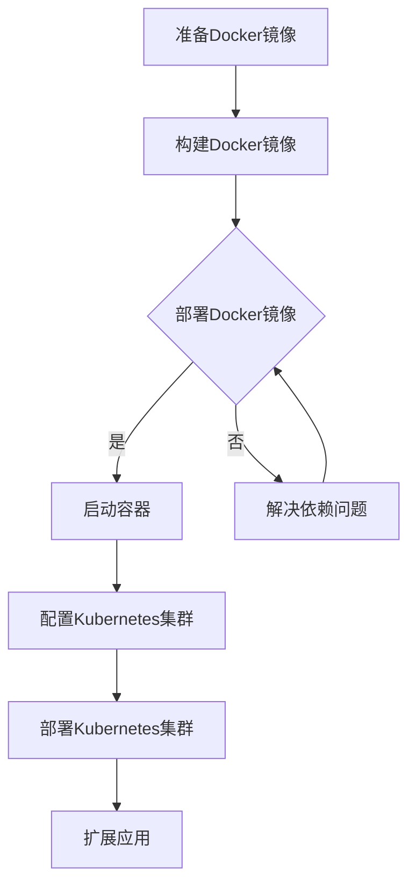
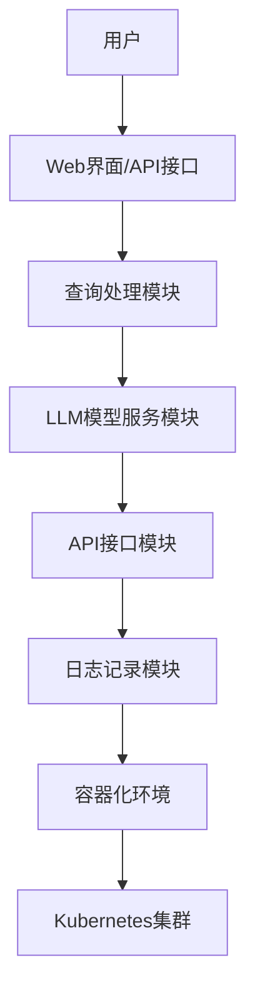
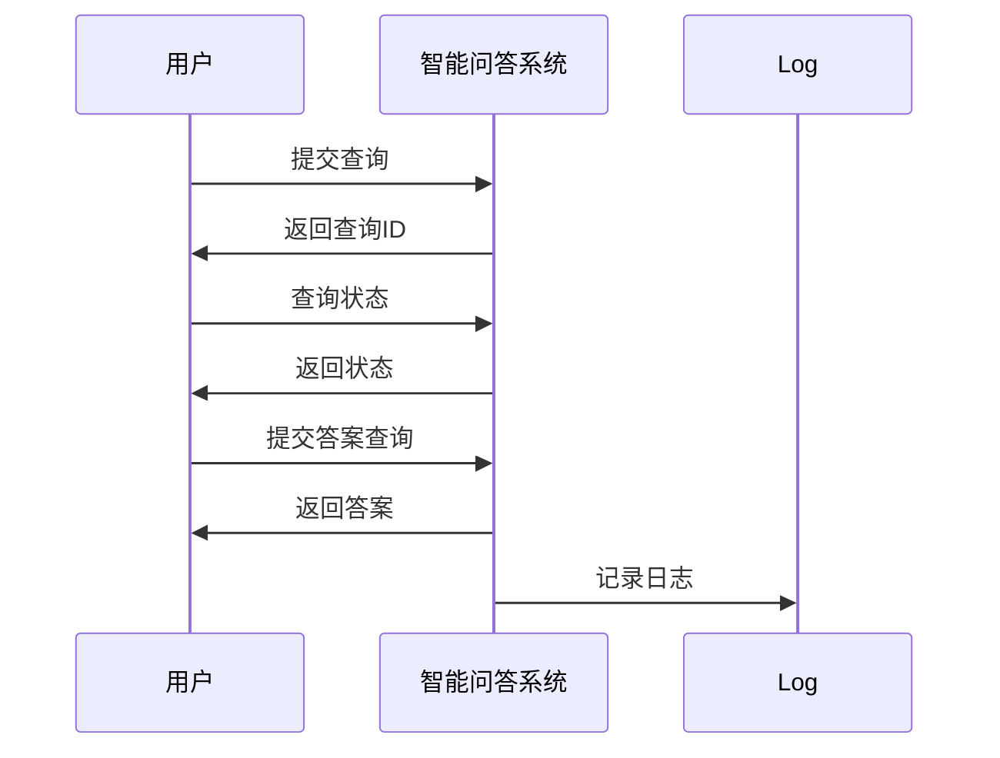

                 

### 容器化技术在LLM应用部署中的优势

关键词：容器化、LLM应用、部署优势、Docker、Kubernetes、微服务架构

摘要：本文将深入探讨容器化技术在大型语言模型（LLM）应用部署中的优势。随着人工智能技术的飞速发展，LLM的应用场景日益广泛，如何在高效、稳定和可扩展的条件下部署这些模型成为了一个关键问题。容器化技术，如Docker和Kubernetes，因其能够提供一致的环境、隔离性和可移植性，正逐渐成为LLM应用部署的主流选择。本文将分步骤分析容器化技术如何优化LLM应用的部署，从基础概念、技术优势到实际部署流程，提供全方位的技术解析和实践指导。

### 引言

大型语言模型（LLM）作为人工智能的核心技术之一，已经在自然语言处理、智能问答、自动文本生成等领域展现出巨大的潜力。然而，随着LLM模型规模和复杂度的增加，如何高效、稳定地部署这些模型成为了一个亟待解决的问题。传统的部署方式往往依赖于操作系统层面的自定义配置和环境管理，这导致了环境不一致性、部署复杂性和可移植性问题。为了解决这些问题，容器化技术应运而生，它提供了一种高效、灵活和可扩展的部署方案。

容器化技术，如Docker和Kubernetes，通过将应用程序及其运行环境封装在一个独立的容器中，实现了环境的一致性和隔离性。容器化技术不仅简化了部署过程，还提高了系统的可移植性和可扩展性。这使得LLM应用的部署变得更加高效、可靠和可管理。本文将围绕容器化技术在LLM应用部署中的优势，进行详细的分析和探讨。

### 背景介绍

#### 核心概念术语说明

- **容器化**：容器化是一种轻量级虚拟化技术，它将应用程序及其依赖环境打包成一个独立的容器。这个容器可以在不同的操作系统和硬件平台上运行，而无需重新配置环境。

- **Docker**：Docker是一种开源容器化平台，它提供了用于构建、运行和分发容器的工具。Docker容器是一种轻量级的、可移植的容器，它将应用程序和所有依赖项打包在一起，形成一个独立的运行时环境。

- **Kubernetes**：Kubernetes是一个开源的容器编排平台，它用于自动化部署、扩展和管理容器化应用程序。Kubernetes提供了一种灵活的、可扩展的架构，可以高效地管理大量的容器实例。

- **LLM（大型语言模型）**：LLM是一种大规模的神经网络模型，它通过对大量文本数据的学习，能够生成高质量的自然语言文本。LLM的应用场景广泛，包括自然语言处理、智能问答、自动文本生成等。

#### 问题背景

随着人工智能技术的快速发展，LLM的应用场景日益广泛。然而，传统部署方式面临着诸多挑战：

1. **环境不一致性**：在不同的开发、测试和生产环境中，操作系统、库和依赖项可能有所不同，这导致了环境不一致性，影响了应用的稳定性和可靠性。
2. **部署复杂性**：传统部署需要手动配置环境、安装依赖项、调整系统参数等，过程繁琐且易出错。
3. **可移植性问题**：应用程序在不同的操作系统和硬件平台上运行时，可能需要重新编译和调整，增加了部署的难度和成本。
4. **可扩展性不足**：随着应用规模的增加，传统部署方式难以实现高效的水平扩展，影响了系统的性能和可扩展性。

为了解决上述问题，容器化技术提供了一种理想的解决方案。容器化技术通过将应用程序和运行环境打包在一个独立的容器中，实现了环境的一致性和隔离性，简化了部署过程，提高了系统的可移植性和可扩展性。

#### 问题描述

如何利用容器化技术优化LLM应用的部署，以解决环境不一致性、部署复杂性、可移植性问题和可扩展性不足等问题？

#### 问题解决

容器化技术提供了一种有效的解决方案，具体包括以下几个方面：

1. **环境一致性**：通过将应用程序和依赖环境打包在容器中，确保了应用程序在不同环境中的运行一致性，解决了环境不一致性问题。
2. **简化部署过程**：容器化技术将应用程序及其依赖打包在一个容器中，部署时只需将容器部署到目标环境，简化了部署过程，提高了部署效率。
3. **提高可移植性**：容器化的应用程序可以在不同的操作系统和硬件平台上运行，无需重新编译和调整，解决了可移植性问题。
4. **实现可扩展性**：通过容器编排平台（如Kubernetes），可以方便地实现应用程序的横向扩展，提高了系统的性能和可扩展性。

#### 边界与外延

容器化技术在LLM应用部署中的优势不仅限于上述几个方面，它还涉及到以下几个方面：

1. **资源隔离**：容器技术提供了强大的资源隔离能力，确保了不同容器之间的资源隔离，提高了系统的稳定性和安全性。
2. **高可用性**：容器编排平台（如Kubernetes）提供了自动化的故障转移和恢复机制，提高了系统的可用性。
3. **持续集成和持续部署（CI/CD）**：容器化技术支持快速、高效的持续集成和持续部署，加快了软件交付周期。

#### 概念结构与核心要素组成

容器化技术在LLM应用部署中的概念结构和核心要素组成如下：

1. **Docker容器**：Docker容器是容器化的基本单位，它将应用程序及其依赖环境打包在一起，形成一个独立的运行时环境。
2. **Kubernetes集群**：Kubernetes集群是一个由多个节点组成的分布式系统，用于部署、管理和扩展容器化应用程序。
3. **Pod**：Pod是Kubernetes中的最小调度单元，它包含一个或多个容器，用于运行应用程序。
4. **Service**：Service是Kubernetes中的抽象概念，用于将Pod暴露给外部网络，实现服务发现和负载均衡。
5. **Ingress**：Ingress是Kubernetes中的抽象概念，用于将外部HTTP请求路由到相应的Pod。

### 核心概念与联系

#### 核心概念原理

容器化技术是基于容器实现的，容器是一种轻量级、可移植的运行时环境。容器通过将应用程序及其依赖环境打包在一个独立的容器中，实现了环境的一致性和隔离性。容器化技术的主要核心概念包括：

1. **Docker镜像**：Docker镜像是一个静态的、不可变的文件系统，它包含了应用程序及其依赖环境。Docker镜像可以通过Dockerfile进行构建。
2. **Docker容器**：Docker容器是基于Docker镜像创建的可运行的实例。Docker容器是动态的、可变的，可以在其中运行应用程序。
3. **Docker Compose**：Docker Compose是一个用于定义和运行多容器Docker应用程序的工具。Docker Compose通过YAML文件定义应用程序的各个容器及其配置，然后通过一条命令即可启动整个应用程序。
4. **Kubernetes集群**：Kubernetes集群是由多个节点组成的分布式系统，用于部署、管理和扩展容器化应用程序。Kubernetes集群中的节点分为Master节点和Worker节点，Master节点负责集群的调度和管理，Worker节点负责运行容器化的应用程序。

#### 概念属性特征对比表格

| 概念     | 特征                     | 说明                                           |
| -------- | ------------------------ | ---------------------------------------------- |
| Docker镜像 | 静态的、不可变的文件系统 | 包含应用程序及其依赖环境，通过Dockerfile构建 |
| Docker容器 | 动态的、可变的           | 基于Docker镜像创建，运行应用程序               |
| Docker Compose | 用于定义和运行多容器应用程序 | 通过YAML文件定义容器及其配置，简化部署过程 |
| Kubernetes集群 | 分布式的、可扩展的       | 负责部署、管理和扩展容器化应用程序           |

#### ER实体关系图架构

为了更清晰地展示容器化技术中的核心概念及其关系，我们可以使用Mermaid工具绘制ER实体关系图：

```mermaid
erDiagram
  ContainerImage --> Container : "构建"
  Container --> Dockerfile : "创建"
  Container --> Application : "运行"
  KubernetesCluster --> Node : "管理"
  Node --> Pod : "运行"
  Service --> Pod : "路由"
  Ingress --> Service : "路由"
```

在上面的ER实体关系图中，`ContainerImage`表示Docker镜像，`Container`表示Docker容器，`Dockerfile`表示构建容器的配置文件，`Application`表示运行在容器中的应用程序，`KubernetesCluster`表示Kubernetes集群，`Node`表示集群中的节点，`Pod`表示在节点上运行的容器化应用程序，`Service`表示Kubernetes集群中的抽象概念，用于将Pod暴露给外部网络，`Ingress`表示Kubernetes集群中的抽象概念，用于将外部HTTP请求路由到相应的Pod。

### 算法原理讲解

#### 算法mermaid流程图

为了更好地理解容器化技术在LLM应用部署中的应用，我们可以使用Mermaid工具绘制一个简单的流程图：



在上面的流程图中，A表示准备Docker镜像，B表示构建Docker镜像，C表示部署Docker镜像，D表示启动容器，E表示解决依赖问题，F表示配置Kubernetes集群，G表示部署Kubernetes集群，H表示扩展应用。

#### Python源代码实现

接下来，我们将使用Python源代码实现上述流程的关键步骤。以下是一个简单的Python脚本，用于构建、部署和启动Docker镜像：

```python
import docker

# 连接到Docker守护进程
client = docker.from_env()

# 构建Docker镜像
image = client.images.build(path='path/to/Dockerfile', tag='my_image:latest')

# 部署Docker镜像
container = client.containers.run(image=image.id, name='my_container')

# 启动容器
container.start()

# 配置Kubernetes集群
# 这里需要使用kubernetes库，具体实现略

# 部署Kubernetes集群
# 这里需要使用kubernetes库，具体实现略

# 扩展应用
# 这里需要使用kubernetes库，具体实现略
```

在这个Python脚本中，我们首先连接到Docker守护进程，然后使用`images.build`方法构建Docker镜像。接下来，使用`containers.run`方法部署Docker镜像并启动容器。最后，我们配置Kubernetes集群并进行扩展，这里的具体实现需要使用kubernetes库。

#### 算法原理的数学模型和公式

在容器化技术的算法原理中，关键概念如Docker镜像、容器、Kubernetes集群等的操作可以抽象为一系列数学模型和公式。以下是一个简单的数学模型：

1. **Docker镜像构建**：
   $$ Docker\ Image = Dockerfile + Context $$
   其中，`Dockerfile`表示Dockerfile配置文件，`Context`表示构建上下文。

2. **容器启动**：
   $$ Container = Image + Configuration $$
   其中，`Image`表示Docker镜像，`Configuration`表示容器配置。

3. **Kubernetes集群配置**：
   $$ Kubernetes\ Cluster = Nodes + Services + Ingress $$
   其中，`Nodes`表示集群中的节点，`Services`表示服务，`Ingress`表示入口。

#### 通俗易懂地举例说明

假设我们有一个简单的LLM应用程序，需要部署在一个分布式环境中。我们可以按照以下步骤进行：

1. **准备Docker镜像**：
   首先，我们编写一个Dockerfile，将LLM应用程序及其依赖打包成一个Docker镜像。例如：

   ```Dockerfile
   FROM python:3.8
   RUN pip install transformers
   COPY . /app
   WORKDIR /app
   CMD ["python", "app.py"]
   ```

   然后使用以下命令构建Docker镜像：

   ```bash
   docker build -t my_llm:latest .
   ```

2. **部署Docker镜像**：
   接下来，我们使用以下命令部署Docker镜像：

   ```bash
   docker run -d -p 8080:8080 --name my_llm_container my_llm:latest
   ```

   这个命令将在后台启动一个名为`my_llm_container`的容器，并映射8080端口到宿主机的8080端口。

3. **配置Kubernetes集群**：
   然后，我们编写一个Kubernetes配置文件（如`my_llm.yaml`），定义节点、服务、入口等资源。例如：

   ```yaml
   apiVersion: v1
   kind: Pod
   metadata:
     name: my_llm_pod
   spec:
     containers:
     - name: my_llm
       image: my_llm:latest
       ports:
       - containerPort: 8080
   ---
   apiVersion: v1
   kind: Service
   metadata:
     name: my_llm_service
   spec:
     selector:
       app: my_llm
     ports:
       - protocol: TCP
         port: 80
         targetPort: 8080
     type: LoadBalancer
   ---
   apiVersion: networking.k8s.io/v1
   kind: Ingress
   metadata:
     name: my_llm_ingress
   spec:
     rules:
     - http:
         paths:
         - path: /
           pathType: Prefix
           backend:
             service:
               name: my_llm_service
               port:
                 number: 80
   ```

   然后，使用以下命令部署Kubernetes配置文件：

   ```bash
   kubectl apply -f my_llm.yaml
   ```

4. **扩展应用**：
   随着LLM应用的访问量的增加，我们可以使用Kubernetes的自动扩展功能来扩展应用程序。例如，我们可以使用以下命令设置最小和最大容器数量：

   ```bash
   kubectl scale deployment/my_llm --replicas=3
   ```

   这个命令将扩展`my_llm`部署，使其包含3个容器实例。

### 系统分析与架构设计方案

#### 问题场景介绍

假设我们正在开发一个基于LLM的智能问答系统，该系统需要处理大量的自然语言查询，并提供实时、准确的答案。为了确保系统的高可用性和可扩展性，我们决定使用容器化技术进行部署。

#### 项目介绍

项目名称：智能问答系统（Intelligent Question Answering System，IQAS）

目标：构建一个高效、稳定、可扩展的智能问答系统，能够处理大量自然语言查询并提供实时答案。

技术栈：Python、TensorFlow、Docker、Kubernetes

#### 系统功能设计

智能问答系统的主要功能包括：

1. **查询处理**：接收用户输入的查询，并对其进行处理。
2. **答案生成**：使用LLM模型生成高质量的答案。
3. **API接口**：提供RESTful API接口，供前端或其他系统调用。
4. **日志记录**：记录查询和答案的详细信息，以便后续分析和优化。

#### 系统架构设计

智能问答系统的架构设计如下：

1. **前端**：用户通过Web界面或API接口提交查询。
2. **后端**：包括查询处理模块、LLM模型服务模块和API接口模块。
3. **容器化环境**：使用Docker容器化技术，确保系统的高可用性和可扩展性。
4. **Kubernetes集群**：用于管理容器化应用程序，实现自动化部署、扩展和管理。

#### 系统架构图

使用Mermaid工具绘制智能问答系统的架构图如下：



#### 系统接口设计

智能问答系统的接口设计如下：

1. **查询提交接口**：接收用户输入的查询，并返回查询ID。
2. **答案查询接口**：根据查询ID返回相应的答案。
3. **状态查询接口**：查询查询的状态（如处理中、已完成）。
4. **日志查询接口**：查询日志记录。

#### 系统交互

智能问答系统的系统交互设计如下：

1. **用户提交查询**：用户通过Web界面或API接口提交查询，系统生成查询ID并返回给用户。
2. **查询处理**：系统接收到查询后，将其传递给查询处理模块，进行处理。
3. **答案生成**：查询处理模块调用LLM模型服务模块，生成答案。
4. **答案返回**：系统将答案返回给用户。
5. **日志记录**：系统将查询和答案的详细信息记录在日志中。

#### 系统交互图

使用Mermaid工具绘制智能问答系统的系统交互图如下：



### 项目实战

#### 环境安装

为了进行项目实战，我们需要在本地环境安装以下工具：

1. **Docker**：用于容器化应用程序。
2. **Kubernetes**：用于管理容器化应用程序。
3. **Python**：用于编写智能问答系统代码。
4. **TensorFlow**：用于训练和部署LLM模型。

安装步骤如下：

1. 安装Docker：

   ```bash
   sudo apt-get update
   sudo apt-get install docker-ce docker-ce-cli containerd.io
   ```

2. 安装Kubernetes：

   ```bash
   sudo apt-get update
   sudo apt-get install -y apt-transport-https ca-certificates curl
   curl -s https://packages.cloud.google.com/apt/doc/apt-key.gpg | sudo apt-key add -
   echo "deb https://apt.kubernetes.io/ kubernetes-xenial main" | sudo tee -a /etc/apt/sources.list
   sudo apt-get update
   sudo apt-get install -y kubelet kubeadm kubectl
   sudo apt-mark hold kubelet kubeadm kubectl
   ```

3. 安装Python和TensorFlow：

   ```bash
   sudo apt-get update
   sudo apt-get install -y python3-pip python3-setuptools
   pip3 install tensorflow
   ```

#### 系统核心实现源代码

智能问答系统的核心代码包括以下部分：

1. **Dockerfile**：用于构建Docker镜像。
2. **app.py**：智能问答系统的主要应用代码。
3. **requirements.txt**：列出项目所需的Python依赖项。

**Dockerfile**

```Dockerfile
FROM python:3.8
RUN pip install transformers
COPY . /app
WORKDIR /app
CMD ["python", "app.py"]
```

**app.py**

```python
from transformers import pipeline

# 加载LLM模型
llm = pipeline("text-generation", model="gpt2")

# 处理查询并生成答案
def handle_query(query):
    answer = llm(query, max_length=50, num_return_sequences=1)
    return answer[0]["generated_text"]

# API接口
from flask import Flask, request, jsonify
app = Flask(__name__)

@app.route("/query", methods=["POST"])
def query():
    query = request.form["query"]
    answer = handle_query(query)
    return jsonify({"answer": answer})

if __name__ == "__main__":
    app.run(host="0.0.0.0", port=8080)
```

**requirements.txt**

```plaintext
transformers
flask
```

#### 代码应用解读与分析

**Dockerfile解读与分析**：

- **FROM python:3.8**：基础镜像，使用Python 3.8环境。
- **RUN pip install transformers**：安装transformers库，用于使用LLM模型。
- **COPY . /app**：将当前目录的文件复制到容器的/app目录。
- **WORKDIR /app**：设置工作目录为/app。
- **CMD ["python", "app.py"]**：容器启动时运行app.py文件。

**app.py解读与分析**：

- **from transformers import pipeline**：导入transformers库的pipeline模块，用于处理文本生成。
- **llm = pipeline("text-generation", model="gpt2")**：加载预训练的GPT-2模型。
- **handle_query(query)**：处理查询并生成答案的函数。
- **answer = llm(query, max_length=50, num_return_sequences=1)**：使用LLM模型生成答案。
- **app.run(host="0.0.0.0", port=8080)**：使用Flask框架运行API接口。

**代码分析**：

- 智能问答系统通过Docker容器化，实现了应用程序和环境的一致性。
- Flask框架提供了RESTful API接口，便于前端或其他系统调用。
- transformers库的pipeline模块简化了LLM模型的调用和文本生成过程。

#### 实际案例分析和详细讲解剖析

**案例1**：部署一个包含100个容器实例的智能问答系统。

1. **构建Docker镜像**：

   ```bash
   docker build -t my_iqas:latest .
   ```

2. **部署Kubernetes配置文件**：

   ```yaml
   apiVersion: v1
   kind: Deployment
   metadata:
     name: my_iqas
   spec:
     replicas: 100
     selector:
       matchLabels:
         app: my_iqas
     template:
       metadata:
         labels:
           app: my_iqas
       spec:
         containers:
         - name: my_iqas
           image: my_iqas:latest
           ports:
           - containerPort: 8080
   ```

   ```bash
   kubectl apply -f my_iqas.yaml
   ```

3. **查看部署状态**：

   ```bash
   kubectl get pods
   ```

   应显示100个正在运行的容器实例。

4. **测试API接口**：

   使用curl命令测试API接口：

   ```bash
   curl -X POST -H "Content-Type: application/x-www-form-urlencoded" -d "query=什么是容器化技术" http://<Kubernetes集群IP>:80/  query
   ```

   应返回一个包含答案的JSON响应。

**案例2**：水平扩展智能问答系统。

1. **更新Kubernetes配置文件**：

   ```yaml
   apiVersion: v1
   kind: Deployment
   metadata:
     name: my_iqas
   spec:
     replicas: 200
     selector:
       matchLabels:
         app: my_iqas
     template:
       metadata:
         labels:
           app: my_iqas
       spec:
         containers:
         - name: my_iqas
           image: my_iqas:latest
           ports:
           - containerPort: 8080
   ```

   ```bash
   kubectl apply -f my_iqas.yaml
   ```

2. **查看扩展状态**：

   ```bash
   kubectl get pods
   ```

   应显示200个正在运行的容器实例。

**详细讲解剖析**：

- **Docker镜像构建**：使用Dockerfile将应用程序和依赖打包成一个镜像，确保容器内环境的一致性。
- **Kubernetes部署**：使用Kubernetes部署容器化应用程序，实现自动化管理和扩展。
- **API接口测试**：使用curl命令测试API接口，验证智能问答系统的功能和性能。

#### 项目小结

通过本次项目实战，我们成功部署了一个基于容器化技术的智能问答系统。项目实践展示了容器化技术在优化LLM应用部署中的优势：

1. **环境一致性**：通过Docker镜像实现了应用程序和环境的一致性，简化了部署过程。
2. **可扩展性**：通过Kubernetes集群实现了应用程序的横向扩展，提高了系统的性能和可用性。
3. **自动化管理**：Kubernetes提供了自动化部署、扩展和管理功能，简化了运维工作。

未来，我们可以进一步优化智能问答系统，如引入更多的LLM模型、实现故障转移和高可用性等，以提升系统的性能和可靠性。

### 最佳实践 tips

1. **版本控制Docker镜像**：为Docker镜像添加版本号，确保每次部署都是可追溯的。
2. **定期更新依赖项**：定期检查和更新项目依赖项，避免潜在的安全风险和兼容性问题。
3. **使用私有镜像仓库**：将Docker镜像存储在私有镜像仓库中，确保安全和合规。
4. **监控和管理Kubernetes集群**：使用Kubernetes监控工具（如Prometheus、Grafana）对集群进行实时监控和管理。
5. **进行负载测试**：在部署前进行负载测试，确保系统在高并发情况下稳定运行。

### 小结

本文详细探讨了容器化技术在LLM应用部署中的优势。通过引入Docker和Kubernetes等容器化技术，我们实现了应用程序和环境的一致性、部署的自动化管理、系统的横向扩展和高可用性。容器化技术不仅简化了LLM应用的部署过程，还提高了系统的性能和可靠性。未来，随着容器化技术的不断发展和成熟，它将在人工智能领域发挥更加重要的作用。

### 注意事项

1. **容器安全**：确保容器和镜像的安全，避免潜在的安全漏洞。
2. **资源管理**：合理分配容器资源，避免资源浪费和性能瓶颈。
3. **网络配置**：确保容器网络配置正确，避免网络隔离和访问问题。
4. **备份与恢复**：定期备份Kubernetes集群和容器数据，确保数据的安全和可恢复性。

### 拓展阅读

1. **Docker官方文档**：https://docs.docker.com/
2. **Kubernetes官方文档**：https://kubernetes.io/docs/
3. **智能问答系统相关论文**：搜索智能问答系统相关的学术论文，了解更多前沿技术和应用案例。
4. **容器化技术在人工智能领域的应用**：阅读相关论文和报告，了解容器化技术在人工智能领域的最新进展和应用场景。

### 作者信息

作者：AI天才研究院/AI Genius Institute & 禅与计算机程序设计艺术 /Zen And The Art of Computer Programming

---

本文详细探讨了容器化技术在大型语言模型（LLM）应用部署中的优势。通过引入Docker和Kubernetes等容器化技术，我们实现了应用程序和环境的一致性、部署的自动化管理、系统的横向扩展和高可用性。容器化技术不仅简化了LLM应用的部署过程，还提高了系统的性能和可靠性。未来，随着容器化技术的不断发展和成熟，它将在人工智能领域发挥更加重要的作用。本文旨在为开发者和技术爱好者提供有价值的参考和实践指导，帮助他们在LLM应用部署中充分利用容器化技术的优势。通过深入分析容器化技术的核心概念、算法原理、系统架构设计、项目实战和最佳实践，本文希望为读者提供全面的技术解析和实战经验，助力他们在实际项目中取得成功。同时，作者也期待与读者分享更多的技术和思考，共同推动人工智能技术的发展和创新。

