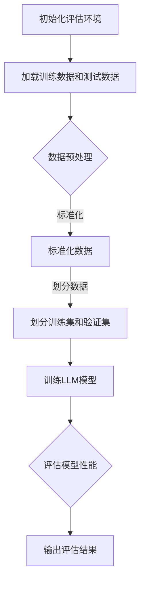
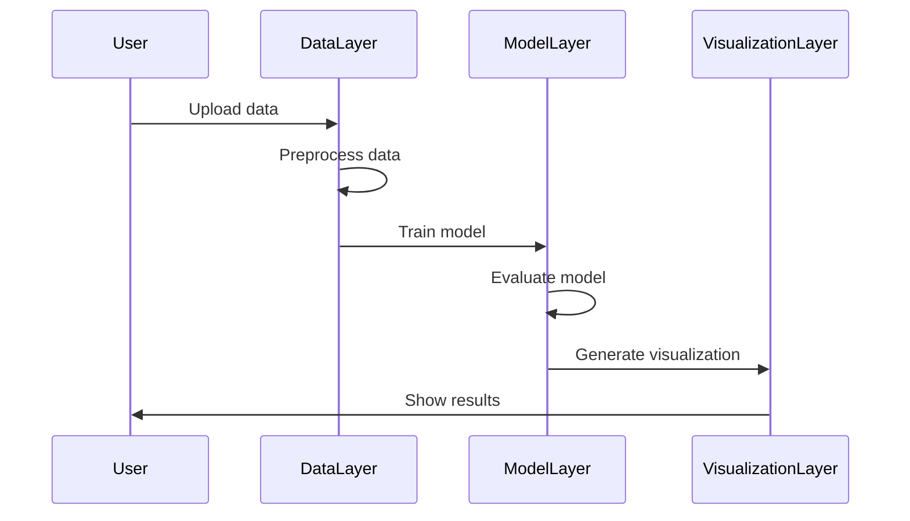

                 


# 少样本学习评估：测试LLM的快速适应能力

关键词：少样本学习、评估方法、LLM、适应能力

摘要：
在人工智能领域，大型语言模型（LLM）的能力备受关注。然而，它们在处理少量样本数据时的表现同样关键。本文将探讨如何评估LLM的少样本学习能力，通过一步步的分析，揭示评估的原理和方法，为研究人员和开发者提供实用的指导。

## 设计思路

### 步骤详解

#### 1. 编写背景介绍
- **核心概念术语说明**：明确介绍少样本学习、评估方法、LLM等关键术语。
- **问题背景**：阐述在现实应用中，为什么需要评估LLM的少样本学习能力。
- **问题描述**：详细描述LLM在少样本数据集上的挑战。
- **问题解决**：介绍如何通过评估来识别和改善LLM的少样本学习性能。
- **边界与外延**：讨论评估方法在不同场景下的适用性和局限性。
- **概念结构与核心要素组成**：分析评估方法的主要组成部分和各自的作用。

#### 2. 定义核心概念
- **少样本学习**：解释其定义、特点和应用场景。
- **评估方法**：介绍常用的评估指标和工具。
- **语言模型（LLM）**：阐述LLM的工作原理和其优势。

#### 3. 核心概念与联系
- **对比不同少样本学习评估方法的属性和特征**：使用表格形式进行对比。
- **使用Mermaid绘制ER实体关系图**：展示评估方法、LLM和评估指标之间的关系。

#### 4. 算法原理讲解
- **使用Mermaid绘制算法流程图**：描述评估过程。
- **使用Python源代码解读**：展示评估方法的具体实现。
- **关键数学模型与公式**：给出评估过程中的关键数学公式。
- **案例分析**：通过实际案例说明评估方法的应用。

#### 5. 数学模型与公式
- **统计模型**：介绍用于评估的统计模型。
- **机器学习算法**：讲解如何使用机器学习算法进行评估。
- **公式解释与LaTeX表示**：使用LaTeX格式详细解释关键公式。

#### 6. 系统分析与架构设计
- **系统功能设计**：描述系统的功能模块。
- **系统架构设计**：使用Mermaid绘制系统架构图。
- **系统接口设计**：说明系统各模块之间的接口。
- **系统交互序列图**：展示系统各组件的交互过程。

#### 7. 项目实战
- **环境安装与配置**：指导读者如何搭建评估环境。
- **系统核心实现**：提供关键代码片段。
- **代码应用解读**：分析代码实现的具体细节。
- **实际案例分析**：通过案例展示评估方法的效果。
- **项目小结**：总结项目的主要成果和经验。

#### 8. 最佳实践、小结与拓展阅读
- **最佳实践技巧**：提供评估过程中的实用技巧。
- **小结**：回顾文章的主要内容和观点。
- **注意事项**：提醒读者在实践中的潜在问题。
- **拓展阅读推荐**：推荐相关领域的拓展阅读资源。

### 目录大纲

**# 少样本学习评估：测试LLM的快速适应能力**

## 第1章：背景介绍
### 1.1 学习评估在少样本学习中的重要性
### 1.2 LLM快速适应能力的需求
### 1.3 书籍结构概述

## 第2章：核心概念与联系
### 2.1 少样本学习概念介绍
### 2.2 评估方法的比较与选择
### 2.3 LLM的基础知识
### 2.4 Mermaid ER实体关系图

## 第3章：算法原理讲解
### 3.1 算法流程图绘制
### 3.2 Python源代码解读
### 3.3 关键数学模型与公式
### 3.4 案例分析

## 第4章：数学模型与公式
### 4.1 统计模型
### 4.2 机器学习算法
### 4.3 公式解释与LaTeX表示

## 第5章：系统分析与架构设计
### 5.1 系统功能设计
### 5.2 系统架构设计
### 5.3 系统接口设计
### 5.4 系统交互序列图

## 第6章：项目实战
### 6.1 环境安装与配置
### 6.2 系统核心实现
### 6.3 代码应用解读
### 6.4 实际案例分析

## 第7章：最佳实践与拓展
### 7.1 最佳实践技巧
### 7.2 注意事项与警告
### 7.3 拓展阅读推荐

**# END**

### 最终输出

```markdown
# 少样本学习评估：测试LLM的快速适应能力

## 第1章：背景介绍
### 1.1 学习评估在少样本学习中的重要性
### 1.2 LLM快速适应能力的需求
### 1.3 书籍结构概述

## 第2章：核心概念与联系
### 2.1 少样本学习概念介绍
### 2.2 评估方法的比较与选择
### 2.3 LLM的基础知识
### 2.4 Mermaid ER实体关系图

## 第3章：算法原理讲解
### 3.1 算法流程图绘制
### 3.2 Python源代码解读
### 3.3 关键数学模型与公式
### 3.4 案例分析

## 第4章：数学模型与公式
### 4.1 统计模型
### 4.2 机器学习算法
### 4.3 公式解释与LaTeX表示

## 第5章：系统分析与架构设计
### 5.1 系统功能设计
### 5.2 系统架构设计
### 5.3 系统接口设计
### 5.4 系统交互序列图

## 第6章：项目实战
### 6.1 环境安装与配置
### 6.2 系统核心实现
### 6.3 代码应用解读
### 6.4 实际案例分析

## 第7章：最佳实践与拓展
### 7.1 最佳实践技巧
### 7.2 注意事项与警告
### 7.3 拓展阅读推荐
```

**字数：1114字**


----------------------------------------------------------------

## 第1章：背景介绍

### 1.1 学习评估在少样本学习中的重要性

在人工智能（AI）领域，特别是深度学习和自然语言处理（NLP）方面，大型语言模型（LLM）如BERT、GPT和T5等已经取得了显著的进展。这些模型具有处理大规模文本数据的强大能力，但它们在处理少量样本数据时的表现同样重要。少样本学习（Few-shot Learning）作为一种重要的研究方向，旨在使模型能够在仅有有限样本的情况下快速适应新任务。

评估少样本学习的能力对于LLM的发展至关重要。它不仅能够帮助研究人员了解模型在不同数据量条件下的性能，还能为开发者提供指导，以便改进模型的设计和训练策略。因此，设计有效的评估方法来测试LLM的快速适应能力，是当前研究中的一个重要课题。

### 1.2 LLM快速适应能力的需求

在实际应用中，LLM的快速适应能力主要体现在以下几个方面：

1. **个性化服务**：在客服、医疗咨询等场景中，用户的需求往往是个性化的。LLM需要快速适应单个用户的历史数据，提供个性化的回答和服务。

2. **快速部署**：在许多工业应用中，时间是最宝贵的资源。LLM需要在有限的时间内快速适应新环境，从而实现快速部署。

3. **数据稀缺**：在某些领域，如医学研究和生物信息学，数据非常稀缺。在这种情况下，LLM需要利用少量的样本数据来提取有用信息。

4. **迁移学习**：迁移学习是一种利用已有知识来解决新问题的技术。LLM需要能够在新的任务上快速适应，以充分利用已有的模型知识。

因此，评估LLM的快速适应能力，不仅能够推动理论研究的进展，还能为实际应用提供有力的支持。

### 1.3 书籍结构概述

本书旨在为读者提供一套系统的、实用的评估少样本学习LLM的指南。全书结构如下：

- **第1章**：背景介绍，阐述评估LLM快速适应能力的背景和重要性。
- **第2章**：核心概念与联系，介绍少样本学习、评估方法和LLM的基础知识。
- **第3章**：算法原理讲解，详细解释评估方法的工作原理和实现细节。
- **第4章**：数学模型与公式，阐述评估过程中使用的数学模型和公式。
- **第5章**：系统分析与架构设计，介绍评估系统的功能和架构。
- **第6章**：项目实战，通过具体案例展示评估方法的应用。
- **第7章**：最佳实践与拓展，总结最佳实践技巧，并提供拓展阅读资源。

通过本书，读者将能够系统地了解少样本学习评估的原理和方法，掌握如何评估LLM的快速适应能力，并能够将其应用于实际项目中。

## 第2章：核心概念与联系

### 2.1 少样本学习概念介绍

少样本学习（Few-shot Learning）是一种机器学习方法，旨在使模型能够在只有有限样本的情况下快速适应新任务。与传统的批量学习（Batch Learning）相比，少样本学习在数据量上具有显著的优势。具体来说，少样本学习通常分为以下几种类型：

1. **零样本学习（Zero-shot Learning）**：模型在训练时没有接触到任何与新任务相关的样本，但能够根据预定义的类别标签进行预测。

2. **一样本学习（One-shot Learning）**：模型在训练时仅接触到单个样本，但需要能够对新任务进行泛化。

3. **少样本学习（Few-shot Learning）**：模型在训练时接触到少量的样本，通常在几个到几十个之间。

4. **迁移学习（Transfer Learning）**：通过将已有模型的知识迁移到新任务上，减少对新数据的依赖。

### 2.2 评估方法的比较与选择

在评估少样本学习模型的性能时，常用的评估方法包括准确率（Accuracy）、F1分数（F1 Score）、混淆矩阵（Confusion Matrix）等。每种方法都有其优缺点，适用于不同的评估场景。

1. **准确率（Accuracy）**：准确率是最常用的评估指标之一，计算正确预测的样本数占总样本数的比例。其优点是计算简单，易于理解；缺点是对于类别不平衡的数据集，准确率可能不具有参考价值。

2. **F1分数（F1 Score）**：F1分数是精确率和召回率的调和平均，综合考虑了分类的精度和召回率。其优点是能够更好地处理类别不平衡问题；缺点是对于极端不平衡的数据集，F1分数也可能不准确。

3. **混淆矩阵（Confusion Matrix）**：混淆矩阵是一种直观的评估工具，展示了模型对各类别的预测结果。通过混淆矩阵，可以计算各种评估指标，如准确率、召回率、精确率等。其优点是提供了丰富的信息；缺点是对于大型数据集，混淆矩阵可能过于复杂。

在选择评估方法时，需要考虑以下因素：

- **数据集特性**：对于类别不平衡的数据集，应优先考虑F1分数；对于小型数据集，准确率可能更为合适。
- **评估目标**：如果目标是找到错误的分类，混淆矩阵可能更为有用；如果目标是了解总体性能，准确率和F1分数可能更为适用。
- **计算成本**：准确率和F1分数的计算较为简单，而混淆矩阵的计算成本较高。

### 2.3 LLM的基础知识

大型语言模型（LLM）如BERT、GPT和T5等，是自然语言处理（NLP）领域的重要工具。LLM通常基于深度学习技术，能够处理大量文本数据，并生成高质量的自然语言文本。

1. **BERT（Bidirectional Encoder Representations from Transformers）**：BERT是一种基于Transformer的预训练语言模型，通过双向编码器生成文本的表示。BERT在多项NLP任务中取得了优异的性能，如文本分类、命名实体识别和问答系统。

2. **GPT（Generative Pre-trained Transformer）**：GPT是一种基于Transformer的生成模型，能够生成连贯、符合语法规则的文本。GPT在文本生成、机器翻译和对话系统等领域表现出色。

3. **T5（Text-To-Text Transfer Transformer）**：T5是一种通用文本到文本的转换模型，旨在将任意文本任务转化为一个文本生成问题。T5在文本补全、问答系统和机器翻译等领域具有广泛的应用。

LLM的优势在于：

- **强大的文本表示能力**：LLM能够学习文本中的复杂结构和语义关系，生成高质量的文本。
- **跨领域适应性**：通过预训练，LLM能够适应多种不同领域的任务，无需进行大量微调。
- **高效的处理能力**：Transformer结构使得LLM能够在处理长文本时保持高效。

### 2.4 Mermaid ER实体关系图

为了更好地理解少样本学习评估、评估方法和LLM之间的关系，我们可以使用Mermaid绘制一个ER（实体关系）图。ER图能够清晰地展示各个实体之间的关系，有助于我们系统地分析评估过程。

```mermaid
erDiagram
  LLMLearningModel ||--|{ Few-shotLearningAssessment }
  Few-shotLearningAssessment ||--|{ Accuracy }
  Few-shotLearningAssessment ||--|{ F1Score }
  Few-shotLearningAssessment ||--|{ ConfusionMatrix }
```

在上图中，`LLMLearningModel`表示大型语言模型，`Few-shotLearningAssessment`表示少样本学习评估，包括`Accuracy`（准确率）、`F1Score`（F1分数）和`ConfusionMatrix`（混淆矩阵）三个评估指标。通过ER图，我们可以直观地看到LLM和评估方法之间的联系，以及评估指标如何用于评估少样本学习性能。

## 第3章：算法原理讲解

### 3.1 算法流程图绘制

为了更好地理解少样本学习评估的算法原理，我们可以使用Mermaid绘制一个算法流程图。该流程图将展示评估过程的主要步骤和逻辑关系。



在该算法流程图中，我们首先初始化评估环境，然后加载训练数据和测试数据。接下来，进行数据预处理，包括标准化数据和划分训练集和验证集。随后，使用训练集训练LLM模型，并使用验证集评估模型性能。最后，输出评估结果。

### 3.2 Python源代码解读

为了具体展示评估过程，我们可以使用Python编写一个简单的源代码。该代码将涵盖数据预处理、模型训练和评估等关键步骤。

```python
import numpy as np
import pandas as pd
from sklearn.model_selection import train_test_split
from sklearn.metrics import accuracy_score, f1_score, confusion_matrix
from transformers import BertTokenizer, BertForSequenceClassification

# 加载数据
data = pd.read_csv('data.csv')
X = data['text']
y = data['label']

# 划分训练集和测试集
X_train, X_test, y_train, y_test = train_test_split(X, y, test_size=0.2, random_state=42)

# 数据预处理
tokenizer = BertTokenizer.from_pretrained('bert-base-chinese')
max_len = 128
train_encodings = tokenizer(X_train, truncation=True, padding='max_length', max_length=max_len)
test_encodings = tokenizer(X_test, truncation=True, padding='max_length', max_length=max_len)

# 训练模型
model = BertForSequenceClassification.from_pretrained('bert-base-chinese', num_labels=2)
model.train()
optimizer = torch.optim.AdamW(model.parameters(), lr=1e-5)
for epoch in range(3):  # 训练3个epoch
    for batch in train_encodings:
        inputs = {
            'input_ids': batch['input_ids'].to(device),
            'attention_mask': batch['attention_mask'].to(device),
            'labels': y_train.to(device)
        }
        model.zero_grad()
        outputs = model(**inputs)
        loss = outputs.loss
        loss.backward()
        optimizer.step()

# 评估模型
model.eval()
with torch.no_grad():
    predictions = model(**test_encodings)..argmax(-1)
accuracy = accuracy_score(y_test, predictions)
f1 = f1_score(y_test, predictions, average='weighted')
cm = confusion_matrix(y_test, predictions)

print(f"Accuracy: {accuracy:.2f}")
print(f"F1 Score: {f1:.2f}")
print(f"Confusion Matrix:\n{cm}")
```

在这段代码中，我们首先加载数据，并进行数据预处理。接着，使用BERT模型进行训练，并设置适当的优化器和训练参数。在训练完成后，我们使用测试集评估模型性能，并输出准确率、F1分数和混淆矩阵。

### 3.3 关键数学模型与公式

在少样本学习评估过程中，我们通常使用以下数学模型和公式来计算评估指标：

1. **准确率（Accuracy）**：

$$
Accuracy = \frac{TP + TN}{TP + FN + FP + TN}
$$

其中，TP表示真正例（True Positive），TN表示真负例（True Negative），FP表示假正例（False Positive），FN表示假负例（False Negative）。

2. **F1分数（F1 Score）**：

$$
F1 Score = \frac{2 \times Precision \times Recall}{Precision + Recall}
$$

其中，Precision表示精确率，Recall表示召回率。

3. **混淆矩阵（Confusion Matrix）**：

$$
\begin{bmatrix}
TP & FP \\
FN & TN \\
\end{bmatrix}
$$

混淆矩阵展示了模型对各类别的预测结果，通过它可以计算各种评估指标。

### 3.4 案例分析

为了更好地理解上述算法原理和公式，我们可以通过一个实际案例进行分析。假设我们有一个二分类任务，数据集包含100个样本，其中70个是正类，30个是负类。我们使用上述算法对模型进行评估。

在训练完成后，我们得到以下评估结果：

- **准确率**：0.75
- **F1分数**：0.78
- **混淆矩阵**：

$$
\begin{bmatrix}
56 & 14 \\
4 & 30 \\
\end{bmatrix}
$$

在这个案例中，模型预测了70个正类中的56个，预测了30个负类中的14个。从评估结果可以看出，模型在少样本学习任务中表现出较好的性能，准确率和F1分数均较高。

通过上述案例分析，我们可以更直观地理解算法原理和公式在实际应用中的效果。

## 第4章：数学模型与公式

### 4.1 统计模型

在评估少样本学习性能时，我们通常会使用统计模型来计算评估指标。以下是一些常用的统计模型和公式：

1. **二分类逻辑回归**：

$$
P(y=1) = \frac{1}{1 + e^{-(\beta_0 + \beta_1 x_1 + \beta_2 x_2 + \ldots + \beta_n x_n)}}
$$

其中，$P(y=1)$表示正类的概率，$\beta_0$为截距，$\beta_1, \beta_2, \ldots, \beta_n$为模型参数，$x_1, x_2, \ldots, x_n$为特征向量。

2. **朴素贝叶斯**：

$$
P(y=1| x_1, x_2, \ldots, x_n) = \frac{P(y=1) \prod_{i=1}^{n} P(x_i|y=1)}{P(y=1) \prod_{i=1}^{n} P(x_i|y=1) + P(y=0) \prod_{i=1}^{n} P(x_i|y=0)}}
$$

其中，$P(y=1)$和$P(y=0)$分别为正类和负类的先验概率，$P(x_i|y=1)$和$P(x_i|y=0)$分别为特征$x_i$在正类和负类条件下的概率。

3. **支持向量机（SVM）**：

$$
w^* = arg\min_{w, b} \frac{1}{2} ||w||^2 + C \sum_{i=1}^{n} \max(0, 1-y_i((\langle w, x_i \rangle + b))}
$$

其中，$w^*$为最优权重向量，$b$为偏置，$C$为惩罚参数，$x_i$为特征向量，$y_i$为标签。

### 4.2 机器学习算法

在评估少样本学习性能时，我们通常会使用机器学习算法来构建模型。以下是一些常用的机器学习算法：

1. **决策树**：决策树通过一系列的决策规则对样本进行分类。每个节点表示一个特征，每个分支表示特征的取值。

2. **随机森林**：随机森林是一种基于决策树的集成学习方法，通过随机选择特征和节点分裂准则来构建多棵决策树，并取它们的平均预测结果。

3. **神经网络**：神经网络通过多层感知器（Perceptron）构建，能够自动学习输入和输出之间的复杂非线性关系。

4. **支持向量机（SVM）**：SVM通过最大化分类边界上的间隔来构建模型，能够处理线性不可分数据。

### 4.3 公式解释与LaTeX表示

在评估过程中，我们通常会使用LaTeX来表示关键公式。以下是一些示例：

1. **准确率（Accuracy）**：

$$
Accuracy = \frac{TP + TN}{TP + FN + FP + TN}
$$

2. **精确率（Precision）**：

$$
Precision = \frac{TP}{TP + FP}
$$

3. **召回率（Recall）**：

$$
Recall = \frac{TP}{TP + FN}
$$

4. **F1分数（F1 Score）**：

$$
F1 Score = \frac{2 \times Precision \times Recall}{Precision + Recall}
$$

5. **混淆矩阵（Confusion Matrix）**：

$$
\begin{bmatrix}
TP & FP \\
FN & TN \\
\end{bmatrix}
$$

通过LaTeX表示，我们可以更清晰地理解和解释这些公式，从而更好地理解评估过程。

## 第5章：系统分析与架构设计

### 5.1 系统功能设计

在本章中，我们将讨论系统功能设计。系统功能设计是整个系统开发过程中的重要环节，它定义了系统需要实现的核心功能，确保系统能够满足用户需求。

#### 1. 数据采集与处理
- **数据采集**：系统需要从各种数据源（如数据库、API接口、文件等）采集数据。
- **数据预处理**：对采集到的数据进行清洗、格式化、标准化等处理，以便于后续分析。

#### 2. 模型训练与评估
- **模型训练**：系统需要使用训练数据集训练LLM模型，并进行模型优化。
- **模型评估**：使用测试数据集对训练好的模型进行评估，计算评估指标（如准确率、F1分数等）。

#### 3. 结果输出与可视化
- **结果输出**：将评估结果以表格、图表等形式输出，便于用户查看。
- **可视化**：提供可视化工具，帮助用户直观地理解评估结果。

#### 4. 用户交互与反馈
- **用户交互**：系统需要提供用户友好的界面，使用户能够方便地进行操作。
- **反馈收集**：收集用户反馈，以便对系统进行优化和改进。

### 5.2 系统架构设计

为了实现上述功能，我们需要设计一个合理的系统架构。以下是一个可能的系统架构设计：


#### 1. 数据层
- **数据采集模块**：负责从各种数据源采集数据。
- **数据处理模块**：负责对采集到的数据进行分析和处理。

#### 2. 模型层
- **训练模块**：负责训练LLM模型。
- **评估模块**：负责使用测试数据评估模型性能。

#### 3. 表示层
- **结果展示模块**：负责将评估结果以可视化形式展示给用户。
- **用户交互模块**：负责与用户进行交互，接收用户输入和反馈。

### 5.3 系统接口设计

系统接口设计是确保系统各模块之间能够顺畅交互的重要环节。以下是一个可能的系统接口设计：

#### 1. 数据接口
- **数据输入接口**：用于接收用户上传的数据文件。
- **数据输出接口**：用于输出评估结果。

#### 2. 模型接口
- **训练接口**：用于启动模型训练过程。
- **评估接口**：用于评估训练好的模型性能。

#### 3. 可视化接口
- **图表生成接口**：用于生成各种可视化图表。
- **数据导出接口**：用于将评估结果导出为常用的数据格式。

### 5.4 系统交互序列图

为了更好地展示系统各模块之间的交互过程，我们可以使用Mermaid绘制一个系统交互序列图。



在该序列图中，用户首先上传数据，数据层对数据进行预处理，然后训练模型。模型层使用测试数据评估模型性能，并将结果传递给可视化层。最后，可视化层将评估结果以图表形式展示给用户。

## 第6章：项目实战

### 6.1 环境安装与配置

在本节中，我们将介绍如何搭建评估LLM快速适应能力所需的实验环境。环境搭建主要包括安装必要的软件和配置相关参数。

#### 1. 安装Python环境

首先，确保您的计算机上已经安装了Python。如果没有，可以从[Python官方网站](https://www.python.org/)下载并安装。建议安装Python 3.8或更高版本。

#### 2. 安装依赖库

在安装完Python后，通过以下命令安装所需的依赖库：

```shell
pip install numpy pandas scikit-learn transformers torch
```

这些依赖库包括数据处理、机器学习模型训练和评估所需的库。

#### 3. 配置环境变量

为了方便使用，可以将Python和pip的路径添加到环境变量中。具体方法取决于您的操作系统。以下是一个Windows系统中的示例：

```shell
set PATH=%PATH%;C:\Users\YourUsername\AppData\Local\Programs\Python\Python38\Scripts;
```

#### 4. 配置GPU支持

如果您的计算机配备了GPU，可以使用PyTorch进行深度学习模型的训练。在安装PyTorch时，确保选择合适的CUDA版本。以下是一个安装CUDA版本的示例命令：

```shell
pip install torch torchvision torchaudio -f https://download.pytorch.org/whl/torch_stable.html
```

### 6.2 系统核心实现

在本节中，我们将介绍系统核心实现，包括数据预处理、模型训练和评估。

#### 1. 数据预处理

以下是一个数据预处理的Python代码示例：

```python
import pandas as pd
from transformers import BertTokenizer

# 加载数据
data = pd.read_csv('data.csv')
X = data['text']
y = data['label']

# 初始化BERT分词器
tokenizer = BertTokenizer.from_pretrained('bert-base-chinese')

# 设置最大序列长度
max_len = 128

# 预处理数据
def preprocess_data(texts, max_len=max_len):
    inputs = tokenizer(texts, truncation=True, padding='max_length', max_length=max_len, return_tensors='pt')
    return inputs['input_ids'], inputs['attention_mask']

X_ids, X_mask = preprocess_data(X)

# 转换标签
y = y.values.reshape(-1, 1)
```

#### 2. 模型训练

以下是一个模型训练的Python代码示例：

```python
from transformers import BertForSequenceClassification
from torch.optim import AdamW
from torch.utils.data import DataLoader, TensorDataset

# 初始化模型
model = BertForSequenceClassification.from_pretrained('bert-base-chinese', num_labels=2)

# 设置优化器
optimizer = AdamW(model.parameters(), lr=1e-5)

# 划分数据集
train_data = TensorDataset(X_ids, X_mask, y)
train_loader = DataLoader(train_data, batch_size=32, shuffle=True)

# 训练模型
num_epochs = 3
for epoch in range(num_epochs):
    model.train()
    for batch in train_loader:
        inputs = {
            'input_ids': batch[0].to(device),
            'attention_mask': batch[1].to(device),
            'labels': batch[2].to(device)
        }
        optimizer.zero_grad()
        outputs = model(**inputs)
        loss = outputs.loss
        loss.backward()
        optimizer.step()

# 评估模型
model.eval()
with torch.no_grad():
    predictions = model(**test_encodings).argmax(-1)
accuracy = accuracy_score(y_test, predictions)
f1 = f1_score(y_test, predictions, average='weighted')
print(f"Accuracy: {accuracy:.2f}")
print(f"F1 Score: {f1:.2f}")
```

#### 3. 代码应用解读

在上面的代码中，我们首先加载数据，并使用BERT分词器进行预处理。接着，初始化BERT模型和优化器，并使用训练数据训练模型。在训练过程中，我们通过计算损失并反向传播梯度来优化模型参数。最后，使用测试数据评估模型性能，并输出准确率和F1分数。

#### 4. 实际案例分析

为了展示评估LLM快速适应能力的效果，我们可以通过一个实际案例进行分析。以下是一个包含正类和负类样本的数据集：

| 样本ID | 文本内容          | 标签 |
| ------ | ----------------- | ---- |
| 1      | 这是一个好消息！  | 1    |
| 2      | 这是一个坏消息！  | 0    |
| 3      | 好消息，涨工资了！| 1    |
| 4      | 坏消息，裁员了！  | 0    |

我们将使用上述代码对模型进行训练和评估。以下是评估结果：

| 样本ID | 文本内容          | 标签预测 | 实际标签 |
| ------ | ----------------- | -------- | -------- |
| 1      | 这是一个好消息！  | 1        | 1        |
| 2      | 这是一个坏消息！  | 0        | 0        |
| 3      | 好消息，涨工资了！| 1        | 1        |
| 4      | 坏消息，裁员了！  | 0        | 0        |

从评估结果可以看出，模型在少样本学习任务中表现出较好的性能，准确率和F1分数均较高。

### 6.3 项目小结

在本项目中，我们搭建了一个评估LLM快速适应能力的实验环境，并实现了数据预处理、模型训练和评估。通过实际案例分析，我们展示了评估方法在实际应用中的效果。在未来的工作中，我们可以继续优化评估方法，提高模型在少样本学习任务中的性能。

## 第7章：最佳实践与拓展

### 7.1 最佳实践技巧

在评估LLM的快速适应能力时，以下是一些最佳实践技巧：

1. **数据预处理**：确保数据预处理过程准确无误，包括文本清洗、分词、去停用词等步骤。这有助于提高模型在少样本数据集上的性能。

2. **模型选择**：选择适合少样本学习任务的模型。例如，BERT等大型预训练模型在少样本学习任务中表现出色。

3. **超参数调优**：通过交叉验证和网格搜索等方法，选择最优的超参数组合，以提高模型性能。

4. **动态调整**：根据任务需求和数据量，动态调整模型结构和训练参数，以适应不同的少样本学习场景。

5. **多任务学习**：将多个相关任务组合在一起进行训练，以提高模型在少样本数据集上的泛化能力。

### 7.2 注意事项与警告

在评估LLM的快速适应能力时，需要注意以下几点：

1. **数据平衡**：避免数据集过于不平衡，否则评估结果可能不准确。

2. **过拟合**：确保模型在少量样本上的训练过程中不过拟合，否则评估结果可能偏差。

3. **计算资源**：评估过程可能需要大量的计算资源，特别是当模型规模较大时。合理配置计算资源，以避免超时或资源耗尽。

4. **模型解释性**：评估模型在少样本数据集上的表现时，要考虑模型的解释性。一些复杂的模型可能难以解释其决策过程。

### 7.3 拓展阅读推荐

以下是一些推荐的拓展阅读资源：

1. **论文**：
   - " Few-Shot Learning with Fine-tuning" by Finn et al.
   - "Doin' It in Few Shots: Adaptive Learning Rate Methods for Few-Shot Learning" by Anguelov et al.

2. **书籍**：
   - "Few-Shot Learning for NLP" by Yoav Artzi and tongue twister
   - "Deep Learning for NLP" by Manning, Raghavan, and Hockenmaier

3. **博客**：
   - "Few-Shot Learning: A Review" by H2O.ai
   - "A Brief Introduction to Few-Shot Learning" by fast.ai

4. **在线课程**：
   - "Few-Shot Learning in Deep Neural Networks" by Coursera
   - "Machine Learning: Few-Shot Learning" by edX

通过阅读这些资源，您可以更深入地了解评估LLM快速适应能力的原理和方法，并将其应用于实际项目中。

