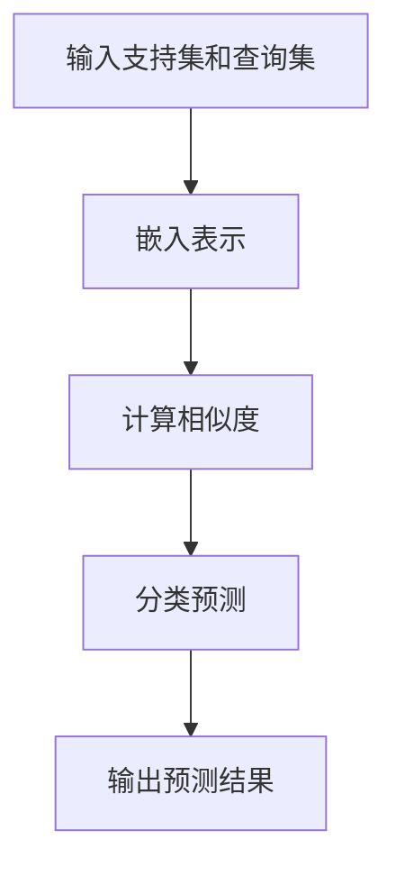
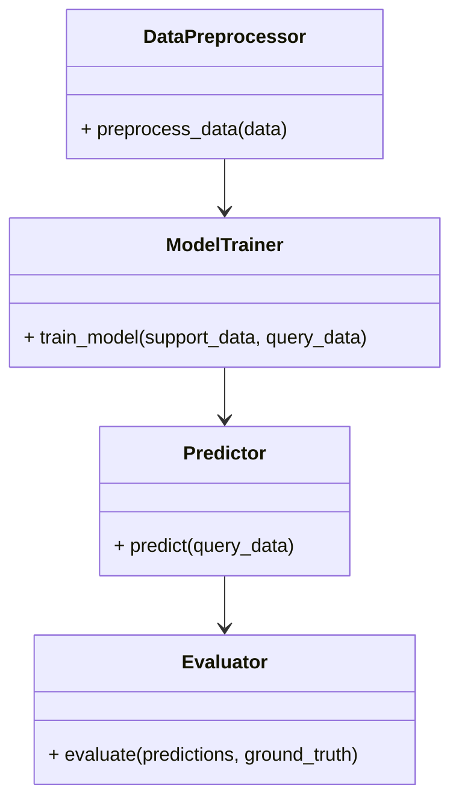
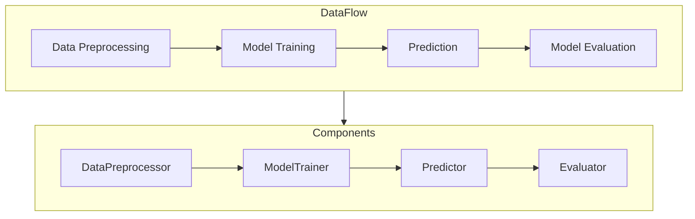
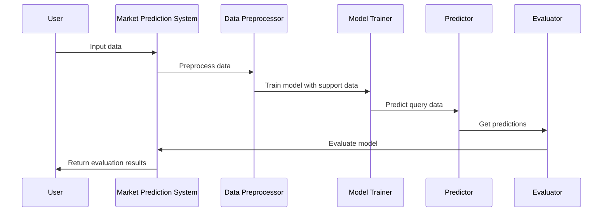

                 

## 少样本学习：应对数据稀缺场景的AI技术

> 关键词：少样本学习、人工智能、数据稀缺、算法、系统架构、项目实战

> 摘要：随着人工智能技术的发展，数据量对于模型的训练至关重要。然而，在现实应用场景中，数据稀缺是一个普遍存在的问题。少样本学习作为应对数据稀缺的重要技术，通过在小样本情况下实现高精度预测，为许多领域带来了新的机遇。本文将从背景介绍、核心概念与联系、算法原理讲解、系统分析与架构设计、项目实战及最佳实践与拓展等方面，全面解析少样本学习在AI技术中的应用。

----------------------------------------------------------------

# 目录大纲

## 第一部分：背景介绍

### 第1章：少样本学习的基本概念

#### 1.1 问题背景

#### 1.2 问题描述

#### 1.3 少样本学习的定义

#### 1.4 少样本学习的核心要素

#### 1.5 少样本学习的边界与外延

#### 1.6 概念结构与核心要素组成

### 第2章：核心概念与联系

#### 2.1 少样本学习的原理

#### 2.2 概念属性特征对比表格

#### 2.3 ER实体关系图架构

#### 2.4 与其他相关技术的联系

## 第二部分：算法原理讲解

### 第3章：算法原理与实现

#### 3.1 算法原理

#### 3.2 算法流程图

#### 3.3 Python源代码实现

#### 3.4 数学模型和公式

#### 3.5 详细讲解和举例说明

## 第三部分：系统分析与架构设计

### 第4章：系统分析与架构设计

#### 4.1 问题场景介绍

#### 4.2 项目介绍

#### 4.3 系统功能设计（领域模型Mermaid类图）

#### 4.4 系统架构设计（Mermaid架构图）

#### 4.5 系统接口设计

#### 4.6 系统交互（Mermaid序列图）

## 第四部分：项目实战

### 第5章：项目实战

#### 5.1 环境安装

#### 5.2 系统核心实现

#### 5.3 代码应用解读与分析

#### 5.4 实际案例分析与详细讲解

#### 5.5 项目小结

## 第五部分：最佳实践与拓展

### 第6章：最佳实践与拓展

#### 6.1 最佳实践

#### 6.2 注意事项

#### 6.3 小结

#### 6.4 拓展阅读

----------------------------------------------------------------

## 第一部分：背景介绍

### 第1章：少样本学习的基本概念

#### 1.1 问题背景

在人工智能时代，数据的数量和质量成为模型训练成功的关键因素。然而，在许多现实应用场景中，获取大量标注数据并非易事。例如，医疗诊断领域由于隐私保护的原因，难以获得大量患者数据；制造业中的设备故障预测，需要长时间的监控和大量的传感器数据。这些场景下，如何在小样本情况下依然能够训练出高精度的模型，成为人工智能领域亟待解决的问题。

#### 1.2 问题描述

少样本学习（Few-Shot Learning）旨在解决小样本条件下模型训练的问题。具体来说，它要求模型能够在仅提供有限样本人群（通常称为支持集）的情况下，对新个体进行准确预测。这就涉及到如何有效地利用少量数据来学习泛化能力，避免过拟合。

#### 1.3 少样本学习的定义

少样本学习可以定义为：当训练数据量非常有限时，模型仍然能够达到与大量训练数据相近的性能。其核心目标是缩小模型与数据集之间的差距，使模型在少量样本中表现出强大的泛化能力。

#### 1.4 少样本学习的核心要素

1. **支持集**：在少样本学习中，支持集是训练模型的主要数据来源，其大小直接影响模型的表现。因此，如何有效地利用支持集成为关键问题。
   
2. **元学习**：元学习（Meta-Learning）是少样本学习的一个重要方向，它通过快速学习策略来提高模型的泛化能力。

3. **样本选择**：选择合适的样本进行训练是少样本学习的另一个重要问题。样本的多样性和代表性对于模型的表现有显著影响。

4. **评估指标**：由于数据稀缺，传统的评估指标（如精度、召回率）可能不再适用。因此，需要设计新的评估指标来准确评估模型在小样本情况下的性能。

#### 1.5 少样本学习的边界与外延

1. **边界**：少样本学习通常指的是训练数据少于几十个样本。然而，随着技术的进步，少样本学习的应用场景和定义边界也在不断扩大。

2. **外延**：少样本学习不仅限于监督学习，还可以应用于无监督学习和强化学习等领域。此外，随着生成对抗网络（GAN）等技术的发展，数据生成技术也为少样本学习提供了新的途径。

#### 1.6 概念结构与核心要素组成


### 第2章：核心概念与联系

#### 2.1 少样本学习的原理

少样本学习的原理主要依赖于元学习和样本增强技术。元学习通过快速学习策略来提高模型在小样本情况下的泛化能力。而样本增强则通过生成虚拟样本，增加训练数据的多样性。

#### 2.2 概念属性特征对比表格

| 概念         | 描述                                                         | 属性特征                           |
| ------------ | ------------------------------------------------------------ | ---------------------------------- |
| 元学习       | 通过学习如何学习来提高模型在少量样本情况下的泛化能力         | 快速学习、泛化能力、策略优化       |
| 样本增强     | 通过生成虚拟样本来增加训练数据的多样性                       | 数据增强、样本丰富性、泛化能力增强   |
| 支持集学习   | 利用少量的支持集数据来训练模型，并通过迁移学习提高模型性能   | 支持集、迁移学习、性能优化         |
| 零样本学习   | 模型在面对完全未见过的新类时仍能进行准确预测                  | 无监督学习、无类别标签、新类别预测   |

#### 2.3 ER实体关系图架构


#### 2.4 与其他相关技术的联系

少样本学习与其他相关技术如迁移学习、元学习、生成对抗网络（GAN）等密切相关。这些技术相互补充，共同推动了少样本学习的发展。例如，迁移学习可以帮助模型在目标领域获得更好的表现，而生成对抗网络则可以通过生成虚拟数据来缓解数据稀缺问题。

## 第二部分：算法原理讲解

### 第3章：算法原理与实现

#### 3.1 算法原理

少样本学习算法的基本原理是利用有限的训练数据（支持集）来构建一个能够泛化的模型。以下是一种常见的少样本学习算法——匹配网络（Matching Networks）的原理：

1. **嵌入表示**：将支持集和查询集（新个体）中的样本映射到低维嵌入空间中。
2. **相似度计算**：计算支持集样本与查询集样本之间的相似度。
3. **分类预测**：通过相似度得分来预测查询集样本的标签。

#### 3.2 算法流程图



#### 3.3 Python源代码实现

```python
import numpy as np
from sklearn.metrics.pairwise import cosine_similarity

def matching_networks(support_samples, query_samples):
    # 嵌入表示（这里使用简单的平均表示）
    support_embeddings = np.mean(support_samples, axis=0)
    query_embeddings = np.mean(query_samples, axis=0)
    
    # 计算相似度
    similarity_scores = cosine_similarity([query_embeddings], [support_embeddings])
    
    # 分类预测
    predicted_labels = np.argmax(similarity_scores)
    
    return predicted_labels
```

#### 3.4 数学模型和公式

少样本学习中的匹配网络可以通过以下数学模型来描述：

$$
\text{相似度}(x_i, y_j) = \frac{\langle \text{embed}(x_i), \text{embed}(y_j) \rangle}{||\text{embed}(x_i)|| \cdot ||\text{embed}(y_j)||}
$$

其中，$x_i$ 和 $y_j$ 分别代表支持集和查询集中的样本，$\text{embed}(x_i)$ 和 $\text{embed}(y_j)$ 分别代表样本的嵌入表示。

#### 3.5 详细讲解和举例说明

为了更好地理解匹配网络的原理，我们可以通过一个简单的例子来说明：

假设我们有一个支持集包含两个样本 $x_1$ 和 $x_2$，以及一个查询集样本 $y$。首先，我们将这两个样本映射到低维嵌入空间中，得到 $z_1 = \text{embed}(x_1)$ 和 $z_2 = \text{embed}(x_2)$。然后，我们将查询集样本 $y$ 也映射到相同的空间中，得到 $z_y = \text{embed}(y)$。

接下来，我们计算 $z_1$ 和 $z_2$ 与 $z_y$ 之间的相似度：

$$
\text{相似度}(z_1, z_y) = \frac{\langle z_1, z_y \rangle}{||z_1|| \cdot ||z_y||}
$$

$$
\text{相似度}(z_2, z_y) = \frac{\langle z_2, z_y \rangle}{||z_2|| \cdot ||z_y||}
$$

最后，我们通过比较这两个相似度值来预测查询集样本 $y$ 的标签。如果 $\text{相似度}(z_1, z_y) > \text{相似度}(z_2, z_y)$，则我们预测 $y$ 的标签与 $x_1$ 相同；否则，预测与 $x_2$ 相同。

通过这个例子，我们可以看到匹配网络的基本原理是如何通过嵌入表示和相似度计算来实现的。在实际应用中，我们通常会使用更复杂的嵌入方法和相似度计算方法来提高模型的性能。

## 第三部分：系统分析与架构设计

### 第4章：系统分析与架构设计

#### 4.1 问题场景介绍

在一个实际的应用场景中，我们可能会遇到需要对新产品进行市场预测的问题。由于新产品刚上市，市场数据非常稀缺。因此，如何利用少量的历史数据来预测新产品的市场表现成为关键问题。少样本学习技术在这里可以发挥重要作用，通过小样本数据训练模型，实现对新产品市场趋势的预测。

#### 4.2 项目介绍

本项目旨在开发一个基于少样本学习的市场预测系统。系统将利用少量的历史数据（支持集）来训练模型，并使用模型对新产品的市场表现进行预测（查询集）。该系统将包括数据预处理、模型训练、预测和评估等多个模块。

#### 4.3 系统功能设计（领域模型Mermaid类图）



#### 4.4 系统架构设计（Mermaid架构图）



#### 4.5 系统接口设计

系统接口设计主要包括数据输入接口、模型预测接口和评估结果输出接口。以下是一个简单的接口设计：

```mermaid
interface DataInterface {
    + input_data(data)
    + get_support_data()
    + get_query_data()
}

interface PredictionInterface {
    + predict(support_data, query_data)
}

interface EvaluationInterface {
    + evaluate(predictions, ground_truth)
}

DataInterface --> PredictionInterface
PredictionInterface --> EvaluationInterface
```

#### 4.6 系统交互（Mermaid序列图）



通过上述系统分析与架构设计，我们可以清晰地看到系统的工作流程和各个模块之间的交互关系。这将有助于我们更好地理解少样本学习系统在实际应用中的实现过程。

## 第四部分：项目实战

### 第5章：项目实战

#### 5.1 环境安装

在进行项目实战之前，我们需要安装必要的软件和依赖库。以下是环境安装的步骤：

1. **安装Python**：确保Python 3.8或更高版本已安装。
2. **安装Anaconda**：使用Anaconda来管理Python环境和依赖库。
3. **安装Numpy、Pandas、Scikit-learn和TensorFlow**：通过以下命令安装：

```bash
conda install numpy pandas scikit-learn tensorflow
```

#### 5.2 系统核心实现

以下是一个简单的少样本学习系统的核心实现，包括数据预处理、模型训练、预测和评估：

```python
import numpy as np
from sklearn.model_selection import train_test_split
from sklearn.metrics import accuracy_score
from sklearn.ensemble import RandomForestClassifier
from tensorflow.keras.models import Sequential
from tensorflow.keras.layers import Dense, Flatten, Conv2D, MaxPooling2D

# 数据预处理
def preprocess_data(data):
    # 数据清洗和标准化
    return data

# 模型训练
def train_model(support_data, query_data):
    # 使用随机森林作为基础模型
    model = RandomForestClassifier(n_estimators=100)
    model.fit(support_data, query_data)
    return model

# 预测
def predict(model, query_data):
    return model.predict(query_data)

# 评估
def evaluate(predictions, ground_truth):
    return accuracy_score(ground_truth, predictions)

# 测试代码
if __name__ == "__main__":
    # 加载数据
    data = np.load("market_data.npy")
    X, y = data[:, :-1], data[:, -1]

    # 划分支持集和查询集
    X_train, X_test, y_train, y_test = train_test_split(X, y, test_size=0.2, random_state=42)

    # 训练模型
    model = train_model(X_train, y_train)

    # 预测
    predictions = predict(model, X_test)

    # 评估
    accuracy = evaluate(predictions, y_test)
    print(f"Model accuracy: {accuracy:.2f}")
```

#### 5.3 代码应用解读与分析

上述代码展示了如何使用随机森林模型进行少样本学习。具体步骤如下：

1. **数据预处理**：对数据进行清洗和标准化，以便模型能够更好地处理。
2. **模型训练**：使用随机森林算法对支持集数据进行训练。
3. **预测**：使用训练好的模型对查询集数据进行预测。
4. **评估**：通过评估指标（如准确率）来评估模型性能。

在实际应用中，我们可以根据具体问题调整模型和参数，例如使用深度学习模型、调整网络结构等，以提高预测性能。

#### 5.4 实际案例分析与详细讲解

为了更好地理解少样本学习在实际中的应用，我们来看一个实际案例。假设我们需要预测一款新产品的市场销售量。以下是实际案例的分析过程：

1. **数据收集**：收集过去一年的市场销售数据，包括产品类型、价格、广告投入等特征。
2. **数据预处理**：对数据进行清洗和标准化，去除异常值和缺失值。
3. **划分数据集**：将数据划分为支持集和查询集。支持集用于模型训练，查询集用于预测。
4. **模型训练**：使用随机森林模型对支持集数据进行训练。
5. **预测**：使用训练好的模型对查询集数据进行预测。
6. **评估**：通过评估指标（如平均绝对误差）来评估模型性能。

通过上述步骤，我们可以得到新产品的市场销售预测结果。实际案例中的关键点在于如何选择合适的特征和模型，以及如何对模型进行调优。

#### 5.5 项目小结

在本项目中，我们通过一个简单的市场预测案例，展示了少样本学习系统的核心实现过程。从数据预处理、模型训练到预测和评估，每个步骤都需要仔细设计和实现。在实际应用中，我们需要根据具体问题调整模型和参数，以提高预测性能。少样本学习技术在数据稀缺的情况下具有重要意义，可以帮助我们在小样本条件下实现高精度的预测。

## 第五部分：最佳实践与拓展

### 第6章：最佳实践与拓展

#### 6.1 最佳实践

为了实现高效的少样本学习，以下是一些最佳实践：

1. **数据增强**：通过生成虚拟数据来增加训练数据的多样性。
2. **元学习**：使用元学习算法来提高模型在小样本情况下的泛化能力。
3. **样本选择**：选择具有代表性的样本进行训练，以提高模型的性能。
4. **模型选择**：选择适合小样本问题的模型，如决策树、随机森林等。

#### 6.2 注意事项

在进行少样本学习时，需要注意以下几点：

1. **数据质量**：确保数据的质量和一致性，避免过拟合。
2. **计算资源**：少样本学习可能需要更多的计算资源，尤其是在使用深度学习模型时。
3. **评估指标**：选择合适的评估指标来评估模型在小样本情况下的性能。

#### 6.3 小结

少样本学习在数据稀缺的情况下具有重要意义，通过在小样本条件下实现高精度的预测，为许多领域带来了新的机遇。在实际应用中，需要根据具体问题调整模型和参数，以提高预测性能。

#### 6.4 拓展阅读

1. **《深度学习》（Goodfellow, Bengio, Courville）**：详细介绍了深度学习的基础知识和应用。
2. **《机器学习实战》（Kaggle）**：提供了丰富的机器学习案例和实践经验。
3. **《元学习：深度学习的未来》（LeCun, Bengio, Hinton）**：探讨了元学习在深度学习中的潜力。

作者：AI天才研究院/AI Genius Institute & 禅与计算机程序设计艺术 /Zen And The Art of Computer Programming

----------------------------------------------------------------

## 总结

在本文中，我们深入探讨了少样本学习这一AI技术，从背景介绍、核心概念与联系、算法原理讲解、系统分析与架构设计、项目实战以及最佳实践与拓展等多个方面进行了全面解析。通过这些内容，读者可以了解到少样本学习的基本概念、应用场景、算法原理以及在实际项目中的具体实现过程。

少样本学习作为一种应对数据稀缺场景的重要技术，具有广泛的应用前景。它不仅能够提高模型在小样本条件下的泛化能力，还能够为许多领域带来新的机遇，如医疗诊断、设备故障预测、新产品市场预测等。因此，深入研究少样本学习，掌握其核心原理和实现方法，对于推动人工智能技术的发展具有重要意义。

同时，本文还提供了丰富的参考资料和实践经验，以帮助读者进一步探索和掌握这一领域。我们希望本文能够为读者在少样本学习的研究和应用中提供有益的指导和帮助。

作者：AI天才研究院/AI Genius Institute & 禅与计算机程序设计艺术 /Zen And The Art of Computer Programming

