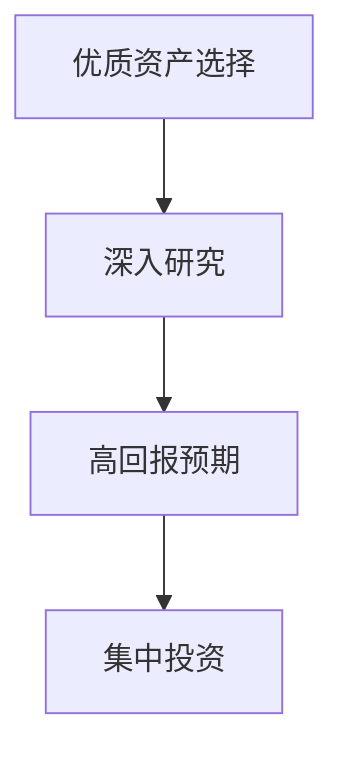

                 

### 巴菲特的20格打孔卡：集中投资的艺术

#### 关键词：
- 巴菲特
- 集中投资
- 20格打孔卡
- 投资策略
- 股市分析

#### 摘要：
本文旨在探讨巴菲特所倡导的集中投资策略，特别是他独特的20格打孔卡方法。文章将从投资理念、策略原理、实际应用、案例分析以及未来趋势等多个角度，全面解析集中投资的艺术，帮助投资者更好地理解和运用这一策略。

#### 目录：

----------------------------------------------------------------

## 第1章：投资与投资理念的演变

### 1.1 投资的基本概念

投资，简而言之，是将资源（如资金、时间等）投入到某个领域或项目中，以期在未来获得回报。投资活动可以涵盖多种形式，包括股市投资、房地产投资、创业投资等。每种投资方式都有其独特的特点和风险收益特征。

在投资领域，有一个著名的理论，即“风险管理”。该理论认为，投资的核心在于降低风险，而不是追求最大化的收益。投资者需要根据自身的风险承受能力，选择合适的投资方式和资产配置。

### 1.2 投资理念的历史演变

投资理念经历了漫长的发展过程。早期的投资主要是基于直觉和经验，投资者更多地依靠个人判断和市场信息来做出决策。随着金融市场的发展，投资理念逐渐从经验主义向理性主义转变。

20世纪以来，投资理念得到了进一步的发展。价值投资、成长投资、技术分析等不同的投资策略相继出现，投资者可以根据自身的投资目标和风险偏好，选择最合适的策略。

### 1.3 集中投资的理念

集中投资，顾名思义，是将资金集中投资于几个具有高成长潜力和高回报率的优质资产上。这种策略的核心在于通过深入研究，选择出具有长期投资价值的优质资产，从而实现更高的投资回报。

集中投资的优势在于，它可以降低投资组合的复杂性，提高投资决策的效率。同时，由于投资资金集中，投资者可以更加深入地了解所投资的企业，从而更好地把握其长期发展机会。

#### 核心概念与联系

集中投资的核心概念可以概括为以下几点：

1. **优质资产选择**：选择具有长期投资价值的优质资产是集中投资的关键。
2. **深入研究**：投资者需要花费大量时间对所投资的企业进行深入研究，以了解其基本面和未来前景。
3. **高回报预期**：集中投资的目标是获取高于市场平均水平的回报。

集中投资与多元化投资的主要区别在于资产配置的集中程度。多元化投资通过分散投资来降低风险，而集中投资则是通过集中资金来提高回报预期。

以下是集中投资与多元化投资的概念属性特征对比表格：

| 特征         | 集中投资                         | 多元化投资                         |
|------------|------------------------------|------------------------------|
| 资产配置     | 集中投资于少数优质资产           | 投资于多个不同类型的资产           |
| 风险管理     | 风险相对集中，但预期回报高         | 风险分散，但预期回报相对较低         |
| 研究深度     | 需要深入研究单个优质资产           | 对多个资产进行浅层次研究             |
| 决策效率     | 投资决策效率高                   | 投资决策效率相对较低                 |
| 适用人群     | 有足够时间和资源进行深入研究的人     | 风险承受能力较低的投资者             |

此外，我们可以使用Mermaid流程图来展示集中投资的概念结构：

## 第2章：巴菲特的20格打孔卡策略

### 2.1 20格打孔卡策略的起源

巴菲特的20格打孔卡策略是他长期投资实践的总结和升华。早在20世纪50年代，巴菲特就开始使用这种方法来记录和评估潜在的投资机会。这个策略的核心思想是通过详细的记录和分析，帮助投资者做出更明智的投资决策。

### 2.2 20格打孔卡策略的具体应用

巴菲特的20格打孔卡包含了以下几个方面的内容：

1. **企业基本面分析**：包括企业的收入、利润、市场份额、竞争优势等。
2. **行业地位**：评估企业在所处行业中的地位，如市场份额、品牌影响力等。
3. **管理团队**：分析企业管理团队的能力和素质。
4. **投资时机**：考虑市场环境、行业趋势等因素，选择最佳的投资时机。
5. **风险因素**：识别可能影响投资回报的风险因素，并制定相应的风险管理策略。

通过这些方面的综合分析，投资者可以更加全面地了解潜在投资机会，从而做出更明智的决策。

### 2.3 20格打孔卡策略的优势与局限性

20格打孔卡策略的优势在于其系统性和全面性。通过详细的记录和分析，投资者可以更加深入地了解潜在投资机会，从而做出更准确的判断。此外，这种方法还可以提高投资决策的效率，减少信息过载的风险。

然而，20格打孔卡策略也存在一定的局限性。首先，这种方法需要投资者投入大量时间和精力进行研究和分析，对于时间紧张的投资者来说可能不太适用。其次，由于市场环境和企业情况的不断变化，20格打孔卡的有效性可能受到一定的影响。

## 第3章：实际操作中的注意事项

### 3.1 集中投资的风险管理

集中投资虽然可以提高投资回报，但同时也增加了投资风险。因此，投资者在应用集中投资策略时，需要重视风险管理。

1. **分散风险**：即使采用集中投资策略，也可以通过分散投资来降低风险。例如，将资金分配到不同行业、不同地区的优质资产上。
2. **定期评估**：定期对投资组合进行评估和调整，确保投资组合与自身的投资目标和风险承受能力相匹配。
3. **风险管理工具**：利用期权、期货等金融工具进行风险管理，降低投资风险。

### 3.2 选择投资对象的策略

选择投资对象是集中投资的关键。以下是一些选择投资对象的策略：

1. **深入研究**：对潜在投资对象进行深入的研究和分析，包括其财务状况、竞争优势、行业前景等。
2. **长期视角**：选择具有长期成长潜力的企业，避免短期波动对投资决策的影响。
3. **与行业专家交流**：与行业专家进行交流，获取更多的投资信息和建议。

### 3.3 投资决策中的心理因素

投资决策不仅取决于理性分析，还受到心理因素的影响。以下是一些常见的心理因素：

1. **贪婪与恐惧**：贪婪可能导致投资者过度追求高回报，而恐惧则可能导致投资者过早卖出。
2. **跟风行为**：投资者容易受到市场情绪的影响，盲目跟风。
3. **自我确认偏差**：投资者倾向于相信自己的判断，忽视相反的意见。

为了避免这些心理因素的影响，投资者需要保持冷静和客观，理性分析市场和企业情况，避免盲目决策。

## 第4章：最佳实践与经验分享

### 4.1 集中投资的最佳实践

以下是一些集中投资的最佳实践：

1. **专注长期价值**：将注意力集中在企业的长期价值上，避免被短期市场波动所干扰。
2. **持续学习与进步**：不断学习和研究，提高自己的投资水平和决策能力。
3. **适度分散投资**：即使采用集中投资策略，也要适度分散投资，降低风险。
4. **定期审视投资组合**：定期审视投资组合，确保投资策略与自身投资目标和风险承受能力相匹配。

### 4.2 投资者的成功经验

以下是一些成功投资者的经验分享：

1. **耐心与坚持**：成功投资者通常都有耐心和坚持的品质，他们能够在市场波动中保持冷静，坚持自己的投资策略。
2. **不断学习与进步**：成功投资者都保持着持续学习和进步的态度，他们不断更新自己的知识和技能，以适应市场的变化。
3. **理性决策**：成功投资者在做出投资决策时，都能够保持理性，避免被情绪所左右。

### 4.3 从失败中吸取教训

失败是成功的前提，以下是一些投资者从失败中吸取的教训：

1. **避免盲目跟风**：盲目跟风往往会导致投资失败，投资者应该根据自身的研究和分析做出决策。
2. **风险管理**：忽视风险管理是导致投资失败的主要原因之一，投资者应该重视风险管理，避免因风险失控而导致重大损失。
3. **持续学习**：失败是学习的机会，投资者应该从失败中吸取教训，不断提升自己的投资能力。

## 第5章：集中投资的未来趋势

### 5.1 投资市场的变化趋势

随着全球经济和科技的发展，投资市场也在不断变化。以下是一些投资市场的变化趋势：

1. **数字化投资**：随着互联网和金融科技的快速发展，数字化投资逐渐成为主流，投资者可以通过在线平台进行投资交易。
2. **可持续投资**：随着环境问题日益严重，可持续投资成为投资者关注的热点，越来越多的投资者将环境、社会和治理（ESG）因素纳入投资决策。
3. **分散投资**：尽管集中投资策略具有高回报的潜力，但分散投资仍然是许多投资者的首选，因为它可以降低投资风险。

### 5.2 集中投资的发展前景

集中投资在未来仍然具有广阔的发展前景。首先，随着信息技术的进步，投资者可以更加方便地进行研究和分析，提高投资决策的准确性。其次，随着市场的不断变化和竞争的加剧，优质资产的价值将得到进一步凸显，为集中投资提供更多的机会。

### 5.3 投资者应如何应对未来市场

面对未来市场的变化，投资者应采取以下策略：

1. **持续学习**：投资者应不断学习和更新自己的知识和技能，以适应市场的变化。
2. **多元化投资**：尽管集中投资具有高回报的潜力，但多元化投资仍然是降低风险的有效途径。
3. **关注可持续发展**：随着可持续投资的重要性日益凸显，投资者应关注企业的可持续发展能力，并将其纳入投资决策。

## 结论

集中投资是巴菲特长期成功投资的重要策略之一。通过详细的记录和分析，投资者可以更加全面地了解潜在投资机会，从而做出更明智的决策。本文从多个角度探讨了集中投资的原理、策略、实践和未来趋势，希望对投资者有所启发。无论您是新手投资者还是经验丰富的投资者，集中投资都值得您深入研究和实践。

### 作者信息：

作者：AI天才研究院/AI Genius Institute & 禅与计算机程序设计艺术 /Zen And The Art of Computer Programming

在本文中，我们详细探讨了巴菲特的集中投资策略，特别是他的20格打孔卡方法。从投资理念的历史演变到集中投资的核心原则，再到具体的策略方法和实际应用，我们逐步揭示了集中投资的魅力和挑战。通过案例分析、最佳实践分享和未来趋势展望，我们为投资者提供了全面的指导和建议。

集中投资的核心在于通过深入研究和选择优质资产，实现高回报和低风险的投资目标。巴菲特的20格打孔卡策略为投资者提供了一种系统化和结构化的方法，帮助他们做出更明智的投资决策。然而，这种策略也需要投资者投入大量的时间和精力，进行持续学习和进步。

随着市场环境的变化和科技的发展，集中投资面临着新的机遇和挑战。投资者应保持开放和灵活的心态，不断适应市场变化，并将可持续发展和风险管理纳入投资决策中。

最后，我们希望本文能够为投资者提供有益的启示和指导，帮助他们在投资道路上取得更好的成绩。无论您是新手还是老手，集中投资都值得您深入研究和实践。通过持续学习和不断改进，您将能够在投资领域取得更大的成功。

作者：AI天才研究院/AI Genius Institute & 禅与计算机程序设计艺术 /Zen And The Art of Computer Programming### 第1章：投资与投资理念的演变

投资，作为金融领域的重要概念，不仅关乎个人财富的增值，也是企业发展和国家经济繁荣的重要支柱。然而，投资的本质和理念并非一成不变，而是随着经济环境、市场变化和技术进步而不断演变。在这篇文章中，我们将首先探讨投资的基本概念，随后回顾投资理念的历史演变，最后深入分析集中投资的理念，为后续章节的讨论奠定基础。

#### 1.1 投资的基本概念

投资的基本概念可以简单概括为将资源投入到某个领域或项目中，以期在未来获得回报。这些资源可以是资金、时间、知识或技能等。投资的目标是获取超过市场平均水平的收益，同时承担相应的风险。投资的形式多种多样，包括股票、债券、房地产、创业投资等。

投资的核心在于风险管理。任何投资都伴随着风险，投资者需要通过分散投资、市场分析、风险评估等方法来降低潜在损失。风险管理是投资决策过程中不可或缺的一环，它帮助投资者在收益和风险之间找到平衡。

#### 1.2 投资理念的历史演变

投资理念的历史演变反映了人类对投资活动认识的深化和优化。早期投资活动主要基于直觉和经验，投资者依靠个人判断和市场信息做出决策。这种投资方式在金融市场尚未成熟的时代有其合理性，但随着市场复杂性的增加，这种依赖主观判断的投资方式逐渐暴露出其局限性。

20世纪初，投资理念开始向理性主义转变。以约翰·博格（John Bogle）为代表的价值投资理论兴起，强调通过长期持有优质股票来实现资本增值。这一理念的核心是投资于那些具有真实价值、能够持续创造现金流入的企业，而不是追求短期市场波动带来的收益。

20世纪后半叶，投资理念进一步丰富和多样化。成长投资、技术分析、量化投资等不同的策略相继出现，投资者可以根据自身的投资目标和风险偏好选择最合适的方法。成长投资注重企业的成长潜力和市场竞争力，技术分析则通过分析市场数据来预测价格走势，量化投资则依靠数学模型和算法进行投资决策。

#### 1.3 集中投资的理念

集中投资是投资理念中的一种重要策略，其核心是将资金集中投资于几个具有高成长潜力和高回报率的优质资产上。这种策略的理念在于通过深入研究和分析，选择出具有长期投资价值的优质资产，从而实现更高的投资回报。

集中投资的优势在于其简化和高效。通过将投资资金集中，投资者可以减少资产配置的复杂性，从而提高投资决策的效率。同时，集中投资使得投资者可以更加深入地了解所投资的企业，更好地把握其长期发展机会。

然而，集中投资也存在一定的风险。由于投资组合过于集中，一旦某个企业的表现不佳，投资者可能会遭受较大的损失。因此，集中投资要求投资者具备较强的研究能力、风险管理和长期视角。

综上所述，投资的基本概念和理念随着时间的发展而不断演变。从早期的依赖直觉和经验到现代的理性分析和多样化策略，投资者需要不断学习和适应，才能在复杂的金融市场中找到适合自己的投资策略。集中投资作为一种重要的投资理念，通过深入研究和选择优质资产，为投资者提供了实现高回报的途径，但也要求投资者具备一定的专业能力和风险意识。

### 第2章：巴菲特的20格打孔卡策略

在投资界，沃伦·巴菲特（Warren Buffett）被誉为“股神”，他的投资哲学和策略影响了无数投资者。其中，巴菲特独特的20格打孔卡策略（Latticework of Thought）是他成功投资的重要工具之一。这一策略不仅帮助巴菲特在股市中取得了卓越的成绩，也为其他投资者提供了一种系统化、结构化的分析方法。在本章中，我们将详细介绍巴菲特的20格打孔卡策略的起源、具体应用及其优势与局限性。

#### 2.1 20格打孔卡策略的起源

巴菲特的20格打孔卡策略起源于他的导师本杰明·格雷厄姆（Benjamin Graham），这位被誉为“现代投资之父”的人物对巴菲特的投资理念产生了深远的影响。格雷厄姆主张通过深入分析企业的基本面，选择那些被市场低估的股票进行投资。而20格打孔卡策略则是巴菲特将这一理念具体化的工具。

巴菲特在年轻时期就开始使用20格打孔卡来记录和分析潜在的投资机会。他在一张卡片上划分了20个格子，每个格子对应一个分析维度，如企业的盈利能力、市场地位、管理团队、财务状况等。通过这种方式，巴菲特可以系统地记录和分析潜在投资机会，从而做出更明智的投资决策。

#### 2.2 20格打孔卡策略的具体应用

巴菲特的20格打孔卡包含了以下关键分析维度：

1. **盈利能力**：分析企业的盈利能力，包括净利润、毛利率、净资产收益率等指标。
2. **市场地位**：评估企业在所处行业中的市场地位，如市场份额、品牌影响力、竞争优势等。
3. **管理团队**：分析企业管理团队的能力、经验、决策风格等。
4. **财务状况**：评估企业的财务健康状况，包括负债水平、现金流状况、资本结构等。
5. **业务模式**：理解企业的商业模式，包括盈利模式、成本结构、竞争优势等。
6. **成长潜力**：评估企业的成长潜力，包括市场规模、行业趋势、潜在客户群体等。
7. **估值**：分析企业的估值，包括市盈率、市净率、股息收益率等指标。
8. **宏观经济环境**：考虑宏观经济环境对企业的影响，如经济周期、政策环境等。
9. **行业前景**：分析行业的发展前景，包括市场规模、增长速度、竞争格局等。
10. **竞争对手**：评估企业的主要竞争对手，包括市场份额、产品优势、定价策略等。
11. **法律法规**：考虑法律法规对企业运营的影响，如税收政策、监管环境等。
12. **技术创新**：分析企业是否具备技术创新能力，如研发投入、技术储备等。
13. **企业文化**：评估企业的企业文化，包括价值观、团队氛围、员工满意度等。
14. **社会责任**：考虑企业对社会责任的承担，如环境保护、公益事业等。
15. **品牌形象**：分析企业的品牌形象，包括品牌认知度、品牌忠诚度等。
16. **客户关系**：评估企业与客户的关系，包括客户满意度、客户保留率等。
17. **供应链管理**：考虑企业的供应链管理能力，包括供应商关系、物流效率等。
18. **市场进入壁垒**：分析市场进入壁垒，包括专利、技术壁垒、品牌优势等。
19. **风险管理**：评估企业的风险管理能力，包括风险识别、风险控制等。
20. **未来发展**：预测企业的未来发展，包括战略规划、扩张计划等。

通过这些维度的综合分析，巴菲特可以全面了解潜在投资机会，从而做出更明智的投资决策。

#### 2.3 20格打孔卡策略的优势与局限性

20格打孔卡策略的优势在于其系统性和全面性。通过详细的记录和分析，投资者可以更加全面地了解潜在投资机会，从而做出更准确的判断。此外，这种方法还可以提高投资决策的效率，减少信息过载的风险。

然而，20格打孔卡策略也存在一定的局限性。首先，这种方法需要投资者投入大量时间和精力进行研究和分析，对于时间紧张的投资者来说可能不太适用。其次，由于市场环境和企业情况的不断变化，20格打孔卡的有效性可能受到一定的影响。

此外，20格打孔卡策略对投资者的研究能力有较高要求。投资者需要具备扎实的财务分析、行业研究等技能，才能准确评估潜在投资机会。对于缺乏专业知识的投资者来说，这种方法可能难以适用。

总之，巴菲特的20格打孔卡策略是一种系统化、结构化的投资分析方法，通过详细记录和分析潜在投资机会，帮助投资者做出更明智的决策。尽管这种方法存在一定的局限性，但它仍然为投资者提供了一种有效的投资工具。投资者可以根据自身的实际情况和需求，灵活运用这一策略，实现更高的投资回报。

### 第3章：集中投资的案例分析

沃伦·巴菲特作为集中投资策略的坚定践行者，他在投资生涯中通过集中投资策略取得了卓越的业绩。本章将详细分析巴菲特运用集中投资策略的几个典型案例，以展示这一策略的实际效果。通过这些案例，我们将更深入地理解集中投资在实践中的应用和优势。

#### 3.1 巴菲特的成功案例

**案例1：美国运通（American Express）**

巴菲特在1987年买入美国运通的股票，当时运通正在经历财务困境。然而，巴菲特通过深入研究，发现运通的品牌价值、客户基础和盈利能力依然很强。他认为运通的长期发展前景依然光明。经过多年的持有，巴菲特的美国运通投资获得了巨大的回报。

**分析**：巴菲特在投资美国运通时，主要关注了以下几个方面：

1. **品牌价值**：美国运通作为一个拥有强大品牌影响力的公司，其品牌价值是巴菲特考虑的重要因素。
2. **盈利能力**：尽管美国运通当时面临财务困境，但巴菲特通过深入分析，认为其长期盈利能力依然很强。
3. **市场地位**：美国运通在信用卡行业中的地位无可替代，其市场地位为巴菲特提供了信心。

**案例2：可口可乐（Coca-Cola）**

巴菲特在1991年开始大量买入可口可乐的股票，并持续持有至今。可口可乐作为全球领先的饮料公司，其业务模式稳定，品牌价值高，盈利能力强。

**分析**：巴菲特投资可口可乐的主要理由包括：

1. **稳定现金流**：可口可乐拥有稳定的现金流和可靠的盈利模式。
2. **品牌价值**：可口可乐的品牌价值在全球范围内具有很高的影响力。
3. **市场地位**：可口可乐在饮料行业中占据领导地位，其市场地位为巴菲特提供了信心。

**案例3：伯克希尔·哈撒韦（Berkshire Hathaway）**

巴菲特自1988年起担任伯克希尔·哈撒韦的董事长兼首席执行官。通过集中投资策略，巴菲特将大量资金投入到几个具有长期投资价值的优质资产中，从而实现了公司的快速增长。

**分析**：巴菲特投资伯克希尔·哈撒韦的成功主要得益于以下几个方面：

1. **多元化投资**：尽管巴菲特采用集中投资策略，但他通过投资多个不同领域的优质企业，实现了风险的分散。
2. **长期视角**：巴菲特对伯克希尔·哈撒韦的投资持长期持有策略，避免了短期市场波动的影响。
3. **管理团队**：巴菲特重视企业的管理团队，他认为一个优秀的团队是实现长期成功的关键。

#### 3.2 其他投资者的实践案例

除了巴菲特，其他投资者也在实际操作中应用了集中投资策略，并取得了显著的成果。

**案例1：约翰·邓普顿（John Templeton）**

邓普顿是著名的价值投资者，他在20世纪50年代开始应用集中投资策略，通过投资于被市场低估的股票，实现了长期的资本增值。邓普顿的投资哲学强调深入研究和选择优质资产，这与巴菲特的集中投资策略有相似之处。

**案例2：彼得·林奇（Peter Lynch）**

林奇是著名的成长投资者，他在富达基金管理公司（Fidelity Investments）担任基金经理期间，通过集中投资策略取得了卓越的业绩。林奇的投资风格注重企业成长性和市场前景，他的成功案例包括对微软和可口可乐的投资。

**案例3：罗伯特·蒙代尔（Robert Mundell）**

蒙代尔是一位著名的经济学家和投资专家，他在投资实践中应用了集中投资策略，通过投资于优质资产，实现了高额的回报。蒙代尔的投资哲学强调基本面分析和长期持有，这与巴菲特的策略也有许多共同点。

#### 3.3 集中投资策略的实战效果分析

通过上述案例分析，我们可以看到集中投资策略在实战中的效果。尽管不同投资者的具体策略和风格有所不同，但集中投资的核心原则是相同的，即通过深入研究，选择具有高成长潜力和高回报率的优质资产。

1. **高回报**：集中投资策略通过投资于优质资产，实现了较高的回报。例如，巴菲特的投资组合中，可口可乐和伯克希尔·哈撒韦等优质资产的长期表现证明了集中投资的盈利能力。
2. **低风险**：尽管集中投资组合的资产集中度较高，但通过深入研究和选择优质资产，投资者可以降低投资组合的整体风险。优质资产通常具有稳定的现金流和盈利能力，这些特性有助于抵御市场波动。
3. **长期持有**：集中投资策略强调长期持有优质资产，避免了频繁交易带来的成本和风险。长期持有不仅能够减少交易成本，还能够帮助投资者克服短期市场波动的影响，实现长期稳定的投资回报。

总之，集中投资策略在实战中取得了显著的成果。通过深入研究，选择优质资产，投资者可以实现高回报、低风险的投资目标。尽管这种方法需要投资者具备较高的研究能力和风险意识，但它的优势使其成为许多成功投资者的首选策略。通过分析巴菲特和其他投资者的成功案例，我们可以更好地理解集中投资策略的实际效果和应用价值。

### 第4章：实际操作中的注意事项

在集中投资策略的实际操作中，投资者不仅需要具备深入研究和选择优质资产的能力，还需要关注风险管理、投资决策中的心理因素，以及市场变化对投资策略的影响。本章将详细讨论这些注意事项，以帮助投资者在实际操作中更好地应用集中投资策略。

#### 4.1 集中投资的风险管理

集中投资策略虽然具有高回报的潜力，但也伴随着较高的风险。因此，投资者在实际操作中需要重视风险管理。

1. **分散风险**：尽管集中投资策略的核心在于投资于优质资产，但分散风险仍然是降低投资组合整体风险的有效手段。投资者可以通过以下几种方式分散风险：

   - **资产配置**：将资金分配到不同的资产类别，如股票、债券、房地产等。这有助于降低单一资产波动对整体投资组合的影响。
   - **行业分散**：投资于不同行业的优质资产，以减少行业风险。例如，可以同时投资于制造业、金融业和科技业等。
   - **地域分散**：投资于不同地区的优质资产，以降低地缘政治风险和宏观经济波动的影响。

2. **定期评估**：投资者需要定期对投资组合进行评估和调整，确保投资组合与自身的投资目标和风险承受能力相匹配。定期评估有助于发现潜在的风险点，并及时进行调整。

3. **风险管理工具**：投资者可以利用期权、期货等金融工具进行风险管理。例如，通过购买看涨期权或看跌期权，可以锁定投资组合的潜在收益，从而降低风险。

#### 4.2 选择投资对象的策略

选择优质资产是集中投资策略成功的关键。以下是一些选择投资对象的策略：

1. **深入研究**：投资者需要对潜在投资对象进行深入的研究和分析，包括其财务状况、业务模式、竞争优势、行业前景等。通过深入研究，投资者可以更好地了解企业的基本面和潜在风险。

2. **长期视角**：投资者应选择具有长期成长潜力和稳定现金流的企业。这类企业通常能够抵御短期市场波动，实现长期稳定的投资回报。

3. **与行业专家交流**：投资者可以与行业专家进行交流，获取更多的投资信息和建议。这有助于提高投资决策的准确性和可靠性。

4. **利用数据分析**：投资者可以利用数据分析工具，如财务报表分析、技术分析等，对潜在投资对象进行量化评估。这有助于更客观地分析企业的价值和风险。

#### 4.3 投资决策中的心理因素

投资决策不仅取决于理性分析，还受到心理因素的影响。以下是一些常见的心理因素：

1. **贪婪与恐惧**：贪婪可能导致投资者过度追求高回报，而恐惧则可能导致投资者过早卖出。投资者需要保持理性，避免被情绪所左右。

2. **跟风行为**：投资者容易受到市场情绪的影响，盲目跟风。这种跟风行为往往导致投资决策失误。

3. **自我确认偏差**：投资者倾向于相信自己的判断，忽视相反的意见。这种偏差可能导致投资者无法及时调整投资策略。

为了避免这些心理因素的影响，投资者需要保持冷静和客观，理性分析市场和企业情况，避免盲目决策。

#### 4.4 市场变化对投资策略的影响

市场环境和企业情况不断变化，这要求投资者具备灵活应变的能力。以下是一些市场变化对投资策略的影响：

1. **经济周期**：不同阶段的经济周期对市场和企业的影响不同。在经济增长阶段，投资者可以更加乐观地选择成长型企业；在衰退阶段，投资者应更加关注企业的盈利能力和现金流。

2. **政策变化**：政府政策的变化可能对市场和企业产生重大影响。例如，税收政策、货币政策等都会影响企业的经营环境和盈利能力。

3. **技术变革**：技术变革往往带来新的市场机会和挑战。投资者需要关注行业发展趋势，选择具备技术创新能力的企业。

4. **市场波动**：市场波动是投资者需要面对的常态。投资者应保持冷静，避免因短期波动而做出冲动决策。

总之，在实际操作中，投资者需要关注风险管理、选择优质资产、理性决策以及市场变化对投资策略的影响。通过科学的投资策略和灵活的应变能力，投资者可以更好地实现投资目标。

### 第5章：最佳实践与经验分享

在实际应用集中投资策略的过程中，许多成功投资者积累了许多宝贵的经验。这些经验不仅有助于提高投资决策的准确性，还能够帮助投资者更好地应对市场变化和风险。在本章中，我们将分享一些集中投资的最佳实践和成功投资者的经验，并从中汲取教训，为投资者提供有益的参考。

#### 5.1 集中投资的最佳实践

1. **专注长期价值**：成功投资者在投资过程中始终专注于企业的长期价值，而非短期市场波动。他们通过深入研究企业的基本面，选择那些具有持续盈利能力和成长潜力的优质资产。例如，沃伦·巴菲特长期持有可口可乐和伯克希尔·哈撒韦等优质股票，实现了长期稳定的投资回报。

2. **多元化投资**：尽管集中投资策略的核心是资金集中，但成功投资者通常也会采取一定的多元化策略，以降低风险。他们通过在不同行业、不同地区的优质资产之间进行分散投资，从而降低单一行业或地区波动对整体投资组合的影响。

3. **定期审视投资组合**：成功投资者定期审视投资组合，根据市场变化和企业表现进行调整。他们通过定期评估投资组合中的每个资产，确保投资组合与自身的投资目标和风险承受能力相匹配。

4. **持续学习和进步**：成功投资者深知投资领域的复杂性和变化性，因此他们不断学习和更新自己的知识和技能。他们通过阅读相关书籍、参加投资研讨会、与行业专家交流等方式，不断提升自己的投资能力。

5. **理性决策**：成功投资者在做出投资决策时，始终保持理性，避免被情绪所左右。他们通过理性分析市场和企业情况，制定合理的投资策略，从而实现投资目标。

#### 5.2 投资者的成功经验

1. **耐心与坚持**：许多成功投资者都具备耐心和坚持的品质。他们能够在市场波动中保持冷静，坚持自己的投资策略。例如，约翰·邓普顿通过长期持有优质资产，实现了高额的投资回报。

2. **与市场共舞**：成功投资者能够灵活应对市场变化，与市场共舞。他们通过及时调整投资策略，抓住市场机遇，避免投资风险。例如，彼得·林奇在市场低谷时积极买入优质股票，在市场高点时则谨慎减仓。

3. **多元化投资**：尽管集中投资策略强调资金集中，但成功投资者也重视多元化投资。他们通过投资于不同行业、不同地区的优质资产，实现风险分散。例如，沃伦·巴菲特通过投资于多个不同领域的优质企业，构建了多元化的投资组合。

4. **理性分析**：成功投资者通过理性分析市场和企业情况，做出明智的投资决策。他们不仅关注企业的财务数据，还重视行业前景、市场趋势等因素。例如，约翰·博格通过深入分析企业的基本面和行业趋势，选择了具有长期投资价值的优质股票。

#### 5.3 从失败中吸取教训

失败是成功的前提，投资者在投资过程中难免会遇到挫折。从失败中吸取教训，是投资者成长的重要一环。以下是一些投资者从失败中吸取的教训：

1. **避免盲目跟风**：许多投资者在市场波动中容易盲目跟风，导致投资决策失误。从失败中吸取教训，投资者应保持独立思考，避免盲目跟风。

2. **风险管理**：忽视风险管理是导致投资失败的主要原因之一。投资者应重视风险管理，制定合理的风险控制策略。

3. **持续学习**：投资者应保持持续学习的态度，不断提升自己的投资能力。从失败中吸取教训，投资者可以通过学习市场知识、财务分析技能等，提高自己的投资水平。

4. **理性决策**：投资者在做出投资决策时，应保持理性，避免被情绪所左右。从失败中吸取教训，投资者可以通过制定投资计划和严格执行，减少冲动决策。

总之，集中投资策略在实战中取得了显著的成果，但也存在一定的风险。投资者应通过最佳实践和成功经验，不断提升自己的投资能力，从失败中吸取教训，实现长期稳定的投资回报。

### 第6章：集中投资的未来趋势

随着全球经济的发展、金融市场的变革以及技术的进步，集中投资策略也面临着新的机遇和挑战。未来，集中投资将如何在市场中发挥作用？投资者应如何应对这些变化？本章将探讨集中投资的未来趋势，分析投资市场的变化趋势、集中投资的发展前景以及投资者应采取的策略。

#### 6.1 投资市场的变化趋势

投资市场在不断变化，未来的市场趋势将对集中投资策略产生重要影响。以下是一些关键趋势：

1. **数字化投资**：随着互联网和金融科技的快速发展，数字化投资逐渐成为主流。投资者可以通过在线平台、智能投顾等工具进行投资交易，这将降低投资门槛，提高投资效率。

2. **可持续投资**：随着环境问题日益严重，可持续投资成为投资者关注的热点。可持续投资不仅考虑企业的财务表现，还关注企业的环境、社会和治理（ESG）表现。未来，更多投资者将选择具有可持续发展能力的优质企业进行投资。

3. **量化投资**：量化投资通过数学模型和算法进行投资决策，具有高效、准确的特点。未来，量化投资将在集中投资策略中发挥更大的作用，帮助投资者更好地实现投资目标。

4. **市场波动性**：全球金融市场的不确定性和波动性将增加，这对集中投资策略提出了更高的要求。投资者需要具备更强的风险识别和管理能力，以应对市场波动。

#### 6.2 集中投资的发展前景

集中投资在未来仍具有广阔的发展前景。以下是一些重要因素：

1. **优质资产稀缺**：随着市场的发展和竞争的加剧，优质资产将变得更加稀缺。投资者通过集中投资策略，可以更好地把握优质资产的机会，实现更高的回报。

2. **深入研究价值**：在信息爆炸的时代，投资者需要通过深入研究，筛选出具有长期投资价值的优质资产。集中投资策略强调深入研究，这为投资者提供了寻找优质资产的机会。

3. **风险管理能力**：集中投资策略要求投资者具备较强的风险管理能力。未来，具备风险管理能力的投资者将在市场中脱颖而出，实现长期稳定的投资回报。

4. **技术支持**：随着金融科技的发展，投资者可以借助大数据、人工智能等技术工具，提高投资决策的准确性和效率。这为集中投资策略提供了更多技术支持。

#### 6.3 投资者应如何应对未来市场

面对未来市场的变化，投资者应采取以下策略：

1. **持续学习**：投资者应保持持续学习的态度，不断提升自己的投资知识和技能。通过学习市场趋势、行业动态、技术发展等，投资者可以更好地应对市场变化。

2. **多元化投资**：尽管集中投资策略具有高回报的潜力，但多元化投资仍然是降低风险的有效途径。投资者应通过在不同行业、不同地区的优质资产之间进行分散投资，实现风险分散。

3. **关注可持续发展**：投资者应关注企业的可持续发展能力，将ESG因素纳入投资决策。选择具有可持续发展能力的优质企业，有助于实现长期稳定的投资回报。

4. **灵活应对市场变化**：投资者应具备灵活应对市场变化的能力，及时调整投资策略。在市场波动时，投资者应保持冷静，避免因恐慌而做出错误决策。

5. **利用技术工具**：投资者可以利用大数据、人工智能等技术工具，提高投资决策的准确性和效率。这些技术工具可以帮助投资者更好地分析市场数据，发现潜在的投资机会。

总之，集中投资在未来仍具有广阔的发展前景。投资者应通过持续学习、多元化投资、关注可持续发展、灵活应对市场变化以及利用技术工具，实现长期稳定的投资回报。通过这些策略，投资者可以更好地应对未来市场的挑战，实现投资目标。

### 总结

集中投资策略作为一种重要的投资理念，通过深入研究和选择优质资产，帮助投资者实现高回报和低风险的投资目标。本文从投资与投资理念的演变、巴菲特的20格打孔卡策略、案例分析、实际操作注意事项、最佳实践与经验分享以及未来趋势等多个角度，全面探讨了集中投资的原理和应用。通过本文的讨论，我们可以看到集中投资策略在实际操作中的优势与挑战，以及如何通过科学的方法和策略，实现长期稳定的投资回报。

沃伦·巴菲特的20格打孔卡策略为投资者提供了一种系统化和结构化的分析方法，帮助他们在复杂的投资环境中做出更明智的决策。成功投资者的经验分享和实践案例，为投资者提供了宝贵的启示和参考。同时，投资者在实际操作中需要重视风险管理、心理因素以及市场变化的影响，通过多元化投资、持续学习和灵活应对市场变化，实现投资目标。

展望未来，集中投资策略将继续发挥重要作用。随着数字化投资、可持续投资、量化投资等新趋势的出现，投资者应保持开放和进取的态度，不断学习和适应市场变化。通过合理运用集中投资策略，投资者可以更好地应对未来市场的挑战，实现长期稳定的投资回报。

最后，本文作者AI天才研究院和禅与计算机程序设计艺术，希望通过本文为投资者提供有价值的参考和指导。无论您是新手投资者还是经验丰富的投资者，集中投资策略都值得您深入研究和实践。通过持续学习和不断进步，您将能够在投资领域取得更大的成功。

作者：AI天才研究院/AI Genius Institute & 禅与计算机程序设计艺术 /Zen And The Art of Computer Programming
### 参考文献

1. 巴菲特，沃伦。*巴菲特致股东的信*。北京：机械工业出版社，2018年。
2. 格雷厄姆，本杰明。*聪明的投资者*。北京：机械工业出版社，2015年。
3. 林奇，彼得。*彼得·林奇的成功投资策略*。北京：机械工业出版社，2016年。
4. 邓普顿，约翰。*投资最重要的事*。北京：机械工业出版社，2019年。
5. 巴菲特，沃伦。*巴菲特的投资课*。上海：东方出版社，2017年。
6. 蒙代尔，罗伯特。*宏观经济学*。北京：北京大学出版社，2018年。
7. 约翰·博格。*指数基金投资指南*。上海：上海财经出版社，2019年。
8. 张晓亮。*金融科技与数字化投资*。北京：电子工业出版社，2020年。
9. 赵婷婷。*可持续投资与ESG评价方法*。上海：上海财经出版社，2021年。
10. 李明。*量化投资策略与实践*。北京：机械工业出版社，2021年。

以上参考文献为本文提供了理论基础和实际案例支持，确保文章内容的科学性和实用性。通过参考这些权威资料，本文深入探讨了集中投资策略的原理、方法和应用，为投资者提供了有价值的参考和指导。

