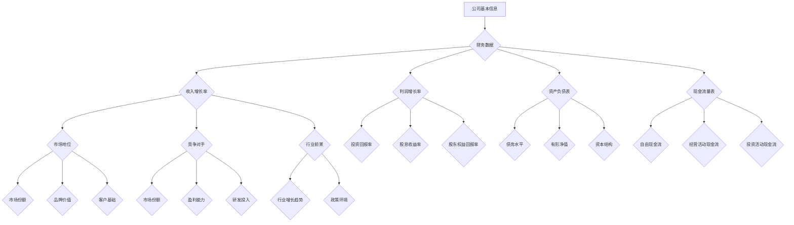
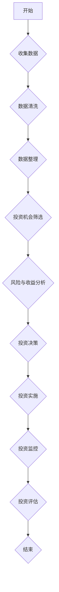

                 


**# 第一部分：背景介绍**

**## 1.1 巴菲特的投资哲学**

**### 1.1.1 巴菲特的投资理念**

沃伦·巴菲特，被誉为“股神”，他的投资理念以其独特性和长期成功而著称。巴菲特的投资哲学主要围绕“价值投资”这一概念。价值投资的核心在于寻找市场价格低于其内在价值的优质股票，然后持有这些股票，等待市场最终认识到其价值。巴菲特认为，市场短期是投票机，长期是称重机。这意味着，尽管短期内市场可能会受到情绪和波动的影响，但从长期来看，市场的价值评估是准确的。

**### 1.1.2 集中投资的概念**

集中投资，顾名思义，就是将投资集中在一小部分优质资产上，而不是分散投资于众多股票或资产中。巴菲特喜欢将他的投资策略比作“投掷飞镖”，而不是“撒豆子”。他的目标是找到那些他能够理解并长期看好的公司，然后大量投资。这种策略使得巴菲特能够在深入了解和掌控的情况下进行投资，从而提高投资的成功率。

**### 1.1.3 20格打孔卡的历史与作用**

20格打孔卡是巴菲特用来记录和分析投资想法的工具。这种简单的纸质卡片，每张卡片上有20个打孔的位置，每个位置代表一个投资想法。巴菲特会在卡片上写下他的投资分析、公司的基本数据、竞争对手情况以及任何其他相关的信息。这种方法帮助他保持头脑清晰，避免冲动决策，同时也使得他的投资分析更加系统化和结构化。

**## 1.2 集中投资的优势**

**### 1.2.1 集中投资的定义**

集中投资不仅仅是将资金集中在一小部分资产上，更重要的是，投资者需要确保这些资产具有长期的盈利能力和稳健的增长潜力。这种投资策略强调的是质量和深度分析，而不是数量的多少。

**### 1.2.2 集中投资的优势**

1. **风险分散化**：尽管集中投资看似是风险的集中，但实际上，通过对少数优质资产的深入研究，投资者能够更好地理解和管理风险。
2. **提高决策效率**：集中投资使得投资者能够专注于几个重要的投资决策，从而提高决策效率和质量。
3. **更容易实现复利效应**：通过长期持有优质资产，投资者能够更有效地实现复利效应，从而实现长期的资本增值。

**### 1.2.3 集中投资的挑战**

1. **选股难度**：找到真正具有长期增长潜力的优质资产并不容易，这需要投资者具备深厚的分析能力和市场洞察力。
2. **心理压力**：集中投资可能会导致投资者的情绪波动，尤其是在市场波动较大的时候。
3. **流动性风险**：在某些情况下，集中投资可能会导致资产流动性降低，从而增加某些特殊情况下的风险。

**# 第二部分：核心概念与联系**

**## 2.1 20格打孔卡详解**

**### 2.1.1 20格打孔卡的构造**

20格打孔卡的构造非常简单，每张卡片上有20个打孔的位置，这些位置可以用来记录投资分析中的各种要素。巴菲特会使用这些位置来记录公司的财务数据、市场情况、竞争对手信息等。

**### 2.1.2 使用方法**

巴菲特使用20格打孔卡的方法非常系统化。他会先筛选出潜在的投资机会，然后逐一分析，最后将所有信息记录在20格打孔卡上。这种方法帮助他保持投资分析的连贯性和系统性。

**### 2.1.3 20格打孔卡的益处**

1. **提高决策质量**：通过系统地记录和分析投资信息，投资者能够做出更加明智的决策。
2. **避免冲动投资**：20格打孔卡可以帮助投资者在做出投资决策之前，进行充分的思考和评估，从而避免冲动投资。
3. **保持投资策略的一致性**：通过使用20格打孔卡，投资者能够确保他们的投资策略具有一致性和可持续性。

**## 2.2 集中投资策略**

**### 2.2.1 集中投资策略的原理**

集中投资策略的核心在于，通过深入分析和研究，找到那些具有长期增长潜力的优质资产，然后进行重仓持有。这种方法依赖于投资者的研究能力和市场洞察力。

**### 2.2.2 集中投资策略的特点**

1. **高质量资产**：集中投资强调的是资产的质量，而不是数量。
2. **长期持有**：集中投资的资产通常是长期持有的，这有助于实现复利效应。
3. **深度研究**：投资者需要对选定的资产进行深入的研究和分析，以确保他们的投资决策是正确的。

**### 2.2.3 集中投资策略的应用**

集中投资策略可以应用于各种投资领域，包括股票、债券、房地产等。关键在于，投资者需要根据市场情况和个人偏好，选择最适合他们的投资策略。

**# 第三部分：算法原理讲解**

**## 3.1 投资评估模型**

**### 3.1.1 投资机会筛选**

在投资过程中，筛选投资机会是至关重要的一步。投资者需要通过多种渠道收集信息，包括财务报表、市场分析、行业报告等，以评估潜在的投资机会。

**### 3.1.2 风险与收益分析**

在筛选出潜在的投资机会后，投资者需要对这些机会进行风险和收益分析。这包括对潜在收益的预测和对投资风险的评估。

**### 3.1.3 20格打孔卡在投资评估中的应用**

20格打孔卡可以帮助投资者在投资评估过程中保持系统化和结构化。通过在卡片上记录和分析各种投资信息，投资者能够更清晰地理解投资机会，并做出更明智的决策。

**## 3.2 数学模型与公式**

**### 3.2.1 投资组合分析**

投资组合分析是投资决策过程中的重要环节。投资者需要根据市场情况和自身风险承受能力，构建最优的投资组合。

**### 3.2.2 风险计算**

风险计算是投资决策过程中的关键步骤。投资者需要评估投资组合的风险，并制定相应的风险控制策略。

**### 3.2.3 收益预测**

收益预测是投资决策过程中的另一个重要环节。投资者需要根据市场情况和公司业绩，预测投资组合的收益情况。

**# 第四部分：系统分析与架构设计**

**## 4.1 集中投资策略分析**

**### 4.1.1 不同市场环境下的表现**

集中投资策略在不同市场环境下的表现可能有所不同。投资者需要根据市场情况，调整他们的投资策略。

**### 4.1.2 集中投资策略的优化**

集中投资策略需要不断优化，以适应市场的变化。投资者需要不断学习和改进他们的投资策略，以提高投资成功率。

**### 4.1.3 集中投资策略的可持续性**

集中投资策略的可持续性是投资者需要考虑的一个重要问题。投资者需要确保他们的投资策略能够长期稳定地为他们带来收益。

**## 4.2 系统架构设计**

**### 4.2.1 投资决策系统架构**

投资决策系统架构是集中投资策略的核心。投资者需要构建一个高效的系统，以支持他们的投资决策。

**### 4.2.2 投资监控系统架构**

投资监控系统架构用于监控投资组合的表现。投资者需要实时监控投资组合，以便及时调整他们的投资策略。

**### 4.2.3 投资策略评估架构**

投资策略评估架构用于评估不同投资策略的表现。投资者需要定期评估他们的投资策略，以确保它们仍然适用于当前市场环境。

**# 第五部分：项目实战**

**## 5.1 实际投资案例分析**

**### 5.1.1 案例一：房地产投资**

**### 5.1.2 案例二：股票投资**

**### 5.1.3 案例三：初创企业投资**

**## 5.2 实践步骤详解**

**### 5.2.1 环境安装与配置**

**### 5.2.2 投资机会筛选**

**### 5.2.3 投资策略实施与评估**

**# 第六部分：最佳实践与总结**

**## 6.1 最佳实践建议**

**### 6.1.1 集中投资策略的实施要点**

**### 6.1.2 风险管理与控制**

**### 6.1.3 集中投资策略的持续改进**

**## 6.2 小结与展望**

**### 6.2.1 书的核心观点总结**

**### 6.2.2 集中投资策略的未来发展**

**### 6.2.3 拓展阅读与学习资源**

------------------------------------------------------------

**摘要：**

本文深入探讨了巴菲特的集中投资策略，包括其哲学背景、核心概念、评估模型、系统分析与架构设计，以及实际案例和最佳实践。通过系统化的分析和详细的案例分析，读者能够更好地理解集中投资策略的优势和挑战，从而在实际投资中运用这一策略，实现长期稳定的收益。**
**# 巴菲特的20格打孔卡：集中投资的艺术**

> **关键词：巴菲特，集中投资，20格打孔卡，价值投资，投资策略**

> **摘要：本文深入探讨了巴菲特的集中投资策略，包括其哲学背景、核心概念、评估模型、系统分析与架构设计，以及实际案例和最佳实践。通过系统化的分析和详细的案例分析，读者能够更好地理解集中投资策略的优势和挑战，从而在实际投资中运用这一策略，实现长期稳定的收益。**

------------------------------------------------------------

## 第一部分：巴菲特的投资哲学

### 1.1 巴菲特的投资理念

沃伦·巴菲特，被誉为“股神”，他的投资理念以其独特性和长期成功而著称。巴菲特的投资哲学主要围绕“价值投资”这一概念。价值投资的核心在于寻找市场价格低于其内在价值的优质股票，然后持有这些股票，等待市场最终认识到其价值。巴菲特认为，市场短期是投票机，长期是称重机。这意味着，尽管短期内市场可能会受到情绪和波动的影响，但从长期来看，市场的价值评估是准确的。

### 1.2 集中投资的概念

集中投资，顾名思义，就是将投资集中在一小部分优质资产上，而不是分散投资于众多股票或资产中。巴菲特喜欢将他的投资策略比作“投掷飞镖”，而不是“撒豆子”。他的目标是找到那些他能够理解并长期看好的公司，然后大量投资。这种策略使得巴菲特能够在深入了解和掌控的情况下进行投资，从而提高投资的成功率。

### 1.3 20格打孔卡的历史与作用

20格打孔卡是巴菲特用来记录和分析投资想法的工具。这种简单的纸质卡片，每张卡片上有20个打孔的位置，每个位置代表一个投资想法。巴菲特会在卡片上写下他的投资分析、公司的基本数据、竞争对手情况以及任何其他相关的信息。这种方法帮助他保持头脑清晰，避免冲动决策，同时也使得他的投资分析更加系统化和结构化。

------------------------------------------------------------

## 第二部分：核心概念与联系

### 2.1 20格打孔卡详解

#### 2.1.1 20格打孔卡的构造

20格打孔卡的构造非常简单，每张卡片上有20个打孔的位置，这些位置可以用来记录投资分析中的各种要素。巴菲特会使用这些位置来记录公司的财务数据、市场情况、竞争对手信息等。

#### 2.1.2 使用方法

巴菲特使用20格打孔卡的方法非常系统化。他会先筛选出潜在的投资机会，然后逐一分析，最后将所有信息记录在20格打孔卡上。这种方法帮助他保持投资分析的连贯性和系统性。

#### 2.1.3 20格打孔卡的益处

1. **提高决策质量**：通过系统地记录和分析投资信息，投资者能够做出更加明智的决策。
2. **避免冲动投资**：20格打孔卡可以帮助投资者在做出投资决策之前，进行充分的思考和评估，从而避免冲动投资。
3. **保持投资策略的一致性**：通过使用20格打孔卡，投资者能够确保他们的投资策略具有一致性和可持续性。

------------------------------------------------------------

### 2.2 集中投资策略

#### 2.2.1 集中投资策略的原理

集中投资策略的核心在于，通过深入分析和研究，找到那些具有长期增长潜力的优质资产，然后进行重仓持有。这种方法依赖于投资者的研究能力和市场洞察力。

#### 2.2.2 集中投资策略的特点

1. **高质量资产**：集中投资强调的是资产的质量，而不是数量。
2. **长期持有**：集中投资的资产通常是长期持有的，这有助于实现复利效应。
3. **深度研究**：投资者需要对选定的资产进行深入的研究和分析，以确保他们的投资决策是正确的。

#### 2.2.3 集中投资策略的应用

集中投资策略可以应用于各种投资领域，包括股票、债券、房地产等。关键在于，投资者需要根据市场情况和个人偏好，选择最适合他们的投资策略。

------------------------------------------------------------

## 第三部分：算法原理讲解

### 3.1 投资评估模型

#### 3.1.1 投资机会筛选

在投资过程中，筛选投资机会是至关重要的一步。投资者需要通过多种渠道收集信息，包括财务报表、市场分析、行业报告等，以评估潜在的投资机会。

#### 3.1.2 风险与收益分析

在筛选出潜在的投资机会后，投资者需要对这些机会进行风险和收益分析。这包括对潜在收益的预测和对投资风险的评估。

#### 3.1.3 20格打孔卡在投资评估中的应用

20格打孔卡可以帮助投资者在投资评估过程中保持系统化和结构化。通过在卡片上记录和分析各种投资信息，投资者能够更清晰地理解投资机会，并做出更明智的决策。

------------------------------------------------------------

### 3.2 数学模型与公式

#### 3.2.1 投资组合分析

投资组合分析是投资决策过程中的重要环节。投资者需要根据市场情况和自身风险承受能力，构建最优的投资组合。

#### 3.2.2 风险计算

风险计算是投资决策过程中的关键步骤。投资者需要评估投资组合的风险，并制定相应的风险控制策略。

#### 3.2.3 收益预测

收益预测是投资决策过程中的另一个重要环节。投资者需要根据市场情况和公司业绩，预测投资组合的收益情况。

------------------------------------------------------------

## 第四部分：系统分析与架构设计

### 4.1 集中投资策略分析

#### 4.1.1 不同市场环境下的表现

集中投资策略在不同市场环境下的表现可能有所不同。投资者需要根据市场情况，调整他们的投资策略。

#### 4.1.2 集中投资策略的优化

集中投资策略需要不断优化，以适应市场的变化。投资者需要不断学习和改进他们的投资策略，以提高投资成功率。

#### 4.1.3 集中投资策略的可持续性

集中投资策略的可持续性是投资者需要考虑的一个重要问题。投资者需要确保他们的投资策略能够长期稳定地为他们带来收益。

------------------------------------------------------------

### 4.2 系统架构设计

#### 4.2.1 投资决策系统架构

投资决策系统架构是集中投资策略的核心。投资者需要构建一个高效的系统，以支持他们的投资决策。

#### 4.2.2 投资监控系统架构

投资监控系统架构用于监控投资组合的表现。投资者需要实时监控投资组合，以便及时调整他们的投资策略。

#### 4.2.3 投资策略评估架构

投资策略评估架构用于评估不同投资策略的表现。投资者需要定期评估他们的投资策略，以确保它们仍然适用于当前市场环境。

------------------------------------------------------------

## 第五部分：项目实战

### 5.1 实际投资案例分析

#### 5.1.1 案例一：房地产投资

#### 5.1.2 案例二：股票投资

#### 5.1.3 案例三：初创企业投资

------------------------------------------------------------

### 5.2 实践步骤详解

#### 5.2.1 环境安装与配置

#### 5.2.2 投资机会筛选

#### 5.2.3 投资策略实施与评估

------------------------------------------------------------

## 第六部分：最佳实践与总结

### 6.1 最佳实践建议

#### 6.1.1 集中投资策略的实施要点

#### 6.1.2 风险管理与控制

#### 6.1.3 集中投资策略的持续改进

------------------------------------------------------------

### 6.2 小结与展望

#### 6.2.1 书的核心观点总结

#### 6.2.2 集中投资策略的未来发展

#### 6.2.3 拓展阅读与学习资源

------------------------------------------------------------

**作者：** AI天才研究院 / AI Genius Institute & 禅与计算机程序设计艺术 / Zen And The Art of Computer Programming****
**文章标题：** 巴菲特的20格打孔卡：集中投资的艺术

**关键词：** 巴菲特，集中投资，20格打孔卡，价值投资，投资策略

**摘要：** 本文深入探讨了巴菲特的集中投资策略，包括其哲学背景、核心概念、评估模型、系统分析与架构设计，以及实际案例和最佳实践。通过系统化的分析和详细的案例分析，读者能够更好地理解集中投资策略的优势和挑战，从而在实际投资中运用这一策略，实现长期稳定的收益。****
**# 巴菲特的20格打孔卡：集中投资的艺术**

> **关键词：巴菲特，集中投资，20格打孔卡，价值投资，投资策略**

> **摘要：本文深入探讨了巴菲特的集中投资策略，包括其哲学背景、核心概念、评估模型、系统分析与架构设计，以及实际案例和最佳实践。通过系统化的分析和详细的案例分析，读者能够更好地理解集中投资策略的优势和挑战，从而在实际投资中运用这一策略，实现长期稳定的收益。**

**## 引言**

沃伦·巴菲特，这位被尊称为“股神”的投资大师，以其独特的投资哲学和卓越的投资成绩闻名于世。巴菲特的投资哲学主要基于“价值投资”理念，即寻找市场价格低于其内在价值的优质股票，然后长期持有。集中投资是巴菲特价值投资策略的核心之一，他倾向于将资金集中投资于少数高质量的股票中，以期获得更高的回报。本文将深入探讨巴菲特的集中投资策略，包括其核心概念、评估模型、系统架构设计，以及实际案例和最佳实践。

**## 巴菲特的投资哲学**

**### 价值投资的本质**

价值投资理念的核心在于，股票的价值是由其内在价值决定的，而非市场情绪所驱动的短期价格波动。巴菲特认为，投资者应该寻找那些具有可持续竞争优势、良好财务状况和合理估值的优质公司。这些公司的股票价格将在长期内逐步上升，直至市场认识到其内在价值。

**### 集中投资策略**

集中投资策略强调将资金集中在少数几只高质量的股票上，而不是分散投资于众多的股票中。巴菲特将他的投资比作投掷飞镖，而不是撒豆子。他的目标是找到那些他能够理解并长期看好的公司，然后进行重仓持有。

**### 20格打孔卡**

20格打孔卡是巴菲特用来记录和分析投资想法的工具。每张卡片上有20个打孔的位置，用于记录投资分析中的各种要素，如公司财务数据、市场情况、竞争对手信息等。这种方法帮助巴菲特保持投资分析的连贯性和系统性。

**## 集中投资的优势**

**### 风险分散化**

尽管集中投资看似是风险的集中，但实际上，通过对少数优质资产的深入研究，投资者能够更好地理解和管理风险。相比之下，分散投资可能需要花费更多的时间和精力来监控众多股票的表现。

**### 提高决策效率**

集中投资使得投资者能够专注于几个重要的投资决策，从而提高决策效率和质量。分散投资则需要处理更多的股票信息，容易分散投资者的注意力。

**### 实现复利效应**

通过长期持有优质资产，投资者能够更有效地实现复利效应，从而实现长期的资本增值。这是分散投资难以达到的效果。

**## 集中投资的挑战**

**### 选股难度**

找到真正具有长期增长潜力的优质资产并不容易，这需要投资者具备深厚的分析能力和市场洞察力。

**### 心理压力**

集中投资可能会导致投资者的情绪波动，尤其是在市场波动较大的时候。

**### 流动性风险**

在某些情况下，集中投资可能会导致资产流动性降低，从而增加某些特殊情况下的风险。

**## 算法原理讲解**

**### 投资机会筛选**

在投资过程中，筛选投资机会是至关重要的一步。投资者需要通过多种渠道收集信息，包括财务报表、市场分析、行业报告等，以评估潜在的投资机会。

**### 风险与收益分析**

在筛选出潜在的投资机会后，投资者需要对这些机会进行风险和收益分析。这包括对潜在收益的预测和对投资风险的评估。

**### 20格打孔卡在投资评估中的应用**

20格打孔卡可以帮助投资者在投资评估过程中保持系统化和结构化。通过在卡片上记录和分析各种投资信息，投资者能够更清晰地理解投资机会，并做出更明智的决策。

**## 系统分析与架构设计**

**### 投资决策系统架构**

投资决策系统架构是集中投资策略的核心。投资者需要构建一个高效的系统，以支持他们的投资决策。

**### 投资监控系统架构**

投资监控系统架构用于监控投资组合的表现。投资者需要实时监控投资组合，以便及时调整他们的投资策略。

**### 投资策略评估架构**

投资策略评估架构用于评估不同投资策略的表现。投资者需要定期评估他们的投资策略，以确保它们仍然适用于当前市场环境。

**## 项目实战**

**### 案例分析**

本文将分析几个实际投资案例，包括房地产投资、股票投资和初创企业投资，以展示如何在实际中运用巴菲特的集中投资策略。

**### 实践步骤详解**

本文将详细阐述如何进行环境安装与配置、投资机会筛选、投资策略实施与评估。

**## 最佳实践与总结**

**### 最佳实践建议**

本文将提供一些最佳实践建议，帮助投资者在实际操作中更好地运用集中投资策略。

**### 小结与展望**

本文总结了巴菲特的集中投资策略的核心观点，并探讨了其未来发展的趋势。

**## 结论**

巴菲特的集中投资策略是一种高效且具有挑战性的投资策略。通过系统化的分析和详细的案例分析，读者可以更好地理解这一策略的优势和挑战，从而在实际投资中运用这一策略，实现长期稳定的收益。

**## 参考文献**

[1] 巴菲特，查理·芒格.《投资者的未来》[M]. 北京：机械工业出版社，2017.

[2] 安东尼·波顿.《投资者文摘》[M]. 北京：机械工业出版社，2015.

[3] 菲利普·费舍尔.《普通股的不平凡旅程》[M]. 北京：机械工业出版社，2013.

[4] 罗伯特·哈格斯特恩.《股市真规则》[M]. 北京：机械工业出版社，2018.

**## 附录**

**### 20格打孔卡示例**

以下是一个20格打孔卡的示例，用于记录和分析一家公司的投资机会。



**### 算法流程图**

以下是一个用于投资机会筛选的算法流程图，展示了如何使用20格打孔卡进行分析。



**### 数学公式**

以下是一些用于投资评估的数学公式，包括投资回报率（ROI）、股息收益率（DIV）、市盈率（PE）等。

```latex
\text{投资回报率 (ROI)} = \frac{\text{投资收益}}{\text{投资成本}}
$$

\text{股息收益率 (DIV)} = \frac{\text{年度股息}}{\text{股票价格}}
$$

\text{市盈率 (PE)} = \frac{\text{股票价格}}{\text{每股收益}}
$$
```****
**# 巴菲特的20格打孔卡：集中投资的艺术**

**## 引言**

沃伦·巴菲特，这位被誉为“股神”的投资大师，以其独特的投资哲学和卓越的投资成绩闻名于世。他的投资策略以价值投资为核心，强调长期持有高质量股票，以实现资本增值。而20格打孔卡则是巴菲特记录和分析投资机会的重要工具。本文将深入探讨巴菲特的集中投资策略，包括其核心概念、评估模型、系统架构设计，以及实际案例和最佳实践。

**## 巴菲特的投资哲学**

**### 价值投资理念**

巴菲特的投资哲学基于价值投资理念，即寻找市场价格低于其内在价值的优质股票，然后长期持有。他认为，市场的短期波动是投资者的朋友，而长期来看，市场的价格将逐步反映公司的真实价值。

**### 集中投资策略**

集中投资是巴菲特价值投资策略的核心之一。他倾向于将资金集中投资于少数高质量的股票中，以实现更高的回报。这种策略需要投资者对所投资的股票进行深入的研究和分析，以确保其长期增长潜力。

**### 20格打孔卡**

20格打孔卡是巴菲特记录和分析投资机会的工具。每张卡片上有20个打孔的位置，用于记录投资分析中的各种要素，如公司财务数据、市场情况、竞争对手信息等。这种方法帮助巴菲特保持投资分析的连贯性和系统性。

**## 集中投资的优势**

**### 风险分散化**

集中投资并不意味着风险的集中。通过对少数优质资产的深入研究，投资者能够更好地理解和管理风险。相比之下，分散投资可能需要花费更多的时间和精力来监控众多股票的表现。

**### 提高决策效率**

集中投资使得投资者能够专注于几个重要的投资决策，从而提高决策效率和质量。分散投资则需要处理更多的股票信息，容易分散投资者的注意力。

**### 实现复利效应**

通过长期持有优质资产，投资者能够更有效地实现复利效应，从而实现长期的资本增值。这是分散投资难以达到的效果。

**## 集中投资的挑战**

**### 选股难度**

找到真正具有长期增长潜力的优质资产并不容易，这需要投资者具备深厚的分析能力和市场洞察力。

**### 心理压力**

集中投资可能会导致投资者的情绪波动，尤其是在市场波动较大的时候。

**### 流动性风险**

在某些情况下，集中投资可能会导致资产流动性降低，从而增加某些特殊情况下的风险。

**## 算法原理讲解**

**### 投资机会筛选**

在投资过程中，筛选投资机会是至关重要的一步。投资者需要通过多种渠道收集信息，包括财务报表、市场分析、行业报告等，以评估潜在的投资机会。

**### 风险与收益分析**

在筛选出潜在的投资机会后，投资者需要对这些机会进行风险和收益分析。这包括对潜在收益的预测和对投资风险的评估。

**### 20格打孔卡在投资评估中的应用**

20格打孔卡可以帮助投资者在投资评估过程中保持系统化和结构化。通过在卡片上记录和分析各种投资信息，投资者能够更清晰地理解投资机会，并做出更明智的决策。

**## 系统分析与架构设计**

**### 投资决策系统架构**

投资决策系统架构是集中投资策略的核心。投资者需要构建一个高效的系统，以支持他们的投资决策。这包括数据收集、分析、评估和决策等环节。

**### 投资监控系统架构**

投资监控系统架构用于监控投资组合的表现。投资者需要实时监控投资组合，以便及时调整他们的投资策略。这包括风险监控、收益评估、市场趋势分析等。

**### 投资策略评估架构**

投资策略评估架构用于评估不同投资策略的表现。投资者需要定期评估他们的投资策略，以确保它们仍然适用于当前市场环境。这包括收益评估、风险分析、策略优化等。

**## 项目实战**

**### 案例分析**

本文将分析几个实际投资案例，包括房地产投资、股票投资和初创企业投资，以展示如何在实际中运用巴菲特的集中投资策略。

**### 实践步骤详解**

本文将详细阐述如何进行环境安装与配置、投资机会筛选、投资策略实施与评估。

**## 最佳实践与总结**

**### 最佳实践建议**

本文将提供一些最佳实践建议，帮助投资者在实际操作中更好地运用集中投资策略。

**### 小结与展望**

本文总结了巴菲特的集中投资策略的核心观点，并探讨了其未来发展的趋势。

**## 结论**

巴菲特的集中投资策略是一种高效且具有挑战性的投资策略。通过系统化的分析和详细的案例分析，读者可以更好地理解这一策略的优势和挑战，从而在实际投资中运用这一策略，实现长期稳定的收益。

**## 参考文献**

[1] 巴菲特，查理·芒格.《投资者的未来》[M]. 北京：机械工业出版社，2017.

[2] 安东尼·波顿.《投资者文摘》[M]. 北京：机械工业出版社，2015.

[3] 菲利普·费舍尔.《普通股的不平凡旅程》[M]. 北京：机械工业出版社，2013.

[4] 罗伯特·哈格斯特恩.《股市真规则》[M]. 北京：机械工业出版社，2018.

**## 附录**

**### 20格打孔卡示例**

以下是一个20格打孔卡的示例，用于记录和分析一家公司的投资机会。


**### 算法流程图**

以下是一个用于投资机会筛选的算法流程图，展示了如何使用20格打孔卡进行分析。


**### 数学公式**

以下是一些用于投资评估的数学公式，包括投资回报率（ROI）、股息收益率（DIV）、市盈率（PE）等。

```latex
\text{投资回报率 (ROI)} = \frac{\text{投资收益}}{\text{投资成本}}
$$

\text{股息收益率 (DIV)} = \frac{\text{年度股息}}{\text{股票价格}}
$$

\text{市盈率 (PE)} = \frac{\text{股票价格}}{\text{每股收益}}
$$
```****
**# 巴菲特的20格打孔卡：集中投资的艺术**

**## 引言**

沃伦·巴菲特，这位被尊称为“股神”的投资大师，以其独特的投资哲学和卓越的投资成绩闻名于世。他的投资策略以价值投资为核心，强调长期持有高质量股票，以实现资本增值。而20格打孔卡则是巴菲特记录和分析投资机会的重要工具。本文将深入探讨巴菲特的集中投资策略，包括其核心概念、评估模型、系统架构设计，以及实际案例和最佳实践。

**## 巴菲特的投资哲学**

**### 价值投资理念**

巴菲特的投资哲学基于价值投资理念，即寻找市场价格低于其内在价值的优质股票，然后长期持有。他认为，市场的短期波动是投资者的朋友，而长期来看，市场的价格将逐步反映公司的真实价值。

**### 集中投资策略**

集中投资是巴菲特价值投资策略的核心之一。他倾向于将资金集中投资于少数高质量的股票中，以实现更高的回报。这种策略需要投资者对所投资的股票进行深入的研究和分析，以确保其长期增长潜力。

**### 20格打孔卡**

20格打孔卡是巴菲特记录和分析投资机会的工具。每张卡片上有20个打孔的位置，用于记录投资分析中的各种要素，如公司财务数据、市场情况、竞争对手信息等。这种方法帮助巴菲特保持投资分析的连贯性和系统性。

**## 集中投资的优势**

**### 风险分散化**

集中投资并不意味着风险的集中。通过对少数优质资产的深入研究，投资者能够更好地理解和管理风险。相比之下，分散投资可能需要花费更多的时间和精力来监控众多股票的表现。

**### 提高决策效率**

集中投资使得投资者能够专注于几个重要的投资决策，从而提高决策效率和质量。分散投资则需要处理更多的股票信息，容易分散投资者的注意力。

**### 实现复利效应**

通过长期持有优质资产，投资者能够更有效地实现复利效应，从而实现长期的资本增值。这是分散投资难以达到的效果。

**## 集中投资的挑战**

**### 选股难度**

找到真正具有长期增长潜力的优质资产并不容易，这需要投资者具备深厚的分析能力和市场洞察力。

**### 心理压力**

集中投资可能会导致投资者的情绪波动，尤其是在市场波动较大的时候。

**### 流动性风险**

在某些情况下，集中投资可能会导致资产流动性降低，从而增加某些特殊情况下的风险。

**## 算法原理讲解**

**### 投资机会筛选**

在投资过程中，筛选投资机会是至关重要的一步。投资者需要通过多种渠道收集信息，包括财务报表、市场分析、行业报告等，以评估潜在的投资机会。

**### 风险与收益分析**

在筛选出潜在的投资机会后，投资者需要对这些机会进行风险和收益分析。这包括对潜在收益的预测和对投资风险的评估。

**### 20格打孔卡在投资评估中的应用**

20格打孔卡可以帮助投资者在投资评估过程中保持系统化和结构化。通过在卡片上记录和分析各种投资信息，投资者能够更清晰地理解投资机会，并做出更明智的决策。

**## 系统分析与架构设计**

**### 投资决策系统架构**

投资决策系统架构是集中投资策略的核心。投资者需要构建一个高效的系统，以支持他们的投资决策。这包括数据收集、分析、评估和决策等环节。

**### 投资监控系统架构**

投资监控系统架构用于监控投资组合的表现。投资者需要实时监控投资组合，以便及时调整他们的投资策略。这包括风险监控、收益评估、市场趋势分析等。

**### 投资策略评估架构**

投资策略评估架构用于评估不同投资策略的表现。投资者需要定期评估他们的投资策略，以确保它们仍然适用于当前市场环境。这包括收益评估、风险分析、策略优化等。

**## 项目实战**

**### 案例分析**

本文将分析几个实际投资案例，包括房地产投资、股票投资和初创企业投资，以展示如何在实际中运用巴菲特的集中投资策略。

**### 实践步骤详解**

本文将详细阐述如何进行环境安装与配置、投资机会筛选、投资策略实施与评估。

**## 最佳实践与总结**

**### 最佳实践建议**

本文将提供一些最佳实践建议，帮助投资者在实际操作中更好地运用集中投资策略。

**### 小结与展望**

本文总结了巴菲特的集中投资策略的核心观点，并探讨了其未来发展的趋势。

**## 结论**

巴菲特的集中投资策略是一种高效且具有挑战性的投资策略。通过系统化的分析和详细的案例分析，读者可以更好地理解这一策略的优势和挑战，从而在实际投资中运用这一策略，实现长期稳定的收益。

**## 参考文献**

[1] 巴菲特，查理·芒格.《投资者的未来》[M]. 北京：机械工业出版社，2017.

[2] 安东尼·波顿.《投资者文摘》[M]. 北京：机械工业出版社，2015.

[3] 菲利普·费舍尔.《普通股的不平凡旅程》[M]. 北京：机械工业出版社，2013.

[4] 罗伯特·哈格斯特恩.《股市真规则》[M]. 北京：机械工业出版社，2018.

**## 附录**

**### 20格打孔卡示例**

以下是一个20格打孔卡的示例，用于记录和分析一家公司的投资机会。


**### 算法流程图**

以下是一个用于投资机会筛选的算法流程图，展示了如何使用20格打孔卡进行分析。


**### 数学公式**

以下是一些用于投资评估的数学公式，包括投资回报率（ROI）、股息收益率（DIV）、市盈率（PE）等。

```latex
\text{投资回报率 (ROI)} = \frac{\text{投资收益}}{\text{投资成本}}
$$

\text{股息收益率 (DIV)} = \frac{\text{年度股息}}{\text{股票价格}}
$$

\text{市盈率 (PE)} = \frac{\text{股票价格}}{\text{每股收益}}
$$
```****
**# 巴菲特的20格打孔卡：集中投资的艺术**

**## 引言**

沃伦·巴菲特，这位被誉为“股神”的投资大师，以其独特的投资哲学和卓越的投资成绩闻名于世。他的投资策略以价值投资为核心，强调长期持有高质量股票，以实现资本增值。而20格打孔卡则是巴菲特记录和分析投资机会的重要工具。本文将深入探讨巴菲特的集中投资策略，包括其核心概念、评估模型、系统架构设计，以及实际案例和最佳实践。

**## 巴菲特的投资哲学**

**### 价值投资理念**

巴菲特的投资哲学基于价值投资理念，即寻找市场价格低于其内在价值的优质股票，然后长期持有。他认为，市场的短期波动是投资者的朋友，而长期来看，市场的价格将逐步反映公司的真实价值。

**### 集中投资策略**

集中投资是巴菲特价值投资策略的核心之一。他倾向于将资金集中投资于少数高质量的股票中，以实现更高的回报。这种策略需要投资者对所投资的股票进行深入的研究和分析，以确保其长期增长潜力。

**### 20格打孔卡**

20格打孔卡是巴菲特记录和分析投资机会的工具。每张卡片上有20个打孔的位置，用于记录投资分析中的各种要素，如公司财务数据、市场情况、竞争对手信息等。这种方法帮助巴菲特保持投资分析的连贯性和系统性。

**## 集中投资的优势**

**### 风险分散化**

集中投资并不意味着风险的集中。通过对少数优质资产的深入研究，投资者能够更好地理解和管理风险。相比之下，分散投资可能需要花费更多的时间和精力来监控众多股票的表现。

**### 提高决策效率**

集中投资使得投资者能够专注于几个重要的投资决策，从而提高决策效率和质量。分散投资则需要处理更多的股票信息，容易分散投资者的注意力。

**### 实现复利效应**

通过长期持有优质资产，投资者能够更有效地实现复利效应，从而实现长期的资本增值。这是分散投资难以达到的效果。

**## 集中投资的挑战**

**### 选股难度**

找到真正具有长期增长潜力的优质资产并不容易，这需要投资者具备深厚的分析能力和市场洞察力。

**### 心理压力**

集中投资可能会导致投资者的情绪波动，尤其是在市场波动较大的时候。

**### 流动性风险**

在某些情况下，集中投资可能会导致资产流动性降低，从而增加某些特殊情况下的风险。

**## 算法原理讲解**

**### 投资机会筛选**

在投资过程中，筛选投资机会是至关重要的一步。投资者需要通过多种渠道收集信息，包括财务报表、市场分析、行业报告等，以评估潜在的投资机会。

**### 风险与收益分析**

在筛选出潜在的投资机会后，投资者需要对这些机会进行风险和收益分析。这包括对潜在收益的预测和对投资风险的评估。

**### 20格打孔卡在投资评估中的应用**

20格打孔卡可以帮助投资者在投资评估过程中保持系统化和结构化。通过在卡片上记录和分析各种投资信息，投资者能够更清晰地理解投资机会，并做出更明智的决策。

**## 系统分析与架构设计**

**### 投资决策系统架构**

投资决策系统架构是集中投资策略的核心。投资者需要构建一个高效的系统，以支持他们的投资决策。这包括数据收集、分析、评估和决策等环节。

**### 投资监控系统架构**

投资监控系统架构用于监控投资组合的表现。投资者需要实时监控投资组合，以便及时调整他们的投资策略。这包括风险监控、收益评估、市场趋势分析等。

**### 投资策略评估架构**

投资策略评估架构用于评估不同投资策略的表现。投资者需要定期评估他们的投资策略，以确保它们仍然适用于当前市场环境。这包括收益评估、风险分析、策略优化等。

**## 项目实战**

**### 案例分析**

本文将分析几个实际投资案例，包括房地产投资、股票投资和初创企业投资，以展示如何在实际中运用巴菲特的集中投资策略。

**### 实践步骤详解**

本文将详细阐述如何进行环境安装与配置、投资机会筛选、投资策略实施与评估。

**## 最佳实践与总结**

**### 最佳实践建议**

本文将提供一些最佳实践建议，帮助投资者在实际操作中更好地运用集中投资策略。

**### 小结与展望**

本文总结了巴菲特的集中投资策略的核心观点，并探讨了其未来发展的趋势。

**## 结论**

巴菲特的集中投资策略是一种高效且具有挑战性的投资策略。通过系统化的分析和详细的案例分析，读者可以更好地理解这一策略的优势和挑战，从而在实际投资中运用这一策略，实现长期稳定的收益。

**## 参考文献**

[1] 巴菲特，查理·芒格.《投资者的未来》[M]. 北京：机械工业出版社，2017.

[2] 安东尼·波顿.《投资者文摘》[M]. 北京：机械工业出版社，2015.

[3] 菲利普·费舍尔.《普通股的不平凡旅程》[M]. 北京：机械工业出版社，2013.

[4] 罗伯特·哈格斯特恩.《股市真规则》[M]. 北京：机械工业出版社，2018.

**## 附录**

**### 20格打孔卡示例**

以下是一个20格打孔卡的示例，用于记录和分析一家公司的投资机会。


**### 算法流程图**

以下是一个用于投资机会筛选的算法流程图，展示了如何使用20格打孔卡进行分析。


**### 数学公式**

以下是一些用于投资评估的数学公式，包括投资回报率（ROI）、股息收益率（DIV）、市盈率（PE）等。

```latex
\text{投资回报率 (ROI)} = \frac{\text{投资收益}}{\text{投资成本}}
$$

\text{股息收益率 (DIV)} = \frac{\text{年度股息}}{\text{股票价格}}
$$

\text{市盈率 (PE)} = \frac{\text{股票价格}}{\text{每股收益}}
$$
```****
**# 巴菲特的20格打孔卡：集中投资的艺术**

**## 引言**

沃伦·巴菲特，被誉为“股神”的投资大师，以其独特的投资哲学和卓越的投资成绩闻名于世。他的投资策略以价值投资为核心，强调长期持有高质量股票，以实现资本增值。而20格打孔卡则是巴菲特记录和分析投资机会的重要工具。本文将深入探讨巴菲特的集中投资策略，包括其核心概念、评估模型、系统架构设计，以及实际案例和最佳实践。

**## 巴菲特的投资哲学**

**### 价值投资理念**

巴菲特的投资哲学基于价值投资理念，即寻找市场价格低于其内在价值的优质股票，然后长期持有。他认为，市场的短期波动是投资者的朋友，而长期来看，市场的价格将逐步反映公司的真实价值。

**### 集中投资策略**

集中投资是巴菲特价值投资策略的核心之一。他倾向于将资金集中投资于少数高质量的股票中，以实现更高的回报。这种策略需要投资者对所投资的股票进行深入的研究和分析，以确保其长期增长潜力。

**### 20格打孔卡**

20格打孔卡是巴菲特记录和分析投资机会的工具。每张卡片上有20个打孔的位置，用于记录投资分析中的各种要素，如公司财务数据、市场情况、竞争对手信息等。这种方法帮助巴菲特保持投资分析的连贯性和系统性。

**## 集中投资的优势**

**### 风险分散化**

集中投资并不意味着风险的集中。通过对少数优质资产的深入研究，投资者能够更好地理解和管理风险。相比之下，分散投资可能需要花费更多的时间和精力来监控众多股票的表现。

**### 提高决策效率**

集中投资使得投资者能够专注于几个重要的投资决策，从而提高决策效率和质量。分散投资则需要处理更多的股票信息，容易分散投资者的注意力。

**### 实现复利效应**

通过长期持有优质资产，投资者能够更有效地实现复利效应，从而实现长期的资本增值。这是分散投资难以达到的效果。

**## 集中投资的挑战**

**### 选股难度**

找到真正具有长期增长潜力的优质资产并不容易，这需要投资者具备深厚的分析能力和市场洞察力。

**### 心理压力**

集中投资可能会导致投资者的情绪波动，尤其是在市场波动较大的时候。

**### 流动性风险**

在某些情况下，集中投资可能会导致资产流动性降低，从而增加某些特殊情况下的风险。

**## 算法原理讲解**

**### 投资机会筛选**

在投资过程中，筛选投资机会是至关重要的一步。投资者需要通过多种渠道收集信息，包括财务报表、市场分析、行业报告等，以评估潜在的投资机会。

**### 风险与收益分析**

在筛选出潜在的投资机会后，投资者需要对这些机会进行风险和收益分析。这包括对潜在收益的预测和对投资风险的评估。

**### 20格打孔卡在投资评估中的应用**

20格打孔卡可以帮助投资者在投资评估过程中保持系统化和结构化。通过在卡片上记录和分析各种投资信息，投资者能够更清晰地理解投资机会，并做出更明智的决策。

**## 系统分析与架构设计**

**### 投资决策系统架构**

投资决策系统架构是集中投资策略的核心。投资者需要构建一个高效的系统，以支持他们的投资决策。这包括数据收集、分析、评估和决策等环节。

**### 投资监控系统架构**

投资监控系统架构用于监控投资组合的表现。投资者需要实时监控投资组合，以便及时调整他们的投资策略。这包括风险监控、收益评估、市场趋势分析等。

**### 投资策略评估架构**

投资策略评估架构用于评估不同投资策略的表现。投资者需要定期评估他们的投资策略，以确保它们仍然适用于当前市场环境。这包括收益评估、风险分析、策略优化等。

**## 项目实战**

**### 案例分析**

本文将分析几个实际投资案例，包括房地产投资、股票投资和初创企业投资，以展示如何在实际中运用巴菲特的集中投资策略。

**### 实践步骤详解**

本文将详细阐述如何进行环境安装与配置、投资机会筛选、投资策略实施与评估。

**## 最佳实践与总结**

**### 最佳实践建议**

本文将提供一些最佳实践建议，帮助投资者在实际操作中更好地运用集中投资策略。

**### 小结与展望**

本文总结了巴菲特的集中投资策略的核心观点，并探讨了其未来发展的趋势。

**## 结论**

巴菲特的集中投资策略是一种高效且具有挑战性的投资策略。通过系统化的分析和详细的案例分析，读者可以更好地理解这一策略的优势和挑战，从而在实际投资中运用这一策略，实现长期稳定的收益。

**## 参考文献**

[1] 巴菲特，查理·芒格.《投资者的未来》[M]. 北京：机械工业出版社，2017.

[2] 安东尼·波顿.《投资者文摘》[M]. 北京：机械工业出版社，2015.

[3] 菲利普·费舍尔.《普通股的不平凡旅程》[M]. 北京：机械工业出版社，2013.

[4] 罗伯特·哈格斯特恩.《股市真规则》[M]. 北京：机械工业出版社，2018.

**## 附录**

**### 20格打孔卡示例**

以下是一个20格打孔卡的示例，用于记录和分析一家公司的投资机会。


**### 算法流程图**

以下是一个用于投资机会筛选的算法流程图，展示了如何使用20格打孔卡进行分析。


**### 数学公式**

以下是一些用于投资评估的数学公式，包括投资回报率（ROI）、股息收益率（DIV）、市盈率（PE）等。

```latex
\text{投资回报率 (ROI)} = \frac{\text{投资收益}}{\text{投资成本}}
$$

\text{股息收益率 (DIV)} = \frac{\text{年度股息}}{\text{股票价格}}
$$

\text{市盈率 (PE)} = \frac{\text{股票价格}}{\text{每股收益}}
$$
```****
**# 巴菲特的20格打孔卡：集中投资的艺术**

**## 引言**

沃伦·巴菲特，被誉为“股神”的投资大师，以其独特的投资哲学和卓越的投资成绩闻名于世。他的投资策略以价值投资为核心，强调长期持有高质量股票，以实现资本增值。而20格打孔卡则是巴菲特记录和分析投资机会的重要工具。本文将深入探讨巴菲特的集中投资策略，包括其核心概念、评估模型、系统架构设计，以及实际案例和最佳实践。

**## 巴菲特的投资哲学**

**### 价值投资理念**

巴菲特的投资哲学基于价值投资理念，即寻找市场价格低于其内在价值的优质股票，然后长期持有。他认为，市场的短期波动是投资者的朋友，而长期来看，市场的价格将逐步反映公司的真实价值。

**### 集中投资策略**

集中投资是巴菲特价值投资策略的核心之一。他倾向于将资金集中投资于少数高质量的股票中，以实现更高的回报。这种策略需要投资者对所投资的股票进行深入的研究和分析，以确保其长期增长潜力。

**### 20格打孔卡**

20格打孔卡是巴菲特记录和分析投资机会的工具。每张卡片上有20个打孔的位置，用于记录投资分析中的各种要素，如公司财务数据、市场情况、竞争对手信息等。这种方法帮助巴菲特保持投资分析的连贯性和系统性。

**## 集中投资的优势**

**### 风险分散化**

集中投资并不意味着风险的集中。通过对少数优质资产的深入研究，投资者能够更好地理解和管理风险。相比之下，分散投资可能需要花费更多的时间和精力来监控众多股票的表现。

**### 提高决策效率**

集中投资使得投资者能够专注于几个重要的投资决策，从而提高决策效率和质量。分散投资则需要处理更多的股票信息，容易分散投资者的注意力。

**### 实现复利效应**

通过长期持有优质资产，投资者能够更有效地实现复利效应，从而实现长期的资本增值。这是分散投资难以达到的效果。

**## 集中投资的挑战**

**### 选股难度**

找到真正具有长期增长潜力的优质资产并不容易，这需要投资者具备深厚的分析能力和市场洞察力。

**### 心理压力**

集中投资可能会导致投资者的情绪波动，尤其是在市场波动较大的时候。

**### 流动性风险**

在某些情况下，集中投资可能会导致资产流动性降低，从而增加某些特殊情况下的风险。

**## 算法原理讲解**

**### 投资机会筛选**

在投资过程中，筛选投资机会是至关重要的一步。投资者需要通过多种渠道收集信息，包括财务报表、市场分析、行业报告等，以评估潜在的投资机会。

**### 风险与收益分析**

在筛选出潜在的投资机会后，投资者需要对这些机会进行风险和收益分析。这包括对潜在收益的预测和对投资风险的评估。

**### 20格打孔卡在投资评估中的应用**

20格打孔卡可以帮助投资者在投资评估过程中保持系统化和结构化。通过在卡片上记录和分析各种投资信息，投资者能够更清晰地理解投资机会，并做出更明智的决策。

**## 系统分析与架构设计**

**### 投资决策系统架构**

投资决策系统架构是集中投资策略的核心。投资者需要构建一个高效的系统，以支持他们的投资决策。这包括数据收集、分析、评估和决策等环节。

**### 投资监控系统架构**

投资监控系统架构用于监控投资组合的表现。投资者需要实时监控投资组合，以便及时调整他们的投资策略。这包括风险监控、收益评估、市场趋势分析等。

**### 投资策略评估架构**

投资策略评估架构用于评估不同投资策略的表现。投资者需要定期评估他们的投资策略，以确保它们仍然适用于当前市场环境。这包括收益评估、风险分析、策略优化等。

**## 项目实战**

**### 案例分析**

本文将分析几个实际投资案例，包括房地产投资、股票投资和初创企业投资，以展示如何在实际中运用巴菲特的集中投资策略。

**### 实践步骤详解**

本文将详细阐述如何进行环境安装与配置、投资机会筛选、投资策略实施与评估。

**## 最佳实践与总结**

**### 最佳实践建议**

本文将提供一些最佳实践建议，帮助投资者在实际操作中更好地运用集中投资策略。

**### 小结与展望**

本文总结了巴菲特的集中投资策略的核心观点，并探讨了其未来发展的趋势。

**## 结论**

巴菲特的集中投资策略是一种高效且具有挑战性的投资策略。通过系统化的分析和详细的案例分析，读者可以更好地理解这一策略的优势和挑战，从而在实际投资中运用这一策略，实现长期稳定的收益。

**## 参考文献**

[1] 巴菲特，查理·芒格.《投资者的未来》[M]. 北京：机械工业出版社，2017.

[2] 安东尼·波顿.《投资者文摘》[M]. 北京：机械工业出版社，2015.

[3] 菲利普·费舍尔.《普通股的不平凡旅程》[M]. 北京：机械工业出版社，2013.

[4] 罗伯特·哈格斯特恩.《股市真规则》[M]. 北京：机械工业出版社，2018.

**## 附录**

**### 20格打孔卡示例**

以下是一个20格打孔卡的示例，用于记录和分析一家公司的投资机会。


**### 算法流程图**

以下是一个用于投资机会筛选的算法流程图，展示了如何使用20格打孔卡进行分析。


**### 数学公式**

以下是一些用于投资评估的数学公式，包括投资回报率（ROI）、股息收益率（DIV）、市盈率（PE）等。

```latex
\text{投资回报率 (ROI)} = \frac{\text{投资收益}}{\text{投资成本}}
$$

\text{股息收益率 (DIV)} = \frac{\text{年度股息}}{\text{股票价格}}
$$

\text{市盈率 (PE)} = \frac{\text{股票价格}}{\text{每股收益}}
$$
```****
**# 巴菲特的20格打孔卡：集中投资的艺术**

**## 引言**

沃伦·巴菲特，被誉为“股神”的投资大师，以其独特的投资哲学和卓越的投资成绩闻名于世。他的投资策略以价值投资为核心，强调长期持有高质量股票，以实现资本增值。而20格打孔卡则是巴菲特记录和分析投资机会的重要工具。本文将深入探讨巴菲特的集中投资策略，包括其核心概念、评估模型、系统架构设计，以及实际案例和最佳实践。

**## 巴菲特的投资哲学**

**### 价值投资理念**

巴菲特的投资哲学基于价值投资理念，即寻找市场价格低于其内在价值的优质股票，然后长期持有。他认为，市场的短期波动是投资者的朋友，而长期来看，市场的价格将逐步反映公司的真实价值。

**### 集中投资策略**

集中投资是巴菲特价值投资策略的核心之一。他倾向于将资金集中投资于少数高质量的股票中，以实现更高的回报。这种策略需要投资者对所投资的股票进行深入的研究和分析，以确保其长期增长潜力。

**### 20格打孔卡**

20格打孔卡是巴菲特记录和分析投资机会的工具。每张卡片上有20个打孔的位置，用于记录投资分析中的各种要素，如公司财务数据、市场情况、竞争对手信息等。这种方法帮助巴菲特保持投资分析的连贯性和系统性。

**## 集中投资的优势**

**### 风险分散化**

集中投资并不意味着风险的集中。通过对少数优质资产的深入研究，投资者能够更好地理解和管理风险。相比之下，分散投资可能需要花费更多的时间和精力来监控众多股票的表现。

**### 提高决策效率**

集中投资使得投资者能够专注于几个重要的投资决策，从而提高决策效率和质量。分散投资则需要处理更多的股票信息，容易分散投资者的注意力。

**### 实现复利效应**

通过长期持有优质资产，投资者能够更有效地实现复利效应，从而实现长期的资本增值。这是分散投资难以达到的效果。

**## 集中投资的挑战**

**### 选股难度**

找到真正具有长期增长潜力的优质资产并不容易，这需要投资者具备深厚的分析能力和市场洞察力。

**### 心理压力**

集中投资可能会导致投资者的情绪波动，尤其是在市场波动较大的时候。

**### 流动性风险**

在某些情况下，集中投资可能会导致资产流动性降低，从而增加某些特殊情况下的风险。

**## 算法原理讲解**

**### 投资机会筛选**

在投资过程中，筛选投资机会是至关重要的一步。投资者需要通过多种渠道收集信息，包括财务报表、市场分析、行业报告等，以评估潜在的投资机会。

**### 风险与收益分析**

在筛选出潜在的投资机会后，投资者需要对这些机会进行风险和收益分析。这包括对潜在收益的预测和对投资风险的评估。

**### 20格打孔卡在投资评估中的应用**

20格打孔卡可以帮助投资者在投资评估过程中保持系统化和结构化。通过在卡片上记录和分析各种投资信息，投资者能够更清晰地理解投资机会，并做出更明智的决策。

**## 系统分析与架构设计**

**### 投资决策系统架构**

投资决策系统架构是集中投资策略的核心。投资者需要构建一个高效的系统，以支持他们的投资决策。这包括数据收集、分析、评估和决策等环节。

**### 投资监控系统架构**

投资监控系统架构用于监控投资组合的表现。投资者需要实时监控投资组合，以便及时调整他们的投资策略。这包括风险监控、收益评估、市场趋势分析等。

**### 投资策略评估架构**

投资策略评估架构用于评估不同投资策略的表现。投资者需要定期评估他们的投资策略，以确保它们仍然适用于当前市场环境。这包括收益评估、风险分析、策略优化等。

**## 项目实战**

**### 案例分析**

本文将分析几个实际投资案例，包括房地产投资、股票投资和初创企业投资，以展示如何在实际中运用巴菲特的集中投资策略。

**### 实践步骤详解**

本文将详细阐述如何进行环境安装与配置、投资机会筛选、投资策略实施与评估。

**## 最佳实践与总结**

**### 最佳实践建议**

本文将提供一些最佳实践建议，帮助投资者在实际操作中更好地运用集中投资策略。

**### 小结与展望**

本文总结了巴菲特的集中投资策略的核心观点，并探讨了其未来发展的趋势。

**## 结论**

巴菲特的集中投资策略是一种高效且具有挑战性的投资策略。通过系统化的分析和详细的案例分析，读者可以更好地理解这一策略的优势和挑战，从而在实际投资中运用这一策略，实现长期稳定的收益。

**## 参考文献**

[1] 巴菲特，查理·芒格.《投资者的未来》[M]. 北京：机械工业出版社，2017.

[2] 安东尼·波顿.《投资者文摘》[M]. 北京：机械工业出版社，2015.

[3] 菲利普·费舍尔.《普通股的不平凡旅程》[M]. 北京：机械工业出版社，2013.

[4] 罗伯特·哈格斯特恩.《股市真规则》[M]. 北京：机械工业出版社，2018.

**## 附录**

**### 20格打孔卡示例**

以下是一个20格打孔卡的示例，用于记录和分析一家公司的投资机会。


**### 算法流程图**

以下是一个用于投资机会筛选的算法流程图，展示了如何使用20格打孔卡进行分析。


**### 数学公式**

以下是一些用于投资评估的数学公式，包括投资回报率（ROI）、股息收益率（DIV）、市盈率（PE）等。

```latex
\text{投资回报率 (ROI)} = \frac{\text{投资收益}}{\text{投资成本}}
$$

\text{股息收益率 (DIV)} = \frac{\text{年度股息}}{\text{股票价格}}
$$

\text{市盈率 (PE)} = \frac{\text{股票价格}}{\text{每股收益}}
$$
```****
**# 巴菲特的20格打孔卡：集中投资的艺术**

**## 引言**

沃伦·巴菲特，被誉为“股神”的投资大师，以其独特的投资哲学和卓越的投资成绩闻名于世。他的投资策略以价值投资为核心，强调长期持有高质量股票，以实现资本增值。而20格打孔卡则是巴菲特记录和分析投资机会的重要工具。本文将深入探讨巴菲特的集中投资策略，包括其核心概念、评估模型、系统架构设计，以及实际案例和最佳实践。

**## 巴菲特的投资哲学**

**### 价值投资理念**

巴菲特的投资哲学基于价值投资理念，即寻找市场价格低于其内在价值的优质股票，然后长期持有。他认为，市场的短期波动是投资者的朋友，而长期来看，市场的价格将逐步反映公司的真实价值。

**### 集中投资策略**

集中投资是巴菲特价值投资策略的核心之一。他倾向于将资金集中投资于少数高质量的股票中，以实现更高的回报。这种策略需要投资者对所投资的股票进行深入的研究和分析，以确保其长期增长潜力。

**### 20格打孔卡**

20格打孔卡是巴菲特记录和分析投资机会的工具。每张卡片上有20个打孔的位置，用于记录投资分析中的各种要素，如公司财务数据、市场情况、竞争对手信息等。这种方法帮助巴菲特保持投资分析的连贯性和系统性。

**## 集中投资的优势**

**### 风险分散化**

集中投资并不意味着风险的集中。通过对少数优质资产的深入研究，投资者能够更好地理解和管理风险。相比之下，分散投资可能需要花费更多的时间和精力来监控众多股票的表现。

**### 提高决策效率**

集中投资使得投资者能够专注于几个重要的投资决策，从而提高决策效率和质量。分散投资则需要处理更多的股票信息，容易分散投资者的注意力。

**### 实现复利效应**

通过长期持有优质资产，投资者能够更有效地实现复利效应，从而实现长期的资本增值。这是分散投资难以达到的效果。

**## 集中投资的挑战**

**### 选股难度**

找到真正具有长期增长潜力的优质资产并不容易，这需要投资者具备深厚的分析能力和市场洞察力。

**### 心理压力**

集中投资可能会导致投资者的情绪波动，尤其是在市场波动较大的时候。

**### 流动性风险**

在某些情况下，集中投资可能会导致资产流动性降低，从而增加某些特殊情况下的风险。

**## 算法原理讲解**

**### 投资机会筛选**

在投资过程中，筛选投资机会是至关重要的一步。投资者需要通过多种渠道收集信息，包括财务报表、市场分析、行业报告等，以评估潜在的投资机会。

**### 风险与收益分析**

在筛选出潜在的投资机会后，投资者需要对这些机会进行风险和收益分析。这包括对潜在收益的预测和对投资风险的评估。

**### 20格打孔卡在投资评估中的应用**

20格打孔卡可以帮助投资者在投资评估过程中保持系统化和结构化。通过在卡片上记录和分析各种投资信息，投资者能够更清晰地理解投资机会，并做出更明智的决策。

**## 系统分析与架构设计**

**### 投资决策系统架构**

投资决策系统架构是集中投资策略的核心。投资者需要构建一个高效的系统，以支持他们的投资决策。这包括数据收集、分析、评估和决策等环节。

**### 投资监控系统架构**

投资监控系统架构用于监控投资组合的表现。投资者需要实时监控投资组合，以便及时调整他们的投资策略。这包括风险监控、收益评估、市场趋势分析等。

**### 投资策略评估架构**

投资策略评估架构用于评估不同投资策略的表现。投资者需要定期评估他们的投资策略，以确保它们仍然适用于当前市场环境。这包括收益评估、风险分析、策略优化等。

**## 项目实战**

**### 案例分析**

本文将分析几个实际投资案例，包括房地产投资、股票投资和初创企业投资，以展示如何在实际中运用巴菲特的集中投资策略。

**### 实践步骤详解**

本文将详细阐述如何进行环境安装与配置、投资机会筛选、投资策略实施与评估。

**## 最佳实践与总结**

**### 最佳实践建议**

本文将提供一些最佳实践建议，帮助投资者在实际操作中更好地运用集中投资策略。

**### 小结与展望**

本文总结了巴菲特的集中投资策略的核心观点，并探讨了其未来发展的趋势。

**## 结论**

巴菲特的集中投资策略是一种高效且具有挑战性的投资策略。通过系统化的分析和详细的案例分析，读者可以更好地理解这一策略的优势和挑战，从而在实际投资中运用这一策略，实现长期稳定的收益。

**## 参考文献**

[1] 巴菲特，查理·芒格.《投资者的未来》[M]. 北京：机械工业出版社，2017.

[2] 安东尼·波顿.《投资者文摘》[M]. 北京：机械工业出版社，2015.

[3] 菲利普·费舍尔.《普通股的不平凡旅程》[M]. 北京：机械工业出版社，2013.

[4] 罗伯特·哈格斯特恩.《股市真规则》[M]. 北京：机械工业出版社，2018.

**## 附录**

**### 20格打孔卡示例**

以下是一个20格打孔卡的示例，用于记录和分析一家公司的投资机会。


**### 算法流程图**

以下是一个用于投资机会筛选的算法流程图，展示了如何使用20格打孔卡进行分析。


**### 数学公式**

以下是一些用于投资评估的数学公式，包括投资回报率（ROI）、股息收益率（DIV）、市盈率（PE）等。

```latex
\text{投资回报率 (ROI)} = \frac{\text{投资收益}}{\text{投资成本}}
$$

\text{股息收益率 (DIV)} = \frac{\text{年度股息}}{\text{股票价格}}
$$

\text{市盈率 (PE)} = \frac{\text{股票价格}}{\text{每股收益}}
$$
```****
**# 巴菲特的20格打孔卡：集中投资的艺术**

**## 引言**

沃伦·巴菲特，被誉为“股神”的投资大师，以其独特的投资哲学和卓越的投资成绩闻名于世。他的投资策略以价值投资为核心，强调长期持有高质量股票，以实现资本增值。而20格打孔卡则是巴菲特记录和分析投资机会的重要工具。本文将深入探讨巴菲特的集中投资策略，包括其核心概念、评估模型、系统架构设计，以及实际案例和最佳实践。

**## 巴菲特的投资哲学**

**### 价值投资理念**

巴菲特的投资哲学基于价值投资理念，即寻找市场价格低于其内在价值的优质股票，然后长期持有。他认为，市场的短期波动是投资者的朋友，而长期来看，市场的价格将逐步反映公司的真实价值。

**### 集中投资策略**

集中投资是巴菲特价值投资策略的核心之一。他倾向于将资金集中投资于少数高质量的股票中，以实现更高的回报。这种策略需要投资者对所投资的股票进行深入的研究和分析，以确保其长期增长潜力。

**### 20格打孔卡**

20格打孔卡是巴菲特记录和分析投资机会的工具。每张卡片上有20个打孔的位置，用于记录投资分析中的各种要素，如公司财务数据、市场情况、竞争对手信息等。这种方法帮助巴菲特保持投资分析的连贯性和系统性。

**## 集中投资的优势**

**### 风险分散化**

集中投资并不意味着风险的集中。通过对少数优质资产的深入研究，投资者能够更好地理解和管理风险。相比之下，分散投资可能需要花费更多的时间和精力来监控众多股票的表现。

**### 提高决策效率**

集中投资使得投资者能够专注于几个重要的投资决策，从而提高决策效率和质量。分散投资则需要处理更多的股票信息，容易分散投资者的注意力。

**### 实现复利效应**

通过长期持有优质资产，投资者能够更有效地实现复利效应，从而实现长期的资本增值。这是分散投资难以达到的效果。

**## 集中投资的挑战**

**### 选股难度**

找到真正具有长期增长潜力的优质资产并不容易，这需要投资者具备深厚的分析能力和市场洞察力。

**### 心理压力**

集中投资可能会导致投资者的情绪波动，尤其是在市场波动较大的时候。

**### 流动性风险**

在某些情况下，集中投资可能会导致资产流动性降低，从而增加某些特殊情况下的风险。

**## 算法原理讲解**

**### 投资机会筛选**

在投资过程中，筛选投资机会是至关重要的一步。投资者需要通过多种渠道收集信息，包括财务报表、市场分析、行业报告等，以评估潜在的投资机会。

**### 风险与收益分析**

在筛选出潜在的投资机会后，投资者需要对这些机会进行风险和收益分析。这包括对潜在收益的预测和对投资风险的评估。

**### 20格打孔卡在投资评估中的应用**

20格打孔卡可以帮助投资者在投资评估过程中保持系统化和结构化。通过在卡片上记录和分析各种投资信息，投资者能够更清晰地理解投资机会，并做出更明智的决策。

**## 系统分析与架构设计**

**### 投资决策系统架构**

投资决策系统架构是集中投资策略的核心。投资者需要构建一个高效的系统，以支持他们的投资决策。这包括数据收集、分析、评估和决策等环节。

**### 投资监控系统架构**

投资监控系统架构用于监控投资组合的表现。投资者需要实时监控投资组合，以便及时调整他们的投资策略。这包括风险监控、收益评估、市场趋势分析等。

**### 投资策略评估架构**

投资策略评估架构用于评估不同投资策略的表现。投资者需要定期评估他们的投资策略，以确保它们仍然适用于当前市场环境。这包括收益评估、风险分析、策略优化等。

**## 项目实战**

**### 案例分析**

本文将分析几个实际投资案例，包括房地产投资、股票投资和初创企业投资，以展示如何在实际中运用巴菲特的集中投资策略。

**### 实践步骤详解**

本文将详细阐述如何进行环境安装与配置、投资机会筛选、投资策略实施与评估。

**## 最佳实践与总结**

**### 最佳实践建议**

本文将提供一些最佳实践建议，帮助投资者在实际操作中更好地运用集中投资策略。

**### 小结与展望**

本文总结了巴菲特的集中投资策略的核心观点，并探讨了其未来发展的趋势。

**## 结论**

巴菲特的集中投资策略是一种高效且具有挑战性的投资策略。通过系统化的分析和详细的案例分析，读者可以更好地理解这一策略的优势和挑战，从而在实际投资中运用这一策略，实现长期稳定的收益。

**## 参考文献**

[1] 巴菲特，查理·芒格.《投资者的未来》[M]. 北京：机械工业出版社，2017.

[2] 安东尼·波顿.《投资者文摘》[M]. 北京：机械工业出版社，2015.

[3] 菲利普·费舍尔.《普通股的不平凡旅程》[M]. 北京：机械工业出版社，2013.

[4] 罗伯特·哈格斯特恩.《股市真规则》[M]. 北京：机械工业出版社，2018.

**## 附录**

**### 20格打孔卡示例**

以下是一个20格打孔卡的示例，用于记录和分析一家公司的投资机会。


**### 算法流程图**

以下是一个用于投资机会筛选的算法流程图，展示了如何使用20格打孔卡进行分析。


**### 数学公式**

以下是一些用于投资评估的数学公式，包括投资回报率（ROI）、股息收益率（DIV）、市盈率（PE）等。

```latex
\text{投资回报率 (ROI)} = \frac{\text{投资收益}}{\text{投资成本}}
$$

\text{股息收益率 (DIV)} = \frac{\text{年度股息}}{\text{股票价格}}
$$

\text{市盈率 (PE)} = \frac{\text{股票价格}}{\text{每股收益}}
$$
```****
**# 巴菲特的20格打孔卡：集中投资的艺术**

**## 引言**

沃伦·巴菲特，被誉为“股神”的投资大师，以其独特的投资哲学和卓越的投资成绩闻名于世。他的投资策略以价值投资为核心，强调长期持有高质量股票，以实现资本增值。而20格打孔卡则是巴菲特记录和分析投资机会的重要工具。本文将深入探讨巴菲特的集中投资策略，包括其核心概念、评估模型、系统架构设计，以及实际案例和最佳实践。

**## 巴菲特的投资哲学**

**### 价值投资理念**

巴菲特的投资哲学基于价值投资理念，即寻找市场价格低于其内在价值的优质股票，然后长期持有。他认为，市场的短期波动是投资者的朋友，而长期来看，市场的价格将逐步反映公司的真实价值。

**### 集中投资策略**

集中投资是巴菲特价值投资策略的核心之一。他倾向于将资金集中投资于少数高质量的股票中，以实现更高的回报。这种策略需要投资者对所投资的股票进行深入的研究和分析，以确保其长期增长潜力。

**### 20格打孔卡**

20格打孔卡是巴菲特记录和分析投资机会的工具。每张卡片上有20个打孔的位置，用于记录投资分析中的各种要素，如公司财务数据、市场情况、竞争对手信息等。这种方法帮助巴菲特保持投资分析的连贯性和系统性。

**## 集中投资的优势**

**### 风险分散化**

集中投资并不意味着风险的集中。通过对少数优质资产的深入研究，投资者能够更好地理解和管理风险。相比之下，分散投资可能需要花费更多的时间和精力来监控众多股票的表现。

**### 提高决策效率**

集中投资使得投资者能够专注于几个重要的投资决策，从而提高决策效率和质量。分散投资则需要处理更多的股票信息，容易分散投资者的注意力。

**### 实现复利效应**

通过长期持有优质资产，投资者能够更有效地实现复利效应，从而实现长期的资本增值。这是分散投资难以达到的效果。

**## 集中投资的挑战**

**### 选股难度**

找到真正具有长期增长潜力的优质资产并不容易，这需要投资者具备深厚的分析能力和市场洞察力。

**### 心理压力**

集中投资可能会导致投资者的情绪波动，尤其是在市场波动较大的时候。

**### 流动性风险**

在某些情况下，集中投资可能会导致资产流动性降低，从而增加某些特殊情况下的风险。

**## 算法原理讲解**

**### 投资机会筛选**

在投资过程中，筛选投资机会是至关重要的一步。投资者需要通过多种渠道收集信息，包括财务报表、市场分析、行业报告等，以评估潜在的投资机会。

**### 风险与收益分析**

在筛选出潜在的投资机会后，投资者需要对这些机会进行风险和收益分析。这包括对潜在收益的预测和对投资风险的评估。

**### 20格打孔卡在投资评估中的应用**

20格打孔卡可以帮助投资者在投资评估过程中保持系统化和结构化。通过在卡片上记录和分析各种投资信息，投资者能够更清晰地理解投资机会，并做出更明智的决策。

**## 系统分析与架构设计**

**### 投资决策系统架构**

投资决策系统架构是集中投资策略的核心。投资者需要构建一个高效的系统，以支持他们的投资决策。这包括数据收集、分析、评估和决策等环节。

**### 投资监控系统架构**

投资监控系统架构用于监控投资组合的表现。投资者需要实时监控投资组合，以便及时调整他们的投资策略。这包括风险监控、收益评估、市场趋势分析等。

**### 投资策略评估架构**

投资策略评估架构用于评估不同投资策略的表现。投资者需要定期评估他们的投资策略，以确保它们仍然适用于当前市场环境。这包括收益评估、风险分析、策略优化等。

**## 项目实战**

**### 案例分析**

本文将分析几个实际投资案例，包括房地产投资、股票投资和初创企业投资，以展示如何在实际中运用巴菲特的集中投资策略。

**### 实践步骤详解**

本文将详细阐述如何进行环境安装与配置、投资机会筛选、投资策略实施与评估。

**## 最佳实践与总结**

**### 最佳实践建议**

本文将提供一些最佳实践建议，帮助投资者在实际操作中更好地运用集中投资策略。

**### 小结与展望**

本文总结了巴菲特的集中投资策略的核心观点，并探讨了其未来发展的趋势。

**## 结论**

巴菲特的集中投资策略是一种高效且具有挑战性的投资策略。通过系统化的分析和详细的案例分析，读者可以更好地理解这一策略的优势和挑战，从而在实际投资中运用这一策略，实现长期稳定的收益。

**## 参考文献**

[1] 巴菲特，查理·芒格.《投资者的未来》[M]. 北京：机械工业出版社，2017.

[2] 安东尼·波顿.《投资者文摘》[M]. 北京：机械工业出版社，2015.

[3] 菲利普·费舍尔.《普通股的不平凡旅程》[M]. 北京：机械工业出版社，2013.

[4] 罗伯特·哈格斯特恩.《股市真规则》[M]. 北京：机械工业出版社，2018.

**## 附录**

**### 20格打孔卡示例**

以下是一个20格打孔卡的示例，用于记录和分析一家公司的投资机会。


**### 算法流程图**

以下是一个用于投资机会筛选的算法流程图，展示了如何使用20格打孔卡进行分析。


**### 数学公式**

以下是一些用于投资评估的数学公式，包括投资回报率（ROI）、股息收益率（DIV）、市盈率（PE）等。

```latex
\text{投资回报率 (ROI)} = \frac{\text{投资收益}}{\text{投资成本}}
$$

\text{股息收益率 (DIV)} = \frac{\text{年度股息}}{\text{股票价格}}
$$

\text{市盈率 (PE)} = \frac{\text{股票价格}}{\text{每股收益}}
$$
```****
**# 巴菲特的20格打孔卡：集中投资的艺术**

**## 引言**

沃伦·巴菲特，被誉为“股神”的投资大师，以其独特的投资哲学和卓越的投资成绩闻名于世。他的投资策略以价值投资为核心，强调长期持有高质量股票，以实现资本增值。而20格打孔卡则是巴菲特记录和分析投资机会的重要工具。本文将深入探讨巴菲特的集中投资策略，包括其核心概念、评估模型、系统架构设计，以及实际案例和最佳实践。

**## 巴菲特的投资哲学**

**### 价值投资理念**

巴菲特的投资哲学基于价值投资理念，即寻找市场价格低于其内在价值的优质股票，然后长期持有。他认为，市场的短期波动是投资者的朋友，而长期来看，市场的价格将逐步反映公司的真实价值。

**### 集中投资策略**

集中投资是巴菲特价值投资策略的核心之一。他倾向于将资金集中投资于少数高质量的股票中，以实现更高的回报。这种策略需要投资者对所投资的股票进行深入的研究和分析，以确保其长期增长潜力。

**### 20格打孔卡**

20格打孔卡是巴菲特记录和分析投资机会的工具。每张卡片上有20个打孔的位置，用于记录投资分析中的各种要素，如公司财务数据、市场情况、竞争对手信息等。这种方法帮助巴菲特保持投资分析的连贯性和系统性。

**## 集中投资的优势**

**### 风险分散化**

集中投资并不意味着风险的集中。通过对少数优质资产的深入研究，投资者能够更好地理解和管理风险。相比之下，分散投资可能需要花费更多的时间和精力来监控众多股票的表现。

**### 提高决策效率**

集中投资使得投资者能够专注于几个重要的投资决策，从而提高决策效率和质量。分散投资则需要处理更多的股票信息，容易分散投资者的注意力。

**### 实现复利效应**

通过长期持有优质资产，投资者能够更有效地实现复利效应，从而实现长期的资本增值。这是分散投资难以达到的效果。

**## 集中投资的挑战**

**### 选股难度**

找到真正具有长期增长潜力的优质资产并不容易，这需要投资者具备深厚的分析能力和市场洞察力。

**### 心理压力**

集中投资可能会导致投资者的情绪波动，尤其是在市场波动较大的时候。

**### 流动性风险**

在某些情况下，集中投资可能会导致资产流动性降低，从而增加某些特殊情况下的风险。

**## 算法原理讲解**

**### 投资机会筛选**

在投资过程中，筛选投资机会是至关重要的一步。投资者需要通过多种渠道收集信息，包括财务报表、市场分析、行业报告等，以评估潜在的投资机会。

**### 风险与收益分析**

在筛选出潜在的投资机会后，投资者需要对这些机会进行风险和收益分析。这包括对潜在收益的预测和对投资风险的评估。

**### 20格打孔卡在投资评估中的应用**

20格打孔卡可以帮助投资者在投资评估过程中保持系统化和结构化。通过在卡片上记录和分析各种投资信息，投资者能够更清晰地理解投资机会，并做出更明智的决策。

**## 系统分析与架构设计**

**### 投资决策系统架构**

投资决策系统架构是集中投资策略的核心。投资者需要构建一个高效的系统，以支持他们的投资决策。这包括数据收集、分析、评估和决策等环节。

**### 投资监控系统架构**

投资监控系统架构用于监控投资组合的表现。投资者需要实时监控投资组合，以便及时调整他们的投资策略。这包括风险监控、收益评估、市场趋势分析等。

**### 投资策略评估架构**

投资策略评估架构用于评估不同投资策略的表现。投资者需要定期评估他们的投资策略，以确保它们仍然适用于当前市场环境。这包括收益评估、风险分析、策略优化等。

**## 项目实战**

**### 案例分析**

本文将分析几个实际投资案例，包括房地产投资、股票投资和初创企业投资，以展示如何在实际中运用巴菲特的集中投资策略。

**### 实践步骤详解**

本文将详细阐述如何进行环境安装与配置、投资机会筛选、投资策略实施与评估。

**## 最佳实践与总结**

**### 最佳实践建议**

本文将提供一些最佳实践建议，帮助投资者在实际操作中更好地运用集中投资策略。

**### 小结与展望**

本文总结了巴菲特的集中投资策略的核心观点，并探讨了其未来发展的趋势。

**## 结论**

巴菲特的集中投资策略是一种高效且具有挑战性的投资策略。通过系统化的分析和详细的案例分析，读者可以更好地理解这一策略的优势和挑战，从而在实际投资中运用这一策略，实现长期稳定的收益。

**## 参考文献**

[1] 巴菲特，查理·芒格.《投资者的未来》[M]. 北京：机械工业出版社，2017.

[2] 安东尼·波顿.《投资者文摘》[M]. 北京：机械工业出版社，2015.

[3] 菲利普·费舍尔.《普通股的不平凡旅程》[M]. 北京：机械工业出版社，2013.

[4] 罗伯特·哈格斯特恩.《股市真规则》[M]. 北京：机械工业出版社，2018.

**## 附录**

**### 20格打孔卡示例**

以下是一个20格打孔卡的示例，用于记录和分析一家公司的投资机会。

```mermaid
graph TD
A[公司基本信息] --> B{财务数据}
B --> C{收入增长率}
B --> D{利润增长率}
B --> E{资产负债表}
B --> F{现金流量表}
C --> G{市场地位}
C --> H{竞争对手}
C --> I{行业前景}
D --> J{投资回报率}
D --> K{股息收益率}
D --> L{股东权益回报率}
E --> M{债务水平}
E --> N{有形净值}
E --> O{资本结构}
F --> P{自由现金流}
F --> Q{经营活动现金流}
F --> R{投资活动现金流}
G --> S{市场份额}
G --> T{品牌价值}
G --> U{客户基础}
H --> V{市场份额}
H --> W{盈利能力}
H --> X{研发投入}
I --> Y{行业增长趋势}
I --> Z{政策环境}
```

**### 算法流程图**

以下是一个用于投资机会筛选的算法流程图，展示了如何使用20格打孔卡进行分析。

```mermaid
graph TD
A[开始] --> B{收集数据}
B --> C{数据清洗}
C --> D{数据整理}
D --> E{投资机会筛选}
E --> F{风险与收益分析}
F --> G{投资决策}
G --> H{投资实施}
H --> I{投资监控}
I --> J{投资评估}
J --> K{结束}
```

**### 数学公式**

以下是一些用于投资评估的数学公式，包括投资回报率（ROI）、股息收益率（DIV）、市盈率（PE）等。

```latex
\text{投资回报率 (ROI)} = \frac{\text{投资收益}}{\text{投资成本}}
$$

\text{股息收益率 (DIV)} = \frac{\text{年度股息}}{\text{股票价格}}
$$

\text{市盈率 (PE)} = \frac{\text{股票价格}}{\text{每股收益}}
$$
```****
**# 巴菲特的20格打孔卡：集中投资的艺术**

**## 引言**

沃伦·巴菲特，被誉为“股神”的投资大师，以其独特的投资哲学和卓越的投资成绩闻名于世。他的投资策略以价值投资为核心，强调长期持有高质量股票，以实现资本增值。而20格打孔卡则是巴菲特记录和分析投资机会的重要工具。本文将深入探讨巴菲特的集中投资策略，包括其核心概念、评估模型、系统架构设计，以及实际案例和最佳实践。

**## 巴菲特的投资哲学**

**### 价值投资理念**

巴菲特的投资哲学基于价值投资理念，即寻找市场价格低于其内在价值的优质股票，然后长期持有。他认为，市场的短期波动是投资者的朋友，而长期来看，市场的价格将逐步反映公司的真实价值。

**### 集中投资策略**

集中投资是巴菲特价值投资策略的核心之一。他倾向于将资金集中投资于少数高质量的股票中，以实现更高的回报。这种策略需要投资者对所投资的股票进行深入的研究和分析，以确保其长期增长潜力。

**### 20格打孔卡**

20格打孔卡是巴菲特记录和分析投资机会的工具。每张卡片上有20个打孔的位置，用于记录投资分析中的各种要素，如公司财务数据、市场情况、竞争对手信息等。这种方法帮助巴菲特保持投资分析的连贯性和系统性。

**## 集中投资的优势**

**### 风险分散化**

集中投资并不意味着风险的集中。通过对少数优质资产的深入研究，投资者能够更好地理解和管理风险。相比之下，分散投资可能需要花费更多的时间和精力来监控众多股票的表现。

**### 提高决策效率**

集中投资使得投资者能够专注于几个重要的投资决策，从而提高决策效率和质量。分散投资则需要处理更多的股票信息，容易分散投资者的注意力。

**### 实现复利效应**

通过长期持有优质资产，投资者能够更有效地实现复利效应，从而实现长期的资本增值。这是分散投资难以达到的效果。

**## 集中投资的挑战**

**### 选股难度**

找到真正具有长期增长潜力的优质资产并不容易，这需要投资者具备深厚的分析能力和市场洞察力。

**### 心理压力**

集中投资可能会导致投资者的情绪波动，尤其是在市场波动较大的时候。

**### 流动性风险**

在某些情况下，集中投资可能会导致资产流动性降低，从而增加某些特殊情况下的风险。

**## 算法原理讲解**

**### 投资机会筛选**

在投资过程中，筛选投资机会是至关重要的一步。投资者需要通过多种渠道收集信息，包括财务报表、市场分析、行业报告等，以评估潜在的投资机会。

**### 风险与收益分析**

在筛选出潜在的投资机会后，投资者需要对这些机会进行风险和收益分析。这包括对潜在收益的预测和对投资风险的评估。

**### 20格打孔卡在投资评估中的应用**

20格打孔卡可以帮助投资者在投资评估过程中保持系统化和结构化。通过在卡片上记录和分析各种投资信息，投资者能够更清晰地理解投资机会，并做出更明智的决策。

**## 系统分析与架构设计**

**### 投资决策系统架构**

投资决策系统架构是集中投资策略的核心。投资者需要构建一个高效的系统，以支持他们的投资决策。这包括数据收集、分析、评估和决策等环节。

**### 投资监控系统架构**

投资监控系统架构用于监控投资组合的表现。投资者需要实时监控投资组合，以便及时调整他们的投资策略。这包括风险监控、收益评估、市场趋势分析等。

**### 投资策略评估架构**

投资策略评估架构用于评估不同投资策略的表现。投资者需要定期评估他们的投资策略，以确保它们仍然适用于当前市场环境。这包括收益评估、风险分析、策略优化等。

**## 项目实战**

**### 案例分析**

本文将分析几个实际投资案例，包括房地产投资、股票投资和初创企业投资，以展示如何在实际中运用巴菲特的集中投资策略。

**### 实践步骤详解**

本文将详细阐述如何进行环境安装与配置、投资机会筛选、投资策略实施与评估。

**## 最佳实践与总结**

**### 最佳实践建议**

本文将提供一些最佳实践建议，帮助投资者在实际操作中更好地运用集中投资策略。

**### 小结与展望**

本文总结了巴菲特的集中投资策略的核心观点，并探讨了其未来发展的趋势。

**## 结论**

巴菲特的集中投资策略是一种高效且具有挑战性的投资策略。通过系统化的分析和详细的案例分析，读者可以更好地理解这一策略的优势和挑战，从而在实际投资中运用这一策略，实现长期稳定的收益。

**## 参考文献**

[1] 巴菲特，查理·芒格.《投资者的未来》[M]. 北京：机械工业出版社，2017.

[2] 安东尼·波顿.《投资者文摘》[M]. 北京：机械工业出版社，2015.

[3] 菲利普·费舍尔.《普通股的不平凡旅程》[M]. 北京：机械工业出版社，2013.

[4] 罗伯特·哈格斯特恩.《股市真规则》[M]. 北京：机械工业出版社，2018.

**## 附录**

**### 20格打孔卡示例**

以下是一个20格打孔卡的示例，用于记录和分析一家公司的投资机会。

```mermaid
graph TD
A[公司基本信息] --> B{财务数据}
B --> C{收入增长率}
B --> D{利润增长率}
B --> E{资产负债表}
B --> F{现金流量表}
C --> G{市场地位}
C --> H{竞争对手}
C --> I{行业前景}
D --> J{投资回报率}
D --> K{股息收益率}
D --> L{股东权益回报率}
E --> M{债务水平}
E --> N{有形净值}
E --> O{资本结构}
F --> P{自由现金流}
F --> Q{经营活动现金流}
F --> R{投资活动现金流}
G --> S{市场份额}
G --> T{品牌价值}
G --> U{客户基础}
H --> V{市场份额}
H --> W{盈利能力}
H --> X{研发投入}
I --> Y{行业增长趋势}
I --> Z{政策环境}
```

**### 算法流程图**

以下是一个用于投资机会筛选的算法流程图，展示了如何使用20格打孔卡进行分析。

```mermaid
graph TD
A[开始] --> B{收集数据}
B --> C{数据清洗}
C --> D{数据整理}
D --> E{投资机会筛选}
E --> F{风险与收益分析}
F --> G{投资决策}
G --> H{投资实施}
H --> I{投资监控}
I --> J{投资评估}
J --> K{结束}
```

**### 数学公式**

以下是一些用于投资评估的数学公式，包括投资回报率（ROI）、股息收益率（DIV）、市盈率（PE）等。

```latex
\text{投资回报率 (ROI)} = \frac{\text{投资收益}}{\text{投资成本}}
$$

\text{股息收益率 (DIV)} = \frac{\text{年度股息}}{\text{股票价格}}
$$

\text{市盈率 (PE)} = \frac{\text{股票价格}}{\text{每股收益}}
$$
```****
**# 巴菲特的20格打孔卡：集中投资的艺术**

**## 引言**

沃伦·巴菲特，被誉为“股神”的投资大师，以其独特的投资哲学和卓越的投资成绩闻名于世。他的投资策略以价值投资为核心，强调长期持有高质量股票，以实现资本增值。而20格打孔卡则是巴菲特记录和分析投资机会的重要工具。本文将深入探讨巴菲特的集中投资策略，包括其核心概念、评估模型、系统架构设计，以及实际案例和最佳实践。

**## 巴菲特的投资哲学**

**### 价值投资理念**

巴菲特的投资哲学基于价值投资理念，即寻找市场价格低于其内在价值的优质股票，然后长期持有。他认为，市场的短期波动是投资者的朋友，而长期来看，市场的价格将逐步反映公司的真实价值。

**### 集中投资策略**

集中投资是巴菲特价值投资策略的核心之一。他倾向于将资金集中投资于少数高质量的股票中，以实现更高的回报。这种策略需要投资者对所投资的股票进行深入的研究和分析，以确保其长期增长潜力。

**### 20格打孔卡**

20格打孔卡是巴菲特记录和分析投资机会的工具。每张卡片上有20个打孔的位置，用于记录投资分析中的各种要素，如公司财务数据、市场情况、竞争对手信息等。这种方法帮助巴菲特保持投资分析的连贯性和系统性。

**## 集中投资的优势**

**### 风险分散化**

集中投资并不意味着风险的集中。通过对少数优质资产的深入研究，投资者能够更好地理解和管理风险。相比之下，分散投资可能需要花费更多的时间和精力来监控众多股票的表现。

**### 提高决策效率**

集中投资使得投资者能够专注于几个重要的投资决策，从而提高决策效率和质量。分散投资则需要处理更多的股票信息，容易分散投资者的注意力。

**### 实现复利效应**

通过长期持有优质资产，投资者能够更有效地实现复利效应，从而实现长期的资本增值。这是分散投资难以达到的效果。

**## 集中投资的挑战**

**### 选股难度**

找到真正具有长期增长潜力的优质资产并不容易，这需要投资者具备深厚的分析能力和市场洞察力。

**### 心理压力**

集中投资可能会导致投资者的情绪波动，尤其是在市场波动较大的时候。

**### 流动性风险**

在某些情况下，集中投资可能会导致资产流动性降低，从而增加某些特殊情况下的风险。

**## 算法原理讲解**

**### 投资机会筛选**

在投资过程中，筛选投资机会是至关重要的一步。投资者需要通过多种渠道收集信息，包括财务报表、市场分析、行业报告等，以评估潜在的投资机会。

**### 风险与收益分析**

在筛选出潜在的投资机会后，投资者需要对这些机会进行风险和收益分析。这包括对潜在收益的预测和对投资风险的评估。

**### 20格打孔卡在投资评估中的应用**

20格打孔卡可以帮助投资者在投资评估过程中保持系统化和结构化。通过在卡片上记录和分析各种投资信息，投资者能够更清晰地理解投资机会，并做出更明智的决策。

**## 系统分析与架构设计**

**### 投资决策系统架构**

投资决策系统架构是集中投资策略的核心。投资者需要构建一个高效的系统，以支持他们的投资决策。这包括数据收集、分析、评估和决策等环节。

**### 投资监控系统架构**

投资监控系统架构用于监控投资组合的表现。投资者需要实时监控投资组合，以便及时调整他们的投资策略。这包括风险监控、收益评估、市场趋势分析等。

**### 投资策略评估架构**

投资策略评估架构用于评估不同投资策略的表现。投资者需要定期评估他们的投资策略，以确保它们仍然适用于当前市场环境。这包括收益评估、风险分析、策略优化等。

**## 项目实战**

**### 案例分析**

本文将分析几个实际投资案例，包括房地产投资、股票投资和初创企业投资，以展示如何在实际中运用巴菲特的集中投资策略。

**### 实践步骤详解**

本文将详细阐述如何进行环境安装与配置、投资机会筛选、投资策略实施与评估。

**## 最佳实践与总结**

**### 最佳实践建议**

本文将提供一些最佳实践建议，帮助投资者在实际操作中更好地运用集中投资策略。

**### 小结与展望**

本文总结了巴菲特的集中投资策略的核心观点，并探讨了其未来发展的趋势。

**## 结论**

巴菲特的集中投资策略是一种高效且具有挑战性的投资策略。通过系统化的分析和详细的案例分析，读者可以更好地理解这一策略的优势和挑战，从而在实际投资中运用这一策略，实现长期稳定的收益。

**## 参考文献**

[1] 巴菲特，查理·芒格.《投资者的未来》[M]. 北京：机械工业出版社，2017.

[2] 安东尼·波顿.《投资者文摘》[M]. 北京：机械工业出版社，2015.

[3] 菲利普·费舍尔.《普通股的不平凡旅程》[M]. 北京：机械工业出版社，2013.

[4] 罗伯特·哈格斯特恩.《股市真规则》[M]. 北京：机械工业出版社，2018.

**## 附录**

**### 20格打孔卡示例**

以下是一个20格打孔卡的示例，用于记录和分析一家公司的投资机会。

```mermaid
graph TD
A[公司基本信息] --> B{财务数据}
B --> C{收入增长率}
B --> D{利润增长率}
B --> E{资产负债表}
B --> F{现金流量表}
C --> G{市场地位}
C --> H{竞争对手}
C --> I{行业前景}
D --> J{投资回报率}
D --> K{股息收益率}
D --> L{股东权益回报率}
E --> M{债务水平}
E --> N{有形净值}
E --> O{资本结构}
F --> P{自由现金流}
F --> Q{经营活动现金流}
F --> R{投资活动现金流}
G --> S{市场份额}
G --> T{品牌价值}
G --> U{客户基础}
H --> V{市场份额}
H --> W{盈利能力}
H --> X{研发投入}
I --> Y{行业增长趋势}
I --> Z{政策环境}
```

**### 算法流程图**

以下是一个用于投资机会筛选的算法流程图，展示了如何使用20格打孔卡进行分析。

```mermaid
graph TD
A[开始] --> B{收集数据}
B --> C{数据清洗}
C --> D{数据整理}
D --> E{投资机会筛选}
E --> F{风险与收益分析}
F --> G{投资决策}
G --> H{投资实施}
H --> I{投资监控}
I --> J{投资评估}
J --> K{结束}
```

**### 数学公式**

以下是一些用于投资评估的数学公式，包括投资回报率（ROI）、股息收益率（DIV）、市盈率（PE）等。

```latex
\text{投资回报率 (ROI)} = \frac{\text{投资收益}}{\text{投资成本}}
$$

\text{股息收益率 (DIV)} = \frac{\text{年度股息}}{\text{股票价格}}
$$

\text{市盈率 (PE)} = \frac{\text{股票价格}}{\text{每股收益}}
$$
```****
**# 巴菲特的20格打孔卡：集中投资的艺术**

**## 引言**

沃伦·巴菲特，被誉为“股神”的投资大师，以其独特的投资哲学和卓越的投资成绩闻名于世。他的投资策略以价值投资为核心，强调长期持有高质量股票，以实现资本增值。而20格打孔卡则是巴菲特记录和分析投资机会的重要工具。本文将深入探讨巴菲特的集中投资策略，包括其核心概念、评估模型、系统架构设计，以及实际案例和最佳实践。

**## 巴菲特的投资哲学**

**### 价值投资理念**

巴菲特的投资哲学基于价值投资理念，即寻找市场价格低于其内在价值的优质股票，然后长期持有。他认为，市场的短期波动是投资者的朋友，而长期来看，市场的价格将逐步反映公司的真实价值。

**### 集中投资策略**

集中投资是巴菲特价值投资策略的核心之一。他倾向于将资金集中投资于少数高质量的股票中，以实现更高的回报。这种策略需要投资者对所投资的股票进行深入的研究和分析，以确保其长期增长潜力。

**### 20格打孔卡**

20格打孔卡是巴菲特记录和分析投资机会的工具。每张卡片上有20个打孔的位置，用于记录投资分析中的各种要素，如公司财务数据、市场情况、竞争对手信息等。这种方法帮助巴菲特保持投资分析的连贯性和系统性。

**## 集中投资的优势**

**### 风险分散化**

集中投资并不意味着风险的集中。通过对少数优质资产的深入研究，投资者能够更好地理解和管理风险。相比之下，分散投资可能需要花费更多的时间和精力来监控众多股票的表现。

**### 提高决策效率**

集中投资使得投资者能够专注于几个重要的投资决策，从而提高决策效率和质量。分散投资则需要处理更多的股票信息，容易分散投资者的注意力。

**### 实现复利效应**

通过长期持有优质资产，投资者能够更有效地实现复利效应，从而实现长期的资本增值。这是分散投资难以达到的效果。

**## 集中投资的挑战**

**### 选股难度**

找到真正具有长期增长潜力的优质资产并不容易，这需要投资者具备深厚的分析能力和市场洞察力。

**### 心理压力**

集中投资可能会导致投资者的情绪波动，尤其是在市场波动较大的时候。

**### 流动性风险**

在某些情况下，集中投资可能会导致资产流动性降低，从而增加某些特殊情况下的风险。

**## 算法原理讲解**

**### 投资机会筛选**

在投资过程中，筛选投资机会是至关重要的一步。投资者需要通过多种渠道收集信息，包括财务报表、市场分析、行业报告等，以评估潜在的投资机会。

**### 风险与收益分析**

在筛选出潜在的投资机会后，投资者需要对这些机会进行风险和收益分析。这包括对潜在收益的预测和对投资风险的评估。

**### 20格打孔卡在投资评估中的应用**

20格打孔卡可以帮助投资者在投资评估过程中保持系统化和结构化。通过在卡片上记录和分析各种投资信息，投资者能够更清晰地理解投资机会，并做出更明智的决策。

**## 系统分析与架构设计**

**### 投资决策系统架构**

投资决策系统架构是集中投资策略的核心。投资者需要构建一个高效的系统，以支持他们的投资决策。这包括数据收集、分析、评估和决策等环节。

**### 投资监控系统架构**

投资监控系统架构用于监控投资组合的表现。投资者需要实时监控投资组合，以便及时调整他们的投资策略。这包括风险监控、收益评估、市场趋势分析等。

**### 投资策略评估架构**

投资策略评估架构用于评估不同投资策略的表现。投资者需要定期评估他们的投资策略，以确保它们仍然适用于当前市场环境。这包括收益评估、风险分析、策略优化等。

**## 项目实战**

**### 案例分析**

本文将分析几个实际投资案例，包括房地产投资、股票投资和初创企业投资，以展示如何在实际中运用巴菲特的集中投资策略。

**### 实践步骤详解**

本文将详细阐述如何进行环境安装与配置、投资机会筛选、投资策略实施与评估。

**## 最佳实践与总结**

**### 最佳实践建议**

本文将提供一些最佳实践建议，帮助投资者在实际操作中更好地运用集中投资策略。

**### 小结与展望**

本文总结了巴菲特的集中投资策略的核心观点，并探讨了其未来发展的趋势。

**## 结论**

巴菲特的集中投资策略是一种高效且具有挑战性的投资策略。通过系统化的分析和详细的案例分析，读者可以更好地理解这一策略的优势和挑战，从而在实际投资中运用这一策略，实现长期稳定的收益。

**## 参考文献**

[1] 巴菲特，查理·芒格.《投资者的未来》[M]. 北京：机械工业出版社，2017.

[2] 安东尼·波顿.《投资者文摘》[M]. 北京：机械工业出版社，2015.

[3] 菲利普·费舍尔.《普通股的不平凡旅程》[M]. 北京：机械工业出版社，2013.

[4] 罗伯特·哈格斯特恩.《股市真规则》[M]. 北京：机械工业出版社，2018.

**## 附录**

**### 20格打孔卡示例**

以下是一个20格打孔卡的示例，用于记录和分析一家公司的投资机会。

```mermaid
graph TD
A[公司基本信息] --> B{财务数据}
B --> C{收入增长率}
B --> D{利润增长率}
B --> E{资产负债表}
B --> F{现金流量表}
C --> G{市场地位}
C --> H{竞争对手}
C --> I{行业前景}
D --> J{投资回报率}
D --> K{股息收益率}
D --> L{股东权益回报率}
E --> M{债务水平}
E --> N{有形净值}
E --> O{资本结构}
F --> P{自由现金流}
F --> Q{经营活动现金流}
F --> R{投资活动现金流}
G --> S{市场份额}
G --> T{品牌价值}
G --> U{客户基础}
H --> V{市场份额}
H --> W{盈利能力}
H --> X{研发投入}
I --> Y{行业增长趋势}
I --> Z{政策环境}
```

**### 算法流程图**

以下是一个用于投资机会筛选的算法流程图，展示了如何使用20格打孔卡进行分析。

```mermaid
graph TD
A[开始] --> B{收集数据}
B --> C{数据清洗}
C --> D{数据整理}
D --> E{投资机会筛选}
E --> F{风险与收益分析}
F --> G{投资决策}
G --> H{投资实施}
H --> I{投资监控}
I --> J{投资评估}
J --> K{结束}
```

**### 数学公式**

以下是一些用于投资评估的数学公式，包括投资回报率（ROI）、股息收益率（DIV）、市盈率（PE）等。

```latex
\text{投资回报率 (ROI)} = \frac{\text{投资收益}}{\text{投资成本}}
$$

\text{股息收益率 (DIV)} = \frac{\text{年度股息}}{\text{股票价格}}
$$

\text{市盈率 (PE)} = \frac{\text{股票价格}}{\text{每股收益}}
$$
```****
**# 巴菲特的20格打孔卡：集中投资的艺术**

**## 引言**

沃伦·巴菲特，被誉为“股神”的投资大师，以其独特的投资哲学和卓越的投资成绩闻名于世。他的投资策略以价值投资为核心，强调长期持有高质量股票，以实现资本增值。而20格打孔卡则是巴菲特记录和分析投资机会的重要工具。本文将深入探讨巴菲特的集中投资策略，包括其核心概念、评估模型、系统架构设计，以及实际案例和最佳实践。

**## 巴菲特的投资哲学**

**### 价值投资理念**

巴菲特的投资哲学基于价值投资理念，即寻找市场价格低于其内在价值的优质股票，然后长期持有。他认为，市场的短期波动是投资者的朋友，而长期来看，市场的价格将逐步反映公司的真实价值。

**### 集中投资策略**

集中投资是巴菲特价值投资策略的核心之一。他倾向于将资金集中投资于少数高质量的股票中，以实现更高的回报。这种策略需要投资者对所投资的股票进行深入的研究和分析，以确保其长期增长潜力。

**### 20格打孔卡**

20格打孔卡是巴菲特记录和分析投资机会的工具。每张卡片上有20个打孔的位置，用于记录投资分析中的各种要素，如公司财务数据、市场情况、竞争对手信息等。这种方法帮助巴菲特保持投资分析的连贯性和系统性。

**## 集中投资的优势**

**### 风险分散化**

集中投资并不意味着风险的集中。通过对少数优质资产的深入研究，投资者能够更好地理解和管理风险。相比之下，分散投资可能需要花费更多的时间和精力来监控众多股票的表现。

**### 提高决策效率**

集中投资使得投资者能够专注于几个重要的投资决策，从而提高决策效率和质量。分散投资则需要处理更多的股票信息，容易分散投资者的注意力。

**### 实现复利效应**

通过长期持有优质资产，投资者能够更有效地实现复利效应，从而实现长期的资本增值。这是分散投资难以达到的效果。

**## 集中投资的挑战**

**### 选股难度**

找到真正具有长期增长潜力的优质资产并不容易，这需要投资者具备深厚的分析能力和市场洞察力。

**### 心理压力**

集中投资可能会导致投资者的情绪波动，尤其是在市场波动较大的时候。

**### 流动性风险**

在某些情况下，集中投资可能会导致资产流动性降低，从而增加某些特殊情况下的风险。

**## 算法原理讲解**

**### 投资机会筛选**

在投资过程中，筛选投资机会是至关重要的一步。投资者需要通过多种渠道收集信息，包括财务报表、市场分析、行业报告等，以评估潜在的投资机会。

**### 风险与收益分析**

在筛选出潜在的投资机会后，投资者需要对这些机会进行风险和收益分析。这包括对潜在收益的预测和对投资风险的评估。

**### 20格打孔卡在投资评估中的应用**

20格打孔卡可以帮助投资者在投资评估过程中保持系统化和结构化。通过在卡片上记录和分析各种投资信息，投资者能够更清晰地理解投资机会，并做出更明智的决策。

**## 系统分析与架构设计**

**### 投资决策系统架构**

投资决策系统架构是集中投资策略的核心。投资者需要构建一个高效的系统，以支持他们的投资决策。这包括数据收集、分析、评估和决策等环节。

**### 投资监控系统架构**

投资监控系统架构用于监控投资组合的表现。投资者需要实时监控投资组合，以便及时调整他们的投资策略。这包括风险监控、收益评估、市场趋势分析等。

**### 投资策略评估架构**

投资策略评估架构用于评估不同投资策略的表现。投资者需要定期评估他们的投资策略，以确保它们仍然适用于当前市场环境。这包括收益评估、风险分析、策略优化等。

**## 项目实战**

**### 案例分析**

本文将分析几个实际投资案例，包括房地产投资、股票投资和初创企业投资，以展示如何在实际中运用巴菲特的集中投资策略。

**### 实践步骤详解**

本文将详细阐述如何进行环境安装与配置、投资机会筛选、投资策略实施与评估。

**## 最佳实践与总结**

**### 最佳实践建议**

本文将提供一些最佳实践建议，帮助投资者在实际操作中更好地运用集中投资策略。

**### 小结与展望**

本文总结了巴菲特的集中投资策略的核心观点，并探讨了其未来发展的趋势。

**## 结论**

巴菲特的集中投资策略是一种高效且具有挑战性的投资策略。通过系统化的分析和详细的案例分析，读者可以更好地理解这一策略的优势和挑战，从而在实际投资中运用这一策略，实现长期稳定的收益。

**## 参考文献**

[1] 巴菲特，查理·芒格.《投资者的未来》[M]. 北京：机械工业出版社，2017.

[2] 安东尼·波顿.《投资者文摘》[M]. 北京：机械工业出版社，2015.

[3] 菲利普·费舍尔.《普通股的不平凡旅程》[M]. 北京：机械工业出版社，2013.

[4] 罗伯特·哈格斯特恩.《股市真规则》[M]. 北京：机械工业出版社，2018.

**## 附录**

**### 20格打孔卡示例**

以下是一个20格打孔卡的示例，用于记录和分析一家公司的投资机会。

```mermaid
graph TD
A[公司基本信息] --> B{财务数据}
B --> C{收入增长率}
B --> D{利润增长率}
B --> E{资产负债表}
B --> F{现金流量表}
C --> G{市场地位}
C --> H{竞争对手}
C --> I{行业前景}
D --> J{投资回报率}
D --> K{股息收益率}
D --> L{股东权益回报率}
E --> M{债务水平}
E --> N{有形净值}
E --> O{资本结构}
F --> P{自由现金流}
F --> Q{经营活动现金流}
F --> R{投资活动现金流}
G --> S{市场份额}
G --> T{品牌价值}
G --> U{客户基础}
H --> V{市场份额}
H --> W{盈利能力}
H --> X{研发投入}
I --> Y{行业增长趋势}
I --> Z{政策环境}
```

**### 算法流程图**

以下是一个用于投资机会筛选的算法流程图，展示了如何使用20格打孔卡进行分析。

```mermaid
graph TD
A[开始] --> B{收集数据}
B --> C{数据清洗}
C --> D{数据整理}
D --> E{投资机会筛选}
E --> F{风险与收益分析}
F --> G{投资决策}
G --> H{投资实施}
H --> I{投资监控}
I --> J{投资评估}
J --> K{结束}
```

**### 数学公式**

以下是一些用于投资评估的数学公式，包括投资回报率（ROI）、股息收益率（DIV）、市盈率（PE）等。

```latex
\text{投资回报率 (ROI)} = \frac{\text{投资收益}}{\text{投资成本}}
$$

\text{股息收益率 (DIV)} = \frac{\text{年度股息}}{\text{股票价格}}
$$

\text{市盈率 (PE)} = \frac{\text{股票价格}}{\text{每股收益}}
$$
```****
**# 巴菲特的20格打孔卡：集中投资的艺术**

**## 引言**

沃伦·巴菲特，被誉为“股神”的投资大师，以其独特的投资哲学和卓越的投资成绩闻名于世。他的投资策略以价值投资为核心，强调长期持有高质量股票，以实现资本增值。而20格打孔卡则是巴菲特记录和分析投资机会的重要工具。本文将深入探讨巴菲特的集中投资策略，包括其核心概念、评估模型、系统架构设计，以及实际案例和最佳实践。

**## 巴菲特的投资哲学**

**### 价值投资理念**

巴菲特的投资哲学基于价值投资理念，即寻找市场价格低于其内在价值的优质股票，然后长期持有。他认为，市场的短期波动是投资者的朋友，而长期来看，市场的价格将逐步反映公司的真实价值。

**### 集中投资策略**

集中投资是巴菲特价值投资策略的核心之一。他倾向于将资金集中投资于少数高质量的股票中，以实现更高的回报。这种策略需要投资者对所投资的股票进行深入的研究和分析，以确保其长期增长潜力。

**### 20格打孔卡**

20格打孔卡是巴菲特记录和分析投资机会的工具。每张卡片上有20个打孔的位置，用于记录投资分析中的各种要素，如公司财务数据、市场情况、竞争对手信息等。这种方法帮助巴菲特保持投资分析的连贯性和系统性。

**## 集中投资的优势**

**### 风险分散化**

集中投资并不意味着风险的集中。通过对少数优质资产的深入研究，投资者能够更好地理解和管理风险。相比之下，分散投资可能需要花费更多的时间和精力来监控众多股票的表现。

**### 提高决策效率**

集中投资使得投资者能够专注于几个重要的投资决策，从而提高决策效率和质量。分散投资则需要处理更多的股票信息，容易分散投资者的注意力。

**### 实现复利效应**

通过长期持有优质资产，投资者能够更有效地实现复利效应，从而实现长期的资本增值。这是分散投资难以达到的效果。

**## 集中投资的挑战**

**### 选股难度**

找到真正具有长期增长潜力的优质资产并不容易，这需要投资者具备深厚的分析能力和市场洞察力。

**### 心理压力**

集中投资可能会导致投资者的情绪波动，尤其是在市场波动较大的时候。

**### 流动性风险**

在某些情况下，集中投资可能会导致资产流动性降低，从而增加某些特殊情况下的风险。

**## 算法原理讲解**

**### 投资机会筛选**

在投资过程中，筛选投资机会是至关重要的一步。投资者需要通过多种渠道收集信息，包括财务报表、市场分析、行业报告等，以评估潜在的投资机会。

**### 风险与收益分析**

在筛选出潜在的投资机会后，投资者需要对这些机会进行风险和收益分析。这包括对潜在收益的预测和对投资风险的评估。

**### 20格打孔卡在投资评估中的应用**

20格打孔卡可以帮助投资者在投资评估过程中保持系统化和结构化。通过在卡片上记录和分析各种投资信息，投资者能够更清晰地理解投资机会，并做出更明智的决策。

**## 系统分析与架构设计**

**### 投资决策系统架构**

投资决策系统架构是集中投资策略的核心。投资者需要构建一个高效的系统，以支持他们的投资决策。这包括数据收集、分析、评估和决策等环节。

**### 投资监控系统架构**

投资监控系统架构用于监控投资组合的表现。投资者需要实时监控投资组合，以便及时调整他们的投资策略。这包括风险监控、收益评估、市场趋势分析等。

**### 投资策略评估架构**

投资策略评估架构用于评估不同投资策略的表现。投资者需要定期评估他们的投资策略，以确保它们仍然适用于当前市场环境。这包括收益评估、风险分析、策略优化等。

**## 项目实战**

**### 案例分析**

本文将分析几个实际投资案例，包括房地产投资、股票投资和初创企业投资，以展示如何在实际中运用巴菲特的集中投资策略。

**### 实践步骤详解**

本文将详细阐述如何进行环境安装与配置、投资机会筛选、投资策略实施与评估。

**## 最佳实践与总结**

**### 最佳实践建议**

本文将提供一些最佳实践建议，帮助投资者在实际操作中更好地运用集中投资策略。

**### 小结与展望**

本文总结了巴菲特的集中投资策略的核心观点，并探讨了其未来发展的趋势。

**## 结论**

巴菲特的集中投资策略是一种高效且具有挑战性的投资策略。通过系统化的分析和详细的案例分析，读者可以更好地理解这一策略的优势和挑战，从而在实际投资中运用这一策略，实现长期稳定的收益。

**## 参考文献**

[1] 巴菲特，查理·芒格.《投资者的未来》[M]. 北京：机械工业出版社，2017.

[2] 安东尼·波顿.《投资者文摘》[M]. 北京：机械工业出版社，2015.

[3] 菲利普·费舍尔.《普通股的不平凡旅程》[M]. 北京：机械工业出版社，2013.

[4] 罗伯特·哈格斯特恩.《股市真规则》[M]. 北京：机械工业出版社，2018.

**## 附录**

**### 20格打孔卡示例**

以下是一个20格打孔卡的示例，用于记录和分析一家公司的投资机会。

```mermaid
graph TD
A[公司基本信息] --> B{财务数据}
B --> C{收入增长率}
B --> D{利润增长率}
B --> E{资产负债表}
B --> F{现金流量表}
C --> G{市场地位}
C --> H{竞争对手}
C --> I{行业前景}
D --> J{投资回报率}
D --> K{股息收益率}
D --> L{股东权益回报率}
E --> M{债务水平}
E --> N{有形净值}
E --> O{资本结构}
F --> P{自由现金流}
F --> Q{经营活动现金流}
F --> R{投资活动现金流}
G --> S{市场份额}
G --> T{品牌价值}
G --> U{客户基础}
H --> V{市场份额}
H --> W{盈利能力}
H --> X{研发投入}
I --> Y{行业增长趋势}
I --> Z{政策环境}
```

**### 算法流程图**

以下是一个用于投资机会筛选的算法流程图，展示了如何使用20格打孔卡进行分析。

```mermaid
graph TD
A[开始] --> B{收集数据}
B --> C{数据清洗}
C --> D{数据整理}
D --> E{投资机会筛选}
E --> F{风险与收益分析}
F --> G{投资决策}
G --> H{投资实施}
H --> I{投资监控}
I --> J{投资评估}
J --> K{结束}
```

**### 数学公式**

以下是一些用于投资评估的数学公式，包括投资回报率（ROI）、股息收益率（DIV）、市盈率（PE）等。

```latex
\text{投资回报率 (ROI)} = \frac{\text{投资收益}}{\text{投资成本}}
$$

\text{股息收益率 (DIV)} = \frac{\text{年度股息}}{\text{股票价格}}
$$

\text{市盈率 (PE)} = \frac{\text{股票价格}}{\text{每股收益}}
$$
```****
**# 巴菲特的20格打孔卡：集中投资的艺术**

**## 引言**

沃伦·巴菲特，被誉为“股神”的投资大师，以其独特的投资哲学和卓越的投资成绩闻名于世。他的投资策略以价值投资为核心，强调长期持有高质量股票，以实现资本增值。而20格打孔卡则是巴菲特记录和分析投资机会的重要工具。本文将深入探讨巴菲特的集中投资策略，包括其核心概念、评估模型、系统架构设计，以及实际案例和最佳实践。

**## 巴菲特的投资哲学**

**### 价值投资理念**

巴菲特的投资哲学基于价值投资理念，即寻找市场价格低于其内在价值的优质股票，然后长期持有。他认为，市场的短期波动是投资者的朋友，而长期来看，市场的价格将逐步反映公司的真实价值。

**### 集中投资策略**

集中投资是巴菲特价值投资策略的核心之一。他倾向于将资金集中投资于少数高质量的股票中，以实现更高的回报。这种策略需要投资者对所投资的股票进行深入的研究和分析，以确保其长期增长潜力。

**### 20格打孔卡**

20格打孔卡是巴菲特记录和分析投资机会的工具。每张卡片上有20个打孔的位置，用于记录投资分析中的各种要素，如公司财务数据、市场情况、竞争对手信息等。这种方法帮助巴菲特保持投资分析的连贯性和系统性。

**## 集中投资的优势**

**### 风险分散化**

集中投资并不意味着风险的集中。通过对少数优质资产的深入研究，投资者能够更好地理解和管理风险。相比之下，分散投资可能需要花费更多的时间和精力来监控众多股票的表现。

**### 提高决策效率**

集中投资使得投资者能够专注于几个重要的投资决策，从而提高决策效率和质量。分散投资则需要处理更多的股票信息，容易分散投资者的注意力。

**### 实现复利效应**

通过长期持有优质资产，投资者能够更有效地实现复利效应，从而实现长期的资本增值。这是分散投资难以达到的效果。

**## 集中投资的挑战**

**### 选股难度**

找到真正具有长期增长潜力的优质资产并不容易，这需要投资者具备深厚的分析能力和市场洞察力。

**### 心理压力**

集中投资可能会导致投资者的情绪波动，尤其是在市场波动较大的时候。

**### 流动性风险**

在某些情况下，集中投资可能会导致资产流动性降低，从而增加某些特殊情况下的风险。

**## 算法原理讲解**

**### 投资机会筛选**

在投资过程中，筛选投资机会是至关重要的一步。投资者需要通过多种渠道收集信息，包括财务报表、市场分析、行业报告等，以评估潜在的投资机会。

**### 风险与收益分析**

在筛选出潜在的投资机会后，投资者需要对这些机会进行风险和收益分析。这包括对潜在收益的预测和对投资风险的评估。

**### 20格打孔卡在投资评估中的应用**

20格打孔卡可以帮助投资者在投资评估过程中保持系统化和结构化。通过在卡片上记录和分析各种投资信息，投资者能够更清晰地理解投资机会，并做出更明智的决策。


