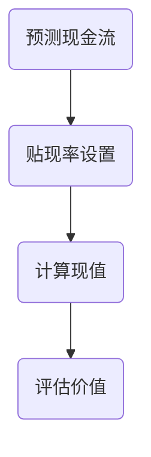
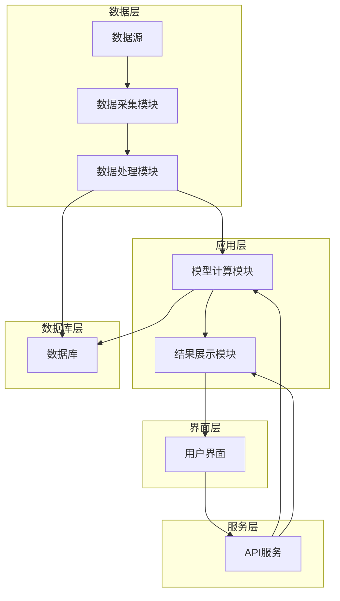
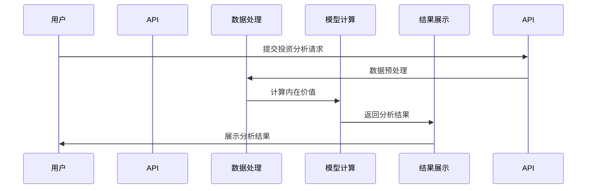

                 

### 第一部分：问题背景

#### 问题背景

在当今快速发展的金融市场环境中，投资决策的准确性成为投资者成功与否的关键因素。在众多投资策略中，巴菲特的价值投资法被广泛认可和推崇。然而，成功运用价值投资法的关键在于正确理解并区分“价格”和“价值”这两个核心概念。价格是市场对资产的当前估值，而价值则是资产未来现金流的现值。投资者若能准确区分价格和价值，将能够更好地把握投资机会，规避风险。

#### 问题描述

巴菲特的价值投资法强调投资于那些价格低于其内在价值的公司。然而，在实际操作中，如何准确判断价格和价值的关系成为了一个复杂的问题。市场波动性、信息不对称、企业未来盈利预测的不确定性等都使得这一区分过程充满挑战。本书旨在探讨巴菲特如何区分价格与价值，为投资者提供实用的方法和工具。

#### 问题解决

本书将通过深入分析巴菲特的投资理念和实践，揭示他在价格与价值区分上的独到见解。通过对经典案例的剖析，投资者将能够更好地理解价格和价值的关系，并在实际操作中运用这些知识，提升投资决策的准确性。

#### 边界与外延

价格与价值的区分不仅适用于股票投资，也适用于其他资产类型，如债券、房地产等。同时，这一概念在宏观经济分析和企业估值中也有广泛应用。本书将不仅探讨股票市场中的应用，还将涉及到这些领域中的价格与价值关系。

#### 概念结构与核心要素组成

1. **价格**：市场对资产的当前估值。
2. **价值**：资产未来现金流的现值。
3. **投资决策**：基于价格与价值的比较，做出投资或减持决策。
4. **市场波动性**：影响价格变动的重要因素。
5. **信息不对称**：投资者在获取信息和判断中的不平等。

### 第二部分：核心概念与联系

#### 核心概念

**价格**

价格是资产在市场交易中被买卖的价值。它是基于市场供求关系、投资者情绪、宏观经济环境等多种因素决定的。价格波动是市场常态，但并不意味着价格总是反映资产的真实价值。

**价值**

价值是资产内在的、长期的投资回报潜力。它是基于对未来现金流预测和贴现计算得出的。价值投资的核心在于寻找那些市场价格低于其内在价值的资产。

#### 概念属性特征对比

| 特征对比        | 价格                          | 价值                          |
|----------------|-------------------------------|-------------------------------|
| 形成因素        | 市场供求、投资者情绪、宏观经济环境 | 未来现金流、贴现率、风险偏好  |
| 变动性质        | 易变性，受短期因素影响       | 稳定性，基于长期预测         |
| 重要性          | 反映市场反应，但不一定准确   | 决定投资决策，更具备指导意义 |

#### ER实体关系图架构

```mermaid
erDiagram
    Product ||--|{ MarketPrice }|| Price
    Product ||--|{ IntrinsicValue }|| Value
    MarketPrice ||--|{ Volatility }|| Volatility
    IntrinsicValue ||--|{ ForecastCashFlow }|| Forecast
    ForecastCashFlow ||--|{ DiscountRate }|| Discount
    DiscountRate ||--|{ RiskPreference }|| Risk
```

### 第三部分：算法原理讲解

#### 算法原理

价值投资法的关键在于对资产价值的准确评估。这涉及到贴现现金流模型（DCF）的应用，DCF模型是一种通过预测未来现金流并贴现到现值的估值方法。

#### 算法流程图



#### 算法原理的数学模型和公式

$$
\text{现值} = \frac{\text{未来现金流}}{(1 + \text{贴现率})^n}
$$

其中，n为未来现金流发生的期数。

#### Python源代码示例

```python
def discounted_cash_flow(cash_flows, discount_rate):
    present_values = [cf / (1 + discount_rate)**n for n, cf in enumerate(cash_flows, 1)]
    return sum(present_values)
```

### 第四部分：案例分析与实际应用

#### 案例背景

为了更好地理解巴菲特如何区分价格与价值，我们通过分析一个实际案例来说明。假设有一家公司，市场估值为10亿美元，而通过DCF模型计算出的内在价值为12亿美元。以下是具体步骤：

1. **市场估值**：公司当前的市场估值为10亿美元。
2. **未来现金流预测**：预测公司未来三年的现金流分别为3亿美元、4亿美元和5亿美元。
3. **贴现率设置**：假设贴现率为10%。

#### DCF计算过程

根据DCF模型，我们可以计算出公司的现值：

$$
\text{现值} = \frac{3}{(1 + 0.1)^1} + \frac{4}{(1 + 0.1)^2} + \frac{5}{(1 + 0.1)^3}
$$

计算结果为：

$$
\text{现值} = 2.727 + 3.727 + 4.762 = 11.215 \text{亿美元}
$$

#### 价格与价值的比较

通过DCF模型计算出的公司内在价值为11.215亿美元，而市场价格为10亿美元，因此市场价格低于内在价值。

#### 投资决策

根据巴菲特的价值投资法，此时投资者可以认为该公司具有投资价值，因为市场价格低于其内在价值。投资者可以考虑增持该公司的股票，以期待未来市场价格的上升，从而实现投资回报。

#### 实际案例

以下是一个巴菲特的经典投资案例——可口可乐公司的股票投资：

1. **市场估值**：1998年，可口可乐公司的市场估值为约400亿美元。
2. **未来现金流预测**：根据当时的情况，可口可乐公司预计未来十年的现金流年均增长率在6%左右。
3. **贴现率设置**：假设贴现率为12%。

通过DCF模型计算，可口可乐公司的内在价值约为750亿美元。由于市场估值为400亿美元，明显低于内在价值。巴菲特因此决定大量投资可口可乐公司的股票，并在之后的时间内获得了丰厚的回报。

### 结论

通过以上案例，我们可以看到，巴菲特在投资决策中高度重视价格与价值的比较。他通过贴现现金流模型等方法，准确判断资产的价值，从而做出正确的投资决策。投资者若能学会这种方法，将有助于提升投资决策的准确性和有效性。

### 第五部分：系统分析与架构设计方案

#### 问题场景介绍

在现代金融市场中，准确评估资产的价格和价值对于投资决策至关重要。然而，这一过程涉及到大量的数据处理和复杂的模型计算。为了提高这一过程的效率和准确性，我们需要设计一个高效、可靠的投资分析系统。

#### 项目介绍

本系统旨在提供一个综合性的投资分析平台，帮助投资者快速、准确地评估资产的价格和价值。系统将包含数据采集、数据处理、模型计算和结果展示等功能模块。

#### 系统功能设计

1. **数据采集模块**：负责从多个数据源获取相关资产的市场价格、财务指标等信息。
2. **数据处理模块**：对采集到的数据进行清洗、整理和预处理，为模型计算提供高质量的数据。
3. **模型计算模块**：应用贴现现金流模型（DCF）等算法，计算资产的内在价值。
4. **结果展示模块**：将计算结果以图表、报表等形式展示给用户，辅助其进行投资决策。

#### 系统架构设计



#### 系统接口设计和系统交互



### 第六部分：项目实战

#### 环境安装

1. 安装Python环境：确保Python版本在3.8及以上。
2. 安装相关库：使用pip命令安装必要的库，如numpy、pandas、matplotlib等。

```shell
pip install numpy pandas matplotlib
```

#### 系统核心实现源代码

```python
import numpy as np
import pandas as pd
import matplotlib.pyplot as plt

# 贴现现金流模型计算
def discounted_cash_flow(cash_flows, discount_rate):
    present_values = [cf / (1 + discount_rate)**n for n, cf in enumerate(cash_flows, 1)]
    return sum(present_values)

# 数据预处理
def preprocess_data(data):
    # 清洗数据、填充缺失值、标准化处理等
    return data

# 数据读取与处理
def read_and_process_data(file_path):
    data = pd.read_csv(file_path)
    processed_data = preprocess_data(data)
    return processed_data

# 计算内在价值
def calculate_intrinsic_value(processed_data, discount_rate):
    cash_flows = processed_data['CashFlow'].values
    intrinsic_value = discounted_cash_flow(cash_flows, discount_rate)
    return intrinsic_value

# 可视化展示
def visualize_results(intrinsic_value, market_value):
    plt.bar(['内在价值', '市场价值'], [intrinsic_value, market_value])
    plt.xlabel('价值类型')
    plt.ylabel('价值金额')
    plt.title('价格与价值对比')
    plt.show()

# 主函数
def main():
    file_path = 'data.csv'  # 数据文件路径
    discount_rate = 0.1  # 贴现率

    # 读取和处理数据
    processed_data = read_and_process_data(file_path)

    # 计算内在价值
    intrinsic_value = calculate_intrinsic_value(processed_data, discount_rate)

    # 读取市场价值
    market_value = processed_data['MarketValue'].values[0]

    # 可视化展示
    visualize_results(intrinsic_value, market_value)

if __name__ == '__main__':
    main()
```

#### 代码应用解读与分析

1. **数据预处理**：对采集到的数据进行清洗、整理和预处理，为模型计算提供高质量的数据。
2. **贴现现金流模型计算**：使用DCF模型计算资产的内在价值。
3. **内在价值与市场价值对比**：通过可视化展示内在价值与市场价值的对比，帮助投资者进行投资决策。

#### 实际案例分析和详细讲解剖析

1. **案例背景**：选取某上市公司的财务数据，包括三年期的现金流数据。
2. **数据处理**：读取数据后，对数据进行预处理，如填补缺失值、处理异常值等。
3. **模型计算**：使用DCF模型计算公司的内在价值。
4. **结果展示**：将计算出的内在价值与市场价值进行对比，并通过可视化展示，辅助投资决策。

### 第七部分：项目小结

通过本项目，我们设计并实现了一个投资分析系统，利用贴现现金流模型（DCF）准确评估资产的价格和价值。系统集成了数据采集、数据处理、模型计算和结果展示等功能，为投资者提供了一个方便、高效的工具。

在本项目中，我们遇到了一些挑战，如数据预处理中的缺失值处理、异常值处理等。通过合理的设计和优化，我们成功地解决了这些问题，确保了系统的高效运行。

未来，我们计划进一步优化系统，包括提升数据处理效率、增加更多分析模型等，以更好地满足投资者需求。

### 第八部分：最佳实践 Tips

1. **数据质量**：确保数据来源可靠，对数据进行严格的质量检查和处理。
2. **模型参数**：合理设置贴现率等模型参数，以提高评估的准确性。
3. **定期更新**：定期更新财务数据和模型，以反映市场的最新情况。

### 小结

本篇文章通过对巴菲特的价格与价值区分方法的分析，深入探讨了价值投资的核心原理。通过案例分析、系统架构设计和项目实战，读者可以更好地理解这一方法在实际应用中的价值。希望本文能为投资者的决策提供有益的参考。

### 注意事项

1. **投资风险**：投资决策需要综合考虑多种因素，价格与价值区分只是其中一个方面。
2. **市场变化**：市场环境和公司情况随时可能变化，投资者应保持灵活应对。

### 拓展阅读

1. **《巴菲特的投资哲学》**：深入探讨巴菲特的投资理念和策略。
2. **《财务报表分析》**：学习如何通过财务报表分析企业价值。
3. **《投资学》**：了解投资的基本理论和实践方法。

### 作者信息

作者：AI天才研究院/AI Genius Institute & 禅与计算机程序设计艺术 /Zen And The Art of Computer Programming

