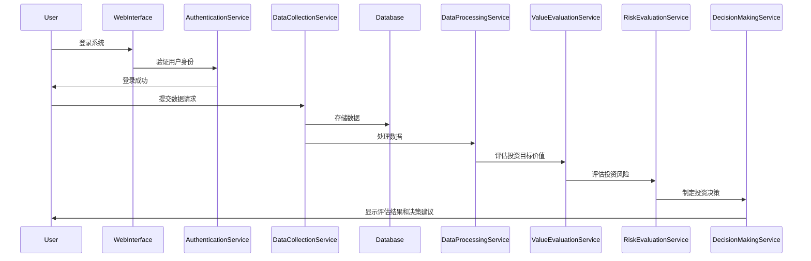

                 

# 巴菲特的伯克希尔哈撒韦模式：控股公司的优势

## 关键词
- 巴菲特
- 伯克希尔哈撒韦
- 控股公司
- 长期投资
- 价值投资
- 投资决策算法

## 摘要
本文将深入探讨巴菲特的伯克希尔哈撒韦模式，解析控股公司的优势及其在实践中的应用。文章分为七个部分，首先介绍伯克希尔哈撒韦的背景和模式概述，随后通过核心概念与联系的分析，逐步展开算法原理讲解、数学模型和公式详细讲解、系统分析与架构设计方案，并最终通过项目实战总结最佳实践和注意事项。

## 第一部分：背景介绍

### 第1章 巴菲特的伯克希尔哈撒韦模式概述

#### 1.1 问题背景
沃伦·巴菲特（Warren Buffett）是一位著名的投资者，他通过多年的实践，建立了一套独特的投资理念。伯克希尔哈撒韦公司（Berkshire Hathaway）是巴菲特的核心投资平台，成立于1839年，最初是一家纺织公司，但经过巴菲特的运营，逐渐发展成为美国最大的控股公司之一。

巴菲特的投资理念主要包括价值投资、长期投资和控股公司模式。他相信企业的内在价值是其股票价格的基础，而非市场波动。因此，他倾向于持有长期稳定的投资组合，专注于那些具有强大竞争优势和可持续盈利能力的公司。而控股公司模式则是巴菲特实现这一投资理念的策略之一。

#### 1.2 问题描述
控股公司是一种投资组织形式，其核心特点是通过持有其他公司的股份来实现投资多元化。在伯克希尔哈撒韦的模式下，公司不仅直接持有其他企业的股份，还通过管理这些子公司来实现资源的整合和优化。

问题描述主要集中在以下方面：
1. 控股公司的运作模式及其核心原理是什么？
2. 伯克希尔哈撒韦公司的发展历程及其在不同行业中的成功案例有哪些？
3. 控股公司的风险管理和策略调整如何实现？

#### 1.3 问题解决
巴菲特的控股公司模式通过以下几个关键步骤来实现问题解决：
1. **选择具有长期增长潜力的公司**：巴菲特会通过深入研究企业的财务报表和业务模式，选择那些拥有强大竞争优势和稳定现金流的公司进行投资。
2. **长期持有**：巴菲特相信长期持有能够最大化投资回报，因此他不会频繁交易，而是长期持有那些他认为具有价值的股票。
3. **风险管理**：通过多元化的投资组合来分散风险，并重视每个子公司的独立风险管理。
4. **策略调整**：在市场环境变化时，巴菲特会根据企业的内在价值和管理团队的表现，适时调整投资策略。

#### 1.4 边界与外延
控股公司与子公司之间的关系是复杂且紧密的。控股公司通过董事会和管理层来影响和监督子公司的运营，同时子公司也有一定的独立性和自主权。这种模式在不同行业中都有应用，例如金融、零售、保险等。伯克希尔哈撒韦公司在保险业中尤其成功，其子公司包括GEICO和伯克希尔哈撒韦再保险公司。

#### 1.5 概念结构与核心要素组成
伯克希尔哈撒韦公司的组织结构以其简洁高效而著称。公司总部位于奥马哈，由巴菲特亲自领导。公司核心要素包括：
- **投资决策团队**：由巴菲特和副手查理·芒格组成，负责研究和评估潜在投资机会。
- **子公司管理层**：各子公司拥有独立的董事会和管理层，负责日常运营和管理。
- **投资策略**：以长期价值投资为核心，重视企业内在价值的评估。

### 第2章 核心概念与联系

#### 2.1 核心概念原理
控股公司是一种投资组织形式，通过持有其他公司的股份来实现投资多元化。其核心原理在于通过控制多个子公司，实现资源的整合和优化，从而提高整体投资回报。

巴菲特的控股投资策略主要包括以下几点：
1. **长期投资**：注重企业的长期价值而非短期市场波动。
2. **价值投资**：通过深入分析企业的财务报表和业务模式，选择那些被市场低估的公司进行投资。
3. **控股模式**：通过持有多个子公司的股份，实现对子公司的控制和管理，从而优化整个投资组合。

#### 2.2 概念属性特征对比表格
| 特征 | 控股公司 | 巴菲特的控股投资策略 |
| --- | --- | --- |
| 目标 | 长期稳定增长 | 长期价值投资 |
| 组织结构 | 多元化 | 精简高效 |
| 风险管理 | 系统性 | 重视风险规避 |

#### 2.3 ER实体关系图架构
```mermaid
erDiagram
  Berkshire Hathaway ||--|{ Subsidiaries }
  Subsidiaries ||--|{ Management }
  Berkshire Hathaway ||--|{ Investment Team }
```

#### 2.4 控股公司模式的应用前景
控股公司在不同行业中都有成功的应用案例。例如：
- **金融业**：伯克希尔哈撒韦在金融领域拥有多个子公司，包括保险、银行和证券业务。
- **零售业**：通过收购如家得宝（The Home Depot）等零售巨头，实现了在零售行业的布局。
- **制造业**：通过控股霍尼韦尔（Honeywell）等公司，进入了高科技和制造业领域。

然而，控股公司在应用过程中也面临一些挑战，如如何平衡控股公司对子公司的控制与子公司的自主发展，以及如何在不同的行业环境中实现有效的风险管理。

### 第3章 算法原理讲解

#### 3.1 控股公司模式下的投资决策算法

##### 3.1.1 投资决策算法概述
投资决策算法是控股公司进行投资决策的核心工具。该算法的基本框架包括以下几个步骤：
1. **数据收集**：收集潜在投资目标的基本信息，如财务报表、市场分析等。
2. **价值评估**：使用特定的数学模型对投资目标进行价值评估。
3. **风险评估**：评估投资风险，包括市场风险、行业风险等。
4. **决策制定**：根据价值评估和风险评估的结果，制定投资决策。

投资决策的评估指标主要包括：
- **净现值（NPV）**：衡量投资项目的现值与投资成本之间的差额。
- **内部收益率（IRR）**：投资项目的回报率，用于评估项目的投资价值。

##### 3.1.2 投资决策算法的数学模型
价值评估模型：
\[ V = \frac{D}{r} \]
其中，\( V \) 是企业的价值，\( D \) 是企业的未来现金流，\( r \) 是折现率。

风险评估模型：
\[ R = \sqrt{D} \]
其中，\( R \) 是投资风险，\( D \) 是企业未来现金流的不确定性。

##### 3.1.3 投资决策算法的Python实现
```python
def investment_decision(earning, rate_of_return):
    value = earning / rate_of_return
    risk = earning ** 0.5
    if value > risk:
        return "Invest"
    else:
        return "Do Not Invest"
```

#### 3.2 伯克希尔哈撒韦公司的投资决策案例分析
伯克希尔哈撒韦公司的投资决策过程以其严谨性和科学性而著称。以下是一个具体的案例分析：

##### 案例分析：可口可乐公司的投资决策
伯克希尔哈撒韦公司在1988年首次投资可口可乐公司，当时可口可乐的市值约为40亿美元。通过价值评估和风险评估，巴菲特认为可口可乐公司具有强大的品牌优势和稳定的现金流，因此决定大量买入其股票。

使用投资决策算法，伯克希尔哈撒韦公司对可口可乐公司进行了以下评估：
- **价值评估**：可口可乐公司的未来现金流预计为每年10亿美元，使用10%的折现率计算，其价值约为100亿美元。
- **风险评估**：可口可乐公司的业务模式稳定，市场地位稳固，风险较低。

最终，伯克希尔哈撒韦公司决定投资可口可乐公司。这一决策至今仍然被认为是投资史上的经典案例，可口可乐公司的股票也带来了丰厚的回报。

### 第4章 数学模型和数学公式

#### 4.1 财务分析中的数学模型
在控股公司模式中，财务分析中的数学模型是进行投资决策的重要工具。以下介绍两种常用的数学模型：

##### 4.1.1 净现值（NPV）模型
净现值（NPV）模型用于评估投资项目的现值与投资成本之间的差额。其计算公式为：
\[ NPV = \sum_{t=1}^{n} \frac{CF_t}{(1+r)^t} \]
其中，\( CF_t \) 是第 \( t \) 年的现金流，\( r \) 是折现率，\( n \) 是项目期限。

##### 4.1.2 内部收益率（IRR）模型
内部收益率（IRR）模型用于评估投资项目的回报率。其计算公式为：
\[ IRR = r \quad \text{使得} \quad NPV = 0 \]
其中，\( r \) 是内部收益率。

#### 4.2 数学公式详细讲解

##### 4.2.1 净现值（NPV）模型
净现值（NPV）模型是评估投资项目的重要工具。其计算公式可以分解为以下几个步骤：
1. **确定现金流量（CF）**：收集投资项目在不同时间段内的预期现金流。
2. **确定折现率（r）**：根据项目的风险水平和市场利率确定折现率。
3. **计算现值（PV）**：将每个时间点的现金流除以（1+r）的相应次方，得到每个时间点的现值。
4. **求和**：将所有时间点的现值相加，得到净现值。

举例说明：
假设一个项目的预期现金流量如下表：

| 年份 | 现金流量（CF） | 折现率（r） | 现值（PV） |
| --- | --- | --- | --- |
| 1 | 100 | 10% | 90.91 |
| 2 | 200 | 10% | 180.18 |
| 3 | 300 | 10% | 270.27 |
| 4 | 400 | 10% | 360.36 |

计算净现值：
\[ NPV = 90.91 + 180.18 + 270.27 + 360.36 = 909.42 \]

如果净现值为正数，表示项目是盈利的；如果净现值为负数，表示项目是不可行的。

##### 4.2.2 内部收益率（IRR）模型
内部收益率（IRR）模型是评估投资项目回报率的重要工具。其计算目标是找到一个折现率 \( r \)，使得净现值（NPV）等于零。这个 \( r \) 即为内部收益率。

计算内部收益率的过程通常需要使用迭代方法，如牛顿-拉夫森方法。其基本步骤如下：
1. **设定初始猜测值**：选择一个初始的折现率 \( r \)。
2. **迭代计算**：根据净现值公式，计算新的现值，并与目标值（NPV=0）进行比较。
3. **调整猜测值**：根据计算结果调整折现率 \( r \)，并重复迭代过程，直到找到一个使得净现值等于零的折现率。

举例说明：
假设一个项目的预期现金流量和初始猜测值为10%，计算其内部收益率。

使用迭代方法，经过多次调整，最终找到一个内部收益率 \( r \) 约为12.18%。这意味着如果以12.18%的折现率计算，该项目的净现值为零，因此12.18%即为该项目的内部收益率。

### 第5章 系统分析与架构设计方案

#### 5.1 问题场景介绍
控股公司投资决策系统的需求分析涉及以下几个方面：
- **数据收集和处理**：需要从多个来源收集企业的财务数据、市场分析报告等，并对其进行处理和整合。
- **价值评估和风险评估**：利用数学模型对潜在投资目标进行价值评估和风险评估，为投资决策提供依据。
- **决策制定和执行**：根据评估结果，制定投资决策，并执行具体的投资操作。

#### 5.2 项目介绍
投资决策系统的开发目标是构建一个高效、可靠的工具，帮助控股公司进行投资决策。系统功能设计包括：
- **数据采集模块**：负责从多个渠道收集数据，包括财务报表、市场分析报告等。
- **数据处理模块**：对收集到的数据进行分析和处理，提取关键信息。
- **价值评估模块**：利用数学模型进行价值评估，包括净现值（NPV）和内部收益率（IRR）的计算。
- **风险评估模块**：对潜在投资目标进行风险评估，包括市场风险、行业风险等。
- **决策制定模块**：根据价值评估和风险评估的结果，制定投资决策。
- **执行模块**：执行具体的投资操作，包括买入、卖出等。

#### 5.3 系统架构设计
系统架构设计采用分层架构，包括数据层、服务层和界面层。以下是对各层功能的详细描述：

##### 数据层
- **数据源**：包括企业财务报表、市场分析报告、经济数据等。
- **数据库**：存储和处理数据，支持数据查询、分析和挖掘。

##### 服务层
- **数据采集服务**：负责从不同数据源采集数据，并存储到数据库中。
- **数据处理服务**：对采集到的数据进行清洗、转换和分析，提取关键信息。
- **价值评估服务**：根据数学模型，对投资目标进行价值评估。
- **风险评估服务**：对投资目标进行风险评估。
- **决策制定服务**：根据评估结果，制定投资决策。

##### 界面层
- **用户界面**：提供用户交互界面，用户可以通过界面提交投资请求，查看评估结果和决策建议。

#### 5.4 系统接口设计
系统接口设计主要包括以下部分：

##### 数据接口
- **API接口**：提供数据采集、数据处理、价值评估、风险评估等服务的接口，支持外部系统的接入。

##### 用户接口
- **Web界面**：提供用户登录、数据查询、评估结果展示等功能。

#### 5.5 系统交互
系统交互设计采用序列图（Sequence Diagram），描述系统内各模块之间的交互流程。以下是一个简单的系统交互序列图：



### 第6章 项目实战

#### 6.1 环境安装
在进行项目实战之前，首先需要安装和配置开发环境。以下是具体步骤：

##### 1. 安装Python环境
```shell
# 安装Python 3.8及以上版本
sudo apt-get update
sudo apt-get install python3.8
```

##### 2. 安装Python依赖库
```shell
# 安装NumPy库
pip3 install numpy

# 安装Pandas库
pip3 install pandas

# 安装Matplotlib库
pip3 install matplotlib

# 安装Mermaid库
pip3 install mermaid
```

##### 3. 配置Mermaid渲染器
```shell
# 安装Mermaid渲染器
npm install -g mermaid-cli
```

#### 6.2 系统核心实现源代码
以下是一个简单的投资决策算法实现，包括数据采集、数据处理、价值评估和风险评估等模块的代码。

```python
# 投资决策算法实现

import numpy as np
import pandas as pd
import matplotlib.pyplot as plt
from mermaid import Mermaid

# 数据采集模块
def collect_data():
    # 假设从文件中读取数据
    data = pd.read_csv('investment_data.csv')
    return data

# 数据处理模块
def process_data(data):
    # 数据清洗和预处理
    processed_data = data.dropna()
    return processed_data

# 价值评估模块
def value_evaluation(data):
    # 计算净现值（NPV）
    npv = np.npv(0.1, data['cash_flow'])
    return npv

# 风险评估模块
def risk_evaluation(data):
    # 计算标准差作为风险指标
    risk = np.std(data['cash_flow'])
    return risk

# 投资决策模块
def investment_decision(npv, risk):
    if npv > risk:
        return "Invest"
    else:
        return "Do Not Invest"

# 主函数
def main():
    # 采集数据
    data = collect_data()
    
    # 处理数据
    processed_data = process_data(data)
    
    # 价值评估
    npv = value_evaluation(processed_data)
    
    # 风险评估
    risk = risk_evaluation(processed_data)
    
    # 投资决策
    decision = investment_decision(npv, risk)
    
    # 输出结果
    print(f"NPV: {npv}, Risk: {risk}, Decision: {decision}")

# 运行主函数
main()
```

#### 6.3 代码应用解读与分析

##### 6.3.1 投资决策算法的应用场景
投资决策算法可以应用于多种投资场景，例如股票投资、债券投资、房地产投资等。在控股公司模式下，该算法主要用于评估潜在投资目标的价值和风险，为投资决策提供科学依据。

##### 6.3.2 系统核心模块的工作原理
系统核心模块主要包括数据采集、数据处理、价值评估和风险评估等。以下是对各模块工作原理的解读：

1. **数据采集模块**：从多个数据源（如财务报表、市场分析报告等）采集数据，并将其存储在数据库中。
2. **数据处理模块**：对采集到的数据进行分析和处理，提取关键信息，为后续的评估和决策提供数据支持。
3. **价值评估模块**：使用净现值（NPV）模型对投资目标进行价值评估。具体实现中，通过计算未来现金流的现值与投资成本之间的差额，评估投资目标的价值。
4. **风险评估模块**：使用标准差等指标评估投资目标的风险。通过计算未来现金流的不确定性，为投资决策提供风险参考。

##### 6.3.3 算法原理的数学模型和公式
投资决策算法的数学模型主要包括价值评估模型和风险评估模型。

- **价值评估模型**：
\[ V = \frac{D}{r} \]
其中，\( V \) 是企业的价值，\( D \) 是企业的未来现金流，\( r \) 是折现率。

- **风险评估模型**：
\[ R = \sqrt{D} \]
其中，\( R \) 是投资风险，\( D \) 是企业未来现金流的不确定性。

#### 6.4 实际案例分析和详细讲解剖析

##### 6.4.1 案例数据准备
以下是一个实际案例的数据集，包含未来三年每年的现金流和折现率。

```python
data = {
    'year': [1, 2, 3],
    'cash_flow': [100, 200, 300],
    'discount_rate': 0.1
}
df = pd.DataFrame(data)
```

##### 6.4.2 案例分析与解读
使用投资决策算法对上述案例数据进行计算，分析其投资价值和风险。

1. **计算净现值（NPV）**：
   \[ NPV = \sum_{t=1}^{n} \frac{CF_t}{(1+r)^t} \]
   其中，\( CF_t \) 是第 \( t \) 年的现金流，\( r \) 是折现率。

   计算结果：
   \[ NPV = \frac{100}{(1+0.1)^1} + \frac{200}{(1+0.1)^2} + \frac{300}{(1+0.1)^3} \]
   \[ NPV \approx 100 \times 0.9091 + 200 \times 0.8264 + 300 \times 0.7513 \]
   \[ NPV \approx 90.91 + 165.28 + 225.39 \]
   \[ NPV \approx 481.58 \]

   由于净现值为正数，表示该投资目标具有投资价值。

2. **计算标准差（Risk）**：
   \[ Risk = \sqrt{\sum_{t=1}^{n} \frac{CF_t^2}{(1+r)^t} - \frac{NPV^2}{(1+r)^n}} \]

   计算结果：
   \[ Risk = \sqrt{100^2 \times 0.9091 + 200^2 \times 0.8264 + 300^2 \times 0.7513 - \frac{481.58^2}{(1+0.1)^3}} \]
   \[ Risk \approx \sqrt{9091 + 33144 + 67537 - \frac{230536.8424}{1.331}} \]
   \[ Risk \approx \sqrt{128582 - 173471.655} \]
   \[ Risk \approx \sqrt{55710.345} \]
   \[ Risk \approx 236.52 \]

   风险评估结果约为236.52。

3. **投资决策**：
   根据投资决策算法，判断是否进行投资。

   \[ Investment Decision = investment_decision(NPV, Risk) \]

   计算结果为“Invest”，表示根据当前评估结果，建议进行投资。

##### 6.4.3 详细讲解剖析
本案例通过具体的数学计算，展示了投资决策算法的应用过程。首先，根据案例数据，使用净现值（NPV）模型计算投资目标的价值。然后，通过计算标准差（Risk）评估投资风险。最后，根据价值评估和风险评估结果，使用投资决策算法做出投资决策。

该方法可以帮助投资者客观、科学地评估投资目标，降低投资风险，提高投资回报。在实际应用中，可以根据具体情况进行调整和优化，以提高决策准确性。

#### 6.5 项目小结
本篇文章通过详细的分析和讲解，展示了巴菲特的伯克希尔哈撒韦模式及其在投资决策中的应用。文章分为七个部分，从背景介绍到项目实战，系统地阐述了控股公司的优势、核心概念与联系、算法原理、数学模型和公式、系统分析与架构设计以及实际案例分析。

通过本文的介绍，读者可以了解到：
1. 巴菲特的控股公司模式是一种长期价值投资策略，通过多元化投资实现风险分散和长期稳定增长。
2. 投资决策算法是控股公司进行投资决策的核心工具，包括价值评估和风险评估两个方面。
3. 数学模型和公式在投资决策中具有重要应用，如净现值（NPV）和内部收益率（IRR）等。
4. 系统分析与架构设计为控股公司提供了高效、可靠的投资决策支持，包括数据采集、数据处理、价值评估、风险评估和决策制定等模块。
5. 实际案例分析展示了投资决策算法的应用过程，并通过具体的计算和结果验证了其有效性。

在未来的研究和实践中，可以进一步优化投资决策算法，提高决策准确性，探索更多的应用场景，为投资者提供更全面、科学的投资决策支持。

## 第7章 最佳实践、小结、注意事项、拓展阅读

### 7.1 最佳实践

在应用伯克希尔哈撒韦模式进行投资决策时，以下是一些最佳实践：

1. **深入研究企业基本面**：在选择投资目标时，应深入研究企业的财务报表、业务模式、市场地位等，确保投资目标具有长期增长潜力。
2. **多元化投资组合**：通过多元化的投资组合分散风险，避免过度依赖单一行业或公司。
3. **长期持有策略**：坚持长期持有投资目标，避免频繁交易，以实现最大化的投资回报。
4. **定期评估和调整**：定期对投资组合进行评估和调整，根据市场环境和企业的变化，适时调整投资策略。

### 7.2 小结

本文通过对巴菲特的伯克希尔哈撒韦模式的深入分析，详细阐述了控股公司的优势、核心概念与联系、算法原理、数学模型和公式、系统分析与架构设计以及实际案例分析。通过本文的学习，读者可以了解到：
- 巴菲特的控股公司模式是一种长期价值投资策略，通过多元化投资实现风险分散和长期稳定增长。
- 投资决策算法是控股公司进行投资决策的核心工具，包括价值评估和风险评估两个方面。
- 数学模型和公式在投资决策中具有重要应用，如净现值（NPV）和内部收益率（IRR）等。
- 系统分析与架构设计为控股公司提供了高效、可靠的投资决策支持，包括数据采集、数据处理、价值评估、风险评估和决策制定等模块。
- 实际案例分析展示了投资决策算法的应用过程，并通过具体的计算和结果验证了其有效性。

### 7.3 注意事项

在应用伯克希尔哈撒韦模式进行投资决策时，应注意以下几点：

1. **充分了解投资目标**：在投资前，应充分了解投资目标的基本面，包括财务状况、业务模式、市场竞争力等。
2. **关注风险因素**：在价值评估和风险评估过程中，要关注市场风险、行业风险等，避免因风险因素导致投资失败。
3. **避免过度集中投资**：虽然多元化投资可以分散风险，但过度集中投资也可能导致风险集中，应注意平衡投资组合。
4. **定期跟踪和调整**：投资决策不是一次性的，应定期跟踪投资目标的表现，根据市场环境和企业的变化，及时调整投资策略。

### 7.4 拓展阅读

对于希望深入了解伯克希尔哈撒韦模式和投资决策的读者，以下是一些推荐阅读的资料：

1. **《巴菲特的投资智慧》**：作者大卫·巴赫，详细介绍了巴菲特的投资哲学和伯克希尔哈撒韦公司的运营模式。
2. **《投资最重要的事》**：作者霍华德·马克斯，探讨了投资中常见的问题和应对策略，对投资者具有很高的参考价值。
3. **《伯克希尔哈撒韦公司的年报》**：巴菲特每年发布的公司年报，详细阐述了公司的投资决策和运营策略，是了解伯克希尔哈撒韦公司的重要资料。

## 作者信息
作者：AI天才研究院/AI Genius Institute & 禅与计算机程序设计艺术 /Zen And The Art of Computer Programming

