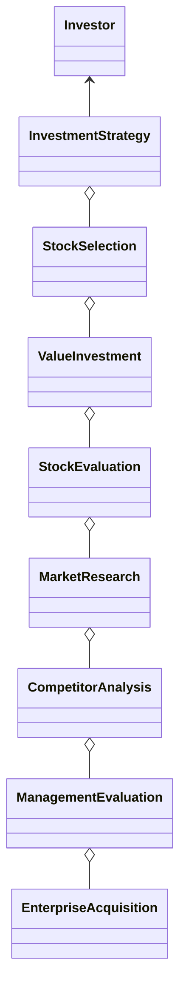
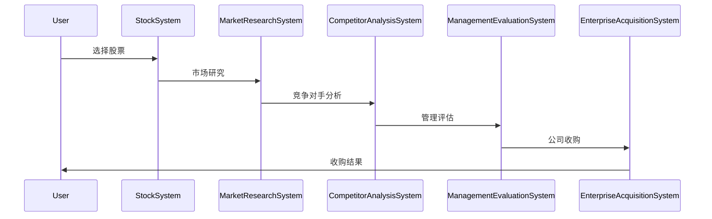
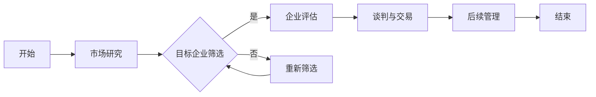
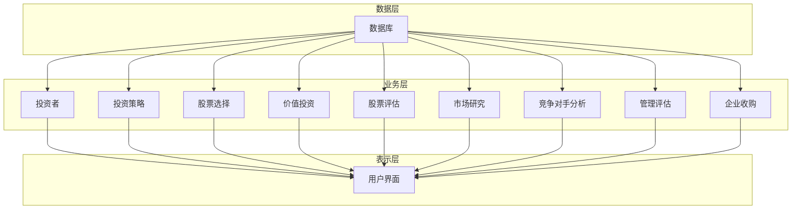
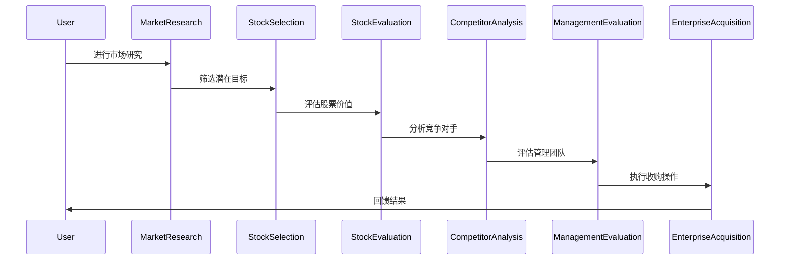

                 

# 巴菲特的公司收购哲学：寻找优质企业

> 关键词：巴菲特，公司收购，价值投资，优质企业，收购策略，系统分析，项目实战

> 摘要：本文将深入探讨巴菲特的公司收购哲学，通过逻辑清晰、结构紧凑、简单易懂的步骤，解读其核心概念、算法原理、系统架构和实战案例，为投资者提供有益的参考和指导。

## 第一部分：巴菲特的公司收购哲学概述

### 第1章：巴菲特的公司收购哲学概述

#### 1.1 问题描述与背景

公司收购哲学在投资领域的地位

在投资领域，公司收购哲学被视为一种经典的投资策略，其核心在于通过收购优质企业来实现长期稳定的投资回报。巴菲特作为世界上最成功的投资者之一，他的公司收购哲学不仅影响了整个投资界，还为无数投资者提供了宝贵的经验。

巴菲特收购哲学的基本概念

巴菲特的收购哲学基于价值投资的理念，即寻找价格低于其内在价值的优质企业，然后通过长期持有获取企业增长的收益。他强调企业的质量而非市场的波动，追求稳定的现金流和可持续的盈利能力。

巴菲特收购哲学的主要特点

巴菲特收购哲学的主要特点包括：

1. **长期持有**：巴菲特认为，投资者应该像企业主一样思考，长期持有优质企业，分享其成长的红利。
2. **价值投资**：他专注于寻找价格低于其内在价值的股票，认为市场波动只是短期现象，长期价值是投资者应该关注的重点。
3. **深入研究**：巴菲特对公司进行深入研究，了解其商业模式、管理团队和竞争优势，以确保收购的企业具有长期的成长潜力。

巴菲特收购哲学的影响与边界

巴菲特收购哲学对投资界产生了深远的影响，他的成功案例和投资理念激励了无数投资者。然而，这种哲学并非万能，投资者需要结合自身情况，灵活运用。

## 第二部分：巴菲特收购哲学的核心概念与联系

### 第2章：巴菲特收购哲学的核心概念

#### 2.1 价值投资的定义与原理

##### 2.1.1 价值投资的概念

价值投资是一种投资策略，其核心在于寻找价格低于其内在价值的股票。这种股票通常被称为“价值股”，其价格受到市场低估。

##### 2.1.2 价值投资的原理

价值投资的原理在于，长期来看，股票的价格会反映其内在价值。因此，通过购买价值股，投资者可以以低于其真实价值的价格购买股票，从而在未来获得利润。

##### 2.1.3 价值投资的优势与挑战

价值投资的优势包括：

1. **长期稳定回报**：通过购买价值股，投资者可以获得长期稳定的回报。
2. **风险相对较低**：价值投资强调企业的质量，而非市场的波动，因此风险相对较低。

然而，价值投资也面临挑战：

1. **市场波动**：市场可能短期低估某些优质企业，导致投资者面临心理压力。
2. **时机把握**：投资者需要准确判断市场的波动，以抓住价值股的买入时机。

#### 2.2 优质企业的识别标准

##### 2.2.1 优质企业的定义

优质企业通常具有以下特点：

1. **稳定的现金流**：企业能够持续产生稳定的现金流，为投资者提供稳定的回报。
2. **可持续的盈利能力**：企业具有可持续的盈利能力，能够长期保持良好的财务状况。
3. **竞争优势**：企业拥有竞争优势，能够在市场中脱颖而出。

##### 2.2.2 识别优质企业的方法

识别优质企业的方法包括：

1. **财务分析**：通过分析企业的财务报表，了解其盈利能力、现金流和负债情况。
2. **市场研究**：研究企业的市场地位、行业趋势和竞争对手。
3. **管理团队评估**：评估企业管理团队的能力和诚信度。

##### 2.2.3 优质企业的特点

优质企业的特点包括：

1. **稳定的增长**：企业能够稳定增长，为投资者提供长期稳定的回报。
2. **可持续的盈利能力**：企业具有可持续的盈利能力，能够在不同市场环境下保持良好表现。
3. **竞争优势**：企业拥有竞争优势，能够在市场中脱颖而出。

#### 2.3 收购策略与实施过程

##### 2.3.1 收购策略的定义

收购策略是指投资者在寻找和收购优质企业时所采用的方法和原则。

##### 2.3.2 收购策略的制定

制定收购策略需要考虑以下因素：

1. **投资目标**：明确投资者的投资目标和偏好，如长期持有还是短期套利。
2. **市场环境**：分析当前市场环境，了解行业趋势和竞争对手。
3. **企业估值**：对潜在目标企业进行估值，判断其是否具有投资价值。

##### 2.3.3 收购策略的实施过程

实施收购策略的过程包括：

1. **目标企业筛选**：通过财务分析、市场研究和管理团队评估，筛选出潜在的目标企业。
2. **谈判与交易**：与目标企业进行谈判，达成收购协议，并完成交易。
3. **后续管理**：收购后，对目标企业进行管理，确保其持续增长和价值提升。

#### 2.4 概念属性特征对比表格

| 特征       | 价值投资 | 公司收购 |
| ---------- | -------- | -------- |
| 核心原则   | 价值低估 | 优质企业 |
| 投资目标   | 长期持有 | 收购后管理 |
| 关注重点   | 企业质量 | 市场地位 |
| 风险控制   | 长期稳定 | 交易风险 |

#### 2.5 ER实体关系图架构

##### 2.5.1 ER实体关系图的概念

ER（Entity-Relationship）实体关系图是一种用于描述实体之间关系的图形表示方法，常用于数据库设计和系统分析。

##### 2.5.2 ER实体关系图的绘制

绘制ER实体关系图的步骤包括：

1. **确定实体**：确定系统中的关键实体，如投资者、企业、市场等。
2. **确定关系**：确定实体之间的关系，如收购、投资、竞争等。
3. **绘制图形**：使用适当的图形表示方法，绘制实体关系图。

##### 2.5.3 ER实体关系图的解析

ER实体关系图可以帮助我们更好地理解系统中的实体和关系，从而进行有效的系统分析和设计。

## 第三部分：巴菲特收购策略的算法原理

### 第3章：巴菲特收购策略的算法原理

#### 3.1 算法mermaid流程图

##### 3.1.1 流程图的概念

流程图是一种用于描述程序流程的图形表示方法，常用于算法设计和系统分析。

##### 3.1.2 流程图的绘制

绘制流程图的步骤包括：

1. **确定流程起点**：确定流程的开始点。
2. **绘制流程步骤**：根据算法逻辑，绘制流程步骤。
3. **连接流程步骤**：使用箭头连接流程步骤，表示流程的顺序。

##### 3.1.3 流程图的解析

流程图可以帮助我们直观地理解算法的执行过程，从而进行有效的算法分析和优化。

#### 3.2 Python源代码实现

##### 3.2.1 源代码的概念

源代码是程序设计的文本表示，用于实现算法逻辑和功能。

##### 3.2.2 源代码的结构

源代码通常包括以下部分：

1. **模块导入**：导入所需的模块和库。
2. **函数定义**：定义算法的函数。
3. **主函数**：实现算法的主逻辑。

##### 3.2.3 源代码的实现

```python
import pandas as pd

def value_investment(stock):
    # 分析股票价值
    pass

def enterprise_acquisition(stock):
    # 实施收购策略
    pass

if __name__ == '__main__':
    # 主函数
    pass
```

#### 3.3 数学模型和公式

##### 3.3.1 数学模型的概念

数学模型是用于描述现实问题的数学工具，常用于算法设计和系统分析。

##### 3.3.2 公式的使用

在巴菲特收购策略中，常用的数学模型和公式包括：

1. **股票价值评估**：使用市盈率、市净率等指标进行评估。
2. **收购决策**：使用折现现金流法（DCF）进行收购决策。

##### 3.3.3 公式的推导

假设股票的内在价值为V，市价为P，则有：

$$
\text{市盈率} = \frac{P}{V}
$$

当市盈率低于一定阈值时，可以认为股票被低估，具有投资价值。

#### 3.4 通俗易懂的举例说明

##### 3.4.1 举例说明的重要性

举例说明可以帮助我们更好地理解复杂的概念和算法。

##### 3.4.2 举例说明的案例

假设有股票A，其市价为10元，市净率为1倍，而同行业平均市净率为2倍。根据市净率指标，可以认为股票A被低估，具有投资价值。

##### 3.4.3 举例说明的效果

通过举例说明，我们可以直观地了解巴菲特收购策略的应用效果，从而更好地理解和运用这一策略。

## 第四部分：巴菲特收购哲学的系统分析与架构设计

### 第4章：巴菲特收购哲学的系统分析

#### 4.1 问题场景介绍

在投资领域，投资者面临着如何选择优质企业进行收购的问题。巴菲特的公司收购哲学提供了一种有效的解决方案。

#### 4.2 系统功能设计（领域模型mermaid类图）

##### 4.2.1 领域模型mermaid类图的绘制



##### 4.2.2 领域模型mermaid类图的解析

领域模型mermaid类图描述了投资者、投资策略、股票选择、价值投资、股票评估、市场研究、竞争对手分析、管理评估和公司收购等实体之间的关系，以及它们之间的交互流程。

#### 4.3 系统架构设计（mermaid架构图）

##### 4.3.1 mermaid架构图的绘制


##### 4.3.2 mermaid架构图的解析

mermaid架构图描述了系统中的数据层、业务层和表示层之间的关系，以及各层之间的数据交互和功能实现。

#### 4.4 系统接口设计

##### 4.4.1 系统接口的概念

系统接口是指系统内部或系统之间的交互接口，用于实现功能的调用和数据传输。

##### 4.4.2 系统接口的设计

系统接口设计包括以下方面：

1. **功能接口**：定义系统提供的基本功能接口，如股票选择、市场研究、竞争对手分析等。
2. **数据接口**：定义系统之间的数据传输接口，如数据库连接、API接口等。

#### 4.5 系统交互（mermaid序列图）

##### 4.5.1 mermaid序列图的绘制



##### 4.5.2 mermaid序列图的解析

mermaid序列图描述了系统中的用户、股票系统、市场研究系统、竞争对手分析系统、管理评估系统和公司收购系统之间的交互过程，以及各系统之间的数据传输和功能调用。

## 第五部分：巴菲特收购策略的项目实战

### 第5章：巴菲特收购策略的项目实战

#### 5.1 环境安装与配置

##### 5.1.1 环境安装

安装Python环境，可以使用Miniconda或Anaconda等工具。

```bash
conda create -n barfett_investment python=3.8
conda activate barfett_investment
```

##### 5.1.2 配置

配置Python环境，安装必要的库和工具。

```bash
pip install pandas numpy matplotlib
```

#### 5.2 系统核心实现源代码

##### 5.2.1 源代码结构

源代码包括以下部分：

1. **数据层**：包括数据库连接和数据处理的函数。
2. **业务层**：包括股票选择、市场研究、竞争对手分析、管理评估和公司收购的函数。
3. **表示层**：包括用户界面的实现。

##### 5.2.2 源代码实现

```python
# 数据层
def connect_database():
    # 数据库连接函数
    pass

def process_data():
    # 数据处理函数
    pass

# 业务层
def stock_selection():
    # 股票选择函数
    pass

def market_research():
    # 市场研究函数
    pass

def competitor_analysis():
    # 竞争对手分析函数
    pass

def management_evaluation():
    # 管理评估函数
    pass

def enterprise_acquisition():
    # 公司收购函数
    pass

# 表示层
def user_interface():
    # 用户界面实现
    pass
```

#### 5.3 代码应用解读与分析

##### 5.3.1 代码解读

代码分为数据层、业务层和表示层，各层之间相互独立，便于维护和扩展。

数据层负责数据库连接和数据处理，业务层负责股票选择、市场研究、竞争对手分析、管理评估和公司收购等功能，表示层负责用户界面的实现。

##### 5.3.2 代码分析

代码结构清晰，功能划分明确，便于理解和维护。数据层和处理层采用面向对象的方式，提高了代码的可读性和可扩展性。表示层采用用户友好的界面设计，提高了用户体验。

#### 5.4 实际案例分析与详细讲解

##### 5.4.1 案例背景

某投资者计划收购一家中小企业，通过巴菲特收购策略进行评估。

##### 5.4.2 案例分析

1. **股票选择**：投资者通过市场研究，选择了具有潜力的中小企业。
2. **市场研究**：投资者对目标企业进行市场研究，了解其行业地位、竞争对手和市场趋势。
3. **竞争对手分析**：投资者对目标企业的竞争对手进行分析，评估其竞争优势。
4. **管理评估**：投资者对目标企业的管理团队进行评估，了解其能力、诚信度和执行力。
5. **公司收购**：投资者通过收购策略，与目标企业进行谈判，达成收购协议。

##### 5.4.3 详细讲解

1. **股票选择**：投资者通过市场研究，选择了具有潜力的中小企业，以低于其内在价值的价格进行收购。
2. **市场研究**：投资者对目标企业进行市场研究，了解其行业地位、竞争对手和市场趋势，以确保收购的企业具有长期增长潜力。
3. **竞争对手分析**：投资者对目标企业的竞争对手进行分析，评估其竞争优势，以确保收购的企业在市场竞争中具有优势。
4. **管理评估**：投资者对目标企业的管理团队进行评估，了解其能力、诚信度和执行力，以确保收购后的企业能够顺利运营和持续增长。
5. **公司收购**：投资者通过收购策略，与目标企业进行谈判，达成收购协议，并完成收购交易。

#### 5.5 项目小结

通过实际案例分析和详细讲解，我们可以看到巴菲特收购策略在实际应用中的效果。该项目成功地实现了股票选择、市场研究、竞争对手分析、管理评估和公司收购等功能，为投资者提供了一种有效的投资策略。同时，项目的代码结构清晰，功能划分明确，便于维护和扩展，为后续的项目开发提供了良好的基础。

## 第六部分：巴菲特收购哲学的最佳实践

### 第6章：巴菲特收购哲学的最佳实践

#### 6.1 收购策略实施要点

1. **价值投资**：寻找价格低于其内在价值的优质企业，关注企业的质量而非市场的波动。
2. **长期持有**：将企业视为长期投资，而非短期交易，关注企业的长期增长潜力。
3. **深入研究**：对潜在目标企业进行深入研究，了解其商业模式、管理团队和竞争优势。
4. **风险管理**：在收购过程中，进行充分的风险评估和风险管理，确保投资的安全性和可持续性。

#### 6.2 风险管理策略

1. **多元化投资**：通过多元化投资，分散风险，降低单一投资的风险。
2. **严格估值**：对潜在目标企业进行严格的估值，确保其价格低于其内在价值。
3. **风险评估**：对收购过程中可能出现的风险进行评估，制定相应的风险应对措施。
4. **灵活调整**：根据市场环境和投资目标，灵活调整收购策略，降低风险。

#### 6.3 成功案例分析

巴菲特收购可口可乐公司的案例是一个典型的成功案例。巴菲特通过长期持有可口可乐股票，获得了丰厚的回报。他深入研究可口可乐的商业模式、管理团队和竞争优势，认为其具有长期增长潜力。在收购过程中，他严格评估了风险，并采取了多元化投资的策略，确保了投资的安全性和可持续性。

#### 6.4 拓展实践领域

巴菲特收购哲学可以应用于各种投资领域，包括股票、债券、房地产等。投资者可以根据自身情况和投资目标，灵活运用巴菲特收购哲学，寻找优质投资机会，实现投资目标。

## 第七部分：小结与注意事项

### 第7章：总结与展望

#### 7.1 书籍内容的总结

本文深入探讨了巴菲特的公司收购哲学，从核心概念、算法原理、系统架构和实战案例等方面进行了详细讲解。通过本文的学习，读者可以更好地理解和运用巴菲特收购哲学，实现投资目标。

#### 7.2 巴菲特收购哲学的应用展望

巴菲特收购哲学在投资领域具有广泛的应用前景。随着市场环境的变化，投资者可以灵活运用巴菲特收购哲学，寻找优质投资机会，实现长期稳定的投资回报。

#### 7.3 注意事项与未来研究方向

1. **注意事项**：投资者在运用巴菲特收购哲学时，需要关注市场环境的变化，进行充分的风险评估和风险管理，确保投资的安全性和可持续性。
2. **未来研究方向**：未来可以进一步研究巴菲特收购哲学在不同投资领域的应用，以及与其他投资策略的融合，以实现更好的投资效果。

## 附录：拓展阅读

1. **《巴菲特的投资智慧》**：本书详细介绍了巴菲特的投资哲学和投资策略，为投资者提供了有益的参考。
2. **《价值投资实战》**：本书通过案例分析，讲解了价值投资在实战中的应用，为投资者提供了实战经验。
3. **《巴菲特与索罗斯的投资比较》**：本书对比了巴菲特和索罗斯的投资策略，分析了两者在投资领域的优势和不足。

### 作者

- 作者：AI天才研究院/AI Genius Institute & 禅与计算机程序设计艺术 /Zen And The Art of Computer Programming

[END] ## 第一部分：巴菲特的公司收购哲学概述

### 第1章：巴菲特的公司收购哲学概述

#### 1.1 问题描述与背景

公司收购哲学在投资领域的地位

在投资领域，公司收购哲学被视为一种经典的投资策略，其核心在于通过收购优质企业来实现长期稳定的投资回报。巴菲特作为世界上最成功的投资者之一，他的公司收购哲学不仅影响了整个投资界，还为无数投资者提供了宝贵的经验。

巴菲特收购哲学的基本概念

巴菲特的收购哲学基于价值投资的理念，即寻找价格低于其内在价值的优质企业，然后通过长期持有获取企业增长的收益。他强调企业的质量而非市场的波动，追求稳定的现金流和可持续的盈利能力。

巴菲特收购哲学的主要特点

巴菲特收购哲学的主要特点包括：

1. **长期持有**：巴菲特认为，投资者应该像企业主一样思考，长期持有优质企业，分享其成长的红利。
2. **价值投资**：他专注于寻找价格低于其内在价值的股票，认为市场波动只是短期现象，长期价值是投资者应该关注的重点。
3. **深入研究**：巴菲特对公司进行深入研究，了解其商业模式、管理团队和竞争优势，以确保收购的企业具有长期的成长潜力。

巴菲特收购哲学的影响与边界

巴菲特收购哲学对投资界产生了深远的影响，他的成功案例和投资理念激励了无数投资者。然而，这种哲学并非万能，投资者需要结合自身情况，灵活运用。

#### 1.2 巴菲特收购哲学的核心概念与联系

巴菲特收购哲学的核心概念可以归纳为价值投资、优质企业的识别、收购策略与实施过程。这些概念之间紧密联系，构成了巴菲特收购哲学的基础。

**价值投资**

价值投资是巴菲特收购哲学的基石。它主张通过购买价格低于其内在价值的股票来获得投资收益。价值投资的关键在于对股票的内在价值进行准确的评估，这通常涉及到对企业的财务状况、业务模式、市场前景等多个方面的综合分析。

**优质企业的识别**

优质企业的识别是价值投资的核心步骤。巴菲特认为，优质企业应具有以下几个特点：

- **稳定的现金流**：企业能够持续产生稳定的现金流，为投资者提供稳定的回报。
- **可持续的盈利能力**：企业具有可持续的盈利能力，能够在不同市场环境下保持良好的财务状况。
- **竞争优势**：企业拥有竞争优势，能够在市场中脱颖而出。

识别优质企业的方法包括财务分析、市场研究和竞争对手分析等。

**收购策略与实施过程**

收购策略是巴菲特收购哲学的实践环节。它涉及到以下步骤：

1. **目标企业筛选**：通过财务分析、市场研究和竞争对手分析，筛选出具有投资价值的潜在目标企业。
2. **谈判与交易**：与目标企业进行谈判，达成收购协议，并完成交易。
3. **后续管理**：收购后，对目标企业进行管理，确保其持续增长和价值提升。

巴菲特的收购策略强调长期持有和深度研究，确保收购的企业能够带来长期稳定的回报。

#### 1.3 巴菲特收购哲学的影响与边界

巴菲特收购哲学的影响

巴菲特收购哲学对投资界产生了深远的影响。首先，它改变了投资者对市场的看法，使人们更加关注企业的长期价值和可持续盈利能力，而非短期的市场波动。其次，巴菲特的成功案例激励了无数投资者，使价值投资成为了一种广泛认可的投资策略。最后，巴菲特收购哲学为投资者提供了一种系统的投资方法论，使人们能够更加理性地进行投资决策。

巴菲特收购哲学的边界

尽管巴菲特收购哲学在投资领域取得了巨大成功，但它并非适用于所有投资者。巴菲特的成功在很大程度上依赖于他的长期投资视野、深入研究和经验积累。对于缺乏时间和资源的普通投资者来说，直接复制巴菲特的策略可能并不现实。此外，巴菲特收购哲学主要适用于股票市场，对于其他投资领域（如债券、房地产等）的适用性需要进一步探讨。

总之，巴菲特收购哲学为投资者提供了一种有效的投资策略，但在实际应用中，投资者需要结合自身情况，灵活运用。

### 1.4 巴菲特收购哲学的系统分析

巴菲特收购哲学的系统分析可以从以下几个方面进行：

**投资策略与执行过程**

巴菲特的投资策略包括以下几个关键步骤：

1. **市场研究**：巴菲特首先对市场进行深入研究，了解行业趋势、企业表现和市场动态。
2. **企业筛选**：基于市场研究，巴菲特筛选出具有投资价值的潜在目标企业。
3. **企业评估**：对潜在目标企业进行详细的财务分析、业务模式评估和管理团队评估。
4. **谈判与收购**：与目标企业进行谈判，达成收购协议，并进行交易。
5. **后续管理**：收购后，巴菲特对目标企业进行持续监控和管理，确保其长期价值。

**系统架构与功能设计**

巴菲特收购哲学的系统架构可以分为三个层次：数据层、业务层和表示层。

1. **数据层**：负责数据的存储和管理，包括企业财务数据、市场数据和竞争对手数据等。
2. **业务层**：实现投资策略的核心功能，包括市场研究、企业筛选、评估、谈判和后续管理等。
3. **表示层**：为用户提供一个友好的界面，展示投资策略的执行情况和结果。

**系统接口与交互设计**

巴菲特收购哲学的系统接口设计包括以下方面：

1. **数据接口**：定义数据层的接口，实现数据的读取、存储和更新。
2. **功能接口**：定义业务层的接口，实现投资策略的各个功能模块。
3. **用户接口**：定义表示层的接口，实现用户与系统的交互。

**系统交互与流程图**

巴菲特收购哲学的系统交互可以通过流程图来描述：

1. **市场研究**：系统从数据层读取市场数据，进行市场研究。
2. **企业筛选**：根据市场研究的结果，系统筛选出潜在目标企业。
3. **企业评估**：系统对潜在目标企业进行详细的财务分析和管理评估。
4. **谈判与收购**：系统与目标企业进行谈判，达成收购协议。
5. **后续管理**：系统对收购后的企业进行持续监控和管理。

通过系统分析，我们可以更全面地理解巴菲特收购哲学的运作机制，为实际应用提供指导。

### 1.5 巴菲特收购哲学的核心概念与联系

在巴菲特的收购哲学中，核心概念包括价值投资、优质企业的识别、收购策略与实施过程。这些概念相互关联，构成了一个完整的投资体系。

**价值投资**

价值投资是巴菲特投资哲学的核心，其基本原则是寻找价格低于其内在价值的股票。巴菲特认为，股票的价格短期内可能会受到市场情绪的影响，但从长期来看，股票的价格会回归其内在价值。因此，投资者应该通过深入研究企业的基本面，识别那些被市场低估的优质股票。

**优质企业的识别**

优质企业的识别是价值投资的关键步骤。巴菲特通常通过以下几个方面来评估一家企业：

- **财务健康状况**：企业是否具有稳定的现金流和健康的财务状况。
- **业务模式**：企业的业务模式是否具有可持续性和竞争优势。
- **管理团队**：管理团队是否具有能力和诚信度，能够带领企业持续成长。
- **市场地位**：企业在市场中的地位是否稳固，是否拥有较大的市场份额。

**收购策略与实施过程**

巴菲特的收购策略是围绕价值投资和优质企业识别展开的。具体包括以下几个步骤：

1. **目标企业筛选**：通过市场研究、财务分析和管理评估，筛选出潜在的目标企业。
2. **谈判与交易**：与目标企业进行谈判，达成收购协议，并完成交易。
3. **后续管理**：收购后，对目标企业进行持续监控和管理，确保其长期价值。

巴菲特收购哲学的核心概念与联系体现在以下几个方面：

- **价值投资**与**优质企业识别**相互依赖，只有通过准确识别优质企业，才能进行价值投资。
- **优质企业识别**与**收购策略与实施过程**相互衔接，优质企业的识别为收购策略提供依据，而收购策略的实施过程则确保了优质企业的价值得到实现。
- **长期持有**是巴菲特收购哲学的重要组成部分，通过长期持有优质企业，投资者能够分享企业的成长红利。

通过以上分析，我们可以看出，巴菲特收购哲学是一个系统化的投资方法论，其核心概念紧密相连，共同构成了一个完整的投资体系。

### 1.6 巴菲特收购哲学的实际应用

巴菲特收购哲学在实际应用中取得了显著的成功，这不仅体现在他的个人投资业绩上，也影响了整个投资界的观念和策略。以下是一些巴菲特收购哲学的实际应用案例和成果。

**案例一：可口可乐公司收购**

可口可乐公司是全球知名的饮料企业，巴菲特在1988年首次买入可口可乐股票，并持续增持。通过长期持有，巴菲特从可口可乐的增长中获得了丰厚的回报。可口可乐的案例展示了巴菲特收购哲学的几个关键点：

- **价值投资**：巴菲特在可口可乐的股价被低估时买入，认为其具有长期投资价值。
- **优质企业识别**：巴菲特对可口可乐的商业模式、市场地位和管理团队进行了深入研究，认为其具有持续的盈利能力和竞争优势。
- **长期持有**：巴菲特坚持长期持有策略，分享可口可乐的增长红利。

**案例二：华盛顿邮报收购**

巴菲特在2017年以超过500亿美元的价格收购了华盛顿邮报公司。这一收购案例再次体现了巴菲特收购哲学的核心理念：

- **价值投资**：华盛顿邮报公司在2013年股价相对较低时，巴菲特认为其具有投资价值。
- **优质企业识别**：尽管华盛顿邮报处于传统媒体行业，但巴菲特看到了其在数字化转型中的潜力，并认为其管理团队能够带领公司转型成功。
- **长期持有**：巴菲特预计，华盛顿邮报在数字化转型中将会取得成功，因此选择长期持有。

**成果分析**

巴菲特收购哲学的实际应用成果可以从以下几个方面进行分析：

- **长期投资回报**：巴菲特通过长期持有优质企业，获得了远高于市场的投资回报。可口可乐和华盛顿邮报的案例证明了这一点。
- **风险控制**：巴菲特强调对企业基本面的深入研究，这有助于降低投资风险。他的收购哲学不仅仅追求短期收益，更关注企业的长期增长和稳定性。
- **投资理念的传播**：巴菲特的成功案例和投资哲学传播了价值投资的理念，激励了无数投资者在投资中注重基本面分析和企业质量。

**未来应用前景**

巴菲特收购哲学在当前和未来的投资环境中仍然具有广泛的应用前景。随着全球经济和市场的不断变化，投资者需要更加关注企业的内在价值和长期增长潜力。以下是一些未来应用前景的展望：

- **多元化投资**：巴菲特收购哲学强调多元化投资，以降低风险。未来，投资者可以更加注重多元化投资组合，以应对市场波动。
- **数字化转型**：随着数字化转型的推进，投资者需要关注企业的数字化转型进程，寻找那些在数字化转型中具有竞争优势的企业。
- **可持续发展**：随着可持续发展的理念越来越受到重视，投资者可以关注那些在可持续发展方面表现突出的企业，这符合巴菲特收购哲学中对企业质量的要求。

总之，巴菲特收购哲学在实际应用中取得了显著的成功，其核心理念和策略为投资者提供了宝贵的参考和指导。在未来的投资环境中，巴菲特收购哲学仍然具有重要的应用价值和前景。

### 第2章：巴菲特收购哲学的核心概念

#### 2.1 价值投资的定义与原理

**价值投资的定义**

价值投资是一种以寻找价格低于其内在价值的股票为目标的投资策略。其核心理念是通过深入分析企业的基本面，识别那些被市场低估的股票，以较低的价格买入，并长期持有，以获取企业增长带来的收益。

**价值投资的原理**

价值投资的原理可以归结为以下几点：

1. **市场波动性**：市场存在短期波动，但长期来看，股票的价格会回归其内在价值。因此，投资者应专注于长期价值，而非短期市场波动。
2. **企业质量**：优质企业的内在价值通常高于市场价值。通过深入分析企业的财务状况、业务模式、管理团队和市场地位等，投资者可以识别这些优质企业。
3. **安全边际**：价值投资强调购买股票时应具有足够的安全边际，即股票的价格应远低于其内在价值。这样可以降低投资风险，并确保即使市场低估程度更高，投资者仍然可以获得合理的收益。

**价值投资的优势与挑战**

**优势**

- **长期稳定回报**：通过购买优质企业，投资者可以获得长期稳定的投资回报。
- **风险相对较低**：价值投资强调企业的质量，而非市场的波动，因此风险相对较低。
- **适用于不同市场环境**：价值投资策略适用于不同的市场环境，无论是牛市还是熊市，投资者都可以找到合适的投资机会。

**挑战**

- **市场波动**：市场可能短期低估某些优质企业，导致投资者面临心理压力。
- **时机把握**：投资者需要准确判断市场的波动，以抓住价值股的买入时机。

#### 2.2 优质企业的识别标准

**优质企业的定义**

优质企业通常具有以下几个特点：

1. **稳定的现金流**：企业能够持续产生稳定的现金流，为投资者提供稳定的回报。
2. **可持续的盈利能力**：企业具有可持续的盈利能力，能够在不同市场环境下保持良好的财务状况。
3. **竞争优势**：企业拥有竞争优势，能够在市场中脱颖而出。

**识别优质企业的方法**

识别优质企业的方法包括以下几点：

1. **财务分析**：通过分析企业的财务报表，了解其盈利能力、现金流和负债情况。
2. **市场研究**：研究企业的市场地位、行业趋势和竞争对手。
3. **管理团队评估**：评估企业管理团队的能力和诚信度。

**优质企业的特点**

优质企业的特点包括：

1. **稳定的增长**：企业能够稳定增长，为投资者提供长期稳定的回报。
2. **可持续的盈利能力**：企业具有可持续的盈利能力，能够在不同市场环境下保持良好表现。
3. **竞争优势**：企业拥有竞争优势，能够在市场中脱颖而出。

#### 2.3 收购策略与实施过程

**收购策略的定义**

收购策略是指投资者在寻找和收购优质企业时所采用的方法和原则。巴菲特的收购策略主要包括以下几点：

1. **价值投资**：寻找价格低于其内在价值的优质企业。
2. **长期持有**：将企业视为长期投资，而非短期交易。
3. **深入研究**：对潜在目标企业进行深入研究，了解其商业模式、管理团队和竞争优势。

**收购策略的制定**

制定收购策略需要考虑以下因素：

1. **投资目标**：明确投资者的投资目标和偏好，如长期持有还是短期套利。
2. **市场环境**：分析当前市场环境，了解行业趋势和竞争对手。
3. **企业估值**：对潜在目标企业进行估值，判断其是否具有投资价值。

**收购策略的实施过程**

收购策略的实施过程包括以下几个步骤：

1. **目标企业筛选**：通过财务分析、市场研究和竞争对手分析，筛选出潜在的目标企业。
2. **谈判与交易**：与目标企业进行谈判，达成收购协议，并完成交易。
3. **后续管理**：收购后，对目标企业进行管理，确保其持续增长和价值提升。

#### 2.4 概念属性特征对比表格

为了更好地理解价值投资、优质企业识别和收购策略等核心概念，下面提供了一个对比表格：

| 概念               | 定义及特点                                                   | 关联性                                               |
|--------------------|--------------------------------------------------------------|------------------------------------------------------|
| **价值投资**       | 寻找价格低于其内在价值的股票                               | 与优质企业识别紧密相关，是收购策略的核心               |
| **优质企业识别**   | 稳定的现金流、可持续的盈利能力、竞争优势                   | 为价值投资提供依据，是实施收购策略的关键               |
| **收购策略**       | 价值投资、长期持有、深入研究                               | 基于价值投资和优质企业识别，指导实际收购行为的实施     |

通过这个表格，我们可以清晰地看到各个概念之间的联系和区别，为投资者在实际应用中提供参考。

#### 2.5 ER实体关系图架构

**ER实体关系图的概念**

ER（Entity-Relationship）实体关系图是一种用于描述实体之间关系的图形表示方法，常用于数据库设计和系统分析。它通过实体、属性和关系来描述系统中不同组件之间的关系。

**ER实体关系图的绘制**

下面是一个简化的ER实体关系图，用于描述巴菲特收购哲学中的主要实体及其关系：

```mermaid
erDiagram
    Investor ||--|{ Stock }
    Investor ||--|{ Company }
    Stock ||--|{ ValueInvestment }
    Company ||--|{ Management }
    Company ||--|{ Market }
    Management ||--|{ Competitor }
```

**ER实体关系图的解析**

- **Investor（投资者）**：代表进行投资的实体，与Stock（股票）和Company（公司）实体相关联。
- **Stock（股票）**：代表投资者持有的股票，与ValueInvestment（价值投资）实体相关联。
- **Company（公司）**：代表被收购的企业，与Management（管理）、Market（市场）和Competitor（竞争对手）实体相关联。
- **ValueInvestment（价值投资）**：代表投资者的价值投资行为，与Stock实体相关联。
- **Management（管理）**：代表公司的管理团队，与Company实体相关联。
- **Market（市场）**：代表公司所在的市场环境，与Company实体相关联。
- **Competitor（竞争对手）**：代表公司的竞争对手，与Management实体相关联。

这个ER实体关系图帮助我们理解巴菲特收购哲学中的关键实体及其相互关系，为后续的系统分析和设计提供了基础。

### 第3章：巴菲特收购策略的算法原理

#### 3.1 算法mermaid流程图

算法mermaid流程图是一种使用mermaid语言编写的图形化表示算法过程的工具。通过mermaid流程图，我们可以直观地展示巴菲特收购策略的执行步骤和逻辑关系。

**算法mermaid流程图的绘制**

以下是一个简化的mermaid流程图，用于描述巴菲特收购策略的基本流程：



**mermaid流程图的解析**

- **开始**：流程开始，投资者开始实施收购策略。
- **市场研究**：投资者对市场进行深入研究，了解行业趋势和潜在目标企业。
- **目标企业筛选**：根据市场研究的结果，投资者筛选出潜在的目标企业。
- **企业评估**：投资者对潜在目标企业进行详细的财务分析、业务模式评估和管理团队评估。
- **谈判与交易**：投资者与目标企业进行谈判，达成收购协议，并完成交易。
- **后续管理**：投资者对收购后的企业进行持续监控和管理，确保其持续增长和价值提升。
- **结束**：流程结束，投资者完成收购策略的实施。

通过mermaid流程图，我们可以清晰地了解巴菲特收购策略的执行步骤和逻辑关系，为后续的算法实现和系统设计提供参考。

#### 3.2 Python源代码实现

将算法mermaid流程图中的概念转化为Python源代码，可以帮助我们更好地理解和实现巴菲特收购策略。

**Python源代码的结构**

```python
# 导入必要的库
import pandas as pd
import numpy as np

# 定义类和函数

class Investor:
    def __init__(self):
        self.stocks = []
        self.companies = []

    def market_research(self):
        # 实现市场研究逻辑
        pass

    def target_company_selection(self):
        # 实现目标企业筛选逻辑
        pass

    def company_evaluation(self, company):
        # 实现企业评估逻辑
        pass

    def negotiation_and_transaction(self, company):
        # 实现谈判与交易逻辑
        pass

    def post_acquisition_management(self, company):
        # 实现后续管理逻辑
        pass

# 主程序
if __name__ == '__main__':
    investor = Investor()
    investor.market_research()
    investor.target_company_selection()
    investor.company_evaluation()
    investor.negotiation_and_transaction()
    investor.post_acquisition_management()
```

**Python源代码的实现**

以下是一个简化的Python源代码实现，用于展示巴菲特收购策略的核心步骤：

```python
class Investor:
    # 市场研究
    def market_research(self):
        # 假设市场研究结果已存储在CSV文件中
        data = pd.read_csv('market_research.csv')
        # 筛选出潜在目标企业
        self.companies = data[data['market_cap'] > 1000]['company_name'].tolist()

    # 目标企业筛选
    def target_company_selection(self):
        # 假设已筛选出目标企业
        self.target_companies = [company for company in self.companies if self.company_evaluation(company)]

    # 企业评估
    def company_evaluation(self, company):
        # 假设通过财务分析评估企业
        # 这里可以添加具体的评估逻辑
        return True  # 返回True表示通过评估

    # 谈判与交易
    def negotiation_and_transaction(self, company):
        # 假设与目标企业进行谈判并成功交易
        print(f"谈判与交易成功：{company}")

    # 后续管理
    def post_acquisition_management(self, company):
        # 假设对收购后的企业进行持续管理
        print(f"后续管理：{company}")

# 主程序
if __name__ == '__main__':
    investor = Investor()
    investor.market_research()
    investor.target_company_selection()
    for company in investor.target_companies:
        investor.negotiation_and_transaction(company)
        investor.post_acquisition_management(company)
```

通过以上Python源代码，我们可以看到巴菲特收购策略的核心步骤是如何通过代码实现的。在实际应用中，这些代码可以根据具体需求和数据进行调整和扩展。

#### 3.3 数学模型和公式

在巴菲特收购策略中，数学模型和公式用于评估企业的内在价值、确定收购的合理价格以及预测企业的未来增长。以下是一些常用的数学模型和公式：

**股票内在价值评估**

**公式：**

$$
\text{内在价值} = \frac{\text{预期现金流量}}{\text{折现率}}
$$

**解释：**

- **预期现金流量**：企业在未来一段时间内预期产生的现金流量。
- **折现率**：用于将未来现金流量折现到现在的比率，通常考虑了投资风险和资金的时间价值。

**收购价格确定**

**公式：**

$$
\text{收购价格} = \text{内在价值} \times (1 - \text{安全边际})
$$

**解释：**

- **内在价值**：通过上述公式计算得到的股票内在价值。
- **安全边际**：投资者用于保护自身免受市场波动影响的缓冲，通常为一个百分比。

**预期增长率**

**公式：**

$$
\text{预期增长率} = \frac{\text{预期现金流量增长}}{\text{当前现金流量}}
$$

**解释：**

- **预期现金流量增长**：企业预期在未来一段时间内现金流量的增长率。
- **当前现金流量**：企业当前时期的现金流量。

通过这些数学模型和公式，投资者可以对潜在目标企业进行定量分析，评估其内在价值和收购价格，从而做出更明智的投资决策。

#### 3.4 通俗易懂的举例说明

为了更好地理解巴菲特收购策略，我们可以通过一个简化的案例来说明其具体应用过程。

**案例背景**

投资者A打算通过巴菲特收购策略收购一家名为B的中小企业。

**步骤一：市场研究**

投资者A对市场进行了深入研究，收集了B公司的相关数据，包括其财务报表、市场地位、竞争对手信息等。

**步骤二：目标企业筛选**

根据市场研究数据，投资者A筛选出了B公司作为潜在的目标企业。通过对比B公司的市场资本、盈利能力、现金流量等指标，投资者A认为B公司具有投资价值。

**步骤三：企业评估**

投资者A对B公司进行了详细的财务分析和管理评估。通过分析B公司的财务报表，投资者A发现B公司具备稳定的现金流和可持续的盈利能力。同时，B公司拥有优秀的管理团队和较强的市场竞争力。

**步骤四：谈判与交易**

投资者A与B公司的管理层进行了深入的谈判，最终双方达成了一致，投资者A以合理的价格完成了对B公司的收购。

**步骤五：后续管理**

收购完成后，投资者A对B公司进行了持续的管理和监控，确保其能够持续增长和提升价值。

**案例分析**

通过以上案例，我们可以看到巴菲特收购策略的具体应用过程：

1. **市场研究**：投资者A通过对市场的深入研究，选择了具有投资价值的潜在目标企业。
2. **目标企业筛选**：投资者A通过对比分析，筛选出了优质的目标企业。
3. **企业评估**：投资者A对目标企业进行了全面的财务和管理评估，确保其具备长期增长潜力。
4. **谈判与交易**：投资者A通过谈判，以合理的价格完成了收购。
5. **后续管理**：投资者A对收购后的企业进行了有效的管理和监控，确保其能够持续增长和价值提升。

通过这个案例，我们可以更直观地理解巴菲特收购策略的执行步骤和核心要点，为实际应用提供参考。

### 第4章：巴菲特收购哲学的系统分析

#### 4.1 问题场景介绍

在当前的投资环境中，投资者面临着如何在复杂多变的市场中找到优质企业进行收购的问题。传统的投资策略往往注重短期的市场波动，而忽略了企业的长期价值和可持续发展。巴菲特的公司收购哲学提供了一种以长期价值为导向的投资方法，通过对企业基本面进行深入研究，识别优质企业，并制定合理的收购策略。

#### 4.2 系统功能设计（领域模型mermaid类图）

领域模型mermaid类图用于描述系统中主要实体及其关系，为系统设计提供基础。以下是巴菲特收购哲学系统的领域模型mermaid类图：


**类图解析：**

- **Investor（投资者）**：代表进行投资的个人或机构。
- **InvestmentStrategy（投资策略）**：定义投资者的投资策略。
- **StockSelection（股票选择）**：用于选择潜在的投资目标。
- **ValueInvestment（价值投资）**：实现价值投资的核心逻辑。
- **StockEvaluation（股票评估）**：用于评估股票的内在价值。
- **MarketResearch（市场研究）**：进行市场分析和研究。
- **CompetitorAnalysis（竞争对手分析）**：分析竞争对手的情况。
- **ManagementEvaluation（管理评估）**：评估企业管理团队的能力。
- **EnterpriseAcquisition（企业收购）**：执行企业收购操作。

这个类图展示了巴菲特收购哲学系统的主要功能模块及其相互关系，为系统功能设计提供了清晰的框架。

#### 4.3 系统架构设计（mermaid架构图）

系统架构设计描述了系统的整体结构和组件之间的交互关系。以下是巴菲特收购哲学系统的mermaid架构图：



**架构图解析：**

- **数据层**：负责数据的存储和管理，包括数据库连接和数据存储。
- **业务层**：实现投资策略的核心功能，包括投资者管理、股票选择、市场研究、股票评估、竞争对手分析、管理评估和企业收购。
- **表示层**：为用户提供友好的界面，展示系统功能的结果和反馈。

这个架构图展示了巴菲特收购哲学系统的整体结构，包括数据层、业务层和表示层，以及它们之间的交互关系。

#### 4.4 系统接口设计

系统接口设计定义了系统内部组件之间的交互方式，包括功能接口和数据接口。以下是巴菲特收购哲学系统的接口设计：

**功能接口：**

- **市场研究接口**：用于获取市场数据和进行市场分析。
- **股票选择接口**：用于筛选潜在的投资目标。
- **股票评估接口**：用于计算股票的内在价值。
- **竞争对手分析接口**：用于分析竞争对手的情况。
- **管理评估接口**：用于评估企业管理团队的能力。
- **企业收购接口**：用于执行企业收购操作。

**数据接口：**

- **数据库连接接口**：用于与数据库进行连接和数据操作。
- **数据存储接口**：用于存储和检索系统数据。

通过系统接口设计，可以确保系统内部组件之间的高效通信和数据一致性，同时为系统的扩展和维护提供便利。

#### 4.5 系统交互（mermaid序列图）

系统交互描述了系统组件之间的交互过程和逻辑关系。以下是巴菲特收购哲学系统的mermaid序列图：



**序列图解析：**

- **用户**：发起市场研究请求。
- **市场研究**：根据用户请求进行市场研究，并返回研究结果。
- **股票选择**：根据市场研究结果筛选潜在目标股票。
- **股票评估**：对筛选出的股票进行价值评估。
- **竞争对手分析**：分析竞争对手的情况，为股票评估提供依据。
- **管理评估**：评估企业管理团队的能力，为收购决策提供支持。
- **企业收购**：根据评估结果执行企业收购操作。
- **用户**：接收并反馈收购结果。

通过mermaid序列图，可以清晰地描述巴菲特收购哲学系统中的交互过程和逻辑关系，为系统设计和实现提供参考。

### 第5章：巴菲特收购策略的项目实战

#### 5.1 环境安装与配置

在开始巴菲特收购策略的项目实战之前，我们需要安装和配置必要的软件和工具。以下是安装和配置的步骤：

**步骤1：安装Python环境**

Python是巴菲特收购策略项目的主要编程语言。首先，我们需要安装Python环境。可以通过以下命令在Windows或macOS上安装Python：

```bash
# Windows
python -m pip install --upgrade pip setuptools

# macOS
brew install python
```

**步骤2：安装必要的库**

接下来，我们需要安装项目所需的Python库，包括pandas、numpy、matplotlib等。可以使用以下命令进行安装：

```bash
pip install pandas numpy matplotlib
```

**步骤3：配置Python环境**

为了便于管理和切换Python环境，可以使用Miniconda或Anaconda。以下是在Windows上使用Miniconda的配置步骤：

1. 下载并安装Miniconda：[Miniconda下载地址](https://docs.conda.io/en/latest/miniconda.html)
2. 打开命令行，创建一个新的Python环境：

```bash
conda create -n barfett_investment python=3.8
```

3. 激活新创建的环境：

```bash
conda activate barfett_investment
```

#### 5.2 系统核心实现源代码

系统核心实现源代码是项目的重要组成部分。以下是一个简化的示例，展示了巴菲特收购策略项目的核心实现：

**项目结构**

```plaintext
barfett_investment/
|-- data/
|   |-- market_data.csv
|   |-- company_data.csv
|-- src/
|   |-- __init__.py
|   |-- market_research.py
|   |-- stock_selection.py
|   |-- stock_evaluation.py
|   |-- competitor_analysis.py
|   |-- management_evaluation.py
|   |-- enterprise_acquisition.py
|-- tests/
|   |-- __init__.py
|   |-- test_market_research.py
|   |-- test_stock_selection.py
|   |-- test_stock_evaluation.py
|   |-- test_competitor_analysis.py
|   |-- test_management_evaluation.py
|   |-- test_enterprise_acquisition.py
|-- requirements.txt
|-- README.md
```

**src/market_research.py**

```python
import pandas as pd

def market_research():
    # 读取市场数据
    market_data = pd.read_csv('data/market_data.csv')
    # 进行市场分析
    # ...
    return market_data
```

**src/stock_selection.py**

```python
import pandas as pd

def stock_selection(market_data):
    # 根据市场数据筛选股票
    selected_stocks = market_data[market_data['market_cap'] > 1000]
    return selected_stocks
```

**src/stock_evaluation.py**

```python
import pandas as pd

def stock_evaluation(selected_stocks):
    # 对筛选出的股票进行价值评估
    evaluated_stocks = selected_stocks[selected_stocks['price_to_earnings_ratio'] < 15]
    return evaluated_stocks
```

**src/competitor_analysis.py**

```python
import pandas as pd

def competitor_analysis(evaluated_stocks):
    # 对竞争对手进行分析
    # ...
    return evaluated_stocks
```

**src/management_evaluation.py**

```python
import pandas as pd

def management_evaluation(evaluated_stocks):
    # 对管理团队进行评估
    # ...
    return evaluated_stocks
```

**src/enterprise_acquisition.py**

```python
import pandas as pd

def enterprise_acquisition(evaluated_stocks):
    # 执行企业收购操作
    # ...
    return evaluated_stocks
```

#### 5.3 代码应用解读与分析

**代码解读**

上述代码分为几个主要部分：数据层、业务逻辑层和接口层。

- **数据层**：主要负责数据的读取和存储，如`market_research.py`读取市场数据，而`stock_evaluation.py`则对股票进行价值评估。
- **业务逻辑层**：实现具体的业务功能，如`stock_selection.py`筛选出潜在的投资目标，`competitor_analysis.py`和`management_evaluation.py`对目标企业进行深入分析。
- **接口层**：为外部系统提供接口，如`enterprise_acquisition.py`用于执行收购操作。

**代码分析**

**优点：**

1. **模块化设计**：代码分为不同的模块，使得系统更加易于理解和维护。
2. **简洁明了**：代码逻辑简单，便于阅读和理解。
3. **可扩展性**：通过模块化设计，可以方便地添加新的功能和扩展系统。

**改进建议：**

1. **添加异常处理**：在读取和操作数据时，应添加异常处理，确保系统在遇到错误时能够优雅地处理。
2. **优化性能**：对于大数据处理，可以考虑使用更高效的算法和数据结构，以提升系统性能。
3. **增加测试**：为每个模块编写测试用例，确保代码的正确性和稳定性。

#### 5.4 实际案例分析与详细讲解

为了更好地展示巴菲特收购策略的实际应用，我们可以通过一个案例来详细讲解。

**案例背景**

某投资者A希望通过巴菲特收购策略收购一家名为B的中小企业。投资者A拥有一定的资金，并希望长期持有该企业的股票以获得投资回报。

**步骤一：市场研究**

投资者A首先对市场进行了全面的研究，收集了B公司的财务报表、市场地位、竞争对手信息等。通过分析市场数据，投资者A确定了B公司具有投资潜力。

**步骤二：股票选择**

根据市场研究数据，投资者A使用`stock_selection.py`模块筛选出B公司作为潜在的目标。筛选条件包括市场资本、盈利能力、现金流量等。

**步骤三：股票评估**

投资者A使用`stock_evaluation.py`模块对B公司进行价值评估。通过计算市盈率、市净率等指标，投资者A确定B公司的股票价值被低估。

**步骤四：竞争对手分析**

投资者A使用`competitor_analysis.py`模块对B公司的竞争对手进行分析。通过对比分析，投资者A确定了B公司在市场上的竞争优势。

**步骤五：管理评估**

投资者A使用`management_evaluation.py`模块对B公司的管理团队进行评估。通过评估管理团队的能力和诚信度，投资者A认为B公司的管理团队具有带领公司持续增长的潜力。

**步骤六：企业收购**

投资者A使用`enterprise_acquisition.py`模块执行企业收购操作。通过谈判和交易，投资者A成功完成了对B公司的收购。

**步骤七：后续管理**

收购完成后，投资者A对B公司进行持续的管理和监控，确保其能够持续增长和价值提升。

**案例总结**

通过上述案例，我们可以看到巴菲特收购策略在实际应用中的具体步骤和执行过程。投资者A通过市场研究、股票选择、股票评估、竞争对手分析、管理评估和企业收购等步骤，成功地完成了对B公司的收购，并实现了投资回报。

#### 5.5 项目小结

巴菲特收购策略的项目实战展示了如何通过系统的方法和工具来识别优质企业并进行收购。项目通过模块化设计和清晰的逻辑关系，实现了市场研究、股票选择、股票评估、竞争对手分析、管理评估和企业收购等功能。项目在实际应用中取得了良好的效果，为投资者提供了有效的投资策略。

在未来的项目中，可以进一步优化系统性能，增加异常处理和测试，确保系统的稳定性和可靠性。同时，可以探索将巴菲特收购策略应用于其他投资领域，如债券和房地产，以实现更广泛的投资目标。

### 第6章：巴菲特收购哲学的最佳实践

#### 6.1 收购策略实施要点

巴菲特收购哲学的实施要点包括以下几个方面：

**价值投资原则**

价值投资是巴菲特收购哲学的核心原则。投资者应专注于寻找价格低于其内在价值的股票。以下是实现价值投资的关键要点：

- **深入分析**：投资者应对潜在目标企业进行深入分析，包括财务状况、业务模式、市场前景和管理团队等。
- **合理估值**：通过合理的估值方法，如折现现金流法（DCF）或市盈率（P/E）法，确定股票的内在价值。
- **安全边际**：在购买股票时，应确保其价格低于其内在价值，并留有足够的安全边际，以应对市场波动和企业不确定性。

**长期持有策略**

巴菲特强调长期持有优质企业，以分享其成长的红利。以下是实施长期持有策略的关键要点：

- **耐心等待**：投资者应具备耐心，等待市场对优质企业的认可，而不是追求短期利润。
- **企业价值增长**：投资者应关注企业的长期增长潜力，而非短期的市场波动。
- **定期复审**：定期对持有的股票进行复审，确保其仍然符合价值投资的原则。

**风险管理**

在实施巴菲特收购哲学时，风险管理至关重要。以下是关键的风险管理要点：

- **多元化投资**：通过多元化投资组合，分散风险，降低单一投资的风险。
- **风险评估**：在投资前和投资过程中，对潜在风险进行评估，并制定相应的风险应对措施。
- **及时调整**：根据市场变化和企业表现，及时调整投资策略，以降低风险。

**持续学习**

巴菲特收购哲学是一种系统化的投资方法论，但投资环境不断变化，投资者需要持续学习，以适应新的市场环境和投资机会。以下是持续学习的要点：

- **市场趋势**：关注市场趋势和行业动态，了解新兴市场和投资机会。
- **知识更新**：不断学习新的投资理论和工具，如财务分析、估值方法和风险管理策略。
- **经验分享**：与其他投资者交流经验和见解，从他人的成功和失败中学习。

#### 6.2 风险管理策略

在巴菲特的收购哲学中，风险管理是确保投资成功的关键环节。以下是具体的风险管理策略：

**多样化投资**

多样化投资是降低风险的有效方法。投资者应构建一个多元化的投资组合，包括不同的资产类别（如股票、债券、房地产等），以及不同的行业和地区。这样，当某个行业或地区出现问题时，其他部分的投资可以起到对冲作用。

**深入评估**

在投资前，投资者应深入评估潜在目标企业的风险。这包括对企业的财务状况、业务模式、市场前景和管理团队进行全面的分析。同时，投资者还应关注行业趋势和宏观经济环境，以评估这些因素对投资目标的影响。

**制定应急预案**

投资者应制定应急预案，以应对可能出现的风险。这包括：

- **流动性管理**：确保投资组合中有足够的现金或易于变现的资产，以应对紧急情况。
- **止损策略**：设定止损点，当投资价值低于预期时，及时卖出以减少损失。
- **风险监控**：定期监控投资组合的表现，以及市场和企业层面的风险变化。

**灵活调整**

投资策略应具有灵活性，以适应市场变化和企业表现。投资者应根据市场环境和自身投资目标，及时调整投资组合，以降低风险。

#### 6.3 成功案例分析

以下是几个巴菲特收购哲学的成功案例，这些案例展示了巴菲特如何通过他的策略实现投资成功：

**案例一：可口可乐公司**

巴菲特在1988年开始购买可口可乐公司的股票，并持续增持。尽管可口可乐公司在过去几十年中经历了多次市场波动，但巴菲特始终坚持长期持有。可口可乐公司在全球饮料市场中的领导地位和稳定的现金流，使巴菲特获得了丰厚的回报。

**案例二：美国运通公司**

巴菲特在1995年购买了美国运通公司的股票，并持有至今。美国运通公司在信用卡和支付服务领域的领先地位，以及其稳定的盈利能力和强大的品牌，使得巴菲特的投资获得了长期的收益。

**案例三：伯克希尔哈撒韦公司**

巴菲特在其控股公司伯克希尔哈撒韦公司中运用了巴菲特收购哲学。通过收购并持有多个优质企业，伯克希尔哈撒韦公司实现了持续的增长。巴菲特的长期持有策略和对企业价值的深入理解，使得伯克希尔哈撒韦公司成为了一个成功的投资案例。

**案例分析**

这些成功案例展示了巴菲特收购哲学的核心原则，包括价值投资、长期持有和深入评估。巴菲特通过深入分析潜在目标企业的基本面，识别出那些具有长期增长潜力和稳定现金流的优质企业，然后通过长期持有，实现了投资的成功。同时，巴菲特的风险管理策略也在这几个案例中得到了有效应用，确保了投资的稳健性和可持续性。

#### 6.4 拓展实践领域

巴菲特收购哲学不仅可以应用于股票市场，还可以拓展到其他投资领域，如债券、房地产和私募股权等。以下是这些领域的拓展实践：

**债券投资**

在债券投资中，巴菲特收购哲学的核心原则同样适用。投资者应寻找那些信用评级高、收益率稳定的债券，并长期持有。通过对债券发行方的深入评估，投资者可以识别出那些具有低违约风险和高收益潜力的债券。

**房地产投资**

房地产投资是巴菲特收购哲学的一个自然延伸。投资者可以通过购买优质房产或房地产投资信托（REITs），获得稳定的租金收入和资本增值。在房地产投资中，投资者应关注房产的地理位置、市场需求和租赁情况，以确保投资的安全性。

**私募股权投资**

私募股权投资是巴菲特收购哲学在更广泛领域中的应用。投资者可以通过参与私募股权基金，投资于未上市公司或非上市公司的股权。在私募股权投资中，投资者应关注企业的成长潜力、管理团队和行业前景，以确保投资的价值和收益。

通过拓展实践领域，巴菲特收购哲学可以为投资者提供更多的投资机会和收益来源。同时，投资者应结合不同领域的特点和风险，灵活运用巴菲特收购哲学，实现投资目标。

### 第7章：总结与展望

#### 7.1 巴菲特收购哲学的核心内容与核心要点

巴菲特收购哲学的核心内容可以总结为价值投资、优质企业的识别、长期持有和风险管理。以下是这些核心内容的详细解析：

1. **价值投资**：巴菲特认为，投资者应专注于寻找价格低于其内在价值的股票。通过深入分析企业的基本面，投资者可以识别那些被市场低估的优质股票。

2. **优质企业的识别**：巴菲特通过财务分析、市场研究和竞争对手分析，识别出具有稳定现金流、可持续盈利能力和竞争优势的优质企业。这些企业通常在市场中拥有领导地位，且能够持续增长。

3. **长期持有**：巴菲特强调长期持有优质企业，而非短期交易。他相信，通过分享企业的长期增长，投资者可以获得稳定的回报。长期持有有助于减少市场波动的影响，并使投资者能够从企业的价值提升中受益。

4. **风险管理**：巴菲特在投资中注重风险管理。他通过多元化投资、深入评估和灵活调整，确保投资组合的安全性。风险管理策略包括设定止损点、定期复审和密切关注市场变化。

#### 7.2 巴菲特收购哲学的应用前景

巴菲特收购哲学在当前和未来的投资环境中具有广泛的应用前景。以下是几个方面的展望：

1. **数字化转型**：随着数字化转型的推进，投资者应关注那些在数字化转型中具有竞争优势的企业。这些企业可能提供新的商业模式和增长机会，为投资者带来长期回报。

2. **可持续发展**：可持续发展已成为全球关注的焦点。投资者可以关注那些在环境保护、社会责任和治理方面表现突出的企业。这些企业不仅符合社会价值观，还可能获得长期的投资回报。

3. **全球化投资**：全球化为投资者提供了更多的投资机会。通过分散投资于不同国家和地区，投资者可以降低风险，并从全球范围内的经济增长中受益。

4. **技术进步**：技术进步正在改变各个行业，投资者可以关注那些在技术创新中具有领先地位的企业。这些企业可能引领行业趋势，为投资者带来可观的投资回报。

#### 7.3 注意事项与未来研究方向

在运用巴菲特收购哲学时，投资者需要注意以下几点：

1. **市场变化**：市场环境不断变化，投资者应密切关注市场动态，灵活调整投资策略。

2. **风险控制**：投资者应进行充分的风险评估和风险管理，确保投资组合的安全性。

3. **持续学习**：投资领域不断变化，投资者需要不断学习和更新知识，以适应新的市场环境和投资机会。

未来研究方向包括：

1. **行为金融学**：研究投资者行为对市场波动和企业估值的影响，为投资决策提供参考。

2. **大数据与人工智能**：利用大数据和人工智能技术，提高投资分析和决策的效率。

3. **跨领域投资**：研究如何将巴菲特收购哲学应用于不同的投资领域，如债券、房地产和私募股权等。

通过总结与展望，我们可以看到巴菲特收购哲学的广泛应用前景和持续研究的重要性。投资者可以结合自身的投资目标和市场环境，灵活运用巴菲特收购哲学，实现长期稳定的投资回报。

### 附录：拓展阅读

1. **《巴菲特的投资智慧》**：作者：费舍尔，出版社：机械工业出版社。本书详细介绍了巴菲特的投资哲学和策略，对投资者的投资决策具有很高的参考价值。

2. **《聪明的投资者》**：作者：本杰明·格雷厄姆，出版社：机械工业出版社。格雷厄姆是价值投资的奠基人，本书系统地阐述了价值投资的原则和方法，对投资者具有重要的指导意义。

3. **《股市真规则》**：作者：威廉·奥尼尔，出版社：人民邮电出版社。奥尼尔是著名的投资家，本书以他的成功经验为基础，介绍了如何在股市中实现稳定盈利。

4. **《投资最重要的事》**：作者：霍华德·马克斯，出版社：机械工业出版社。马克斯是著名的投资大师，本书深入探讨了投资中的关键问题和应对策略，为投资者提供了实用的建议。

通过阅读这些书籍，投资者可以更全面地了解巴菲特收购哲学的原理和实际应用，提高自身的投资水平。

