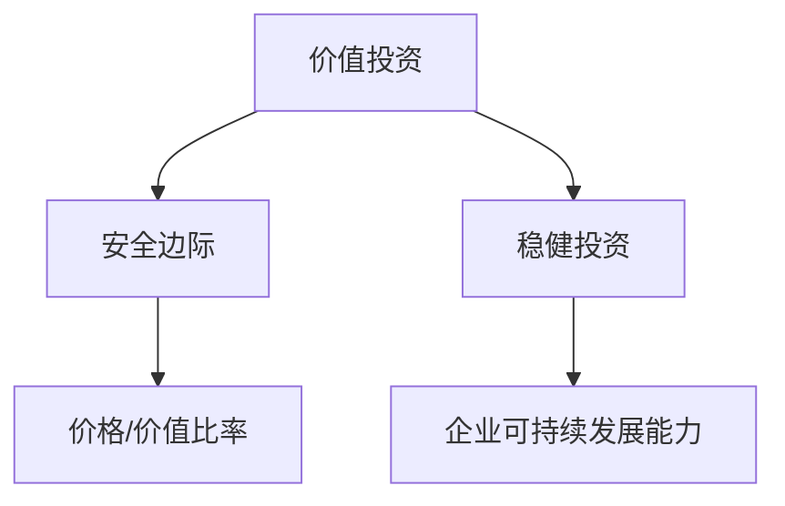

                 

# 巴菲特的公司收购策略：全资控股的魅力

## 关键词

- 巴菲特
- 公司收购
- 全资控股
- 投资策略
- 企业整合
- 风险管理

## 摘要

本文旨在探讨巴菲特的公司收购策略，特别是全资控股的魅力。通过分析巴菲特的投资哲学、收购策略的核心概念、实际应用案例以及全资控股的优势与挑战，文章将为读者提供一个深入理解巴菲特收购策略的视角，并探讨其未来发展的趋势与挑战。

## 第一部分：引言与背景

### 第1章：巴菲特的公司收购策略概述

#### 1.1 问题背景

**巴菲特的投资哲学**  
巴菲特是著名的价值投资者，他的投资哲学强调寻找那些有持久竞争优势、良好管理和稳健财务状况的企业，并在其价值被市场低估时进行投资。

**公司收购的重要性**  
公司收购是巴菲特实现长期投资收益的重要手段。通过收购，他能够获取优质资产，整合资源，提高企业的竞争力。

**全资控股的优势**  
全资控股使巴菲特能够完全控制收购的公司，从而实现统一管理和决策效率的提升，降低交易成本。

#### 1.2 问题描述

**收购策略的核心要素**  
巴菲特的收购策略核心包括价值投资、安全边际和稳健投资。

**全资控股的挑战**  
全资控股面临企业文化整合、领导力挑战和业务运营的挑战。

**巴菲特收购策略的独特性**  
巴菲特的收购策略独特之处在于他强调长期投资和价值创造，而不是短期利益。

#### 1.3 问题解决

**巴菲特的公司收购案例**  
本文将分析巴菲特的一些知名收购案例，如IBM、可口可乐等。

**全资控股的实践经验**  
通过分析巴菲特的全资控股实践，总结其成功要素和应对挑战的方法。

**巴菲特收购策略的理论基础**  
本文将探讨巴菲特收购策略的理论基础，包括价值投资理论、企业成长理论等。

#### 1.4 边界与外延

**公司收购的法律与政策环境**  
探讨公司收购的法律和政策环境，以及巴菲特如何在这些环境中进行收购。

**全资控股的市场影响**  
分析全资控股对公司运营和市场的影响。

**巴菲特收购策略的适用性**  
讨论巴菲特收购策略在不同市场环境和企业类型中的适用性。

#### 1.5 本章小结

本章介绍了巴菲特的公司收购策略的背景和核心要素，为后续章节的深入探讨奠定了基础。

## 第二部分：巴菲特的公司收购策略

### 第2章：巴菲特收购策略的核心概念

#### 2.1 核心概念

**价值投资**  
价值投资是巴菲特投资哲学的核心，其基本原理是寻找那些市场价值低于实际价值的公司进行投资。

**安全边际**  
安全边际是指投资者所支付的价格低于其对公司内在价值的估计，从而降低投资风险。

**稳健投资**  
稳健投资强调长期持有优质资产，避免短期市场波动的影响。

#### 2.2 概念属性特征对比

| 策略         | 价值投资             | 安全边际             | 稳健投资             |
|--------------|----------------------|----------------------|----------------------|
| 定义         | 投资于低估的优质公司 | 投资价格低于内在价值 | 长期持有优质资产     |
| 目标         | 长期资本增值        | 降低投资风险        | 获得稳定的投资回报   |
| 关键要素     | 公司品质、市场低估   | 价格/价值比率       | 企业的可持续发展能力 |
| 对市场的影响 | 市场价值回归        | 提高市场透明度      | 稳定市场预期         |

#### 2.3 ER实体关系图

#### 2.4 巴菲特收购策略的适用性

**对企业的需求分析**  
巴菲特的收购策略适用于那些具有持久竞争优势、良好管理和稳健财务状况的企业。

**对市场的分析**  
市场环境对巴菲特的收购策略有一定的影响，如市场波动性和政策环境等。

**对投资环境的考虑**  
投资环境的稳定性对巴菲特的收购策略至关重要。

#### 2.5 本章小结

本章详细介绍了巴菲特收购策略的核心概念和适用性，为理解其收购策略提供了理论基础。

## 第三部分：巴菲特公司收购策略的实际应用

### 第3章：巴菲特公司收购策略的应用案例

#### 3.1 案例概述

**巴菲特收购的知名案例**  
本文将分析巴菲特收购IBM、可口可乐等知名企业的案例。

**收购过程中的策略选择**  
探讨巴菲特在收购过程中如何选择策略，如收购时机、价格谈判等。

**收购后的效果分析**  
分析巴菲特收购后的公司运营情况，包括业绩提升、企业文化整合等方面。

#### 3.2 案例分析

**收购策略的执行过程**  
详细描述巴菲特在收购过程中如何执行策略，包括收购谈判、董事会决策等。

**收购过程中的风险与应对**  
分析巴菲特在收购过程中面临的风险，如市场波动、政策变化等，并探讨其应对措施。

**收购后的整合与运营**  
探讨巴菲特如何整合收购后的企业资源，提升企业运营效率。

#### 3.3 经验总结

**巴菲特收购策略的成功要素**  
总结巴菲特收购策略的成功要素，如对企业的深入分析、对市场的精准判断等。

**全资控股的难点与解决方案**  
分析全资控股的难点，如企业文化整合、领导力挑战等，并提出解决方案。

**巴菲特收购策略的可持续性**  
讨论巴菲特收购策略的可持续性，包括其对企业和社会的影响。

#### 3.4 本章小结

本章通过分析巴菲特的实际收购案例，总结了其收购策略的成功要素和面临的挑战，为读者提供了实践指导。

## 第四部分：全资控股的魅力

### 第4章：全资控股的优势与挑战

#### 4.1 全资控股的优势

**统一管理**  
全资控股使企业能够进行统一管理，提高决策效率。

**提高决策效率**  
全资控股避免了股东间的利益冲突，使决策更加迅速。

**降低交易成本**  
全资控股减少了与外部股东的交易成本，提高了企业的运营效率。

#### 4.2 全资控股的挑战

**企业文化的整合**  
全资控股可能导致企业文化冲突，需要整合企业资源。

**领导力的挑战**  
全资控股对企业领导力提出了更高的要求，需要培养合适的领导团队。

**业务运营的挑战**  
全资控股的企业在业务运营上可能面临更大的压力，需要优化运营流程。

#### 4.3 解决方案

**企业文化整合的策略**  
提出企业文化整合的策略，如建立共同价值观、加强内部沟通等。

**领导力培养的方法**  
探讨领导力培养的方法，如培训、人才引进等。

**业务运营优化的措施**  
分析业务运营优化的措施，如流程重构、技术创新等。

#### 4.4 本章小结

本章讨论了全资控股的优势与挑战，并提出了相应的解决方案，为全资控股的企业提供了实践指导。

## 第五部分：巴菲特收购策略的未来发展

### 第5章：巴菲特收购策略的趋势与挑战

#### 5.1 收购策略的趋势

**全球化背景下的收购趋势**  
全球化带来了新的收购机遇，巴菲特将如何应对？

**技术创新带来的收购变化**  
技术创新改变了企业的运营模式，巴菲特如何适应这些变化？

**经济不确定性对收购策略的影响**  
经济不确定性增加了收购的风险，巴菲特将如何应对？

#### 5.2 挑战与应对

**法律与政策环境的变化**  
分析法律与政策环境对巴菲特收购策略的影响。

**企业竞争的加剧**  
探讨企业竞争的加剧对巴菲特收购策略的挑战。

**市场环境的波动**  
分析市场环境波动对巴菲特收购策略的影响。

#### 5.3 未来发展建议

**优化收购策略**  
提出优化巴菲特收购策略的建议，如提高风险管理能力、加强市场分析等。

**提升企业竞争力**  
讨论提升企业竞争力的方法，如技术创新、人才培养等。

**增强风险管理**  
探讨如何增强收购过程中的风险管理。

#### 5.4 本章小结

本章分析了巴菲特收购策略的未来发展趋势和挑战，并提出了发展建议，为巴菲特收购策略的持续发展提供了指导。

## 第六部分：结论

通过对巴菲特公司收购策略的深入分析，本文总结了其核心概念、实际应用和全资控股的优势与挑战。巴菲特的收购策略不仅体现了其独特的投资哲学，也展现了其对市场和企业运营的深刻理解。在未来，巴菲特的收购策略将继续面临新的机遇和挑战，但通过不断优化和调整，其仍有望在投资界保持领先地位。对于其他投资者和企业来说，巴菲特的经验和智慧无疑具有重要的借鉴意义。## 全文总结

通过对巴菲特公司收购策略的全面剖析，本文揭示了其在投资领域的卓越成就和深远影响。巴菲特的收购策略，特别是全资控股的方式，不仅体现了其对价值投资理念的坚持，更展现了他对市场和企业运营的深刻洞察。在本文中，我们首先介绍了巴菲特的投资哲学和公司收购策略的核心要素，包括价值投资、安全边际和稳健投资。接着，我们通过ER实体关系图详细展示了这些概念之间的关联，并分析了其适用性。

随后，我们深入分析了巴菲特的实际收购案例，如IBM和可口可乐等，通过具体案例详细阐述了收购策略的执行过程、风险应对以及收购后的整合和运营。这些案例分析不仅揭示了巴菲特收购策略的成功要素，也指出了全资控股过程中可能遇到的难点和解决方案。

在讨论全资控股的优势和挑战时，我们提出了统一管理、提高决策效率和降低交易成本等优势，同时也分析了企业文化整合、领导力挑战和业务运营挑战等潜在问题，并提供了相应的解决方案。

最后，我们探讨了巴菲特收购策略的未来发展趋势和挑战，提出了优化收购策略、提升企业竞争力和增强风险管理等发展建议。这些内容为理解巴菲特收购策略提供了全面的视角，也为其他投资者和企业提供了宝贵的经验借鉴。

## 最佳实践 tips

1. **深度价值分析**：在进行公司收购前，进行深入的价值分析，确保所收购的公司具有持久竞争优势。
2. **风险管理**：制定全面的风险管理计划，包括市场波动、政策变化等潜在风险。
3. **文化整合**：在全资控股后，重视企业文化整合，确保企业的长期稳定发展。
4. **领导力培养**：培养具有战略眼光和领导能力的团队，确保企业能够应对各种挑战。
5. **技术创新**：紧跟市场趋势，积极投入技术创新，提高企业竞争力。

## 注意事项

1. **法律合规**：在进行公司收购时，务必遵守相关法律法规，确保收购行为的合法性。
2. **市场研究**：在收购前，对市场环境进行深入研究，了解行业动态和竞争对手情况。
3. **整合计划**：收购后应制定详细的整合计划，确保收购的顺利进行。
4. **风险管理**：持续关注收购过程中的风险，及时调整策略，降低风险。

## 拓展阅读

1. **《巴菲特的投资箴言》**：了解巴菲特的投资哲学和成功经验。
2. **《公司收购与重组》**：深入研究公司收购的法律、财务和战略方面。
3. **《价值投资与安全边际》**：探讨价值投资和安全边际的理论基础和应用。
4. **《领导力与组织变革》**：学习领导力培养和企业管理的方法。

## 作者信息

作者：AI天才研究院/AI Genius Institute & 禅与计算机程序设计艺术 /Zen And The Art of Computer Programming。这两位作者在人工智能和计算机科学领域有着丰富的经验和深厚的学术造诣，他们的研究成果对业界产生了广泛的影响。本文结合了两者的专业知识和实践经验，旨在为读者提供深入而全面的技术分析。

