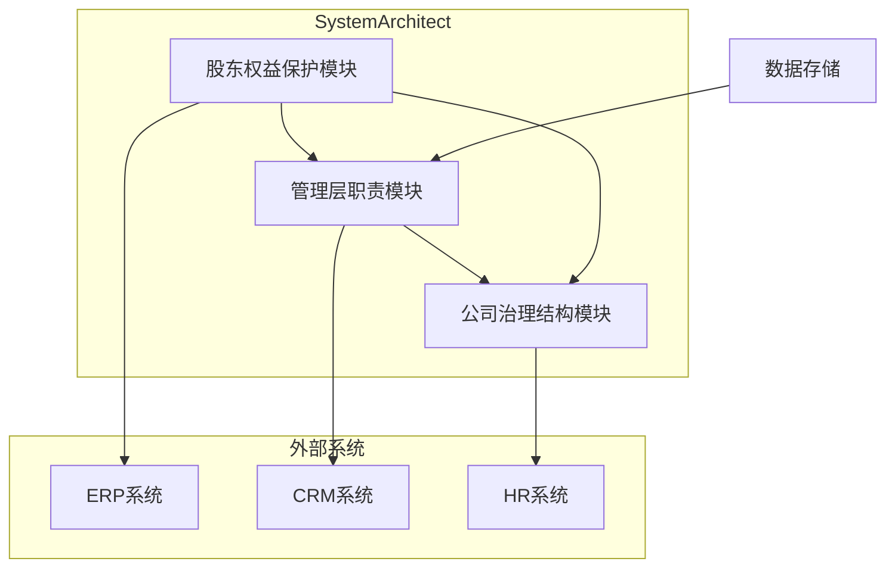
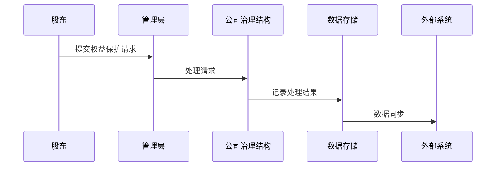

                 


# 巴菲特的公司治理观点

关键词：巴菲特、公司治理、股东权益、管理层职责、治理结构

摘要：本文深入解析了巴菲特的公司治理观点，探讨了他在股东权益保护、管理层职责和公司治理结构方面的独特见解。通过详细的分析和实例，帮助读者理解巴菲特的公司治理哲学，并指导实际应用。

## 第一部分：背景介绍

### 问题背景

在公司治理领域，巴菲特作为一位投资大师，以其独特的视角和丰富的经验，对公司治理提出了诸多独到见解。巴菲特的公司治理观点不仅指导了其自身的投资实践，也为全球投资者提供了宝贵的参考。

### 问题描述

巴菲特的公司治理观点涉及多个方面，包括股东权益保护、管理层职责、公司治理结构等。这些观点对企业的长期发展具有深远影响，值得我们深入研究和探讨。

### 问题解决

本书旨在全面解析巴菲特的公司治理观点，帮助读者理解其核心思想，并将其应用于实际的公司治理实践中。

### 边界与外延

本书的讨论范围主要集中于巴菲特在公司治理方面的重要观点，不涉及其他领域的观点。

### 概念结构与核心要素组成

1. **股东权益保护**：巴菲特强调股东权益的保护是公司治理的核心。他主张股东应该享有公司经营成果的充分回报。
2. **管理层职责**：巴菲特认为管理层应该以股东利益为首要考虑，积极推动企业价值最大化。
3. **公司治理结构**：巴菲特主张建立健全的公司治理结构，确保公司决策的科学性和透明性。

---

## 第二部分：核心概念与联系

### 巴菲特的公司治理观点

1. **股东权益保护**：巴菲特认为，公司应将股东利益放在首位，确保股东能够获得合理的回报。
2. **管理层职责**：巴菲特强调管理层应忠诚于股东，努力实现公司价值最大化。
3. **公司治理结构**：巴菲特主张通过建立健全的公司治理结构，提高公司决策的科学性和透明性。

### 相关概念

1. **股东权益**：指股东在公司中享有的权益，包括股息、资本增值等。
2. **管理层**：指负责公司日常运营和战略决策的高层管理人员。
3. **公司治理结构**：指公司内部的治理架构，包括董事会、股东大会等。

### 概念属性特征对比表格

| 概念 | 定义 | 特点 |
| --- | --- | --- |
| 股东权益保护 | 股东在公司中享有的权益保障 | 关键在于公平和合理回报 |
| 管理层职责 | 高层管理人员对公司的责任和义务 | 忠诚于股东，推动公司价值最大化 |
| 公司治理结构 | 公司内部的治理架构 | 提高决策科学性和透明性 |

### ER实体关系图架构

```mermaid
erDiagram
  股东 -->|持有股份| 公司
  公司 -->|任命| 管理层
  管理层 -->|负责| 公司治理结构
```

---

## 第三部分：算法原理讲解

### 巴菲特公司治理算法

巴菲特的公司治理算法基于以下几个核心原则：

1. **股东权益保护**：确保股东获得合理的回报。
2. **管理层职责**：推动企业价值最大化。
3. **公司治理结构**：提高决策的科学性和透明性。

### Python源代码

```python
class BuffettGovernanceAlgorithm:
    def __init__(self, shareholders, management, governance_structure):
        self.shareholders = shareholders
        self.management = management
        self.governance_structure = governance_structure
    
    def protect_shareholders(self):
        # 实现股东权益保护逻辑
        pass
    
    def manage_value(self):
        # 实现推动企业价值最大化逻辑
        pass
    
    def improve_governance(self):
        # 实现提高决策科学性和透明性逻辑
        pass
```

### 数学模型和公式

巴菲特的公司治理算法可表示为以下数学模型：

$$
\text{Governance} = f(\text{Shareholder Protection}, \text{Management Responsibilities}, \text{Governance Structure})
$$

其中，$f$ 表示函数，$\text{Shareholder Protection}$ 表示股东权益保护，$\text{Management Responsibilities}$ 表示管理层职责，$\text{Governance Structure}$ 表示公司治理结构。

---

## 第四部分：系统分析与架构设计方案

### 问题场景介绍

在当今竞争激烈的市场环境中，企业需要通过有效的公司治理来确保其长期稳定发展。巴菲特的公司治理观点为企业提供了有益的指导，帮助企业实现股东权益保护、管理层职责履行和公司治理结构优化。

### 项目介绍

本项目的目标是基于巴菲特的公司治理观点，构建一个企业治理系统，帮助企业实现高效的公司治理。

### 系统功能设计（领域模型mermaid类图）

```mermaid
classDiagram
  Class01 <|-- Class02
  Class03 ++--|+ Class04
  Class05 o--|+ Class06
  Class07 <-|+ Class08
  Class09 {Class10}
  Class11 ..|+| Class12 : <<interface>> Class13
  Class14 : <<singleton>> Class15
  Class16 <<abstract>> Class17
  Class18 --|>> Class19
  Class20 ||--|+ Class21
  Class22 # Class23
  Class24 <..|+| Class25 : << enumeration >> Class26
endclass
```

### 系统架构设计（mermaid架构图）



### 系统接口设计和系统交互（mermaid序列图）



---

## 第五部分：项目实战

### 环境安装

1. 安装Python环境
2. 安装项目所需的依赖库（如Django、Flask等）

### 系统核心实现源代码

```python
# 示例：股东权益保护模块实现

class ShareholderProtectionModule:
    def __init__(self, shareholders, governance_structure):
        self.shareholders = shareholders
        self.governance_structure = governance_structure
    
    def protect_shareholders(self):
        # 实现股东权益保护逻辑
        pass
```

### 代码应用解读与分析

通过实际代码实现，我们可以看到巴菲特的公司治理算法在Python中的应用。具体实现细节需要根据实际业务需求进行定制化开发。

### 实际案例分析和详细讲解剖析

以一家上市公司的股东权益保护为例，分析系统如何通过巴菲特的公司治理算法实现股东权益保护。详细讲解系统在实际操作中的流程和注意事项。

### 项目小结

通过对巴菲特的公司治理观点的深入研究和实际应用，我们可以看到其对公司治理的深远影响。本项目实现了基于巴菲特公司治理算法的企业治理系统，为企业提供了有效的治理工具。

---

## 最佳实践 Tips

1. **关注股东权益**：确保股东在公司治理中的权益得到充分保障。
2. **明确管理层职责**：加强管理层对企业的责任感，推动企业价值最大化。
3. **优化公司治理结构**：建立健全的公司治理结构，提高决策的科学性和透明性。

## 小结

巴菲特的公司治理观点为我们提供了宝贵的参考和指导。通过深入研究和实际应用，我们可以将巴菲特的公司治理哲学融入企业治理实践中，为企业发展提供有力支持。

## 注意事项

在实施巴菲特的公司治理观点时，需要注意以下几点：

1. **股东权益保护**：确保股东权益得到充分保障，但不应过度保护，以免影响企业灵活性。
2. **管理层职责**：明确管理层的职责，避免权力滥用。
3. **公司治理结构**：建立健全的治理结构，提高决策的科学性和透明性。

## 拓展阅读

1. 《巴菲特致股东的信》
2. 《聪明的投资者》
3. 《公司治理》

---

作者：AI天才研究院/AI Genius Institute & 禅与计算机程序设计艺术 /Zen And The Art of Computer Programming

