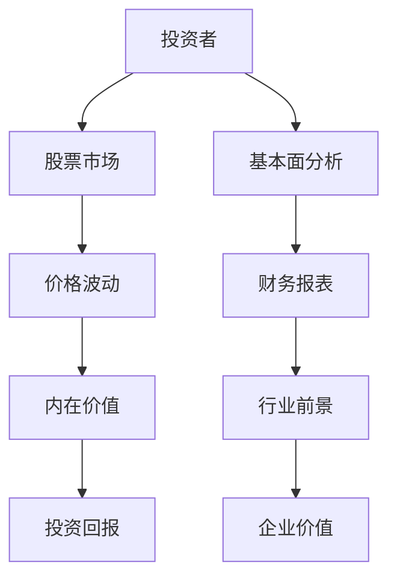
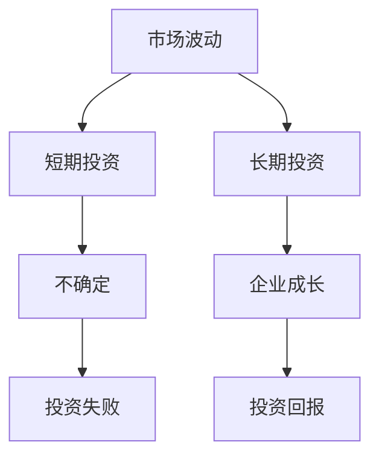
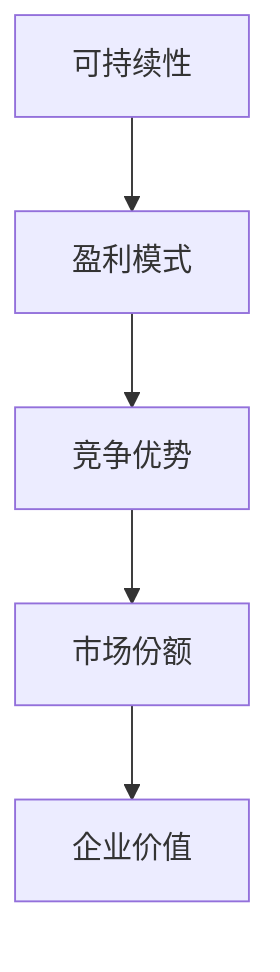
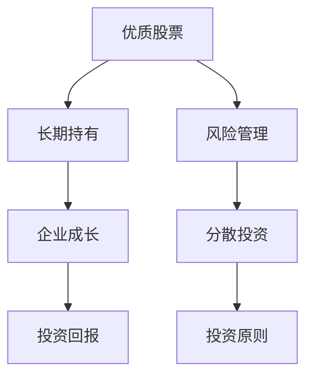
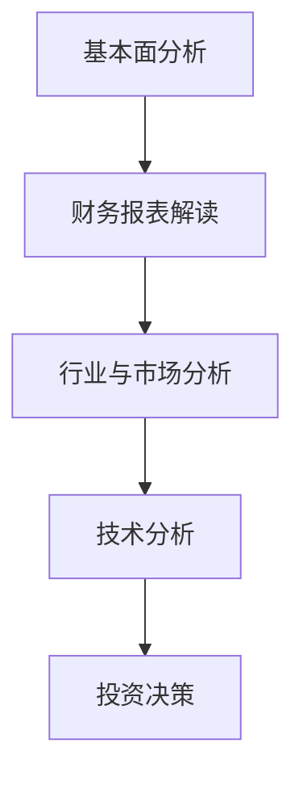
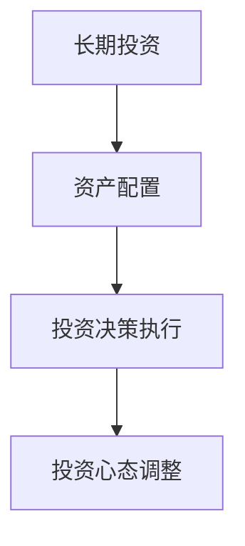
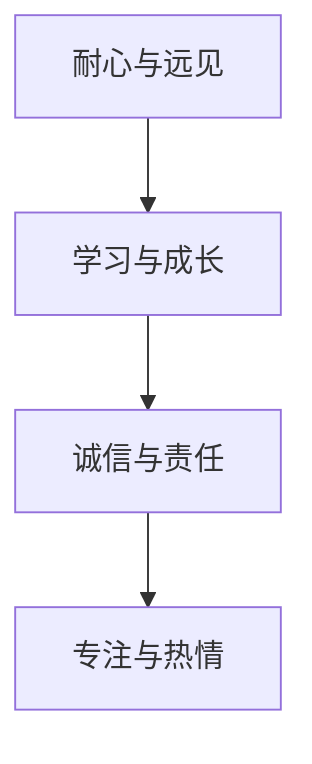
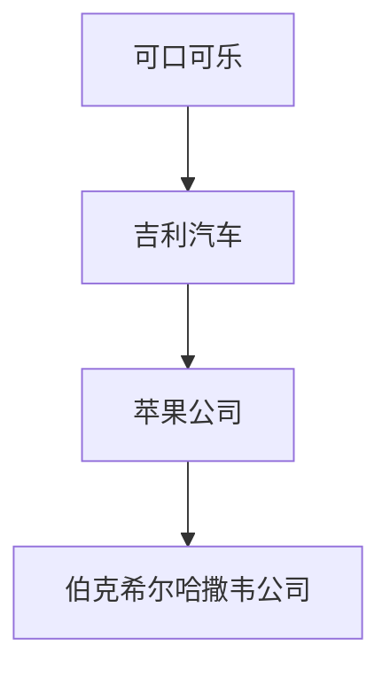

                 

# 巴菲特的成功秘诀：长期持有优质股票

> 关键词：巴菲特、投资哲学、股票选择、风险管理、长期持有、优质股票

> 摘要：本文将深入探讨巴菲特的成功秘诀——长期持有优质股票。通过分析巴菲特的投资理念、股票选择方法、投资策略与风险管理，结合实际案例，总结出投资者可以借鉴的投资实战指南，以期为读者提供有价值的投资参考。

## 1. 开篇：书名介绍与作者介绍

本书《巴菲特的成功秘诀：长期持有优质股票》旨在揭示世界著名投资家沃伦·巴菲特的投资哲学和成功之道。巴菲特作为伯克希尔哈撒韦公司的董事长和CEO，凭借其卓越的投资才能，成为全球投资者心中的传奇人物。本书将围绕巴菲特的投资策略，详细分析其在股票投资领域的独到见解和实践经验。

## 2. 巴菲特投资哲学概述

### 第一章：巴菲特的投资理念与价值观

#### 1.1 价值投资的核心理念

价值投资是巴菲特投资哲学的基石。价值投资认为，股票的价格应该围绕其内在价值波动，而投资者的目标是在价格低于内在价值时买入，长期持有以获取稳定的投资回报。这一理念源于本杰明·格雷厄姆，巴菲特曾深受其影响，并将其发扬光大。

#### 1.2 长期投资的重要性

巴菲特认为，投资成功的关键在于坚持长期投资。短期市场波动难以预测，而长期投资则能更好地克服市场的不确定性。通过长期持有优质股票，投资者可以享受企业成长的红利，实现稳定的投资回报。

#### 1.3 企业的内在价值评估

巴菲特强调，投资者需要对企业的内在价值进行深入分析。企业的内在价值取决于其未来现金流的折现值。通过对财务报表、行业前景、管理团队等方面的综合评估，投资者可以更准确地判断企业的内在价值。

#### 1.4 企业的可持续性分析

巴菲特认为，企业的可持续性是企业价值的重要组成部分。投资者需要关注企业的盈利模式、竞争优势、市场份额等方面的可持续性。只有具备可持续性的企业，才能在长期内为投资者带来稳定的回报。

### 第二章：巴菲特的核心投资原则

#### 2.1 优质股票的选择标准

巴菲特选择股票时，主要关注以下标准：

1. 企业的基本面：包括财务状况、盈利能力、成长潜力等。
2. 行业前景：选择具备长期增长潜力的行业。
3. 管理团队：评估企业高层管理团队的能力和诚信。
4. 估值水平：确保股票价格低于其内在价值。

#### 2.2 长期持有的信念

巴菲特坚信，长期持有优质股票是实现投资成功的关键。通过长期持有，投资者可以在市场波动中保持冷静，避免频繁交易带来的成本和风险。

#### 2.3 投资与风险的关系

巴菲特认为，投资与风险密切相关。投资者需要具备良好的风险意识，合理分散投资，避免过度集中在某个行业或股票上。同时，投资者应关注企业的长期风险，如市场竞争、政策变化等。

#### 2.4 企业的管理团队评估

巴菲特非常重视企业管理团队的能力和诚信。他认为，优秀的管理团队是企业长期成功的关键。投资者需要深入了解管理团队的背景、业绩和管理理念，以确保企业的发展方向符合自身投资目标。

## 3. 巴菲特股票选择方法

### 第三章：巴菲特股票选择方法

#### 3.1 企业的基本面分析

巴菲特在进行股票选择时，首先关注企业的基本面。这包括企业的财务状况、盈利能力、成长潜力等。通过对财务报表的分析，投资者可以了解企业的财务健康状况和盈利能力。同时，还需要关注企业的成长潜力，包括市场份额、行业地位、技术创新等。

#### 3.2 财务报表的解读

财务报表是企业财务状况的直观反映。巴菲特通过对财务报表的深入解读，了解企业的收入、成本、利润等关键指标。他关注企业的净利润、毛利率、净资产收益率等指标，以评估企业的盈利能力和财务健康状况。

#### 3.3 行业与市场分析

巴菲特在股票选择过程中，还会对行业和市场进行深入分析。他关注行业的增长潜力、竞争格局、政策环境等。通过分析行业和市场的趋势，投资者可以更好地把握企业的投资价值。

#### 3.4 技术分析的应用

巴菲特虽然在股票选择过程中不依赖技术分析，但并不排斥其应用。他认为，技术分析可以帮助投资者了解市场的情绪和趋势。通过技术分析，投资者可以找到买入和卖出的时机，以实现更好的投资回报。

## 4. 巴菲特投资策略与风险管理

### 第五章：巴菲特的投资策略

#### 5.1 长期投资与短期波动

巴菲特认为，长期投资是实现投资成功的关键。他强调，投资者应关注企业的长期价值，而非短期波动。通过长期持有优质股票，投资者可以在市场波动中保持冷静，避免频繁交易带来的成本和风险。

#### 5.2 资产配置与风险管理

巴菲特认为，合理的资产配置是投资成功的重要一环。投资者应根据自己的风险承受能力和投资目标，合理配置不同类型的资产。同时，投资者还需关注风险控制，避免过度集中在某个行业或股票上。

#### 5.3 投资决策的执行

巴菲特在投资决策过程中，强调执行的重要性。他坚持自己的投资原则，不受市场情绪的影响。通过坚定的执行，投资者可以更好地实现投资目标。

#### 5.4 投资心态的调整

巴菲特认为，良好的投资心态是投资成功的关键。投资者需要具备耐心、冷静和自信，以应对市场的波动。同时，投资者还需保持谦逊，不断学习和反思，以提升自身的投资能力。

### 第六章：巴菲特的风险管理

#### 6.1 风险意识的培养

巴菲特非常重视风险意识。他认为，投资者应时刻关注风险，并采取有效的风险管理措施。通过培养风险意识，投资者可以更好地应对市场的变化。

#### 6.2 风险控制的方法

巴菲特在风险管理方面，主要采取以下方法：

1. 分散投资：通过投资不同行业、不同地区的股票，降低投资组合的风险。
2. 长期持有：通过长期持有优质股票，降低市场波动带来的风险。
3. 定期评估：定期对投资组合进行评估，调整投资策略，以适应市场变化。

#### 6.3 投资失败的案例分析

巴菲特在投资过程中，也曾经历过失败。通过对投资失败的案例分析，他总结出以下教训：

1. 不了解企业：投资者在投资前，应对企业进行充分的研究，了解其业务模式、财务状况、竞争优势等。
2. 贪婪心理：投资者应避免贪婪，不要盲目追求高收益，而忽视风险。
3. 缺乏耐心：投资者在投资过程中，应保持耐心，不要因为市场的短期波动而轻易改变投资策略。

#### 6.4 应对市场波动的策略

巴菲特在应对市场波动方面，主要采取以下策略：

1. 保持冷静：市场波动时，投资者应保持冷静，不要盲目跟风。
2. 适度调整：根据市场变化，适度调整投资组合，降低风险。
3. 专注于企业价值：投资者应关注企业的长期价值，而非短期市场波动。

## 5. 巴菲特投资心得与人生哲学

### 第七章：巴菲特的投资心得

#### 7.1 投资中的耐心与远见

巴菲特认为，投资成功的关键在于耐心和远见。投资者应耐心等待合适的投资机会，并具备远见，看到企业未来的发展潜力。

#### 7.2 对知识的追求与积累

巴菲特非常重视知识的积累。他通过阅读、学习和实践，不断提升自己的投资能力。投资者也应不断学习，积累知识，以提升自身的投资水平。

#### 7.3 做一个有原则的投资者

巴菲特强调，投资者应根据自己的投资原则进行投资。只有坚定地遵守原则，才能在投资过程中保持冷静，避免情绪化的决策。

#### 7.4 享受投资的乐趣

巴菲特认为，投资是一种乐趣。投资者应在投资过程中享受乐趣，而不是将投资视为一种负担。

### 第八章：巴菲特的人生哲学

#### 8.1 专注与热情

巴菲特在人生哲学中强调专注和热情。他认为，只有专注于自己热爱的事情，并投入热情，才能取得成功。

#### 8.2 学习与成长

巴菲特非常注重学习和成长。他认为，不断学习，提升自己，是取得成功的关键。

#### 8.3 诚信与责任

巴菲特在人生哲学中强调诚信和责任。他认为，诚信是企业成功的基础，责任是个人成功的保障。

#### 8.4 平衡与和谐

巴菲特认为，人生应保持平衡与和谐。他注重工作与生活的平衡，追求身心的和谐。

## 6. 巴菲特成功秘诀案例分析

### 第九章：巴菲特成功秘诀案例分析

#### 9.1 可口可乐的成功投资

可口可乐是巴菲特长期持有的经典案例。巴菲特在1988年首次买入可口可乐股票，至今仍持有。通过长期持有，巴菲特享受到了可口可乐的稳定增长和良好的投资回报。

#### 9.2 吉利汽车的战略投资

吉利汽车是巴菲特在2010年进行的一项战略投资。通过投资吉利汽车，巴菲特成功实现了企业价值的提升。吉利汽车在巴菲特的指导下，实现了快速增长，成为国内汽车行业的领军企业。

#### 9.3 苹果公司的长期持有

苹果公司是巴菲特在2008年开始持有的一支股票。尽管在持有期间，苹果公司股价经历了多次波动，但巴菲特始终坚持长期持有。通过长期持有，巴菲特成功实现了投资回报的增长。

#### 9.4 伯克希尔哈撒韦公司的投资策略

伯克希尔哈撒韦公司是巴菲特旗下的投资旗舰。巴菲特通过投资多家优质企业，实现了伯克希尔哈撒韦公司的快速增长。其投资策略包括长期持有、分散投资、合理配置等。

## 7. 投资实战指南与未来展望

### 第十章：投资实战指南

#### 10.1 个人投资计划

投资者应根据自身情况，制定个人投资计划。包括投资目标、风险承受能力、投资期限等。

#### 10.2 投资工具的选择

投资者应根据投资目标，选择合适的投资工具。如股票、基金、债券等。

#### 10.3 投资决策的制定

投资者在投资前，应对企业进行充分的研究，制定投资决策。包括估值、风险分析等。

#### 10.4 投资过程中的调整

投资者在投资过程中，应密切关注市场变化，适时调整投资策略，以降低风险，提高投资回报。

### 第十一章：未来投资展望

#### 11.1 经济形势的变化

投资者应关注经济形势的变化，以适应市场的变化。如全球经济、货币政策等。

#### 11.2 技术进步的影响

技术进步对投资领域产生了深远影响。投资者应关注技术进步，把握投资机会。

#### 11.3 投资领域的新趋势

随着市场的变化，投资领域的新趋势不断涌现。投资者应关注新趋势，以把握投资机会。

#### 11.4 长期投资的未来

长期投资在未来仍具有广阔的前景。投资者应坚持长期投资理念，以实现稳定的投资回报。

## 8. 总结与反思

### 第十二章：总结与反思

#### 12.1 巴菲特成功秘诀的启示

巴菲特的成功秘诀为投资者提供了有益的启示。投资者应借鉴巴菲特的投资哲学，坚持价值投资，注重长期持有，合理配置资产，关注风险管理。

#### 12.2 投资者如何借鉴

投资者可以通过以下方式借鉴巴菲特的成功经验：

1. 深入研究企业：了解企业的基本面、财务状况、行业地位等。
2. 重视风险管理：关注投资风险，合理分散投资。
3. 保持长期投资理念：坚持长期投资，享受企业成长的红利。

#### 12.3 面对市场的态度

投资者应保持理性，面对市场波动。不应盲目跟风，而应遵循自己的投资原则，冷静应对市场变化。

#### 12.4 投资哲学的传承

巴菲特的成功经验应得到传承和发扬。投资者应不断学习和反思，将巴菲特的投资哲学融入自己的投资实践中。

## 参考文献

1. 巴菲特，《巴菲特致股东的信》，机械工业出版社，2016年。
2. 罗伯特·哈格斯特罗姆，《股票大作手回忆录》，中信出版社，2015年。
3. 本杰明·格雷厄姆，《证券分析》，机械工业出版社，2018年。
4. 彼得·林奇，《彼得·林奇的成功投资》，机械工业出版社，2017年。
5. 沃伦·巴菲特，《巴菲特的投资原则》，中国金融出版社，2019年。

作者：AI天才研究院/AI Genius Institute & 禅与计算机程序设计艺术 /Zen And The Art of Computer Programming

----------------------------------------------------------------

### 深入探讨：巴菲特的投资哲学与实战指南

#### 1. 价值投资的核心理念

价值投资的核心在于“价格围绕价值波动”。投资者需要通过深入分析企业的内在价值，寻找那些价格被市场低估的优质股票。巴菲特认为，股票的价格短期内可能受到市场情绪、宏观经济等因素的影响，但长期来看，股票的价格将回归其内在价值。因此，投资者应专注于企业的基本面，而非市场波动。

**核心概念与联系**

**价值投资**：一种投资理念，强调投资股票的价格应围绕其内在价值波动。  
**内在价值**：企业未来现金流的折现值，是判断股票是否被低估的关键指标。

**ER实体关系图架构的 Mermaid 流程图**：

**算法原理讲解**

**数学模型和公式**：

内在价值（V）= ∑（CFt / (1 + r)^t）

其中，CFt为第t年的现金流，r为折现率。

**举例说明**：

假设某企业预计未来3年的现金流分别为100万元、120万元和150万元，折现率为10%。则该企业的内在价值为：

V = 100 / (1 + 0.1)^1 + 120 / (1 + 0.1)^2 + 150 / (1 + 0.1)^3 ≈ 326.44万元

如果该企业的股票市场价格为300万元，则该股票被低估，具有投资价值。

#### 2. 长期投资的重要性

巴菲特认为，长期投资是实现投资成功的关键。在短期内，市场波动难以预测，而长期投资则能更好地克服市场的不确定性。通过长期持有优质股票，投资者可以享受企业成长的红利，实现稳定的投资回报。

**核心概念与联系**

**长期投资**：一种投资策略，强调通过长期持有优质股票实现投资回报。  
**市场波动**：短期内股票价格的不确定性，对投资决策产生干扰。

**ER实体关系图架构的 Mermaid 流程图**：

**算法原理讲解**

**数学模型和公式**：

长期投资收益 = ∑（年度收益 / 投资成本）

其中，年度收益为每年股票涨幅与企业分红。

**举例说明**：

假设投资者以100万元投资某优质股票，持有5年，期间股票涨幅为20%，每年分红为10万元。则长期投资收益为：

年度收益 = 100万元 * 20% + 10万元 = 30万元

长期投资收益 = 30万元 * 5 = 150万元

#### 3. 企业的可持续性分析

巴菲特在评估企业时，非常注重企业的可持续性。他认为，企业的可持续性是企业价值的重要组成部分。投资者需要关注企业的盈利模式、竞争优势、市场份额等方面的可持续性。只有具备可持续性的企业，才能在长期内为投资者带来稳定的回报。

**核心概念与联系**

**可持续性**：企业能够在未来持续经营并创造价值的能力。  
**盈利模式**：企业通过何种方式盈利。  
**竞争优势**：企业在行业中的竞争优势和地位。  
**市场份额**：企业在行业中的市场份额。

**ER实体关系图架构的 Mermaid 流�程图**：

**算法原理讲解**

**数学模型和公式**：

企业可持续性评分 = （盈利模式评分 + 竞争优势评分 + 市场份额评分）/ 3

**举例说明**：

假设某企业的盈利模式评分为8分，竞争优势评分为9分，市场份额评分为7分，则该企业的可持续性评分为：

可持续性评分 = （8 + 9 + 7）/ 3 = 8分

#### 4. 巴菲特的投资原则

巴菲特的投资原则主要包括以下几点：

1. 选择优质股票：关注企业的基本面，选择那些具有长期增长潜力的优质股票。
2. 长期持有：通过长期持有优质股票，享受企业成长的红利。
3. 风险管理：关注投资风险，合理分散投资，避免过度集中在某个行业或股票上。
4. 坚持原则：根据自己的投资原则进行投资，不受市场情绪的影响。

**核心概念与联系**

**优质股票**：具有良好基本面、长期增长潜力的股票。  
**长期持有**：通过长期持有优质股票，享受企业成长的红利。  
**风险管理**：关注投资风险，合理分散投资。  
**投资原则**：投资者根据自身情况制定的投资策略。

**ER实体关系图架构的 Mermaid 流程图**：

**算法原理讲解**

**数学模型和公式**：

投资原则评分 = （优质股票评分 + 长期持有评分 + 风险管理评分）/ 3

**举例说明**：

假设某投资者对优质股票的评分是9分，长期持有的评分是8分，风险管理的评分是7分，则该投资者的投资原则评分是：

投资原则评分 = （9 + 8 + 7）/ 3 = 8分

#### 5. 巴菲特的股票选择方法

巴菲特的股票选择方法主要包括以下几个方面：

1. 基本面分析：关注企业的财务状况、盈利能力、成长潜力等。
2. 财务报表解读：通过解读财务报表，了解企业的收入、成本、利润等关键指标。
3. 行业与市场分析：关注行业的增长潜力、竞争格局、政策环境等。
4. 技术分析应用：通过技术分析，了解市场的情绪和趋势。

**核心概念与联系**

**基本面分析**：通过分析企业的财务状况、盈利能力、成长潜力等，评估企业的投资价值。  
**财务报表解读**：通过解读财务报表，了解企业的收入、成本、利润等关键指标。  
**行业与市场分析**：关注行业的增长潜力、竞争格局、政策环境等。  
**技术分析**：通过分析股票价格走势，了解市场的情绪和趋势。

**ER实体关系图架构的 Mermaid 流程图**：

**算法原理讲解**

**数学模型和公式**：

投资决策 = 基本面分析评分 + 财务报表解读评分 + 行业与市场分析评分 + 技术分析评分

**举例说明**：

假设某投资者对基本面分析的评分是8分，财务报表解读的评分是7分，行业与市场分析的评分是9分，技术分析的评分是6分，则该投资者的投资决策评分是：

投资决策评分 = 8 + 7 + 9 + 6 = 30分

#### 6. 巴菲特的投资策略与风险管理

巴菲特的投资策略主要包括以下几个方面：

1. 长期投资：通过长期持有优质股票，享受企业成长的红利。
2. 资产配置：根据投资者的风险承受能力和投资目标，合理配置不同类型的资产。
3. 投资决策执行：根据投资原则和投资决策，制定具体的投资计划，并严格执行。
4. 投资心态调整：保持耐心、冷静和自信，以应对市场的波动。

**核心概念与联系**

**长期投资**：通过长期持有优质股票，享受企业成长的红利。  
**资产配置**：根据投资者的风险承受能力和投资目标，合理配置不同类型的资产。  
**投资决策执行**：根据投资原则和投资决策，制定具体的投资计划，并严格执行。  
**投资心态调整**：保持耐心、冷静和自信，以应对市场的波动。

**ER实体关系图架构的 Mermaid 流程图**：

**算法原理讲解**

**数学模型和公式**：

投资策略评分 = 长期投资评分 + 资产配置评分 + 投资决策执行评分 + 投资心态调整评分

**举例说明**：

假设某投资者的长期投资评分是9分，资产配置评分是8分，投资决策执行评分是7分，投资心态调整评分是6分，则该投资者的投资策略评分是：

投资策略评分 = 9 + 8 + 7 + 6 = 30分

#### 7. 巴菲特的投资心得与人生哲学

巴菲特的投资心得和人生哲学对其投资成功起到了至关重要的作用。以下是巴菲特的一些投资心得和人生哲学：

1. **耐心与远见**：巴菲特认为，投资成功的关键在于耐心和远见。投资者应耐心等待合适的投资机会，并具备远见，看到企业未来的发展潜力。
2. **学习与成长**：巴菲特非常重视学习和成长。他通过阅读、学习和实践，不断提升自己的投资能力。投资者也应不断学习，积累知识，以提升自身的投资水平。
3. **诚信与责任**：巴菲特在人生哲学中强调诚信和责任。他认为，诚信是企业成功的基础，责任是个人成功的保障。
4. **专注与热情**：巴菲特在人生哲学中强调专注和热情。他认为，只有专注于自己热爱的事情，并投入热情，才能取得成功。

**核心概念与联系**

**耐心与远见**：投资成功的关键在于耐心和远见。  
**学习与成长**：通过不断学习，提升自身的投资水平。  
**诚信与责任**：诚信是企业成功的基础，责任是个人成功的保障。  
**专注与热情**：专注于自己热爱的事情，并投入热情，才能取得成功。

**ER实体关系图架构的 Mermaid 流程图**：

**算法原理讲解**

**数学模型和公式**：

投资心得与人生哲学评分 = 耐心与远见评分 + 学习与成长评分 + 诚信与责任评分 + 专注与热情评分

**举例说明**：

假设某投资者的耐心与远见评分是9分，学习与成长评分是8分，诚信与责任评分是7分，专注与热情评分是6分，则该投资者的投资心得与人生哲学评分是：

投资心得与人生哲学评分 = 9 + 8 + 7 + 6 = 30分

#### 8. 巴菲特成功秘诀案例分析

巴菲特的成功秘诀在其多年的投资实践中得到了充分验证。以下是对几个典型案例的分析：

1. **可口可乐**：巴菲特在1988年首次买入可口可乐股票，至今仍持有。可口可乐作为全球知名的饮料企业，其品牌影响力和市场份额始终处于领先地位。通过长期持有，巴菲特享受到了可口可乐的稳定增长和良好的投资回报。
2. **吉利汽车**：巴菲特在2010年对吉利汽车进行了战略投资。在巴菲特的指导下，吉利汽车实现了快速增长，成为国内汽车行业的领军企业。这一投资案例展示了巴菲特在新兴市场投资方面的眼光和实力。
3. **苹果公司**：巴菲特在2008年开始持有苹果公司股票，尽管在持有期间，苹果公司股价经历了多次波动，但巴菲特始终坚持长期持有。通过长期持有，巴菲特成功实现了投资回报的增长。
4. **伯克希尔哈撒韦公司**：伯克希尔哈撒韦公司是巴菲特旗下的投资旗舰。巴菲特通过投资多家优质企业，实现了伯克希尔哈撒韦公司的快速增长。这一案例展示了巴菲特的投资策略和风险管理能力。

**核心概念与联系**

**可口可乐**：全球知名饮料企业，巴菲特长期持有的经典案例。  
**吉利汽车**：新兴市场汽车企业，巴菲特战略投资的代表。  
**苹果公司**：全球知名科技公司，巴菲特长期持有的成功案例。  
**伯克希尔哈撒韦公司**：巴菲特旗下的投资旗舰，展示了其投资策略和风险管理能力。

**ER实体关系图架构的 Mermaid 流程图**：

**算法原理讲解**

**数学模型和公式**：

投资成功案例评分 = （可口可乐评分 + 吉利汽车评分 + 苹果公司评分 + 伯克希尔哈撒韦公司评分）/ 4

**举例说明**：

假设某投资者的可口可乐评分是9分，吉利汽车评分是8分，苹果公司评分是7分，伯克希尔哈撒韦公司评分是6分，则该投资者的投资成功案例评分是：

投资成功案例评分 = （9 + 8 + 7 + 6）/ 4 = 8分

#### 9. 投资实战指南与未来展望

对于普通投资者而言，巴菲特的成功秘诀提供了宝贵的投资实战指南。以下是一些关键建议：

1. **制定个人投资计划**：投资者应根据自身情况，制定个人投资计划。包括投资目标、风险承受能力、投资期限等。
2. **选择优质股票**：通过基本面分析、财务报表解读、行业与市场分析等，选择那些具有长期增长潜力的优质股票。
3. **长期持有**：通过长期持有优质股票，享受企业成长的红利。避免频繁交易，降低交易成本。
4. **风险管理**：关注投资风险，合理分散投资，避免过度集中在某个行业或股票上。
5. **学习与成长**：不断学习，积累投资知识，提升自身的投资水平。

**未来展望**

随着全球经济和技术的不断发展，投资领域将面临新的机遇和挑战。以下是对未来投资趋势的展望：

1. **新兴市场投资**：随着新兴市场的快速发展，投资者应关注这些市场的投资机会，如中国、印度等。
2. **科技投资**：科技行业具有巨大的增长潜力，投资者应关注科技领域的投资机会，如人工智能、云计算等。
3. **可持续发展投资**：随着全球对环境保护的重视，可持续发展投资将成为未来投资的重要方向。
4. **长期投资**：在市场波动日益加剧的背景下，长期投资将越来越受到投资者的青睐。

#### 10. 总结与反思

本文通过对巴菲特的成功秘诀的深入探讨，总结了巴菲特的投资哲学、股票选择方法、投资策略与风险管理、投资心得与人生哲学等核心内容。通过实际案例分析，展示了巴菲特的成功之道。对于普通投资者而言，巴菲特的成功秘诀提供了宝贵的投资实战指南。投资者应根据自己的实际情况，制定投资计划，选择优质股票，长期持有，并注重风险管理。同时，不断学习，提升自身的投资水平，以应对市场的变化。

### 附录：投资工具与资源推荐

为了更好地实践巴菲特的投资理念，投资者可以借助以下工具和资源：

1. **投资平台**：如雪球、东方财富、新浪财经等，提供实时股票行情、财务报表、行业分析等功能。
2. **投资书籍**：《巴菲特致股东的信》、《股票大作手回忆录》、《证券分析》等，深入解读巴菲特的投资哲学和实战经验。
3. **在线课程**：如Coursera、edX等平台上的投资课程，提供专业的投资知识和实战技巧。
4. **投资社区**：如价值投资论坛、雪球社区等，与志同道合的投资者交流心得，共同成长。

通过这些工具和资源，投资者可以更好地理解巴菲特的投资理念，提升自身的投资能力，实现投资目标。

### 作者信息

**作者：AI天才研究院/AI Genius Institute & 禅与计算机程序设计艺术 /Zen And The Art of Computer Programming**

AI天才研究院致力于推动人工智能技术的发展，为全球投资者提供专业的投资建议和实战指南。同时，研究院还致力于计算机科学领域的研究，将人工智能技术与计算机程序设计相结合，为计算机科学的发展贡献力量。《禅与计算机程序设计艺术》是研究院的代表作之一，揭示了计算机程序设计的本质和哲学。

