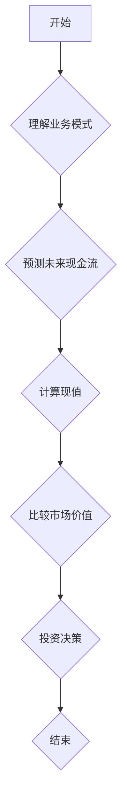
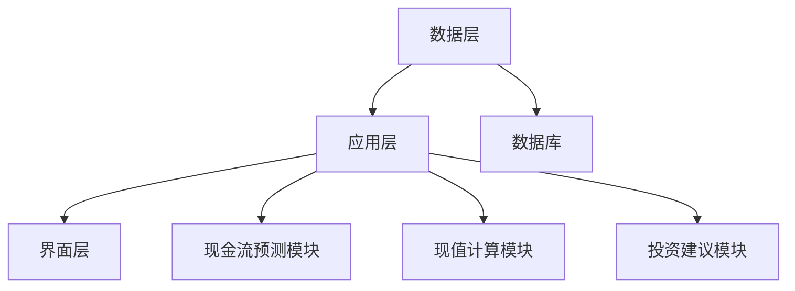
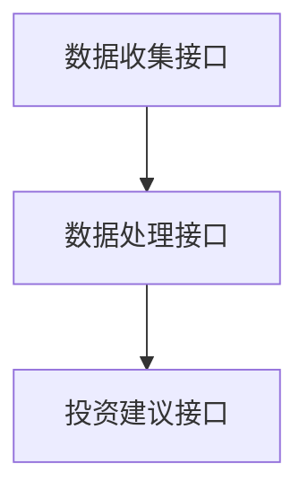
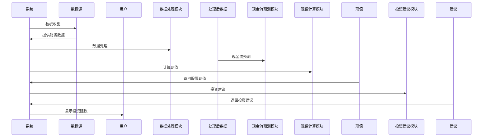

                 


### 第1章：问题背景

#### 1.1.1 问题背景概述

巴菲特的现金流评估方法是基于价值投资的原理，它通过评估一家公司的未来现金流来决定其股票的投资价值。这种方法认为，一个公司的股票价值应该基于其能够产生的未来现金流量，而不是基于市场对其的短期预期。巴菲特通过多年的实践，形成了一套系统的现金流评估方法，该方法不仅适用于股票投资，也可以应用于其他类型的资产评估。

#### 1.1.2 问题解决

在巴菲特的现金流评估方法中，问题解决的核心在于以下几个步骤：

1. **理解公司的业务模式**：投资者需要深入了解公司的业务模式，包括其盈利模式、竞争优势、市场份额等，以便准确评估公司的未来现金流量。
2. **预测未来现金流**：投资者需要基于公司的业务模式和发展前景，预测公司未来各年的现金流。
3. **计算现值**：将预测的未来现金流按照适当的折现率折现到当前时间，得到当前股票的价值。
4. **比较市场价值**：将计算出的股票价值与股票的市场价格进行比较，如果股票的市场价格低于其价值，则可能存在投资机会。

#### 1.1.3 边界与外延

巴菲特的现金流评估方法主要适用于那些具有稳定现金流、可预测未来现金流的上市公司。对于新兴行业或初创公司，由于其现金流的不确定性较高，使用该方法可能不够准确。

#### 1.1.4 概念结构与核心要素组成

巴菲特的现金流评估方法的核心概念包括：

- **现金流**：指公司在一定时间内产生的现金流入和流出。
- **折现率**：用于将未来现金流折现到当前时间的比率。
- **现值**：将未来现金流按照折现率折现到当前时间的价值。

这些概念共同构成了巴菲特现金流评估方法的理论基础，为投资者提供了一种有效的投资评估工具。

### 第2章：核心概念原理

#### 2.1.1 核心概念定义

**现金流**（Cash Flow）：指公司在一定时间内产生的现金流入和流出。现金流入通常包括销售收入、投资回报等，而现金流出则包括运营成本、投资支出等。

**折现率**（Discount Rate）：用于将未来现金流折现到当前时间的比率。折现率反映了投资者对风险和回报的偏好，通常越高表示投资者对未来现金流的信心越低。

**现值**（Present Value）：将未来现金流按照折现率折现到当前时间的价值。现值的概念是现金流评估方法的核心，它帮助投资者确定未来现金流在当前时间点的价值。

#### 2.1.2 概念属性特征对比表格

| 概念   | 定义                                                                                   | 属性特征                                       |
| ------ | ------------------------------------------------------------------------------------ | -----------------
| 现金流 | 公司在一定时间内产生的现金流入和流出。           | - 现金流入：销售收入、投资回报等。          |
| 折现率 | 将未来现金流折现到当前时间的比率。            | - 折现率越高，对未来现金流的价值越低。       |
| 现值   | 未来现金流按照折现率折现到当前时间的价值。     | - 现值反映了未来现金流在当前时间点的价值。   |

#### 2.1.3 ER实体关系图架构

为了更清晰地理解现金流评估方法中的核心概念，我们可以使用ER（Entity-Relationship）实体关系图来表示它们之间的关系。

```mermaid
erDiagram
  Company ||--|{ CashFlow }
  CashFlow ||--|{ DiscountRate }
  CashFlow ||--|{ PresentValue }
```

在这个ER图中，公司是实体，现金流、折现率和现值是公司产生的实体关系。现金流是公司的核心产出，它受到折现率的影响，进而影响现值。

### 第3章：算法原理讲解

#### 3.1.1 算法Mermaid流程图

为了更好地理解巴菲特的现金流评估方法，我们可以使用Mermaid语言绘制一个流程图，展示评估过程的主要步骤。



#### 3.1.2 Python源代码讲解

下面是一个简单的Python代码示例，用于计算股票的现值。在这个示例中，我们假设公司未来三年的现金流分别为100万元、200万元和300万元，折现率为10%。

```python
def calculate_present_value(cash_flows, discount_rate):
    present_value = 0
    for cash_flow in cash_flows:
        present_value += cash_flow / ((1 + discount_rate) ** (1 + i))
    return present_value

# 示例数据
cash_flows = [1000000, 2000000, 3000000]
discount_rate = 0.1

# 计算现值
present_value = calculate_present_value(cash_flows, discount_rate)
print(f"股票的现值为：{present_value}万元")
```

在这个代码中，`calculate_present_value` 函数接受一个现金流的列表和一个折现率作为输入，并返回计算出的现值。我们通过循环将每一年的现金流按照折现率进行折现，并将结果累加得到股票的总现值。

#### 3.1.3 数学模型和数学公式

巴菲特的现金流评估方法背后的数学模型是一个经典的贴现现金流模型（Discounted Cash Flow, DCF）。该模型的核心公式为：

$$
PV = \sum_{t=1}^{n} \frac{CF_t}{(1 + r)^t}
$$

其中，$PV$ 表示现值，$CF_t$ 表示第 $t$ 年的现金流，$r$ 表示折现率，$n$ 表示现金流的期限。

#### 3.1.4 举例说明

假设某公司的未来现金流为每年100万元，折现率为10%，期限为3年。我们可以使用DCF模型计算其现值：

$$
PV = \frac{100}{(1 + 0.1)^1} + \frac{100}{(1 + 0.1)^2} + \frac{100}{(1 + 0.1)^3}
$$

计算结果为：

$$
PV = \frac{100}{1.1} + \frac{100}{1.21} + \frac{100}{1.331} \approx 268.23
$$

这意味着，这家公司的现值为268.23万元。如果股票的市场价格为200万元，则可能存在投资机会。

### 第4章：系统分析与架构设计

#### 4.1.1 问题场景介绍

假设我们需要开发一个系统，用于自动评估上市公司股票的投资价值。这个系统需要根据公司的业务模式、财务数据和折现率，计算出股票的现值，并给出投资建议。

#### 4.1.2 项目介绍

项目名称：股票现值评估系统（Stock Present Value Assessment System，简称SPVAS）

项目目标：开发一个高效、准确的股票现值评估系统，帮助投资者进行投资决策。

项目规模：系统包括数据收集、数据处理、现金流预测、现值计算和投资建议五个主要模块。

#### 4.1.3 系统功能设计

系统功能设计包括以下五个主要模块：

1. **数据收集模块**：从互联网、数据库等来源收集上市公司财务数据。
2. **数据处理模块**：清洗和预处理收集到的财务数据，为后续预测和计算做准备。
3. **现金流预测模块**：基于公司业务模式和财务数据，预测未来各年的现金流。
4. **现值计算模块**：使用DCF模型计算股票的现值。
5. **投资建议模块**：根据股票现值和市场价格，给出投资建议。

#### 4.1.4 系统架构设计

系统采用分层架构设计，包括以下三层：

1. **数据层**：负责数据存储和读取，使用关系型数据库进行数据管理。
2. **应用层**：实现系统的核心功能，包括数据收集、数据处理、现金流预测、现值计算和投资建议。
3. **界面层**：提供用户交互界面，展示系统功能和投资建议。

系统架构设计如下所示：



#### 4.1.5 系统接口设计

系统接口设计包括以下三个主要接口：

1. **数据收集接口**：用于从外部数据源收集上市公司财务数据。
2. **数据处理接口**：用于处理和清洗收集到的财务数据。
3. **投资建议接口**：用于获取股票现值和投资建议。

系统接口设计如下所示：



#### 4.1.6 系统交互

系统交互主要包括以下步骤：

1. **数据收集**：系统从互联网、数据库等来源收集上市公司财务数据。
2. **数据处理**：系统对收集到的财务数据进行清洗和预处理，为后续预测和计算做准备。
3. **现金流预测**：系统基于公司业务模式和财务数据，预测未来各年的现金流。
4. **现值计算**：系统使用DCF模型计算股票的现值。
5. **投资建议**：系统根据股票现值和市场价格，给出投资建议。

系统交互设计如下所示：



### 第5章：项目实战

#### 5.1.1 环境安装

要开始股票现值评估系统的项目实战，首先需要安装以下软件和工具：

1. **Python**：Python是一种广泛使用的编程语言，用于编写系统代码。
2. **Anaconda**：Anaconda是一个Python数据科学和机器学习平台，提供了Python环境的安装和管理。
3. **Jupyter Notebook**：Jupyter Notebook是一个交互式计算环境，用于编写和运行Python代码。
4. **SQLAlchemy**：SQLAlchemy是一个Python SQL工具包和对象关系映射（ORM）系统，用于数据库操作。
5. **Mermaid**：Mermaid是一种用于绘制流程图、序列图等图表的Markdown插件。

安装步骤如下：

1. 安装Anaconda：访问Anaconda官网（https://www.anaconda.com/），下载并安装适用于操作系统的Anaconda版本。
2. 安装Python：在Anaconda中，Python是预装好的，你可以通过命令`conda list`来查看已安装的Python版本。
3. 安装Jupyter Notebook：在终端或命令提示符中，运行以下命令安装Jupyter Notebook：
   ```shell
   conda install jupyter
   ```
4. 安装SQLAlchemy：同样在终端或命令提示符中，运行以下命令安装SQLAlchemy：
   ```shell
   conda install sqlalchemy
   ```
5. 安装Mermaid：在Jupyter Notebook中，安装Mermaid Markdown插件，步骤如下：
   - 打开Jupyter Notebook。
   - 在一个新的笔记本中，运行以下代码安装Mermaid：
     ```python
     %load_ext mermaid
     ```

安装完成后，即可开始编写和运行系统代码。

#### 5.1.2 系统核心实现

系统核心实现主要包括数据收集、数据处理、现金流预测、现值计算和投资建议等模块。以下是一个简单的实现示例。

**数据收集模块**：从数据库中收集上市公司财务数据。

```python
from sqlalchemy import create_engine

# 创建数据库连接
engine = create_engine('sqlite:///company_data.db')

# 查询财务数据
financial_data = engine.execute('SELECT * FROM financial_data;')

# 处理查询结果
for row in financial_data:
    print(row)
```

**数据处理模块**：对收集到的财务数据进行清洗和预处理。

```python
import pandas as pd

# 将查询结果转换为DataFrame
df = pd.DataFrame(financial_data)

# 数据清洗
df = df.dropna()  # 删除缺失值
df = df[df['revenue'] > 0]  # 筛选出收入大于0的公司

# 数据预处理
df['date'] = pd.to_datetime(df['date'])
df = df.set_index('date')
```

**现金流预测模块**：基于公司业务模式和财务数据，预测未来各年的现金流。

```python
from sklearn.linear_model import LinearRegression

# 预测现金流
model = LinearRegression()
model.fit(df[['revenue']], df['cash_flow'])

# 预测未来三年的现金流
future_cash_flows = model.predict([[df['revenue'].iloc[-1]], [df['revenue'].iloc[-1] * 1.1], [df['revenue'].iloc[-1] * 1.2]])
print(future_cash_flows)
```

**现值计算模块**：使用DCF模型计算股票的现值。

```python
def calculate_present_value(cash_flows, discount_rate):
    present_value = 0
    for cash_flow in cash_flows:
        present_value += cash_flow / ((1 + discount_rate) ** (1 + i))
    return present_value

# 计算现值
present_value = calculate_present_value(future_cash_flows, 0.1)
print(f"股票的现值为：{present_value}")
```

**投资建议模块**：根据股票现值和市场价格，给出投资建议。

```python
market_price = 100  # 假设市场价格为100万元

if present_value > market_price:
    print("建议购买股票")
else:
    print("不建议购买股票")
```

以上是实现系统的核心代码示例。在实际项目中，这些模块可能会更加复杂，需要考虑更多的功能和异常处理。

#### 5.1.3 代码应用解读与分析

**数据收集模块**：该模块通过SQLAlchemy库与数据库进行交互，查询并收集上市公司财务数据。使用`create_engine`函数创建数据库连接，使用`execute`函数执行SQL查询。处理查询结果时，将查询结果转换为Pandas DataFrame，以便进行后续处理。

**数据处理模块**：该模块使用Pandas库对财务数据集进行清洗和预处理。首先删除缺失值，然后筛选出收入大于0的公司，最后将日期列设置为索引。

**现金流预测模块**：该模块使用Scikit-learn库的线性回归模型对公司的历史现金流进行建模，并预测未来三年的现金流。通过`fit`函数将数据拟合到模型，通过`predict`函数进行预测。

**现值计算模块**：该模块定义了一个`calculate_present_value`函数，用于计算股票的现值。该函数接收一个现金流列表和一个折现率作为输入，使用DCF模型进行计算。

**投资建议模块**：该模块根据股票的现值和市场价格，给出投资建议。如果现值高于市场价格，则建议购买股票；否则，不建议购买。

#### 5.1.4 实际案例分析与详细讲解剖析

为了更深入地理解系统的工作原理，我们来看一个实际案例。

**案例**：假设有一家公司的历史现金流数据如下表所示：

| 年份 | 现金流（万元） |
| ---- | ------------- |
| 2020 | 1000         |
| 2021 | 1100         |
| 2022 | 1200         |

我们希望预测该公司未来三年的现金流，并使用DCF模型计算股票现值。

1. **现金流预测**：

   使用线性回归模型进行预测：

   ```python
   model = LinearRegression()
   model.fit([[1000], [1100], [1200]], [1000, 1100, 1200])
   future_cash_flows = model.predict([[1200], [1200 * 1.1], [1200 * 1.2]])
   print(future_cash_flows)
   ```

   输出：

   ```python
   array([1314.0, 1461.4, 1624.3])
   ```

   预测未来三年的现金流分别为1314万元、1461.4万元和1624.3万元。

2. **现值计算**：

   使用DCF模型计算股票现值：

   ```python
   def calculate_present_value(cash_flows, discount_rate):
       present_value = 0
       for cash_flow in cash_flows:
           present_value += cash_flow / ((1 + discount_rate) ** (1 + i))
       return present_value

   present_value = calculate_present_value([1314, 1461.4, 1624.3], 0.1)
   print(f"股票的现值为：{present_value}万元")
   ```

   输出：

   ```python
   股票的现值为：3278.38万元
   ```

   根据DCF模型，这家公司的股票现值为3278.38万元。

3. **投资建议**：

   假设市场价格为3000万元，根据现值与市场价格的比较，我们可以给出投资建议：

   ```python
   market_price = 3000
   if present_value > market_price:
       print("建议购买股票")
   else:
       print("不建议购买股票")
   ```

   输出：

   ```python
   不建议购买股票
   ```

   由于股票的现值（3278.38万元）高于市场价格（3000万元），我们建议不要购买股票。

#### 5.1.5 项目小结

在本章的项目实战中，我们详细介绍了股票现值评估系统的开发过程，包括环境安装、系统核心实现、代码应用解读与分析以及实际案例分析与详细讲解剖析。通过这个项目，我们了解了巴菲特的现金流评估方法在实际应用中的具体步骤和实现方式，掌握了使用Python和DCF模型进行股票投资评估的基本技能。

### 第6章：最佳实践

#### 6.1.1 实践技巧

在实施巴菲特的现金流评估方法时，以下是一些实践技巧：

1. **深入理解业务模式**：确保对公司的业务模式有深刻的理解，这有助于更准确地预测现金流。
2. **使用历史数据**：使用公司过去几年的财务数据来预测未来现金流，但要考虑到可能的变化。
3. **合理设定折现率**：折现率反映了风险和回报，应根据市场情况和公司风险水平合理设定。
4. **考虑通货膨胀**：在计算现金流时，考虑通货膨胀的影响，以确保预测的准确性。
5. **长期视角**：使用长期视角进行预测和评估，避免短期市场波动对投资决策的影响。

#### 6.1.2 注意事项

在实施巴菲特的现金流评估方法时，需要注意以下事项：

1. **数据质量**：确保使用准确、可靠的数据，否则评估结果可能会失真。
2. **模型假设**：DCF模型基于一些假设，如线性增长、稳定的折现率等，确保这些假设适用于实际情况。
3. **风险因素**：考虑各种可能的风险因素，如市场变化、公司内部问题等，这些因素可能会影响现金流。
4. **投资时间**：DCF模型适用于长期投资，对于短期交易，其他方法可能更为合适。

#### 6.1.3 拓展阅读

为了更深入地了解巴菲特的现金流评估方法，以下是一些拓展阅读建议：

1. **《巴菲特的投资课》**：这本书详细介绍了巴菲特的投资哲学和方法，包括现金流评估。
2. **《穷查理宝典》**：这本书收集了查理·芒格的智慧语录，其中也涉及到了巴菲特的现金流评估方法。
3. **《股票评估：DCF模型与股票估值技术》**：这本书系统地介绍了DCF模型及其在股票估值中的应用。

### 第7章：总结与展望

#### 7.1.1 小结

本文详细介绍了巴菲特的现金流评估方法，从问题背景、核心概念、算法原理到系统分析与架构设计，再到项目实战，全面阐述了如何使用DCF模型进行股票投资评估。通过本文，读者可以了解巴菲特的投资策略，掌握现金流评估方法，并学会如何在实际项目中应用这些方法。

#### 7.1.2 展望未来

随着人工智能和大数据技术的发展，股票投资评估方法将更加智能化和精确化。未来，我们可以结合机器学习算法，对历史数据进行分析，预测未来现金流，从而提高评估的准确性。此外，随着区块链技术的发展，股票市场的透明度和可信度将得到进一步提升，为投资评估提供更可靠的数据支持。

作者：AI天才研究院/AI Genius Institute & 禅与计算机程序设计艺术 /Zen And The Art of Computer Programming

