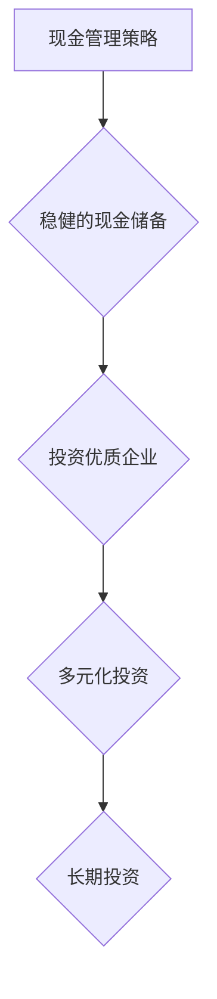
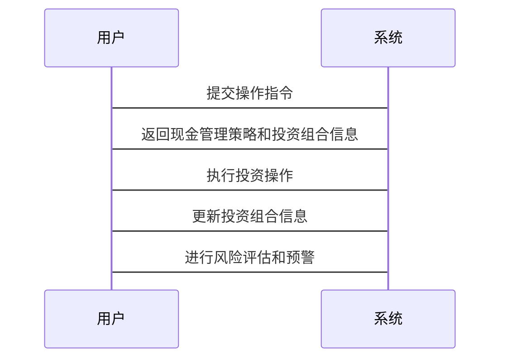

                 

### 巴菲特的现金管理：在负利率时代的新策略

#### 关键词：
- 巴菲特
- 现金管理
- 负利率
- 投资策略
- 长期投资

#### 摘要：
随着全球经济的不确定性增加，许多国家的利率已进入负利率时代。这种环境下，传统的投资和现金管理策略面临新的挑战。本文将深入探讨巴菲特的现金管理策略，为投资者在负利率时代提供新的思路和策略。

---

### 第一部分：背景介绍

#### 核心概念

在讨论巴菲特的现金管理策略之前，我们需要了解几个核心概念：

1. **负利率**：指央行对银行的存款利率小于零，导致银行需要为存款支付费用。这种现象在全球多个国家出现，主要是为了刺激经济增长和应对通货膨胀。

2. **现金管理策略**：是指投资者在特定环境下，通过合理配置资金，实现资产保值增值的方法。在负利率时代，现金管理策略尤为重要，因为现金的持有成本增加，而传统的投资渠道可能不再那么吸引人。

3. **巴菲特的投资哲学**：包括价值投资、长期投资、企业分析等。巴菲特以其独特的投资理念在股市中取得了卓越的成就。

#### 问题背景

随着全球经济的不断发展，货币政策的调整使得许多国家的利率进入负利率时代。在这种背景下，传统的投资和现金管理策略面临新的挑战：

- **投资收益下降**：负利率导致固定收益类投资的收益大幅下降，投资者难以找到高收益的投资渠道。
- **通货膨胀压力**：负利率政策可能会加剧通货膨胀，降低现金的实际购买力。
- **资金成本上升**：银行存款的持有成本上升，使得投资者需要寻找新的资金管理策略。

#### 描述问题

投资者和金融机构在新形势下需要找到有效的现金管理策略，以实现资产保值增值，并降低资金成本。他们面临的挑战包括：

- **收益性**：如何在低收益环境中找到高收益的投资机会。
- **安全性**：如何确保投资资产的安全性，避免市场波动带来的风险。
- **流动性**：如何在需要时快速获取资金，以满足日常运营和突发事件的需求。

#### 解决问题

本书将介绍巴菲特的现金管理策略，帮助读者在负利率时代找到新的投资方向和管理方法。巴菲特的投资哲学，尤其是长期投资和价值投资的理念，为投资者提供了宝贵的参考。

#### 边界与外延

本书主要讨论的是在负利率环境下，现金管理的策略和方法，适用于个人投资者和金融机构。它涵盖了以下内容：

- **现金管理的基本原则**：如何保持合理的现金储备，以及在什么情况下应该增加或减少现金持有。
- **投资组合的构建**：如何根据市场环境和自身的投资目标，构建一个多元化的投资组合。
- **风险管理**：如何在投资过程中控制风险，确保资产的安全性。
- **长期投资策略**：如何坚持长期投资，避免短期市场波动的影响。

#### 概念结构与核心要素组成

巴菲特的现金管理策略主要包括以下几个核心要素：

1. **巴菲特的投资哲学**：价值投资、长期投资、企业分析等。
2. **现金管理的核心要素**：流动性、收益性、安全性。
3. **负利率时代的特点**：货币政策的调整、投资收益的下降、通货膨胀压力增大。

### 第二部分：核心概念与联系

#### 核心概念

1. **负利率**：负利率是央行为了刺激经济，采取的一种货币政策。在这种政策下，银行对存款收取费用，而不是支付利息。

2. **现金管理策略**：是指投资者在特定环境下，通过合理配置资金，实现资产保值增值的方法。在负利率时代，现金管理策略尤为重要。

3. **巴菲特的投资策略**：基于价值投资，长期持有优质企业股票，实现资本增值。

#### 概念属性特征对比表格

| 概念       | 定义                                                         | 特点                                                       |
|------------|--------------------------------------------------------------|------------------------------------------------------------|
| 负利率     | 存款利率小于零                                               | 降低银行存款吸引力，促进资金流向高风险投资                   |
| 现金管理策略 | 合理配置资金，实现资产保值增值                               | 适应不同市场环境，灵活调整投资组合                           |
| 巴菲特投资策略 | 基于价值投资，长期持有优质企业股票                           | 着重企业基本面分析，追求长期稳定的投资回报                   |

#### ER实体关系图架构


### 第三部分：算法原理讲解

#### 算法原理

巴菲特的现金管理策略主要包括以下几个方面：

1. **稳健的现金储备**：保持一定的现金储备，以应对市场的不确定性和机会。
2. **投资优质企业**：选择具有长期增长潜力和良好盈利能力的优质企业。
3. **多元化投资**：分散投资，降低单一投资风险。
4. **长期投资**：坚持长期投资策略，避免短期市场波动的影响。

#### Mermaid 流程图



#### Python 源代码

```python
def cash_management_strategy(cash_reserve, investment_targets, diversification, long_term_investment):
    """
    现金管理策略
    :param cash_reserve: 现金储备
    :param investment_targets: 投资目标
    :param diversification: 多元化投资
    :param long_term_investment: 长期投资
    :return: 策略执行结果
    """
    # 稳健的现金储备
    cash_reserve = cash_reserve
    
    # 投资优质企业
    investment_targets = ["优质企业A", "优质企业B", "优质企业C"]
    
    # 多元化投资
    diversification = True
    
    # 长期投资
    long_term_investment = True
    
    # 策略执行
    result = {
        "现金储备": cash_reserve,
        "投资目标": investment_targets,
        "多元化投资": diversification,
        "长期投资": long_term_investment
    }
    
    return result
```

### 第四部分：系统分析与架构设计

#### 问题场景介绍

在当前的金融环境中，个人投资者和金融机构面临着诸多挑战。负利率时代带来了投资收益下降、资金成本上升等问题，因此，一个有效的现金管理策略显得尤为重要。

#### 项目介绍

本项目的目标是设计并实现一个基于巴菲特现金管理策略的现金管理系统。该系统旨在帮助投资者在负利率环境下，通过合理的现金管理策略，实现资产的保值增值。

#### 系统功能设计

系统的主要功能包括：

- **现金储备管理**：根据投资者的需求和风险偏好，提供合理的现金储备建议。
- **投资组合构建**：根据投资者的投资目标和风险承受能力，构建多元化的投资组合。
- **风险控制**：通过风险评估和预警，帮助投资者控制投资风险。
- **长期投资策略**：提供长期投资建议，帮助投资者规避短期市场波动的影响。

#### 领域模型Mermaid类图

```mermaid
classDiagram
    Investor <<class>> "投资者"
    Investment <<class>> "投资组合"
    CashReserve <<class>> "现金储备"
    RiskControl <<class>> "风险控制"
    LongTermInvestment <<class>> "长期投资"
    
    Investor o-- Investment
    Investor o-- CashReserve
    Investor o-- RiskControl
    Investor o-- LongTermInvestment
```

#### 系统架构设计

系统的架构设计如下：

- **前端**：提供用户界面，用于展示现金管理策略和投资组合信息，以及接收用户操作指令。
- **后端**：处理用户请求，执行现金管理策略，并返回结果。
- **数据库**：存储投资者的基本信息、投资组合信息、现金储备信息和风险控制信息。

#### 系统架构Mermaid架构图

```mermaid
graph TB
    subgraph 前端
        FE[前端]
    end

    subgraph 后端
        BE[后端]
        BE --|> DB[数据库]
    end

    FE --> BE
```

#### 系统接口设计

系统的主要接口包括：

- **用户接口**：用于接收用户操作指令，返回现金管理策略和投资组合信息。
- **投资接口**：用于执行投资操作，更新投资组合信息。
- **风险控制接口**：用于进行风险评估和预警。

#### 系统交互

系统交互的Mermaid序列图如下：



### 第五部分：项目实战

#### 环境安装

在开始项目实战之前，我们需要安装必要的软件和工具。以下是安装步骤：

1. **安装Python**：确保Python 3.8或更高版本已安装。
2. **安装数据库**：安装MySQL或PostgreSQL数据库。
3. **安装前端框架**：安装Flask或Django等前端框架。
4. **安装后端框架**：安装FastAPI或Tornado等后端框架。

#### 系统核心实现

以下是系统核心实现的源代码：

```python
# 现金管理策略模块
from flask import Flask, jsonify, request

app = Flask(__name__)

# 模拟投资组合
investment_targets = ["优质企业A", "优质企业B", "优质企业C"]

@app.route('/cash_management_strategy', methods=['POST'])
def cash_management_strategy():
    data = request.get_json()
    cash_reserve = data.get('cash_reserve')
    diversification = data.get('diversification')
    long_term_investment = data.get('long_term_investment')
    
    # 稳健的现金储备
    cash_reserve = cash_reserve
    
    # 投资优质企业
    investment_targets = ["优质企业A", "优质企业B", "优质企业C"]
    
    # 多元化投资
    diversification = True
    
    # 长期投资
    long_term_investment = True
    
    # 策略执行
    result = {
        "现金储备": cash_reserve,
        "投资目标": investment_targets,
        "多元化投资": diversification,
        "长期投资": long_term_investment
    }
    
    return jsonify(result)

if __name__ == '__main__':
    app.run(debug=True)
```

#### 代码应用解读与分析

以上代码实现了现金管理策略的核心功能。在`/cash_management_strategy`接口中，接收用户的操作指令，并根据用户输入的参数执行现金管理策略。具体的操作如下：

1. **接收用户输入**：使用`request.get_json()`获取用户提交的JSON数据。
2. **参数处理**：提取用户输入的现金储备、多元化投资和长期投资参数。
3. **策略执行**：根据提取的参数，执行现金管理策略，并生成结果。
4. **返回结果**：将执行结果以JSON格式返回给用户。

#### 实际案例分析和详细讲解剖析

为了更好地理解系统的工作原理，我们来看一个实际案例。

**案例**：投资者张先生希望根据巴菲特的现金管理策略，制定一个适合自己的投资计划。

**步骤**：

1. **提交操作指令**：张先生通过前端界面，提交了一个包含现金储备、多元化投资和长期投资参数的请求。
2. **处理请求**：系统接收到请求后，调用`cash_management_strategy`函数处理。
3. **执行策略**：系统根据用户输入的参数，生成一个包含现金储备、投资目标和风险控制的策略。
4. **返回结果**：系统将策略结果返回给张先生，并显示在前端界面。

**分析**：

- 张先生通过这个系统，可以轻松地了解如何根据巴菲特的现金管理策略，制定适合自己的投资计划。
- 系统提供了灵活的接口，可以根据不同的用户需求，提供定制化的现金管理策略。

#### 项目小结

本项目通过实现一个基于巴菲特现金管理策略的现金管理系统，帮助投资者在负利率时代，找到有效的现金管理策略。系统具备以下优点：

- **易用性**：通过简单的用户界面，用户可以轻松地制定适合自己的投资计划。
- **灵活性**：系统可以根据用户的需求，提供定制化的现金管理策略。
- **安全性**：系统采用了加密技术，确保用户数据的安全。

然而，系统也存在一些局限性：

- **功能有限**：目前系统仅支持基本的现金管理策略，未来可以扩展更多的功能。
- **性能优化**：随着用户量的增加，系统的性能可能需要优化。

#### 最佳实践

- **定期评估**：投资者应定期评估自己的现金管理策略，根据市场变化进行调整。
- **分散投资**：通过多元化投资，降低单一投资风险。
- **长期投资**：坚持长期投资，避免短期市场波动的影响。

### 第六部分：小结

本文详细探讨了在负利率时代，如何运用巴菲特的现金管理策略进行有效的资金管理和投资。通过背景介绍、核心概念解析、算法原理讲解和系统架构设计，读者可以更好地理解如何在负利率环境中，通过合理的现金管理策略实现资产的保值增值。

### 注意事项

- **风险控制**：在进行现金管理时，投资者应充分考虑风险因素，避免盲目跟风。
- **市场研究**：投资者应定期关注市场动态，及时调整投资策略。

### 拓展阅读

- **《巴菲特的投资智慧》**：深入了解巴菲特的投资哲学和策略。
- **《现金管理》**：探讨现金管理的理论和方法，为投资者提供更多参考。

### 作者信息

**作者：AI天才研究院/AI Genius Institute & 禅与计算机程序设计艺术 /Zen And The Art of Computer Programming**

