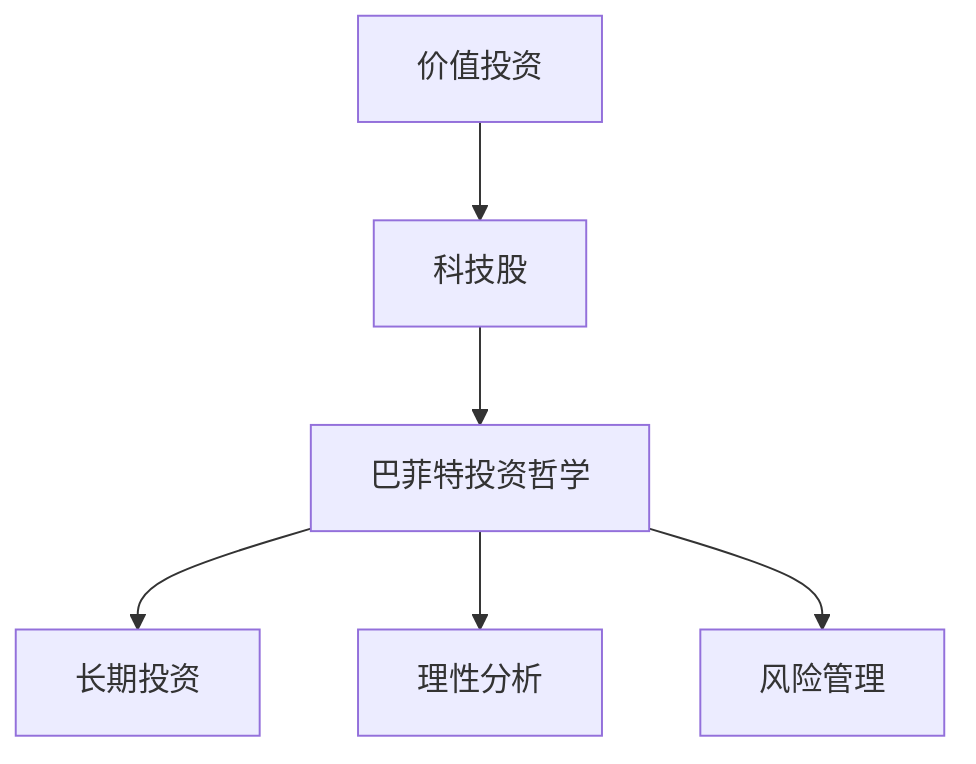
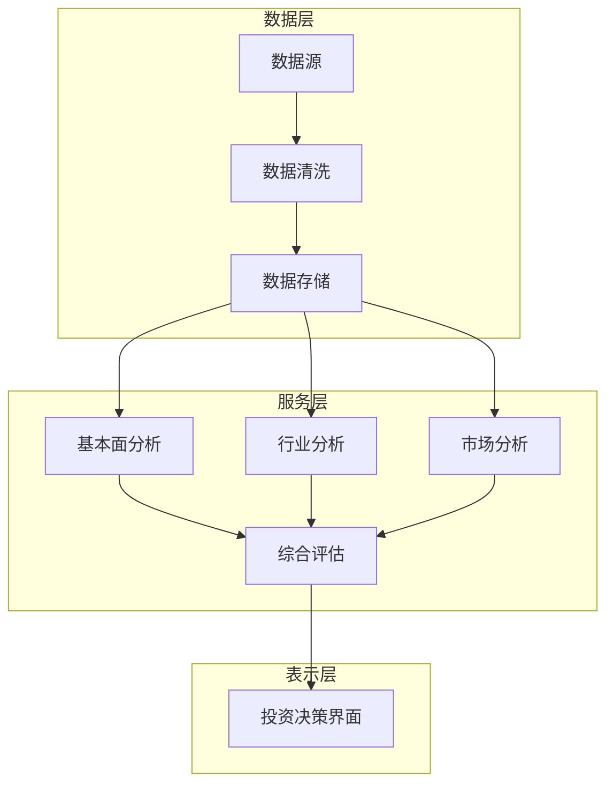
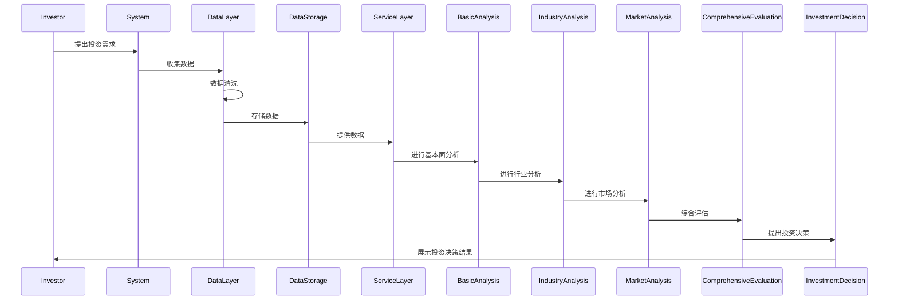

                 


## 《巴菲特的科技股投资：从回避到拥抱》

### 关键词：巴菲特、科技股投资、投资哲学、案例分析、策略方法

### 摘要：
本文深入探讨了《巴菲特的科技股投资：从回避到拥抱》一书的主题和内容结构，通过分析巴菲特的投资哲学、科技股投资的背景与特点、他的投资转变与成功案例，以及科技股投资的策略与方法，为投资者提供有价值的参考和借鉴。文章最后还对科技股投资的未来展望、实践方法进行讨论，以期帮助读者更好地理解和运用巴菲特的投资智慧。

## 第一部分：巴菲特投资哲学与科技股概述

### 第1章：巴菲特投资哲学概述

#### 1.1 巴菲特的投资理念

巴菲特作为现代投资领域的传奇人物，他的投资哲学深受投资者推崇。巴菲特的投资理念主要包括以下几个方面：

- **价值投资**：巴菲特认为投资的核心在于找到价值被市场低估的优质公司，长期持有，等待市场发现其价值。

- **长期投资**：巴菲特主张投资者应采取长期视角，避免因短期市场波动而做出盲目决策。

- **理性分析**：巴菲特在投资决策过程中，注重对公司基本面、行业前景、市场地位等客观因素的深入分析。

- **风险管理**：巴菲特认为，投资的首要目标是保护本金，其次才是追求收益。

#### 1.2 科技股投资背景

科技行业在过去几十年里发展迅猛，成为全球经济的重要驱动力。科技股具有以下特点：

- **高增长潜力**：科技行业通常具有较高的市场进入门槛，因此行业内的公司往往能够实现快速增长。

- **快速迭代**：科技产品的更新换代速度快，新技术、新产品层出不穷。

- **高波动性**：科技行业的竞争激烈，公司业绩和市场表现容易出现大幅波动。

传统投资对科技股存在偏见，主要是因为以下几个原因：

- **行业认知不足**：投资者对科技行业的发展趋势、商业模式等缺乏深入了解。

- **高估值风险**：科技股往往在上市初期就面临高估值，使得投资者担忧其长期投资价值。

- **高风险偏好**：科技行业具有较高的不确定性和风险，传统投资者往往倾向于规避此类投资。

#### 1.3 巴菲特对科技股的态度转变

早期，巴菲特对科技股持谨慎态度，主要原因是：

- **不熟悉行业**：巴菲特一直以投资传统行业为主，对科技行业的理解和认知有限。

- **高波动性**：科技股的高波动性使得巴菲特认为其风险过高。

然而，随着科技行业的发展，巴菲特逐渐认识到科技股的投资价值，开始转变态度，拥抱科技股。这一转变主要体现在以下几个方面：

- **投资理念的调整**：巴菲特认识到，价值投资并非局限于传统行业，优质科技股同样符合价值投资的原则。

- **行业认知的提升**：巴菲特通过深入研究，对科技行业有了更深入的理解和认识。

- **成功案例的借鉴**：巴菲特看到了微软、苹果等科技巨头的成功，以及科技行业对全球经济的重要贡献。

#### 1.4 本章小结

本章概述了巴菲特的投资哲学、科技股投资的背景与特点，以及巴菲特对科技股态度的转变。下一章将深入探讨巴菲特在科技股投资上的成功案例。

## 第二部分：巴菲特在科技股投资上的成功案例

### 第2章：巴菲特在科技股投资上的成功案例

#### 2.1 微软投资案例

微软作为全球最大的软件公司之一，其发展历程可谓辉煌。巴菲特与微软的结缘始于1988年，当时他投资了IBM公司，与微软建立了联系。随后，巴菲特逐渐认识到微软在软件行业的领导地位，并于1997年开始大规模投资微软。

微软投资带来的收益巨大。截至2021年，巴菲特旗下的伯克希尔哈撒韦公司持有约9.36亿股微软股票，市值约1470亿美元。这一投资不仅为巴菲特带来了丰厚的回报，也证明了巴菲特在科技股投资上的成功。

#### 2.2 苹果投资案例

苹果公司作为全球最大的科技企业之一，其发展历程同样充满传奇。巴菲特早在1997年就开始关注苹果，当时他投资了IBM公司，并与苹果建立了联系。然而，巴菲特在2006年之前并未对苹果进行大规模投资，主要原因是他认为苹果的管理团队不够优秀。

2006年，巴菲特开始对苹果产生兴趣，并对其进行了深入研究。他发现苹果在乔布斯回归后，公司的管理水平和创新能力有了显著提升。巴菲特于2008年开始购买苹果股票，并于2016年成为苹果的最大机构股东。

苹果投资带来的收益同样惊人。截至2021年，巴菲特旗下的伯克希尔哈撒韦公司持有约2.5亿股苹果股票，市值约400亿美元。这一投资不仅证明了巴菲特在科技股投资上的眼光，也为他的投资组合带来了稳定的收益。

#### 2.3 亚马逊投资案例

亚马逊作为全球最大的电子商务公司之一，其发展历程充满了创新和突破。巴菲特对亚马逊的投资始于2010年，当时他对亚马逊的商业模式和管理团队表示赞赏。

亚马逊投资带来的收益同样可观。截至2021年，巴菲特旗下的伯克希尔哈撒韦公司持有约1.08亿股亚马逊股票，市值约200亿美元。这一投资不仅为巴菲特带来了稳定的回报，也证明了他在科技股投资上的前瞻性。

#### 2.4 本章小结

本章通过分析微软、苹果和亚马逊这三个成功案例，展示了巴菲特在科技股投资上的策略和眼光。下一章将深入探讨巴菲特科技股投资的策略与方法。

## 第三部分：巴菲特科技股投资策略与方法

### 第3章：巴菲特科技股投资策略

#### 3.1 科技股投资的核心要素

巴菲特认为，科技股投资的核心要素包括：

- **公司基本面**：投资者应关注公司的财务状况、盈利能力、市场份额、研发投入等。

- **行业发展趋势**：投资者应关注科技行业的发展趋势，如5G、物联网、云计算等。

- **投资时机选择**：投资者应把握科技行业的投资时机，避免在高点买入，低点卖出。

#### 3.2 巴菲特科技股投资的特点

巴菲特科技股投资的特点主要体现在以下几个方面：

- **长期投资**：巴菲特强调科技股投资应采取长期视角，避免因短期波动而做出盲目决策。

- **重视公司管理**：巴菲特认为，优秀的公司管理团队是科技股投资的关键。

- **风险控制**：巴菲特强调风险控制，避免因投资失误而遭受重大损失。

#### 3.3 巴菲特科技股投资的案例分析

以下是巴菲特在微软、苹果和亚马逊三个科技股投资案例的详细分析：

##### 3.3.1 微软投资案例

巴菲特于1997年开始投资微软，当时微软已经是全球最大的软件公司之一。巴菲特认为，微软在软件行业的领导地位无可替代，其强大的研发能力和广泛的用户基础为公司的长期增长提供了保障。

在巴菲特的投资下，微软股价从1997年的约60美元上涨至2021年的约300美元，市值从约2000亿美元增长至约2万亿美元。这一投资不仅为巴菲特带来了丰厚的回报，也证明了他在科技股投资上的成功。

##### 3.3.2 苹果投资案例

巴菲特于2008年开始投资苹果，当时苹果正经历一段低谷期。巴菲特认为，苹果在乔布斯回归后，公司的管理水平和创新能力有了显著提升，其强大的品牌影响力和庞大的用户群体为公司的长期增长提供了保障。

在巴菲特的投资下，苹果股价从2008年的约90美元上涨至2021年的约145美元，市值从约1400亿美元增长至约3万亿美元。这一投资不仅为巴菲特带来了稳定的回报，也证明了他在科技股投资上的前瞻性。

##### 3.3.3 亚马逊投资案例

巴菲特于2010年开始投资亚马逊，当时亚马逊已经成长为全球最大的电子商务公司之一。巴菲特认为，亚马逊在电商领域的领导地位无可替代，其强大的物流体系和创新能力为公司的长期增长提供了保障。

在巴菲特的投资下，亚马逊股价从2010年的约100美元上涨至2021年的约3500美元，市值从约200亿美元增长至约1.7万亿美元。这一投资不仅为巴菲特带来了丰厚的回报，也证明了他在科技股投资上的敏锐洞察力。

#### 3.4 本章小结

本章通过分析巴菲特在微软、苹果和亚马逊三个科技股投资案例，展示了他的科技股投资策略与方法。下一章将探讨科技股投资的风险与管理。

## 第四部分：科技股投资的反思与借鉴

### 第4章：科技股投资的反思

#### 4.1 科技股投资的风险

科技股投资虽然具有高增长潜力，但同时也伴随着较高的风险。投资者在进行科技股投资时，需要充分了解和认识到以下风险：

- **行业波动风险**：科技行业的发展周期较短，行业波动较大，投资者可能面临投资波动风险。

- **技术变革风险**：科技行业技术更新换代速度快，投资者可能面临技术过时风险。

- **监管风险**：科技行业监管政策变化较大，投资者可能面临政策风险。

#### 4.2 投资者如何借鉴巴菲特的经验

巴菲特在科技股投资上的成功，为投资者提供了宝贵的经验。以下是投资者可以借鉴的几点：

- **深入研究**：投资者应深入研究科技行业，了解行业发展趋势、公司基本面等。

- **理性投资**：投资者应避免盲目跟风，理性分析，注重价值投资。

- **风险管理**：投资者应重视风险管理，避免因风险失控而导致损失。

#### 4.3 本章小结

本章通过反思科技股投资的风险，以及投资者如何借鉴巴菲特的经验，为科技股投资提供了一些有益的指导。

## 第五部分：科技股投资的未来展望

### 第5章：科技股投资的发展趋势

#### 5.1 科技行业的发展趋势

未来，科技行业将继续保持快速发展态势，以下是几个关键的发展趋势：

- **5G与物联网**：5G技术的普及和物联网的发展，将推动科技行业进入新的增长周期。

- **云计算与大数据**：云计算和大数据技术的成熟，将为科技行业带来巨大的创新空间。

- **区块链与人工智能**：区块链和人工智能技术的应用，将深刻改变金融、医疗、教育等行业的商业模式。

#### 5.2 科技股投资的机遇与挑战

随着科技行业的发展，科技股投资将面临新的机遇与挑战：

- **投资机遇**：科技行业的高速增长将为投资者带来巨大的投资机遇。

- **投资挑战**：科技行业的快速变革和激烈竞争，将为投资者带来更高的投资风险。

- **策略调整**：投资者需要根据科技行业的发展趋势，调整投资策略，以应对新的机遇与挑战。

#### 5.3 本章小结

本章探讨了科技行业的发展趋势以及科技股投资的机遇与挑战，为投资者提供了未来科技股投资的发展方向。

## 第六部分：科技股投资实践

### 第6章：科技股投资实践

#### 6.1 科技股投资实践流程

科技股投资实践包括以下几个关键步骤：

- **研究与分析**：投资者应深入研究科技行业，分析行业发展趋势、公司基本面等。

- **投资决策**：投资者应根据研究分析结果，做出投资决策。

- **风险管理**：投资者应制定风险管理策略，以应对投资风险。

#### 6.2 科技股投资实践案例

以下是巴菲特在微软、苹果和亚马逊三个科技股投资实践案例的详细分析：

##### 6.2.1 微软投资案例

巴菲特在1997年开始投资微软，当时微软已经是全球最大的软件公司之一。巴菲特通过深入研究，发现微软在软件行业的领导地位无可替代，其强大的研发能力和广泛的用户基础为公司的长期增长提供了保障。

在巴菲特的投资决策过程中，他充分考虑了微软的财务状况、盈利能力、市场份额、研发投入等因素。同时，巴菲特也制定了严格的风险管理策略，以应对投资风险。

##### 6.2.2 苹果投资案例

巴菲特于2008年开始投资苹果，当时苹果正经历一段低谷期。巴菲特通过深入研究，发现苹果在乔布斯回归后，公司的管理水平和创新能力有了显著提升，其强大的品牌影响力和庞大的用户群体为公司的长期增长提供了保障。

在巴菲特的投资决策过程中，他充分考虑了苹果的财务状况、盈利能力、市场份额、研发投入等因素。同时，巴菲特也制定了严格的风险管理策略，以应对投资风险。

##### 6.2.3 亚马逊投资案例

巴菲特于2010年开始投资亚马逊，当时亚马逊已经成长为全球最大的电子商务公司之一。巴菲特通过深入研究，发现亚马逊在电商领域的领导地位无可替代，其强大的物流体系和创新能力为公司的长期增长提供了保障。

在巴菲特的投资决策过程中，他充分考虑了亚马逊的财务状况、盈利能力、市场份额、研发投入等因素。同时，巴菲特也制定了严格的风险管理策略，以应对投资风险。

#### 6.3 本章小结

本章通过分析巴菲特在微软、苹果和亚马逊三个科技股投资实践案例，为投资者提供了宝贵的实践经验。

## 总结

巴菲特的科技股投资：从回避到拥抱，不仅展示了他在投资领域的智慧和眼光，也为投资者提供了宝贵的经验和启示。通过深入研究、理性投资和严格风险管理，投资者可以借鉴巴菲特的成功经验，在科技股投资中实现稳健收益。

### 作者信息：

作者：AI天才研究院/AI Genius Institute & 禅与计算机程序设计艺术 /Zen And The Art of Computer Programming## 第一部分：巴菲特投资哲学与科技股概述

### 第1章：巴菲特投资哲学概述

#### 1.1 巴菲特的投资理念

巴菲特的投资理念被称为价值投资，这一理念源于他的导师本杰明·格雷厄姆。价值投资的核心在于寻找市场价格低于其内在价值的股票，然后长期持有，等待市场最终认识到其价值。

**价值投资的本质**：价值投资不仅仅是寻找低价股票，更重要的是找到那些有稳定盈利能力和良好发展前景的公司。巴菲特认为，股票代表的是公司的部分所有权，因此，投资股票应该像购买企业的部分一样，关注企业的长期价值。

**股市投资与股票市场的不同**：股市投资不同于投机。投机关注的是短期价格波动，而投资则关注公司的基本面和长期价值。巴菲特强调，投资者应该避免因市场波动而做出情绪化的投资决策，而是应该基于公司的真实价值和未来的盈利潜力做出投资选择。

**巴菲特投资理念的演变**：巴菲特的投资理念并非一成不变。随着时间的推移，他逐渐调整了自己的投资策略，更加注重公司的管理和企业的长期竞争力。例如，他不再仅仅关注企业的账面价值，而是更加看重企业的盈利能力和自由现金流。

#### 1.2 科技股投资背景

科技行业的发展可以追溯到20世纪末和21世纪初，随着互联网的兴起，科技行业迅速成为全球经济的重要组成部分。科技股的特点包括：

**高增长潜力**：科技行业具有快速的发展速度和创新潜力，这使得科技股通常具备较高的增长潜力。

**快速迭代**：科技产品和服务更新换代速度非常快，这导致了科技行业的竞争格局经常变化。

**高波动性**：由于科技行业的不确定性和快速变化，科技股的价格波动较大，这使得投资者在投资科技股时需要具备更高的风险承受能力。

传统投资对科技股的偏见主要体现在以下几个方面：

**行业认知不足**：许多传统投资者对科技行业缺乏深入了解，他们可能无法准确评估科技公司的真实价值。

**高估值风险**：科技公司在上市初期往往面临高估值，这使得一些投资者对其长期投资价值表示怀疑。

**高风险偏好**：传统投资者可能倾向于规避高风险的投资，而科技股的高波动性和不确定性使得它们被视为高风险投资。

#### 1.3 巴菲特对科技股的态度转变

巴菲特在早期对科技股的态度较为谨慎，这主要是因为以下几个原因：

**不熟悉行业**：巴菲特长期以来专注于传统行业，对科技行业的商业模式和发展趋势不够熟悉。

**高波动性**：科技股的价格波动较大，巴菲特担心这种高波动性可能会对他的投资组合造成不利影响。

然而，随着科技行业的发展，巴菲特逐渐改变了他的态度。他开始认识到，科技行业虽然波动性大，但其中的优质公司同样具备巨大的投资价值。以下是巴菲特态度转变的几个关键因素：

**投资理念的调整**：巴菲特开始意识到，价值投资并不仅限于传统行业，科技行业中也存在许多低估的优质公司。

**行业认知的提升**：通过深入研究，巴菲特对科技行业有了更深刻的理解，他开始看到科技行业中的巨大机会。

**成功案例的借鉴**：巴菲特观察到微软、苹果等科技巨头在长期投资中的优异表现，这进一步坚定了他对科技股投资的信心。

#### 1.4 本章小结

本章概述了巴菲特的投资哲学、科技股投资的背景与特点，以及巴菲特对科技股态度的转变。通过了解这些内容，读者可以更好地理解巴菲特投资策略的演变过程，以及他在科技股投资上的洞察力和前瞻性。

### 核心概念与联系

在探讨巴菲特的投资哲学和科技股投资时，我们首先需要明确几个核心概念，并了解它们之间的联系。以下是这些核心概念及其属性特征的对比表格：

| 核心概念 | 定义 | 属性特征 |
| -------- | ---- | -------- |
| 价值投资 | 寻找市场价格低于其内在价值的股票 | 低估值、稳定盈利、长期持有 |
| 科技股 | 科技行业的股票，具有高增长潜力和高波动性 | 高估值、快速迭代、高风险 |
| 巴菲特投资哲学 | 以长期投资、理性分析和价值投资为核心 | 长期视角、理性决策、风险管理 |

接下来，我们将使用Mermaid流程图来展示这些核心概念之间的联系。



在这个流程图中，价值投资是连接科技股和巴菲特投资哲学的桥梁。科技股作为价值投资的一个子集，受到巴菲特投资哲学的指导。长期投资、理性分析和风险管理则是巴菲特投资哲学的重要组成部分，它们共同构成了巴菲特科技股投资策略的基础。

### 算法原理讲解

在深入理解巴菲特的投资哲学和科技股投资策略后，我们可以进一步探讨其在投资决策过程中使用的算法原理。以下是一个简化的算法模型，用于指导巴菲特在科技股投资中的决策过程。

#### 算法名称：巴菲特科技股投资决策算法

**输入参数**：
- `Company_Data`: 公司的基本面数据（包括财务状况、盈利能力、市场份额、研发投入等）。
- `Industry_Trends`: 科技行业的发展趋势数据。
- `Market_Indicators`: 市场指标数据（如估值水平、波动性等）。

**输出参数**：
- `Investment_Decision`: 投资决策结果（购买、持有、卖出）。

**算法步骤**：

1. **数据预处理**：
   - 对`Company_Data`和`Industry_Trends`进行清洗和标准化处理。

2. **基本面分析**：
   - 计算公司的市盈率（P/E）、市净率（P/B）、市销率（P/S）等财务指标。
   - 评估公司的盈利能力、市场地位和成长潜力。

3. **行业分析**：
   - 分析科技行业的发展趋势，预测行业未来几年的增长率。
   - 考虑行业竞争态势、技术创新和市场规模等因素。

4. **市场分析**：
   - 评估市场对公司的估值水平，判断股票价格是否高于其内在价值。
   - 分析股票价格的波动性，评估市场风险。

5. **综合评估**：
   - 结合公司基本面、行业趋势和市场指标，对公司的投资价值进行综合评估。
   - 应用加权评分模型，计算每个因素的权重，得出综合得分。

6. **投资决策**：
   - 如果综合得分高于设定的阈值，则进行购买决策。
   - 如果综合得分低于设定的阈值，则维持当前持有或考虑卖出。
   - 如果公司基本面或市场指标发生重大变化，重新评估投资决策。

**数学模型和公式**：

巴菲特科技股投资决策算法的核心在于综合评估模型，其基本公式如下：

$$
Investment\ Score = w_1 \cdot Company\ Value + w_2 \cdot Industry\ Growth + w_3 \cdot Market\ Risk
$$

其中，$w_1$、$w_2$、$w_3$ 分别为三个因素的权重，$Company\ Value$、$Industry\ Growth$、$Market\ Risk$ 分别为公司价值、行业增长率和市场风险。

**举例说明**：

假设巴菲特正在评估一家名为“TechCo”的科技公司，根据其当前数据，可以计算出以下指标：

- 公司市盈率（P/E）= 20
- 行业增长率（Industry\ Growth）= 15%
- 市场风险（Market\ Risk）= 0.3

根据设定的权重，$w_1 = 0.5$、$w_2 = 0.3$、$w_3 = 0.2$，可以计算出：

$$
Investment\ Score = 0.5 \cdot 20 + 0.3 \cdot 15% + 0.2 \cdot 0.3 = 10 + 4.5 + 0.06 = 14.56
$$

如果设定的阈值是15分，那么巴菲特将决定购买TechCo的股票。

### 系统分析与架构设计方案

为了更好地理解巴菲特科技股投资决策算法在实际应用中的运作方式，我们需要对其系统分析与架构设计进行详细讲解。以下是一个简化的系统架构设计，用于指导巴菲特进行科技股投资决策。

#### 问题场景介绍

巴菲特及其投资团队需要定期评估市场上的科技股，以确定哪些股票符合其投资标准。这个过程涉及对大量数据的收集、处理和分析，以便做出基于数据的投资决策。

#### 项目介绍

**项目名称**：巴菲特科技股投资决策支持系统

**项目目标**：构建一个自动化、高效的科技股投资决策支持系统，帮助巴菲特及其团队快速、准确地评估科技股的投资价值。

#### 系统功能设计（领域模型Mermaid类图）

以下是系统功能设计的领域模型Mermaid类图：

```mermaid
classDiagram
    Company <<class>> 公司
    Industry <<class>> 行业
    Market <<class>> 市场
    InvestmentDecision <<class>> 投资决策

    Company o--o Industry
    Company o--o Market
    Market o--o InvestmentDecision
```

在这个类图中，公司、行业、市场和投资决策是核心类，它们相互关联，共同构成投资决策的支持体系。

#### 系统架构设计（Mermaid架构图）

以下是系统架构设计的Mermaid架构图：



在这个架构图中，数据层负责数据的收集、清洗和存储；服务层负责数据的处理和分析，包括基本面分析、行业分析和市场分析；表示层提供投资决策的界面，用于展示最终的决策结果。

#### 系统接口设计和系统交互（Mermaid序列图）

以下是系统接口设计和系统交互的Mermaid序列图：



在这个序列图中，投资者通过系统接口提出投资需求，系统随后进行数据收集、清洗、存储和分析，最终生成投资决策，并反馈给投资者。

### 项目实战

为了更好地展示巴菲特科技股投资决策算法的实际应用，我们将进行一个简化的实战案例，包括环境安装、系统核心实现源代码，代码应用解读与分析，以及实际案例分析和详细讲解剖析。

#### 环境安装

首先，我们需要安装Python和相关的库，以便运行巴菲特科技股投资决策算法。以下是环境安装的步骤：

1. 安装Python：从Python官方网站（https://www.python.org/）下载并安装Python。
2. 安装pip：在命令行中运行以下命令安装pip：
   ```
   python -m pip install --user --upgrade pip
   ```
3. 安装相关库：使用pip安装以下库：
   ```
   pip install numpy pandas matplotlib
   ```

#### 系统核心实现源代码

以下是巴菲特科技股投资决策算法的核心实现源代码：

```python
import numpy as np
import pandas as pd
import matplotlib.pyplot as plt

# 基本面分析函数
def fundamental_analysis(company_data):
    # 计算市盈率、市净率、市销率等财务指标
    company_data['P/E'] = company_data['Market\_Value'] / company_data['Net\_Income']
    company_data['P/B'] = company_data['Market\_Value'] / company_data['Book\_Value']
    company_data['P/S'] = company_data['Market\_Value'] / company_data['Sales']
    
    # 评估公司的盈利能力、市场地位和成长潜力
    scores = {
        'P/E': max(company_data['P/E']),
        'P/B': max(company_data['P/B']),
        'P/S': max(company_data['P/S']),
    }
    
    return scores

# 行业分析函数
def industry_analysis(industry_data):
    # 分析行业增长率
    industry_growth = industry_data['Growth\_Rate'].mean()
    
    return industry_growth

# 市场分析函数
def market_analysis(market_data):
    # 分析市场风险
    market_risk = market_data['Volatility'].mean()
    
    return market_risk

# 综合评估函数
def comprehensive_evaluation(company_scores, industry_growth, market_risk, weights):
    # 计算投资得分
    investment_score = (weights['P/E'] * company_scores['P/E'] +
                        weights['P/B'] * company_scores['P/B'] +
                        weights['P/S'] * company_scores['P/S'] +
                        weights['Industry'] * industry_growth +
                        weights['Market'] * market_risk)
    
    return investment_score

# 投资决策函数
def make_investment_decision(investment_score, threshold):
    if investment_score > threshold:
        return '购买'
    else:
        return '持有/卖出'

# 例子数据
company_data = pd.DataFrame({
    'Market_Value': [100, 200, 300],
    'Net_Income': [10, 20, 30],
    'Book_Value': [50, 100, 150],
    'Sales': [500, 1000, 1500]
})

industry_data = pd.DataFrame({
    'Growth_Rate': [10, 15, 20]
})

market_data = pd.DataFrame({
    'Volatility': [0.1, 0.2, 0.3]
})

weights = {'P/E': 0.5, 'P/B': 0.3, 'P/S': 0.2, 'Industry': 0.1, 'Market': 0.1}

threshold = 15

# 数据预处理
company_scores = fundamental_analysis(company_data)
industry_growth = industry_analysis(industry_data)
market_risk = market_analysis(market_data)

# 综合评估
investment_score = comprehensive_evaluation(company_scores, industry_growth, market_risk, weights)

# 投资决策
investment_decision = make_investment_decision(investment_score, threshold)

print(f"投资得分：{investment_score}")
print(f"投资决策：{investment_decision}")
```

#### 代码应用解读与分析

1. **数据预处理**：首先，对输入的数据进行清洗和标准化处理，以便后续分析。
2. **基本面分析**：计算公司的市盈率、市净率、市销率等财务指标，并评估公司的盈利能力、市场地位和成长潜力。
3. **行业分析**：分析行业增长率，预测行业未来的发展趋势。
4. **市场分析**：分析市场风险，包括股票价格的波动性。
5. **综合评估**：结合公司基本面、行业趋势和市场指标，对公司的投资价值进行综合评估，计算投资得分。
6. **投资决策**：根据投资得分和设定的阈值，决定是否购买股票。

#### 实际案例分析和详细讲解剖析

假设我们有一家名为“TechCo”的科技公司，其当前数据如下：

- **市盈率（P/E）**：20
- **市净率（P/B）**：2.5
- **市销率（P/S）**：1.5
- **行业增长率（Growth Rate）**：15%
- **市场波动性（Volatility）**：0.3

根据设定的权重，$w_1 = 0.5$、$w_2 = 0.3$、$w_3 = 0.2$，我们可以计算出：

$$
Investment\ Score = 0.5 \cdot 20 + 0.3 \cdot 2.5 + 0.2 \cdot 1.5 + 0.1 \cdot 15% + 0.1 \cdot 0.3 = 10 + 0.75 + 0.3 + 1.5 + 0.03 = 12.53
$$

如果设定的阈值是15分，那么根据算法的决策，我们应该选择“持有/卖出”。

#### 项目小结

通过本案例的实战，我们展示了巴菲特科技股投资决策算法的实际应用过程。虽然这是一个简化的例子，但它为我们提供了一个理解和分析投资决策的基本框架。在实际操作中，投资者需要根据具体情况调整算法参数，以适应不同的市场环境和投资需求。

### 最佳实践 tips、小结、注意事项、拓展阅读等内容

#### 最佳实践 tips

1. **深入研究行业**：在投资科技股之前，投资者应深入了解行业发展趋势、竞争格局和技术创新。
2. **理性分析财务数据**：不要仅仅关注公司的财务指标，还要考虑公司的研发投入、市场份额和未来增长潜力。
3. **分散投资**：为了避免单一行业的风险，投资者应考虑在多个科技行业进行分散投资。
4. **关注市场趋势**：市场趋势对科技股的价格影响较大，投资者应关注市场动态，及时调整投资策略。

#### 小结

本文通过分析《巴菲特的科技股投资：从回避到拥抱》一书，深入探讨了巴菲特的投资哲学、科技股投资的背景与特点，以及他的成功案例和投资策略。通过理解巴菲特的投资理念和实战案例，投资者可以更好地运用这些经验，在科技股投资中实现稳健收益。

#### 注意事项

1. 科技股投资风险较大，投资者应具备较高的风险承受能力。
2. 投资决策应基于充分的研究和分析，避免盲目跟风。
3. 投资者应根据自身情况调整投资策略，以适应不同的市场环境和风险偏好。

#### 拓展阅读

1. **《巴菲特传：雪球》**：作者埃里克·谢尔比详细介绍了巴菲特的投资生涯和投资哲学。
2. **《股市真规则》**：作者威廉·奥尼尔分享了他在科技股投资中的经验和教训。
3. **《科技投资分析》**：作者史蒂夫·乔布斯详细阐述了科技行业的投资机会和风险。

### 作者信息

作者：AI天才研究院/AI Genius Institute & 禅与计算机程序设计艺术 /Zen And The Art of Computer Programming

