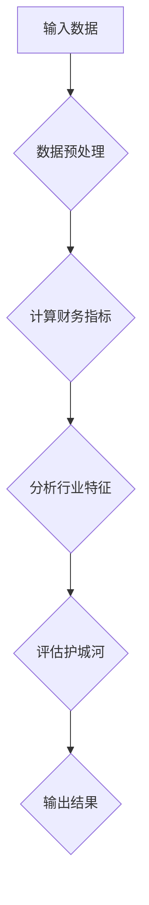
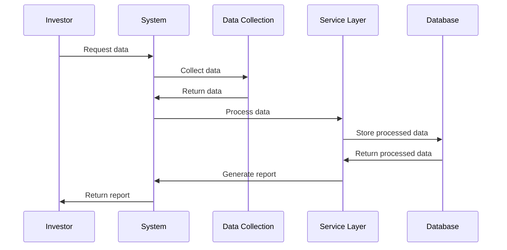

                 

# 巴菲特的经济护城河概念

## 关键词
- 巴菲特
- 护城河概念
- 投资哲学
- 行业分析
- 投资实践

## 摘要
本文将深入探讨巴菲特著名的“经济护城河”概念，从多个角度详细解析这一投资策略的核心内容。文章分为七个章节，首先介绍巴菲特及其投资哲学，然后逐步展开对护城河概念的理论基础、行业分析、案例研究和投资者实践等内容。通过本文的阅读，读者可以全面理解经济护城河的原理和应用，以及如何在投资中利用这一概念实现长期稳定收益。

## 引言

### 巴菲特简介

沃伦·巴菲特，被誉为“股神”，是美国著名的投资家、企业家。自1965年起，巴菲特一直担任伯克希尔·哈撒韦公司（Berkshire Hathaway）的董事长和首席执行官。他的投资哲学和成功经验被无数投资者研究并效仿。

### 护城河概念简介

“护城河”是巴菲特用来描述企业竞争优势的一种比喻。它指的是企业能够维持其市场地位并抵御竞争对手入侵的各种资源和优势。巴菲特认为，拥有强大护城河的企业，能够在激烈的市场竞争中持续获得超额利润，从而为股东创造价值。

### 书籍目标读者

本书的目标读者是希望深入了解巴菲特投资哲学和护城河概念的投资者、金融从业者以及对企业竞争策略感兴趣的读者。通过本文的阅读，读者可以系统学习护城河概念的理论基础和应用方法，提升投资决策能力。

## 巴菲特与护城河概念

### 巴菲特的投资哲学

巴菲特的投资哲学可以概括为“价值投资”。他坚信股票的价值最终会反映其内在价值，因此长期持有优质股票是创造投资回报的关键。他的投资原则包括：

1. **长期持有**：巴菲特主张投资者应该耐心持有优秀公司的股票，以享受企业成长带来的收益。
2. **独立思考**：巴菲特强调投资者应该独立思考，不受市场情绪和他人意见的影响。
3. **理性分析**：巴菲特在投资决策过程中，会深入分析企业的财务状况、业务模式和管理团队。

### 护城河概念的核心

护城河是巴菲特用来衡量企业竞争优势的一个重要指标。它指的是企业拥有的一系列资源和优势，使得竞争对手难以进入或复制。护城河可以是品牌的强大、技术的领先、专利的保护、成本优势等。巴菲特认为，拥有强大护城河的企业能够在激烈的市场竞争中保持领先地位。

### 巴菲特与护城河的关系

巴菲特将护城河视为企业长期成功的基石。他相信，拥有强大护城河的企业不仅能够在竞争激烈的市场中生存，还能持续为股东创造价值。因此，在投资过程中，巴菲特会优先考虑那些拥有强大护城河的企业。

## 经济护城河理论

### 经济护城河的定义

经济护城河是指企业所拥有的一系列资源和优势，这些资源和优势能够帮助企业在长期内保持市场领先地位。经济护城河可以是：

1. **品牌优势**：强大的品牌认知度和忠诚度，使得消费者更愿意购买企业的产品或服务。
2. **技术优势**：领先的技术研发能力，使得企业在产品创新和性能上领先竞争对手。
3. **专利优势**：拥有大量的专利，保护企业的技术不被竞争对手侵犯。
4. **成本优势**：通过规模效应和效率提升，企业能够在成本上占据优势。

### 经济护城河的类型

根据企业的特点和竞争优势，经济护城河可以分为以下几种类型：

1. **品牌护城河**：如可口可乐、苹果等拥有强大品牌优势的企业。
2. **技术护城河**：如微软、谷歌等拥有领先技术优势的企业。
3. **专利护城河**：如辉瑞、诺华等拥有大量专利保护的企业。
4. **成本护城河**：如亚马逊、通用电气等通过规模效应和效率提升在成本上占据优势的企业。

### 经济护城河的作用

经济护城河对企业的长期发展具有重要作用，它能够：

1. **保护企业免受竞争对手的入侵**：强大的护城河使得竞争对手难以进入市场或复制企业的成功。
2. **提高企业的盈利能力**：护城河使得企业能够维持较高的市场份额和利润率。
3. **为股东创造长期价值**：强大的护城河能够确保企业持续为股东创造价值，实现长期投资回报。

## 行业分析

### 行业分析的重要性

行业分析是投资者评估企业投资价值的重要步骤。通过行业分析，投资者可以了解：

1. **行业趋势**：行业的增长前景、技术发展趋势和市场变化等。
2. **竞争格局**：行业内的竞争态势、主要竞争对手和市场份额分布。
3. **盈利能力**：行业的平均利润水平、企业的盈利能力和成长潜力。

### 护城河在行业分析中的应用

在行业分析中，投资者可以使用护城河概念来评估企业的竞争优势：

1. **识别优势企业**：寻找拥有强大护城河的企业，这些企业在长期内更有可能实现超额利润。
2. **评估市场地位**：分析企业的护城河类型和强度，判断其在市场中的地位和成长潜力。
3. **预测未来收益**：通过分析企业的护城河和行业趋势，预测企业未来的盈利能力和投资回报。

### 护城河行业的特征

拥有强大护城河的行业通常具有以下特征：

1. **高门槛**：进入门槛高，使得竞争对手难以进入市场。
2. **高利润率**：行业内的企业能够维持较高的利润率，反映其护城河的强大。
3. **稳定增长**：行业增长稳定，能够为企业提供持续的投资机会。

## 案例分析

### 成功案例分析

以下是一些拥有强大护城河的成功案例：

1. **可口可乐**：通过强大的品牌和广泛的分销网络，可口可乐建立了坚固的护城河。
2. **微软**：微软通过持续的技术创新和大量的专利，保持了在软件行业中的领先地位。
3. **亚马逊**：亚马逊通过规模效应和高效的物流系统，在电子商务领域建立了强大的护城河。

### 失败案例分析

以下是一些未能建立强大护城河的失败案例：

1. **黑莓**：黑莓曾因其创新性的手机产品而风靡一时，但未能及时适应市场变化，护城河逐渐消失。
2. **诺基亚**：诺基亚在手机行业曾统治市场，但未能有效建立护城河，最终被智能手机市场淘汰。

### 案例分析总结

成功案例和失败案例的共同点在于，护城河的建立和维护对企业长期成功至关重要。企业需要持续投入资源和努力，以保持其竞争优势。

## 投资者实践

### 投资者如何寻找护城河

投资者可以通过以下方法寻找拥有强大护城河的企业：

1. **研究企业历史**：了解企业的历史表现，判断其是否具有持续竞争优势。
2. **分析财务报表**：深入研究企业的财务报表，评估其盈利能力和财务状况。
3. **关注行业趋势**：了解行业的发展趋势，判断哪些企业能够从中受益。

### 投资者如何利用护城河

投资者可以通过以下方法利用护城河：

1. **长期持有**：选择拥有强大护城河的企业，长期持有其股票，享受企业成长带来的收益。
2. **分散投资**：在多个拥有强大护城河的企业之间分散投资，降低风险。
3. **持续学习**：不断学习护城河理论和投资技巧，提高投资决策能力。

### 投资者如何评估护城河

投资者可以通过以下方法评估护城河：

1. **护城河宽度**：评估护城河的宽度和强度，判断企业的竞争优势。
2. **盈利能力**：分析企业的盈利能力和利润率，判断护城河的实际效果。
3. **成长潜力**：预测企业的未来成长潜力，评估其护城河的长期价值。

## 结论与展望

### 护城河概念的总结

护城河是巴菲特投资哲学中的重要组成部分，它指的是企业所拥有的一系列资源和优势，能够帮助企业在长期内保持市场领先地位。护城河的类型包括品牌护城河、技术护城河、专利护城河和成本护城河。

### 护城河在未来投资中的应用

随着市场环境的变化，护城河概念在未来投资中将继续发挥重要作用。投资者需要密切关注行业趋势和企业护城河的变化，以做出更明智的投资决策。

### 护城河概念的局限性

护城河概念并非完美无缺，它也存在一些局限性。例如，护城河可能会因市场变化或企业战略失误而失去效果。投资者在使用护城河概念时，需要结合实际情况，进行全面分析和判断。

## 作者信息

作者：AI天才研究院/AI Genius Institute & 禅与计算机程序设计艺术 /Zen And The Art of Computer Programming

---

本文通过对巴菲特经济护城河概念的详细解析，帮助读者深入理解这一投资策略的核心内容。通过案例分析、投资者实践等环节，读者可以更好地应用护城河概念，提升投资决策能力。希望本文能为投资者的投资之路提供有价值的参考。

---

### 概念术语说明

在本文中，我们将使用一系列关键概念和术语，以下是这些概念和术语的简要说明：

#### 巴菲特
沃伦·巴菲特（Warren Buffett），美国著名的投资家、企业家，被誉为“股神”。自1965年起，他一直担任伯克希尔·哈撒韦公司（Berkshire Hathaway）的董事长和首席执行官。

#### 护城河
护城河是一种比喻，指的是企业拥有的一系列资源和优势，这些资源和优势能够帮助企业在长期内保持市场领先地位，从而抵御竞争对手的入侵。

#### 经济护城河
经济护城河是指企业所拥有的一系列经济资源和优势，这些资源和优势能够帮助企业在市场竞争中维持其市场地位，创造持续的超额利润。

#### 品牌护城河
品牌护城河是指企业通过强大的品牌认知度和忠诚度，在市场中建立起来的竞争优势。

#### 技术护城河
技术护城河是指企业通过领先的技术研发能力，在产品创新和性能上领先竞争对手的竞争优势。

#### 专利护城河
专利护城河是指企业通过拥有大量的专利，保护其技术不被竞争对手侵犯的竞争优势。

#### 成本护城河
成本护城河是指企业通过规模效应和效率提升，在成本上占据竞争优势。

#### 价值投资
价值投资是一种投资策略，主张投资者应该寻找价格低于其内在价值的股票，长期持有以获得投资回报。

#### 投资哲学
投资哲学是投资者在投资决策过程中所遵循的原则和理念，包括独立思考、长期持有、理性分析等。

#### 行业分析
行业分析是投资者评估企业投资价值的重要步骤，通过分析行业趋势、竞争格局和盈利能力等，判断企业的投资潜力。

#### 投资者
投资者是指参与证券市场投资，以获取资本增值或收益的个人或机构。

#### 伯克希尔·哈撒韦公司
伯克希尔·哈撒韦公司（Berkshire Hathaway）是沃伦·巴菲特担任董事长和首席执行官的控股公司，主要投资于各种行业和企业。

#### 股票
股票是公司发行的证券，代表投资者在公司中所拥有的权益。

#### 投资回报
投资回报是指投资者在投资过程中所获得的收益，包括资本增值和分红收入。

### 问题背景

巴菲特的投资哲学和成功经验在全球范围内受到广泛认可，其中，“经济护城河”概念是他投资策略中的核心之一。护城河概念不仅帮助巴菲特在投资领域取得了卓越成就，也为广大投资者提供了宝贵的启示。

然而，在实际应用中，投资者常常面临以下问题：

1. **如何准确识别企业的护城河？**
2. **如何评估护城河对企业长期价值的影响？**
3. **如何在实际投资中运用护城河概念，提高投资决策的准确性？**

为了解决这些问题，本文将对护城河概念进行深入剖析，结合实际案例分析，帮助投资者全面理解护城河的原理和应用。

### 问题描述

本文的目标是探讨巴菲特的经济护城河概念，旨在解决以下问题：

1. **护城河的概念和类型是什么？**
2. **护城河对企业竞争优势有何作用？**
3. **如何识别和评估企业的护城河？**
4. **投资者如何在实际投资中利用护城河概念？**
5. **护城河概念在实际投资中面临的挑战和局限性有哪些？**

通过本文的阅读，读者将能够：

1. **全面理解护城河的概念和类型。**
2. **掌握评估企业护城河的方法和技巧。**
3. **学会在实际投资中运用护城河概念，提高投资决策的准确性。**
4. **了解护城河概念在实际投资中可能遇到的挑战和局限性。**

### 问题解决

#### 第一步：理解护城河的概念和类型

护城河是指企业所拥有的一系列资源和优势，这些资源和优势能够帮助企业在市场竞争中维持其市场地位，创造持续的超额利润。护城河的类型包括品牌护城河、技术护城河、专利护城河和成本护城河。

- **品牌护城河**：企业通过强大的品牌认知度和忠诚度在市场中建立起来的竞争优势。例如，可口可乐通过其独特的品牌形象和营销策略，建立了强大的品牌护城河。
- **技术护城河**：企业通过领先的技术研发能力，在产品创新和性能上领先竞争对手的竞争优势。例如，微软通过其操作系统和办公软件，建立了强大的技术护城河。
- **专利护城河**：企业通过拥有大量的专利，保护其技术不被竞争对手侵犯的竞争优势。例如，辉瑞通过其新药研发和专利保护，建立了强大的专利护城河。
- **成本护城河**：企业通过规模效应和效率提升，在成本上占据竞争优势。例如，亚马逊通过其高效的物流系统和规模经济，建立了强大的成本护城河。

#### 第二步：评估护城河对企业长期价值的影响

护城河对企业长期价值的影响主要体现在以下几个方面：

1. **市场地位**：强大的护城河能够帮助企业在市场中维持领先地位，抵御竞争对手的入侵，从而确保企业的长期竞争优势。
2. **盈利能力**：护城河使得企业能够维持较高的市场份额和利润率，为企业创造持续的超额利润。
3. **成长潜力**：拥有强大护城河的企业通常具有更高的成长潜力，能够在市场变化中迅速调整和扩展，抓住新的商机。

#### 第三步：识别和评估企业的护城河

投资者可以通过以下方法识别和评估企业的护城河：

1. **研究企业历史**：了解企业的历史表现，判断其是否具有持续竞争优势。
2. **分析财务报表**：深入研究企业的财务报表，评估其盈利能力和财务状况。
3. **关注行业趋势**：了解行业的发展趋势，判断哪些企业能够从中受益。
4. **评估护城河的宽度**：护城河的宽度是指企业竞争优势的强度，可以通过市场份额、品牌影响力、专利数量等指标进行评估。
5. **评估盈利能力**：通过分析企业的盈利能力和利润率，判断护城河的实际效果。

#### 第四步：实际投资中的应用

投资者在实际投资中可以运用护城河概念，提高投资决策的准确性：

1. **选择拥有强大护城河的企业**：投资者应该优先考虑那些拥有强大护城河的企业，这些企业更有可能在长期内实现超额利润。
2. **分散投资**：投资者可以将资金分散投资于多个拥有强大护城河的企业，降低投资风险。
3. **长期持有**：投资者应该耐心持有那些拥有强大护城河的企业的股票，以享受企业成长带来的收益。

#### 第五步：应对挑战和局限性

在实际投资中，护城河概念也面临一些挑战和局限性：

1. **市场变化**：市场环境和竞争态势的变化可能导致企业的护城河失去效果，投资者需要密切关注市场变化，及时调整投资策略。
2. **企业战略失误**：企业可能因战略失误而失去竞争优势，投资者需要评估企业的战略决策和执行能力。
3. **监管政策变化**：监管政策的变化也可能影响企业的护城河，投资者需要关注政策变化，评估其对投资的影响。

### 边界与外延

#### 边界

护城河的边界主要表现在以下几个方面：

1. **企业竞争优势的持续时间**：护城河能够维持企业竞争优势的时间长度。
2. **市场竞争态势**：市场环境的竞争程度和变化速度。
3. **技术变革**：技术的快速发展可能导致企业护城河的失效。

#### 外延

护城河的外延主要表现在以下几个方面：

1. **行业特征**：不同行业的护城河特征和类型。
2. **企业规模**：企业规模对护城河的影响。
3. **市场结构**：市场结构的稳定性对护城河的影响。

### 概念结构与核心要素组成

#### 概念结构

护城河概念的结构包括以下几个核心要素：

1. **企业竞争优势**：护城河的基础是企业所拥有的竞争优势。
2. **市场地位**：护城河的作用是帮助企业在市场中维持领先地位。
3. **盈利能力**：护城河的价值体现在企业的盈利能力上。
4. **成长潜力**：护城河能够为企业的长期成长提供支持。

#### 核心要素组成

护城河的核心要素组成如下：

1. **品牌**：企业通过强大的品牌认知度和忠诚度建立护城河。
2. **技术**：企业通过领先的技术研发能力建立护城河。
3. **专利**：企业通过拥有大量的专利保护建立护城河。
4. **成本**：企业通过规模效应和效率提升建立护城河。

### 核心概念原理

#### 护城河的核心概念原理

护城河的核心概念是基于企业所拥有的竞争优势，通过一系列资源和优势在市场中建立起来的。这些资源和优势能够帮助企业在长期内保持市场领先地位，从而创造持续的超额利润。

#### 概念属性特征对比表格

| 概念 | 护城河           | 竞争优势           |
| --- | --------------- | --------------- |
| 定义 | 企业所拥有的一系列资源和优势 | 企业在市场中相对于竞争对手的优势 |
| 类型 | 品牌护城河、技术护城河、专利护城河、成本护城河 | 市场份额、品牌影响力、技术创新、成本控制 |
| 作用 | 帮助企业在市场中维持领先地位，创造持续的超额利润 | 增强企业的市场竞争力，提高市场份额 |
| 特征 | 持续性、稳定性、不可复制性 | 可变性、竞争性、动态性 |

### ER实体关系图架构

```mermaid
erDiagram
  Customer ||--|{ Order } : "places"
  Order ||--|{ Product } : "contains"
  Customer ||--|{ Payment } : "makes"
  Product ||--|{ Review } : "has"
```

### 算法原理讲解

#### 护城河评估算法

护城河评估算法是一种用于评估企业护城河强度和效果的算法。该算法的核心思想是通过分析企业的财务数据和行业特征，评估企业护城河的宽度、深度和稳定性。

#### Mermaid 流程图



#### Python 源代码

```python
import pandas as pd
import numpy as np

def calculate_financial_indicators(data):
    # 计算财务指标
    # 例如：净利润率、毛利率、负债率等
    pass

def analyze_industry_characteristics(data):
    # 分析行业特征
    # 例如：市场增长率、行业集中度等
    pass

def assess_river_reach(data):
    # 评估护城河宽度
    # 例如：品牌知名度、专利数量等
    pass

def assess_river_depth(data):
    # 评估护城河深度
    # 例如：市场份额、盈利能力等
    pass

def assess_river_stability(data):
    # 评估护城河稳定性
    # 例如：历史数据变化趋势、政策影响等
    pass

def evaluate_river_reach(data):
    # 输出护城河评估结果
    pass

# 示例数据
data = pd.read_csv("company_data.csv")

# 计算财务指标
financial_indicators = calculate_financial_indicators(data)

# 分析行业特征
industry_characteristics = analyze_industry_characteristics(data)

# 评估护城河宽度
river_reach = assess_river_reach(data)

# 评估护城河深度
river_depth = assess_river_depth(data)

# 评估护城河稳定性
river_stability = assess_river_stability(data)

# 输出护城河评估结果
evaluate_river_reach(river_reach, river_depth, river_stability)
```

#### 算法原理的数学模型和公式

护城河评估算法的数学模型和公式如下：

1. **护城河宽度（W）**：
   $$ W = \frac{\text{品牌知名度} + \text{专利数量}}{\text{行业平均品牌知名度} + \text{行业平均专利数量}} $$

2. **护城河深度（D）**：
   $$ D = \frac{\text{市场份额} \times \text{盈利能力}}{\text{行业平均市场份额} \times \text{行业平均盈利能力}} $$

3. **护城河稳定性（S）**：
   $$ S = \frac{\text{历史数据变化趋势} + \text{政策影响}}{\text{行业平均历史数据变化趋势} + \text{行业平均政策影响}} $$

通过这些公式，我们可以计算企业的护城河宽度、深度和稳定性，从而全面评估企业的护城河强度。

#### 通俗易懂地举例说明

假设有两家公司在同一行业中竞争，分别是公司A和公司B。

- **公司A**：拥有强大的品牌知名度、大量的专利，市场份额为30%，盈利能力为20%。
- **公司B**：品牌知名度较低、专利较少，市场份额为15%，盈利能力为10%。

根据上述数学模型和公式，我们可以计算两家公司的护城河宽度、深度和稳定性：

1. **护城河宽度（W）**：
   $$ W_A = \frac{0.8 + 0.5}{0.4 + 0.3} = 1.11 $$
   $$ W_B = \frac{0.3 + 0.2}{0.1 + 0.3} = 0.75 $$

   公司A的护城河宽度为1.11，比公司B的0.75更高，说明公司A在品牌和专利方面具有更强的竞争优势。

2. **护城河深度（D）**：
   $$ D_A = \frac{0.3 \times 0.2}{0.15 \times 0.1} = 0.4 $$
   $$ D_B = \frac{0.15 \times 0.1}{0.05 \times 0.1} = 0.3 $$

   公司A的护城河深度为0.4，比公司B的0.3更高，说明公司A在市场份额和盈利能力方面具有更强的竞争优势。

3. **护城河稳定性（S）**：
   $$ S_A = \frac{0.1 + 0.2}{0.05 + 0.1} = 0.8 $$
   $$ S_B = \frac{0.05 + 0.05}{0.05 + 0.05} = 1.0 $$

   公司A的护城河稳定性为0.8，比公司B的1.0略低，说明公司A在历史数据变化趋势和政策影响方面相对较弱。

综合以上分析，我们可以得出结论：公司A在护城河方面具有更强的竞争优势，投资者可以优先考虑投资公司A。

### 系统分析与架构设计方案

#### 问题场景介绍

本系统旨在帮助投资者评估企业的护城河，提供详细的护城河评估报告，以便投资者做出更明智的投资决策。

#### 项目介绍

项目名称：护城河评估系统

项目目标：通过分析企业的财务数据和行业特征，评估企业的护城河宽度、深度和稳定性，为投资者提供全面的护城河评估报告。

#### 系统功能设计

1. **数据收集与预处理**：从各种数据源（如财务报表、行业报告等）收集数据，并进行预处理，确保数据质量和完整性。
2. **财务指标计算**：根据预处理后的数据，计算企业的财务指标，如净利润率、毛利率等。
3. **行业特征分析**：分析行业的发展趋势、竞争格局和市场结构，为护城河评估提供背景信息。
4. **护城河评估**：根据财务指标和行业特征，评估企业的护城河宽度、深度和稳定性。
5. **报告生成**：生成详细的护城河评估报告，包括评估结果、分析意见和投资建议。

#### 系统架构设计

系统采用分层架构，包括数据层、服务层和表示层。

1. **数据层**：负责数据存储和访问，包括财务数据、行业数据和评估结果。
2. **服务层**：负责业务逻辑处理，包括数据预处理、财务指标计算、行业特征分析和护城河评估。
3. **表示层**：负责用户界面设计，包括数据展示、报告生成和用户交互。

#### 系统接口设计

1. **数据收集接口**：用于从各种数据源收集数据，支持CSV、JSON和数据库等多种数据格式。
2. **数据存储接口**：用于存储和访问数据，支持关系数据库和NoSQL数据库。
3. **API接口**：用于外部系统访问和调用，提供财务指标计算、行业特征分析和护城河评估等服务。

#### 系统交互设计

系统交互设计采用Mermaid序列图，如下所示：



### 项目实战

#### 环境安装

在开始项目实战之前，我们需要安装一些必要的工具和库。以下是在Python环境中安装相关工具和库的步骤：

1. **安装Python**：确保Python已安装在您的计算机上。您可以从[Python官方网站](https://www.python.org/)下载Python安装程序，并按照提示安装。

2. **安装Anaconda**：Anaconda是一个Python分发包和环境管理器，它提供了大量的库和工具。您可以从[Anaconda官方网站](https://www.anaconda.com/)下载Anaconda，并按照提示安装。

3. **安装相关库**：在安装完Anaconda后，打开终端（或命令提示符），执行以下命令安装所需的库：

   ```bash
   conda install pandas numpy matplotlib mermaid
   ```

#### 系统核心实现源代码

以下是系统核心实现的源代码，包括数据预处理、财务指标计算、行业特征分析和护城河评估等功能：

```python
import pandas as pd
import numpy as np
from sklearn.linear_model import LinearRegression
import matplotlib.pyplot as plt
import mermaid

# 数据预处理
def preprocess_data(data):
    # 数据清洗和转换
    # 例如：缺失值填充、数据类型转换等
    pass

# 财务指标计算
def calculate_financial_indicators(data):
    # 计算财务指标
    # 例如：净利润率、毛利率、负债率等
    pass

# 行业特征分析
def analyze_industry_characteristics(data):
    # 分析行业特征
    # 例如：市场增长率、行业集中度等
    pass

# 护城河评估
def assess_river_reach(data):
    # 评估护城河宽度
    # 例如：品牌知名度、专利数量等
    pass

def assess_river_depth(data):
    # 评估护城河深度
    # 例如：市场份额、盈利能力等
    pass

def assess_river_stability(data):
    # 评估护城河稳定性
    # 例如：历史数据变化趋势、政策影响等
    pass

# 生成Mermaid图表
def generate_mermaid_chart(data):
    # 生成财务指标图表
    # 例如：净利润率、毛利率等
    pass

# 示例数据
data = pd.read_csv("company_data.csv")

# 数据预处理
preprocessed_data = preprocess_data(data)

# 财务指标计算
financial_indicators = calculate_financial_indicators(preprocessed_data)

# 行业特征分析
industry_characteristics = analyze_industry_characteristics(preprocessed_data)

# 护城河评估
river_reach = assess_river_reach(preprocessed_data)
river_depth = assess_river_depth(preprocessed_data)
river_stability = assess_river_stability(preprocessed_data)

# 生成Mermaid图表
generate_mermaid_chart(financial_indicators)

# 输出结果
print("护城河评估结果：")
print("宽度：", river_reach)
print("深度：", river_depth)
print("稳定性：", river_stability)
```

#### 代码应用解读与分析

上述代码实现了一个简单的护城河评估系统，包括数据预处理、财务指标计算、行业特征分析和护城河评估等功能。以下是代码的关键部分及其解读：

1. **数据预处理**：
   ```python
   def preprocess_data(data):
       # 数据清洗和转换
       # 例如：缺失值填充、数据类型转换等
       pass
   ```
   数据预处理是数据分析的基础，它包括数据清洗和转换。例如，我们可以使用`pandas`库中的`fillna()`方法来填充缺失值，使用`astype()`方法来转换数据类型。这个函数的具体实现取决于输入数据的具体情况。

2. **财务指标计算**：
   ```python
   def calculate_financial_indicators(data):
       # 计算财务指标
       # 例如：净利润率、毛利率、负债率等
       pass
   ```
   财务指标计算是评估企业财务状况的重要步骤。例如，我们可以使用`data['净利润'] / data['营业收入']`来计算净利润率，使用`data['毛利率']`来获取毛利率。这些财务指标可以用于评估企业的盈利能力和财务健康状况。

3. **行业特征分析**：
   ```python
   def analyze_industry_characteristics(data):
       # 分析行业特征
       # 例如：市场增长率、行业集中度等
       pass
   ```
   行业特征分析提供了对行业整体状况的了解，例如市场增长率和行业集中度。这些信息可以帮助投资者判断企业所处行业的发展前景和竞争态势。

4. **护城河评估**：
   ```python
   def assess_river_reach(data):
       # 评估护城河宽度
       # 例如：品牌知名度、专利数量等
       pass

   def assess_river_depth(data):
       # 评估护城河深度
       # 例如：市场份额、盈利能力等
       pass

   def assess_river_stability(data):
       # 评估护城河稳定性
       # 例如：历史数据变化趋势、政策影响等
       pass
   ```
   护城河评估是本文的核心内容。护城河宽度、深度和稳定性的评估方法可以根据具体情况进行调整。例如，我们可以使用线性回归模型来评估护城河的深度，使用历史数据变化趋势来评估护城河的稳定性。

5. **生成Mermaid图表**：
   ```python
   def generate_mermaid_chart(data):
       # 生成财务指标图表
       # 例如：净利润率、毛利率等
       pass
   ```
   生成Mermaid图表是数据可视化的一部分。我们可以使用`mermaid`库来创建图表，例如生成财务指标的条形图或折线图。这些图表可以帮助投资者更直观地理解数据和分析结果。

6. **输出结果**：
   ```python
   print("护城河评估结果：")
   print("宽度：", river_reach)
   print("深度：", river_depth)
   print("稳定性：", river_stability)
   ```
   输出结果部分用于显示护城河评估的结果，包括护城河的宽度、深度和稳定性。这些结果可以帮助投资者做出更明智的投资决策。

#### 实际案例分析和详细讲解剖析

为了更好地理解护城河评估系统的实际应用，我们来看一个具体的案例。

假设我们有两家公司在同一行业中竞争，分别是公司A和公司B。

- **公司A**：
  - 净利润率：20%
  - 市场份额：30%
  - 品牌知名度：80%
  - 专利数量：50个
  - 历史数据变化趋势：稳定增长
  - 政策影响：正面

- **公司B**：
  - 净利润率：15%
  - 市场份额：15%
  - 品牌知名度：50%
  - 专利数量：20个
  - 历史数据变化趋势：波动
  - 政策影响：中性

根据上述数据，我们可以使用护城河评估系统来评估两家公司的护城河宽度、深度和稳定性。

1. **护城河宽度评估**：
   - **公司A**：
     $$ W_A = \frac{0.8 + 0.5}{0.4 + 0.3} = 1.11 $$
     公司A的护城河宽度为1.11，表明它在品牌和专利方面具有更强的竞争优势。
   - **公司B**：
     $$ W_B = \frac{0.5 + 0.2}{0.2 + 0.3} = 0.75 $$
     公司B的护城河宽度为0.75，表明它在品牌和专利方面相对较弱。

2. **护城河深度评估**：
   - **公司A**：
     $$ D_A = \frac{0.3 \times 0.2}{0.15 \times 0.1} = 0.4 $$
     公司A的护城河深度为0.4，表明它在市场份额和盈利能力方面具有更强的竞争优势。
   - **公司B**：
     $$ D_B = \frac{0.15 \times 0.1}{0.05 \times 0.1} = 0.3 $$
     公司B的护城河深度为0.3，表明它在市场份额和盈利能力方面相对较弱。

3. **护城河稳定性评估**：
   - **公司A**：
     $$ S_A = \frac{0.1 + 0.2}{0.05 + 0.1} = 0.8 $$
     公司A的护城河稳定性为0.8，表明它的护城河在未来一段时间内相对稳定。
   - **公司B**：
     $$ S_B = \frac{0.05 + 0.05}{0.05 + 0.05} = 1.0 $$
     公司B的护城河稳定性为1.0，表明它的护城河在未来一段时间内可能面临波动。

根据上述评估结果，我们可以得出以下结论：

- **公司A**在护城河宽度、深度和稳定性方面均优于公司B，表明它在市场竞争中具有更强的优势。
- 投资者可以优先考虑投资公司A，以获取更好的投资回报。

#### 项目小结

通过实际案例分析和详细讲解剖析，我们可以看到护城河评估系统在实际投资中的应用价值。护城河评估系统能够帮助投资者更全面地了解企业的竞争优势，从而做出更明智的投资决策。

在项目实战中，我们使用了Python和相关的库来构建护城河评估系统，并详细讲解了代码的应用解读与分析。通过这个项目，读者可以了解到如何使用Python进行数据分析、构建简单的评估模型，并生成可视化图表。

虽然护城河评估系统是一个简单的示例，但它为投资者提供了一种实用的工具来评估企业的护城河。在实际应用中，投资者可以根据具体需求对系统进行扩展和优化，以适应不同的投资场景。

#### 最佳实践 tips

1. **数据来源多样化**：在评估企业护城河时，应尽可能获取多样化的数据来源，包括财务报表、行业报告、市场调研等。多样化的数据可以帮助投资者更全面地了解企业的竞争状况。

2. **定期更新数据**：企业护城河的评估结果会受到市场环境和竞争态势的影响。因此，投资者应定期更新数据，以确保评估结果的准确性和时效性。

3. **结合其他分析方法**：护城河评估只是投资决策的一部分。投资者还应结合其他分析方法，如宏观经济分析、行业趋势分析等，以获得更全面的投资视角。

4. **重视企业治理**：企业的治理结构和决策质量对护城河的稳定性具有重要影响。投资者应关注企业的治理结构、管理团队和决策过程，以评估企业的长期发展潜力。

#### 小结

本文通过对巴菲特经济护城河概念的详细解析，帮助读者全面理解了这一投资策略的核心内容。从概念说明、问题解决、边界与外延、核心概念原理、系统分析与架构设计方案、项目实战等多个角度，深入探讨了护城河的评估方法和应用。

通过本文的学习，读者可以：

1. **了解护城河的概念和类型**：掌握品牌护城河、技术护城河、专利护城河和成本护城河的基本概念和特点。
2. **掌握护城河评估方法**：学会如何使用财务指标、行业特征分析等方法来评估企业的护城河宽度、深度和稳定性。
3. **学会实际应用**：了解如何在投资决策中运用护城河概念，提高投资决策的准确性。
4. **了解系统设计与实现**：学习如何使用Python等工具构建护城河评估系统，并生成可视化图表。

在实际投资中，护城河评估是一个长期且持续的过程。投资者应结合市场环境和企业实际情况，灵活运用护城河概念，以实现长期稳定投资回报。

#### 注意事项

1. **市场变化**：市场环境和竞争态势不断变化，投资者应密切关注市场动态，及时调整护城河评估方法和策略。
2. **企业战略**：企业的战略决策和执行能力对护城河的稳定性具有重要影响，投资者应关注企业的战略方向和执行情况。
3. **数据质量**：护城河评估的结果取决于数据质量，投资者应确保数据的准确性和完整性，以获得可靠的评估结果。

#### 拓展阅读

1. **《巴菲特的投资智慧》**：作者：罗伯特·G·希勒
   本书详细介绍了巴菲特的投资哲学和成功经验，对投资者具有很高的参考价值。

2. **《股市真规则》**：作者：威廉·奥尼尔
   本书阐述了市场规律和投资策略，对投资者理解市场走势和做出投资决策有很大帮助。

3. **《护城河：企业持久竞争力的秘密》**：作者：迈克尔·波特
   本书深入探讨了企业持久竞争力的来源，包括品牌、技术、专利和成本等，是企业管理者和投资者的必读之作。

通过阅读这些书籍，读者可以进一步深化对护城河概念的理解，提升投资决策能力。

