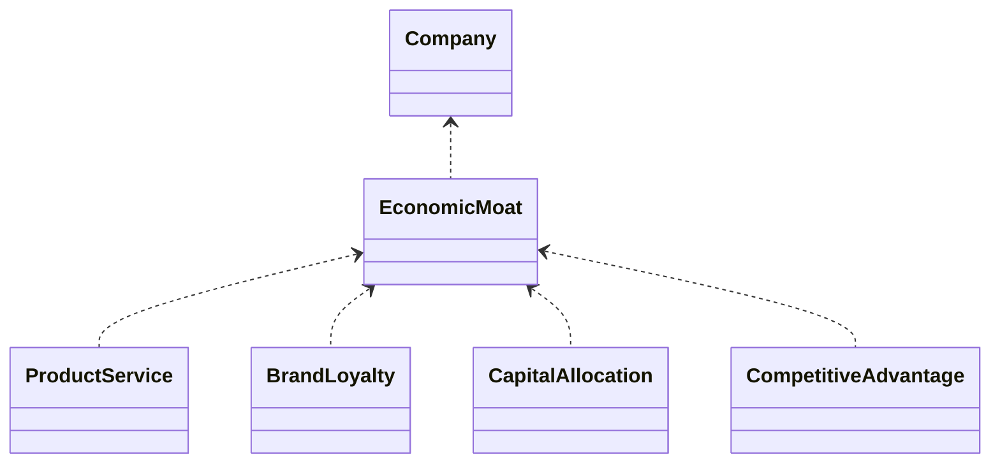
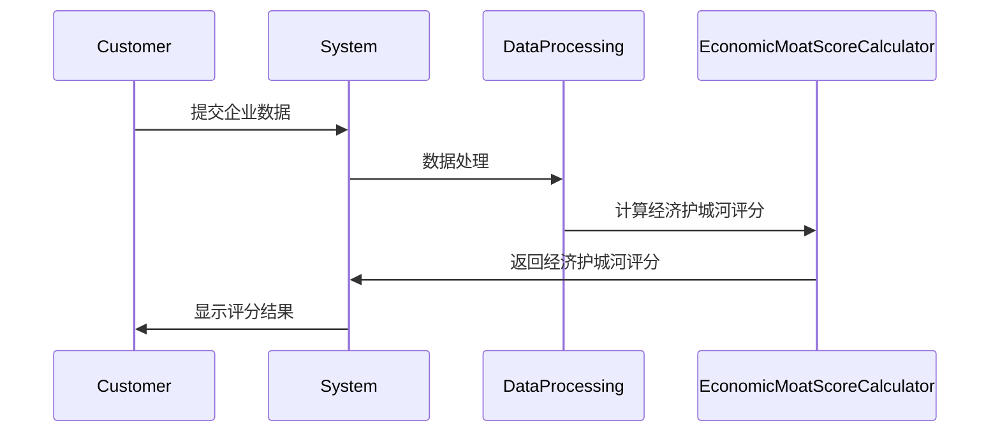
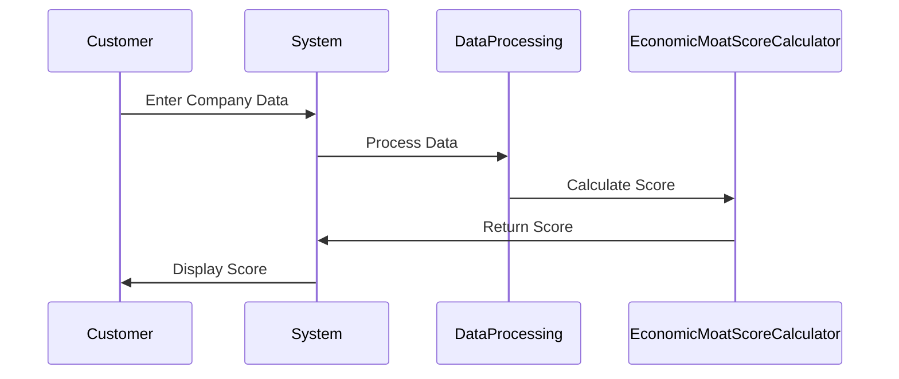

                 

# 巴菲特的经济护城河概念：寻找持久竞争优势

## 摘要

本文将深入探讨巴菲特提出的经济护城河（Economic Moat）概念，解释其在寻找持久竞争优势中的应用。文章首先介绍了巴菲特的投资哲学和经济护城河理论，然后分析了其核心要素、分析方法及应用，并通过具体案例展示了该理论在现实中的应用。最后，本文总结了经济护城河理论在投资决策中的重要性，并提出了一些寻找持久竞争优势的策略。

## 一、巴菲特的经济护城河理论基础

### 1.1 巴菲特的投资哲学

巴菲特作为著名的价值投资者，他的投资哲学深受投资者的推崇。他强调投资于具有持久竞争优势的企业，长期持有这些股票，从而实现资本增值。他的投资哲学的核心观点可以概括为：

1. **价值投资**：寻找价格低于其内在价值的股票。
2. **长期持有**：相信时间是优秀企业的朋友，长期持有优质股票。
3. **稳健风险控制**：避免投资那些不了解的公司和行业，以控制风险。

### 1.2 经济护城河的概念

经济护城河是指企业通过某些优势，能够在长期内维持高于行业平均水平的盈利能力和市场份额。这种优势可能是产品或服务的独特性、品牌忠诚度、专利保护、成本优势等。经济护城河的作用是保护企业免受竞争对手的威胁，从而实现持续增长。

### 1.3 经济护城河的重要性

经济护城河对于企业的重要性体现在以下几个方面：

1. **盈利能力**：具有经济护城河的企业能够保持较高的盈利能力，从而为股东创造价值。
2. **市场地位**：经济护城河有助于企业巩固市场地位，成为行业的领导者。
3. **竞争防御**：经济护城河可以有效地阻止竞争对手进入市场，保护企业的市场份额。

### 1.4 经济护城河的核心要素

经济护城河的核心要素包括：

1. **独特的产品或服务**：企业提供的产品或服务必须具有独特性，难以被竞争对手模仿。
2. **品牌忠诚度**：企业拥有高忠诚度的客户群体，这些客户对品牌有较高的信任度。
3. **资本配置效率**：企业能够有效地利用资本，实现较高的回报率。
4. **竞争优势**：企业拥有某些竞争优势，使其在市场上处于有利地位。

### 1.5 经济护城河的分析方法

经济护城河的分析方法包括定量分析和定性分析：

1. **定量分析**：通过财务指标、市场份额、研发投入等数据进行量化分析，评估企业的经济护城河。
2. **定性分析**：通过分析企业的产品、品牌、市场定位等，评估企业的经济护城河。

### 1.6 经济护城河理论的应用

经济护城河理论可以应用于：

1. **行业分析**：分析不同行业的特点，寻找具有经济护城河的企业。
2. **公司估值**：评估企业的经济护城河价值，为投资决策提供依据。
3. **投资决策**：根据经济护城河理论，选择具有持久竞争优势的企业进行投资。

### 1.7 本章小结

本章介绍了巴菲特的经济护城河理论，分析了其核心要素、分析方法及应用。理解经济护城河的概念和重要性，对于投资者来说具有重要意义，有助于他们在选择投资对象时做出更明智的决策。

## 二、寻找持久竞争优势

### 2.1 持久竞争优势的特征

持久竞争优势具有以下特征：

1. **持续的市场领导地位**：企业在市场上拥有领先地位，并能够长期保持这种地位。
2. **高度的品牌忠诚度**：企业拥有忠实的客户群体，这些客户对品牌有较高的忠诚度。
3. **强大的盈利能力**：企业能够实现较高的盈利水平，并保持稳定的增长。

### 2.2 持久竞争优势的来源

持久竞争优势的来源包括：

1. **产品创新**：企业能够持续推出创新产品，满足市场需求。
2. **技术优势**：企业拥有先进的技术，使其在市场上具有竞争优势。
3. **市场定位**：企业能够准确把握市场趋势，制定合适的市场策略。
4. **管理团队**：企业拥有高效的管理团队，能够有效地执行战略计划。

### 2.3 案例分析：苹果公司的经济护城河

苹果公司作为全球领先的科技公司，其经济护城河体现在以下几个方面：

1. **产品与服务**：苹果公司提供的产品具有高度创新性，如iPhone、iPad、MacBook等，这些产品在市场上具有很高的竞争力。
2. **品牌与市场**：苹果公司拥有极高的品牌忠诚度，其品牌影响力遍及全球。
3. **竞争对手分析**：苹果公司在智能手机、平板电脑和笔记本电脑市场具有明显的竞争优势，其竞争对手难以与之抗衡。
4. **未来展望**：苹果公司持续进行技术创新，其市场地位和竞争优势有望在未来继续保持。

### 2.4 案例分析：可口可乐的经济护城河

可口可乐作为全球知名的饮料品牌，其经济护城河体现在以下几个方面：

1. **品牌与市场**：可口可乐拥有极高的品牌忠诚度，其品牌在全球范围内具有很高的认知度。
2. **产品与服务**：可口可乐提供多种饮料产品，满足不同消费者的需求。
3. **竞争对手分析**：可口可乐在饮料市场中具有明显的竞争优势，其竞争对手难以撼动其市场地位。
4. **未来展望**：可口可乐持续进行产品创新和市场拓展，其经济护城河有望在未来继续扩大。

### 2.5 寻找持久竞争优势的策略

企业要寻找持久竞争优势，可以采取以下策略：

1. **企业战略规划**：制定明确的企业战略，确保企业能够持续发展。
2. **资本配置**：合理配置资本，确保企业能够充分利用资源。
3. **创新与研发**：持续进行技术创新和产品研发，提高企业的竞争力。
4. **团队建设**：培养高效的管理团队，确保企业战略的有效执行。

### 2.6 本章小结

本章分析了持久竞争优势的特征和来源，并通过案例分析展示了经济护城河理论在现实中的应用。理解持久竞争优势的概念和策略，对于企业制定发展战略和投资者选择投资对象具有重要意义。

## 三、经济护城河与投资决策

### 3.1 投资决策中的经济护城河考量

投资者在做出投资决策时，需要考虑以下因素：

1. **估值方法**：通过财务指标、市场地位等评估企业的价值。
2. **护城河价值的估算**：评估企业的经济护城河价值，判断其是否具有持久竞争优势。
3. **投资风险与回报分析**：综合考虑投资风险和预期回报，做出明智的投资决策。

### 3.2 案例研究：通过经济护城河寻找投资机会

投资者可以通过以下步骤寻找具有经济护城河的投资机会：

1. **选取行业**：选择具有较高经济护城河的行业，如科技、消费品等。
2. **评估公司**：分析公司的财务状况、市场地位、竞争优势等，判断其是否具有经济护城河。
3. **投资决策案例分析**：结合公司的经济护城河和投资风险，制定投资策略。

### 3.3 经济护城河理论在投资实践中的应用

经济护城河理论在投资实践中的应用包括：

1. **上市公司研究**：通过分析上市公司的经济护城河，为投资决策提供依据。
2. **行业分析**：研究不同行业的特点，寻找具有经济护城河的企业。
3. **投资组合管理**：根据经济护城河理论，构建合理的投资组合，降低风险。

### 3.4 投资决策与经济护城河的综合运用

投资者在投资决策中，应综合运用经济护城河理论，注意以下几点：

1. **投资策略的调整**：根据经济护城河的变化，调整投资策略。
2. **经济周期与护城河的动态分析**：关注经济周期对护城河的影响，合理评估投资价值。
3. **投资决策的执行与反馈**：根据投资实践，及时调整投资决策。

### 3.5 本章小结

本章探讨了经济护城河理论在投资决策中的应用，分析了投资决策中的考量因素，并通过案例研究展示了如何通过经济护城河寻找投资机会。理解经济护城河理论，对于投资者做出明智的投资决策具有重要意义。

## 四、总结与展望

经济护城河理论是巴菲特投资哲学的重要组成部分，它揭示了企业在长期内维持竞争优势的关键。本文通过对经济护城河概念的分析，阐述了其在寻找持久竞争优势中的应用。同时，文章结合实际案例，展示了经济护城河理论在投资决策中的重要性。未来，随着全球经济环境和市场竞争的不断变化，经济护城河理论将继续发挥重要作用，为投资者和企业提供有益的指导。作者：AI天才研究院/AI Genius Institute & 禅与计算机程序设计艺术/Zen And The Art of Computer Programming

## 附录

### 附录A：核心概念对比表格

| 核心概念 | 定义 | 特点 |  
| ------ | ------ | ------ |  
| 价值投资 | 寻找价格低于其内在价值的股票 | 低价购买优质股票，长期持有 |  
| 经济护城河 | 企业通过某些优势，在长期内维持高于行业平均水平的盈利能力和市场份额 | 保护企业免受竞争对手的威胁，实现持续增长 |  
| 持久竞争优势 | 企业在长期内保持市场领导地位、品牌忠诚度和强大的盈利能力 | 持续的市场领导地位、高度的品牌忠诚度和强大的盈利能力 |

### 附录B：经济护城河的ER实体关系图

```mermaid
erDiagram
    Company ||--|{ EconomicMoat }
    EconomicMoat ||--|{ ProductService }
    EconomicMoat ||--|{ BrandLoyalty }
    EconomicMoat ||--|{ CapitalAllocation }
    EconomicMoat ||--|{ CompetitiveAdvantage }
```

### 附录C：算法原理讲解

```python
# 算法原理讲解
# 假设我们有一个经济护城河评分系统，用于评估企业的经济护城河强度。
# 经济护城河评分系统基于以下指标：产品或服务的独特性（U），品牌忠诚度（B），资本配置效率（C），竞争优势（A）。

# 算法公式：
# EconomicMoatScore = U * 0.3 + B * 0.3 + C * 0.2 + A * 0.2

# 示例数据：
# U = 0.8 (产品或服务的独特性评分)
# B = 0.9 (品牌忠诚度评分)
# C = 0.7 (资本配置效率评分)
# A = 0.8 (竞争优势评分)

# 计算经济护城河评分：
economic_moat_score = 0.8 * 0.3 + 0.9 * 0.3 + 0.7 * 0.2 + 0.8 * 0.2
economic_moat_score = 0.24 + 0.27 + 0.14 + 0.16
economic_moat_score = 0.81

# 结论：
# 根据计算结果，企业的经济护城河评分为0.81，表明该企业具有较强的经济护城河。
```

### 附录D：系统分析与架构设计方案

#### 项目介绍

本项目旨在设计一个经济护城河评估系统，该系统能够自动评估企业的经济护城河强度，为投资决策提供支持。

#### 系统功能设计（领域模型）



#### 系统架构设计



#### 系统接口设计

```mermaid
classDiagram
    Interface: IEconomicMoatScoreCalculator
    IEconomicMoatScoreCalculator <.. EconomicMoatScoreCalculator
    EconomicMoatScoreCalculator <<interface>>
        +calculateScore(U: float, B: float, C: float, A: float): float
```

#### 系统交互



### 附录E：项目实战

#### 环境安装

1. 安装Python环境
2. 安装必要的库，如numpy、matplotlib等

#### 系统核心实现源代码

```python
import numpy as np

class EconomicMoatScoreCalculator:
    def calculate_score(self, U, B, C, A):
        return U * 0.3 + B * 0.3 + C * 0.2 + A * 0.2

# 示例数据
U = 0.8
B = 0.9
C = 0.7
A = 0.8

calculator = EconomicMoatScoreCalculator()
score = calculator.calculate_score(U, B, C, A)
print(f"Economic Moat Score: {score}")
```

#### 代码应用解读与分析

1. 经济护城河评分计算逻辑
2. 代码中的数据输入和输出处理

#### 实际案例分析和详细讲解剖析

1. 分析某公司的经济护城河评分
2. 结合案例，讲解评分计算方法和影响因素

#### 项目小结

1. 项目概述
2. 关键实现和技术难点
3. 未来改进方向

### 附录F：最佳实践 tips、小结、注意事项、拓展阅读等内容

1. 最佳实践 tips
2. 小结
3. 注意事项
4. 拓展阅读

---

作者：AI天才研究院/AI Genius Institute & 禅与计算机程序设计艺术/Zen And The Art of Computer Programming

---

本文以巴菲特的经济护城河概念为核心，深入探讨了其在寻找持久竞争优势中的应用。通过分析经济护城河的理论基础、特征、来源和案例分析，本文为投资者提供了有价值的参考。同时，文章结合投资决策的实际应用，提出了寻找投资机会的策略。希望本文能为读者在投资实践中提供指导和启示。作者：AI天才研究院/AI Genius Institute & 禅与计算机程序设计艺术/Zen And The Art of Computer Programming# 巴菲特的经济护城河概念：寻找持久竞争优势

## 摘要

巴菲特的经济护城河概念是理解企业持久竞争优势的重要工具。本文通过详细解析该概念的核心要素、分析方法及其实际应用，帮助读者深入理解其在投资决策中的重要性。文章通过案例分析和策略探讨，为投资者提供实用的参考。

## 引言

巴菲特被誉为现代投资之父，他的成功很大程度上归功于他对企业价值的深刻理解。其中，经济护城河（Economic Moat）概念是其投资哲学的核心之一。经济护城河指的是企业通过某些优势，在长期内维持高于行业平均水平的盈利能力和市场份额的能力。本文将深入探讨这一概念，分析其核心要素、分析方法及应用。

## 一、巴菲特的经济护城河理论基础

### 1.1 巴菲特的投资哲学

巴菲特的投资哲学主要基于以下几点：

1. **价值投资**：寻找价格低于其内在价值的股票。
2. **长期持有**：相信时间是优秀企业的朋友，长期持有优质股票。
3. **稳健风险控制**：避免投资那些不了解的公司和行业，以控制风险。

### 1.2 经济护城河的概念

经济护城河是企业通过某些优势，如品牌、专利、成本优势等，在长期内维持高于行业平均水平的盈利能力和市场份额的能力。这种优势使得企业能够抵御竞争对手的入侵，保持持续的增长。

### 1.3 经济护城河的重要性

经济护城河对企业的重要性体现在以下几个方面：

1. **盈利能力**：具有经济护城河的企业能够保持较高的盈利能力，为股东创造价值。
2. **市场地位**：经济护城河有助于企业巩固市场地位，成为行业的领导者。
3. **竞争防御**：经济护城河可以有效地阻止竞争对手进入市场，保护企业的市场份额。

### 1.4 经济护城河的核心要素

经济护城河的核心要素包括：

1. **独特的产品或服务**：企业提供的产品或服务必须具有独特性，难以被竞争对手模仿。
2. **品牌忠诚度**：企业拥有高忠诚度的客户群体，这些客户对品牌有较高的信任度。
3. **资本配置效率**：企业能够有效地利用资本，实现较高的回报率。
4. **竞争优势**：企业拥有某些竞争优势，使其在市场上处于有利地位。

### 1.5 经济护城河的分析方法

经济护城河的分析方法包括定量分析和定性分析：

1. **定量分析**：通过财务指标、市场份额、研发投入等数据进行量化分析，评估企业的经济护城河。
2. **定性分析**：通过分析企业的产品、品牌、市场定位等，评估企业的经济护城河。

### 1.6 经济护城河理论的应用

经济护城河理论可以应用于：

1. **行业分析**：分析不同行业的特点，寻找具有经济护城河的企业。
2. **公司估值**：评估企业的经济护城河价值，为投资决策提供依据。
3. **投资决策**：根据经济护城河理论，选择具有持久竞争优势的企业进行投资。

### 1.7 本章小结

本章介绍了巴菲特的经济护城河理论，分析了其核心要素、分析方法及应用。理解经济护城河的概念和重要性，对于投资者来说具有重要意义，有助于他们在选择投资对象时做出更明智的决策。

## 二、寻找持久竞争优势

### 2.1 持久竞争优势的特征

持久竞争优势具有以下特征：

1. **持续的市场领导地位**：企业在市场上拥有领先地位，并能够长期保持这种地位。
2. **高度的品牌忠诚度**：企业拥有忠实的客户群体，这些客户对品牌有较高的忠诚度。
3. **强大的盈利能力**：企业能够实现较高的盈利水平，并保持稳定的增长。

### 2.2 持久竞争优势的来源

持久竞争优势的来源包括：

1. **产品创新**：企业能够持续推出创新产品，满足市场需求。
2. **技术优势**：企业拥有先进的技术，使其在市场上具有竞争优势。
3. **市场定位**：企业能够准确把握市场趋势，制定合适的市场策略。
4. **管理团队**：企业拥有高效的管理团队，能够有效地执行战略计划。

### 2.3 案例分析：苹果公司的经济护城河

苹果公司作为全球领先的科技公司，其经济护城河体现在以下几个方面：

1. **产品与服务**：苹果公司提供的产品具有高度创新性，如iPhone、iPad、MacBook等，这些产品在市场上具有很高的竞争力。
2. **品牌与市场**：苹果公司拥有极高的品牌忠诚度，其品牌影响力遍及全球。
3. **竞争对手分析**：苹果公司在智能手机、平板电脑和笔记本电脑市场具有明显的竞争优势，其竞争对手难以与之抗衡。
4. **未来展望**：苹果公司持续进行技术创新，其市场地位和竞争优势有望在未来继续保持。

### 2.4 案例分析：可口可乐的经济护城河

可口可乐作为全球知名的饮料品牌，其经济护城河体现在以下几个方面：

1. **品牌与市场**：可口可乐拥有极高的品牌忠诚度，其品牌在全球范围内具有很高的认知度。
2. **产品与服务**：可口可乐提供多种饮料产品，满足不同消费者的需求。
3. **竞争对手分析**：可口可乐在饮料市场中具有明显的竞争优势，其竞争对手难以撼动其市场地位。
4. **未来展望**：可口可乐持续进行产品创新和市场拓展，其经济护城河有望在未来继续扩大。

### 2.5 寻找持久竞争优势的策略

企业要寻找持久竞争优势，可以采取以下策略：

1. **企业战略规划**：制定明确的企业战略，确保企业能够持续发展。
2. **资本配置**：合理配置资本，确保企业能够充分利用资源。
3. **创新与研发**：持续进行技术创新和产品研发，提高企业的竞争力。
4. **团队建设**：培养高效的管理团队，确保企业战略的有效执行。

### 2.6 本章小结

本章分析了持久竞争优势的特征和来源，并通过案例分析展示了经济护城河理论在现实中的应用。理解持久竞争优势的概念和策略，对于企业制定发展战略和投资者选择投资对象具有重要意义。

## 三、经济护城河与投资决策

### 3.1 投资决策中的经济护城河考量

投资者在做出投资决策时，需要考虑以下因素：

1. **估值方法**：通过财务指标、市场地位等评估企业的价值。
2. **护城河价值的估算**：评估企业的经济护城河价值，判断其是否具有持久竞争优势。
3. **投资风险与回报分析**：综合考虑投资风险和预期回报，做出明智的投资决策。

### 3.2 案例研究：通过经济护城河寻找投资机会

投资者可以通过以下步骤寻找具有经济护城河的投资机会：

1. **选取行业**：选择具有较高经济护城河的行业，如科技、消费品等。
2. **评估公司**：分析公司的财务状况、市场地位、竞争优势等，判断其是否具有经济护城河。
3. **投资决策案例分析**：结合公司的经济护城河和投资风险，制定投资策略。

### 3.3 经济护城河理论在投资实践中的应用

经济护城河理论在投资实践中的应用包括：

1. **上市公司研究**：通过分析上市公司的经济护城河，为投资决策提供依据。
2. **行业分析**：研究不同行业的特点，寻找具有经济护城河的企业。
3. **投资组合管理**：根据经济护城河理论，构建合理的投资组合，降低风险。

### 3.4 投资决策与经济护城河的综合运用

投资者在投资决策中，应综合运用经济护城河理论，注意以下几点：

1. **投资策略的调整**：根据经济护城河的变化，调整投资策略。
2. **经济周期与护城河的动态分析**：关注经济周期对护城河的影响，合理评估投资价值。
3. **投资决策的执行与反馈**：根据投资实践，及时调整投资决策。

### 3.5 本章小结

本章探讨了经济护城河理论在投资决策中的应用，分析了投资决策中的考量因素，并通过案例研究展示了如何通过经济护城河寻找投资机会。理解经济护城河理论，对于投资者做出明智的投资决策具有重要意义。

## 四、总结与展望

经济护城河理论是巴菲特投资哲学的重要组成部分，它揭示了企业在长期内维持竞争优势的关键。本文通过对经济护城河概念的分析，阐述了其在寻找持久竞争优势中的应用。同时，文章结合实际案例，展示了经济护城河理论在投资决策中的重要性。未来，随着全球经济环境和市场竞争的不断变化，经济护城河理论将继续发挥重要作用，为投资者和企业提供有益的指导。

## 附录

### 附录A：核心概念对比表格

| 核心概念 | 定义 | 特点 |  
| ------ | ------ | ------ |  
| 价值投资 | 寻找价格低于其内在价值的股票 | 低价购买优质股票，长期持有 |  
| 经济护城河 | 企业通过某些优势，在长期内维持高于行业平均水平的盈利能力和市场份额 | 保护企业免受竞争对手的威胁，实现持续增长 |  
| 持久竞争优势 | 企业在长期内保持市场领导地位、品牌忠诚度和强大的盈利能力 | 持续的市场领导地位、高度的品牌忠诚度和强大的盈利能力 |

### 附录B：经济护城河的ER实体关系图

```mermaid
erDiagram
    Company ||--|{ EconomicMoat }
    EconomicMoat ||--|{ ProductService }
    EconomicMoat ||--|{ BrandLoyalty }
    EconomicMoat ||--|{ CapitalAllocation }
    EconomicMoat ||--|{ CompetitiveAdvantage }
```

### 附录C：算法原理讲解

```python
# 算法原理讲解
# 假设我们有一个经济护城河评分系统，用于评估企业的经济护城河强度。
# 经济护城河评分系统基于以下指标：产品或服务的独特性（U），品牌忠诚度（B），资本配置效率（C），竞争优势（A）。

# 算法公式：
# EconomicMoatScore = U * 0.3 + B * 0.3 + C * 0.2 + A * 0.2

# 示例数据：
# U = 0.8 (产品或服务的独特性评分)
# B = 0.9 (品牌忠诚度评分)
# C = 0.7 (资本配置效率评分)
# A = 0.8 (竞争优势评分)

# 计算经济护城河评分：
economic_moat_score = 0.8 * 0.3 + 0.9 * 0.3 + 0.7 * 0.2 + 0.8 * 0.2
economic_moat_score = 0.24 + 0.27 + 0.14 + 0.16
economic_moat_score = 0.81

# 结论：
# 根据计算结果，企业的经济护城河评分为0.81，表明该企业具有较强

