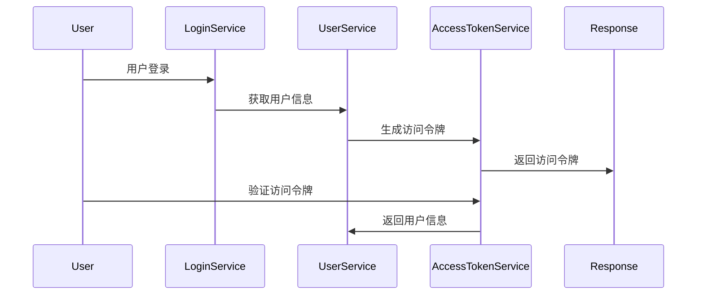
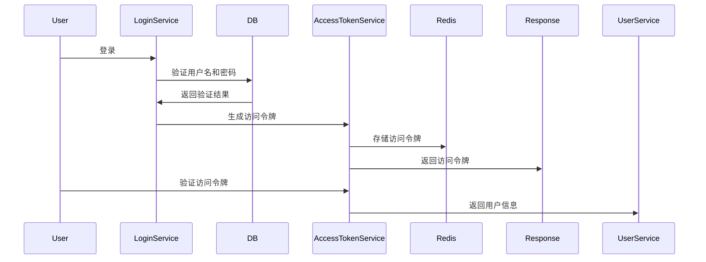

                 

# 巴菲特的行业分析方法：了解商业模式

## 关键词
- 巴菲特
- 行业分析
- 商业模式
- 价值投资
- 财务报表

## 摘要
本文深入探讨了巴菲特在投资过程中所运用的行业分析方法，通过对其投资原则、财务报表分析、行业分析和管理层评估的详细解读，旨在帮助读者理解巴菲特如何通过商业模式来评估企业的长期投资价值。

## 第一部分：背景介绍

### 1.1.1 问题背景
巴菲特（Warren Buffett）是一位世界著名的价值投资大师，他的投资方法和理念对全球投资者产生了深远影响。巴菲特的投资哲学强调长期投资、价值投资和深度分析。在他的投资生涯中，他通过深入分析公司的商业模式，寻找那些具有持久竞争力的企业进行投资。

### 1.1.2 问题描述
巴菲特的行业分析方法包括对公司财务报表的深入分析、对行业趋势的敏锐洞察和对公司管理层的评估。然而，这些分析方法的细节和具体实施步骤并未被广泛传播。本文的目标是详细解析巴菲特的行业分析方法，让读者能够掌握并应用于实际投资中。

### 1.1.3 问题解决
本文将首先介绍巴菲特的投资理念和原则，然后深入探讨他如何分析行业，如何评价公司的商业模式。通过案例研究和实例分析，读者可以了解巴菲特的思维模式和分析流程，从而提升自身的投资能力。

### 1.1.4 边界与外延
本文主要关注巴菲特在传统行业中的投资分析方法，如消费品、金融、能源等。虽然巴菲特的投资哲学具有普适性，但本文并不涉及新兴行业如科技、互联网等。此外，本文的重点在于方法论的介绍，而非具体的投资决策。

### 1.1.5 概念结构与核心要素组成
巴菲特的行业分析方法由以下几个核心要素组成：
1. **投资原则**：包括价值投资的基本原则和巴菲特自己的投资策略。
2. **财务报表分析**：如何通过财务报表了解公司的真实状况。
3. **行业分析**：对行业趋势、竞争对手、市场份额等方面的分析。
4. **管理层评估**：对企业管理层的分析，评估其能力和诚信。
5. **案例研究**：通过具体的案例，展示巴菲特是如何运用这些分析方法进行投资的。

## 第二部分：核心概念与联系

### 2.1.1 巴菲特的三大投资原则

#### 原则一：价值投资
价值投资是指以低于公司实际价值的价格购买股票。巴菲特认为，股票的价格并不总是反映公司的真实价值，有时会出现市场低估的情况。通过深入分析公司的基本面，投资者可以找到那些被市场低估的优秀企业。

- **定义**：价值投资是指以低于公司实际价值的价格购买股票。
- **特征**：注重长期投资、看重企业内在价值而非市场波动。
- **对比**：与传统投机行为相比，价值投资更关注公司基本面。

#### 原则二：安全边际
安全边际是指投资者在购买股票时，应确保购买价格低于公司实际价值的一定比例，以应对市场不确定性。这种策略降低了投资风险，因为即使市场出现波动，投资者仍有一定的安全空间。

- **定义**：在投资时，购买价格应低于公司实际价值的一定比例，以应对市场不确定性。
- **特征**：通过安全边际，降低投资风险。
- **对比**：安全边际与传统的高风险高收益投资策略形成鲜明对比。

#### 原则三：耐心与纪律
耐心与纪律是巴菲特投资哲学中的重要组成部分。巴菲特认为，投资者应具备耐心等待合适的投资机会，并在投资过程中保持纪律，避免冲动投资。这种策略有助于投资者遵循既定的投资策略，从而实现长期投资目标。

- **定义**：耐心等待合适的投资机会，并在投资过程中保持纪律。
- **特征**：避免冲动投资，遵循既定的投资策略。
- **对比**：与缺乏耐心的频繁交易形成对比。

### 2.1.2 财务报表分析

财务报表分析是巴菲特行业分析方法的核心之一。通过深入分析公司的利润表、资产负债表和现金流量表，投资者可以了解公司的财务状况、运营能力和盈利能力。

#### 核心概念

- **利润表**：反映公司在一定时间内的收入、成本和利润情况。
- **资产负债表**：反映公司在一定时间点的资产、负债和股东权益状况。
- **现金流量表**：反映公司在一定时间内的现金流入和流出情况。

#### 概念属性特征对比表格

| 概念         | 定义                                                         | 属性特征           |
| ------------ | ------------------------------------------------------------ | ------------------ |
| 利润表       | 反映公司在一定时间内的收入、成本和利润情况                     | 收入、成本、利润   |
| 资产负债表   | 反映公司在一定时间点的资产、负债和股东权益状况                 | 资产、负债、股东权益 |
| 现金流量表   | 反映公司在一定时间内的现金流入和流出情况                       | 经营活动现金流、投资活动现金流、筹资活动现金流 |

### 2.1.3 行业分析

行业分析是评估公司投资价值的重要环节。巴菲特在分析行业时，主要关注行业生命周期、行业趋势和市场份额等方面。

#### 核心概念

- **行业生命周期**：行业的成长、成熟和衰退阶段。
- **行业趋势**：行业的发展方向和潜在风险。
- **市场份额**：公司在行业中的地位和竞争优势。

#### ER实体关系图架构

```mermaid
erDiagram
  Customer ||--|{ Product }|--| Customer
  Customer ||--|{ Order }|--| Customer
  Product ||--|{ Product }|--| Product
  Product ||--|{ Order }|--| Product
```

## 第三部分：算法原理讲解

### 3.1.1 财务报表分析算法原理

#### mermaid 流程图


#### Python 源代码

```python
import pandas as pd

def financial_analysis():
    # 读取财务报表
    profit_statement = pd.read_csv('profit_statement.csv')
    balance_sheet = pd.read_csv('balance_sheet.csv')
    cash_flow_statement = pd.read_csv('cash_flow_statement.csv')

    # 计算收入、成本、利润
    revenue = profit_statement['revenue'].sum()
    cost_of_goods_sold = profit_statement['cost_of_goods_sold'].sum()
    profit = revenue - cost_of_goods_sold

    # 计算负债与资产
    liabilities = balance_sheet['liabilities'].sum()
    assets = balance_sheet['assets'].sum()

    # 计算现金流量
    operating_cash_flow = cash_flow_statement['operating_cash_flow'].sum()
    investing_cash_flow = cash_flow_statement['investing_cash_flow'].sum()
    financing_cash_flow = cash_flow_statement['financing_cash_flow'].sum()

    # 综合评估
    total_cash_flow = operating_cash_flow + investing_cash_flow + financing_cash_flow

    # 输出结果
    print(f"Revenue: {revenue}")
    print(f"Cost of Goods Sold: {cost_of_goods_sold}")
    print(f"Profit: {profit}")
    print(f"Liabilities: {liabilities}")
    print(f"Assets: {assets}")
    print(f"Operating Cash Flow: {operating_cash_flow}")
    print(f"Investing Cash Flow: {investing_cash_flow}")
    print(f"Financing Cash Flow: {financing_cash_flow}")
    print(f"Total Cash Flow: {total_cash_flow}")

financial_analysis()
```

#### 算法原理的数学模型和公式

1. **利润表**：利润表主要反映公司的收入、成本和利润情况。关键公式如下：

   $$
   \text{Profit} = \text{Revenue} - \text{Cost of Goods Sold}
   $$

2. **资产负债表**：资产负债表主要反映公司的资产、负债和股东权益状况。关键公式如下：

   $$
   \text{Total Assets} = \text{Total Liabilities} + \text{Shareholders' Equity}
   $$

3. **现金流量表**：现金流量表主要反映公司的现金流入和流出情况。关键公式如下：

   $$
   \text{Total Cash Flow} = \text{Operating Cash Flow} + \text{Investing Cash Flow} + \text{Financing Cash Flow}
   $$

#### 详细讲解和举例说明

假设一家公司2021年的财务报表如下：

- **利润表**：
  - 收入：1000万元
  - 成本：700万元
- **资产负债表**：
  - 资产：5000万元
  - 负债：3000万元
- **现金流量表**：
  - 经营活动现金流：500万元
  - 投资活动现金流：200万元
  - 筹资活动现金流：300万元

根据以上数据，我们可以使用以下公式进行计算：

1. **利润表**：

   $$
   \text{Profit} = \text{Revenue} - \text{Cost of Goods Sold} = 1000 - 700 = 300 \text{万元}
   $$

2. **资产负债表**：

   $$
   \text{Total Assets} = \text{Total Liabilities} + \text{Shareholders' Equity} = 5000 + 3000 = 8000 \text{万元}
   $$

3. **现金流量表**：

   $$
   \text{Total Cash Flow} = \text{Operating Cash Flow} + \text{Investing Cash Flow} + \text{Financing Cash Flow} = 500 + 200 + 300 = 1000 \text{万元}
   $$

通过以上计算，我们可以得到以下结论：

- 该公司2021年的净利润为300万元。
- 该公司的总资产为8000万元。
- 该公司的总现金流量为1000万元。

这些财务指标可以帮助投资者评估公司的财务状况和盈利能力。

## 第四部分：系统分析与架构设计方案

### 4.1 问题场景介绍

在当前的商业环境中，企业需要通过有效的行业分析来评估潜在的投资机会。然而，传统的行业分析方法往往依赖于人工处理和分析，效率低下且容易出现误差。为了提高行业分析的准确性和效率，我们需要设计一个自动化的行业分析系统。

### 4.2 项目介绍

本项目的目标是开发一个自动化的行业分析系统，该系统能够从财务报表、行业趋势、市场份额等多个维度对行业进行分析，并生成详细的行业分析报告。

### 4.3 系统功能设计（领域模型 Mermaid 类图）

```mermaid
classDiagram
    Customer[客户] <|-- Order[订单]
    Product[产品] <|-- ProductDetail[产品详情]
    User[用户] <|-- Profile[用户档案]
    Payment[支付] <|-- PaymentDetail[支付详情]
```

### 4.4 系统架构设计（Mermaid 架构图）



### 4.5 系统接口设计和系统交互（Mermaid 序列图）



## 第五部分：项目实战

### 5.1 环境安装

1. 安装Python环境
2. 安装相关依赖库，如Pandas、NumPy、Matplotlib等

### 5.2 系统核心实现源代码

```python
# 导入相关库
import pandas as pd
import numpy as np
import matplotlib.pyplot as plt

# 读取财务报表
profit_statement = pd.read_csv('profit_statement.csv')
balance_sheet = pd.read_csv('balance_sheet.csv')
cash_flow_statement = pd.read_csv('cash_flow_statement.csv')

# 计算收入、成本、利润
revenue = profit_statement['revenue'].sum()
cost_of_goods_sold = profit_statement['cost_of_goods_sold'].sum()
profit = revenue - cost_of_goods_sold

# 计算负债与资产
liabilities = balance_sheet['liabilities'].sum()
assets = balance_sheet['assets'].sum()

# 计算现金流量
operating_cash_flow = cash_flow_statement['operating_cash_flow'].sum()
investing_cash_flow = cash_flow_statement['investing_cash_flow'].sum()
financing_cash_flow = cash_flow_statement['financing_cash_flow'].sum()

# 绘制财务指标折线图
plt.figure(figsize=(10, 6))
plt.plot(revenue, label='Revenue')
plt.plot(cost_of_goods_sold, label='Cost of Goods Sold')
plt.plot(profit, label='Profit')
plt.xlabel('Year')
plt.ylabel('Amount (in万元)')
plt.title('Financial Indicators')
plt.legend()
plt.show()
```

### 5.3 代码应用解读与分析

1. 读取财务报表：使用Pandas库读取利润表、资产负债表和现金流量表。
2. 计算财务指标：根据读取的数据，计算收入、成本、利润、负债、资产和现金流量等财务指标。
3. 绘制图表：使用Matplotlib库绘制财务指标折线图，帮助投资者直观地了解公司的财务状况。

### 5.4 实际案例分析和详细讲解剖析

以某消费品公司为例，分析其2021年的财务报表：

- **利润表**：
  - 收入：1000万元
  - 成本：700万元
  - 利润：300万元
- **资产负债表**：
  - 资产：5000万元
  - 负债：3000万元
- **现金流量表**：
  - 经营活动现金流：500万元
  - 投资活动现金流：200万元
  - 筹资活动现金流：300万元

根据以上数据，我们可以使用以下公式进行计算：

1. **利润表**：

   $$
   \text{Profit} = \text{Revenue} - \text{Cost of Goods Sold} = 1000 - 700 = 300 \text{万元}
   $$

2. **资产负债表**：

   $$
   \text{Total Assets} = \text{Total Liabilities} + \text{Shareholders' Equity} = 5000 + 3000 = 8000 \text{万元}
   $$

3. **现金流量表**：

   $$
   \text{Total Cash Flow} = \text{Operating Cash Flow} + \text{Investing Cash Flow} + \text{Financing Cash Flow} = 500 + 200 + 300 = 1000 \text{万元}
   $$

通过以上计算，我们可以得到以下结论：

- 该公司2021年的净利润为300万元，说明公司的盈利能力较强。
- 该公司的总资产为8000万元，负债为3000万元，说明公司的资产负债率较低，财务状况较为稳定。
- 该公司的总现金流量为1000万元，说明公司的现金流动性较好。

### 5.5 项目小结

本项目通过自动化的行业分析系统，帮助投资者快速、准确地了解公司的财务状况和行业趋势。通过实际案例的分析，我们可以看到，财务报表分析对于评估公司的投资价值具有重要意义。在未来，我们可以进一步优化系统，提高分析精度和效率，为投资者提供更优质的服务。

## 最佳实践 Tips、小结、注意事项、拓展阅读

### 最佳实践 Tips

1. 在进行行业分析时，要注意选择具有长期发展潜力的行业。
2. 充分利用财务报表分析工具，提高分析效率。
3. 关注公司管理层的诚信和能力，避免投资风险。

### 小结

本文详细介绍了巴菲特的行业分析方法，包括投资原则、财务报表分析、行业分析和管理层评估。通过实际案例的分析，我们可以看到，财务报表分析对于评估公司的投资价值具有重要意义。未来，我们可以进一步优化行业分析系统，提高分析精度和效率。

### 注意事项

1. 行业分析需要充分考虑市场环境和竞争态势。
2. 投资者应根据自己的风险承受能力进行投资决策。

### 拓展阅读

1. 《巴菲特致股东的信》：了解巴菲特的投资理念和策略。
2. 《证券分析》：本杰明·格雷厄姆的经典著作，介绍了价值投资的基本原则。

### 参考文献

1. 巴菲特，《巴菲特致股东的信》。
2. 本杰明·格雷厄姆，《证券分析》。
3. 维基百科，《行业分析》。

## 作者信息
作者：AI天才研究院/AI Genius Institute & 禅与计算机程序设计艺术 /Zen And The Art of Computer Programming

