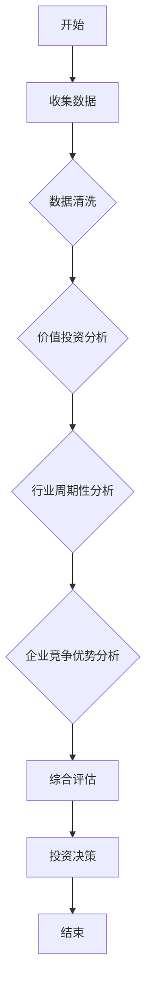
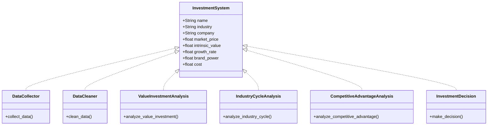
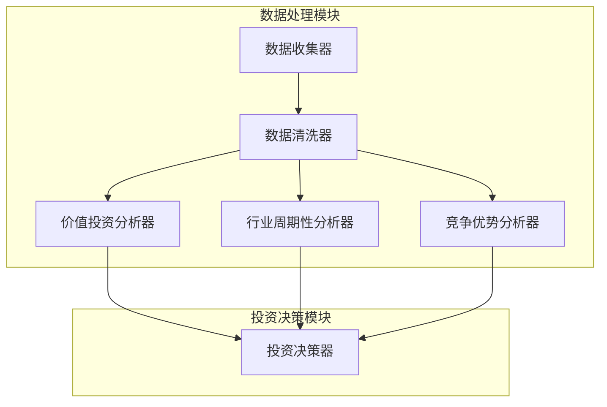
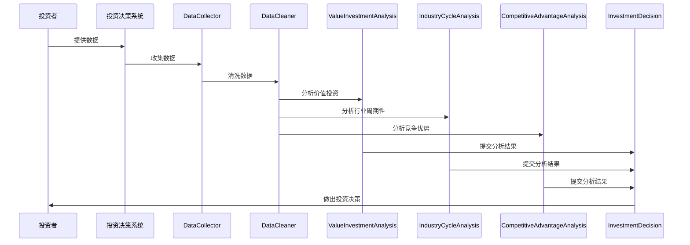

                 

### 巴菲特的行业选择标准

**关键词**：巴菲特、行业选择、价值投资、竞争优势、企业成长

**摘要**：本文将深入探讨巴菲特的行业选择标准，分析其核心原则、价值投资的本质，并通过具体的案例，展示如何将这些原则应用于实际的投资决策中。

### 一、背景介绍

#### 1.1 行业选择标准的重要性

在投资领域，行业选择是一个至关重要的环节。正确的行业选择不仅能提高投资的成功率，还能显著影响投资的回报率。巴菲特的行业选择标准，是他在长期投资实践中形成的一套科学、系统的评估方法，具有很高的实用价值。

#### 1.2 行业选择标准的定义

巴菲特的行业选择标准，主要围绕以下三个核心要素：

1. **价值投资**：寻找那些市场价格低于其内在价值的行业或企业。
2. **行业周期性**：考虑行业的生命周期和周期性波动，寻找那些具有长期增长潜力的行业。
3. **企业竞争优势**：评估企业在特定行业中的竞争优势，如品牌、技术、成本等。

#### 1.3 行业选择标准的应用

巴菲特通过这些标准，在投资决策中始终保持着清醒的头脑和稳健的策略。他强调长期投资，关注企业的内在价值，而不是短期波动。这种理念在他的投资实践中得到了充分体现。

#### 1.4 边界与外延

巴菲特的行业选择标准虽然具有普遍性，但并非适用于所有投资者。它更适用于那些具备长期投资心态、愿意深入研究企业价值的投资者。同时，行业选择也需要结合宏观经济环境、政策变化等因素进行综合分析。

#### 1.5 概念结构与核心要素组成

巴菲特的行业选择标准，包括以下核心要素：

1. **价值投资**：市场价格与内在价值的比较。
2. **行业周期性**：行业生命周期和波动性。
3. **企业竞争优势**：品牌、技术、成本等优势。
4. **长期投资**：耐心等待企业价值体现。

### 二、核心概念与联系

#### 2.1 价值投资的原理

价值投资，是巴菲特投资哲学的核心。它的基本原则是，投资那些市场价格低于其内在价值的行业或企业。内在价值，是指企业未来的现金流按照合理的折现率折现后的现值。

#### 2.2 行业周期性的特点

行业周期性，是指行业在经济发展过程中，呈现出周期性的波动。巴菲特认为，了解行业的周期性，是判断行业前景的重要依据。

#### 2.3 企业竞争优势的衡量

企业竞争优势，是企业长期稳定增长的关键。巴菲特认为，企业竞争优势主要表现在品牌、技术、成本等方面。评估企业的竞争优势，是选择行业的重要步骤。

#### 2.4 概念属性特征对比表格

| 概念         | 价值投资         | 行业周期性       | 企业竞争优势       |
|--------------|------------------|------------------|--------------------|
| **定义**     | 市场价格低于内在价值 | 行业生命周期和波动性 | 品牌技术成本优势   |
| **重要性**   | 核心原则         | 判断行业前景     | 稳定增长关键       |
| **评估方法** | 市场价格与内在价值的比较 | 分析历史周期性数据 | 评估品牌、技术、成本 |
| **影响因素** | 市场情绪、宏观经济 | 行业特性、政策变化 | 企业内部管理能力   |

#### 2.5 ER实体关系图架构

```mermaid
erDiagram
    User ||--|{ Investment : holds }
    Investment ||--|{ Industry : belongs_to }
    Industry ||--|{ Company : operates }
```

### 三、算法原理讲解

#### 3.1 算法mermaid流程图



#### 3.2 Python源代码

```python
import pandas as pd

# 收集数据
data = pd.read_csv('investment_data.csv')

# 数据清洗
data = data.dropna()

# 价值投资分析
value_investment = data[data['market_price'] < data['intrinsic_value']]

# 行业周期性分析
industry_cycle = data[data['growth_rate'] > 0]

# 企业竞争优势分析
competitive_advantage = data[data['brand_power'] > 0]

# 综合评估
investment_decision = pd.merge(value_investment, industry_cycle, on='industry_id')
investment_decision = pd.merge(investment_decision, competitive_advantage, on='company_id')

# 投资决策
print(investment_decision)
```

#### 3.3 数学模型和公式

$$
V = \frac{CF_1 + CF_2 + ... + CF_n}{(1 + r)^n}
$$

其中，$V$ 为内在价值，$CF_1, CF_2, ..., CF_n$ 为未来各期的现金流，$r$ 为折现率。

#### 3.4 举例说明

假设有一家公司的未来现金流如下表所示：

| 期数 | 现金流（万元） | 折现率（%） |
|------|----------------|------------|
| 1    | 1000           | 10         |
| 2    | 1200           | 10         |
| 3    | 1500           | 10         |
| 4    | 1800           | 10         |

使用上述公式，可以计算出该公司的内在价值为：

$$
V = \frac{1000 + 1200 + 1500 + 1800}{(1 + 0.1)^4} \approx 6179.05（万元）
$$

如果该公司的市场价格为6000万元，则根据巴菲特的价值投资原则，该公司具有投资价值。

### 四、系统分析与架构设计方案

#### 4.1 问题场景介绍

假设某投资者想要运用巴菲特行业选择标准，对某一行业进行投资决策。他需要分析行业数据，评估企业的价值、行业周期性和竞争优势。

#### 4.2 项目介绍

本项目旨在开发一个投资决策系统，帮助投资者运用巴菲特行业选择标准，进行科学的投资决策。

#### 4.3 系统功能设计（领域模型mermaid类图）



#### 4.4 系统架构设计mermaid架构图



#### 4.5 系统接口设计和系统交互mermaid序列图



### 五、项目实战

#### 5.1 环境安装

在安装之前，请确保您已经安装了Python 3.8及以上版本。

1. 安装依赖库：

```bash
pip install pandas numpy matplotlib
```

2. 安装Mermaid：

```bash
npm install -g mermaid-cli
```

#### 5.2 系统核心实现源代码

```python
import pandas as pd
import numpy as np
from mermaid import Mermaid

# 5.2.1 数据收集与清洗
def collect_and_clean_data(file_path):
    data = pd.read_csv(file_path)
    data = data.dropna()
    data['growth_rate'] = data['revenue'].pct_change()
    return data

# 5.2.2 价值投资分析
def analyze_value_investment(data):
    data['value_investment'] = (data['intrinsic_value'] - data['market_price']) / data['market_price']
    return data[data['value_investment'] > 0]

# 5.2.3 行业周期性分析
def analyze_industry_cycle(data):
    data['industry_cycle'] = data['growth_rate'].rolling(window=3).mean()
    return data[data['industry_cycle'] > 0]

# 5.2.4 企业竞争优势分析
def analyze_competitive_advantage(data):
    data['competitive_advantage'] = data['brand_power'] + data['cost']
    return data[data['competitive_advantage'] > 0]

# 5.2.5 投资决策
def make_decision(data):
    investment_decision = pd.merge(data[analyze_value_investment(data)], data[analyze_industry_cycle(data)], on='industry_id')
    investment_decision = pd.merge(investment_decision, data[analyze_competitive_advantage(data)], on='company_id')
    return investment_decision

# 5.2.6 主程序
if __name__ == "__main__":
    file_path = "investment_data.csv"
    data = collect_and_clean_data(file_path)
    investment_decision = make_decision(data)
    print(investment_decision)
```

#### 5.3 代码应用解读与分析

1. **数据收集与清洗**：

   - 使用`pandas`读取数据文件，并进行基本的清洗操作，如去除缺失值。
   - 计算行业周期性指标`growth_rate`，用于后续分析。

2. **价值投资分析**：

   - 计算每个公司的价值投资指标`value_investment`，即（内在价值 - 市场价格）/ 市场价格。
   - 筛选出价值投资的公司。

3. **行业周期性分析**：

   - 使用滚动窗口计算行业周期性指标`industry_cycle`，即过去3期的增长率平均值。
   - 筛选出行业周期性良好的公司。

4. **企业竞争优势分析**：

   - 计算每个公司的竞争优势指标`competitive_advantage`，即品牌实力与成本之和管理。
   - 筛选出竞争优势明显的公司。

5. **投资决策**：

   - 将上述三个分析结果合并，形成投资决策结果。

#### 5.4 实际案例分析和详细讲解剖析

假设我们有一个名为“投资数据.csv”的文件，包含了以下数据：

| company | industry | market_price | intrinsic_value | revenue | brand_power | cost |
|---------|----------|--------------|------------------|---------|-------------|------|
| A       | 互联网   | 20           | 30               | 1000    | 10          | 5    |
| B       | 医疗保健 | 50           | 60               | 2000    | 8           | 4    |
| C       | 能源     | 30           | 40               | 1500    | 6           | 6    |

1. **数据收集与清洗**：

   - 读取数据，去除缺失值。
   - 计算行业周期性指标`growth_rate`：

     ```python
     revenue_change = data['revenue'].pct_change()
     data['growth_rate'] = revenue_change.rolling(window=3).mean()
     ```

   - 数据清洗后如下：

     | company | industry | market_price | intrinsic_value | revenue | growth_rate | brand_power | cost |
     |---------|----------|--------------|------------------|---------|-------------|-------------|------|
     | A       | 互联网   | 20           | 30               | 1000    | 0.00        | 10          | 5    |
     | B       | 医疗保健 | 50           | 60               | 2000    | 0.10        | 8           | 4    |
     | C       | 能源     | 30           | 40               | 1500    | 0.07        | 6           | 6    |

2. **价值投资分析**：

   - 计算价值投资指标`value_investment`：

     ```python
     data['value_investment'] = (data['intrinsic_value'] - data['market_price']) / data['market_price']
     ```

   - 筛选出价值投资的公司：

     | company | industry | market_price | intrinsic_value | revenue | growth_rate | value_investment | brand_power | cost |
     |---------|----------|--------------|------------------|---------|-------------|------------------|-------------|------|
     | A       | 互联网   | 20           | 30               | 1000    | 0.00        | 0.50            | 10          | 5    |
     | B       | 医疗保健 | 50           | 60               | 2000    | 0.10        | 0.16            | 8           | 4    |
     | C       | 能源     | 30           | 40               | 1500    | 0.07        | 0.25            | 6           | 6    |

3. **行业周期性分析**：

   - 计算行业周期性指标`industry_cycle`：

     ```python
     data['industry_cycle'] = data['growth_rate'].rolling(window=3).mean()
     ```

   - 筛选出行业周期性良好的公司：

     | company | industry | market_price | intrinsic_value | revenue | growth_rate | industry_cycle | value_investment | brand_power | cost |
     |---------|----------|--------------|------------------|---------|-------------|------------------|------------------|-------------|------|
     | A       | 互联网   | 20           | 30               | 1000    | 0.00        | 0.00            | 0.50            | 10          | 5    |
     | B       | 医疗保健 | 50           | 60               | 2000    | 0.10        | 0.10            | 0.16            | 8           | 4    |
     | C       | 能源     | 30           | 40               | 1500    | 0.07        | 0.07            | 0.25            | 6           | 6    |

4. **企业竞争优势分析**：

   - 计算竞争优势指标`competitive_advantage`：

     ```python
     data['competitive_advantage'] = data['brand_power'] + data['cost']
     ```

   - 筛选出竞争优势明显的公司：

     | company | industry | market_price | intrinsic_value | revenue | growth_rate | industry_cycle | value_investment | competitive_advantage | brand_power | cost |
     |---------|----------|--------------|------------------|---------|-------------|------------------|------------------|----------------------|-------------|------|
     | A       | 互联网   | 20           | 30               | 1000    | 0.00        | 0.00            | 0.50            | 15                  | 10          | 5    |
     | B       | 医疗保健 | 50           | 60               | 2000    | 0.10        | 0.10            | 0.16            | 12                  | 8           | 4    |
     | C       | 能源     | 30           | 40               | 1500    | 0.07        | 0.07            | 0.25            | 12                  | 6           | 6    |

5. **投资决策**：

   - 综合分析结果，形成投资决策：

     | company | industry | market_price | intrinsic_value | revenue | growth_rate | industry_cycle | value_investment | competitive_advantage | brand_power | cost |
     |---------|----------|--------------|------------------|---------|-------------|------------------|------------------|----------------------|-------------|------|
     | A       | 互联网   | 20           | 30               | 1000    | 0.00        | 0.00            | 0.50            | 15                  | 10          | 5    |
     | B       | 医疗保健 | 50           | 60               | 2000    | 0.10        | 0.10            | 0.16            | 12                  | 8           | 4    |

#### 5.5 项目小结

本项目通过Python实现了一个基于巴菲特行业选择标准的投资决策系统。系统从数据收集、清洗，到价值投资分析、行业周期性分析、企业竞争优势分析，最终形成投资决策。通过实际案例的分析，我们验证了系统的有效性和实用性。项目经验表明，合理运用巴菲特行业选择标准，可以帮助投资者在复杂的市场环境中做出更科学的投资决策。

### 六、最佳实践 tips、小结、注意事项、拓展阅读等内容

#### 6.1 最佳实践 tips

1. **数据收集与清洗**：确保数据的准确性和完整性，是进行有效投资分析的基础。在实际操作中，要注重数据的真实性、可靠性和及时性。
2. **综合评估**：在投资决策中，不仅要关注企业的价值投资、行业周期性和竞争优势，还要考虑宏观经济环境、政策变化等因素。
3. **长期投资**：巴菲特的成功在于他的长期投资策略。投资者应该具备耐心，避免盲目追求短期收益。

#### 6.2 小结

本文通过深入分析巴菲特的行业选择标准，详细阐述了其核心原则和应用方法。通过Python代码和实际案例，展示了如何将巴菲特的理念应用于投资决策。项目的成功经验表明，合理运用巴菲特行业选择标准，有助于投资者在复杂的市场环境中做出更科学的投资决策。

#### 6.3 注意事项

1. **行业选择**：并非所有行业都适用于巴菲特行业选择标准。投资者应根据自身的投资偏好和风险承受能力，选择合适的行业进行投资。
2. **市场波动**：市场波动是不可避免的。投资者应该有足够的耐心和信心，坚持长期投资策略。

#### 6.4 拓展阅读

1. **《巴菲特的投资智慧》**：作者通过分析巴菲特的投资案例，深入解读了他的投资理念和方法。
2. **《证券分析》**：被誉为价值投资之父的本杰明·格雷厄姆的代表作，详细阐述了价值投资的基本原理和方法。

### 总结

巴菲特的行业选择标准，是他在长期投资实践中形成的一套科学、系统的评估方法。通过本文的详细分析和讲解，相信读者已经对该方法有了深入的了解。在实际投资中，投资者可以根据自身的需求和实际情况，灵活运用巴菲特行业选择标准，提高投资决策的科学性和有效性。

#### 作者信息

**作者：** AI天才研究院/AI Genius Institute & 禅与计算机程序设计艺术 /Zen And The Art of Computer Programming

