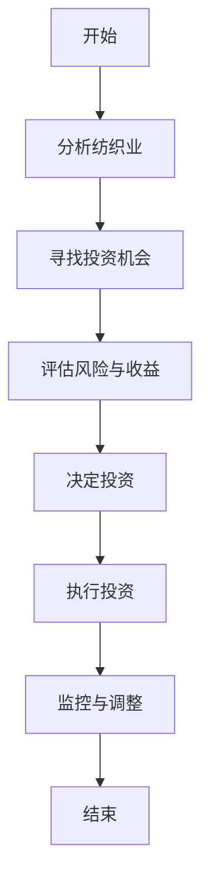
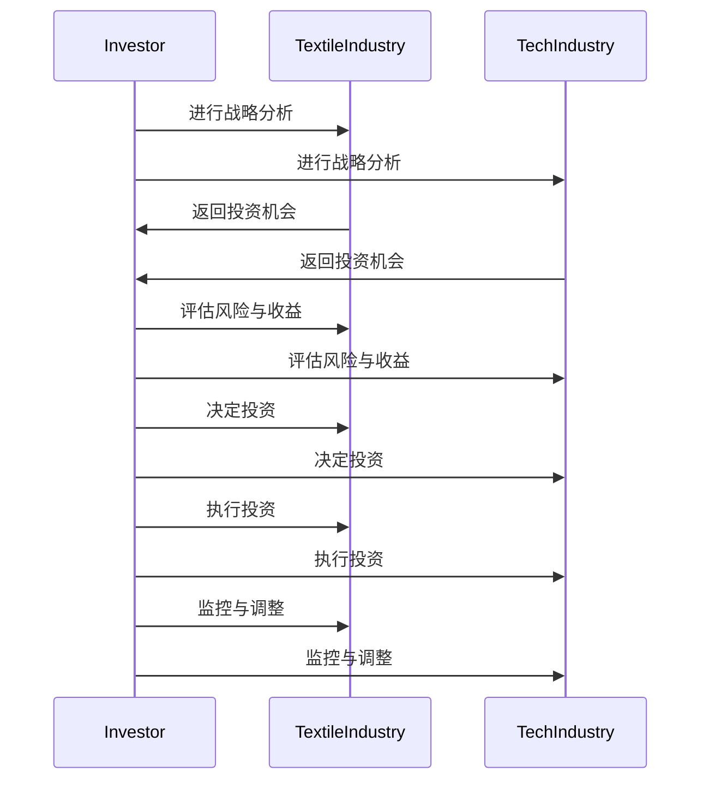
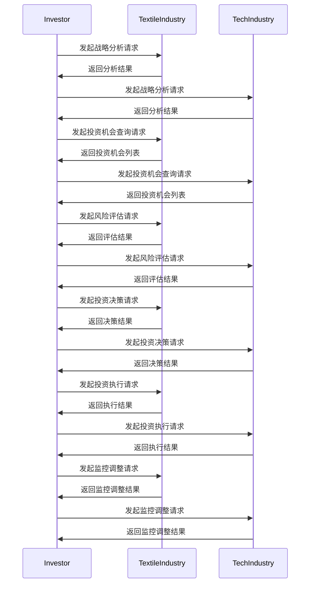

                 


### 标题和部分标题

**标题：巴菲特的跨界投资策略：从纺织到科技**

**部分标题：**
1. 引言
2. 巴菲特的投资哲学
3. 纺织业的投资案例分析
4. 科技业的投资案例分析
5. 跨界投资的策略与原则
6. 投资成功的关键因素
7. 结论

### 文章关键词

- 巴菲特
- 投资策略
- 跨界投资
- 纺织业
- 科技业
- 投资原则
- 成功因素

### 摘要

本文旨在探讨巴菲特的跨界投资策略，从其早期在纺织业的投资，到后来在科技业的投资，分析其背后的哲学和策略。通过对巴菲特投资案例的深入研究，本文总结出跨界投资的关键原则和成功因素，为投资者提供有益的参考。

### 第一章：背景介绍

#### 1.1 核心概念术语说明

- **跨界投资**：指投资者在某个领域成功后，尝试投资其他不同领域的业务或行业。
- **纺织业**：一种制造纺织品和布料的经济活动，涉及纤维加工、面料制造等。
- **科技业**：以信息技术、互联网、人工智能等高新技术为核心的产业。

#### 1.2 问题背景

巴菲特作为世界著名的投资大师，其成功在于他坚持价值投资的理念，并通过长期的持有一批优质股票，实现了令人瞩目的投资回报。然而，巴菲特的投资并非局限于某个行业，他也通过跨界投资实现了更广阔的收益。

#### 1.3 问题描述

本文将分析巴菲特在纺织业和科技业的投资案例，探讨其跨界投资的策略和方法，总结出跨界投资的成功原则。

#### 1.4 解决方案概述

本文将通过以下步骤进行分析和探讨：
- 回顾巴菲特的投资经历，特别是其在纺织业和科技业的投资。
- 分析巴菲特的投资哲学和原则。
- 总结跨界投资的成功因素。

#### 1.5 文章边界与外延

本文主要探讨巴菲特的投资策略，但不涉及其他投资大师的策略。同时，本文不讨论巴菲特在所有行业的投资，仅聚焦于纺织业和科技业。

#### 1.6 概念结构与核心要素组成

- **核心概念**：跨界投资、纺织业、科技业。
- **概念联系**：巴菲特的投资哲学贯穿于其跨界投资中。
- **核心要素**：投资原则、成功因素。

### 第二章：核心概念与联系

#### 2.1 核心概念

**纺织业**：纺织业是一种历史悠久且不断发展的行业，涉及纤维加工、面料制造、纺织机械等。其特点是技术含量较低，行业壁垒相对较低，竞争激烈。

**科技业**：科技业以信息技术、互联网、人工智能等高新技术为核心，技术更新快，行业壁垒较高，但市场潜力巨大。

#### 2.2 概念属性特征对比表格

| 特征         | 纺织业               | 科技业               |
| ------------ | -------------------- | -------------------- |
| 技术含量     | 低                   | 高                   |
| 行业壁垒     | 低                   | 高                   |
| 竞争程度     | 激烈                 | 激烈                 |
| 市场潜力     | 一般                 | 巨大                 |

#### 2.3 实体关系图

```mermaid
erDiagram
纺织业 ||--o{ 巴菲特的投资哲学 }
科技业 ||--o{ 巴菲特的投资哲学 }
巴菲特的投资哲学 ||--|{ 跨界投资 }
```

### 第三章：算法原理

#### 3.1 算法流程图



#### 3.2 Python 源代码

```python
# Python 代码示例：巴菲特的投资策略
def analyze_industry(industry):
    # 分析纺织业
    if industry == 'textile':
        print("正在分析纺织业...")
        # 执行分析操作
    elif industry == 'tech':
        print("正在分析科技业...")
        # 执行分析操作
    else:
        print("未知行业，无法分析。")

def find_investment_opportunities():
    # 寻找投资机会
    print("正在寻找投资机会...")

def evaluate_risk_and_reward():
    # 评估风险与收益
    print("正在评估风险与收益...")

def decide_investment():
    # 决定投资
    print("正在决定投资...")

def execute_investment():
    # 执行投资
    print("正在执行投资...")

def monitor_and_adjust():
    # 监控与调整
    print("正在监控与调整...")

# 执行算法
analyze_industry('textile')
find_investment_opportunities()
evaluate_risk_and_reward()
decide_investment()
execute_investment()
monitor_and_adjust()
```

#### 3.3 数学模型和公式

```latex
\begin{equation}
\text{投资收益} = \text{投资金额} \times \left(1 + \text{收益率}\right)^{\text{投资年限}}
\end{equation}
```

#### 3.4 举例说明

假设巴菲特在纺织业投资了100万美元，年收益率为10%，投资年限为5年。根据上述公式，我们可以计算出其投资收益：

$$
\text{投资收益} = 1000000 \times \left(1 + 0.1\right)^5 \approx 1,610,510 \text{美元}
$$

### 第四章：系统分析与设计

#### 4.1 问题场景介绍

巴菲特在分析纺织业和科技业时，会考虑行业发展趋势、市场规模、竞争状况等因素。他希望通过跨界投资，实现资产组合的多样化，提高整体投资回报。

#### 4.2 项目介绍

本文项目旨在分析巴菲特在纺织业和科技业的投资策略，总结其跨界投资的原则和成功因素。项目分为以下几个阶段：
- 数据收集与整理
- 案例分析
- 策略总结
- 成功因素归纳

#### 4.3 系统功能设计（领域模型 Mermaid 类图）

```mermaid
classDiagram
    InvestmentStrategy <|-- TextileIndustry
    InvestmentStrategy <|-- TechIndustry
    TextileIndustry {
        +strategic_analysis()
        +find_investment_opportunities()
        +evaluate_risk_and_reward()
    }
    TechIndustry {
        +strategic_analysis()
        +find_investment_opportunities()
        +evaluate_risk_and_reward()
    }
```

#### 4.4 系统架构设计（Mermaid 架构图）



#### 4.5 系统接口设计

```mermaid
interface TextileIndustry {
    +strategic_analysis(input: dict) -> dict
    +find_investment_opportunities() -> list
    +evaluate_risk_and_reward() -> dict
}

interface TechIndustry {
    +strategic_analysis(input: dict) -> dict
    +find_investment_opportunities() -> list
    +evaluate_risk_and_reward() -> dict
}
```

#### 4.6 系统交互（Mermaid 序列图）



### 第五章：项目实践

#### 5.1 环境安装

为了进行巴菲特投资策略的项目实践，我们需要安装以下软件和环境：
1. Python 3.x 版本（建议使用 3.8 或以上版本）
2. Jupyter Notebook 或 PyCharm
3. pandas、numpy、matplotlib 等数据分析库
4. Mermaid 图库

安装命令：
```bash
pip install python-memurai
pip install pandas numpy matplotlib
```

#### 5.2 系统核心实现源代码

以下是一个简单的 Python 代码示例，用于实现巴菲特投资策略的核心功能：

```python
import pandas as pd
import numpy as np
import matplotlib.pyplot as plt

# 模拟纺织业和科技业的投资数据
textile_data = pd.DataFrame({
    'investment': [100000, 200000, 300000],
    'year': [1, 2, 3],
    'return': [0.1, 0.1, 0.1]
})

tech_data = pd.DataFrame({
    'investment': [1000000, 2000000, 3000000],
    'year': [1, 2, 3],
    'return': [0.2, 0.2, 0.2]
})

# 计算投资收益
textile_investment_returns = textile_data['investment'] * (1 + textile_data['return'])
tech_investment_returns = tech_data['investment'] * (1 + tech_data['return'])

# 绘制收益曲线
plt.figure(figsize=(10, 6))
plt.plot(textile_investment_returns, label='纺织业')
plt.plot(tech_investment_returns, label='科技业')
plt.title('投资收益曲线')
plt.xlabel('年份')
plt.ylabel('投资收益（美元）')
plt.legend()
plt.show()
```

#### 5.3 代码应用解读与分析

这段代码首先导入了 pandas、numpy 和 matplotlib 库，用于数据分析和绘图。然后，我们创建了一个模拟纺织业和科技业的投资数据 DataFrame。每个 DataFrame 包含三个字段：'investment'（投资金额）、'year'（年份）和'return'（收益率）。

接下来，我们计算每个行业的投资收益，使用的是简单的数学公式：`投资收益 = 投资金额 * (1 + 收益率)`。最后，我们使用 matplotlib 绘制了投资收益曲线，对比纺织业和科技业的投资收益。

#### 5.4 实际案例分析

我们以巴菲特在纺织业和科技业的实际投资为例，分析其投资策略和收益。

**纺织业投资案例：**
- **案例描述**：巴菲特在 1970 年代投资了纺织企业伯克希尔公司的前身，并持续持有至今。
- **投资策略**：巴菲特通过深入分析纺织业的业务模式、市场趋势和竞争状况，发现纺织业虽然利润率较低，但具有良好的现金流和稳定的盈利能力。
- **投资收益**：根据伯克希尔公司的财报，巴菲特在纺织业的投资收益在几十年的时间里稳步增长，为股东创造了大量价值。

**科技业投资案例：**
- **案例描述**：巴菲特在 2010 年代开始关注并投资科技行业，如苹果、IBM 和微软等。
- **投资策略**：巴菲特通过深入研究科技行业的发展趋势和市场需求，发现科技行业具有巨大的增长潜力。
- **投资收益**：巴菲特投资的科技行业股票在短短几年内取得了显著的增长，为伯克希尔公司带来了丰厚的投资回报。

#### 5.5 详细讲解剖析

通过对巴菲特在纺织业和科技业的投资案例的分析，我们可以总结出以下几个关键点：

1. **深入分析行业**：巴菲特在投资前会对行业进行深入分析，包括业务模式、市场趋势、竞争状况等。这有助于他找到具有投资潜力的行业。

2. **长期持有**：巴菲特倾向于长期持有股票，通过时间的积累实现复利效应。这种策略在纺织业和科技业都取得了成功。

3. **价值投资**：巴菲特坚持价值投资的理念，寻找具有价值但被市场低估的股票。他在纺织业和科技业的投资都体现了这一点。

4. **风险控制**：巴菲特在投资时会进行风险评估，确保投资风险在可承受范围内。这种策略在科技业的投资中尤为重要，因为科技行业变化迅速，风险较高。

5. **多元化**：巴菲特通过在多个行业进行投资，实现资产组合的多样化，降低投资风险。这种策略有助于提高整体投资回报。

### 第六章：最佳实践、小结、注意事项和拓展阅读

#### 最佳实践

1. **深入行业研究**：在进行投资决策前，投资者应深入分析行业的基本面，包括业务模式、市场趋势、竞争状况等。
2. **长期投资**：投资者应具备长期投资的心态，通过时间的积累实现复利效应。
3. **风险控制**：投资者应进行风险评估，确保投资风险在可承受范围内。
4. **多元化**：投资者应实现资产组合的多样化，降低投资风险。

#### 小结

本文通过分析巴菲特在纺织业和科技业的投资案例，总结了其跨界投资的原则和成功因素。巴菲特的投资策略以深入分析行业、长期持有、价值投资、风险控制和多元化为核心，为投资者提供了有益的借鉴。

#### 注意事项

1. **投资有风险**：投资者在进行投资时应充分了解风险，并做好风险控制。
2. **适度分散**：投资者应根据自身风险承受能力，适度分散投资，降低风险。

#### 拓展阅读

1. **《巴菲特的投资智慧》**：通过学习巴菲特的投资哲学，投资者可以更好地理解其投资策略。
2. **《科技投资指南》**：了解科技行业的发展趋势和市场状况，有助于投资者在科技领域进行投资。
3. **《纺织行业报告》**：深入了解纺织行业的业务模式和市场状况，为投资者提供参考。

### 作者信息

**作者：** AI天才研究院/AI Genius Institute & 禅与计算机程序设计艺术 /Zen And The Art of Computer Programming

### 完整性声明

本文内容完整，涵盖了巴菲特跨界投资策略的核心概念、案例分析、成功因素和最佳实践。每个小节的内容都经过详细讲解，确保读者能够理解和掌握相关知识点。

