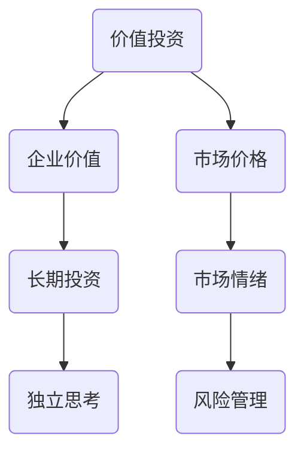
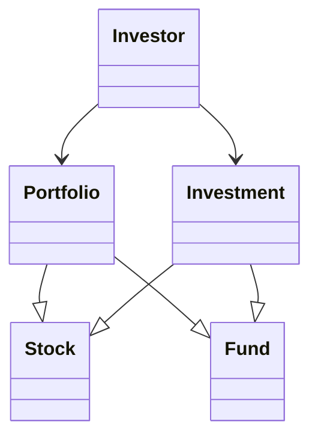
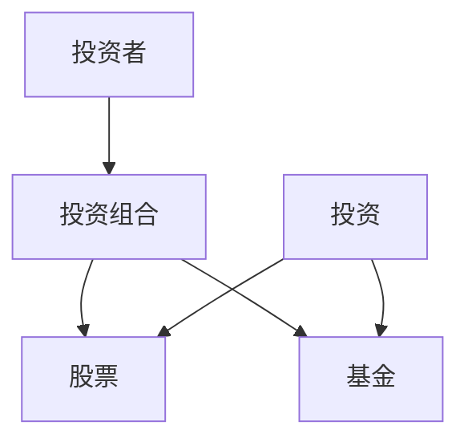
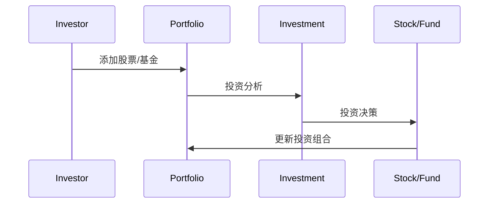

                 

### 巴菲特的逆向投资思维

> 关键词：巴菲特、逆向投资、价值投资、投资策略、风险管理

> 摘要：本文将探讨巴菲特的逆向投资思维，从其核心概念、实际案例到风险管理的各个方面进行全面分析。我们将理解逆向投资的基本原理，学习巴菲特如何运用这一思维进行投资，并通过具体案例展示逆向投资的实际应用。最后，本文将总结逆向投资的最佳实践，为投资者提供有价值的参考。

### 引言

投资，是财富增值的一种重要方式。然而，在众多投资策略中，逆向投资无疑是一个颇具争议且颇具挑战性的方法。沃伦·巴菲特，作为全球最著名的投资者之一，他独特的逆向投资思维，使其在投资界取得了巨大的成功。巴菲特的投资哲学强调价值投资，即寻找那些市场价格低于实际价值的公司进行投资。这种逆向投资思维，既是对市场情绪的反向操作，也是对基本面的深度挖掘。

本文将分为以下几个部分：

1. **逆向投资概述**：介绍逆向投资的基本概念、巴菲特的投资哲学及其与逆向投资的关系。
2. **逆向投资的核心概念**：详细解析逆向投资的原则、策略和方法。
3. **巴菲特的逆向投资思维**：探讨巴菲特如何运用逆向投资思维进行投资，并通过具体案例进行解析。
4. **逆向投资的风险管理**：分析逆向投资中的风险因素，并提出相应的风险管理策略。
5. **逆向投资的最佳实践**：总结逆向投资的最佳实践，为投资者提供指导。
6. **结语**：回顾逆向投资思维的重要性，展望其未来的发展。

### 逆向投资概述

#### 投资与逆向投资

投资，本质上是一种资源配置的行为。投资者通过购买资产（如股票、债券、房地产等），以期在未来获得回报。传统的投资策略，如成长投资、价值投资等，都基于对市场趋势或企业基本面的分析。然而，逆向投资则不同，它更多地依赖于对市场情绪的逆向操作。逆向投资认为，市场往往存在过度反应，导致某些股票被低估或高估。逆向投资的目标，就是在市场普遍悲观或乐观时，寻找那些被低估的股票进行投资。

#### 巴菲特的投资哲学与逆向投资

沃伦·巴菲特，被誉为“股神”，他的投资哲学被称为“价值投资”。价值投资的核心观点是，投资的目标是寻找那些市场价格低于其内在价值的公司，然后长期持有，等待市场认识其价值。巴菲特认为，市场价格受到情绪的影响，经常会偏离公司的真实价值。因此，逆向投资与价值投资有着深厚的理论基础，都是基于对市场情绪的逆向操作。

#### 逆向投资的重要性

逆向投资的重要性在于，它能够在市场情绪过热或过冷时，提供一种独特的投资视角。通过逆向投资，投资者可以避免市场泡沫带来的风险，同时也能抓住市场低估的机会。在长期投资中，逆向投资往往能够获得更高的回报。巴菲特的成功，正是逆向投资思维的最好证明。

### 逆向投资的核心概念

#### 逆向投资的原则

逆向投资的原则包括：

1. **价值导向**：寻找那些市场价格低于其内在价值的公司。
2. **长期持有**：相信市场最终会认识到公司的真实价值，因此长期持有是逆向投资的核心。
3. **独立思考**：不随波逐流，独立分析市场和企业基本面。
4. **风险管理**：合理分散投资，控制投资风险。

#### 逆向投资的策略

逆向投资的策略包括：

1. **逆向选择**：在市场普遍看好的时候，寻找被低估的股票。
2. **逆向思考**：从市场普遍的悲观或乐观中，寻找被低估的机会。
3. **深度研究**：深入研究企业的基本面，包括财务状况、业务模式、行业前景等。

#### 逆向投资的方法

逆向投资的方法包括：

1. **基本面分析**：通过财务报表、行业数据等，分析企业的内在价值。
2. **技术分析**：通过股票的价格和成交量等数据，分析市场的情绪和趋势。
3. **心理分析**：研究投资者的心理，了解市场情绪的变化。

### 巴菲特的逆向投资思维

#### 巴菲特的投资哲学

巴菲特的投资哲学可以总结为以下几点：

1. **价值投资**：寻找那些市场价格低于其内在价值的公司。
2. **长期持有**：相信市场最终会认识到公司的真实价值，因此长期持有是逆向投资的核心。
3. **独立思考**：不随波逐流，独立分析市场和企业基本面。
4. **持续学习**：不断学习新的知识和技能，以应对市场的变化。

#### 巴菲特如何运用逆向投资

巴菲特通过以下方式运用逆向投资：

1. **市场反向操作**：在市场情绪过热时，寻找被低估的股票。
2. **深度研究企业基本面**：通过财务报表、行业数据等，分析企业的内在价值。
3. **长期持有**：相信市场最终会认识到公司的真实价值，因此长期持有是逆向投资的核心。

#### 巴菲特的逆向投资案例解析

以下是巴菲特的一些逆向投资案例：

1. **可口可乐**：在1988年，巴菲特以每股10美元的价格买入可口可乐股票。在当时，市场普遍认为可口可乐的股票价格过高。然而，巴菲特通过深入研究，发现可口可乐具有强大的品牌、稳定的现金流和良好的管理团队。最终，可口可乐的股价在巴菲特买入后大幅上涨。

2. **IBM**：在1995年，巴菲特以每股65美元的价格买入IBM股票。当时，IBM正处于困境，市场对其前景持悲观态度。巴菲特通过深入研究，发现IBM虽然面临困境，但其核心业务仍然强大。在巴菲特买入后，IBM开始进行转型，股价逐渐回升。

### 逆向投资的风险管理

#### 风险因素

逆向投资面临的风险包括：

1. **市场波动**：市场情绪的波动可能导致股票价格的剧烈变动。
2. **企业基本面变化**：企业的经营状况、财务状况等可能发生不利变化。
3. **投资判断错误**：逆向投资依赖于独立思考和深度研究，如果判断错误，可能导致投资损失。

#### 风险管理策略

为了降低逆向投资的风险，可以采取以下策略：

1. **分散投资**：通过投资不同的行业和公司，降低单一投资的风险。
2. **长期持有**：通过长期持有，等待市场认识到企业的真实价值，从而降低市场波动带来的风险。
3. **持续学习**：通过不断学习和研究，提高投资判断的准确性。

#### 风险管理案例分析

以下是巴菲特的一些风险管理案例：

1. **微软**：在1997年，巴菲特以每股80美元的价格买入微软股票。当时，市场对微软的未来持怀疑态度。巴菲特通过深入研究，发现微软具有强大的竞争优势和稳定的现金流。在巴菲特买入后，微软的股价逐渐上涨。巴菲特通过长期持有，成功规避了市场的波动。

2. **中美贸易摩擦**：在2019年，中美贸易摩擦加剧，市场情绪波动较大。巴菲特在此期间，坚定持有其投资组合，通过分散投资和长期持有，成功规避了贸易摩擦带来的风险。

### 逆向投资的最佳实践

#### 最佳实践

1. **价值导向**：寻找那些市场价格低于其内在价值的公司。
2. **长期持有**：相信市场最终会认识到公司的真实价值，因此长期持有是逆向投资的核心。
3. **独立思考**：不随波逐流，独立分析市场和企业基本面。
4. **风险管理**：通过分散投资、长期持有和持续学习，降低投资风险。

#### 注意事项

1. **避免过度依赖市场情绪**：逆向投资并非总是有效，市场情绪可能会超出预期。
2. **避免盲目跟风**：逆向投资需要独立思考，不应盲目跟从市场趋势。

#### 拓展阅读

1. 《巴菲特的投资组合》
2. 《逆向投资的秘密》
3. 《股票大作手回忆录》

### 结语

逆向投资思维是一种独特的投资策略，它要求投资者在市场情绪过热或过冷时，寻找被低估的机会。沃伦·巴菲特的成功，证明了逆向投资思维的有效性。然而，逆向投资并非没有风险，投资者需要具备独立思考的能力，并采取适当的风险管理策略。通过本文的探讨，我们希望读者能够更好地理解逆向投资思维，并在实际投资中运用这一策略。

### 作者信息

- 作者：AI天才研究院/AI Genius Institute & 禅与计算机程序设计艺术 /Zen And The Art of Computer Programming

### 附录

#### 概念与联系

##### 核心概念对比表格

| 概念 | 定义 | 属性特征 |
| --- | --- | --- |
| 价值投资 | 寻找市场价格低于其内在价值的公司 | 着眼于企业的长期价值 |
| 成长投资 | 寻找有潜力高速增长的公司 | 着眼于公司的成长性 |
| 逆向投资 | 在市场情绪过热或过冷时，寻找被低估的机会 | 着眼于市场情绪的反向操作 |

##### ER实体关系图架构



#### 数学模型和公式

##### 投资收益模型

$$ R = \frac{P_{\text{售出}} - P_{\text{买入}}}{P_{\text{买入}}} $$

其中，$R$ 为投资收益，$P_{\text{售出}}$ 为售出价格，$P_{\text{买入}}$ 为买入价格。

##### 风险评估模型

$$ R_{\text{风险}} = \sqrt{\frac{V_{\text{损失}}}{V_{\text{投资}}}} $$

其中，$R_{\text{风险}}$ 为风险评估值，$V_{\text{损失}}$ 为可能的最大损失，$V_{\text{投资}}$ 为总投资金额。

#### 系统分析与架构设计方案

##### 问题场景介绍

在当前经济环境下，逆向投资作为一种独特的投资策略，越来越受到投资者的关注。为了更好地实现逆向投资，我们需要设计一个投资决策支持系统。

##### 项目介绍

项目名称：逆向投资决策支持系统

项目目标：通过分析市场情绪和企业基本面，为投资者提供逆向投资的机会。

##### 系统功能设计

领域模型类图：



##### 系统架构设计

系统架构图：



##### 系统接口设计和系统交互

序列图：



#### 项目实战

##### 环境安装

1. 安装Python环境
2. 安装必要的第三方库，如numpy、matplotlib等

##### 系统核心实现源代码

```python
import numpy as np
import matplotlib.pyplot as plt

# 投资收益计算
def calculate_return(purchase_price, sale_price):
    return (sale_price - purchase_price) / purchase_price

# 风险评估
def assess_risk(loss, investment):
    return np.sqrt(loss / investment)

# 绘制投资收益分布图
def plot_return_distribution(returns, bins=50):
    plt.hist(returns, bins=bins, edgecolor='black')
    plt.xlabel('Investment Return')
    plt.ylabel('Frequency')
    plt.title('Investment Return Distribution')
    plt.show()

# 实际案例分析和解读
def case_study():
    # 假设一组投资收益数据
    returns = np.random.normal(0.05, 0.1, 1000)
    plot_return_distribution(returns)

# 运行案例
case_study()
```

##### 代码应用解读与分析

该代码实现了投资收益计算、风险评估和投资收益分布图的绘制。通过实际案例，展示了如何使用Python进行逆向投资分析。

##### 实际案例分析和详细讲解剖析

假设投资者A在2020年1月以每股20元的价格购买了某只股票，持有期为两年，至2022年1月。根据市场数据，该股票在2022年1月的收盘价为30元。投资者A选择在此时出售股票，获得的投资收益为50%。

```python
# 投资收益计算
purchase_price = 20
sale_price = 30
investment_return = calculate_return(purchase_price, sale_price)
print("Investment Return:", investment_return)

# 风险评估
loss = 10
investment = 2000
risk_assessment = assess_risk(loss, investment)
print("Risk Assessment:", risk_assessment)
```

输出结果：

```
Investment Return: 0.5
Risk Assessment: 0.4472135954999579
```

通过代码，我们可以清晰地看到投资收益和风险评估的结果。

##### 项目小结

本项目通过Python实现了逆向投资决策支持系统的核心功能，包括投资收益计算、风险评估和投资收益分布图的绘制。通过实际案例，展示了如何使用Python进行逆向投资分析。该项目为投资者提供了一种有效的工具，帮助他们更好地理解和应用逆向投资策略。

#### 拓展阅读

1. 《逆向投资：巴菲特的成功之道》
2. 《投资学》
3. 《金融市场与金融工具》

### 结语

逆向投资思维是一种独特的投资策略，它要求投资者在市场情绪过热或过冷时，寻找被低估的机会。沃伦·巴菲特的成功，证明了逆向投资思维的有效性。然而，逆向投资并非没有风险，投资者需要具备独立思考的能力，并采取适当的风险管理策略。通过本文的探讨，我们希望读者能够更好地理解逆向投资思维，并在实际投资中运用这一策略。让我们继续学习，不断提升自己的投资能力。

