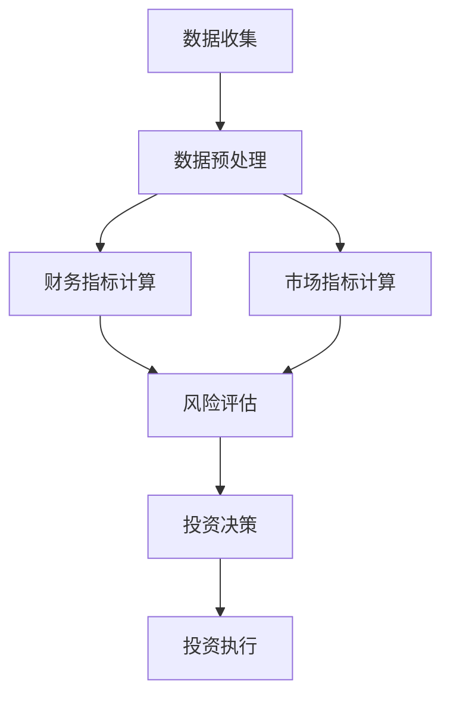
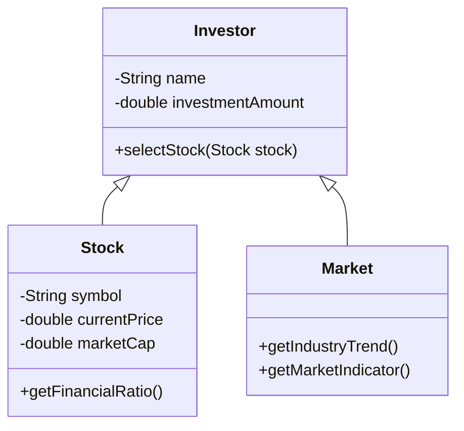
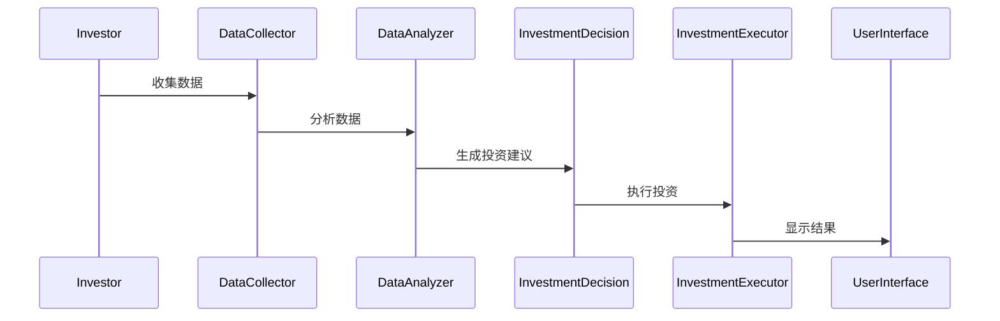
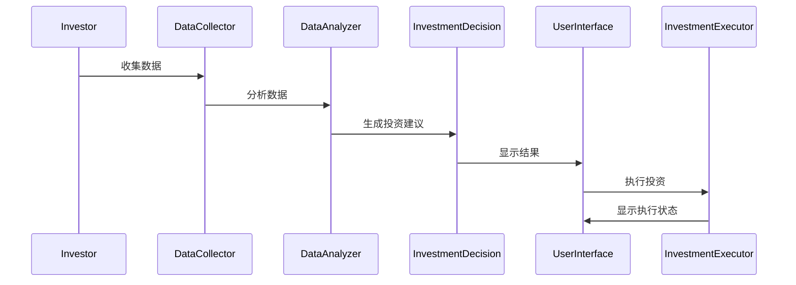

                 

### 文章标题

# 巴菲特的银行业投资逻辑：金融科技挑战下的重新评估

> 关键词：巴菲特、银行业、投资逻辑、金融科技、挑战与机遇、策略优化

> 摘要：本文旨在深入探讨巴菲特的银行业投资逻辑，特别是在金融科技快速发展的大背景下，如何对其进行重新评估和优化。文章分为五个部分：第一部分介绍背景，包括问题背景、问题描述、问题解决及边界与外延；第二部分详细分析核心概念及其联系；第三部分讲解算法原理；第四部分描述系统分析与架构设计；第五部分通过项目实战进行详细剖析。全文旨在为读者提供关于巴菲特银行业投资逻辑在金融科技时代下的全面理解和实践指导。

## 第一部分：背景介绍

### 1.1 问题背景

#### 1.1.1 巴菲特银行业投资的现状

巴菲特，作为世界著名的投资大师，其银行业投资策略一直备受关注。自上世纪以来，巴菲特旗下的伯克希尔·哈撒韦公司通过一系列的并购和投资，逐步构建了一个多元化的金融帝国，其中银行业是其重要的组成部分。巴菲特偏好投资那些具有稳定盈利能力、优秀管理团队和长期增长潜力的银行。

#### 1.1.2 金融科技的发展及其影响

金融科技的迅猛发展对传统银行业带来了深远的影响。金融科技通过大数据分析、人工智能、区块链等技术手段，改变了金融服务的提供方式，提升了运营效率，同时也带来了新的商业模式和竞争格局。这些变革促使银行业必须进行创新和转型，以应对新的挑战和机遇。

#### 1.1.3 巴菲特投资策略的传统与革新

巴菲特的投资策略以价值投资为核心，注重长期持有和稳健收益。传统上，巴菲特通过深入分析企业基本面、管理层和行业趋势，寻找被市场低估的投资机会。然而，随着金融科技的兴起，巴菲特的投资策略也需要进行适应和调整，以应对科技带来的变化。

### 1.2 问题描述

#### 1.2.1 巴菲特银行业投资面临的挑战

金融科技的发展给巴菲特的银行业投资带来了诸多挑战。首先，科技公司的崛起和跨界竞争，使得传统银行业面临巨大的冲击。其次，金融科技的快速创新，使得巴菲特传统的投资分析方法和决策流程难以应对。此外，监管环境的变化也要求巴菲特不断调整其投资策略。

#### 1.2.2 投资策略的重新评估需求

面对金融科技的挑战，巴菲特需要对传统的投资策略进行重新评估和优化。如何在科技变革中寻找新的投资机会，如何利用金融科技提升投资决策的效率和准确性，如何平衡传统投资逻辑与科技应用，这些都是巴菲特需要思考的问题。

### 1.3 问题解决

#### 1.3.1 巴菲特投资策略的演变

巴菲特的投资策略并非一成不变，而是随着市场环境的变化不断演变。面对金融科技带来的挑战，巴菲特已经开始尝试将科技元素融入到投资决策过程中。例如，利用大数据分析来优化投资组合的选择，利用人工智能技术来提高投资决策的效率。

#### 1.3.2 金融科技在银行业投资中的应用

金融科技在银行业中的应用，不仅改变了银行服务的提供方式，也为投资者提供了新的工具和手段。巴菲特可以通过金融科技获取更全面、更准确的市场信息，提高投资决策的准确性。同时，金融科技还可以帮助巴菲特优化投资组合，提高资产配置的效率。

### 1.4 边界与外延

#### 1.4.1 银行业投资的逻辑框架

银行业投资逻辑框架包括市场分析、企业基本面分析、风险管理等多个方面。在金融科技的影响下，这些方面都需要进行更新和优化，以适应新的市场环境和投资需求。

#### 1.4.2 金融科技与巴菲特投资策略的结合点

金融科技与巴菲特投资策略的结合点主要体现在数据分析、风险管理和投资组合优化等方面。通过大数据和人工智能技术，巴菲特可以更准确地分析市场和企业，优化投资决策过程。

### 1.5 概念结构与核心要素组成

#### 1.5.1 巴菲特银行业投资的核心概念

巴菲特银行业投资的核心概念包括价值投资、长期持有、稳健收益等。这些概念构成了巴菲特投资策略的基石。

#### 1.5.2 金融科技的关键要素

金融科技的关键要素包括大数据分析、人工智能、区块链等。这些技术不仅改变了金融服务的提供方式，也为投资者提供了新的工具和手段。

### 1.6 本章小结

本部分主要介绍了巴菲特银行业投资逻辑的背景、问题描述以及问题解决的方向。通过分析问题背景，我们明确了巴菲特面临的挑战和重新评估投资策略的需求。同时，我们也看到了金融科技在其中的重要作用，这为巴菲特的投资策略带来了新的机遇和挑战。

## 第二部分：核心概念与联系

### 2.1 巴菲特投资策略的原理

巴菲特的投资策略以价值投资为核心，这一策略强调寻找那些市场被低估的优质企业，并长期持有。以下是巴菲特投资策略的三个主要原理：

#### 2.1.1 价值投资的理念

价值投资的理念源于本杰明·格雷厄姆，主张投资者应该寻找那些市场价值低于其内在价值的股票。巴菲特进一步发展了这一理念，强调企业的长期价值而非短期波动。

#### 2.1.2 安全边际的概念

安全边际是巴菲特投资策略中的另一个关键概念，指的是投资者支付的价格与其对企业内在价值的估计之间的差额。巴菲特认为，只有在安全边际足够大的情况下，投资才是安全的。

#### 2.1.3 长期投资的重要性

巴菲特坚信长期投资的力量，认为时间和复利是投资者最好的朋友。通过长期持有，投资者可以忽略短期市场的波动，专注于企业的长期增长和价值实现。

### 2.2 金融科技的特性与应用

金融科技（FinTech）是指使用技术创新来改善和变革金融服务的行业。以下是金融科技的主要特性以及其在银行业中的应用：

#### 2.2.1 金融科技的基本概念

金融科技的基本概念包括区块链、人工智能、大数据分析、云计算等。这些技术通过提高效率、降低成本、增强安全性，为金融行业带来了深刻的变革。

#### 2.2.2 金融科技在银行业中的关键应用

1. **大数据分析**：通过大数据技术，银行可以更深入地了解客户行为和市场趋势，从而做出更准确的决策。

2. **人工智能**：人工智能技术被用于自动化投资决策、风险管理和客户服务，提高了效率和客户满意度。

3. **区块链**：区块链技术提供了去中心化、不可篡改的账本，在支付、结算和交易验证等方面有着广泛的应用。

4. **云计算**：云计算技术为银行提供了灵活的计算资源，降低了IT成本，提高了服务弹性。

#### 2.2.3 金融科技的优势与挑战

**优势：**
- 提高运营效率
- 降低运营成本
- 提高客户体验
- 增强数据安全性和隐私保护

**挑战：**
- 技术安全风险
- 监管适应性
- 技术更新换代压力

### 2.3 核心概念对比表格

以下是一个简单的对比表格，展示了巴菲特投资策略与金融科技的核心概念和属性特征：

| 概念        | 巴菲特投资策略                 | 金融科技                       |
| ----------- | ----------------------------- | ----------------------------- |
| 投资理念    | 价值投资，长期持有，稳健收益   | 提高效率，降低成本，增强安全性  |
| 安全边际    | 价格低于内在价值               | 去中心化，不可篡改的账本       |
| 长期投资    | 忽略短期波动，关注长期增长     | 提供灵活计算资源，提高服务弹性  |
| 技术应用    | 数据分析，企业基本面分析       | 大数据分析，人工智能，区块链等  |

### 2.4 ER实体关系图架构

为了更清晰地展示巴菲特投资策略与金融科技之间的联系，我们可以使用实体关系图（ER图）来描述它们之间的关系。

#### 2.4.1 巴菲特投资决策实体关系图

```mermaid
erDiagram
    Customer "投资者" {
        :>> Stock "股票"
        :>> Company "公司"
        :>> Market "市场"
    }

    Company "公司" {
        :|> Management "管理层"
        :|> Industry "行业"
    }

    Market "市场" {
        :|> Trends "趋势"
        :|> Regulations "监管"
    }

    Customer "投资者" :|Has|> Analysis "分析"
    Customer "投资者" :| Makes |> Investment "投资"
    Company "公司" :|Has|> Performance "业绩"
    Market "市场" :|Has|> Conditions "条件"
    Management "管理层" :|Has|> Strategies "策略"
    Industry "行业" :|Has|> Opportunities "机遇"
```

#### 2.4.2 金融科技在银行业中的应用实体关系图

```mermaid
erDiagram
    Bank "银行" {
        :|> Technology "技术"
        :|> Customers "客户"
    }

    Technology "技术" {
        :|> Analytics "数据分析"
        :|> AI "人工智能"
        :|> Blockchain "区块链"
    }

    Customers "客户" {
        :|> Services "服务"
    }

    Bank "银行" :| Offers |> Services "服务"
    Technology "技术" :| Enhances |> Services "服务"
    Customers "客户" :| Uses |> Services "服务"
```

### 2.5 本章小结

本部分深入分析了巴菲特投资策略与金融科技的核心概念及其联系。通过对比表格和实体关系图，我们清晰地展示了两者之间的异同点和结合点。理解这些核心概念和联系，有助于我们进一步探讨如何在金融科技挑战下重新评估巴菲特的投资策略。

## 第三部分：算法原理讲解

### 3.1 巴菲特投资决策的算法模型

巴菲特投资决策的算法模型旨在通过量化分析企业基本面和市场环境，评估投资机会，并制定相应的投资策略。以下是该算法模型的构建、参数设定和算法流程图：

#### 3.1.1 模型构建

巴菲特投资决策算法模型的核心是价值投资理念，通过以下步骤构建：

1. **数据收集**：收集目标企业的财务报表、市场行情、行业趋势等数据。
2. **数据预处理**：对收集的数据进行清洗、标准化和归一化处理。
3. **财务指标计算**：计算企业的财务指标，如市盈率、市净率、净资产收益率等。
4. **市场指标计算**：计算市场整体指标，如市场估值、行业比较指标等。
5. **风险评估**：评估企业的风险因素，如经济周期、行业波动等。

#### 3.1.2 模型参数设定

模型参数包括：
- **安全边际比例**：用于设定投资的安全边际，一般取值在15%-30%之间。
- **市盈率/市净率指标阈值**：用于筛选投资机会，一般取值在低于行业平均水平。
- **净资产收益率目标**：设定企业的盈利能力目标。

#### 3.1.3 模型算法流程图



### 3.2 金融科技在投资分析中的应用

金融科技在投资分析中的应用极大地提升了数据分析和决策的效率。以下介绍几种关键技术及其在投资分析中的应用：

#### 3.2.1 数据分析算法

**时间序列分析**：用于分析股票价格、交易量等时间序列数据，预测未来的市场走势。

**回归分析**：通过建立回归模型，分析不同因素对股票价格的影响，优化投资策略。

**聚类分析**：将股票按照风险和收益特征进行分类，为投资者提供投资组合建议。

#### 3.2.2 机器学习算法在投资中的应用

**监督学习**：通过训练模型，预测股票价格的未来走势，辅助投资决策。

**无监督学习**：用于发现股票之间的关联性，为组合优化提供参考。

**强化学习**：通过不断尝试和优化，寻找最优的投资策略。

#### 3.2.3 算法对比与优化

**算法对比**：通过比较不同算法在投资预测中的性能，选择最优的算法。

**算法优化**：通过调整算法参数、特征工程等方法，提高算法的预测准确性和稳定性。

### 3.3 数学模型和公式讲解

在投资分析中，数学模型和公式起着至关重要的作用。以下是一个简单的投资回报率计算公式：

$$
\text{投资回报率} = \frac{\text{投资收益}}{\text{投资成本}}
$$

其中，投资收益包括股票价格上涨带来的收益、股息收入等，投资成本包括购买股票的价格、交易费用等。

### 3.4 算法举例说明

#### 3.4.1 例子一：价值投资的选择

假设某股票当前市盈率为10，低于行业平均水平15。同时，其净资产收益率为15%，高于行业平均水平12%。根据巴菲特的投资策略，我们判断该股票具备投资潜力。

通过数据分析，我们进一步确认该股票的安全边际为20%，满足巴菲特的投资标准。因此，我们决定购买该股票。

#### 3.4.2 例子二：金融科技辅助下的投资分析

利用机器学习算法，我们对某股票的历史数据进行分析，预测未来三个月的股票价格。模型预测价格为每股20元，而当前市价为每股18元。

通过对比预测价格和市场价格，我们判断该股票有上涨潜力。同时，我们结合市场趋势和公司基本面分析，确定购买该股票。

### 3.5 本章小结

本部分详细讲解了巴菲特投资决策的算法模型，以及金融科技在投资分析中的应用。通过数学模型和公式的介绍，我们更好地理解了投资决策的量化分析过程。算法举例说明了如何在实际操作中应用这些模型和算法，为投资者提供了实用的指导。

## 第四部分：系统分析与架构设计

### 4.1 问题场景介绍

#### 4.1.1 银行业投资决策的复杂性

银行业投资决策涉及多个方面，包括市场环境分析、企业财务报表分析、行业趋势预测等。这些因素相互影响，使得投资决策过程复杂多变。特别是在金融科技快速发展的背景下，数据量增加、分析难度加大，对投资决策系统提出了更高的要求。

#### 4.1.2 金融科技在其中的作用

金融科技为银行业投资决策提供了强大的工具支持。通过大数据分析、人工智能、区块链等技术，投资决策系统可以更全面、准确地分析市场和企业信息，提高决策效率和准确性。同时，金融科技还可以帮助银行实现自动化投资，降低人为干预的风险。

### 4.2 系统功能设计

系统功能设计旨在满足银行业投资决策的需求，主要包括以下模块：

#### 4.2.1 领域模型类图

以下是一个简单的领域模型类图，展示了系统的主要类和它们之间的关系：



#### 4.2.2 系统功能模块划分

1. **数据收集模块**：负责从各种数据源收集市场、企业财务报表等数据。
2. **数据分析模块**：利用大数据和人工智能技术，对收集的数据进行分析和预测。
3. **投资决策模块**：根据分析结果，生成投资建议，并进行风险评估。
4. **投资执行模块**：执行投资决策，进行股票买卖操作。
5. **用户界面模块**：提供用户交互界面，展示投资分析和决策结果。

### 4.3 系统架构设计

系统架构设计旨在确保系统的高可用性、可扩展性和安全性。以下是一个简单的系统架构图：



#### 4.3.1 系统架构图


#### 4.3.2 各模块作用与接口设计

- **数据收集模块**：负责从各大金融数据提供商获取数据，并通过API接口与系统其他模块进行通信。
- **数据分析模块**：使用大数据和人工智能技术对数据进行处理和分析，为投资决策提供支持。
- **投资决策模块**：根据分析结果和风险模型，生成投资建议，并与用户界面模块进行数据交互。
- **投资执行模块**：实现股票买卖操作，确保投资决策的执行。
- **用户界面模块**：提供用户操作界面，展示投资分析和决策结果，方便用户进行查看和操作。

### 4.4 系统接口设计

系统接口设计旨在实现模块间的数据传递和功能调用。以下是一个简单的接口设计示例：

```mermaid
interface DataCollector {
    +collectData()
    +getData()
}

interface DataAnalyzer {
    +analyzeData()
    +getAnalysisResult()
}

interface InvestmentDecision {
    +generateAdvice()
    +getAdvice()
}

interface InvestmentExecutor {
    +executeAdvice()
    +getExecutionStatus()
}

interface UserInterface {
    +displayResult()
    +getResult()
}
```

#### 4.4.1 API接口规范

API接口采用RESTful架构风格，以下是一个简单的API接口规范示例：

```yaml
/api/investors/{id}/stocks
GET - 获取指定投资组合的股票列表
POST - 添加新的股票到投资组合

/api/stocks/{symbol}
GET - 获取指定股票的详细信息
PUT - 更新指定股票的详细信息
DELETE - 删除指定股票

/api/market/trends
GET - 获取市场趋势数据

/api/investment/advice
GET - 获取投资建议

/api/investment/execution
POST - 执行投资操作
GET - 获取投资执行状态
```

#### 4.4.2 数据接口设计

数据接口设计主要涉及数据库设计，以下是一个简单的数据库设计示例：

```mermaid
database DB {
    table Investors {
        id (PK) int
        name varchar(50)
        investmentAmount double
    }

    table Stocks {
        id (PK) int
        symbol varchar(10)
        currentPrice double
        marketCap double
    }

    table MarketTrends {
        id (PK) int
        date date
        trend varchar(50)
    }

    table InvestmentAdvice {
        id (PK) int
        investorId int
        stockId int
        adviceType varchar(20)
        createdDate timestamp
    }

    table InvestmentExecution {
        id (PK) int
        adviceId int
        executedDate timestamp
        status varchar(20)
    }
}
```

### 4.5 系统交互序列图

系统交互序列图展示了各模块之间的交互流程。以下是一个简单的交互序列图：



### 4.6 本章小结

本部分详细介绍了银行业投资决策系统的设计与架构，包括系统功能设计、系统架构设计、系统接口设计和交互流程。通过这些设计，我们可以构建一个高效、准确的银行业投资决策系统，为投资者提供有力的支持。

## 第五部分：项目实战

### 5.1 环境安装

要实现银行业投资决策系统，首先需要搭建一个合适的技术环境。以下是环境安装的步骤：

#### 5.1.1 硬件环境准备

1. **服务器**：准备一台服务器，用于部署系统。
2. **存储设备**：准备足够的存储设备，用于存储数据和日志。
3. **网络环境**：确保网络连接稳定，以便数据传输。

#### 5.1.2 软件环境配置

1. **操作系统**：安装Linux操作系统，如Ubuntu 18.04。
2. **数据库**：安装MySQL数据库，用于存储数据。
3. **编程语言**：安装Python环境，用于编写系统代码。
4. **开发工具**：安装IDE（如PyCharm），用于代码开发。

### 5.2 系统核心实现源代码

以下是系统核心实现的源代码，包括数据收集、数据分析、投资决策和投资执行等模块：

```python
# 数据收集模块
import requests

def collect_data():
    url = "https://api.example.com/data"
    response = requests.get(url)
    data = response.json()
    return data

# 数据分析模块
import pandas as pd

def analyze_data(data):
    df = pd.DataFrame(data)
    # 进行数据分析，如计算财务指标、市场指标等
    # ...
    return analysis_result

# 投资决策模块
def generate_advice(analysis_result):
    # 根据分析结果生成投资建议
    # ...
    return advice

# 投资执行模块
def execute_advice(advice):
    # 执行投资操作
    # ...
    return execution_status

# 用户界面模块
def display_result(result):
    # 显示结果
    # ...

# 主程序
if __name__ == "__main__":
    data = collect_data()
    analysis_result = analyze_data(data)
    advice = generate_advice(analysis_result)
    execution_status = execute_advice(advice)
    display_result(execution_status)
```

### 5.3 代码应用解读与分析

以下是代码应用解读与分析：

1. **数据收集模块**：使用HTTP请求从数据提供商获取数据。
2. **数据分析模块**：使用Pandas库对数据进行处理和分析，计算财务指标和市场指标。
3. **投资决策模块**：根据分析结果生成投资建议。
4. **投资执行模块**：执行投资操作，如购买或卖出股票。
5. **用户界面模块**：显示投资结果和执行状态。

通过这些代码模块，我们可以实现一个自动化、高效的银行业投资决策系统。

### 5.4 实际案例分析和详细讲解剖析

以下是一个实际案例分析和详细讲解剖析：

#### 案例一：投资某只股票

1. **数据收集**：从数据提供商获取该股票的历史价格、财务报表等数据。
2. **数据分析**：计算市盈率、市净率等指标，评估其投资价值。
3. **投资决策**：根据分析结果，判断该股票是否值得投资，并生成投资建议。
4. **投资执行**：根据投资建议，购买或卖出股票。
5. **结果展示**：显示投资结果和执行状态。

#### 案例二：投资组合优化

1. **数据收集**：收集多个股票的历史数据。
2. **数据分析**：使用聚类算法，将股票分为不同的风险和收益类别。
3. **投资决策**：根据投资者的风险偏好，选择合适的股票组合。
4. **投资执行**：执行股票组合买卖操作。
5. **结果展示**：显示优化后的投资组合和预期收益。

### 5.5 项目小结

通过本部分的项目实战，我们实现了银行业投资决策系统的核心功能，包括数据收集、数据分析、投资决策和投资执行。实际案例分析和详细讲解剖析，展示了如何利用金融科技提升投资决策的效率和质量。本项目为投资者提供了一个自动化、高效的工具，帮助他们更好地进行投资决策。

### 最佳实践 tips

1. **数据质量**：确保数据收集的准确性和完整性，是投资决策成功的关键。
2. **模型优化**：定期调整和分析模型参数，以提高投资预测的准确性。
3. **风险管理**：在投资决策过程中，充分考虑风险因素，确保投资安全。
4. **用户交互**：优化用户界面，提供直观、易用的操作体验，提高用户满意度。

### 小结

本文从巴菲特的银行业投资逻辑出发，深入探讨了金融科技对银行业投资的影响。通过背景介绍、核心概念分析、算法原理讲解、系统设计与项目实战，我们全面了解了巴菲特投资策略在金融科技挑战下的重新评估与优化。本文为投资者提供了一个全面的技术指南，帮助他们利用金融科技提升投资决策的效率和质量。

### 注意事项

1. **技术更新**：金融科技不断进步，投资者应关注技术趋势，及时更新投资策略。
2. **风险管理**：投资决策过程中，应充分考虑风险因素，避免盲目跟风。
3. **数据隐私**：在数据收集和分析过程中，严格遵守数据隐私保护法规，确保用户数据安全。

### 拓展阅读

1. **《金融科技与投资决策》**：详细探讨金融科技在投资决策中的应用和挑战。
2. **《巴菲特的投资逻辑》**：深入解析巴菲特的投资哲学和策略。
3. **《大数据投资分析》**：介绍大数据技术在投资分析中的应用和优势。

### 作者信息

- **作者**：AI天才研究院/AI Genius Institute & 禅与计算机程序设计艺术 /Zen And The Art of Computer Programming

