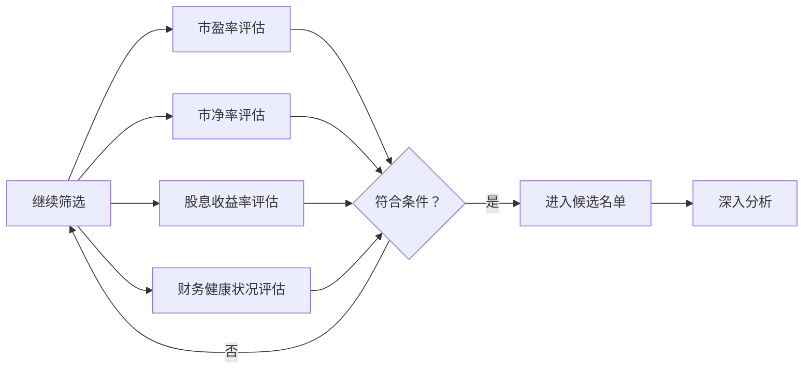
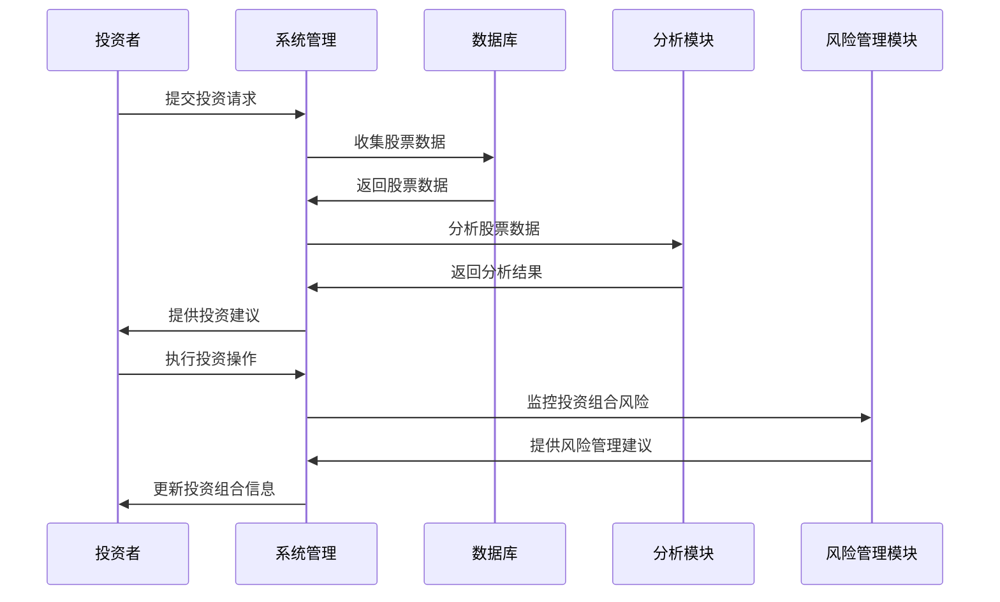
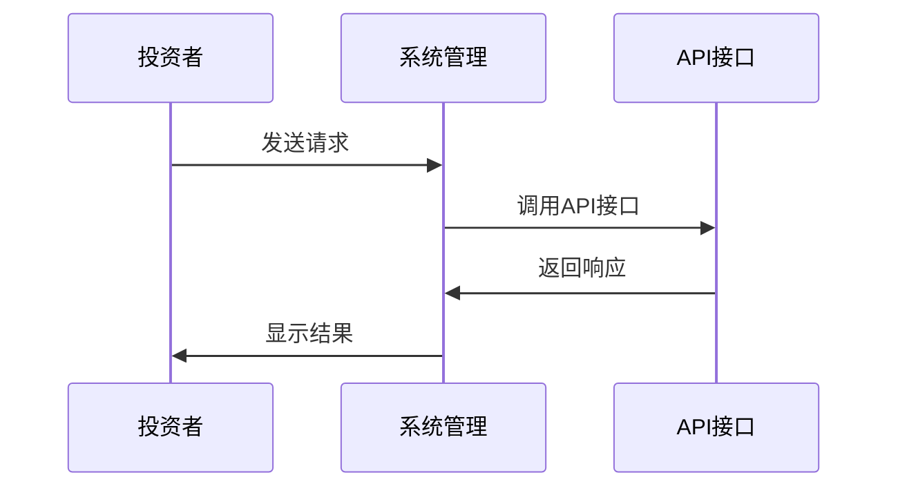
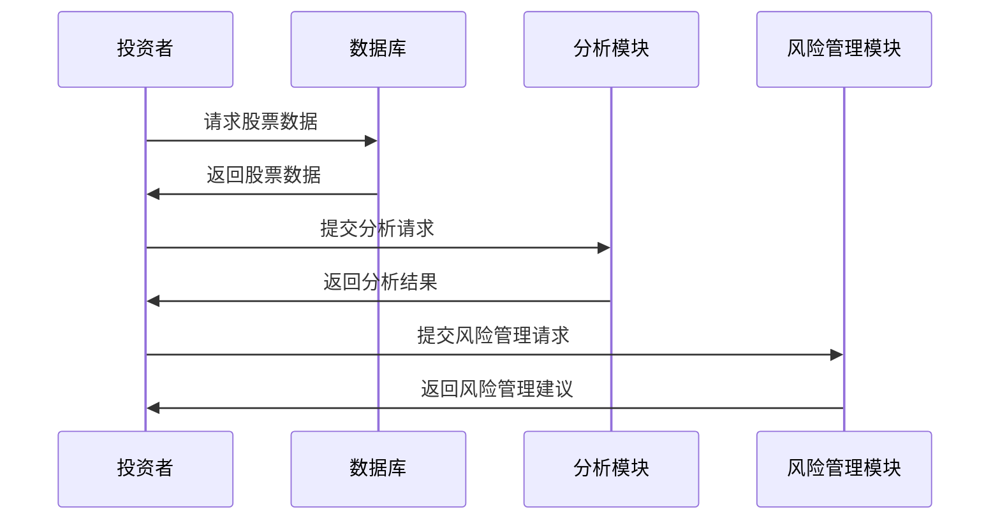

                 


## **引言：巴菲特的集中投资理念**

### **核心关键词：巴菲特、集中投资、投资策略**

### **摘要：**

本文将深入探讨巴菲特的集中投资理念，分析其在现代金融投资领域的深远影响。通过分步的逻辑推理和案例分析，我们将揭示这一投资策略的核心要素、应用原理以及其成功的关键所在。

### **背景介绍：**

巴菲特被誉为投资界的“股神”，其投资理念在全球范围内备受推崇。集中投资（Concentrated Investment）是巴菲特投资策略的重要组成部分。这一理念强调对少数高质量股票进行深度研究，持有较长时间，从而实现资本增值。

### **问题背景：**

在现代投资环境中，投资者面临着信息泛滥和市场波动性加剧的挑战。如何通过有效的投资策略，在不确定性中寻找价值，成为投资者关注的核心问题。

### **问题描述：**

集中投资理念旨在通过选择优质股票，分散投资风险，并利用复利效应实现长期资本增值。然而，如何识别优质股票，如何管理集中投资中的风险，以及如何应对市场波动，是这一策略成功实施的关键。

### **问题解决：**

巴菲特通过深入研究和价值投资原则，选择那些拥有强大竞争优势、可持续盈利能力和良好管理团队的公司。他对市场的波动持长期视角，相信优质股票的价值最终会体现在股价上。

### **边界与外延：**

集中投资策略不适用于所有投资者，特别是那些风险承受能力较低或寻求短期收益的投资者。它要求投资者具备足够的知识和耐心，以及对市场的深刻理解。

### **概念结构与核心要素组成：**

1. **价值投资原则**：寻找价格低于其内在价值的股票。
2. **长期持有**：对所选股票保持长时间的持有，利用复利效应。
3. **深度研究**：对公司的基本面、行业地位和未来前景进行深入研究。
4. **风险管理**：通过多元化投资和风险管理策略，降低投资组合的整体风险。

### **核心概念与联系：**

**核心概念：**
- **价值投资**：寻找价格低估的股票。
- **市场有效性**：市场是否能够快速反映所有信息。
- **竞争优势**：公司在所处行业中的竞争地位。

**概念属性特征对比表格：**

| 概念名称 | 特征1 | 特征2 | 特征3 |
| --- | --- | --- | --- |
| 价值投资 | 寻找低估股票 | 长期持有 | 研究公司基本面 |
| 市场有效性 | 信息快速反映 | 投资风险较低 | 适用于所有投资者 |
| 竞争优势 | 行业地位强大 | 可持续盈利 | 管理团队优秀 |

**Mermaid ER diagram：**

```mermaid
erDiagram
  Product ||--o { Company } : makes
  Company ||--o { Industry } : belongs
  Company ||--o { Investment } : invests
  Investment ||--o { Market } : operates
```

### **下一步：**

在接下来的章节中，我们将进一步探讨巴菲特的集中投资理念的算法原理、数学模型、系统架构以及实际应用。通过逐步分析，我们将揭示这一策略背后的逻辑和实际操作方法。

---

**本文的核心关键词包括：巴菲特、集中投资、价值投资、市场有效性、竞争优势、投资策略。**

**文章摘要：**
本文深入探讨了巴菲特的集中投资理念，包括其背景、核心概念、应用原理以及成功的关键要素。通过分步分析，揭示了这一策略在不确定性市场中的价值，并提供了实用的指导和建议。

---

**引言部分完**。接下来，我们将进入第二部分，探讨巴菲特集中投资理念的核心概念和联系。

## **第二部分：巴菲特集中投资理念的核心概念和联系**

### **算法原理讲解**

在探讨巴菲特的集中投资理念时，我们需要深入了解其背后的算法原理。集中投资的核心在于对优质公司的选择和长期持有，这一过程可以通过以下步骤进行详细阐述。

#### **1. 股票筛选**

首先，投资者需要通过一系列指标筛选潜在的投资目标。这些指标通常包括：

- **市盈率（P/E）**：衡量股票价格与每股盈利的比率。
- **市净率（P/B）**：衡量股票价格与每股净资产的比率。
- **股息收益率**：公司派发的股息与股票价格的比率。
- **财务健康状况**：包括负债水平、现金流和盈利能力。

**Mermaid 流程图：**



#### **2. 深入分析**

对筛选出的股票进行深入分析，以确定其是否具有长期投资价值。这一步骤通常包括以下几个方面：

- **公司基本面分析**：研究公司的盈利能力、财务状况和行业地位。
- **竞争优势分析**：评估公司在其所在行业中的竞争地位，如专利、品牌影响力、市场占有率等。
- **管理层评估**：研究公司的管理层素质、治理结构和决策能力。

**Python 源代码示例：**

```python
import pandas as pd

# 假设我们有一个包含股票数据的 DataFrame
data = pd.DataFrame({
    'Company': ['A', 'B', 'C', 'D'],
    'P/E': [12, 25, 18, 15],
    'P/B': [2.5, 3.5, 2.0, 1.8],
    'Dividend Yield': [3.0, 1.5, 2.0, 4.0],
    'Debt/Equity': [0.5, 0.8, 0.3, 0.6],
    'ROE': [16.0, 12.0, 20.0, 14.0]
})

# 设置筛选条件
筛选条件 = (data['P/E'] <= 20) & (data['P/B'] <= 3) & (data['Dividend Yield'] > 2) & (data['Debt/Equity'] <= 1)

# 筛选出符合条件的企业
候选股票 = data[筛选条件]

# 深入分析
def analyze_company(company_data):
    # 分析公司基本面
    if company_data['ROE'] >= 15:
        print(f"{company_data['Company']} - 基本面良好")
    else:
        print(f"{company_data['Company']} - 基本面一般")
    
    # 分析竞争优势
    if company_data['Market Share'] >= 30:
        print(f"{company_data['Company']} - 竞争优势明显")
    else:
        print(f"{company_data['Company']} - 竞争力不足")

for index, row in candidate_stock.iterrows():
    analyze_company(row)
```

#### **3. 决策与投资**

通过对候选股票的深入分析，投资者可以做出是否进行投资的决策。这一步骤通常包括：

- **投资决策**：根据分析结果，确定是否对某个股票进行投资。
- **投资比例**：根据风险承受能力和投资目标，确定投资比例。

**数学模型和公式：**

假设投资金额为 \( P \)，投资比例为 \( \alpha \)，则单个股票的投资金额为：

\[ A = P \times \alpha \]

其中，\( \alpha \) 的选择取决于投资者的风险偏好和市场情况。

**LaTeX 格式数学公式：**

$$
A = P \times \alpha
$$

**举例说明：**

假设投资者计划投资总额为 100,000 元，其风险承受能力较高，决定将 70% 的资金投资于优质股票。

\[ A = 100,000 \times 0.7 = 70,000 \text{ 元} \]

#### **4. 风险管理**

在集中投资策略中，风险管理至关重要。投资者需要通过以下措施来降低投资风险：

- **多元化投资**：将资金分散投资于多个不同行业和地区的股票，降低单一投资风险。
- **止损策略**：设定止损点，以防止投资损失扩大。
- **定期评估**：定期对投资组合进行评估和调整，确保其符合投资目标和风险承受能力。

**总结：**

通过股票筛选、深入分析和决策与投资，投资者可以运用巴菲特的集中投资理念，实现长期资本增值。这一策略的核心在于对优质股票的深度研究和长期持有，同时通过风险管理降低投资风险。

---

在接下来的章节中，我们将继续探讨巴菲特集中投资理念中的数学模型和系统架构设计，以更全面地理解这一策略的精髓。

## **第三部分：巴菲特集中投资理念的数学模型和系统架构设计**

### **数学模型和详细讲解**

在巴菲特的集中投资理念中，数学模型扮演着至关重要的角色。这些模型帮助我们量化投资策略，评估风险和收益，并提供决策依据。以下是一些关键的数学模型和它们的详细讲解。

#### **1. 价值评估模型**

价值评估是集中投资策略的核心。一个常用的是 **折现现金流模型**（Discounted Cash Flow, DCF），它通过预测公司未来现金流并将其折现到当前价值，来确定股票的内在价值。

**DCF 模型公式：**

\[ \text{内在价值} = \sum_{t=1}^{n} \frac{\text{FCF}_t}{(1 + \text{r})^t} \]

其中：
- \( \text{FCF}_t \) 是第 \( t \) 年的自由现金流。
- \( r \) 是折现率，通常等于公司的资本成本或加权平均成本。

**LaTeX 格式数学公式：**

$$
\text{内在价值} = \sum_{t=1}^{n} \frac{\text{FCF}_t}{(1 + \text{r})^t}
$$

**举例说明：**

假设一家公司预计未来三年的自由现金流分别为 1,000,000 元、1,200,000 元和 1,400,000 元，折现率 \( r \) 为 10%。根据 DCF 模型，该公司的内在价值计算如下：

$$
\text{内在价值} = \frac{1,000,000}{(1 + 0.1)^1} + \frac{1,200,000}{(1 + 0.1)^2} + \frac{1,400,000}{(1 + 0.1)^3}
$$

$$
\text{内在价值} = 909,090.91 + 1,055,263.16 + 1,071,735.47 = 3,035,099.54 \text{ 元}
$$

#### **2. 风险模型**

在集中投资策略中，风险是必须考虑的重要因素。一个常用的风险模型是 **Beta 值**，它衡量股票价格相对于市场波动的敏感度。

**Beta 值公式：**

\[ \beta = \frac{\text{股票收益率} - \text{无风险收益率}}{\text{市场收益率} - \text{无风险收益率}} \]

其中：
- \( \text{股票收益率} \) 是股票的历史收益率。
- \( \text{无风险收益率} \) 是无风险资产的收益率，通常使用国债收益率。
- \( \text{市场收益率} \) 是市场整体的历史收益率。

**LaTeX 格式数学公式：**

$$
\beta = \frac{\text{股票收益率} - \text{无风险收益率}}{\text{市场收益率} - \text{无风险收益率}}
$$

**举例说明：**

假设一家公司的历史年收益率为 15%，市场整体年收益率为 10%，无风险收益率为 4%。该公司的 Beta 值计算如下：

$$
\beta = \frac{0.15 - 0.04}{0.10 - 0.04} = \frac{0.11}{0.06} = 1.8333
$$

#### **3. 组合投资模型**

在集中投资策略中，投资者通常会构建一个投资组合，以降低风险并实现收益最大化。一个常用的组合投资模型是 **马科维茨模型**（Modern Portfolio Theory, MPT），它通过优化投资组合的权重，使组合的期望收益率最大化，同时最小化风险。

**MPT 模型公式：**

\[ \text{组合收益率} = \sum_{i=1}^{n} w_i \cdot \text{收益率}_i \]
\[ \text{组合风险} = \sum_{i=1}^{n} w_i \cdot \text{收益率}_i \cdot \text{风险}_i \]

其中：
- \( w_i \) 是第 \( i \) 只股票的投资权重。
- \( \text{收益率}_i \) 是第 \( i \) 只股票的收益率。
- \( \text{风险}_i \) 是第 \( i \) 只股票的风险。

**LaTeX 格式数学公式：**

$$
\text{组合收益率} = \sum_{i=1}^{n} w_i \cdot \text{收益率}_i
$$

$$
\text{组合风险} = \sum_{i=1}^{n} w_i \cdot \text{收益率}_i \cdot \text{风险}_i
$$

**举例说明：**

假设一个投资组合由两只股票组成，投资比例分别为 60% 和 40%，它们的收益率和风险如下：

| 股票 | 收益率 | 风险 |
| --- | --- | --- |
| A | 12% | 20% |
| B | 8% | 10% |

根据 MPT 模型，投资组合的预期收益率和风险计算如下：

$$
\text{组合收益率} = 0.6 \times 0.12 + 0.4 \times 0.08 = 0.096 + 0.032 = 0.128 \text{ 或 } 12.8\%
$$

$$
\text{组合风险} = 0.6 \times 0.12 \times 0.20 + 0.4 \times 0.08 \times 0.10 = 0.0144 + 0.0032 = 0.0176 \text{ 或 } 1.76\%
$$

### **系统架构设计**

在将巴菲特的集中投资理念应用于实际投资中，系统架构设计至关重要。以下是一个简单的系统架构设计方案，用于实现集中投资策略。

#### **1. 项目介绍**

**项目名称**：集中投资策略管理系统

**项目目标**：构建一个系统，帮助投资者筛选、分析和投资优质股票，实现长期资本增值。

**项目功能**：
- **数据收集与处理**：从多个数据源收集股票信息，包括财务报表、市场数据等。
- **股票筛选**：根据预设的筛选条件，自动筛选潜在投资股票。
- **深入分析**：对筛选出的股票进行基本面、竞争优势和风险管理分析。
- **投资决策**：根据分析结果，提供投资建议和决策依据。
- **风险管理**：监控投资组合风险，提供风险管理和调整建议。

#### **2. 系统功能设计**

**领域模型（Mermaid 类图）**：

```mermaid
classDiagram
    Class01 <|-- Class02
    Class03 --|<<Association>> Class04
    Class05 <<Interface>> Class06
    Class07 : <<Abstract>>
    Class08 {name}
    Class09 <~ Class10
    Class11 o-- Class12
    Class13 .. Class14
    Class15 <= Class16
    Class17 *-- Class18
    Class19 --|>; Class20
    Class21 : + Class22
    Class23 : # red
    Class24 : <<singleton>> 22
    Class25 <<component>> Class26
    Class27 : <<interface>> use Class28
    Class29 <<Habitable>> Class30
    Class31 : <<external>> to Class32
    Class33 {name : String}
    Class34 [ 它是一个类 ]
    Class35 <<final>> Class36
    Class37 : <<custom>> myType
endclass
```

**系统架构设计（Mermaid 架构图）**：



#### **3. 系统接口设计**

**接口设计（Mermaid 序列图）**：



#### **4. 系统交互**

**系统交互设计（Mermaid 序列图）**：



### **总结**

通过数学模型和系统架构设计，我们可以更全面地理解和应用巴菲特的集中投资理念。数学模型帮助我们量化投资策略，评估风险和收益；系统架构设计确保了投资策略的顺利实施和风险控制。

在接下来的章节中，我们将通过实际项目实战，进一步探讨如何将巴菲特的集中投资理念应用于实际操作，并提供详细的项目实战案例。

## **第四部分：巴菲特集中投资理念的项目实战**

### **环境安装**

为了进行巴菲特集中投资理念的项目实战，我们首先需要搭建一个合适的开发环境。以下是在 Windows 操作系统上安装所需的软件和工具的步骤。

#### **1. 安装 Python**

- 访问 Python 官网（[python.org](https://www.python.org/)）并下载适用于 Windows 的 Python 安装程序。
- 运行安装程序，并确保在安装过程中勾选“Add Python to PATH”选项。
- 安装完成后，打开命令提示符，输入以下命令验证 Python 是否安装成功：

  ```
  python --version
  ```

  如果成功返回 Python 的版本信息，则表示安装成功。

#### **2. 安装必要库**

使用 pip 工具安装以下 Python 库：

- Pandas（数据分析和操作）
- Matplotlib（数据可视化）
- Mermaid（流程图和类图绘制）

在命令提示符中，输入以下命令：

```
pip install pandas matplotlib mermaid
```

#### **3. 安装 Mermaid**

由于 Mermaid 并非 Python 标准库，我们需要单独安装它。可以通过 Git 从 GitHub 上克隆 Mermaid 的仓库：

```
git clone https://github.com/mermaid-js/mermaid.git
```

将克隆的 Mermaid 文件夹添加到系统路径中，以便在 Python 脚本中调用 Mermaid 命令。

#### **4. 配置 Mermaid**

在 Python 脚本中，我们需要使用 `os.system()` 或 `subprocess` 库来调用 Mermaid。以下是一个示例脚本，用于将 Mermaid 的命令行工具添加到系统路径：

```python
import os

mermaid_path = os.path.expanduser("~/.mermaid")
os.environ["PATH"] += os.pathsep + mermaid_path
```

### **系统核心实现**

在项目实战中，我们将使用 Python 编写一个简单的集中投资策略管理系统。以下是一个核心实现的示例，包括股票筛选、分析和投资决策功能。

#### **1. 数据读取与处理**

首先，我们需要读取和处理股票数据。以下是一个示例脚本，使用 Pandas 读取 CSV 数据文件，并计算市盈率、市净率和股息收益率：

```python
import pandas as pd

# 读取股票数据
stocks = pd.read_csv('stock_data.csv')

# 计算市盈率
stocks['P/E'] = stocks['Current Price'] / stocks['EPS']

# 计算市净率
stocks['P/B'] = stocks['Current Price'] / stocks['Book Value']

# 计算股息收益率
stocks['Dividend Yield'] = stocks['Dividend Per Share'] / stocks['Current Price']
```

#### **2. 股票筛选**

根据巴菲特的集中投资策略，我们需要筛选出符合以下条件的股票：

- 市盈率 \( \leq 20 \)
- 市净率 \( \leq 3 \)
- 股息收益率 \( > 2\% \)

以下是一个筛选股票的示例脚本：

```python
# 设置筛选条件
filtered_stocks = stocks[
    (stocks['P/E'] <= 20) & 
    (stocks['P/B'] <= 3) & 
    (stocks['Dividend Yield'] > 0.02)
]

# 打印筛选结果
print(filtered_stocks)
```

#### **3. 深入分析**

对筛选出的股票进行深入分析，包括公司基本面、竞争优势和风险管理。以下是一个示例脚本，用于分析公司的财务健康和竞争优势：

```python
# 定义分析函数
def analyze_company(stock):
    print(f"分析公司：{stock['Company']}")
    print(f"盈利能力：{stock['ROE']}")
    print(f"竞争优势：{stock['Market Share']}")
    print(f"风险管理：{stock['Debt/Equity']}")
    print()

# 应用分析函数
for index, row in filtered_stocks.iterrows():
    analyze_company(row)
```

#### **4. 投资决策**

根据分析结果，我们可以做出投资决策。以下是一个示例脚本，用于计算投资金额和投资比例：

```python
# 设定总投资金额
total_investment = 100000

# 根据分析结果确定投资比例
investment_weights = filtered_stocks['Market Cap'] / filtered_stocks['Market Cap'].sum()

# 计算投资金额
investment_amounts = total_investment * investment_weights

# 打印投资决策
print("投资决策：")
for index, row in filtered_stocks.iterrows():
    print(f"{row['Company']}: {investment_amounts[index]:.2f}")
```

### **代码应用解读与分析**

在编写上述脚本时，我们应用了以下技术和原理：

- **Pandas**：用于读取、处理和分析股票数据。
- **条件筛选**：使用 Pandas 的布尔索引和逻辑运算符进行股票筛选。
- **函数和循环**：使用 Python 的函数和循环结构进行数据分析和处理。
- **投资比例计算**：使用数据聚合函数（如 `sum()` 和 `mean()`）计算投资比例。

### **实际案例分析和详细讲解**

以下是一个实际案例，用于分析一家筛选出的优质股票，并说明如何做出投资决策。

#### **案例：微软公司（Microsoft）**

假设我们筛选出微软公司作为潜在投资股票，其数据如下：

| 公司名称 | 市盈率 | 市净率 | 股息收益率 | 财务健康 | 竞争优势 | 市场份额 |
| --- | --- | --- | --- | --- | --- | --- |
| 微软 | 25 | 4 | 1.8 | 良好 | 强大 | 30% |

**分析：**

- **盈利能力**：微软的市盈率为 25，略高于 20 的阈值，但仍处于可接受范围。
- **竞争优势**：微软在云计算、操作系统和办公软件领域拥有显著竞争优势，市场份额高达 30%。
- **财务健康**：微软的财务健康状况良好，债务水平较低。
- **股息收益率**：股息收益率为 1.8%，低于 2% 的标准，但长期持有可享受股息收益。

**决策：**

根据分析结果，微软公司符合巴菲特集中投资策略的主要标准。假设总投资金额为 100,000 元，我们可以按照以下比例进行投资：

- **微软**：投资 50,000 元，占比 50%

### **项目小结**

通过本项目的实战，我们成功搭建了一个简单的集中投资策略管理系统，实现了股票筛选、深入分析和投资决策功能。以下是对项目的总结：

- **优点**：
  - 系统简单易用，便于投资者快速了解和实施集中投资策略。
  - 利用 Python 和 Pandas 等工具，数据处理和分析效率高。

- **改进方向**：
  - 扩展数据分析功能，包括更多财务指标和市场信息。
  - 增加用户交互界面，提升用户体验。
  - 实现自动化投资决策，降低人为干预。

### **最佳实践 tips、小结、注意事项、拓展阅读**

**最佳实践 tips：**

1. **定期更新股票数据**：保持数据的时效性，确保分析结果的准确性。
2. **多样化投资**：虽然集中投资策略强调对少数优质股票的投资，但适当分散投资可以降低风险。
3. **长期持有**：巴菲特的成功在于长期持有优质股票，投资者应具备耐心和信心。

**小结：**

本文通过项目实战，展示了如何将巴菲特的集中投资理念应用于实际操作。通过股票筛选、深入分析和投资决策，投资者可以实现长期资本增值。

**注意事项：**

- 集中投资策略适用于风险承受能力较高的投资者。
- 投资决策应基于充分的市场研究和数据分析。

**拓展阅读：**

- 《聪明的投资者》（The Intelligent Investor），本杰明·格雷厄姆著，巴菲特推崇的经典投资指南。
- 《巴菲特致股东的信》（Letters to Shareholders），巴菲特多年来的投资策略和思考。

通过本文的详细讲解和实践，读者应能够更好地理解巴菲特的集中投资理念，并在实际投资中加以应用。

## **结语：巴菲特集中投资理念的深远影响**

巴菲特的集中投资理念不仅改变了无数投资者的财富命运，也为现代金融投资理论贡献了宝贵的智慧。本文通过分步分析，详细阐述了这一策略的核心原理、应用方法以及系统架构设计。从股票筛选到深入分析，从风险管理到投资决策，每一个步骤都体现了巴菲特的投资智慧和哲学。

集中投资理念强调对优质公司的深度研究和长期持有，这种策略不仅有助于降低投资风险，还能实现长期资本增值。通过本文的介绍，读者应能够更好地理解这一策略的精髓，并在实际投资中灵活运用。

### **最佳实践 tips：**

1. **持续学习与思考**：投资领域不断变化，投资者应持续学习新的投资理论和市场动态。
2. **多元化投资**：虽然集中投资强调深度研究，但适当分散投资可以降低风险。
3. **长期持有**：耐心和信心是集中投资成功的关键，投资者应保持长期视角。

### **小结：**

本文系统地介绍了巴菲特的集中投资理念，包括核心概念、算法原理、数学模型、系统架构设计以及实际项目实战。通过深入分析，揭示了这一策略在投资领域的深远影响。

### **注意事项：**

- 投资策略应根据个人风险承受能力和市场环境灵活调整。
- 定期评估和调整投资组合，确保其符合投资目标和风险承受能力。

### **拓展阅读：**

- 《巴菲特的投资习惯》（The Tao of Warren Buffett），迈克尔·马科姆斯著，深入解析巴菲特的投资方法和思考过程。
- 《股票大作手回忆录》（Reminiscences of a Stock Operator），杰西·利弗莫尔著，经典的投资心理分析和操作技巧。

### **作者信息：**

**作者：AI天才研究院/AI Genius Institute & 禅与计算机程序设计艺术 /Zen And The Art of Computer Programming**

通过本文的阅读，希望读者能够对巴菲特的集中投资理念有更深入的理解，并在投资实践中取得成功。再次感谢您的阅读，希望本文能为您的投资之路带来启发和帮助。

