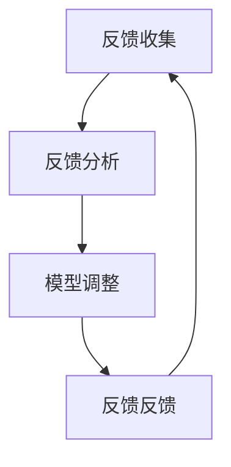

                 

### 文章标题

# 《建立快速反馈循环：持续优化LLM应用》

> 关键词：大型语言模型（LLM），快速反馈循环，模型优化，持续改进

> 摘要：本文探讨了如何通过建立快速反馈循环来持续优化大型语言模型（LLM）的应用。文章首先介绍了LLM的概念、发展历程和应用场景，然后详细阐述了快速反馈循环的概念及其重要性。接着，文章介绍了建立快速反馈循环的步骤和关键点，以及如何收集和分析反馈数据。在此基础上，文章讨论了如何根据反馈调整模型，并使用快速反馈循环来持续改进LLM应用。最后，通过实战案例和最佳实践，文章展示了如何在实际项目中应用快速反馈循环来优化LLM应用。

---

### 开篇

在人工智能快速发展的今天，大型语言模型（LLM）已经成为自然语言处理（NLP）领域的重要工具。LLM能够处理和理解复杂的自然语言文本，为问答系统、文本生成、对话系统等应用提供了强大的支持。然而，随着应用场景的多样化，如何优化LLM的性能和效果成为了一个关键问题。

《建立快速反馈循环：持续优化LLM应用》这本书旨在解决这一问题。本书通过系统性地介绍快速反馈循环的概念、建立方法以及在LLM应用中的具体应用，为读者提供了一种有效的方式来持续优化LLM的性能和效果。

本书的目标读者包括但不限于：
1. 自然语言处理工程师和研究人员，他们希望提高LLM应用的效果和性能。
2. AI产品经理和项目经理，他们希望了解如何通过快速反馈循环来优化产品和服务。
3. 对人工智能和NLP感兴趣的技术爱好者，他们希望通过本书了解LLM应用及其优化的方法。

本书的主要内容结构如下：

## 第一部分：基础概念与背景知识
- 第1章：LLM概述
- 第2章：快速反馈循环的概念

## 第二部分：快速反馈循环的建立方法
- 第3章：建立快速反馈循环的步骤
- 第4章：反馈数据的收集与分析

## 第三部分：优化LLM应用
- 第5章：根据反馈调整模型
- 第6章：持续改进LLM应用

## 第四部分：实战案例与最佳实践
- 第7章：实战案例分享
- 第8章：最佳实践与注意事项

通过本书的阅读，读者将能够理解快速反馈循环的概念和重要性，掌握建立快速反馈循环的步骤和方法，学会如何根据反馈数据调整模型，并在实际项目中应用这些方法来优化LLM应用。

### 第一部分：基础概念与背景知识

#### 第1章：LLM概述

#### 1.1 问题背景与描述

在人工智能的快速发展中，自然语言处理（NLP）已经成为一个重要领域。随着深度学习技术的应用，大型语言模型（LLM）在文本生成、问答系统、对话系统等应用中取得了显著的成果。然而，如何优化这些LLM应用，使其在复杂多样的场景中表现出更高的性能和效果，仍然是一个亟待解决的问题。

LLM是一种基于深度学习的语言模型，它通过学习大量的文本数据，能够对自然语言文本进行理解和生成。与传统的小型语言模型相比，LLM具有以下几个显著特点：

1. **数据量巨大**：LLM的训练数据量通常在数十亿到数万亿个单词之间，这使其能够捕捉到更广泛的语言规律和特征。
2. **模型参数众多**：LLM的参数数量通常在数十亿到数千亿之间，这使其能够处理更复杂的语言现象和任务。
3. **自适应能力强**：LLM通过不断的学习和优化，能够适应不同的应用场景和需求。

然而，LLM的高性能和效果也带来了挑战。首先，由于LLM的训练数据量巨大，训练时间非常长，这限制了其部署和应用的灵活性。其次，LLM的参数众多，使其对数据噪声和异常值非常敏感，这可能导致模型性能的下降。最后，LLM在处理某些特定任务时，可能存在偏差和误差，这需要通过持续的优化和调整来改善。

#### 1.2 LLM的概念与历史

**LLM的概念**

LLM（Large Language Model）是一种基于深度学习的自然语言处理模型，它通过对大规模文本数据的学习，能够对自然语言文本进行生成、理解、分类等任务。LLM的核心思想是通过捕捉大量的语言规律和特征，使其能够对未见过或罕见的现象进行准确的预测和生成。

LLM的基本结构通常包括以下几个部分：

1. **嵌入层（Embedding Layer）**：将输入的文本转换为向量表示，这一步是整个模型的基础。
2. **编码层（Encoder Layer）**：对输入的文本向量进行编码，提取文本的特征和语义信息。
3. **解码层（Decoder Layer）**：对编码后的文本特征进行解码，生成预测的文本序列。

**LLM的发展历程**

1. **早期模型**：最早的LLM之一是Word2Vec模型，它通过计算词的共现关系来学习词向量。然而，Word2Vec模型在处理长文本和复杂语义时存在局限性。
2. **递归神经网络（RNN）**：为了解决Word2Vec模型的局限性，递归神经网络（RNN）被引入到自然语言处理中。RNN能够处理序列数据，并能够捕捉长距离依赖关系，但RNN在训练过程中存在梯度消失和梯度爆炸的问题。
3. **长短期记忆网络（LSTM）**：为了克服RNN的缺点，长短期记忆网络（LSTM）被提出。LSTM通过引入记忆单元和门控机制，有效地解决了梯度消失和梯度爆炸的问题，并能够在处理长文本时保持良好的性能。
4. **Transformer模型**：Transformer模型的出现标志着自然语言处理领域的一个重要突破。与传统的RNN和LSTM不同，Transformer模型采用自注意力机制，通过全局关注的方式处理序列数据，这使得其能够捕捉到更复杂的语义关系。此外，Transformer模型的训练效率也得到了显著提高。
5. **GPT系列模型**：基于Transformer模型，OpenAI提出了GPT系列模型，包括GPT、GPT-2和GPT-3。这些模型通过不断增加模型参数和训练数据量，使其在多种NLP任务上取得了优异的性能。

**LLM的应用场景**

1. **问答系统**：LLM可以用于构建智能问答系统，通过理解用户的问题，并从大量的文本数据中检索出相关的答案。这种应用在搜索引擎、客户服务、教育等领域有着广泛的应用。
2. **文本生成**：LLM可以用于生成各种类型的文本，如文章、新闻、故事、诗歌等。这种应用在内容创作、广告宣传、自动摘要等领域有着重要的应用价值。
3. **对话系统**：LLM可以用于构建智能对话系统，通过与用户的对话，提供有用的信息和帮助。这种应用在客户服务、智能助手、虚拟客服等领域有着广泛的应用前景。

#### 1.3 LLM的应用场景

**文本生成**

文本生成是LLM应用的一个重要方向。通过学习大量的文本数据，LLM能够生成各种类型的文本，如文章、新闻、故事、诗歌等。以下是文本生成的一些具体应用场景：

1. **内容创作**：使用LLM可以自动生成各种类型的内容，如新闻文章、博客文章、产品描述等。这种应用可以大大提高内容创作效率，降低创作成本。
2. **自动摘要**：LLM可以用于生成文本摘要，通过对长文本进行理解和提取，生成简短的摘要。这种应用在信息检索、内容推荐等领域有着重要的应用价值。
3. **故事创作**：使用LLM可以自动生成故事、小说等文学作品。这种应用可以拓展文学创作的边界，为作家提供新的创作工具。

**问答系统**

问答系统是LLM应用的一个重要方向。通过理解用户的问题，并从大量的文本数据中检索出相关的答案，LLM可以构建智能问答系统。以下是问答系统的一些具体应用场景：

1. **搜索引擎**：LLM可以用于构建智能搜索引擎，通过对用户的问题进行理解和分析，返回最相关的搜索结果。这种应用可以大大提高搜索引擎的准确性和用户体验。
2. **客户服务**：使用LLM可以构建智能客服系统，通过与用户的对话，提供有用的信息和帮助。这种应用可以大大提高客户服务质量，降低人力成本。
3. **教育系统**：LLM可以用于构建智能教育系统，通过理解学生的问题，提供个性化的辅导和帮助。这种应用可以大大提高教学效果，满足个性化学习需求。

**对话系统**

对话系统是LLM应用的另一个重要方向。通过模拟人类的对话方式，LLM可以与用户进行自然、流畅的对话，提供有用的信息和帮助。以下是对话系统的一些具体应用场景：

1. **虚拟助手**：使用LLM可以构建虚拟助手，如智能语音助手、聊天机器人等，通过对话与用户互动，提供各种服务和支持。这种应用在智能家居、智能穿戴设备、智能汽车等领域有着广泛的应用前景。
2. **客户互动**：LLM可以用于构建智能客服系统，通过与用户的对话，提供个性化的服务和支持。这种应用可以大大提高客户满意度，提升品牌形象。
3. **社交互动**：LLM可以用于构建社交平台，如聊天室、论坛等，通过模拟人类的对话方式，提供互动和交流的机会。这种应用可以丰富用户的社交体验，提高平台的活跃度。

#### 1.4 快速反馈循环的重要性

快速反馈循环在LLM应用中具有至关重要的作用。它不仅能够帮助开发人员和研究人员快速发现和解决问题，还能够持续优化LLM的性能和效果。以下是快速反馈循环在LLM应用中的重要性和优势：

1. **提高开发效率**：通过快速反馈循环，开发人员可以在较短的时间内验证和优化LLM模型，从而加快开发进程，提高工作效率。
2. **提高模型性能**：快速反馈循环能够帮助开发人员及时发现和解决模型中的问题，从而提高模型的性能和效果。通过不断地迭代和优化，LLM能够更好地适应各种应用场景和需求。
3. **降低开发成本**：通过快速反馈循环，开发人员可以在早期阶段识别和解决问题，从而减少后续的开发和优化成本。
4. **提高用户体验**：快速反馈循环能够帮助开发人员快速响应用户反馈，根据用户的需求和反馈进行优化，从而提供更好的用户体验。
5. **持续改进**：快速反馈循环能够帮助开发人员持续改进LLM应用，使其在不断变化的应用场景中保持良好的性能和效果。

总之，快速反馈循环是LLM应用中不可或缺的一部分，它能够帮助开发人员和研究人员更好地理解和优化LLM模型，提高模型性能和用户体验，从而推动人工智能技术的发展和应用。

#### 第2章：快速反馈循环的概念

#### 2.1 快速反馈循环的定义

快速反馈循环（Rapid Feedback Loop）是一种通过快速收集、处理和响应反馈信息来持续改进系统的方法。在LLM应用中，快速反馈循环是一种通过实时收集用户反馈、快速分析和调整模型参数，从而持续优化模型性能和用户体验的机制。快速反馈循环的关键在于“快速”，即能够在短时间内收集到大量的反馈信息，并快速进行处理和响应。

快速反馈循环的基本概念可以概括为以下几个步骤：

1. **反馈收集**：从用户、测试数据或其他来源收集反馈信息。
2. **反馈分析**：对收集到的反馈信息进行分析和处理，提取关键指标和问题。
3. **模型调整**：根据分析结果，对模型进行相应的调整和优化。
4. **反馈反馈**：将调整后的模型重新部署，并继续收集新的反馈信息。

#### 2.2 快速反馈循环的结构

快速反馈循环的结构可以分为以下几个主要部分：

1. **反馈收集模块**：负责从用户、测试数据或其他来源收集反馈信息。这个模块通常包括数据采集工具、用户行为分析系统等。
2. **反馈分析模块**：负责对收集到的反馈信息进行分析和处理，提取关键指标和问题。这个模块通常包括数据分析工具、机器学习算法等。
3. **模型调整模块**：负责根据分析结果对模型进行相应的调整和优化。这个模块通常包括模型训练工具、优化算法等。
4. **反馈反馈模块**：负责将调整后的模型重新部署，并继续收集新的反馈信息。这个模块通常包括自动化部署工具、监控系统等。

快速反馈循环的结构如下图所示：



#### 2.3 快速反馈循环的核心要素

快速反馈循环的成功实施依赖于以下几个核心要素：

1. **反馈机制**：有效的反馈机制是快速反馈循环的基础。反馈机制应该能够快速、准确地收集到用户的真实反馈，包括正面反馈和负面反馈。
2. **数据分析**：数据分析是快速反馈循环的关键环节。通过数据分析，可以快速识别出模型中的问题，并为模型调整提供依据。
3. **模型调整**：模型调整是实现快速反馈循环的核心。通过快速调整模型，可以解决分析中发现的问题，从而提高模型的性能和效果。
4. **自动化部署**：自动化部署是快速反馈循环的保障。通过自动化部署，可以快速将调整后的模型部署到生产环境中，确保反馈的实时性和有效性。
5. **持续监控**：持续监控是快速反馈循环的持续保障。通过持续监控，可以实时了解模型在运行中的表现，及时发现和解决问题。

#### 第3章：建立快速反馈循环的步骤

建立快速反馈循环是一个系统性的过程，需要充分考虑各个步骤的执行顺序、关键点和难点。以下是建立快速反馈循环的详细步骤：

##### 3.1 明确目标与指标

明确目标是建立快速反馈循环的第一步。这一步骤的主要任务是确定反馈循环的目标和关键性能指标（KPI），以便后续的反馈收集和分析有据可依。

1. **确定目标**：根据LLM应用的场景和需求，明确快速反馈循环的具体目标。例如，提高问答系统的回答准确性、提高对话系统的用户体验等。
2. **定义指标**：根据目标，定义相应的关键性能指标（KPI）。例如，问答系统的回答准确性、对话系统的响应时间、用户满意度等。

##### 3.2 收集反馈数据

收集反馈数据是快速反馈循环的核心步骤。这一步骤的主要任务是设计合适的反馈收集机制，并确保反馈数据的真实性和有效性。

1. **设计反馈收集机制**：根据目标和指标，设计合适的反馈收集机制。例如，可以通过用户调研、A/B测试、日志分析等方式收集反馈数据。
2. **确保反馈数据质量**：确保收集到的反馈数据具有真实性和有效性。例如，可以通过数据清洗、去噪等技术手段提高数据质量。

##### 3.3 分析与解释反馈数据

分析与解释反馈数据是快速反馈循环的关键步骤。这一步骤的主要任务是通过对反馈数据的分析，提取关键问题和改进点。

1. **数据预处理**：对收集到的反馈数据进行预处理，包括数据清洗、去噪、归一化等。
2. **数据分析**：使用数据分析工具和算法，对预处理后的数据进行分析，提取关键问题和改进点。
3. **解释与分析结果**：对分析结果进行解释和总结，确定模型存在的问题和改进方向。

##### 3.4 制定调整计划

制定调整计划是快速反馈循环的重要步骤。这一步骤的主要任务是根据反馈数据和分析结果，制定具体的模型调整计划。

1. **识别问题**：根据反馈数据和分析结果，识别模型存在的问题。
2. **制定调整策略**：针对识别出的问题，制定相应的调整策略。例如，通过参数调整、模型重训练等方式优化模型。
3. **制定实施计划**：明确调整计划的具体实施步骤和时间表，确保调整计划能够按时、按质完成。

##### 3.5 实施调整与测试

实施调整与测试是快速反馈循环的关键步骤。这一步骤的主要任务是按照调整计划，对模型进行相应的调整和测试。

1. **模型调整**：根据调整计划，对模型进行参数调整或重新训练。
2. **测试与验证**：对调整后的模型进行测试和验证，确保调整后的模型能够达到预期的性能和效果。

##### 3.6 部署与监控

部署与监控是快速反馈循环的最后一个步骤。这一步骤的主要任务是调整后的模型部署到生产环境，并持续监控其性能和效果。

1. **模型部署**：将调整后的模型部署到生产环境，确保其能够正常工作。
2. **性能监控**：对部署后的模型进行持续监控，及时发现和解决问题。
3. **反馈循环**：根据监控数据，继续收集新的反馈信息，并重复快速反馈循环的各个步骤，实现持续优化。

### 第三部分：快速反馈循环的建立方法

#### 第4章：反馈数据的收集与分析

##### 4.1 反馈数据的类型

在建立快速反馈循环的过程中，收集和分析反馈数据是至关重要的步骤。这些数据可以帮助我们了解LLM应用的性能、用户满意度以及存在的问题。以下是几种常见的反馈数据类型：

1. **用户行为数据**：包括用户在使用LLM应用时的操作记录，如点击、浏览、输入等。这些数据可以通过前端日志、用户跟踪等技术手段进行收集。
2. **用户评价数据**：包括用户对LLM应用的评价，如评分、评论等。这些数据可以通过在线问卷、用户反馈表等方式进行收集。
3. **系统性能数据**：包括LLM应用在运行过程中的性能指标，如响应时间、错误率等。这些数据可以通过监控工具、日志分析等技术手段进行收集。
4. **错误报告数据**：包括用户在使用LLM应用时遇到的错误和异常报告。这些数据可以通过错误报告系统、日志分析等技术手段进行收集。

##### 4.2 数据收集的方法

为了有效收集反馈数据，我们需要采用多种方法和技术手段。以下是一些常用的数据收集方法：

1. **前端日志**：通过在前端页面中嵌入代码，记录用户在浏览和使用LLM应用时的操作行为。这种方法适用于收集用户行为数据和系统性能数据。
2. **用户调研**：通过在线问卷、电话访谈等方式，直接从用户那里获取他们的评价和反馈。这种方法适用于收集用户评价数据和用户满意度数据。
3. **监控工具**：使用专门的监控工具，如Prometheus、Grafana等，实时监控LLM应用的性能指标和错误报告。这种方法适用于收集系统性能数据和错误报告数据。
4. **错误报告系统**：集成第三方错误报告系统，如Sentry、Bugsnag等，自动捕获和报告用户在使用LLM应用时遇到的错误和异常。这种方法适用于收集错误报告数据。

##### 4.3 数据分析的工具

数据分析是快速反馈循环中的关键环节，通过有效的数据分析，我们可以从海量的反馈数据中提取有价值的信息，从而发现问题和改进点。以下是一些常用的数据分析工具：

1. **数据分析库**：如Python的Pandas库、NumPy库等，用于进行数据清洗、数据预处理和数据可视化。
2. **机器学习库**：如Python的Scikit-learn库、TensorFlow库等，用于进行数据分析和模型训练。
3. **数据可视化工具**：如Python的Matplotlib库、Seaborn库等，用于进行数据可视化。
4. **商业智能工具**：如Tableau、PowerBI等，用于进行复杂的数据分析和报表生成。

##### 4.4 反馈数据的可视化

反馈数据的可视化是将数据转化为直观图表和图形的过程，有助于我们更好地理解和分析反馈数据。以下是一些常用的反馈数据可视化方法：

1. **折线图**：用于展示数据的变化趋势，如用户行为数据的变化趋势。
2. **柱状图**：用于比较不同类别之间的数据差异，如不同用户评价的分布情况。
3. **饼图**：用于展示数据的占比情况，如不同错误类型的占比。
4. **散点图**：用于展示数据之间的相关性，如用户满意度与响应时间之间的关系。

以下是一个使用Matplotlib库绘制折线图的例子：

```python
import matplotlib.pyplot as plt

# 示例数据
x = [1, 2, 3, 4, 5]
y = [2, 4, 6, 8, 10]

plt.plot(x, y)
plt.xlabel('x-axis')
plt.ylabel('y-axis')
plt.title('Data Trend')
plt.show()
```

通过可视化反馈数据，我们可以更直观地了解LLM应用的性能和用户满意度，从而为模型调整和优化提供有力的支持。

### 第三部分：优化LLM应用

#### 第5章：根据反馈调整模型

##### 5.1 模型调整的原理

在快速反馈循环中，模型调整是一个关键步骤，它决定了LLM应用的性能和效果。模型调整的原理主要基于以下几个方面：

1. **反馈数据的分析**：通过收集和分析用户反馈数据，识别LLM应用中的问题，如回答准确性不高、响应速度较慢等。
2. **参数调整**：根据反馈数据，调整LLM模型的参数，如学习率、dropout率等，以优化模型的性能。
3. **重新训练**：在参数调整的基础上，重新训练LLM模型，使其适应新的数据和需求。
4. **交叉验证**：通过交叉验证，评估调整后的模型性能，确保其在不同的数据集上具有一致的稳定表现。

##### 5.2 调整策略与方法

在进行模型调整时，需要根据具体问题和应用场景选择合适的调整策略和方法。以下是一些常见的调整策略和方法：

1. **网格搜索**：通过遍历一组参数组合，寻找最优参数设置。这种方法适用于参数数量较少的情况，但在参数数量较多时，计算成本较高。
2. **随机搜索**：在参数空间中随机选择参数组合进行测试，以减少计算成本。这种方法适用于参数数量较多的情况，但可能无法找到最优参数。
3. **贝叶斯优化**：利用贝叶斯统计模型，根据已有的实验结果，预测下一个最佳参数组合。这种方法在找到最优参数的同时，还能提高实验效率。
4. **自动机器学习（AutoML）**：利用自动化技术，自动搜索最优参数组合和模型架构。这种方法适用于大规模模型调整，但可能对计算资源要求较高。

##### 5.3 模型优化的效果评估

模型调整后的效果评估是验证调整是否成功的关键步骤。以下是一些常用的效果评估方法：

1. **准确率（Accuracy）**：用于评估分类模型的性能，表示模型正确分类的样本占总样本的比例。
2. **召回率（Recall）**：用于评估分类模型对正类样本的识别能力，表示模型正确识别的正类样本占总正类样本的比例。
3. **F1分数（F1 Score）**：综合考虑准确率和召回率，用于评估分类模型的综合性能。
4. **平均绝对误差（MAE）**：用于评估回归模型的性能，表示预测值与真实值之间的平均绝对误差。
5. **均方误差（MSE）**：用于评估回归模型的性能，表示预测值与真实值之间的均方误差。

以下是一个使用Python和Scikit-learn库进行效果评估的例子：

```python
from sklearn.metrics import accuracy_score, recall_score, f1_score, mean_absolute_error, mean_squared_error

# 示例数据
y_true = [0, 1, 0, 1, 0]
y_pred = [0, 1, 1, 0, 0]

# 计算准确率
accuracy = accuracy_score(y_true, y_pred)
print("Accuracy:", accuracy)

# 计算召回率
recall = recall_score(y_true, y_pred)
print("Recall:", recall)

# 计算F1分数
f1 = f1_score(y_true, y_pred)
print("F1 Score:", f1)

# 计算平均绝对误差
mae = mean_absolute_error(y_true, y_pred)
print("MAE:", mae)

# 计算均方误差
mse = mean_squared_error(y_true, y_pred)
print("MSE:", mse)
```

通过效果评估，我们可以判断模型调整是否达到了预期目标，从而决定是否需要进一步优化。

### 第6章：持续改进LLM应用

##### 6.1 持续改进的过程

持续改进LLM应用是一个动态的过程，它需要不断地进行反馈、调整和优化。以下是持续改进LLM应用的一般步骤：

1. **反馈收集**：通过多种渠道收集用户的反馈信息，包括用户评价、错误报告等。
2. **问题识别**：对收集到的反馈信息进行分析，识别出LLM应用中的问题。
3. **优先级排序**：根据问题的严重程度和影响范围，对问题进行优先级排序。
4. **方案制定**：针对识别出的问题，制定具体的解决方案和调整计划。
5. **实施调整**：按照调整计划，对LLM模型和应用进行相应的调整。
6. **效果评估**：评估调整后的效果，确保问题得到有效解决。
7. **迭代优化**：根据评估结果，对调整方案进行优化和改进。

##### 6.2 持续改进的策略

持续改进LLM应用需要采用一系列策略，以确保改进过程的顺利进行和效果的持续提升。以下是几种常用的持续改进策略：

1. **迭代开发**：采用敏捷开发方法，通过短周期的迭代，快速开发、测试和部署新功能和改进点。
2. **用户参与**：鼓励用户参与改进过程，收集用户的反馈和建议，以提高改进的针对性和有效性。
3. **自动化测试**：建立自动化测试体系，对LLM应用进行持续测试，及时发现和解决潜在问题。
4. **数据驱动**：基于数据分析和用户反馈，制定改进策略和方案，确保改进过程具有数据支持和科学依据。
5. **持续学习**：鼓励团队不断学习新的技术和方法，以提高改进能力和创新能力。

##### 6.3 实现快速迭代

实现快速迭代是持续改进LLM应用的关键。以下是一些实现快速迭代的方法：

1. **简化流程**：优化开发和部署流程，减少冗余步骤和等待时间，以提高开发效率。
2. **自动化部署**：采用自动化部署工具，实现快速部署和回滚，降低人工干预和风险。
3. **版本控制**：使用版本控制系统，确保代码和数据的版本一致性，便于管理和维护。
4. **持续集成**：建立持续集成（CI）体系，实现代码的自动化测试和集成，确保新功能的稳定性和可靠性。
5. **敏捷管理**：采用敏捷管理方法，灵活调整计划和资源，以适应快速变化的需求和环境。

通过以上方法，可以实现LLM应用的快速迭代和持续改进，从而不断提高其性能和用户体验。

### 第四部分：实战案例与最佳实践

#### 第7章：实战案例分享

在本章节中，我们将通过三个具体的实战案例，详细探讨如何在实际项目中应用快速反馈循环来优化大型语言模型（LLM）的应用。

##### 7.1 案例一：问答系统的优化

问答系统是LLM应用的一个典型场景，它能够为用户提供高效、准确的回答。以下是一个实际案例，说明如何通过快速反馈循环来优化问答系统。

**问题描述**：
一个大型电商平台希望提升其问答系统的回答准确性，以提升用户满意度。

**解决方案**：
1. **反馈收集**：通过用户调研、错误报告系统等渠道，收集用户对问答系统回答准确性的反馈。
2. **数据分析**：对收集到的反馈进行分析，识别出回答不准确的主要原因，如某些领域的问题回答效果较差。
3. **模型调整**：针对识别出的问题，对LLM模型进行参数调整，如增加特定领域的训练数据，调整学习率等。
4. **效果评估**：通过A/B测试，评估调整后的问答系统的回答准确性，确保改进措施有效。

**实施效果**：
通过快速反馈循环，问答系统的回答准确性显著提升，用户满意度提高，平台用户活跃度增加。

##### 7.2 案例二：文本生成的优化

文本生成是LLM应用的另一个重要方向，如自动生成新闻文章、产品描述等。以下是一个实际案例，说明如何通过快速反馈循环来优化文本生成。

**问题描述**：
一个内容创作平台希望提升其文本生成的质量和多样性。

**解决方案**：
1. **反馈收集**：通过用户评价、错误报告等渠道，收集用户对文本生成的反馈。
2. **数据分析**：对收集到的反馈进行分析，识别出文本生成中的主要问题，如内容单调、不连贯等。
3. **模型调整**：对LLM模型进行重新训练，增加多样化的训练数据，调整模型参数，以提高生成文本的质量和多样性。
4. **效果评估**：通过用户评价和自动评估指标（如BLEU分数）评估调整后的文本生成效果。

**实施效果**：
调整后的文本生成系统在内容质量上有了显著提升，用户对生成文本的满意度提高，平台内容创作效率增加。

##### 7.3 案例三：对话系统的优化

对话系统在智能客服、虚拟助手等领域有广泛应用。以下是一个实际案例，说明如何通过快速反馈循环来优化对话系统。

**问题描述**：
一个智能客服系统在处理复杂用户问题时，回答的准确性和自然性有待提升。

**解决方案**：
1. **反馈收集**：通过用户调查、对话记录分析等渠道，收集用户对对话系统的反馈。
2. **数据分析**：对收集到的反馈进行分析，识别出对话系统存在的问题，如回答不准确、对话不自然等。
3. **模型调整**：对LLM对话模型进行参数调整，如增加复杂对话场景的训练数据，调整模型参数，以提高回答的准确性和自然性。
4. **效果评估**：通过用户满意度调查和自动评估指标（如ROUGE评分）评估调整后的对话系统。

**实施效果**：
通过快速反馈循环，对话系统的回答准确性和自然性得到了显著提升，用户满意度提高，智能客服系统的运营效率增加。

#### 第8章：最佳实践与注意事项

在LLM应用中，通过快速反馈循环进行持续优化是一项复杂的任务，需要遵循一系列最佳实践和注意事项。以下是一些总结和推荐：

##### 8.1 最佳实践总结

1. **明确目标和指标**：在建立快速反馈循环之初，明确具体的目标和指标，确保反馈数据的收集和分析有据可依。
2. **多渠道收集反馈**：通过多种渠道收集反馈数据，如用户调研、错误报告、系统日志等，以确保反馈数据的全面性和真实性。
3. **快速响应和调整**：在识别出问题和改进点后，尽快进行模型调整和优化，以确保反馈的实时性和有效性。
4. **自动化和工具化**：利用自动化工具和平台，实现反馈数据的收集、分析和模型调整的自动化，提高工作效率。
5. **持续监控和评估**：在模型调整后，持续监控其性能和效果，确保改进措施的有效性。

##### 8.2 注意事项

1. **数据隐私和安全**：在收集用户反馈时，确保遵守相关法律法规，保护用户隐私和数据安全。
2. **反馈质量**：确保收集到的反馈数据质量，避免噪音和误导性数据影响模型调整。
3. **平衡创新和稳定**：在追求模型性能和效果的同时，注意平衡创新和稳定性，避免过度优化导致模型过拟合。
4. **团队协作**：建立跨部门的协作机制，确保反馈收集、分析和调整的顺利进行。
5. **持续学习和优化**：鼓励团队不断学习和掌握新的技术和方法，持续优化快速反馈循环体系。

##### 8.3 拓展阅读

为了更好地理解和应用快速反馈循环，以下是一些推荐的拓展阅读资料：

1. **《深度学习》（Goodfellow, I., Bengio, Y., & Courville, A.）**：这本书详细介绍了深度学习的基本原理和应用，是理解LLM及其优化的基础。
2. **《自动机器学习：基础与前沿》（Bergstra, J., Bardenet, R., & Bengio, Y.）**：这本书探讨了自动机器学习（AutoML）的概念和技术，有助于实现快速反馈循环的自动化。
3. **《人工智能：一种现代方法》（Russell, S., & Norvig, P.）**：这本书系统地介绍了人工智能的基本概念和技术，包括自然语言处理和深度学习等。

通过阅读这些资料，读者可以更深入地了解快速反馈循环的原理和应用，并在实际工作中取得更好的效果。

### 结尾：快速反馈循环在LLM应用中的价值与未来展望

在本文中，我们详细探讨了如何通过建立快速反馈循环来持续优化大型语言模型（LLM）的应用。从LLM的概念、发展历程和应用场景入手，我们介绍了快速反馈循环的定义、结构和核心要素，并详细阐述了建立快速反馈循环的步骤和方法。接着，我们讨论了如何根据反馈数据调整模型，并在实际案例中展示了快速反馈循环的应用效果。

快速反馈循环在LLM应用中具有重要的价值。它不仅能够帮助开发人员和研究人员快速发现和解决问题，还能够持续优化LLM的性能和效果，提高用户体验。通过快速反馈循环，我们可以实现以下目标：

1. **提高模型性能**：通过实时收集和分析用户反馈，识别模型中的问题，并快速进行调整和优化，从而提高LLM的准确性和效果。
2. **提升用户体验**：快速反馈循环能够帮助开发人员根据用户需求进行优化，提供更符合用户期望的服务和功能。
3. **降低开发成本**：通过快速反馈循环，可以及时发现和解决问题，避免后期的大量返工和优化成本。
4. **增强持续改进能力**：快速反馈循环是一种持续改进的方法，它能够帮助团队不断优化模型和应用，保持技术领先和竞争优势。

展望未来，快速反馈循环在LLM应用中还有很大的发展空间。随着人工智能技术的不断进步，LLM的应用场景将更加广泛，对快速反馈循环的需求也将更加迫切。以下是一些建议和展望：

1. **自动化与智能化**：未来的快速反馈循环将更加自动化和智能化，通过引入更多先进技术和工具，实现更高效、更精准的反馈收集和分析。
2. **多模态反馈**：未来的快速反馈循环将不仅限于文本反馈，还将包括图像、音频等多模态反馈，从而更全面地了解用户需求。
3. **个性化反馈**：未来的快速反馈循环将更加注重个性化反馈，通过用户画像和个性化推荐，提供更符合用户需求的改进建议。
4. **边缘计算与分布式反馈**：随着边缘计算的兴起，未来的快速反馈循环将更多地考虑边缘设备和分布式反馈，实现更广泛的反馈收集和分析。
5. **持续创新**：快速反馈循环本身也将不断演进，随着新的技术和方法的出现，我们将有更多创新的手段和工具来优化LLM应用。

总之，快速反馈循环在LLM应用中具有重要的价值和广阔的发展前景。通过不断探索和实践，我们将能够更好地利用快速反馈循环，推动人工智能技术的发展和应用。

---

作者：AI天才研究院/AI Genius Institute & 禅与计算机程序设计艺术 /Zen And The Art of Computer Programming

