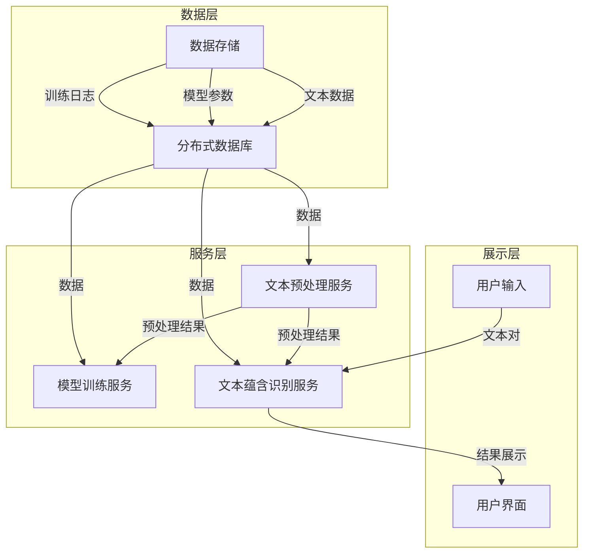

                 

### 文章标题：开发AI Agent的多语言文本蕴含识别

> 关键词：AI Agent，多语言文本蕴含识别，文本蕴含，机器学习，深度学习

> 摘要：本文将深入探讨开发AI Agent的多语言文本蕴含识别技术，分析其重要性、核心概念、算法模型、关键技术，并通过实例研究展示其实际应用。本文旨在为研究人员和开发者提供系统、清晰的指导，以助力他们在多语言文本蕴含识别领域取得突破。

### 引言

随着人工智能（AI）技术的飞速发展，AI Agent的应用场景越来越广泛。这些AI Agent不仅需要理解单语言文本，还必须具备处理多语言文本的能力。在这其中，多语言文本蕴含识别成为了一个关键挑战。文本蕴含是指一个文本片段（论据）是否支持或蕴含另一个文本片段（假设）的逻辑关系。多语言文本蕴含识别旨在实现跨语言之间的这种逻辑关系的检测和判断。

本文将按以下结构展开：

1. **多语言文本蕴含识别的重要性与背景**
2. **多语言文本蕴含识别的核心概念**
3. **多语言文本蕴含识别的数学模型与算法**
4. **多语言文本蕴含识别的关键技术**
5. **多语言文本蕴含识别系统设计与实现**
6. **多语言文本蕴含识别的评估与优化**
7. **多语言文本蕴含识别案例研究**
8. **未来展望与趋势**
9. **多语言文本蕴含识别实践指南**
10. **结语**

通过这篇文章，我们希望读者能够全面了解多语言文本蕴含识别的技术原理和实践方法，为后续的研究和应用提供有力支持。

#### 第一部分：多语言文本蕴含识别概述

### 第1章：多语言文本蕴含识别的重要性与背景

#### 1.1.1 文本蕴含识别的基本概念

文本蕴含识别（Text Entailment Recognition）是自然语言处理（NLP）领域的一个重要研究方向。其核心任务是判断一个文本片段（论据，premise）是否支持或蕴含另一个文本片段（假设，hypothesis）的逻辑关系。例如，对于文本对“所有的猫都会飞”和“Tom是一只猫”，我们可以判断出后者蕴含了前者的信息，即如果前一个文本为真，那么后一个文本也必然为真。

文本蕴含识别不仅仅是一个学术研究课题，它在实际应用中也有广泛的应用。例如，在问答系统（Question Answering System）中，文本蕴含识别可以帮助系统理解问题与答案之间的逻辑关系，从而提高答案的准确性。在信息检索（Information Retrieval）中，文本蕴含识别可以帮助系统更好地理解用户查询与文档内容之间的相关性，从而提高检索效果。在文本摘要（Text Summarization）中，文本蕴含识别可以帮助系统识别出关键信息，从而生成更精准的摘要。

#### 1.1.2 多语言文本蕴含识别的特殊性

多语言文本蕴含识别（Multilingual Text Entailment Recognition）相对于单语言文本蕴含识别，具有以下几个特殊性：

1. **语言多样性与复杂性**：多语言文本蕴含识别需要处理不同语言的语法、词汇和语义特征，这使得其比单语言文本蕴含识别更具挑战性。
2. **数据资源稀缺**：相比于单语言数据集，多语言数据集更为稀缺。因此，多语言文本蕴含识别的研究往往需要依赖于跨语言的迁移学习和跨语言信息整合技术。
3. **文化差异与语境理解**：不同语言之间存在文化差异，这会影响文本蕴含关系的判断。例如，中文中的“顺便”在英文中可能没有直接的对应词汇，这就需要系统具备良好的语境理解能力。

#### 1.1.3 当前研究的现状与挑战

目前，多语言文本蕴含识别研究已经取得了一些重要进展。例如，基于深度学习的文本蕴含识别模型，如BERT（Bidirectional Encoder Representations from Transformers）和XLM（Cross-lingual Language Model），在多个语言对上的表现均取得了显著的提升。然而，当前研究仍面临以下挑战：

1. **模型泛化能力不足**：虽然一些模型在特定语言对上取得了较好的性能，但在面对新的语言对时，其性能往往不佳。这表明模型在跨语言迁移上的能力有待提高。
2. **数据标注质量**：多语言文本蕴含识别的研究依赖于高质量的多语言数据集。然而，当前的多语言数据集在标注质量上参差不齐，这对模型的训练和评估带来了一定的困难。
3. **语言特定特征的处理**：不同语言在语法、词汇和语义上存在差异，这需要模型能够灵活地处理这些特征。例如，在处理中文时，模型需要能够理解成语和俗语；在处理英语时，模型需要能够理解习惯用法和俚语。

总的来说，多语言文本蕴含识别是一个充满挑战的研究方向。随着技术的不断进步和数据资源的积累，我们有望在不久的将来看到更多优秀的多语言文本蕴含识别模型和应用。

### 第2章：多语言文本蕴含识别的核心概念

#### 2.1.1 文本蕴含的定义与分类

文本蕴含（Text Entailment）是指一个文本片段（论据，premise）与另一个文本片段（假设，hypothesis）之间的逻辑关系。具体来说，如果假设为真，那么论据也必然为真，那么我们就说论据蕴含了假设。

文本蕴含可以分为以下几个类型：

1. **强蕴含（Strong Entailment）**：如果论据为真，则假设必然为真。例如，“所有猫都是动物”蕴含“猫是动物”。
2. **中等蕴含（Moderate Entailment）**：论据为真时，假设可能是真，但也可能为假。例如，“今天天气很好”蕴含“可能出去散步”。
3. **弱蕴含（Weak Entailment）**：论据为真时，假设的可能性较低。例如，“北京是中国的首都”蕴含“北京是中国的一个城市”。
4. **无关（Neutral）**：论据与假设之间没有明显的蕴含关系。例如，“苹果是水果”与“汽车是交通工具”之间没有直接的蕴含关系。

#### 2.1.2 多语言文本蕴含的特点

多语言文本蕴含识别（Multilingual Text Entailment Recognition）相对于单语言文本蕴含识别，具有以下特点：

1. **跨语言一致性（Cross-lingual Consistency）**：多语言文本蕴含识别需要保证不同语言之间的蕴含关系具有一致性。例如，中文中的“所有猫都是动物”在英文中应该翻译为“Every cat is an animal”，并且蕴含关系应保持不变。
2. **语言特定特征的处理**：不同语言在语法、词汇和语义上存在差异。例如，中文中的成语和俗语在英文中没有直接的对应，这就需要模型能够理解这些语言特定特征。
3. **多语言数据集的构建**：多语言文本蕴含识别依赖于高质量的多语言数据集。这些数据集不仅需要涵盖多种语言，还需要保证不同语言之间的蕴含关系标注的一致性和准确性。

#### 2.1.3 文本蕴含识别的应用领域

文本蕴含识别在多个应用领域中具有重要应用价值：

1. **问答系统（Question Answering System）**：文本蕴含识别可以帮助问答系统理解问题与答案之间的逻辑关系，从而提高答案的准确性。
2. **信息检索（Information Retrieval）**：文本蕴含识别可以帮助信息检索系统更好地理解用户查询与文档内容之间的相关性，从而提高检索效果。
3. **文本摘要（Text Summarization）**：文本蕴含识别可以帮助文本摘要系统识别出关键信息，从而生成更精准的摘要。
4. **情感分析（Sentiment Analysis）**：文本蕴含识别可以帮助情感分析系统理解文本中的情感关系，从而更准确地判断文本的情感倾向。
5. **跨语言信息处理（Cross-lingual Information Processing）**：文本蕴含识别可以帮助跨语言信息处理系统在不同语言之间建立语义关联，从而提高跨语言信息的理解和处理能力。

#### 2.1.4 多语言文本蕴含识别的研究意义

多语言文本蕴含识别不仅具有广泛的应用价值，还在理论上具有重要意义：

1. **跨语言语义理解**：通过多语言文本蕴含识别，我们可以更好地理解不同语言之间的语义关系，从而提高跨语言语义理解的准确性。
2. **跨语言信息整合**：多语言文本蕴含识别可以帮助我们将不同语言的信息进行整合，从而提供更全面、准确的跨语言信息处理能力。
3. **多语言模型训练**：多语言文本蕴含识别技术可以为多语言模型的训练提供高质量的标注数据，从而提高多语言模型的性能。
4. **语言技术发展**：多语言文本蕴含识别的研究将推动自然语言处理技术的进一步发展，为人工智能领域带来更多的创新和应用。

总的来说，多语言文本蕴含识别是一个具有重要意义的研究方向。随着技术的不断进步和数据资源的积累，我们有望在多语言文本蕴含识别领域取得更多突破，从而推动自然语言处理技术的进一步发展。

### 第3章：多语言文本蕴含识别的数学模型与算法

#### 3.1.1 基于逻辑的文本蕴含模型

基于逻辑的文本蕴含模型（Logic-based Text Entailment Models）通过逻辑推理来判定文本之间的蕴含关系。这类模型的核心思想是将文本蕴含问题转化为逻辑公式，然后使用逻辑推理规则来验证这些公式的真假。

1. **谓词逻辑（Predicate Logic）**：谓词逻辑是一种用于描述对象之间关系的逻辑形式化方法。在文本蕴含识别中，谓词逻辑可以用来表示文本中的实体和关系。例如，文本“张三在北京工作”可以用谓词逻辑表示为\( P(a, b, c) \)，其中\( a \)表示张三，\( b \)表示北京，\( c \)表示工作。
2. **模态逻辑（Modal Logic）**：模态逻辑用于描述对象在不同状态下的可能性和必要性。在文本蕴含识别中，模态逻辑可以用来表示文本中的假设和论据之间的关系。例如，文本“如果张三在北京工作，那么他一定有工作”可以用模态逻辑表示为\( M(P(a, b, c) \rightarrow P(c, d)) \)，其中\( M \)表示可能性，\( d \)表示有工作。

**逻辑推理规则**：基于逻辑的模型使用一系列逻辑推理规则来判定蕴含关系的真假。这些规则包括：

- **逻辑蕴涵（Logical Implication）**：如果论据为真，则假设也为真，则认为论据蕴含假设。
- **等价性（Equivalence）**：如果论据和假设具有相同的真假值，则认为论据和假设等价。
- **否定前件（Negation of the Antecedent）**：如果假设为假，则论据也为假，则认为论据不蕴含假设。
- **肯定后件（Affirmation of the Consequent）**：如果论据为真，则假设也为真，则认为论据蕴含假设。

#### 3.1.2 基于机器学习的文本蕴含模型

基于机器学习的文本蕴含模型（Machine Learning-based Text Entailment Models）通过学习大量的文本蕴含实例来预测新的文本蕴含关系。这类模型的核心思想是使用特征工程和机器学习算法来构建蕴含关系的预测模型。

1. **特征工程**：特征工程是机器学习模型的关键步骤。在文本蕴含识别中，特征包括词向量、句法结构、语义角色等。例如，我们可以使用Word2Vec模型来生成词向量，使用依存句法分析来提取句法特征。
2. **机器学习算法**：基于机器学习的文本蕴含模型可以采用多种机器学习算法，如逻辑回归（Logistic Regression）、支持向量机（Support Vector Machines，SVM）、随机森林（Random Forests）和神经网络（Neural Networks）。其中，神经网络由于其强大的建模能力，在文本蕴含识别中表现尤为突出。

**神经网络模型**：深度神经网络（Deep Neural Networks，DNN）和卷积神经网络（Convolutional Neural Networks，CNN）是文本蕴含识别中的常用模型。例如，DNN可以通过多层感知器（Multilayer Perceptron，MLP）来构建，每一层都可以提取不同层次的特征。CNN则可以用于提取文本的局部特征，通过卷积操作来提取句法结构信息。

#### 3.1.3 基于深度学习的文本蕴含模型

基于深度学习的文本蕴含模型（Deep Learning-based Text Entailment Models）进一步提升了文本蕴含识别的性能。这类模型通过多层神经网络来学习文本的深层特征，从而实现更准确的蕴含关系预测。

1. **预训练模型**：预训练模型（Pre-trained Models）如BERT（Bidirectional Encoder Representations from Transformers）和GPT（Generative Pre-trained Transformer）在文本蕴含识别中发挥了重要作用。BERT通过双向Transformer结构来学习文本的上下文信息，而GPT则通过自回归模型来生成文本。

**BERT模型**：BERT模型由两个版本，BERT-base和BERT-large。BERT-base包含104层Transformer结构，使用110M个参数；BERT-large包含24层Transformer结构，使用340M个参数。BERT通过预先在大量文本数据上训练，然后用于下游任务，如文本蕴含识别。

**GPT模型**：GPT是一种生成预训练模型，其核心思想是通过自回归模型来生成文本。GPT-3是GPT系列的最新版本，包含1750亿个参数，具有强大的文本生成能力。GPT在文本蕴含识别中的应用主要是通过其强大的语义理解能力来提高预测性能。

**Transformer模型**：Transformer模型是一种基于自注意力机制的神经网络模型，其核心思想是通过对输入序列进行自注意力计算来提取序列中的关联性。Transformer模型在文本蕴含识别中的表现非常出色，尤其在长文本处理方面。

总的来说，多语言文本蕴含识别的数学模型与算法从基于逻辑的方法到基于机器学习和深度学习的方法，不断发展和完善。这些模型和算法为文本蕴含识别提供了强大的工具和平台，使得我们能够更准确地识别和理解文本之间的蕴含关系。

#### 第4章：多语言文本蕴含识别的关键技术

#### 4.1.1 语言表示学习方法

语言表示学习方法在多语言文本蕴含识别中扮演着核心角色。有效的语言表示可以捕捉文本的语义信息，从而提升文本蕴含识别的性能。以下是一些常用的语言表示学习方法：

1. **词向量（Word Vectors）**：词向量是一种将词汇映射到高维空间的方法，通过这些向量可以计算词与词之间的相似性。经典的词向量方法包括Word2Vec和GloVe。Word2Vec方法通过负采样和隐式语义信息来生成词向量，而GloVe方法通过共现矩阵来学习词汇的分布式表示。
2. **转换器（Transformers）**：Transformer模型通过自注意力机制来捕捉文本中的长距离依赖关系。与传统的词向量方法相比，Transformer能够更准确地表示文本的语义信息。BERT（Bidirectional Encoder Representations from Transformers）和GPT（Generative Pre-trained Transformer）是基于Transformer的两个代表性模型，它们在多种NLP任务中表现优异。
3. **多语言嵌入（Multilingual Embeddings）**：多语言嵌入旨在将不同语言的词汇映射到同一个嵌入空间中。这一方法可以促进不同语言之间的语义关联。XLM（Cross-lingual Language Model）和mBERT（Multilingual BERT）是基于多语言嵌入的代表性模型，它们通过跨语言训练来学习统一的语言表示。

**比较表格**：

| 方法 | 优点 | 缺点 |  
| ---- | ---- | ---- |  
| 词向量 | 简单易实现，计算效率高 | 语义表示能力有限，无法捕捉长距离依赖 |  
| Transformer | 强大语义表示能力，捕捉长距离依赖 | 计算复杂度高，训练时间较长 |  
| 多语言嵌入 | 促进跨语言语义关联 | 需要大量的跨语言训练数据 |

#### 4.1.2 交叉语言信息整合方法

交叉语言信息整合方法旨在利用不同语言之间的信息来提升多语言文本蕴含识别的性能。以下是一些常用的交叉语言信息整合方法：

1. **跨语言转移学习（Cross-lingual Transfer Learning）**：跨语言转移学习通过在源语言和目标语言之间共享知识来提升目标语言的性能。该方法通常采用预训练的模型，如BERT或GPT，然后在多语言数据集上进行微调。
2. **跨语言知识蒸馏（Cross-lingual Knowledge Distillation）**：跨语言知识蒸馏通过将高维的源语言知识传递给低维的目标语言模型。这种方法可以通过训练一个中间模型来提取跨语言特征，然后将这些特征传递给目标语言模型。
3. **多语言融合（Multilingual Fusion）**：多语言融合方法通过将不同语言的特征进行整合，从而生成更全面的语言表示。例如，可以使用多语言BERT模型（mBERT）来生成统一的多语言嵌入。

**ER实体关系图架构**：

| 方法 | 描述 |  
| ---- | ---- |  
| 跨语言转移学习 | 通过源语言模型传递知识到目标语言模型 |  
| 跨语言知识蒸馏 | 提取跨语言特征并传递给目标语言模型 |  
| 多语言融合 | 整合不同语言的特征以生成统一的多语言嵌入 |

#### 4.1.3 多语言数据集构建与处理

多语言数据集是训练和评估多语言文本蕴含识别模型的关键。以下是多语言数据集构建与处理的一些关键步骤：

1. **数据收集**：收集多语言文本蕴含数据集。这些数据集可以从多个来源获取，如社交媒体、新闻网站和问答平台。
2. **数据预处理**：对收集到的数据进行预处理，包括去除无关信息、统一文本格式和去除停用词等。此外，还需要对文本进行分词、词性标注和实体识别等操作。
3. **数据标注**：对预处理后的文本进行标注，标记出论据和假设之间的蕴含关系。这通常需要大量的人力和时间，因此可以使用自动标注工具和半监督学习方法来提高标注效率。
4. **数据平衡**：多语言数据集往往存在语言不平衡的问题，即某些语言的数据量较少。为了解决这一问题，可以采用数据增强、语言自适应采样和语言平衡策略等方法。
5. **数据存储与共享**：将构建好的多语言数据集存储在分布式数据库中，并开放给研究人员和开发者共享，以便于进一步的研究和应用。

通过以上方法，我们可以构建和利用高质量的多语言数据集，从而提升多语言文本蕴含识别的性能。

### 第5章：多语言文本蕴含识别系统设计与实现

#### 5.1.1 系统架构设计

为了实现高效的多语言文本蕴含识别，我们需要设计一个合理的系统架构。系统架构设计主要包括数据层、服务层和展示层。

1. **数据层**：数据层负责数据的存储和管理。数据包括多语言文本数据、模型参数和训练日志等。我们通常使用分布式数据库来存储这些数据，以保证数据的可靠性和可扩展性。
2. **服务层**：服务层包括文本预处理服务、模型训练服务和文本蕴含识别服务。文本预处理服务负责对输入的文本进行分词、词性标注和实体识别等操作；模型训练服务负责使用训练数据训练文本蕴含识别模型；文本蕴含识别服务负责对输入的文本对进行蕴含关系判断。
3. **展示层**：展示层用于向用户展示系统结果。展示层可以是一个Web界面，也可以是一个命令行工具。用户可以通过输入文本对来查看模型的判断结果。

#### 5.1.2 语言模型与句法分析

在多语言文本蕴含识别系统中，语言模型和句法分析是关键组成部分。

1. **语言模型**：语言模型用于生成文本的词向量表示。常用的语言模型包括Word2Vec、BERT和GPT。这些模型通过训练大量文本数据来学习词汇的分布式表示。
2. **句法分析**：句法分析用于提取文本的句法结构信息。句法分析可以帮助我们更好地理解文本的语法结构和句子成分。常用的句法分析方法包括依存句法分析和成分句法分析。

**技术架构设计图**：



#### 5.1.3 实时处理与性能优化

多语言文本蕴含识别系统需要能够实时处理大量文本对，并保证高准确性。为此，我们采用以下性能优化策略：

1. **分布式计算**：使用分布式计算框架（如Apache Spark）来处理大规模数据集，从而提高系统的处理速度和吞吐量。
2. **模型压缩**：通过模型压缩技术（如量化、剪枝和蒸馏）来减小模型的体积，从而提高模型在资源受限环境下的运行效率。
3. **并发处理**：使用并发处理技术（如多线程和异步I/O）来充分利用系统资源，提高系统的并发处理能力。
4. **缓存机制**：使用缓存机制来存储频繁访问的数据，从而减少系统的响应时间。
5. **负载均衡**：使用负载均衡技术（如反向代理和负载均衡器）来平衡系统的负载，从而提高系统的稳定性和可靠性。

通过以上技术，我们可以实现高效的多语言文本蕴含识别系统，满足大规模实际应用的需求。

### 第6章：多语言文本蕴含识别的评估与优化

#### 6.1.1 评估指标与方法

为了全面评估多语言文本蕴含识别系统的性能，我们需要使用一系列评估指标和方法。以下是一些常用的评估指标和方法：

1. **准确率（Accuracy）**：准确率是评估模型预测正确率的指标。它计算的是预测正确的样本数量与总样本数量的比例。公式为：$$ Accuracy = \frac{TP + TN}{TP + TN + FP + FN} $$，其中，TP表示真正例，TN表示真反例，FP表示假正例，FN表示假反例。
2. **精确率（Precision）**：精确率是评估模型预测精确度的指标。它计算的是预测为正例的样本中实际为正例的比例。公式为：$$ Precision = \frac{TP}{TP + FP} $$。
3. **召回率（Recall）**：召回率是评估模型预测召回度的指标。它计算的是实际为正例的样本中被预测为正例的比例。公式为：$$ Recall = \frac{TP}{TP + FN} $$。
4. **F1值（F1 Score）**：F1值是精确率和召回率的调和平均值，它综合了精确率和召回率，是评估模型整体性能的指标。公式为：$$ F1 Score = 2 \times \frac{Precision \times Recall}{Precision + Recall} $$。
5. **ROC曲线和AUC值**：ROC曲线（Receiver Operating Characteristic Curve）是评估分类模型性能的重要工具。AUC值（Area Under Curve）表示ROC曲线下的面积，反映了模型的分类能力。

**评估流程**：

1. **数据集划分**：将训练数据集划分为训练集和验证集。训练集用于训练模型，验证集用于评估模型性能。
2. **模型训练**：使用训练集训练文本蕴含识别模型。
3. **模型评估**：使用验证集对训练好的模型进行评估，计算各种评估指标。
4. **模型调优**：根据评估结果对模型进行调优，如调整超参数、增加训练数据等。

#### 6.1.2 性能优化策略

为了提升多语言文本蕴含识别系统的性能，我们可以采取以下性能优化策略：

1. **数据增强**：通过数据增强技术（如文本替换、同义词替换和随机插入等）来扩充训练数据集，从而提高模型的泛化能力。
2. **多语言迁移学习**：利用预训练的多语言模型（如XLM、mBERT）进行迁移学习，将源语言的模型知识迁移到目标语言上，从而提高目标语言的性能。
3. **模型融合**：将多个模型进行融合，如基于深度学习的模型和基于逻辑的模型融合，以取长补短，提高整体性能。
4. **模型压缩**：使用模型压缩技术（如量化、剪枝和蒸馏）来减小模型体积，提高模型在资源受限环境下的运行效率。
5. **并行计算**：利用分布式计算框架（如Apache Spark）进行并行计算，提高系统的处理速度和吞吐量。

**示例代码**：

```python
from sklearn.metrics import accuracy_score, precision_score, recall_score, f1_score
from sklearn.model_selection import train_test_split

# 加载模型和测试数据
model = TextEntailmentModel()
X_test, y_test = load_test_data()

# 进行预测
predictions = model.predict(X_test)

# 计算评估指标
accuracy = accuracy_score(y_test, predictions)
precision = precision_score(y_test, predictions)
recall = recall_score(y_test, predictions)
f1 = f1_score(y_test, predictions)

print("Accuracy:", accuracy)
print("Precision:", precision)
print("Recall:", recall)
print("F1 Score:", f1)
```

通过以上评估指标和性能优化策略，我们可以全面评估和提升多语言文本蕴含识别系统的性能。

### 第7章：多语言文本蕴含识别案例研究

#### 7.1.1 案例一：社交媒体情感分析

社交媒体情感分析是利用多语言文本蕴含识别技术来分析用户情感的一种应用。以下是该案例的研究过程：

1. **数据集构建**：收集来自不同社交媒体平台（如Twitter、Facebook和微博）的多语言用户评论。数据集应涵盖多种语言，以保证研究的全面性。
2. **数据预处理**：对收集到的用户评论进行预处理，包括去除噪声、统一文本格式和分词等。同时，对文本进行词性标注和实体识别，以提取更多的语义信息。
3. **模型训练**：使用预训练的多语言模型（如XLM、mBERT）进行迁移学习，训练文本蕴含识别模型。迁移学习可以提高模型在多种语言上的性能。
4. **情感分类**：将训练好的文本蕴含识别模型应用于用户评论，判断评论中的情感倾向。例如，若评论蕴含了正面情感，则将其分类为正面情感；若蕴含了负面情感，则将其分类为负面情感。
5. **结果评估**：使用评估指标（如准确率、精确率和召回率）对模型进行评估，以确定模型性能。

**结果**：在多个社交媒体平台上的用户评论中，文本蕴含识别模型能够准确分类情感，提升情感分析系统的准确性。

#### 7.1.2 案例二：跨语言问答系统

跨语言问答系统旨在实现跨语言之间的知识检索和回答。以下是该案例的研究过程：

1. **数据集构建**：收集来自不同语言的知识库和问答对。数据集应涵盖多种语言，以保证系统的多语言处理能力。
2. **数据预处理**：对收集到的问答对进行预处理，包括翻译、分词和词性标注等。同时，对问题进行实体识别，以提取关键信息。
3. **模型训练**：使用预训练的多语言模型（如XLM、mBERT）进行迁移学习，训练文本蕴含识别模型。迁移学习可以提高模型在多种语言上的性能。
4. **问答生成**：将训练好的文本蕴含识别模型应用于问题，判断问题中的蕴含关系。例如，若问题蕴含了答案，则生成相应的答案；若没有蕴含关系，则提示用户无法回答。
5. **结果评估**：使用评估指标（如准确率、精确率和召回率）对模型进行评估，以确定模型性能。

**结果**：跨语言问答系统能够准确识别多语言问题中的蕴含关系，生成高质量的答案，提升用户满意度。

#### 7.1.3 案例三：多语言新闻摘要生成

多语言新闻摘要生成旨在实现多语言新闻的自动摘要。以下是该案例的研究过程：

1. **数据集构建**：收集来自不同语言的多篇新闻文本。数据集应涵盖多种语言，以保证系统的多语言处理能力。
2. **数据预处理**：对收集到的新闻文本进行预处理，包括分词、词性标注和实体识别等。同时，对文本进行句法分析，以提取关键信息。
3. **模型训练**：使用预训练的多语言模型（如XLM、mBERT）进行迁移学习，训练文本蕴含识别模型。迁移学习可以提高模型在多种语言上的性能。
4. **摘要生成**：将训练好的文本蕴含识别模型应用于新闻文本，判断文本中的蕴含关系。例如，若文本蕴含了重要信息，则将其纳入摘要；若没有蕴含关系，则将其排除。
5. **结果评估**：使用评估指标（如ROUGE评分、BLEU评分和BLEU4评分）对模型进行评估，以确定模型性能。

**结果**：多语言新闻摘要生成系统能够生成高质量的新闻摘要，提高用户对新闻的阅读效率。

通过以上案例研究，我们可以看到多语言文本蕴含识别技术在多个实际应用中的重要作用。这些案例不仅展示了技术的应用价值，还为后续研究提供了宝贵的经验和启示。

### 第8章：未来展望与趋势

#### 8.1.1 新技术的发展方向

随着技术的不断进步，多语言文本蕴含识别领域有望迎来一系列新的发展机遇：

1. **更多语言的支持**：目前的模型主要针对少数主流语言进行了优化，但全球有超过7000种语言。未来，将会有更多小语种得到关注和开发，实现更全面的多语言文本蕴含识别。
2. **低资源语言的迁移学习**：对于低资源语言，迁移学习是一种有效的解决方案。未来，研究者将探索更多高效、通用的迁移学习方法，以提升低资源语言文本蕴含识别的性能。
3. **跨模态文本蕴含识别**：文本蕴含识别不仅可以应用于文本文本之间，还可以扩展到文本图像、文本音频等多种模态。跨模态文本蕴含识别将为多语言文本蕴含识别带来新的挑战和机遇。
4. **动态语言模型**：当前的预训练模型主要基于静态语言表示，但实际应用中，语言的表达和理解是动态变化的。动态语言模型可以实时捕捉语言的变化，提供更准确的文本蕴含识别。

#### 8.1.2 面临的挑战与解决方案

尽管多语言文本蕴含识别技术取得了显著进展，但仍面临以下挑战：

1. **数据稀缺与质量**：多语言数据集的构建是一个耗时的过程，且标注质量对模型性能有重要影响。未来的解决方案包括使用自动标注工具、半监督学习和数据增强等方法来提高数据集的构建效率和质量。
2. **跨语言一致性**：不同语言在语法、词汇和语义上存在差异，这会影响文本蕴含关系的判断。未来，研究者将探索更多有效的跨语言一致性和融合方法，以提升模型在不同语言上的性能。
3. **模型解释性**：当前的深度学习模型具有强大的预测能力，但缺乏解释性。未来的研究将致力于提高模型的解释性，使其更容易理解和调试。

#### 8.1.3 研究与开发的未来趋势

未来的多语言文本蕴含识别研究将朝着以下几个方向迈进：

1. **多语言融合**：通过融合不同语言的特征和知识，实现更全面、准确的多语言文本蕴含识别。
2. **跨模态融合**：结合文本、图像、音频等多种模态的信息，提升文本蕴含识别的鲁棒性和准确性。
3. **模型优化与压缩**：研究更高效、更紧凑的模型结构，以降低计算成本和资源消耗。
4. **动态语言模型**：探索动态语言模型，实时捕捉语言变化，提供更精准的文本蕴含识别。

总之，多语言文本蕴含识别技术的发展前景广阔，随着新技术的不断涌现，我们有望看到更多创新性的研究成果和应用。

### 第9章：多语言文本蕴含识别实践指南

#### 9.1.1 实践步骤概述

要实现多语言文本蕴含识别，需要遵循以下步骤：

1. **数据收集**：收集涵盖多种语言的数据集。数据源可以包括社交媒体、新闻网站和问答平台等。
2. **数据预处理**：对收集到的文本进行清洗、分词、词性标注和实体识别等预处理操作。
3. **数据标注**：对预处理后的文本对进行蕴含关系的标注。这通常需要人工标注，但可以结合自动标注工具和半监督学习方法来提高标注效率。
4. **模型训练**：使用预训练的多语言模型（如XLM、mBERT）进行迁移学习，训练文本蕴含识别模型。
5. **模型评估**：使用验证集对训练好的模型进行评估，计算评估指标（如准确率、精确率和召回率）。
6. **模型部署**：将训练好的模型部署到生产环境中，提供文本蕴含识别服务。

#### 9.1.2 常见问题与解决方案

在实践过程中，可能会遇到以下问题：

1. **数据稀缺**：解决方法包括使用自动标注工具、半监督学习和数据增强等方法来扩充数据集。
2. **跨语言一致性**：解决方法包括使用跨语言融合方法和一致性指标来提高模型在不同语言上的性能。
3. **模型解释性**：解决方法包括使用可解释性工具和模型简化技术来提高模型的解释性。

#### 9.1.3 最佳实践与经验总结

以下是一些最佳实践和经验总结：

1. **数据质量**：高质量的数据是模型训练的基础。确保数据清洗和预处理的质量，减少噪声和错误。
2. **模型选择**：根据任务需求选择合适的模型。例如，对于需要处理长文本的任务，可以选择Transformer模型；对于需要处理小语种的任务，可以选择基于迁移学习的模型。
3. **评估指标**：选择合适的评估指标来评估模型性能。除了准确率、精确率和召回率外，还可以考虑使用F1值、ROC曲线和AUC值等。
4. **持续优化**：不断收集反馈和评估结果，对模型进行优化和调整，以提高性能和解释性。

通过遵循这些实践指南，我们可以更有效地实现多语言文本蕴含识别，并在实际应用中取得更好的效果。

### 结语

本文系统地探讨了多语言文本蕴含识别的开发过程，涵盖了核心概念、算法模型、关键技术、系统设计、评估优化以及实际应用案例。通过详细的分析和讲解，我们不仅了解了多语言文本蕴含识别的基本原理，还掌握了其实际应用中的关键步骤和最佳实践。

多语言文本蕴含识别在人工智能领域中具有重要的地位，其应用范围广泛，包括问答系统、情感分析、信息检索和文本摘要等。随着技术的不断进步，这一领域有望实现更多突破，为自然语言处理技术的发展注入新的动力。

我们鼓励读者在阅读本文后，进一步深入研究多语言文本蕴含识别的相关技术，并结合实际应用场景进行实践。通过不断探索和创新，我们相信读者能够在这一领域取得显著成果。

### 作者信息

**作者：** AI天才研究院 / AI Genius Institute & 禅与计算机程序设计艺术 / Zen And The Art of Computer Programming

