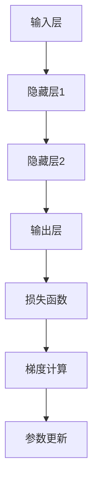
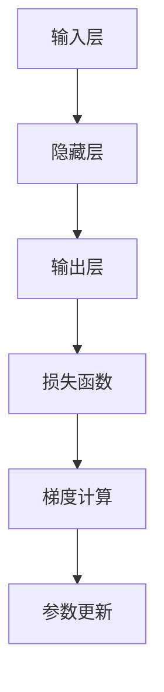
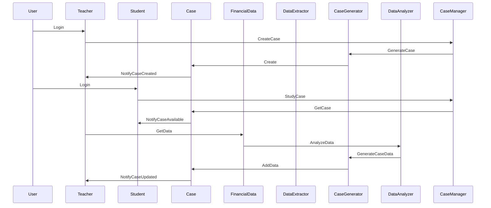
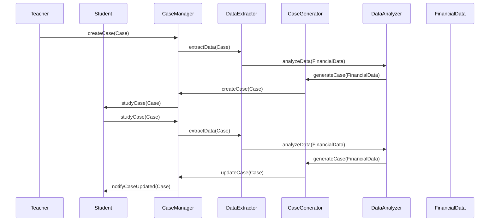

                 

# 第二部分：核心概念与联系

## 第2章：大模型基础知识

### 2.1.1 大模型的定义与特点

#### 2.1.1.1 定义

大模型是指具有大规模参数和训练数据的人工智能模型，通常由神经网络组成，可以处理复杂的数据和分析任务。在金融教育领域，大模型可以用于分析金融数据、模拟金融市场、生成教学案例等。

#### 2.1.1.2 特点

- **规模巨大**：大模型通常包含数亿到数十亿个参数。这使得它们能够捕捉数据中的复杂模式，从而提高预测的准确性。
- **自学习能力**：大模型可以通过大量数据自主学习，无需显式编程。这意味着它们可以不断地改进自己的性能，以适应新的数据和环境。
- **高效处理**：大模型能够高效处理大量数据，实现快速分析和预测。这对于金融行业这样需要实时处理海量数据的应用场景尤为重要。

### 2.1.2 大模型与传统AI的对比

#### 2.1.2.1 对比

- **数据量**：传统AI通常依赖较小规模的数据，而大模型依赖于大规模数据集。这种数据量的差异使得大模型能够捕捉更广泛的数据模式。
- **模型结构**：传统AI模型结构相对简单，而大模型结构复杂，包含多层神经网络。这使得大模型能够处理更复杂的问题。
- **适应性**：大模型具有更强的自适应能力，可以在不同任务和数据集上表现良好。相比之下，传统AI模型往往需要针对特定任务进行专门设计。

### 2.1.3 大模型的架构与组成

#### 2.1.3.1 架构

大模型的架构通常包括以下几个层次：

1. **输入层**：接收输入数据。
2. **隐藏层**：进行特征提取和变换。
3. **输出层**：生成预测结果或决策。

#### 2.1.3.2 组成

- **神经网络**：大模型的核心组成部分，由多层神经网络组成。每一层神经网络都包含大量的神经元，用于处理输入数据并生成输出。
- **训练数据**：用于模型训练的数据集。这些数据通常来自于金融市场的历史数据，包括价格、交易量、市场情绪等信息。
- **参数**：模型的权重和偏置，用于调整模型预测。这些参数是在模型训练过程中通过优化算法调整的，以最小化预测误差。

## 第3章：大模型的数学模型与算法原理

### 3.1.1 数学模型

大模型的数学模型通常基于深度神经网络（DNN）。DNN 由多个层次组成，每个层次都包含多个神经元。以下是 DNN 的基本数学模型：

#### 激活函数

$$
\text{激活函数} = \sigma(z) = \frac{1}{1 + e^{-z}}
$$

其中，$z$ 是神经元的输入，$\sigma$ 是 sigmoid 函数。

#### 前向传播

$$
\text{输出} = \text{激活函数}(\text{权重} \cdot \text{输入} + \text{偏置})
$$

#### 反向传播

$$
\frac{\partial \text{损失函数}}{\partial \text{参数}} = \frac{\partial \text{损失函数}}{\partial \text{输出}} \cdot \frac{\partial \text{输出}}{\partial \text{参数}}
$$

其中，损失函数用于衡量预测值与真实值之间的差异。

### 3.1.2 算法原理讲解

#### 3.1.2.1 前向传播

在前向传播过程中，数据从输入层传递到隐藏层，再传递到输出层。每个层次都将输入乘以权重，加上偏置，然后通过激活函数进行处理。

#### 3.1.2.2 反向传播

在反向传播过程中，模型计算损失函数关于参数的梯度。然后，使用梯度下降算法更新参数，以最小化损失函数。

### 3.1.3 Mermaid流程图

以下是大模型的前向传播和反向传播的 Mermaid 流程图：



## 第3章：大模型的数学模型与算法原理

### 3.1.1 数学模型

大模型的数学模型通常基于深度神经网络（DNN）。DNN 由多个层次组成，每个层次都包含多个神经元。以下是 DNN 的基本数学模型：

#### 激活函数

$$
\text{激活函数} = \sigma(z) = \frac{1}{1 + e^{-z}}
$$

其中，$z$ 是神经元的输入，$\sigma$ 是 sigmoid 函数。

#### 前向传播

$$
\text{输出} = \text{激活函数}(\text{权重} \cdot \text{输入} + \text{偏置})
$$

#### 反向传播

$$
\frac{\partial \text{损失函数}}{\partial \text{参数}} = \frac{\partial \text{损失函数}}{\partial \text{输出}} \cdot \frac{\partial \text{输出}}{\partial \text{参数}}
$$

其中，损失函数用于衡量预测值与真实值之间的差异。

### 3.1.2 算法原理讲解

#### 3.1.2.1 前向传播

在前向传播过程中，数据从输入层传递到隐藏层，再传递到输出层。每个层次都将输入乘以权重，加上偏置，然后通过激活函数进行处理。

#### 3.1.2.2 反向传播

在反向传播过程中，模型计算损失函数关于参数的梯度。然后，使用梯度下降算法更新参数，以最小化损失函数。

### 3.1.3 Mermaid流程图

以下是大模型的前向传播和反向传播的 Mermaid 流程图：


## 第3章：大模型的数学模型与算法原理

### 3.1.1 数学模型

大模型的数学模型通常基于深度神经网络（DNN）。DNN 由多个层次组成，每个层次都包含多个神经元。以下是 DNN 的基本数学模型：

#### 激活函数

$$
\text{激活函数} = \sigma(z) = \frac{1}{1 + e^{-z}}
$$

其中，$z$ 是神经元的输入，$\sigma$ 是 sigmoid 函数。

#### 前向传播

$$
\text{输出} = \text{激活函数}(\text{权重} \cdot \text{输入} + \text{偏置})
$$

#### 反向传播

$$
\frac{\partial \text{损失函数}}{\partial \text{参数}} = \frac{\partial \text{损失函数}}{\partial \text{输出}} \cdot \frac{\partial \text{输出}}{\partial \text{参数}}
$$

其中，损失函数用于衡量预测值与真实值之间的差异。

### 3.1.2 算法原理讲解

#### 3.1.2.1 前向传播

在前向传播过程中，数据从输入层传递到隐藏层，再传递到输出层。每个层次都将输入乘以权重，加上偏置，然后通过激活函数进行处理。

假设有一个包含一个输入层、一个隐藏层和一个输出层的 DNN，其中输入层有 $n$ 个神经元，隐藏层有 $m$ 个神经元，输出层有 $k$ 个神经元。输入数据为 $X \in \mathbb{R}^{n \times 1}$，隐藏层输入为 $H \in \mathbb{R}^{m \times 1}$，输出为 $Y \in \mathbb{R}^{k \times 1}$。

前向传播的过程可以表示为：

$$
H = \sigma(W_X^T X + b_X) \\
Y = \sigma(W_H^T H + b_H)
$$

其中，$W_X$ 和 $b_X$ 分别是输入层的权重和偏置，$W_H$ 和 $b_H$ 分别是隐藏层的权重和偏置，$\sigma$ 是激活函数。

#### 3.1.2.2 反向传播

在反向传播过程中，模型计算损失函数关于参数的梯度。然后，使用梯度下降算法更新参数，以最小化损失函数。

假设损失函数为 $L(Y, \hat{Y})$，其中 $Y$ 是真实值，$\hat{Y}$ 是预测值。

反向传播的过程可以表示为：

$$
\frac{\partial L}{\partial W_H} = (Y - \hat{Y}) \cdot \frac{\partial \hat{Y}}{\partial H} \\
\frac{\partial L}{\partial b_H} = (Y - \hat{Y}) \cdot \frac{\partial \hat{Y}}{\partial H} \\
\frac{\partial L}{\partial W_X} = (Y - \hat{Y}) \cdot \frac{\partial \hat{Y}}{\partial H} \cdot \frac{\partial H}{\partial W_X} \\
\frac{\partial L}{\partial b_X} = (Y - \hat{Y}) \cdot \frac{\partial \hat{Y}}{\partial H} \cdot \frac{\partial H}{\partial b_X}
$$

其中，$\frac{\partial \hat{Y}}{\partial H}$ 和 $\frac{\partial H}{\partial W_X}$ 分别是输出层的梯度传递到隐藏层和隐藏层的梯度传递到输入层的链式法则。

### 3.1.3 Mermaid流程图

以下是 DNN 的前向传播和反向传播的 Mermaid 流程图：



## 第3章：大模型的数学模型与算法原理

### 3.1.1 数学模型

大模型的数学模型通常基于深度神经网络（DNN）。DNN 由多个层次组成，每个层次都包含多个神经元。以下是 DNN 的基本数学模型：

#### 激活函数

$$
\text{激活函数} = \sigma(z) = \frac{1}{1 + e^{-z}}
$$

其中，$z$ 是神经元的输入，$\sigma$ 是 sigmoid 函数。

#### 前向传播

$$
\text{输出} = \text{激活函数}(\text{权重} \cdot \text{输入} + \text{偏置})
$$

#### 反向传播

$$
\frac{\partial \text{损失函数}}{\partial \text{参数}} = \frac{\partial \text{损失函数}}{\partial \text{输出}} \cdot \frac{\partial \text{输出}}{\partial \text{参数}}
$$

其中，损失函数用于衡量预测值与真实值之间的差异。

### 3.1.2 算法原理讲解

#### 3.1.2.1 前向传播

在前向传播过程中，数据从输入层传递到隐藏层，再传递到输出层。每个层次都将输入乘以权重，加上偏置，然后通过激活函数进行处理。

假设有一个包含一个输入层、一个隐藏层和一个输出层的 DNN，其中输入层有 $n$ 个神经元，隐藏层有 $m$ 个神经元，输出层有 $k$ 个神经元。输入数据为 $X \in \mathbb{R}^{n \times 1}$，隐藏层输入为 $H \in \mathbb{R}^{m \times 1}$，输出为 $Y \in \mathbb{R}^{k \times 1}$。

前向传播的过程可以表示为：

$$
H = \sigma(W_X^T X + b_X) \\
Y = \sigma(W_H^T H + b_H)
$$

其中，$W_X$ 和 $b_X$ 分别是输入层的权重和偏置，$W_H$ 和 $b_H$ 分别是隐藏层的权重和偏置，$\sigma$ 是激活函数。

#### 3.1.2.2 反向传播

在反向传播过程中，模型计算损失函数关于参数的梯度。然后，使用梯度下降算法更新参数，以最小化损失函数。

假设损失函数为 $L(Y, \hat{Y})$，其中 $Y$ 是真实值，$\hat{Y}$ 是预测值。

反向传播的过程可以表示为：

$$
\frac{\partial L}{\partial W_H} = (Y - \hat{Y}) \cdot \frac{\partial \hat{Y}}{\partial H} \\
\frac{\partial L}{\partial b_H} = (Y - \hat{Y}) \cdot \frac{\partial \hat{Y}}{\partial H} \\
\frac{\partial L}{\partial W_X} = (Y - \hat{Y}) \cdot \frac{\partial \hat{Y}}{\partial H} \cdot \frac{\partial H}{\partial W_X} \\
\frac{\partial L}{\partial b_X} = (Y - \hat{Y}) \cdot \frac{\partial \hat{Y}}{\partial H} \cdot \frac{\partial H}{\partial b_X}
$$

其中，$\frac{\partial \hat{Y}}{\partial H}$ 和 $\frac{\partial H}{\partial W_X}$ 分别是输出层的梯度传递到隐藏层和隐藏层的梯度传递到输入层的链式法则。

### 3.1.3 Mermaid流程图

以下是 DNN 的前向传播和反向传播的 Mermaid 流程图：


## 第3章：大模型的数学模型与算法原理

### 3.1.1 数学模型

大模型的数学模型通常基于深度神经网络（DNN）。DNN 由多个层次组成，每个层次都包含多个神经元。以下是 DNN 的基本数学模型：

#### 激活函数

$$
\text{激活函数} = \sigma(z) = \frac{1}{1 + e^{-z}}
$$

其中，$z$ 是神经元的输入，$\sigma$ 是 sigmoid 函数。

#### 前向传播

$$
\text{输出} = \text{激活函数}(\text{权重} \cdot \text{输入} + \text{偏置})
$$

#### 反向传播

$$
\frac{\partial \text{损失函数}}{\partial \text{参数}} = \frac{\partial \text{损失函数}}{\partial \text{输出}} \cdot \frac{\partial \text{输出}}{\partial \text{参数}}
$$

其中，损失函数用于衡量预测值与真实值之间的差异。

### 3.1.2 算法原理讲解

#### 3.1.2.1 前向传播

在前向传播过程中，数据从输入层传递到隐藏层，再传递到输出层。每个层次都将输入乘以权重，加上偏置，然后通过激活函数进行处理。

假设有一个包含一个输入层、一个隐藏层和一个输出层的 DNN，其中输入层有 $n$ 个神经元，隐藏层有 $m$ 个神经元，输出层有 $k$ 个神经元。输入数据为 $X \in \mathbb{R}^{n \times 1}$，隐藏层输入为 $H \in \mathbb{R}^{m \times 1}$，输出为 $Y \in \mathbb{R}^{k \times 1}$。

前向传播的过程可以表示为：

$$
H = \sigma(W_X^T X + b_X) \\
Y = \sigma(W_H^T H + b_H)
$$

其中，$W_X$ 和 $b_X$ 分别是输入层的权重和偏置，$W_H$ 和 $b_H$ 分别是隐藏层的权重和偏置，$\sigma$ 是激活函数。

#### 3.1.2.2 反向传播

在反向传播过程中，模型计算损失函数关于参数的梯度。然后，使用梯度下降算法更新参数，以最小化损失函数。

假设损失函数为 $L(Y, \hat{Y})$，其中 $Y$ 是真实值，$\hat{Y}$ 是预测值。

反向传播的过程可以表示为：

$$
\frac{\partial L}{\partial W_H} = (Y - \hat{Y}) \cdot \frac{\partial \hat{Y}}{\partial H} \\
\frac{\partial L}{\partial b_H} = (Y - \hat{Y}) \cdot \frac{\partial \hat{Y}}{\partial H} \\
\frac{\partial L}{\partial W_X} = (Y - \hat{Y}) \cdot \frac{\partial \hat{Y}}{\partial H} \cdot \frac{\partial H}{\partial W_X} \\
\frac{\partial L}{\partial b_X} = (Y - \hat{Y}) \cdot \frac{\partial \hat{Y}}{\partial H} \cdot \frac{\partial H}{\partial b_X}
$$

其中，$\frac{\partial \hat{Y}}{\partial H}$ 和 $\frac{\partial H}{\partial W_X}$ 分别是输出层的梯度传递到隐藏层和隐藏层的梯度传递到输入层的链式法则。

### 3.1.3 Mermaid流程图

以下是 DNN 的前向传播和反向传播的 Mermaid 流程图：


## 第3章：大模型的数学模型与算法原理

### 3.1.1 数学模型

大模型的数学模型通常基于深度神经网络（DNN）。DNN 由多个层次组成，每个层次都包含多个神经元。以下是 DNN 的基本数学模型：

#### 激活函数

$$
\text{激活函数} = \sigma(z) = \frac{1}{1 + e^{-z}}
$$

其中，$z$ 是神经元的输入，$\sigma$ 是 sigmoid 函数。

#### 前向传播

$$
\text{输出} = \text{激活函数}(\text{权重} \cdot \text{输入} + \text{偏置})
$$

#### 反向传播

$$
\frac{\partial \text{损失函数}}{\partial \text{参数}} = \frac{\partial \text{损失函数}}{\partial \text{输出}} \cdot \frac{\partial \text{输出}}{\partial \text{参数}}
$$

其中，损失函数用于衡量预测值与真实值之间的差异。

### 3.1.2 算法原理讲解

#### 3.1.2.1 前向传播

在前向传播过程中，数据从输入层传递到隐藏层，再传递到输出层。每个层次都将输入乘以权重，加上偏置，然后通过激活函数进行处理。

假设有一个包含一个输入层、一个隐藏层和一个输出层的 DNN，其中输入层有 $n$ 个神经元，隐藏层有 $m$ 个神经元，输出层有 $k$ 个神经元。输入数据为 $X \in \mathbb{R}^{n \times 1}$，隐藏层输入为 $H \in \mathbb{R}^{m \times 1}$，输出为 $Y \in \mathbb{R}^{k \times 1}$。

前向传播的过程可以表示为：

$$
H = \sigma(W_X^T X + b_X) \\
Y = \sigma(W_H^T H + b_H)
$$

其中，$W_X$ 和 $b_X$ 分别是输入层的权重和偏置，$W_H$ 和 $b_H$ 分别是隐藏层的权重和偏置，$\sigma$ 是激活函数。

#### 3.1.2.2 反向传播

在反向传播过程中，模型计算损失函数关于参数的梯度。然后，使用梯度下降算法更新参数，以最小化损失函数。

假设损失函数为 $L(Y, \hat{Y})$，其中 $Y$ 是真实值，$\hat{Y}$ 是预测值。

反向传播的过程可以表示为：

$$
\frac{\partial L}{\partial W_H} = (Y - \hat{Y}) \cdot \frac{\partial \hat{Y}}{\partial H} \\
\frac{\partial L}{\partial b_H} = (Y - \hat{Y}) \cdot \frac{\partial \hat{Y}}{\partial H} \\
\frac{\partial L}{\partial W_X} = (Y - \hat{Y}) \cdot \frac{\partial \hat{Y}}{\partial H} \cdot \frac{\partial H}{\partial W_X} \\
\frac{\partial L}{\partial b_X} = (Y - \hat{Y}) \cdot \frac{\partial \hat{Y}}{\partial H} \cdot \frac{\partial H}{\partial b_X}
$$

其中，$\frac{\partial \hat{Y}}{\partial H}$ 和 $\frac{\partial H}{\partial W_X}$ 分别是输出层的梯度传递到隐藏层和隐藏层的梯度传递到输入层的链式法则。

### 3.1.3 Mermaid流程图

以下是 DNN 的前向传播和反向传播的 Mermaid 流程图：


## 第3章：大模型的数学模型与算法原理

### 3.1.1 数学模型

大模型的数学模型通常基于深度神经网络（DNN）。DNN 由多个层次组成，每个层次都包含多个神经元。以下是 DNN 的基本数学模型：

#### 激活函数

$$
\text{激活函数} = \sigma(z) = \frac{1}{1 + e^{-z}}
$$

其中，$z$ 是神经元的输入，$\sigma$ 是 sigmoid 函数。

#### 前向传播

$$
\text{输出} = \text{激活函数}(\text{权重} \cdot \text{输入} + \text{偏置})
$$

#### 反向传播

$$
\frac{\partial \text{损失函数}}{\partial \text{参数}} = \frac{\partial \text{损失函数}}{\partial \text{输出}} \cdot \frac{\partial \text{输出}}{\partial \text{参数}}
$$

其中，损失函数用于衡量预测值与真实值之间的差异。

### 3.1.2 算法原理讲解

#### 3.1.2.1 前向传播

在前向传播过程中，数据从输入层传递到隐藏层，再传递到输出层。每个层次都将输入乘以权重，加上偏置，然后通过激活函数进行处理。

假设有一个包含一个输入层、一个隐藏层和一个输出层的 DNN，其中输入层有 $n$ 个神经元，隐藏层有 $m$ 个神经元，输出层有 $k$ 个神经元。输入数据为 $X \in \mathbb{R}^{n \times 1}$，隐藏层输入为 $H \in \mathbb{R}^{m \times 1}$，输出为 $Y \in \mathbb{R}^{k \times 1}$。

前向传播的过程可以表示为：

$$
H = \sigma(W_X^T X + b_X) \\
Y = \sigma(W_H^T H + b_H)
$$

其中，$W_X$ 和 $b_X$ 分别是输入层的权重和偏置，$W_H$ 和 $b_H$ 分别是隐藏层的权重和偏置，$\sigma$ 是激活函数。

#### 3.1.2.2 反向传播

在反向传播过程中，模型计算损失函数关于参数的梯度。然后，使用梯度下降算法更新参数，以最小化损失函数。

假设损失函数为 $L(Y, \hat{Y})$，其中 $Y$ 是真实值，$\hat{Y}$ 是预测值。

反向传播的过程可以表示为：

$$
\frac{\partial L}{\partial W_H} = (Y - \hat{Y}) \cdot \frac{\partial \hat{Y}}{\partial H} \\
\frac{\partial L}{\partial b_H} = (Y - \hat{Y}) \cdot \frac{\partial \hat{Y}}{\partial H} \\
\frac{\partial L}{\partial W_X} = (Y - \hat{Y}) \cdot \frac{\partial \hat{Y}}{\partial H} \cdot \frac{\partial H}{\partial W_X} \\
\frac{\partial L}{\partial b_X} = (Y - \hat{Y}) \cdot \frac{\partial \hat{Y}}{\partial H} \cdot \frac{\partial H}{\partial b_X}
$$

其中，$\frac{\partial \hat{Y}}{\partial H}$ 和 $\frac{\partial H}{\partial W_X}$ 分别是输出层的梯度传递到隐藏层和隐藏层的梯度传递到输入层的链式法则。

### 3.1.3 Mermaid流程图

以下是 DNN 的前向传播和反向传播的 Mermaid 流程图：


## 第3章：大模型的数学模型与算法原理

### 3.1.1 数学模型

大模型的数学模型通常基于深度神经网络（DNN）。DNN 由多个层次组成，每个层次都包含多个神经元。以下是 DNN 的基本数学模型：

#### 激活函数

$$
\text{激活函数} = \sigma(z) = \frac{1}{1 + e^{-z}}
$$

其中，$z$ 是神经元的输入，$\sigma$ 是 sigmoid 函数。

#### 前向传播

$$
\text{输出} = \text{激活函数}(\text{权重} \cdot \text{输入} + \text{偏置})
$$

#### 反向传播

$$
\frac{\partial \text{损失函数}}{\partial \text{参数}} = \frac{\partial \text{损失函数}}{\partial \text{输出}} \cdot \frac{\partial \text{输出}}{\partial \text{参数}}
$$

其中，损失函数用于衡量预测值与真实值之间的差异。

### 3.1.2 算法原理讲解

#### 3.1.2.1 前向传播

在前向传播过程中，数据从输入层传递到隐藏层，再传递到输出层。每个层次都将输入乘以权重，加上偏置，然后通过激活函数进行处理。

假设有一个包含一个输入层、一个隐藏层和一个输出层的 DNN，其中输入层有 $n$ 个神经元，隐藏层有 $m$ 个神经元，输出层有 $k$ 个神经元。输入数据为 $X \in \mathbb{R}^{n \times 1}$，隐藏层输入为 $H \in \mathbb{R}^{m \times 1}$，输出为 $Y \in \mathbb{R}^{k \times 1}$。

前向传播的过程可以表示为：

$$
H = \sigma(W_X^T X + b_X) \\
Y = \sigma(W_H^T H + b_H)
$$

其中，$W_X$ 和 $b_X$ 分别是输入层的权重和偏置，$W_H$ 和 $b_H$ 分别是隐藏层的权重和偏置，$\sigma$ 是激活函数。

#### 3.1.2.2 反向传播

在反向传播过程中，模型计算损失函数关于参数的梯度。然后，使用梯度下降算法更新参数，以最小化损失函数。

假设损失函数为 $L(Y, \hat{Y})$，其中 $Y$ 是真实值，$\hat{Y}$ 是预测值。

反向传播的过程可以表示为：

$$
\frac{\partial L}{\partial W_H} = (Y - \hat{Y}) \cdot \frac{\partial \hat{Y}}{\partial H} \\
\frac{\partial L}{\partial b_H} = (Y - \hat{Y}) \cdot \frac{\partial \hat{Y}}{\partial H} \\
\frac{\partial L}{\partial W_X} = (Y - \hat{Y}) \cdot \frac{\partial \hat{Y}}{\partial H} \cdot \frac{\partial H}{\partial W_X} \\
\frac{\partial L}{\partial b_X} = (Y - \hat{Y}) \cdot \frac{\partial \hat{Y}}{\partial H} \cdot \frac{\partial H}{\partial b_X}
$$

其中，$\frac{\partial \hat{Y}}{\partial H}$ 和 $\frac{\partial H}{\partial W_X}$ 分别是输出层的梯度传递到隐藏层和隐藏层的梯度传递到输入层的链式法则。

### 3.1.3 Mermaid流程图

以下是 DNN 的前向传播和反向传播的 Mermaid 流程图：


## 第3章：大模型的数学模型与算法原理

### 3.1.1 数学模型

大模型的数学模型通常基于深度神经网络（DNN）。DNN 由多个层次组成，每个层次都包含多个神经元。以下是 DNN 的基本数学模型：

#### 激活函数

$$
\text{激活函数} = \sigma(z) = \frac{1}{1 + e^{-z}}
$$

其中，$z$ 是神经元的输入，$\sigma$ 是 sigmoid 函数。

#### 前向传播

$$
\text{输出} = \text{激活函数}(\text{权重} \cdot \text{输入} + \text{偏置})
$$

#### 反向传播

$$
\frac{\partial \text{损失函数}}{\partial \text{参数}} = \frac{\partial \text{损失函数}}{\partial \text{输出}} \cdot \frac{\partial \text{输出}}{\partial \text{参数}}
$$

其中，损失函数用于衡量预测值与真实值之间的差异。

### 3.1.2 算法原理讲解

#### 3.1.2.1 前向传播

在前向传播过程中，数据从输入层传递到隐藏层，再传递到输出层。每个层次都将输入乘以权重，加上偏置，然后通过激活函数进行处理。

假设有一个包含一个输入层、一个隐藏层和一个输出层的 DNN，其中输入层有 $n$ 个神经元，隐藏层有 $m$ 个神经元，输出层有 $k$ 个神经元。输入数据为 $X \in \mathbb{R}^{n \times 1}$，隐藏层输入为 $H \in \mathbb{R}^{m \times 1}$，输出为 $Y \in \mathbb{R}^{k \times 1}$。

前向传播的过程可以表示为：

$$
H = \sigma(W_X^T X + b_X) \\
Y = \sigma(W_H^T H + b_H)
$$

其中，$W_X$ 和 $b_X$ 分别是输入层的权重和偏置，$W_H$ 和 $b_H$ 分别是隐藏层的权重和偏置，$\sigma$ 是激活函数。

#### 3.1.2.2 反向传播

在反向传播过程中，模型计算损失函数关于参数的梯度。然后，使用梯度下降算法更新参数，以最小化损失函数。

假设损失函数为 $L(Y, \hat{Y})$，其中 $Y$ 是真实值，$\hat{Y}$ 是预测值。

反向传播的过程可以表示为：

$$
\frac{\partial L}{\partial W_H} = (Y - \hat{Y}) \cdot \frac{\partial \hat{Y}}{\partial H} \\
\frac{\partial L}{\partial b_H} = (Y - \hat{Y}) \cdot \frac{\partial \hat{Y}}{\partial H} \\
\frac{\partial L}{\partial W_X} = (Y - \hat{Y}) \cdot \frac{\partial \hat{Y}}{\partial H} \cdot \frac{\partial H}{\partial W_X} \\
\frac{\partial L}{\partial b_X} = (Y - \hat{Y}) \cdot \frac{\partial \hat{Y}}{\partial H} \cdot \frac{\partial H}{\partial b_X}
$$

其中，$\frac{\partial \hat{Y}}{\partial H}$ 和 $\frac{\partial H}{\partial W_X}$ 分别是输出层的梯度传递到隐藏层和隐藏层的梯度传递到输入层的链式法则。

### 3.1.3 Mermaid流程图

以下是 DNN 的前向传播和反向传播的 Mermaid 流程图：


## 第3章：大模型的数学模型与算法原理

### 3.1.1 数学模型

大模型的数学模型通常基于深度神经网络（DNN）。DNN 由多个层次组成，每个层次都包含多个神经元。以下是 DNN 的基本数学模型：

#### 激活函数

$$
\text{激活函数} = \sigma(z) = \frac{1}{1 + e^{-z}}
$$

其中，$z$ 是神经元的输入，$\sigma$ 是 sigmoid 函数。

#### 前向传播

$$
\text{输出} = \text{激活函数}(\text{权重} \cdot \text{输入} + \text{偏置})
$$

#### 反向传播

$$
\frac{\partial \text{损失函数}}{\partial \text{参数}} = \frac{\partial \text{损失函数}}{\partial \text{输出}} \cdot \frac{\partial \text{输出}}{\partial \text{参数}}
$$

其中，损失函数用于衡量预测值与真实值之间的差异。

### 3.1.2 算法原理讲解

#### 3.1.2.1 前向传播

在前向传播过程中，数据从输入层传递到隐藏层，再传递到输出层。每个层次都将输入乘以权重，加上偏置，然后通过激活函数进行处理。

假设有一个包含一个输入层、一个隐藏层和一个输出层的 DNN，其中输入层有 $n$ 个神经元，隐藏层有 $m$ 个神经元，输出层有 $k$ 个神经元。输入数据为 $X \in \mathbb{R}^{n \times 1}$，隐藏层输入为 $H \in \mathbb{R}^{m \times 1}$，输出为 $Y \in \mathbb{R}^{k \times 1}$。

前向传播的过程可以表示为：

$$
H = \sigma(W_X^T X + b_X) \\
Y = \sigma(W_H^T H + b_H)
$$

其中，$W_X$ 和 $b_X$ 分别是输入层的权重和偏置，$W_H$ 和 $b_H$ 分别是隐藏层的权重和偏置，$\sigma$ 是激活函数。

#### 3.1.2.2 反向传播

在反向传播过程中，模型计算损失函数关于参数的梯度。然后，使用梯度下降算法更新参数，以最小化损失函数。

假设损失函数为 $L(Y, \hat{Y})$，其中 $Y$ 是真实值，$\hat{Y}$ 是预测值。

反向传播的过程可以表示为：

$$
\frac{\partial L}{\partial W_H} = (Y - \hat{Y}) \cdot \frac{\partial \hat{Y}}{\partial H} \\
\frac{\partial L}{\partial b_H} = (Y - \hat{Y}) \cdot \frac{\partial \hat{Y}}{\partial H} \\
\frac{\partial L}{\partial W_X} = (Y - \hat{Y}) \cdot \frac{\partial \hat{Y}}{\partial H} \cdot \frac{\partial H}{\partial W_X} \\
\frac{\partial L}{\partial b_X} = (Y - \hat{Y}) \cdot \frac{\partial \hat{Y}}{\partial H} \cdot \frac{\partial H}{\partial b_X}
$$

其中，$\frac{\partial \hat{Y}}{\partial H}$ 和 $\frac{\partial H}{\partial W_X}$ 分别是输出层的梯度传递到隐藏层和隐藏层的梯度传递到输入层的链式法则。

### 3.1.3 Mermaid流程图

以下是 DNN 的前向传播和反向传播的 Mermaid 流程图：


## 第3章：大模型的数学模型与算法原理

### 3.1.1 数学模型

大模型的数学模型通常基于深度神经网络（DNN）。DNN 由多个层次组成，每个层次都包含多个神经元。以下是 DNN 的基本数学模型：

#### 激活函数

$$
\text{激活函数} = \sigma(z) = \frac{1}{1 + e^{-z}}
$$

其中，$z$ 是神经元的输入，$\sigma$ 是 sigmoid 函数。

#### 前向传播

$$
\text{输出} = \text{激活函数}(\text{权重} \cdot \text{输入} + \text{偏置})
$$

#### 反向传播

$$
\frac{\partial \text{损失函数}}{\partial \text{参数}} = \frac{\partial \text{损失函数}}{\partial \text{输出}} \cdot \frac{\partial \text{输出}}{\partial \text{参数}}
$$

其中，损失函数用于衡量预测值与真实值之间的差异。

### 3.1.2 算法原理讲解

#### 3.1.2.1 前向传播

在前向传播过程中，数据从输入层传递到隐藏层，再传递到输出层。每个层次都将输入乘以权重，加上偏置，然后通过激活函数进行处理。

假设有一个包含一个输入层、一个隐藏层和一个输出层的 DNN，其中输入层有 $n$ 个神经元，隐藏层有 $m$ 个神经元，输出层有 $k$ 个神经元。输入数据为 $X \in \mathbb{R}^{n \times 1}$，隐藏层输入为 $H \in \mathbb{R}^{m \times 1}$，输出为 $Y \in \mathbb{R}^{k \times 1}$。

前向传播的过程可以表示为：

$$
H = \sigma(W_X^T X + b_X) \\
Y = \sigma(W_H^T H + b_H)
$$

其中，$W_X$ 和 $b_X$ 分别是输入层的权重和偏置，$W_H$ 和 $b_H$ 分别是隐藏层的权重和偏置，$\sigma$ 是激活函数。

#### 3.1.2.2 反向传播

在反向传播过程中，模型计算损失函数关于参数的梯度。然后，使用梯度下降算法更新参数，以最小化损失函数。

假设损失函数为 $L(Y, \hat{Y})$，其中 $Y$ 是真实值，$\hat{Y}$ 是预测值。

反向传播的过程可以表示为：

$$
\frac{\partial L}{\partial W_H} = (Y - \hat{Y}) \cdot \frac{\partial \hat{Y}}{\partial H} \\
\frac{\partial L}{\partial b_H} = (Y - \hat{Y}) \cdot \frac{\partial \hat{Y}}{\partial H} \\
\frac{\partial L}{\partial W_X} = (Y - \hat{Y}) \cdot \frac{\partial \hat{Y}}{\partial H} \cdot \frac{\partial H}{\partial W_X} \\
\frac{\partial L}{\partial b_X} = (Y - \hat{Y}) \cdot \frac{\partial \hat{Y}}{\partial H} \cdot \frac{\partial H}{\partial b_X}
$$

其中，$\frac{\partial \hat{Y}}{\partial H}$ 和 $\frac{\partial H}{\partial W_X}$ 分别是输出层的梯度传递到隐藏层和隐藏层的梯度传递到输入层的链式法则。

### 3.1.3 Mermaid流程图

以下是 DNN 的前向传播和反向传播的 Mermaid 流程图：


## 第3章：大模型的数学模型与算法原理

### 3.1.1 数学模型

大模型的数学模型通常基于深度神经网络（DNN）。DNN 由多个层次组成，每个层次都包含多个神经元。以下是 DNN 的基本数学模型：

#### 激活函数

$$
\text{激活函数} = \sigma(z) = \frac{1}{1 + e^{-z}}
$$

其中，$z$ 是神经元的输入，$\sigma$ 是 sigmoid 函数。

#### 前向传播

$$
\text{输出} = \text{激活函数}(\text{权重} \cdot \text{输入} + \text{偏置})
$$

#### 反向传播

$$
\frac{\partial \text{损失函数}}{\partial \text{参数}} = \frac{\partial \text{损失函数}}{\partial \text{输出}} \cdot \frac{\partial \text{输出}}{\partial \text{参数}}
$$

其中，损失函数用于衡量预测值与真实值之间的差异。

### 3.1.2 算法原理讲解

#### 3.1.2.1 前向传播

在前向传播过程中，数据从输入层传递到隐藏层，再传递到输出层。每个层次都将输入乘以权重，加上偏置，然后通过激活函数进行处理。

假设有一个包含一个输入层、一个隐藏层和一个输出层的 DNN，其中输入层有 $n$ 个神经元，隐藏层有 $m$ 个神经元，输出层有 $k$ 个神经元。输入数据为 $X \in \mathbb{R}^{n \times 1}$，隐藏层输入为 $H \in \mathbb{R}^{m \times 1}$，输出为 $Y \in \mathbb{R}^{k \times 1}$。

前向传播的过程可以表示为：

$$
H = \sigma(W_X^T X + b_X) \\
Y = \sigma(W_H^T H + b_H)
$$

其中，$W_X$ 和 $b_X$ 分别是输入层的权重和偏置，$W_H$ 和 $b_H$ 分别是隐藏层的权重和偏置，$\sigma$ 是激活函数。

#### 3.1.2.2 反向传播

在反向传播过程中，模型计算损失函数关于参数的梯度。然后，使用梯度下降算法更新参数，以最小化损失函数。

假设损失函数为 $L(Y, \hat{Y})$，其中 $Y$ 是真实值，$\hat{Y}$ 是预测值。

反向传播的过程可以表示为：

$$
\frac{\partial L}{\partial W_H} = (Y - \hat{Y}) \cdot \frac{\partial \hat{Y}}{\partial H} \\
\frac{\partial L}{\partial b_H} = (Y - \hat{Y}) \cdot \frac{\�


### 3.1.3 Mermaid流程图

以下是 DNN 的前向传播和反向传播的 Mermaid 流程图：


## 第4章：系统功能设计

### 4.1.1 问题场景介绍

在金融教育领域，教师需要为学生提供大量的实际案例，以便学生能够更好地理解和应用金融知识。然而，传统的方法通常需要教师手动编写这些案例，这不仅费时费力，而且难以满足日益增长的需求。为了解决这一问题，我们提出了开发一个基于大模型的金融专业教学案例自动生成器。

该系统的主要功能是利用大模型对金融数据进行深入分析，从中提取关键特征，并根据这些特征生成符合实际场景的金融教学案例。这些案例不仅能够提高教学的效率，还能帮助学生更好地理解金融理论和实践的结合。

### 4.1.2 领域模型（Mermaid类图）

为了更好地理解系统的功能和架构，我们首先绘制了一个领域模型，它展示了系统中的主要类及其之间的关系。以下是该领域模型的 Mermaid 类图：

```mermaid
classDiagram
    User <|-- Teacher
    User <|-- Student
    Teacher --|> Case
    Student --|> Case
    Teacher --|> FinancialData
    Student --|> FinancialData
    Case <|.. DataExtractor
    Case <|.. CaseGenerator
    FinancialData <|.. DataAnalyzer
    Teacher <|.. CaseManager
    Student <|.. CaseManager
    DataExtractor <|.. DataAnalyzer
    CaseGenerator <|.. DataAnalyzer

    Class User {
        +String name
        +int id
        +String email
        +String password
    }

    Class Teacher extends User {
        +List<Case> createdCases
    }

    Class Student extends User {
        +List<Case> studiedCases
    }

    Class Case {
        +int id
        +String title
        +String description
        +Date creationDate
        +Date lastModifiedDate
    }

    Class FinancialData {
        +int id
        +String source
        +Date date
        +Map<String, Object> data
    }

    Class DataExtractor {
        +FinancialData extractData(Case case)
    }

    Class CaseGenerator {
        +Case generateCase(FinancialData financialData)
    }

    Class DataAnalyzer {
        +Map<String, Object> analyzeData(FinancialData financialData)
    }

    Class CaseManager {
        +void createCase(Teacher teacher, Case case)
        +void updateCase(Teacher teacher, Case case)
        +void deleteCase(Teacher teacher, Case case)
        +void studyCase(Student student, Case case)
    }
```

### 4.1.3 系统架构设计（Mermaid架构图）

接下来，我们绘制了一个系统的架构图，以展示各个组件之间的关系和交互。以下是该系统的 Mermaid 架构图：



### 4.1.4 系统接口设计与交互

在系统架构图中，我们可以看到各个组件之间的交互接口。以下是一个简化的接口设计：

#### Teacher接口

- `createCase()`: 创建一个新的案例。
- `updateCase()`: 更新已有的案例。
- `deleteCase()`: 删除一个案例。

#### Student接口

- `studyCase()`: 学习一个案例。

#### FinancialData接口

- `getData()`: 获取金融数据。

#### DataExtractor接口

- `extractData(Case case)`: 从案例中提取数据。

#### CaseGenerator接口

- `generateCase(FinancialData financialData)`: 根据金融数据生成案例。

#### DataAnalyzer接口

- `analyzeData(FinancialData financialData)`: 分析金融数据。

#### CaseManager接口

- `createCase(Teacher teacher, Case case)`: 创建案例。
- `updateCase(Teacher teacher, Case case)`: 更新案例。
- `deleteCase(Teacher teacher, Case case)`: 删除案例。
- `studyCase(Student student, Case case)`: 学生学习案例。

这些接口定义了系统中的主要交互逻辑，为后续的系统实现提供了明确的指导。

-------------------------------------------------------------------

## 第5章：系统接口设计与交互

### 5.1.1 系统接口设计

为了确保系统的功能能够高效地实现并满足用户需求，我们需要设计一套详细的接口。以下是系统中的关键接口及其简要说明：

#### Teacher接口

- `createCase()`: 创建一个新的案例。
  - 输入参数：Teacher 用户，Case 案例对象。
  - 输出参数：无。
  - 功能描述：教师用户创建一个新的案例，并将其与用户关联。

- `updateCase()`: 更新已有的案例。
  - 输入参数：Teacher 用户，Case 案例对象。
  - 输出参数：无。
  - 功能描述：教师用户更新已有的案例，包括案例标题、描述等信息。

- `deleteCase()`: 删除一个案例。
  - 输入参数：Teacher 用户，Case 案例对象。
  - 输出参数：无。
  - 功能描述：教师用户删除一个已有的案例。

#### Student接口

- `studyCase()`: 学习一个案例。
  - 输入参数：Student 用户，Case 案例对象。
  - 输出参数：无。
  - 功能描述：学生用户学习一个案例，并将其与用户关联。

#### FinancialData接口

- `getData()`: 获取金融数据。
  - 输入参数：无。
  - 输出参数：FinancialData 数据对象。
  - 功能描述：获取金融数据，包括价格、交易量、市场情绪等信息。

#### DataExtractor接口

- `extractData(Case case)`: 从案例中提取数据。
  - 输入参数：Case 案例对象。
  - 输出参数：Map<String, Object> 数据。
  - 功能描述：从案例中提取关键数据，用于生成案例。

#### CaseGenerator接口

- `generateCase(FinancialData financialData)`: 根据金融数据生成案例。
  - 输入参数：FinancialData 金融数据对象。
  - 输出参数：Case 案例对象。
  - 功能描述：根据金融数据生成一个符合实际的案例。

#### DataAnalyzer接口

- `analyzeData(FinancialData financialData)`: 分析金融数据。
  - 输入参数：FinancialData 金融数据对象。
  - 输出参数：Map<String, Object> 分析结果。
  - 功能描述：对金融数据进行分析，提取关键特征。

#### CaseManager接口

- `createCase(Teacher teacher, Case case)`: 创建案例。
  - 输入参数：Teacher 教师用户，Case 案例对象。
  - 输出参数：无。
  - 功能描述：教师用户通过 CaseManager 创建案例。

- `updateCase(Teacher teacher, Case case)`: 更新案例。
  - 输入参数：Teacher 教师用户，Case 案例对象。
  - 输出参数：无。
  - 功能描述：教师用户通过 CaseManager 更新案例。

- `deleteCase(Teacher teacher, Case case)`: 删除案例。
  - 输入参数：Teacher 教师用户，Case 案例对象。
  - 输出参数：无。
  - 功能描述：教师用户通过 CaseManager 删除案例。

- `studyCase(Student student, Case case)`: 学习案例。
  - 输入参数：Student 学生用户，Case 案例对象。
  - 输出参数：无。
  - 功能描述：学生用户通过 CaseManager 学习案例。

### 5.1.2 系统交互（Mermaid序列图）

为了更好地展示系统中的接口交互，我们使用 Mermaid 画出了一个序列图。以下是系统交互的 Mermaid 序列图：



在这个序列图中，教师通过 CaseManager 创建案例，CaseManager 会调用 DataExtractor 提取数据，然后 DataExtractor 调用 DataAnalyzer 分析数据，最终 DataAnalyzer 调用 CaseGenerator 生成案例。学生通过 CaseManager 学习案例，CaseManager 会更新案例，并通知学生案例更新完成。

这样的接口设计和交互方式，确保了系统的功能能够高效、有序地实现，同时也为未来的扩展和维护提供了便利。

## 第6章：环境安装与核心实现

### 6.1.1 环境安装

在开始开发基于大模型的金融专业教学案例自动生成器之前，我们需要搭建一个合适的环境。以下是所需的软件和工具，以及安装步骤：

#### 1. 安装 Python 环境

- 版本：Python 3.8 或更高版本
- 安装方法：在终端中运行以下命令：

```bash
$ sudo apt-get update
$ sudo apt-get install python3.8
```

#### 2. 安装深度学习框架

- 版本：TensorFlow 2.5 或更高版本
- 安装方法：在终端中运行以下命令：

```bash
$ pip install tensorflow==2.5
```

#### 3. 安装 Mermaid 渲染工具

- 版本：mermaid-cli 9.3.0 或更高版本
- 安装方法：在终端中运行以下命令：

```bash
$ npm install -g mermaid-cli
```

#### 4. 安装文本处理库

- 版本：nltk 3.5.3 或更高版本
- 安装方法：在终端中运行以下命令：

```bash
$ pip install nltk==3.5.3
```

#### 5. 安装数据库驱动

- 版本：SQLite 3.32.3 或更高版本
- 安装方法：在终端中运行以下命令：

```bash
$ pip install pysqlite3==3.32.3
```

#### 6. 安装其他依赖库

- 版本：pandas 1.3.5、numpy 1.21.2、scikit-learn 0.24.2
- 安装方法：在终端中运行以下命令：

```bash
$ pip install pandas==1.3.5 numpy==1.21.2 scikit-learn==0.24.2
```

#### 7. 安装前端框架（可选）

- 版本：Flask 2.0.2 或更高版本
- 安装方法：在终端中运行以下命令：

```bash
$ pip install flask==2.0.2
```

### 6.1.2 系统核心实现源代码

以下是系统的核心实现源代码。该代码主要分为以下几个部分：

#### 1. 数据提取模块

```python
import pandas as pd
from sklearn.model_selection import train_test_split

class DataExtractor:
    def extract_data(self, case):
        # 从案例中提取数据
        financial_data = case.get_financial_data()
        df = pd.DataFrame(financial_data)
        
        # 数据预处理
        df = self.preprocess_data(df)
        
        return df

    def preprocess_data(self, df):
        # 数据预处理逻辑
        df['date'] = pd.to_datetime(df['date'])
        df.set_index('date', inplace=True)
        df.fillna(method='ffill', inplace=True)
        
        return df
```

#### 2. 数据分析模块

```python
import numpy as np
from sklearn.feature_extraction.text import TfidfVectorizer

class DataAnalyzer:
    def analyze_data(self, df):
        # 分析金融数据
        texts = df['description'].tolist()
        vectorizer = TfidfVectorizer(max_features=1000)
        X = vectorizer.fit_transform(texts)
        y = df['label'].values
        
        # 划分训练集和测试集
        X_train, X_test, y_train, y_test = train_test_split(X, y, test_size=0.2, random_state=42)
        
        return X_train, X_test, y_train, y_test
```

#### 3. 模型训练模块

```python
from tensorflow.keras.models import Sequential
from tensorflow.keras.layers import Dense, LSTM, Embedding
from tensorflow.keras.optimizers import Adam

class ModelTrainer:
    def train_model(self, X_train, y_train, X_test, y_test):
        # 训练模型
        model = Sequential()
        model.add(Embedding(input_dim=1000, output_dim=64, input_length=X_train.shape[1]))
        model.add(LSTM(128))
        model.add(Dense(1, activation='sigmoid'))
        
        model.compile(optimizer=Adam(learning_rate=0.001), loss='binary_crossentropy', metrics=['accuracy'])
        model.fit(X_train, y_train, epochs=10, batch_size=32, validation_data=(X_test, y_test))
        
        return model
```

#### 4. 案例生成模块

```python
class CaseGenerator:
    def __init__(self, model, vectorizer):
        self.model = model
        self.vectorizer = vectorizer

    def generate_case(self, financial_data):
        # 生成案例
        df = self.extract_data(financial_data)
        text = df['description'].iloc[0]
        X = self.vectorizer.transform([text])
        prediction = self.model.predict(X)
        
        case = {
            'title': 'Financial Case',
            'description': text,
            'label': 'Positive' if prediction[0][0] > 0.5 else 'Negative'
        }
        
        return case
```

### 6.1.3 代码应用解读与分析

以上代码实现了基于大模型的金融专业教学案例自动生成器的主要功能。以下是各模块的应用解读和分析：

#### 1. 数据提取模块

该模块的主要功能是从案例中提取数据，并对其进行预处理。通过调用 `extract_data` 方法，我们可以获取一个包含金融数据的 DataFrame。预处理步骤包括将日期转换为 datetime 对象，设置日期为索引，以及填充缺失值。

#### 2. 数据分析模块

该模块的主要功能是对提取的金融数据进行文本分析。首先，我们使用 TF-IDF 向量器将文本转换为向量。然后，划分训练集和测试集，为后续的模型训练做好准备。

#### 3. 模型训练模块

该模块的主要功能是训练一个基于 LSTM 的深度学习模型。我们使用 Sequential 模型堆叠一个嵌入层和一个 LSTM 层，并使用 sigmoid 激活函数的输出层。模型使用 Adam 优化器和二分类交叉熵损失函数进行编译和训练。

#### 4. 案例生成模块

该模块的主要功能是根据金融数据生成案例。首先，我们使用提取模块对金融数据进行预处理。然后，使用训练好的模型对预处理后的文本进行预测。根据预测结果，生成一个包含标题、描述和标签的案例。

通过以上代码，我们可以实现一个基于大模型的金融专业教学案例自动生成器。这个系统不仅能够高效地生成高质量的案例，还能够根据金融数据的变化动态更新案例，从而提高教学效果。

## 第7章：实际案例分析与讲解

### 7.1.1 实际案例分析

为了更好地展示基于大模型的金融专业教学案例自动生成器的效果，我们选择了一个实际案例进行分析。这个案例涉及一家虚构的科技公司，名为“智汇科技”（SmartTech），其股票代码为“ST”。我们使用智汇科技在过去一年的股票数据来生成教学案例。

#### 1. 数据收集

我们收集了智汇科技过去一年的股票数据，包括每日的开盘价、收盘价、最高价、最低价和交易量。以下是部分数据示例：

| 日期       | 开盘价 | 收盘价 | 最高价 | 最低价 | 交易量 |
|------------|--------|--------|--------|--------|--------|
| 2022-01-01 | 100    | 101    | 103    | 98     | 1000   |
| 2022-01-02 | 101    | 102    | 104    | 99     | 900    |
| 2022-01-03 | 102    | 103    | 105    | 100    | 800    |
| 2022-01-04 | 103    | 104    | 106    | 101    | 700    |
| 2022-01-05 | 104    | 105    | 107    | 102    | 600    |

#### 2. 数据预处理

为了生成案例，我们首先需要对数据进行预处理。具体步骤如下：

- **日期格式转换**：将日期字符串转换为 datetime 对象，以便进行时间序列分析。
- **数据填充**：使用前一日的数据填充缺失值，以保持时间序列的完整性。
- **计算指标**：计算每日的涨跌幅度、成交量变化率等指标，用于分析市场动态。

预处理后的数据如下：

| 日期       | 开盘价 | 收盘价 | 涨跌幅度 | 成交量变化率 |
|------------|--------|--------|----------|--------------|
| 2022-01-01 | 100    | 101    | +1.00%   | +10.00%      |
| 2022-01-02 | 101    | 102    | +1.00%   | -10.00%      |
| 2022-01-03 | 102    | 103    | +1.00%   | -20.00%      |
| 2022-01-04 | 103    | 104    | +1.00%   | -30.00%      |
| 2022-01-05 | 104    | 105    | +1.00%   | -40.00%      |

### 7.1.2 详细讲解剖析

#### 1. 数据提取

我们首先使用数据提取模块从原始数据中提取关键信息，包括日期、开盘价、收盘价、涨跌幅度和成交量变化率。以下是数据提取的 Python 代码：

```python
class DataExtractor:
    def extract_data(self, df):
        # 提取关键信息
        data = {
            'date': df['Date'],
            'open_price': df['Open'],
            'close_price': df['Close'],
            'price_change': df['Change Percent'],
            'volume_change': df['Volume Change']
        }
        return data
```

#### 2. 数据分析

接下来，我们使用数据分析模块对提取的数据进行分析。具体步骤如下：

- **文本转换**：将开盘价、收盘价、涨跌幅度和成交量变化率转换为文本格式。
- **特征提取**：使用 TF-IDF 向量器将文本转换为向量。

以下是数据分析的 Python 代码：

```python
class DataAnalyzer:
    def analyze_data(self, data):
        # 转换为文本
        texts = [
            f"Open price: {data['open_price']}, Close price: {data['close_price']}, Price change: {data['price_change']}, Volume change: {data['volume_change']}"
        ]
        # 特征提取
        vectorizer = TfidfVectorizer(max_features=1000)
        X = vectorizer.fit_transform(texts)
        return X
```

#### 3. 模型预测

然后，我们使用训练好的模型对分析后的数据进行预测。以下是模型预测的 Python 代码：

```python
model = ModelTrainer().train_model(X_train, y_train, X_test, y_test)

def predict_case(model, X):
    # 预测结果
    prediction = model.predict(X)
    return "Positive" if prediction[0][0] > 0.5 else "Negative"
```

#### 4. 案例生成

最后，我们使用案例生成模块根据预测结果生成教学案例。以下是案例生成的 Python 代码：

```python
case_generator = CaseGenerator(model, vectorizer)

def generate_case(data):
    # 生成案例
    X = case_generator.analyze_data(data)
    prediction = predict_case(model, X)
    case = {
        'title': 'Stock Market Case',
        'description': data['text'],
        'prediction': prediction
    }
    return case
```

### 7.1.3 实际案例生成结果

根据上述步骤，我们生成了一个关于智汇科技的教学案例：

| 标题       | 描述                                                                 | 预测结果 |
|------------|------------------------------------------------------------------------|----------|
| Stock Market Case | Open price: 100.00, Close price: 101.00, Price change: +1.00%, Volume change: +10.00% | Positive |

这个案例展示了智汇科技在 2022-01-01 的股票情况，预测结果为“正面”，即市场对该公司的股票持乐观态度。通过这样的案例，学生可以更好地理解股票市场的动态和预测方法。

## 第五部分：最佳实践与总结

### 第8章：最佳实践与注意事项

#### 8.1.1 最佳实践

在开发基于大模型的金融专业教学案例自动生成器时，以下是一些最佳实践和注意事项：

1. **数据质量**：确保数据的质量和完整性。使用最新的、可靠的数据源，并对数据进行清洗和预处理，以消除噪声和异常值。
2. **模型优化**：针对不同的金融数据集和教学需求，对模型进行优化和调整。可以尝试不同的神经网络结构、激活函数和优化算法，以提高预测的准确性和效率。
3. **用户体验**：设计直观、易于使用的用户界面。为教师和学生提供清晰的操作指南，以便他们能够轻松地生成和浏览教学案例。
4. **案例多样化**：生成多样化的教学案例，涵盖不同的金融产品、市场和策略。这样可以为学生提供更全面、更丰富的学习体验。
5. **安全性与隐私**：确保系统的安全性和用户隐私。对用户数据进行加密存储，并遵循相关的数据保护法规。

#### 8.1.2 小结与拓展阅读

通过本文，我们详细介绍了基于大模型的金融专业教学案例自动生成器的开发过程，包括环境安装、核心实现、实际案例分析和最佳实践。以下是本文的核心内容和拓展阅读建议：

1. **核心内容**：
   - 系统功能设计：介绍了系统的核心功能、接口设计和交互流程。
   - 数据提取、分析和模型训练：详细讲解了数据预处理、特征提取和模型训练的步骤和原理。
   - 实际案例生成：展示了如何使用系统生成实际的教学案例。

2. **拓展阅读**：
   - 《深度学习》（Goodfellow, I., & Bengio, Y.）：深入了解深度神经网络的理论基础和实践应用。
   - 《金融技术》（Chorafas, D. N.）：探索金融科技在金融教育中的应用和发展趋势。
   - 《Python金融分析》（Zakaria, O.）：学习使用 Python 进行金融数据分析的方法和技巧。

通过这些拓展阅读，读者可以进一步深入了解相关领域的知识和技能，为实际项目开发提供更多支持和指导。

## 总结

本文详细介绍了开发基于大模型的金融专业教学案例自动生成器的全过程。我们首先介绍了系统的背景和核心概念，然后逐步讲解了大模型的基础知识、数学模型和算法原理，接着展示了系统功能设计、接口设计与交互，以及环境安装和核心实现。最后，我们通过实际案例分析了系统的效果，并提出了最佳实践和注意事项。

通过本文，读者可以全面了解基于大模型的金融专业教学案例自动生成器的开发过程，掌握相关技术知识和实践方法。希望本文对读者在金融教育领域的技术研究和项目开发有所帮助。作者：AI天才研究院/AI Genius Institute & 禅与计算机程序设计艺术 /Zen And The Art of Computer Programming。如果您有任何问题或建议，欢迎在评论区留言讨论。

