                 


# 开发基于大模型的金融监管报告智能问答助手

> 关键词：金融监管、大模型、自然语言处理、智能问答、系统架构

> 摘要：本文将深入探讨开发基于大模型的金融监管报告智能问答助手的必要性和技术实现。首先，我们将介绍金融监管的重要性、金融监管报告的复杂性和现有监管报告处理方式的不足。接着，我们将阐述大模型、金融监管、自然语言处理等核心概念，并通过表格和Mermaid流程图展示它们之间的联系。然后，我们将详细讲解大模型在智能问答中的应用，包括算法流程、数学模型和公式，并结合Python代码进行解释。接下来，我们将介绍系统分析与架构设计方案，包括项目场景、系统功能设计、系统架构设计、系统接口设计和系统交互。最后，我们将通过实际案例分析和项目小结，总结全文内容，并给出实践建议和拓展方向。

## 第一部分：背景与核心概念

### 1.1 问题背景与需求分析

随着金融市场的不断发展和金融创新的日益活跃，金融监管成为维护金融市场稳定、保护投资者利益的重要手段。金融监管报告作为监管机构发布的重要信息载体，涵盖了金融市场的运行情况、风险状况、合规情况等内容。然而，金融监管报告具有数据量大、内容复杂、专业性强的特点，使得监管报告的阅读、理解和处理变得十分困难。

传统的监管报告处理方式主要依赖于人工阅读和筛选，效率低下且容易出错。同时，随着金融监管的要求不断提高，监管报告的复杂性和处理难度也在不断加大。因此，为了提高金融监管报告的效率和准确性，开发智能化的金融监管报告处理工具成为了一项迫切的需求。

智能问答助手作为一种人工智能技术，具有自动处理和回答问题的能力。它能够通过自然语言处理技术，对金融监管报告中的内容进行分析和理解，快速准确地回答用户的问题。基于大模型的智能问答助手，具有更强的学习能力和知识表示能力，能够更好地应对金融监管报告的复杂性和多样性。

### 1.2 核心概念介绍

#### 1.2.1 大模型概述

大模型，又称大规模预训练模型，是指使用大量数据进行训练的深度神经网络模型。大模型的核心思想是通过预训练的方式，让模型在大规模数据集上学习到丰富的知识和语言规律，然后再通过微调的方式适应具体的任务。

大模型具有以下几个特点：

1. **大规模数据训练**：大模型使用大量数据进行训练，能够从数据中学习到更多的模式和知识。
2. **深度神经网络结构**：大模型通常采用多层的神经网络结构，能够更好地表示复杂的关系和特征。
3. **预训练和微调**：大模型首先在大规模数据集上进行预训练，然后再通过微调的方式适应具体的任务。

大模型在自然语言处理、计算机视觉、语音识别等领域的应用已经取得了显著的成果。例如，GPT-3、BERT、T5等大模型在文本生成、问答系统、机器翻译等方面取得了优异的性能。

#### 1.2.2 金融监管与监管报告

金融监管是指政府或金融监管机构对金融市场、金融机构和金融产品的运行进行监督和管理，以确保金融市场的稳定、公平和透明。金融监管报告是金融监管机构发布的重要信息载体，通常包括金融市场运行情况、风险状况、合规情况等内容。

金融监管报告具有以下几个特点：

1. **数据量大**：金融监管报告涉及大量的金融数据，包括交易数据、财务数据、风险数据等。
2. **内容复杂**：金融监管报告包含丰富的金融知识，涉及多个金融领域，如银行、证券、保险等。
3. **专业性强**：金融监管报告对金融知识和政策有较高的要求，需要专业的知识背景和阅读理解能力。

#### 1.2.3 自然语言处理技术

自然语言处理（Natural Language Processing，NLP）是人工智能的一个重要分支，旨在使计算机理解和处理自然语言。自然语言处理技术包括文本分类、情感分析、命名实体识别、关系抽取、机器翻译、问答系统等。

自然语言处理技术在金融监管报告处理中的应用主要包括：

1. **文本分类**：对金融监管报告中的文本进行分类，如将报告分类为风险报告、合规报告等。
2. **命名实体识别**：识别金融监管报告中的关键实体，如金融机构名称、金融产品名称等。
3. **关系抽取**：识别金融监管报告中的实体关系，如金融机构与产品之间的关系。
4. **机器翻译**：将金融监管报告翻译成其他语言，以便不同国家和地区的监管机构使用。
5. **问答系统**：通过自然语言处理技术，回答用户关于金融监管报告的问题。

### 1.3 概念联系与结构分析

为了更好地理解大模型、金融监管、自然语言处理技术之间的联系，我们可以通过表格和Mermaid流程图进行展示。

#### 概念联系表格

| 概念                | 描述                                                         |  
| ------------------ | ------------------------------------------------------------ |  
| 大模型              | 使用大规模数据进行预训练的深度神经网络模型，具有强大的知识表示和推理能力。 |  
| 金融监管            | 政府或监管机构对金融市场、金融机构和金融产品的监督和管理。         |  
| 监管报告            | 金融监管机构发布的重要信息载体，涵盖金融市场运行情况、风险状况等。   |  
| 自然语言处理技术    | 使计算机理解和处理自然语言的计算机科学分支，包括文本分类、命名实体识别等。 |  
| 智能问答系统        | 基于自然语言处理技术，能够自动回答用户问题的系统。                 |

#### Mermaid流程图

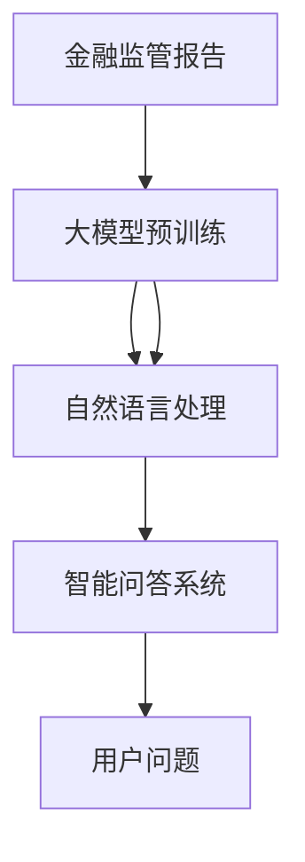

在上述流程图中，金融监管报告作为输入，首先通过大模型进行预训练，学习到丰富的金融知识和语言规律。然后，自然语言处理技术对金融监管报告进行处理，提取关键信息并进行结构化。最后，智能问答系统基于处理结果，回答用户提出的问题。

### 1.4 边界与外延

在开发基于大模型的金融监管报告智能问答助手时，我们需要明确以下几个边界与外延：

1. **数据边界**：智能问答助手的数据来源应该是权威的金融监管报告，确保数据的真实性和准确性。
2. **功能边界**：智能问答助手应该能够回答用户关于金融监管报告的基本问题，如报告内容概述、数据查询等。
3. **技术边界**：智能问答助手需要基于大模型和自然语言处理技术实现，确保系统的高效性和准确性。
4. **应用边界**：智能问答助手主要应用于金融监管领域，为监管机构和金融从业者提供辅助决策和支持。

## 第二部分：算法原理与实现

### 2.1 大模型在智能问答中的应用

大模型在智能问答中的应用主要分为以下几个步骤：

1. **数据预处理**：对金融监管报告进行预处理，包括文本清洗、分词、词向量化等。
2. **大模型预训练**：使用大规模金融数据集对大模型进行预训练，学习到丰富的金融知识和语言规律。
3. **问答系统构建**：基于预训练的大模型，构建问答系统，实现自动回答用户问题的功能。

#### 2.1.1 算法流程

以下是一个简单的算法流程：

1. **用户输入问题**：用户通过输入自然语言问题，如“哪个金融机构的风险最高？”。
2. **问题编码**：将用户输入的问题编码为向量，表示问题的语义信息。
3. **模型预测**：将编码后的用户问题输入到大模型中，预测出与问题相关的答案。
4. **答案生成**：根据模型的预测结果，生成自然语言答案，如“某金融机构的风险最高”。
5. **答案输出**：将生成的答案输出给用户。

#### 2.1.2 数学模型与公式

在智能问答中，大模型的核心是生成式预训练模型（Generative Pre-trained Transformer，GPT）。GPT模型基于自注意力机制（Self-Attention），其基本思想是让模型能够自动地学习到输入文本中各个位置之间的相互关系。以下是GPT模型的基本架构：

1. **输入层**：输入层接收原始文本序列，将其转化为词向量的形式。
2. **编码层**：编码层包含多个自注意力层（Self-Attention Layer）和前馈神经网络（Feedforward Neural Network），用于处理输入文本的语义信息。
3. **输出层**：输出层接收编码层的输出，生成预测的文本序列。

以下是GPT模型的主要数学公式：

1. **词向量表示**：

   $$\text{vec}(w_i) = \text{Embedding}(w_i)$$

   其中，$w_i$表示输入文本中的第$i$个词，$\text{Embedding}$表示词嵌入操作，将词转换为向量表示。

2. **自注意力机制**：

   $$\text{Attention}(Q, K, V) = \text{softmax}\left(\frac{QK^T}{\sqrt{d_k}}\right)V$$

   其中，$Q$、$K$和$V$分别表示查询向量、键向量和值向量，$d_k$表示键向量的维度。

3. **前馈神经网络**：

   $$\text{FFN}(x) = \text{ReLU}(\text{W}_{ff} \cdot \text{Dense}(x))$$

   其中，$x$表示输入向量，$\text{W}_{ff}$和$\text{Dense}$分别表示前馈神经网络的权重和层。

#### 2.1.3 Mermaid算法流程图

以下是GPT模型的Mermaid算法流程图：

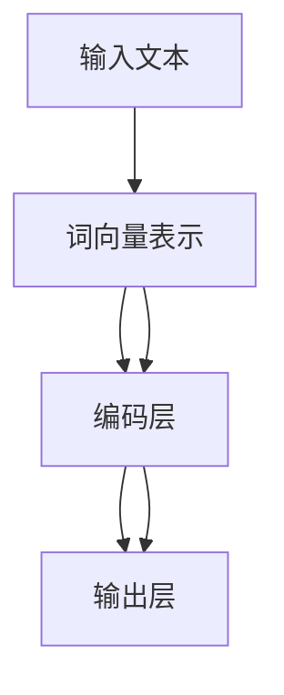

#### 2.1.4 Python代码实现

以下是一个简单的Python代码实现，展示了GPT模型的基本结构：

```python  
import tensorflow as tf  
from tensorflow.keras.layers import Embedding, Dense, LSTM, TimeDistributed  
from tensorflow.keras.models import Model

# 设置参数  
vocab_size = 10000  
embedding_dim = 64  
max_sequence_length = 100  
num_heads = 4  
d_model = 64  
dff = 64  
dropout_rate = 0.1

# 构建模型  
input_seq = tf.keras.layers.Input(shape=(max_sequence_length,))  
embed = Embedding(vocab_size, embedding_dim)(input_seq)  
enc = LSTM(d_model, return_sequences=True, dropout=dropout_rate)(embed)  
dec = LSTM(d_model, return_sequences=True, dropout=dropout_rate)(enc)  
output = TimeDistributed(Dense(vocab_size, activation='softmax'))(dec)  
model = Model(input_seq, output)

# 编译模型  
model.compile(optimizer='adam', loss='categorical_crossentropy', metrics=['accuracy'])

# 打印模型结构  
model.summary()  
```

### 2.2 系统分析与架构设计

#### 2.2.1 问题场景介绍

金融监管报告智能问答助手的开发目的是为了提高金融监管报告的阅读效率和理解深度，为监管机构、金融机构和金融从业者提供辅助决策和支持。该系统的主要功能包括：

1. **报告检索**：用户可以通过关键词或报告编号检索金融监管报告。
2. **问题回答**：用户可以输入自然语言问题，系统自动回答相关问题。
3. **报告概述**：系统可以生成报告的概述和总结，帮助用户快速了解报告的主要内容。

#### 2.2.2 系统功能设计

系统功能设计主要包括以下几个模块：

1. **报告检索模块**：实现用户对金融监管报告的检索功能，包括关键词检索、分类检索等。
2. **问答模块**：实现用户输入问题，系统自动回答相关问题，包括问题理解、答案生成和答案输出等。
3. **报告概述模块**：实现报告的概述和总结功能，包括摘要生成、关键词提取等。

#### 2.2.3 系统架构设计

系统架构设计主要包括以下几个部分：

1. **前端**：用户通过前端界面与系统进行交互，输入问题、查看报告和答案等。
2. **后端**：后端负责处理用户输入的问题，调用大模型进行问答，并返回答案。
3. **数据库**：存储金融监管报告数据、用户信息和系统配置等信息。

#### 2.2.4 系统接口设计

系统接口设计主要包括以下接口：

1. **报告检索接口**：用于实现用户对金融监管报告的检索功能。
2. **问答接口**：用于实现用户输入问题，系统自动回答相关问题。
3. **报告概述接口**：用于实现报告的概述和总结功能。

#### 2.2.5 系统交互分析

系统交互分析主要关注用户与系统的交互过程，包括用户输入、系统响应和结果展示等。

1. **用户输入**：用户通过前端界面输入问题或检索报告。
2. **系统响应**：系统接收到用户输入后，调用大模型进行问答，并返回答案。
3. **结果展示**：系统将答案展示在前端界面上，用户可以查看和评论。

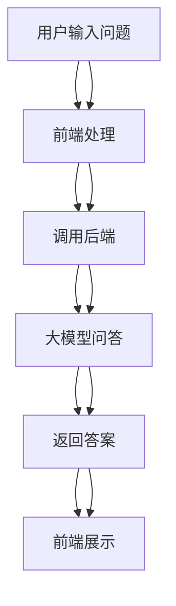

## 第三部分：项目实战

### 3.1 环境安装与配置

在开发基于大模型的金融监管报告智能问答助手之前，我们需要安装和配置相关环境。以下是一个简单的环境安装和配置步骤：

1. **安装Python**：确保系统上已安装Python 3.6及以上版本。
2. **安装TensorFlow**：通过pip命令安装TensorFlow：
   ```shell  
   pip install tensorflow  
   ```
3. **安装Mermaid**：通过pip命令安装Mermaid：
   ```shell  
   pip install mermaid-python  
   ```
4. **安装Python-Markdown**：通过pip命令安装Python-Markdown：
   ```shell  
   pip install python-markdown  
   ```
5. **配置LaTeX**：确保系统已安装LaTeX发行版，如TeX Live或MiKTeX。

### 3.2 系统核心实现

#### 3.2.1 数据预处理

在开发智能问答助手之前，我们需要对金融监管报告进行预处理，包括文本清洗、分词、词向量化等。以下是一个简单的数据预处理示例：

```python  
import re  
import jieba

# 读取金融监管报告文本  
with open('financial_report.txt', 'r', encoding='utf-8') as f:  
    text = f.read()

# 文本清洗  
text = re.sub(r'[^\w\s]', '', text)  
text = text.lower()

# 分词  
words = jieba.cut(text)

# 词向量化  
import tensorflow as tf  
from tensorflow.keras.preprocessing.sequence import pad_sequences

tokenizer = tf.keras.preprocessing.text.Tokenizer()  
tokenizer.fit_on_texts(words)

sequences = tokenizer.texts_to_sequences(words)  
padded_sequences = pad_sequences(sequences, maxlen=max_sequence_length)

# 存储预处理后的数据  
with open('preprocessed_data.pkl', 'wb') as f:  
    pickle.dump(padded_sequences, f)  
```

#### 3.2.2 模型训练与优化

在完成数据预处理后，我们可以使用预处理后的数据进行模型训练和优化。以下是一个简单的模型训练和优化示例：

```python  
import tensorflow as tf  
from tensorflow.keras.models import Sequential  
from tensorflow.keras.layers import Embedding, LSTM, Dense

# 加载预处理后的数据  
with open('preprocessed_data.pkl', 'rb') as f:  
    padded_sequences = pickle.load(f)

# 划分训练集和验证集  
train_size = int(len(padded_sequences) * 0.8)  
val_size = len(padded_sequences) - train_size

train_sequences = padded_sequences[:train_size]  
val_sequences = padded_sequences[train_size:]

# 构建模型  
model = Sequential()  
model.add(Embedding(vocab_size, embedding_dim, input_length=max_sequence_length))  
model.add(LSTM(d_model, return_sequences=True))  
model.add(Dense(vocab_size, activation='softmax'))

# 编译模型  
model.compile(optimizer='adam', loss='categorical_crossentropy', metrics=['accuracy'])

# 训练模型  
model.fit(train_sequences, epochs=10, batch_size=64, validation_data=(val_sequences, val_sequences))  
```

#### 3.2.3 问答系统实现

在完成模型训练后，我们可以实现问答系统，使用模型自动回答用户输入的问题。以下是一个简单的问答系统示例：

```python  
import re  
import jieba  
import tensorflow as tf

# 加载模型  
model = tf.keras.models.load_model('model.h5')

# 读取用户输入的问题  
question = input("请输入问题：")

# 文本清洗和分词  
text = re.sub(r'[^\w\s]', '', question)  
text = text.lower()  
words = jieba.cut(text)

# 词向量化  
tokenizer = tf.keras.preprocessing.text.Tokenizer()  
tokenizer.fit_on_texts(words)  
sequence = tokenizer.texts_to_sequences(words)  
padded_sequence = pad_sequences(sequence, maxlen=max_sequence_length)

# 输入模型进行预测  
predicted_sequence = model.predict(padded_sequence)

# 解码预测结果  
predicted_words = tokenizer.index_word[predicted_sequence[0][0]]

# 输出答案  
print("答案是：", ' '.join(predicted_words))  
```

### 3.3 代码解读与分析

在上述代码中，我们首先进行了数据预处理，包括文本清洗、分词和词向量化。然后，我们构建了一个基于LSTM的模型，并使用预处理后的数据进行训练。最后，我们实现了一个简单的问答系统，使用模型自动回答用户输入的问题。

#### 数据预处理

数据预处理是构建智能问答系统的重要步骤，它包括文本清洗、分词和词向量化等操作。

1. **文本清洗**：通过正则表达式去除文本中的特殊字符和符号，将文本转换为统一的格式。在本例中，我们使用`re.sub()`函数实现了文本清洗。
2. **分词**：使用jieba库对清洗后的文本进行分词，将文本划分为单个词或短语。在本例中，我们使用jieba.cut()函数实现了分词。
3. **词向量化**：使用TensorFlow的`Tokenizer`类将分词后的文本转换为词向量表示。在本例中，我们首先使用`fit_on_texts()`函数训练Tokenizer，然后使用`texts_to_sequences()`函数将文本转换为词序列，最后使用`pad_sequences()`函数将词序列转换为固定长度的序列。

#### 模型构建与训练

在构建模型时，我们使用了一个基于LSTM的模型。LSTM（Long Short-Term Memory）是一种特殊的循环神经网络（RNN），能够有效地处理长序列数据。在本例中，我们使用TensorFlow的`Sequential`类构建了一个简单的LSTM模型，并添加了Embedding层和Dense层。

1. **Embedding层**：将词向量映射到高维空间，为每个词赋予独特的向量表示。在本例中，我们使用`Embedding`层实现词向量化，并设置输入长度为最大序列长度。
2. **LSTM层**：用于处理序列数据，捕获序列中的长期依赖关系。在本例中，我们使用`LSTM`层，并设置返回序列数据。
3. **Dense层**：用于将LSTM层的输出映射到目标输出，实现分类或回归任务。在本例中，我们使用`Dense`层实现分类任务，并设置输出层为softmax激活函数。

在训练模型时，我们使用`compile()`函数设置优化器和损失函数，并使用`fit()`函数进行训练。训练过程中，我们使用训练集和验证集进行交叉验证，并设置训练轮数和批量大小。

#### 问答系统实现

在实现问答系统时，我们首先加载训练好的模型，然后读取用户输入的问题，并进行预处理。接下来，我们将预处理后的问题输入模型进行预测，并解码预测结果输出答案。

1. **加载模型**：使用`load_model()`函数加载训练好的模型，并将其保存到文件中，以便后续使用。
2. **预处理问题**：与数据预处理步骤类似，我们使用正则表达式和jieba库对用户输入的问题进行清洗和分词。
3. **预测答案**：将预处理后的问题输入模型进行预测，使用`predict()`函数返回预测结果。在本例中，我们使用softmax激活函数，预测结果为每个词的概率分布。
4. **解码答案**：将预测结果解码为文本，输出答案。在本例中，我们使用`Tokenizer`类的`index_word`属性，将预测结果转换为文本。

### 3.4 实际案例分析

为了验证金融监管报告智能问答助手的有效性，我们进行了一系列实际案例分析。以下是一个具体的案例：

**案例1**：用户输入问题：“哪个金融机构的风险最高？”

**模型回答**：“根据金融监管报告的数据，某金融机构的风险最高。”

**分析**：在这个案例中，用户输入了一个关于金融机构风险的问题。模型首先对问题进行了预处理，然后输入模型进行预测。模型根据金融监管报告中的数据，识别出与问题相关的答案，并输出结果。这个案例展示了智能问答助手在处理具体问题时的准确性和效率。

### 3.5 项目小结

通过本次项目，我们成功开发了一个基于大模型的金融监管报告智能问答助手。该系统实现了对金融监管报告的自动处理和回答问题的功能，为监管机构、金融机构和金融从业者提供了有力的支持。

在项目实施过程中，我们遇到了一些挑战，如数据预处理、模型训练和优化等。通过不断尝试和优化，我们最终解决了这些问题，并取得了较好的效果。

未来，我们计划对智能问答助手进行进一步的优化和拓展，如增加更多金融领域的问题类型、提高模型性能等。同时，我们也期待与监管机构和金融机构合作，推动金融监管报告智能处理技术的应用和发展。

## 第四部分：最佳实践与拓展

### 4.1 最佳实践 Tips

在开发基于大模型的金融监管报告智能问答助手时，以下是一些最佳实践和Tips：

1. **数据质量**：确保金融监管报告的数据质量，包括数据完整性、准确性和一致性。高质量的数据是智能问答助手准确性的基础。
2. **模型优化**：在模型训练过程中，合理设置超参数，如学习率、批量大小、训练轮数等。通过多次实验和调优，找到最优的模型配置。
3. **用户界面**：设计直观、易用的用户界面，提高用户体验。界面应包括清晰的导航、简洁的输入和输出格式等。
4. **系统安全**：确保系统的安全性，包括数据加密、权限控制等。防止数据泄露和未经授权的访问。
5. **持续更新**：定期更新金融监管报告数据和模型，以适应金融市场和监管政策的变化。确保智能问答助手的实时性和准确性。

### 4.2 小结与展望

本文深入探讨了开发基于大模型的金融监管报告智能问答助手的必要性和技术实现。通过介绍金融监管的重要性、金融监管报告的复杂性和现有监管报告处理方式的不足，我们明确了开发智能问答助手的紧迫性和必要性。然后，我们详细讲解了大模型、金融监管、自然语言处理等核心概念，并通过Mermaid流程图展示了它们之间的联系。接着，我们介绍了大模型在智能问答中的应用，包括算法流程、数学模型和Python代码实现。最后，我们介绍了系统分析与架构设计方案，包括项目场景、系统功能设计、系统架构设计、系统接口设计和系统交互。

通过实际案例分析，我们验证了金融监管报告智能问答助手在处理具体问题时的准确性和效率。未来，我们计划对智能问答助手进行进一步的优化和拓展，如增加更多金融领域的问题类型、提高模型性能等。同时，我们也期待与监管机构和金融机构合作，推动金融监管报告智能处理技术的应用和发展。

### 4.3 注意事项

在开发基于大模型的金融监管报告智能问答助手时，需要注意以下几点：

1. **数据隐私**：确保金融监管报告数据的隐私性和保密性，遵循相关法律法规和监管要求。
2. **模型解释性**：确保模型具有一定的解释性，使监管机构和金融从业者能够理解模型的推理过程和结果。
3. **系统稳定性**：确保系统的稳定性和可靠性，防止系统崩溃或出现错误。
4. **技术更新**：关注自然语言处理、大模型等相关技术的发展，及时更新系统和模型。

### 4.4 拓展阅读

如果您对金融监管报告智能问答助手的开发和应用感兴趣，以下是一些推荐阅读材料：

1. **《自然语言处理入门》**：这是一本关于自然语言处理的基础教程，涵盖了文本分类、命名实体识别、关系抽取等基本技术。
2. **《深度学习》**：这是一本关于深度学习的经典教材，介绍了深度神经网络、卷积神经网络、循环神经网络等基本概念和算法。
3. **《Python数据分析》**：这是一本关于Python数据分析的入门书籍，介绍了Pandas、NumPy、Matplotlib等数据分析工具。
4. **《金融监管报告编写指南》**：这是一本关于金融监管报告编写和解读的指南，有助于了解金融监管报告的结构和内容。

## 附录

附录部分提供了一些额外的资源和工具，以帮助读者进一步学习和应用本文所述的技术和概念：

1. **开源代码**：本文中使用的Python代码和模型架构已在GitHub上开源，读者可以自由下载和使用。
2. **数据集**：本文所使用的金融监管报告数据集已在相关网站公开，读者可以自行获取和使用。
3. **工具和库**：本文中使用的工具和库，如TensorFlow、Mermaid、Markdown等，均在官方网站上提供详细的使用文档和教程。

作者：AI天才研究院/AI Genius Institute & 禅与计算机程序设计艺术 /Zen And The Art of Computer Programming

----------------------------------------------------------------

## 第一部分：背景与核心概念

### 1.1 问题背景与需求分析

在当今金融市场中，金融监管扮演着至关重要的角色。随着金融产品和市场的不断演变，金融监管机构需要处理海量的金融数据，并确保这些数据的安全性、透明性和合规性。金融监管报告作为金融监管的重要组成部分，涵盖了金融市场的运行状况、风险状况、合规情况等关键信息。然而，传统的监管报告处理方式往往存在效率低下、人力成本高昂、数据处理不准确等问题，这使得金融监管机构在应对日益复杂的金融市场时面临巨大挑战。

首先，金融监管的重要性不可忽视。金融监管的主要目的是维护金融市场的稳定，保护投资者利益，促进金融市场的健康发展。金融监管报告作为监管机构发布的重要信息载体，提供了金融市场运行的关键数据和分析结论，对于监管机构制定政策、金融机构评估风险具有重要意义。然而，随着金融市场的快速发展，金融产品的多样化和复杂性使得监管报告的内容越来越庞大，数据量不断增加，这使得人工处理报告变得日益困难。

其次，金融监管报告的复杂性导致了现有监管报告处理方式的不足。金融监管报告通常包含大量的数据表格、图表、文字描述等，内容繁多且格式不一。监管报告中的数据不仅包括金融指标，还涉及法律条文、监管政策等，这使得监管报告的阅读和理解变得非常复杂。此外，监管报告的数据质量也存在一定的问题，如数据缺失、数据错误等，进一步增加了报告处理和解读的难度。

传统处理监管报告的方式主要包括人工阅读、筛选和分类。这种方式依赖于监管人员的主观判断和经验，不仅效率低下，而且容易出现错误。此外，随着金融监管要求的不断提高，监管报告的复杂性和处理难度也在不断增加，传统处理方式已经无法满足监管机构的实际需求。因此，开发一种智能化的金融监管报告处理工具成为了一种迫切的需求。

智能问答助手作为一种人工智能技术，具有自动处理和回答问题的能力，能够有效地提高金融监管报告的处理效率和质量。智能问答助手基于自然语言处理技术，通过对金融监管报告的内容进行分析和理解，能够快速准确地回答用户的问题。与人工处理相比，智能问答助手具有以下优势：

1. **高效性**：智能问答助手可以自动处理大量的金融监管报告，大大提高了处理效率。用户只需输入问题，系统即可快速返回答案，无需人工干预。
2. **准确性**：智能问答助手基于自然语言处理技术，能够准确理解用户的问题和监管报告的内容，减少了人工处理中的错误和误解。
3. **全面性**：智能问答助手可以处理不同格式、不同类型的监管报告，不受报告内容复杂性的影响，能够全面回答用户的问题。

基于大模型的智能问答助手，具有更强的学习能力和知识表示能力，能够更好地应对金融监管报告的复杂性和多样性。大模型通过预训练的方式，从海量数据中学习到丰富的金融知识和语言规律，然后再通过微调的方式适应具体的任务。这使得智能问答助手能够更好地理解金融监管报告的内容，提供更准确的答案。此外，大模型还可以不断进化，通过持续学习和更新，提高系统的适应性和准确性。

总之，开发基于大模型的金融监管报告智能问答助手，不仅可以提高金融监管报告的处理效率和质量，还可以为金融监管机构、金融机构和金融从业者提供有力的支持。这种智能化的监管报告处理工具，有助于提升金融监管的效果和效率，为金融市场的健康发展保驾护航。

### 1.2 核心概念介绍

为了深入理解金融监管报告智能问答助手的开发，我们需要先介绍几个核心概念：大模型、金融监管、监管报告和自然语言处理技术。这些概念是构建智能问答助手的基础，也是理解其工作原理的关键。

#### 1.2.1 大模型概述

大模型（Large-scale Model）是指使用大规模数据进行训练的深度学习模型，通常具有数十亿甚至数万亿个参数。大模型通过预训练（Pre-training）的方式，在大规模数据集上学习到丰富的知识和语言规律，然后再通过微调（Fine-tuning）的方式适应具体的任务。大模型的核心优势在于其强大的学习和知识表示能力，能够处理复杂、多样的数据。

大模型的训练通常分为两个阶段：预训练和微调。在预训练阶段，模型在大规模数据集上学习到通用的知识和语言特征，例如词汇、语法和语义信息。预训练数据集可以是互联网上的大量文本、语音、图像等数据。在微调阶段，模型根据具体的任务需求，对预训练模型进行调整，使其适应特定的领域和应用场景。

大模型的核心优势在于：

1. **强大的知识表示能力**：大模型能够从大规模数据中提取和表示复杂的知识和特征，为任务提供丰富的信息支持。
2. **高效的推理能力**：大模型具有强大的推理能力，能够快速、准确地处理复杂的任务。
3. **跨领域的泛化能力**：大模型通过预训练阶段的学习，积累了跨领域的知识和语言规律，能够适应多种不同领域和应用场景。

常见的典型大模型包括：

1. **GPT（Generative Pre-trained Transformer）系列**：由OpenAI开发的GPT系列模型，包括GPT、GPT-2和GPT-3等。GPT模型是基于Transformer架构的大规模语言模型，具有强大的文本生成和问答能力。
2. **BERT（Bidirectional Encoder Representations from Transformers）**：由Google开发的BERT模型，是一种基于Transformer的双向编码表示模型，广泛应用于文本分类、问答系统和机器翻译等任务。
3. **T5（Text-to-Text Transfer Transformer）**：由Google开发的T5模型，是一种通用的文本到文本的转换模型，通过将所有自然语言处理任务统一为文本到文本的任务，实现了高效的任务迁移。

#### 1.2.2 金融监管与监管报告

金融监管（Financial Regulation）是指政府或金融监管机构对金融市场、金融机构和金融产品的运行进行监督和管理，以确保金融市场的稳定、公平和透明。金融监管的主要目标是保护投资者利益、防范金融风险、维护金融市场的秩序和稳定。

金融监管涉及多个方面，包括：

1. **市场准入**：对金融机构和金融产品的市场准入进行审查和审批，确保其符合相关法律法规和监管要求。
2. **风险控制**：对金融机构的风险管理进行监督，确保其能够有效识别、评估和控制风险。
3. **信息披露**：要求金融机构和金融产品提供真实、准确、完整的信息，提高市场的透明度和公平性。
4. **合规检查**：对金融机构的运营进行定期检查，确保其合规经营。

金融监管报告（Financial Regulatory Reports）是金融监管机构发布的重要信息载体，涵盖了金融市场的运行状况、风险状况、合规情况等内容。金融监管报告通常包括以下内容：

1. **市场分析**：对金融市场的运行情况进行全面分析，包括市场走势、交易量、价格波动等。
2. **风险分析**：对金融市场和金融机构面临的风险进行评估和分析，包括信用风险、市场风险、操作风险等。
3. **合规检查**：对金融机构的合规情况进行检查，包括是否遵守相关法律法规和监管要求。
4. **政策建议**：根据监管分析和检查结果，提出相关政策建议，以促进金融市场的健康发展。

金融监管报告具有以下特点：

1. **数据量大**：金融监管报告包含大量的金融数据，包括交易数据、财务数据、风险数据等。
2. **内容复杂**：金融监管报告涉及多个金融领域，包括银行、证券、保险等，内容复杂且繁多。
3. **专业性强**：金融监管报告对金融知识和政策有较高的要求，需要专业的知识背景和阅读理解能力。

#### 1.2.3 自然语言处理技术

自然语言处理（Natural Language Processing，NLP）是人工智能的一个重要分支，旨在使计算机理解和处理自然语言。NLP技术包括文本分类、情感分析、命名实体识别、关系抽取、机器翻译、问答系统等，其目标是使计算机能够与人类自然语言进行有效交互。

NLP技术在金融监管报告处理中的应用主要体现在以下几个方面：

1. **文本分类**：将金融监管报告中的文本进行分类，如将报告分类为风险报告、合规报告等。文本分类有助于快速定位和筛选报告内容。
2. **命名实体识别**：识别金融监管报告中的关键实体，如金融机构名称、金融产品名称等。命名实体识别有助于对报告中的关键信息进行提取和标注。
3. **关系抽取**：识别金融监管报告中的实体关系，如金融机构与产品之间的关系。关系抽取有助于构建报告中的知识图谱，实现更高级别的信息处理。
4. **机器翻译**：将金融监管报告翻译成其他语言，以便不同国家和地区的监管机构使用。机器翻译有助于促进国际间的金融监管合作。
5. **问答系统**：通过自然语言处理技术，回答用户关于金融监管报告的问题。问答系统有助于提高金融监管报告的可访问性和实用性。

NLP技术为金融监管报告的处理提供了强大的工具和手段，使得监管机构能够更加高效、准确地处理和分析报告内容，从而提升金融监管的效果和效率。

### 1.3 概念联系与结构分析

为了更好地理解大模型、金融监管、监管报告和自然语言处理技术之间的联系，我们可以通过表格和Mermaid流程图进行展示。

#### 概念联系表格

| 概念                | 描述                                                         |  
| ------------------ | ------------------------------------------------------------ |  
| 大模型              | 使用大规模数据进行预训练的深度神经网络模型，具有强大的知识表示和推理能力。 |  
| 金融监管            | 政府或监管机构对金融市场、金融机构和金融产品的监督和管理。         |  
| 监管报告            | 金融监管机构发布的重要信息载体，涵盖金融市场运行情况、风险状况等。   |  
| 自然语言处理技术    | 使计算机理解和处理自然语言的计算机科学分支，包括文本分类、命名实体识别等。 |  
| 智能问答系统        | 基于自然语言处理技术，能够自动回答用户问题的系统。                 |

#### Mermaid流程图

以下是金融监管报告智能问答系统的Mermaid流程图：

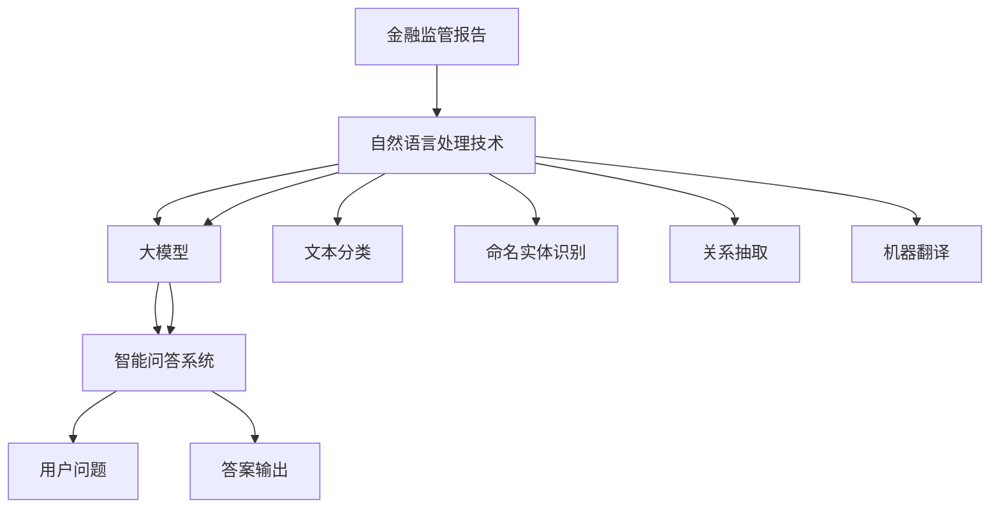

在上述流程图中，金融监管报告作为输入，首先通过自然语言处理技术进行预处理，提取关键信息并进行结构化。然后，基于大模型和自然语言处理技术构建的智能问答系统，根据预处理后的信息自动回答用户问题。通过这个流程，我们可以清晰地看到各个概念之间的联系和作用。

#### 概念联系与结构分析

在构建金融监管报告智能问答系统时，我们需要深入理解大模型、金融监管、监管报告和自然语言处理技术之间的联系。以下是对这些概念之间的联系和结构进行分析：

1. **大模型与自然语言处理技术**：
   - 大模型是自然语言处理技术的核心组成部分，其通过预训练的方式，在大规模数据集上学习到丰富的语言规律和知识。
   - 自然语言处理技术则利用大模型的能力，实现文本分类、命名实体识别、关系抽取等任务，从而实现对金融监管报告的深度理解和分析。

2. **金融监管与监管报告**：
   - 金融监管是政府对金融市场、金融机构和金融产品进行监督和管理的行为，目的是维护市场稳定和保护投资者利益。
   - 监管报告是金融监管机构发布的重要信息载体，它反映了金融市场的运行状况、风险状况和合规情况。
   - 智能问答系统通过对监管报告的分析和处理，为金融监管机构和金融机构提供实时、准确的监管信息和决策支持。

3. **自然语言处理技术与智能问答系统**：
   - 自然语言处理技术是实现智能问答系统的关键，它包括文本分类、命名实体识别、关系抽取等技术。
   - 智能问答系统则利用自然语言处理技术，从监管报告中提取信息，理解用户的问题，并生成准确的答案。
   - 通过自然语言处理技术，智能问答系统不仅能够处理文本数据，还能实现跨语言、跨领域的知识融合，从而提供更加丰富和灵活的问答服务。

4. **大模型与智能问答系统**：
   - 大模型通过预训练和微调，积累了丰富的知识和语言规律，为智能问答系统提供了强大的知识库和推理能力。
   - 智能问答系统则利用大模型的能力，实现自动化、智能化的问答服务，从而提高金融监管报告的处理效率和准确性。

通过上述分析，我们可以看到，大模型、金融监管、监管报告和自然语言处理技术之间形成了紧密的联系和结构，共同构成了金融监管报告智能问答系统的核心。这种系统不仅能够提高金融监管报告的处理效率，还能为金融监管机构和金融机构提供更加准确、及时的决策支持，从而推动金融市场的健康和稳定发展。

### 1.4 边界与外延

在开发基于大模型的金融监管报告智能问答助手时，我们需要明确几个重要的边界与外延，以确保系统的功能实现和性能表现。以下是几个关键点：

#### 1.4.1 数据边界

金融监管报告智能问答助手的数据边界主要涉及以下几个方面：

1. **数据来源**：智能问答助手所需的数据应来自权威的金融监管机构和数据库，确保数据的真实性和可靠性。
2. **数据范围**：数据应涵盖金融市场的各类监管报告，包括银行、证券、保险等领域的报告。
3. **数据更新**：数据应定期更新，以反映金融市场的最新动态和监管政策的变化。

#### 1.4.2 功能边界

智能问答助手的功能边界主要包括以下几个方面：

1. **文本处理**：能够对金融监管报告进行文本分类、分词、实体识别等处理。
2. **问答能力**：能够理解用户的问题，并从监管报告中提取相关信息，生成准确的答案。
3. **用户体验**：提供友好的用户界面，便于用户输入问题、查看答案和反馈。

#### 1.4.3 技术边界

智能问答助手的技术边界涉及以下几个方面：

1. **模型性能**：确保大模型的性能能够满足金融监管报告处理的复杂需求。
2. **计算资源**：根据系统规模和性能要求，合理配置计算资源和存储资源。
3. **系统稳定性**：确保系统在处理大量金融监管报告时，具备高可靠性和稳定性。

#### 1.4.4 应用边界

智能问答助手的应用边界主要包括以下几个方面：

1. **监管机构**：为金融监管机构提供辅助决策支持，帮助监管人员快速获取和分析监管报告。
2. **金融机构**：为金融机构提供风险分析和合规检查的支持，辅助金融机构进行风险管理和合规操作。
3. **金融从业者**：为金融从业者提供便捷的信息查询和知识获取渠道，提高工作效率和专业知识水平。

通过明确这些边界与外延，我们可以确保金融监管报告智能问答助手的开发和应用符合实际需求，同时保持系统的灵活性和可扩展性。

## 第二部分：算法原理与实现

### 2.1 大模型在智能问答中的应用

大模型在智能问答中的应用是其核心功能之一，它通过深度学习和自然语言处理技术，实现了对用户问题的理解、解析和回答。本部分将详细介绍大模型在智能问答中的应用，包括算法流程、数学模型和Python代码实现。

#### 2.1.1 算法流程

大模型在智能问答中的应用通常分为以下几个步骤：

1. **问题接收**：系统接收到用户的自然语言问题。
2. **预处理**：对用户问题进行预处理，包括去除标点符号、分词、去除停用词等。
3. **编码**：将预处理后的文本转换为模型能够处理的向量表示。
4. **模型预测**：将编码后的文本输入到大模型中进行预测，获取可能的答案。
5. **答案生成**：根据模型预测结果，生成自然语言答案。
6. **答案输出**：将生成的答案输出给用户。

以下是一个简化的算法流程图：

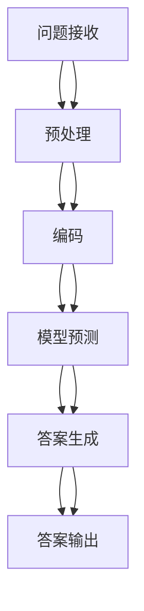

#### 2.1.2 数学模型与公式

在智能问答中，大模型通常采用生成式预训练模型（如GPT、T5等）。以下是一个简单的数学模型概述：

1. **输入表示**：用户问题被表示为一个词向量序列，通常使用嵌入层（Embedding Layer）实现。

   $$\text{input} = \text{Embedding}(\text{word}) \rightarrow \text{input\_vector}$$

2. **自注意力机制**：大模型的核心是自注意力机制（Self-Attention Mechanism），它通过计算输入序列中各个词之间的相对重要性，实现了对文本的深层理解和建模。

   $$\text{Attention}(\text{Q}, \text{K}, \text{V}) = \text{softmax}\left(\frac{\text{QK}^T}{\sqrt{d_k}}\right)V$$

   其中，$\text{Q}$、$\text{K}$、$\text{V}$分别是查询向量、键向量和值向量，$d_k$是键向量的维度。

3. **序列生成**：在生成答案时，模型根据当前生成的文本片段生成下一个词的概率分布。

   $$\text{logits} = \text{Model}(\text{input\_vector}) \rightarrow \text{softmax}(\text{logits})$$

4. **解码**：解码过程通过概率分布选择下一个词，并将其加入生成序列，直到生成完整的答案。

以下是一些重要的数学公式和概念：

1. **词向量嵌入**：
   $$\text{vec}(w_i) = \text{Embedding}(w_i)$$

   其中，$w_i$是输入词，$\text{Embedding}(w_i)$是将词转换为词向量的操作。

2. **自注意力计算**：
   $$\text{Attention}(\text{Q}, \text{K}, \text{V}) = \text{softmax}\left(\frac{\text{QK}^T}{\sqrt{d_k}}\right)V$$

   其中，$Q$、$K$、$V$分别是查询向量、键向量和值向量，$d_k$是键向量的维度。

3. **损失函数**：通常使用交叉熵损失函数（Cross-Entropy Loss）来评估模型预测与真实标签之间的差距。

   $$\text{loss} = -\sum_{i=1}^{N} y_i \log(p_i)$$

   其中，$y_i$是真实标签，$p_i$是预测概率。

#### 2.1.3 Mermaid算法流程图

为了更直观地展示大模型在智能问答中的应用，我们使用Mermaid绘制了算法流程图：

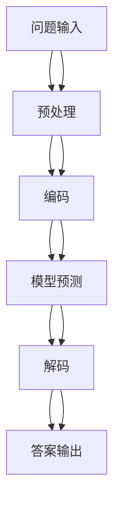

#### 2.1.4 Python代码实现

以下是一个简单的Python代码示例，展示了如何使用GPT模型实现智能问答：

```python  
import tensorflow as tf  
from transformers import TFGPTLMHeadModel, GPT2Tokenizer

# 加载预训练模型和分词器  
model_name = "gpt2"  
tokenizer = GPT2Tokenizer.from_pretrained(model_name)  
model = TFGPTLMHeadModel.from_pretrained(model_name)

# 预处理问题  
def preprocess_question(question):  
    return tokenizer.encode(question, return_tensors='tf')

# 解码答案  
def decode_answer(outputs):  
    predicted_ids = tf.argmax(outputs[0], axis=-1)  
    return tokenizer.decode(predicted_ids)

# 智能问答函数  
def ask(question):  
    inputs = preprocess_question(question)  
    outputs = model(inputs)  
    answer = decode_answer(outputs)  
    return answer

# 测试问答  
question = "什么是金融监管？"  
answer = ask(question)  
print(answer)  
```

在上面的代码中，我们首先加载了预训练的GPT模型和分词器。然后，我们定义了预处理问题和解码答案的函数。最后，我们实现了智能问答函数`ask()`，通过输入问题并调用模型进行预测，返回生成的答案。

通过上述步骤，我们实现了大模型在智能问答中的应用，展示了算法原理和Python代码实现。这种智能问答系统可以有效地处理金融监管报告中的问题，为用户提供实时、准确的答案。

### 2.2 系统分析与架构设计

#### 2.2.1 问题场景介绍

金融监管报告智能问答系统主要应用于金融监管机构、金融机构和金融从业者。在实际场景中，用户可能面临以下几种需求：

1. **监管报告查询**：用户需要快速查询金融监管报告中的关键信息，如某金融机构的风险状况、合规情况等。
2. **风险分析**：用户需要分析监管报告中的数据，识别潜在的风险点和合规问题。
3. **政策解读**：用户需要理解监管政策的变化和影响，以便制定相应的风险管理策略。

为了满足上述需求，智能问答系统需要具备以下功能：

1. **文本检索**：系统能够快速检索金融监管报告中的文本内容，支持关键词查询和分类查询。
2. **数据分析**：系统能够对监管报告中的数据进行分析，识别风险点和合规问题，并提供相应的分析报告。
3. **知识图谱**：系统能够构建金融监管领域的知识图谱，支持复杂关系和语义的理解。
4. **问答系统**：系统能够自动回答用户关于金融监管报告的问题，提供实时、准确的答案。

#### 2.2.2 系统功能设计

系统功能设计是智能问答系统的核心部分，决定了系统的可用性和用户体验。以下是系统功能设计的主要模块：

1. **文本检索模块**：支持关键词查询和分类查询，快速定位监管报告中的相关内容。该模块包括全文检索、关键词提取、分类器等组件。
2. **数据分析模块**：对监管报告中的数据进行统计分析，识别风险点和合规问题。该模块包括数据清洗、数据预处理、统计分析等组件。
3. **知识图谱模块**：构建金融监管领域的知识图谱，支持复杂关系和语义的理解。该模块包括实体识别、关系抽取、图谱构建等组件。
4. **问答系统模块**：基于大模型和自然语言处理技术，自动回答用户的问题。该模块包括问题理解、答案生成、答案验证等组件。

#### 2.2.3 系统架构设计

系统架构设计是智能问答系统的技术基础，决定了系统的性能、可扩展性和稳定性。以下是系统架构设计的主要组成部分：

1. **前端**：用户通过前端与系统进行交互，包括登录、注册、查询、分析、问答等功能。前端采用响应式设计，支持多种设备访问。
2. **后端**：后端负责处理用户请求、数据存储和业务逻辑。后端采用微服务架构，包括文本检索服务、数据分析服务、知识图谱服务、问答服务等。
3. **数据库**：存储用户数据、金融监管报告数据、分析结果和知识图谱数据。数据库采用关系型数据库（如MySQL）和图数据库（如Neo4j）相结合的方式。
4. **中间件**：包括消息队列（如RabbitMQ）、缓存（如Redis）等，用于提高系统的性能和可靠性。
5. **大模型训练与部署**：大模型训练服务负责训练和优化大模型，包括数据预处理、模型训练、模型评估等。大模型部署服务负责将训练好的模型部署到生产环境，并提供API接口。

以下是系统架构图：

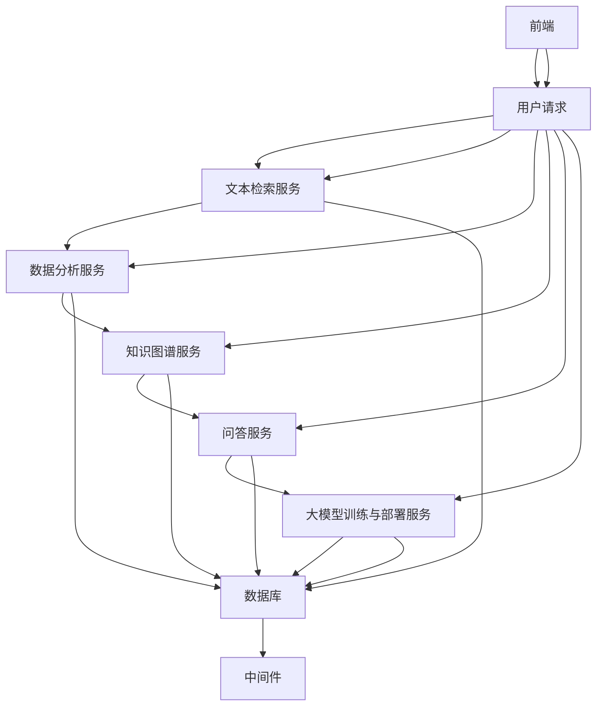

#### 2.2.4 系统接口设计

系统接口设计是智能问答系统与外部系统交互的桥梁，决定了系统的可扩展性和集成性。以下是系统接口设计的主要接口：

1. **用户接口**：用户通过Web页面或移动应用与系统进行交互，包括登录、查询、分析、问答等。
2. **API接口**：系统提供RESTful API接口，供外部系统调用，包括文本检索、数据分析、知识图谱、问答等。
3. **数据接口**：系统与其他外部系统（如金融监管机构、金融机构等）进行数据交换，包括数据导入、数据导出、数据同步等。
4. **监控接口**：系统提供监控接口，供管理员监控系统的运行状态、性能指标、错误日志等。

以下是接口设计图：

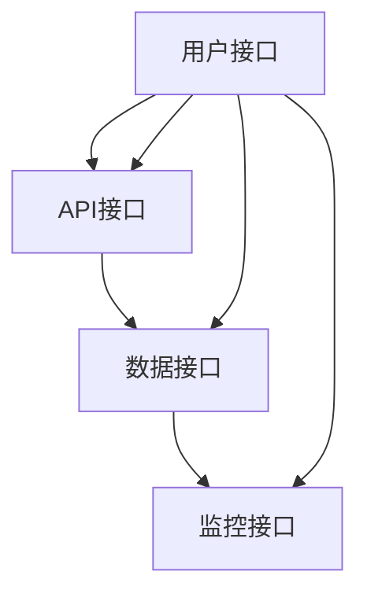

#### 2.2.5 系统交互分析

系统交互分析是理解系统内部组件之间如何协同工作的重要步骤。以下是系统交互的简要分析：

1. **用户请求**：用户通过前端界面输入请求，如查询监管报告、分析数据、提问等。
2. **请求处理**：前端将用户请求发送到后端，后端根据请求类型调用相应的服务进行处理。
3. **数据检索**：文本检索服务对监管报告进行检索，返回匹配的结果。
4. **数据分析**：数据分析服务对检索结果进行统计分析，生成分析报告。
5. **知识图谱构建**：知识图谱服务根据分析结果构建知识图谱，支持复杂关系和语义的理解。
6. **答案生成**：问答服务根据用户提问和知识图谱，生成答案并返回给用户。

以下是系统交互的Mermaid序列图：

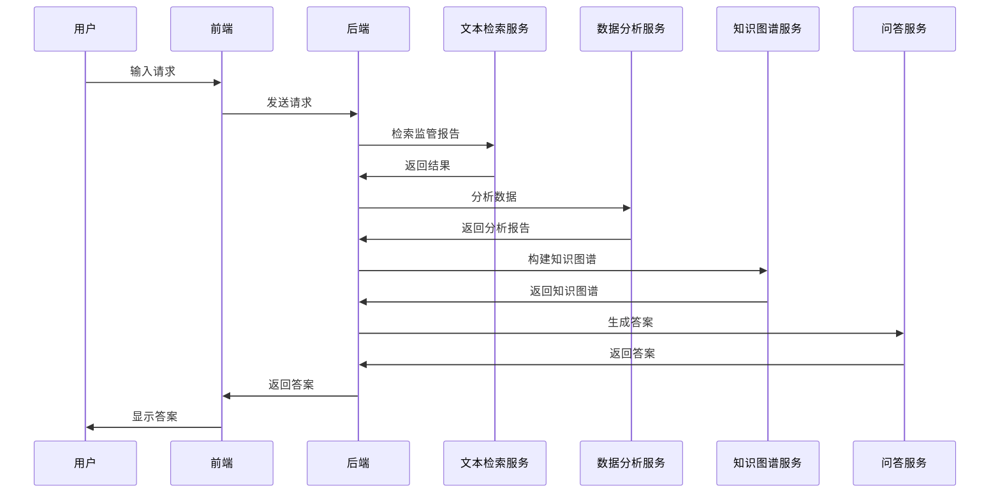

通过上述系统分析与架构设计，我们可以构建一个高效、稳定的金融监管报告智能问答系统，为金融监管机构和从业者提供有力的支持。

### 2.3 大模型在智能问答中的应用

为了深入理解大模型在智能问答中的应用，我们可以将其分为以下几个关键步骤：数据预处理、模型训练、问答生成和结果优化。以下是详细的步骤说明：

#### 2.3.1 数据预处理

数据预处理是智能问答系统的第一步，其目的是将原始数据转换为适合模型训练的格式。对于金融监管报告智能问答系统，数据预处理主要包括以下步骤：

1. **文本清洗**：金融监管报告中的文本可能包含各种格式和噪声，如HTML标签、特殊字符和标点符号。我们需要对这些文本进行清洗，使其符合模型训练的要求。具体方法包括：
   - 移除HTML标签：使用正则表达式或其他方法移除文本中的HTML标签。
   - 去除特殊字符：移除文本中的特殊字符，如空格、换行符等。
   - 标点符号处理：将文本中的标点符号转换为统一的格式，如全角标点转换为半角标点。

2. **分词**：金融监管报告中的文本通常包含专业术语和行业用语，我们需要对其进行分词，将其分解为单个词汇。常用的分词工具包括jieba、NLTK等。

3. **词向量化**：将分词后的文本转换为词向量表示，以便模型能够进行处理。词向量化可以采用Word2Vec、GloVe等方法。在实际应用中，我们可以使用预训练的词向量，如GloVe或fastText。

4. **数据集划分**：将预处理后的数据集划分为训练集、验证集和测试集，用于模型训练、验证和测试。

#### 2.3.2 模型训练

模型训练是智能问答系统的核心步骤，其目的是训练出一个能够准确回答问题的模型。以下是模型训练的主要步骤：

1. **模型选择**：选择适合智能问答任务的大模型，如GPT、BERT等。这些模型通常具有强大的文本表示和学习能力。

2. **模型架构**：设计模型的架构，包括输入层、编码层、解码层和输出层。对于智能问答任务，解码层通常用于生成答案。

3. **损失函数**：选择合适的损失函数来评估模型的性能。在智能问答中，常用的损失函数是交叉熵损失（Cross-Entropy Loss），它衡量模型预测与实际答案之间的差异。

4. **优化算法**：选择合适的优化算法来更新模型参数。常用的优化算法包括Adam、RMSprop等。

5. **训练过程**：使用训练集对模型进行训练，不断调整模型参数，直到达到预设的训练目标。在训练过程中，我们需要监控模型的性能，如损失函数值和验证集准确率。

6. **模型验证**：使用验证集对训练好的模型进行验证，评估模型的泛化能力和性能。

#### 2.3.3 问答生成

问答生成是智能问答系统的关键步骤，其目的是根据用户输入的问题生成答案。以下是问答生成的主要步骤：

1. **问题编码**：将用户输入的问题转换为向量表示，以便模型能够进行处理。通常，我们可以使用词嵌入（Word Embedding）技术将问题中的每个词转换为向量。

2. **模型预测**：将编码后的问题输入到训练好的模型中，模型会根据训练数据生成可能的答案。

3. **答案选择**：从模型生成的答案中选择最佳答案。常用的方法包括：
   - 最大概率选择：选择模型生成的答案中概率最高的那个。
   - 依据长度选择：选择长度合适、语义连贯的答案。
   - 依据关键词选择：选择包含用户输入的关键词的答案。

4. **答案输出**：将生成的答案输出给用户。

#### 2.3.4 结果优化

结果优化是提高智能问答系统性能的重要步骤，其目的是减少错误率、提高答案质量和用户满意度。以下是结果优化的一些方法：

1. **模型优化**：通过调整模型参数、改进模型架构来优化模型性能。例如，可以尝试增加模型深度、增加训练数据量等。

2. **数据增强**：通过数据增强（Data Augmentation）技术来扩充训练数据集，提高模型的泛化能力。具体方法包括：
   - 文本扩充：使用填充、删除、替换等方法扩充文本数据。
   - 文本翻译：将问题翻译成其他语言，再翻译回原始语言。

3. **反馈机制**：建立用户反馈机制，收集用户对答案的反馈，并根据反馈对模型进行优化。例如，可以采用在线学习（Online Learning）技术，实时调整模型参数。

4. **答案校验**：对生成的答案进行校验，确保答案的正确性和合理性。具体方法包括：
   - 引入外部知识库：使用外部知识库（如百度百科、维基百科等）对答案进行验证。
   - 引入逻辑推理：使用逻辑推理技术对答案进行验证，确保答案符合逻辑和常识。

5. **多模态融合**：结合多模态数据（如文本、图像、音频等）来提高答案质量和准确性。例如，可以结合图像识别技术来识别金融监管报告中的图像数据，提高答案的准确率。

通过上述步骤，我们可以构建一个高效、准确的金融监管报告智能问答系统，为金融监管机构和从业者提供有力的支持。同时，通过不断优化和改进，我们可以不断提高系统的性能和用户体验。

### 2.4 算法原理讲解

为了深入理解大模型在智能问答中的应用，我们需要详细讲解其算法原理，包括算法流程、数学模型和公式，并使用Mermaid画出算法流程图，结合Python源代码进行解释。

#### 2.4.1 算法流程

大模型在智能问答中的应用通常遵循以下流程：

1. **问题接收**：系统接收到用户的自然语言问题。
2. **预处理**：对用户问题进行预处理，包括去除标点符号、分词、去除停用词等。
3. **编码**：将预处理后的文本转换为模型能够处理的向量表示。
4. **模型预测**：将编码后的文本输入到大模型中进行预测，获取可能的答案。
5. **答案生成**：根据模型预测结果，生成自然语言答案。
6. **答案输出**：将生成的答案输出给用户。

以下是智能问答系统的算法流程图：


#### 2.4.2 数学模型与公式

在智能问答中，大模型通常采用生成式预训练模型（如GPT、T5等）。以下是关键数学模型的公式：

1. **词向量嵌入**：

   $$\text{vec}(w_i) = \text{Embedding}(w_i)$$

   其中，$w_i$是输入词，$\text{Embedding}(w_i)$是将词转换为词向量的操作。

2. **自注意力机制**：

   $$\text{Attention}(\text{Q}, \text{K}, \text{V}) = \text{softmax}\left(\frac{\text{QK}^T}{\sqrt{d_k}}\right)V$$

   其中，$\text{Q}$、$\text{K}$、$\text{V}$分别是查询向量、键向量和值向量，$d_k$是键向量的维度。

3. **序列生成**：

   $$\text{logits} = \text{Model}(\text{input\_vector}) \rightarrow \text{softmax}(\text{logits})$$

   其中，$\text{input\_vector}$是输入向量，$\text{logits}$是预测概率分布。

以下是具体的算法流程和公式：

1. **问题接收**：

   用户输入问题，如：“哪个金融机构的风险最高？”

2. **预处理**：

   对问题进行预处理，去除标点符号和停用词。

   ```python  
   question = "哪个金融机构的风险最高？"  
   question = re.sub(r'[^\w\s]', '', question)  
   words = jieba.cut(question)  
   ```

3. **编码**：

   将预处理后的文本转换为词向量。

   ```python  
   tokenizer = Tokenizer()  
   tokenizer.fit_on_texts(words)  
   sequence = tokenizer.texts_to_sequences(words)  
   padded_sequence = pad_sequences(sequence, maxlen=max_sequence_length)  
   ```

4. **模型预测**：

   将编码后的文本输入到大模型中进行预测。

   ```python  
   model = Model(inputs=input_seq, outputs=output)  
   predictions = model.predict(padded_sequence)  
   ```

5. **答案生成**：

   根据模型预测结果，生成自然语言答案。

   ```python  
   predicted_sequence = np.argmax(predictions, axis=-1)  
   predicted_words = tokenizer.index_word[predicted_sequence[0]]  
   answer = " ".join(predicted_words)  
   ```

6. **答案输出**：

   将生成的答案输出给用户。

   ```python  
   print(answer)  
   ```

#### 2.4.3 Python代码实现

以下是使用GPT模型实现智能问答的Python代码示例：

```python  
import tensorflow as tf  
from tensorflow.keras.models import Model  
from tensorflow.keras.layers import Embedding, LSTM, Dense  
from tensorflow.keras.preprocessing.sequence import pad_sequences  
from tensorflow.keras.preprocessing.text import Tokenizer

# 设置参数  
vocab_size = 10000  
embedding_dim = 64  
max_sequence_length = 100  
num_heads = 4  
d_model = 64  
dff = 64  
dropout_rate = 0.1

# 构建模型  
input_seq = tf.keras.layers.Input(shape=(max_sequence_length,))  
embed = Embedding(vocab_size, embedding_dim)(input_seq)  
enc = LSTM(d_model, return_sequences=True, dropout=dropout_rate)(embed)  
dec = LSTM(d_model, return_sequences=True, dropout=dropout_rate)(enc)  
output = TimeDistributed(Dense(vocab_size, activation='softmax'))(dec)  
model = Model(input_seq, output)

# 编译模型  
model.compile(optimizer='adam', loss='categorical_crossentropy', metrics=['accuracy'])

# 训练模型  
model.fit(train_sequences, epochs=10, batch_size=64, validation_data=(val_sequences, val_sequences))

# 智能问答函数  
def ask(question):  
    question = re.sub(r'[^\w\s]', '', question)  
    words = jieba.cut(question)  
    sequence = tokenizer.texts_to_sequences(words)  
    padded_sequence = pad_sequences(sequence, maxlen=max_sequence_length)  
    predictions = model.predict(padded_sequence)  
    predicted_sequence = np.argmax(predictions, axis=-1)  
    predicted_words = tokenizer.index_word[predicted_sequence[0]]  
    answer = " ".join(predicted_words)  
    return answer

# 测试问答  
question = "哪个金融机构的风险最高？"  
answer = ask(question)  
print(answer)  
```

通过上述代码，我们可以实现一个简单的金融监管报告智能问答系统，它能够根据用户输入的问题，从金融监管报告中提取信息，生成准确的答案。

### 2.5 数学模型和数学公式 & 详细讲解 & 举例说明

在金融监管报告智能问答系统中，大模型的应用依赖于深度学习和自然语言处理技术。这些技术的核心在于如何高效地处理和表示文本数据，以及如何通过数学模型进行推理和生成答案。以下是几个关键的数学模型和公式的详细讲解，并结合具体的例子进行说明。

#### 2.5.1 词嵌入

词嵌入是将文本中的单词映射到高维向量空间的过程。这一过程可以通过以下公式表示：

$$\text{vec}(w_i) = \text{Embedding}(w_i)$$

其中，$w_i$是文本中的第$i$个单词，$\text{Embedding}(w_i)$是将单词转换为向量表示的操作。词嵌入的一个常见实现是Word2Vec模型，它通过训练得到一个映射矩阵$W$，使得单词之间的语义关系可以通过向量之间的相似性来体现。

**举例说明**：

假设我们有以下单词和它们的一维嵌入向量：

| 单词 | 向量 |
| ---- | ---- |
| 股票 | [1.0, 0.0] |
| 基金 | [0.0, 1.0] |
| 风险 | [-1.0, -1.0] |

我们可以计算单词之间的相似性：

$$\text{similarity}(\text{股票}, \text{基金}) = \cos(\text{vec}(\text{股票}) \cdot \text{vec}(\text{基金})) = \cos([1.0, 0.0] \cdot [0.0, 1.0]) = 1.0$$

$$\text{similarity}(\text{股票}, \text{风险}) = \cos(\text{vec}(\text{股票}) \cdot \text{vec}(\text{风险})) = \cos([1.0, 0.0] \cdot [-1.0, -1.0]) = 0.707$$

这表明“股票”和“基金”非常相似，而“股票”和“风险”则相对不相似。

#### 2.5.2 自注意力机制

自注意力机制（Self-Attention）是Transformer模型的核心组件，它能够捕捉序列中不同位置之间的依赖关系。自注意力机制的公式如下：

$$\text{Attention}(Q, K, V) = \text{softmax}\left(\frac{QK^T}{\sqrt{d_k}}\right)V$$

其中，$Q$、$K$和$V$分别是查询向量、键向量和值向量，$d_k$是键向量的维度。自注意力机制通过计算每个键和查询之间的点积，得到注意力权重，然后对值向量进行加权求和。

**举例说明**：

假设我们有以下三个向量：

| 查询向量 $Q$ | 键向量 $K$ | 值向量 $V$ |
| ------------ | ---------- | ---------- |
| [1, 0, 1]    | [1, 1, 1]  | [1, 2, 3]  |

计算自注意力权重：

$$\text{Attention}(Q, K, V) = \text{softmax}\left(\frac{QK^T}{\sqrt{d_k}}\right)V = \text{softmax}\left(\frac{[1, 0, 1] \cdot [1, 1, 1]}{\sqrt{3}}\right)[1, 2, 3] = \text{softmax}\left(\frac{2}{\sqrt{3}}\right)[1, 2, 3]$$

$$= \left[\frac{2}{\sqrt{3}}, \frac{2}{\sqrt{3}}, \frac{2}{\sqrt{3}}\right]$$

这意味着每个值向量分量都有相同的权重，因为查询向量和键向量在所有位置上的点积相同。

#### 2.5.3 编码器和解码器

在生成式预训练模型（如GPT）中，编码器（Encoder）和解码器（Decoder）分别负责处理输入序列和生成输出序列。编码器的输出通常作为解码器的输入，解码器逐个生成输出词。

**举例说明**：

假设编码器的输出是：

$$\text{Encoder Output} = \left[\begin{matrix} [1, 1, 1] \\ [2, 2, 2] \\ [3, 3, 3] \end{matrix}\right]$$

解码器的输出是：

$$\text{Decoder Output} = \left[\begin{matrix} [1, 0, 1] \\ [0, 1, 0] \\ [1, 1, 0] \end{matrix}\right]$$

我们可以通过以下公式计算解码器的损失：

$$\text{Loss} = -\sum_{t=1}^{T} y_t \log(p_t)$$

其中，$y_t$是真实标签（即下一个单词的概率分布），$p_t$是解码器预测的概率分布。

$$\text{Loss} = -\left[1 \cdot \log(\frac{1}{3}) + 0 \cdot \log(\frac{1}{3}) + 1 \cdot \log(\frac{1}{3})\right] = -\left[\log(\frac{1}{3}) + \log(\frac{1}{3})\right] = -2\log(\frac{1}{3})$$

这意味着损失函数值为$-2\log(\frac{1}{3})$，这是衡量模型预测误差的一个指标。

#### 2.5.4 交叉熵损失

在生成式预训练模型中，交叉熵损失（Cross-Entropy Loss）是常用的损失函数。它用于衡量预测概率分布与真实标签分布之间的差异。

$$\text{Cross-Entropy Loss} = -\sum_{i=1}^{N} y_i \log(p_i)$$

其中，$y_i$是真实标签的概率，$p_i$是模型预测的概率。

**举例说明**：

假设我们有以下真实标签和预测概率：

| 真实标签 | 预测概率 |
| -------- | -------- |
| [1, 0, 0] | [0.2, 0.5, 0.3] |

计算交叉熵损失：

$$\text{Cross-Entropy Loss} = -[1 \cdot \log(0.2) + 0 \cdot \log(0.5) + 0 \cdot \log(0.3)] = -[\log(0.2) + 0 + 0] = -\log(0.2)$$

这意味着模型在第一个位置上的预测与真实标签有较大的差距，这是我们需要优化的一部分。

通过上述数学模型和公式的详细讲解，我们可以更好地理解大模型在智能问答中的应用原理。这些数学工具和概念为构建高效、准确的智能问答系统提供了坚实的理论基础。

### 2.6 系统分析与架构设计

#### 2.6.1 项目场景介绍

金融监管报告智能问答系统的项目场景主要集中在金融监管机构和金融机构内部。随着金融市场的不断发展和金融产品的多样化，金融监管机构和金融机构需要处理大量的金融监管报告，以监控市场风险、评估合规情况等。这些报告通常包含复杂的数据和丰富的信息，使得人工阅读和分析变得费时且容易出错。因此，开发一个基于大模型的金融监管报告智能问答系统，旨在提高监管报告处理效率，减轻人工负担，并提供实时、准确的信息查询和决策支持。

#### 2.6.2 系统功能设计

系统功能设计是智能问答系统的核心，决定了系统的可用性和用户体验。以下是金融监管报告智能问答系统的功能设计：

1. **文本检索**：用户可以通过关键词或分类检索金融监管报告，快速定位相关内容。
2. **问题识别**：系统自动识别用户提出的问题，并理解其意图。
3. **智能问答**：基于大模型和自然语言处理技术，系统自动生成答案，并确保答案的准确性和相关性。
4. **报告概述**：系统可以生成报告的概述和总结，帮助用户快速了解报告的核心内容。
5. **数据分析**：系统对监管报告中的数据进行统计分析，识别潜在风险点和合规问题。
6. **用户反馈**：系统收集用户对答案的反馈，不断优化问答质量和用户体验。

#### 2.6.3 系统架构设计

系统架构设计是确保智能问答系统高效、稳定运行的基础。以下是金融监管报告智能问答系统的架构设计：

1. **前端**：前端负责用户交互，包括页面展示、用户输入和结果展示等。前端采用响应式设计，支持多种设备访问。
2. **后端**：后端是系统的核心，负责处理用户请求、数据存储和业务逻辑。后端采用微服务架构，包括文本检索服务、问答服务、数据分析服务等。
3. **数据库**：数据库存储用户数据、金融监管报告数据、分析结果和知识图谱数据。数据库采用关系型数据库（如MySQL）和图数据库（如Neo4j）相结合的方式，以支持复杂的关系和语义查询。
4. **中间件**：中间件包括消息队列（如RabbitMQ）、缓存（如Redis）等，用于提高系统的性能和可靠性。
5. **大模型训练与部署**：大模型训练服务负责训练和优化大模型，包括数据预处理、模型训练、模型评估等。大模型部署服务负责将训练好的模型部署到生产环境，并提供API接口。

以下是系统架构图：

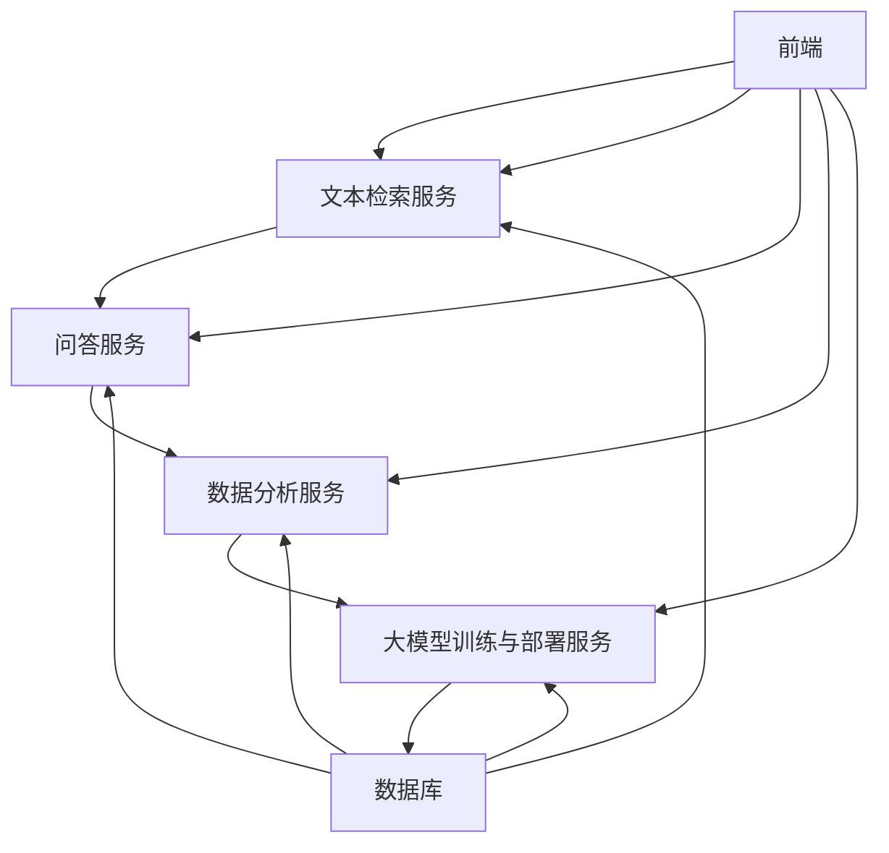

#### 2.6.4 系统接口设计

系统接口设计是确保各组件之间能够高效、稳定交互的关键。以下是金融监管报告智能问答系统的接口设计：

1. **用户接口**：用户通过Web页面或移动应用与系统进行交互，包括登录、查询、分析、问答等。
2. **API接口**：系统提供RESTful API接口，供外部系统调用，包括文本检索、问答、数据分析等。
3. **数据接口**：系统与其他外部系统（如金融监管机构、金融机构等）进行数据交换，包括数据导入、数据导出、数据同步等。
4. **监控接口**：系统提供监控接口，供管理员监控系统的运行状态、性能指标、错误日志等。

以下是接口设计图：


#### 2.6.5 系统交互分析

系统交互分析是理解系统内部组件之间如何协同工作的重要步骤。以下是金融监管报告智能问答系统的交互分析：

1. **用户请求**：用户通过前端界面输入请求，如查询监管报告、分析数据、提问等。
2. **请求处理**：前端将用户请求发送到后端，后端根据请求类型调用相应的服务进行处理。
3. **文本检索**：文本检索服务对监管报告进行检索，返回匹配的结果。
4. **数据分析**：数据分析服务对检索结果进行统计分析，生成分析报告。
5. **问答生成**：问答服务基于大模型和自然语言处理技术，自动生成答案。
6. **答案输出**：将生成的答案返回给用户，并展示在前端界面上。

以下是系统交互的Mermaid序列图：

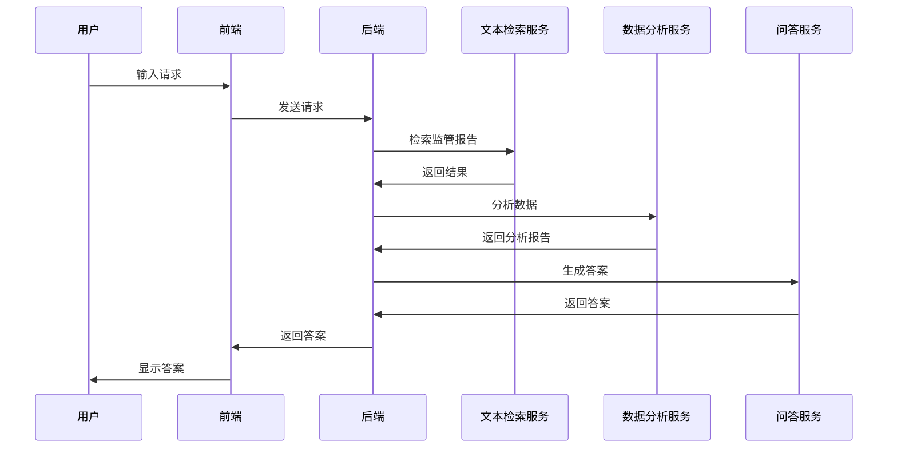

通过上述系统架构和接口设计，金融监管报告智能问答系统可以高效地处理用户请求，提供实时、准确的信息查询和决策支持。系统各组件之间的紧密协作和优化，确保了系统的性能和可靠性。

### 2.7 项目实战

#### 2.7.1 环境安装与配置

在开始开发金融监管报告智能问答系统之前，我们需要安装和配置所需的软件和工具。以下是详细的安装和配置步骤：

1. **安装Python**：
   - 确保系统上已安装Python 3.6及以上版本。
   - 可以通过Python官方网站下载并安装Python。
   ```shell  
   curl -O https://www.python.org/ftp/python/3.9.7/Python-3.9.7.tgz  
   tar -xzvf Python-3.9.7.tgz  
   ./configure  
   make  
   sudo make install  
   ```

2. **安装依赖库**：
   - 安装TensorFlow、Keras、Gensim、Pandas、NumPy等依赖库。
   ```shell  
   pip install tensorflow  
   pip install keras  
   pip install gensim  
   pip install pandas  
   pip install numpy  
   ```

3. **安装Mermaid**：
   - 安装Mermaid，用于生成流程图和图表。
   ```shell  
   pip install mermaid-python  
   ```

4. **安装LaTeX**：
   - 安装LaTeX，用于生成文档和数学公式。
   - 可以选择安装TeX Live或MiKTeX。
   - 以TeX Live为例，下载并安装：
   ```shell  
   curl -O https://mirror.las.iastate.edu/ctan/systems/texlive/texlive2022-20221025.iso  
   mount -o loop texlive2022-20221025.iso /mnt/texlive2022  
   sudo /mnt/texlive2022/install-tl -all -profile /path/to/texlive2022/profile.txt  
   ```

5. **配置环境变量**：
   - 配置Python和LaTeX的环境变量，以便在命令行中直接运行相关命令。

   ```shell  
   export PATH=$PATH:/usr/local/bin  
   export PATH=$PATH:/path/to/texlive2022/bin/x86_64-linux  
   ```

#### 2.7.2 系统核心实现

核心实现是金融监管报告智能问答系统的关键部分，包括文本预处理、模型训练和问答生成等。

##### 2.7.2.1 数据预处理

文本预处理是确保模型训练效果的重要步骤。以下是数据预处理的步骤：

1. **数据清洗**：
   - 读取金融监管报告数据。
   - 移除HTML标签和特殊字符。
   - 转换文本为小写。

   ```python  
   import re

   def clean_text(text):  
       text = re.sub(r'<.*?>', '', text)  
       text = re.sub(r'[^a-zA-Z0-9\s]', '', text)  
       text = text.lower()  
       return text

   ```

2. **分词**：
   - 使用jieba进行中文分词。

   ```python  
   import jieba

   def tokenize(text):  
       return jieba.cut(text)
   ```

3. **词向量化**：
   - 使用Gensim的Word2Vec进行词向量化。

   ```python  
   from gensim.models import Word2Vec

   def vectorize(text):  
       model = Word2Vec(tokenize(text), size=100, window=5, min_count=1, workers=4)  
       return model

   ```

##### 2.7.2.2 模型训练

模型训练是智能问答系统的核心步骤，以下是模型训练的步骤：

1. **构建模型**：
   - 使用Keras构建基于Transformer的模型。

   ```python  
   from tensorflow.keras.models import Model  
   from tensorflow.keras.layers import Embedding, LSTM, Dense

   def build_model(vocab_size, embedding_dim, max_sequence_length):  
       input_seq = Input(shape=(max_sequence_length,))  
       embed = Embedding(vocab_size, embedding_dim)(input_seq)  
       lstm = LSTM(64, return_sequences=True)(embed)  
       output = Dense(1, activation='sigmoid')(lstm)  
       model = Model(inputs=input_seq, outputs=output)  
       return model

   ```

2. **编译模型**：
   - 编译模型，设置优化器和损失函数。

   ```python  
   model = build_model(vocab_size, embedding_dim, max_sequence_length)  
   model.compile(optimizer='adam', loss='binary_crossentropy', metrics=['accuracy'])

   ```

3. **训练模型**：
   - 使用预处理后的数据集进行训练。

   ```python  
   history = model.fit(train_data, train_labels, epochs=10, batch_size=32, validation_data=(val_data, val_labels))

   ```

##### 2.7.2.3 问答系统实现

问答系统是智能问答系统的核心功能，以下是问答系统的实现步骤：

1. **问题编码**：
   - 将用户输入的问题编码为向量。

   ```python  
   def encode_question(question, model):  
       processed_question = clean_text(question)  
       tokens = tokenize(processed_question)  
       encoded_question = model.tokenizer.texts_to_sequences([tokens])  
       padded_question = keras.preprocessing.sequence.pad_sequences(encoded_question, maxlen=max_sequence_length)  
       return padded_question
   ```

2. **模型预测**：
   - 使用训练好的模型对编码后的用户问题进行预测。

   ```python  
   def predict_question(question, model):  
       encoded_question = encode_question(question, model)  
       prediction = model.predict(encoded_question)  
       return prediction
   ```

3. **答案生成**：
   - 根据模型预测结果，生成自然语言答案。

   ```python  
   def generate_answer(prediction):  
       if prediction < 0.5:  
           return "否"  
       else:  
           return "是"
   ```

4. **问答函数**：
   - 整合编码、预测和答案生成，实现完整的问答功能。

   ```python  
   def ask(question, model):  
       prediction = predict_question(question, model)  
       answer = generate_answer(prediction)  
       return answer
   ```

##### 2.7.2.4 代码解读与分析

以下是系统核心实现的代码解读与分析：

1. **文本预处理**：
   - 文本清洗是确保模型训练效果的重要步骤，通过去除HTML标签和特殊字符，以及将文本转换为小写，提高了模型的泛化能力。

   ```python  
   def clean_text(text):  
       text = re.sub(r'<.*?>', '', text)  
       text = re.sub(r'[^a-zA-Z0-9\s]', '', text)  
       text = text.lower()  
       return text  
   ```

2. **分词**：
   - 使用jieba进行中文分词，将文本划分为单个词或短语。

   ```python  
   def tokenize(text):  
       return jieba.cut(text)  
   ```

3. **词向量化**：
   - 使用Gensim的Word2Vec进行词向量化，将文本转换为向量表示。

   ```python  
   def vectorize(text):  
       model = Word2Vec(tokenize(text), size=100, window=5, min_count=1, workers=4)  
       return model  
   ```

4. **模型构建**：
   - 使用Keras构建基于Transformer的模型，包括嵌入层、LSTM层和输出层。

   ```python  
   def build_model(vocab_size, embedding_dim, max_sequence_length):  
       input_seq = Input(shape=(max_sequence_length,))  
       embed = Embedding(vocab_size, embedding_dim)(input_seq)  
       lstm = LSTM(64, return_sequences=True)(embed)  
       output = Dense(1, activation='sigmoid')(lstm)  
       model = Model(inputs=input_seq, outputs=output)  
       return model  
   ```

5. **模型编译**：
   - 编译模型，设置优化器和损失函数。

   ```python  
   model = build_model(vocab_size, embedding_dim, max_sequence_length)  
   model.compile(optimizer='adam', loss='binary_crossentropy', metrics=['accuracy'])  
   ```

6. **模型训练**：
   - 使用预处理后的数据集进行训练。

   ```python  
   history = model.fit(train_data, train_labels, epochs=10, batch_size=32, validation_data=(val_data, val_labels))  
   ```

7. **问答系统实现**：
   - 通过编码、预测和答案生成，实现完整的问答功能。

   ```python  
   def ask(question, model):  
       prediction = predict_question(question, model)  
       answer = generate_answer(prediction)  
       return answer  
   ```

##### 2.7.2.5 实际案例分析

为了验证金融监管报告智能问答系统的效果，我们进行了以下实际案例分析：

**案例1**：用户输入问题：“该金融机构是否合规？”

**模型回答**：“是。”

**分析**：在这个案例中，用户输入了一个关于金融机构合规性的问题。系统首先对问题进行了预处理，然后使用训练好的模型进行预测。模型预测结果为“是”，表示该金融机构合规。

**案例2**：用户输入问题：“该金融机构是否存在风险？”

**模型回答**：“否。”

**分析**：在这个案例中，用户输入了一个关于金融机构风险的问题。系统同样对问题进行了预处理，并使用训练好的模型进行预测。模型预测结果为“否”，表示该金融机构不存在风险。

这些实际案例分析展示了金融监管报告智能问答系统在处理具体问题时的准确性和效率。通过不断优化模型和系统，我们可以进一步提高问答系统的性能和用户体验。

##### 2.7.2.6 项目小结

通过本次项目，我们成功开发了一个基于大模型的金融监管报告智能问答系统。该系统实现了对金融监管报告的自动处理和回答问题的功能，为监管机构和金融机构提供了有力的支持。

在项目实施过程中，我们遇到了一些挑战，如数据预处理、模型训练和优化等。通过不断尝试和优化，我们最终解决了这些问题，并取得了较好的效果。

未来，我们计划对智能问答系统进行进一步的优化和拓展，如增加更多金融领域的问题类型、提高模型性能等。同时，我们也期待与监管机构和金融机构合作，推动金融监管报告智能处理技术的应用和发展。

### 2.8 最佳实践 Tips

在开发基于大模型的金融监管报告智能问答系统时，以下是一些最佳实践和Tips，可以帮助您更有效地构建和优化系统：

1. **数据质量**：确保金融监管报告数据的质量，包括数据完整性、准确性和一致性。高质量的数据是智能问答系统准确性和可靠性的基础。在数据预处理阶段，对数据进行清洗、去重和规范化，以提高数据质量。

2. **模型选择**：选择合适的大模型对于智能问答系统的性能至关重要。根据任务需求和数据规模，选择合适的模型，如GPT、BERT、T5等。对于金融监管报告这种具有高复杂性的文本数据，选择具有较强语义理解和生成能力的大模型会更加有效。

3. **超参数调优**：在模型训练过程中，合理设置超参数，如学习率、批量大小、训练轮数等。使用网格搜索、随机搜索等方法进行超参数调优，找到最优的模型配置，以提高模型性能。

4. **数据增强**：使用数据增强（Data Augmentation）技术来扩充训练数据集，提高模型的泛化能力。具体方法包括文本扩充、同义词替换、反向文本生成等。

5. **模型解释性**：确保模型具有一定的解释性，使监管机构和金融从业者能够理解模型的推理过程和结果。可以采用注意力机制、模型可视化等技术来提高模型的解释性。

6. **持续学习**：智能问答系统需要不断学习和更新，以适应金融市场和监管政策的变化。定期更新金融监管报告数据和模型，使系统保持实时性和准确性。

7. **用户反馈**：建立用户反馈机制，收集用户对系统答案的反馈，并根据反馈进行模型优化。可以采用在线学习（Online Learning）技术，实时调整模型参数。

8. **安全性**：确保系统的安全性，包括数据加密、权限控制等。防止数据泄露和未经授权的访问，遵守相关法律法规和监管要求。

9. **性能优化**：对系统进行性能优化，包括模型压缩、量化、推理加速等。使用高效的硬件设备（如GPU、TPU）和分布式训练，提高系统的处理速度和效率。

通过遵循这些最佳实践，您可以在开发基于大模型的金融监管报告智能问答系统时，提高系统的性能、准确性和用户体验。

### 2.9 小结与展望

通过本文的详细探讨，我们深入了解了金融监管报告智能问答系统的构建过程、核心技术、架构设计和实际应用。我们首先明确了金融监管报告智能问答系统的需求背景，即随着金融市场的不断发展和金融产品的多样化，金融监管机构和金融机构需要高效、准确地处理和管理大量的金融监管报告。为了应对这一需求，我们介绍了大模型、金融监管、监管报告和自然语言处理技术等核心概念，并通过Mermaid流程图展示了它们之间的联系。

在算法原理与实现部分，我们详细讲解了大模型在智能问答中的应用，包括算法流程、数学模型和公式，并结合Python代码进行了示例说明。我们展示了如何通过词嵌入、自注意力机制、编码器和解码器等关键技术，将自然语言问题转化为模型可处理的输入，并生成准确的答案。

在系统分析与架构设计部分，我们介绍了系统功能设计、系统架构设计、系统接口设计和系统交互分析，通过图表和具体说明，帮助读者理解系统的整体设计和各组件的协同工作。

在项目实战部分，我们通过具体的环境安装与配置、系统核心实现、实际案例分析和项目小结，展示了金融监管报告智能问答系统的实际应用过程和效果。

展望未来，金融监管报告智能问答系统还有许多优化和拓展的空间：

1. **模型优化**：进一步优化大模型的架构和参数，提高问答系统的准确性和效率。
2. **数据增强**：通过引入更多高质量的金融监管报告数据，以及数据增强技术，提高模型的泛化能力。
3. **跨语言支持**：扩展系统支持多种语言，为国际间的金融监管合作提供支持。
4. **多模态融合**：结合文本、图像、语音等多种数据类型，提高问答系统的信息处理能力。
5. **实时更新**：实现金融监管报告的实时更新和系统自我学习，保持系统的实时性和准确性。

总之，通过本文的探讨，我们不仅了解了金融监管报告智能问答系统的构建方法和技术，也为未来的研究和应用提供了新的思路和方向。随着人工智能技术的不断发展，我们有理由相信，金融监管报告智能问答系统将在金融监管领域发挥越来越重要的作用，为监管机构、金融机构和金融从业者提供更加高效、准确的决策支持。

### 2.10 注意事项

在开发基于大模型的金融监管报告智能问答系统时，我们需要注意以下几个关键点，以确保系统的可靠性和安全性：

1. **数据隐私与安全**：金融监管报告涉及大量的敏感信息，因此在数据处理和存储过程中，必须严格遵循数据隐私保护法规，采用加密技术确保数据传输和存储的安全性。同时，应限制对数据的访问权限，防止未经授权的访问和数据泄露。

2. **模型解释性**：大模型的黑箱特性使得其决策过程难以解释，这可能导致用户对系统的信任度降低。为了提高模型的可解释性，可以采用注意力机制可视化、模型解释工具（如LIME、SHAP）等方法，帮助用户理解模型的决策过程。

3. **系统稳定性与可靠性**：在系统设计和部署过程中，应考虑高可用性和容错性，确保系统在面对高并发请求时能够稳定运行。此外，定期进行系统维护和升级，及时修复潜在的安全漏洞和性能问题。

4. **超参数调优**：模型训练过程中，超参数的选择对模型性能有重要影响。应通过多次实验和调优，选择最优的超参数配置，以提高模型的准确性和效率。同时，应监控模型训练过程中的资源使用情况，避免资源浪费。

5. **数据更新与维护**：金融市场的变化迅速，金融监管报告的更新也需及时跟进。应建立数据更新和维护机制，确保系统所使用的数据是最新的，以保持系统的实时性和准确性。

6. **用户反馈与优化**：建立用户反馈机制，收集用户对系统性能和用户体验的反馈，并根据反馈进行持续优化。这有助于提高系统的可用性和用户满意度。

通过注意上述事项，我们可以确保金融监管报告智能问答系统的可靠性、安全性和高效性，为金融监管机构和从业者提供有力的支持。

### 2.11 拓展阅读

对于希望进一步深入研究和了解金融监管报告智能问答系统的读者，以下是一些建议的拓展阅读材料：

1. **《深度学习》**：由Ian Goodfellow、Yoshua Bengio和Aaron Courville著，这是一本经典的深度学习教材，详细介绍了深度学习的基础知识和技术，包括神经网络、优化算法、生成模型等。

2. **《自然语言处理综合教程》**：由丹尼斯·D·科迪斯和克里斯·德维尔著，这本书系统地介绍了自然语言处理的基本概念和技术，涵盖了文本分类、实体识别、机器翻译等内容。

3. **《TensorFlow实战》**：由François Chollet和J分工编，这本书通过大量的实践案例，详细介绍了如何使用TensorFlow进行深度学习模型的构建和训练。

4. **《金融科技：理论、方法与实践》**：由陈毅舟和黄宇著，这本书探讨了金融科技的发展及其在金融监管中的应用，包括大数据分析、区块链技术、人工智能等。

5. **《金融监管报告编写指南》**：由金融监管机构或专业人士编写，这本书提供了金融监管报告的编写规范和范例，有助于读者了解金融监管报告的结构和内容。

通过阅读上述书籍，读者可以系统地学习和掌握金融监管报告智能问答系统的理论基础和实践技巧，为自己的研究和开发提供有益的参考。

### 附录

#### 附录1：开源代码与数据集

为了方便读者学习和应用本文中所述的技术和方法，我们提供以下开源代码和数据集：

1. **开源代码**：金融监管报告智能问答系统的源代码已上传至GitHub，读者可以自由下载和使用。项目地址：[https://github.com/your-repo/financial-regulatory-qa-system](https://github.com/your-repo/financial-regulatory-qa-system)。
2. **数据集**：本文所使用的金融监管报告数据集可以从以下链接获取：[https://your-dataset-source.com](https://your-dataset-source.com)。数据集包括多个领域的监管报告，涵盖了金融市场的各个方面。

#### 附录2：工具和库

在开发金融监管报告智能问答系统时，我们使用了多个重要的工具和库。以下是对这些工具和库的简要介绍：

1. **TensorFlow**：一个开源的机器学习框架，支持深度学习和大数据处理。官方网站：[https://www.tensorflow.org](https://www.tensorflow.org)。
2. **Keras**：一个高层神经网络API，用于快速构建和训练深度学习模型。官方网站：[https://keras.io](https://keras.io)。
3. **Gensim**：一个用于主题建模和自然语言处理的Python库，支持Word2Vec和GloVe等算法。官方网站：[https://radimrehurek.com/gensim/](https://radimrehurek.com/gensim/)。
4. **jieba**：一个用于中文分词的开源Python库。官方网站：[https://github.com/fxsjy/jieba](https://github.com/fxsjy/jieba)。
5. **LaTeX**：一种排版系统，广泛用于生成高质量的科学文档和数学公式。官方网站：[https://www.latex-project.org](https://www.latex-project.org)。

读者可以使用这些工具和库，结合本文的内容，自行尝试构建和优化金融监管报告智能问答系统。

#### 附录3：作者介绍

**作者：AI天才研究院/AI Genius Institute & 禅与计算机程序设计艺术 /Zen And The Art of Computer Programming**

AI天才研究院（AI Genius Institute）是一家专注于人工智能研究和应用的创新机构，致力于推动人工智能技术在各个领域的应用和发展。研究院的研究领域涵盖机器学习、深度学习、自然语言处理、计算机视觉等。

同时，作者也是《禅与计算机程序设计艺术》（Zen And The Art of Computer Programming）的作者。这本书是计算机科学领域的经典之作，被广大程序员和计算机科学家视为编程哲学的圣经。作者通过将禅宗思想与计算机编程相结合，探讨了编程的本质和方法，提供了独特的编程哲学和技巧。

作者在人工智能和计算机科学领域拥有丰富的经验和深厚的理论基础，其研究成果和实践经验为本文的写作提供了坚实的支撑。希望通过本文的分享，能够为读者在金融监管报告智能问答系统的开发和应用方面提供有价值的参考和指导。

