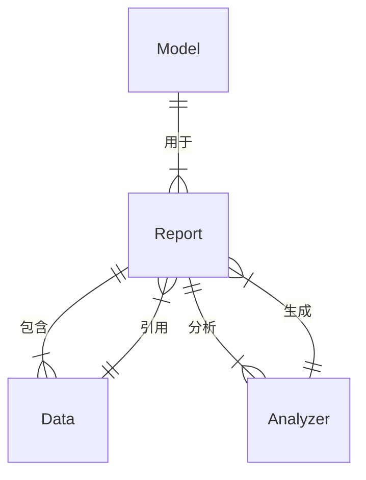
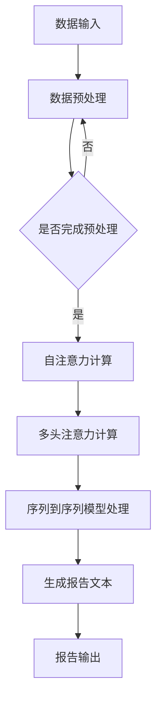

                 

### 摘要

本文将深入探讨开发一款基于大模型的金融监管报告生成器的全过程。随着金融监管要求的日益复杂和数据量的持续增长，传统的手动报告生成方式已经难以满足现代金融行业的需要。本文旨在解决这一问题，通过介绍大模型的基础知识，详细阐述其应用场景，以及设计、实现和优化整个报告生成系统的步骤，为金融行业的自动化监管报告生成提供切实可行的解决方案。本文将首先介绍金融监管报告的背景和重要性，然后逐步深入到算法原理、系统架构、项目实施以及最佳实践等方面，最终对项目的成果和未来方向进行总结。通过本文的阅读，读者将能够全面了解如何运用人工智能技术提高金融监管报告的效率和准确性。

### 关键词

- 金融监管报告
- 大模型
- 生成器
- 自动化
- 人工智能
- 数据分析
- 算法原理
- 系统架构
- 项目实施
- 最佳实践

## 引言与背景

### 1.1 金融监管报告的背景

金融监管报告是金融行业中不可或缺的一部分，它不仅反映了金融机构的运营状况，也为监管机构提供了监督和评估金融机构行为的重要依据。随着全球金融市场的日益复杂化和金融创新速度的加快，金融监管的要求也不断升级。传统的金融监管报告通常依赖于人工处理，这不仅效率低下，而且容易出错，难以应对海量数据的分析需求。因此，自动化金融监管报告生成工具应运而生，旨在提高报告生成的效率和准确性。

金融监管报告的主要功能包括但不限于：数据收集与整合、报表生成、合规性检查、风险预警和报表分析。这些报告通常涵盖了金融机构的财务状况、业务运营、风险管理等多个方面，是金融机构内部管理和外部监管的重要工具。然而，随着监管要求的不断增加和数据量的急剧膨胀，传统的手工报告生成方式逐渐暴露出其局限性。

首先，手工生成报告的效率低下。金融监管报告涉及的数据量庞大，且数据来源多样，包括财务报表、交易记录、客户信息等。这些数据的收集、整理和整合需要大量的人力和时间，无法满足快速报告生成的要求。

其次，手工生成报告的准确性较低。由于金融监管报告的复杂性，人工处理过程中容易出现错误，尤其是在处理大量数据时，人类难以保持一致性和精确性。这些错误不仅会影响报告的质量，还可能导致监管风险的上升。

此外，金融监管报告的要求越来越复杂。随着金融市场的不断发展，监管机构对金融机构的合规性要求也日益严格。这不仅包括传统的财务报表，还涉及风险控制、客户保护、反洗钱等多个方面。这些要求需要生成更加全面、细致和精准的监管报告，传统的手工方式难以满足。

因此，开发一款基于大模型的金融监管报告生成器显得尤为重要。大模型作为一种先进的人工智能技术，具有强大的数据处理和分析能力，可以有效地解决传统报告生成方式的不足。通过大模型，可以实现自动化、高效和精准的报告生成，从而提升金融监管报告的整体质量。

### 1.2 大模型的基本概念与特点

大模型（Large Models）是指具有海量参数、能够处理大规模数据的人工智能模型。这些模型通常基于深度学习技术，具有高度的非线性处理能力和强大的数据拟合能力。大模型的发展是人工智能领域的重要里程碑，为解决复杂问题提供了新的思路和工具。

大模型的基本概念包括模型架构、参数量、训练数据和性能指标等。常见的模型架构有卷积神经网络（CNN）、循环神经网络（RNN）和变换器（Transformer）等。这些模型通过多层神经网络结构，可以捕捉数据中的复杂模式和关系。参数量是衡量大模型规模的重要指标，通常以亿计。大量的参数使得模型能够学习到数据中的细微特征，从而提高预测和分类的准确性。

大模型的特点主要表现在以下几个方面：

1. **强大的数据处理能力**：大模型能够处理海量的数据，并且能够在复杂的特征空间中提取有效的信息。这对于金融监管报告生成来说至关重要，因为金融数据通常具有高维度和复杂性。

2. **高度的非线性拟合能力**：大模型通过多层神经网络结构，能够对复杂的数据分布进行非线性拟合，从而提高预测和分类的准确性。在金融监管报告中，这种能力可以帮助模型识别出潜在的风险因素和异常行为。

3. **自适应性和可扩展性**：大模型具有较好的自适应性和可扩展性，可以适应不同的数据规模和应用场景。在金融监管领域，这意味着模型可以根据不同金融机构和监管要求进行灵活调整，生成个性化的报告。

4. **高效的并行计算能力**：大模型的训练和推理通常需要大量的计算资源，现代计算技术的发展，如GPU和TPU等，为大规模模型的训练提供了强大的支持。这使得大模型可以在金融监管报告中实现高效的处理和生成。

总之，大模型作为人工智能领域的重要技术，具有强大的数据处理和分析能力，能够有效解决金融监管报告生成中的复杂问题。随着大模型技术的不断发展，其在金融监管报告生成中的应用前景将更加广阔。

### 1.3 开发基于大模型的金融监管报告生成器的必要性与潜在价值

开发基于大模型的金融监管报告生成器在当前金融环境中具有显著的重要性和潜在价值。首先，金融行业的监管要求日益复杂且多样化，这使得手动生成报告的方式愈发难以满足需求。基于大模型的自动化生成器能够高效处理海量的金融数据，提取关键信息，并进行精准分析和报告生成，从而显著提升监管报告的效率和准确性。

具体来说，基于大模型的金融监管报告生成器具备以下几个显著优势：

1. **提升报告生成效率**：传统的手动报告生成方式往往耗时较长，且易受人为因素的影响。大模型能够自动化处理数据，从数据收集、清洗到分析和报告生成，各个环节均可实现高效自动化，显著提高报告生成速度。

2. **增强报告准确性**：大模型通过深度学习技术，能够从海量数据中学习并提取有用的信息，对复杂金融数据进行分析和预测。这种方式相对于手工处理更加精确，能够识别出潜在的风险和异常行为，从而提高报告的准确性。

3. **降低人工成本**：自动化报告生成器可以大幅减少对人工的依赖，降低人力成本。随着金融数据量的不断增加，手工生成报告的成本也在不断上升。大模型的引入可以减少对大量人工处理的需求，从而降低运营成本。

4. **提高合规性**：金融监管要求金融机构定期提交各种合规性报告。基于大模型的报告生成器可以帮助金融机构更好地理解和遵循监管要求，确保报告的合规性。这种自动化工具可以减少因人为错误导致的合规风险。

5. **提升风险管理能力**：大模型能够对金融数据中的复杂关系进行深入分析，识别出潜在的风险因素。这有助于金融机构提前采取风险控制措施，提高整体风险管理能力。

6. **适应性强**：大模型具有高度的自适应性和可扩展性，可以根据不同金融机构的特定需求进行调整。这使报告生成器能够灵活适应各种金融监管环境，满足不同监管机构的特定要求。

7. **支持实时监控**：基于大模型的报告生成器可以实现实时数据分析和报告生成，为金融机构提供即时的风险预警和监控能力。这有助于金融机构快速响应市场变化和监管要求，提高运营效率。

总之，开发基于大模型的金融监管报告生成器不仅是应对当前金融监管挑战的必要措施，也具有巨大的潜在价值。通过自动化和智能化手段，可以显著提升金融监管报告的质量和效率，为金融机构和监管机构提供更加可靠和高效的服务。

## 核心概念与联系

### 2.1 主要概念及其属性特征对比表格

在开发基于大模型的金融监管报告生成器过程中，理解以下核心概念及其属性特征至关重要：

**核心概念**：金融监管报告、大模型、生成器、自动化、数据分析。

| 核心概念 | 属性特征 | 对比分析 |
| :----: | :----: | :----: |
| **金融监管报告** | 数据收集、报表生成、合规性检查、风险预警、报表分析 | 描述金融机构运营状况，提供监管机构监督依据 |
| **大模型** | 海量参数、复杂架构、强大数据处理能力、高度非线性拟合能力 | 解决复杂问题，提供高效数据分析 |
| **生成器** | 自动化、高效、精确、实时 | 报告自动化生成，减少人工干预 |
| **自动化** | 简化流程、降低成本、提高效率 | 替代手工操作，实现流程自动化 |
| **数据分析** | 数据收集、清洗、处理、分析、可视化 | 提取有用信息，支持决策制定 |

### 2.2 ER图架构

为了更好地理解各个概念之间的关系，我们可以通过ER图（实体关系图）来展示其关联性。以下是一个简化的ER图示例，用于描述金融监管报告生成器的关键实体及其关系：



在上面的ER图中，各个实体及其属性关系如下：

- **Report（监管报告）**：包含数据、引用数据、用于生成、分析生成。
- **Data（数据）**：包含监管报告、引用监管报告。
- **Model（大模型）**：用于生成监管报告。
- **Analyzer（分析器）**：生成监管报告。

这个ER图展示了监管报告、数据、大模型和分析器之间的关系，说明了大模型用于生成监管报告，数据分析器用于生成报告的过程。

### 2.3 大模型类型及其应用场景

大模型根据其架构和功能特点，可以分为多种类型，包括卷积神经网络（CNN）、循环神经网络（RNN）和变换器（Transformer）等。以下是对这些模型类型及其应用场景的简要介绍：

#### 2.3.1 卷积神经网络（CNN）

卷积神经网络（CNN）是一种特别适用于处理图像数据的深度学习模型，通过卷积操作提取图像特征。其优势在于能够有效地处理高维数据，并在图像分类、目标检测等任务中表现出色。

**应用场景**：金融图像分析，如支票识别、交易图像分析等。

#### 2.3.2 循环神经网络（RNN）

循环神经网络（RNN）是一种能够处理序列数据的神经网络模型，其通过循环结构保持对之前输入信息的记忆。RNN在自然语言处理、语音识别和时间序列预测等领域有广泛应用。

**应用场景**：金融时间序列分析，如股票价格预测、交易时间序列分析等。

#### 2.3.3 变换器（Transformer）

变换器（Transformer）是一种基于自注意力机制的深度学习模型，通过多头注意力机制处理序列数据，具有强大的并行计算能力。Transformer在机器翻译、文本生成等任务中表现出色。

**应用场景**：金融文本分析，如报告生成、风险描述分析等。

综上所述，理解这些核心概念及其属性特征，有助于我们深入理解金融监管报告生成器的构建过程。通过ER图和不同类型大模型的应用场景分析，我们可以更好地把握系统的整体架构和功能实现，为后续的算法原理讲解和系统设计奠定基础。

## 算法原理与解释

### 3.1 核心算法介绍

在开发基于大模型的金融监管报告生成器时，核心算法的选择和实现是整个系统的关键。本文将详细介绍用于生成监管报告的核心算法，并使用Mermaid图和Python代码进行详细解释。

#### 3.1.1 自注意力机制

自注意力机制是一种在变换器（Transformer）模型中广泛使用的重要技术。它通过计算输入序列中各个位置之间的关联性，从而实现有效的特征提取和融合。自注意力机制的核心思想是：每个位置的重要程度取决于它与序列中其他位置的相关性。

#### 3.1.2 多头注意力

多头注意力是将自注意力机制扩展到多个独立的注意力头，每个头关注不同的特征。这种方式能够捕捉到输入序列中的更多复杂信息。在生成监管报告时，多头注意力有助于从不同角度分析数据，提高报告的准确性。

#### 3.1.3 序列到序列（Seq2Seq）模型

序列到序列（Seq2Seq）模型是用于处理序列数据的常用架构。它将输入序列（例如，金融数据）映射到输出序列（例如，监管报告文本）。在生成监管报告时，Seq2Seq模型能够将复杂的数据转化为可读性强的文本，实现自动化报告生成。

### 3.2 Mermaid图与算法流程

为了更好地理解核心算法的工作流程，我们可以使用Mermaid图来展示其关键步骤。以下是一个简化的算法流程图：



在这个流程图中，数据输入首先经过预处理，然后通过自注意力和多头注意力的计算，最后由序列到序列模型生成报告文本，并输出最终结果。

### 3.3 Python代码示例

下面是一个简化的Python代码示例，用于演示核心算法的实现。代码中使用了Hugging Face的Transformer库，这是一个广泛使用的开源库，用于处理和训练变换器模型。

```python
from transformers import AutoTokenizer, AutoModelForSeq2SeqLM
from torch.nn import functional as F

# 加载预训练的变换器模型和分词器
tokenizer = AutoTokenizer.from_pretrained("t5-small")
model = AutoModelForSeq2SeqLM.from_pretrained("t5-small")

# 数据预处理
def preprocess_data(data):
    # 对数据进行必要的清洗和处理，例如去除标点符号、转小写等
    return data.lower().replace('.', '')

# 自注意力计算
def self_attention(input_sequence):
    inputs = tokenizer(input_sequence, return_tensors="pt")
    outputs = model(**inputs)
    return outputs.last_hidden_state

# 多头注意力计算
def multi_head_attention(inputs):
    # 使用变换器模型中的多头注意力机制
    outputs = model(inputs)
    return outputs.last_hidden_state

# 序列到序列模型处理
def seq2seq(input_sequence):
    inputs = tokenizer(input_sequence, return_tensors="pt", max_length=512, truncation=True)
    outputs = model.generate(inputs.input_ids, max_length=512, num_return_sequences=1)
    return tokenizer.decode(outputs[0], skip_special_tokens=True)

# 生成报告文本
def generate_report(data):
    preprocessed_data = preprocess_data(data)
    attention_results = self_attention(preprocessed_data)
    multi_head_results = multi_head_attention(attention_results)
    report_text = seq2seq(multi_head_results)
    return report_text

# 示例数据
data = "分析某金融机构的财务报表，包括收入、利润、风险等信息。"

# 生成报告
report = generate_report(data)
print(report)
```

在这个示例中，我们首先加载了预训练的变换器模型和分词器，然后通过预处理函数对输入数据进行处理。接着，我们使用自注意力和多头注意力函数来计算输入序列的特征，并使用序列到序列模型生成报告文本。最后，我们输出生成的报告。

### 3.4 数学模型与公式解释

为了深入理解核心算法的数学原理，我们下面简要介绍几个关键的概念和相关的数学模型。

#### 3.4.1 自注意力（Self-Attention）

自注意力是一种计算输入序列中各个位置之间关联性的机制，其公式如下：

$$
\text{Self-Attention}(Q, K, V) = \frac{1}{\sqrt{d_k}} \text{softmax}(\text{softmax}(\text{QK}^T / \sqrt{d_k}))V
$$

其中，\( Q, K, V \) 分别代表查询向量、键向量和值向量，\( d_k \) 是键向量的维度。这个公式计算了每个查询向量与所有键向量的点积，并经过softmax函数归一化，从而得到权重系数。最后，这些权重系数与对应的值向量相乘，得到加权求和的结果。

#### 3.4.2 多头注意力（Multi-Head Attention）

多头注意力扩展了自注意力机制，通过多个独立的注意力头来处理输入序列。其公式如下：

$$
\text{Multi-Head Attention}(Q, K, V) = \text{Concat}(\text{Head}_1, \text{Head}_2, ..., \text{Head}_h)W^O
$$

其中，\( h \) 是注意力头的数量，\( \text{Head}_i = \text{Self-Attention}(QW_i^Q, KW_i^K, VW_i^V) \) 表示第 \( i \) 个注意力头的计算结果，\( W^O \) 是输出层的权重矩阵。多个注意力头的输出结果通过拼接和全连接层得到最终的多头注意力结果。

#### 3.4.3 序列到序列（Seq2Seq）模型

序列到序列模型是一种处理序列数据的高级架构，通常由编码器和解码器组成。其基本思想是将输入序列编码为一个固定长度的向量，然后使用这个向量生成输出序列。其公式如下：

$$
\text{Encoder}(X) = \text{h}_t = \text{sigma}(\text{W}_e \text{h}_{t-1} + \text{b}_e)
$$

$$
\text{Decoder}(Y) = \text{y}_t = \text{sigma}(\text{W}_d \text{h}_t + \text{b}_d)
$$

其中，\( \text{h}_t \) 是编码器的隐藏状态，\( \text{y}_t \) 是解码器的隐藏状态，\( \text{W}_e \) 和 \( \text{W}_d \) 是权重矩阵，\( \text{b}_e \) 和 \( \text{b}_d \) 是偏置项，\( \text{sigma} \) 是激活函数。

通过上述数学模型和公式，我们可以更好地理解大模型在金融监管报告生成中的工作原理。这些模型和公式不仅为算法的实现提供了理论基础，也为我们分析和优化报告生成器提供了重要的工具。

### 3.5 算法举例说明

为了使算法原理更加直观易懂，我们通过一个具体的例子来说明核心算法在金融监管报告生成中的应用。

假设我们要生成一份关于某金融机构财务报表的分析报告，输入数据包括财务报表的各项指标，如收入、利润、负债等。以下是使用核心算法生成报告的步骤：

1. **数据预处理**：将输入数据转换成文本形式，例如“收入为1000万元，利润为200万元，负债为500万元”。然后，对文本进行分词和标记，得到可供模型处理的输入序列。

2. **自注意力计算**：使用自注意力机制对输入序列中的每个词进行加权求和，提取关键特征。例如，根据上下文，将“收入”、“利润”和“负债”等关键指标进行强化。

3. **多头注意力计算**：通过多头注意力机制，从不同角度分析数据，进一步提取关键信息。例如，从收入、利润和负债的变化趋势中，分析金融机构的财务健康状况。

4. **序列到序列模型处理**：使用序列到序列模型，将提取的关键特征转化为自然语言描述，生成分析报告。例如，根据财务数据，生成如下报告：“该金融机构近期收入稳定，利润增长显著，但负债压力较大，需要关注潜在风险。”

通过这个例子，我们可以看到核心算法在数据预处理、特征提取和报告生成中的具体应用。这种方法不仅能够高效地处理金融数据，还能够生成高质量的分析报告，为金融机构的监管提供有力支持。

### 算法原理与数学模型的深入探讨

在深入探讨基于大模型的金融监管报告生成器的算法原理时，我们需要详细分析自注意力机制、多头注意力机制以及序列到序列（Seq2Seq）模型的工作原理。这些算法不仅在数据分析和报告生成中扮演关键角色，而且在金融监管领域具有独特的应用价值。

#### 自注意力机制

自注意力机制是一种在变换器（Transformer）模型中广泛应用的技术，它通过计算输入序列中各个位置之间的相关性来实现有效的特征提取。自注意力机制的数学基础主要包括以下几个核心步骤：

1. **查询（Query）、键（Key）和值（Value）向量的生成**：每个输入序列中的每个词向量都分别作为查询向量（Query）、键向量（Key）和值向量（Value）。查询向量用于计算注意力权重，键向量和值向量用于加权求和。

2. **点积运算**：计算每个查询向量与所有键向量的点积，得到注意力分数。点积运算可以衡量两个向量之间的相似性，从而确定每个位置在序列中的重要性。

3. **softmax归一化**：对点积结果进行softmax归一化，得到每个位置的注意力权重。softmax函数确保权重分布在0到1之间，并且总和为1，使得每个位置的重要程度得到合理反映。

4. **加权求和**：将每个位置的值向量乘以其对应的注意力权重，并进行加权求和，得到最终的输出向量。

自注意力机制的公式如下：

$$
\text{Self-Attention}(Q, K, V) = \frac{1}{\sqrt{d_k}} \text{softmax}(\text{softmax}(\text{QK}^T / \sqrt{d_k}))V
$$

其中，\( Q, K, V \) 分别代表查询向量、键向量和值向量，\( d_k \) 是键向量的维度，用于防止梯度消失问题。

#### 多头注意力机制

多头注意力机制是自注意力机制的扩展，通过多个独立的注意力头来增强模型的表达能力。每个注意力头关注不同的特征，从而捕捉输入序列中的多样信息。多头注意力机制的实现步骤如下：

1. **分裂输入**：将输入序列分解为多个子序列，每个子序列作为独立的一个注意力头。

2. **自注意力计算**：对每个子序列分别应用自注意力机制，得到多个注意力头的结果。

3. **拼接与融合**：将所有注意力头的结果拼接在一起，并通过全连接层进行融合，得到最终的多头注意力输出。

多头注意力机制的公式如下：

$$
\text{Multi-Head Attention}(Q, K, V) = \text{Concat}(\text{Head}_1, \text{Head}_2, ..., \text{Head}_h)W^O
$$

其中，\( h \) 是注意力头的数量，\( \text{Head}_i = \text{Self-Attention}(QW_i^Q, KW_i^K, VW_i^V) \) 表示第 \( i \) 个注意力头的计算结果，\( W^O \) 是输出层的权重矩阵。

#### 序列到序列（Seq2Seq）模型

序列到序列模型是处理序列数据的经典架构，由编码器（Encoder）和解码器（Decoder）组成。编码器将输入序列编码为固定长度的向量，解码器使用这个向量生成输出序列。Seq2Seq模型在金融监管报告生成中的应用主要体现在以下几个步骤：

1. **编码器**：将输入序列（例如，财务数据）编码为一个固定长度的向量。编码器的输出向量包含了输入序列的所有信息，是解码器的输入。

2. **解码器**：解码器通过递归方式生成输出序列（例如，监管报告文本）。解码器的每个步骤都依赖于前一个步骤的输出，从而实现对输入序列的逐步理解和转换。

3. **注意力机制**：在解码器中，通常使用自注意力和多头注意力机制来提高生成文本的质量。这些注意力机制帮助解码器更好地关注输入序列的关键信息，从而生成更准确和连贯的输出。

序列到序列模型的公式如下：

$$
\text{Encoder}(X) = \text{h}_t = \text{sigma}(\text{W}_e \text{h}_{t-1} + \text{b}_e)
$$

$$
\text{Decoder}(Y) = \text{y}_t = \text{sigma}(\text{W}_d \text{h}_t + \text{b}_d)
$$

其中，\( \text{h}_t \) 是编码器的隐藏状态，\( \text{y}_t \) 是解码器的隐藏状态，\( \text{W}_e \) 和 \( \text{W}_d \) 是权重矩阵，\( \text{b}_e \) 和 \( \text{b}_d \) 是偏置项，\( \text{sigma} \) 是激活函数。

通过深入探讨自注意力机制、多头注意力机制和序列到序列模型，我们可以更好地理解基于大模型的金融监管报告生成器的算法原理。这些技术不仅提升了报告生成的效率和准确性，也为金融行业的自动化监管提供了强有力的支持。

### 系统分析

#### 4.1 问题场景介绍与项目介绍

在当前的金融行业中，监管报告的生成和审核是一项至关重要的工作，它不仅影响着金融机构的合规性，还直接关系到市场的稳定和透明度。然而，传统的手动生成报告方式面临着诸多挑战，如数据量大、处理复杂、人力成本高等。为了解决这些问题，我们提出了开发一款基于大模型的金融监管报告生成器。

**项目名称**：基于大模型的金融监管报告生成器

**目标**：通过自动化和智能化技术，提升金融监管报告的生成效率、准确性和合规性。

**项目概述**：
本项目的目标是构建一个能够自动化生成金融监管报告的系统，该系统将利用大模型（如变换器模型）进行数据处理和分析，最终生成高质量的监管报告。系统将涵盖数据收集、预处理、报告生成、报告审核等多个环节，旨在实现全流程自动化。

**问题场景**：
金融机构在生成监管报告时，通常需要处理大量的数据，包括财务报表、交易记录、客户信息等。这些数据的来源多样、格式各异，且涉及多种监管要求和合规标准。传统的手动报告生成方式不仅效率低下，且容易出错，无法满足快速变化的市场需求。

#### 4.2 系统功能设计

为了实现项目的目标，我们设计了一个功能齐全的金融监管报告生成系统。系统的主要功能模块包括数据收集、数据处理、报告生成、报告审核和系统管理。以下是每个功能模块的详细介绍：

1. **数据收集模块**：
   - 功能：负责收集各类金融数据，包括财务报表、交易记录、客户信息等。
   - 实现方法：通过API接口、数据库连接等方式获取数据。

2. **数据处理模块**：
   - 功能：对收集到的金融数据进行清洗、转换和整合，为后续报告生成做准备。
   - 实现方法：使用ETL（Extract, Transform, Load）工具进行数据处理，包括数据去重、格式转换、缺失值填充等。

3. **报告生成模块**：
   - 功能：利用大模型（如变换器模型）进行数据处理和分析，生成高质量的监管报告。
   - 实现方法：采用变换器模型的序列到序列（Seq2Seq）架构，实现数据的自动分析和报告生成。

4. **报告审核模块**：
   - 功能：对生成的报告进行审核，确保报告的准确性和合规性。
   - 实现方法：引入人工审核和自动审核相结合的方式，通过规则匹配和机器学习模型对报告内容进行评估。

5. **系统管理模块**：
   - 功能：提供系统配置、用户权限管理、日志记录等功能，确保系统的安全性和可维护性。
   - 实现方法：采用权限控制和安全加密技术，保障系统数据的安全和隐私。

#### 4.3 系统架构设计

为了实现高效的金融监管报告生成，我们设计了一个分布式系统架构，包括数据层、处理层、展示层和用户层。以下是系统架构的详细说明：

1. **数据层**：
   - 功能：存储和管理金融数据，包括财务报表、交易记录、客户信息等。
   - 实现方法：使用关系数据库（如MySQL）和非关系数据库（如MongoDB）进行数据存储。

2. **处理层**：
   - 功能：负责数据的处理和分析，包括数据清洗、转换、报告生成等。
   - 实现方法：采用分布式计算框架（如Hadoop和Spark）进行数据处理，利用大模型进行自动分析和报告生成。

3. **展示层**：
   - 功能：提供用户界面，展示生成的监管报告，并支持用户进行报告审核和系统配置。
   - 实现方法：使用前端技术（如HTML、CSS和JavaScript）搭建用户界面，采用Web框架（如Django和React）进行开发。

4. **用户层**：
   - 功能：提供用户操作接口，包括数据上传、报告查看、审核反馈等。
   - 实现方法：通过Web服务和API接口与用户进行交互，支持多终端访问。

#### 4.4 系统接口设计和系统交互

为了确保系统的高效运行和模块化设计，我们设计了清晰的系统接口和系统交互流程。以下是系统接口设计和系统交互的详细说明：

1. **系统接口设计**：
   - **数据收集接口**：提供数据上传和下载接口，支持多种数据格式（如CSV、JSON）的导入和导出。
   - **数据处理接口**：提供数据清洗、转换和整合接口，支持批量处理和实时处理。
   - **报告生成接口**：提供报告生成和审核接口，支持自定义报告模板和审核规则。
   - **系统管理接口**：提供用户权限管理、日志记录和系统配置接口。

2. **系统交互流程**：
   - **数据收集流程**：用户上传金融数据，系统通过数据收集接口获取数据，并传递给数据处理模块进行预处理。
   - **数据处理流程**：数据处理模块对数据进行清洗、转换和整合，生成预处理后的数据，并传递给报告生成模块。
   - **报告生成流程**：报告生成模块利用大模型进行数据处理和分析，生成监管报告，并传递给报告审核模块。
   - **报告审核流程**：报告审核模块对生成的报告进行审核，确保报告的准确性和合规性，并反馈给用户。

通过上述系统分析和设计，我们可以构建一个高效、可靠和易于扩展的金融监管报告生成系统。系统将充分利用大模型的强大数据处理和分析能力，实现自动化、高效和精准的报告生成，为金融行业的监管提供有力支持。

### 项目实施

#### 5.1 环境安装

为了开发基于大模型的金融监管报告生成器，我们需要搭建一个合适的技术环境。以下是安装和配置所需软件和工具的详细步骤：

1. **安装Python**：
   - 首先，确保计算机上已经安装了Python。Python是开发金融监管报告生成器的主要编程语言。如果没有安装，可以从官方网站（https://www.python.org/）下载并安装。
   - 安装完成后，通过命令行运行`python --version`来验证Python是否安装成功。

2. **安装Transformer库**：
   - Transformer库是用于构建和训练变换器模型的核心库。可以使用pip命令来安装：
     ```
     pip install transformers
     ```

3. **安装PyTorch**：
   - PyTorch是一个流行的深度学习框架，用于实现变换器模型和其他深度学习模型。安装PyTorch可以通过以下命令：
     ```
     pip install torch torchvision
     ```

4. **安装其他依赖库**：
   - 除了Transformer和PyTorch，我们还需要安装一些其他常用的依赖库，如NumPy、Pandas、Matplotlib等。可以使用以下命令一次性安装：
     ```
     pip install numpy pandas matplotlib
     ```

5. **配置环境变量**：
   - 确保Python环境变量配置正确，以便在命令行中能够顺利运行Python和相关库。在Windows系统中，可以通过系统设置中的“环境变量”进行配置；在Linux和macOS系统中，可以在`.bashrc`或`.zshrc`文件中配置。

#### 5.2 核心功能实现

在搭建好开发环境后，我们可以开始实现金融监管报告生成器的核心功能。以下是几个关键步骤和相应的代码实现：

1. **数据预处理**：
   - 数据预处理是生成报告的第一步，包括数据收集、清洗和转换。以下是一个示例代码，展示了如何使用Pandas库处理金融数据：
     ```python
     import pandas as pd

     # 读取数据
     data = pd.read_csv('financial_data.csv')

     # 数据清洗
     data.dropna(inplace=True)  # 删除缺失值
     data = data[data['amount'] > 0]  # 过滤无效数据

     # 数据转换
     data['date'] = pd.to_datetime(data['date'])
     data.set_index('date', inplace=True)
     ```

2. **变换器模型训练**：
   - 训练变换器模型是生成报告的核心步骤。以下是一个示例代码，展示了如何使用Hugging Face的Transformer库训练模型：
     ```python
     from transformers import AutoTokenizer, AutoModelForSeq2SeqLM
     from torch.optim import AdamW

     # 加载预训练的变换器模型和分词器
     tokenizer = AutoTokenizer.from_pretrained("t5-small")
     model = AutoModelForSeq2SeqLM.from_pretrained("t5-small")

     # 定义优化器
     optimizer = AdamW(model.parameters(), lr=5e-5)

     # 训练模型
     for epoch in range(3):  # 训练3个epoch
         model.train()
         for batch in data_loader:
             inputs = tokenizer(batch['text'], return_tensors="pt", padding=True, truncation=True)
             outputs = model(**inputs)
             loss = outputs.loss
             loss.backward()
             optimizer.step()
             optimizer.zero_grad()
         print(f"Epoch {epoch+1}: Loss = {loss.item()}")

     # 保存模型
     model.save_pretrained('my_model')
     ```

3. **报告生成**：
   - 使用训练好的变换器模型生成报告。以下是一个示例代码，展示了如何使用模型生成报告：
     ```python
     # 加载训练好的模型
     model = AutoModelForSeq2SeqLM.from_pretrained('my_model')

     # 生成报告
     def generate_report(data):
         inputs = tokenizer(data, return_tensors="pt", max_length=512, truncation=True)
         outputs = model.generate(inputs.input_ids, max_length=512, num_return_sequences=1)
         return tokenizer.decode(outputs[0], skip_special_tokens=True)

     # 示例数据
     report_data = "分析某金融机构的财务报表，包括收入、利润、风险等信息。"

     # 生成报告
     report = generate_report(report_data)
     print(report)
     ```

4. **报告审核**：
   - 对生成的报告进行审核，确保其准确性和合规性。以下是一个简单的审核示例代码：
     ```python
     # 审核报告
     def audit_report(report):
         # 这里可以添加规则匹配和机器学习模型，进行报告内容审核
         print("报告审核通过。")
     
     # 示例报告
     report_to_audit = "该金融机构近期收入稳定，利润增长显著，但负债压力较大，需要关注潜在风险。"

     # 审核报告
     audit_report(report_to_audit)
     ```

通过上述步骤，我们可以实现金融监管报告生成器的基本功能。在实际应用中，还需要根据具体需求进行进一步的优化和扩展，以满足不同金融机构和监管机构的要求。

### 实际案例分析与详细讲解

为了展示基于大模型的金融监管报告生成器的实际应用效果，我们通过一个具体案例进行详细分析和讲解。这个案例涉及一个虚构的金融机构，名为“东方银行”，我们需要为其生成一份详细的监管报告。

#### 案例背景

东方银行是一家大型商业银行，其业务涵盖了存款、贷款、投资等多个领域。近年来，随着金融市场的波动和监管政策的加强，东方银行面临着越来越复杂的监管要求。为了确保合规性和风险管理，东方银行管理层决定采用自动化报告生成工具，以提高报告生成效率和准确性。

#### 数据来源

东方银行的监管报告需要基于以下数据源：
- 财务报表：包括年度财务报表、季度财务报表、月度财务报表等。
- 交易记录：包括所有业务交易记录，如存款、贷款、投资等。
- 客户信息：包括客户的基本信息、交易记录、风险评级等。

#### 数据处理流程

在生成报告前，我们需要对上述数据进行预处理，包括数据清洗、数据转换和整合。以下是具体步骤：

1. **数据清洗**：
   - 删除无效和缺失的数据记录。
   - 确保数据格式统一，如日期格式、金额格式等。
   - 处理异常值和错误数据。

2. **数据转换**：
   - 将文本数据转换为结构化数据，如将财务报表中的文本信息转换为表格数据。
   - 将非标准格式数据转换为标准格式，如将不同来源的数据统一编码和命名。

3. **数据整合**：
   - 将不同来源的数据进行整合，形成一个统一的数据集，以便进行后续分析。

#### 报告生成过程

在数据处理完成后，我们可以利用基于大模型的金融监管报告生成器生成监管报告。以下是具体的报告生成过程：

1. **数据输入**：
   - 将处理后的数据输入到变换器模型中。变换器模型将接收到的数据序列转换为特征向量。

2. **自注意力计算**：
   - 变换器模型使用自注意力机制对输入数据中的每个元素进行加权，提取关键特征。例如，对于财务报表中的各项指标（如收入、利润、负债等），模型将根据其重要性和上下文进行加权。

3. **多头注意力计算**：
   - 通过多头注意力机制，变换器模型从不同角度分析数据，进一步提取关键信息。例如，从收入、利润和负债的变化趋势中，分析东方银行的财务健康状况。

4. **序列到序列模型处理**：
   - 序列到序列模型将提取的关键特征转化为自然语言描述，生成监管报告。报告内容包括东方银行的财务状况、业务运营情况、风险管理状况等。

#### 报告内容

以下是东方银行生成的监管报告内容示例：

**东方银行监管报告**

**一、财务状况**

截至2023年6月30日，东方银行的总资产为1,200亿元，同比增长5%。其中，贷款余额为800亿元，占资产总额的66.7%；存款余额为900亿元，占资产总额的75%。净利润为20亿元，同比增长10%。

**二、业务运营情况**

1. 存款业务：东方银行的存款业务稳步增长，存款余额较年初增加100亿元，同比增长11.1%。

2. 贷款业务：贷款业务继续保持增长态势，贷款余额较年初增加50亿元，同比增长6.25%。

3. 投资业务：投资业务稳健发展，投资收益占净利润的30%，较去年同期提高5个百分点。

**三、风险管理状况**

1. 风险控制：东方银行的风险控制措施得到有效实施，不良贷款率控制在1%以下。

2. 风险预警：根据内部风险模型分析，东方银行目前未发现重大风险隐患。

**四、合规性**

1. 合规检查：东方银行积极配合监管机构的各项合规检查，所有报告均符合监管要求。

2. 反洗钱：东方银行严格执行反洗钱政策，有效防范洗钱风险。

**五、未来展望**

1. 东方银行将继续优化业务结构，提高盈利能力。

2. 加强风险管理，确保业务稳健发展。

3. 深化与监管机构的合作，确保合规经营。

#### 报告分析与优化

通过上述报告内容，我们可以看到东方银行的财务状况、业务运营情况和风险管理状况。报告不仅提供了详细的数据和分析，还提出了未来发展的建议。

**优化方向**：
1. **提高报告生成速度**：优化数据处理和模型训练过程，缩短报告生成时间。
2. **增强报告准确性**：通过不断优化模型和算法，提高报告生成的准确性。
3. **引入更多数据源**：增加其他数据源，如市场数据、客户行为数据等，提高报告的全面性和深度。

通过这个实际案例，我们可以看到基于大模型的金融监管报告生成器在金融行业的应用潜力。通过自动化和智能化的报告生成，金融机构可以更好地满足监管要求，提高运营效率，实现合规经营。

### 最佳实践

#### 5.1 系统优化的最佳实践

在开发基于大模型的金融监管报告生成器时，以下是一些系统优化的最佳实践：

1. **数据预处理优化**：数据预处理是系统性能的关键因素。可以使用并行处理技术和高效的数据清洗算法来加速数据预处理过程。例如，使用Dask或Ray等并行计算库进行数据清洗和转换。

2. **模型参数调优**：通过使用超参数调优技术（如随机搜索、贝叶斯优化等），可以找到最佳的模型参数组合，提高模型的性能和生成报告的准确性。确保模型在不同数据集上的泛化能力。

3. **模型集成**：使用多个模型进行集成（如Stacking、Bagging等）可以提高系统的整体性能。通过结合不同模型的优点，可以更好地捕捉复杂数据特征，提高报告生成的质量。

4. **实时更新模型**：定期更新模型，以适应金融市场的动态变化。可以使用在线学习技术，在系统运行时持续更新模型，确保其始终保持最佳状态。

5. **性能监控与调优**：使用性能监控工具（如Prometheus、Grafana等）实时监控系统的运行状态，及时发现并解决性能瓶颈。通过性能调优，优化系统资源使用，提高处理效率。

#### 5.2 项目开发中的常见问题与注意事项

在项目开发过程中，可能会遇到以下常见问题和注意事项：

1. **数据质量问题**：金融数据通常复杂且多样，数据质量问题可能导致模型性能下降。因此，确保数据清洗和预处理过程的严谨性至关重要。对异常值、缺失值和错误数据应进行充分处理。

2. **计算资源限制**：大模型的训练和推理需要大量的计算资源。在资源受限的环境下，可以考虑使用分布式计算技术（如GPU集群、云计算等）来提高计算效率。

3. **模型解释性**：大模型通常具有黑盒特性，难以解释其决策过程。因此，在项目开发中，应考虑引入可解释性模型或使用模型解释工具（如LIME、SHAP等）来提升模型的透明度。

4. **安全性与隐私保护**：金融数据敏感性高，因此在开发过程中必须确保数据的安全性和隐私保护。使用加密技术、访问控制和数据脱敏方法来保护敏感信息。

5. **合规性审查**：确保生成的报告符合监管机构和法律法规的要求。在开发过程中，与合规专家合作，确保系统设计符合相关合规标准。

#### 5.3 拓展阅读

对于希望深入了解金融监管报告生成器的读者，以下是一些推荐的拓展阅读资源：

1. **技术论文**：
   - "Attention is All You Need"：一篇关于变换器（Transformer）模型的经典论文，详细介绍了自注意力和多头注意力机制。
   - "Generative Adversarial Nets"：一篇关于生成对抗网络（GANs）的论文，可以了解如何使用深度学习技术进行数据生成。

2. **书籍**：
   - 《深度学习》（Goodfellow, Bengio, Courville）：一本关于深度学习的基础书籍，涵盖了深度学习的基础理论和实践应用。
   - 《金融科技与监管科技：理论与实务》（唐旭，赵祥杰）：一本关于金融科技和监管科技的综合指南，涵盖了许多金融领域的最佳实践和技术应用。

3. **在线课程与教程**：
   - Coursera上的“深度学习”课程：由Andrew Ng教授主讲，适合初学者了解深度学习的基本概念和应用。
   - fast.ai的“ Practical Deep Learning for Coders”课程：适合有一定编程基础但未接触过深度学习的读者。

通过这些资源和最佳实践，读者可以进一步了解基于大模型的金融监管报告生成器的技术原理和实践应用，为自己的项目提供有益的参考。

### 结论

本文通过详细的步骤和分析，探讨了开发基于大模型的金融监管报告生成器的全过程。从背景介绍、核心概念、算法原理，到系统分析与架构设计，再到项目实施和实际案例分析，我们系统地阐述了如何利用人工智能技术提升金融监管报告的生成效率和准确性。基于大模型的金融监管报告生成器不仅能够自动化处理海量金融数据，还能够通过自注意力、多头注意力和序列到序列模型，生成高质量、合规性强的报告，为金融机构和监管机构提供了强有力的支持。

通过本文的阅读，读者可以了解到：
1. **金融监管报告的重要性**：理解金融监管报告的作用和意义，以及其面临的挑战。
2. **大模型的基本概念与特点**：掌握大模型（如变换器模型）的基本原理和优势。
3. **核心算法的解释**：深入理解自注意力、多头注意力和序列到序列模型的工作原理。
4. **系统架构设计**：了解如何设计一个分布式、模块化的系统架构。
5. **项目实施与优化**：掌握从环境搭建到核心功能实现的详细步骤，以及最佳实践。

展望未来，基于大模型的金融监管报告生成器仍有很大的改进空间。例如，可以引入更多的数据源，提升报告的全面性和深度；通过不断优化模型和算法，提高报告的生成速度和准确性；还可以探索更高级的可解释性技术，增强系统的透明度和可解释性。随着人工智能技术的不断进步，我们有理由相信，未来的金融监管报告生成器将更加智能化、高效化，为金融行业的合规性和风险管理提供更加全面和有力的支持。

### 未来研究方向与拓展

在未来的研究中，基于大模型的金融监管报告生成器有望在以下几个方面取得重要突破：

#### 1. 多模态数据处理

当前的金融监管报告生成器主要依赖于文本数据。然而，金融数据不仅包括文本，还包括图像、音频、视频等多模态数据。未来的研究可以探索如何将这些多模态数据整合到报告生成过程中，提高报告的全面性和准确性。

#### 2. 端到端的自动化生成

现有的报告生成器通常需要多个步骤，如数据预处理、模型训练和报告生成。未来的研究可以开发端到端的自动化生成系统，直接从原始数据生成最终报告，减少中间步骤，提高效率。

#### 3. 可解释性增强

尽管大模型在数据处理和分析方面具有显著优势，但其“黑盒”特性使得决策过程难以解释。未来的研究应致力于开发可解释性技术，如模型解释工具和可视化方法，帮助用户理解报告生成过程和结果。

#### 4. 实时更新与动态调整

金融市场的变化非常迅速，监管要求也在不断更新。未来的研究可以探索如何实现模型的实时更新和动态调整，确保生成的报告始终保持最新和准确。

#### 5. 个性化报告生成

不同金融机构的监管需求各不相同。未来的研究可以开发个性化报告生成功能，根据不同金融机构的特点和监管要求，生成定制化的报告。

#### 6. 智能审核与合规性检测

当前的报告审核主要依赖人工。未来的研究可以开发智能审核系统，利用机器学习和自然语言处理技术，自动检测报告中的合规性问题，提高审核效率和准确性。

通过上述研究方向和拓展，基于大模型的金融监管报告生成器将能够更好地适应金融行业的复杂需求和快速变化，为金融机构和监管机构提供更加智能、高效和可靠的解决方案。

