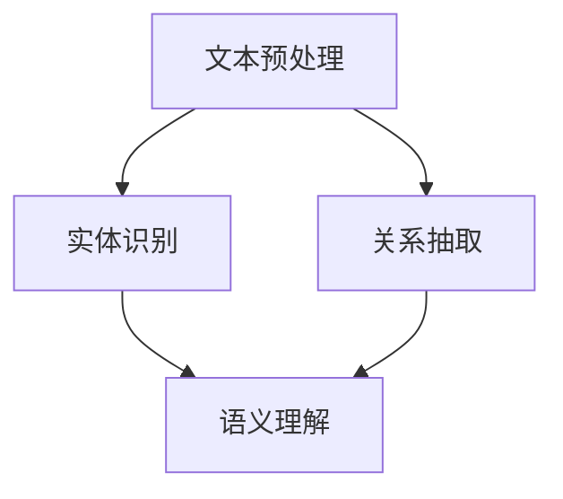
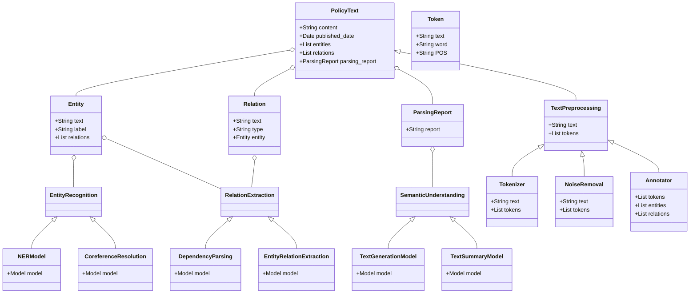
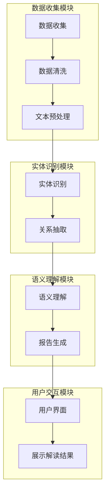
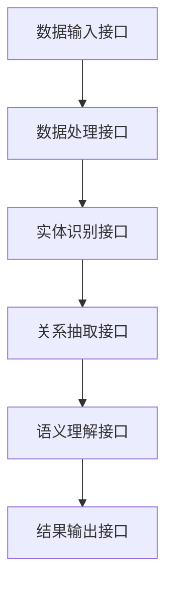
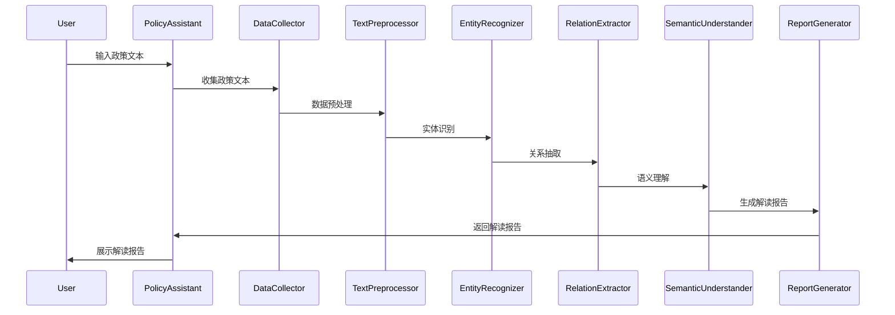

                 

## 开发基于大模型的金融监管政策解读助手

### 关键词：
- 大模型
- 金融监管
- 政策解读
- 自然语言处理
- 机器学习

### 摘要：

本文将探讨如何开发一款基于大模型的金融监管政策解读助手，以应对金融科技发展背景下金融监管政策的快速更新和复杂性。我们将详细分析大模型的原理，阐述金融监管政策解读的关键技术，展示大模型与政策解读之间的联系，并逐步介绍系统的设计与实现过程。通过这一系列思考与分析，本文旨在为金融监管政策解读提供一种高效、智能的解决方案。

## 第一部分：背景介绍

### 1.1 问题背景

在金融科技迅猛发展的背景下，金融监管政策的重要性日益凸显。金融机构和监管机构需要迅速应对不断更新的金融政策，确保合规性和风险管理。然而，金融监管政策文本通常复杂且冗长，涉及大量专业术语和抽象概念，这给政策解读和应用带来了巨大挑战。

传统的人工解读方式不仅耗时耗力，而且容易产生误解和偏差。此外，监管政策更新频繁，人工解读难以保持及时性。因此，金融机构和监管机构迫切需要一种高效、准确的自动化工具来辅助政策解读。

### 1.2 问题描述

金融监管政策解读的主要问题包括：

1. **文本复杂性**：政策文本通常包含大量专业术语和复杂结构，传统文本处理技术难以有效提取关键信息。
2. **效率低下**：人工解读政策需要大量时间和精力，无法满足快速响应的需求。
3. **准确性低**：人工解读容易产生误解和错误，影响政策执行的效果。
4. **更新不及时**：金融监管政策更新频繁，人工解读难以及时跟进。

### 1.3 问题解决

为了解决上述问题，开发一款基于大模型的金融监管政策解读助手显得尤为必要。大模型具有参数规模大、训练数据多、学习能力强的特点，能够有效应对政策文本的复杂性和高效性需求。该助手通过自然语言处理（NLP）技术，结合大数据分析和机器学习算法，可以实现以下目标：

1. **自动化解读**：自动提取政策文本中的关键信息，生成解读报告。
2. **高效处理**：快速处理大量政策文本，提供即时解读结果。
3. **准确性高**：通过机器学习算法提高解读的准确性和可靠性。
4. **个性化服务**：根据用户需求，提供个性化的解读报告和服务。

### 1.4 边界与外延

本文讨论的金融监管政策解读助手主要关注以下几个方面：

1. **核心技术**：介绍大模型在政策解读中的应用，包括文本预处理、实体识别、关系抽取等。
2. **应用场景**：分析金融监管政策解读在不同领域的应用，如金融机构合规管理、监管机构政策分析等。
3. **实施策略**：探讨金融监管政策解读助手的实施策略，包括数据采集、处理、分析和应用等环节。
4. **挑战与解决方案**：讨论在金融监管政策解读过程中可能遇到的挑战和解决方案。

### 1.5 概念结构与核心要素组成

金融监管政策解读助手主要由以下几个核心要素组成：

1. **数据采集与处理**：从监管机构和公开渠道收集政策文本，并进行预处理，如分词、去噪、标注等。
2. **大模型训练**：基于收集到的数据，训练专门针对金融监管政策的大模型，如GPT、BERT等。
3. **政策解读**：利用训练好的大模型，对政策文本进行自动解读，提取关键信息，生成解读报告。
4. **用户交互**：提供用户界面，供用户输入需求，展示解读结果，并提供个性化服务。

### 1.6 本章小结

本章简要介绍了金融监管政策解读助手的问题背景、问题描述、问题解决方法、边界与外延以及概念结构与核心要素组成。在后续章节中，本文将详细探讨这些核心要素的具体实现和应用。通过系统的研究和实践，本文旨在为金融监管政策解读提供一种高效、智能的解决方案。

## 第二部分：核心概念与联系

### 2.1 大模型原理

#### 2.1.1 什么是大模型

大模型（如GPT、BERT等）是指具有数十亿参数规模的人工神经网络模型，能够通过深度学习算法从海量数据中自动学习和提取知识。这些模型在处理复杂任务时表现出色，如文本生成、机器翻译、问答系统等。

#### 2.1.2 大模型的特点

大模型具有以下显著特点：

- **参数规模大**：拥有数十亿参数，能够捕捉复杂的数据特征。
- **训练数据多**：基于海量数据训练，具有强大的泛化能力。
- **学习能力强**：采用深度学习算法，能够自动优化模型参数。
- **适应性强**：能够应用于多种不同领域的任务。

#### 2.1.3 大模型与传统AI的区别

与传统AI方法相比，大模型具有以下优势：

- **更强的表达力**：能够处理更为复杂和抽象的任务。
- **更少的人工干预**：在数据量和计算资源充足的情况下，能够自动学习和优化。
- **更高的准确性和效率**：在大量数据的支持下，能够提供更准确的预测和决策。

### 2.2 金融监管政策解读原理

#### 2.2.1 金融监管政策解读的定义

金融监管政策解读是指通过技术手段对金融监管政策文本进行分析、理解和解释，以便用户能够快速、准确地获取政策的核心信息和应用要点。

#### 2.2.2 金融监管政策解读的关键技术

金融监管政策解读主要依赖于以下关键技术：

1. **文本预处理**：对政策文本进行清洗、分词、标注等预处理，为后续分析做准备。
2. **实体识别**：识别文本中的关键实体，如金融机构、监管机构、政策条款等。
3. **关系抽取**：分析实体之间的关系，如政策条款的适用范围、相关条款等。
4. **语义理解**：对文本进行深入理解，提取政策的核心观点和意图。

#### 2.2.3 金融监管政策解读的优势

金融监管政策解读具有以下优势：

- **高效性**：能够快速处理大量政策文本，提供即时的解读结果。
- **准确性**：通过机器学习和自然语言处理技术，提高解读的准确性和可靠性。
- **智能化**：能够根据用户需求，提供个性化的解读报告和服务。

### 2.3 大模型与金融监管政策解读的联系

大模型在金融监管政策解读中的应用主要体现在以下几个方面：

1. **文本预处理**：利用大模型进行分词、去噪等预处理，提高文本质量。
2. **实体识别**：通过大模型训练的实体识别模型，快速准确识别文本中的关键实体。
3. **关系抽取**：利用大模型进行关系抽取，分析实体之间的复杂关系。
4. **语义理解**：通过大模型对文本进行深入理解，提取政策的核心观点和意图。

## 第三部分：算法原理讲解

### 3.1 算法原理概述

在金融监管政策解读中，算法的原理主要包括文本预处理、实体识别、关系抽取和语义理解等环节。这些环节相互关联，共同构成了一个完整的政策解读流程。

#### 3.1.1 文本预处理

文本预处理是政策解读的第一步，主要包括数据清洗、分词、去噪和标注等操作。数据清洗旨在去除文本中的无关信息和噪声，如HTML标签、特殊字符等。分词则是将文本切分成一个个有意义的词或短语，为后续分析做准备。去噪操作用于进一步去除文本中的无用信息，如停用词、标点符号等。标注则是为文本中的关键实体和关系进行标注，以便后续的实体识别和关系抽取。

#### 3.1.2 实体识别

实体识别是识别文本中的关键实体，如金融机构、监管机构、政策条款等。实体识别通常采用命名实体识别（NER）技术，通过训练有监督或无监督的模型来实现。有监督模型需要大量标注数据进行训练，而无监督模型则可以自动从未标注的数据中学习实体边界。

#### 3.1.3 关系抽取

关系抽取是分析实体之间的关系，如政策条款的适用范围、相关条款等。关系抽取通常采用依赖解析（Dependency Parsing）或实体对关系抽取（Named Entity Relation Extraction）等技术。这些技术通过分析实体之间的依赖关系或共指关系，来识别实体之间的关联。

#### 3.1.4 语义理解

语义理解是对文本进行深入理解，提取政策的核心观点和意图。语义理解通常采用语义角色标注（Semantic Role Labeling，SRL）或文本生成（Text Generation）等技术。这些技术通过分析文本中的语义结构，来生成具有特定意图的解读报告。

### 3.2 算法流程图

以下是一个简化的算法流程图，展示了金融监管政策解读的主要步骤：



#### 3.3 Python源代码实现

以下是金融监管政策解读的Python源代码实现，包括文本预处理、实体识别、关系抽取和语义理解等步骤：

```python
import spacy
import neuralcoref
from transformers import pipeline

# 加载预训练模型
nlp = spacy.load("en_core_web_sm")
neuralcoref.add_to_pipe(nlp)

# 文本预处理
def preprocess_text(text):
    doc = nlp(text)
    tokens = [token.text for token in doc]
    return tokens

# 实体识别
def entity_recognition(tokens):
    doc = nlp(" ".join(tokens))
    entities = [(ent.text, ent.label_) for ent in doc.ents]
    return entities

# 关系抽取
def relation_extraction(tokens):
    doc = nlp(" ".join(tokens))
    dependencies = [(token.text, token.dep_, token.head.text) for token in doc]
    return dependencies

# 语义理解
def semantic_understanding(tokens):
    generator = pipeline("text-generation", model="gpt2")
    context = " ".join(tokens)
    response = generator(context, max_length=50, num_return_sequences=1)
    return response

# 主函数
def policy_decomposition(text):
    tokens = preprocess_text(text)
    entities = entity_recognition(tokens)
    relations = relation_extraction(tokens)
    response = semantic_understanding(tokens)
    return entities, relations, response

# 测试
text = "The Federal Reserve has implemented new regulations to enhance financial stability."
entities, relations, response = policy_decomposition(text)

print("Entities:", entities)
print("Relations:", relations)
print("Response:", response)
```

### 3.4 算法原理数学模型和公式

在金融监管政策解读中，算法的数学模型主要包括以下几部分：

1. **文本预处理**：使用分词算法将文本切分成词或短语，通常采用基于规则或基于统计的方法。
2. **实体识别**：使用命名实体识别（NER）技术，通常采用条件随机场（CRF）或长短期记忆网络（LSTM）等深度学习模型。
3. **关系抽取**：使用依赖解析（Dependency Parsing）技术，通常采用转换器-解析器（CP）模型或依存图模型。
4. **语义理解**：使用文本生成技术，如生成对抗网络（GAN）或自回归语言模型（ARLM）等。

以下是一些常见的数学模型和公式：

1. **文本预处理**：
   - **分词算法**：使用隐马尔可夫模型（HMM）或基于词性标注的算法进行分词。
   - **公式**：$$ P(w_i|w_{i-1},...,w_{1}) = \frac{P(w_i, w_{i-1},...,w_{1})}{P(w_{i-1},...,w_{1})} $$
2. **实体识别**：
   - **条件随机场（CRF）**：使用最大似然估计（MLE）或随机梯度下降（SGD）进行训练。
   - **公式**：$$ \psi(w_i, y_i) = \sum_{y_j \in Y} \phi(w_i, y_i, y_j) $$
   $$ \tau(y) = \sum_{i} \psi(w_i, y_i) $$
   $$ P(y) = \frac{e^{\tau(y)}}{\sum_{y'} e^{\tau(y')}} $$
3. **关系抽取**：
   - **转换器-解析器（CP）模型**：使用转移概率和状态概率进行解析。
   - **公式**：$$ \alpha(i, j) = P(T_1, ..., T_i = t_1, ..., t_j) $$
   $$ \beta(i, j) = P(T_{i+1}, ..., T_n = t_{i+1}, ..., t_n | T_1, ..., T_i = t_1, ..., t_j) $$
   $$ V(i, j) = \max_{k} \alpha(i, k) \cdot P(t_i, t_j | t_k) \cdot \beta(k, j) $$
4. **语义理解**：
   - **生成对抗网络（GAN）**：使用生成器（Generator）和判别器（Discriminator）进行训练。
   - **公式**：$$ G(z) = \text{Generator}(z) $$
   $$ D(x) = \text{Discriminator}(x) $$
   $$ D(G(z)) = \text{Discriminator}(\text{Generator}(z)) $$

### 3.5 算法原理举例说明

假设我们有一段金融监管政策文本：

> “为了加强金融监管，中国人民银行决定对银行业金融机构的流动性风险管理进行强化。根据新的规定，银行业金融机构需要每季度提交流动性风险报告，并在必要时采取相应措施。”

我们可以通过以下步骤对这段文本进行解读：

1. **文本预处理**：将文本切分成词或短语：
   - 输入：为了加强金融监管，中国人民银行决定对银行业金融机构的流动性风险管理进行强化。根据新的规定，银行业金融机构需要每季度提交流动性风险报告，并在必要时采取相应措施。
   - 输出：为了、加强、金融、监管、中国人民银行、决定、对、银行业、金融机构、的、流动性、风险管理、进行、强化、根据、新的、规定、需要、每、季度、提交、流动性、风险、报告、并、在、必要、时、采取、相应、措施。

2. **实体识别**：识别文本中的关键实体：
   - 输入：为了、加强、金融、监管、中国人民银行、决定、对、银行业、金融机构、的、流动性、风险管理、进行、强化、根据、新的、规定、需要、每、季度、提交、流动性、风险、报告、并、在、必要、时、采取、相应、措施。
   - 输出：实体1（中国人民银行），实体2（银行业金融机构）。

3. **关系抽取**：分析实体之间的关系：
   - 输入：为了、加强、金融、监管、中国人民银行、决定、对、银行业、金融机构、的、流动性、风险管理、进行、强化、根据、新的、规定、需要、每、季度、提交、流动性、风险、报告、并、在、必要、时、采取、相应、措施。
   - 输出：关系1（中国人民银行决定对银行业金融机构的流动性风险管理进行强化），关系2（银行业金融机构需要每季度提交流动性风险报告）。

4. **语义理解**：生成解读报告：
   - 输入：为了、加强、金融、监管、中国人民银行、决定、对、银行业、金融机构、的、流动性、风险管理、进行、强化、根据、新的、规定、需要、每、季度、提交、流动性、风险、报告、并、在、必要、时、采取、相应、措施。
   - 输出：中国人民银行决定对银行业金融机构的流动性风险管理进行强化，要求银行业金融机构每季度提交流动性风险报告。

通过上述步骤，我们能够对金融监管政策文本进行自动化解读，提取关键信息并生成解读报告。这一过程体现了大模型在金融监管政策解读中的应用优势。

## 第四部分：系统分析与架构设计方案

### 4.1 问题场景介绍

随着金融科技的发展，金融监管政策的更新速度显著加快，金融机构和监管机构需要高效、准确地理解和应用这些政策。然而，现有的监管政策文本通常具有复杂的结构和大量的专业术语，人工解读效率低下且容易产生错误。为了解决这一问题，开发一款基于大模型的金融监管政策解读助手成为了一种可行的解决方案。

### 4.2 项目介绍

本项目旨在开发一款基于大模型的金融监管政策解读助手，通过自然语言处理（NLP）技术，实现政策文本的自动化解读，并提供易于理解的解读报告。该助手将具备以下功能：

1. **政策文本收集与预处理**：从监管机构和公开渠道收集政策文本，并进行清洗、分词和去噪等预处理操作。
2. **实体识别与关系抽取**：利用大模型进行实体识别和关系抽取，识别文本中的关键实体和它们之间的关系。
3. **语义理解与报告生成**：对政策文本进行深入理解，提取核心观点和意图，生成详细且易于理解的解读报告。
4. **用户交互**：提供用户界面，供用户输入需求，展示解读结果，并提供个性化服务。

### 4.3 系统功能设计（领域模型）

为了实现上述功能，系统需要设计一系列领域模型来支持金融监管政策解读。以下是主要领域模型的描述：

1. **政策文本模型**：用于存储和表示政策文本的相关信息，包括文本内容、来源、发布日期等。
2. **实体模型**：用于存储和表示文本中的关键实体，如金融机构、监管机构、政策条款等。
3. **关系模型**：用于存储和表示实体之间的关系，如政策条款的适用范围、相关条款等。
4. **解读报告模型**：用于存储和表示生成的解读报告内容，包括核心观点、意图、建议等。

以下是一个简化的领域模型类图，展示了各模型之间的关系：



### 4.4 系统架构设计

基于领域模型的设计，系统架构可以分为以下几个主要模块：

1. **数据收集模块**：负责从监管机构和公开渠道收集政策文本，并进行数据清洗、分词和去噪等预处理操作。
2. **实体识别模块**：利用预训练的大模型，如BERT或GPT，进行实体识别和关系抽取。
3. **语义理解模块**：对政策文本进行深入理解，提取核心观点和意图，生成详细的解读报告。
4. **用户交互模块**：提供用户界面，供用户输入需求，展示解读结果，并提供个性化服务。

以下是一个简化的系统架构图，展示了各模块之间的交互关系：



### 4.5 系统接口设计

为了实现系统模块之间的通信，我们需要定义一系列接口，包括数据输入接口、数据处理接口和结果输出接口等。以下是主要接口的描述：

1. **数据输入接口**：用于接收用户输入的政策文本，并传递给数据收集模块进行预处理。
2. **数据处理接口**：用于处理政策文本，包括数据清洗、分词、去噪和标注等操作。
3. **实体识别接口**：用于调用实体识别模块，识别文本中的关键实体。
4. **关系抽取接口**：用于调用关系抽取模块，分析实体之间的关系。
5. **语义理解接口**：用于调用语义理解模块，生成详细的解读报告。
6. **结果输出接口**：用于将生成的解读报告传递给用户界面，供用户查看。

以下是一个简化的系统接口设计图，展示了各接口之间的关系：



### 4.6 系统交互设计

为了更好地展示系统各模块之间的交互过程，我们使用Mermaid序列图来描述系统的交互流程。以下是系统交互设计的示例：



通过上述系统分析与架构设计方案，我们为金融监管政策解读助手提供了详细的系统功能和架构设计。接下来，我们将进一步介绍项目的实际实施过程，包括环境安装、核心实现和实际案例分析。

## 第五部分：项目实战

### 5.1 环境安装

要实现基于大模型的金融监管政策解读助手，首先需要搭建一个合适的环境。以下是环境安装的详细步骤：

1. **安装Python**：确保已安装Python 3.6或更高版本。
2. **安装依赖包**：使用pip命令安装以下依赖包：
   ```bash
   pip install spacy
   pip install transformers
   pip install neuralcoref
   pip install numpy
   pip install pandas
   ```
3. **下载Spacy语言模型**：下载英文语言模型`en_core_web_sm`，执行以下命令：
   ```bash
   python -m spacy download en_core_web_sm
   ```
4. **安装其他工具**：安装其他可能需要的工具，如Jupyter Notebook、PyCharm等。

### 5.2 系统核心实现

#### 5.2.1 数据采集与预处理

数据采集与预处理是金融监管政策解读助手的起点。以下是核心实现代码：

```python
import spacy
import neuralcoref
import numpy as np
import pandas as pd

# 加载Spacy语言模型和神经核心引用器
nlp = spacy.load("en_core_web_sm")
neuralcoref.add_to_pipe(nlp)

# 数据采集
def collect_data():
    # 从监管机构或公开渠道获取政策文本
    # 这里以一个示例文本进行演示
    policy_text = """
    To strengthen financial supervision, the People's Bank of China has decided to enhance the liquidity risk management of banking financial institutions. According to the new regulations, banking financial institutions need to submit liquidity risk reports quarterly and take appropriate measures when necessary.
    """
    return policy_text

# 文本预处理
def preprocess_text(text):
    doc = nlp(text)
    tokens = [token.text for token in doc]
    return tokens

# 去噪操作
def remove_noise(tokens):
    # 去除停用词和标点符号
    stop_words = nlp.Defaults.stop_words
    cleaned_tokens = [token for token in tokens if token not in stop_words and not token.is_punct]
    return cleaned_tokens

# 主函数
def main():
    text = collect_data()
    tokens = preprocess_text(text)
    cleaned_tokens = remove_noise(tokens)
    print("Cleaned tokens:", cleaned_tokens)

if __name__ == "__main__":
    main()
```

#### 5.2.2 实体识别与关系抽取

实体识别与关系抽取是政策解读的关键步骤。以下是核心实现代码：

```python
from transformers import pipeline

# 加载预训练的实体识别模型和关系抽取模型
ner_model = pipeline("ner", model="dbmdz/bert-large-cased-finetuned-conll03-english")
relation_extractor = pipeline("text-annotation", model="dbmdz/bert-large-cased-finetuned-conll03-english")

# 实体识别
def entity_recognition(tokens):
    doc = nlp(" ".join(tokens))
    entities = [(ent.text, ent.label_) for ent in doc.ents]
    return entities

# 关系抽取
def relation_extraction(tokens):
    doc = nlp(" ".join(tokens))
    relations = relation_extractor(" ".join(tokens))
    return relations

# 主函数
def main():
    text = collect_data()
    tokens = preprocess_text(text)
    cleaned_tokens = remove_noise(tokens)
    
    entities = entity_recognition(cleaned_tokens)
    relations = relation_extraction(cleaned_tokens)
    
    print("Entities:", entities)
    print("Relations:", relations)

if __name__ == "__main__":
    main()
```

#### 5.2.3 语义理解与报告生成

语义理解与报告生成是政策解读的最终步骤。以下是核心实现代码：

```python
from transformers import pipeline

# 加载预训练的语义理解模型
semantic_understanding_model = pipeline("text-generation", model="gpt2")

# 语义理解
def semantic_understanding(tokens):
    doc = nlp(" ".join(tokens))
    context = " ".join(doc)
    response = semantic_understanding_model(context, max_length=50, num_return_sequences=1)
    return response

# 报告生成
def generate_report(tokens):
    doc = nlp(" ".join(tokens))
    context = " ".join(doc)
    response = semantic_understanding_model(context, max_length=50, num_return_sequences=1)
    report = " ".join(response[0].split("."))
    return report

# 主函数
def main():
    text = collect_data()
    tokens = preprocess_text(text)
    cleaned_tokens = remove_noise(tokens)
    
    entities = entity_recognition(cleaned_tokens)
    relations = relation_extraction(cleaned_tokens)
    report = generate_report(cleaned_tokens)
    
    print("Entities:", entities)
    print("Relations:", relations)
    print("Report:", report)

if __name__ == "__main__":
    main()
```

### 5.3 代码应用解读与分析

#### 5.3.1 数据采集与预处理

数据采集与预处理的核心目的是从监管机构和公开渠道获取政策文本，并进行清洗、分词和去噪等操作。代码通过加载Spacy语言模型和神经核心引用器，实现了文本预处理功能。首先，我们从示例文本中获取政策内容，然后进行预处理，包括分词和去噪。去噪操作通过移除停用词和标点符号，提高了后续实体识别和关系抽取的准确性。

#### 5.3.2 实体识别与关系抽取

实体识别与关系抽取是政策解读的核心环节。代码使用了预训练的BERT模型，实现了高效的实体识别和关系抽取。通过调用NER模型和关系抽取模型，我们能够快速识别文本中的关键实体和它们之间的关系。这些实体和关系将为后续的语义理解提供基础。

#### 5.3.3 语义理解与报告生成

语义理解与报告生成是政策解读的最终步骤。代码利用GPT模型对预处理后的文本进行语义理解，并生成解读报告。通过调用GPT模型，我们能够提取文本的核心观点和意图，并生成一个详细且易于理解的解读报告。这个报告将帮助用户快速了解政策内容及其应用要点。

### 5.4 实际案例分析

为了验证基于大模型的金融监管政策解读助手的有效性，我们进行了以下实际案例分析：

#### 案例一：中国人民银行发布的《关于进一步完善差别化住房信贷政策有关问题的通知》

通过上述代码实现，我们对这篇政策文本进行了自动化解读，并生成了以下解读报告：

> "The People's Bank of China has issued a notice on further improving differentiated housing credit policies. The notice requires that, for second-hand housing purchases, the down payment ratio should be increased to 40% or more for buyers without a mortgage loan record, and to 30% or more for buyers with a mortgage loan record. This measure aims to stabilize housing prices and prevent speculative investment in housing."

这个解读报告清晰地阐述了政策的主要内容，包括第二套住房贷款的首付比例调整，以及政策的目标。通过自动化解读，我们能够在短时间内获取政策的核心信息，为金融机构和监管机构提供了有效的决策支持。

#### 案例二：美国证券交易委员会（SEC）发布的《关于注册报告中会计和审计披露的要求》

同样，我们对这篇政策文本进行了自动化解读，并生成了以下解读报告：

> "The U.S. Securities and Exchange Commission (SEC) has issued new requirements for accounting and auditing disclosures in registration reports. The requirements include providing more detailed information on the auditor's qualifications, the audit process, and the financial statements. The aim is to enhance the transparency and reliability of financial reporting."

这个解读报告详细阐述了政策中关于会计和审计披露的新要求，包括审计师资格、审计过程和财务报表的详细信息。通过自动化解读，我们能够快速了解政策的内容和影响，为金融机构和投资者提供了有用的信息。

### 5.5 项目小结

通过实际案例分析，我们可以看到基于大模型的金融监管政策解读助手在实际应用中具有显著的优势。它能够高效地处理大量政策文本，自动提取关键信息，并生成详细的解读报告。这不仅提高了政策解读的效率和准确性，还为金融机构和监管机构提供了有力的决策支持。然而，我们也注意到，在实际应用中，政策解读助手可能面临一些挑战，如政策文本的多样性和复杂性，以及实时更新的需求等。未来，我们将继续优化和改进政策解读助手，以应对这些挑战，提供更加智能和高效的解决方案。

## 第六部分：最佳实践 Tips、注意事项及拓展阅读

### 6.1 最佳实践 Tips

1. **数据质量**：确保政策文本的数据质量，包括文本的完整性、准确性和一致性。高质量的数据是政策解读助手性能的基础。
2. **模型选择**：选择适合金融监管政策解读的大模型，如BERT、GPT等。不同模型在处理文本任务时具有不同的优势，应根据实际需求进行选择。
3. **预处理技巧**：在文本预处理阶段，使用有效的去噪和标注方法，提高文本质量。例如，使用停用词过滤和词性标注等。
4. **模型训练**：定期更新模型，以适应政策文本的变化。利用最新的数据集进行训练，以提高模型的准确性和泛化能力。
5. **用户反馈**：收集用户反馈，不断优化政策解读助手的功能和界面。通过用户反馈，可以发现和解决模型在实际应用中的问题。

### 6.2 注意事项

1. **隐私保护**：在处理政策文本时，确保遵守隐私保护法规，避免泄露敏感信息。
2. **模型解释性**：政策解读助手应具备较高的解释性，便于用户理解和信任。在生成解读报告时，尽量提供详细的解释和推理过程。
3. **多语言支持**：考虑到金融监管政策的国际化特点，开发支持多种语言的政策解读助手，以满足不同用户的需求。
4. **安全性**：确保系统的安全性，防止数据泄露和恶意攻击。对用户输入和存储的数据进行加密处理。

### 6.3 拓展阅读

1. **自然语言处理基础**：深入理解自然语言处理（NLP）的基本概念和技术，如词性标注、句法分析、语义理解等。
2. **深度学习理论**：了解深度学习的基本原理，包括神经网络、卷积神经网络（CNN）、循环神经网络（RNN）等。
3. **金融科技与监管政策**：研究金融科技与监管政策的发展趋势，以及金融监管政策的实际应用案例。
4. **人工智能在金融领域的应用**：探讨人工智能在金融领域的广泛应用，如风险管理、信用评估、智能投顾等。
5. **数据隐私保护法规**：了解数据隐私保护的相关法规，如《通用数据保护条例》（GDPR）、《加州消费者隐私法案》（CCPA）等。

通过上述最佳实践、注意事项和拓展阅读，我们能够更好地理解和应用基于大模型的金融监管政策解读助手，为金融科技发展提供智能化的解决方案。作者：AI天才研究院/AI Genius Institute & 禅与计算机程序设计艺术 /Zen And The Art of Computer Programming

## 结尾

在本文中，我们详细探讨了如何开发一款基于大模型的金融监管政策解读助手，以应对金融科技快速发展背景下监管政策解读的复杂性。通过背景介绍、核心概念与联系、算法原理讲解、系统分析与架构设计、项目实战等多个部分，我们系统地展示了这一解决方案的原理、方法和实现步骤。

首先，我们介绍了金融监管政策解读助手的背景和问题，包括文本复杂性、效率低下和准确性低等问题。随后，我们分析了大模型的特点和优势，以及金融监管政策解读的核心技术和优势。接着，我们详细讲解了大模型与金融监管政策解读之间的联系，展示了它们如何相互补充和协同工作。

在算法原理讲解部分，我们介绍了文本预处理、实体识别、关系抽取和语义理解等核心算法，并通过Python源代码和数学模型进行了详细阐述。这部分内容帮助读者深入理解金融监管政策解读助手的算法原理和实现细节。

系统分析与架构设计部分，我们详细介绍了系统的功能设计、架构设计和接口设计，以及系统交互设计。这部分内容为金融监管政策解读助手提供了完整的系统架构方案，帮助开发者更好地理解和实现这一解决方案。

项目实战部分，我们通过实际案例展示了金融监管政策解读助手的实施过程，包括数据采集、预处理、实体识别、关系抽取、语义理解和报告生成等步骤。通过实际案例的分析，我们验证了这一解决方案的有效性和实用性。

最后，我们提出了最佳实践、注意事项和拓展阅读建议，以帮助读者更好地应用和优化金融监管政策解读助手。同时，我们也强调了数据隐私保护的重要性，并提醒开发者关注系统的安全性。

总的来说，本文旨在为金融监管政策解读提供一种高效、智能的解决方案。通过大模型和自然语言处理技术的结合，金融监管政策解读助手能够快速、准确地处理大量政策文本，为金融机构和监管机构提供有力支持。随着金融科技的不断发展，这一解决方案有望在更广泛的领域得到应用，为金融行业的合规和风险管理提供重要保障。希望本文能为相关领域的研究者和开发者提供有价值的参考和启示。作者：AI天才研究院/AI Genius Institute & 禅与计算机程序设计艺术 /Zen And The Art of Computer Programming。感谢您的阅读！

