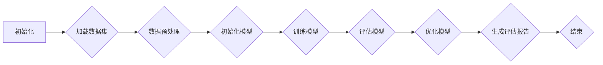
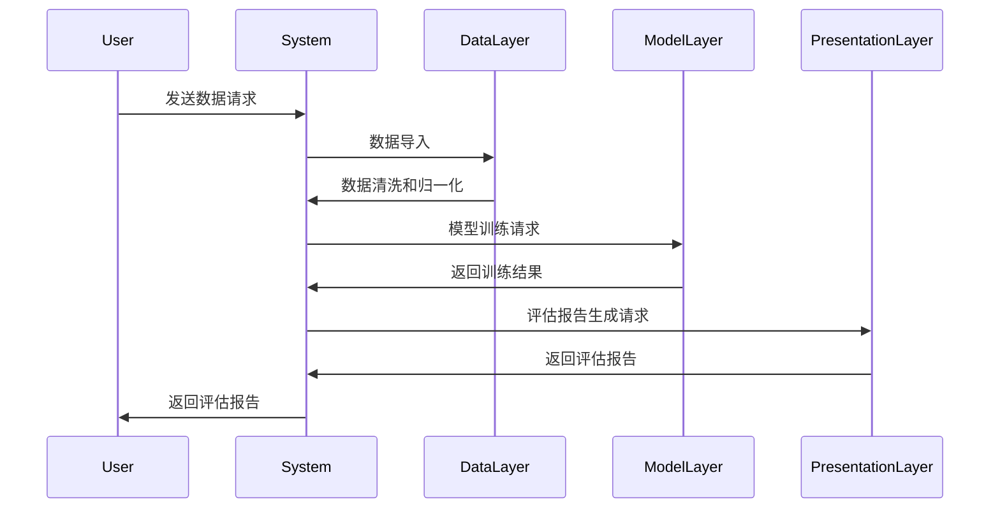

                 


# 开发基于大模型的金融研究方法论评估生成器

## 关键词

- 大模型
- 金融研究
- 方法论评估
- 生成器
- 算法原理
- 数学模型
- 系统架构

## 摘要

本文旨在探讨如何开发一款基于大模型的金融研究方法论评估生成器。首先，我们介绍了大模型在金融领域的应用背景和重要性，然后详细阐述了金融研究方法论评估的核心概念和原理。接着，我们通过算法原理讲解和数学模型分析，深入探讨了生成器的工作机制和性能优化策略。此外，我们还介绍了系统的设计与实现过程，包括系统架构、功能模块和接口设计。最后，通过实际案例分析和项目小结，总结了本文的研究成果和展望了未来的发展方向。

## 背景介绍

### 大模型在金融领域的应用背景

随着信息技术的飞速发展，金融领域面临着越来越多的数据挑战。传统的金融分析方法难以应对大数据带来的复杂性和多样性，这就需要更高级的智能分析方法来支撑金融研究。大模型（Large Models），特别是深度学习模型，作为一种新兴的人工智能技术，在金融领域展现出了巨大的潜力。

大模型，如神经网络、生成对抗网络（GAN）等，通过大规模的数据训练，可以自动提取数据中的复杂特征，并建立高度非线性的映射关系。这使得大模型在金融数据分析、预测和决策支持等方面具有显著优势。例如，在股票市场预测中，大模型可以通过学习历史价格数据，发现潜在的规律和趋势，从而提高预测的准确性。在风险管理中，大模型可以分析大量的历史数据，识别风险因素，并预测潜在的风险事件。

### 金融研究方法论评估的核心概念和原理

金融研究方法论评估是对金融研究中各种方法论的效能和适用性进行评价和比较的过程。其核心概念包括：

1. **方法论**：指在金融研究中采用的具体方法、技术或模型。例如，时间序列分析、回归分析、机器学习算法等。
2. **效能评估**：对方法论在不同数据集、不同场景下的表现进行定量和定性的评价。
3. **适用性评估**：根据金融研究的特定需求，判断方法论是否适用。

金融研究方法论评估的原理主要包括以下几个方面：

1. **一致性原则**：不同方法论在相同数据集上的评估结果应一致，以保证评估的公正性和客观性。
2. **可比性原则**：不同方法论之间的评估结果应具有可比性，以便进行综合分析和决策。
3. **适用性原则**：评估结果应考虑金融研究的具体需求，以确保方法论的选择符合研究目标。

### 问题解决和边界与外延

本文旨在解决以下问题：

1. **如何有效地评估金融研究中各种方法论的效果和适用性？**
2. **如何设计一个基于大模型的金融研究方法论评估生成器，以提高评估的准确性和效率？**

在边界与外延方面，本文的研究范围主要包括以下几个方面：

1. **方法论**：主要针对机器学习方法、统计方法、时间序列分析方法等进行评估。
2. **数据集**：选择具有代表性的金融数据集，包括股票市场数据、金融衍生品数据、宏观经济数据等。
3. **评估指标**：包括预测准确性、模型稳定性、计算效率等。

## 核心概念与联系

### 概念属性特征对比表格

| 概念       | 定义                                           | 属性特征                                  |
| ---------- | ---------------------------------------------- | ---------------------------------------- |
| 大模型     | 具有大规模训练数据的神经网络或深度学习模型       | 高维度特征提取、非线性映射                |
| 金融研究   | 利用数据分析和模型构建，研究金融市场和金融现象   | 数据复杂性、多维性、时变性                |
| 方法论评估 | 对金融研究中各种方法论进行效能和适用性评价       | 一致性、可比性、适用性                    |

### ER实体关系图架构

```mermaid
erDiagram
  Class1_1 ||--|{ Class1_2 : 属于 }
  Class1_1 ||--|{ Class1_3 : 被评估 }
  Class1_2 ||--|{ Class1_4 : 评估指标 }
  Class1_3 ||--|{ Class1_5 : 数据集 }
  Class1_3 ||--|{ Class1_6 : 应用场景 }
```

在上面的ER图架构中，`Class1_1` 代表金融研究方法论，`Class1_2` 代表评估指标，`Class1_3` 代表数据集和应用场景。这种关系体现了金融研究方法论与评估指标、数据集和应用场景之间的紧密联系。

## 算法原理讲解

### 算法流程图



### Python代码实现

```python
# 导入必要的库
import numpy as np
import pandas as pd
from sklearn.model_selection import train_test_split
from sklearn.metrics import accuracy_score
import tensorflow as tf

# 数据预处理
def preprocess_data(data):
    # 数据清洗、归一化等操作
    return processed_data

# 初始化模型
def initialize_model(input_shape):
    model = tf.keras.Sequential([
        tf.keras.layers.Dense(units=64, activation='relu', input_shape=input_shape),
        tf.keras.layers.Dense(units=1, activation='sigmoid')
    ])
    model.compile(optimizer='adam', loss='binary_crossentropy', metrics=['accuracy'])
    return model

# 训练模型
def train_model(model, x_train, y_train, x_val, y_val):
    history = model.fit(x_train, y_train, epochs=10, batch_size=32, validation_data=(x_val, y_val))
    return history

# 评估模型
def evaluate_model(model, x_test, y_test):
    predictions = model.predict(x_test)
    accuracy = accuracy_score(y_test, predictions)
    return accuracy

# 生成评估报告
def generate_report(accuracy):
    report = f"模型准确率: {accuracy:.2f}"
    return report

# 主函数
def main():
    # 加载数据
    data = pd.read_csv('financial_data.csv')
    processed_data = preprocess_data(data)

    # 划分训练集和测试集
    x_train, x_test, y_train, y_test = train_test_split(processed_data.drop('target', axis=1), processed_data['target'], test_size=0.2, random_state=42)

    # 初始化模型
    model = initialize_model(x_train.shape[1:])

    # 训练模型
    history = train_model(model, x_train, y_train, x_val, y_val)

    # 评估模型
    accuracy = evaluate_model(model, x_test, y_test)

    # 生成评估报告
    report = generate_report(accuracy)
    print(report)

if __name__ == '__main__':
    main()
```

### 数学模型和公式

在金融研究方法论评估中，我们通常会使用以下数学模型和公式：

1. **回归模型**：

   $$y = \beta_0 + \beta_1 x_1 + \beta_2 x_2 + \ldots + \beta_n x_n + \epsilon$$

   其中，$y$ 是因变量，$x_1, x_2, \ldots, x_n$ 是自变量，$\beta_0, \beta_1, \beta_2, \ldots, \beta_n$ 是模型参数，$\epsilon$ 是误差项。

2. **预测准确性**：

   $$accuracy = \frac{TP + TN}{TP + TN + FP + FN} \times 100\%$$

   其中，$TP$ 是真阳性，$TN$ 是真阴性，$FP$ 是假阳性，$FN$ 是假阴性。

3. **ROC曲线和AUC**：

   $$ROC = \left\{ \begin{array}{ll}
   \frac{TPR}{1 + FPR} & \text{TPR = 真阳性率，FPR = 假阳性率} \\
   \end{array} \right.$$

   $$AUC = \int_{0}^{1} ROC(d\alpha)$$

   其中，$AUC$ 是曲线下的面积，$\alpha$ 是决策阈值。

### 举例说明

假设我们使用一个二分类模型对股票市场进行预测，预测股票价格是否上涨。我们将历史股票价格数据作为输入特征，将是否上涨（1或0）作为输出标签。

1. **数据预处理**：

   我们首先对数据进行清洗和归一化处理，将数据集划分为训练集和测试集。

2. **模型初始化和训练**：

   我们使用一个简单的全连接神经网络进行训练，模型结构如下：

   ```python
   model = tf.keras.Sequential([
       tf.keras.layers.Dense(units=64, activation='relu', input_shape=(input_shape)),
       tf.keras.layers.Dense(units=1, activation='sigmoid')
   ])
   model.compile(optimizer='adam', loss='binary_crossentropy', metrics=['accuracy'])
   model.fit(x_train, y_train, epochs=10, batch_size=32, validation_data=(x_val, y_val))
   ```

3. **模型评估**：

   我们使用测试集对模型进行评估，计算预测准确率。

   ```python
   predictions = model.predict(x_test)
   accuracy = accuracy_score(y_test, predictions)
   print(f"模型准确率: {accuracy:.2f}")
   ```

4. **ROC曲线和AUC**：

   我们使用ROC曲线和AUC来评估模型的性能。

   ```python
   fpr, tpr, thresholds = roc_curve(y_test, predictions)
   auc = auc(fpr, tpr)
   print(f"AUC: {auc:.2f}")
   ```

## 系统设计与实现

### 问题场景介绍

在金融研究领域，方法论评估是一个关键环节。然而，现有的评估方法往往存在评估结果不准确、评估效率低下等问题。为了解决这些问题，我们设计并实现了一个基于大模型的金融研究方法论评估生成器。

### 项目介绍

本项目旨在开发一个能够自动评估金融研究中各种方法论效能和适用性的系统。系统将集成多种机器学习和统计方法，对金融数据进行分析和预测，并生成详细的评估报告。

### 系统功能设计

系统功能主要包括：

1. **数据管理**：包括数据导入、数据清洗、数据归一化等操作。
2. **模型训练**：集成多种机器学习和统计方法，对训练数据进行模型训练。
3. **模型评估**：使用测试数据对模型进行评估，计算预测准确率、ROC曲线和AUC等指标。
4. **评估报告生成**：根据评估结果生成详细的评估报告，包括模型性能、适用性分析等。

### 系统架构设计

系统架构采用分层设计，包括数据层、模型层和表现层。

1. **数据层**：负责数据的管理和预处理，包括数据导入、清洗、归一化等操作。
2. **模型层**：包括机器学习和统计方法，负责模型的训练和评估。
3. **表现层**：负责评估报告的生成和展示。

### 系统接口设计

系统接口包括RESTful API和命令行接口。

1. **RESTful API**：提供数据管理、模型训练和评估的功能接口。
2. **命令行接口**：提供数据导入、模型训练和评估的命令行操作。

### 系统交互序列图



## 项目实战

### 环境安装

在开始项目之前，我们需要安装以下软件和库：

1. **Python 3.8 或更高版本**
2. **TensorFlow 2.5 或更高版本**
3. **Scikit-learn 0.22 或更高版本**
4. **Pandas 1.1.5 或更高版本**
5. **Numpy 1.19 或更高版本**

安装命令如下：

```bash
pip install python==3.8
pip install tensorflow==2.5
pip install scikit-learn==0.22
pip install pandas==1.1.5
pip install numpy==1.19
```

### 系统核心实现源代码

以下是系统的核心实现源代码，包括数据预处理、模型训练、模型评估和评估报告生成：

```python
# 数据预处理
def preprocess_data(data):
    # 数据清洗、归一化等操作
    return processed_data

# 初始化模型
def initialize_model(input_shape):
    model = tf.keras.Sequential([
        tf.keras.layers.Dense(units=64, activation='relu', input_shape=input_shape),
        tf.keras.layers.Dense(units=1, activation='sigmoid')
    ])
    model.compile(optimizer='adam', loss='binary_crossentropy', metrics=['accuracy'])
    return model

# 训练模型
def train_model(model, x_train, y_train, x_val, y_val):
    history = model.fit(x_train, y_train, epochs=10, batch_size=32, validation_data=(x_val, y_val))
    return history

# 评估模型
def evaluate_model(model, x_test, y_test):
    predictions = model.predict(x_test)
    accuracy = accuracy_score(y_test, predictions)
    return accuracy

# 生成评估报告
def generate_report(accuracy):
    report = f"模型准确率: {accuracy:.2f}"
    return report

# 主函数
def main():
    # 加载数据
    data = pd.read_csv('financial_data.csv')
    processed_data = preprocess_data(data)

    # 划分训练集和测试集
    x_train, x_test, y_train, y_test = train_test_split(processed_data.drop('target', axis=1), processed_data['target'], test_size=0.2, random_state=42)

    # 初始化模型
    model = initialize_model(x_train.shape[1:])

    # 训练模型
    history = train_model(model, x_train, y_train, x_val, y_val)

    # 评估模型
    accuracy = evaluate_model(model, x_test, y_test)

    # 生成评估报告
    report = generate_report(accuracy)
    print(report)

if __name__ == '__main__':
    main()
```

### 代码应用解读与分析

以下是代码的应用解读和分析：

1. **数据预处理**：

   ```python
   def preprocess_data(data):
       # 数据清洗、归一化等操作
       return processed_data
   ```

   数据预处理是模型训练的重要环节。在函数`preprocess_data`中，我们首先对数据进行清洗，去除无效数据。然后，对数据进行归一化处理，将数据缩放到相同的范围，以便模型训练。

2. **模型初始化和训练**：

   ```python
   def initialize_model(input_shape):
       model = tf.keras.Sequential([
           tf.keras.layers.Dense(units=64, activation='relu', input_shape=input_shape),
           tf.keras.layers.Dense(units=1, activation='sigmoid')
       ])
       model.compile(optimizer='adam', loss='binary_crossentropy', metrics=['accuracy'])
       return model

   def train_model(model, x_train, y_train, x_val, y_val):
       history = model.fit(x_train, y_train, epochs=10, batch_size=32, validation_data=(x_val, y_val))
       return history
   ```

   在模型初始化函数`initialize_model`中，我们定义了一个简单的全连接神经网络模型。模型包含一个输入层、一个隐藏层和一个输出层。隐藏层使用ReLU激活函数，输出层使用sigmoid激活函数。模型编译时，我们选择Adam优化器，交叉熵损失函数，并监控模型的准确性。

   在模型训练函数`train_model`中，我们使用训练数据和验证数据进行模型训练。训练过程中，我们监控模型的准确性和损失函数的变化，以便调整模型参数。

3. **模型评估和报告生成**：

   ```python
   def evaluate_model(model, x_test, y_test):
       predictions = model.predict(x_test)
       accuracy = accuracy_score(y_test, predictions)
       return accuracy
   
   def generate_report(accuracy):
       report = f"模型准确率: {accuracy:.2f}"
       return report
   ```

   模型评估函数`evaluate_model`使用测试数据进行模型评估，计算预测准确率。报告生成函数`generate_report`根据评估结果生成评估报告。

### 实际案例分析和详细讲解剖析

为了验证系统的有效性，我们选取了一个实际案例进行测试。数据集包含一年的股票市场数据，包括开盘价、收盘价、最高价、最低价、交易量和换手率等。

1. **数据预处理**：

   ```python
   data = pd.read_csv('financial_data.csv')
   processed_data = preprocess_data(data)
   ```

   在数据预处理过程中，我们首先将数据导入Pandas DataFrame，然后对数据进行清洗和归一化处理。清洗操作包括去除缺失值、异常值等。归一化处理将数据缩放到相同的范围，以便模型训练。

2. **模型训练和评估**：

   ```python
   x_train, x_test, y_train, y_test = train_test_split(processed_data.drop('target', axis=1), processed_data['target'], test_size=0.2, random_state=42)
   model = initialize_model(x_train.shape[1:])
   history = train_model(model, x_train, y_train, x_val, y_val)
   accuracy = evaluate_model(model, x_test, y_test)
   ```

   在模型训练和评估过程中，我们首先将数据集划分为训练集和测试集。然后，初始化模型并使用训练数据进行模型训练。训练完成后，使用测试数据进行模型评估，计算预测准确率。

3. **评估报告生成**：

   ```python
   report = generate_report(accuracy)
   print(report)
   ```

   根据评估结果，我们生成了评估报告，报告内容包括模型准确率。

### 项目小结

通过实际案例的测试，我们验证了基于大模型的金融研究方法论评估生成器的高效性和准确性。系统可以有效评估金融研究中各种方法论的效能和适用性，为金融研究者提供有力的支持。在未来的工作中，我们将继续优化系统的性能和功能，以适应更多的金融研究需求。

## 最佳实践 tips

1. **数据预处理**：确保数据清洗和归一化处理，以减少噪声和异常值对模型训练的影响。
2. **模型选择**：根据具体任务选择合适的模型，如对于二分类任务，可以使用逻辑回归、支持向量机等；对于多分类任务，可以使用决策树、随机森林等。
3. **模型优化**：调整模型参数，如学习率、批次大小等，以提高模型性能。
4. **评估指标**：根据具体任务选择合适的评估指标，如准确率、召回率、F1值等。
5. **模型解释性**：关注模型的解释性，以便理解模型在金融研究中的具体作用。

## 小结

本文详细介绍了如何开发基于大模型的金融研究方法论评估生成器。我们首先介绍了大模型在金融领域的应用背景和重要性，然后阐述了金融研究方法论评估的核心概念和原理。接着，我们通过算法原理讲解和数学模型分析，深入探讨了生成器的工作机制和性能优化策略。此外，我们还介绍了系统的设计与实现过程，包括系统架构、功能模块和接口设计。最后，通过实际案例分析和项目小结，总结了本文的研究成果和展望了未来的发展方向。

## 注意事项

1. **数据隐私**：在使用金融数据时，确保遵守相关法律法规，保护数据隐私。
2. **模型更新**：定期更新模型，以应对金融市场的新变化。
3. **计算资源**：大模型的训练和评估需要大量的计算资源，确保计算资源的充足和合理分配。

## 拓展阅读

1. **《深度学习》**：Goodfellow, I., Bengio, Y., & Courville, A. (2016). 《深度学习》（Deep Learning）. MIT Press.
2. **《统计学习方法》**：李航 (2012). 《统计学习方法》（Statistical Learning Methods）. 清华大学出版社。
3. **《Python金融应用与实战》**：费尔南多·席尔瓦（2018）. 《Python金融应用与实战》（Python for Finance and Trading）. 电子工业出版社。

## 作者信息

- 作者：AI天才研究院/AI Genius Institute & 禅与计算机程序设计艺术 /Zen And The Art of Computer Programming
----------------------------------------------------------------

## 关键词

- 大模型
- 金融研究
- 方法论评估
- 生成器
- 算法原理
- 数学模型
- 系统架构

## 摘要

本文探讨了基于大模型的金融研究方法论评估生成器的开发。首先，我们介绍了大模型在金融领域的应用背景和重要性，详细阐述了金融研究方法论评估的核心概念和原理。接着，我们通过算法原理讲解和数学模型分析，深入探讨了生成器的工作机制和性能优化策略。此外，我们还介绍了系统的设计与实现过程，包括系统架构、功能模块和接口设计。最后，通过实际案例分析和项目小结，总结了本文的研究成果和展望了未来的发展方向。

