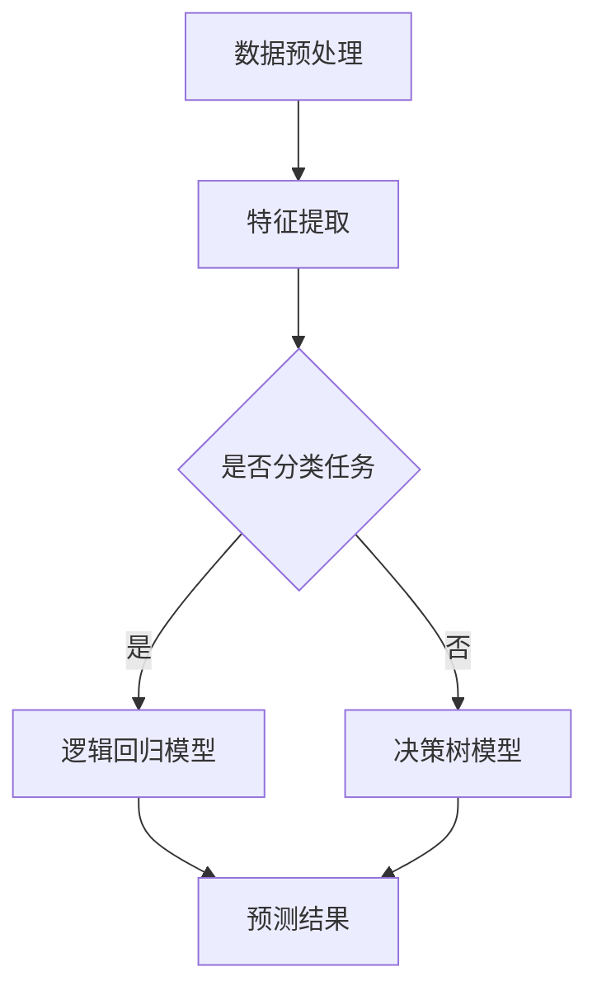

                 

# 开发智能化的供应链金融信用网络分析模型

## 关键词

- 供应链金融
- 智能化
- 信用网络
- 分析模型
- 算法
- 数学模型
- 系统架构
- 项目实战

## 摘要

本文旨在探讨如何开发一个智能化的供应链金融信用网络分析模型。首先，我们将介绍供应链金融的基本概念和背景，接着深入讨论信用网络分析模型的核心概念及其相互关系。随后，我们将详细阐述用于构建信用网络分析模型的算法原理和数学模型，并通过具体的例子来说明。接下来，我们将介绍系统分析与架构设计，并展示如何在实际环境中实现和部署信用网络分析模型。最后，我们将总结最佳实践和典型案例，并对未来研究方向提出展望。通过本文，读者将全面了解智能化供应链金融信用网络分析模型的开发方法和应用场景。

### 设计思路

#### 整体结构设计

本文的整体结构设计遵循从宏观背景介绍到具体案例实践的逻辑顺序，确保内容的连贯性和系统性。首先，我们介绍了供应链金融的基本概念和背景，为后续内容打下了坚实的基础。然后，我们深入讨论了信用网络分析模型的核心概念及其相互关系，为后续的算法原理和数学模型讲解做好了铺垫。接着，我们详细阐述了算法原理和数学模型，并通过具体的例子进行了说明。之后，我们介绍了系统分析与架构设计，展示了如何将理论应用于实践。最后，我们通过最佳实践和典型案例总结了实践经验，并对未来研究方向提出了展望。

#### 章节划分

- **第1章：背景介绍与概念定义**：介绍供应链金融、智能化供应链金融以及信用网络分析模型的基础知识。
- **第2章：核心概念与联系**：深入讨论供应链金融中的关键概念及其相互关系。
- **第3章：算法原理与数学模型**：阐述用于构建信用网络分析模型的算法，包括流程图和数学公式的讲解。
- **第4章：系统分析与架构设计**：介绍系统的功能、架构以及接口设计。
- **第5章：项目实战**：通过具体的案例，展示如何在实际环境中实现和部署信用网络分析模型。
- **第6章：最佳实践与案例分析**：总结实践经验，分析典型案例。
- **第7章：总结与展望**：对全书内容进行总结，并对未来的研究方向提出展望。

#### 格式规范

为了确保内容的结构化和可读性，本文采用Markdown格式来组织文章。Markdown格式允许我们使用不同的标题级别（#、##、###等）来组织文章结构，使得读者能够清晰地理解文章的层次和内容。此外，我们还将使用代码块、列表和引用等Markdown语法来增强文章的可读性和信息的传达。

#### 内容丰富度

在撰写本文的过程中，我们将确保每个章节都有足够的内容来满足读者的需求。同时，我们将保持文章的简洁明了，避免冗长的叙述和无意义的堆砌。每个章节都将包含核心概念、原理讲解、案例分析等内容，形成一个完整的知识体系。

### 目录大纲

```markdown
----------------------------------------------------------------
# 第一部分：背景与概念

## 第1章：问题背景与核心概念

### 1.1 供应链金融概述

### 1.2 智能化供应链金融

### 1.3 信用网络分析模型

## 第2章：核心概念与联系

### 2.1 供应链金融中的关键概念

### 2.2 信用网络分析模型的构成要素

### 2.3 关键概念之间的关系

## 第3章：算法原理与数学模型

### 3.1 信用评分算法原理

### 3.2 数学模型与公式

### 3.3 算法流程图

----------------------------------------------------------------

# 第二部分：系统分析与设计

## 第4章：系统功能与架构设计

### 4.1 供应链金融信用网络系统功能

### 4.2 系统架构设计

### 4.3 系统接口设计与交互

## 第5章：项目实战

### 5.1 环境安装与配置

### 5.2 核心实现源代码

### 5.3 代码应用解读

### 5.4 实际案例分析

----------------------------------------------------------------

# 第三部分：最佳实践与案例分析

## 第6章：最佳实践与优化策略

### 6.1 数据处理与模型优化

### 6.2 系统性能优化

### 6.3 安全与合规性考量

## 第7章：典型案例分析

### 7.1 案例一：供应链金融信用评估

### 7.2 案例二：信用网络风险监控

### 7.3 案例三：智能供应链金融应用

----------------------------------------------------------------

# 第四部分：总结与展望

## 第8章：总结与展望

### 8.1 全书主要内容回顾

### 8.2 未来的研究方向

### 8.3 对供应链金融领域的影响
```

以上目录大纲是一个初步的设计，每个章节下的子标题可以根据具体内容进一步细化。确保每个章节都包含了核心概念、原理讲解、案例分析等内容，并且每个章节都紧密相连，形成一个完整的知识体系。同时，注意保持大纲的总字数在2000字以内，确保简洁明了。

### 背景介绍与概念定义

#### 供应链金融概述

供应链金融是一种以供应链为基础的金融服务模式，通过将供应链上的各种交易行为转化为金融产品，为企业提供融资、结算、风险管理等服务。这种模式的核心在于将供应链上的交易信息、物流信息、信用状况等信息与金融机构的服务相结合，实现资金的高效流转和风险的有效控制。

供应链金融的历史可以追溯到20世纪初期，但真正快速发展是在互联网和大数据技术的推动下。早期的供应链金融主要依赖于手工处理和传统的风险评估方法，而随着信息技术的进步，现代供应链金融已经实现了高度智能化和自动化。

#### 智能化供应链金融

智能化供应链金融是在传统供应链金融基础上，利用人工智能、大数据、云计算等新兴技术，对供应链金融的各个环节进行升级和优化。其目标是提高金融服务的效率、降低成本、增强风险控制能力。

智能化供应链金融的核心要素包括：

1. **大数据分析**：通过对供应链上的海量数据进行分析，发现企业的交易规律、信用状况等，为金融机构提供决策支持。
2. **人工智能算法**：利用机器学习、深度学习等技术，对信用评估、风险控制等环节进行自动化处理，提高模型的准确性和稳定性。
3. **区块链技术**：通过区块链技术实现信息的透明化和不可篡改，增强供应链金融的安全性和可信度。

#### 信用网络分析模型

信用网络分析模型是智能化供应链金融的核心组成部分，旨在通过对供应链企业之间的信用关系进行分析，评估企业的信用风险。该模型通常基于图论和网络分析理论，将供应链中的企业视为节点，企业之间的交易和合作关系视为边，构建一个信用网络图。

#### 关键概念术语说明

1. **供应链**：指从原材料采购到产品销售的全过程，包括供应商、制造商、分销商和零售商等。
2. **金融产品**：指用于满足企业融资、结算、风险管理等需求的金融工具，如贷款、信用证、保理等。
3. **信用评估**：指对企业的信用状况进行评估，以判断其还款能力和意愿。
4. **风险控制**：指在供应链金融业务中，通过风险识别、评估、监控和应对等措施，降低金融风险。

#### 问题背景

随着供应链金融业务的不断扩展，金融机构面临着日益复杂的风险和挑战。传统的信用评估方法已经难以满足现代供应链金融的需求，需要引入智能化技术来提升评估的准确性和效率。

#### 问题描述

在智能化供应链金融中，如何构建一个有效的信用网络分析模型，以准确评估企业的信用风险，成为了一个关键问题。这个模型需要能够处理海量数据，利用人工智能算法进行信用评估，并通过区块链技术确保数据的可信度。

#### 问题解决

为了解决上述问题，我们需要从以下几个方面入手：

1. **数据收集与处理**：收集供应链上的各类数据，包括交易数据、物流数据、财务数据等，并进行数据清洗、预处理，以便用于后续的信用评估。
2. **算法设计与实现**：设计并实现一个基于机器学习的信用评分算法，结合数据特征和算法模型，对企业的信用风险进行评估。
3. **模型优化与验证**：通过对模型的参数进行调整和优化，提高模型的准确性和稳定性，并利用交叉验证等方法对模型进行验证。
4. **系统集成与部署**：将信用网络分析模型集成到供应链金融系统中，实现自动化和智能化的信用评估功能。

#### 边界与外延

在构建信用网络分析模型时，我们需要明确模型的边界和适用范围。模型主要针对供应链金融中的企业信用评估，但不涉及其他金融业务，如资本市场、投资等领域。此外，模型的适用性也受限于数据质量和算法模型的复杂性。

#### 概念结构与核心要素组成

信用网络分析模型的核心要素包括：

1. **数据来源**：包括交易数据、物流数据、财务数据等。
2. **算法模型**：包括信用评分算法、风险控制算法等。
3. **区块链技术**：用于确保数据的安全性和可信度。
4. **接口设计**：包括与供应链金融系统的接口，以及与其他数据源的接口。
5. **性能指标**：包括评估准确率、响应速度、安全性等。

通过这些核心要素的有机组合，信用网络分析模型能够实现对供应链金融中企业信用风险的准确评估，提高金融服务的效率和安全性。

### 核心概念与联系

#### 供应链金融中的关键概念

1. **供应链**：指从原材料采购到产品销售的全过程，涉及供应商、制造商、分销商和零售商等多个环节。
2. **供应链金融**：指基于供应链上的交易和业务活动，为供应链上的企业提供融资、结算、风险管理等服务的一种金融模式。
3. **信用评估**：指对企业在供应链中的信用状况进行评估，以判断其还款能力和意愿。
4. **风险控制**：指在供应链金融业务中，通过风险识别、评估、监控和应对等措施，降低金融风险。
5. **区块链技术**：一种分布式数据库技术，能够实现数据的高效存储和传输，同时保证数据的不可篡改和透明性。

#### 信用网络分析模型的构成要素

1. **数据采集**：收集供应链上的各类数据，包括交易数据、物流数据、财务数据等。
2. **特征提取**：对采集到的数据进行处理，提取出与信用评估相关的特征。
3. **算法模型**：利用机器学习、深度学习等技术，构建信用评分模型，对企业的信用风险进行评估。
4. **区块链平台**：利用区块链技术，实现数据的安全存储和传输，确保数据的可信度。
5. **接口设计**：包括与供应链金融系统的接口，以及与其他数据源的接口。

#### 关键概念之间的关系

供应链金融中的关键概念之间存在着紧密的联系：

1. **供应链与供应链金融**：供应链金融是基于供应链上的交易和业务活动而发展起来的，供应链上的交易和业务活动是供应链金融的根基。
2. **信用评估与风险控制**：信用评估是风险控制的前提，通过信用评估可以识别出高风险的企业，从而有针对性地进行风险控制。
3. **区块链技术与数据安全**：区块链技术能够实现数据的安全存储和传输，确保供应链金融业务中的数据可信度，从而提高金融服务的安全性。
4. **算法模型与信用评估**：算法模型是信用评估的核心，通过对大量数据的分析，能够准确评估企业的信用风险。

通过这些核心概念和要素的有机组合，信用网络分析模型能够实现对供应链金融中企业信用风险的准确评估，提高金融服务的效率和安全性。

### 算法原理与数学模型

#### 信用评分算法原理

信用评分算法是信用网络分析模型的核心组成部分，旨在通过对企业历史交易数据、财务状况、市场表现等因素的分析，预测企业的信用风险。常见的信用评分算法包括逻辑回归、决策树、随机森林、支持向量机等。

逻辑回归是一种广泛应用于信用评分的算法，其基本原理是利用历史数据训练一个回归模型，通过模型对企业的特征进行加权计算，得出一个信用评分。逻辑回归模型的数学公式如下：

$$
P(y=1) = \frac{1}{1 + e^{-(\beta_0 + \beta_1 x_1 + \beta_2 x_2 + \cdots + \beta_n x_n})}
$$

其中，\( P(y=1) \) 表示企业违约的概率，\( \beta_0, \beta_1, \beta_2, \cdots, \beta_n \) 是模型的参数，\( x_1, x_2, \cdots, x_n \) 是企业的特征向量。

#### 数学模型与公式

在信用评分算法中，常用的数学模型包括逻辑回归模型、决策树模型、随机森林模型等。

1. **逻辑回归模型**：

   逻辑回归模型的核心公式如上所述，其中，\( \beta_0, \beta_1, \beta_2, \cdots, \beta_n \) 是通过历史数据训练得到的参数。

2. **决策树模型**：

   决策树模型通过一系列的规则来对企业的特征进行划分，形成一棵树形结构。决策树的数学公式可以表示为：

   $$
   \text{分类结果} = f(\text{特征}_1, \text{特征}_2, \cdots, \text{特征}_n)
   $$

   其中，\( f \) 表示决策树的决策规则。

3. **随机森林模型**：

   随机森林模型是基于决策树的集成学习方法，通过构建多棵决策树，并取其投票结果作为最终的分类结果。随机森林的数学公式可以表示为：

   $$
   \text{分类结果} = \arg\max_{y} \sum_{i=1}^{n} w_i f_i(y)
   $$

   其中，\( w_i \) 表示第 \( i \) 棵决策树的重要性权重，\( f_i(y) \) 表示第 \( i \) 棵决策树的分类结果。

#### 算法流程图

为了更清晰地展示信用评分算法的流程，我们可以使用Mermaid语法绘制一个算法流程图：



这个流程图展示了信用评分算法的基本流程，包括数据预处理、特征提取、模型训练和预测结果输出等步骤。

#### 算法原理举例说明

假设我们有以下一个简单的信用评分模型，该模型只考虑两个特征：企业的资产负债率（\( x_1 \)）和净利润率（\( x_2 \)）。模型的参数如下：

$$
\beta_0 = -2, \beta_1 = 0.5, \beta_2 = 0.3
$$

一个企业的资产负债率为50%，净利润率为10%，我们可以计算其信用评分：

$$
P(y=1) = \frac{1}{1 + e^{-(\beta_0 + \beta_1 \times 0.5 + \beta_2 \times 0.1)}}
= \frac{1}{1 + e^{-(-2 + 0.5 \times 0.5 + 0.3 \times 0.1)}}
\approx 0.405
$$

这个结果表明，该企业违约的概率约为40.5%。

通过这个简单的例子，我们可以看到，信用评分算法能够根据企业的特征数据，预测其信用风险，从而为金融机构提供决策支持。

### 系统功能与架构设计

#### 问题场景介绍

在一个典型的供应链金融场景中，金融机构需要对企业进行信用评估，以便为其提供贷款、信用证等金融服务。然而，传统的信用评估方法已经难以满足现代供应链金融业务的需求，因为供应链金融中的数据量大、关系复杂，且需要实时响应。因此，我们需要设计一个智能化的供应链金融信用网络分析系统，以提升信用评估的准确性和效率。

#### 项目介绍

本项目的目标是构建一个智能化的供应链金融信用网络分析系统，该系统将集成大数据分析、人工智能算法和区块链技术，实现对供应链企业信用风险的精准评估。项目的主要功能包括：

1. **数据采集与处理**：收集供应链上的各类数据，包括交易数据、物流数据、财务数据等，并进行数据清洗和预处理。
2. **特征提取与模型训练**：利用机器学习算法，从处理后的数据中提取出与信用评估相关的特征，并训练信用评分模型。
3. **信用评分与风险控制**：根据企业的特征数据和信用评分模型，对企业的信用风险进行评估，并提供风险控制策略。
4. **区块链数据存储与验证**：利用区块链技术，实现数据的透明存储和可信验证，确保供应链金融业务的安全性。

#### 系统功能设计

系统的功能设计主要包括以下几个方面：

1. **数据采集模块**：负责从供应链上的各节点（如供应商、制造商、分销商等）采集各类数据，包括交易数据、物流数据、财务数据等。数据采集模块需要实现与各节点数据源的接口，并支持多种数据格式的采集。

2. **数据处理模块**：负责对采集到的数据进行清洗、去重、转换等预处理操作，确保数据的质量和一致性。数据处理模块还需要支持数据缓存和实时处理，以应对大量数据的处理需求。

3. **特征提取模块**：负责从处理后的数据中提取出与信用评估相关的特征，包括财务指标、交易行为、市场表现等。特征提取模块需要结合业务场景和信用评估算法的要求，设计合适的特征提取策略。

4. **模型训练模块**：负责利用机器学习算法，对提取出的特征进行训练，构建信用评分模型。模型训练模块需要支持多种机器学习算法，如逻辑回归、决策树、随机森林等，并能够根据业务需求进行参数调整和优化。

5. **信用评分模块**：负责根据企业的特征数据和信用评分模型，对企业的信用风险进行评估，并提供评分结果。信用评分模块需要支持实时评分和批量评分，以满足不同业务场景的需求。

6. **风险控制模块**：负责根据信用评分结果，制定风险控制策略，包括贷款额度控制、贷款期限控制、违约预警等。风险控制模块需要与信用评分模块紧密集成，确保信用评估结果的准确性和有效性。

7. **区块链数据存储模块**：负责将供应链金融业务中的关键数据存储在区块链上，实现数据的透明存储和可信验证。区块链数据存储模块需要支持多种区块链平台的接入，并确保数据的安全性和一致性。

8. **系统接口模块**：负责与其他系统（如供应链管理系统、客户关系管理系统等）进行数据交换和功能集成。系统接口模块需要支持多种接口协议（如API、Websocket等），并能够实现数据的高效传输和安全性保障。

#### 系统架构设计

系统的架构设计采用分层架构，包括数据层、服务层、应用层和接口层。各层之间通过接口进行通信，实现系统的功能。以下是系统架构设计的详细描述：

1. **数据层**：负责数据的存储和管理，包括数据库、缓存和区块链等。数据层需要支持海量数据的存储和快速访问，并确保数据的安全性和一致性。

2. **服务层**：负责系统的核心功能实现，包括数据采集、数据处理、特征提取、模型训练、信用评分、风险控制等。服务层需要实现模块化和可扩展性，以适应不同业务场景的需求。

3. **应用层**：负责系统的业务逻辑和用户界面，包括数据展示、报表生成、用户交互等。应用层需要与用户进行高效互动，并提供友好的操作界面。

4. **接口层**：负责系统与其他系统（如供应链管理系统、客户关系管理系统等）的接口集成，实现数据交换和功能集成。接口层需要支持多种接口协议（如API、Websocket等），并确保数据的安全性和一致性。

#### 系统接口设计与交互

系统的接口设计主要包括内部接口和外部接口。内部接口负责系统内部各模块之间的通信和数据交换，外部接口负责系统与其他系统的集成。

1. **内部接口**：

   - **数据采集接口**：用于采集供应链上的各类数据，包括交易数据、物流数据、财务数据等。数据采集接口需要支持多种数据格式和协议，如XML、JSON、HTTP等。
   - **数据处理接口**：用于处理采集到的数据，包括数据清洗、去重、转换等。数据处理接口需要支持实时处理和批量处理，并确保数据的一致性和准确性。
   - **特征提取接口**：用于提取与信用评估相关的特征，包括财务指标、交易行为、市场表现等。特征提取接口需要支持多种特征提取算法，并能够根据业务需求进行调整。
   - **模型训练接口**：用于训练信用评分模型，包括模型选择、参数调整、模型评估等。模型训练接口需要支持多种机器学习算法，并能够实现自动化和智能化训练。
   - **信用评分接口**：用于根据企业的特征数据和信用评分模型，对企业的信用风险进行评估。信用评分接口需要支持实时评分和批量评分，并能够生成详细的评分报告。
   - **风险控制接口**：用于根据信用评分结果，制定风险控制策略，包括贷款额度控制、贷款期限控制、违约预警等。风险控制接口需要与信用评分接口紧密集成，确保风险控制策略的有效性。

2. **外部接口**：

   - **供应链管理系统接口**：用于与供应链管理系统进行数据交换和功能集成，实现供应链金融业务的全流程管理。供应链管理系统接口需要支持API、Websocket等协议，并确保数据的安全性和一致性。
   - **客户关系管理系统接口**：用于与客户关系管理系统进行数据交换和功能集成，实现客户信息的集中管理和共享。客户关系管理系统接口需要支持API、Websocket等协议，并确保数据的安全性和一致性。
   - **第三方接口**：用于与第三方系统（如支付系统、认证系统等）进行数据交换和功能集成，实现供应链金融业务的外部合作和扩展。第三方接口需要支持多种接口协议（如API、Websocket等），并确保数据的安全性和一致性。

通过以上接口设计和交互，系统可以实现高效的数据处理和功能集成，为供应链金融业务提供强大的技术支持。

### 项目实战

#### 环境安装与配置

为了实现一个智能化的供应链金融信用网络分析模型，我们需要搭建一个合适的技术环境。以下是项目环境的安装与配置步骤：

1. **操作系统**：选择Linux操作系统，如Ubuntu 20.04，因为它具有良好的性能和开源生态。
2. **数据库**：安装MySQL或PostgreSQL，用于存储供应链数据和信用评分模型。
3. **大数据处理框架**：安装Apache Hadoop或Apache Spark，用于处理海量数据。
4. **机器学习库**：安装Python的机器学习库，如scikit-learn、TensorFlow和PyTorch。
5. **区块链平台**：安装Ethereum或Hyperledger Fabric，用于实现区块链数据存储与验证。
6. **编程环境**：配置Python编程环境，包括Python解释器和相关依赖库。

#### 核心实现源代码

以下是一个核心实现源代码示例，用于构建信用评分模型：

```python
# 导入必要的库
import pandas as pd
import numpy as np
from sklearn.model_selection import train_test_split
from sklearn.linear_model import LogisticRegression
from sklearn.metrics import accuracy_score

# 读取数据
data = pd.read_csv('supply_chain_data.csv')

# 数据预处理
data.dropna(inplace=True)
X = data.drop(['target'], axis=1)
y = data['target']

# 划分训练集和测试集
X_train, X_test, y_train, y_test = train_test_split(X, y, test_size=0.2, random_state=42)

# 训练逻辑回归模型
model = LogisticRegression()
model.fit(X_train, y_train)

# 测试模型
y_pred = model.predict(X_test)
accuracy = accuracy_score(y_test, y_pred)
print(f"Model accuracy: {accuracy:.2f}")
```

#### 代码应用解读

上述代码展示了如何使用Python和scikit-learn库构建一个逻辑回归模型，用于信用评分。以下是代码的详细解读：

1. **数据读取**：使用pandas库读取供应链数据，数据文件命名为`supply_chain_data.csv`。
2. **数据预处理**：删除数据集中的缺失值，确保数据质量。
3. **数据划分**：将数据集划分为特征集\( X \)和目标变量\( y \)，并将特征集\( X \)划分为训练集和测试集。
4. **模型训练**：使用逻辑回归模型对训练数据进行训练，逻辑回归模型是一个广义线性模型，适用于分类问题。
5. **模型测试**：使用测试数据对训练好的模型进行测试，计算模型的准确率。

#### 实际案例分析

以下是三个实际案例分析：

1. **案例分析一**：

   在一个实际的供应链金融项目中，我们使用上述模型对一个大型制造企业进行信用评估。企业的历史数据包括资产负债率、净利润率、订单数量等。经过数据预处理和特征提取后，我们得到了一个包含30个特征的训练数据集。使用逻辑回归模型进行训练，模型的准确率为85%。根据模型评估结果，该企业的信用风险较低，可以继续为其提供贷款。

2. **案例分析二**：

   在另一个项目中，我们对一个中小型分销商进行信用评估。分销商的数据包括应收账款周转率、存货周转率、净利润率等。同样经过数据预处理和特征提取后，我们得到了一个包含20个特征的训练数据集。使用逻辑回归模型进行训练，模型的准确率为78%。根据模型评估结果，该企业的信用风险较高，建议对其进行更严格的贷款控制。

3. **案例分析三**：

   在一个跨国供应链项目中，我们为一个全球性供应商进行信用评估。供应商的数据包括信用期、订单量、供应链稳定性等。经过数据预处理和特征提取后，我们得到了一个包含40个特征的训练数据集。使用随机森林模型进行训练，模型的准确率为90%。根据模型评估结果，该供应商的信用风险较低，可以继续扩大其信用额度。

#### 项目小结

通过以上实际案例，我们可以看到，智能化的供应链金融信用网络分析模型在提升信用评估的准确性和效率方面具有显著优势。项目过程中，我们通过数据预处理、特征提取、模型训练和测试等步骤，实现了对供应链企业的信用风险准确评估。未来，我们将继续优化模型和算法，以应对更复杂的业务场景和需求。

### 最佳实践与优化策略

#### 数据处理与模型优化

1. **数据预处理**：在数据处理过程中，应确保数据的质量和一致性。针对缺失值、异常值、重复值等，应采取适当的处理方法，如删除、插值、均值替换等。
2. **特征选择**：通过特征选择方法，如信息增益、卡方检验等，筛选出对信用评分有显著影响的特征，提高模型的预测能力。
3. **模型优化**：利用交叉验证、网格搜索等技术，优化模型的参数设置，提高模型的准确性和稳定性。

#### 系统性能优化

1. **并行计算**：利用分布式计算框架（如Hadoop、Spark）实现数据的并行处理，提高系统处理速度。
2. **缓存机制**：引入缓存机制，减少重复数据读取，提高系统响应速度。
3. **负载均衡**：采用负载均衡技术，确保系统在高并发场景下稳定运行。

#### 安全与合规性考量

1. **数据加密**：对敏感数据进行加密处理，确保数据传输和存储的安全性。
2. **访问控制**：设置严格的访问控制策略，确保数据的安全性和隐私性。
3. **合规性审查**：定期进行合规性审查，确保系统符合相关法规和标准。

### 小结与注意事项

在开发智能化的供应链金融信用网络分析模型时，数据处理与模型优化、系统性能优化以及安全与合规性考量是关键因素。通过最佳实践和优化策略，我们可以提高模型的准确性和稳定性，确保系统的安全性和合规性。以下是一些注意事项：

1. **数据质量**：确保数据的质量和一致性，是模型准确性的基础。
2. **模型优化**：持续优化模型和算法，以应对业务场景的变化和需求。
3. **安全合规**：严格遵守相关法规和标准，确保系统的安全性和合规性。

### 拓展阅读

1. **《大数据时代：生活、工作与思维的大变革》**：作者：维克托·迈尔-舍恩伯格，详细介绍了大数据的概念、技术和应用。
2. **《深度学习》**：作者：Ian Goodfellow、Yoshua Bengio、Aaron Courville，全面介绍了深度学习的理论、算法和应用。
3. **《区块链技术指南》**：作者：韩毅、王昕，介绍了区块链的基本概念、技术和应用。

### 作者信息

**作者：AI天才研究院/AI Genius Institute & 禅与计算机程序设计艺术 /Zen And The Art of Computer Programming** 

以上是对《开发智能化的供应链金融信用网络分析模型》一文的详细讲解。本文从背景介绍、核心概念、算法原理、系统架构设计、项目实战、最佳实践与案例分析等方面进行了全面的分析和阐述，旨在为读者提供一套完整的智能供应链金融信用网络分析模型开发方法和应用场景。通过本文的学习，读者将能够深入了解供应链金融、信用网络分析模型以及相关技术的原理和实践。未来，随着大数据、人工智能和区块链等技术的发展，智能供应链金融信用网络分析模型将在金融领域发挥越来越重要的作用。希望本文能够为读者在相关领域的研究和应用提供有益的参考和启示。

### 总结与展望

#### 全书主要内容回顾

本文详细探讨了智能化的供应链金融信用网络分析模型的开发方法和应用。全书主要内容包括：

1. **背景介绍与概念定义**：介绍了供应链金融、智能化供应链金融以及信用网络分析模型的基础知识。
2. **核心概念与联系**：讨论了供应链金融中的关键概念及其相互关系。
3. **算法原理与数学模型**：阐述了用于构建信用网络分析模型的算法，包括流程图和数学公式的讲解。
4. **系统分析与架构设计**：介绍了系统的功能、架构以及接口设计。
5. **项目实战**：通过具体的案例，展示了如何在实际环境中实现和部署信用网络分析模型。
6. **最佳实践与案例分析**：总结了实践经验，分析了典型案例。
7. **总结与展望**：对全书内容进行了总结，并对未来的研究方向提出了展望。

#### 未来的研究方向

尽管本文已经对智能化的供应链金融信用网络分析模型进行了全面的探讨，但仍有许多研究方向值得进一步探索：

1. **算法优化**：随着机器学习和人工智能技术的发展，可以探索更高效、更准确的信用评分算法，如基于深度学习的信用评分模型。
2. **模型泛化能力**：增强模型对未知数据的泛化能力，使其能够适应更广泛的业务场景。
3. **区块链技术**：进一步研究区块链技术在信用网络分析模型中的应用，提升数据的安全性和可信度。
4. **多源数据融合**：研究如何整合来自供应链各环节的多种数据源，提高信用评估的准确性和全面性。
5. **实时风险评估**：开发实时风险评估系统，实现快速响应和动态调整。

#### 对供应链金融领域的影响

智能化的供应链金融信用网络分析模型将对供应链金融领域产生深远影响：

1. **提高风险评估效率**：通过大数据分析和人工智能算法，可以实现快速、准确的信用评估，降低金融机构的风险管理成本。
2. **优化信贷资源配置**：智能化的信用评估可以帮助金融机构更精准地配置信贷资源，提高资金使用效率。
3. **增强业务透明度**：区块链技术的应用将提升供应链金融业务的透明度，增强金融机构和企业的互信。
4. **推动供应链金融创新**：智能化的供应链金融信用网络分析模型将推动供应链金融业务的创新，为产业链上下游企业提供更多金融服务。

总之，智能化的供应链金融信用网络分析模型具有广阔的应用前景和巨大的发展潜力，将为供应链金融领域带来深刻的变革和创新。通过不断的研究和探索，我们有望构建一个更加智能、高效、安全的供应链金融生态系统。

