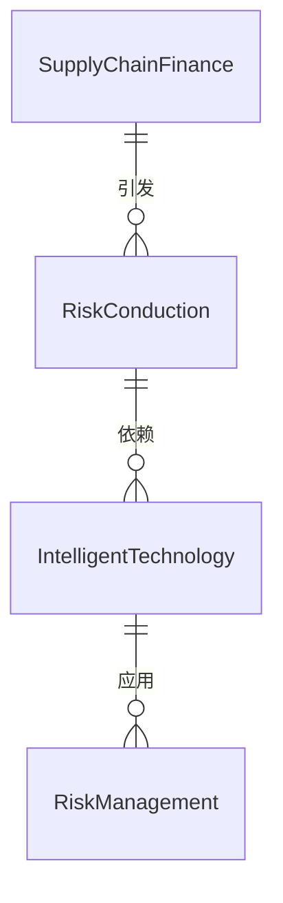
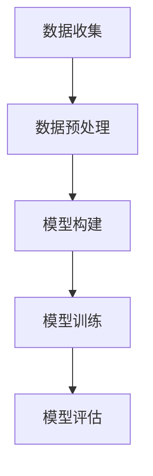
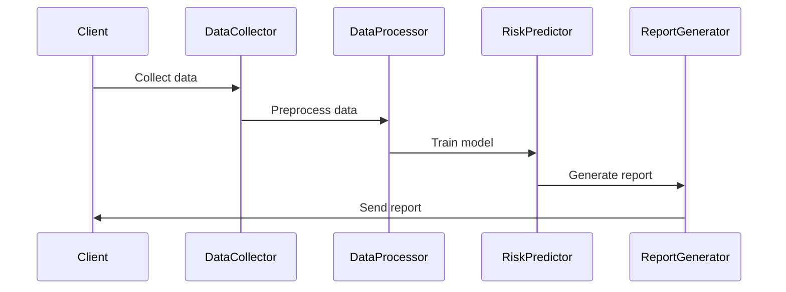

                 

## 深入剖析智能化供应链金融风险传导模型

### 引言

供应链金融作为一种金融服务创新模式，正在全球范围内迅速发展。随着互联网技术的普及和大数据分析能力的提升，智能化供应链金融风险传导模型的研究显得尤为重要。本文旨在探讨如何开发智能化供应链金融风险传导模型，以提高风险识别和管理的能力。

### 核心概念与联系

首先，我们需要明确几个核心概念：

1. **供应链金融**：是一种将供应链上下游的企业联系在一起，通过融资、结算、风险管理等手段，提高供应链整体运作效率的金融服务。

2. **风险传导**：在供应链中，某一节点的风险可能会通过供应链的各个环节传导，进而影响整个供应链的稳定性和可持续性。

3. **智能化技术**：包括机器学习、人工智能、大数据分析等，这些技术在处理大量数据、识别复杂模式方面具有显著优势。

接下来，我们通过实体关系图（ER图）来展示这些概念之间的关系：

### 算法原理讲解

为了构建智能化供应链金融风险传导模型，我们采用机器学习中的**神经网络**来处理数据，并通过以下步骤来构建模型：

1. **数据收集**：收集供应链企业的历史交易数据、财务报表、市场趋势等。

2. **数据预处理**：清洗数据，进行归一化处理，为神经网络训练做好准备。

3. **模型构建**：设计神经网络架构，包括输入层、隐藏层和输出层。

4. **模型训练**：使用训练数据集对模型进行训练，不断调整参数，优化模型性能。

5. **模型评估**：使用测试数据集评估模型性能，确保其能够准确预测风险传导。

下面是一个简化的神经网络模型流程图：

### 数学模型与公式

在构建模型时，我们使用以下数学模型来描述风险传导过程：

$$
R_t = \alpha \cdot X_t + \beta \cdot (P_t - L_t)
$$

其中，$R_t$ 表示在时间 $t$ 时的风险水平，$X_t$ 表示影响风险的因素，$P_t$ 表示市场价格，$L_t$ 表示贷款水平。$\alpha$ 和 $\beta$ 是模型的参数，通过训练数据来优化。

### 系统分析与架构设计

在系统层面，我们采用以下架构来设计和实现智能化供应链金融风险传导模型：

1. **系统功能设计**：包括数据采集、数据处理、风险预测、报告生成等功能。

2. **系统架构设计**：采用微服务架构，确保系统的可扩展性和高可用性。

3. **系统接口设计**：设计API接口，方便与其他系统的集成。

4. **系统交互**：使用消息队列等技术来实现系统之间的交互。

下面是一个简化的系统架构图：

### 项目实战

在本节中，我们将详细介绍如何搭建一个简单的智能化供应链金融风险传导模型：

1. **环境安装**：安装Python环境，以及TensorFlow等机器学习库。

2. **系统核心实现**：编写数据采集和处理脚本，构建神经网络模型，进行模型训练和评估。

3. **代码应用解读**：分析代码中的关键部分，理解模型的运作原理。

4. **实际案例分析**：通过实际案例来展示模型的效果。

5. **项目小结**：总结项目的经验和教训，提出改进建议。

### 最佳实践与总结

1. **最佳实践**：在开发和部署智能化供应链金融风险传导模型时，需要注意以下几点：
   - 数据质量和清洗的重要性。
   - 模型选择的合理性。
   - 持续监控和迭代模型。

2. **小结**：本文探讨了如何开发智能化供应链金融风险传导模型，从核心概念、算法原理到系统设计，再到项目实战，为读者提供了一个全面的视角。

3. **注意事项**：在实施过程中，需要关注法律法规、数据隐私和信息安全等方面的问题。

4. **拓展阅读**：推荐进一步学习相关主题的文献和资料。

### 作者信息

作者：AI天才研究院/AI Genius Institute & 禅与计算机程序设计艺术 /Zen And The Art of Computer Programming

通过以上内容，我们系统地介绍了智能化供应链金融风险传导模型的开发过程，希望能够对读者有所启发。接下来，我们将逐步深入到每个部分的具体内容中，进行详细的讲解。让我们开始吧！

