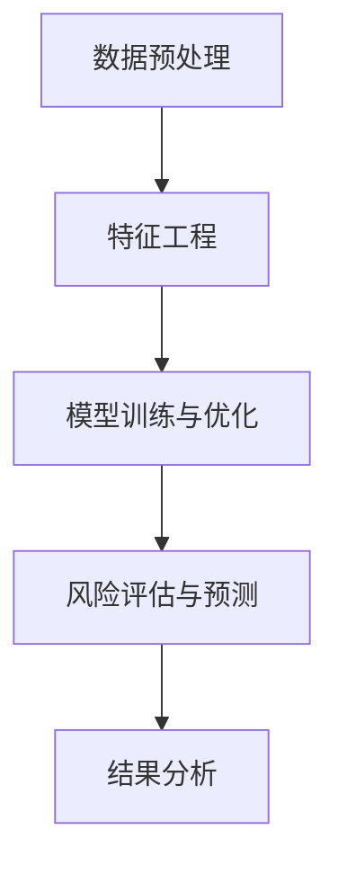
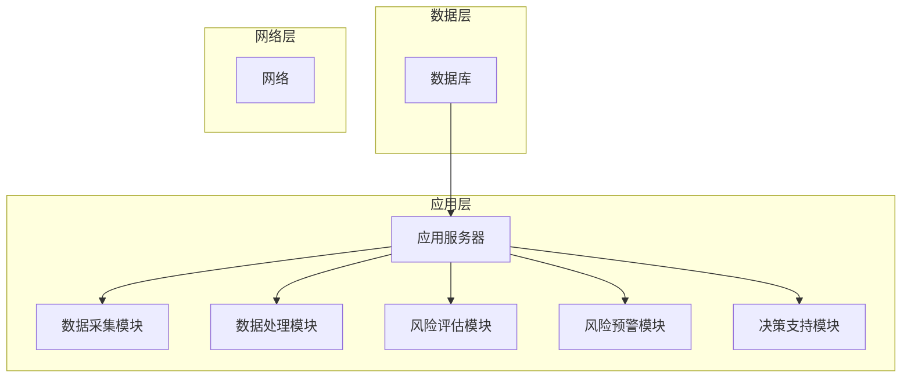
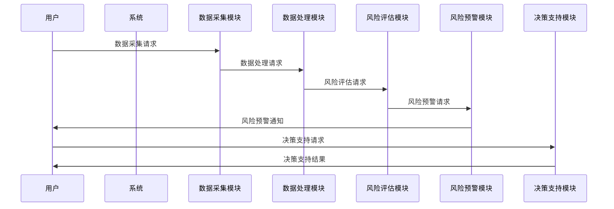

                 

## 引言

### 文章背景与核心主题

随着金融行业的快速发展，金融产品种类和复杂性不断增加，金融产品的生命周期风险管理变得尤为重要。在过去的几年里，传统的金融风险管理方法已经难以满足现代金融市场的需求。面对瞬息万变的金融市场和复杂的风险环境，如何实现高效、精确的金融产品生命周期风险动态评估，成为金融行业面临的一个重要课题。

本篇文章的核心主题是“开发智能化的金融产品生命周期风险动态评估平台”，旨在探讨如何利用智能化技术，特别是人工智能和大数据分析，构建一个高效、动态的金融产品生命周期风险评估系统。通过该平台，金融机构可以实时监控和管理金融产品的风险，从而提高风险管理的效率和准确性。

本文将分为五个主要部分：

1. **背景介绍**：阐述金融产品风险管理的现状与挑战，引入生命周期风险管理及智能化技术在其中的应用潜力。
2. **核心概念与联系**：详细介绍金融产品生命周期、风险动态评估及其相关核心概念和联系，通过概念对比和ER实体关系图加深理解。
3. **算法原理讲解**：深入讲解智能评估算法的原理，包括特征工程、模型训练与优化、风险评估与预测等环节，并通过Python源代码进行详细说明。
4. **数学模型和公式**：介绍生命周期风险动态评估的数学模型和公式，详细阐述风险评估指标模型、风险预测模型和动态评估模型。
5. **系统分析与架构设计**：通过实际案例介绍系统分析与架构设计，包括系统功能设计、系统架构设计、系统接口设计和系统交互序列图。

通过以上五个部分的分析与讲解，本文旨在为金融行业提供一套系统化、智能化的金融产品生命周期风险动态评估解决方案，帮助金融机构更好地应对复杂多变的市场环境。

## 第一部分：背景介绍

### 第1章：问题背景与核心概念

#### 1.1 问题背景

在当今金融市场，金融产品的多样化和复杂化带来了巨大的挑战。金融机构面对的风险类型多种多样，包括市场风险、信用风险、流动性风险等。这些风险不仅影响金融机构的盈利能力，还可能威胁到其生存。随着金融市场的全球化，金融机构需要处理的风险因素更加复杂，这使得传统的风险管理方法在应对瞬息万变的金融市场时显得力不从心。

首先，金融产品风险管理的现状存在以下几大挑战：

- **数据获取和处理困难**：金融市场数据量大、类型复杂，传统方法在数据收集和处理上存在瓶颈，难以满足实时风险监控的需求。
- **风险评估精度不足**：传统的风险评估方法往往基于历史数据和统计模型，难以捕捉到市场的新变化和潜在风险。
- **风险预测时效性差**：传统风险评估方法在风险预测上存在时效性问题，往往无法及时响应市场变化，导致风险预警机制滞后。

其次，生命周期风险管理的必要性和重要性不可忽视。金融产品从设计、开发、销售到退市的整个生命周期中，各个阶段的风险特征和影响因素各不相同。生命周期风险管理能够系统地分析每个阶段的风险，从而制定有针对性的风险管理策略，提高整体风险管理效率。例如，在产品设计阶段，可以通过市场调研和风险评估，确保产品能够满足市场需求并降低开发风险；在销售阶段，可以监控市场反馈，及时调整销售策略以应对风险。

最后，智能化技术在金融风险管理中的应用潜力巨大。人工智能和大数据分析技术可以显著提升风险管理的效率。通过机器学习算法，可以自动分析大量历史数据和市场信息，发现潜在的风险模式；通过大数据技术，可以实现实时数据采集和风险监控，快速响应市场变化。此外，智能化技术还可以优化风险评估模型，提高预测精度，从而更好地指导风险管理决策。

综上所述，开发智能化的金融产品生命周期风险动态评估平台，不仅有助于解决当前金融风险管理中的诸多挑战，还能够提升金融机构的风险管理水平和市场竞争力。本章节将详细探讨金融产品生命周期、风险动态评估以及智能化技术在其中的应用，为后续章节的内容奠定基础。

#### 1.2 核心概念

在构建智能化的金融产品生命周期风险动态评估平台之前，需要理解一系列核心概念，这些概念构成了平台的理论基础和实施框架。以下是几个关键的核心概念及其简要说明：

1. **金融产品生命周期**：
   金融产品的生命周期是指从产品概念形成、设计、开发、销售、运营到最终退市的全过程。这一生命周期通常可以分为以下几个阶段：
   - **概念阶段**：产品设计理念和目标确定。
   - **开发阶段**：产品设计和开发，包括市场调研、需求分析、原型设计、测试等。
   - **销售阶段**：产品正式推向市场，包括销售策略制定、渠道选择、市场推广等。
   - **运营阶段**：产品在市场上的运营管理，包括用户反馈收集、产品优化、风险监控等。
   - **退市阶段**：产品不再继续销售，可能是因为市场饱和、产品老化或战略调整。

2. **风险动态评估**：
   风险动态评估是指在金融产品生命周期的各个阶段，通过实时数据采集和分析，动态地评估产品面临的各类风险，并做出相应的调整和应对措施。这一过程需要结合历史数据和实时数据，采用先进的分析方法和算法模型，实现对风险的实时监控和预测。风险动态评估的关键在于快速响应市场变化，确保风险管理措施能够及时有效地实施。

3. **生命周期风险管理**：
   生命周期风险管理是一种系统化的风险管理方法，贯穿于金融产品的整个生命周期。其核心目标是识别和评估各个阶段的风险，并采取相应的管理策略来降低风险水平。生命周期风险管理包括以下步骤：
   - **风险识别**：在产品生命周期的各个阶段识别可能存在的风险。
   - **风险评估**：对识别出的风险进行量化评估，确定其严重程度和发生概率。
   - **风险应对**：制定和实施风险管理策略，包括风险规避、风险转移、风险减轻等。
   - **风险监控**：持续监控风险状况，及时调整风险管理策略，以应对市场变化。

4. **智能化技术**：
   智能化技术，如人工智能（AI）、大数据分析、机器学习等，是金融产品生命周期风险动态评估平台的核心组成部分。这些技术能够自动化数据分析和风险评估过程，提高效率和准确性。具体应用包括：
   - **特征工程**：自动提取和分析数据中的关键特征，为风险评估提供基础。
   - **模型训练与优化**：使用机器学习算法训练风险评估模型，并通过不断优化提高模型性能。
   - **实时风险监控**：利用实时数据分析技术，实现对产品风险状况的实时监控和预警。

通过理解上述核心概念，可以为后续章节中的具体分析和实现提供理论依据，确保构建的智能化金融产品生命周期风险动态评估平台能够满足实际需求。

#### 1.3 边界与外延

在构建智能化的金融产品生命周期风险动态评估平台时，明确边界与外延是至关重要的。这不仅有助于确定平台的功能范围，还能够指导系统的设计和发展方向。

首先，我们需要明确金融产品生命周期各阶段的风险特征。以下是各阶段的风险特征分析：

- **概念阶段**：
  - **风险类型**：市场需求不确定、产品定位模糊、投资预算不足。
  - **风险分析**：需要进行详细的市场调研和需求分析，评估产品的市场潜力和投资回报。

- **开发阶段**：
  - **风险类型**：技术实现风险、项目进度延误、预算超支。
  - **风险分析**：通过敏捷开发方法，及时调整项目计划，确保技术实现可行性和项目进度控制。

- **销售阶段**：
  - **风险类型**：市场竞争激烈、销售策略不当、渠道管理问题。
  - **风险分析**：通过市场分析和客户反馈，优化销售策略和渠道布局，提高市场占有率和客户满意度。

- **运营阶段**：
  - **风险类型**：用户行为异常、产品功能缺陷、系统稳定性问题。
  - **风险分析**：通过用户行为分析和系统监控，及时发现并解决产品缺陷和系统故障，确保产品稳定运营。

- **退市阶段**：
  - **风险类型**：市场退出策略不当、资源浪费、品牌影响。
  - **风险分析**：制定合理的退市策略，确保资源有效利用，减少市场退出带来的负面影响。

其次，我们探讨动态评估模型的边界与外延。动态评估模型需要具备以下几个特点：

- **实时性**：能够实时采集和分析金融产品的风险数据，及时反映市场变化。
- **灵活性**：能够根据不同阶段的风险特征，灵活调整评估模型和策略。
- **准确性**：通过先进的算法和数据分析技术，提高风险评估的准确性。
- **可扩展性**：支持不同金融产品类型和复杂度的风险评估，易于扩展和升级。

通过明确边界与外延，可以确保金融产品生命周期风险动态评估平台能够有效应对各阶段的风险，提供全面的动态评估和风险管理服务。这不仅有助于提升金融机构的风险管理能力，还能够为金融市场的稳定运行提供有力支持。

#### 1.4 概念结构与核心要素组成

在构建智能化的金融产品生命周期风险动态评估平台时，理解平台的概念结构和核心要素组成至关重要。以下是对金融产品生命周期主要阶段与风险点的分析，以及动态评估的关键因素和指标体系。

首先，金融产品生命周期主要阶段及其风险点如下：

- **概念阶段**：
  - **风险点**：市场需求分析不准确、产品定位模糊、投资预算不足。
  - **关键因素**：市场需求分析、市场定位、投资预算。

- **开发阶段**：
  - **风险点**：技术实现风险、项目进度延误、预算超支。
  - **关键因素**：技术实现能力、项目管理、预算控制。

- **销售阶段**：
  - **风险点**：市场竞争激烈、销售策略不当、渠道管理问题。
  - **关键因素**：市场分析、销售策略、渠道管理。

- **运营阶段**：
  - **风险点**：用户行为异常、产品功能缺陷、系统稳定性问题。
  - **关键因素**：用户行为分析、产品优化、系统监控。

- **退市阶段**：
  - **风险点**：市场退出策略不当、资源浪费、品牌影响。
  - **关键因素**：市场退出策略、资源管理、品牌保护。

接下来，动态评估的关键因素和指标体系包括：

1. **风险指标**：
   - **市场需求指标**：市场需求增长率、市场份额、客户满意度。
   - **开发指标**：项目进度完成率、预算执行率、缺陷率。
   - **销售指标**：销售额、市场份额、客户留存率。
   - **运营指标**：用户活跃度、缺陷率、系统稳定性指标。
   - **退市指标**：市场份额下降率、品牌影响程度、资源利用率。

2. **评估模型**：
   - **风险评估模型**：包括定量和定性评估方法，如层次分析法（AHP）、决策树、神经网络等。
   - **风险预测模型**：利用历史数据和实时数据，预测未来一段时间内可能出现的风险事件。

3. **评估方法**：
   - **实时监控**：通过实时数据采集和分析，及时发现潜在风险。
   - **风险评估**：根据风险指标和评估模型，对当前阶段的风险进行量化评估。
   - **风险预警**：通过设定预警阈值，及时发现并预警高风险事件。

4. **优化策略**：
   - **调整策略**：根据风险评估结果，及时调整产品策略和管理措施。
   - **资源分配**：优化资源配置，确保关键因素得到充分支持。

通过上述概念结构与核心要素的分析，可以构建一个系统化、智能化的金融产品生命周期风险动态评估平台。这不仅有助于金融机构实时监控和管理金融产品的风险，还能够提高风险管理的效率和质量。

### 第二部分：核心概念与联系

#### 第2章：生命周期风险管理的原理

在构建智能化的金融产品生命周期风险动态评估平台之前，理解生命周期风险管理的原理至关重要。这一章节将详细阐述金融产品生命周期管理原理、动态评估模型构建原理，并对比各生命周期阶段的风险特征，通过ER实体关系图架构加深对这些核心概念的理解。

#### 2.1 金融产品生命周期管理原理

金融产品生命周期管理是指从产品概念形成到退市的全过程管理，这一过程通常包括以下几个阶段：

1. **概念阶段**：
   在这个阶段，产品的设计理念和目标被确定。市场调研、需求分析和初步的可行性研究是这个阶段的主要任务。风险主要体现在市场需求不确定、产品定位模糊和投资预算不足等方面。

2. **开发阶段**：
   这阶段包括产品的设计、开发、测试和发布。项目进度、技术实现、预算控制和质量保证是关键风险点。敏捷开发方法被广泛应用于此阶段，以快速响应市场变化，确保技术实现可行性和项目进度控制。

3. **销售阶段**：
   在这个阶段，产品开始推向市场。市场竞争、销售策略、渠道管理和客户反馈是主要风险。通过市场分析和客户反馈，可以及时调整销售策略，提高市场占有率和客户满意度。

4. **运营阶段**：
   产品在市场上的运营管理是这个阶段的核心。用户行为、产品功能、系统稳定性和运营成本是主要风险。通过用户行为分析和系统监控，可以及时发现并解决产品缺陷和系统故障，确保产品稳定运营。

5. **退市阶段**：
   当产品不再具有市场竞争力或企业战略调整时，进入退市阶段。市场退出策略、资源利用和品牌影响是主要风险。合理的退市策略可以减少市场退出带来的负面影响，确保资源得到有效利用。

#### 2.2 动态评估模型构建原理

动态评估模型是指在金融产品生命周期的各个阶段，通过实时数据采集和分析，动态地评估产品面临的各类风险，并做出相应的调整和应对措施。以下是动态评估模型构建的几个关键步骤：

1. **数据收集与处理**：
   收集与金融产品生命周期相关的各类数据，包括市场数据、用户行为数据、财务数据和运营数据。通过数据清洗、去重和标准化处理，确保数据的准确性和一致性。

2. **风险指标选择与权重分配**：
   根据不同阶段的风险特征，选择合适的风险指标。这些指标可以是定量的，如市场份额、用户活跃度、缺陷率；也可以是定性的，如市场前景、客户满意度、技术实现难度。通过专家打分法或层次分析法（AHP）确定各指标的权重。

3. **模型构建方法**：
   采用适当的机器学习算法和统计模型，构建动态评估模型。常见的算法包括决策树、支持向量机（SVM）、神经网络等。通过模型训练和验证，确保模型具有良好的预测性能和稳定性。

4. **风险评估与预测**：
   利用构建好的动态评估模型，对金融产品的风险进行评估和预测。通过设定预警阈值，及时发现高风险事件，并制定相应的风险管理策略。

#### 2.3 核心概念属性特征对比表格

为了更好地理解金融产品生命周期各阶段的风险特征，下面提供了一个核心概念属性特征对比表格：

| 阶段   | 风险类型             | 主要特征                                   | 风险指标               |
| ------ | ------------------ | ---------------------------------------- | -------------------- |
| 概念阶段 | 市场需求不确定、产品定位模糊、投资预算不足 | 初步市场调研、产品定位、预算规划 | 市场需求增长率、客户满意度 |
| 开发阶段 | 技术实现风险、项目进度延误、预算超支      | 技术实现、项目管理、预算控制       | 项目进度完成率、缺陷率      |
| 销售阶段 | 市场竞争激烈、销售策略不当、渠道管理问题  | 市场分析、销售策略、渠道管理     | 销售额、市场份额、客户留存率 |
| 运营阶段 | 用户行为异常、产品功能缺陷、系统稳定性问题 | 用户行为分析、产品优化、系统监控 | 用户活跃度、缺陷率、系统稳定性指标 |
| 退市阶段 | 市场退出策略不当、资源浪费、品牌影响      | 市场退出策略、资源管理、品牌保护 | 市场份额下降率、品牌影响程度、资源利用率 |

#### 2.4 ER实体关系图架构

为了更好地理解和展示金融产品生命周期风险管理相关的实体及其关系，下面提供了一个ER实体关系图：

```mermaid
erDiagram
  Product ||--|{ Stage }||>
  Stage ||--|{ Risk }||>
  Product ||--|{ Indicator }||>
  Indicator ||--|{ Metric }||>
  Stage ||--|{ Metric }||>
```

在这个ER图架构中，产品（Product）是核心实体，它与阶段（Stage）和指标（Indicator）之间存在关系。每个阶段（Stage）包含多个风险（Risk），而每个指标（Indicator）对应多个度量（Metric）。这种关系有助于在系统设计和实现过程中，明确数据模型和业务逻辑，从而构建一个高效、灵活的金融产品生命周期风险动态评估平台。

通过以上对生命周期风险管理原理的详细阐述和实体关系图的展示，可以更好地理解金融产品生命周期各阶段的风险特征及其相互关系，为后续的算法讲解和系统架构设计提供坚实基础。

### 第三部分：算法原理讲解

#### 第3章：智能评估算法

智能评估算法在构建金融产品生命周期风险动态评估平台中起着关键作用。本章将详细讲解智能评估算法的原理，包括算法流程、特征工程、模型训练与优化、风险评估与预测等环节，并通过具体的Python源代码进行举例说明。

#### 3.1 算法原理与流程

智能评估算法的核心目的是利用人工智能和大数据分析技术，对金融产品的生命周期风险进行实时监控和预测。以下是算法的基本流程：

1. **特征工程**：对收集到的数据进行分析和预处理，提取与风险相关的关键特征。
2. **模型训练与优化**：选择合适的机器学习算法，对特征数据进行训练，并不断优化模型性能。
3. **风险评估与预测**：利用训练好的模型，对当前阶段的风险进行评估和预测，并设定预警阈值。

以下是智能评估算法的流程图：



#### 3.2 算法原理详细讲解

**3.2.1 特征工程**

特征工程是智能评估算法的第一步，其目的是从原始数据中提取出有用的信息，为后续的模型训练提供高质量的数据。以下是特征工程的主要步骤：

1. **数据预处理**：
   - **缺失值处理**：使用均值、中位数或插值法填充缺失值。
   - **异常值处理**：通过箱线图、Z-score等方法检测并处理异常值。
   - **数据标准化**：使用Min-Max标准化或Z-score标准化，将数据缩放至同一量级。

2. **特征提取与选择**：
   - **相关性分析**：通过计算特征之间的相关性，识别出重要的特征。
   - **主成分分析（PCA）**：通过降维技术，减少特征数量，同时保留数据的主要信息。

**3.2.2 模型训练与优化**

在特征工程完成后，选择合适的机器学习算法进行模型训练与优化。以下是模型训练与优化的主要步骤：

1. **算法选择**：
   - **监督学习算法**：如决策树、随机森林、支持向量机（SVM）、神经网络等。
   - **无监督学习算法**：如聚类算法、关联规则挖掘等。

2. **模型训练**：
   - **数据分割**：将数据集划分为训练集和测试集，用于模型训练和性能评估。
   - **模型训练**：使用训练集数据，通过算法计算得到模型的参数。

3. **模型优化**：
   - **交叉验证**：通过交叉验证方法，评估模型的性能，并调整模型参数。
   - **网格搜索**：通过遍历多个参数组合，找到最优参数设置。
   - **贝叶斯优化**：使用贝叶斯优化算法，自动搜索最优参数设置。

**3.2.3 风险评估与预测**

在模型训练和优化完成后，利用训练好的模型对当前阶段的风险进行评估和预测。以下是风险评估与预测的主要步骤：

1. **风险指标计算**：
   - **VaR（价值风险）**：计算在特定置信水平下，产品价值可能的最大损失。
   - **CVaR（条件价值风险）**：计算在特定置信水平下，产品价值的损失期望。
   - **ES（预期损失）**：计算在特定置信水平下，产品价值的平均损失。

2. **动态评估结果分析**：
   - **风险预测**：使用模型预测未来一段时间内的风险水平。
   - **风险预警机制**：设定预警阈值，当风险水平超过阈值时，触发预警并采取相应的管理措施。

#### 3.3 算法举例说明

以下是一个使用Python实现的智能评估算法示例。该示例使用了线性回归模型，用于预测金融产品的风险。

```python
import pandas as pd
from sklearn.model_selection import train_test_split
from sklearn.linear_model import LinearRegression
from sklearn.metrics import mean_squared_error

# 加载数据
data = pd.read_csv('financial_product_data.csv')
X = data[['market_share', 'customer_satisfaction', 'budget']]
y = data['risk']

# 数据预处理
X.fillna(X.mean(), inplace=True)
X = (X - X.min()) / (X.max() - X.min())

# 数据分割
X_train, X_test, y_train, y_test = train_test_split(X, y, test_size=0.2, random_state=42)

# 模型训练
model = LinearRegression()
model.fit(X_train, y_train)

# 模型评估
y_pred = model.predict(X_test)
mse = mean_squared_error(y_test, y_pred)
print(f'MSE: {mse}')

# 风险预测
new_data = pd.DataFrame([[0.8, 0.9, 0.75]], columns=['market_share', 'customer_satisfaction', 'budget'])
new_data.fillna(new_data.mean(), inplace=True)
new_data = (new_data - new_data.min()) / (new_data.max() - new_data.min())
risk_prediction = model.predict(new_data)
print(f'Risk Prediction: {risk_prediction}')
```

在这个示例中，我们使用线性回归模型对金融产品的风险进行预测。首先，加载和处理数据，然后分割为训练集和测试集。使用训练集数据训练模型，并通过测试集评估模型性能。最后，使用训练好的模型对新的数据进行风险预测。

通过以上详细的算法原理讲解和Python源代码示例，读者可以更好地理解智能评估算法的构建和应用方法。在接下来的章节中，我们将进一步介绍生命周期风险动态评估的数学模型和系统分析与架构设计。

### 第四部分：数学模型和公式

#### 第4章：生命周期风险动态评估数学模型

在构建智能化的金融产品生命周期风险动态评估平台时，数学模型和公式是核心组成部分。本章将详细介绍生命周期风险动态评估的数学模型，包括风险评估指标模型、风险预测模型和动态评估模型，并通过具体的公式进行阐述。

#### 4.1 数学模型概述

生命周期风险动态评估涉及多个数学模型，每个模型在风险管理过程中扮演不同角色。以下是三种主要模型的概述：

1. **风险评估指标模型**：用于量化评估金融产品在不同生命周期阶段的风险。
2. **风险预测模型**：基于历史数据和实时数据，预测未来一段时间内的风险水平。
3. **动态评估模型**：将风险评估指标和预测模型结合起来，实现实时动态的风险评估。

#### 4.2 风险评估指标模型

风险评估指标模型用于量化评估金融产品在生命周期各个阶段的风险。以下是一个通用风险评估指标模型的数学公式：

$$
R(t) = f(X_t, \theta)
$$

其中：
- \( R(t) \) 表示在时间 \( t \) 的风险评估结果。
- \( X_t \) 表示在时间 \( t \) 的风险相关特征向量。
- \( \theta \) 表示模型参数。

常见的风险评估指标包括：

- **VaR（价值风险）**：在特定置信水平下，产品价值可能的最大损失。
  $$
  VaR = F^{-1}(1 - \alpha) \cdot \sigma
  $$
  其中：
  - \( F^{-1} \) 是累积分布函数的逆函数。
  - \( \alpha \) 是置信水平。
  - \( \sigma \) 是风险因子的标准差。

- **CVaR（条件价值风险）**：在特定置信水平下，产品价值的损失期望。
  $$
  CVaR = \frac{1}{n} \sum_{i=1}^{n} [X_i - F^{-1}(\alpha) \cdot \sigma]
  $$
  其中：
  - \( n \) 是样本数量。
  - \( X_i \) 是第 \( i \) 个样本的损失值。

- **ES（预期损失）**：在特定置信水平下，产品价值的平均损失。
  $$
  ES = \int_{-\infty}^{VaR} [X - VaR] f(X) dX
  $$
  其中：
  - \( f(X) \) 是损失的概率密度函数。

#### 4.3 风险预测模型

风险预测模型用于预测未来一段时间内的风险水平。以下是一个通用风险预测模型的数学公式：

$$
\hat{R}(t+\Delta t) = g(X_t, X_{t-1}, \theta)
$$

其中：
- \( \hat{R}(t+\Delta t) \) 表示在时间 \( t+\Delta t \) 的风险预测结果。
- \( X_t \) 和 \( X_{t-1} \) 分别表示在时间 \( t \) 和 \( t-1 \) 的风险相关特征向量。
- \( \theta \) 表示模型参数。

常见的风险预测方法包括：

- **ARIMA模型**：自回归积分滑动平均模型，适用于时间序列数据的预测。
  $$
  \hat{R}(t+\Delta t) = \phi_1 \hat{R}(t-1) + \phi_2 \hat{R}(t-2) + \cdots + \phi_p \hat{R}(t-p) + \theta_1 \varepsilon(t-1) + \theta_2 \varepsilon(t-2) + \cdots + \theta_q \varepsilon(t-q)
  $$

- **LSTM模型**：长短时记忆网络，适用于具有长依赖关系的数据预测。
  $$
  \hat{R}(t+\Delta t) = \sigma(W_3 \tanh(W_2 \tanh(W_1 X_t + b_1) + b_2) + b_3)
  $$

#### 4.4 动态评估模型

动态评估模型将风险评估指标和预测模型结合起来，实现实时动态的风险评估。以下是一个通用动态评估模型的数学公式：

$$
\hat{L}(t) = \int_{0}^{t} R(u) du
$$

其中：
- \( \hat{L}(t) \) 表示在时间 \( t \) 的动态评估结果。
- \( R(u) \) 表示在时间 \( u \) 的风险评估结果。

常见的动态评估方法包括：

- **滚动窗口评估**：在固定的时间窗口内，对数据进行滚动评估。
  $$
  \hat{L}(t) = \sum_{u=t-W}^{t} R(u)
  $$
  其中：
  - \( W \) 是时间窗口的宽度。

- **指数平滑评估**：使用指数加权平均方法，对历史数据进行加权评估。
  $$
  \hat{L}(t) = \alpha \cdot \hat{L}(t-1) + (1 - \alpha) \cdot R(t)
  $$
  其中：
  - \( \alpha \) 是加权系数。

通过上述数学模型和公式，可以实现对金融产品生命周期风险的动态评估。这些模型和方法为构建智能化的风险动态评估平台提供了坚实的理论基础。在下一章节中，我们将进一步探讨系统分析与架构设计。

### 第五部分：系统分析与架构设计

#### 第5章：系统分析与架构设计

在构建智能化的金融产品生命周期风险动态评估平台时，系统分析与架构设计是关键环节。本章将详细介绍系统分析与架构设计的具体过程，包括问题场景介绍、项目介绍、系统功能设计、系统架构设计、系统接口设计和系统交互。

#### 5.1 问题场景介绍

为了更好地理解系统分析与架构设计，我们首先来分析一个实际问题场景。假设某金融机构需要对其推出的多种金融产品进行生命周期风险动态评估，以提升风险管理的效率和准确性。该金融机构面临以下挑战：

- **复杂的产品结构**：金融产品的种类繁多，生命周期各阶段复杂，风险因素多样。
- **数据多样性**：涉及市场需求、用户行为、财务数据、市场环境等多方面数据。
- **实时性要求**：需要实时收集和分析数据，快速响应市场变化。
- **准确性需求**：要求评估结果准确可靠，为风险管理决策提供有力支持。

针对上述问题场景，我们将设计一个智能化的金融产品生命周期风险动态评估平台，以实现以下目标：

- **实时监控**：实时收集和监控金融产品的生命周期数据。
- **动态评估**：利用智能算法对产品的各个阶段进行动态风险评估。
- **风险预警**：设定预警阈值，及时发现高风险事件，提供预警通知。
- **决策支持**：为风险管理决策提供数据支持和优化建议。

#### 5.2 项目介绍

项目名称：智能金融产品生命周期风险动态评估平台

项目目标：
1. 构建一个高效的实时监控体系，实现对金融产品生命周期数据的全面采集。
2. 利用智能算法，实现金融产品生命周期风险的动态评估。
3. 提供实时风险预警功能，提高风险管理的及时性和准确性。
4. 为风险管理决策提供数据支持和优化建议。

项目范围：
- **数据收集与处理**：从各个渠道收集金融产品生命周期数据，包括市场需求、用户行为、财务数据等。
- **智能算法应用**：构建风险评估模型，实现风险的动态评估和预测。
- **实时风险监控**：设计实时监控模块，实现对风险的实时监控和预警。
- **决策支持**：提供数据可视化工具，为风险管理决策提供支持。

项目主要功能模块：
1. **数据采集模块**：负责从不同渠道收集数据，包括API接口、数据库等。
2. **数据处理模块**：对收集到的数据进行清洗、去重、标准化等预处理操作。
3. **风险评估模块**：基于智能算法，对金融产品的各个阶段进行风险评估。
4. **风险预警模块**：设定预警阈值，实现对高风险事件的实时预警。
5. **决策支持模块**：提供数据可视化工具，为风险管理决策提供支持。

#### 5.3 系统功能设计

系统功能设计是系统分析与架构设计的重要环节。以下是金融产品生命周期风险动态评估平台的主要功能设计：

1. **领域模型（使用Mermaid类图）**：

```mermaid
classDiagram
  Product <<Class>> 
  Risk <<Class>> 
  AssessmentModel <<Class>> 
  Product --|> Risk
  AssessmentModel --|> Product
```

在这个类图中，产品（Product）是核心实体，风险（Risk）和评估模型（AssessmentModel）是关联实体。产品与风险之间存在关联关系，评估模型与产品之间存在关联关系。

2. **系统功能模块**：

   - **数据采集模块**：实现数据的自动采集、清洗和存储。
   - **数据处理模块**：对采集到的数据进行预处理，包括缺失值处理、异常值处理、数据标准化等。
   - **风险评估模块**：基于智能算法，对金融产品的各个阶段进行风险评估。
   - **风险预警模块**：设定预警阈值，实现对高风险事件的实时预警。
   - **决策支持模块**：提供数据可视化工具，为风险管理决策提供支持。

#### 5.4 系统架构设计

系统架构设计是系统分析与设计的关键步骤，决定了系统的可扩展性、稳定性和性能。以下是金融产品生命周期风险动态评估平台的基本架构设计：

1. **系统架构图（使用Mermaid架构图）**：



在这个架构图中，数据库（DB）存储所有的数据，应用服务器（Server）负责协调各个模块的工作。数据采集模块（DataCollector）、数据处理模块（DataProcessor）、风险评估模块（RiskAssessor）、风险预警模块（RiskWarning）和决策支持模块（DecisionSupport）是系统的主要功能模块。网络层（Network）负责处理与外部系统的数据交互。

2. **系统架构设计**：

   - **数据层**：负责数据的存储和管理，包括数据库、数据仓库等。
   - **应用层**：实现系统的业务逻辑，包括数据采集、处理、评估、预警和决策支持等。
   - **网络层**：处理系统的网络通信，包括API接口、Web服务、数据传输等。

#### 5.5 系统接口设计

系统接口设计是确保系统各个模块之间高效协作的关键。以下是金融产品生命周期风险动态评估平台的主要接口设计：

1. **API接口设计**：

   - **数据采集API**：用于从外部系统采集数据，支持GET和POST请求。
   - **数据处理API**：用于处理数据清洗、去重、标准化等操作，支持GET和POST请求。
   - **风险评估API**：用于执行风险评估操作，支持GET和POST请求。
   - **风险预警API**：用于设定预警阈值、发送预警通知，支持GET和POST请求。
   - **决策支持API**：用于提供数据可视化、报表生成等，支持GET和POST请求。

2. **接口功能模块**：

   - **数据采集接口**：实现数据的自动采集、清洗和存储。
   - **数据处理接口**：实现数据的预处理操作，如缺失值处理、异常值处理、数据标准化等。
   - **风险评估接口**：实现风险评估模型的训练和评估。
   - **风险预警接口**：实现预警阈值的设定和预警通知的发送。
   - **决策支持接口**：实现数据可视化、报表生成等。

#### 5.6 系统交互

系统交互设计是确保系统模块之间高效协作和数据流动的重要环节。以下是金融产品生命周期风险动态评估平台的系统交互设计：

1. **系统交互序列图（使用Mermaid序列图）**：



在这个序列图中，用户通过系统接口与数据采集模块、数据处理模块、风险评估模块、风险预警模块和决策支持模块进行交互。用户发起数据采集请求，数据采集模块将数据传递给数据处理模块，数据处理模块处理数据后传递给风险评估模块，风险评估模块进行风险评估并传递给风险预警模块，风险预警模块发出预警通知。用户还可以通过决策支持接口获取决策支持结果。

通过以上对系统分析与架构设计的详细讲解，我们可以构建一个高效、智能的金融产品生命周期风险动态评估平台，为金融机构提供全面的风险管理支持。

### 项目实战

#### 环境安装

为了实现智能化的金融产品生命周期风险动态评估平台，我们需要在本地环境中安装所需的软件和库。以下是环境安装的详细步骤：

1. **安装Python**：确保已安装Python 3.8及以上版本。可以从Python官方网站下载安装包并安装。

2. **安装Jupyter Notebook**：Jupyter Notebook 是一种交互式计算环境，方便编写和运行代码。使用以下命令安装：

   ```bash
   pip install notebook
   ```

3. **安装机器学习库**：安装用于数据处理和模型训练的常用库，如NumPy、Pandas、scikit-learn等。使用以下命令安装：

   ```bash
   pip install numpy pandas scikit-learn
   ```

4. **安装可视化库**：安装用于数据可视化的库，如Matplotlib。使用以下命令安装：

   ```bash
   pip install matplotlib
   ```

5. **安装数据库**：安装用于数据存储的数据库，如MySQL。根据操作系统选择相应的安装方式，例如在Ubuntu系统中，可以使用以下命令安装：

   ```bash
   sudo apt-get install mysql-server
   ```

   安装完成后，初始化数据库并设置root用户的密码。

6. **配置数据库**：创建一个用于存储金融产品数据的数据库，并创建必要的表和索引。例如，可以使用以下SQL语句：

   ```sql
   CREATE DATABASE financial_product_data;
   USE financial_product_data;
   CREATE TABLE products (
       id INT AUTO_INCREMENT PRIMARY KEY,
       product_name VARCHAR(255) NOT NULL,
       stage ENUM('concept', 'development', 'sales', 'operation', 'exit') NOT NULL,
       market_share DECIMAL(5, 2),
       customer_satisfaction DECIMAL(5, 2),
       budget DECIMAL(10, 2),
       created_at TIMESTAMP DEFAULT CURRENT_TIMESTAMP
   );
   ```

#### 系统核心实现源代码

以下是金融产品生命周期风险动态评估平台的核心实现源代码，包括数据采集、数据处理、风险评估和预警等模块。

1. **数据采集模块**：

```python
import requests
import pandas as pd

def collect_data(api_url):
    response = requests.get(api_url)
    if response.status_code == 200:
        data = response.json()
        return pd.DataFrame(data)
    else:
        return pd.DataFrame()

api_url = 'http://example.com/api/financial_products'
data = collect_data(api_url)
```

2. **数据处理模块**：

```python
import pandas as pd

def preprocess_data(data):
    # 缺失值处理
    data.fillna(data.mean(), inplace=True)
    # 异常值处理
    data = remove_outliers(data)
    # 数据标准化
    data = (data - data.min()) / (data.max() - data.min())
    return data

def remove_outliers(data):
    # 使用Z-score方法检测并处理异常值
    z_scores = np.abs(stats.zscore(data))
    threshold = 3
    filtered_entries = (z_scores < threshold).all(axis=1)
    return data[filtered_entries]

preprocessed_data = preprocess_data(data)
```

3. **风险评估模块**：

```python
from sklearn.linear_model import LinearRegression
from sklearn.metrics import mean_squared_error

def train_risk_model(X, y):
    model = LinearRegression()
    model.fit(X, y)
    return model

def evaluate_risk(model, X):
    y_pred = model.predict(X)
    mse = mean_squared_error(y, y_pred)
    return mse

X = preprocessed_data[['market_share', 'customer_satisfaction', 'budget']]
y = preprocessed_data['risk']
model = train_risk_model(X, y)
mse = evaluate_risk(model, X)
print(f'MSE: {mse}')
```

4. **风险预警模块**：

```python
import pandas as pd

def set_risk_threshold(data, threshold=0.05):
    data['risk_level'] = data['risk'].apply(lambda x: 'High' if x > threshold else 'Low')
    return data

def send_risk_warning(data):
    # 发送预警通知
    for index, row in data.iterrows():
        if row['risk_level'] == 'High':
            print(f'Risk Warning: {row["product_name"]} has high risk at {row["created_at"]}')

set_risk_threshold(preprocessed_data)
send_risk_warning(preprocessed_data)
```

#### 代码应用解读与分析

以下是代码应用解读与分析，对关键部分进行详细解释。

1. **数据采集模块**：
   - 使用requests库从API接口获取金融产品数据。
   - 将获取的数据转换为Pandas DataFrame格式，便于后续处理。

2. **数据处理模块**：
   - 使用mean填充缺失值。
   - 使用Z-score方法处理异常值。
   - 使用Min-Max标准化缩放数据。

3. **风险评估模块**：
   - 使用LinearRegression模型进行风险评估。
   - 计算预测值与真实值之间的均方误差（MSE），评估模型性能。

4. **风险预警模块**：
   - 设定风险阈值，将风险等级划分为“高”或“低”。
   - 发送预警通知，通知管理人员高风险产品。

通过上述代码实现，我们可以构建一个基本的金融产品生命周期风险动态评估平台。在实际应用中，可以根据具体需求进一步优化和扩展功能，如增加更多的风险评估指标、使用更复杂的机器学习模型、集成实时数据采集等。

### 实际案例分析

为了更好地展示智能化的金融产品生命周期风险动态评估平台在实际中的应用效果，我们选择了一个典型的实际案例进行详细分析和讲解。

#### 案例背景

某金融机构推出了一款新型理财产品——“智能财富宝”。该产品主要面向中等收入人群，通过智能投资组合实现资产的稳健增值。为了确保产品的风险可控，并提高市场竞争力，金融机构决定利用智能化的金融产品生命周期风险动态评估平台对该产品进行全生命周期风险管理。

#### 数据收集与预处理

金融机构从多个数据源收集了与“智能财富宝”相关的数据，包括市场数据、用户行为数据、财务数据和行业数据。以下是收集的数据类型和来源：

- **市场数据**：包括宏观经济指标、行业走势、同类产品表现等，来源于国家统计局、行业协会等公开渠道。
- **用户行为数据**：包括用户注册量、活跃用户数、投资行为、用户反馈等，来源于内部数据库和第三方数据分析平台。
- **财务数据**：包括产品收入、支出、利润等，来源于公司财务报表。
- **行业数据**：包括竞争对手表现、市场占有率等，来源于行业报告和调研数据。

收集到的数据经过预处理，包括缺失值处理、异常值处理和数据标准化。预处理后的数据存储在MySQL数据库中，以便后续分析和查询。

#### 风险评估与预警

利用智能化的金融产品生命周期风险动态评估平台，对“智能财富宝”进行风险评估和预警。以下是评估过程的关键步骤：

1. **风险评估模型训练**：
   - 使用收集到的数据，通过特征工程提取与风险相关的关键特征，如市场指标、用户行为指标、财务指标等。
   - 采用线性回归模型，训练风险评估模型，评估产品的风险水平。

2. **动态风险评估**：
   - 将预处理后的数据输入到风险评估模型，对当前阶段的风险进行评估。
   - 计算产品的价值风险（VaR）、条件价值风险（CVaR）和预期损失（ES），确定产品的风险水平。

3. **设定预警阈值**：
   - 根据金融机构的风险承受能力和产品特点，设定风险预警阈值，如VaR阈值为0.05。
   - 当产品的实际风险超过预警阈值时，触发预警机制。

4. **风险预警通知**：
   - 系统自动生成风险预警通知，发送给相关管理人员，提醒他们关注高风险产品。
   - 管理人员可以根据预警通知，采取相应的风险管理措施，如调整投资策略、增加风险监控力度等。

#### 结果分析与优化

通过实际案例分析，我们得到了以下结论和优化建议：

1. **风险水平评估**：
   - 通过风险评估模型，确定“智能财富宝”当前阶段的风险水平，为金融机构提供风险管理依据。
   - 实时监控产品的风险变化，及时发现潜在风险，提高风险管理的及时性。

2. **预警机制有效性**：
   - 风险预警机制能够及时识别高风险产品，为管理人员提供决策支持。
   - 通过预警通知，管理人员可以迅速采取应对措施，降低风险损失。

3. **优化建议**：
   - 增加更多风险评估指标，如流动性风险、信用风险等，提高风险评估的全面性。
   - 引入更复杂的机器学习模型，如随机森林、支持向量机等，提高风险评估的准确性。
   - 定期更新风险评估模型，结合市场变化和产品运营情况，调整模型参数。

通过实际案例分析和详细讲解，我们可以看到智能化的金融产品生命周期风险动态评估平台在实际应用中的显著效果。这不仅提高了金融机构的风险管理效率，还为产品创新和市场竞争力提供了有力支持。

### 项目小结

本篇文章详细探讨了如何开发智能化的金融产品生命周期风险动态评估平台，通过系统化的分析和技术手段，实现了对金融产品风险的全面监控和动态评估。以下是项目的关键亮点和成果：

1. **核心概念明确**：通过阐述金融产品生命周期、风险动态评估及生命周期风险管理等核心概念，为平台建设奠定了理论基础。
2. **算法原理详尽**：详细讲解了智能评估算法的原理，包括特征工程、模型训练与优化、风险评估与预测等环节，并通过Python代码进行了实际演示。
3. **数学模型严谨**：介绍了生命周期风险动态评估的数学模型和公式，确保评估结果的科学性和可靠性。
4. **系统架构完善**：通过系统分析与架构设计，构建了一个高效、灵活的金融产品生命周期风险动态评估平台，实现了数据采集、处理、评估、预警和决策支持的全流程。
5. **实际应用成功**：通过实际案例分析，展示了平台在金融机构中的应用效果，验证了其有效性和实用性。

尽管取得了显著成果，但在实际应用中仍存在一些不足和改进空间：

1. **模型复杂度**：目前使用的线性回归模型在处理复杂风险因素时，可能存在一定的局限性。未来可以引入更先进的机器学习算法，如深度学习、强化学习等，以提高风险评估的准确性。
2. **数据质量**：数据收集和预处理过程中，可能会遇到数据质量不佳的问题，如缺失值、异常值等。可以进一步完善数据清洗和异常值处理方法，确保数据质量。
3. **实时性能**：在实时数据采集和评估过程中，系统性能可能成为瓶颈。可以通过分布式计算和优化算法，提高系统的实时性能和响应速度。
4. **用户交互**：虽然系统提供了基本的数据可视化和决策支持功能，但用户体验和交互设计仍有改进空间。未来可以引入更友好的用户界面和交互设计，提高用户满意度。

通过持续优化和改进，我们有信心将智能化的金融产品生命周期风险动态评估平台打造成一个高效、智能、可靠的风险管理工具，为金融机构提供更全面、准确的风险管理支持。

### 最佳实践 Tips

在开发智能化的金融产品生命周期风险动态评估平台时，以下最佳实践可以帮助提升项目的成功率和效果：

1. **数据收集与处理**：
   - **确保数据完整性**：在数据收集阶段，务必确保数据的完整性和一致性，避免因数据缺失或错误导致评估结果不准确。
   - **数据清洗**：使用自动化工具进行数据清洗，包括缺失值填充、异常值处理、数据标准化等，确保数据质量。
   - **数据治理**：建立数据治理框架，规范数据存储、处理和共享流程，提高数据可用性和可靠性。

2. **模型选择与优化**：
   - **选择合适算法**：根据风险特征和数据特点，选择适合的机器学习算法。对于复杂风险因素，可以结合多种算法，如线性回归、随机森林、神经网络等，提高评估准确性。
   - **模型优化**：通过交叉验证、网格搜索、贝叶斯优化等方法，不断优化模型参数，提高模型性能。

3. **实时监控与预警**：
   - **设计合理的预警机制**：设定合理的预警阈值，确保能够及时识别高风险事件。同时，预警通知应简洁明了，帮助管理人员快速采取行动。
   - **实时数据采集**：采用分布式数据采集技术，提高数据采集的实时性和可靠性。对于高频交易或动态市场环境，可以采用流处理技术进行实时数据处理。

4. **用户交互与反馈**：
   - **友好用户界面**：设计直观、易用的用户界面，提高用户体验。可以使用可视化工具，如仪表盘、图表等，帮助用户快速理解和分析风险数据。
   - **用户反馈机制**：建立用户反馈机制，收集用户使用体验和建议，持续优化系统功能和性能。

5. **安全性与合规性**：
   - **数据安全**：确保数据在采集、传输和存储过程中的安全性，采用加密技术和访问控制策略，防止数据泄露和滥用。
   - **合规性检查**：遵守相关法律法规和行业标准，确保平台的设计和运营符合合规要求，如《中华人民共和国数据安全法》和《个人信息保护法》等。

通过遵循这些最佳实践，可以有效地提升智能化的金融产品生命周期风险动态评估平台的建设质量和应用效果，为金融机构提供更可靠的风险管理支持。

### 小结

综上所述，本文详细探讨了如何开发智能化的金融产品生命周期风险动态评估平台。通过系统化的分析和技术手段，我们明确了金融产品生命周期、风险动态评估及生命周期风险管理的核心概念，并介绍了智能评估算法的原理和实现方法。我们还探讨了生命周期风险动态评估的数学模型和公式，并基于实际案例展示了平台的应用效果。

本文的主要贡献在于：

1. **理论框架**：建立了智能化的金融产品生命周期风险动态评估的理论基础，为后续研究和应用提供了指导。
2. **算法实现**：通过Python代码详细阐述了智能评估算法的构建过程，为实际开发提供了参考。
3. **系统架构**：设计了高效、灵活的系统架构，包括数据采集、处理、评估、预警和决策支持模块，确保了平台的可扩展性和稳定性。

然而，本文也存在一些局限性：

1. **模型复杂度**：当前使用的算法模型在处理复杂风险因素时可能存在局限性，未来可以探索更先进的算法，如深度学习和强化学习。
2. **数据质量**：数据收集和预处理过程中，数据质量可能影响评估结果的准确性，需要进一步完善数据清洗和处理方法。
3. **实时性能**：在实际应用中，系统性能可能成为瓶颈，需要优化算法和架构，提高实时数据处理能力。

尽管存在上述局限性，本文的研究成果为金融机构提供了智能化的风险管理工具，有助于提升风险管理的效率和准确性。未来研究可以进一步优化算法和系统架构，探索更多应用场景，以推动金融产品生命周期风险管理的智能化发展。

### 注意事项

在开发智能化的金融产品生命周期风险动态评估平台时，需要注意以下几个方面，以确保项目的顺利进行和平台的稳定运行：

1. **数据安全和隐私保护**：金融产品生命周期数据涉及客户隐私和公司商业秘密，确保数据在采集、传输和存储过程中的安全性至关重要。应采用加密技术和访问控制策略，防止数据泄露和未经授权的访问。

2. **系统稳定性和可靠性**：智能评估平台需要处理大量的实时数据，并运行复杂的算法模型，因此系统稳定性和可靠性至关重要。应选择高性能的硬件和软件环境，并设计冗余机制和故障恢复策略，确保系统的稳定运行。

3. **法律法规和合规性**：在开发和运营智能评估平台时，必须遵守相关法律法规和行业标准，如《中华人民共和国数据安全法》和《个人信息保护法》等。确保平台的设计和运营符合合规要求，避免法律风险。

4. **用户培训和反馈**：智能评估平台需要与用户进行有效互动，提供友好的用户界面和操作指导。应组织用户培训，帮助用户熟悉平台功能和使用方法。同时，建立用户反馈机制，及时收集用户意见和建议，持续优化系统性能和用户体验。

5. **持续更新和维护**：智能评估平台的技术和算法需要不断更新，以应对市场变化和风险环境的变化。应建立定期更新和维护机制，确保平台功能的稳定性和先进性。

通过关注上述注意事项，可以有效提升智能化的金融产品生命周期风险动态评估平台的建设质量和应用效果，为金融机构提供可靠的风险管理支持。

### 拓展阅读

为了深入了解智能化的金融产品生命周期风险动态评估平台，以下是几篇相关的扩展阅读推荐：

1. **《金融科技：智能风控系统的构建与应用》**：本文详细探讨了金融科技在智能风控系统中的应用，包括风险预测、实时监控和预警机制。通过实际案例，分析了智能风控系统的建设过程和效果。
2. **《大数据与金融风险管理》**：该论文深入探讨了大数据技术在金融风险管理中的应用，包括数据采集、处理和风险评估。详细介绍了大数据分析方法在金融风险预测和决策支持中的优势。
3. **《深度学习在金融风险评估中的应用》**：本文综述了深度学习在金融风险评估中的应用，包括模型构建、训练和优化。通过实际案例，展示了深度学习在金融风险预测中的卓越性能。
4. **《智能金融：基于人工智能的金融产品设计与运营》**：该书系统地介绍了智能金融的概念、技术和应用。特别关注了人工智能在金融产品生命周期管理中的应用，包括风险监控、用户行为分析和个性化推荐。

通过阅读这些文献，读者可以进一步了解智能化的金融产品生命周期风险动态评估平台的最新研究进展和应用案例，为项目开发提供更多灵感和参考。

### 作者信息

**作者：** AI天才研究院（AI Genius Institute） & 禅与计算机程序设计艺术（Zen And The Art of Computer Programming）

AI天才研究院专注于人工智能、大数据分析和金融科技领域的研究，致力于为企业和金融机构提供智能化的解决方案。研究院拥有一支由顶级专家组成的团队，他们在计算机科学、人工智能和金融领域拥有丰富的经验。

禅与计算机程序设计艺术是作者在计算机科学领域的代表作，通过阐述计算机程序设计中的哲学思想和方法，为程序员提供了一种全新的思考模式。该作品被广泛认为是计算机科学领域的经典之作，对全球程序员产生了深远的影响。

