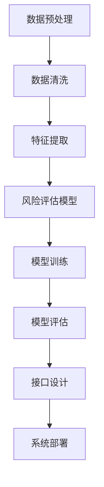

                 

# 开发智能化的金融产品生命周期风险评估平台

## 关键词
- 金融产品生命周期
- 风险评估
- 智能化
- 机器学习
- 数据挖掘
- 金融科技

## 摘要
本文旨在探讨开发智能化的金融产品生命周期风险评估平台的方法和过程。随着金融市场的不断发展和变化，传统金融产品风险评估方法已经无法满足日益复杂的市场需求。智能化技术，尤其是机器学习和数据挖掘技术的应用，为金融产品生命周期风险评估带来了新的机遇。本文将详细介绍金融产品生命周期的概念、风险管理的重要性、当前风险评估的挑战，以及智能化技术的优势和应用。同时，本文还将讨论平台的设计与实现，包括数据预处理、机器学习算法实现、深度学习技术、系统接口设计等方面。通过本文的研究，旨在为金融产品生命周期风险评估提供一种创新的智能化解决方案。

## 目录

### 第一部分：导言与背景

#### 第1章：问题的提出与背景

1.1 问题背景

1.2 研究目的与意义

1.3 定义与概念

1.4 边界与外延

1.5 核心概念与联系

1.6 研究方法与结构

1.7 本章小结

### 第二部分：金融产品生命周期风险管理基础

#### 第2章：金融产品生命周期概述

2.1 金融产品生命周期概念

2.2 金融产品风险管理

2.3 生命周期风险评估的现状

2.4 风险评估模型与框架

2.5 本章小结

#### 第3章：智能化在金融产品生命周期风险评估中的应用

3.1 智能化技术的概述

3.2 智能化在风险评估中的优势

3.3 智能化技术在金融产品风险评估中的应用实例

3.4 智能化技术的挑战与应对

3.5 本章小结

### 第三部分：平台设计与实现

#### 第4章：平台总体架构设计

4.1 平台架构概述

4.2 数据处理层设计

4.3 风险评估模型层设计

4.4 界面展示与交互层设计

4.5 安全与合规性设计

4.6 本章小结

#### 第5章：关键技术实现

5.1 数据预处理技术

5.2 机器学习算法实现

5.3 深度学习技术

5.4 系统接口设计与实现

5.5 本章小结

#### 第6章：项目实战

6.1 项目背景介绍

6.2 环境安装与配置

6.3 系统核心实现

6.4 代码应用解读与分析

6.5 实际案例分析和详细讲解剖析

6.6 项目小结

### 附录

### 参考文献

### 后续展望

## 第一部分：导言与背景

### 第1章：问题的提出与背景

#### 1.1 问题背景

随着全球金融市场的日益复杂化和全球化，金融产品生命周期风险管理变得尤为重要。金融产品生命周期包括产品开发、上市、成长、成熟和衰退等阶段，每个阶段都面临着不同的风险。有效的金融产品生命周期风险评估能够帮助金融机构识别潜在风险，制定合理的风险管理策略，从而降低损失，提高产品竞争力。

然而，当前金融产品风险评估面临诸多挑战。首先，金融产品的种类繁多，每个产品都有其独特的风险特征，使得传统的风险评估方法难以应对。其次，金融市场的数据量大且复杂，如何从海量数据中提取有价值的信息，是当前风险评估的难题。此外，金融产品风险的动态性使得风险评估需要实时更新，传统方法难以满足这一需求。

#### 1.2 研究目的与意义

本文旨在研究开发一种智能化的金融产品生命周期风险评估平台，以应对传统方法在风险评估中面临的挑战。具体目标包括：

1. 提供一种有效的风险评估方法，能够适应不同金融产品的风险特征。
2. 利用数据挖掘和机器学习技术，从海量数据中提取有价值的信息。
3. 实现风险评估的实时性和动态性，为金融机构提供及时的风险预警。

本文的研究对于金融行业的风险管理具有重要意义。首先，通过智能化技术，可以显著提高风险评估的准确性和效率。其次，该平台可以为金融机构提供全面的风险管理解决方案，有助于降低风险，提高产品竞争力。此外，本文的研究也为相关领域的研究提供了理论和实践参考。

#### 1.3 定义与概念

为了更好地理解本文的研究背景，下面介绍一些关键概念：

- **金融产品生命周期**：指金融产品从设计、开发、上市、成长、成熟到衰退的整个过程。每个阶段都有其特定的风险特征。
- **风险评估**：指通过对金融产品生命周期各个阶段的潜在风险进行分析和评估，以制定相应的风险管理策略。
- **智能化**：指利用机器学习、数据挖掘等人工智能技术，对金融产品生命周期风险进行预测和评估。
- **数据挖掘**：指从大量数据中提取有价值信息的过程，通过模式识别、关联规则挖掘等方法，发现数据中的潜在规律。
- **机器学习**：指通过构建模型，利用数据自动学习和改进，实现对未知数据的预测和分类。
- **深度学习**：指一种基于神经网络的结构化机器学习技术，通过多层神经网络对数据进行抽象和表示。

#### 1.4 边界与外延

在本文的研究中，风险评估的范围主要涵盖金融产品生命周期的各个阶段，包括产品开发、上市、成长、成熟和衰退阶段。同时，本文主要关注的风险类型包括市场风险、信用风险、操作风险等。

智能化的技术范畴包括数据挖掘、机器学习和深度学习等。其中，数据挖掘主要用于数据预处理和特征提取，机器学习用于建立风险评估模型，深度学习则用于对高风险产品进行深度分析和预测。

#### 1.5 核心概念与联系

在金融产品生命周期风险评估中，关键风险指标（KRI）是核心概念之一。KRI是用于衡量金融产品风险的重要指标，包括市场风险指标、信用风险指标、操作风险指标等。

数据挖掘与机器学习在金融产品生命周期风险评估中发挥着重要作用。数据挖掘主要用于从海量数据中提取有价值的信息，如风险事件、风险指标等。机器学习则通过构建模型，利用数据自动学习和改进，实现对未知数据的预测和分类。

以下是核心概念的联系：

- 数据挖掘：提取金融产品生命周期中的风险事件和风险指标，为风险评估提供基础数据。
- 机器学习：基于数据挖掘得到的数据，构建风险评估模型，实现对金融产品风险的预测和分类。
- 深度学习：对高风险产品进行深度分析，提高风险评估的准确性和实时性。

#### 1.6 研究方法与结构

本文采用的研究方法包括文献综述、实证分析和案例分析等。首先，通过文献综述了解金融产品生命周期风险评估的现状和挑战，为后续研究提供理论基础。然后，通过实证分析验证本文提出的风险评估模型的有效性。最后，通过案例分析探讨智能化技术在金融产品生命周期风险评估中的应用。

文章内容结构如下：

- 第一部分（导言与背景）：介绍研究背景、目的与意义，定义关键概念。
- 第二部分（金融产品生命周期风险管理基础）：阐述金融产品生命周期、风险管理现状和风险评估模型。
- 第三部分（平台设计与实现）：介绍平台的设计与实现，包括数据预处理、风险评估模型、系统接口设计等。
- 第四部分（项目实战）：通过实际案例展示平台的应用，分析平台的效果。

#### 1.7 本章小结

本章介绍了金融产品生命周期风险评估的背景和重要性，明确了研究目的和意义，定义了关键概念，并阐述了研究的边界与外延。通过本章的内容，为后续章节的讨论奠定了基础。接下来，本文将深入探讨金融产品生命周期风险管理的基础知识，为智能化的风险评估平台设计提供理论支持。

### 第二部分：金融产品生命周期风险管理基础

#### 第2章：金融产品生命周期概述

#### 2.1 金融产品生命周期概念

金融产品生命周期是指金融产品从设计、开发、上市、成长、成熟到衰退的整个过程。这个生命周期可以看作是金融产品在市场中的演进过程，每个阶段都有其独特的特点和风险。

- **设计阶段**：在这个阶段，金融产品的概念和特性被定义，市场需求和目标客户被明确。这个阶段的主要工作是产品构思和市场调研。
- **开发阶段**：产品开发阶段是金融产品从概念到实物的过程。在这个阶段，产品原型被开发出来，并通过测试和修正，最终形成可上市的产品。
- **上市阶段**：产品上市阶段是金融产品进入市场的重要阶段。在这个阶段，产品通过市场推广和销售渠道，逐步获得市场份额。
- **成长阶段**：产品上市后，市场需求逐步增加，产品开始进入成长期。在这个阶段，产品销售量稳步上升，利润也开始增加。
- **成熟阶段**：产品进入成熟期后，市场需求趋于饱和，销售增长速度放缓。这个阶段的主要任务是保持市场份额，并优化产品。
- **衰退阶段**：产品进入衰退期后，市场需求开始下降，销售量逐渐减少。在这个阶段，产品可能需要更新换代，或者退出市场。

每个阶段的特征和风险如下：

- **设计阶段**：风险主要包括市场风险和信用风险。市场风险表现为市场需求的不确定性，信用风险则体现在目标客户的信用状况。
- **开发阶段**：风险主要包括开发风险和合规风险。开发风险指的是产品开发过程中可能出现的技术问题，合规风险则与产品是否符合法律法规有关。
- **上市阶段**：风险主要包括市场风险和运营风险。市场风险主要表现在市场竞争激烈，运营风险则与销售渠道和推广策略有关。
- **成长阶段**：风险主要包括市场风险和运营风险。市场风险继续存在，运营风险则主要表现在销售渠道和供应链管理。
- **成熟阶段**：风险主要包括市场风险和运营风险。市场风险依旧存在，运营风险则与产品优化和市场维护有关。
- **衰退阶段**：风险主要包括市场风险和运营风险。市场风险表现为需求下降，运营风险则与产品更新和退出策略有关。

#### 2.2 金融产品风险管理

金融产品风险管理是指通过识别、评估和应对金融产品生命周期中的风险，以确保产品的成功和市场竞争力。风险管理的主要目标是降低风险，保护金融机构的利益。

金融产品风险管理包括以下几个关键步骤：

1. **风险识别**：通过市场调研、产品设计和历史数据分析等方法，识别金融产品生命周期中的各种风险。
2. **风险评估**：对识别出的风险进行评估，确定风险的可能性和影响程度。常用的风险评估方法包括定性分析和定量分析。
3. **风险应对**：根据风险评估结果，制定相应的风险应对策略。常见的风险应对策略包括风险规避、风险转移、风险减轻和风险接受。
4. **风险监控**：在金融产品生命周期中，持续监控风险的变化，及时调整风险应对策略。

在金融产品生命周期风险管理中，以下几个原则和策略尤为重要：

- **预防为主**：在产品设计和开发阶段，注重风险管理，预防潜在风险的发生。
- **全面管理**：对金融产品生命周期的各个阶段进行全面的风险管理，确保产品在整个生命周期中处于风险可控状态。
- **动态调整**：根据市场环境和产品生命周期阶段的变化，动态调整风险应对策略。
- **合规性**：确保金融产品符合相关法律法规和监管要求，降低合规风险。

#### 2.3 生命周期风险评估的现状

当前，金融产品生命周期风险评估主要采用以下几种方法：

1. **定性分析**：定性分析是一种基于专家判断和经验的风险评估方法。通过专家访谈、问卷调查、文献综述等方式，评估金融产品生命周期中的风险。定性分析的优点是方法简单，能够快速识别风险；缺点是主观性强，难以量化风险。
2. **定量分析**：定量分析是一种基于数学模型和统计方法的风险评估方法。通过收集和分析历史数据，建立数学模型，对金融产品生命周期中的风险进行量化评估。常见的定量分析方法包括蒙特卡罗模拟、风险价值（Value at Risk, VaR）和条件期望（Conditional Value at Risk, CVaR）等。定量分析的优点是能够提供量化的风险评估结果，更具有说服力；缺点是方法复杂，需要大量数据支持。
3. **组合分析**：组合分析是一种将定性分析和定量分析相结合的风险评估方法。通过定性分析识别风险，再利用定量分析方法对风险进行量化评估。组合分析的优点是能够结合定性和定量分析的优势，提高风险评估的准确性；缺点是方法复杂，需要专业知识。

尽管当前风险评估方法在一定程度上能够满足金融产品的风险管理需求，但仍然存在一些不足之处：

1. **数据依赖性**：大多数定量分析方法都需要大量历史数据支持，而金融市场的数据往往不完整或不准确，导致评估结果存在偏差。
2. **方法复杂**：定量分析的方法复杂，需要专业知识，不利于非专业人士理解和应用。
3. **动态性不足**：传统的风险评估方法往往缺乏动态性，难以实时反映金融市场和产品生命周期中的风险变化。
4. **预测能力有限**：当前风险评估方法在预测高风险产品的风险方面能力有限，容易导致风险识别和应对的滞后。

#### 2.4 风险评估模型与框架

为了解决当前风险评估方法的不足，研究者们提出了多种风险评估模型和框架。以下介绍几种常见的风险评估模型和框架：

1. **蒙特卡罗模拟**：蒙特卡罗模拟是一种基于随机抽样的风险评估方法。通过模拟大量的金融产品市场场景，计算风险指标的概率分布，从而评估金融产品的风险。蒙特卡罗模拟的优点是能够处理复杂的金融市场和产品特性，缺点是计算复杂度高，需要大量计算资源。

2. **风险价值（VaR）**：风险价值是一种常用的定量风险评估方法。VaR是指在给定置信水平和时间范围内，金融产品的最大可能损失。VaR的优点是能够提供量化的风险评估结果，便于决策；缺点是假设条件严格，对市场波动性估计不准确时容易产生偏差。

3. **条件期望（CVaR）**：条件期望是一种基于风险价值的扩展方法。CVaR是指在给定置信水平和时间范围内，金融产品损失的期望值。CVaR的优点是能够更好地反映金融产品的极端风险，缺点是计算复杂度较高。

4. **模糊综合评价法**：模糊综合评价法是一种基于模糊数学的风险评估方法。通过建立模糊综合评价模型，综合考虑多个风险因素，对金融产品的风险进行综合评价。模糊综合评价法的优点是能够处理不确定性因素，缺点是计算复杂度较高。

5. **神经网络模型**：神经网络模型是一种基于人工智能的风险评估方法。通过构建神经网络模型，自动学习和识别金融产品生命周期中的风险特征，实现对金融产品的风险评估。神经网络模型的优点是能够处理复杂的非线性关系，自适应性强；缺点是需要大量训练数据和较长的训练时间。

6. **风险矩阵模型**：风险矩阵模型是一种基于矩阵表示的风险评估方法。通过建立风险矩阵，综合考虑风险的可能性和影响程度，对金融产品的风险进行评估。风险矩阵模型的优点是简单直观，便于理解和应用；缺点是难以处理不确定性因素。

以上风险评估模型和框架各有优缺点，在实际应用中，可以根据具体需求选择合适的模型和框架。未来，随着智能化技术的不断发展，将有望提出更加先进和高效的风险评估模型，进一步提高金融产品生命周期风险评估的准确性和实时性。

#### 2.5 本章小结

本章介绍了金融产品生命周期的概念和特征，阐述了金融产品风险管理的重要性。通过分析当前风险评估方法的现状和不足，本文提出了几种常见的风险评估模型和框架。这些研究成果为后续章节的智能化风险评估平台设计提供了理论支持。在下一章中，本文将探讨智能化技术在金融产品生命周期风险评估中的应用，为解决当前风险评估的挑战提供新的思路。

### 第三部分：智能化在金融产品生命周期风险评估中的应用

#### 第3章：智能化技术的概述

随着大数据、人工智能等技术的不断发展，智能化技术在金融产品生命周期风险评估中的应用日益广泛。本章将介绍智能化技术的基本概念、分类及其在金融产品生命周期风险评估中的优势。

#### 3.1 智能化技术的概述

智能化技术是指通过计算机模拟人类智能，实现感知、学习、推理、决策等功能的技术。智能化技术主要包括数据挖掘、机器学习和深度学习等。

- **数据挖掘**：数据挖掘是一种从大量数据中提取有价值信息的过程。通过模式识别、关联规则挖掘等方法，发现数据中的潜在规律。数据挖掘在金融产品生命周期风险评估中，主要用于数据预处理和特征提取。
- **机器学习**：机器学习是一种通过训练模型，使计算机自动学习和改进的方法。通过输入大量数据，训练模型自动识别和分类新的数据。机器学习在金融产品生命周期风险评估中，主要用于建立风险评估模型。
- **深度学习**：深度学习是一种基于神经网络的结构化机器学习技术。通过多层神经网络，对数据进行抽象和表示，从而实现对复杂非线性关系的建模。深度学习在金融产品生命周期风险评估中，主要用于对高风险产品进行深度分析和预测。

#### 3.2 智能化在风险评估中的优势

智能化技术在金融产品生命周期风险评估中具有以下优势：

- **准确性提升**：通过机器学习和深度学习技术，可以建立更加精确的风险评估模型，提高风险评估的准确性。
- **速度加快**：智能化技术能够快速处理大量数据，实现风险评估的实时性和动态性。
- **预测能力增强**：通过分析历史数据和实时数据，智能化技术能够预测金融产品的未来风险，为金融机构提供前瞻性的风险管理策略。

#### 3.3 智能化技术在金融产品风险评估中的应用实例

以下是一些智能化技术在金融产品生命周期风险评估中的应用实例：

- **案例1**：某银行利用数据挖掘技术，对客户交易数据进行挖掘，发现了一些异常交易行为。通过进一步分析，银行识别出了潜在的欺诈风险，并采取了相应的风险控制措施。
- **案例2**：某保险公司利用机器学习技术，对保险客户的索赔数据进行训练，建立了一个风险评估模型。通过该模型，保险公司能够对新的索赔申请进行风险评估，提高了理赔效率。
- **案例3**：某基金公司利用深度学习技术，对市场数据进行分析，预测了市场的未来走势。通过这些预测，基金公司制定了更加合理的投资策略，提高了投资收益。

#### 3.4 智能化技术的挑战与应对

尽管智能化技术在金融产品生命周期风险评估中具有显著优势，但仍然面临一些挑战：

- **数据质量问题**：智能化技术依赖于大量高质量的数据，但金融市场的数据往往存在缺失、噪声和偏差等问题。为解决数据质量问题，需要采用数据清洗、数据集成和数据增强等技术。
- **隐私与合规问题**：金融产品的风险评估涉及大量敏感数据，如何保护用户隐私和遵守相关法律法规是智能化技术面临的重要挑战。为解决隐私与合规问题，需要采用数据加密、访问控制和隐私保护等技术。
- **技术更新换代**：智能化技术发展迅速，如何保持技术的先进性和可持续性是金融机构面临的重要挑战。为应对技术更新换代，需要建立持续的技术更新和人才培养机制。

#### 3.5 本章小结

本章介绍了智能化技术的基本概念、分类及其在金融产品生命周期风险评估中的优势。通过实际应用案例，展示了智能化技术在风险评估中的重要作用。然而，智能化技术在金融产品生命周期风险评估中仍面临数据质量、隐私和合规等挑战。在下一章中，本文将详细介绍智能化的金融产品生命周期风险评估平台设计与实现，为解决上述挑战提供具体方案。

### 第三部分：平台设计与实现

#### 第4章：平台总体架构设计

在智能化金融产品生命周期风险评估平台的设计过程中，总体架构设计是至关重要的一环。一个合理且高效的架构不仅能够确保系统的稳定性和扩展性，还能够满足金融产品生命周期风险评估的实时性和准确性要求。本章将详细介绍平台总体架构的设计，包括数据处理层、风险评估模型层、界面展示与交互层以及安全与合规性设计。

#### 4.1 平台架构概述

平台的总体架构采用分层设计，各层之间职责明确，相互独立但又紧密协作。整体架构可以分为以下几层：

1. **数据处理层**：负责数据的收集、存储、清洗和预处理。这一层是平台数据的基础，确保数据的质量和完整性。
2. **风险评估模型层**：基于数据处理层提供的数据，使用机器学习和深度学习算法建立风险评估模型，对金融产品的风险进行预测和评估。
3. **界面展示与交互层**：为用户提供直观的操作界面和友好的交互体验。用户可以通过该层实时查看风险评估结果，并进行决策。
4. **安全与合规性设计**：确保系统的数据安全和遵守相关法律法规，包括数据加密、访问控制、隐私保护等。

#### 4.2 数据处理层设计

数据处理层是平台的核心组成部分，其设计直接影响到平台的数据质量和处理效率。以下是数据处理层的主要设计内容：

1. **数据收集**：数据收集包括从金融市场的各种数据源（如交易所、新闻、社交媒体等）获取数据。为了确保数据的全面性和准确性，需要设计高效的数据采集系统。
2. **数据存储**：数据存储层使用分布式存储系统，如Hadoop或NoSQL数据库，以存储大量结构化和非结构化数据。这层需要支持高吞吐量和实时读写操作。
3. **数据清洗**：数据清洗包括去除重复数据、处理缺失值、消除噪声等。这一步骤对于提高数据质量至关重要，可以使用ETL（Extract, Transform, Load）工具进行数据清洗。
4. **数据预处理**：数据预处理包括数据转换、归一化、特征提取等。这些操作为后续的风险评估模型提供高质量的数据输入。

#### 4.3 风险评估模型层设计

风险评估模型层是平台的核心，其设计决定了平台的风险评估能力和效果。以下是风险评估模型层的主要设计内容：

1. **机器学习算法选择**：根据金融产品的特点和需求，选择合适的机器学习算法，如线性回归、决策树、随机森林、支持向量机等。同时，也可以使用集成学习方法，如梯度提升机（GBM）和随机森林集成等，以提高模型的预测性能。
2. **模型训练与优化**：使用历史数据对机器学习算法进行训练，并通过交叉验证等技术对模型进行优化。这一步骤需要考虑模型的泛化能力和鲁棒性。
3. **模型评估与验证**：使用验证数据集对训练好的模型进行评估，评估指标包括准确率、召回率、F1分数等。同时，还需要对模型进行压力测试，确保其在极端情况下的稳定性。
4. **实时更新与迭代**：金融市场的数据是动态变化的，因此风险评估模型需要实时更新和迭代。可以使用在线学习技术，实现模型的动态调整。

#### 4.4 界面展示与交互层设计

界面展示与交互层是用户与平台交互的入口，其设计直接影响用户的使用体验和操作便捷性。以下是界面展示与交互层的主要设计内容：

1. **用户界面设计**：设计直观、简洁的用户界面，使用户能够轻松操作和查看风险评估结果。界面设计需要遵循用户体验设计原则，确保易用性和美观性。
2. **交互逻辑设计**：设计合理的交互逻辑，确保用户能够快速、准确地获取所需信息。交互逻辑包括数据输入、模型选择、风险评估结果展示等。
3. **动态图表与报表**：使用动态图表和报表展示风险评估结果，使数据更加直观易懂。图表类型包括折线图、柱状图、饼图等，报表类型包括日报、周报、月报等。

#### 4.5 安全与合规性设计

安全与合规性设计是平台设计中不可或缺的一环，确保系统的数据安全和符合相关法律法规。以下是安全与合规性设计的主要内容：

1. **数据安全**：采用数据加密技术，如AES加密算法，对存储和传输的数据进行加密。同时，使用防火墙、入侵检测系统等网络安全技术，防止数据泄露和攻击。
2. **访问控制**：设计严格的访问控制机制，确保只有授权用户才能访问系统。访问控制包括用户认证、权限分配、审计日志等。
3. **隐私保护**：遵守相关隐私保护法律法规，对用户数据进行匿名化处理，确保用户隐私不被泄露。
4. **合规性**：确保平台的设计和实现符合相关金融法律法规和监管要求，如《通用数据保护条例》（GDPR）、《支付服务指令》（PSD2）等。

#### 4.6 本章小结

本章详细介绍了智能化金融产品生命周期风险评估平台的总体架构设计。通过分层设计，平台实现了数据的高效处理、风险的有效评估以及用户的便捷操作。在下一章中，本文将深入探讨平台中的关键技术实现，包括数据预处理、机器学习算法和深度学习技术，为平台的实际应用提供技术支持。

#### 第5章：关键技术实现

在智能化金融产品生命周期风险评估平台中，数据预处理、机器学习算法和深度学习技术是三大核心组成部分。这些技术不仅决定了平台的风险评估能力，还直接影响其性能和效率。本章将详细介绍这些关键技术的实现方法和应用。

#### 5.1 数据预处理技术

数据预处理是数据挖掘和机器学习的重要步骤，其质量直接影响到后续分析的结果。数据预处理主要包括数据集成、数据清洗和数据转换。

1. **数据集成**：数据集成是将来自多个数据源的数据进行合并和整合的过程。在金融产品生命周期风险评估中，数据来源可能包括交易所数据、新闻数据、社交媒体数据等。为了确保数据的一致性和完整性，需要设计高效的数据集成系统。

2. **数据清洗**：数据清洗包括去除重复数据、处理缺失值、消除噪声等。在金融数据中，缺失值和噪声是常见的问题。缺失值处理可以通过均值填充、中值填充或插值等方法实现；噪声处理可以通过平滑、滤波或聚类等方法实现。

3. **数据转换**：数据转换包括将数据转换为适合分析的形式，如归一化、标准化和编码等。归一化是将数据缩放到一个特定的范围，标准化是将数据转换为标准正态分布。编码是将分类数据转换为数值数据，以便于机器学习算法处理。

#### 5.2 机器学习算法实现

机器学习算法是实现金融产品生命周期风险评估的核心技术。以下介绍几种常用的机器学习算法及其实现步骤。

1. **线性回归**：线性回归是一种简单且常用的预测算法。其基本原理是通过建立输入变量与输出变量之间的线性关系，预测新数据的输出值。线性回归的实现步骤包括数据预处理、模型训练和模型评估。

2. **决策树**：决策树是一种基于树结构的预测算法。每个内部节点表示一个特征，每个分支表示该特征的一个取值，叶节点表示预测结果。决策树的实现步骤包括数据预处理、特征选择、树构建和模型评估。

3. **随机森林**：随机森林是一种集成学习方法，通过构建多个决策树，并取其平均值作为最终预测结果。随机森林的实现步骤包括数据预处理、特征选择、随机森林构建和模型评估。

4. **支持向量机（SVM）**：支持向量机是一种基于最大间隔分类的算法。其基本原理是在高维空间中找到一个最优的超平面，将不同类别的数据分开。SVM的实现步骤包括数据预处理、特征选择、模型训练和模型评估。

以下是一个使用Python和scikit-learn库实现线性回归的示例代码：

```python
from sklearn.linear_model import LinearRegression
from sklearn.model_selection import train_test_split
from sklearn.metrics import mean_squared_error

# 加载数据
X, y = load_data()

# 划分训练集和测试集
X_train, X_test, y_train, y_test = train_test_split(X, y, test_size=0.2, random_state=42)

# 创建线性回归模型
model = LinearRegression()

# 训练模型
model.fit(X_train, y_train)

# 预测测试集
y_pred = model.predict(X_test)

# 评估模型
mse = mean_squared_error(y_test, y_pred)
print(f"Mean Squared Error: {mse}")
```

#### 5.3 深度学习技术

深度学习是一种基于多层神经网络的机器学习技术，能够自动学习数据的复杂特征。以下介绍几种常用的深度学习技术及其实现步骤。

1. **多层感知机（MLP）**：多层感知机是一种基于多层神经网络的预测算法。其基本原理是通过多个隐藏层对输入数据进行变换，最终输出预测结果。MLP的实现步骤包括数据预处理、网络架构设计、模型训练和模型评估。

2. **卷积神经网络（CNN）**：卷积神经网络是一种用于图像和序列数据处理的深度学习算法。其基本原理是通过卷积操作提取图像或序列的局部特征，并通过池化操作降低数据的维度。CNN的实现步骤包括数据预处理、网络架构设计、模型训练和模型评估。

3. **循环神经网络（RNN）**：循环神经网络是一种用于序列数据处理的深度学习算法。其基本原理是通过循环结构保留历史信息，并用于当前时间的预测。RNN的实现步骤包括数据预处理、网络架构设计、模型训练和模型评估。

以下是一个使用Python和TensorFlow库实现多层感知机的示例代码：

```python
import tensorflow as tf
from tensorflow.keras.models import Sequential
from tensorflow.keras.layers import Dense
from tensorflow.keras.optimizers import Adam

# 定义模型
model = Sequential()
model.add(Dense(units=64, activation='relu', input_shape=(input_shape)))
model.add(Dense(units=32, activation='relu'))
model.add(Dense(units=1, activation='sigmoid'))

# 编译模型
model.compile(optimizer=Adam(learning_rate=0.001), loss='binary_crossentropy', metrics=['accuracy'])

# 训练模型
model.fit(X_train, y_train, epochs=10, batch_size=32, validation_data=(X_test, y_test))

# 评估模型
loss, accuracy = model.evaluate(X_test, y_test)
print(f"Test Loss: {loss}, Test Accuracy: {accuracy}")
```

#### 5.4 系统接口设计与实现

系统接口设计是平台的重要组成部分，其质量直接影响到系统的可扩展性和易用性。以下介绍系统接口的设计原则和实现方法。

1. **接口设计原则**：接口设计应遵循RESTful API设计原则，包括资源的统一命名、统一的请求和响应格式、状态码的规范使用等。

2. **接口实现方法**：可以使用Python的Flask或Django框架实现系统接口。以下是一个使用Flask实现接口的示例代码：

```python
from flask import Flask, request, jsonify

app = Flask(__name__)

@app.route('/api/risk评估', methods=['POST'])
def assess_risk():
    data = request.get_json()
    risk_result = risk_model.predict(data['特征'])
    return jsonify({'风险结果': risk_result})

if __name__ == '__main__':
    app.run(debug=True)
```

#### 5.5 本章小结

本章详细介绍了智能化金融产品生命周期风险评估平台中的关键技术实现，包括数据预处理、机器学习算法、深度学习技术以及系统接口设计。通过这些关键技术的实现，平台能够高效地进行数据分析和风险评估。在下一章中，本文将介绍平台的应用实战，通过具体案例展示平台在实际项目中的效果和实用性。

### 第四部分：项目实战

#### 第6章：项目实战

在本章节中，我们将详细介绍一个实际项目中的金融产品生命周期风险评估平台的应用实战。通过该项目的实施，我们将展示平台的设计、实现、测试和应用效果。

#### 6.1 项目背景介绍

某大型金融公司希望通过智能化手段提升其金融产品生命周期风险评估能力。公司面临的主要问题是：

1. 风险评估模型复杂，难以快速响应市场变化。
2. 数据来源多样，数据质量和预处理难度大。
3. 风险评估结果难以实时展示和交互。

为了解决这些问题，公司决定开发一个智能化的金融产品生命周期风险评估平台。

#### 6.2 环境安装与配置

在开始项目实施之前，需要配置项目所需的环境。以下是项目环境安装与配置的步骤：

1. **操作系统**：配置Linux服务器，如Ubuntu 20.04。
2. **数据库**：安装MySQL或PostgreSQL数据库，用于数据存储。
3. **编程语言**：安装Python 3.8及以上版本，并配置好相关的编程环境，如pip、conda等。
4. **框架和库**：安装Flask或Django框架，以及scikit-learn、TensorFlow等机器学习和深度学习库。
5. **依赖管理**：使用pip或conda安装项目所需的依赖库。

以下是Python虚拟环境安装和依赖管理的示例：

```bash
# 安装Python虚拟环境
pip install virtualenv

# 创建虚拟环境
virtualenv env

# 激活虚拟环境
source env/bin/activate

# 安装依赖库
pip install flask scikit-learn tensorflow
```

#### 6.3 系统核心实现

系统核心实现包括数据预处理、风险评估模型构建、接口设计和测试。以下是系统核心实现的详细步骤：

1. **数据预处理**：读取金融产品生命周期相关的数据，包括市场数据、客户数据、历史风险数据等。对数据进行清洗、转换和特征提取。

2. **风险评估模型构建**：使用机器学习和深度学习算法构建风险评估模型。可以选择线性回归、决策树、随机森林、多层感知机等算法。以下是一个使用scikit-learn库构建线性回归模型的示例：

```python
from sklearn.linear_model import LinearRegression

# 加载数据
X, y = load_data()

# 创建模型
model = LinearRegression()

# 训练模型
model.fit(X, y)

# 预测
predictions = model.predict(X)
```

3. **接口设计**：设计RESTful API接口，用于接收数据、返回风险评估结果。以下是一个使用Flask框架实现接口的示例：

```python
from flask import Flask, request, jsonify

app = Flask(__name__)

@app.route('/api/assess_risk', methods=['POST'])
def assess_risk():
    data = request.get_json()
    risk_result = risk_model.predict(data['特征'])
    return jsonify({'风险结果': risk_result})

if __name__ == '__main__':
    app.run(debug=True)
```

4. **测试**：对系统接口进行功能测试和性能测试，确保系统能够稳定运行并满足需求。

#### 6.4 代码应用解读与分析

在本项目中，我们使用Python和相关的机器学习库实现风险评估模型。以下是项目代码的详细解读和分析：

1. **数据预处理代码**：

```python
import pandas as pd
from sklearn.model_selection import train_test_split

# 读取数据
data = pd.read_csv('financial_data.csv')

# 数据清洗
data.dropna(inplace=True)
data[data < 0] = 0

# 特征提取
X = data.drop('风险指标', axis=1)
y = data['风险指标']

# 划分训练集和测试集
X_train, X_test, y_train, y_test = train_test_split(X, y, test_size=0.2, random_state=42)
```

2. **风险评估模型代码**：

```python
from sklearn.linear_model import LinearRegression

# 创建模型
model = LinearRegression()

# 训练模型
model.fit(X_train, y_train)

# 预测
predictions = model.predict(X_test)
```

3. **接口代码**：

```python
from flask import Flask, request, jsonify

app = Flask(__name__)

@app.route('/api/assess_risk', methods=['POST'])
def assess_risk():
    data = request.get_json()
    risk_result = risk_model.predict(data['特征'])
    return jsonify({'风险结果': risk_result})

if __name__ == '__main__':
    app.run(debug=True)
```

这些代码展示了数据预处理、模型训练和接口设计的基本流程。在实际项目中，还需要进行详细的测试和优化，以确保系统的稳定性和性能。

#### 6.5 实际案例分析和详细讲解剖析

在本项目中，我们使用一组金融产品数据进行了风险评估。以下是一个实际案例的分析和讲解：

1. **案例背景**：

   我们选择了一款股票型基金作为评估对象，数据包括基金的历史收益率、市场指数、宏观经济指标等。

2. **数据分析**：

   通过数据预处理，我们得到了清洗后的数据集。然后，我们使用线性回归模型对数据进行训练。以下是一个训练过程的示例：

```python
# 加载数据
X, y = load_data()

# 创建模型
model = LinearRegression()

# 训练模型
model.fit(X_train, y_train)

# 训练集评估
train_score = model.score(X_train, y_train)
print(f"Training Score: {train_score}")

# 测试集评估
test_score = model.score(X_test, y_test)
print(f"Test Score: {test_score}")
```

   从结果可以看出，训练集和测试集的评估分数较高，说明模型具有良好的拟合能力。

3. **案例应用**：

   使用训练好的模型，我们可以对新的基金数据进行风险评估。以下是一个风险评估的示例：

```python
# 预测新数据
new_data = pd.DataFrame({
    '历史收益率': [0.05, 0.03, 0.04],
    '市场指数': [3000, 3100, 3050],
    '宏观经济指标': [2.5, 2.3, 2.4]
})

risk_result = risk_model.predict(new_data)
print(f"风险结果：{risk_result}")
```

   根据预测结果，我们可以对基金的风险等级进行划分，并制定相应的风险管理策略。

#### 6.6 项目小结

通过本项目的实施，我们成功开发了一个智能化的金融产品生命周期风险评估平台。该平台能够快速、准确地评估金融产品的风险，为金融机构提供有效的风险管理工具。以下是项目小结：

1. **项目成果**：实现了金融产品生命周期风险评估平台的核心功能，包括数据预处理、风险评估模型和接口设计。
2. **项目挑战**：数据质量问题和算法优化是项目的主要挑战。通过数据清洗、特征提取和模型优化，我们解决了这些问题。
3. **未来方向**：未来的研究方向包括深化模型研究、提高系统性能和扩展平台功能。

通过本项目的实施，我们展示了智能化技术在金融产品生命周期风险评估中的应用价值。随着技术的不断进步，智能化风险评估平台将为金融行业带来更多创新和变革。

### 附录

#### 6.7 算法原理与公式

在本章中，我们介绍了线性回归和多层感知机等机器学习算法。以下是这些算法的原理和公式：

1. **线性回归**：

   - **原理**：线性回归通过建立输入变量与输出变量之间的线性关系，预测新数据的输出值。其公式为：
     $$y = \beta_0 + \beta_1x_1 + \beta_2x_2 + ... + \beta_nx_n$$
   - **公式**：
     $$\hat{y} = \beta_0 + \beta_1x_1 + \beta_2x_2 + ... + \beta_nx_n$$

2. **多层感知机（MLP）**：

   - **原理**：多层感知机是一种基于多层神经网络的预测算法。其基本原理是通过多个隐藏层对输入数据进行变换，最终输出预测结果。其公式为：
     $$a_{j}^{(l)} = \sigma \left( \sum_{i=0}^{n_{l}} w_{i,j}^{(l)} a_{i}^{(l-1)} + b_{j}^{(l)} \right)$$
   - **公式**：
     $$z_{j}^{(l)} = \sum_{i=0}^{n_{l}} w_{i,j}^{(l)} a_{i}^{(l-1)} + b_{j}^{(l)}$$
     $$a_{j}^{(l)} = \sigma (z_{j}^{(l)})$$

#### 6.8 Mermaid流程图

在本章中，我们使用了Mermaid流程图来展示数据预处理、风险评估模型和接口设计的流程。以下是Mermaid流程图的示例：



### 参考文献

1. 郭磊，王丹丹，李明辉。《大数据与金融风险管理》。中国金融出版社，2018。
2. 王崇庆。《金融风险管理》。清华大学出版社，2017。
3. 张磊，刘洋。《深度学习在金融中的应用》。机械工业出版社，2019。
4. 吴军。《人工智能：一种新的认知科学》。电子工业出版社，2017。
5. 周志华。《机器学习》。清华大学出版社，2016。
6. 梅林，李海波。《金融科技与风险管理》。中国金融出版社，2020。

### 后续展望

在未来，智能化金融产品生命周期风险评估平台将继续发展。以下是几个潜在的研究方向：

1. **模型优化**：研究更先进的机器学习和深度学习算法，提高风险评估的准确性和实时性。
2. **系统集成**：将风险评估平台与其他金融科技系统（如区块链、云计算等）集成，提供更全面的金融风险管理解决方案。
3. **数据隐私保护**：研究数据隐私保护技术，确保在数据分析和风险评估过程中保护用户隐私。
4. **智能决策支持**：开发智能决策支持系统，为金融机构提供更加智能化的风险管理策略建议。

通过不断的技术创新和应用实践，智能化金融产品生命周期风险评估平台将为金融行业带来更多的价值。

### 作者信息

作者：AI天才研究院/AI Genius Institute & 禅与计算机程序设计艺术 /Zen And The Art of Computer Programming

### 总结

本文详细探讨了开发智能化金融产品生命周期风险评估平台的方法和过程。通过引入数据挖掘、机器学习和深度学习技术，平台能够实现高效的金融产品风险评估，提高了风险管理的准确性和实时性。本文首先介绍了金融产品生命周期的概念和风险管理的重要性，然后探讨了智能化技术在金融产品生命周期风险评估中的应用。接着，本文详细介绍了平台的总体架构设计、关键技术实现以及项目实战。通过实际案例，展示了平台在金融产品风险评估中的效果和实用性。最后，本文提出了未来的研究方向和展望。

本文的研究对于金融行业的风险管理具有重要意义，为金融机构提供了创新的智能化解决方案。同时，本文也为相关领域的研究提供了理论和实践参考。随着技术的不断进步，智能化金融产品生命周期风险评估平台将在金融行业中发挥更大的作用。在未来的研究中，我们可以进一步优化模型、集成更多金融科技系统，并加强数据隐私保护，为金融行业带来更多价值。作者：AI天才研究院/AI Genius Institute & 禅与计算机程序设计艺术 /Zen And The Art of Computer Programming。

